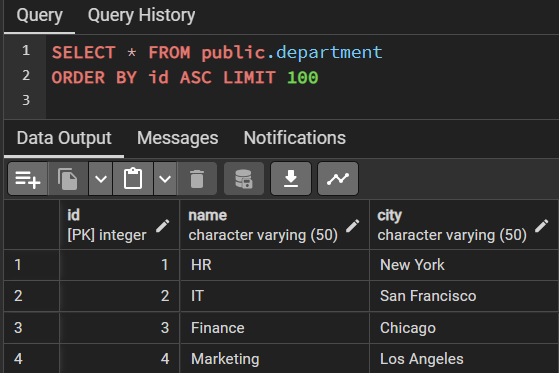
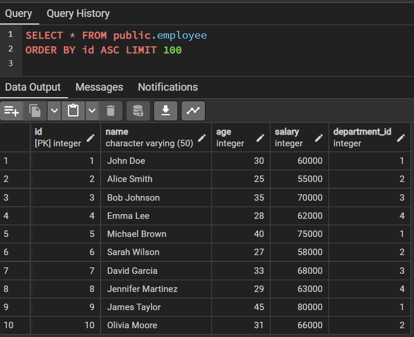
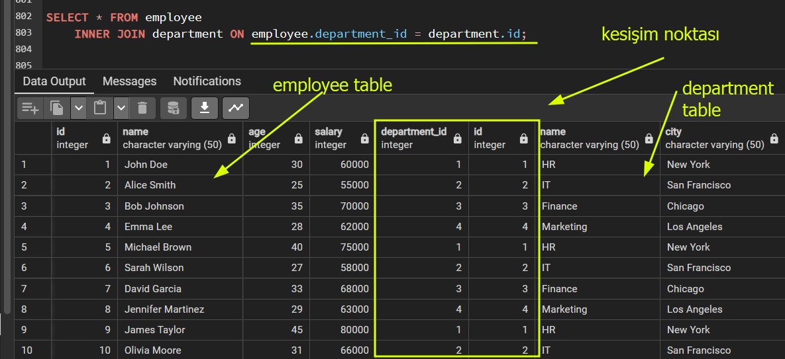
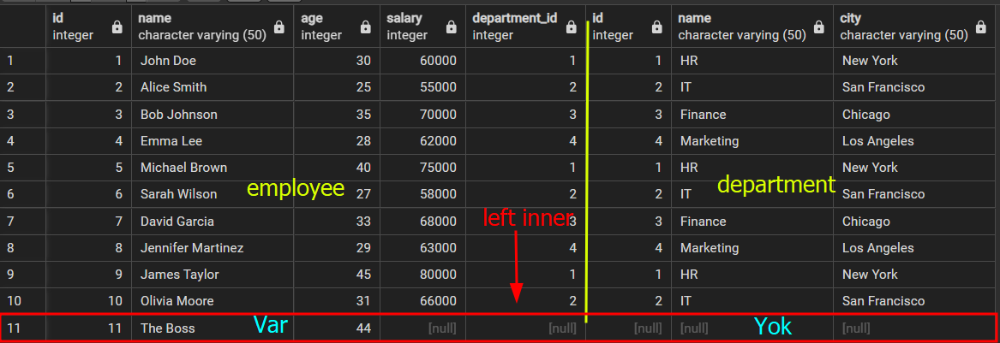

#database 
> [!INFO] Bilgi
> - 2 tane mevcut tablomuz ve department_id ile FOREIGN KEY bağlantısı var.
> - employee tablosundaki department_id kolonu ve department tablosundaki id ile FOREIGN KEY bağlantısı mevcuttur.
> - JOIN işlemlerinde bağlam noktası FOREIGN KEY olmaktadır.

### INNER JOIN

>[!TIP] İpucu
>`INNER JOIN` ile `JOIN` aynı şekilde çalışır. Eğer `INNER JOIN` yerine sadece `JOIN` da yazarsanız, herhangi bir uyarı vermeyecektir.






###### Örnek: 1
```sql
SELECT * FROM employee
	INNER JOIN department ON employee.department_id = department.id;
```



> **Explanation:**
> employee tablosu ile depatment tablosunun kesişim noktasını ekran basar. employee'ın department_id ile department'ın id ile kesişmektedir.

---
###### Örnek 2:
```sql
SELECT department.name, SUM(employee.salary) FROM department
	JOIN employee ON employee.department_id = department.id
	GROUP BY department.name;
```

>**Explanation:**
>department ile employee tablolarını department_id ile kesiştirdik ve department.name ile gruplayıp, SUM fonksiyonu ile aynı grup da olanları topladık.

> [!CAUTION] Dikkat:
> JOIN varsayılan işlemi INNER JOIN'dir.

### LEFT JOIN
>[!TIP] İpucu
> `LEFT JOIN` ile `LEFT OUTER JOIN` aynıdır. Aynı görevi yapar.

###### Örnek 3:
```sql
SELECT * FROM employee
	LEFT JOIN department ON employee.department_id = department.id;
```
> **Expalanation:**
> employee ve department tablolarının kesiştiği department_id noktada employee tablosunda mevcut olan verileri de gösterecektir.



###### Örnek 4: 
```sql
SELECT employee."name" as emp_name, department."name" as dept_name 
FROM employee
	LEFT JOIN department ON employee.department_id = department.id
```
> **Explanation:**
> Yukarıdaki sorgudan farkı burada tüm kolon yerine employee tablosunu name ve department tabalosunun name aldık. Ayrıca AS anahtar kelimesi ile kolonları yeniden isimlendirdik.

---
###### Örnek 5:
```sql
SELECT department."name"
FROM department
	LEFT JOIN employee ON employee.department_id = department.id
	WHERE employee.id IS NULL;
```
> **Explanation:**
> + LEFT JOIN uyguluyoruz ve employee tarafında NULL olan değerleri süzüyoruz(WHERE).

###### Örnek 6:
```sql
SELECT employee."name"
FROM employee
	LEFT JOIN department ON department.id = employee.department_id
	WHERE department.city IS NULL;
```
> **Explanation:**
> + LEFT JOIN uyguluyoruz ve department tarafında NULL olan değeri süzüyoruz (WHERE).

---
### RIGHT JOIN
>[!TIP] İpucu
> `RIGHT JOIN` ile `RIGHT OUTER JOIN` aynıdır. Aynı görevi yapar.
###### Örnek 7:
```sql
SELECT employee."name" as emp_name, department."name" as dept_name
FROM employee
	RIGHT JOIN department ON employee.department_id = department.id;
```
> **Explanation:**
> [[Tablo Birleştirme - JOIN#Örnek 4|Örnek 4]] tam tersi yani Örnek 4 de employee tarafını verirken buradakinde department tarafı tam olarak gelecektir

###### Örnek 8:
```sql
SELECT employee."name" as emp_name, department."name" as dept_name
FROM department
	LEFT JOIN employee ON employee.department_id = department.id;
```
> **Explanation:**
> [[Tablo Birleştirme - JOIN#Örnek 7|Örnek 7]] aynıdır. Lütfen tabloları inceleyiniz.
>  Video: [Arin Yazilim](https://www.youtube.com/watch?v=1jtaPtkSZlM)

###### Örnek 9:
```sql
SELECT employee."name" as emp_name, department."name" as dept_name
FROM department
	RIGHT JOIN employee ON department.id = employee.department_id
	WHERE department.id IS NULL;
```
> **Explanation:**
> RIGHT JOIN uyguluyoruz ve department tarafında NULL olan değerleri süzüyoruz.

### FULL JOIN
>[!INFO] Bilgi:
>FULL JOIN hem employee tablosundan hem de department tablosundan verileri getirecektir.

>[!TIP] İpucu
> `FULL JOIN` ile `FULL OUTER JOIN` aynıdır. Aynı görevi yapar.

###### Örnek 10:
```sql
SELECT * FROM department
	FULL JOIN employee ON employee.department_id = department.id;
```
> **Explanation:**
> Bilgi kutusunda da açıklandığı gibi her iki tablodan bilgiler ekran basılacaktır.

```sql
SELECT employee."name" AS emp_name, department."name" AS depart_name
FROM department
	FULL JOIN employee ON employee.department_id = department.id;

```
> **Explanation:**
> Yukarıdakinin aynısı ama AS anahtarı kullanarak tabloların name'ları basılıyor.

---
###### Örnek 11:
```sql
SELECT employee."name" AS emp_name, department."name" AS depart_name
FROM employee
	FULL JOIN department ON employee.department_id = department.id;
```

```sql
SELECT employee."name" AS emp_name, department."name" AS depart_name
FROM employee
	FULL JOIN department ON employee.department_id = department.id;
```
> **Explanation:**
> Aynı `INNER JOIN` de olduğu gibi aynı sonucu verecektir. Lütfen yukarıdaki her iki komut inceleyiniz.

---

### CROSS JOIN
>[!INFO] Bilgi:
> Tüm eşleşmeleri birbirine dağıtacaktır

```sql
SELECT * FROM department
	CROSS JOIN employee;
```
> **Explanation:**
> employee tablosunun department tablosunda gruplanmasına bağlı olarak, her birini dağıtarak yani eşleştirerek ekrana basacaktır.

```sql
SELECT employee."name" AS emp_name, department."name" AS depart_name
FROM department
	CROSS JOIN employee;
```
> **Explanation:**
> Yukarıdaki komutun aynısı fakat employee ve department tabloların name'leri AS anahtarı kullnarak çapraz olarak ekran basıyoruz.
> video: [Arin Yazilim](https://www.youtube.com/watch?v=1jtaPtkSZlM)

