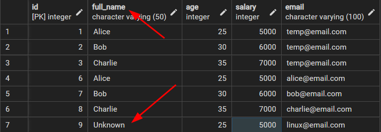

```sql
ALTER TABLE table_name 
ADD
	email VARCHAR(200);
```
> **Explanation**:
> ALTER'ın Temel Şablonu ve tabloya email adında bir kolon daha ekleyecek
---

```sql
ALTER TABLE employee
DROP COLUMN IF EXISTS
	email;
```
>[!WARNING]
>emloyee tablosundaki email kolonunu kaldıracaktır. IF EXISTS bir opsiyonel, yazılması zorunlu değil. Anlamıda şudur eğer email kolonu mevcutsa yap.

```sql
ALTER TABLE employee
DROP COLUMN IF EXITS age;
DROP COLUMN IF EXITS salary;
```

> [!WARNING]
> employee tablosunda hem age hem de salary kolonlarını kaldırma işlemi


```sql
ALTER TABLE employee
ALTER COLUMN
	email TYPE VARCHAR(100);
```
> **Explanation**:
> Mevcut email kolundaki 200 karakteri 100 karakter geçirdik. 

```sql
ALTER TABLE employee
ALTER COLUMN
	email SET NOT Null;
```
> **Explanation**:
> employee tablosunda email kolonunda Null değerini ayarlıyoruz. Böylelikle email kolonuna boş değer geçmemiyoruz.

```sql
ALTER TABLE employee
ALTER COLUMN
	full_name SET DEFAULT 'Unknown';
```
> **Explanation**:
> employee tablosunda veri girişi yapılırken eğer full_name kolonuna ==değer girilmezse== varsayılan değer olarak ==Unknown== atanır.

```sql
INSERT INTO employee
	(age, salary, email)
VALUES
	(25, 5000, 'linux@email.com');
```
>[!NOTE]
>Bir yukarıdaki kod ile ilişkilidir, burada "full_name" kolonu girilmemiştir, bundan dolayı varsayılan olarak ==Unknown== atanacaktır. 



```
ALTER TABLE employee
ADD
	CONSTRAINT unique_email UNIQUE(email);
```
> **Explanation**: ==ADD==
> Mevcut email kolununa ==UNIQUE== özeliği ekledik.

```sql
INSERT INTO employee
	("name", age, salary, email)
VALUES
	('Alice', 25, 5000, 'alice@email.com'), 
	('Bob', 30, 6000, 'alice@email.com'),
	('Charlie', 35, 7000, 'charlie@email.com');
```
> **Explanation:** ==DROP==
> Eğer  hem Alice hem de Bob'a aynı email( alice@email.com ) verirsek ==hata verecektir==

```sql
ALTER TABLE employee
DROP
	CONSTRAINT unique_email;
```
> **Explanation:**
> Mevcutdaki email kolununa eklemiş olduğumuz ==UNIQUE'u== kaldırıyoruz.
---
```sql
ALTER TABLE employee
RENAME COLUMN
	"name" TO full_name;
```
> **Explanation:**
> name adındaki kolonu adını full_name olarak yeniden adlandırdık.

```sql
ALTER TABLE employee
RENAME COLUMN TO employee_update;
```
> **Explanation:**
> employee adındaki tabloyu employee_update olarak değiştiriyoruz.