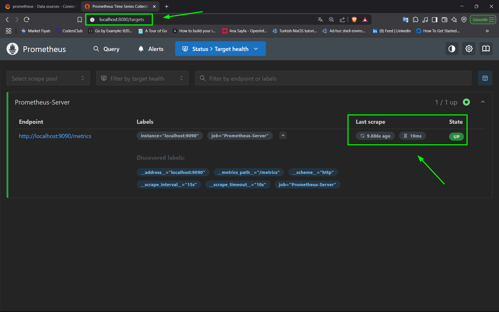
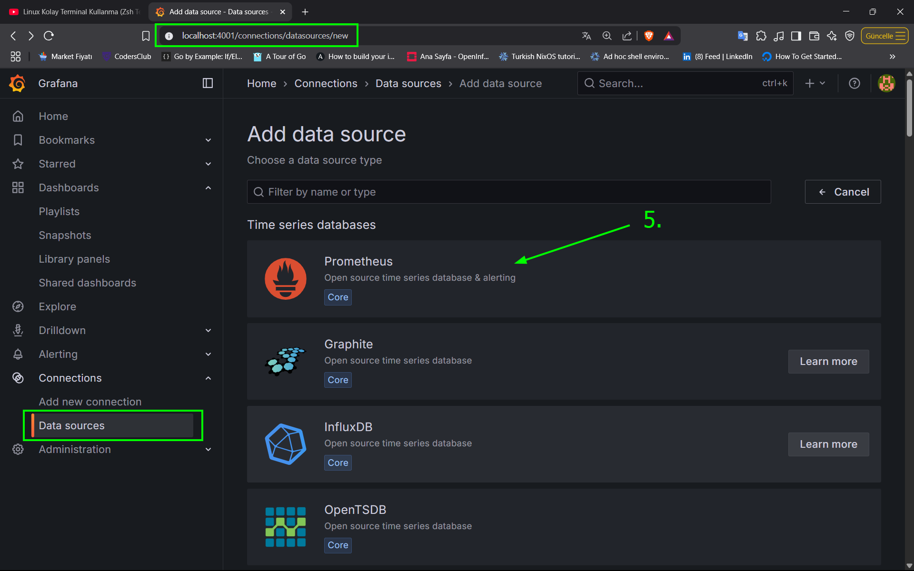
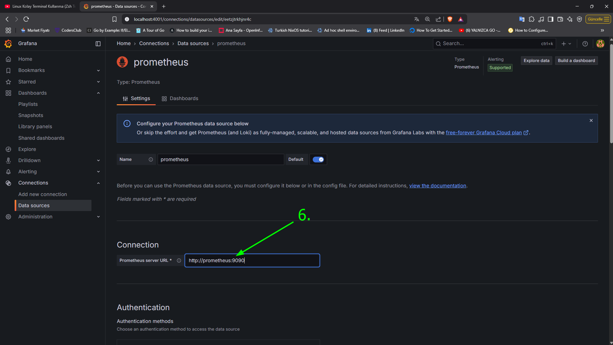
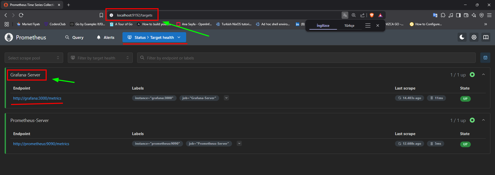
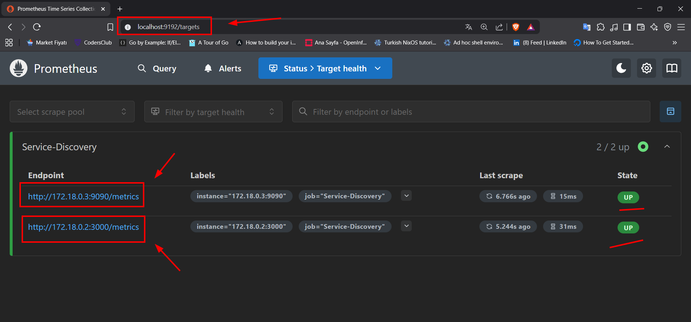

# Adım Docker Yükleme:

### Docker Engine Yükleme:

```shell
sudo apt-get update
```

```shell
sudo apt-get install ca-certificates curl
```

```shell
sudo install -m 0755 -d /etc/apt/keyrings
```


> [!NOTE]
> + Dosya veya dizin oluşturmak,
> + Dosyaları kopyalamak,
> + İzinlerini (mod) ve sahipliğini ayarlamak için kullanılır.
> + **Yani hem `cp`, hem `mkdir`, hem `chmod`, hem de `chown` gibi komutların **birleşimi gibi** düşünebilirsin.**


```bash
sudo curl -fsSL https://download.docker.com/linux/ubuntu/gpg -o /etc/apt/keyrings/docker.asc
```

```shell
sudo chmod a+r /etc/apt/keyrings/docker.asc
```

```shell
echo \
  "deb [arch=$(dpkg --print-architecture) signed-by=/etc/apt/keyrings/docker.asc] https://download.docker.com/linux/ubuntu \
  $(. /etc/os-release && echo "${UBUNTU_CODENAME:-$VERSION_CODENAME}") stable" | \
  sudo tee /etc/apt/sources.list.d/docker.list > /dev/null
```

```shell
sudo apt update
```

```shell
sudo apt-get install docker-ce docker-ce-cli containerd.io docker-buildx-plugin docker-compose-plugin
```

```shell
sudo groupadd docker
```

```shell
sudo usermod -aG docker $USER
```

```shell
newgrp docker
```


# Örnek 1: static_configs


# Örnek 2: Service Discovery
## 1. Adım
### Docker Ağı Oluşturma:

+ `monitoring` adında ortak bir docker ağı oluşturuyoruz:

```shell
docker network create monitoring
```

> + Böylelikle, konteynerler aynı Docker ağı(`monitoring`) içindeyken, **konteyner ismini hostname gibi kullanabilirsin** (`prometheus` = Prometheus konteyner adı).

## 2. Adım: 

### 2.1. Promethues Kurulumu:

> [!NOTE]
> **prom/prometheus** imajı nedir?
> + Bu, **varsayılan (çoklu mimari destekli)** Prometheus Docker imajıdır.
> + `amd64`, `arm64`, `armv7` gibi farklı CPU mimarilerine uygun sürümleri içerir.
> + Docker, çalıştığınız sistemin mimarisine göre uygun olanı otomatik olarak çeker (özellikle Docker'ın "multi-arch" desteği varsa).
> 	1. ✅ Çoklu mimari desteği vardır (multi-arch).
> 	2. ✅ `linux/amd64`, `linux/arm64`, `linux/arm/v7` vb. destekler.
> 	3. 🔄 Otomatik olarak sisteminize uygun mimariyi seçer.


> [!TIP]
> + Mimarileri görmek için şu komutu kullanabilirsin:
> ```shell
> docker manifest inspect prom/prometheus
> ```
> + Bu komut, hangi mimarilere uygun sürümlerin olduğunu gösterir.
> + Komutun Çıktısı:
> ```shell
> {
>   "schemaVersion": 2,
>   "mediaType": "application/vnd.docker.distribution.manifest.list.v2+json",
>   "manifests": [
>      {
>         "mediaType": "application/vnd.docker.distribution.manifest.v2+json",
>         "size": 2407,
>         "digest": "sha256:8672a850efe2f9874702406c8318704edb363587f8c2ca88586b4c8fdb5cea24",
>         "platform": {
>            "architecture": "amd64",
>            "os": "linux"
>         }
>      },
>      {
>         "mediaType": "application/vnd.docker.distribution.manifest.v2+json",
>         "size": 2406,
>         "digest": "sha256:dfc3cce6bfa8485ccad377c66f4ef9833524fde710756faa725251b639d19d86",
>         "platform": {
>            "architecture": "arm64",
>            "os": "linux"
>         }
>      },
>      {
>         "mediaType": "application/vnd.docker.distribution.manifest.v2+json",
>         "size": 2407,
>         "digest": "sha256:45c4b88fc64375d706dca8257815b99e38f46d0a52bd7d492bcd910a706a6f4c",
>         "platform": {
>            "architecture": "arm",
>            "os": "linux",
>            "variant": "v7"
>         }
>      },
>      {
>         "mediaType": "application/vnd.docker.distribution.manifest.v2+json",
>         "size": 2408,
>         "digest": "sha256:939e2a66611e2a6604d1b37ced500a622756404b51db9c0fbd52c3905fcabb20",
>         "platform": {
>            "architecture": "ppc64le",
>            "os": "linux"
>         }
>      },
>      {
>         "mediaType": "application/vnd.docker.distribution.manifest.v2+json",
>         "size": 2408,
>         "digest": "sha256:3e55f054addbee9a963abd0ac1bcb27044907b2e1210fea7b5f1ce1d57cfdc51",
>         "platform": {
>            "architecture": "s390x",
>            "os": "linux"
>         }
>      }
>   ]
> }
> ```


+ Prometheus container'ı ayağı kaldırırken, `Bind Mount` veya `Volume` ile dosyaları kalıcı hale getirebiliriz. 
+ Biz burada `Volume` ile ilerleyeceğiz.

#### 2.1.1. Docker Bind Mount:


> [!NOTE]
> + Bu, **bind mount** (klasik dizin/dosya bağlama) yöntemidir.
> ##### Syntax:
> ```shell
> -v <dosya_veya_dizin_yolu>:<container_içi_yol>
> ```
> ##### Özellikeri:
> + Host sistemdeki dosya **doğrudan container içinde kullanılır**.
> + Değişiklerin geçerli olabilmesi için `docker restart` komutunu kullanmanız gerekmetedir.
> + Geliştirme sırasında çok kullanışlıdır.


> [!CAUTION]
> + Güvenlik açısından riskli olabilir.
> + Container taşındığında `config` dosyası yanında gitmez (taşınabilirlik düşer).
> + Her platformda yol uyumsuzluğu olabilir (`Windows` vs `Linux`).


```shell
mkdir -p monitoring/prometheus
```

```shell
cd monitoring
```

```shell
vim prometheus/prometheus.yml
```

**prometheus.yml**

```yaml
# Burada tanımlanan değerler, altta tanımlanan tüm scrape_configs ve
# alerting ayarlarına uygulanır — eğer o job içinde ayrıca bir ayar
# yapılmamışsa.
global:

  # Prometheus, tüm tanımlı hedeflerden(targets) her 15 saniyede
  # bir veri (metrics) çekecek. Varsayılan değer 1 dakikadır.
  scrape_interval: 15s

# Prometheus'un hangi hedeflerden metrik toplayacağını
# tanımlar. Her hedef bir job olarak yazılır.
scrape_configs:

  # Prometheus web arayüzünde bu job bu adla listelenir.
  - job_name: 'Prometheus-Server'

    # static_configs, Prometheus'un statik (sabit) olarak tanımlanmış
    # hedeflerden (target) metrik toplamasını sağlayan yapılandırma bloğudur.
    static_configs:

      # Bu, Docker ağı içinde çalışan prometheus adlı container’daki
      # 9090 portuna istek gönderileceği anlamına gelir.
      - targets: ['prometheus:9090']
```


```shell
docker run -d --name prometheus \
		   -p 127.0.0.1:9191:9090 \
		   -v $(pwd)/prometheus/prometheus.yml:/etc/prometheus/prometheus.yml \
		   --restart unless-stopped \
		   --network monitoring \
prom/prometheus:main
```

> + Host (yerel sistem) üzerindeki `prometheus/prometheus.yml` dosyasını
> + container içindeki `/etc/prometheus/prometheus.yml` yoluna birebir bağlar.


> [!TIP]
> + `prometheus` programına ek argümanlar geçmek isterseniz;
> ```shell
> docker run -d --name prometheus \
>		   -p 127.0.0.1:9191:9090 \
>		   -v $(pwd)/prometheus/prometheus.yml:/etc/prometheus/prometheus.yml \
>		   --restart unless-stopped \
>		   --network monitoring \
> prom/prometheus:main \
>		   --config.file=/etc/prometheus/prometheus.yml \
> 		   --web.enable-lifecycle
> ```

```shell
ssh -L 9192:localhost:9191 ottoman@192.168.1.133 -N
```


> [!WARNING]
> + `prometheuse.yml` dosya yapılan ayarların geçerli olabilmesi için;
> + `--web.enable-lifecycle` argümanını aktif edildiğinde
> ```shell
> curl -i -X POST http://localhost:9192
> ```
> + komut düzgün çalışmayacaktır.
> + `prometheus.yml` dosyasını tekrar  okunması için aşağıdaki komut ile prometheus container'ını yeniden başlatmak gerekir. 
> ```shell
> docker restart prometheus
> ```


#### 2.1.2.  Docker Volume: 


> [!NOTE]
> + Bu, **Docker Volume** kullanımıdır.
> ##### Syntax:
> ```shell
> -v <volume_adı>:<container_içi_yol>
> ```
> #### Özellikeri:
> + Kalıcıdır, container silinse bile volume silinmez.
> + Volume Docker tarafından `/var/lib/docker/volumes/` altında saklanır.
> + Dosyalar direkt olarak host dosya sisteminde görünmez.


> [!CAUTION]
> + Özellikle **prod ortamları için önerilir** çünkü:
> + Daha güvenli
> + Yönetimi Docker tarafından yapılır.
> + Volume'lar diğer container'larla paylaşılabilir.

| Özellik                      | `-v prometheus_v:/...` (volume)            | `-v ./prometheus.yml:/...` (bind mount)          |
| ---------------------------- | ------------------------------------------ | ------------------------------------------------ |
| Kalıcılık                    | ✅ Container silinse bile dosya kalır       | ⚠️ Container silinse dosya durur ama dışarıdadır |
| Taşınabilirlik               | ✅ Yüksek (volume container içinde tanımlı) | ❌ Düşük (host dosyasına bağlı)                   |
| Geliştirme için uygun        | ❌ Zor kopyalama gerekir                    | ✅ Ulaşılması veya kopyalanması kolaydır.         |
| Prod ortamlar için           | ✅ Önerilir                                 | ❌ Önerilmez                                      |
| Docker’ın yönettiği alan mı? | ✅ Evet                                     | ❌ Hayır, dışarıda                                |

+ `prometheus` adında bir docker `volume` oluşturuyoruz:

```shell
docker create volume prometheus
```

+ `prom/prometheus:main` imajından `prometheus` adında container oluşturuyoruz:

```shell
docker run -d --name prometheus \
		   -p 127.0.0.1:9191:9090 \
		   -v prometheus:/etc/prometheus/prometheus.yml \
		   --restart unless-stopped \
		   --network monitoring \
prom/prometheus:main \
		   --config.file=/etc/prometheus/prometheus.yml \
		   --web.enable-lifecycle
```


```shell
docker ps
```

```shell
CONTAINER ID   IMAGE                      COMMAND                  CREATED        STATUS        PORTS                      NAMES
a2c1cdec7f97   prom/prometheus:main       "/bin/prometheus --c…"   22 hours ago   Up 22 hours   127.0.0.1:9191->9090/tcp   prometheus
```


```shell
ssh -L 9192:localhost:9191 ottoman@192.168.1.133 -N
```

> + Bu, **yerel bilgisayarın (senin kendi makinanda)** ile **uzaktaki Ubuntu sunucusu (192.168.1.133)** arasında bir **SSH tüneli (port forwarding)** kurar.

> + `-L 9191:localhost:9191` → **Yerel port (senin makinan)** 9191 ile **uzaktaki sunucunun kendi localhost portu** 9191 arasında bir tünel açar
> + `ottoman@192.168.1.133` → SSH ile bağlanılacak kullanıcı ve IP (Ubuntu sunucusu)
> + `-N` → Bağlantıda **komut çalıştırma**, sadece tünel kur (terminal açılmaz)


> [!TIP]
> + `prometheus.yml` dosyasında bir değişiklik yaptığımızda ayarların geçerli olabilmesi için;
> ```shell
> docker restart prometheus
> ```
> + yerine;
> + `--web.enable-lifecycle` parametresi yukarıdaki gibi aktif edildiyse;
> ```shell
> curl -i -X POST http://localhost:9192
> ```
> + çalıştırarak `proemthues.yml` dosyasını ayarlarını yeniden yükleyebilirsiniz.





> [!TIP]
> + Eğer docker container'ınız düzgün çalışmadığı taktirde `docker log` komutu ile `debug` yapabilirsiniz:
> + `docker logs` komutu, çalışan veya durmuş bir Docker konteynerinin loglarını (kayıtlarını) görüntülemek için kullanılan temel bir Docker komutudur.
> #### Syntax(Söz Dizimi):
> ```shell
> docker logs [container_name veya container_ID]
> ```
> #### Önemli Parametreler:
> + `-f` veya `--follow`: Logları gerçek zamanlı takip etmek için (tail -f gibi)
> + `--tail N`: Son N satırı göstermek için
> + `-t` veya `--timestamps`: Her log satırının başına zaman damgası ekler.
> + `--since`: Belirli bir zamandan beri olan logları gösterir (ör: `--since 1h`)
> + `--until`: Belirli bir zamana kadar olan logları gösterir.
> #### Örnek Kullanım:
> 1. Temel log görüntüleme:
> ```shell
> docker logs prometheus
> ```
> 2. Son 50 satırı görüntüleme:
> ```shell
> docker logs --tail 50 prometheus
> ```
> 3. Logları  gerçek zamanlı takip etme:
> ```shell
> docker logs --tail 100 -t prometheus
> ```
> 4. Son 1 saatin loglarını görüntüleme:
> ```shell
> docker logs --since 1h prometheus
> ```

## 3. Adım:

### 3.1. Grafana Kurulumu

```shell
pwd    # Çıktı:  /home/ottoman/monitoring
```

```shell
mkdir grafana
```


```shell
docker run -d \
		   --name grafana \
		   -p 127.0.0.1:4000:3000 \
		   -v grafana-data:/var/lib/grafana \
		   --restart unless-stopped \
		   --network monitoring \
grafana/grafana-oss:main
```


```shell
ssh -L 4001:localhost:4000 ottoman@192.168.1.133 -N
```







> [!NOTE]
> + Yukarıdaki resim de 6. basamakta neden bu URL kullanıldığı açıklanmaktadır:
> + Konteynerler **aynı Docker ağı** (örneğin `monitoring`) içindeyken, **birbirlerinin adlarını** kullanarak **ağ üzerinden haberleşebilir**.
> #### Amaç:
> + Docker'da birden fazla konteyneri aynı ağda çalıştırarak, **her konteynerin adını "hostname" gibi kullanmak**.
> 	- `prometheus` adında bir konteyner var.
> 	- `grafana` adında başka bir konteyner var.
> + Aynı Docker ağına(`monitoring`) bağlılarsa:
> 	- Grafana içinden `http://prometheus:9090` şeklinde Prometheus'a erişebilirsin.
> #### Nasıl Çalışır?
> Docker, kendi ağı içinde **DNS benzeri bir sistem** sunar.
> 1. Docker ağı oluşturulduğunda (`docker network create monitoring` gibi),
> 2. Bu ağa katılan her konteynerin adı → otomatik olarak DNS kaydı olur.
> 3. Aynı ağdaki başka bir konteyner, bu adı kullanarak **ağ üstünden doğrudan bağlanabilir**.
> #### Grafana → Prometheus bağlantısı:
> + Grafana arayüzüne (`http://localhost:3000`) gidip Prometheus'u data source olarak eklerken **şöyle yazarız**:
> ```http
> http://prometheus:9090
> ```
> + Burada `prometheus`, DNS gibi çalışır:
> 	+ Docker ağı içinde DNS çözümlemesi yapılır.
> 	+ **IP adresi dinamik olsa bile bağ kurulur.**
> #### Neden "prometheus" ismi çalışıyor?
> Çünkü;
> + Konteyner adı `--name prometheus` olarak belirlenmiş.
> + Docker ağı `monitoring` içinde olduğu için
> + Docker, bu ağı yöneten bir DNS sistemi kurar.
> + DNS, `prometheus` ismini otomatik olarak gerçek IP’ye çevirir (örneğin `172.18.0.2`)

| Terim                             | Açıklama                                                                             |
| --------------------------------- | ------------------------------------------------------------------------------------ |
| **Bridge Network**                | Docker’ın varsayılan ağıdır ama izole çalışır.                                       |
| **Custom Network (user-defined)** | DNS desteklidir, konteyner adlarıyla iletişim mümkündür.                             |
| **Container Name**                | `--name` ile belirlenir ve ağ içi adres olarak kullanılır.                           |
| **Hostname**                      | Varsayılan olarak konteyner adı ile aynıdır ama `--hostname` ile özelleştirilebilir. |


> [!TIP]
> ```shell
> docker exec -it grafana ping prometheus
> ```
> + Bu komut şunu gösterir:
> 	- Grafana konteyneri içinden Prometheus’a **ping atabilirsin**
> 	- Çünkü `prometheus` ismini DNS üzerinden çözümler


> [!WARNING]
> + Aynı Docker ağındaki (**user-defined bridge network**) konteynerler, birbirlerini **isimleriyle** (container name) veya **alias** (takma ad) ile bulabilir.
> 	- Örneğin, `grafana` ve `prometheus` isimli iki konteyner aynı ağdaysa, `grafana` konteyneri `ping prometheus` komutuyla `prometheus` konteynerine erişebilir.
> + **Varsayılan `bridge` ağında** bu özellik yoktur; konteynerler birbirine sadece IP üzerinden erişebilir (veya `--link` kullanılmalıdır, ancak bu eski bir yöntemdir).

## 4. Adım:

### 4.1 Grafana'yı Prometheus'a bağlama:

+ Bu dosya, **Prometheus'un hangi servislerden, ne sıklıkla metrik (metric) çekeceğini** belirleyen ana yapılandırma dosyasıdır. `prometheus.yml` ismi varsayılandır.

```shell
vim ~/monitoring/prometheus/prometheus.yml
```

**prometheus.yml:**

```yaml
# Burada tanımlanan değerler, altta tanımlanan tüm scrape_configs ve
# alerting ayarlarına uygulanır — eğer o job içinde ayrıca bir ayar
# yapılmamışsa.
global:

  # Prometheus, tüm tanımlı hedeflerden(targets) her 15 saniyede
  # bir veri (metrics) çekecek. Varsayılan değer 1 dakikadır.
  scrape_interval: 15s

# Prometheus'un hangi hedeflerden metrik toplayacağını
# tanımlar. Her hedef bir job olarak yazılır.
scrape_configs:

  # Prometheus web arayüzünde bu job bu adla listelenir.
  - job_name: 'Prometheus-Server'

    # static_configs, Prometheus'un statik (sabit) olarak tanımlanmış
    # hedeflerden (target) metrik toplamasını sağlayan yapılandırma bloğudur.
    static_configs:

      # Bu, Docker ağı içinde çalışan prometheus adlı container’daki
      # 9090 portuna istek gönderileceği anlamına gelir.
      - targets: ['prometheus:9090']

  # Prometheus web arayüzünde bu job bu adla listelenir.
  - job_name: 'Grafana-Server'

    # Prometheus bu bölümde tanımlanan IP:port ya da host:port adreslerine
    # düzenli olarak gidip veri çeker.
    # Bu hedefler sabittir, otomatik keşif (service discovery) yapılmaz.
    static_configs:

      # Bu, Docker ağı içindeki grafana adlı container’da çalışan 3000
      # numaralı porta erişimdir.
      # Grafana'nın arayüzü bu porttadır: http://grafana:3000
      - targets: ['grafana:3000']
```





## 5. Adım:

### 5.1. Service Discovey:


```yaml
# Burada tanımlanan değerler, altta tanımlanan tüm scrape_configs ve
# alerting ayarlarına uygulanır — eğer o job içinde ayrıca bir ayar
# yapılmamışsa.
global:

  # Prometheus, tüm tanımlı hedeflerden(targets) her 15 saniyede
  # bir veri (metrics) çekecek. Varsayılan değer 1 dakikadır.
  scrape_interval: 15s

# Prometheus'un hangi hedeflerden metrik toplayacağını
# tanımlar. Her hedef bir job olarak yazılır.
scrape_configs:

  # Prometheus web arayüzünde bu job bu adla listelenir.
  - job_name: 'Service-Discovery'

    # Docker Engine ile doğrudan konuşarak, çalışan konteynerleri otomatik
    # olarak hedef listesine eklemek.
    docker_sd_configs:

      # Prometheus, Docker ile Unix socket üzerinden konuşacak.
      # /var/run/docker.sock Docker Engine’in API’sidir.
      # Bu sayede Prometheus, çalışmakta olan tüm konteynerleri görebilir.
      # Konteyner etiketleri, IP adresleri, portları gibi bilgileri alır.
      - host: unix:///var/run/docker.sock

        # Her 30 saniyede bir Docker API’ye bakıp yeni eklenen / kaldırılan
        # konteynerleri günceller.
        # Böylece Prometheus’a elle hedef eklemen gerekmez.
        refresh_interval: 30s
```


```shell
sudo find / -name 'docker.sock'
```

**find Çıktısı:**

```shell
/run/docker/libnetwork/49d557e776f5.sock
/run/docker/metrics.sock
/run/containerd/containerd.sock
/run/docker.sock
```


```shell
docker run -d --name prometheus \
		   -p 127.0.0.1:9191:9090 \
		   -v prometheus:/etc/prometheus \
		   --restart unless-stopped \
		   --network monitoring \
		   --user root \
		   -v /var/run/docker.sock:/var/run/docker.sock \
prom/prometheus:main \
		   --config.file=/etc/prometheus/prometheus.yml \
		   --web.enable-lifecycle
```

> 1. `-d` → Detach mode: Arka planda çalıştırır, terminali meşgul etmez.
> 2. `--name prometheus` → 
> 	- Konteynere **`prometheus`** adını verir. 
> 	- Bu isimle kolayca durdurabilir, başlatabilir veya loglarına bakabilirsin (`docker logs prometheus`).
> 3. `-p 127.0.0.1:9191:9090` → 
> 	- Host makinedeki **`127.0.0.1` IP’sinin 9191 portunu**, konteyner içindeki **9090 portuna** yönlendirir.
> 	- Tarayıcıda: `http://127.0.0.1:9191`
> 4. `-v prometheus:/etc/prometheus` → volume mount edilecektir.
> 5. `--restart unless-stopped` → 
> 	- Docker daemon **yeniden başlarsa** veya **konteyner çökerse** otomatik yeniden başlatır.
> 	- Sadece **manuel olarak durdurursan** (`docker stop`) tekrar başlamaz.
> 6. `--network monitoring` → 
> 	- Konteyneri `monitoring` adlı özel Docker ağına bağlar.
> 	- Böylece diğer konteynerlerle **IP yerine isimle** haberleşebilir.
> 7. `prom/prometheus:main` → Docker Hub’daki **Prometheus** imajının `main` tag’ini kullanır (güncel geliştirme sürümü).
> 8. `--config.file` → Prometheus’un hangi config dosyasını okuyacağını belirtir.
> 9. **`--web.enable-lifecycle`** → Prometheus’un çalışırken HTTP API üzerinden yeniden yüklenmesini (`/-/reload`) aktif eder.


> [!NOTE]
> #### Docker’da `--user` Parametresi Nedir?
> Docker konteyneri çalıştığında, varsayılan olarak o imajın **Dockerfile** içinde belirtilmiş kullanıcısı (`USER` direktifi) ile başlar.
> + Eğer `USER` tanımlanmamışsa, çoğu resmi imaj **root** kullanıcısıyla başlar.
> + Ancak güvenlik için bazı imajlar normal (non-root) kullanıcı ile çalışır.
> #### Bu Parametre Neden Kullanılmış?
> ```shell
> -v /var/run/docker.sock:/var/run/docker.sock
> ```
> + **`/var/run/docker.sock`** host tarafında genelde `root:docker` sahibidir ve izinleri `660` olur.
> + Eğer konteyner içindeki kullanıcı `root` değilse:
> 	-  Docker socket’e erişmeye çalıştığında **permission denied** hatası alırsın.
> + `--user root` ile:
> 	- Konteyner içindeki Prometheus, Docker socket’e sorunsuz bağlanabilir.


> [!TIP]
> #### Root ile Çalışmanın Artıları:
> + Herhangi bir dosya/dizine yazma yetkisi kısıtlaması yaşamazsın.
> + Host ile paylaşılan volume veya socket dosyalarına erişebilirsin.
> + Servislerin çalışabilmesi için ek `chmod` veya `chown` ile uğraşmazsın.
> #### Root ile Çalışmanın Dezavantajı:
> - Güvenlik açısından risklidir:
> 	- Konteynerin içinde çalışan bir exploit, host’ta root yetkisine ulaşabilir (özellikle socket mount edilmişse)


> [!TIP]
> #### `--user root` kullanılmadan
> + `id` komutunu çalıştırdığımızda `nobody` kullanıcısı ile çalıştığını görebiliriz:
> ```shell
> docker exec -it prometheus id
> ```
> + Komut Çıktısı:
> ```shell
> uid=65534(nobody) gid=65534(nobody) groups=65534(nobody)
> ```
> + Alternatif komut olarak:
> ```shell
> docker exec -it prometheus whoami
> ```
> + Komut Çıktısı:
> ```shell
> nobody
> ```
> #### `--user root` ile
> + `id` komutunu çalıştırdığımızda `root` kullanıcısı ile çalıştığını görebiliriz:  
> ```shell
> docker exec -it prometheus id
> ```
> + Komutun Çıktısı:  
> ```shell
>  uid=0(root) gid=0(root) groups=0(root),10(wheel)
> ```
> + Alternatif komut olarak:
> ```shell
>  docker exec -it prometheus whoami
> ```
> + Komut Çıktısı:
> ```shell
> root
> ```


+ `prometheus.yml` dosyasında syntax hatası var diye kontrol ediyoruz:

```shell
docker exec -it prometheus promtool check config /etc/prometheus/prometheus.yml
```

**promtool Çıktısı:**

+ Çıktıdan anlaşılacağı üzeri syntax doğru yazılmıştır.

```shell
Checking /etc/prometheus/prometheus.yml
 SUCCESS: /etc/prometheus/prometheus.yml is valid prometheus config file syntax
```




## 6. Adım:

### 6.1. cadvisor Kurulumu:

```shell
docker run -d --name cadvisor \
		   --volume=/:/rootfs:ro \
		   --volume=/var/run:/var/run:ro \
		   --volume=/sys:/sys:ro \
		   --volume=/var/lib/docker/:/var/lib/docker:ro \
		   --restart unless-stopped \
		   --publish=127.0.0.1:8080:8080 \
		   --network monitoring \
gcr.io/cadvisor/cadvisor:latest
```

> 1. `-d` (uzun yazılımı: `--detach`)→
> 	- **Açıklama:** Detached (arka planda) çalıştırma modu.
> 	- Yani komut çalıştırıldıktan sonra terminali bloke etmez, konteyner arka planda çalışır.
> 2. `--name` →  Bu parametre konteynere `cadvisor` ismini verir.
> 3. `--volume=/:/rootfs:ro` → 
> 	- Host makinenin `/` dizinini konteyner içinde `/rootfs` olarak **read-only** (salt okunur) bağlar.
> 	- **ro** = **read-only**, konteyner bu dosyaları değiştiremez.
> 	- Bu, cAdvisor’ın host’un dosya sistemine erişip disk kullanımı, dosya yapısı gibi bilgileri görebilmesi için gerekli.
> 4. `--volume=/var/run:/var/run:ro` → 
> 	- Host’taki `/var/run` dizinini konteyner içinde `/var/run` olarak bağlar (read-only).
> 	- `/var/run` içinde genellikle socket dosyaları olur (örn. Docker daemon socket), cAdvisor bu sayede konteyner bilgilerini çekebilir.
> 5. `--volume=/sys:/sys:ro` → 
> 	- Host’taki `/sys` dizinini konteyner içinde `/sys` olarak bağlar (read-only).
> 	- `/sys` dizini Linux çekirdek sistem bilgilerini içerir (CPU, memory, network istatistikleri vs.).
> 6. `--volume=/var/lib/docker/:/var/lib/docker:ro` → 
> 	- Host’taki `/var/lib/docker` dizinini konteyner içinde aynı dizine bağlar (read-only).
> 	- Bu dizin Docker’ın tüm konteyner, imaj ve volume verilerini sakladığı yerdir.
> 	- cAdvisor buradan hangi konteynerler çalışıyor, disk alanı ne kadar kullanılıyor gibi bilgileri çeker.
> 7. `--publish=127.0.0.1:8080:8080` → 
> 	- Host’un `127.0.0.1` IP ve 8080 portunu konteynerin 8080 portuna yönlendirir.
> 	- Yani, tarayıcada `http://localhost:8080` yazdığınızda cAdvisor arayüzüne erişebilirsiniz.
> 8. `gcr.io/cadvisor/cadvisor:latest` → 
> 	- Çalıştırılacak imajın adresi.
> 	- `gcr.io` = Google Container Registry.
> 	- `cadvisor/cadvisor` = imajın adı.
> 	- `latest` = en güncel versiyon.


> [!TIP]
> + `--publish=127.0.0.1:8080:8080` parametresinden dolayı sadece bu makine üzerinde erişim gerçekleştirilir.
> + Fakat, başka bir makine üzerinde tarayıcı ile açmak için aşağıdaki komut kullanınız:
> ```shell
> ssh -L 8081:localhost:8080 ottoman@192.168.1.133 -N
> ```
> 1. `-L 8081:localhost:8080` 
> 	**Local port forwarding** parametresi.
> 	+ **`8081`** → Yerel makinede dinlenecek port (senin bilgisayarında).
> 	+ **`localhost`** → Uzak makineden bakıldığında hedefin adresi. Buradaki _localhost_, **192.168.1.133**’ün kendisini ifade eder.
> 	+ **`8080`** → Uzak makinede erişilecek hedef port.
> 	+ Yani, Yerel makinedeki `localhost:8081` adresine gelen tüm trafiği, **SSH tüneli** üzerinden, **192.168.1.133** makinesindeki `localhost:8080` adresine yönlendir.
> 2. `ottoman@192.168.1.133` → 
> 	+ **`ottoman`** → Uzak makinedeki kullanıcı adı.
> 	+ **`192.168.1.133`** → Uzak makinenin IP adresi.
> 3. `-N` → 
> 	+ SSH ile **herhangi bir komut çalıştırma** (shell açma) yok, sadece tünel oluşturulur.
> 	+ Bu sayede bağlantı sadece yönlendirme amacıyla açık kalır.

## 7. Adım:

### Node Exporter Kurulumu:

```shell
docker run -d --name node-exporter \
		   --restart unless-stopped \
		   --network monitoring \
		   -v "/:/host:ro,rslave" \
prom/node-exporter:master
		   --path.rootfs=/host
```

## 8. Adım:

### Relabeling (Etiket Dönüştürme)

```yaml
# Burada tanımlanan değerler, altta tanımlanan tüm scrape_configs ve
# alerting ayarlarına uygulanır — eğer o job içinde ayrıca bir ayar
# yapılmamışsa.
global:

  # Prometheus, tüm tanımlı hedeflerden(targets) her 15 saniyede
  # bir veri (metrics) çekecek. Varsayılan değer 1 dakikadır.
  scrape_interval: 15s

# Prometheus'un hangi hedeflerden metrik toplayacağını
# tanımlar. Her hedef bir job olarak yazılır.
scrape_configs:

  # Prometheus web arayüzünde bu job bu adla listelenir.
  - job_name: 'Service-Discovery'

    # Docker Engine ile doğrudan konuşarak, çalışan konteynerleri otomatik
    # olarak hedef listesine eklemek.
    docker_sd_configs:

      # Prometheus, Docker ile Unix socket üzerinden konuşacak.
      # /var/run/docker.sock Docker Engine’in API’sidir.
      # Bu sayede Prometheus, çalışmakta olan tüm konteynerleri görebilir.
      # Konteyner etiketleri, IP adresleri, portları gibi bilgileri alır.
      - host: unix:///var/run/docker.sock

        # Her 30 saniyede bir Docker API’ye bakıp yeni eklenen / kaldırılan
        # konteynerleri günceller.
        # Böylece Prometheus’a elle hedef eklemen gerekmez.
        refresh_interval: 30s

    # Keşfedilen hedeflerin etiketlerini değiştirmek veya yenilerini         
    # eklemek için kullanılır.
    relabel_configs:

      #  Docker service discovery’nin otomatik sağladığı metadata
      #  etiketlerinden container adını alır.
      - source_labels: [__meta_docker_container_name]

        # Bu değeri container isimli bir etiket olarak Prometheus                
        # hedeflerine ekler.
        target_label: container
```


> [!TIP]
> + `relabel_configs` konfigürasyon ayarların geçerli olabilmesi için;
> + `prometheus` container'ın imajını siliyoruz.
> ```shell
> docker rm -f prometheus
> ```
> + `prometheus` container'ını tekrardan oluşturuyoruz.
> ```shell
> docker run -d --name prometheus \
>		   -p 127.0.0.1:9191:9090 \
>		   -v prometheus:/etc/prometheus \
>		   --restart unless-stopped \
>		   --network monitoring \
>		   --user root \
>		   -v /var/run/docker.sock:/var/run/docker.sock \
> prom/prometheus:main \
>		   --config.file=/etc/prometheus/prometheus.yml \
>		   --web.enable-lifecycle
> ```
> Aksi taktirde yapılandırma dosyaları geçerli olmayacaktır.


# Kaynak:
1. [How to install Prometheus Grafana on Docker Container| Service Discovery | DevOps Full Tutorial 2025](https://www.youtube.com/watch?v=rP1Djq4-mPw&t=3940s)


