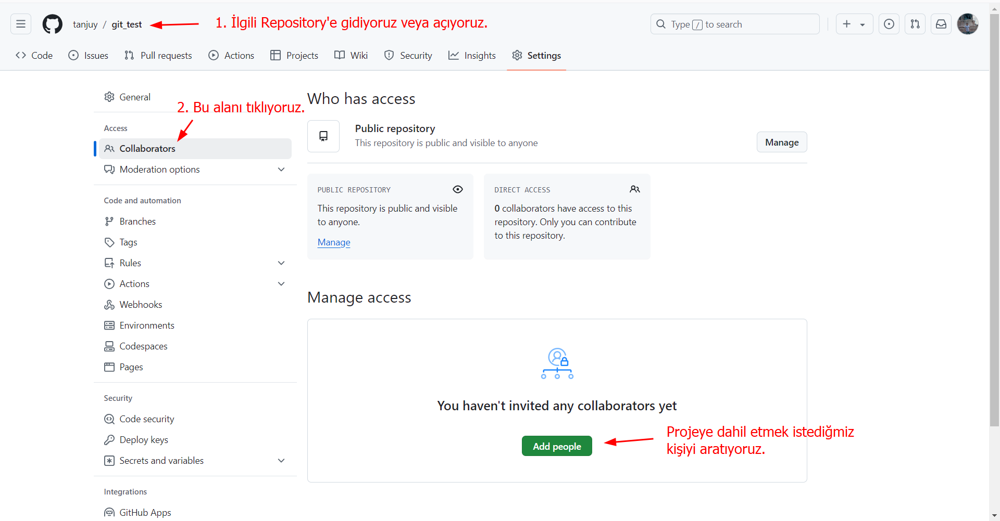

---
tags:
  - git
---
### Git Nedir?
* Git, küçükten çok büyük projelere kadar her şeyi hızlı ve verimli bir şekilde ele almak için tasarlanmış, *ücretsiz ve açık kaynaklı, dağıtılmış bir sürüm kontrol* sistemidir.
* En kısa tanımı ile bir *versiyon kontrol sistemi*dir.

---
## Git Kurulumu
##### Linux
###### Dabian Temeli Dağıtımlar:
```shell
$ sudo apt install git
```
###### Windows
```powershell
PS C:\Users\tanju> winget install --id Git.Git -e --source winget
```

**Mac**
```shell
(base) ottoman@MacBook-Pro ~ % brew install git
```

---
## Hızlı Başlama (Quick Start)
##### Proje Klasörü Oluştuma
```shell
$ mkdir my_project
$ cd my_project
```

#### İlk Ayarlamalar
```shell
$ git config --global user.name "your name"
$ git config --global user.email "youremail@gmail.com"
```
> **Explanation:**
>*  Bir Git deposu başlattıktan sonra, kullanıcının Git yapılandırma ayarlarını yapması gerekebilir. Bu, genellikle kullanıcı adı ve e-posta adresini ayarlamayı içerir, çünkü bu bilgiler *Git commit'lerinde kullanılır.*
> * Bu komutlar, Git yapılandırma dosyasına (genellikle `~/.gitconfig`) bu bilgileri ekler ve tüm projeler için geçerli olur.

```shell
$ git config --local user.name "proje name"
$ git config --local user.email "proje@gmail.com"
```
> **Explanation:**
> Ancak, belirli bir proje için farklı bilgiler ayarlamak istiyorsanız, bu ayarları *yerel (local)* olarak yapabilirsiniz
#### Git Deposu Başlatın
###### Git durum kontrolü:
```shell
$ git status
```
> **Explanation:**
> + git repo'un kurulu olup olmadığına bakılabilir. 
> + Eğer git repo kurulu değil ise `fatal: not a git repository (or any of the parent directories): .git` hata verecektir.
> + Eğer üst üste repo kurulumu yaparsak(`git init`) hatalar meyil verebilir. `git status` komut ile repo'un kurulu olup olmadığını kontrol edebiliyoruz.

```bash
$ echo "# git_test" >> README.md
```
> **Explanation:**
> + Projenin kök dizininde yer alan ve genellikle proje hakkında önemli bilgileri içeren bir dosyadır.
> + Bu dosya, özellikle proje depolarında ziyaretçilere ilk gösterilen belge olup, projenin amacı, nasıl çalıştırılacağı, kurulum talimatları, katkıda bulunma rehberleri gibi bilgileri sunar.

###### Git yerel depoyu başlatma:
```bash
$ git init
```
> **Explanation:**
> Komut başlattığımızda `.git` adında gizli bir dosya oluşacaktır. linux de `ls -al` komut ile görebiliriz. 

###### Dosyayı indeksleme:
```bash
$ git add README.md
```
> **Explanation:** 
> + Her git projenin bir README.md olması gerekir. 
> + [[Git Dersi#Git add|Git add]] bakınız.

> [!TIP]
> + Her `git add` komutu kullanımında `git status` komutunu kullanarak teyit ediniz.

###### Dosyayı yerel depoya koyma:
```bash
$ git commit -m "first commit"
```
> **Explanation:**
> + Bu kayıtlar, bir projenin geçmişini izlemeyi, değişiklikleri yönetmeyi ve gerektiğinde önceki sürümlere geri dönmeyi kolaylaştırır.
> + [[Git Dersi#Git commit|Git commit]] bakınız.

> [!TIP] 
> Git kurulumu ve git depo ile bağlantısı sağlandığında en çok kullanılacak 2 komut:
> 1. `git add <file name>`
> 2. ``git commit -m "konu ile ilgi kısa bir açıklama"`

###### Commit'leri listeleme:
```shell
$ git log
```
> **Explanation:**
> + Bulunduğumuz branch de tüm commit'leri ekrana basar.
> + commit içerisinde commit hash, yazarı(Author), tarih(Date) ve mesajı bulunmaktadır.

###### Git'in izlemesinden çıkarma:
```shell
$ touch .gitignore
```
> **Explanation:**
> + `.gitignore` dosyasın içerisine eklediğimiz dosyalar veya klasörler git tarafından izlenmeyecektir.
> + Daha fazla bilgi için [[Git Dersi#Gitignore Dosyası|Gitignore Dosyası]] bakınız.
###### Branch adını değiştirme:
```bash
$ git branch -M main
```
> **Explanation:**
> + Git deposundaki mevcut dalı (branch) **zorunlu (force) olarak yeniden adlandırmak** için kullanılır ve yeni dalın adı **`main`** olur.
> + **`git branch -M`**: Mevcut dalı zorunlu olarak yeniden adlandırır. Buradaki `-M`, **`--move --force`** anlamına gelir, yani yeni dal adıyla aynı ada sahip bir başka dal olsa bile mevcut dal bu isimle değiştirilir.
###### SSH ile bağlanma:
```bash
$ git remote add origin git@github.com:tanjuy/git_test.git
```
> **Explanation:**
> + `origin` adı verdiğimiz ve genellikle bu isim verilir. Uzak depo adresini bu isime(origin) atarız.
> + Artık `origin`, `git@github.com:tanjuy/git_test.git` adresini tutmaktadır. 

```bash
$ git push -u origin main
```
> **Explanation:**
> `-u` parametrenin uzun yazılışı; `--set-upstream`
> + Bu bayrak, yerel dalı bir **upstream dalıyla** ilişkilendirir. Upstream dal, yerel dalın hangi uzak depodaki dalı takip edeceğini belirler.
> + bir dalın uzak depodaki karşılığıyla (upstream branch) sürekli bir ilişki kurmaktır, böylece gelecekte `git push` veya `git pull` komutlarını çalıştırırken her seferinde dal adı belirtmek zorunda kalmazsınız.

###### HTTPS ile bağlama:
```shell
$ git remote add origin https://github.com/tanjuy/git_test.git
```


```shell
git remote add origin git@github.com:tanjuy/git_test.git
git branch -M main
git push -u origin main
```

```shell
$ git add <file_name>
```

```bash
$ git commit -m "message"
```

#### Branch Oluşturma:

> [!TIP]
> +  Genellikle yazılım da özellik için yeni bir branch açıldığında isimlendirme `feat-featureName`  şeklinde olur
> + `featureName` branch için açılacak özellik için verilecek isimdir. Örneğin; `feat-login` veya feat-css gibi.


```shell
$ git branch dev
```
> **Explanation:**
> - `dev` adında yeni bir branch oluşturur.
> - Daha fazla detay için [[Git Dersi#Git branch|Git branch]] başlığına bakınız.

```shell
$ git switch -c prod
```
> **Explanation:**
> - `prod` adında yeni bir branch oluşturur ve üstelik bu branch'e geçiş yapar.
> - Daha fazla detay için [[Git Dersi#Git switch|Git switch]] başlığına bakınız.

```shell
$ git branch
```
> **Explanation:**
> - Oluşturmuş olduğumuz branch'leri görmek için veya listelemek için bu komut kullanılabilir.
> - `-a` parametresi kullanılırsa *hem uzaktaki hemde yereldeki branch'leri listeler.*

#### Branch'ler Arasında Geçiş:
```shell
$ git checkout dev
```
> **Explanation:**
> Eğer `main` branch de iseniz, bu komut ile dev branch'ine geçersiniz.

```shell
$ git switch dev
```
> **Explanation:**
> - Eğer `main` branch de iseniz, bu komut ile dev branch'ine geçersiniz.
> - `switch` git'e yeni gelen bir komuttur bunun nedeni `checkout` bir fazla görevi var ilken `switch` tek görevi branch'ler arasında geçiştir.


> [!CAUTOIN]
> + Eğer **Working Directory** alanında oluşturulmuş bir dosya var iken `git switch dev` komut ile başka branch'e geçiş yapmaya çalışırsak hata verecektir.
> + Eğer oluşturmuş olduğumuz dosyayı **stage(index) area** eklersek ve `git switch dev` komut ile başka branch'e geçiş yaparsak, geçiş yaptığımız branch'e oluşturduğumuz dosyada gelecektir.

#### Branch'leri Birleştirme:
```shell
$ git merge dev 
```
> **Explanation:**
> - Eğer `git branch` komut verirsek ve komut bize *main* branch'ini verirse yukarıda komut uygulayabiliriz.
> - Bu komut `main` branch'i ile `dev` branch'ini birleştirir.


> [!CAUTION]
> Eğer aşağıdaki gibi bir hata alıyorsanız:
> ```
>  Auto-merging test.txt                                                                                                                        CONFLICT (content): Merge conflict in test.txt                                                                                  Automatic merge failed; fix conflicts and then commit the result.
> ```
> Birleştirme aşamasında branch'ler arasında bir fark var demektir.

##### Fast-forward:

> [!NOTE]
> + **main branch:**  commit_1m----commit_2m-----------------------------------commit_3m----
> + **fast branch:**  -----------------------------------commit_1f-----commit_2f--------------------
> + **Nihai Sonuc:** commit_1m----commit_2m-----commit_3m----commit_1f----commit_2f---
> + main branch'deki dosyalar: html ve css  --- fast branch'deki dosyalar: javascript
> + *Eğer fark etiyseniz fast branch'inde hem dosya farklı hem de commit aralığı farklı yani main branch'inde yapılmayan commit fast branch'inde yapılmıştır.*

###### Örnek: Fast-forward Çıktısına
```shell
╭─ottoman@ottoman ~/gitDerleri ‹main›
╰─$ git merge fastForward
Updating 8de5f50..cca1102
Fast-forward
 fast.txt | 3 +++
 1 file changed, 3 insertions(+)
 create mode 100644 fast.txt
```
> **Explanation:**
> + Dikkat ederseniz git bize çıktısında bu işlemin bir *Fast-forward* olduğunu sölüyor.

##### Merge Conflict:

> [!NOTE]
> + Git'te **merge conflict** (birleştirme çakışması), iki dalı birleştirirken Git'in otomatik olarak birleştiremeyeceği çelişkili değişiklikler olduğunda ortaya çıkar.
> + Yani, iki dalda aynı dosyanın aynı bölümleri üzerinde farklı değişiklikler yapılmışsa Git bu durumu çözemez ve birleştirme işlemi kullanıcı müdahalesi gerektirir.

###### Örnek 1: main branch ve feat-greeting branch
**main branch ve selamlama.py dosyası**
```python
#!/usr/bin/python3

print("Hello, world")
```

**feat-greeting branch ve selamlama.py dosyası**
```python
#!/usr/bin/python3

print("Merhaba, Git")
```
> **Explanation:**
> + Eğer bu 2 branch'i birleştirdiğimizde, git conflict hatası ekrana basıyor.
> 	 ```
> 	 Auto-merging test.txt
 >	CONFLICT (content): Merge conflict in test.txt
 >	Automatic merge failed; fix conflicts and then commit the result.
> 	 ```
> + Her iki branch de aynı dosya mevcut ve aynı dosya üzerinde değişiklik yapılıyor. Bundan dolayı git de kafa karışıklığı oluşturuyor ve bu işi otomatik gerçekleşemeyeceğini bunun manuel yapılmasını söylüyor.
> + Git'in kendi mesajında da söylediği gibi;
> 	1. Dosyayı kendi talebinize uygun olarak düzenliğin
> 	2. `git add fileName` komut ile index(stage) area gönderin.
> 	3. `git commit -m "short message` komut ile commit ediniz.

#### Branch Silme:

###### Uzak Depodaki Branch'i Silme:
```shell
$ git push origin --delete branchName
```
> **Explanation:**
> + ilk adım olarak uzak depodaki(Remote Repo) `branch`'i silmek olacaktır. 

###### Yerel Depodaki Branch'i Silme:
```shell
$ git branch -d branchName
```
> **Explanation:**
> + İkinci adım olarak da yerel depodaki(Local Repo) `branch`'i silmek olacaktır.

```shell
error: The branch 'branchName' is not fully merged.
If you are sure you want to delete it, run 'git branch -D branchName'.
```
> **Explanation:**
> + Eğer böyle bir hata veriyorsa; hata içeresinde de bir bir ipucu vermektedir
> + `git branch -D branchName` komut ile zorlama ile siliyoruz.
> + `-D` parametresi: `--delete --force` birleşimidir.

#### Pull Request:


> [!CAUTION]
> Terminal de kullandığımız `git pull origin main` komutu ile github'daki `Pull requests` karıştırmayınız.


#### Takım Çalışması (Collaborators):
##### Temel Kullanımı:
```shell
git fetch origin main
```
> **Explanation:**
>  + Eğer bir projede birden fazla gelişici var ise ve bu geliştiriciler belli aralıklar ile `git push` ile `repo`'ya kod gönderiyor ise, bundan dolayı çakışmalar olacaktır.
>  + `git fetch` ile `repo`'dan kodlar çekilir ve  daha sonrasında `git merge` ile birleştirilir. Böylelikle çakışmaları manüel olarak düzenleyebiliriz.

```shell
$ git status
```
> `git fetch` komut ardından `git status` komutu yerel deponun uzak depodan ileri mi yoksa geri mi olduğunu görebiliriz.

```shell
On branch main
Your branch is behind 'origin/main' by 2 commits, and can be fast-forwarded.
  (use "git pull" to update your local branch)

nothing to commit, working tree clean
```
> + `git status` çıktısı bize `main` branch'in `origin/main` branch'inden 2 commit geride olduğumuzu söylüyor. Ayrıca Biz bazı ek ipuçları vermektedir. Örneğin; `local branch`'i güncellemek için `git pull` kullanın diyor.

```shell
$ git log origin/main
```
> + `git fetch` komutu `origin/main` günceller. *Bu komut* ile bu durumu kontrol edebiliriz. 
> + Veya `git checkout origin/main` komut ile ilgili commit'e geçerek ve daha sonrasında `git log` komut ile aynı çıktıyı alabiliriz.

```shell
$ git pull origin main
```
> + `main` ile `origin/main` birleştirme işlemi yapar ardında `commit` işlemini de yapar.
> + `git status` ile durum kontrolü yapınız.
> + `git push origin main` komut ile yerel depoda değişiklikleri uzaktaki depoya gönderebiliriz.


> [!CAUTION]
> + `git fetch`: Sadece uzak depodaki değişiklikleri indirir, ancak mevcut çalışma dalınıza bu değişiklikleri birleştirmez.
> + `git pull`: Hem uzak depodaki değişiklikleri indirir hem de bu değişiklikleri yerel dalınıza birleştirir (fetch + merge yapar).
> + `git checkout` komut ile `commit`, `origin/branchName` veya `branch` geçiş yaptığınızda kendilerine has dosya veya değişiklikleri görebiliriz.  

##### Fork Yapma:
+ Uzak depodaki Tarayıcı ile yapılıyor.

#### Commit'ler Arası Geçiş:

###### Temel Kullanımı:
```shell
$ git checkout <commit-hash>
```
>**Explanation:**
>+ `git log` veya `git log --oneline` komut ile commit'leri listeleyebiliriz ve bu commit'lerden `commit-hash` geçiş yapabiliriz.
>+ İşlemi iptal etmek için yani branch durumuna geçmek için `git switch -` komutu kullanın.
>+ **UYARI:** Commit hash'e geçtiğimiz zaman *detached HEAD* durumuna geçer. Bu durumu `git branch` komut ile teyit edebilirsiniz.

###### `commit-hash`'den Yeni branch oluşturma:
```shell
$ git switch -c yeniBranchAdi
```
>**Explanation:**
> + Geçmiş olduğumuz `commit-hash`'den yeni bir branch oluşturduk. *Bu branch geçiş yaptığımız `commit-hash`'den öncesi vardır sonrası yoktur.*
> + **Alternatif:** `git branch yeniBranchAdi` komut ile branch oluşturduk ve `git switch yeniBranchAdi` branch'e geçiş yapıyoruz. Yukarıdaki komut ile Tek seferde 2 işlemi yapıyoruz.

#### Commit'leri Silme:

###### 1. `reset --mixed` kullanımı:
```shell
$ git reset <commit-hash>
```
>**Explanation:**
> + `commit`'leri siler ama *sadece çalışma dizini bu durumdan etkilenmez.*
> + `git reset --mixed <commit-hash>` ile eş değerdir. 

###### 2. `reset --hard` kullanımı:
```shell
$ git reset --hard <commit-hash>
```
>**Explanation:**
> + `Working Directory`, `Staged Area` ve `Local Repo` alanların tümünde geri alır.
> + Tam sıfırlama yapar.


> [!TIP]
> + `git reset --soft HEAD~2` 
> + `git reset --hard HEAD~2` 

#### Commit'leri Geri Alma:

```shell
$ git revert <commit-hash>
```
>**Explanation:**
>+ Seçmiş olduğumuz  commit üzerinde  yaptığımız değişiklikleri geri alır.

> [!TIP]
> + `git revert HEAD` komut bir önceki komut tersine çevirecektir.
> + `git revert HEAD~2..HEAD` komutu 2 önceki commit'i tersine çevirecektir.

#### Değişiklikleri Görme:

##### git diff ile:
```
$ git diff
```
>**Explanation:**
>+ Eğer bir dosyada değişiklik yapıldıysa bu komut silen veya eklen ifadeleri ekran basar.

---
## Yerel Depoda İşlemler(Local Repository)

#### Gitignore Dosyası
```shell
$ touch .gitignore
```
>**Explanation:**
>+ Linux komut olan `touch` ile gitingore dosyası oluşturuyoruz. Burada dikkat edilmesi gereken bu dosyanın gizli dosya olduğunu, çünkü bu dosya `notka(.)` ile başlamaktadır.

```vim
# Düzenleyici: vim .gitignore
log.txt         
*.swg
directory/
```
>**Explanation:**
> - `vim .gitignore` komut ile dosyayı açıyoruz:
> - log.txt dosyasını git artık işlemler sokmuyor.
> - `*.swg` ile  swg uzantılı dosyaları git işleme alamayacaktır.  
> - `directory` adlı dizini ve içerisindeki dosyaları kapsayacaktır. 


> [!TIP]
> + İnternet de `gitignore template <progralama adı>` yazıp arattığımızda, o programlamaya uygun hazır gitignore dosyaları listelenecektir. 


> [!CAUTION]
> 1. Eğer `gitignore` dosyasını daha sonra oluşturduysanız, `.gitingore` dosyasında önce oluşturulmuş dosyalar git tarafında izlenmesini göremez. 
> 2. `.gitignore` dosyasından önce oluşturulmuş dosyaları 
> 	+ git'in takibinde çıkarmak için: `git rm --cached <file_name>` veya 
> 	+ tüm dosyaları çıkarmak için: `git rm -r --cached` .

---
#### Git HEAD:
* Git'te **HEAD**, çalışma dizininde hangi commit'in aktif olduğunu belirten bir referanstır.
* Yani, HEAD, *Git'te şu anda hangi dalda çalıştığınızı ve bu dalın en son commit'ini işaret eder.* Genellikle bir dalın en son commit'ini gösterir
* **Normal durumda**: HEAD genellikle bir dalı işaret eder, yani `HEAD` bir dal adıyla eşleştirilir, ve o dalın en son commit'ini gösterir.
* **Detached HEAD (kopuk HEAD) durumu**: Eğer doğrudan bir commit'e (hash'e) checkout yaparsanız, HEAD artık bir dala değil, doğrudan o commit'e işaret eder. - Bu durumda HEAD kopuktur ve bu şekilde yapılan değişiklikler bir dala bağlı olmadığı için dikkatli olunması gerekir.
---
#### Git checkout:
+ Git'te **branch**, **commit**'ler, dosyalar veya dizinler arasında geçiş yapmanızı sağlayan bir komuttur.
+ Farklı bir dal veya commit'e geçmek, belirli bir dosyanın daha eski bir versiyonuna dönmek veya yeni bir dal oluşturmak gibi işlemler için kullanılır.

###### 1. Branch Değiştirme:
```shell
$ git checkout dev
```
>**Explanation:**
>+ Bulunduğu branch'den `dev` branch'ine geçiş yapar.


> [!WARNING]
> + `git checkout`'un `branch` değiştirme işlevi, Git 2.23 sürümünden itibaren `git switch` komutuyla değiştirilmiştir.
> + Ancak, `checkout` hâlâ kullanılabilir.

###### 2. Yeni Branch Oluşturma ve Ona(`-b`):
```shell
$ git checkout -b prod
```
>**Explanation:**
>+ Yeni bir dal oluşturup aynı anda o dala geçmek için `-b` seçeneğiyle `git checkout` kullanılabilir.
>+ **Alternatif:** `git switch -c prod`

###### 3. Belirli Bir Commit veya Tag'e Geçme:
```shell
$ git checkout c107365
```
> **Explanation:**
> + Belirli bir commit'in içeriklerine bakmak veya o commit'e geçiş yapmak için commit hash'i ile `checkout` yapılabilir.
> + `c107365` hash'ine sahip commit'e geçiş yapar.
> + Ancak bu, **"detached HEAD"** durumuna yol açar; yani şu an aktif olan HEAD bir *branch* üzerinde değil, belirli bir *commit* üzerindedir.

---
#### Git diff:
+ Bu komut, **çalışma dizininde**, **staged (indexlenmiş) değişikliklerde** veya **iki commit arasındaki farkları** gösterebilir.
+ + Git'te iki farklı durum arasındaki değişiklikleri (farkları) karşılaştırmak için kullanılan bir komuttur.
+ **Commit öncesi kontrol**: Commit yapmadan önce, çalışma dizinindeki veya staged değişiklikleri gözden geçirmek için kullanılır.
+ **İki commit arasındaki farkları karşılaştırmak**: Geçmiş commit'lerdeki değişiklikleri incelemek ve geri almak istediğiniz commit'leri belirlemek için kullanılır.
###### 1. Temel Kullanımı:
```shell
$ git diff
```
> **Explanation:**
> + Bu, **çalışma dizininizde yapılan**, ancak henüz indexlenmemiş (stage edilmemiş) değişiklikleri gösterir. `$ git diff HEAD` aynı görevi görür.

###### 2. Staged(index) Area: 
```shell
$ git diff --staged
```
> **Explanation:**
> + Eğer bir dosyayı indekslenmişseniz (stage etmişseniz) ve bu dosyadaki değişiklikleri görmek istiyorsanız
> + **Alternatif:** `git diff -cached`
> 	+ Bu komut, staged (commit'e hazır) olan değişikliklerle son commit (HEAD) arasındaki farkları gösterir.

###### 3. Belirli bir Commit:
```shell
$ git diff HEAD <commit-hash-1>
```
> **Explanation:**
> + HEAD yani en son commit ile bizim seçmiş olduğumuz commit arasında bir kıyaslama yapar.
> + `commit-hash` almak için `git log --oneline` komutunu kullanabiliriz.
###### 3.1 İki Commit Arasında:
```shell
$ git diff <commit-hash-1> <commit-hash-2>
```
> **Explanation:**
> + Seçmiş olduğumuz iki commit ile kıyaslama yapar.
> + `git log --oneline` ile `commit-hash` görebiliriz.

###### 4. İki Branch Arasında:
```shell
$ git diff main dev
```
> **Explanation:**
> + `main` branch'i ile `dev` branch'i arasında karşılaştırma yapar.

###### 5. Bir dosyadaki değişiklikleri görmek:
```shell
$ git diff dosyaAdi
```
> **Explanation:**
> + Eğer working directory de `dosyaAdi` adlı dosyada bir değişiklik yaptıysanız. Bu değişiklikleri bu komut ile görebiliriz.
###### diff Dosyası:
```vim
diff --git a/test.txt b/test.txt
index 363a01d..61775f4 100644 
--- a/test.txt +++ b/test.txt 
@@ -7,3 +7,5 @@ Debian will be deleting
bu bir conflict 
commit 1 
+
+commit 2
```

1. **Başlık:**
```shell
$ diff --git a/test.txt b/test.txt
```
> **Explanation:**
> + Bu satır, hangi dosya üzerinde değişikliklerin yapıldığını belirtir. Burada, **`a/test.txt`** dosyasının eski sürümü ile **`b/test.txt`** dosyasının yeni sürümü karşılaştırılıyor.

---
#### Git rm
###### Örnek 1: Temel Kullanımı:
```shell
$ git rm --cached access.log
```
>**Explanation:**
> + `access.log` dosyası `.gitignore` dosyasından daha önce oluşturulmuş ve git tarafında `access.log` izlenmektedir. Bu komut ile `access.log` dosyasını izlenmesini durduruyoruz.
> + Bu komut, `access.log` dosyasını git deposundan çıkarır ancak dosya çalışma dizininde kalmaya devam eder.

###### Örnek 2: -r parametresi
```shell
$ git rm -r --cached directoryName
```
>**Explanation:**
> + Eğer sadece bir dosya yerine bir dizin silmek istiyorsanız, **`-r`** parametresini eklemeniz gerekir. Aksi takdirde, `git rm` sadece tekil dosyalar üzerinde çalışır.
> + `git rm --help` ile -r parametresi ne görevine bakabilirsiniz.

---
#### Git rebase:
+ **`git rebase`**, Git'te iki branch arasındaki commit geçmişini birleştirirken (genellikle dalları düzenlerken) kullanılan bir komuttur.
+ Rebase işlemi, mevcut branch'inizin commit'lerini başka bir branch'in en son commit'ine "taşır" ve böylece daha temiz, doğrusal bir commit geçmişi oluşturur.
+ Bu, commit geçmişini temiz ve düzenli tutmak için özellikle kullanışlıdır.

```shell
$ git rebase main
```

---
#### Git fast-forward:
+ Git'te **fast-forward** merge yöntemi, bir dalın başka bir dalın en son noktasına (commit’ine) "hızlıca" ilerletilmesi anlamına gelir.
+ Bu durumda Git, iki dalı birleştirirken yeni bir "merge commit" oluşturmaz; bunun yerine hedef dalı, diğer dalın son commit'ine kadar ileri sarar.
+ `main` dalı üzerinde yeni commit'ler yapılmamışsa ve `feature` dalı doğrudan onun son commit'inden devam ediyorsa, Git bu durumu "fast-forward" olarak değerlendirir.
**1. Durum:**
```SCSS
main (A) --- (B) --- (C)
                 \
                 feature (D)
```

+ Bu durumda `main` dalı B commit’inde, `feature` dalı ise D commit'inde. Eğer `main` dalına yeni bir commit yapılmamışsa ve `feature` dalını `main`e birleştirirsek, Git fast-forward yapabilir.
**2. Fast-Forward Merge Sonrası**
```SCSS
main (A) --- (B) --- (C) --- (D)
```

+ `main` dalı, `feature` dalındaki commit'e (D) kadar "ileri sarılır". Bu işlemde yeni bir birleştirme commit’i oluşturulmaz.
#### Git config

> [!TIP]
> Git yapılandırma ayarları belirli bir öncelik sırasına sahiptir:
> 1. **Yerel (Local) Düzey**: En yüksek önceliğe sahiptir ve diğer tüm düzeydeki ayarların üzerine yazar.
> 2. **Kullanıcı (Global) Düzey**: Kullanıcı düzeyindeki ayarlar, sistem düzeyindeki ayarların üzerine yazar.
> 3. **Sistem (System) Düzey**: En düşük önceliğe sahiptir ve tüm kullanıcılar için geçerlidir.

###### Örnek 1:  --list  
```shell
$ git config --list
```
>**Explanation:**
>+ `git config --list` komutu, Git'in yapılandırma ayarlarını listelemek için kullanılır. Bu komut çalıştırıldığında, Git'in hem yerel (proje bazlı), hem global (kullanıcı bazlı), hem de sistem (tüm kullanıcılar için geçerli) yapılandırma ayarlarını gösterir.(chatgpt)
>+ Yapılandırma dosyasıdaki tüm değişken setlerini listeler ve onların değerleri ile birlikte.
>+ Bu komut aşağıda verilenleri komutların çıktısın birleşimi:
>	+ `git config --global --list`
>	+ `git config --system --list`
>	+ `git config --local --list`


> [!TIP]
> `git config user.email "username@gmail.com"`  komutu içerisindeki `email` ile github sizin kim olduğunu tanıyabilmektedir. Kullanıcılarını bu şekilde ayırt edebilmektedir.

###### Örnek 2:  --global
```shell
$ git config --global user.name "username"
$ git config --global user.email "username@gmail.com"
```
> **Explanation:**
> Kullanıcının ev dizininde geçerli olan ayarlar. Ayarlar `~/.gitconfig` veya `~/.config/git/config` dosyasında saklanır.
> Yukarıda girilen değerleri listelemek için: `$ git config --global --list`

###### Örnek3:  --local
```bash
$ git config --local user.name "username"
$ git config --local user.name "username@gmail.com"
```
> **Explanation:**
> Bu işlemi yapabilmemiz için `git init` ile oluşturduğumuz dizinde bulunmamız gerekir.
> `--local` parametresini yazmasak da varsayılan parametredir.


> [!TIP]
> + `git --no-paper` komut ile git'in `less` komutunu açması durdurulabilir.

##### Git config Özelleştirme:
**İngilizce:** [Basic Client Configuration](https://git-scm.com/book/en/v2/Customizing-Git-Git-Configuration)

###### 1. branch.`<branch-name>`.merge:
```shell
$ git config branch.main.merge "main"
```
> **Explanation:**
> + Git'in, belirli bir dalın hangi uzaktaki dal (remote branch) ile birleştirileceğini tanımlar.
> + Örneğin, `branch.main.merge` ayarı, `main` dalının hangi uzaktaki dal ile birleştirileceğini tanımlar.
> + Bu ayar, genellikle `git pull` komutunun nasıl çalışacağını belirlemek için kullanılır.(**Kullanım amacı**)
> + Eğer `branch.main.merge` ayarı belirli bir uzaktaki dalı işaret ediyorsa, `git pull`, `git push` ve `git fetch` komutu çalıştırıldığında, `main` dalı otomatik olarak bu ayar ile tanımlanan uzak daldan değişiklikleri birleştirir.(**Kullanım amacı**)

```conf
[branch "main"]
    remote = origin
    merge = refs/heads/main
```
> **Explanation:**
> + `.git/config` dosyasındaki bir yapılandırma örneği verilmiştir.
###### 1.  core.editor (set)
```bash
$ git config --global core.editor "vim"
```
> **Explanation:**
> *  Eğer `git` düzenleyici(editor) kullanması gerektiğinde burada ayarlanmış olan `vim` ile açılacaktır.
> * Daha fazla bilgi için [Setup and Config](https://git-scm.com/book/en/v2/Appendix-C%3A-Git-Commands-Setup-and-Config) bakınız.

###### 1.1. core.editor (get)
```shell
$ git config --global core.editor
```
> **Explanation:**
> * `core.editor` ayarlanmışsa ekran değerini basar.

###### 2. remote.origin.url
```shell
$ git config --local remote.origin.url "ssh url veya https url"
```
> **Explanation:**
> + Git repo'unuza giderek `<> Code` yeşil butonu tıklayarak, ssh url veya https url kopya alarak yeniden URL düzenleyebilirsiniz. 

---
#### Git status:
##### 1. Temel Kullanımı
```shell
$ git status
```
> **Explanation:**
> 1. `git status` komutu, bir Git deposunun mevcut durumunu kontrol etmek için kullanılır.
> 2. Şu anda hangi dalda (branch) çalıştığınızı gösterir.
> 3. **Untracked files (İzlenmeyen Dosyalar)**: Git tarafından henüz izlenmeyen dosyaları listeler. Bu dosyalar Git deposuna henüz eklenmemiştir. Bu dosyaları eklemek için `git add <dosya-adı>` komutunu kullanabilirsiniz.


##### 2. -s parametresi
```bash
$ git status -s
```
> **Explanation:**
> * `-s` parametresi durum hakkında kısa bir çıktı verir. short kelimesinin kısatlmasıdır.

> [!WARNING] Uyarı:
> Eğer boş dosya oluştursanız ve `git status` yaparsanız, herhangi bir değişiklik olmayacaktır. Çünkü; Varsayılan olarak git boş bir dizini kopyalamaz veya size onu sürüm kontrolüne ekleme fırsatı vermez.

##### 3. Git status çıktı:
###### Yorum 1
```shell
On branch main
Your branch and 'origin/main' have diverged,
and have 1 and 2 different commits each, respectively.
  (use "git pull" to merge the remote branch into yours)

nothing to commit, working tree clean
```
> **Explanation:**
> + `main` branch'i le `origin/main` arasında farklar olduğunu göstermektedir. `main` branch'inde 1 fark var iken `origin/main` de ise 2 fark olduğunu söylemektedir.
> + `git pull` komut ile de `main` ve `origin/main` birleştirme yapılabileceğinin *ipucunu* vermektedir.

---
#### Git branch
###### 1. Temel Kullanımı
```shell
$ git branch
```
> **Explanation:**
> + Tüm branch'leri listeler ve şu an hangi branch'te olduğunuzu gösterir.
> + Aktif branch, `yıldız (*)` işareti ile belirtilir.

###### 2. Sadece Uzak Branch'leri Listeleme:
```shell
$ git branch -r
```
> **Explanation:**
> + `-r` parametresini `remote` olarak akılda tutulabilir.  `remote` Türkçe karşılığı uzak demektir.
###### 2.1 Uzak ve Yerel Branch listeleme
```shell
$ git branch -a
```
> **Explanation:**
> + `-a` parametresi hem yerel (local) hem de uzak (remote) branch'lerin listelenmesini sağlar.
###### Örnek 3: Branch Oluşturma:
```shell
$ git branch prod
```
> **Explanation:**
> + `prod` adında yeni bir branch oluşturacaktır.
> + alternatif olarak: [[Git Dersi#Git switch#Örnek 2: -c parametresi|git switch -c örnek 2]] bakınız.

###### Örnek 4: Branch Silme(local)


> [!WARNING]
> Eğer `branch` silme işlemi yapacaksanız;
> 1. Adım olarak `git push origin --delete branchName` ile uzaktaki(Remote Repo) branch'i siliniz.
> 2. Adım olarak  aşağıdaki komut uygulayınız yani taslak komut: `git branch -d branchName` ile yerel deponuzdaki(local Repo) branch'i siliniz.

```shell
$ git branch -d prod
```
> **Explanation:**
> + Yukarıdaki komut `prod` adındaki branch'i silecektir.
> + Bu işlem yerel depoda gerçekleşecektir ama 
> + eğer uzak depolarda(remote repository) için [[Git Dersi#Uzak Depoda İşlemler(Remote Repository)#Örnek 1 origin de branch silme|Uzak Depoda Branch Silme]] bakınız.

---
#### Git stash:
+ Git'te **stash**, üzerinde çalıştığınız, henüz commit'lenmemiş değişiklikleri geçici olarak kaydederek (yani "stash"leyerek), çalışma dizininizi temizlemenize ve başka bir dala veya göreve geçiş yapmanıza olanak tanıyan bir özelliktir.
+ Örneğin, bir dosya üzerinde değişiklik yapıyorsunuz ve bu değişiklikleri henüz commit'lemek istemiyorsunuz, ama acilen başka bir dalda çalışmanız gerekiyor.
+ Bu durumda, `stash` komutunu kullanarak geçici olarak bu değişiklikleri saklayabilirsiniz, dal değiştirip gerekli işlemi yaptıktan sonra da bu değişiklikleri geri getirebilirsiniz.
+ `stack` Türkçe karşılığı saklamak, gizlemek anlamındadır.

###### Değişikleri saklamak
```shell
$ git stash
```
> **Explanation:**
> + Üzerinde çalıştığınız değişiklikleri saklar ve çalışma dizinini temizler, yani working directory'i temizler veya saklar.

###### Stash'leri listelemek
```shell
$ git stash list
```
> **Explanation:**
> + Daha önce `stash`lenen değişikliklerin listesini gösterir. Her stash bir isimle (örneğin, `stash@{0}`) etiketlenir.

###### Stash'lenen Değişiklikleri Geri Yüklemek:
```shell
$ git stash apply
```
> **Explanation:**
> + en son `stash`lenen değişiklikleri geri getirir.
> + Ancak, `stash`lenen değişiklikleri listeden silmez, sadece geri yükler.

```shell
$ git stash apply stash@{1}
```
> **Explanation:**
> + Eğer belirli bir stash'i geri yüklemek istiyorsanız, bu şekilde belirtebilirsiniz.
###### Stash'i Geri Yükleyip Listeden Silmek:
```shell
$ git stash pop
```
> **Explanation:**
> + En son yapılan stash'i geri yükler ve aynı zamanda stash listesinden kaldırır.

###### Belirli Bir Stash'i Silmek:
```shell
$ git stash drop stash@{0}
```
> **Explanation:**
> + Belirtilen stash'i listeden siler.

###### Tüm Stash'leri Silmek:
```shell
$ git stash clear
```
> **Explanation:**
> + Tüm stash'leri temizler yani siller.

---
#### Git log:

> [!TIP] 
> + Git'te **`HEAD`**, şu an **aktif olan branch'te veya commit'te** bulunduğunuz yeri temsil eden bir referanstır.
> + `HEAD`, projenizde hangi branch'te çalıştığınızı ya da belirli bir commit'i işaret eden göstergedir.

###### 1. Temel Kullanımı(local):
```bash
$ git log
```
> **Explanation:**
> 1. Mevcut dalda yapılan tüm commit'leri sıralar
> 2. *Commit hash değeri, Yazar(Author), Tarih(Date), Commit mesajı* ile ekrana basar.

###### 1a. Temel Kullanımı(remote):
```shell
$ git log origin/main
```
> **Explanation:**
> + Uzak daldaki commit'leri görmek için şu komutu kullanabilirsiniz.
> + `origin/main` dalındaki commit'leri listeler. Eğer başka bir dalı incelemek istiyorsanız, dal adını değiştirerek kullanabilirsiniz.
###### 2. --oneline parametresi
```shell
$ git log --oneline
```
> **Explanation:**
> 1. Parametrenin adında anlaşılacağı gibi tek bir satırda(one line) yani daha kısa ile listeler.
> 2. *Kısa Commit hash değeri, Commit mesajı* ile ekrana basar.

###### Örnek 3: --graph parametresi
```shell
$ git log --graph --all 
```
> **Explanation:**
> commit geçmişini dallanmalar ve birleşmelerle birlikte grafiksel olarak gösterir. `--all` seçeneği ise tüm branch'lerdeki commit'leri dahil eder.

###### Örnek 3:  -p parametresi
```bash
$ git log -p -2
```
> **Explanation:**
> + Git'te mevcut dalda yapılan son iki commit'in detaylarını ve bu commit'lerde yapılan değişiklikleri gösterir.
> + hem commit mesajlarını hem de commit'lerdeki *dosya değişikliklerini (patch/diff)* incelemek için kullanılır.

###### Örnek 4: -n parametresi
```shell
$ git log -n 2
```
> **Explanation:**
> Git'te commit geçmişini görüntülerken, sadece belirli bir sayıda commit'i listelemek için kullanılır.

###### Örnek 5: --since parametresi
```shell
$ git log --since=10minutes
```
> **Explanation:**
> 1. 10 dakikadan öncesinden şuana kadar.
> 2. alternatif `since` kullanımı: 
> 	+ `--since=3minutes`  : 3 dakika beri olan tüm commit'ler
> 	+ `--since=3hours` : 3 saatten beri olan tüm commit'ler
> 	+ `--since=3weeks` : 3 haftadan beri olan tüm commit'ler
> 	+ `--since=3days` : 3 günden beri olan tüm commit'ler
> 	+ `--since=3months` : 3 aydan beri olan tüm commit'ler

---
#### Git show:
###### Örnek 1: 
```bash
$ git show
```
> **Explanation:**
> 1. Son yaptığımız `commit` bize gösterir.
> 2. Git'te bir commit'in detaylarını göstermek için kullanılır. Bu komut, bir commit'in özet bilgilerini ve o commit'te yapılan değişikliklerin ayrıntılarını (diff) görüntüler.

```shell
$ git show <commit-hash>
```
> **Explanation:**
> + Burada `<commit-hash>`, görüntülemek istediğiniz commit'in hash değeri veya referansıdır.
> + Böylelikle istediğimiz `commit` ayrıntılarını inceleyebiliriz.

---
#### Git diff:
```shell
$ git diff site.yaml
```

---
#### Git Yapısı ve Çalışması

> [!INFO]
> *Git yapısı* : Local(Yerel Makine) ve  Remote(Uzak Makine) temelde iki yapıdan oluşur.
>  *Local (Yerel Makine)* : 
>  Working Directory  **<--------->** Staging(Index) Area **<---------------->**  Local Repo
> *Remote(Uzak Makine)* :
>  Github veya Gitlab

---
#### Git add:
###### Örnek 1: Çalışma dizinden geçiş alanına(index)
```shell
$ git add nginx.conf
```
> **Explanation:**
> + Working Directoy(Çalışma Dizini) **------>**  Stageing Area(Geçiş Bölgesi) aktarır.
> + `git add` komutunu kullanarak belirli dosyaları veya tüm değişiklikleri bu alana ekleyebilirsiniz. Bu, yapılacak olan commit işleminin kapsamını belirlemenizi sağlar.
> + Eğer `nginx.conf` dosyasını *Staging Area* eklediyseniz ve `git status` ile baktığımızda, bu dosya *"Changes to be committed" (commit edilmeye hazır değişiklikler)* altında **listelenecektir**.


> [!TIP]
> + Her `git add` komutu kullanımında `git status` komutunu kullanarak teyit ediniz.

###### Örnek 1.1: Tüm dosyaları indeksleme
```shell
$ git add .
```
> **Explanation:**
> Nokta(`.`) karakteri git de tüm dosyaları işaret etmektedir. Tüm dosyaları indekse ekleyecektir.

###### Örnek 1.2: Tüm dosyaları parametre ile indeksleme
```shell
$ git add -A
```
> **Explanation:**
> `-A` parametresi ile tüm dosyaları indeks ekliyoruz.

---
#### Git restore:
###### Örnek 1:
```shell
$ git restore --staged nginx.conf
```
> **Explanation:**
> 1. Working Directoy(Çalışma Dizini) **<-------**  Stageing Area(Geçiş Bölgesi) geri aktarır.
> 2. Dosya, stage alanından çıkarıldığında, `git status` komutunu çalıştırarak bu değişiklikleri görebilirsiniz.

###### Örnek 2: 
```shell
$ git restore nginx.conf
```
> **Explanation:**
> 1. Working Directoy(Çalışma Dizini) **------->**  Dosyada yazılanları bir geri alır.
> 2. Eğer bu komut kullanırsak çalışma dizinde nginx.conf'daki değişikleri iptal edecektir.
> 3. `git status` komutunu kullandığımızda da yukarıdaki komut önermektedir(DİKKAT).

---
#### Git checkout
###### Örnek 1: 
```shell
$ git checkout <commit-hash>
```
> **Explanation:**
> 1. Git'te belirli bir commit'e geçmek (checkout yapmak) için kullanılır. Bu komut, depo çalışma dizinini (working directory) o commit'in içeriğine geri döndürür, böylece o commit'in yaptığı değişiklikleri görebilir ve bu durumu inceleyebilirsiniz.
> 2. **Geçmişteki Bir Durumu İnceleme**: Projenizin geçmişindeki bir durumu görmek ve o anda dosyaların nasıl olduğunu incelemek isterseniz, bu komutla ilgili commit'e geçiş yapabilirsiniz.
> 3. **Hata Bulma ve Test Etme**: Projenizdeki bir hatanın hangi commit ile ortaya çıktığını belirlemek veya önceki commit'lerdeki belirli işlevlerin nasıl çalıştığını test etmek için kullanılır.
> 4. **Geçici Çalışma**: Belirli bir commit'e geçip bazı değişiklikler yapmak, ancak bu değişiklikleri kaydetmek istemiyorsanız bu komutu kullanabilirsiniz. Bu, bir tür "sanal zaman makinesi" gibi çalışır, çünkü mevcut durumu kaybetmeden geçmişteki bir anı incelemenize olanak tanır.

###### Örnek 2: Dikkat Edilmesi Gerekenler
```bash
$ git checkout -b yeni_branch_adı <commit-hash>
```
> **Explanation:**
> 1. **Detached HEAD Durumu**: Bir commit'e checkout yaptığınızda "detached HEAD" adı verilen bir duruma girersiniz. Bu, şu anki dalınızın (branch) HEAD'inin herhangi bir dalda değil, direkt olarak bir commit'te olduğu anlamına gelir. Bu durumda yaptığınız değişiklikler, yeni bir dal oluşturmazsanız kalıcı olmaz ve bu commit'in üzerine yeni commit'ler ekleyemezsiniz.
> 2. **Dalı Eski Haline Döndürme**: Eğer commit'lere geri dönüp o commit üzerine yeni bir değişiklik yapmanız gerekiyorsa, bu durumu yönetmek için yeni bir dal oluşturmak iyi bir fikirdir.
> 3. **Bu komut**, eski bir commit'e geçip aynı zamanda yeni bir dal başlatır. Bu sayede mevcut commit'leri koruyarak çalışmaya devam edebilirsiniz. Ayrıca `git switch -c <yeni_branch_adı>` ile de bu işlemi yapabiliriz.

> [!WARNING] 
> `git checkout <commit hash>` komutu, depo çalışma dizinini belirli bir commit'e geri döndürmek için kullanılır. Bu, projenizin önceki durumlarını incelemek, testler yapmak veya hata ayıklamak için kullanışlıdır. Ancak bu işlem sırasında "detached HEAD" durumuna dikkat etmeniz önemlidir, çünkü yaptığınız değişiklikleri kaybetmemek için yeni bir dal oluşturmanız gerekebilir.

---
#### Git switch:
###### Örnek 1: Basit kullanımı
```shell
$ git switch dev
```
> **Explanation:**
> 1. Git'te dallar arasında geçiş yapmak (checkout yapmak) için kullanılan bir komuttur.

###### Örnek 2: -c parametresi
```shell
$ git switch -c prod
```
> **Explanation:**
> 1. Git'te yeni bir dal (branch) oluşturmak ve bu dala geçiş yapmak (checkout yapmak) için kullanılır.
> 2. **`-c <new-branch-name>`**: Bu seçenek, belirtilen isimde yeni bir dal oluşturur. `-c`, `--create` anlamına gelir ve yeni dal yaratmayı ifade eder.


> [!WARNING]
> + `git switch -c <new-branch-name>` komutu, aslında `git checkout -b <new-branch-name>` komutunun yaptığı işi yapar.
> + Ancak, `git switch` komutu, dallar arasında geçiş yapmak için daha net ve modern bir yol sağlar.
> + `git checkout` komutu, dallar arasında geçiş yapmak, dosyaları geri almak gibi farklı görevler için de kullanıldığı için kafa karıştırıcı olabilir.
> + Bu nedenle, `git switch` ve `git restore` gibi daha spesifik komutlar Git'in yeni sürümlerinde tanıtılmıştır.

---
#### Git commit:
###### Örnek 1: Yaygın kullanımı
```shell
$ git commit -m "nginx.conf dosyasını eklendi veya güncellendi"
```
> **Explanation:**
> + Staging Area(Çalışma Dizini) **---------------->** Local Repo(Yerel Depo) aktarır.
> + indeksin mevcut içeriğini ve bu içeriğinde ne gibi değişikleri kısaca açıklayan log mesajları oluşturur. *(git commit --help)*
> + **Değişiklikleri Kalıcı Olarak Kaydetmek**: Geçici alana eklenmiş (staged) dosyalar, `git commit` komutuyla kalıcı olarak depoya kaydedilir.

###### Örnek 2:  Editor ile commit
```bash
$ git commit 
```
> **Explanation:**
> - Eğer `-m` parametresini kullanmanda çalıştırsak, git ayarlanmış düzenleyici(editor) açılacaktır.

###### Örnek 3: -am parametresi
```shell
$ git commit -am "short explanation about commit"
```
> **Explanation:**
> 1. `-a` : Daha önce Git tarafından takip edilen (yani, Git'in izlediği) dosyalardaki tüm değişiklikleri otomatik olarak sahneye (stage) ekler. Yeni dosyalar sahneye eklenmez; sadece daha önce commit'lenmiş dosyalardaki değişiklikler eklenir.
> 	- **`-a` parametresi yalnızca takip edilen dosyaları etkiler**: Yani, henüz Git'e eklenmemiş (yeni olan) dosyalar bu komutla sahneye eklenmez. Yeni dosyaları commit'lemek için önce `git add <dosya>` komutunu kullanmanız gerekir.
> 2. `-m "message"`: Commit mesajını doğrudan komut satırında belirtmenizi sağlar.
> 3. Özetlemek gerekirse; hem `git add .` hem de `git commit -m "message"` aynı anda yapar. 

---
#### Git revert:
###### Örnek 1: Basit Kullanımı
```shell
$ git revert 43bd0f9
```
> **Explanation:**
> - `43bd0f9` git'in commit hash'i ve `git log --oneline` komut ile ekrana basılabilir.
> - Bir commit'i geri almak (tersine çevirmek) için kullanılır.
> - Bu işlem commit'i silmez bunun yerine commit'i tersine çevirir ve yeni commit oluşturur.
> - Böylece proje geçmişi korunmuş olur ve yapılan hatalı bir değişiklik etkili bir şekilde geri alınır.

###### Örnek 2: revert commit'i tekrar revert işlemi
```shell
$ git revert ff0bd9f
```
> **Explanation:**
> + commit hash'i `ff0bd9f` olan ve daha önce revert edilmiş commit'i tekrardan revert işlemi yapıyoruz.
> + Eğer git revert işlemi yapılmış bir commit tekrardan git revert işlemi yaparsak eksi haline geri gelir yani revert türkçe karşılığı tersini almak demek, böylelikle tersin tersi ilk hali olur. 

---
#### Git reset
**Tanım:** 
+ Git'te çalışma dizinini, index'i (staging area) ve commit geçmişini belirli bir commit'e geri almak için kullanılan güçlü bir komuttur. 
+ Bu komut, proje geçmişini ve çalışma durumunu geri döndürebilir, yani dosyalarınızı belirli bir commit'teki duruma sıfırlayabilir. 3 farklı modda kullanılabilir:
##### a. Soft modu:
###### Örnek 1: Basit Kullanımı
```shell
$ git reset --soft 487e983fbd6b6c0042f9ec3ff75fc068ac1f2125
```
> **Explanation:**
> - **Commit geçmişi**: Belirtilen commit'e geri döner yani commit geçmişini geriye alır.(+)
> - **Index (Staging Area)**: Etkilenmez, tüm değişiklikler hâlâ sahneye alınmış olarak kalır.(-)
> - **Çalışma dizini**: Dosyalar olduğu gibi kalır.(-)
> - 487e983fbd6b6c0042f9ec3ff75fc068ac1f2125 (commit hash).
##### b. mixed modu:
###### Örnek 1: Basit Kullanımı:
```shell
$ git reset --mixed 487e983fbd6b6c0042f9ec3ff75fc068ac1f2125
```
> **Explanation:**
> - **Commit geçmişi**: Belirtilen commit'e geri döner yani commit geçmişini geriye alır.(+)
> - **Index (Staging Area)**: staged değişiklikler geri alınır, dosyalar unstaged duruma getirilir.(+)
> - **Çalışma dizini**: Dosyalar olduğu gibi kalır.(-)
##### c. hard modu:
###### Basit Kullanımı:
```shell
$ git reset --hard 487e983fbd6b6c0042f9ec3ff75fc068ac1f2125
```
> **Explanation:**
> - **Commit geçmişi**: Belirtilen commit'e geri döner yani commit geçmişini geriye alır.(+)
> - **Index (Staging Area)**: staged değişiklikler geri alınır, dosyalar unstaged duruma getirilir.(+)
> - **Çalışma dizini**: Dosyalar veya klasörler üzerindeki değişikliklerde geri alınır.(+)
## Uzak Depoda İşlemler(Remote Repository)

##### Origin Nedir?
* Git'te **`origin`**, yerel (local) repository'nizin bağlantılı olduğu **uzaktaki (remote) repository'nin** varsayılan adıdır.
* Git, bir projeyi yerel bilgisayarınıza kopyalarken uzaktaki bir sunucuda veya GitHub, GitLab gibi servislerde barındırılan repository'ye bağlanır.
* Bu uzaktaki repository'ye **remote** denir ve varsayılan ismi **`origin`** olarak atanır.

---
#### Git clone:
```shell
$ git clone git@github.com:tanjuy/my_documentation_on_obsidian.git
```
> **Explanation:**
> 

---
#### Git fetch:
###### Temel Kullanımı:
```shell
$ git fetch 
```
> **Explanation:**
> + Git'te uzak bir depodaki (`remote`) değişiklikleri yerel depoya indirmenizi sağlayan bir komuttur.
> + Ancak bu komut, indirilen değişiklikleri mevcut çalışma dalınıza (branch) otomatik olarak birleştirmez.
> + Yani, uzak depodan (örneğin, `origin`) en son commit'leri ve referansları (branch, tag vb.) alır, ancak bunları otomatik olarak yerel dalınıza eklemez.
> + Bu sayede uzak depodaki güncellemelerden haberdar olabilir ve daha sonra bu değişiklikleri yerel deponuza birleştirmeyi (merge) veya yeniden uygulamayı (rebase) seçebilirsiniz.

###### --prune parametesi:
```shell
$ git fetch --prune
```
> **Explanation:**
> + Uzak depoda silinen dalları da yerel deponuzdan temizlemek için `--prune` seçeneği kullanılır.

---
#### Git remote:

###### 1. Uzak Depoları Listeleme:
```shell
$ git remote
```
> **Explanation:**
> + Uzak depoları görüntülemek için kullanılır.
> + Bu komut, mevcut yerel Git deposuna bağlı tüm uzak depoları listeler. Eğer uzak depo eklenmişse, genellikle en yaygın kullanılan `origin` olarak adlandırılan uzak depo gösterilir.

###### 2. Daha Fazla Bilgiyle Listeleme:
```shell
$ git remote -v
```
> **Explanation:**
> + Uzak depolar hakkında daha detaylı bilgi almak için `-v` (verbose) parametresi kullanılır. Bu, uzak depo URL'lerini de görüntüler (fetch ve push işlemleri için).
###### 3. add parametresi:
+  `git remote add`, mevcut Git deposuna yeni bir uzak depo (remote repository) eklemek için kullanılır. "Remote", Git projelerinin kopyalarının depolandığı yerlerdir ve genellikle internet üzerindeki bir sunucuda bulunur.
+ `origin`, eklenen uzak depoya verilen varsayılan isimdir. Bu ismi herhangi bir isimle değiştirebilirsiniz, ancak `origin` yaygın olarak kullanılır.
+ `<repository-url>`, GitHub, GitLab, ya da başka bir sunucu üzerindeki proje deposunun adresidir. `git remote add origin` komutu ile bu URL, `origin` adı altında depoya eklenmiş olur.

```shell
$ git remote add origin git@github.com:tanjuy/git_test.git
```
> **Explanation:**
> + Uzak depo adresini (`git@github.com:tanjuy/git_test.git`) genellikle `origin` adı verdiğimiz bir isime atarız. Artık ne zaman origin kullandığımızda bu uzak depo adresi kullanılmış olur.

###### 4. show parametresi:
```shell
$ git remote show origin
```
> **Explanation:**
> + uzak depolar hakkında daha ayrıntılı bilgi verir.

###### 5. prune parametresi:
```shell
$ git remote prune origin
```
> **Explanation:**
> + 

---
#### Git pull request
```
$ 
```

---
#### Git push:

###### 1. Temel Kullanımı:
```shell
$ git push origin main
```
> **Explanation:**
> + Yerel depodaki `main` branch'ideki değişiklikleri uzak depodaki `main` branch'indeki gönderme işlemi yapar
###### 1. origin de branch silme:
```shell
$ git push origin --delete <branch-name>
```
> **Explanation:**
> + Örneğin `prod(<branch-name>)` adında bir uzaktaki depoda bir branch var.
> + Bu komut `prod` adındaki uzak depodaki branch'i silecektir.
> + `origin` burada varsayılan uzaktaki repository'nin adıdır.

###### 2. push -u parametresi:
```bash
$ git push -u origin main
```
> **Explanation:**
> + `-u` parametresinin uzun hali `--set-upstream` 

```config
[branch "main"]
        remote = origin
        merge = refs/heads/main
```
> + Eğer bu parametreler kullanılırsa `.git/config` dosyasında  böyle bir düzenleme yapılır.

```shell
$ git push
```
>+ `git push origin main` yazmadan direk olarak bu komutu kullanabiliriz.

---
#### Git pull

> [!TIP]
> `git pull` eş değeri `git fetch` ve `git merge` ikisinin birleşimidir. 

## Github GUI

###### 1. Contributors Ekleme:
+ Repositories --> git_test(Proje) --> Settings --> Collaborators --> Add people



###### 2. Contirbutors Görme:
+ Insights --> Contirbutors

## Github ile Web Yayınlama
+ Repository oluşutma : `username / username.github.io`
+ Repositories --> username.github.io(Proje) --> Settings --> Pages --> Source --> Github Actions --> Static HTML(configure)

## Senaryolar

#### Örnek 1: Dosyalarda Çakışma
###### Yerel Bilgisayar(Local Repo):
```bash
#!/usr/bin/bash                   # 1
read -p "Adınızı giriniz" name
echo "Merhaba $name"
```
> **Explanation:**
> 1. `#!/usr/bin/bash` ekledik veya düzenledik.
> 	+ `$ git add myScript.sh`  ile indeksledik.
> 	+ `$ git commit -m "shebang eklandi"` ile local repo'ya yolladık.

###### Uzak Bilgisayar(Remote Repo):
```bash
#!/usr/bin/env bash               # 2
read -p "Adınızı giriniz" name
echo "Merhaba $name"
```
> **Explanation:**
> 2. Git'in ara yüzünden değişiklik yapıp ve daha sonrasında `commit` attık.
> 	+ **Not:** Bu işlemi takımdaki bir başkası da kendi yerel bilgisayarından da gönderebilirdi.

+ Eğer yerel bilgisayardaki yaptığı değişiklikler `git push origin main` komut ile Remote Repo'ya gönderdiğinde şuna benzer hata alaçaktı;

```shell
╰─$ git push origin prod
To github.com:tanjuy/git_test.git
 ! [rejected]        prod -> prod (non-fast-forward)
error: failed to push some refs to 'github.com:tanjuy/git_test.git'
hint: Updates were rejected because the tip of your current branch is behind
hint: its remote counterpart. Integrate the remote changes (e.g.
hint: 'git pull ...') before pushing again.
hint: See the 'Note about fast-forwards' in 'git push --help' for details.
```

+ Eğer `git pull origin main` komut ile uzak depodaki değişiklikleri çekmek isteseydi şuna benzer hata verecektir;

```shell
╭─ottoman@ottoman ~/gitDerleri ‹main›
╰─$ git pull origin main                                                           
From github.com:tanjuy/git_test
 * branch            main       -> FETCH_HEAD
hint: You have divergent branches and need to specify how to reconcile them.
hint: You can do so by running one of the following commands sometime before
hint: your next pull:
hint:
hint:   git config pull.rebase false  # merge (the default strategy)
hint:   git config pull.rebase true   # rebase
hint:   git config pull.ff only       # fast-forward only
hint:
hint: You can replace "git config" with "git config --global" to set a default
hint: preference for all repositories. You can also pass --rebase, --no-rebase,
hint: or --ff-only on the command line to override the configured default per
hint: invocation.
fatal: Need to specify how to reconcile divergent branches.   
```
+ Bu çıktıda hem hatayı vermekte hem de `hint` ile ipucu vermektedir. Biz de bu ipucunu kullanacağız;

```shell
$ git config pull.rebase false
```

+ Tekrardan `git pull origin main` komut ile uzak depodaki değişiklikleri çekiyoruz.  Bu işlem `merge CONFLICT` hatası verecektir. `merge CONFLICT` gidermek için dosyayı açıp bize uygun şekilde düzenleyip;
```shell
$ git add myScript.sh         # staged area(index) eklendi 
```

```shell
$ git commit -m "#!/usr/bin/env bash selected!"
```


### Kaynaklar
+ [Official Git Documantion](https://git-scm.com/book/en/v2)
+ [Resmi Git Belgesi](https://git-scm.com/book/tr/v2)
