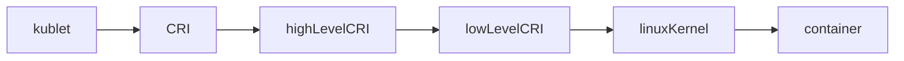

#docker #k8s 

# K8s Yükleme:
## 1.Production Ortamında:

### Container Runtimes:

+ **Container Runtime (Konteyner Çalışma Zamanı)**, konteynerlerin oluşturulması, çalıştırılması ve yönetilmesi gibi işlemleri gerçekleştiren bir yazılım veya araçtır.
+ Kubernetes, konteynerleri doğrudan çalıştırmaz; bunun yerine bir `Container Runtime` kullanır. **Container Runtime Interface (CRI)** aracılığıyla bu `Container Runtime` ile iletişim kurar ve konteynerlerin yaşam döngüsünü yönetir.


> [!NOTE]
> + Dockershim(1), 1.24 sürümü itibarıyla Kubernetes projesinden kaldırıldı. Daha fazla bilgi için [Dockershim Kaldırma SSS](https://kubernetes.io/blog/2022/02/17/dockershim-faq/)'sini okuyun.




1.**Cümle Açıklaması:**
	+ **`dockershim`**, Kubernetes’in eski bir bileşeni olup, Kubernetes'in Docker'ı bir **container runtime** olarak kullanmasını sağlayan bir aracı katmandır.
	+ Kubernetes, **Container Runtime Interface (CRI)** adlı bir API aracılığıyla container runtime'larla iletişim kurar.
	+ Ancak Docker, bu API’yi doğal olarak desteklemediği için Kubernetes, Docker ile çalışabilmek için **dockershim** adında bir uyumluluk katmanı geliştirmiştir.
	+ *Dockershim’in Görevi:*
	+ Docker, Kubernetes’in varsayılan container runtime’ı olarak yıllarca kullanıldı. Ancak Docker, Kubernetes’in kullandığı CRI standardını desteklemediği için Kubernetes’in Docker ile iletişim kurması doğrudan mümkün değildi.
	+ **Dockershim**, Docker ve Kubernetes arasında bir köprü görevi görerek Kubernetes’in Docker’ı bir container runtime olarak kullanmasını sağladı.
	+ **Dockershim**, Docker ve Kubernetes arasında bir köprü görevi görerek Kubernetes’in Docker’ı bir container runtime olarak kullanmasını sağladı.
	+ Dockershim’in kaldırılmasının nedenleri:
	+ **Bakım Yükü**: Dockershim, Kubernetes ekibi için ek bir bakım yükü oluşturuyordu.
	+ **CRI Standardına Uygunluk**: Kubernetes, diğer CRI uyumlu runtime’larla doğrudan iletişim kurmayı tercih etti (örneğin: **containerd**, **CRI-O**).
	+ **Modülerlik ve Performans**: Docker, yalnızca bir container runtime değil, aynı zamanda kendi ekosistemini barındıran bir platformdur. Bu, Kubernetes için fazla karmaşıklık oluşturuyordu.

+ Pod'ların kümedeki her düğümde çalışabilmesi için bir `container runtime` yüklemeniz gerekir.
+ Bu sayfa, düğümleri kurmak için nelerin gerekli olduğunu ve ilgili görevleri açıklar.
+ Kubernetes 1.32, Container Runtime Interface (CRI) ile uyumlu bir Container Runtime kullanmanızı gerektirir.
+ Daha fazla bilgi için CRI sürüm desteğine bakın.
+ Bu sayfa, Kubernetes ile birkaç yaygın `Container Runtimes` zamanının nasıl kullanılacağına dair bir taslak sunmaktadır.
	1. containerd
	2. CRI-O
	3. Docker Engine
	4. Mirantis Container Runtime


> [!NOTE]
> + Kubernetes'in v1.24 öncesi sürümleri, `dockershim` adlı bir bileşen kullanılarak Docker Engine ile doğrudan entegrasyon içeriyordu.
> + Bu özel doğrudan entegrasyon artık Kubernetes'in bir parçası değil (kaldırma işlemini v1.20 versiyonunda [duyurulmuştu](https://kubernetes.io/blog/2020/12/08/kubernetes-1-20-release-announcement/#dockershim-deprecation).)
> + Kubernetes ekibi, daha esnek ve CRI ile doğal olarak uyumlu diğer container runtime’larını desteklemek için **dockershim**’i resmi olarak Kubernetes v1.20 sürümünde kullanımdan kaldırmaya karar verdi ve Kubernetes v1.24 sürümünde tamamen kaldırıldı.(chatGPT).
> + Dockershim kaldırma işleminin sizi nasıl etkileyebileceğini anlamak için [Dockershim kaldırma işleminin sizi etkileyip etkilemediğini kontrol edin](https://kubernetes.io/docs/tasks/administer-cluster/migrating-from-dockershim/check-if-dockershim-removal-affects-you/) başlıklı yazıyı okuyabilirsiniz.
> + Dockershim'i kullanarak geçiş hakkında bilgi edinmek için [Dockershim'den geçiş konusuna](https://kubernetes.io/docs/tasks/administer-cluster/migrating-from-dockershim/) bakın.
> + v1.32 dışında bir Kubernetes sürümü kullanıyorsanız, o sürümün belgelerini kontrol edin.

#### Önkoşulları Yükleme ve Yapılandırma:
##### Network Configuration:
+ Varsayılan olarak, Linux çekirdeği IPv4 paketlerinin arayüzler(`interfaces`) arasında yönlendirilmesine(`routing`) izin vermez.
	+ **eth0** arayüzü: `192.168.1.0/24` ağı ile **eth1** arayüzü: `192.168.2.0/24` ağı birbirleri ile konuşabilir hale gelebilir olacaktır.
+ Çoğu Kubernetes küme ağ uygulaması bu ayarı değiştirir (gerekirse), ancak bazıları bunu yöneticinin(`administrator`) onlar adına yapmasını bekleyebilir. 
+ (Bazıları ayrıca diğer sysctl parametrelerinin ayarlanmasını, çekirdek modüllerinin yüklenmesini, vb. bekleyebilir; kendi ağ uygulamanızın özel belgelerine bakın.)

##### IPv4 paket yönlendirmeyi etkinleştirme:
+ IPv4 paket yönlendirmeyi manuel olarak etkinleştirmek için:

```bash
# sysctl params required by setup, params persist across reboots
cat <<EOF | sudo tee /etc/sysctl.d/k8s.conf
net.ipv4.ip_forward = 1
EOF

# Apply sysctl params without reboot
sudo sysctl --system
```

+ net.ipv4.ip_forward'ın 1 olarak ayarlandığını şu şekilde doğrulayın:

```bash
sysctl net.ipv4.ip_forward
```

#### cgroup drivers:

+ Linux'ta  [control groups](https://kubernetes.io/docs/reference/glossary/?all=true#term-cgroup), işlemlere tahsis edilen kaynakları kısıtlamak için kullanılır.
+ Hem `kubelet`'in hem de altta yatan `container runtime`'ının, [`pod`'lar ve container'lar için kaynak yönetimini](https://kubernetes.io/docs/concepts/configuration/manage-resources-containers/) zorunlu kılmak ve CPU/bellek istekleri ve sınırları gibi kaynakları ayarlamak için `control group`'ları ile etkileşime girmesi gerekir.
+ `cgroup group`'ları ile etkileşim kurmak için, `kubelet` ve `container runtime` bir `cgroup driver` kullanması gerekir.**(1)**
+ `Kubelet` ve `container runtime` aynı cgroup sürücüsünü(`cgroup driver`) kullanması ve aynı şekilde yapılandırılması kritik öneme sahiptir.
+ İki adet cgroup sürücüsü mevcuttur:
	1. cgroupfs
	2. systemd

###### 1.Cümle Açıklaması:
+ **Control Groups veya cgroups Nedir?**
+ **cgroups**, Linux çekirdeğinin bir özelliğidir ve sistem kaynaklarını (CPU, bellek, disk I/O, ağ gibi) yönetmek için kullanılır.
+ Konteynerler, birden fazla uygulamanın aynı makinada izole bir şekilde çalışabilmesini sağlar. **cgroups**, bu izole ortamda her bir konteynerin ne kadar kaynak kullanacağını kontrol eder.
+ **Cgroup Driver Nedir?**
+ **cgroup driver**, cgroups ile Kubernetes bileşenleri (kubelet ve container runtime) arasında bir etkileşimi(to interface) sağlar.
+ **Özet:**
+ Kubelet ve container runtime, kontrol grupları (cgroups) ile iletişim kurabilmek için bir **cgroup driver** kullanmalıdır.
+ (`kubelet + container runtime <-- cgroup driver --> cgroup(kernel)`)

**Kaynak:** [Resmi Sitesi](https://kubernetes.io/docs/setup/production-environment/container-runtimes/)

----

### Kubeadm Kurulumu:
+ Bu sayfa kubeadm toolbox'ın nasıl kurulacağını göstermektedir.
+ Bu kurulum sürecini bir kez tamamladığınızda [ *kubeadm* ile Cluster oluşturma](https://kubernetes.io/docs/setup/production-environment/tools/kubeadm/create-cluster-kubeadm/) hakkında bilgi için, *kubeadm* ile küme oluşturma sayfasına bakın.
+ Bu kurulum kılavuzu Kubernetes v1.31 içindir. Farklı bir Kubernetes sürümü kullanmak istiyorsanız lütfen aşağıdaki sayfalara bakın:


> [!NOTE]
> - [Installing kubeadm (Kubernetes v1.30)](https://v1-30.docs.kubernetes.io/docs/setup/production-environment/tools/kubeadm/install-kubeadm/)
> - [Installing kubeadm (Kubernetes v1.29)](https://v1-29.docs.kubernetes.io/docs/setup/production-environment/tools/kubeadm/install-kubeadm/)
> - [Installing kubeadm (Kubernetes v1.28)](https://v1-28.docs.kubernetes.io/docs/setup/production-environment/tools/kubeadm/install-kubeadm/)
> - [Installing kubeadm (Kubernetes v1.27)](https://v1-27.docs.kubernetes.io/docs/setup/production-environment/tools/kubeadm/install-kubeadm/)

#### Kubeadm Nedir?
+ Kubernetes kümelerini kurmak ve yönetmek için kullanılan bir araçtır.
+ Küme başlatma (init) ve işçi düğümlerini (worker nodes) kümeye ekleme gibi işlemleri kolaylaştırır.

#### Başlamadan önce:
+ Uyumlu bir Linux ana makinesi. Kubernetes projesi, Debian ve Red Hat tabanlı Linux dağıtımları ile paket yöneticisi bulunmayan dağıtımlar için genel kurulum rehberleri sağlar.
+ Makine başına 2 GB veya daha fazla RAM (daha azı uygulamalarınız için çok az yer bırakacaktır).
+ `Control plane` makineleri için 2 veya daha fazla CPU.
+ Kümedeki tüm makineler arasında tam ağ bağlantısı(genel veya özel ağ olabilir.)
+ Her düğüm için benzersiz ana bilgisayar adı, MAC adresi ve product_uuid. Daha [burayı](https://kubernetes.io/docs/setup/production-environment/tools/kubeadm/install-kubeadm/#verify-mac-address) bilgi için buraya bakınız.
+ Makinelerinizde belirli portlar açık. Daha fazla ayrıntı için buraya bakın.


> [!NOTE]
> + **Hatırlatma:** 
> + Control plane, Kubernetes kümesinin beyni olarak düşünülebilir. Kümedeki tüm kaynakları yönetir, izler ve yapılandırır.
> + Control plane, kümenin istenen durumunu gerçek durumla sürekli olarak karşılaştırır ve gerekli değişiklikleri yapar.


> [!NOTE]
> + Kubeadm kurulumu dinamik bağlantı kullanan ikili dosyalar aracılığıyla yapılır ve hedef sisteminizin glibc sağladığını varsayar.(1)
> + Bu, birçok Linux dağıtımı (Debian, Ubuntu, Fedora, CentOS vb. dahil) için makul bir varsayımdır.
> + Ancak glibc'yi varsayılan olarak içermeyen *Alpine Linux* gibi özel ve hafif dağıtımlarda durum her zaman böyle değildir.
> + Beklenti, dağıtımın ya glibc'yi içermesi ya da beklenen sembolleri sağlayan bir uyumluluk katmanına sahip olmasıdır.(2)

**Note Açıklaması:**
1. **Cümle Açıklaması:**
	+ *Kurulumun Binaries ile Yapılması:*
	+ "Binaries" terimi, doğrudan çalıştırılabilir dosyaları ifade eder. Bu dosyalar, bir programın derlenmiş ve çalıştırılmaya hazır halidir.
	+ Kubeadm kurulumu sırasında, bu çalıştırılabilir dosyalar doğrudan kullanılır; yani, kaynak kodu derlemekle uğraşmazsınız.
	+ *Dinamik Bağlantı (Dynamic Linking):*
	+ Dinamik bağlantı, bir çalıştırılabilir dosyanın (binary) çalışırken gerekli kütüphaneleri sisteme çağırması anlamına gelir. Bu yöntem, statik bağlantıdan (tüm kütüphanelerin binary içine gömülmesi) farklıdır.
	+ Dinamik bağlantı, sistem kaynaklarını daha verimli kullanır ve programın boyutunu küçültür.
	+ *glibc Varsayımı:*
	+ **glibc (GNU C Library)**, birçok Linux sisteminde bulunan standart bir C kütüphanesidir. Dinamik bağlantı kullanan birçok program için gereklidir.
	+ Kubeadm, çalışabilmesi için glibc'nin mevcut olduğunu varsayar. Eğer glibc bulunmuyorsa, kurulum sırasında hata alabilirsiniz
2. **Cümle Açıklaması:**
	+ *Glibc ve Beklentiler:*
	+ *glibc (GNU C Library)*, birçok Linux dağıtımında bulunan ve yazılımların temel işlevleri çalıştırabilmesi için ihtiyaç duyduğu bir kütüphanedir.
	+ *Semboller (symbols):* Glibc gibi kütüphaneler, bir yazılımın ihtiyaç duyduğu işlevleri sağlar. Örneğin, "dosya açma", "bellek yönetimi" gibi işlemleri gerçekleştiren kod parçacıkları, glibc içinde tanımlanmış semboller olarak bulunur.
	+ Kubeadm, çalışırken bu sembolleri glibc'den çağırır.
	+ *Dağıtımın glibc İçermesi:*
	+ Kubeadm, sistemde glibc kütüphanesinin kurulu olduğunu varsayar. Eğer bu kütüphane mevcutsa, gerekli semboller hazır olacaktır ve kubeadm sorunsuz çalışır.
	+ *Uyumluluk Katmanı (Compatibility Layer):*
	+ Eğer sistem glibc yerine farklı bir kütüphane kullanıyorsa (örneğin, **musl libc** gibi), bu yazılımların kubeadm için gereken sembolleri sağlayamaması sorunu doğabilir.
	+ Bu durumda, bir **uyumluluk katmanı** kullanılması önerilir. Uyumluluk katmanı, kubeadm'ın beklediği sembolleri sağlayarak glibc'nin eksikliğini telafi eder.
	+ *Pratikte Ne Anlama Geliyor?*
	+ Kullanılan Linux dağıtımında glibc'nin mevcut olduğundan emin olmanız gerekir.
	+ Eğer dağıtımda glibc yoksa (örneğin, Alpine Linux gibi musl libc kullanan sistemlerde), kubeadm için uyumluluk katmanı (örneğin, **glibc compatibility layer**) yüklemeniz gerekebilir.

#### MAC adresinin ve product_uuid'nin her düğüm için benzersiz olduğunu doğrulayın:
+ Ağ arayüzlerinin MAC adresini `ip link` veya `ifconfig -a` komutunu kullanarak alabilirsiniz.
+ product_uuid, `sudo cat /sys/class/dmi/id/product_uuid` komutu kullanılarak kontrol edilebilir.
+ Donanım aygıtlarının benzersiz adreslere sahip olması çok olasıdır, ancak bazı sanal makinelerin değerleri aynı olabilir.
+ Kubernetes, kümedeki düğümleri benzersiz şekilde tanımlamak için bu değerleri kullanır.
+ Bu değerler her düğüm için benzersiz değilse kurulum işlemi [başarısız](https://github.com/kubernetes/kubeadm/issues/31) olabilir.

#### Ağ bağdaştırıcılarını kontrol edin:
+ Birden fazla ağ bağdaştırıcınız varsa ve Kubernetes bileşenlerinize varsayılan rota üzerinden ulaşılamıyorsa, Kubernetes küme adreslerinin uygun bağdaştırıcı üzerinden gitmesi için IP rotası eklemenizi öneririz.(1)
1. **Cümle Açıklaması:**
	+ *Ağ Bağdaştırıcıları (Network Adapters):*
	+ Sisteminizde birden fazla ağ bağdaştırıcısı olabilir. Örneğin:
	+ Bir bağdaştırıcı (örneğin, `eth0`) internete bağlanırken, diğer bağdaştırıcı (örneğin, `eth1`) yerel bir ağ (LAN) için kullanılabilir.
	+ *Varsayılan Rota (Default Route):*
	+ *Varsayılan rota*, sistemin herhangi bir özel yönlendirme kuralı bulunmadığında ağ trafiğini göndereceği varsayılan yoldur.
	+ Kubernetes bileşenleri, genellikle varsayılan rota üzerinden erişilebilir olur.
	+ *Sorun:*
	+ Eğer Kubernetes bileşenleri (örneğin, düğümler veya API sunucusu) varsayılan rotadan erişilemiyorsa, sistem Kubernetes ağına ulaşamaz.
	+ Bu durum, genellikle birden fazla ağ bağdaştırıcısı olan sistemlerde ortaya çıkar. Örneğin:
	+ Kubernetes kümesi, `eth1` gibi farklı bir ağ bağdaştırıcısını kullanıyor olabilir.
	+ Ancak trafik hala varsayılan bağdaştırıcı (`eth0`) üzerinden yönlendiriliyor olabilir.
 
#### Gerekli Portları Kontrol Edin:
+ Kubernetes bileşenlerinin birbirleriyle iletişim kurabilmesi için bu [gerekli portların](https://kubernetes.io/docs/reference/networking/ports-and-protocols/) açık olması gerekir.
+ Bir portun açık olup olmadığını kontrol etmek için [netcat](https://netcat.sourceforge.net/) gibi araçları kullanabilirsiniz.

```shell
$ nc 127.0.0.1 6443 -v
```

+ Kullandığınız pod network eklentisi de bazı portların açık olmasını gerektirebilir.
+ Bu, her pod ağ eklentisinde(*pod network plugin*) farklılık gösterdiğinden, hangi portlara ihtiyaç duyduklarını öğrenmek için lütfen eklentilerin belgelerine bakın.(1)

1. **Cümle Açıklaması:**
	+ *Pod Network Plugin Nedir?*
	+ *Pod Network Plugin*, Kubernetes'te **ağ iletişimini** sağlamak ve yönetmek için kullanılan bir eklentidir.
	+ Bu eklentiler, Kubernetes ortamında çalışan Pod'lar arasında, ayrıca Pod'lar ve diğer ağ kaynakları (örneğin, internet veya diğer hizmetler) arasında ağ bağlantısını sağlar.
	+ *Pod Ağının Görevi:*
	+ Kubernetes’te, Pod’lar birbirleriyle **aynı ağ içinde** çalışıyormuş gibi iletişim kurmalıdır.
	+ Ağ trafiğinin, tüm düğümler (nodes) ve üzerindeki Pod’lar arasında yönlendirilmesi gerekir.
	+ Her Pod'a, bir **IP adresi** atanır ve bu IP adresi aracılığıyla iletişim kurar.
	+ Bu işlevlerin sağlanması için **Pod Network Plugin** kullanılır.
	+ *Neden Pod Network Plugin Kullanılır?*
	+ Kubernetes, kendi başına ağ iletişim altyapısını yönetmez.
	+ Farklı Kubernetes kurulumlarında ve altyapılarında esneklik sağlamak için ağ işlevlerini dış eklentilere bırakır.
	+ Pod Network Plugin'ler, farklı altyapılarda çalışacak şekilde **CNI (Container Network Interface)** standardına uyum sağlar.
	+ *Öne Çıkan Pod Network Plugin Türleri:*
	+ Kubernetes’te yaygın olarak kullanılan bazı ağ eklentileri şunlardır:
	+ *Calico*:
	+ Pod'lar arası iletişim ve *ağ politikaları* yönetiminde güçlüdür.
	+ İzin ve güvenlik politikalarını uygulama konusunda esneklik sağlar.
	+ Büyük ölçekli kümeler için popüler bir seçimdir
	+ *Flannel:*
	+ Basit ve hızlı bir ağ çözümüdür.
	+ Pod'lar arasında temel ağ iletişimini sağlamayı hedefler.
	+ Karmaşık özelliklerden çok temel ağ altyapısı sunar.
	+ *Weave Net*:
	+ Kubernetes düğümleri arasında **şifreli ağ trafiği** sağlar.
	+ Daha fazla güvenlik gereksinimi olan ortamlarda kullanılır.
	+ *Cilium*:
	+ *eBPF* teknolojisini kullanır ve ağ performansını artırır.
	+ Mikro hizmetler arasında iletişim için detaylı izleme ve güvenlik sunar.
	+ *Kube-router*:
	+ Kubernetes için yönlendirme, yük dengeleme ve ağ politikası gibi özellikleri sağlar.
	+ *Multus*:
	+ Pod'lara birden fazla ağ arayüzü bağlamak için kullanılır.
	+ Örneğin, bir Pod hem dahili hem de harici bir ağda çalışabilir.

#### Takas(Swap) yapılandırması
+ Bir kubelet'in varsayılan davranışı, bir düğümde takas belleği(*swap memory*) algılanırsa başlatma işlemini başarısızlığa uğratmaktır.
+ Bu, takas(swap) işleminin `kubelet` tarafından **devre dışı bırakılması** veya **tolere edilmesi** gerektiği anlamına gelir.
###### Tolere edilmesi;
+ Takasa izin vermek için `failSwapOn: false`'u kubelet yapılandırmasına veya komut satırı argümanı olarak ekleyin.  Not: `failSwapOn: false` sağlansa bile, iş yüklerinin varsayılan olarak takas(swap) erişimi olmaz. Bu, yine kubelet yapılandırma dosyasında bir swapBehavior ayarlanarak değiştirilebilir.
+ Swap'ı kullanmak için varsayılan NoSwap ayarından farklı bir swapBehavior ayarlayın.
+ Daha fazla ayrıntı için  [Swap bellek yönetimine](https://kubernetes.io/docs/concepts/architecture/nodes/#swap-memory)  bakın.
###### Devre dışı bırakılması:
+ Takas işlemini devre dışı bırakmak için `sudo swapoff -a` komutu kullanılarak takas işlemi geçici olarak devre dışı bırakılabilir.
+ Bu değişikliğin yeniden başlatması geçişlerinde kalıcı olmasını sağlamak için, sisteminizde nasıl yapılandırıldığına bağlı olarak `/etc/fstab`, `systemd.swap` gibi yapılandırma dosyalarında takasın devre dışı bırakıldığından emin olun.


> [!NOTE]
> + `sudo swapon --show` : tanımlı bir tabloda özentini ekrana basar.
> + 

#### Container Runtime Yükleme:
+ Kubernetes, Pod'larda konteyner çalıştırmak için bir [container runtime](https://kubernetes.io/docs/setup/production-environment/container-runtimes) kullanır.
+ Varsayılan olarak, Kubernetes, seçtiğiniz container runtime ile iletişim kurmak için **Container Runtime Interface (CRI)**'yi kullanır.
+ Eğer bir çalışma zamanı belirtmezseniz, **kubeadm**, bilinen endpoint'leri listesini tarayarak sistemde yüklü bir konteyner çalışma zamanını otomatik olarak algılamaya çalışır.(1)

1. **Cümle Açıklaması:**
	+ *Endpoint nedir?*
	+ Kubernetes'teki **kubeadm** gibi araçlar, bir konteyner çalışma zamanının (container runtime) sistemde mevcut olup olmadığını anlamak için bazı önceden belirlenmiş adresleri kontrol eder.
	+ Bu adresler, çalışma zamanının dinlediği **soket dosyaları** veya API uç noktaları olabilir.
	+ **Docker için:** `/var/run/docker.sock`
	+ **containerd için:** `/run/containerd/containerd.sock`
	+ **CRI-O için:** `/var/run/crio/crio.sock`
	+ Bu yollar (endpoints), kubeadm'nin hangi çalışma zamanının kullanıldığını otomatik olarak anlamasını sağlar.

+ Birden fazla veya hiç konteyner çalışma zamanı algılanmazsa kubeadm bir hata fırlatacak ve hangisini kullanmak istediğinizi belirtmenizi isteyecektir.
+ Daha fazla bilgi için [container runtimes](https://kubernetes.io/docs/setup/production-environment/container-runtimes/) bakın


> [!NOTE]
> + Docker Engine, Kubernetes ile çalışacak container runtime için gerekli olan [CRI](https://kubernetes.io/docs/concepts/architecture/cri/)'yi(Container Runtime Interface)** uygulamaz.
> + Bu nedenle ek olarak [cri-dockerd](https://mirantis.github.io/cri-dockerd/) servisinin kurulması gerekmektedir.
> + cri-dockerd, 1.24 sürümünde kubelet'ten [kaldırılan](https://kubernetes.io/blog/2022/02/17/dockershim-faq/) eski gömülü(legacy built-in) Docker Engine desteğine dayanan bir projedir.


+ Aşağıdaki tablolar desteklenen işletim sistemleri için bilinen enpoint'leri içerir:

| Runtime                           | Path to Unix domain socket                   |
| --------------------------------- | -------------------------------------------- |
| containerd                        | `unix:///var/run/containerd/containerd.sock` |
| CRI-O                             | `unix:///var/run/crio/crio.sock`             |
| Docker Engine (using cri-dockerd) | `unix:///var/run/cri-dockerd.sock`           |

#### Kubeadm, kubelet ve kubectl kurulumu:
+ Bu paketleri tüm makinelerinize kuracaksınız:
	+ `kubeadm`: kümeyi önyüklemek için kullanılan komut.
	+ `kubelet`: Kümenizde bulunan tüm makinelerde çalışan ve pod'ları ve konteynerleri başlatmak gibi işlemleri yapan bileşen.
	+ `kubectl`: Kümenizle konuşmak için komut satırı aracı.

+ kubeadm sizin için kubelet veya kubectl'i yüklemeyecek veya yönetmeyecektir

> [!CAUTION]
> + kubeadm sizin için kubelet veya kubectl'i yüklemeyecek veya yönetmeyecektir, 
> + bu nedenle kubeadm'in sizin için yüklemesini istediğiniz kubernetes control plane'inin sürümüyle eşleştiğinden emin olmanız gerekir.(1)
> + Bunu yapmazsanız, beklenmeyen, hatalı davranışlara yol açabilecek bir sürüm sapması oluşma riski vardır.
> + Ancak kubelet ile kontrol düzlemi arasında küçük bir sürüm sapması destekleniyor, ancak kubelet sürümü hiçbir zaman API sunucusu sürümünü aşamaz.
> + Örneğin, 1.7.0 sürümünü çalıştıran kubelet'in 1.8.0 API sunucusuyla tam uyumlu olması gerekir, ancak tam tersi mümkün değildir
> + Kubectl'i yükleme hakkında bilgi için  [kubectl'i yükleme ve ayarlama](https://kubernetes.io/docs/tasks/tools/). bölümüne bakın.


1. **Cümle Açıklaması:**
	+ Bu cümlede, **kubeadm** aracının Kubernetes'in bazı bileşenlerini otomatik olarak yükleme veya yönetme işlevine sahip olmadığı belirtiliyor. Daha spesifik olarak:
	+ *kubeadm'in görevleri:*
	+ *kubeadm*, Kubernetes cluster'ını kurmak, kontrol düzlemini (control plane) yapılandırmak ve kümenin başlatılması gibi işlemleri gerçekleştiren bir araçtır. Ancak bu, kubeadm'in tüm Kubernetes bileşenlerini yüklediği veya yönettiği anlamına gelmez.
	+ *kubelet ve kubectl:*
	+ *kubelet*, Kubernetes düğümlerinde çalışan ve pod'ları yöneten bir bileşendir.
	+ *kubectl*, Kubernetes ile etkileşim kurmak için kullanılan komut satırı aracıdır.
	+ *kubeadm*, bu iki bileşenin yüklenmesinden veya güncellenmesinden sorumlu değildir.
	+ *Sürüm Uyumu:*
	+ *kubeadm* kullanılarak kurulacak olan kontrol düzlemi bileşenlerinin (API Server, Controller Manager, Scheduler) sürümü, `kubelet` ve `kubectl`'in sürümleriyle uyumlu olmalıdır.
	+ Bu nedenle, bu araçları (kubelet ve kubectl) *manuel olarak yüklemeniz ve doğru sürümde olduğundan emin olmanız* gerekir.
	+ *Uygulamada ne yapmalısınız?*
	+ Kubernetes kontrol düzlemini kurmadan önce, `kubelet` ve `kubectl`'in doğru sürümünü yükleyip çalıştığından emin olmalısınız.
	+ Örneğin, Control planei **v1.28** sürümünde olacaksa, **kubelet** ve **kubectl** de v1.28 ile uyumlu olmalıdır.


> [!WARNING]
> + Bu talimatlar tüm Kubernetes paketlerini sistem yükseltmelerinden hariç tutar.**(1)**
> + Çünkü kubeadm ve Kubernetes'in  [yükseltilmesi özel dikkat](https://kubernetes.io/docs/tasks/administer-cluster/kubeadm/kubeadm-upgrade/) gerektiriyor.

1. **Cümle Açıklaması:**
	+ Bu cümlede, **Kubernetes paketlerinin sistem güncellemelerinden hariç tutulduğunu** ifade eden bir durumdan bahsediliyor. Daha detaylı açıklarsak:
	+ *Sistem güncellemeleri (system upgrades):*
	+ Bir Linux sisteminde, sistem güncellemesi yapıldığında genellikle işletim sistemi çekirdeği, sistem araçları ve yüklü yazılım paketleri güncellenir.
	+ Örneğin, `apt upgrade` veya `yum update` gibi komutlar sistemdeki mevcut paketlerin yeni sürümlerini yükler.
	+ *Kubernetes paketlerinin hariç tutulması:*
	+ Kubernetes bileşenlerinin (örn. **kubeadm**, **kubelet**, **kubectl**) belirli bir sürümde sabit kalması genellikle kritik öneme sahiptir. Çünkü Kubernetes bileşenlerinin sürüm uyumluluğu, bir cluster'ın doğru çalışması için hayati önem taşır.
	+ Cümledeki ifadeye göre, sistem güncellemesi yapıldığında bu Kubernetes paketlerinin güncellenmesi *engellenmektedir*.
	+ *Neden hariç tutulur?*
	+ Kubernetes bileşenlerinin plansız veya yanlış bir şekilde güncellenmesi cluster'ın çalışmasını bozabilir.
	+ Güncellemeler sırasında uyumsuzluk veya beklenmeyen hatalar oluşabilir.
	+ Örneğin, kubelet'in bir sürüm yükseltmesi kontrol düzlemiyle uyumlu olmayabilir ve bu, cluster'ı bozabilir.
	+ *Nasıl uygulanır?*
	+ Bu durum genellikle paket yöneticisi ayarlarıyla sağlanır. Örneğin:
	+ Debian/Ubuntu'da, `/etc/apt/preferences.d` dizinine bir dosya eklenerek belirli paketler **hold** (tut) olarak işaretlenir.

	```shell
	$ sudo apt-mark hold kubeadm kubelet kubectl
	```

	+ CentOS/RHEL'de, `yum` veya `dnf` ile bir exclude kuralı tanımlanabilir:

	```yum
	exclude=kubeadm kubelet kubectl
	```

	+ Bu ayarlarla Kubernetes paketlerinin güncellenmesi engellenir ve yalnızca kullanıcı manuel olarak güncelleme yaparsa değişir.


For more information on version skews, see:
+ Kubernetes  [sürümü ve sürüm sapması politikası](https://kubernetes.io/docs/setup/release/version-skew-policy/)
+ Kubeadm'e özgü [sürüm sapma politikası](https://kubernetes.io/docs/setup/production-environment/tools/kubeadm/create-cluster-kubeadm/#version-skew-policy)


> [!CAUTION]
> + Eski paket depoları (apt.kubernetes.io ve yum.kubernetes.io) [13 Eylül 2023 tarihinden itibaren kullanımdan kaldırılmış ve dondurulmuştur](https://kubernetes.io/blog/2023/08/31/legacy-package-repository-deprecation/)
> + 13 Eylül 2023'ten sonra yayınlanan Kubernetes sürümlerini yüklemek için [`pkgs.k8s.io` adresinde barındırılan ](https://kubernetes.io/blog/2023/08/15/pkgs-k8s-io-introduction/) yeni paket depolarını kullanmanız şiddetle tavsiye edilir ve gereklidir.
> + Kullanımdan kaldırılan eski depolar ve içerikleri gelecekte herhangi bir zamanda ve herhangi bir bildirim süresine gerek kalmaksızın kaldırılabilir.
> + Yeni paket depoları v1.24.0'dan itibaren Kubernetes sürümleri için indirmeler sağlıyor.


> [!NOTE]
> + Her Kubernetes minor için özel bir paket deposu vardır.
> + Eğer v1.31'den farklı bir minor kurmak istiyorsanız, lütfen istediğiniz alt sürümün kurulum kılavuzuna bakın.

##### A.Debian Temeli Dağıtımlar:

Bu talimatlar Kubernetes v1.31 içindir.
1. Apt paket indeksini güncelleyin ve Kubernetes apt deposunu kullanmak için gereken paketleri yükleyin:

```shell
sudo apt-get update
# apt-transport-https may be a dummy package; if so, you can skip that package
sudo apt-get install -y apt-transport-https ca-certificates curl gpg
```

2. Kubernetes paket depoları için genel imzalama anahtarını(public signing key) indirin. Tüm depolar için aynı imzalama anahtarı kullanıldığından URL'deki sürümü dikkate almayabilirsiniz:

```shell
# If the directory `/etc/apt/keyrings` does not exist, it should be created before the curl command, read the note below.
# sudo mkdir -p -m 755 /etc/apt/keyrings
curl -fsSL https://pkgs.k8s.io/core:/stable:/v1.31/deb/Release.key | sudo gpg --dearmor -o /etc/apt/keyrings/kubernetes-apt-keyring.gpg
```


> [!CAUTION]
> + Debian 12 ve Ubuntu 22.04'ten daha eski sürümlerde /etc/apt/keyrings dizini varsayılan olarak mevcut değildir ve curl komutundan önce oluşturulması gerekir.

3. Uygun Kubernetes apt deposunu ekleyin. Lütfen bu deponun yalnızca Kubernetes 1.31 için paketler içerdiğini unutmayın; Diğer Kubernetes minor(alt sürüm) için, istediğiniz minor'la eşleşmesi için URL'deki Kubernetes minor'u değiştirmeniz gerekir(Ayrıca, kurmayı planladığınız Kubernetes sürümüne ait belgeleri okuduğunuzdan da emin olmalısınız).

```shell
# This overwrites any existing configuration in /etc/apt/sources.list.d/kubernetes.list
echo 'deb [signed-by=/etc/apt/keyrings/kubernetes-apt-keyring.gpg] https://pkgs.k8s.io/core:/stable:/v1.31/deb/ /' | sudo tee /etc/apt/sources.list.d/kubernetes.list
```

4. Apt paket dizinini güncelleyin, `kubelet`, `kubeadm` ve `kubectl`'i kurun ve sürümlerini sabitleyin:

```shell
sudo apt-get update
sudo apt-get install -y kubelet kubeadm kubectl
sudo apt-mark hold kubelet kubeadm kubectl           # Sürüm sabitleme
```

> [!NOTE]
> + `apt-mark hold` komut;
> + Debian/Ubuntu'da, `/etc/apt/preferences.d` dizinine bir dosya eklenerek belirli paketler **hold** (tut) olarak işaretlenir.

5. (İsteğe bağlı) kubeadm'yi çalıştırmadan önce kubelet servisini etkinleştirin:

```shell
sudo systemctl enable --now kubelet
```

+ Kubelet artık her birkaç saniyede bir yeniden başlıyor, çünkü kubeadm'in ona ne yapması gerektiğini söylemesini beklerken bir `crashloop` da bekliyor.(1)

##### B.Red Hat Temeli Dağıtımlar:
1. SELinux'u `permissive` moda ayarlayın:
	+ Bu yönergeler Kubernetes 1.31 sürümüne aittir.

```shell
# Set SELinux in permissive mode (effectively disabling it)
sudo setenforce 0
sudo sed -i 's/^SELINUX=enforcing$/SELINUX=permissive/' /etc/selinux/config
```


> [!WARNING]
> + SELinux'u `setenforce 0` ve `sed ...` çalıştırarak `permissive moda` ayarlamak onu etkin bir şekilde devre dışı bırakır.
> + Bu, container'ların ana dosya sistemine erişebilmesi için gereklidir; örneğin bazı `cluster network plugin`'leri bunu gerektirir.
> + Bu, SELinux desteği kubelet'te geliştirilene kadar yapılmak zorunda.
> + SELinux'u nasıl yapılandıracağınızı biliyorsanız etkin bırakabilirsiniz ama bu, kubeadm tarafından desteklenmeyen ayarları gerektirebilir.


2. Kubernetes yum deposunu ekleyin. Depo tanımındaki exclude parametresi, Kubernetes ile ilgili paketlerin yum update çalıştırıldığında yükseltilmemesini sağlar; çünkü Kubernetes'i yükseltmek için izlenmesi gereken özel bir prosedür vardır. Lütfen bu deponun yalnızca Kubernetes 1.31 için paketler içerdiğini not ediniz; Diğer Kubernetes minor (alt sürümleri) için, istediğiniz minor ile (alt sürümle) eşleşmesi için URL'deki Kubernetes minor'unu (alt sürümünü) değiştirmeniz gerekir.(Ayrıca, kurmayı planladığınız Kubernetes sürümüne ait belgeleri okuduğunuzdan da emin olmalısınız)

```shell
# This overwrites any existing configuration in /etc/yum.repos.d/kubernetes.repo
cat <<EOF | sudo tee /etc/yum.repos.d/kubernetes.repo
[kubernetes]
name=Kubernetes
baseurl=https://pkgs.k8s.io/core:/stable:/v1.31/rpm/
enabled=1
gpgcheck=1
gpgkey=https://pkgs.k8s.io/core:/stable:/v1.31/rpm/repodata/repomd.xml.key
exclude=kubelet kubeadm kubectl cri-tools kubernetes-cni
EOF
```

3. Kubelet, kubeadm ve kubectl'i yükleyin

```shell
sudo yum install -y kubelet kubeadm kubectl --disableexcludes=kubernetes
```

4. (İsteğe bağlı) kubeadm'yi çalıştırmadan önce kubelet servisini etkinleştirin:

```shell
sudo systemctl enable --now kubelet
```

+ Kubelet artık her birkaç saniyede bir yeniden başlıyor, çünkü kubeadm'in ona ne yapması gerektiğini söylemesini beklerken bir `crashloop` da bekliyor.(1)
##### C.Kaynak Kodan Derleme:

CNI eklentilerini yükleyin (çoğu pod ağı için gereklidir):

```bash
CNI_PLUGINS_VERSION="v1.3.0"
ARCH="amd64"
DEST="/opt/cni/bin"
sudo mkdir -p "$DEST"
curl -L "https://github.com/containernetworking/plugins/releases/download/${CNI_PLUGINS_VERSION}/cni-plugins-linux-${ARCH}-${CNI_PLUGINS_VERSION}.tgz" | sudo tar -C "$DEST" -xz
```

Define the directory to download command files:

> [!NOTE]
> + DOWNLOAD_DIR değişkeni yazılabilir bir dizine ayarlanmalıdır.
> + Flatcar Container Linux kullanıyorsanız `DOWNLOAD_DIR="/opt/bin"` olarak ayarlayın.

```bash
DOWNLOAD_DIR="/usr/local/bin"
sudo mkdir -p "$DOWNLOAD_DIR"
```

İsteğe bağlı olarak crictl'i yükleyin (Konteyner Çalışma Zamanı Arayüzü (CRI) ile etkileşim için gereklidir, kubeadm için isteğe bağlıdır):

```bash
CRICTL_VERSION="v1.31.0"
ARCH="amd64"
curl -L "https://github.com/kubernetes-sigs/cri-tools/releases/download/${CRICTL_VERSION}/crictl-${CRICTL_VERSION}-linux-${ARCH}.tar.gz" | sudo tar -C $DOWNLOAD_DIR -xz
```

kubeadm ve kubelet'i kurun ve bir kubelet systemd servisi ekleyin:

```bash
RELEASE="$(curl -sSL https://dl.k8s.io/release/stable.txt)"
ARCH="amd64"
cd $DOWNLOAD_DIR
sudo curl -L --remote-name-all https://dl.k8s.io/release/${RELEASE}/bin/linux/${ARCH}/{kubeadm,kubelet}
sudo chmod +x {kubeadm,kubelet}

RELEASE_VERSION="v0.16.2"
curl -sSL "https://raw.githubusercontent.com/kubernetes/release/${RELEASE_VERSION}/cmd/krel/templates/latest/kubelet/kubelet.service" | sed "s:/usr/bin:${DOWNLOAD_DIR}:g" | sudo tee /usr/lib/systemd/system/kubelet.service
sudo mkdir -p /usr/lib/systemd/system/kubelet.service.d
curl -sSL "https://raw.githubusercontent.com/kubernetes/release/${RELEASE_VERSION}/cmd/krel/templates/latest/kubeadm/10-kubeadm.conf" | sed "s:/usr/bin:${DOWNLOAD_DIR}:g" | sudo tee /usr/lib/systemd/system/kubelet.service.d/10-kubeadm.conf
```

> [!NOTE]
> + Varsayılan olarak glibc içermeyen Linux dağıtımları için [[#Başlamadan önce]] bölümündeki notlara bakınız.

[Install Tools page](https://kubernetes.io/docs/tasks/tools/#kubectl) talimatları izleyerek kubectl'i kurun.

İsteğe bağlı olarak kubeadm'i çalıştırmadan önce kubelet servisini etkinleştirin:

```shell
sudo systemctl enable --now kubelet
```

> [!NOTE]
> + Flatcar Container Linux dağıtımı /usr dizinini salt okunur bir dosya sistemi olarak bağlar.
> + Kümenizi başlatmadan önce, yazılabilir bir dizin yapılandırmak için ek adımlar atmanız gerekir.
> + Yazılabilir bir dizinin nasıl ayarlanacağını öğrenmek için  [Kubeadm Troubleshooting guide](https://kubernetes.io/docs/setup/production-environment/tools/kubeadm/troubleshooting-kubeadm/#usr-mounted-read-only) bakın.

+ Kubelet artık her birkaç saniyede bir yeniden başlıyor, çünkü kubeadm'in ona ne yapması gerektiğini söylemesini beklerken bir `crashloop` da bekliyor.(1)

1. **Cümle Açıklaması:** `Crashloop`
	+ *Crashloop*, bir programın başarısız olup sürekli yeniden başlatıldığı bir durumdur.
	+ Bu durumda, kubelet bir sorunla karşılaşır ve kendi içinde yeniden başlatılır, çünkü görevini yerine getirmek için gereken yapılandırma veya talimatlar eksiktir.
	+ *Kubelet'in Kubeadm'den Talimat Beklemesi:*
	+ *kubeadm*, Kubernetes cluster'ını başlatmak ve yapılandırmak için kullanılan bir araçtır.
	+ Kubelet, kubeadm'den "ne yapması gerektiği" konusunda talimat alana kadar aktif olarak bekler ve çalışamaz.
	+ Talimatlar şunları içerebilir:
		+ Hangi control plane bileşenlerine bağlanması gerektiği.
		+ Hangi ayarlarla düğüm olarak çalışacağı
	+ *Neden Bu Durum Olur?*
	+ *kubeadm init* veya *kubeadm join* gibi komutlar henüz çalıştırılmamış olabilir.
	+ Gerekli yapılandırma dosyaları kubelet için eksik olabilir (örneğin, `/etc/kubernetes/kubelet.conf`).
	+ Kubelet başlatıldığında, görevini tamamlamak için kubeadm'den talimat bekler, ancak bu talimatlar gelmezse sürekli yeniden başlar.
	+ *Bu Durumda Ne Yapılmalı?*
	+ Eğer bir **master node** (Control Plane) kuruyorsanız:
		1. `kubeadm init` komutunu çalıştırarak cluster'ı başlatın.
		2. Kubelet, bu komuttan sonra yapılandırma dosyalarını alır ve düzgün çalışmaya başlar.
	+ Eğer bir **worker node**  kuruyorsanız:
		1. `kubeadm join` komutunu kullanarak düğümü mevcut cluster'a ekleyin.
		2. Bu komut, kubelet'in gerekli ayarları almasını sağlar.
	+ **Özet:** Cümle, kubelet'in başlangıçta "talimat beklerken" çalışamaz durumda olduğunu ve kubeadm'den gerekli yapılandırma geldiğinde normal işleyişine başlayacağını ifade etmektedir. Bu, Kubernetes cluster'ı kurulumunda normal bir aşamadır.

#### Bir cgroup Driver'ını yapılandırma:
+ Hem container runtime hem de kubelet, Linux makinelerde cgroup'ların yönetimi için önemli olan "cgroup driver" adlı bir özelliğe sahiptir.(1)

1. **Cümle Açıklaması:**
	+ *Cgroups Nedir?*
	+ **Cgroups** (Control Groups), Linux çekirdeğinde sistem kaynaklarının (CPU, bellek, disk, ağ) belirli işlemler veya gruplar için nasıl ayrılacağını, sınırlandırılacağını ve takip edileceğini belirleyen bir mekanizmadır.
	+ Kubernetes, bu özelliği container'ların kaynak kullanımını kontrol etmek için kullanır.
	+ *Cgroup Driver Nedir?*
	+ *Cgroup driver*, Linux cgroups sisteminin nasıl kullanılacağını belirleyen bir yazılım bileşenidir.
	+ Kubernetes'te iki ana cgroup sürücüsü vardır:
		1. `cgroupfs`: Doğrudan Linux çekirdeğiyle çalışır.
		2. `systemd`: `systemd` sistemiyle entegre çalışır (modern Linux dağıtımları tarafından yaygın olarak kullanılır).
	+ *Uygulamada Ne Yapılmalı?*
	+ Cgroup driver ayarlarının uyumlu olduğundan emin olun:
		1.  *Kubelet* : `/var/lib/kubelet/config.yaml` veya başlatma parametrelerinde cgroup driver belirtilir.
		2. *Container Runtime:* Çalışma zamanının yapılandırma dosyasına (`/etc/containerd/config.toml` gibi) uygun sürücü seçilir.
	+ Örneğin, `systemd` kullanıyorsanız:
		+ *Container Runtime:* `cgroup driver = systemd`
		+ *Kubelet:* `--cgroup-driver=systemd` veya  `SystemdCgroup = true` on `/etc/containerd/config.toml`


> [!WARNING]
> + Container runtime ve kubelet cgroup driver'ların eşleşmesi gerekir, aksi takdirde kubelet işlemi başarısız olur.
> + Daha fazla ayrıntı için  [Configuring a cgroup driver](https://kubernetes.io/docs/tasks/administer-cluster/kubeadm/configure-cgroup-driver/) bölümüne bakın.

#### Sorun giderme:
+ Eğer kubeadm ile ilgili sorun yaşıyorsanız lütfen sorun  [giderme dokümanlarımıza](https://kubernetes.io/docs/setup/production-environment/tools/kubeadm/troubleshooting-kubeadm/). başvurun.

#### Script ile Kurulum:

```shell

```


**Kaynak:** [Resmi Sitesi](https://kubernetes.io/docs/setup/production-environment/tools/kubeadm/install-kubeadm/)