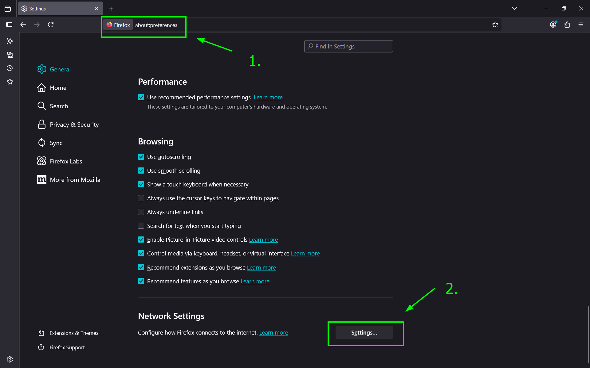
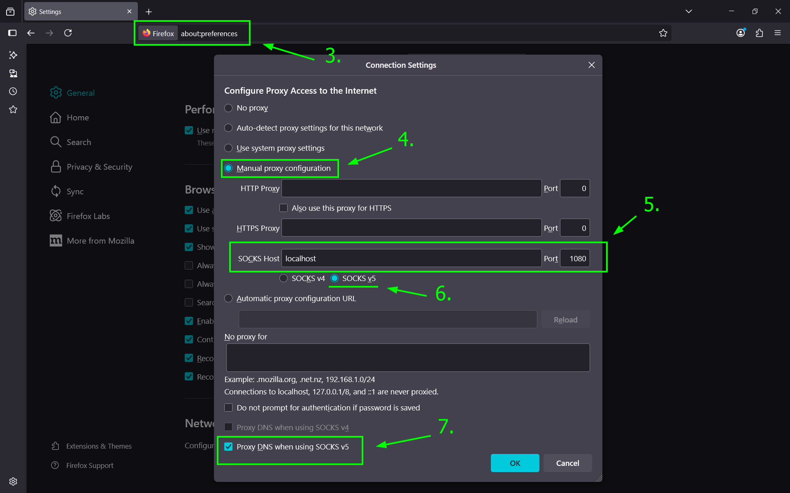

#### ssh Config Dosyası


## ssh Komutları:
### 1.ssh-copy-id:
```shell
$ ssh-copy-id -i /home/$USER/.ssh/id_rsa.pub user@IP_address 
```
> **Expalanation:**
> + ssh-copy-id, public SSH anahtarınızı uzak makinenin `authorized_keys` dosyasına kopyalayan bir scripttir. Yani şifresiz SSH girişini mümkün kılar.
> + `ssh-copy-id` komutu, yerel bilgisayarınızdaki genel SSH anahtarınızı (genellikle `~/.ssh/id_rsa.pub` veya `~/.ssh/id_ed25519.pub`) uzak sunucunun `~/.ssh/authorized_keys` dosyasına ekler.
> + `-i` parametresi: Eğer varsayılan `id_rsa.pub` dışında bir anahtar kullanıyorsanız, `-i` seçeneği ile belirtebilirsiniz:


> [!CAUTION]
> + `ssh-copy-id` komut *linux* ve *mac* işletim sistemlerinde mevcuttur. 
> + *Windows* işletim sistemlerinde yoktur.

### 2.ssh-keygen:
#### `-R` parametresi:

+ `ssh-keygen -R` komutu, **`known_hosts`** dosyasından bir ana bilgisayar (`host`) kaydını kaldırmak için kullanılır.
+ Bu, genellikle bir uzak sunucunun (`host`) anahtar bilgileri değiştiğinde veya bir bağlantı problemi yaşandığında kullanılır.
+ Aşağıdaki gibi mesaj alıyorsanız.
```shell
@@@@@@@@@@@@@@@@@@@@@@@@@@@@@@@@@@@@@@@@@@@@@@@@@@@@@@@@@@@
@    WARNING: REMOTE HOST IDENTIFICATION HAS CHANGED!     @
@@@@@@@@@@@@@@@@@@@@@@@@@@@@@@@@@@@@@@@@@@@@@@@@@@@@@@@@@@@
IT IS POSSIBLE THAT SOMEONE IS DOING SOMETHING NASTY!
Someone could be eavesdropping on you right now (man-in-the-middle attack)!
It is also possible that a host key has just been changed.
```

```shell
ssh-keygen -R 192.168.1.120
```

+ **`known_hosts` Dosyası Nedir?**
+ SSH istemcisi, her bağlantı kurduğu ana bilgisayarın (`host`) `public key`'ini **`~/.ssh/known_hosts`** dosyasına kaydeder.
+ Anahtar(`key`), bağlantının güvenilir olduğundan emin olmak için kullanılır. Eğer anahtar değişirse, SSH bir uyarı verir ve bağlantıyı engeller.


> [!WARNING]
> + Eğer bir ana bilgisayar özel bir port üzerinden bağlanıyorsa, port numarasını belirtmek gerekir:
> + Örneğin; `ssh-keygen -R [192.168.1.10]:2222` 
> + Burada, `192.168.1.10` adresindeki ve `2222` portundaki kayıt kaldırılır.

#### Manual Kullanımı:
+ `ssh-keygen -R` işlemini manuel olarak da yapabilirsiniz.

```shell
vim ~/.ssh/known_hosts
```

+ Hedef ana bilgisayarın (host) satırını bulun ve silin.
+ Kaydedin ve çıkın.

# Private Key ve Public Key:


# 🔒 SSH Tünelleme (SSH Tunneling):

+ Yerel makinadaki bir port, **uzak makinadaki bir hedefe yönlendirilir**.

```shell
ssh -L 9191:localhost:9090 user@remote-host
```

## A. Local Port Forwarding(`ssh -L`):

+ Bu, **yerel bilgisayarın (senin kendi makinanda)** ile **uzaktaki Ubuntu sunucusu (192.168.1.133)** arasında bir **SSH tüneli (port forwarding)** kurar.
### Örnek A.1:

#### Uzak Makine:

+ Makinenin IP adresi: **192.168.1.133**

**App.php:**

```php
<?php
echo "Tüm Sistem Bilgisi: ". php_uname();
?>
```

> + `php_uname()` fonksiyonu, PHP'de çalıştığınız işletim sistemi hakkında bilgi verir.
> + Bu fonksiyon özellikle sunucunun işletim sistemi türü, makine adı, çekirdek versiyonu gibi bilgileri almanızı sağlar.


> [!NOTE]
> ```php
> php_uname(string $mode = "a"): string
> ```
> + `$mode` → Hangi bilginin döndürüleceğini belirtir. Varsayılan `"a"`'dır.
> 	- "a" → Tüm bilgileri döndürür (varsayılan)
> 	- "s" → İşletim sistemi adı (örneğin: `Linux`, `Windows`)
> 	- "n" → Host adı (makine adı)
> 	- "r" → Sürüm bilgisi (kernel release)
> 	- "v" → Versiyon (kernel version)
> 	- "m" → Makine türü (örneğin: `x86_64`)

```shell
php -S localhost:8000
```
#### Yerel Makine:

+ Makinenin IP adresi: **192.168.1.105**

```shell
ssh -L 9090:localhost:8000 ottoman@192.168.1.133 -N
```

> + `ssh` → SSH bağlantısı başlatır.
> + **Yerel port (senin makinan)** 9090 ile **uzaktaki sunucunun kendi localhost portu** 8000 arasında bir tünel açar.
> + `ottoman@192.168.1.133` → SSH ile bağlanılacak kullanıcı ve IP (Ubuntu sunucusu)
> + `-N` → Bağlantıda **komut çalıştırma**, sadece tünel kur (terminal açılmaz).

```shell
curl -X GET localhost:9090
```

**curl komut çıktısı:**

```shell
Linux grafana-prp 6.8.0-71-generic #71-Ubuntu SMP PREEMPT_DYNAMIC Tue Jul 22 16:52:38 UTC 2025 x86_64
```

> [!NOTE]
> **🔄 Bu Ne İşe Yarar?**
> +  🖥️ **Yerel(`192.168.1.105`) makinandaki `localhost:8000`** adresine yapılan istekler → 🌐 **Uzak(`192.168.1.133`) sunucudaki `localhost:9090`** portuna yönlendirilir.
> + Yani:
> 	- `App.php` uygulamasını uzaktaki(`192.168.1.133`) Ubuntu sunucusunda **`localhost:8000`** üzerinde çalıştırdıysan (örneğin `php -S localhost:8000` gibi),
> 	- O sunucu dış dünyaya port açmamışsa (güvenlik için)
> 	- Sadece yerel makine(`192.168.1.105`) ulaşabilir. Aksi takdirde hiç makine ulaşamayacaktır. 


> [!TIP]
> **🔐 Neden Kullanılır?**
> + 🔒 **Güvenlik:** Uzak sunucuda portu herkese açmak yerine sadece SSH tüneliyle erişebilirsin.
> + 🔍 Test ve izleme: Sunucuya doğrudan gitmeden, kendi makinanda her hangi programı açabilirsin.
> + 🧱 Özellikle php'de `-S 127.0.0.1:8000`  gibi **yerel portlara** bağlandığında dışarıdan doğrudan erişim mümkün olmaz, bu tünel onu çözer.

## B. Remote Port Forwarding(`ssh -R`):

### Örnek 1:

#### Senaryo:

+ Yerel bilgisayarda(`192.168.1.105`) bir python web uygulaması çalıştırıyoruz.
+ Bir uzak sunucuda (`192.168.1.133`), bu uygulamaya erişmek isteyen bir makine var.
+ Yani, uzak sunucudan bu web uygulamasına erişmek istiyoruz.
#### Yerel Makine:

+ Makinenin IP adresi: **192.168.1.105**
+ Python ile yerel makinemizde basit bir HTTP sunucusu ayağa kaldırıyoruz.

```shell
python3 -m http.server
```


> [!NOTE]
> ### `http.server` nedir?
> + Python'da `http.server` modülü, basit bir HTTP sunucusu oluşturmak için kullanılan bir modüldür.
> +  Bu, özellikle yerel geliştirme ortamında hızlı bir şekilde statik dosyaları (HTML, CSS, JavaScript, resimler vb.) sunmak için kullanışlıdır.
> #### Temel Kullanım:
> + Terminalde veya komut satırında aşağıdaki komutu çalıştırarak basit bir HTTP sunucusu başlatabilirsiniz:
> ```shell
> python3 -m http.server
> ```
> + Varsayılan olarak, bu komut **8000** portunu kullanır ve bulunduğunuz dizindeki dosyaları sunar. 
> + Tarayıcınızda `http://localhost:8000` adresine giderek dosyalara erişebilirsiniz.
> #### Özelleştirme Seçenekleri:
> + **Port değiştirmek** (örneğin 8080 portunda çalıştırmak için):
> ```shell
> python3 -m http.server 8080
> ```
> + Belirli bir dizinden sunucu başlatmak:
> ```shell
> cd /path/to/your/directory
> python -m http.server
> ```
> + **Python kodunda kullanmak** (isteğe bağlı):
> ```python
> from http.server import HTTPServer, SimpleHTTPRequestHandler
> server_address = ('', 8000)  # localhost:8000
> httpd = HTTPServer(server_address, SimpleHTTPRequestHandler)
> httpd.serve_forever()
> ```
> #### Kullanım Senaryoları:
> + Yerel ağda hızlı dosya paylaşımı.
> + Web uygulamalarını test etmek için basit bir sunucu.
> + Statik bir web sitesini hızlıca çalıştırma.
> #### Dikkat Edilmesi Gerekenler:
> + **Güvenlik**: Bu sunucu **sadece geliştirme amaçlıdır**, üretim ortamında kullanılmamalıdır. Güvenlik önlemleri yoktur.
> + **Performans**: Yüksek trafikli senaryolar için uygun değildir.
> + Bu modül, Python'ın standart kütüphanesinin bir parçasıdır, bu yüzden ek kurulum gerektirmez. 🚀
#### Uzak Makine:

+ Makinenin IP adresi: **192.168.1.133**

```shell
ssh -R 8080:localhost:8000 ottoman@192.168.1.133
```

> + `ssh` → SSH bağlantısı kurar.
> + `-R 8080:localhost:8000` → Uzak sunucudaki 8080 portunu, yerel sunucudaki 8000 portuna yönlendirir.
> + `ottoman@192.168.1.133` → Bağlanılacak uzak sunucu ve kullanıcı adı

> [!TIP]
> Yukarıdaki komut ile aynıdır:
> ```shell
> ssh -R 127.0.0.1:8080:localhost:8000 ottoman@192.168.1.133
> ```
> + Eğer herhangi bir IP belirtmezseniz varsayılan olara `127.0.0.1` IP değeri alınır.


> [!CAUTION]
> + Bu yöntemin çalışması için **uzak sunucunun `sshd_config`** dosyasında şu satırlar olmalı:
> ```config
> AllowTcpForwarding yes
> GatewayPorts yes
> ```
> + Bunlar yoksa `Permission denied` ya da port dış dünyaya açık olmaz.


> [!TIP]
> + Dilersen dış dünyaya da açabilirsin:
> ```shell
> ssh -R 0.0.0.0:8080:localhost:8000 ottoman@192.168.1.133
> ```
> + Bu durumda uzak sunucunun **her yerden gelen 8080 portuna** gelen istekler  yerel makinaya(`192.168.1.105`) gider.

## C. Dynamic Port Forwarding(`ssh -D`):

+ Bu yöntem bir **SOCKS proxy** tüneli oluşturur. Tarayıcı ya da uygulama, bu proxy'yi kullanarak yönlendirilir.

```shell
ssh -D 1080 user@remote-host
```

+ Yerel bilgisayarında `localhost:1080` adresinde bir SOCKS proxy çalışır.
+ Web tarayıcını bu adrese ayarlarsan, **tüm trafik** SSH üzerinden şifrelenerek uzak sunucu üzerinden çıkar (VPN gibi çalışır).

### Örnek C.1:

+ SOCKS proxy ile tüm internet trafiğini SSH üzerinden tünelleyerek gizlemek mümkündür.
+ Bu yöntem özellikle halka açık Wi-Fi, sansürlü internet veya gizlilik ihtiyacında işe yarar.


> [!NOTE]
> **Gereksinimler:**
> + SSH erişimi olan bir uzak sunucu (`user@sunucu_ip`)
> + Yerel makinan Linux/macOS veya WSL içeren Windows (veya OpenSSH destekli bir SSH istemcisi)
> + Firefox tarayıcısı (SOCKS proxy desteği en kolay ayarlanabilir tarayıcıdır)

#### 🔐 1. SSH ile SOCKS proxy başlat:

```shell
ssh -D 1080 ottoman@192.168.1.133
```

> + `-D 1080`: Yerel makinede `localhost:1080` adresinde bir SOCKS5 proxy başlatır.
> + `ottoman@192.168.1.133`: Bağlanılacak uzak sunucu
> + Bu bağlantı aktif olduğu sürece tüm trafik proxy üzerinden geçecektir.


> [!TIP]
> Arka planda çalıştırmak için:
> ```shell
> ssh -D 1080 -f -C -q -N ottoman@192.168.1.133
> ```
> + `-f` → Arka plana da çalıştırır.(background)
> + `-C` → Ağ üzerinden gönderilecek paketleri sıkıştırır.
> + `-q` → uyarıları baskılar.
> + `-N` → tty bağlantısı açmasını baskılar. Yani, herhangi bir komut çalıştırmasını engeller.

#### 🌐 2. Tarayıcıyı SOCKS proxy kullanacak şekilde ayarla:

##### Firefox örneği (önerilen):

1. `about:preferences` adresine git
2. En altta **"Ağ Ayarları"** (Network Settings) bölümüne gel
3. **Ayarlar (Settings...)** butonuna tıkla
4. **Elle proxy yapılandırması (Manual proxy configuration)** seç
5. Sadece şu alanı doldurunuz:
	+ **SOCKS Host**: `localhost`
	+ **Port**: `1080`
	+ Altında **SOCKS v5** işaretli olsun
6. "Bu proxy’yi DNS için de kullan" seçeneğini işaretle (çok önemli: DNS sızıntılarını engeller)
7. Kaydet





> [!TIP]
> + Tünel bağlantısı kesilirse, internet trafiğin normale döner (proxy üzerinden çıkmaz).
> + Chrome tarayıcısı da proxy destekler ama sistem ayarları üzerinden yönlendirmek gerekir. Firefox doğrudan daha kolaydır.
> + Daha sistem genelinde proxy istiyorsan, `proxychains`, `torsocks` veya `systemd-proxy` gibi araçlar gerekir.
