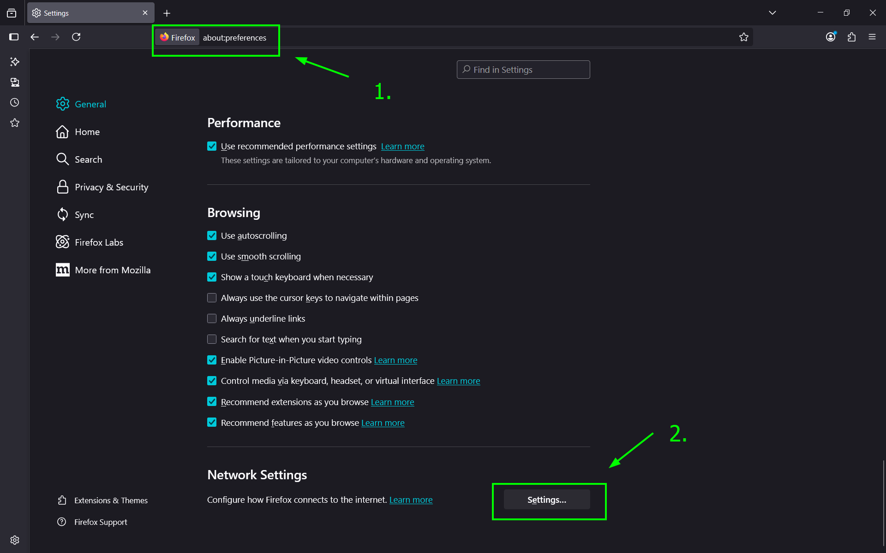
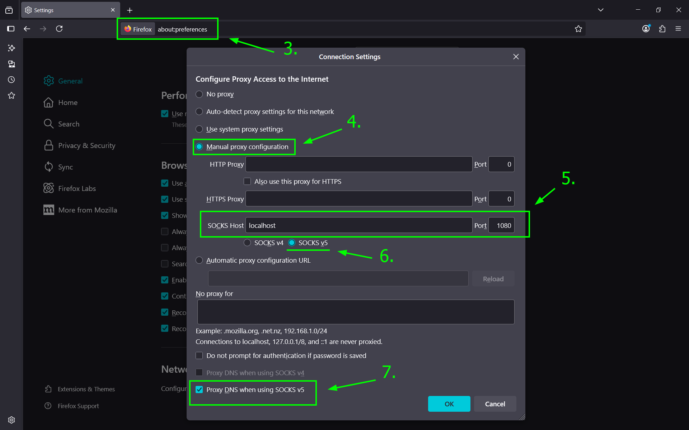

# 1. SSH Kurma

## 1.1. Debian Üzerinde SSH Sunucusu Kurulumu

SSH istemcisi Debian ile varsayılan olarak gelir; ancak bilgisayarınıza dışarıdan bağlanılabilmesi için **OpenSSH Server** paketini yüklemeniz gerekir.

### 1.1.1. Paket Listelerini Güncelleyin

Sistemin en güncel paket verisini alması için gereklidir. Terminali açın ve root yetkisiyle paket listelerini güncelleyin:

```bash
$ sudo apt update
```

### 1.1.2. OpenSSH Sunucusunu Yükleyin

Gerekli servis paketinin indirilip kurulması. SSH sunucu paketini kurmak için aşağıdaki komutu çalıştırın:

```bash
$ sudo apt install openssh-server -y
```

### 1.1.3. Servis Durumunu Kontrol Edin

SSH servisinin aktif çalışıp çalışmadığını doğrulayın. Kurulum tamamlandıktan sonra SSH servisinin başlayıp başlamadığını kontrol edin:

```bash
$ sudo systemctl status ssh
```

Çıktıda **`active (running)`** ifadesini görüyorsanız SSH sorunsuz çalışıyor demektir.

### 1.1.4. Güvenlik Duvarı (UFW) İznini Verin (Varsa)

Sisteminizde UFW aktifse SSH portuna izin verin. Eğer sisteminizde UFW güvenlik duvarı kullanıyorsanız, 22. porta izin vermeniz gerekir:

```bash
sudo ufw allow ssh
sudo ufw reload
```
# 2. SSH Yapılandırması

SSH yapılandırma dosyası `/etc/ssh/sshd_config` konumunda bulunur.

> [!WARNING]
> Yapılandırma dosyasında herhangi bir değişiklik yapmadan önce daima orijinal dosyanın yedeğini alın:
> ```bash
> sudo cp /etc/ssh/sshd_config /etc/ssh/sshd_config.bak
> ```

## 2.1. SSH Güvenlik Yapılandırılması

| **Yapılandırma Parametresi** | **Varsayılan Değer**        | **Önerilen (Güvenli) Değer**      | **Açıklama**                                                                      |
| ---------------------------- | --------------------------- | --------------------------------- | --------------------------------------------------------------------------------- |
| **`Port`**                   | `22`                        | Örn: `2222`                       | Otomatik tarama botlarından korunmak için varsayılan portu değiştirin.            |
| **`PermitRootLogin`**        | `prohibit-password` / `yes` | `no`                              | Doğrudan `root` kullanıcısı ile SSH girişini engelleyin.                          |
| **`PasswordAuthentication`** | `yes`                       | `no` _(Anahtar ekledikten sonra)_ | Şifre ile girişi kapatıp sadece SSH anahtarı (SSH Key) kullanımını zorunlu kılın. |
| **`MaxAuthTries`**           | `6`                         | `3`                               | Hatalı şifre denemesi sınırını düşürerek Brute-Force saldırılarını zorlaştırın.   |

Değişiklikleri uyguladıktan sonra SSH servisini yeniden başlatmanız gerekir:

```bash
$ sudo systemctl restart ssh
```

## 2.2. PermitRootLogin Nedir?

**PermitRootLogin**, SSH sunucusunun (`sshd`) en kritik güvenlik yapılandırmalarından biridir. **PermitRootLogin**, Linux sistemlerindeki en yetkili kullanıcı olan `root` hesabının, SSH üzerinden sunucuya **doğrudan giriş yapıp yapamayacağını** belirleyen yapılandırma parametresidir. Bu ayar `/etc/ssh/sshd_config` dosyasında bulunur.


> [!INFO]
> Siber saldırganlar ve otomatik tarama botları (brute-force botları), bir sunucunun SSH portunun açık olduğunu tespit ettiklerinde ilk olarak `root` kullanıcı adını denerler. Çünkü `root` kullanıcısı her Linux sisteminde varsayılan olarak vardır ve sistem üzerinde sınırsız yetkiye sahiptir.
> 
> Eğer `root` girişi açıksa, saldırganın sadece şifreyi tahmin etmesi sistemi tamamen ele geçirmesi için yeterli olacaktır. Bu nedenle modern sistem yönetiminde **root hesabıyla doğrudan SSH bağlantısı kurmak her zaman engellenmelidir.**

### 2.2.1. PermitRootLogin Parametre Değerleri

Bu parametre dört farklı değer alabilir.

| **Değer**                                                            | **Açıklama**                                                                                                                                                    | **Güvenlik Durumu**                                                                            |
| -------------------------------------------------------------------- | --------------------------------------------------------------------------------------------------------------------------------------------------------------- | ---------------------------------------------------------------------------------------------- |
| **`yes`**                                                            | Root kullanıcısının hem şifre hem de SSH anahtarı ile giriş yapmasına izin verir.                                                                               | ❌ **Asla Önerilmez:** Brute-force saldırılarına tamamen açıktır.                               |
| **`no`**                                                             | Root kullanıcısının SSH üzerinden girişini **tamamen engeller**. Sisteme normal bir kullanıcı ile girilip `sudo` komutu ile yetki yükseltilmesi gerekir.        | ✅ **En Güvenli (Önerilen):** Sunucu güvenliği için endüstri standardıdır.                      |
| **`prohibit-password`**<br><br>  <br><br>_(veya `without-password`)_ | Root girişine sadece **SSH Anahtarı (SSH Key)** ile izin verir, şifre ile girişi reddeder. _(Debian'ın varsayılan ayarıdır)_                                    | ⚠️ **Kabul Edilebilir:** Otomasyon araçları (Ansible vb.) için root erişimi şartsa kullanılır. |
| **`forced-commands-only`**                                           | Root kullanıcısı sadece SSH anahtarı ile girebilir ancak sadece önceden belirlenmiş spesifik komutları çalıştırabilir (Örn: Sadece otomatik yedek alma komutu). |                                                                                                |
#### 2.2.1.1. forced-commands-only Parametresi

`PermitRootLogin forced-commands-only` ayarı `sshd_config` dosyasında etkinleştirilse de, **hangi komutun çalıştırılacağı bu dosyada belirtilmez.** Kısıtlanmış komutlar, sunucudaki `root` kullanıcısının `~/.ssh/authorized_keys` dosyasında, bağlantıyı yapacak olan **açık anahtarın (public key) hemen başına** yazılır.

Bu yapı genellikle merkezi bir sunucunun, diğer sunuculara otomatik yedekleme (rsync) veya log toplama gibi işlemler için root yetkisiyle bağlanması gerektiğinde, ancak tam bir terminal (shell) erişimi verilmek istenmediğinde kullanılır.
##### 2.2.1.1.1. Spesifik Komut Nasıl Tanımlanır?

Bir SSH anahtarına belirli bir komutu zorunlu kılmak için, `authorized_keys` dosyasındaki anahtar satırının en başına `command="..."` parametresi eklenir.

**Standart bir anahtar satırı şöyledir:**

```
ssh-ed25519 AAAAC3NzaC1lZDI1NTE5AAAAI... admin@merkez-sunucu
```

**Zorunlu komut atanmış (Forced Command) anahtar satırı şöyledir:**

```
command="/usr/local/bin/yedek_al.sh" ssh-ed25519 AAAAC3NzaC1lZDI1NTE5AAAAI... admin@merkez-sunucu
```
##### 2.2.1.1.2. Adım Adım Kurulum (Örnek: Sadece Disk Durumunu Okuma)

Diyelim ki bir izleme (monitoring) sunucunuz var ve hedef Debian sunucusuna root olarak bağlanıp sadece `df -h` (disk kullanım durumu) komutunu çalıştırmasını istiyorsunuz.

**1. SSH Yapılandırmasını Değiştirin:** 
+ Root yetkisiyle giriş yapıp sshd_config dosyasını düzenleyin
+ `/etc/ssh/sshd_config` dosyasını açın ve `PermitRootLogin` değerini şu şekilde ayarlayın:

```
PermitRootLogin forced-commands-only
```

Ardından SSH servisini yeniden başlatın: `sudo systemctl restart ssh`

**2. authorized_keys Dosyasını Düzenleyin:**
+ Anahtara izin verin ve komutu kısıtlayın
+ Hedef sunucuda `root` kullanıcısının `~/.ssh/authorized_keys` dosyasını açın. Dosyaya eklenecek genel anahtarın en başına çalışmasını istediğiniz komutu yazın:

```
command="/usr/bin/df -h" ssh-ed25519 AAAAC3NzaC1lZDI1NTE... monitoring@sunucu
```

**3. Ek Güvenlik Parametreleri Ekleyin (Best Practice):**
+ Terminal erişimini ve port yönlendirmeyi kapatarak güvenliği artırın
+ Sadece komut çalıştırmak genellikle tek başına yeterli değildir. İstemcinin port yönlendirme yapmasını veya terminal (TTY) talep etmesini engellemek için anahtarın başına şu güvenlik kısıtlamalarını da eklemelisiniz:

```
command="/usr/bin/df -h",no-pty,no-port-forwarding,no-X11-forwarding ssh-ed25519 AAAAC3N...
```

**4. Kısıtlamayı Test Edin:**
+ İstemci tarafında test edin
+ İzleme (monitoring) sunucusundan hedef sunucuya bağlanmayı deneyin:

```bash
ssh root@hedef_sunucu
```

Çıktı olarak size sadece terminal (shell) vermeden doğrudan `df -h` sonucunu basacak ve bağlantıyı hemen kapatacaktır.


> [!warning]
> Kullanıcı bağlantı sırasında kendi komutunu gönderse bile (örneğin: `ssh root@sunucu "rm -rf /"`), SSH sunucusu bu isteği **yoksayar** ve her zaman `authorized_keys` içinde `command="..."` ile tanımlanan komutu çalıştırır. 
> 
> Kullanıcının gönderdiği orijinal komut, sunucu tarafında `SSH_ORIGINAL_COMMAND` isimli bir ortam değişkeninde (environment variable) saklanır. İleri düzey betikler bu değişkeni okuyarak dinamik kararlar verebilir.


## 2.3. İstemci(Client) Yapılandırması

Geliştiriciler ve sistem yöneticileri güvenlik gereği GitHub için ayrı, test sunucusu için ayrı, canlı (production) sunucu için ayrı SSH anahtarları kullanırlar.

Her bağlantıda anahtar dosyasının yolunu (`-i` parametresi ile) ve farklı portları tek tek yazmak yerine, bu karmaşayı yönetmenin en zarif yolu istemci bilgisayarda **`~/.ssh/config`** dosyasını kullanmaktır.


> [!CAUTION]
> Bu işlemlerin tamamı **İstemci (Client)** bilgisayarda gerçekleştirilir.
### 2.3.1. Çoklu Anahtar ve Kısayol Yapılandırması

#### 2.3.1.1. Farklı İsimlerle Anahtarlar Üretin

+ Her sunucu/servis için özel isimli anahtarlar oluşturun.
+ Normalde `ssh-keygen` komutu anahtarı `id_ed25519` adıyla kaydeder. Yeni anahtarların birbirini ezmemesi için `-f` parametresiyle onlara özel isimler vermeliyiz:

```bash
# Canlı sunucu için anahtar:
ssh-keygen -t ed25519 -f ~/.ssh/id_ed25519_prod -C "canli-sunucu-anahtari"

# GitHub/GitLab için anahtar:
ssh-keygen -t ed25519 -f ~/.ssh/id_ed25519_github -C "github-anahtari"
```
#### 2.3.1.2. Config Dosyasını Oluşturun

+ Bağlantı kurallarını tanımlayacağımız dosyayı hazırlayın
+ İstemci bilgisayardaki `~/.ssh` dizininde `config` adında uzantısız bir metin dosyası oluşturun ve güvenlik izinlerini ayarlayın (sadece sahibi okuyup yazabilmelidir):

```bash
touch ~/.ssh/config
chmod 600 ~/.ssh/config
```
#### 2.3.1.3. Config Dosyasını Yapılandırın

+ Sunucu profillerini ve kullanılacak anahtarları tanımlayın
+ Oluşturduğunuz `config` dosyasını bir metin editörüyle (örneğin `nano ~/.ssh/config`) açın ve her sunucu için bir "Blok" ekleyin:

```
# --- Canlı (Production) Sunucusu ---
Host canli
    HostName 198.51.100.25
    User admin
    Port 2222
    IdentityFile ~/.ssh/id_ed25519_prod

# --- GitHub Hesabı ---
Host github.com
    HostName github.com
    User git
    IdentityFile ~/.ssh/id_ed25519_github

# --- Test Sunucusu (Varsayılan port ve anahtar) ---
Host test
    HostName test.sirket.local
    User developer
```
#### 2.3.1.4. Kısayol ile Bağlanın

+ Uzun komutlar yerine sadece Host adını kullanarak bağlanın
+ Yapılandırma tamamlandıktan sonra, artık karmaşık IP adreslerini, port numaralarını veya anahtar yollarını hatırlamanıza gerek yoktur. Terminale sadece belirlediğiniz `Host` adını yazmanız yeterlidir:

```bash
# Canlı sunucuya bağlanmak için:
ssh canli

# Test sunucusuna bağlanmak için:
ssh test
```
### 2.3.2. Config Dosyası Parametreleri Sözlüğü

Parametrelerin ne işe yaradığını açıklayan tablo:

| **Parametre**      | **Ne İşe Yarar?**                                                                                                | **Örnek Değer**                      |
| ------------------ | ---------------------------------------------------------------------------------------------------------------- | ------------------------------------ |
| **`Host`**         | Bağlantı için kullanacağınız kısa ad (Alias). Terminale `ssh [isim]` yazdığınızda buradaki değeri kullanırsınız. | `canli`, `veritabani1`, `github.com` |
| **`HostName`**     | Sunucunun gerçek IP adresi veya alan adı (Domain).                                                               | `192.168.1.50`, `ssh.domain.com`     |
| **`User`**         | Sunucuya hangi kullanıcı adıyla bağlanılacağı.                                                                   | `root`, `admin`, `ubuntu`            |
| **`Port`**         | Sunucunun SSH portu. (22 dışındaysa mutlaka belirtilmelidir).                                                    | `2222`, `45000`                      |
| **`IdentityFile`** | Bu sunucuya bağlanırken kullanılacak **Özel Anahtarın (Private Key)** tam yolu.                                  | `~/.ssh/id_ed25519_prod`             |
# 3. SSH Anahtarları ile Kimlik Doğrulama

## 3.1. Temel Kavramlar: Kim Kimdir?

SSH anahtar mimarisini anlamak için üç temel bileşenin görevini iyi kavramak gerekir:

+ **Private Key (Özel Anahtar):** Sizin (istemcinin) bilgisayarınızda kalması gereken, şifresi çözülmüş son derece gizli bir dosyadır. Evinizin anahtarı gibi düşünebilirsiniz; asla kopyalanıp başkasına gönderilmez. (Örn: `id_ed25519`)
+ **Public Key (Genel Anahtar):** Özel anahtarınızdan matematiksel olarak türetilen, başkalarıyla paylaşmanızda hiçbir sakınca olmayan dosyadır. Bunu bir "asma kilit" gibi düşünebilirsiniz. Bu kilidi bağlanmak istediğiniz sunuculara dağıtırsınız. (Örn: `id_ed25519.pub`)
+ **`authorized_keys` Dosyası:** Bağlanılacak hedef sunucuda (Debian) bulunan düz bir metin dosyasıdır. İçerisinde, sunucunun bağlantısını kabul edeceği güvenilir **Public Key**'lerin (asma kilitlerin) bir listesi alt alta satırlar halinde bulunur.


> [!INFO]
> Sunucuya bağlandığınızda, sunucu `authorized_keys` dosyasındaki asma kilitlerden (Public Key) birini alır ve size gönderir. Eğer bilgisayarınızdaki Private Key bu kilidi açabiliyorsa, şifre sorulmadan içeri alınırsınız.
## 3.2. Adım Adım Anahtar Oluşturma ve Sunucuya Tanıtma

`ssh-copy-id` komutu bu işlemleri otomatik yapsa da, sistemin arka planında nasıl çalıştığını anlamak için bu işlemleri **manuel (elle)** yapmak en öğretici yöntemdir.
### 3.2.1. Anahtar Çiftini (Key Pair) Üretin

+ İstemci (Kendi) bilgisayarınızda terminali açın.
+ Öncelikle bilgisayarınızda yeni bir anahtar çifti oluşturmanız gerekir. Güncel ve güvenli olan **Ed25519** algoritmasını kullanıyoruz:

```bash
ssh-keygen -t ed25519 -C "admin@kitap-projesi"
```

Bu komutu çalıştırdığınızda sistem size anahtarı nereye kaydedeceğini ve bir parola (passphrase) isteyip istemediğinizi soracaktır. `Enter` tuşuna basarak varsayılan dizine (`~/.ssh/`) kaydedin.

_İşlem bittiğinde `~/.ssh/` dizininde iki dosya oluşur:_

1. `id_ed25519` (Private Key - Gizli)
2. `id_ed25519.pub` (Public Key - Paylaşılacak olan)

### 3.2.2. Public Key İçeriğini Kopyalayın

+ İstemci(_Client_) bilgisayarda uygulayın.

+ Oluşturduğunuz **Public Key**'in içeriğini ekranda görüntüleyin ve çıkan uzun metni farenizle kopyalayın:

```bash
cat ~/.ssh/id_ed25519.pub
```

(Çıktı `ssh-ed25519 AAAAC3NzaC...` şeklinde başlayan tek satırlık uzun bir metin olacaktır.)

### 3.2.3. Sunucuda .ssh Dizinini ve authorized_keys Dosyasını Oluşturun

+ Hedef Debian sunucusuna bağlanarak uygulayın
+ Şimdi hedef sunucunuza normal kullanıcı adınız ve şifrenizle bağlanın. Anahtarı tanımlayacağımız gizli `.ssh` klasörünü ve `authorized_keys` dosyasını oluşturun:

```bash
# Klasörü oluştur
mkdir -p ~/.ssh

# authorized_keys dosyasını oluştur (veya varsa aç)
vi ~/.ssh/authorized_keys
```
### 3.2.4. Public Key'i Dosyaya Yapıştırın ve İzinleri Ayarlayın

+ Hedef Debian sunucusunda uygulayın
+ Açılan `vi` editörünün içine, 2. adımda(_3.2.2. Public Key İçeriğini Kopyalayın_) kopyaladığınız **Public Key metnini yapıştırın**. Dosyayı kaydedip (`Esc`  + `:wq`) çıkın.

> [!CAUTION]
> SSH servisi güvenlik konusunda çok katıdır. Dosya izinleri yanlışsa anahtarı okumayı reddeder. Sunucudayken şu komutlarla izinleri sıkılaştırın:
> ```bash
> chmod 700 ~/.ssh
> chmod 600 ~/.ssh/authorized_keys
> ```
### 3.2.5. Bağlantıyı Test Edin

+ İstemci (Kendi) bilgisayarınıza dönün.
+ Sunucudaki oturumunuzdan çıkın. Kendi bilgisayarınızdan sunucuya tekrar bağlanmayı deneyin:

```bash
ssh kullanici_adi@sunucu_ip_adresi
```

İşlemleri doğru yaptıysanız, linux sunucusu size kullanıcı şifrenizi sormadan (veya sadece Private Key'e koyduğunuz parolayı sorarak) doğrudan girişinize izin verecektir.


## ssh Komutları:
### 1.ssh-copy-id:
```shell
$ ssh-copy-id -i /home/$USER/.ssh/id_rsa.pub user@IP_address 
```
> **Expalanation:**
> + ssh-copy-id, public SSH anahtarınızı uzak makinenin `authorized_keys` dosyasına kopyalayan bir scripttir. Yani şifresiz SSH girişini mümkün kılar.
> + `ssh-copy-id` komutu, yerel bilgisayarınızdaki genel SSH anahtarınızı (genellikle `~/.ssh/id_rsa.pub` veya `~/.ssh/id_ed25519.pub`) uzak sunucunun `~/.ssh/authorized_keys` dosyasına ekler.
> + `-i` parametresi: Eğer varsayılan `id_rsa.pub` dışında bir anahtar kullanıyorsanız, `-i` seçeneği ile belirtebilirsiniz:


> [!CAUTION]
> + `ssh-copy-id` komut *linux* ve *mac* işletim sistemlerinde mevcuttur. 
> + *Windows* işletim sistemlerinde yoktur.

### 2.ssh-keygen:
#### `-R` parametresi:

+ `ssh-keygen -R` komutu, **`known_hosts`** dosyasından bir ana bilgisayar (`host`) kaydını kaldırmak için kullanılır.
+ Bu, genellikle bir uzak sunucunun (`host`) anahtar bilgileri değiştiğinde veya bir bağlantı problemi yaşandığında kullanılır.
+ Aşağıdaki gibi mesaj alıyorsanız.
```shell
@@@@@@@@@@@@@@@@@@@@@@@@@@@@@@@@@@@@@@@@@@@@@@@@@@@@@@@@@@@
@    WARNING: REMOTE HOST IDENTIFICATION HAS CHANGED!     @
@@@@@@@@@@@@@@@@@@@@@@@@@@@@@@@@@@@@@@@@@@@@@@@@@@@@@@@@@@@
IT IS POSSIBLE THAT SOMEONE IS DOING SOMETHING NASTY!
Someone could be eavesdropping on you right now (man-in-the-middle attack)!
It is also possible that a host key has just been changed.
```

```shell
ssh-keygen -R 192.168.1.120
```

+ **`known_hosts` Dosyası Nedir?**
+ SSH istemcisi, her bağlantı kurduğu ana bilgisayarın (`host`) `public key`'ini **`~/.ssh/known_hosts`** dosyasına kaydeder.
+ Anahtar(`key`), bağlantının güvenilir olduğundan emin olmak için kullanılır. Eğer anahtar değişirse, SSH bir uyarı verir ve bağlantıyı engeller.


> [!WARNING]
> + Eğer bir ana bilgisayar özel bir port üzerinden bağlanıyorsa, port numarasını belirtmek gerekir:
> + Örneğin; `ssh-keygen -R [192.168.1.10]:2222` 
> + Burada, `192.168.1.10` adresindeki ve `2222` portundaki kayıt kaldırılır.

#### Manual Kullanımı:
+ `ssh-keygen -R` işlemini manuel olarak da yapabilirsiniz.

```shell
vim ~/.ssh/known_hosts
```

+ Hedef ana bilgisayarın (host) satırını bulun ve silin.
+ Kaydedin ve çıkın.


# SSH Tünelleme (SSH Tunneling):

+ Yerel makinadaki bir port, **uzak makinadaki bir hedefe yönlendirilir**.

```shell
ssh -L 9191:localhost:9090 user@remote-host
```

## A. Local Port Forwarding(`ssh -L`):

+ Bu, **yerel bilgisayarın (senin kendi makinanda)** ile **uzaktaki Ubuntu sunucusu (192.168.1.133)** arasında bir **SSH tüneli (port forwarding)** kurar.
### Örnek A.1:

#### Uzak Makine:

+ Makinenin IP adresi: **192.168.1.133**

**App.php:**

```php
<?php
echo "Tüm Sistem Bilgisi: ". php_uname();
?>
```

> + `php_uname()` fonksiyonu, PHP'de çalıştığınız işletim sistemi hakkında bilgi verir.
> + Bu fonksiyon özellikle sunucunun işletim sistemi türü, makine adı, çekirdek versiyonu gibi bilgileri almanızı sağlar.


> [!NOTE]
> ```php
> php_uname(string $mode = "a"): string
> ```
> + `$mode` → Hangi bilginin döndürüleceğini belirtir. Varsayılan `"a"`'dır.
> 	- "a" → Tüm bilgileri döndürür (varsayılan)
> 	- "s" → İşletim sistemi adı (örneğin: `Linux`, `Windows`)
> 	- "n" → Host adı (makine adı)
> 	- "r" → Sürüm bilgisi (kernel release)
> 	- "v" → Versiyon (kernel version)
> 	- "m" → Makine türü (örneğin: `x86_64`)

```shell
php -S localhost:8000
```
#### Yerel Makine:

+ Makinenin IP adresi: **192.168.1.105**

```shell
ssh -L 9090:localhost:8000 ottoman@192.168.1.133 -N
```

> + `ssh` → SSH bağlantısı başlatır.
> + **Yerel port (senin makinan)** 9090 ile **uzaktaki sunucunun kendi localhost portu** 8000 arasında bir tünel açar.
> + `ottoman@192.168.1.133` → SSH ile bağlanılacak kullanıcı ve IP (Ubuntu sunucusu)
> + `-N` → Bağlantıda **komut çalıştırma**, sadece tünel kur (terminal açılmaz).

```shell
curl -X GET localhost:9090
```

**curl komut çıktısı:**

```shell
Linux grafana-prp 6.8.0-71-generic #71-Ubuntu SMP PREEMPT_DYNAMIC Tue Jul 22 16:52:38 UTC 2025 x86_64
```

> [!NOTE]
> **🔄 Bu Ne İşe Yarar?**
> +  🖥️ **Yerel(`192.168.1.105`) makinandaki `localhost:8000`** adresine yapılan istekler → 🌐 **Uzak(`192.168.1.133`) sunucudaki `localhost:9090`** portuna yönlendirilir.
> + Yani:
> 	- `App.php` uygulamasını uzaktaki(`192.168.1.133`) Ubuntu sunucusunda **`localhost:8000`** üzerinde çalıştırdıysan (örneğin `php -S localhost:8000` gibi),
> 	- O sunucu dış dünyaya port açmamışsa (güvenlik için)
> 	- Sadece yerel makine(`192.168.1.105`) ulaşabilir. Aksi takdirde hiç makine ulaşamayacaktır. 


> [!TIP]
> **🔐 Neden Kullanılır?**
> + 🔒 **Güvenlik:** Uzak sunucuda portu herkese açmak yerine sadece SSH tüneliyle erişebilirsin.
> + 🔍 Test ve izleme: Sunucuya doğrudan gitmeden, kendi makinanda her hangi programı açabilirsin.
> + 🧱 Özellikle php'de `-S 127.0.0.1:8000`  gibi **yerel portlara** bağlandığında dışarıdan doğrudan erişim mümkün olmaz, bu tünel onu çözer.

## B. Remote Port Forwarding(`ssh -R`):

### Örnek 1:

#### Senaryo:

+ Yerel bilgisayarda(`192.168.1.105`) bir python web uygulaması çalıştırıyoruz.
+ Bir uzak sunucuda (`192.168.1.133`), bu uygulamaya erişmek isteyen bir makine var.
+ Yani, uzak sunucudan bu web uygulamasına erişmek istiyoruz.
#### Yerel Makine:

+ Makinenin IP adresi: **192.168.1.105**
+ Python ile yerel makinemizde basit bir HTTP sunucusu ayağa kaldırıyoruz.

```shell
python3 -m http.server
```


> [!NOTE]
> ### `http.server` nedir?
> + Python'da `http.server` modülü, basit bir HTTP sunucusu oluşturmak için kullanılan bir modüldür.
> +  Bu, özellikle yerel geliştirme ortamında hızlı bir şekilde statik dosyaları (HTML, CSS, JavaScript, resimler vb.) sunmak için kullanışlıdır.
> #### Temel Kullanım:
> + Terminalde veya komut satırında aşağıdaki komutu çalıştırarak basit bir HTTP sunucusu başlatabilirsiniz:
> ```shell
> python3 -m http.server
> ```
> + Varsayılan olarak, bu komut **8000** portunu kullanır ve bulunduğunuz dizindeki dosyaları sunar. 
> + Tarayıcınızda `http://localhost:8000` adresine giderek dosyalara erişebilirsiniz.
> #### Özelleştirme Seçenekleri:
> + **Port değiştirmek** (örneğin 8080 portunda çalıştırmak için):
> ```shell
> python3 -m http.server 8080
> ```
> + Belirli bir dizinden sunucu başlatmak:
> ```shell
> cd /path/to/your/directory
> python -m http.server
> ```
> + **Python kodunda kullanmak** (isteğe bağlı):
> ```python
> from http.server import HTTPServer, SimpleHTTPRequestHandler
> server_address = ('', 8000)  # localhost:8000
> httpd = HTTPServer(server_address, SimpleHTTPRequestHandler)
> httpd.serve_forever()
> ```
> #### Kullanım Senaryoları:
> + Yerel ağda hızlı dosya paylaşımı.
> + Web uygulamalarını test etmek için basit bir sunucu.
> + Statik bir web sitesini hızlıca çalıştırma.
> #### Dikkat Edilmesi Gerekenler:
> + **Güvenlik**: Bu sunucu **sadece geliştirme amaçlıdır**, üretim ortamında kullanılmamalıdır. Güvenlik önlemleri yoktur.
> + **Performans**: Yüksek trafikli senaryolar için uygun değildir.
> + Bu modül, Python'ın standart kütüphanesinin bir parçasıdır, bu yüzden ek kurulum gerektirmez. 🚀
#### Uzak Makine:

+ Makinenin IP adresi: **192.168.1.133**

```shell
ssh -R 8080:localhost:8000 ottoman@192.168.1.133
```

> + `ssh` → SSH bağlantısı kurar.
> + `-R 8080:localhost:8000` → Uzak sunucudaki 8080 portunu, yerel sunucudaki 8000 portuna yönlendirir.
> + `ottoman@192.168.1.133` → Bağlanılacak uzak sunucu ve kullanıcı adı

> [!TIP]
> Yukarıdaki komut ile aynıdır:
> ```shell
> ssh -R 127.0.0.1:8080:localhost:8000 ottoman@192.168.1.133
> ```
> + Eğer herhangi bir IP belirtmezseniz varsayılan olara `127.0.0.1` IP değeri alınır.


> [!CAUTION]
> + Bu yöntemin çalışması için **uzak sunucunun `sshd_config`** dosyasında şu satırlar olmalı:
> ```config
> AllowTcpForwarding yes
> GatewayPorts yes
> ```
> + Bunlar yoksa `Permission denied` ya da port dış dünyaya açık olmaz.


> [!TIP]
> + Dilersen dış dünyaya da açabilirsin:
> ```shell
> ssh -R 0.0.0.0:8080:localhost:8000 ottoman@192.168.1.133
> ```
> + Bu durumda uzak sunucunun **her yerden gelen 8080 portuna** gelen istekler  yerel makinaya(`192.168.1.105`) gider.

## C. Dynamic Port Forwarding(`ssh -D`):

+ Bu yöntem bir **SOCKS proxy** tüneli oluşturur. Tarayıcı ya da uygulama, bu proxy'yi kullanarak yönlendirilir.

```shell
ssh -D 1080 user@remote-host
```

+ Yerel bilgisayarında `localhost:1080` adresinde bir SOCKS proxy çalışır.
+ Web tarayıcını bu adrese ayarlarsan, **tüm trafik** SSH üzerinden şifrelenerek uzak sunucu üzerinden çıkar (VPN gibi çalışır).

### Örnek C.1:

+ SOCKS proxy ile tüm internet trafiğini SSH üzerinden tünelleyerek gizlemek mümkündür.
+ Bu yöntem özellikle halka açık Wi-Fi, sansürlü internet veya gizlilik ihtiyacında işe yarar.


> [!NOTE]
> **Gereksinimler:**
> + SSH erişimi olan bir uzak sunucu (`user@sunucu_ip`)
> + Yerel makinan Linux/macOS veya WSL içeren Windows (veya OpenSSH destekli bir SSH istemcisi)
> + Firefox tarayıcısı (SOCKS proxy desteği en kolay ayarlanabilir tarayıcıdır)

#### 🔐 1. SSH ile SOCKS proxy başlat:

```shell
ssh -D 1080 ottoman@192.168.1.133
```

> + `-D 1080`: Yerel makinede `localhost:1080` adresinde bir SOCKS5 proxy başlatır.
> + `ottoman@192.168.1.133`: Bağlanılacak uzak sunucu
> + Bu bağlantı aktif olduğu sürece tüm trafik proxy üzerinden geçecektir.


> [!TIP]
> Arka planda çalıştırmak için:
> ```shell
> ssh -D 1080 -f -C -q -N ottoman@192.168.1.133
> ```
> + `-f` → Arka plana da çalıştırır.(background)
> + `-C` → Ağ üzerinden gönderilecek paketleri sıkıştırır.
> + `-q` → uyarıları baskılar.
> + `-N` → tty bağlantısı açmasını baskılar. Yani, herhangi bir komut çalıştırmasını engeller.

#### 🌐 2. Tarayıcıyı SOCKS proxy kullanacak şekilde ayarla:

##### Firefox örneği (önerilen):

1. `about:preferences` adresine git
2. En altta **"Ağ Ayarları"** (Network Settings) bölümüne gel
3. **Ayarlar (Settings...)** butonuna tıkla
4. **Elle proxy yapılandırması (Manual proxy configuration)** seç
5. Sadece şu alanı doldurunuz:
	+ **SOCKS Host**: `localhost`
	+ **Port**: `1080`
	+ Altında **SOCKS v5** işaretli olsun
6. "Bu proxy’yi DNS için de kullan" seçeneğini işaretle (çok önemli: DNS sızıntılarını engeller)
7. Kaydet





> [!TIP]
> + Tünel bağlantısı kesilirse, internet trafiğin normale döner (proxy üzerinden çıkmaz).
> + Chrome tarayıcısı da proxy destekler ama sistem ayarları üzerinden yönlendirmek gerekir. Firefox doğrudan daha kolaydır.
> + Daha sistem genelinde proxy istiyorsan, `proxychains`, `torsocks` veya `systemd-proxy` gibi araçlar gerekir.


Bu link'deki verileri belgelendireceğiz:

https://gemini.google.com/app/bda1ec3e2d9e97ad