#programlama #php
# Php Ortam Kurulumu:

## Nignx ile:

```nginx
    worker_connections 1024;
}

http {
    include mime.types;


    server {
        # Virtual Host
        listen 80;
        server_name 192.168.1.132;

        root /var/www/html/phpDers/;

        index index.php index.html;

        location / {
            try_files $uri $uri/ =404;
        }

        location ~ \.php$ {
            include fastcgi.conf;
            fastcgi_pass unix:/run/php/php8.1-fpm.sock;
        }
    }
}
```


## Linux Terminal ile:

### a. Doğrudan Terminalde PHP Kodu Çalıştırma:

+ Terminalde doğrudan PHP kodu çalıştırmak için `php -r` komutunu kullanabilirsiniz.

```shell
php -r 'echo "Merhaba, Dünya!\n";'
```

**Çıktı:**
```shell
Merhaba, Dünya!
```

### b. PHP Dosyasını Çalıştırma:

+ Eğer bir PHP dosyası çalıştırmak istiyorsanız, öncelikle bir PHP dosyası oluşturun. Örneğin, `merhaba.php` adında bir dosya oluşturalım:

```shell
vim merhaba.php
```

**Php kodu:**
```php
<?php
echo "Merhaba, Dünya ;)\n";
?>
```

**Php kodu çalıştırma:**
```shell
php merhaba.php
```
> **Explanation:**
+ terminalde yukarıdaki komutu çalıştırarak PHP dosyasını çalıştırabilirsiniz.

**Çıktı:**
```shell
Merhaba, Dünya ;)
```

### c. PHP'nin Etkileşimli Kabuğunu Kullanma:

+ PHP, etkileşimli bir kabuk (interactive shell) sunar. Bu kabuğu kullanarak doğrudan terminalde PHP kodları yazıp çalıştırabilirsiniz.
+ Etkileşimli kabuğu başlatmak için terminalde aşağıdaki komutu çalıştırın:

```shell
php -a
```


> [!NOTE]
> + PHP'nin etkileşimli kabuğunu başlatır. Burada PHP kodlarınızı yazıp anında çıktılarını görebilirsiniz.
> +  Kabuktan çıkmak için `exit` yazabilir veya `Ctrl + D` tuş kombinasyonunu kullanabilirsiniz.


```php
Interactive shell

php > echo "Merhaba, Dünya";
Merhaba, Dünya
```

### PHP'nin Web Sunucusu Modunu Kullanma:
+ PHP, yerel bir web sunucusu başlatmak için de kullanılabilir. Bu özellik, hızlı bir şekilde PHP uygulamalarını test etmek için kullanışlıdır.
+ Örneğin, `merhaba.php` dosyasını yerel bir web sunucusunda çalıştırmak için aşağıdaki komutu kullanabilirsiniz:

```shell
php -S localhost:8000
```


```shell
php -S 192.168.1.132:8000
```

> **Explanation:**
+ `localhost` ile servis etiğimizde dış makinelerden ulaşım olmamaktadır. Ama makinenin IP(`192.168.1.132`) adresi ile servis yaptığımızda dış makinelerden ulaşılmaktadır.
+ Çünkü, `localhost`'un IP adresi `127.0.0.1` olmaktadır. Bu IP'İ dışarıya açık değildir.
+ Bu komut, `localhost:8000` adresinde bir web sunucusu başlatır. Tarayıcınızda `http://localhost:8000/merhaba.php` veya `http://192.168.1.132/merhaba.php` adresine giderek `merhaba.php` dosyasının çıktısını görebilirsiniz.


> [!CAUTION]
> + `php -S` komutu, `merhaba.php` dosyasının bulunduğu dizinde yani aynı klasörde çalıştırılmalıdır. 

# Php Kod Yazılımı:

## Merhaba Dünya:
**index.php:**
```php
<!DOCTYPE html>

<html>
    <head>
        <meta charset="UTF-8">
        <title>İlk Ders</title>
    </head>
    <body>
        <h1>
            <?php echo "Merhaba PHP";?>
        </h1>
    </body>
</html>
```
> **Explanation:**
+ `index.php` dosyasını nginx uygulaması veya `php -S` komutu ile servis edebiliriz.
+ Browser(tarayıcı), php dosyasını html dosyası gibi yorumlayacaktır.

```mermaid
graph LR
A(Server-Sunucu) --> B(PHP Interpreter) --> C(Browser-tarayıcı)
```



# Değişkenler:


> [!WARNING]
> + Php de değişkenler `case sensitive`'dir yani büyük küçük harf duyarlıdır.
> + Örneğin; `$sayi1 = 12` ile `$Sayi2 = 16` aynı değişken değildir. Çünkü ikinci değişken S ile başlamaktadır. 


### Temel Kullanımı 1:
**index.php:**
```php
<!DOCTYPE html>

<?php
    $title = "Merhaba PHP ;)";  # Değişken tanımlama
?>

<html>
    <head>
        <meta charset="UTF-8">
        <title>İlk Ders</title>
    </head>
    <body>
        <h1>
            <?php echo $title;?> # Değişkeni çağırma
        </h1>
    </body>
</html>
```
> **Explanation:**
+ İki tane php bloğu oluşturduk. İlk php bloğunda değişken tanımladık, ikinci php bloğunda oluşturulan değişken çağrıldı.

### Temel Kullanımı 2:

```php
<?php
    $isim = "Tanju";
    $soyad = "Yücal";

    echo $isim." ".$soyad;
?>
```
> **Explanation:**
+ Değişken yazarken değişkenlerin `$` başladığına dikkat ediniz!
+ Nokta(`.`) işareti değişkenlerdeki `string`'leri birleştirir.

**Php Sunucu Başlatma:**
```shell
php -S 192.168.1.132:8082 variables.php
```
> **Explanation:**
+ Eğer  `variable.php` dosyasını parametre olarak vermezsek `php -S` komutu `index.php` dosyasını bakacaktır.

**GET isteği:**
```http
HTTP/1.1 200 OK
Host: 192.168.1.132:8082
Date: Wed, 05 Feb 2025 14:56:35 GMT
Connection: close
X-Powered-By: PHP/8.1.2-1ubuntu2.20
Content-type: text/html; charset=UTF-8

Tanju Yücal
```

# Yorum Satırı:
+ Yorum satırları, kodunuzu açıklamak veya belirli bölümlerini geçici olarak devre dışı bırakmak için kullanılır.
+ Yorum satırları, PHP yorumlayıcısı tarafından dikkate alınmaz ve kodun çalışmasını etkilemez.

> [!NOTE]
> + Yorumlar, kodun okunabilirliğini artırmak ve diğer geliştiricilere veya gelecekteki kendinize açıklamalar bırakmak için önemlidir.

## Tekli Yorum Satırı:
+ `//` ve `#` ile başlayan yorumlar, sadece o satırı etkiler.


```php
<?php
// Bu bir tek satırlık yorumdur.
echo "Yorum satırı işareti: //";

# Bu da başka bir tek satırlık yorum satırıdır.
echo "Başka yorum satırı işareti: #";
?>
```

## Çoklu Yorum Satırı:

```php
<?php
/*
Değişken isminde boşluk karakteri olmaz!
$sayi 1        => yanlış
$sayi1 = 19;   => doğru
*/
?>
```


# PHP Veri Tipleri:
## 1. Basit (Skaler) Veri Türleri:
+ Bu türler, tek bir değer tutar.
### a. Integer(Tam Sayı):

- Pozitif veya negatif tam sayıları temsil eder. Örnek: `45`, `-12`, `0`, `3`
- Bellekte genellikle 32 veya 64 bit olarak saklanır.

```php
<?php
$sayi = 42;
echo gettype($sayi);    // Çıktı: integer
echo "<br>";
echo var_dump($sayi);   // Çıktı: int(42)
?>
```

### b. Float (Ondalıklı Sayı veya Double):

- Ondalıklı sayıları temsil eder. Örnek: `3.14`, `-0.6`, `4.0`, `3.9`
- Bellekte genellikle 64 bit olarak saklanır.

```php
<?php
$ondalik = 3.14;
echo gettype($ondalik);  // Çıktı: double
echo "<br>"
echo var_dump($sayi);    // Çıktı: float(3.14)
?>
```

### c. String(Metin):

- Metin verilerini temsil eder. 
- Tek tırnak (`'`) veya çift tırnak (`"`) içinde yazılır. Örnek: `"Merhaba Dünya"`, `'PHP'`


```php
<?php
$metin = "PHP Programlama";
echo gettype($metin);     // Çıktı: string
echo "<br>";
echo var_dump($metin);    // Çıktı: string(15) "PHP Programlama"
?>
```

#### c.1. Tek Tırnak(`'`) ile Tanımlama:
+ Tek tırnak içindeki stringler, özel karakterler (örneğin `\n`, `\t`) ve değişkenler genişletilmez (interpolasyon yapılmaz).
+ `Bash Script` ile aynı şekilde kullanılıyor!

```php
<?php
$isim = 'linux';
$metin = 'Merhaba $isim';
echo $metin;               // Çıktı: Merhaba $isim
?>
```

#### c.2. Çift Tırnak(`"`) ile Tanımlama:
- Çift tırnak içindeki string'ler, özel karakterler ve değişkenler genişletilir (interpolasyon yapılır).
- `Bash Script` de aynı kullanım geçerlidir.

##### `$variable`:
```php
<?php
$isim = 'ubuntu';
$metin = "Merhaba $isim";
echo $metin;                // Çıktı: Merhaba ubuntu
?>
```

##### `${variable}`:
+ Küme parantezleri (`{}`), değişkenin sınırlarını belirlemek için kullanılır.
+ `{}` (küme parantezleri) kullanmak daha net ve güvenli bir kod yazmanızı sağlar.

```php
<?php
$distro = 'Arch Linux';
$metin = "En sevdiğim linux dağıtımı {$distro}";
echo $metin;
?>
```

##### `${variable}`: Yeni değişken
+ Küme parantezleri (`{}`), değişkenin sınırlarını belirlemek için kullanılır.
+ Bazen değişken adı, string içindeki diğer karakterlerle karışabilir.

```php
<?php
$prefix = 'Fedora';                     // distro değişkeni
$suffix = 'x64';                        // mimari değişkeni
$OS_distro="${prefix}_${suffix}"        // yeni değişken
?>
```
> **Explanation:**
> - Süslü parantezler ile yeni bir değişken oluşturduk.
> - Eğer süslü parantez(`{...}`) kullanmasaydık, `$prefix` değişkenin ve `$suffix` değişkenin nerede başlayıp nerede bittiğini  php yorumlayıcı anlayamızdı.

#### c.3. Heredoc Syntax:
- Uzun metinler için kullanılır. `<<<` ile başlar ve bir tanımlayıcı ile biter. Çift tırnak gibi davranır (değişkenler ve özel karakterler genişletilir).

```php
<?php
$distro = "Arch Linux";   // veya $distro = 'Arch Linux';
$metin = <<<EOT
Favori linux dağıtımım $distro
Linux is Awesome!
EOT;
echo $metin;
?>
```

#### c.4. Nowdoc Syntax:
- Heredoc'a benzer, ancak tek tırnak gibi davranır (değişkenler ve özel karakterler genişletilmez).

```php
<?php
$distro = "Fedora";    // veya $distro = "Fedora";
$metin = <<< 'EOT'
Another favori linux dağıtımım $distro
Linux is Awesome!
EOT;
?>
```

#### c.5. String Karakterlerine Erişim:
- Stringler, dizi gibi indekslenebilir. Karakterlere `[]` ile erişilir.

```php
<?php
$distro = "Linux is Awesome";
echo $distro[0];                // Çıktı: L
echo "<br>";
echo $metin[6];                 // Çıktı: i
?>
```


> [!CAUTION]
> +  PHP 8 de String'in indeks değerin ulaşmada köşeli parantez(`[]`) kullanılır. Eğer süslü parantez(`{}`) hata verecektir.
> + PHP  de String'in indeks değerin ulaşmada köşeli parantez(`[]`) ve süslü parantez(`{}`) kullanılır.


### d. Boolean (Mantıksal Değer):
- `true` (doğru) veya `false` (yanlış) değerlerini temsil eder.
- Genellikle koşul ifadelerinde kullanılır.

```php
<?php
$mantiksal = true;
echo gettype($metin);     // Çıktı: boolean
echo "<br>";
echo var_dump($metin);    // Çıktı: bool(true)
?>
```

## 2. Birleşik (Compound) Veri Türleri:
+ Bu türler, birden fazla değer veya karmaşık veri yapıları tutar.

### a. Array(Dizi):
- Birden fazla değeri bir arada tutar.
- İndeksli (numeric) veya ilişkili (associative) diziler olabilir. Örnek: `[1, 2, 3]`, `["ad" => "Ahmet", "yas" => 25]`

```php

```


## 3. Özel (Special) Veri Türleri:


# f-string yazım:

## printf ve sprintf Fonksiyonları:

+ PHP'de **`sprintf()`** ve **`printf()`** fonksiyonları, Python'daki `format()` veya C'deki `printf` gibi **biçimlendirilmiş string oluşturmak** için kullanılır.
+  İkisi de aynı mantıkla çalışır, ancak çıktıyı nasıl döndürdükleri arasında fark vardır.

| Özellik            | `printf()`                     | `sprintf()`                              |
| ------------------ | ------------------------------ | ---------------------------------------- |
| **Çıktı**          | Ekrana yazdırır                | String olarak döndürür                   |
| **Kullanım Amacı** | Anında çıktı gerektiğinde      | Metni sonra kullanmak için               |
| **Örnek**          | `printf("Merhaba %s", $isim);` | `$sonuc = sprintf("Merhaba %s", $isim);` |

| **Belirteç** | **Açıklama**                  | **Örnek Kullanım**              | **Örnek Çıktı**       |
| ------------ | ----------------------------- | ------------------------------- | --------------------- |
| **`%s`**     | **String (Metin)**            | `sprintf("Ad: %s", "Ahmet")`    | `"Ad: Ahmet"`         |
| **`%d`**     | **Integer (Tam Sayı)**        | `sprintf("Yaş: %d", 25)`        | `"Yaş: 25"`           |
| **`%f`**     | **Float (Ondalıklı Sayı)**    | `sprintf("Fiyat: %f", 19.99)`   | `"Fiyat: 19.990000"`  |
| **`%.2f`**   | **Virgülden Sonra 2 Basamak** | `sprintf("Fiyat: %.2f", 19.99)` | `"Fiyat: 19.99"`      |
| **`%e`**     | **Bilimsel Gösterim**         | `sprintf("Sayı: %e", 1000)`     | `"Sayı: 1.000000e+3"` |
| **`%x`**     | **Hexadecimal (Küçük Harf)**  | `sprintf("Hex: %x", 255)`       | `"Hex: ff"`           |
| **`%X`**     | **Hexadecimal (Büyük Harf)**  | `sprintf("Hex: %X", 255)`       | `"Hex: FF"`           |
| **`%o`**     | **Octal (Sekizlik Sistem)**   | `sprintf("Octal: %o", 8)`       | `"Octal: 10"`         |
| **`%c`**     | **ASCII Karakter**            | `sprintf("Karakter: %c", 65)`   | `"Karakter: A"`       |
| **`%%`**     | **Yüzde İşareti Yazdırma**    | `sprintf("İndirim: %d%%", 20)`  | `"İndirim: 20%"`      |

**Uzunluk ve Hizalama:**

| **Format**  | **Açıklama**                           | **Örnek**                 | **Çıktı** |
| ----------- | -------------------------------------- | ------------------------- | --------- |
| **`%10s`**  | **10 karakter genişlikte sağa hizala** | `sprintf("%10s", "Ali")`  | `" Ali"`  |
| **`%-10s`** | **10 karakter genişlikte sola hizala** | `sprintf("%-10s", "Ali")` | `"Ali "`  |
| **`%05d`**  | **5 haneli sayı, başına sıfır ekle**   | `sprintf("%05d", 42)`     | `"00042"` |
### printf Fonksiyonu:

+ **Doğrudan çıktıyı ekrana yazdırır** (yani `echo` gibi davranır).

**format1.php**

```php
<?php

$distro = "Ubuntu";

$release = 22.04;

printf("My Favour distro is %s %.2f \n", $distro, $release);
?>
```

**PHP Çalıştırma:**

```shell
php format1.php  # Çıktı: My Favour distro is Ubuntu 22.04
```

### sprintf Fonksiyonu:

+ **Çıktıyı ekrana yazdırmaz, bir string olarak döndürür** (başındaki **"s" = "string"** anlamına gelir).

**format2.php**

```php
<?php

$distro = "Arch Linux";

$release = 42;

$result = sprintf("My Favour distro is %s %d \n", $distro, $release);

echo $result;
?>
```

**PHP Çalıştırma:**

```shell
php format2.php  # Çıktı: My Favour distro is Arch Linux 42
```


# Tip Dönüşümü:

+ "Tip Dönüşümü(`Type Casting`)" terimi, bir veri türünün başka bir veri türüne dönüştürülmesini ifade eder.
+ PHP 8’de **tip dönüşümleri (type casting / type conversion)** hem **otomatik (implicit)** hem de **manuel (explicit)** olarak yapılabilir.
+ Bu dönüşümler PHP’nin gevşek (loosely typed) bir dil olmasından dolayı oldukça esnektir.

## A. Otomatik (Zorunlu) Dönüşüm:

### 🧪Örnek 1:

+ PHP, bir değişkeni bağlama göre **kendiliğinden** dönüştürür.

```php
<?php

$a = '5' + 10;       // '5' string ama PHP bunu otomatik int'e çevirir
echo gettype($a);    // integer
echo "\n";
echo var_dump($a);   // int(15)
echo $a;             // 15
```

## B. Manual (Açık) Dönüşüm - Tip Cast

+ Kendimiz veri türünü değiştirebiliriz:

### B.1. Tip Dönüştürme Operatörleri

+ Bir türdeki ifadeyi başka bir türe dönüştürmek için, ifadenin veri türünü ifadeden önce parantez içine almanız gerekir.

#### Syntax:

```php
$var = (type)expr;
```


> [!NOTE]
> **PHP'deki tip dönüştürme operatörlerinden bazıları şunlardır:**
> 1. (int) veya (integer) → tam sayıya(integer) dönüştürür.
> 2. (bool) veya (boolean)  →  boolean dönüştürür.
> 3. (float) veya (double) veya (real) →  ondalıklı sayıya dönüştürür.
> 4. (string) → karakter dizisine döüştürür.
> 5. (array) → diziye dönüştürür.
> 6. (object) → nesneye(`object`) dönüştürür.

#### 🧪Örnek 1: String → Integer

```php
<?php

$string_var = '123';
$int_var = (int) $string_var;

echo var_dump($string_var);   // Çıktı: string(6) "123abc"
echo var_dump($int_var);      // Çıktı: int(123)


// Eğer dikkat ederseniz Alfanümerik bir değişken veriliyor.
$string_var2 = '123abc';
// Dönüştürülme sırasında sadece rakamlar alınmaktadır.
$int_var2 = (int) $string_var2;

echo "\n";
echo var_dump($string_var2);  // Çıktı: string(6) "123abc"
echo var_dump($int_var2);     // Çıktı: int(123)
```


> [!TIP]
> + Eğer string `"42abc"` ise sadece baştaki sayı alınır → `(int) "42abc"` → `42`
> + `"abc42"` ise sayı yok → `0`

#### 🧪Örnek 2: Integer → String

```php
<?php

$int_var = 503;
$string_var = (string) $int_var;

echo var_dump($int_var);     // Çıktı: int(503)
echo var_dump($string_var);  // Çıktı: string(3) "503"
```

#### 🧪Örnek 3: String → Float

```php
<?php

$string_var = '3.14';
$float_var = (float) $string_var;

echo var_dump($string_var);     // Çıktı: string(4) "3.14"
echo var_dump($float_var);      // Çıktı: float(3.14)
```

#### 🧪Örnek 4: Integer/Float/String → Bool

```php
<?php

$bool_var = (bool) 12;
echo var_dump($bool_var);       // Çıktı: bool(true)

$bool_var_1 = (bool) 0;
echo var_dump($bool_var_1);     // Çıktı: bool(false)

$bool_var_2 = (bool) "";
echo var_dump($bool_var_2);     // Çıktı: bool(false)

$bool_var_3 = (bool) 'linux';
echo var_dump($bool_var_3);     // Çıktı: bool(true)

$bool_var_4 = (bool) 3.14;
echo var_dump($bool_var_4);     // Çıktı: bool(true)
```

#### 🧪Örnek 5: Array → Object

```php
<?php
<?php

$arr = ['a' => 1, 'b' => 2];
echo 'Array ilk elemanı:' . $arr['a'];
echo "\n";
$obj = (object) $arr;
echo 'Nesnenin ilk elemanı: ' . $obj->a;
echo "\n\n";
echo var_dump($obj);
```

> + Array'in nesneye dönüşmesinden sonra array veya nesnenin elemanlarına nasıl ulaştığımıza dikkat ediniz.

**PHP Çıktısı:**

```
Array ilk elemanı:1
Nesnenin ilk elemanı: 1

object(stdClass)#1 (2) {
  ["a"]=>
  int(1)
  ["b"]=>
  int(2)
}
```

#### 🧪Örnek 6: Object → Array

```php
<?php

class A {
    public $x = 10;
    private $y = 20;

    public function t() {
        return 'Merhaba';
    }
}

$obj = new A();

$arr = (array) $obj;

print_r($arr);
```

**PHP Çıktısı:**

```
Array
(
    [x] => 10
    [Ay] => 20
)
```


> [!CAUTION]
> + `t()` fonksiyonu array türüne dönüştürülemedi. Yalınca sınıf özelikleri(`class property`) diziye dönüştürülüyor.
> + `echo $arr['x']` çıktısı 10 verirken
> + `echo $arr['Ay']` çıktısı:
> ```
>  PHP Warning:  Undefined array key "Ay" in /home/ottoman/phpDerleri/callByValueReference.php on line 18
>  Warning: Undefined array key "Ay" in /home/ottoman/phpDerleri/callByValueReference.php on line 18
> ```
> + Çünkü, y değeri sınıf düzeyinde `private` anahtar ile yazılmıştır.


### B.2. Tip Dönüştürme Fonksiyonları:

#### B.2.1. `intval()` Fonksiyonu:

+ PHP’de `intval()` fonksiyonu, bir değeri **tam sayıya (integer)** dönüştürmek için kullanılır.

##### Syntax:

```php
intval(mixed $value, int $base = 10): int
```

> + `$value`: Dönüştürmek istediğin değer (string, float, bool vs.)
> + `$base`: (isteğe bağlı) Eğer değer bir **string sayı** ise hangi sayı tabanında okunacağını belirtir. Varsayılan 10’dur (ondalık sistem).
> + Geri dönüş: `int` türünde bir sayı (tam sayı)

##### 🧪Örnek 1:

```php
<?php

$int_var = intval('42');
echo var_dump($int_var);        // Çıktı: int(42)

$int_var_1 = intval(3.99);
echo var_dump($int_var_1);      // Çıktı: int(3)

$int_var_2 = intval('123abc');
echo var_dump($int_var_2);      // Çıktı: int(123)

$int_var_3 = intval('abc123');
echo var_dump($int_var_3);      // Çıktı: int(0)

$int_var_4 = intval(true);
echo var_dump($int_var_4);      // Çıktı: int(1)

$int_var_5 = intval(false);
echo var_dump($int_var_5);      // Çıktı: int(0)
```

##### 🧪Örnek 2: Base (Taban) Parametresi

```php
<?php

// Dikkat: intval fonksiyonun 1. parametresi string'dir.
$var_bin = '1100';          // 2'li veri tipi
echo intval($var_bin, 2);   // 2'li veri tipi → tam sayıya
echo "\n";
$var_oct = '14';            // 8'li veri tipi
echo intval($var_oct, 8);   // 8'li veri tipi → tam sayıya
echo "\n";
$var_dec = '12';            // 10'lu veri tipi
echo intval($var_dec, 10);  // 10'lu veri tipi → tam sayıya
echo "\n";
$var_hex = 'C';             // 16'lı veri tipi
echo intval($var_hex, 16);  // 16'lı veri tipi → tam sayıya
// Buradaki intval fonksiyonun tüm çıktıları 12 olacaktır.
```

**intval fonksiyonu vs (int)**

| Özellik         | `(int)`             | `intval()`             |
| --------------- | ------------------- | ---------------------- |
| Amaç            | Tam sayıya çevirmek | Tam sayıya çevirmek    |
| Tip dönüşüm mü? | ✅ Evet (cast)       | ❌ Hayır (fonksiyon)    |
| Hız             | Daha hızlı          | Biraz daha yavaş       |
| Ek özellik      | Yok                 | `base` parametresi var |
| Okunabilirlik   | Daha kısa           | Daha açık              |

##### 🧩Uygulama 1: 

```php
echo "
    2'li, 8'li veya 16'li tabanındaki sayıları
    10'lu tabana dönüştürür.

";


echo 'Bir sayı giriniz: '; $input = trim(fgets(STDIN));
echo 'Taban sayısını girin(2/8/10/16): '; $base = trim(fgets(STDIN));

// echo $input;

$result = match ($base) {
    '10' => intval($input, $base),
    '2' => intval($input, $base),
    '8' => intval($input, $base),
    '16' => intval($input, $base),
    default => 'Herhangi bir değer yok'
};

echo "$input sayısı $base tabanında ${result}'dır";
```

#### B.2.2. `floatval()` Fonksiyonu:

+ PHP 8’de `floatval()` fonksiyonu, bir değeri **ondalıklı sayıya (float)** dönüştürmek için kullanılır.

##### Syntax:

```php
floatval(mixed $value): float 
```

> + `mixed $value`: Sayıya dönüştürülebilecek herhangi bir türde veri (string, int, bool, vs.)
> + Geri dönüş: `float` türünde bir sayı (ondalıklı sayı)

##### 🧪Örnek 1: String → Float

```php
<?php

$str_var = '3.14';
echo var_dump(floatval($str_var));  // Çıktı: float(3.14)

echo floatval('10.20abc');          // Çıktı: 10.2
echo "\n";
echo floatval('abc11.15');          // Çıktı: 0
?>
```

> + `var_dump()` fonksiyonu ile verinin hem türünü hem de içeriğini öğrenebiliyoruz.
##### 🧪Örnek 2: Integer → Float

```php
<?php

$int_var = 100;

echo $int_var;                      // 100
echo "\n";
echo var_dump($int_var);            // int(100)

$float_var = floatval($int_var);

echo $float_var;                    // 100
echo "\n";
echo var_dump($float_var);          // float(100)
```

##### 🧪Örnek 3: Boolean → Float

```php
<?php

echo floatval(true);    // Çıktı: 1
echo "\n";
echo floatval(false);   // Çıktı: 0
```

##### 🆚`floatval()` vs `(float)` Arasındaki Fark

| Özellik       | `floatval()`               | `(float)`                        |
| ------------- | -------------------------- | -------------------------------- |
| Fonksiyon mu? | Evet                       | Hayır (tip dönüştürme operatörü) |
| Okunabilirlik | Fonksiyonel kodda daha net | Daha kısa ve hızlı               |
| Performans    | Biraz daha yavaş           | Daha hızlı                       |

# PHP operatörleri:

## 1. Nokta(`.`) operatörü:
+ PHP'de nokta (`.`) operatörü, **string birleştirme** (concatenation) işlemi için kullanılır.
+  İki veya daha fazla stringi birleştirmek veya stringlerle diğer veri türlerini (örneğin integer, float, boolean) birleştirmek için kullanılır.

### Nokta Operatörün Kullanımı:
+ İki stringi birleştirmek için kullanılır.
+ String ile diğer veri türlerini birleştirmek için kullanılır.
+ Birden fazla birleştirme işlemi yapılabilir.

### İki Stringi Birleştirme:
```php
<?php
$ad = "Tanju";
$soyad = "Yücal";
echo $ad . " " . $soyad; // Çıktı: Ahmet Yılmaz
?>
```

### String ile Integer Birleştirme:
```php
<?php
$yas = 25;
echo "Yaşınız: " . $yas; // Çıktı: Yaşınız: 25
?>
```

### Birden Fazla Birleştirme:
```php
<?php
$sayi1 = 10;
$sayi2 = 20;
echo "Sayıların toplamı: " . ($sayi1 + $sayi2); // Çıktı: Sayıların toplamı: 30
?>
```

### Değişkenlerle Birleştirme:
```php
<?php
$urun = "Bilgisayar";
$fiyat = 5000;
echo $urun . " fiyatı: " . $fiyat . " TL"; // Çıktı: Bilgisayar fiyatı: 5000 TL
?>
```

### Nokta Operatörü ile Atama:
```php
<?php
$metin = "Merhaba";
$metin .= " Dünya!"; // $metin değişkenine " Dünya!" ekler.
echo $metin; // Çıktı: Merhaba Dünya!
?>
```


> [!IMPORTANT]
> + PHP'de stringlerle çalışırken nokta operatörü, metinleri birleştirmenin en temel ve etkili yoludur.
> + Diğer programlama dillerinde (örneğin, JavaScript'te `+` operatörü) string birleştirme farklı şekilde yapılır, ancak PHP'de bu işlem için özel olarak nokta (`.`) operatörü kullanılır.


> [!CAUTION]
> + Nokta operatörü, sadece string birleştirme için kullanılır. Matematiksel işlemlerde kullanılmaz.
> + Eğer birleştirilecek değerler string değilse (örneğin integer, float), PHP otomatik olarak bu değerleri stringe dönüştürür.

## 2. Artı(`+`) operatörü:
+ PHP'de `+` operatörü, **matematiksel toplama işlemi** yapmak için kullanılır. Bu operatör, sayısal değerler (integer, float) üzerinde çalışır ve bu değerleri toplar.
+ Ancak, PHP'de `+` operatörü string birleştirme işlemi için kullanılmaz (string birleştirme için nokta `.` operatörü kullanılır).

### 2.1. İki Integer Sayıyı Toplama:

```php
<?php
$sayi1 = 10;
$sayi2 = 20;
echo $sayi1 + $sayi2; // Çıktı: 30
?>
```
### 2.2. Integer ve Float Sayıyı Toplama:

```php
<?php
$sayi1 = 5;
$sayi2 = 3.5;            // Float Sayı
echo $sayi1 + $sayi2;   // Çıktı: 8.5
?>
```

### 2.3. String ve Sayıyı Toplama:
+ PHP, `string` içinde sayısal bir değer varsa otomatik olarak sayıya dönüştürür.

```php
<?php
$sayi1 = "10"; // String içinde sayısal değer
$sayi2 = 20;
echo $sayi1 + $sayi2; // Çıktı: 30
?>
```

### 2.4. Geçersiz String Durumu:

```php
<?php
$sayi1 = "10abc"; // Geçersiz string
$sayi2 = 20;
echo $sayi1 + $sayi2; // Çıktı: 20 (10abc, 10 olarak kabul edilir)
?>
```
> **Explanation:**
> + Birinci değişken(`$sayi1`) hem sayı hem de alfabeden oluşuyorsa ve ikinci değişken(`$sayi2`) tam sayıdan oluşmak şartı ile birinci değişken(`$sayi1`) 10, ikinci değişken(`$sayi2`) 20 olarak toplanır.


### 2.5. Boolean Değerlerle Kullanım:
+ Boolean değerler (`true` veya `false`) sayısal olarak `1` ve `0` olarak kabul edilir:

# Language Construct:
+ **Dil yapıları (language constructs)**, PHP'nin temel bileşenleri olup, fonksiyon gibi çalışabilen ancak aslında **fonksiyon olmayan** özel komutlardır.

## Özellikleri:
+ **Fonksiyon değildir**, bu yüzden parantez kullanmak zorunlu değildir.
+ PHP’nin kendi sözdizimine (syntax) gömülüdür.
+ **Daha hızlı çalışır** çünkü fonksiyon çağrısı yapmaz.
+ **Bazen birden fazla argüman alabilir (örneğin, `echo`)**.
+ **Bazıları bir değer döndürmez (örneğin, `echo`), bazıları döndürebilir (örneğin, `isset()`)**.

## Fonksiyon ile Dil Yapısı Arasındaki Fark:
1. Fonksiyonlar parantez gerektirir:

```php

```

2. sd


## 1. echo:
+ PHP'de `echo`, **dizileri (array) doğrudan ekrana basamaz**. Bunun nedeni, `echo`'nun yalnızca **string** (metin) veya string'e dönüştürülebilen değerler (sayılar, boolean gibi) ile çalışmasıdır.
+ Diziler ise doğrudan string'e dönüştürülemez.

### Örnek 1: Hata

```php
<?php
$array = [1, 2, 3];    // Basit bir dizi(array) tanımlanmış
echo $array;
?>
```
> **Explanation:**
> + Eğer bir diziyi `echo` ile ekrana basmaya çalışırsanız, PHP şu hatayı verir: PHP Warning:  Array to string conversion in ...
> + Hata mesajı durumu çok güzel açıklamaktadır; dizinin(array), string veri tipine dönüştürülemiyor ...


# Operatörler:
## A. Karşılaştırma Operatörleri:

## B. Aritmatik Operatörleri:


# Koşullu İfadeler:
+ PHP 8'de `if` koşulları, programın belirli bir kod bloğunu yalnızca belirli bir koşul sağlandığında çalıştırmasını sağlayan yapılardır.
+ `if` koşulları, bir mantıksal ifadeyi değerlendirir ve bu ifade `true` (doğru) olduğunda ilgili kod bloğunu çalıştırır. Eğer koşul `false` (yanlış) ise, kod bloğu atlanır.

## if statement:
### Syntax:
```php
if (koşul) {
    // Koşul true ise bu kod bloğu çalışır
}
```

### Örnek 1: 
```php
<?php
$age = 18;

if ($age >= 18) {              // Çıktı: You are an adult.%
	echo "You are an adult.";   
}
?>
```
> **Explanation:**
> + Bu örnekte, `$age` değişkeni 18'e eşit veya büyükse, `echo` ifadesi çalışır ve ekrana "You are an adult." yazdırılır.
> + `php index.php` komutu ile kodu çalıştırdık.

## `if-else` statement:
+ Eğer koşul `false` ise, alternatif bir kod bloğu çalıştırmak için `else` kullanılır.

### Syntax:
```php
if (koşul) {
    // Koşul true ise bu kod bloğu çalışır
} else {
    // Koşul false ise bu kod bloğu çalışır
}
```

### Örnek 1:
```php
<?php
$age = 15;

if ($age >= 18) {             // Çıktısı: You are a minor.%
	echo "You are an adult.";
} else {
	echo "You are a minor.";
}
?>
```
> **Explanation:**
> + Bu örnekte, `$age` değişkeni 18'den küçük olduğu için `else` bloğu çalışır ve ekrana `You are a minor.` yazdırılır.
> + `php index.php` komutu ile kodu çalıştırdık.

## `if-elseif-else` statement:
+ Birden fazla koşulu kontrol etmek için `elseif` kullanılır. Bu yapı, ilk `if` koşulu `false` olduğunda diğer koşulları sırayla kontrol eder.
### Syntax:
```php
if (koşul1) {
    // Koşul1 true ise bu kod bloğu çalışır
} elseif (koşul2) {
    // Koşul2 true ise bu kod bloğu çalışır
} else {
    // Yukarıdaki koşulların hiçbiri true değilse bu kod bloğu çalışır
}
```

### Örnek 1:
```php
<?php
$score = 85;

if ($score >= 90) {          // Çıktısı: 
    echo "Grade A";
} elseif ($score >= 80) {
    echo "Grade B";
} elseif ($score >= 70) {
    echo "Grade C";
} else {
    echo "Grade F";
}
?>
```

> **Explanation:**
> + Bu örnekte, `$score` değişkeni 85 olduğu için ikinci `elseif` koşulu (`$score >= 80`) `true` olur ve ekrana "Grade: B" yazdırılır.

## İç içe `if` statement:

+ `if` koşulları, başka bir `if` koşulunun içine yerleştirilebilir. Buna iç içe `if` yapısı denir.

### Syntax:
```php
if (koşul1) {
    if (koşul2) {
        // Hem koşul1 hem de koşul2 true ise bu kod bloğu çalışır
    }
}
```

### Örnek 1:

```php
<?php
$age = 20;
$hasLicense = true;

if ($age >= 18) {               // Çıktısı: You can drive%
    if ($hasLicense) {
        echo "You can drive";
    } else {
        echo "You are old enough but need a license.";
    }
} else {
    echo "You are too young to drive!";
}
?>
```
> **Explanation:**
> + Bu örnekte, `$age` 18'den büyük ve `$hasLicense` `true` olduğu için ekrana "You can drive." yazdırılır.
> + `php index.php` komutu ile kodu çalıştırdık.

## `if` Koşullarında Mantıksal Operatörler:
+ `if` koşullarında birden fazla koşulu birleştirmek için mantıksal operatörler kullanılır:
### And operatör ile:
 + and operatörü  `&&` ile simge edilir, her iki koşul doğru olduğunda `true` verir. 
 
```php
<?php
$age = 20;
$hasLicense = true;

if ($age >= 18 && $hasLicense) {        // Çıktısı: You can drive.%
	echo "You can drive.";
} else {
	echo "You can not drive!";
}
?>
```
> **Explanation:**
> + Bu örnekte, hem `$age` 18'den büyük hem de `$hasLicense` `true` olduğu için ekrana `You can drive.` yazdırılır.
> + `php index.php` komutu ile kodu çalıştırdık.

## Match Expression:
+ PHP 8'de **`match` expression**, `switch` ifadesine benzer bir yapıdır ancak daha güçlü ve güvenli bir alternatif olarak geliştirilmiştir.
+ `match`, **değer döndüren** bir ifadedir ve **katı (strict) karşılaştırma (`===`)** kullanır.

### Örnek 1: Temel Kullanım
```php
<?php
$status = 200;

$message = match($status) {
    200 => "OK",
    404 => "Not Found",
    500 => "Server Error",
    default => "Unknown Status",
};

echo "$message\n";
?>
```

### `match` ile `switch` Arasındaki Farklar:
| Özellik                  | `match`             | `switch`                              |
| ------------------------ | ------------------- | ------------------------------------- |
| **Katı Karşılaştırma**   | `===` kullanır      | `==` kullanır                         |
| **Değer Döndürme**       | Değer döndürür      | Döndürmez, `break` gerekir            |
| **Daha Az Yazım Hatası** | `break` gerektirmez | `break` yazılmazsa hatalı çalışabilir |
| **Tek Satır Kullanım**   | Mümkün              | Daha zor                              |


## Ternary Operatör(`?`):

+ PHP'de basit `if-else` koşullarını tek satırda yazmak için **ternary operatör** kullanılır.

### Syntax:

```php
$sonuc = (koşul) ? true_da_çalışır : false_da_çalışır;
```

+ Bu, aşağıdaki if-else yapısının kısa halidir:

```php
if (koşul) {
	$sonuc = true_da_çalışır;
} else {
	$sonuc = false_da_çalışır;
}
```

### Örnek 1:
```php
<?php
$age = 20;
echo ($age >= 18) ? "Adult" : "Minor";   // Çıktı: Adult%
?>
```
> **Explanation:**
> + Bu örnekte, `$age` 18'den büyük olduğu için ekrana "Adult" yazdırılır.
> + `php index.php` komutu ile kodu çalıştırdık.
## null coalescing operator(??):

+ **Senaryo:** `$value` değeri boş ise `$key` değişkenine `default` değerini ver.
+ Görüldüğü üzeri işlem başarılı fakat uyarı mesajı vermektedir.


> [!CAUTION]
> - PHP 7.0 ve üzeri tüm sürümlerde çalışır.(**php7.0+**)


```php
php > if (!$value) {$key = 'default';}
```

**Çıktı:**

```php
PHP Warning:  Undefined variable $value3 in php shell code on line 1

Warning: Undefined variable $value3 in php shell code on line 1
```
**Değişken kontrolü:**

```php
php > echo $key;   // Çıktı: default
```

+ Yukarıdaki kodu `best pratice` uygun yazmak için;

```php
php > $key = $value ?? 'default';
```

**Değişken kontrolü:**

```php
php > echo $key;   // Çıktı: default
```

### `??` operatör vs `?:` operatör Farkı:

```php
$value = null;
echo $variable ?? 'Linux';     // 'Linux' (NULL olduğu)
echo $variable ?: 'Linux';     // 'Linux' (NULL false kabul edildiği için)
```

```php
$value = 0;
echo $variable ?? 'Linux';     // 0 (NULL olmadığı için)
echo $variable ?: 'Linux';     // 'Linux' (0 false kabul edildiği için)
```

```php
$value = "";
echo $variable ?? 'Linux';     //         (NULL değer olmadığı için)
echo $variable ?: 'Linux';     // 'Linux' ("" yani boş string, false kabul edilir.)
```


> [!NOTE]
> + `??` sadece **tanımsız veya NULL** durumlarda çalışır,
> + `?:` ise **false, 0, ""** gibi tüm "falsy" değerlerde çalışır.


# Girdi Alma:

+ PHP'de kullanıcıdan girdi almak için farklı yöntemler kullanılabilir.
+ Bu yöntemler, girdinin kaynağına (örneğin, web formları, komut satırı, vs.) bağlı olarak değişir. İşte PHP'de girdi almanın en yaygın yöntemleri:

## 1. Web Formlarından Girdi Almak (POST ve GET Yöntemleri):

+ Web uygulamalarında, kullanıcıdan genellikle HTML formları aracılığıyla girdi alınır.
+ PHP'de bu girdiler `$_POST` ve `$_GET` süper global değişkenleriyle işlenir.

**nginx.conf**
```nginx
user www-data;

worker_processes auto;

events {
    worker_connections 1024;
}

http {
    include mime.types;
    send_timeout 10s;


    server {
        listen 80;
        server_name 192.168.1.132;

        root /var/www/html/phpDers/;

        index form.html;

        location / {
            charset utf-8;
            try_files $uri $uri/ =404;
        }

        location ~ \.php$ {
            include fastcgi.conf;
            fastcgi_pass unix:/run/php/php8.1-fpm.sock;
        }
    }

}
```
> **Explanation:**
> 

### Örnek 1: POST Yöntemi:

**form.html**
```html
<!DOCTYPE html>
<html>
    <head>
        <meta charset="UTF-8">
        <title>İlk Ders</title>
    </head>
    <body>
        <h1>
            POST ile Veri Girdisi
        </h1>
                <!-- form.html -->
                <form action="process.php" method="post">
                    Name: <input type="text" name="name"><br>
                    Age: <input type="number" name="age"><br>
                    <input type="submit" value="Submit">
                </form>
    </body>
</html>
```
> **Explanation:**
> + `form.html` dosyasını nginx'de `root directifin` parametresi olan dizininde(`/var/www/html/phpDers/`) oluşturuyoruz.

**process.php**
```php
<?php
// process.php
if ($_SERVER["REQUEST_METHOD"] == "POST") {
    $name = $_POST['name'];
    $age = $_POST['age'];

    echo "Name: " . htmlspecialchars($name) . "<br>";
    echo "Age: " . htmlspecialchars($age);
}
?>
```
> **Explanation:**
> + `process.php` dosyasını nginx de `root` direktifin işaret ettiği dizininde(`/var/www/html/phpDers/`) oluşturuyoruz.
> + `$_POST`: Formdan gönderilen verileri alır. Veriler HTTP POST yöntemiyle gönderilir.
> + `htmlspecialchars()`: Güvenlik için kullanıcı girdisini HTML özel karakterlerden temizler.

### Örnek 1: GET Yöntemi:

**form.html**
```html
<!DOCTYPE html>
<html>
    <head>
        <meta charset="UTF-8">
        <title>İlk Ders</title>
    </head>
    <body>
        <h1>
            GET ile Veri Girdisi
        </h1>
			<!-- form.html -->
			<form action="process.php" method="get">
			    Search: <input type="text" name="query"><br>
			    <input type="submit" value="Search">
			</form>
    </body>
</html>
```
> **Explanation:**
> + `form.html` dosyasını nginx'de `root` direktifin parametresi olan dizininde(`/var/www/html/phpDers/`) oluşturuyoruz.

**process.php**
```php
<?php
// process.php 
if ($_SERVER["REQUEST_METHOD"] == "GET") {
    $query = $_GET['query'];

    echo "You searched for: " . htmlspecialchars($query);
}
?>
```
> **Explanation:**
> + `process.php` dosyasını nginx de `root` direktifin işaret ettiği dizininde(`/var/www/html/phpDers/`) oluşturuyoruz.
> + `$_GET`: URL üzerinden gönderilen verileri alır. Veriler HTTP GET yöntemiyle gönderilir.

## 2. Komut Satırından Girdi Almak (CLI):
+ PHP, komut satırından çalıştırıldığında kullanıcıdan girdi almak için `fgets(STDIN)` veya `readline()` fonksiyonlarını kullanabilir.

### 2.1. `fgets(STDIN)` Fonksiyonu:

+ **Tanım:** Belirli bir **dosya tanıtıcısından(`file descriptor`) satır okur**, genellikle `STDIN` ile birlikte kullanılır.

#### 🎯Syntax:

```php
fgets(resource $stream, ?int $length = null): string|false
```

####  🧪Örnek 1: `fgets(STDIN)` ile Girdi Almak

```php
<?php
echo "Enter your name: ";
$name = fgets(STDIN);     // Kullanıcıdan Girdi Alır.
echo "Hello, ".trim($name)."\n"; // // trim() ile boşlukları temizle
?>
```

### 2.2. `readline` Fonksiyonu:

+ **Tanım:** Komut satırından (CLI) **kullanıcıdan bir satır okur**.
+ Bu satırı `readline_add_history()` fonksiyonunu kullanarak geçmişe kendiniz eklemelisiniz.

#### 🎯Syntax:

```php
readline(?string $prompt = null): string | false
```


> [!NOTE]
> **Avantajları:**
> + **Prompt** gösterebilir: Kullanıcıya bir mesaj gösterebilir (örnekteki `"Bir şey yaz: "` gibi).
> + **Komut geçmişi** tutulabilir (`readline_add_history()`).


> [!CAUTION]
> + **Sadece CLI modunda çalışır** (web üzerinden çalışmaz).

#### 🧪Örnek 1: Temel Kullanım

```php
$input = readline('Bir değer giriniz: ');

echo $input;
echo "\n";
echo var_dump($input);
```

**PHP Çıktısı:**

```shell
Bir değer giriniz: 5          # <--- Kullanıcı girdisi
5
string(1) "5"
```

#### 🆚 `readline()` vs `fgets(STDIN)`

| Özellik                 | `readline()`         | `fgets(STDIN)`            |
| ----------------------- | -------------------- | ------------------------- |
| Kullanım ortamı         | Sadece CLI           | CLI (ve dosya okuma)      |
| Prompt gösterme         | Dahili destekler     | `echo` ile manuel yapılır |
| Satır düzenleme desteği | Var (ok tuşları vb.) | Yok                       |
| Komut geçmişi           | Destekler            | Desteklemez               |
| Girdi sonu karakteri    | Otomatik temizlenir  | `\n` ile gelir            |
| Kullanımı               | Daha kullanıcı dostu | Daha düşük seviyeli       |


> [!TIP]
> + CLI tabanlı bir uygulama yapıyorsan, kullanıcı deneyimi açısından **`readline()` daha uygundur**.
> + Daha basit veya dosya tabanlı girişler için ise **`fgets()` tercih edilir**.


# Döngüler(loops):
+  PHP 8'de **loop** (döngü) yapıları, belirli bir işlemi tekrarlamak için kullanılır. PHP'de temel olarak dört tür döngü bulunur:
## 1. For Döngüsü:

+ `for` döngüsü, genellikle bir başlangıç değeri(`start`), bir koşul(`condition`) ve bir artış/azalış(`increase/decrease`) adımı içerir.  Bu yapı, döngünün kaç kez çalışacağını kontrol etmek için idealdir.

### Syntax:
```php
for (start; condition; increase/decrease) {
	loop code block
}
```
> **Explanation:**
> 1. **start:** Döngü başlamadan önce bir kez çalıştırılır. Genellikle bir sayaç değişkeni(`counter variable`) tanımlanır (örneğin, `$i = 0`).
> 2. **condition:** Her iterasyondan(`iteration`) önce kontrol edilir. Koşul doğru (`true`) olduğu sürece döngü devam eder.
> 3. **increase/decrease:** Her iterasyondan(`iteration`) sonra çalıştırılır. Genellikle sayaç değişkenini(`counter variable`) artırır veya azaltır (örneğin, `$i++`).


> [!NOTE]
> + for döngüleri PHP'deki en karmaşık döngülerdir. C'deki muadilleri gibi davranırlar.

### Örnek 1:  Temel Kullanımı

```php
<?php
for ($i = 0; $i < 5; $i++) {
	echo "Number: $i\n";
}
?>
```
> **Explanation:**
> - `$i = 0`: Sayaç değişkeni(`counter variable`) `0` olarak başlatılır.
> - `$i < 5`: Koşul, `$i` değeri `5`'ten küçük olduğu sürece döngü devam eder.
> `$i++`: Her iterasyondan(`iteration`) sonra `$i` değeri `1` artar.

### Örnek 2:  Geriye Doğru Sayma

```php
for ($i = 10; $i > 0; $i--) {
	echo "Number: $i\n";
}
```
> **Explanation:**
> - `$i = 10`: Sayaç değişkeni(`counter variable`) `10` olarak başlatılır.
> - `$i > 0`: Koşul, `$i` değeri `0`'dan büyük olduğu sürece döngü devam eder.
> - `$i--`: Her iterasyondan(`iteration`) sonra `$i` değeri `1` azalır.

### Örnek 3: Birden Fazla Değişken ile
+ `for` döngüsünde birden fazla değişkeni aynı anda kontrol edebilirsiniz.

```php
for ($i = 0, $j = 10; $i < 10, $j > 0; $i++, $j--) {
    echo "i: $i, j: $j\n";
}
```

**Çıktı:**

```shell
i: 0, j: 10
i: 1, j: 9
i: 2, j: 8
i: 3, j: 7
i: 4, j: 6
i: 5, j: 5
i: 6, j: 4
i: 7, j: 3
i: 8, j: 2
i: 9, j: 1
```

> **Explanation:**
> + `$j > 0` çıkarırsak aynı çıktı verecektir. Çünkü `for` döngüsü ` $i < 10` koşulu sağladığı sürece  çalışacaktır. 
> + `for ($i = 0, $j = 10; $i < 10; $i++, $j--) ` döngüsü yukarıdaki ile aynı çıktıyı verecektir.
> + `$i = 0, $j = 10`: İki değişken başlatılır.
> + `$i < 10`: Koşul, `$i` değeri `10`'dan küçük olduğu sürece döngü devam eder.
> + `$i++, $j--`: Her iterasyondan(`iteration`) sonra `$i` artar ve `$j` azalır.

### Örnek 4: Dizi Üzerinde `for` döngüsü

```php
<?php
$fruits = ['Elma', 'Muz', 'Portakal', 'Çilek'];

for ($i = 0; $i < count($fruits); $i++) {
    echo "Meyve: " . $fruits[$i] . "\n";
}
?>
```
> **Explanation:**
> + `count()` fonksiyonu, bir dizideki eleman sayısını veya bir nesnedeki özellik sayısını döndüren yerleşik bir fonksiyondur.


## 2. While Döngüsü:
+ PHP 8'de `while` döngüsü, belirli bir koşul doğru olduğu sürece kod bloğunu tekrar tekrar çalıştıran bir döngü yapısıdır.
### Syntax:

```php
while (condition) {
	loop code block
}
```
> **Explanation:**
> + Döngü, belirtilen **koşul (condition)** `true` olduğu sürece çalışmaya devam eder. Koşul `false` olduğunda döngü sona erer.

### Örnek 1: Temel Kullanımı

```php
<?php
$counter = 1;

while ($counter <= 5) {
    echo "Sayı: $counter\n";
    $counter++;
}

?>
```
> **Explanation:**
> - `$counter = 1`: Sayaç değişkeni `1` olarak başlatılır.
> - `$counter < 5`: Koşul, `$counter` değeri `5`'ten küçük olduğu sürece döngü devam eder.
> - `$counter++`: Her iterasyondan(`iteration`) sonra `$counter` değeri `1` artar.


> [!WARNING]
> + `counter++`  yorum satırı yaparsak `while` döngüsü sonsuz bir döngüye girecektir.
> + Çünkü, `$counter <= 5` her zaman doğru olacağı için sonsuz döngüde olacaktır.
> + Bu tür durumlardan kaçınmak için döngü içinde koşulu değiştirecek bir ifade kullanılmalıdır.

### Örnek 1: Array

```php
<?php
$prog_lang = ['PHP', 'Python', 'Javascript', 'Java'];
$index = 0;

while ($index < count($prog_lang)) {
    echo "Program Language: ".$prog_lang[$index++]."\n";
}
?>
```
> **Explanation:**
> - `count($meyveler)`: Dizinin uzunluğunu alır.
> - `$index < count($meyveler)`: Koşul, dizinin tüm elemanları üzerinde dolaşana kadar devam eder.
> - `$index++`: Her iterasyondan(`iteration`) sonra `$index` değeri `1` artar.


> [!TIP]
> `while` Döngüsünün Avantajları:
> - **Esneklik**: Koşulun ne zaman sonlanacağı dinamik olarak belirlenebilir.
> - **Kontrol Kolaylığı**: Özellikle koşulun başlangıçta bilinmediği durumlarda kullanışlıdır.
> - **Okunabilirlik**: Koşulun başlangıçta kontrol edilmesi, kodun daha anlaşılır olmasını sağlar.

## 3. Do-while Döngüsü:
+ PHP 8'de **`do-while` döngüsü**, bir koşul doğru (`true`) olduğu sürece tekrarlanacak işlemler için kullanılan bir döngü türüdür.


> [!TIP]
> + `while` döngüsünden farklı olarak, `do-while` döngüsü **koşulu döngünün sonunda kontrol eder**.
> + Bu nedenle, `do-while` döngüsü **en az bir kez çalışır**, koşul baştan yanlış (`false`) olsa bile.

### Syntax:
```php
do {
    // Koşul doğru olduğu sürece çalışacak kodlar
} while (condition);
```
> **Explanation:**
> - **do**: Döngü bloğu, koşul kontrol edilmeden önce bir kez çalıştırılır.
> - **while (koşul)**: Döngü bloğu çalıştıktan sonra koşul kontrol edilir. Koşul doğru (`true`) olduğu sürece döngü tekrarlanır.

### Örnek 1: Temel Kullanımı:
```php
<?php
$i = 0;

do {
    echo "Sayı: $i\n";
    $i++;              // Her döngüde sayı artar.
} while ($i < 5);
?>
```
> **Explanation:**
> + Eğer `$i = 6` yaparsak ekrana `0` yazar ve durur. Çünkü koşul sağlanmaz ise en az bir kez çalışır.

### Örnek 2: Kullanıcı Girişi Kontrolü

+ `do-while` döngüsü, kullanıcıdan geçerli bir girdi alınana kadar tekrarlanacak işlemler için idealdir.

```php
<?php
do {
    $input = readline('Please, enter a number(1-10 arası): ');
} while ($input < 1 || $input > 10);

echo "Geçerli Sayı: $input\n";
?>
```
> **Explanation:**
> - Kullanıcıdan bir sayı girmesi istenir.  Girilen sayı `1` ile `10` arasında değilse, döngü tekrarlanır.
> - Geçerli bir sayı girildiğinde döngü sonlanır ve sonuç yazdırılır.


> [!TIP]
> - **En Az Bir Kez Çalışır**: Koşul baştan yanlış olsa bile döngü bloğu bir kez çalışır.
> - **Kullanıcı Etkileşimi**: Kullanıcıdan girdi alınması veya belirli bir koşul sağlanana kadar işlem yapılması gereken durumlarda kullanışlıdır.
> - **Esneklik**: Koşulun döngü sonunda kontrol edilmesi, bazı senaryolarda daha uygun olabilir.

## 4. Foreach Döngüsü:

+ PHP 8'de **`foreach` döngüsü**, özellikle **diziler** (arrays) ve **iterable** nesneler üzerinde kolayca dolaşmak için kullanılan bir döngü türüdür.
+ `foreach`, bir dizinin(`array`) her bir elemanına sırayla erişmeyi sağlar ve bu işlemi oldukça basit ve okunabilir bir şekilde gerçekleştirir.
### 1. Değerleri Almak İçin:

#### Syntax:

```php
foreach (iterable_expression as $value) {
    statement_list  // Değer üzerinde işlem yapar.
}
```
> **Explanation:**
> - **`$value`**: Dizinin her bir elemanının değeri.

#### Örnek 1: Dizinin Değerlerini Alma:

```php
<?php
$prog_langs = ['PHP', 'Python', 'Javascript', 'Java'];

foreach ($prog_langs as $prog_lang) {
    echo "Program Dili: $prog_lang\n";
}
?>
```
> **Explanation:**
> - `$prog_langs` dizisinin her bir elemanı (`PHP`, `Python`, `Javascript`, `Java`) sırayla `$meyve` değişkenine atanır.
> - Her eleman ekrana yazdırılır.

**Çıktı:**
```shell
Program Dili: PHP
Program Dili: Python
Program Dili: Javascript
Program Dili: Java
```

#### Örnek 2: Çok Boyutlu Dizilerde `foreach` Kullanımı

```php
<?php
$students = [
    ['name' => 'Ali', 'score' => 85],
    ['name' => 'Veli', 'score' => 90],
    ['name' => 'Ayşe', 'score' => 78]
];

foreach ( $students as $student ) {
    echo $student['name'].' - Not: '.$student['score']."\n";
}
?>
```
> **Explanation:**
> - `$students` dizisinin her bir elemanı (`associative array`) `$student` değişkenine atanır.
> - `$student` içindeki `name` ve `score` değerleri ekrana yazdırılır.

**Çıktı:**
```shell
Ali - Not: 85
Veli - Not: 90
Ayşe - Not: 78
```

#### Örnek 3: 
+ PHP 8'de `iterable` türündeki nesneler üzerinde de `foreach` kullanılabilir.

```php
<?php
function iterableProgram(): iterable {
    return ['PHP', 'Pyhton', 'Javascript', 'Java'];
}

foreach (iterableProgram() as $value) {
    echo "$value\n";
}
?>
```
> **Explanation:**
> - `iterableOrnek()` fonksiyonu, `iterable` türünde bir dizi döndürür.
> - `foreach` döngüsü, bu dizinin elemanları üzerinde dolaşır.

### 2. Anahtar ve Değerleri Almak İçin:

#### Syntax:

```php
foreach (iterable_expression as $key => $value) {
    statement_list  // Anahtar ve Değer üzerinde işlem yapar.
}
```
> **Explanation:**
> - **`$value`**: Dizinin her bir elemanının değeri.
> - **`$key`**: Dizinin her bir elemanının anahtarı (indeks).


#### Örnek 1: Dizinin Anahtar ve Değerlerini Alma
```php
<?php
$prog_lang = [
    'prog_name' => 'PHP',
    'conceived_by' => 'Rasmus Lerdorf',
    'first_release' => 1995
];

foreach ($prog_lang as $key => $value) {
    echo "$key : $value\n";
}
?>
```
> **Explanation:**
> - `$kisi` dizisinin her bir anahtar-değer çifti (`prog_name => PHP`, `conceived_by => Rasmus Lerdorf`, `first_release => 1995`) sırayla `$key` ve `$value` değişkenlerine atanır.
> - Her anahtar(`key`) ve değer(`value`) ekrana yazdırılır.

**Çıktı:**
```php
prog_name : PHP
conceived_by : Rasmus Lerdorf
first_release : 1995
```


> [!TIP]
> - **Basitlik**: Diziler üzerinde dolaşmak için en kolay ve okunabilir yöntemdir.
> - **Esneklik**: Hem indeksli diziler hem de associative diziler üzerinde çalışır.
> - **Performans**: Diziler üzerinde döngü kurarken diğer döngülere göre daha hızlı ve optimize edilmiştir.
> - **`iterable` Tür Desteği**: `foreach`, sadece dizilerle değil, `iterable` türündeki nesnelerle de çalışabilir.(`PHP 8`)


# Array (Dizi):

+ PHP 8'de **array** (dizi), birden fazla değeri tek bir değişkende saklamak için kullanılan bir veri yapısıdır.
+ Diziler, farklı veri türlerini (string, integer, float, object, vs.) içerebilir ve bu değerlere anahtarlar (key) veya indeksler (index) aracılığıyla erişilebilir.
+ PHP'de diziler iki türde olabilir:
	1. **İndeksli Diziler**: Değerler sıralı bir şekilde saklanır ve her bir değere bir indeks numarası ile erişilir.
	2. **Associative Diziler**: Değerler, anahtar-değer çiftleri şeklinde saklanır. Her bir değere bir anahtar (key) ile erişilir.

## 1. İndeksli Diziler:

### Örnek 1:
```php
<?php
$fruits = ['Elma', 'Muz', 'Portakal'];
echo "$fruits[0] \n";    // Çıktı: Elma
echo "$fruits[1] \n";    // Çıktı: Muz
?>
```

### Örnek 2: Alternatif

```php
<?php
$fruits = array('Elma', 'Muz', 'Portakal');
echo "$fruits[0]\n";      // Çıktı: Elma
echo "$fruits[1]\n";      // Çıktı: Muz
?>
```

### Örnek 3: Türüne bakma

```php
<?php
$fruits = array('Elma', 'Muz', 'Portakal');
echo gettype($fruits);           // array
echo var_dump($fruts); 
?>
```

```shell
# var_dump çıktısı:
array(3) {
  [0]=>
  string(4) "Elma"
  [1]=>
  string(3) "Muz"
  [2]=>
  string(8) "Portakal"
}
```

## 2. Associative Dizi:


```php
<?php
$person = [
    'name' => 'Tanju',
    'department' => 'Biology',
    'city' => 'İstanbul'
];

echo $person['name'] . "\n";
echo $person['department'] . "\n";
?>
```

## 3. Çok Boyutlu Dizi:

### Örnek 3.1: indeks array - associate array
+ **İndeksli dizini** içerisinde **associate diziler** oluşturduk.

**array.php:**

```php
<?php
$students = [
    ['name' => 'Ali', 'not' => 85],
    ['name' => 'Veli', 'not' => 90]
];

echo "Öğrenci Adı: {$students[0]['name']} \n";
echo "Öğrenci Notu:" . "{$students[1]['not']}";
?>
```

**PHP çalıştır:**

```shell
php array.php
```

**Çıktı:**

```shell
Öğrenci Adı: Ali
Öğrenci Notu: 90
```

### Örnek 3.2: associate array - associate array

```php

```

# Superglobals:

+ Superglobals, PHP'de **her yerden erişilebilen** özel global değişkenlerdir.
+ Script'in herhangi bir yerinde, herhangi bir fonksiyon veya class içinde bile doğrudan kullanılabilirler.

## A. `$_SERVER`:

+ `$_SERVER['REQUEST_METHOD']`, PHP'de **mevcut HTTP isteğinin metodunu** döndüren bir süper global değişkendir.
+ Bu değişken, sunucuya yapılan isteğin türünü (GET, POST, PUT, DELETE vb.) belirlemek için kullanılır.

### A.1  `$_SERVER['REQUEST_METHOD']`


# Fonksiyonlar:

## Built-in Fonksiyonlar:
+ PHP'nin çekirdek kütüphanesinde bulunur ve herhangi bir ek kurulum veya eklenti gerektirmeden doğrudan kullanılabilir.
### 1. String Fonksiyonlar:
#### 1. strlen fonksiyonu:
+ Bir dizgenin (string) uzunluğunu bayt cinsinden hesaplar.


> [!CAUTION]
> + Bu fonksiyon, dizge içindeki karakter sayısını değil, dizgenin bellekte kapladığı bayt sayısını döndürür.
> + Bu özellikle, çok baytlı karakter kodlamaları (örneğin UTF-8) kullanıldığında önemlidir.

##### Sözdizimi:
```php
$length = strlen($string)
```
> **Explanation:**
> - `$string`: Uzunluğu hesaplanacak dizge. 
> - `$length`: Dizgenin bayt cinsinden uzunluğu.

##### Temel Kullanımı:
```php
<?php
$string = "Merhaba Dünya";
echo strlen($string);       // Çıktı: 13 (UTF-8'de "Merhaba Dünya" 14 bayttır)
?>
```


> [!IMPORTANT]
> + `strlen` fonksiyonu, dizge içindeki karakter sayısını değil, bayt sayısını döndürür.
> + Özellikle UTF-8 gibi çok baytlı karakter kodlamalarında, bir karakter birden fazla bayt ile temsil edilebilir.
> +  Bu nedenle, karakter sayısını bulmak için `mb_strlen` gibi çok baytlı karakter fonksiyonlarını kullanmak daha doğru olacaktır.

#### 2. mb_strlen fonksiyonu:

```php
<?php
$string = "Merhaba Dünya";
echo mb_strlen($string, 'UTF-8');
?>
```


> [!WARING]
> + `mb_strlen` fonksiyonun kullanabilmesi için `mbstring` adındaki dinamik kütüphaneni yüklenmesi gerekir.
> + Debian temeli işletim sistemlerinde `sudo apt install php8.1-mbstring` komutu ile kurabilirsiniz.
> + REHL temeli işletim sistemlerinde `sudo yum install php-mbstring` komut ile kurulumu gerçekleştirebilirsiniz.
> + Bu işlemlerin etkin olabilmesi için gerekli servisleri yeniden başlatmanız gerekir. Örneğin; nginx için `php-fpm`, `apache` için `httpd` veya `apache2` ve  windows için  `XAMPP/WAMP` kontrol paneli gibi servisler yeniden başlatılmalıdır.

#### 3. str_word_count:

##### Syntax:

```php
str_word_count(string $string, int $format = 0, ?string $characters = null): mixed
```
> **Explanation:**
> 1. **`$string`**: Kelimeleri sayılacak veya işlenecek dizge. 
> 2. **`$format`** (isteğe bağlı): Fonksiyonun nasıl sonuç döndüreceğini belirler. Varsayılan değer `0`'dır. Olası değerler:
> 	- `0`: Kelime sayısını döndürür (varsayılan).
> 	- `1`: Dizge içindeki kelimeleri bir dizi olarak döndürür.
> 	- `2`: Kelimelerin dizge içindeki konumlarını (indislerini) bir ilişkisel dizi olarak döndürür.
> 3. **`$characters`** (isteğe bağlı): Kelime olarak kabul edilecek ek karakterleri belirtir. Örneğin, tire (`-`) veya kesme işareti (`'`) gibi karakterlerin kelime parçası olarak kabul edilmesini sağlar.

##### Örnek 1: Kelime Sayısını Bulma (`$format = 0`):

```php
<?php
$string = "Linux is Awesome. I always use Arch Linux";
$wordCount = str_word_count($string);
echo $wordCount;         // Çıktı: 8
?>
```
> **Explanation:**
> + Eğer kelime sayısını bulmak istiyorsak `format = 0` parametresini yazmak zorunda değiliz.
> + `str_word_count($string, 0)` ile `str_word_count($string)` aynı görevi görür.


##### Örnek 2: Kelimeleri Dizi Olarak Alma (`$format = 1`):
```php
<?php
$string = "Linux is Awesome. I always use Arch Linux";
$wordCount = str_word_count($string, 1);
print_r($wordCount);         // Çıktı: 8
?>
```

#### 4. strtolower:
- PHP'de `strtolower` fonksiyonu, bir dizgeyi (string) küçük harflere dönüştürmek için kullanılır.
- Bu fonksiyon, dizge içindeki tüm büyük harfleri küçük harflere çevirir ve sonucu döndürür.
- Özellikle metin işlemlerinde büyük-küçük harf duyarsız karşılaştırmalar yapmak veya metni standart bir formata getirmek için kullanışlıdır.
##### Syntax:

```php
strtolower(string $string): string
```
> **Explanation:**
> - **Parametreler:** `$string`: Küçük harflere dönüştürülecek dizge.
> - **Dönüş Değeri:** Dizgenin küçük harflere dönüştürülmüş hali.

##### Örnek 1: Temel Kullanımı:
```php
<?php
$string = "HELLO WORLD";
echo strtolower($string);     // Çıktısı: hello world
?>
```


> [!WARNING]
> + **Türkçe Karakter Problemi:**
> + `strtolower`, ASCII karakterleri için optimize edilmiştir. `strtolower`: ASCII karakterleri için hızlı ve etkilidir. Türkçe karakterleri de destekler, ancak yerel ayarlara bağlıdır.
> + UTF-8 gibi çok baytlı karakter kodlamaları için `mb_strtolower` kullanmak daha doğru sonuçlar verir. `mb_strtolower`: Çok baytlı karakter kodlamaları (UTF-8 gibi) için daha uygundur. Türkçe karakterlerle çalışırken daha güvenilirdir.


#### 5. strip_tags fonksiyonu:
 
 + `strip_tags()`, gelen yazının içindeki `<b>`, `<script>`, `<div>` gibi HTML etiketlerini **siler**, sadece düz yazı bırakır.
 + Formdan gelen veriler kullanıcı tarafından yazıldığı için, bazı kötü niyetli kullanıcılar HTML veya JavaScript kodları gönderebilir.
 + `strip_tags()` → **HTML/JS kodlarını temizlemek** için kullanılır ve siteni daha güvenli yapar.

```html
<script>alert('hack: xss saldırısı');</script>
```

+ Bu kod, eğer korunmazsa, sitende çalışabilir! İşte bu yüzden `strip_tags()` gibi fonksiyonlar kullanılır.

##### Örnek 1:  Temel Kullanımı

**backend.php:**

```php
<?php
$input_data = "<b>Ali</b> <script>alert('xss');</script>";
$clear_data = strip_tags($input_data);

echo $clear_data;
?>
```

+ Php dosyasını linux terminal de çalıştırıyoruz:

```shell
php backend.php
```

**Çıkıt:**

```shell
Ali alert('xss');%
```

> **Explanation:**
> + Eğer çıktıyı yukarıdaki kod ile karşılaştırışsanız;  `strip_tags` fonksiyonu `<b>` ve `<script>` etiketlerini temizlediğini görebilirsiniz. 
> + Tüm etiketleri sildi, sadece yazıyı bıraktı.

##### Örnek 2: Bazı etiketleri bırakma

+ `strip_tags()` fonksiyonun, ikinci parametresi ile hangi HTML etiketlerin etkilenmeyeceğini belirliyoruz.
+ Bu PHP script'in de `<b>` etiketi yazılmış, çıktıdan da görüleceği üzeri `<b>` etiketi silinmemiştir.
 
**backend.php:**

```php
$input_data = "<b>Ali</b> <script>alert('xss');</script>";

$clear_data = strip_tags($input_data, '<b>');
echo $clear_data;
```

+ Php dosyasını linux terminal de çalıştırıyoruz:

```shell
php backend.php
```

**Çıktı:**

```shell
<b>Ali</b> alert('xss');%
```

#### 6. mb_strtolower:
+ `mb_strtolower`, PHP'de çok baytlı (multibyte) karakter kodlamalarını (örneğin UTF-8) destekleyen bir fonksiyondur.
+ Bu fonksiyon, bir dizgeyi (string) küçük harflere dönüştürürken, çok baytlı karakterleri (Türkçe karakterler, Çince, Japonca vb.) doğru bir şekilde işler.


> [!TIP]
> + Özellikle UTF-8 gibi karakter kodlamaları kullanıldığında, `strtolower` yerine `mb_strtolower` kullanmak daha güvenilir sonuçlar verir.

##### mb_strtolower syntax:

```php
mb_strtolower(string $string, ?string $encoding = null): string
```

> **Explanation:**
> + **Parametreler:** 
> + `$string` Küçük harflere dönüştürülecek dizge.
> + `$encoding` (isteğe bağlı): Karakter kodlamasını belirtir. Varsayılan değer `null`'dur ve bu durumda içsel karakter kodlaması (internal encoding) kullanılır. Genellikle `UTF-8` kullanılır.
> + **Dönüş Değeri:** Dizgenin(string) küçük harflere dönüştürülmüş hali.


> [!TIP]
> + PHP'de `mb_strtolower` fonksiyonunun önündeki **`mb_`** öneki, bu fonksiyonun **"multibyte"** (çok baytlı) karakter kodlamalarını desteklediğini belirtir.
> + `mb`: "Multibyte" kelimesinin kısaltmasıdır.
> + **Multibyte:** Bir karakterin birden fazla bayt ile temsil edildiği karakter kodlamalarını ifade eder. Örneğin, UTF-8, UTF-16, Shift_JIS gibi kodlamalar çok baytlıdır.

##### Örnek 1: Temel Kullanımı:
```php
<?php
$string = "MERHABA DÜNYA";
echo mb_strtolower($string, 'UTF-8');    // Çıktısı: merhaba dünya
?>
```

#### 6. strtoupper fonksiyonu:
#### 7. mb_strtoupper fonksiyonu:

#### 8. trim fonksiyonu:

+ PHP 8'de `trim()` fonksiyonu, bir string'in başındaki ve sonundaki boşlukları (veya belirtilen diğer karakterleri) kaldırmak için kullanılır.
+ Bu fonksiyon, özellikle kullanıcı girdilerini temizlerken veya veri işleme sırasında sıkça kullanılır.
##### trim syntax:

```php
trim(string $string, string $characters = " \n\r\t\v\x00"): string
```

> **Explanation:**
> + **Parametreler:**
> + **$string**: Boşlukları veya belirtilen karakterleri kaldırmak istediğiniz string
> + **$characters** (isteğe bağlı): Kaldırılmasını istediğiniz karakterleri belirtebileceğiniz bir string. Varsayılan olarak şu karakterleri kaldırır:
> 	- Boşluk ( )
> 	- Yeni satır, newline (`\n`)
> 	- Satır başı (`\r`)
> 	- Sekme, tab (`\n`)
> 	- Dikey sekme (`\v`)
> 	- Null byte(`\x00`)
> + **Dönen Değer:** 
> 	-  **string**: Başındaki ve sonundaki belirtilen karakterler kaldırılmış olan yeni string.

##### Örnek 1: 

```php
$text = "    Hello, World!     ";
echo $text;                // php>     Hello, World!     
echo trim($text);          // php> Hello, World!
```
> **Explanation:**
> + `php -a` komut ile php'in shell'in de hızlıca test edebilirsiniz.
> + Varsayılan olarak,  `Hello, World!` text'in sağındaki ve solundaki boşlukları kaldırdı. 

```php
$text2 = ">>>Hello, World!<<<";
echo $text2;              // php> >>>Hello, World!<<<
echo trim($text2, "<>");  // php> Hello, World!
```
> **Explanation:**
> + `<` ve `>` işaretleri solunda veya sağında mevcut ise `trim` fonksiyonu kaldıracaktır.
> + Dikkat ederseniz varsayılan dışında simge kullanılmıştır.


#### 9. ucwords fonksiyonu:

+ PHP’de `ucwords()` fonksiyonu, **bir string ifadedeki her kelimenin ilk harfini büyük harfe çevirir** (diğer harfleri değiştirmez).

##### ucwords syntax:

```php
string ucwords(string $string, string $separators = " \t\r\n\f\v")
```

##### 🧪Örnek 1: Temel Kullanım

```php
<?php
$text = "merhaba dünya";
echo ucwords($text);                  # Çıktı: Merhaba Dünya

echo ucwords("php programlama dili"); # Çıktı: php Programlama Dili%
?>
```

> + Her kelimenin **ilk harfi büyük**, diğerleri aynen kalır.

##### 🧪Örnek 2: Büyük ve küçük harf karışık

```php
<?php
echo ucwords("tAnJu yÜcaL");     # Çıktı: TAnJu YÜcaL%
```


> [!CAUTION]
> + `ucwords()` **sadece ilk harfi büyük yapar**, geri kalan harflerin küçük olmasıyla ilgilenmez.


> [!TIP]
> + Eğer tüm kelimeleri düzgün biçimde **ilk harfi büyük, geri kalanı küçük** yapmak istersen:
> ```php
>  $text = "tAnJu yÜcaL";
>  echo ucwords(strtolower($text));     // Tanju Yücal
> ```

##### 🧪Örnek 3: Ayırıcı(Separator) belirleme:

```php
<?php
echo ucwords("merhaba-dünya",'-');
?>
```

> `-` karakterini ayırıcı olarak kabul edip, `-` sonraki kelime başlarını büyütür.(`PHP 5.4+`)
#### 10. mb_convert_case fonksiyonu:

+ `mb_convert_case()` fonksiyonu, PHP’de **çok baytlı (multibyte) karakter setlerinde** (özellikle Türkçe, Japonca, Rusça gibi dillerde) **metnin harflerinin büyük/küçük hâle dönüştürülmesi** için kullanılır.


> [!TIP]
> + 🔤 `strtolower()` ve `strtoupper()` gibi ama **çok dilli** (UTF-8 uyumlu) versiyonudur.

##### Syntax:

```php
mb_convert_case(string $string , int $mode, ?string $encoding = null): string
```

> + `$string` :  Dönüştürülecek metin
> + `$mode` : Dönüştürme tipi (aşağıda)
> + `$encoding` : Karakter kodlaması (ör: `'UTF-8'`) (opsiyonel ama önerilir)

**Kullanılabilri `mode` Sabitleri:**

| Sabit                       | Açıklama                                           |
| --------------------------- | -------------------------------------------------- |
| `MB_CASE_UPPER`             | Tüm harfleri **büyük harf** yapar                  |
| `MB_CASE_LOWER`             | Tüm harfleri **küçük harf** yapar                  |
| `MB_CASE_TITLE`             | **Her kelimenin ilk harfini büyük** yapar          |
| `MB_CASE_FOLD` _(PHP 7.3+)_ | Unicode’a uygun, karşılaştırma için normalize eder |

##### Örnek 1: Tüm harfleri büyük yapma

```php
<?php
$text = "istanbul büyükşehir";

echo mb_convert_case(
    $text, MB_CASE_UPPER, "UTF-8" // Çıktı: ISTANBUL BÜYÜKŞEHIR%
);
?>
```

##### Örnek 2: Tüm harfleri küçük yapma

```php
<?php
$text = "İSTANBUL";

echo mb_convert_case(
    $text, MB_CASE_LOWER, "UTF-8"   // Çıktı: istanbul%
);
?>
```

##### Örnek 3: Baş harfleri büyütme (title case)

```php
<?php

$text = "istabnul büyükşehir belediyesi";

echo mb_convert_case(
    $text, MB_CASE_TITLE, "UTF-8"  // Çıktı: Istabnul Büyükşehir Belediyesi%
);
?>
```


> [!CAUTION]
> + `strtoupper()` ve `strtolower()` fonksiyonları **ASCII** tabanlıdır, yani: 
> + `ı`, `ç`, `ğ`, `ş`, `ü`, `İ` gibi harfleri **yanlış işler**.
> + `mb_convert_case()` ise **UTF-8 karakterleriyle doğru çalışır**.

### 2. Sayısal(Numeric) Fonksiyonlar:
#### 1. is_int fonksiyonu:
+ PHP 8'de `is_int()` fonksiyonu, bir değişkenin tamsayı (integer) olup olmadığını kontrol etmek için kullanılan bir fonksiyondur.
+ Bu fonksiyon, değişkenin tamsayı türünde olup olmadığını kontrol eder ve eğer değişken bir tamsayı ise `true`, değilse `false` döndürür.
##### Syntax:
```php
bool is_int(mixed $value)
```
> **Explanation:**
> - `$value`: Kontrol edilecek değişken.

##### Örnek 1:
```php
<?php
$number = 12;
$float = 3.14;
$string = "15";

echo var_dump(is_int($number))."<br>";    // Çıktı: bool(true)
echo var_dump(is_int($float))."<br>";     // Çıktı: bool(false)
echo var_dump(is_int($string))."<br>";    // Çıktı: bool(false)
?>
```
> **Explanation:**
> - `$number` değişkeni bir tamsayı olduğu için `is_int($number)` `true` döner.
> - `$float` değişkeni bir ondalıklı sayı (float) olduğu için `is_int($float)` `false` döner.
> - `$string` değişkeni bir string olduğu için `is_int($string)` `false` döner. 


> [!CAUTION]
> + Eğer `is_int` değeri `false` çıktısı oluştursa, ekran çıktı vermez.

#### 2. is_numeric fonksiyonu:

+ PHP 8'de `is_numeric()` fonksiyonu, bir değişkenin sayısal bir değer içerip içermediğini kontrol etmek için kullanılır.
+ Bu fonksiyon, değişkenin bir sayı veya sayısal bir string olup olmadığını kontrol eder. Eğer değişken sayısal bir değer içeriyorsa `true`, içermiyorsa `false` döner.

##### Syntax:
```php
is_numeric(mixed $value): bool
```
> **Explanation:**
> + **Parametre:**
> 	- **$value**: Kontrol edilecek değişken. Bu bir string, integer, float veya başka bir türde olabilir.
> + **Dönen Değer:**
> 	- **bool**: Değişken sayısal bir değer içeriyorsa `true`, içermiyorsa `false`.

##### Örnek 1:
```php
<?php
$var1 = 33;
$var2 = '33';
$var3 = '33fsd';
$var4 = 'abc';
$var5 = 33.5;
$var6 = '33.5';
$var7 = '0x4A';   // Hexadecimal (PHP 8'de sayısal kabul edilmez)
$var8 = '1e4';    // Bilimsel gösterim (sayısal kabul edilir)

echo var_dump(is_numeric($var1));        // bool(true)
echo var_dump(is_numeric($var2));        // bool(true)
echo var_dump(is_numeric($var3));        // bool(false)
echo var_dump(is_numeric($var4));        // bool(false)
echo var_dump(is_numeric($var5));        // bool(true)
echo var_dump(is_numeric($var6));        // bool(true)
echo var_dump(is_numeric($var7));        // bool(false)
echo var_dump(is_numeric($var8));        // bool(true)
?>
```


> [!CAUTION]
> + PHP 8'de `is_numeric()` fonksiyonu, **hexadecimal** (örn. `0x4A`) ve **binary** (örn. `0b101010`) stringleri artık sayısal olarak kabul **etmez**.
> + Bu, PHP 7'ye kıyasla bir değişikliktir. PHP 7'de bu tür stringler sayısal kabul ediliyordu, ancak PHP 8'de bu davranış kaldırıldı.
> + - `is_numeric()`, boş string (`""`) veya boşluk karakterleri içeren stringler için `false` döner.


> [!NOTE]
> **Ne Zaman Kullanılır?**
> - Kullanıcı girdilerinin sayısal olup olmadığını kontrol ederken.
> - Matematiksel işlemler yapmadan önce bir değişkenin sayısal olup olmadığını doğrulamak için.
> - Veritabanına veya başka bir sisteme sayısal veri göndermeden önce veriyi doğrulamak için.

#### 3. is_float fonksiyonu:
+ PHP 8'de `is_float()` fonksiyonu, bir değişkenin **float** (kayan noktalı sayı) türünde olup olmadığını kontrol etmek için kullanılır.
+  Eğer değişken float türündeyse `true`, değilse `false` döner.
##### Syntax:

```php
is_float(mixed $value): bool
```
> **Explanation:**
> + **Parametre:**
> 	- **$value**: Kontrol edilecek değişken. Bu bir float, integer, string veya başka bir türde olabilir.
> + **Dönen Değer:**
> 	- **bool**: Değişken float türündeyse `true`, değilse `false`.

##### Örnek 1:

```php
<?php
$var1 = 42;                // integer - tam sayı
$var2 = 42.5;              // float - ondalıklı sayı
$var3 = "42.5";            // string (sayısal string)
$var4 = 'abc';             // string (sayısal olmayan)
$var5 = true;
$var6 = null;

var_dump(is_float($var1));    // bool(false)
var_dump(is_float($var2));    // bool(true)
var_dump(is_float($var3));    // bool(false) - string olduğu için
var_dump(is_float($var4));    // bool(false)
var_dump(is_float($var5));    // bool(false)
var_dump(is_float($var6));    // bool(false)
?>
```

> [!CAUTION]
> - `is_float()` sadece **float türündeki değişkenler** için `true` döner.
> - **String içinde yazılmış float değerler** (örn. `"42.5"`) için `false` döner, çünkü bunlar string türündedir.
> - **Integer değerler** için `false` döner, çünkü bunlar float değildir.
> - **Boolean**, **null** veya **array** gibi diğer türler için de `false` döner.

### 3. Array(Dizi) Fonksiyonu:
#### 3.1. array_sum fonksiyonu:
+ PHP 8'de `array_sum` fonksiyonu, bir dizideki tüm değerlerin toplamını hesaplar.
+ Bu fonksiyon, dizideki sayısal değerleri toplar ve sonucu döndürür. 
+ Eğer dizi içinde sayısal olmayan değerler varsa (örneğin stringler), bu değerler toplama işlemine dahil edilmez (yani `0` olarak kabul edilir)

##### Syntax:
```php
array_sum(array $array): int|float
```
> **Explanation:**
> - `$array`: Toplanacak değerleri içeren dizi.
> - Dönüş değeri: Dizideki sayısal değerlerin toplamı (`integer` veya `float` olarak).

##### Örnek 1: Temel Kullanım

```php
<?php
$numbers = [1, 2, 3, 4, 5];           // Array(Dizi)

$sum = array_sum($numbers);
echo "Result: $sum\n";                // Çıktı: 15
?>
```

##### Örnek 2: Sayısal olmayan Değerler

```php
<?php
$mixed = [1, 2, 'hello', 3, 'world', 4.5];
$sum = array_sum($mixed);
echo $sum;         // Çıktı: 10.5 ("hello" ve "world" toplama dahil edilmez)
?>
```

> [!NOTE]
> - `array_sum` fonksiyonu, dizideki tüm değerlerin sayısal olup olmadığını kontrol etmez. Sayısal olmayan değerler toplama işlemine dahil edilmez.
> - Eğer dizideki tüm değerler integer ise, sonuç integer olarak döner. Eğer en az bir tane float değer varsa, sonuç float olarak döner.

##### Örnek 3: Associate Dizi

```php
$assoc = ["a" => 1, "b" => 2, "c" => 3];
$sum = array_sum($assoc);
echo $sum;                 // Çıktı: 6
```

#### 3.2. json_encode fonksiyonu:

+ `json_encode` — PHP'de bir fonksiyondur ve **bir diziyi (array) veya nesneyi (object), JSON formatına dönüştürmek** için kullanılır.


> [!TIP]
> + `json_encode()` fonksiyonu, PHP dizilerini veya nesnelerini **JSON (JavaScript Object Notation)** formatına çevirir.
> + Bu, özellikle **JavaScript ile veri alışverişi** yaparken veya **API**'ler üzerinden veri dönerken çok kullanılır.


```php
$distros = [
    'Ubuntu' => [
        'Web' => 'www.ubuntu.com',
        'LTS' => true,
        'Package Manager' => 'APT'
    ],
    'Fedora' => [
        'Web' => 'fedoraproject.org',
        'LTS' => false,
        'Package Manager' => 'YUM, DNF'
    ],
    'Arch Linux' => [
        'Web' => 'archlinux.org',
        'LTS' => false,
        'Package Manager' => 'PACMAN'
    ]
];

echo json_encode($distros, JSON_PRETTY_PRINT);
// echo json_encode($distros);
```

**Çıktı: json_encode($distros, JSON_PRETTY_PRINT)**

```json
{
    "Ubuntu": {
        "Web": "www.ubuntu.com",
        "LTS": true,
        "Package Manager": "APT"
    },
    "Fedora": {
        "Web": "fedoraproject.org",
        "LTS": false,
        "Package Manager": "YUM, DNF"
    },
    "Arch Linux": {
        "Web": "archlinux.org",
        "LTS": false,
        "Package Manager": "PACMAN"
    }
}
```

**Çıktı:  json_encode($distros)**

```json
{"Ubuntu":{"Web":"www.ubuntu.com","LTS":true,"Package Manager":"APT"},"Fedora":{"Web":"fedoraproject.org","LTS":false,"Package Manager":"YUM, DNF"},"Arch Linux":{"Web":"archlinux.org","LTS":false,"Package Manager":"PACMAN"}}%
```

#### 3.3. json_decode fonksiyonu:

+ **`json_decode()`**, bir JSON biçimindeki metni, **PHP dizisine (array)** veya **nesneye (object)** dönüştürür.

##### Syntax:

```php
json_decode(string $json, bool $assoc = false, int $depth = 512, int $flags = 0)
```

> + `$json`: JSON formatındaki metin.
> + `$assoc`: `true` ise çıktı **associative array (ilişkisel dizi)** olur, `false` ise **nesne** olarak döner.
> + `$depth`: En fazla kaç seviye derinlikte çözümleme yapılacağını belirtir. 
> + `$flags`: JSON işleme bayrakları (nadiren kullanılır).

##### Örnek 3.3.1:  stdClass nesnesi

```php
<?php
$distro_json = '{"OS":"Ubuntu","release": true, "Package Manager": "APT"}';

$obj = json_decode($distro_json);

echo $obj->OS . "\n";

print_r($obj);
?>
```

> + `json_decode` ikinci parametre verilmezse, varsayılan olarak bir **stdClass nesnesi** döner.

```shell
php index.php
```

**Çıktı:**

```shell
Ubuntu
Array
(
    [OS] => Ubuntu
    [release] => 1
    [Package Manager] => APT
)
```

##### Örnek 3.3.2: Array

```php
<?php
$distro_json = '{"OS":"Ubuntu","release": true, "Package Manager": "APT"}';

// json_decode fonksiyonun 2. parametresi true
// $arr değişkeni arry(dizi) tutacaktır.
$arr = json_decode($distro_json, true);

echo $arr['OS'] . "\n";

print_r($arr);
?>
```

> + `true` parametresiyle birlikte verirsen, çıktı bir PHP array(dizi) olur.

**PHP Çalıştır:**

```shell
php index.php
```

**Çıktı:**

```shell
Ubuntu
stdClass Object
(
    [OS] => Ubuntu
    [release] => 1
    [Package Manager] => APT
)
```

##### Örnek 3.3.3: `json_encode` ve `json_decode`

```php
<?php
$distro_name = 'Ubuntu';

$API_data = [
    "name" => "$distro_name",
    "feature" => [
        'Web' => 'www.ubuntu.com',
        'LTS' => true,
        'Package Manager' => 'APT'
    ]
];

// Encode: PHP → JSON
$json = json_encode($API_data);

// Decode: JSON → PHP
$result = json_decode($json, true);

echo $result["feature"]['Web'];
?>
```

**PHP Çalıştır:**

```shell
php index.php
```

**Çıktı:**

```shell
www.ubuntu.com%
```


#### 3.4. count fonksiyonu:

+ PHP 8'de `count()` fonksiyonu, bir dizideki eleman sayısını veya bir nesnedeki özellik sayısını döndüren yerleşik bir fonksiyondur.
##### Syntax:
```php
count(array|Countable $value, int $mode = COUNT_NORMAL): int
```
> **Explanation:**
> - **$value**: Eleman sayısını almak istediğiniz dizi veya `Countable` arayüzünü(`interface`) uygulayan bir nesne.
> - **$mode**: İsteğe bağlı bir parametredir. Varsayılan olarak `COUNT_NORMAL` kullanılır. Eğer `COUNT_RECURSIVE` olarak ayarlanırsa, çok boyutlu dizilerdeki tüm elemanlar sayılır.

##### Örnek 1: Array
```php
<?php
$array = [1, 2, 3, 4, 5];
echo count($array) . "\n";
?>
```
##### Örnek 2: Çok Boyutlu bir dizi
```php
<?php

$array = [
    'a' => [1, 2, 3],
    'b' => [4, 5],
    'c' => [6]
];

echo 'Üst Seviye: '.count($array)."\n";
echo 'Tüm Elemanlar: '.count($array, COUNT_RECURSIVE)."\n";
?>
```


### 4. Matematik Fonksiyonları:
#### 4.1. ceil Fonksiyonu:
+ `ceil` fonksiyonu, bir sayıyı yukarıya doğru yuvarlamak için kullanılır. Bu fonksiyon, verilen sayıdan büyük veya eşit olan en küçük tam sayıyı döndürür.
##### Syntax:

```php
ceil(float $num): float
```

> **Explanation:**
> - `$num`: Yuvarlanacak sayı (float veya integer olabilir).
> - Dönüş değeri: Yuvarlanmış sayı (float olarak).

##### Örnek 1: 

```php
Interactive shell
echo ceil(4.3);              // 5
echo var_dump(ceil(4.3));    // float(5)
echo gettype(ceil(4.3))      // double
```

```php
Interactive shell
echo ceil(9.999);            // 10
echo var_dump(ceil(9.999));  // float(10)
echo gettype(ceil(9.999));   // double
```

```php
Interactive shell
echo ceil(-3.14);
echo var_dump(ceil(-3.14));
echo gettype(ceil(-3.14));
```
> **Explanation:**
> + Komut satırında  `php -a` komutu ile `Interactive shell` açılıp test edilebilir.
> + `ceil` türkçe karşılığı taban demektir.

#### 4.2. floor Fonksiyonu:
+ `floor` fonksiyonu, bir sayıyı aşağıya doğru yuvarlamak için kullanılır. Bu fonksiyon, verilen sayıdan küçük veya eşit olan en büyük tam sayıyı döndürür.

##### Syntax:

```php
floor(float $num): float
```
> **Explanation:**
> - `$num`: Yuvarlanacak sayı (float veya integer olabilir).
> - Dönüş değeri: Yuvarlanmış sayı (float olarak).

##### Örnek 1:
**Interactive shell:**
```php
echo floor(4.3)                    // 4
echo var_dump(floor(4.3))          // float(4)
echo gettype(floor(4.3))           // double
```

**Interactive shell:**
```php
echo floor(9.999);                // 9
echo var_dump(floor(9.999));      // float(9)
echo gettype(floor(9.999));       // double
```

**Interactive shell:**
```php
echo floor(-3.14);               // -4           
echo var_dump(floor(-3.14));     // float(-4)
echo gettype(floor(-3.14));      // double
```
> **Explanation:**
> + `-3.14` sayısı `-4`'e yuvarlanır çünkü `-4`, `-3.14`'ten küçük olan en büyük tam sayıdır.

#### 4.3. round Fonksiyonu:
+ `round` fonksiyonu, bir sayıyı belirli bir hassasiyetle (ondalık basamak sayısına göre) yuvarlamak için kullanılır.
+  Bu fonksiyon, sayıyı en yakın tam sayıya veya belirtilen ondalık basamak sayısına göre yuvarlar.
##### Syntax:
```php
round(float $num, int $precision = 0, int $mode = PHP_ROUND_HALF_UP): float
```
> **Explanation:**
> + **`$num`**: Yuvarlanacak sayı (float veya integer olabilir).
> + **`$precision`**: Ondalık basamak sayısı (varsayılan: 0). Negatif değerler de kullanılabilir (örneğin, `-1` onlar basamağına yuvarlar)
> + **`$mode`**: Yuvarlama modu (isteğe bağlı). Aşağıdaki sabitlerden biri olabilir:
> 	- `PHP_ROUND_HALF_UP`: Yarımdan büyükse yukarı yuvarlar (varsayılan).
> 	- `PHP_ROUND_HALF_DOWN`: Yarımdan küçükse aşağı yuvarlar.
> 	- `PHP_ROUND_HALF_EVEN`: Yarımsa en yakın çift sayıya yuvarlar.
> 	- `PHP_ROUND_HALF_ODD`: Yarımsa en yakın tek sayıya yuvarlar.
> + **Dönüş değeri**: Yuvarlanmış sayı (float olarak).

##### Örnek 1: Tam sayıya yuvarlama

```php
// Interactive shell
echo round(3.4);                 // Çıktı: 3
echo var_dump(round(3.4));       // Çıktı: float(3)
echo gettype(round(3.4));        // Çıktı: double
```

```php
echo round(-3.4);               // Çıktı: -3
echo var_dump(round(-3.4));     // Çıktı: float(-3)
echo gettype(round(-3.4));      // Çıktı: double
```
##### Örnek 2: precision parametresi

```php
// Interactive shell
echo round(3.14159, 2);        // Çıktı: 3.14
echo round(3.14159, 3);        // Çıktı: 3.142
```
> **Explanation:**
> + precision, türkçe karşılığı kesinlik veya hassaslık demektir.

##### Örnek 3: Negatif hassasiyetle yuvarlama

```php
// Interactive shell
echo round(12345, -2)         // Çıktı: 12300 (yüzler basamağına yuvarlar)
echo round(12345, -3)         // Çıktı: 12000 (binler basamağına yuvarlar)
```

##### Örnek 4: Yuvarlama modu kullanımı

```php
// Interactive shell
// PHP_ROUND_HALF_UP: Yarım(5) ise yukarı yuvarlar (varsayılan).
echo round(2.5, 0, PHP_ROUND_HALF_UP);       // Çıktı: 3    *
echo round(2.6, 0, PHP_ROUND_HALF_UP);       // Çıktı: 3
echo roudn(2.4, 0, PHP_ROUND_HALF_UP);       // Çıktı: 2
```

```php
// Interactive shell
// PHP_RPUND_HALF_DOWN: Yarım(5) ise aşağı yuvarlar.
echo round(2.5, 0, PHP_ROUND_HALF_DOWN);     // Çıktı: 2    *
echo round(2.6, 0, PHP_ROUND_HALF_DOWN);     // Çıktı: 3
echo round(2.4, 0, PHP_ROUND_HALF_DOWN);     // Çıktı: 2
```

```php
// Interactive shell
// PHP_ROUND_HALF_EVEN: Yarımsa en yakın çift sayıya yuvarlar.
echo round(2.5, 0, PHP_ROUND_HALF_EVEN);      // Çıktı: 2 (en yakın çift sayı)
echo round(3.5, 0, PHP_ROUND_HALF_EVEN);      // Çıktı: 4 (en yakın çift sayı)
```

```php
// Interactive shell
// PHP_ROUND_HALF_ODD: Yarımsa en yakın tek sayıya yuvarlar.
echo round(2.5, 0, PHP_ROUND_HALF_ODD);       // Çıktı: 3
echo round(3.5, 0, PHP_ROUND_HALF_ODD);       // Çıktı: 3
```


#### 4.4. sqrt Fonksiyonu:
+ `sqrt` fonksiyonu, bir sayının karekökünü hesaplamak için kullanılır. Bu fonksiyon, verilen sayının pozitif karekökünü döndürür.
##### Syntax:

```php
sqrt(float $num): float
```
> **Explanation:**
> + **`$num`**: Karekökü alınacak sayı (float veya integer olabilir).
> + **Dönüş değeri**: Sayının karekökü (float olarak).

##### Örnek 1: Pozitif sayıların karekökü

```php
// Interactive shell
$var = 16;
echo "$var sayısın karakökü: ".sqrt($var);     // 16 sayısın karakökü: 4
```

##### Örnek 2: Negatif sayıların karekökü

+ Negatif sayıların karekökü matematiksel olarak tanımsızdır. Bu durumda `sqrt` fonksiyonu `NAN` (Not A Number) döndürür.

```php
// Interactive shell
$var = -25;
echo "$var sayısın karekökü: ".sqrt($var);   // -25 sayısın karekökü: NAN
```

##### Örnek 3: Ondalık sayıların karekökü

```php
// Interactive shell
$var = 10.5;
echo "$var sayısın karekökü: ".sqrt($var);    // 10.5 sayısın karekökü: 3.2403703492039
```

#### 4.5 abs Fonksiyonu:

+ `abs` fonksiyonu, bir sayının mutlak değerini (`absolute value`) döndürmek için kullanılır.
+  Mutlak değer, bir sayının işaretine bakılmaksızın büyüklüğünü ifade eder.  Yani, negatif bir sayı pozitife, pozitif bir sayı ise olduğu gibi döndürülür.
##### Syntax:

```php
abs(int|float $num): int|float
```
> **Explanation:**
> + **`$num`**: Mutlak değeri alınacak sayı (integer veya float olabilir).
> + **Dönüş değeri**: Sayının mutlak değeri (integer veya float olarak).

##### Örnek 1: Pozitif sayıların mutlak değeri

```php
// Interactive shell
echo abs(10);          // Çıktı: 10
echo abs(3.14);        // Çıktı: 3.14
```

##### Örnek 2: Negatif sayıların mutlak değeri

```php
// Interactive shell
echo abs(-14);       // Çıktı: 14
echo abs(-3.14);     // Çıktı: 3.14
```

##### Örnek 3: 

```php
$num1 = 22;
$num2 = 26;
$difference = abs($num1 - $num2);              // İki sayı arasındaki farkın mutlak değeri
echo "$num1 ile $num2 arsındaki farkı: $difference";   // Çıktı: 4
```


#### 4.6. `is_integer` fonksiyonu:

+ Sonuç tam sayı ise `True` değeri döner.

##### Örnek 1: Temel Kullanım

```php
<?php

$user_name = "123";
$user_name1 = 123;

if (is_integer($user_name1)) {
    echo "Tam sayı girildi";  // $user_name1
} else {
    echo "Tam sayı Girilmedi"; // $user_name
}
?>
```

> **Explanation:**
> + `is_integer` fonksiyonuna;
> 	- `$user_name` değişkeni verirsek çıktı `Tam sayı girilmedi` verir.
> 	- `$user_name1` değişkeni verirsek çıkıt `Tam sayı girildi` verir.
> + `php -a` komut ile `interactive shell` ile pratikler yapabilirsiniz!

##### Örnek 2: 

+ Girilen 2 sayını ortalamasının tam sayı çıkmasını kontrol ediyoruz.

```php
<?php

$num_1 = 11;
$num_2 = 12;

if (is_integer(
    ($num_1 + $num_2) / 2     // 11.5
    )) {
    echo "Tam sayı girildi";  // integer: 
} else {
    echo "Tam sayı Girilmedi"; // Float: 11.5
}
?>
```

### 5. Sınıf için Fonksiyonlar:

+ Sınıflar hakkında bilgi almak için kullandığımız fonksiyonlardır.
#### 5.1. get_object_vars

+ PHP'deki `get_object_vars()` fonksiyonu, bir nesnenin **public (genel)** özelliklerini (properties) bir **dizi (array)** olarak döndürür.

##### Syntax:

```php
get_object_vars(object $object): array
```

##### Örnek 1: Temel Kullanım

+ Basit bir sınıf tanımlayalım

```php
class Car {
	

}
```

#### 5.2. get_class_methods


### 6. Diğer Fonksiyonlar:
#### 6.1. print_r fonksiyonu:

+ PHP 8'de `print_r`, bir değişkenin (dizi, nesne, string, sayı vb.) insanlar tarafından okunabilir bir şekilde görüntülenmesini sağlayan bir fonksiyondur.


> [!CAUTION]
> + Bu fonksiyon, özellikle **diziler** ve **nesneler** gibi karmaşık veri yapılarını hızlıca incelemek ve hata ayıklamak için kullanılır.

##### Sözdizimi:
```php
<?php
print_r(mixed $value, bool $return = false): mixed
?>
```
> **Explanation:**
> + **Parametreler:**
> + `$value` : Görüntülenecek değişken yani ekran basılacak değişken. Bu bir dizi, nesne, string, sayı vb. olabilir.
> + **`$return`** (isteğe bağlı): Eğer `true` olarak ayarlanırsa, `print_r` sonucu ekrana yazdırmak yerine bir string olarak döndürür. Varsayılan değer `false`'dur.
> + **Dönüş Değeri:**
> + `$return` parametresi `false` ise, sonuç doğrudan ekrana yazdırılır ve `true` döner.
> + `$return` parametresi `true` ise, sonuç bir string olarak döndürülür.

##### Örnek 1: Temel Kullanım

```php
<?php
$array = ["PHP", "Python", "Javascript"];
print_r($array);
?>
```

**Çıktısı:**
```php
Array
(
    [0] => Php
    [1] => Python
    [2] => javascript
)
```

##### Örnek 2: Basit Değişkenler:
```php
<?php
$string = "Linux is Awesome";
print_r($string);
?>
```

##### Örnek 3: Sonucu String Olarak Alma:

```php
<?php
$array = ["PHP", "Python", "Javascript"];
$stringArray = print_r($array, true);
echo $stringArray;                   // 1. Çıktı
echo var_dump($array);               // 2. Çıktı: Veri Tipi: Array
echo var_dump($stringArray);         // 3. Çıktı: Veri Tipi: String
?>
```
> **Explanation:**
> + `print_r` fonksiyonu 2. parametresi ya `false` yada `true` değeri alır. Varsayılan olarak `fasle`'dur. 
> + Eğer `true` değeri ile çalıştırsanız `$array` değişkenin içerisindeki diziyi `string`'e dönüştürüp `$stringArray` değişkenine atar. 
> + `var_dump` fonksiyonu ile veri tiplerini kontrol edebiliriz.

**Çıktısı:**
```php
Array                  // 1. Çıktı
(
    [0] => PHP
    [1] => Python
    [2] => Javascript
)
array(3) {             // 2. Çıktı
  [0]=>
  string(3) "PHP"
  [1]=>
  string(6) "Python"
  [2]=>
  string(10) "Javascript"
}
string(65) "Array    
(
    [0] => PHP
    [1] => Python
    [2] => Javascript
)
"                    // 3. Çıktı
```
> **Explanation:**
> + Çıktı sonuçlarını daha alabilmek için; `php -a` komut ile php'in interaktif kabuk ortamında php kodlarını yazdık;
> + `var_dump` fonksiyonu php de kullanılan verilerin tiplerini ayrıntılı bir şekilde ekran basar.

##### Örnek 4: `print_r` ile `var_dump` Arasındaki Fark:

- `print_r`, daha temiz ve okunabilir bir çıktı sunar. Özellikle diziler ve nesneler için kullanışlıdır.
- `var_dump`, değişkenin türü ve değeri hakkında daha ayrıntılı bilgi verir (örneğin, string uzunluğu, integer değeri vb.). Ancak çıktısı `print_r`'ye göre daha karmaşıktır.

```php
<?php
$prog_lang = ['PHP', 'Python', 'Javascript'];
var_dump($prog_lang);
echo "<br>";
print_r($prog_lang);
?>
```

**Çıktısı:**
```php
array(3) {           // var_dump fonksiyon çıktısı
  [0]=>
  string(3) "PHP"
  [1]=>
  string(6) "Python"
  [2]=>
  string(10) "Javascript"
}
Array              // print_r fonksiyon çıktısı
(
    [0] => PHP
    [1] => Python
    [2] => Javascript
)
```
> **Explanation:**
> - Çıktılar `php -a` komutu ile php kabuk ortamını çalıştırıp php kodları tek tek denenerek alınıştır.
> - `echo` dil yapısı kullanılarak tarayıcıda daha düzgün gürünüm kazandırmak için yazılmıştır.


#### 6.2. isset fonksiyonu:

+ Değişkenin değeri varsa `True` değeri geri döner.

```php
<?php 

$user_passwd1;
$user_passwd2 = 123;

if (isset($user_passwd2)) {
    echo "Şifre Girildi";   // $user_passwd2
} else {
    echo "Şifre Girilmedi"; // $user_passwd1
}
?>
```

> **Explanation:**
> + `isset` fonksiyonuna; 
> 	- `$user_passwd1` verirsek çıktı `Şifre Girilmedi` olur.
> 	- `$user_passwd2` verirsek çıktı `Şifre Girildi` olur.
> + Bu komut ile test edebilirsiniz;
> ```php
> 	php index.php
> ```
> +   `!` operatörü ile  `if` durumunu değiştirebiliriz: `if !(isset($user_passwd2))`  

#### 6.3. empty fonksiyonu:

+ Değişkenin değeri yoksa `True` değerini geri döndürür.

```php
<?php 

$user_passwd1;
$user_passwd2 = 123;

if (empty($user_passwd2)) {
    echo "Şifre Girilmedi";   // $user_passwd1
} else {
    echo "Şifre Girildi"; // $user_passwd2
}
?>
```

> **Explanation:**
> + `empty` fonksiyonuna; 
> 	- `$user_passwd1` verirsek çıktı `Şifre Girilmedi` olur.
> 	- `$user_passwd2` verirsek çıktı `Şifre Girildi` olur.
> + Bu komut ile test edebilirsiniz;
> ```php
> 	php index.php
> ```
> +  `!` operatörü ile  `if` durumunu değiştirebiliriz: `if !(empty($user_passwd2))`  


#### 6.4. header fonksiyonu:

+ `header()` fonksiyonu, PHP'de HTTP başlıkları (headers) göndermek için kullanılan temel bir fonksiyondur.
+ Bu fonksiyonla sunucunun istemciye (tarayıcıya) gönderdiği yanıtın özelliklerini kontrol edebilirsiniz.

##### Synatax:

```php
header(string $header, bool $replace = true, int $response_code = 0): void
```
##### A. Yönlendirme(Redirect):

```php
// Başka bir sayfaya yönlendirme
header('Location: https://www.orneksite.com/yenisayfa.php');
exit; // Yönlendirmeden sonra scriptin çalışmasını durdurur
```


# Fonksiyon Oluşturma:

+ PHP 8'de fonksiyon oluşturmak ve kullanmak oldukça basittir. Fonksiyonlar, belirli bir işlevi gerçekleştirmek için kullanılan kod bloklarıdır
+ Fonksiyonlar, kodunuzu daha modüler, okunabilir ve yeniden kullanılabilir hale getirir.

## 1. Fonksiyon Tanımlama ve Çağırma:
+ Fonksiyonlar, `function` anahtar kelimesi ile tanımlanır. Fonksiyon adı, parametreler ve fonksiyon gövdesi (işlevi gerçekleştiren kod) içerir.

```php
<?php
// Fonksiyon Tanımlama
function greeting() {
    echo "Hello, World\n";
}

// Fonksiyon Çağırma
greeting();            // Çıktı: Hello, World
?>
```

## 2. Parametreli Fonksiyon Oluşturma:

+ Fonksiyonlara parametreler ekleyerek daha esnek hale getirebilirsiniz. Parametreler, fonksiyonun dışarıdan veri almasını sağlar.

```php
<?php
// Parametre ile Fonksiyon Tanımlama
function greeting($name) {
    echo "Hello, $name\n";
}

// Parametre ile Fonksiyon Çağırma
greeting('Tanju');
?>
```

## 3. Varsayılan Parametreli Fonksiyon:

+ Fonksiyon parametrelerine varsayılan değerler atayabilirsiniz. Bu, parametre belirtilmediğinde varsayılan değerin kullanılmasını sağlar.

```php
<?php
// Varsayılan parametre ile Fonkson Tanımlama
function greeting($name = 'Guest') {
    echo "Hello, $name\n";
}

// Varsayılan parametre ile fonksiyon çağırma
greeting();            // Çıktı: Hello, Guest
// Varsayılan paramtrenin üzerine yazma(override)
greeting('Tanju');     // Çıktı: Hello, Tanju
?>
```

## 4. Değer Döndüren Fonksiyon:

+ Fonksiyonlar, `return` anahtar kelimesi ile bir değer döndürebilir. Bu değer, fonksiyonun çağrıldığı yerde kullanılabilir.

### 🧪Örnek 1:

```php
<?php
// Return ile fonksiyon tanımlama
function sum($a, $b) {
    return $a + $b;
}

// Fonskiyonu çağırma ve geri dönen değerini bir değişkene atma
$result = sum(12,13);
echo "Toplam: $result\n";
?>
```

### 🧪Örnek 2: Return tipi belirleme

```php
declare(strict_types=0);

function multiple(int $a, int $b) :int  {
    return "Merhaba";
}

echo multiple(3, 5);
```

> + `multiple(...) :int` fonksiyonun geri dönüş değeri tam sayı(`:int`) olarak beklenmektedir ama `return` anahtar kelimesi string(`"Merhaba"`) kelimesini döndürmektedir.
> + Eğer dikkat ederseniz `strict_types` değer sıfır olarak ayarlanarak yani tip kontrolü katı hale getirilmediği halde beklenen değer istenmektedir.
> + Aksi takdirde hata fırlatmaktadır.

**PHP Çıktısı:**

```shell
PHP Fatal error:  Uncaught TypeError: multiple(): Return value must be of type int, string returned in /home/ottoman/phpDerleri/callByValueReference.php:7
Stack trace:
#0 /home/ottoman/phpDerleri/callByValueReference.php(11): multiple()
#1 {main}
  thrown in /home/ottoman/phpDerleri/callByValueReference.php on line 7

Fatal error: Uncaught TypeError: multiple(): Return value must be of type int, string returned in /home/ottoman/phpDerleri/callByValueReference.php:7
Stack trace:
#0 /home/ottoman/phpDerleri/callByValueReference.php(11): multiple()
#1 {main}
  thrown in /home/ottoman/phpDerleri/callByValueReference.php on line 7
```
## 5. Çoklu Parametre ve Tür Bildirimi:

+ PHP 8'de fonksiyon parametrelerine ve dönüş değerlerine tür bildirimi (`type hinting`) ekleyebilirsiniz. Bu, fonksiyonun beklenen türde veri almasını ve döndürmesini sağlar.

```php
<?php
// type hinting ile fonksiyon tanımlama
function sum(int $a, int $b): int {
    return $a + $b;
}


$result = sum(10, 12);
echo "Toplam1: $result\n";        // Çıktı: Toplam1: 22

$resultString1 = sum(10, '13');   // "13" integer'a dönüştürülebilir
echo "Toplam2: $resultString1\n"; // Çıktı: Toplam2: 23 

$resultString2 = sum(10, 'abc');  // Fatal error: Uncaught TypeError: sum():
echo "Toplam3: $resultString2\n";
?>
```
> **Explanation:**
> + **Hatanın uzun hali:** `Fatal error: Uncaught TypeError: sum(): Argument #2 ($b) must be of type int, string given, called in ...`  

## 6. Değişken Sayıda Parametre (Variadic Functions):

+ Fonksiyonlara değişken sayıda parametre göndermek için `...` operatörünü kullanabilirsiniz. Bu, tüm parametreleri bir dizi olarak alır.

```php
<?php
function sum(...$number) {
    return array_sum($number);
}

echo sum(1, 2, 3, 4, 5) . "\n";
?>
```
## 7. Anonim Fonksiyonlar(Closure)

+ Anonim fonksiyonlar, isimsiz fonksiyonlardır ve genellikle bir değişkene atanır. Bu fonksiyonlar, özellikle `callback` olarak kullanılır.

```php
<?php
// Anonim Fonksiyonu Tanımlama
$greeting = function($name) {
    echo "Merhaba, ${name}!\n";
};

// Anonim Fonksiyonu Çağırma
$greeting("Tanju");             // Çıktı: Merhaba, Tanju!
?>
```
## 8. Fonksiyonlarda `strict_types` Kullanımı:

+ PHP 8'de `declare(strict_types=1);` kullanarak tür kontrolünü daha katı hale getirebilirsiniz.
+ Bu, fonksiyonlara tam olarak belirtilen türde veri gönderilmesini zorunlu kılar.


> [!NOTE]
> + Kodları terminal üzerinde çalıştırıyorum! PHP çıktıları da ona göre olacaktır.
> ```shell
>  php basicPHP.php
> ```

### 🧪Örnek 1: 

```php
<?php

declare(strict_types=1);

function multiple(int $a, int $b) {
    return $a * $b;
}

echo multiple(3, 5);    // Çıktı: 15
```

### 🧪Örnek 2: string parametre ile

+ Eğer string bir değeri `multiple` fonksiyonuna gönderirsek:

```php
<?php

declare(strict_types=1); # <--- Açık

function multiple(int $a, int $b) {
    return $a * $b;
}

echo multiple(3, '5');   // '5' string değeri
```

**PHP Çıktısı:**

```shell
PHP Fatal error:  Uncaught TypeError: multiple(): Argument #2 ($b) must be of type int, string given, called in /home/ottoman/phpDerleri/callByValueReference.php on line 10 and defined in /home/ottoman/phpDerleri/callByValueReference.php:6
Stack trace:
#0 /home/ottoman/phpDerleri/callByValueReference.php(10): multiple()
#1 {main}
  thrown in /home/ottoman/phpDerleri/callByValueReference.php on line 6

Fatal error: Uncaught TypeError: multiple(): Argument #2 ($b) must be of type int, string given, called in /home/ottoman/phpDerleri/callByValueReference.php on line 10 and defined in /home/ottoman/phpDerleri/callByValueReference.php:6
Stack trace:
#0 /home/ottoman/phpDerleri/callByValueReference.php(10): multiple()
#1 {main}
  thrown in /home/ottoman/phpDerleri/callByValueReference.php on line 6
```

### 🧪Örnek 3: `strict_types` kapalı

```php
<?php

declare(strict_types=0);      # <--- kapalı

function multiple(int $a, int $b) {
    return $a * $b;
}

echo multiple(3, '5');   // Çıktı: 15
```

> + `strict_types` modunu kapattığımızda her hangi bir hata vermeyecektir.

### 🧪Örnek 4: `int $b`  →  `$b`

+ Eğer `multiple(int $a, int $b)` fonksiyonunu `multiple(int $a, $b)` durumuna yani `int` ön ekini kaldırsak: 

```php
<?php

declare(strict_types=1);

function multiple(int $a, $b) {
    return $a * $b;
}

echo multiple(3, '5');   // Çıktı: 15
```


```php
// declare(strict_types=1);  // 1. Durum
declare(strict_types=1);     // 2. Durum

function multiple(int $a, int $b) {
    return $a * $b;
}

echo multiple(3, 5) . "\n";
echo multiple(3, '5') . "\n";
?>
```

> **Explanation:**
> 1. **Durum:** Hata vermeden çalışmaktadır. Yani `'5'` string karakterini integer olarak yorumlamaktadır.
> 2. **Durum:**  `declare(strict_types=1)` aktif olduğu için hiç bir şekilde string karakter kabul etmemektedir ve hata fırlatmaktadır. 
> 	+ **Hata:** `Fatal error: Uncaught TypeError: multiple(): Argument #2 ($b) must be of type int, string given, called in ...`


> [!TIP]
> - Tür bildirimi (`type hinting`) ve `strict_types` kullanarak daha güvenli kod yazabilirsiniz.


## 9. Call by Value vs Call by Reference:

+ PHP'de **Call by Reference (Referansla Çağırma)** ve **Call by Value (Değerle Çağırma)** **vardır** ve ikisi de PHP'nin temel fonksiyonel davranışları arasında yer alır.
### 9.1. Call by Value(Değerle Çağırma):

+ PHP'de bir fonksiyona değişken gönderdiğinde, **varsayılan olarak** bu değişkenin **kopyası** gönderilir. 
+ Fonksiyon içinde yapılan değişiklik **dışarıdaki değişkeni etkilemez**.

#### 🧪Örnek 1: 

```php
<?php
function increase_10 ($num) {    # <--- $num(Dikkat!)
        $num = $num + 10;
        echo "Fonksiyon içi: $num\n";
}

$var_num = 5;
increase_10($var_num);

echo "Fonksiyon dışı: $var_num\n";
```

**PHP Çalıştır:**

```shell
php callByValueReference.php
```

**PHP Çıktı:**

```shell
Fonksiyon içi: 15
Fonksiyon dışı: 5
```

> + Yani `$var_num` değişmedi, çünkü sadece **kopyası** işlendi.
### 9.2. Call by Reference(Referansla Çağırma):

+ Referansla çağırmak için, **parametre başına `&` işareti** koyarsın. 
+ Böylece fonksiyona **değişkenin kendisi gönderilir**, kopyası değil. Yani değişkenin adresi üzerinden işlem yapılır.

#### 🧪Örnek 1: 

```php
<?php
function increase_10 (&$num) {   # <--- &$num(Dikkat!)
        $num = $num + 10;
        echo "Fonksiyon içi: $num\n";
}

$var_num = 5;
increase_10($var_num);

echo "Fonksiyon dışı: $var_num\n";
```

**PHP Çalıştır:**

```shell
php callByValueReference.php
```

**PHP Çıktı:**

```shell
Fonksiyon içi: 15
Fonksiyon dışı: 15
```

> + Fonksiyon içinde değişkenin adresi üzerinden değişiklik yaptığımız için değişkenin değerin gerçek anlamda değiştirdik.

| Özellik                    | Call by Value    | Call by Reference             |
| -------------------------- | ---------------- | ----------------------------- |
| Nasıl yapılır?             | Normal parametre | `&` ile (`function foo(&$x)`) |
| Ne gönderilir?             | Kopyası          | Orijinali (referans)          |
| Dış değişken etkilenir mi? | ❌ Hayır          | ✅ Evet                        |


### 9.3. Fonksiyondan Referans Döndürme

#### 🧪 Örnek 1:


# Zaman ve Tarih:

## A. Date Fonksiyonu:

## B. Time Fonksiyonu:

## C. DateTime Sınıfı:

### `DateTime::createFromFormat()` Metodu:

#### Syntax:

```php
public static DateTime::createFromFormat(
	string $format, string $datetime, ?DateTimeZone $timezone = null
): DateTime|false
```

> **Parametreler:**
> + **$format**: Girdi tarih dizgisinin formatını belirtir (örneğin "d/m/Y H:i:s")
> + **$datetime**: Dönüştürülecek tarih/zaman dizgisi
> + **$timezone** (isteğe bağlı): Zaman dilimi bilgisi

> **Dönüş Değeri:**
> + Başarılı olursa bir `DateTime` nesnesi, başarısız olursa `false` döndürür.

#### Örnek 1: 

```php

```
# Dosya İşlemleri:


> [!NOTE]
> + `fopen()` :  Dosyayı açma ve okuma yapar.
> + `fwrite()` : Dosyaya yazar.
> + `fclose()` : Açık dosyaları kapatır.
> + 

## fopen


# Sınıflar ve Nesneler:
## A. Sınıf(class) Oluşturma:

+ Sınıflar, nesne yönelimli programlamanın(OOP - Object-Oriented Programming) temel yapı taşlarından biridir ve PHP'de sınıflar kullanılarak nesneler oluşturulabilir, özellikler (properties) ve metotlar (methods) tanımlanabilir.

> [!NOTE]
> + Sınıf, bir nesnenin şablonu veya planıdır. Sınıflar, içerisinde özellikler (properties) ve metotlar (methods) barındırabilir.
> + Özellikler, nesnenin durumunu (state) temsil ederken, metotlar nesnenin davranışlarını (behavior) tanımlar.

### A.1. Sınıf Tanımlama ve Nesne Oluşturma:

+ **Sınıf Tanımlama:** `class` anahtar kelimesi ile sınıf tanımlanır.
+ **Nesne Oluşturma:** `new` anahtar kelimesi ile nesne oluşturulur.

```php
<?php
// Sınıfı Tanımlama
class MyClass {
    // Özellikler (Properties)
    public $property;

    // Metotlar (Methods)
    public function myMethod() {
        echo "Hello, World! I am a Method";
    }
}

// Nesne Oluşturma
$obj = new MyClass();
$obj->myMethod();
?>
```

> **Explanation:**
> + **Sınıf Tanımlama:** PHP'de bir sınıf tanımlamak için `class` anahtar kelimesi kullanılır. Sınıf adı, büyük harfle başlamalıdır (`PascalCase` kuralı).
> + **Nesne Oluşturma:** Sınıf tanımlandıktan sonra, bu sınıftan bir nesne oluşturabilirsiniz. Nesne oluşturmak için `new` anahtar kelimesi kullanılır.
> 	- `$obj`, `MyClass` sınıfının bir örneğidir (`instance`).
> 	- Artık `$obj` üzerinden sınıfın özelliklerine ve metotlarına erişebilirsiniz.

> [!NOTE]
> - **`public`:** Özellik veya metot, sınıf dışından erişilebilir.
> - **`private`:** Özellik veya metot, sadece sınıf içinden erişilebilir.
> - **`protected`:** Özellik veya metot, sınıf içinden ve miras alan sınıflardan erişilebilir. 

### A.2. Özeliklere ve Metotlara Erişim:

+ **Özellikler ve Metotlar:** Sınıfın durumunu ve davranışlarını tanımlar.

```php
<?php
class Car {
    // Özellikler(property)
    public $brand;
    public $model;

    // Metot(Metod)
    public function startEngine() {
        echo "$this->brand $this->model moturu çalıştırdı.!";
    }
}

// Nesne Oluşturma
$myCar = new Car();

// Özellikler(property) değer atama
$myCar->brand = "Togg";
$myCar->model = "TX10";

// Metotu Çağırma
$myCar->startEngine();   // Çıktı: Togg TX10 moturu çalıştırdı.!%
?>
```

### A.3. `__construct` kullanımı:

+ PHP'de `__construct`, bir sınıfın **kurucu metodu** (constructor method) olarak bilinir.
+ Bu metod, bir sınıftan yeni bir nesne (object) oluşturulduğunda otomatik olarak çağrılır.
+ **Amaç:** Kurucu metod, genellikle nesnenin başlangıç durumunu ayarlamak veya nesne oluşturulurken gerekli olan başlangıç işlemlerini gerçekleştirmek için kullanılır.
+  Genellikle özelliklere başlangıç değerleri atamak için kullanılır.


> [!NOTE]
> + PHP 8'de `__construct` metodu, önceki PHP sürümlerindeki gibi çalışır, ancak PHP 8'de bu metodu daha kısa ve modern bir şekilde kullanmanıza olanak tanıyan **Constructor Property Promotion** gibi yeni özellikler eklenmiştir.


```php
<?php
class Car {
    public $brand;
    public $model;

    // Kurucu Metot (Constructor Method)
    public function __construct($brand, $model) {
        $this->brand = $brand;
        $this->model = $model;
    }

    // Metot(Metod)
    public function startEngine() {
        echo "$this->brand $this->model moturu çalıştırdı!";
    }
}

// Nesne oluşturma ve kurucu metot ile özelliklere değer atama
$myCar = new Car('Togg', 'TX10');
$myCar->startEngine() // Çıktı: Togg TX10 moturu çalıştırdı.!%
?>
```
> **Explanation:**
> + `Constructor Method` yok iken yukarıdaki örnek olduğu gibi sınıfın özelliklerine(`property`) sınıf dışından değer atıyorduk. (`$myCar->brand = "Togg";` ve `$myCar->model = "TX10";`)
> + Ama şimdi `instance` oluşturulurken(nesne oluşurken) sınıfın özelliklerine değerlerini veriyoruz.

### A.4. PHP 8'de Constructor Property Promotion

+ PHP 8'de, kurucu metot ile özellikleri daha kısa bir şekilde tanımlayabilirsiniz. Bu özellik, kodunuzu daha okunabilir hale getirir.

```php
<?php
// Sınıf Oluşturma
class Car {
    // Constructor Property Promotion ile
    public function __construct(private $brand, private $model) {}

    public function startEngine() {
        echo "$this->brand $this->model motoru çalıştırdı!";
    }
}

// Nesne Oluşturma
$myCar = new Car("Togg", "T10F");
$myCar->startEngine();    // Çıktı: Togg T10F motoru çalıştırdı!%
?>
```

+  Bu örnekte, `private $brand` ve `private $model` özellikleri doğrudan kurucu metot içinde tanımlanmıştır.

### A.5. Statik Özellikler ve Metotlar

+ Statik özellikler ve metotlar, sınıfın bir örneği oluşturulmadan doğrudan sınıf üzerinden erişilebilir.
+ Statik özellikler ve metotlar, `static` anahtar kelimesi ile tanımlanır.

```php
<?php
class Math {
    // Statik Özellik(Static Property)
    public static $pi = 3.14;

    // Statik Metot(Static Method)
    public static function square($number) {
        return $number * $number;
    }
}

// Statik Özelliğe Erişim
echo Math::$pi . "\n";  // Çıktı: 3.14

// Statik Metot Çağırma
echo Math::square(5); // Çıktı:
?>
```

+ **`::` sembolü :** Statik özelliklere ve metotlara erişmek için kullanılır.

### A.6. `get_class_methods` Fonksiyonu:

+ Bu fonksiyon, bir sınıfın (ya da nesnenin) tüm **public metotlarının** listesini döner.

### A.7. `get_class` Fonksiyonu:


## B. Miras Alma:

+ Bir sınıf, başka bir sınıftan miras alabilir. Bu, `extends` anahtar kelimesi ile yapılır.
+ Miras alan sınıf, üst sınıfın özelliklerini ve metotlarını kullanabilir.

```php
<?php
class Vehicle {
    public function startEngine() {
        echo "Motor çalıştı\n";
    }
}

class Car extends Vehicle {
    public function drive() {
        echo "Araba sürülüyor...\n";
    }
}

// Nesne(Object) oluşturma
$myCar = new Car();
// Vehicle Sınıfın Metodu
$myCar->startEngine(); // Çıktı: Motor çalıştı
// Car Sınıfın Metodu
$myCar->drive();       // Çıktı: Araba sürülüyor...
?>
```


### B.1. Late Static Binding:

#### Örnek 1: `static::`

+ PHP'de **geç bağlama (late static binding)**, özellikle **miras alınan sınıflarda** hangi sınıfın çağrıldığını doğru şekilde anlamak için kullanılır.
+ **`self` yerine `static` kullanıldığında, geç bağlama sayesinde o anki çağıran sınıfın referansı kullanılır.**


```php
<?php
class A {
    public static function who() {
        echo "Ben A sınıfıyım\n";
    }

    public static function test() {
        // Burada self yerine static kullandık.
        // 'self' ile 'static' yerini değiştirerek
        // çıktılarına bakarak nasıl çalıştığını anlayabilirsiniz!
        static::who();
    }
}

// B sınıfı A sınıfından miras aldır.
class B extends A {
    public static function who() {
        echo "Ben B sınıfıyım\n";
    }
}

A::test();   // Çıktı: Ben A sınıfıyım
B::test();   // Çıktı: Ben B sınıfıyım
```

+ Eğer `static::who()` yerine `self::who()` yazdığımızda çıktı söyle olur:

```php
A::test();   // Çıktı: Ben A sınıfıyım
B::test();   // Çıktı: Ben A sınıfıyım
```

> + `B::test()` çağrıldığında, `test()` metodu `A` sınıfından miras alındı.
> + `static::who()` ifadesi geç bağlama ile çalışır.
> + Bu yüzden `self::who()` olsaydı `A::who()` çağrılırdı.
> + Ama `static::who()` olduğu için **o anki sınıf olan `B`** dikkate alındı → `B::who()` çağrıldı.

#### Örnek 2: `new static()`

+ `new static()` ifadesi de PHP’de **geç bağlama (late static binding)** mantığıyla çalışır — ama bu sefer **nesne oluştururken** kullanılır.


> [!NOTE]
> + `new static()` = "Hangi sınıf çağırdıysa, o sınıfın bir **örneğini (instance)** oluştur."


```php
class A {
    public static function create() {
        // return new self();  #  ile deneyiniz!
        // return new static;  # static ile static() aynı şey
        return new static();
    }

    public function message() {
        echo "Ben A sınıfındayım\n";
    }
}

class B extends A {
    public function message() {
        echo "Ben B sınıfındayım\n";
    }
}


$obj = B::create();
$obj->message();    // Çıktı: Ben B sınıfındayım
```

+ Eğer  `create` fonksiyonunda geri dönüş değerini `new static()` yerine `new self()` yaparsak;

```php
$obj = B::create();
$obj->message();     // Çıktı: Ben A sınıfındayım
```

> + `B::create()` çağrıldı → ama `create()` metodu `A` içinde tanımlı.
> + `new static()` dediğimizde **geç bağlama(late static binding)** sayesinde, PHP `static` kelimesini çağıran sınıf olan `B` olarak yorumladı.
> + Yani aslında `return new B();` gibi davrandı.
> + Eğer `new self()` olsaydı, her zaman `new A()` olurdu!


**Kıyaslama:**

| İfade          | Anlamı                                        |
| -------------- | --------------------------------------------- |
| `new self()`   | Her zaman tanımlandığı sınıfı oluşturur (`A`) |
| `new static()` | Çağıran sınıfı oluşturur (geç bağlama - `B`)  |

#### B.1.1. `new static` vs `new static()`:

+ PHP'de `new static` ve `new static()` aslında aynı işlevi görür ve aralarında pratik bir fark yoktur.
+  İkisi de aynı şekilde çalışır ve aynı sonucu üretir. Ancak küçük bazı nüanslar vardır:


> [!NOTE]
> **Benzerlikler:**
> + Her ikisi de geç bağlama (late static binding) ile çalışır.
> + Aynı sınıfın yeni bir örneğini oluşturur.
> + Kalıtım durumlarında aynı davranışı sergiler

1. **Sözdizimi Farkı:**
	+ `new static` - Parantezsiz versiyon (PHP 5.6+ ile desteklenir)
	+ `new static()` - Geleneksel parantezli versiyon
2. **Constructor Argümanları:**
	+ `new static` sadece parametresiz constructor için kullanılabilir
	+ `new static()` constructor'a parametre geçmek istediğinizde zorunludur.

```php
// Parametresiz constructor
$instance1 = new static;    // Çalışır
$instance2 = new static();  // Çalışır

// Parametreli constructor
$instance3 = new static($param); // Sadece bu form çalışır
```

## C. Abstract Sınıflar:

+ PHP'de **abstract sınıflar** (soyut sınıflar), nesne yönelimli programlamada (OOP) önemli bir kavramdır.
+ Bu sınıflar, diğer sınıflar için bir **şablon** veya **temel sınıf** görevi görür.


> [!NOTE]
> - **Kod Organizasyonu:** Ortak davranışları bir araya toplar.
> - **Esneklik:** Alt sınıflar, soyut metotları kendi ihtiyaçlarına göre implemente edebilir.
> - **Güvenlik:** Soyut metotlar sayesinde, belirli davranışların alt sınıflar tarafından implemente edilmesi zorunlu hale getirilir.

### C.1. Örneklenemezler (Instantiation):

- Abstract sınıflar doğrudan örneklenemez. Yani `new` anahtar kelimesi ile bir abstract sınıfın nesnesi oluşturulamaz.

```php
<?php
abstract class Animal {

}

// HATA: Cannot instantiate abstract class Hayvan
$animal = new Animal();
?>
```

**Çıktı:**
```shell
PHP Fatal error:  Uncaught Error: Cannot instantiate abstract class Animal in /home/ottoman/phpDerleri/class.php:153
Stack trace:
#0 {main}
  thrown in /home/ottoman/phpDerleri/class.php on line 153

Fatal error: Uncaught Error: Cannot instantiate abstract class Animal in /home/ottoman/phpDerleri/class.php:153
Stack trace:
#0 {main}
  thrown in /home/ottoman/phpDerleri/class.php on line 153
```

### C.2 Soyut Metotlar (Abstract Methods):

- Abstract sınıflar içerisinde **soyut metotlar** tanımlanabilir. Bu metotlar, sadece imzaları (`method signatures`) ile tanımlanır ve **içerikleri (implementasyonları)** olmaz.
- Soyut metotlar, abstract sınıfı miras alan (`extend` eden) alt sınıflar tarafından **mutlaka implemente edilmelidir**.

#### Örnek 1:

```php
<?php
abstract class Animal {
    abstract public function makeSound();
}

class Cat extends Animal {
    public function makeSound() {
        echo "Meow meow..";
    }
}

$cat = new Cat();
$cat->makeSound();    // Çıktı: Meow meow..%
?>
```

#### Örnek 2: Zorunlu Metotları Tanımlamak

```php
<?php
abstract class Animal {
    abstract public function makeSound();
}

class Cat extends Animal {
    # public function makeSound() {
    #   echo "Meow meow..";
    # }
}

$cat = new Cat();
# $cat->makeSound();
?>
```
> **Explanation:**
> + **Soyut metotlar**, alt sınıflar tarafından **mutlaka** implemente edilmelidir. Bu, belirli bir davranışın garanti edilmesini sağlar.
> + Abstract sınıflar, ortak davranışları paylaşmak ve bu davranışları alt sınıflara zorunlu kılmak için kullanılır.
> + `makesound` metodunu yorum satırına aldığımızda ve `Cat` sınıfını örneklediğimiz(`instance`) zaman aşağıdaki örneği vermektedir.

**Çıktı:**
```shell
PHP Fatal error:  Class Cat contains 1 abstract method and must therefore be declared abstract or implement the remaining methods (Animal::makeSound) in /home/ottoman/phpDerleri/class.php on line 161

Fatal error: Class Cat contains 1 abstract method and must therefore be declared abstract or implement the remaining methods (Animal::makeSound) in /home/ottoman/phpDerleri/class.php on line 16
```

### C.3 Somut Metotlar(Concrete Methods):

+ Abstract sınıflar, içerisinde **somut metotlar** da bulundurabilir. Bu metotlar, alt sınıflar tarafından doğrudan kullanılabilir veya isteğe bağlı olarak `override` edilebilir.

```php
<?php
abstract class Animal {
    public function sleep() {
        echo "Zzzzz...\n";
    }

    abstract public function makeSound();
}

class Cat extends Animal {
    public function makeSound() {
        echo "Meow meow...\n";
    }
}

$cat = new Cat();
$cat->makeSound();   // Meow meow...
$cat-> sleep();      // Zzzzz...
?>
```

### C.5. Kod Tekrarını Önlemek:

+ Abstract sınıflar, alt sınıflar arasında ortak olan metotları bir kez tanımlayarak kod tekrarını önler.

```php
<?php
abstract class Animal {
    public function sleep() {    // Kod Tekrarını Önler
        echo "Zzzzz...\n";
    }

    abstract public function makeSound();
}

class Cat extends Animal {
    public function makeSound() {
        echo "Meow meow...\n";
    }
}

class Dog extends Animal {
    public function makeSound() {
        echo "Bark bark...\n";
    }
}

$cat = new Cat();
$cat->makeSound();   // Meow meow...
$cat-> sleep();      // Zzzzz...
echo "\n";
$dog = new Dog();
$dog-> makeSound();  // Bark bark...
$dog->sleep();
?>
```
> **Explanation:**
> + `sleep` fonksiyonu hem `Cat` sınıfında hem de `Dog` sınıfında tekrar yazmıyoruz. Çünkü, `Animal` soyut sınıfında(`abstart class`) yazıyoruz ve kalıtım(`inheritance`) ile alt sınıflara aktarabiliyoruz. 

### C.6. Abstract Sınıf Örnekleri:
#### Örnek 1:
```php
<?php
abstract class Employee {
    protected $name;
    protected $salary;

    public function __construct($name, $salary) {
        $this->name = $name;
        $this-> salary = $salary;
    }

    // Concrete Method(Somut Metod)
    public function showInfo() {
        echo "İsim: $this->name, Maaş: $this->salary\n";
    }

    // Abstract Method(Soyut Metod)
    abstract public function identifyDuty();
}

class Developer extends Employee {
    public function identifyDuty() {
        echo "Yazılım geliştirme işleri yapar.\n";
    }
}

class Designer extends Employee {
    public function identifyDuty() {
        echo "Tasarım işleri yapar.\n";
    }
}

$developer = new Developer('Ahmet', 60000);
$developer->showInfo();           // Çıktı: İsim: Ahmet, Maaş: 60000
$developer-> identifyDuty();      // Çıktı: Yazılım geliştirme işleri yapar.
?>
```

> **Explanation:**
> + **`protected`:** Özellik veya metot, sınıf içinden ve miras alan sınıflardan erişilebilir.

## D. Interface Sınıflar:

+ PHP'de **interface** (arayüz), nesne yönelimli programlamada (OOP) bir sınıfın **uygulamak zorunda olduğu metotları** tanımlayan bir yapıdır.
+  Interface'ler, bir tür **sözleşme** gibi davranır ve bir sınıfın belirli bir davranışı **garanti etmesini** sağlar.
+ Interface'ler, özellikle farklı sınıflar arasında **standart bir davranış** tanımlamak için kullanılır.
### D.1. Sadece Metot İmzaları:

+ Interface'ler içerisinde sadece **metot imzaları** (method signatures) bulunur. Yani metotların içeriği (implementasyonu) olmaz.

```php
interface CanMakeSound {
	public function makesound();
	public function sleep();
}
```

### D.2. Implementasyon Zorunluluğu:

- Bir sınıf, bir interface'i **implemente ettiğinde**, interface içerisinde tanımlanan tüm metotları **mutlaka implemente etmelidir**.

```php
<?php
// Aninal Interface
interface Animal {
    public function makeSound();
    public function eat();
}

// Cat Sınıfı
class Cat implements Animal {
    public function makeSound() {
        echo "Meow meow...\n";
    }

    public function eat() {
        echo "Cat drinks milk\n";
    }
}

// Dog Sınıfı
class Dog implements Animal {
    public function makeSound() {
        echo "Bark bark...\n";
    }

    public function eat() {
        echo "Dog eat meat\n";
    }
}

// Cat Instance and Cat Class
echo "Cat Sınıfı:\n";
$cat = new Cat();
$cat->makeSound();
$cat->eat();
// Dog Instance and Dog Class
echo "\nDog Sınıfı:\n";
$dog = new Dog();
$dog->makeSound();
$dog->eat();
?>
```

### D.3. Çoklu Interface Implementasyonu:

```php
// Animal Interface:
interface Animal {
    public function makeSound();
    public function eat();
}

// Swimmable interface
interface Swimmable {
    public function swim();
}

// Cat Sınıf
class Cat implements Animal {
    public function makeSound() {
        echo "Meow meow...\n";
    }

    public function eat() {
        echo "Cat drinks milk\n";
    }
}

// Fish Sınıf
// Çoklu Interface Implementasyonu uygulanıyor.
class Fish implements Animal, Swimmable {
    public function eat() {
        echo "Fish eat plankton\n";
    }

    public function makeSound() {
        echo "Fish can not make sound\n";
    }

    public function swim() {
        echo "Fish can swim on ocean\n";
    }
}

echo "Cat Sınıfı:\n";
$cat = new Cat();
$cat->makeSound();
$cat->eat();
echo "\nFish Sınıfı:\n";
$fish = new Fish();
$fish->makeSound();
$fish->eat();
?>
```
> **Explanation:**
> + Eğer dikkat ederseniz; Fish sınıfına iki tane interface uygulandığını görebiliriz.
> + Eğer interface yerine abstract olsaydı iki tane abstract uygulanması hata verecektir. Çünkü, bir sınıfda sadece bir abstract olur.

## E. Polymorphism:

+ **Polymorphism** (Çok Biçimlilik), nesne yönelimli programlamada (OOP) önemli bir kavramdır.
+ Polymorphism, aynı arayüzü (interface) veya üst sınıfı (parent class) paylaşan farklı sınıfların, ortak bir metodu kendi özel ihtiyaçlarına göre farklı şekillerde uygulamasına olanak tanır.
### Polymorphism'in Temel Özellikleri:

1. **Aynı Metot, Farklı Davranış:**
	- Farklı sınıflar, aynı metot ismini kullanabilir ancak bu metotlar farklı davranışlar sergileyebilir.
	- Örneğin, bir `Animal` sınıfı ve bu sınıftan türeyen `Cat` ve `Dog` sınıfları, `makeSound` metodunu farklı şekillerde implemente edebilir.
2. **Interface veya Abstract Sınıflar ile Sağlanır:**
	- Polymorphism, genellikle **interface** veya **abstract sınıflar** kullanılarak sağlanır.
	- Bu yapılar, farklı sınıfların aynı metotları farklı şekillerde implemente etmesine olanak tanır.

### Polymorphism Türleri:


### E.1. Metot Overriding ile Polymorphism:

```php
<?php

class Animal {
    public function makeSound() {
        echo "make sound\n";
    }
}

class Cat Extends Animal {
    // method overloading
    public function makeSound() {
        echo "Meow meow...\n";
    }
}

class Dog Extends Animal {
    // method overloading
    public function makeSound() {
        echo "Bark bark...\n";
    }
}

$animals = [
    new Animal, new Cat, new Dog
];

foreach ($animals as $animal) {
    $animal->makeSound();
}
?>
```
> **Explanation:**
> + `Cat` sınıfındaki `makeSound` metodu `Animal` metodunu `overloading` yapılmıştır.
> + `Dog` sınıfındaki `makeSound` metodu `Animal` metodunu `overloading` yapılmıştır.

**Çıktı:**
```
make sound
Meow meow...
Bark bark...
```


**Abstract Sınıflar vs Interface:**

| Özellik               | Abstract Sınıf                           | Interface                                                 |
| --------------------- | ---------------------------------------- | --------------------------------------------------------- |
| **Örneklenebilirlik** | Örneklenemez.                            | Örneklenemez.                                             |
| **Metotlar**          | Hem somut hem soyut metotlar içerebilir. | Sadece metot imzaları içerir.                             |
| **Çoklu Kalıtım**     | Desteklemez.                             | Destekler (birden fazla interface implemente edilebilir). |
| **Kullanım Amacı**    | Ortak davranışları paylaşmak için.       | Belirli bir davranışı zorunlu kılmak için.                |


# Dahil Etme:

## a. include:

+ PHP'de `include` ifadesi, bir PHP dosyasını başka bir PHP dosyasına dahil etmek için kullanılır.
+ Bu, kodunuzu modüler hale getirmek, tekrar kullanılabilir bileşenler oluşturmak veya büyük projelerde kod organizasyonunu sağlamak için oldukça kullanışlıdır.


> [!TIP]
> + `include` ifadesi, belirtilen dosyayı mevcut dosyaya dahil eder. 
> + Eğer dosya bulunamazsa, PHP bir **uyarı (warning)** verir, ancak script çalışmaya devam eder.
> + Bu, dosyanın bulunmamasının kritik bir hata olmadığı durumlar için idealdir.

### Syntax:
```php
include 'file_path/file_name.php';
```
> **Explanation:**
> + `file_path/file_name.php`: Dahil edilecek dosyanın yolu ve adı.
> + Eğer dosya bulunamazsa, PHP bir uyarı verir, ancak script çalışmaya devam eder.


> [!NOTE]
> **`include` Nasıl Çalışır?**
> 1. PHP, `include` ifadesini gördüğünde, belirtilen dosyayı arar.
> 2. Dosya bulunursa, içeriği mevcut dosyaya dahil eder ve çalıştırır.
> 3. Dosya bulunamazsa, bir uyarı verir ve script çalışmaya devam eder.

### Örnek 1: Basit

+ Diyelim ki `header.php` adında bir dosyanız var ve bu dosyayı `index.php` dosyasına dahil etmek istiyorsunuz.

**header.php**
```php
<?php
echo "<header>PHP Öğreniyorum</header>\n";
?>
```

**index.php:**
```php
<?php
include 'header.php';
echo "<body>Ana sayfa içeriği.</body>";
?>
```

**Dosyayı çalıştırma:**
```shell
php index.php
```
> **Explanation:**
> + Bu komut linux shell ortamında çalıştır. Dilerseniz; `php -S 192.168.1.132:8080` komutu ile yerel(local) sunucu üzerinde çalıştırabilirsiniz.
> + Tarayıcıda `192.168.1.132:8080` adresine gittiğimizde `<header>` ve `<body>` etiketleri görünmeyecektir.

**Çıktı:**
```shell
<header>PHP Öğreniyorum</header>
<body>Ana sayfa içeriği.</body>%
```

### Örnek 2: Fonksiyonu dahil etme

+ Diyelim ki `functions.php` adında bir dosyanız var ve bu dosyada bir fonksiyon tanımladınız. Bu fonksiyonu `index.php` dosyasında kullanmak istiyorsunuz.

**function.php**
```php
<?php
function sum($a, $b) {
    return $a + $b;
}
?>
```

**index.php**
```php
<?php
include 'function.php';

$result = sum(8, 7);
echo "Toplam: $result\n";
?>
```

**Dosyayı çalıştırma:**
```shell
php index.php
```
> **Explanation:**
> + Bu komut linux shell ortamında çalıştır. Dilerseniz; `php -S 192.168.1.132:8080` komutu ile yerel(local) sunucu üzerinde çalıştırabilirsiniz.
> + Tarayıcıda `192.168.1.132:8080` adresine gittiğimizde çıktıyı görebiliriz.

**Çıktı:**
```shell
Toplam: 15
```

### Örnek 3: Dosya Bulunamazsa Ne Olur?

+ Eğer `include` ile dahil etmeye çalıştığınız dosya bulunamazsa, PHP bir uyarı verir, ancak script çalışmaya devam eder.

```php
<?php
include 'no_file.php';
echo 'Script çalışmaya devam ediyor...'
?>
```

**Çıktı:**
```shell
PHP Warning:  include(no_file.php): Failed to open stream: No such file or directory in /home/ottoman/phpDerleri/class.php on line 130

Warning: include(no_file.php): Failed to open stream: No such file or directory in /home/ottoman/phpDerleri/class.php on line 130
PHP Warning:  include(): Failed opening 'no_file.php' for inclusion (include_path='.:/usr/share/php') in /home/ottoman/phpDerleri/class.php on line 130

Warning: include(): Failed opening 'no_file.php' for inclusion (include_path='.:/usr/share/php') in /home/ottoman/phpDerleri/class.php on line 130
Script çalışmaya devam ediyor...%
```
> **Explanation:**
> + Eğer dikkat ederseniz `include` anahtarı `no_file.php` dosyayı bulamayınca hata fırlattı 
> + ama `echo` dil yapısı mesajı ekran yazdırdı.


> [!TIP]
>  **`include` vs `require`**
>  - **`include`**: Dosya bulunamazsa uyarı verir, script çalışmaya devam eder.
>  - **`require`**: Dosya bulunamazsa  `fatal error` verir, script durur.


> [!NOTE]
> 1. **Göreceli Yol(Relative Path)**: Mevcut dosyanın bulunduğu dizine göre yol belirtir.
> 	```php
> 	include 'alt_dizin/dosya.php';
> 	```
> 2. **Mutlak Yol(Absolute Path)**: Sunucudaki tam dosya yolunu belirtir.
> 	```php
> 	include '/var/www/proje/dosya.php';
> 	```

## b. include_once:

+ `include_once` ifadesi, `include` gibi çalışır, ancak dosya daha önce dahil edilmişse tekrar dahil etmez. 
+ Bu, özellikle aynı dosyanın birden fazla kez dahil edilmesini önlemek için kullanışlıdır.
### Syntax:

```php
include_once 'file_name.php';
```
## c. require:

+ PHP'de `require` ifadesi, bir PHP dosyasını başka bir PHP dosyasına dahil etmek için kullanılır. 
+ `include` ifadesine benzer şekilde çalışır, ancak önemli bir fark vardır: **Eğer dosya bulunamazsa, `require` fatal error verir ve scriptin çalışması durur.**
+ Bu, dosyanın bulunmasının kritik olduğu durumlar için kullanılır.

### Syntax:

```php
require 'file_path/file_name.php'
```
> **Explanation:**
> + `file_path/file_name.php` : Dahil edilecek dosyanın yolu ve adı.
> + Eğer dosya bulunamazsa, PHP `fatal error` verir ve script durur.

### Örnek 1: Basit
+ Diyelim ki `config.php` adında bir dosyanız var ve bu dosyayı `index.php` dosyasına dahil etmek istiyorsunuz.

**config.php:**
```php
$site_name = 'My Web Site';
```

**index.php:**
```php
<?php
require 'class.php';
echo "Site Adı: $site_name\n";  // Çıktı: Site Adı: My Web Site
?>
```

### Örnek 2: Dosya Bulunamazsa

+ Eğer `require` ile dahil etmeye çalıştığınız dosya bulunamazsa, PHP `fatal error` verir ve script'in çalışması durur.

```php
require 'no_file.php';
echo "Bu satır çalışmaz.";
```

**Çıktı:**
```shell
PHP Warning:  require(class1.php): Failed to open stream: No such file or directory in /home/ottoman/phpDerleri/header.php on line 12

Warning: require(class1.php): Failed to open stream: No such file or directory in /home/ottoman/phpDerleri/header.php on line 12
PHP Fatal error:  Uncaught Error: Failed opening required 'class1.php' (include_path='.:/usr/share/php') in /home/ottoman/phpDerleri/header.php:12
Stack trace:
#0 {main}
  thrown in /home/ottoman/phpDerleri/header.php on line 12

Fatal error: Uncaught Error: Failed opening required 'class1.php' (include_path='.:/usr/share/php') in /home/ottoman/phpDerleri/header.php:12
Stack trace:
#0 {main}
  thrown in /home/ottoman/phpDerleri/header.php on line 12
```
> **Explanation:**
> + Eğer dikkat ederseniz  `include` anahtarında hata verip daha sonrasında `echo` yapı dili çalışmıştı.
> + Burada ise hata verip kod durmuştur.

## d. requre_once:

+ `require_once` ifadesi, `require` gibi çalışır, ancak dosya daha önce dahil edilmişse tekrar dahil etmez. 
+ Bu, özellikle sınıf tanımlamaları veya fonksiyon tanımlamaları gibi tekrarlanmaması gereken durumlar için idealdir.

### Syntax:

```php
require_once 'file_name.php';
```


# Namespace:
+ PHP'de **namespace** (isim alanı), sınıflar, fonksiyonlar ve sabitler gibi yapıların isim çakışmalarını önlemek ve kodun daha modüler olmasını sağlamak için kullanılan bir özelliktir.
+ Namespace'ler, özellikle büyük projelerde veya harici kütüphaneler kullanıldığında oldukça faydalıdır.
+ Örneğin, iki farklı kütüphane aynı isimde bir sınıf içerebilir. Namespace'ler sayesinde bu sınıflar birbirinden ayrılabilir.

## Örnek 1: Temel Kullanımı

**boss.php:**

```php
<?php
namespace person\boss;

class Employee {
    function greeting() {
        echo "Hello, I am director";
    }
}
?>
```

**worker.php:**

```php
<?php
namespace person\worker;

class Employee {
    function greeting() {
        echo "Hello, I am worker";
    }
}
?>
```

**index.php:**

```php
<?php
require_once 'boss.php';
require_once 'worker.php';

$employee1 = new person\worker\Employee();
$employee1-> greeting();

$employee2 = new person\boss\Employee();
$employee2->greeting();
?>
```

## Örnek 2: `use...as` ile kullanımı

**boss.php:**

```php
<?php
namespace person\boss;

class employee {
    function greeting() {
        echo "Hello, I am director";
    }
}
?>
```

**worker.php:**

```php
<?php
namespace person\worker;

class employee {
    function greeting() {
        echo "Hello, I am worker";
    }
}
?>
```

**index.php:**

```php
<?php
require_once 'class.php';
require_once 'header.php';

use person\worker\Employee as Employee1;
$employee1 = new Employee1();
$employee1->greeting();

use person\boss\Employee as Employee2;
$employee2 = new Employee2();
$employee2-> greeting();
?>
```

# `::class` constant:

+ **class adını string olarak almak** için kullanılır.
+ Bu yazım, PHP 5.5 ve sonrasında eklenmiş olan bir özelliktir ve **`::class` sabiti** olarak adlandırılır.

> [!TIP]
> **Refactor güvenliği sağlar**
> + Eğer sınıfın adını değiştirirseniz (`rename`), `::class` kullanımı sayesinde string içinde yanlış sınıf adı kalmaz.

## Örnek 1:

```php
<?php
class DeneController {
	// Bazı Kodlar
}

echo DeneController::class  // Çıktı: DeneController%
```

## Örnek 2: namespace ile

```php
<?php
namespace App\Controllers;

class DeneController {
	// Bazı Kodlar
}

use App\Controllers\DeneController;

echo DeneController::class   // Çıktı: App\Controllers\DeneController%
?>
```

> + Yani `DeneController::class` yazdığınızda, PHP size bu sınıfın **tam nitelikli adını (fully qualified class name)** bir **string** olarak verir.

# Hata Yakalama:

Düzenlenecek!!!!
```php
<?php
declare(strict_types=1);

function hesapMakinesi(float $a, float $b, string $islem): float {
    return match ($islem) {
        '+' => $a + $b,
        '-' => $a - $b,
        '*' => $a * $b,
        '/' => $a / $b,
        default => throw new InvalidArgumentException("Geçersiz işlem: $islem"),
    };
}

// Fonksiyonu çağırma
echo hesapMakinesi(10, 5, '+'); // 15
echo hesapMakinesi(10, 5, '*'); // 50
echo hesapMakinesi(10, 0, '/'); // Warning: Division by zero
?>
```


# Database Bağlantıları:

## A. PDO:

+ PHP 8'de (ve önceki sürümlerde) **PDO** (PHP Data Objects), **veritabanlarına erişmek ve onlarla güvenli şekilde çalışmak için kullanılan bir veri erişim katmanıdır**.
+ PDO, farklı veritabanı sistemleriyle (MySQL, PostgreSQL, SQLite, MSSQL, Oracle vb.) **aynı kod yapısı ile** çalışmanı sağlar. Bu da uygulamanı daha taşınabilir ve yönetilebilir hale getirir.
+ Php de veritabanı bağlantısı oluşturmak için kullanılan bir sınıftır. Veritabanı eylemini standart hale getiren bir php sistemidir.
+ Veri ekleme, veri silme, veri güncelleme ve veri okuma işlemleri yapar.
+ PDO açılımı: Php Data Object anlamına gelir.


> [!NOTE]
>🔹 **PDO’nun Temel Özellikleri:**
> 1. **Veritabanı Bağımsızlığı:** Aynı kod ile farklı veritabanlarını destekler.
> 2. **Hazır (prepared) ifadeler desteği:** SQL enjeksiyon saldırılarına karşı koruma sağlar.
> 3. **Hata yönetimi:** Hataları yakalayabilir ve yönetebilirsin (`try/catch` bloklarıyla).
> 4. **Objeye dayalı yapı:** Modern PHP kodlamasına uygundur.


> [!NOTE]
> **PDO'un Genel Şablonu:**
> + **Connection(Bağlantı):**
> 	1. `$db_name = "pgsql:host=localhost;dbname=DatabaseName";`
> 	2. `$con = new PDO ($db_name, username, password);`
> + **Run SQL Query(Sorgu Çalıştırma):**
> 	1. `$con->query(SQL Query to be executed);`
> 	2. `$con->prepare(SQL Query to be executed);`
> + **Close Connection(Bağlantıyı Kapatma):**
> 	1. `$con->null;`


### Özellikleri:
#### A. Prepared Statement:

+ SQL sorgusu ile veriler **ayrılır**. Bu sayede hem güvenlik sağlanır hem de sorgu motoru aynı sorguyu birden çok kez hızlıca çalıştırabilir.

#### B. Database Abstraction:

#### C. Error Handling:

#### D. Database Driver Support:

#### E. Transaction Support:

+ "**Transaction support**" (işlem desteği), veritabanında birden fazla işlemi **bir bütün** olarak çalıştırmanı ve gerektiğinde **toplu olarak geri almanı** (rollback) sağlayan bir özelliktir.

##### E.1. Gerçek Hayat Benzetmesi:

+ Bir bankadan başka bir bankaya para transfer ettiğini düşün:
	1. Hesaptan para çek (A hesabından 100₺ düş)
	2. Diğer hesaba para yatır (B hesabına 100₺ ekle)

> +  Eğer 1. adım başarılı ama 2. adım başarısız olursa, işlem **yarım kalmış olur**. Bu bir sorun.
>   +  İşte bu gibi durumları önlemek için **transaction** kullanılır.

### Syntax:


```php
$connect = PDO($dns, $sql_user, $sql_passwd, $options)
```

#### `$dns` değişkeni:

> [!NOTE]
> + `$sql_user` : 
> + `$dns` : Data Source Name — Bağlantı bilgileri (veritabanı türü, sunucu adresi, veritabanı adı vs.)
> 	- Örnek: `$dsn = "pgsql:host=localhost;dbname=ornek_veritabani;charset=utf8mb4"`;

#### MySQL: `$dsn` değişkeni

```php
$dsn = "mysql:host=192.168.1.132;dbname=test_db;charset=utf8mb4";
```

| Parça                     | Açıklama                                                               |
| ------------------------- | ---------------------------------------------------------------------- |
| `mysql:`                  | Bağlantı tipi → PDO’ya MySQL kullanacağımızı söylüyoruz.               |
| `host=localhost`          | Veritabanı sunucusu → Genelde `localhost` ya da IP adresi olur.        |
| `dbname=ornek_veritabani` | Bağlanılacak veritabanı adı.                                           |
| `charset=utf8mb4`         | Karakter seti → Türkçe karakterler dahil geniş Unicode desteği sağlar. |

#### PostgreSQL: `$dsn` değişkeni

+ PostgreSQL’de bazı ayarlar DSN içinde verilir, bazıları dışarıda da verilebilir.

```php
$dsn = "pgsql:host=192.168.1.132;port=5432;dbname=test_db;user=tanju;password=sifre";
```

```php
$dsn = "pgsql:host=$host;port=$port;dbname=$test_db"
```

### A.1. PDO: PostgreSQL

#### Terminal ile Bağlanma:

```shell
psql "host=192.168.1.132 port=5432 dbname=tanju_data user=tanju sslmode=require connect_timeout=10"
```

#### Veritabanı:

```shell
sudo -u tanju -i
```

```shell
psql -d 
```
#### Örnek 1: PDO Sınıfı ile Bağlanma

**connect_postgres.php:**

```php
<?php
connect_pgsql = new PDO(
    "pgsql:host=192.168.1.132;
    port=5432;
    dbname=linus_d;
    user=tanju;
    password=1234tyod"
);
?>
```

veya

```php
<?php
$database_psql = new PDO (
    "pgsql:host=192.168.1.132;
    port=5432;
    dbname=linus_d;
    user=tanju;
    password=1234tyod"
);

if ($database_psql) {
    echo "Connection is successfull\n";
} else {
    echo "Connection is failed!\n";
}
// PDO sınıfın sahip olduğu public metotları ekrana basar:
print_r(get_class_methods($database_psql));
?>
```

**GET isteği:**

```shell
 curl http://192.168.1.132:8080/connect_postgres1.php
```

**Çıktı:**

+ `echo Connection is successfull` çıktısı ile bağlantın başarılı olduğunda görebiliriz.
+ `get_class_methods()` fonksiyonu ile PDO sınıfın hangi metotlara sahip olduğunu görebiliyoruz.

```php
Connection is successfull
Array
(
    [0] => __construct
    [1] => beginTransaction
    [2] => commit
    [3] => errorCode
    [4] => errorInfo
    [5] => exec
    [6] => getAttribute
    [7] => getAvailableDrivers
    [8] => inTransaction
    [9] => lastInsertId
    [10] => prepare
    [11] => query
    [12] => quote
    [13] => rollBack
    [14] => setAttribute
)
```


> [!NOTE]
> + Eğer `nginx` veya `apache` gibi web sunucuların `config` ayarları ile uğraşmak istemiyorsanız, sadece test etme işlemi ile uğraşıyorsanız:
> ```shell
 php -S 192.168.1.132:8082 connect_postgres.php
>```
> + PHP'in kendi web sunucusu mevcuttur.

**GET isteğini:**

```shell
curl -i http://192.168.1.132
```

+  `GET` isteğini `curl` komutu ile değil de  tarayıcı(`browser`) ile de yapabilirsiniz! 

**Çıktı:**

```http
HTTP/1.1 200 OK
Server: nginx/1.27.2
Date: Fri, 16 May 2025 15:35:18 GMT
Content-Type: text/html; charset=utf-8
Content-Length: 35548
Last-Modified: Sun, 10 Nov 2024 14:49:46 GMT
Connection: keep-alive
ETag: "6730c80a-8adc"
Accept-Ranges: bytes
```

> **Explanation:**
> + `GET` isteğinin çıktısı 200 döndüğü için `PDO` örneği(instance) postgreSQL sunucusuna başarılı bir şekilde bağlanmıştır.

#### Örnek 2: PDO - Try Catch

+ `Try Catch` ile `fatal error` veren bir projenin çalışmasına devam edilir.
+ `Try` eylemi kodlar, `catch` ise hatayı yakalar  ekrana yazar veya hata yönlendirilir.
+ `Finally` kodu hata kodu yakalansın yakalanmasın çalışan bir koddur.
+ Hatanın ne olduğunu log dosyasına yönlendirebiliriz.

**connect_postgres.php:**

```php
<?php
try {
    new PDO(
        "pgsql:host=192.168.1.132;
        port=5432;
        dbname=linus_ad;
        user=tanju;
        password=1234tyod"
    );
} catch (PDOException $e) {
    echo $e->getMessage();
} finally {
    echo "Hata olsa da olmasa da çalışacaktır!";
}
?>
```


##### PDOException nedir?

+ PDO ile ilgili bir sorun (örneğin bağlantı hatası, yanlış SQL sorgusu) çıktığında PHP otomatik olarak `PDOException` türünde bir hata (exception) üretir.

| Terim          | Açıklama                                            |
| -------------- | --------------------------------------------------- |
| `try`          | Denemek istediğin (hata çıkarabilecek) kod bloğu    |
| `catch`        | Hata çıkarsa yakalayacağın ve işleyeceğin kısım     |
| `PDOException` | PDO işlemleri sırasında fırlatılan özel hata sınıfı |

#### Örnek 3: Veri Girişi

+ Database bağlantısını `require_once "connect_postgres.php"` ile `Örnek 2`'den dahil ediyoruz. 
##### index.php

```php
<?php
require_once "connect_postgres.php";

if (isset($_GET["page"])) {

    switch ($_GET["page"]) {
        case 'insertData':
            require_once "insertData.php";
            break;
        case 'index.php':
            require_once "index.php";
            break;
    }
}
?>
```

##### Database Tablosu:

+ Manual olarak `members` adında bir tablo oluşturuyoruz. Daha sonra php kodları ile veri giriş yapacağız.

```sql
CREATE TABLE members (
	mem_ID SERIAL PRIMARY KEY,
	mem_name VARCHAR(255),
	mem_title TEXT,
	mem_date TIMESTAMP DEFAULT CURRENT_TIMESTAMP
);
```

##### insertData.php

|Yöntem|Amaç|Güvenli mi?|Ne döner?|
|---|---|---|---|
|`exec()`|INSERT/UPDATE/DELETE|Hayır|Etkilenen satır sayısı|
|`query()`|SELECT gibi sorgular|Hayır|`PDOStatement`|
|`prepare()`|Her tür sorgu (güvenli)|Evet (parametreli)|`PDOStatement`

```php
<?php
echo "Veri Ekle Dosyası<br>";

$database->exec(
    "INSERT INTO members(mem_name, mem_title) VALUES ('Tanju', 'Linux System Administor');"
);
?>
```

> - **Amaç:** Veritabanına _INSERT_, _UPDATE_, _DELETE_ gibi **veri değiştirme** komutları göndermek için kullanılır.
> -  **Dönen Değer:** Etkilenen satır sayısını döner. Hata olursa `false` döner.


> [!CAUTION]
> + `SELECT` sorguları için **kullanılamaz!**
> +  Giriş verileri doğrudan SQL’e gömülürse SQL injection riskine dikkat edilmelidir.

veya

```php
$database->query(
    "INSERT INTO members(mem_name, mem_title) VALUES ('linus', 'Backend Developer');"
);
```

> + **Amaç:** _SELECT_ gibi **veri sorgulama** işlemleri için kullanılır. Sorgu doğrudan çalıştırılır.
> + **Dönen Değer:** `PDOStatement` nesnesi döner. Hata olursa `false` döner.

veya

```php
<?php
// PDO'nun varsayılan olarak hata kipinin "exceptions"(istisnalar) olarak ayarlıdır.
// PDO hata oluştuğunda sessiz kal, exception (istisna) fırlatma, sadece `false` döndür.
$database->setAttribute(PDO::ATTR_ERRMODE, PDO::ERRMODE_SILENT);

$result = $database->prepare(
    "INSERT INTO memberss(mem_name, mem_title) VALUES (?, ?);"
);

// execute fonksiyonun true veya false değeri döner.
$bool_result = $result->execute(
    ['Linus', 'Linux Kernel Developer']
);

// $bool_result değişkenine true dönerse if bloğu çalışır.
// Eğer false dönerse else bloğu çalışır.
if ($bool_result) {
    echo "Veri ekleme başarılı...";
} else {
    print_r($result->errorinfo());
    echo "Veri ekleme başarısız!";
}
?>
```


| Hata Kipi                | Açıklama                                                                                              |
| ------------------------ | ----------------------------------------------------------------------------------------------------- |
| `PDO::ERRMODE_SILENT`    | Hatalar bastırılır, `false` döner. (manuel kontrol gerekir)                                           |
| `PDO::ERRMODE_WARNING`   | Hatalar PHP uyarısı olarak verilir.                                                                   |
| `PDO::ERRMODE_EXCEPTION` | Hatalar `PDOException` olarak fırlatılır. (bu durumda `execute()` exception fırlatır, `false` dönmez) |


> [!NOTE]
> + `:email` bir _named placeholder_'dır.
> + `?` kullanılarak _positioned placeholder_ da yapılabilir.


> [!TIP]
> + `exec()` ve `query()` metotları sql sorgularını her defasında yeniden yorumlar. Bundan dolayı SQL enjeksiyon saldırısına neden olabilir.
> + `prepare()` sql metotlarını hazırlayan bir deyimdir. Sql sorgusunu bir kez yorumlar, bir çok kez çalıştırır. Hızlıdır ve SQL enjeksiyonu önler.


**GET isteği:**

```shell
curl http://192.168.1.132/index.php?page=insertData
```


#### Örnek 4: Veri Alma(fetch):

**Postgresql Database:**

+ PostgreSQL de `employee_data` adında bir tablo oluşturuyoruz.

```sql
CREATE TABLE employee_data (
	emp_id SERIAL PRIMARY KEY,
	emp_name VARCHAR(100),
	emp_place VARCHAR(255),
	emp_age INTEGER,
	emp_dob VARCHAR(255)
);
```

**Tabloya Veri Girişi:**

```sql
INSERT INTO employee_data (
	emp_name, emp_place, emp_age, emp_dob
) 
VALUES (
	'linus', 'california', 25, '25/09/2000'
);
```

```sql
INSERT INTO employee_data (
	emp_name, emp_place, emp_age, emp_dob) 
VALUES (
	'Arch Linux', 'New York', 36, '25/09/1989'
);
```


```sql
INSERT INTO employee_data (
	emp_name, emp_place, emp_age, emp_dob
) 
VALUES (
	'Ubuntu', 'Utak', 20, '25/09/2003'
);
```

**Verileri Listeleme:**

```sql
SELECT * FROM public.employee_data;
```

**Çıktı:**

```sql
 emp_id |  emp_name  | emp_place  | emp_age |  emp_dob
--------+------------+------------+---------+------------
      1 | linus      | california |      25 | 25/09/2000
      2 | Arch Linux | New York   |      36 | 25/09/1989
      3 | Ubuntu     | Utak       |      20 | 25/09/2003
(3 rows)

```

**connect_postgres.php:**

```php
<?php
try {
    $database_psql = new PDO (
        "pgsql:host=192.168.1.132;
        port=5432;
        dbname=pdo_tutorial;
        user=tanju;
        password=1234tyo"
    );
    
    echo "Connection is successful\n";

} catch (PDOexception $e) {
    echo "Connection is failed!";
}
?>
```

**fetch.php:**

```php
<?php

include "connect_postgres.php";

$fetch_records = $con_psql->query("SELECT * FROM public.employee_data;");

$row = $fetch_records->fetch();

echo "<pre>";
print_r($row);
echo "</pre>";
// print_r(get_class_methods($row));
?>
```

> + `echo "<pre>"` ile tarayıcılar da  görünümü daha düzenli çıkıtı vermektedir.

veya

```php
<?php

include "connect_postgres1.php";

$fetch_records = $con_psql->query("SELECT * FROM public.employee_data;");


while ($row = $fetch_records->fetch(PDO::FETCH_ASSOC)) {
    echo "User: " . $row['emp_name']. " => " .$row['emp_dob'] . "\n";
}
?>
```


> + PHP'de `PDO::fetch()` (veya sadece `$fetch_records->fetch()`) metodu, bir SQL sorgusu sonucundan **tek bir satırı** almanı sağlar.
> + Veritabanından çekilen verileri satır satır işlemen gerektiğinde bu yöntem çok kullanışlıdır.


> [!CAUTION]
> + `fetch()` çağrıldığında, **her seferinde bir sonraki satır** alınır.
> +  Satır kalmazsa `false` döner. Bu nedenle `while ($row = $stmt->fetch(...))` kalıbı yaygındır.
> +  Bağlantı kapalıysa veya sorgu çalışmazsa `fetch()` boş/yanlış dönebilir.


```shell
curl -i http://192.168.1.132:8080/fetch.php
```

**Çıktı:**

```http
HTTP/1.1 200 OK
Server: nginx/1.27.2
Date: Sun, 01 Jun 2025 16:06:37 GMT
Content-Type: text/html; charset=UTF-8
Transfer-Encoding: chunked
Connection: keep-alive

Connection is successful
User: linus => 25/09/2000
User: Arch Linux => 25/09/1989
User: Ubuntu => 25/09/2003
```

#### Örnek 5: Veri Alma(fetch_styles):

> [!NOTE]
> ```php
> $sonuc = $fetch_records->fetch($fetch_style);
> ```
> + `$fetch_records`: `PDOStatement` nesnesidir (örneğin `prepare()` veya `query()` sonucu)
> + `$fetch_style`: Sonucun hangi formatta alınacağını belirtir. (dizi mi, nesne mi, hem sütun isimleri hem index'li mi vs.)


| Stil               | Açıklama                                                                              |
| ------------------ | ------------------------------------------------------------------------------------- |
| `PDO::FETCH_ASSOC` | Sadece sütun adlarıyla ilişkilendirilmiş dizi döner. (En çok kullanılan ve önerilen.) |
| `PDO::FETCH_NUM`   | Sadece sayısal indekslerle döner (0, 1, 2...)                                         |
| `PDO::FETCH_BOTH`  | Hem sütun adları hem de sayısal indekslerle döner (**varsayılan**)                    |
| `PDO::FETCH_OBJ`   | Sonuçları bir nesne olarak döner (sütun adları -> property)                           |
|                    |                                                                                       |
**connect_postgresql.php**

```php
<?php
try {
    $con_psql = new PDO (
        "pgsql:host=192.168.1.132;
        port=5432;
        dbname=pdo_tutorial;
        user=tanju;
        password=1234tyod"
    );
    echo "Connection is successful\n";
} catch (PDOexception $e) {
    echo "Connection is failed!";
}
?>
```

##### fetch.php (FETCH_ASSOC):

```php
<?php

include "connect_postgresql.php";

$fetch_records = $con_psql->query("SELECT * FROM public.employee_data;");


while ($row = $fetch_records->fetch(PDO::FETCH_ASSOC)) {
    // Tarayıcıda daha düzgün görünüm kazanadırmak istiyorsanız
    // <pre> ait yorum satırlarını kaldırınız.
    // echo "<pre>";
    print_r($row);
    // echo "</pre>";
}
?>
```

> + PostgreSQL veritabanına bağlanmak için `connect.php` kod içerisine dahil edilyor!

**GET isteği:**

```shell
curl -i http://192.168.1.132:8080/fetch.php
```

**Curl Çıktı:**

```http
HTTP/1.1 200 OK
Server: nginx/1.27.2
Date: Mon, 02 Jun 2025 10:16:43 GMT
Content-Type: text/html; charset=UTF-8
Transfer-Encoding: chunked
Connection: keep-alive

Connection is successful
Array
(
    [emp_id] => 1
    [emp_name] => linus
    [emp_place] => california
    [emp_age] => 25
    [emp_dob] => 25/09/2000
)
Array
(
    [emp_id] => 2
    [emp_name] => Arch Linux
    [emp_place] => New York
    [emp_age] => 36
    [emp_dob] => 25/09/1989
)
Array
(
    [emp_id] => 3
    [emp_name] => Ubuntu
    [emp_place] => Utak
    [emp_age] => 20
    [emp_dob] => 25/09/2003
)
```

##### fetch.php (FETCH_NUM):

```php
<?php

include "connect_postgresql.php";

$fetch_records = $con_psql->query("SELECT * FROM public.employee_data;");

while ($row = $fetch_records->fetch(PDO::FETCH_NUM)) {
    // echo "<pre>";
    print_r($row);
    // echo "</pre>";
}
?>
```

> + PostgreSQL veritabanına bağlanmak için `connect.php` kod içerisine dahil edilyor!

**GET isteği:**

```shell
curl -i http://192.168.1.132:8080/fetch.php
```

**Curl Çıktısı:**

```http
HTTP/1.1 200 OK
Server: nginx/1.27.2
Date: Mon, 02 Jun 2025 13:08:31 GMT
Content-Type: text/html; charset=UTF-8
Transfer-Encoding: chunked
Connection: keep-alive

Connection is successful
Array
(
    [0] => 1
    [1] => linus
    [2] => california
    [3] => 25
    [4] => 25/09/2000
)
Array
(
    [0] => 2
    [1] => Arch Linux
    [2] => New York
    [3] => 36
    [4] => 25/09/1989
)
Array
(
    [0] => 3
    [1] => Ubuntu
    [2] => Utak
    [3] => 20
    [4] => 25/09/2003
)
```

##### fetch.php (FETCH_BOTH):

```php
<?php

include "connect_postgres1.php";

$fetch_records = $con_psql->query("SELECT * FROM public.employee_data;");

while ($row = $fetch_records->fetch(PDO::FETCH_BOTH)) {
    // echo "<pre>";
    print_r($row);
    // echo "</pre>";
}
?>
```

> + Eğer `fetch()` metoduna bir parametre girilmez ise varsayılan olarak `PDO::FETCH_BOTH` parametresi girilmiş sayılır. Yani, `fetch()` ile `fetch(PDO::FETCH_BOTH)` aynı çıktıyı verir.
> + PostgreSQL veritabanına bağlanmak için `connect.php` kod içerisine dahil edilyor!

**GET isteği:**

```shell
curl -i http://192.168.1.132:8080/fetch.php
```

**Curl Çıktısı:**

```http
HTTP/1.1 200 OK
Server: nginx/1.27.2
Date: Mon, 02 Jun 2025 10:21:18 GMT
Content-Type: text/html; charset=UTF-8
Transfer-Encoding: chunked
Connection: keep-alive

Connection is successful
Array
(
    [emp_id] => 1
    [0] => 1
    [emp_name] => linus
    [1] => linus
    [emp_place] => california
    [2] => california
    [emp_age] => 25
    [3] => 25
    [emp_dob] => 25/09/2000
    [4] => 25/09/2000
)
Array
(
    [emp_id] => 2
    [0] => 2
    [emp_name] => Arch Linux
    [1] => Arch Linux
    [emp_place] => New York
    [2] => New York
    [emp_age] => 36
    [3] => 36
    [emp_dob] => 25/09/1989
    [4] => 25/09/1989
)
Array
(
    [emp_id] => 3
    [0] => 3
    [emp_name] => Ubuntu
    [1] => Ubuntu
    [emp_place] => Utak
    [2] => Utak
    [emp_age] => 20
    [3] => 20
    [emp_dob] => 25/09/2003
    [4] => 25/09/2003
)
```

##### fetch.php (FETCH_OBJ):

```php
<?php

include "connect_postgres1.php";

$fetch_records = $con_psql->query("SELECT * FROM public.employee_data;");

while ($row = $fetch_records->fetch(PDO::FETCH_OBJ)) {
    // echo "<pre>";
    print_r($row);
    // echo "</pre>";
}
?>
```

> + PostgreSQL veritabanına bağlanmak için `connect.php` kod içerisine dahil edilyor!

**GET isteği:**

```shell
curl -i http://192.168.1.132:8080/fetch.php
```

**Curl Çıktısı:**

```http
HTTP/1.1 200 OK
Server: nginx/1.27.2
Date: Tue, 03 Jun 2025 12:10:40 GMT
Content-Type: text/html; charset=UTF-8
Transfer-Encoding: chunked
Connection: keep-alive

Connection is successful
stdClass Object
(
    [emp_id] => 1
    [emp_name] => linus
    [emp_place] => california
    [emp_age] => 25
    [emp_dob] => 25/09/2000
)
stdClass Object
(
    [emp_id] => 2
    [emp_name] => Arch Linux
    [emp_place] => New York
    [emp_age] => 36
    [emp_dob] => 25/09/1989
)
stdClass Object
(
    [emp_id] => 3
    [emp_name] => Ubuntu
    [emp_place] => Utak
    [emp_age] => 20
    [emp_dob] => 25/09/2003
)
```


**Karşılaştırma: `PDO::FETCH_ASSOC` vs `PDO::FETCH_OBJ`**

|Özellik|`PDO::FETCH_ASSOC`|`PDO::FETCH_OBJ`|
|---|---|---|
|Dönüş türü|Dizi (`['ad' => 'Ali']`)|Nesne (`$veri->ad`)|
|Erişim yöntemi|`$veri['ad']`|`$veri->ad`|
|Okunabilirlik|Daha geleneksel|OOP tarzı, okunabilir|
|Performans|Neredeyse aynı|Neredeyse aynı|


#### Örnek 6: Her bir Veriye Ulaşma

**connect_postgresql.php:**

```php
<?php
try {
    $con_psql = new PDO (
        "pgsql:host=192.168.1.132;
        port=5432;
        dbname=pdo_tutorial;
        user=tanju;
        password=1234tyod"
    );
    echo "Connection is successful\n";
} catch (PDOexception $e) {
    echo "Connection is failed!";
}

// print_r(get_class_methods($database_psql));
?>
```

##### fetch.php(FETCH_ASSOC):

```php
<?php

include "connect_postgresql.php";

$fetch_records = $con_psql->query("SELECT * FROM public.employee_data;");

while ($row = $fetch_records->fetch(PDO::FETCH_ASSOC)) {

    echo "{$row[emp_id]} ";
    echo "$row[emp_name] => ";
    echo "$row[emp_place] | ";
    echo "$row[emp_age] | ";
    echo "$row[emp_dob] \n";
}
?>
```

> + `Anahtar(key)` üzerinden değerlere ulaşıyoruz. Örneğin; `$row[emp_place]` değeri `california` olabilir.

**PHP çalıştır:**

```shell
php fetch.php
```

**PHP çıktısı:**

```shell
Connection is successful
1 linus => california | 25 | 25/09/2000
2 Arch Linux => New York | 36 | 25/09/1989
3 Ubuntu => Utah | 20 | 25/09/2003
```

##### fetch.php(FETCH_NUM):

```php
<?php

include "connect.php";

$fetch_records = $con_psql->query("SELECT * FROM public.employee_data;");

while ($row = $fetch_records->fetch(PDO::FETCH_NUM)) {

    echo "{$row[0]} ";
    echo "$row[1] => ";
    echo "$row[2] | ";
    echo "$row[3] | ";
    echo "$row[4] \n";
}
?>
```

> + indeks üzerinden değerlere ulaşıyoruz. Örneğin; `$row[2]` değeri `carlifornia` olabilir.

**PHP çalıştır:**

```shell
php fetch.php
```

**PHP Çıktısı:**

```shell
Connection is successful
1 linus => california | 25 | 25/09/2000
2 Arch Linux => New York | 36 | 25/09/1989
3 Ubuntu => Utah | 20 | 25/09/2003
```

##### fetch.php(FETCH_BOTH):

```php
<?php

include "connect.php";

$fetch_records = $con_psql->query("SELECT * FROM public.employee_data;");

echo "\nindex ile veri çekme:<br>\n";
while ($row = $fetch_records->fetch(PDO::FETCH_BOTH)) {

    // print_r($row);

    echo "{$row['0']} ";
    echo "$row[1] => ";
    echo "$row[2] | ";
    echo "$row[3] | ";
    echo "$row[4] \n";
}

$fetch_records = $con_psql->query("SELECT * FROM public.employee_data;");

echo "\nKey ile veri çekme:<br>\n";
while ($row = $fetch_records->fetch(PDO::FETCH_BOTH)) {

    // print_r($row1);

    echo "{$row['emp_id']} ";
    echo "$row[emp_name] => ";
    echo "$row[emp_place] | ";
    echo "$row[emp_age] | ";
    echo "$row[emp_dob] \n";
}
?>
```


> [!CAUTION]
> + Bu sorgunun(`query()`) sonucunu **bir kez** döndürebilirsin. 
> + PDO'da `query()` ile dönen sonuç kümesi (result set), sadece bir kere `fetch()` veya `fetchAll()` ile kullanılabilir.
> ```php
> $fetch_records = $con_psql->query("SELECT * FROM public.employee_data;");
> ```


**PHP Çalıştırma:**

```shell
php fetch.php
```

**PHP Çıktısı:**

```shell
Connection is successful

index ile veri çekme:<br>
1 linus => california | 25 | 25/09/2000
2 Arch Linux => New York | 36 | 25/09/1989
3 Ubuntu => Utak | 20 | 25/09/2003

Key ile veri çekme:<br>
1 linus => california | 25 | 25/09/2000
2 Arch Linux => New York | 36 | 25/09/1989
3 Ubuntu => Utah | 20 | 25/09/2003
```

##### fetch.php(FETCH_OBJ)

```php
<?php

include "connect.php";

$fetch_records = $con_psql->query("SELECT * FROM public.employee_data;");

while ($row = $fetch_records->fetch(PDO::FETCH_OBJ)) {
   
	echo "$row->emp_id ";
    echo $row->emp_name . " |=> ";
    echo "$row->emp_place ";
    echo "$row->emp_age ";
    echo "$row->emp_dob \n";
}
?>
```

**PHP Çalıştırma:**

```shell
php fetch.php
```

**PHP Çıktısı:**

```shell
Connection is successful
1 linus |=> california 25 25/09/2000
2 Arch Linux |=> New York 36 25/09/1989
3 Ubuntu |=> Utak 20 25/09/2003
```

#### Örnek 7: setAttribute

+ PHP'de `PDO::setAttribute()` metodu, PDO nesnesinin çalışma şeklini belirleyen bazı ayarları (özellikleri) yapılandırmak için kullanılır.

##### Syntax:


```php
$pdo->setAttribute(int $attribute, mixed $value): bool
```


```php
public PDO::setAttribute(int $attribute, mixed $value): bool
```

> **public**
> + Bu metodun **erişim belirleyicisi**dir. `public` anlamı, bu metoda **PDO nesnesini kullanan herkesin** (dıştan çağıran kodun) erişebileceği anlamına gelir.

> **`int $attribute`**
> + Ayarlanmak istenen PDO özelliğidir.
> + Örneğin; `PDO::ATTR_ERRMODE`, `PDO::ATTR_DEFAULT_FETCH_MODE`, 

> **`mixed $value`**
> + Yukarıdaki özelliğe(`$attribute`) atanacak değerdir.
> + Bu parametre **mixed** yani sayı, metin, sabit vs. olabilir.
> + Örneğin; `PDO::ERRMODE_EXCEPTION` (hata modu için), `PDO::FETCH_ASSOC` (fetch modu için) ve `true/false` (bazı ayarlarda)

> **bool**
> + `true`: Ayar başarıyla yapılmışsa.
> + `false`: Ayar başarısızsa (çok nadiren olur, ama yakalanabilir).


> [!NOTE]
> + "`PDO::setAttribute` metodu, bir PDO nesnesinin davranışını belirlemek için kullanılır. 
> + Verilen bir ayar (`$attribute`) için, istenilen değer (`$value`) atanır ve işlem başarılıysa `true` döner."

##### `PDO::ATTR_DEFAULT_FETCH_MODE`

**connect_postgresql.php:**

```php
<?php
try {
    $con_psql = new PDO (
        "pgsql:host=192.168.1.132;
        port=5432;
        dbname=pdo_tutorial;
        user=tanju;
        password=1234tyod"
    );

    $con_psql->setAttribute(PDO::ATTR_DEFAULT_FETCH_MODE, PDO::FETCH_NUM);
    # $con_psql->setAttribute(PDO::ATTR_DEFAULT_FETCH_MODE, PDO::FETCH_ASSOC);
    # $con_psql->setAttribute(PDO::ATTR_DEFAULT_FETCH_MODE, PDO::FETCH_BOTH);
    # $con_psql->setAttribute(PDO::ATTR_DEFAULT_FETCH_MODE, PDO::FETCH_OBJ);
    
    echo "Connection is successful\n";
} catch (PDOexception $e) {
    echo "Connection is failed!";
}
?>
```


**fetch.php:**

```php
<?php

include "connect_postgresql.php";

$fetch_records = $con_psql->query(
    "SELECT * FROM public.employee_data ORDER BY emp_id;"
);

while ($row = $fetch_records->fetch()) {

    echo "$row[0] ";
    echo $row[1] . " |=> ";
    echo "$row[2] ";
    echo "$row[3] ";
    echo "$row[4] \n";

    // print_r($row);
}

// Yukarıdaki while alternatif kullanım
// Aynı çıktıyı verecektir.
/* 
foreach ($fetch_records as $row) {
	
	echo "$row[0] ";
    echo $row[1] . " |=> ";
    echo "$row[2] ";
    echo "$row[3] ";
    echo "$row[4] \n";

    print_r($row);
}
*/
```


**Çıktı:**

```php
Connection is successful
1 linus |=> California 25 25/09/2000
2 Arch Linux |=> New York 36 25/09/1989
3 Ubuntu |=> Utah 20 25/09/2003
```

#### Örnek 8:  Veri Alma(`fetchAll`)

##### fetchAll.php(FETCH_BOTH):

> + `fetchll()` fonksiyonun varsayılan `fetch style`'i `FETCH_BOTH`'dır.

**connect_postgresql.php:**

```php
<?php
try {
    $con_psql = new PDO (
        "pgsql:host=192.168.1.132;
        port=5432;
        dbname=pdo_tutorial;
        user=tanju;
        password=1234tyod"
    );

    echo "Connection is successful\n";
} catch (PDOexception $e) {
    echo "Connection is failed!";
}
?>
```

**fetchAll.php:**

```php
<?php

include "connect_postgresql.php";

$fetch_records = $con_psql->query(
    "SELECT * FROM public.employee_data ORDER BY emp_id;"
);

print_r($fetch_records->fetchall(PDO::FETCH_BOTH));
# Yukarıdaki kod ile aynı çıktı verir.
// print_r($fetch_records->fetchall());
?>
```

**FETCH_BOTH Çıktısı:**

```shell
Connection is successful
Array
(
    [0] => Array
        (
            [emp_id] => 1
            [0] => 1
            [emp_name] => linus
            [1] => linus
            [emp_place] => California
            [2] => California
            [emp_age] => 25
            [3] => 25
            [emp_dob] => 25/09/2000
            [4] => 25/09/2000
        )

    [1] => Array
        (
            [emp_id] => 2
            [0] => 2
            [emp_name] => Arch Linux
            [1] => Arch Linux
            [emp_place] => New York
            [2] => New York
            [emp_age] => 36
            [3] => 36
            [emp_dob] => 25/09/1989
            [4] => 25/09/1989
        )

    [2] => Array
        (
            [emp_id] => 3
            [0] => 3
            [emp_name] => Ubuntu
            [1] => Ubuntu
            [emp_place] => Utah
            [2] => Utah
            [emp_age] => 20
            [3] => 20
            [emp_dob] => 25/09/2003
            [4] => 25/09/2003
        )

)
```

> [!NOTE]
>  + `fetchall()` fonksiyonu multi-dimensional array geri dönmektedir. Tek bir değer ulaşmak için;
>  ```php 
>   $row = $fetch_records->fetchall(PDO::FETCH_BOTH);
>   // print_r($row); # Tüm veriyi ekran yazar.
>   echo $row[0][2];              // Çıktı: California
>   echo "\n";
>   echo $row[0]['emp_place'];   // Çıktı: California
>  ```

##### fetchall.php(FETCH_NUM):

> + PostgreSQL veritabanına yukarıdaki `connect_postgresql.php` dosyasındaki kodlar ile bağlanmaktadır.

**fetchAll.php:**

```php
<?php

include "connect_postgresql.php";

$fetch_records = $con_psql->query(
    "SELECT * FROM public.employee_data ORDER BY emp_id;"
);

print_r($fetch_records->fetchall(PDO::FETCH_NUM));
?>
```

**FETCH_NUM Çıktısı:**

```shell
Array
(
    [0] => Array
        (
            [0] => 1
            [1] => linus
            [2] => California
            [3] => 25
            [4] => 25/09/2000
        )

    [1] => Array
        (
            [0] => 2
            [1] => Arch Linux
            [2] => New York
            [3] => 36
            [4] => 25/09/1989
        )

    [2] => Array
        (
            [0] => 3
            [1] => Ubuntu
            [2] => Utah
            [3] => 20
            [4] => 25/09/2003
        )

)
```

> + Çok boyutlu bir dizi geri dönmektedir yani diğer adı ile `mult-dimensional array`.
> + `fetchall()` fonksiyon ile bir kerede tüm verileri çekiyoruz.
> + `loops` yani döngüleri kullanmamıza gerek yok çünkü bir kerede tüm veriyi çekiyoruz.


> [!NOTE]
>  + `fetchall()` fonksiyonu multi-dimensional array geri dönmektedir. Tek bir değer ulaşmak için;
>  ```php 
>   $row = $fetch_records->fetchall(PDO::FETCH_NUM);
>   // print_r($row); # Tüm veriyi ekran yazar.
>   echo $row[0][2];
>  ```
>  + Kod Çıktısı: `California%`

##### fetchall.php(FETCH_ASSOC):

> + PostgreSQL veritabanına yukarıdaki `connect_postgresl.php` dosyasındaki kodlar ile bağlanmaktadır.

**fetchAll.php:**

```php
<?php

include "connect_postgresql.php";

$fetch_records = $con_psql->query(
    "SELECT * FROM public.employee_data ORDER BY emp_id;"
);

print_r($fetch_records->fetchall(PDO::FETCH_ASSOC));
?>
```

**FETCH_ASSOC Çıktısı:**

```shell
Array
(
    [0] => Array
        (
            [emp_id] => 1
            [emp_name] => linus
            [emp_place] => California
            [emp_age] => 25
            [emp_dob] => 25/09/2000
        )

    [1] => Array
        (
            [emp_id] => 2
            [emp_name] => Arch Linux
            [emp_place] => New York
            [emp_age] => 36
            [emp_dob] => 25/09/1989
        )

    [2] => Array
        (
            [emp_id] => 3
            [emp_name] => Ubuntu
            [emp_place] => Utah
            [emp_age] => 20
            [emp_dob] => 25/09/2003
        )

)
```


> [!NOTE]
>  + `fetchall()` fonksiyonu multi-dimensional array geri dönmektedir. Tek bir değer ulaşmak için;
>  ```php 
>   $row = $fetch_records->fetchall(PDO::FETCH_ASSOC);
>   // print_r($row); # Tüm veriyi ekran yazar.
>   echo $row[1]['emp_name']
>  ```
>  + Kod Çıktısı: `California%`

##### fetchall.php(FETCH_OBJ):

> + PostgreSQL veritabanına yukarıdaki `connect_postgresql.php` dosyasındaki kodlar ile bağlanmaktadır.

```php
<?php

include "connect_postgresql.php";

$fetch_records = $con_psql->query(
    "SELECT * FROM public.employee_data ORDER BY emp_id;"
);

print_r($fetch_records->fetchall(PDO::FETCH_OBJ));
?>
```

**FETCH_OBJ Çıktısı:**

```shell
Connection is successful
Array
(
    [0] => stdClass Object
        (
            [emp_id] => 1
            [emp_name] => linus
            [emp_place] => California
            [emp_age] => 25
            [emp_dob] => 25/09/2000
        )

    [1] => stdClass Object
        (
            [emp_id] => 2
            [emp_name] => Arch Linux
            [emp_place] => New York
            [emp_age] => 36
            [emp_dob] => 25/09/1989
        )

    [2] => stdClass Object
        (
            [emp_id] => 3
            [emp_name] => Ubuntu
            [emp_place] => Utah
            [emp_age] => 20
            [emp_dob] => 25/09/2003
        )

)
```


> [!NOTE]
>  + `fetchall()` fonksiyonu multi-dimensional array geri dönmektedir. Tek bir değer ulaşmak için;
>  ```php
>  echo $fetch_records->fetchall(PDO::FETCH_NUM)[0]->emp_name;
>  ```
>  + Kod Çıktısı: `linus%`

**fetch vs fetchAll:**

| Özellik          | `fetch()`                  | `fetchAll()`                                   |
| ---------------- | -------------------------- | ---------------------------------------------- |
| Satır sayısı     | 1 satır getirir            | Tüm satırları bir kerede getirir(array olarak) |
| Bellek kullanımı | Az (parça parça veri)      | Daha çok (tüm veriler hafızaya alınır)         |
| Kullanım şekli   | Döngü ile satır satır      | Tek seferde alınır, sonra işlenir              |
| Sorgu sayısı     | ❗ **Tek sorgu yapılır**    | ❗ **Tek sorgu yapılır**                        |
| Performans       | Büyük veri için daha hafif | Küçük veri için hızlı ve kolay                 |

#### Örnek 9: Verisiz Tablo Kontrolü

**Postgresql Database:**

+ PostgreSQL de `employee_data_1` adında bir tablo oluşturuyoruz.

```sql
CREATE TABLE employee_data_1 (
emp_id SERIAL PRIMARY KEY,
emp_name VARCHAR(100),
emp_place VARCHAR(255),
emp_age INTEGER,
emp_dob VARCHAR(255));
```

+ `pdo_tutorial` veritabanında hangi tablolar var diye bakıyoruz:

```sql
\dt
```

**Meta-komut Çıktısı:**

```sql
            List of relations
 Schema |      Name       | Type  | Owner
--------+-----------------+-------+-------
 public | employee_data   | table | tanju
 public | employee_data_1 | table | tanju
(2 rows)

```

+ `employee_data_1` tablosun içeriği listeleyelim:

```sql
SELECT * FROM public.employee_data_1;
```

**SELECT Çıktısı:**

+ Aşağıdaki `fetchAll.php` dosyasında `if (!empty()) {...}` bloğun çalıştığın kontrol etmek için bu tabloya veri girişi yapmayacağız.

```sql
 emp_id | emp_name | emp_place | emp_age | emp_dob
--------+----------+-----------+---------+---------
(0 rows)

```

+ PHP'in  postgreSQL'e bağlanma işlemleri: 

**connect_postgresql.php:**

```php
<?php
try {
    $con_psql = new PDO (
        "pgsql:host=192.168.1.132;
        port=5432;
        dbname=pdo_tutorial;
        user=tanju;
        password=1234tyod"
    );

    $con_psql->setAttribute(PDO::ATTR_DEFAULT_FETCH_MODE, PDO::FETCH_NUM);
    echo "Connection is successful\n";
} catch (PDOexception $e) {
    echo "Connection is failed!";
}

?>
```

**fetchAll.php:**

```php
<?php

include "connect_postgresql.php";

$fetch_records = $con_psql->query(
    "SELECT * FROM public.employee_data_1 ORDER BY emp_id;"
);

$row = $fetch_records->fetchAll();

/* 
* if (count($row) > 0) ifadesi if (!empty($row)) ifadesine
* alternatifdir.
* if (count($row) > 0) ifadesi if (count($row)) şekilinde 
* yazarsak da çalışcaktır.
*/
if (!empty($row)) {
    print_r($row);
} else {
    echo "No record found!";
}
?>
```

> + `employee_data_1` tablosu boş olduğu için `$row` değişkenine bir değer gelmeyeceği için kodun çıktısı: `No record found!` olacaktır.

> + `count()` fonksiyonu bir dizideki eleman sayısını sayan bir built-in bir fonksiyondur.
> + `empty()` fonksiyonu değişkene(`$row`) bir değer atanmamışsa `true` değeri döndürür.  


> [!NOTE]
> + PHP'de `!` işareti **mantıksal değil (negation)** operatörüdür. Bir ifadenin **doğruluk (true) değerini tersine çevirir**.
> ```php
>  $aktif = true;
>  if (!$aktif) {
 >	echo "Pasif"; // Çalışmaz çünkü !$aktif -> false
>  } else {
> 	echo "Aktif"; // Bu çalışır
>  }
> ```


#### Örnek 10: fetchAll ve foreach

**connect_postgresql.php:**

```php
<?php
try {
    $con_psql = new PDO (
        "pgsql:host=192.168.1.132;
        port=5432;
        dbname=pdo_tutorial;
        user=tanju;
        password=1234tyod"
    );


    $con_psql->setAttribute(PDO::ATTR_DEFAULT_FETCH_MODE, PDO::FETCH_NUM);
    echo "Connection is successful\n";
} catch (PDOexception $e) {
    echo "Connection is failed!";
}

?>
```

**fetchAll.php:**

```php
<?php

include "connect_postgresql.php";

$fetch_records = $con_psql->query(
    "SELECT * FROM public.employee_data ORDER BY emp_id;"
);

$row = $fetch_records->fetchAll();

if (count($row)) {
	// $row değişkenin veritipi array
    foreach ($row as $value) {
        // print_r($value);
        // $value değişkenin veritipi array
        foreach ($value as $data) {
            // $data veritipi postgreSQL'deki veritipidir.
            echo "$data ";
        }
        echo "\n";
    }
} else {
    echo "No table found!";
}
?>
```

**PHP Çalıştır:**

```shell
Connection is successful
1 linus California 25 25/09/2000
2 Arch Linux New York 36 25/09/1989
3 Ubuntu Utah 20 25/09/2003
```

#### Örnek 11: Prepare Statement

**PostgreSQL tablosu**

```sql
SELECT * FROM public.employee_data ORDER BY emp_id;
```

**SELECT Çıktısı:**

```shell
 emp_id |  emp_name  | emp_place  | emp_age |  emp_dob
--------+------------+------------+---------+------------
      1 | linus      | California |      25 | 25/09/2000
      2 | Arch Linux | New York   |      36 | 25/09/1989
      3 | Ubuntu     | Utah       |      20 | 25/09/2003
      4 | Fedora     | Louisiana  |      15 | 29/07/2010
      5 | POP!_OS    | California |      20 | 29/07/2005
(5 rows)

```

**connect_postgresql.php:**

```php
<?php
try {
    // Alternatif Bağlantı 1:
    /*
    $con_psql = new PDO (
        "pgsql:host=192.168.1.132;
        port=5432;
        dbname=pdo_tutorial;
        user=tanju;
        password=1234tyod"
    );
    */

    // Alternatif Bağlantı 2:
    $db_name = "pgsql:host=192.168.1.132; port=5432; dbname=pdo_tutorial";
    $con_psql = new PDO ($db_name, 'tanju', "1234tyod");

    $con_psql->setAttribute(
	    PDO::ATTR_DEFAULT_FETCH_MODE, PDO::FETCH_ASSOC
	);

    echo "Connection is successful\n";

} catch (PDOexception $e) {
    echo "Connection is failed!";
    echo $e;
}

?>
```

**prepare.php:**

```php
<?php

include 'connect_postgresql.php';


$fetch_records = $con_psql->prepare(
    "SELECT * FROM public.employee_data WHERE emp_place=?"
);


$emp_place = 'Louisiana';

$fetch_records->bindParam(1, $emp_place);

$fetch_records->execute();

$row = $fetch_records->fetchAll();

// Terminal için:
// php prepare.php
print_r($row);


// Eğer taryıcıda çalıştıracakiseniz güzel bir
// çıktı vermesi için aşağıdaki komutları çalıştırın.
// PHP sunucusu için:
//      php -S IP_adresi:port çalıştırılacak_PHP.php
// Örnek:
//      php -S 192.168.1.132:8080 prepare.php
/*
echo "<pre>";
print_r($row);
echo "</pre>";
*/
```


> [!NOTE]
> **`execute()`** fonksiyonun görevleri:
> 1. `prepare()` ile hazırlanan SQL ifadesini **çalıştırır** (execute eder),
> 2. Eğer varsa **bağlı parametrelerin değerlerini gönderir**,
> 3. Veritabanında sorgunun çalışmasını başlatır.

| Özellik            | Açıklama                                        |
| ------------------ | ----------------------------------------------- |
| Fonksiyon          | `$stmt->execute([parametreler])`                |
| Görevi             | Prepared SQL sorgusunu çalıştırmak              |
| Parametre alır mı? | Evet, dizi olarak verebilirsin                  |
| Geri dönüş         | Başarılıysa `true`, aksi takdirde `false` döner |

**PHP çalıştır:**

```shell
php prepare.php
```

**PHP Çıktısı:**

```shell
Connection is successful
Array
(
    [0] => Array
        (
            [emp_id] => 4
            [emp_name] => Fedora
            [emp_place] => Louisiana
            [emp_age] => 15
            [emp_dob] => 29/07/2010
        )

)
```

> + Eğer çıktıya dikkat ederseniz, `emp_place`'ın değeri `Louisiana`'dır.
> + Eğer diğer satırlarda eşleşseydi buradaki çıktıda görüncekti.

#### Örnek 12: Prepare Statement

**connect_postgresql.php:**

```php
<?php
try {

    $db_name = "pgsql:host=192.168.1.132; port=5432; dbname=pdo_tutorial";
    $con_psql = new PDO ($db_name, 'tanju', "1234tyod");

    $con_psql->setAttribute(
        PDO::ATTR_DEFAULT_FETCH_MODE, PDO::FETCH_ASSOC
    );

    echo "Connection is successful\n";

} catch (PDOexception $e) {
    echo "Connection is failed!";
    echo $e;
}

?>
```

**prepare.php:**

```php
<?php

include 'connect_postgresql.php';


$fetch_records = $con_psql->prepare(
    "SELECT * FROM public.employee_data
        WHERE emp_place=? AND emp_name=?"
);


$emp_place = 'California';
$emp_name = 'linus';

$fetch_records->bindParam(1, $emp_place);
/*
* 1 → Sorguda geçen ilk ? işaretine karşılık gelir (pozisyonel yer tutucu).
* $emp_place → Bu değişkenin değeri, ilk ? yerine referans olarak bağlanır.
* bindParam(1, $emp_name) → ilk ? yer tutucusunu doldurur.
* */

$fetch_records->bindParam(2, $emp_name);
// bindParam(2, $emp_place) → ikinci ? yer tutucusunu doldurur.

$fetch_records->execute();
/* 
* PHP’de PDO'nun execute() fonksiyonu, bir SQL sorgusunu hazırladıktan 
* (prepare) sonra veritabanına gönderip çalıştırmak için kullanılır.
* */

$row = $fetch_records->fetchAll();

// Terminal de çalıştırmak için:
// php prepare.php
print_r($row);

/*
* Eğer taryıcıda çalıştıracak iseniz güzel bir
* çıktı vermesi için aşağıdaki komutları çalıştırın.
* PHP sunucusu için:
*       php -S IP_adresi:port çalıştırılacak_PHP.php
* Örnek:
*       php -S 192.168.1.132:8080 prepare.php
* */

/*
echo "<pre>";
print_r($row);
echo "</pre>";
*/
```

> + `bindParam(1, $emp_place)` ifadesi, **PDO** kullanılarak hazırlanan (`prepare`) bir sorguda **pozisyonel (sayısal) yer tutuculara** veri bağlamak için kullanılır.


> [!NOTE]
> 1. `SELECT *`
> 	- Bu, `employee_data` tablosundaki **tüm sütunları seç** anlamına gelir.
> 	- `*` joker karakteridir, tüm sütunları getirir (örneğin: `emp_id`, `emp_name`, `emp_place`, vs.).
> 2. `FROM public.employee_data`
> 	- `public` → PostgreSQL'deki **şema adı**dır (varsayılan şemadır).
> 	- `employee_data` → Kullanmak istediğimiz **tablonun adıdır**.
> 	- Yani: `public` şemasındaki `employee_data` tablosundan veri seç.
> 3. `WHERE emp_place = ? AND emp_id = ?`
> 	- `WHERE` → Verileri filtrelemek için kullanılır.
> 	- `emp_place = ?` → `emp_place` sütunundaki değer, **ilk yer tutucuyla eşleşmeli**.
> 	- `emp_id = ?` → `emp_id` sütunundaki değer, **ikinci yer tutucuyla eşleşmeli**.
> 	- `AND` → Her iki koşulun da aynı anda **doğru olması gerekir**.


> [!NOTE]
> + bindParam'ın Sözdizimi:
> ```php
> public PDOStatement::bindParam(  
    string | int $param,  
    mixed &$var,  
    int $type = PDO::PARAM_STR,  
    int $maxLength = 0,  
    mixed $driverOptions = null): bool
> ```
> + `string | int $param` :   


**PHP Çalıştır:**

```shell
php prepare.php
```

**PHP Çıktısı:**

```php
Connection is successful
Array
(
    [0] => Array
        (
            [emp_id] => 1
            [emp_name] => linus
            [emp_place] => California
            [emp_age] => 25
            [emp_dob] => 25/09/2000
        )

)
```

**📌 PDO'da iki tür yer tutucu vardır:**

| Yer Tutucu Tipi        |       Örnek       | Bağlama Yöntemi          |
| ---------------------- | :---------------: | :----------------------- |
| **İsimli (named)**     | `:name`, `:place` | `bindParam(':name', $n)` |
| **Pozisyonel (index)** |        `?`        | `bindParam(1, $n)`       |

#### 🧪Örnek 13: `bindParam()` ve Tip Doğrulama

**connect_postgresql.php:**

```php
<?php
try {

    $db_name = "pgsql:host=192.168.1.132; port=5432; dbname=pdo_tutorial";
    $con_psql = new PDO ($db_name, 'tanju', "1234tyod");

    $con_psql->setAttribute(
        PDO::ATTR_DEFAULT_FETCH_MODE, PDO::FETCH_ASSOC
    );

    echo "Connection is successful\n";

} catch (PDOexception $e) {
    echo "Connection is failed!";
    // echo "Bağlantı hatası: " . $e->getMessage();
}

?>
```

**prepare.php:**

```php

include 'connect_postgresql.php';


$fetch_records = $con_psql->prepare(
    "SELECT * FROM public.employee_data
        WHERE emp_place=?"
);


$emp_place = 'California';

$fetch_records->bindParam(1, $emp_place, PDO::PARAM_STR);   # <---
/*
* bindParam() fonksiyonunun 3. parametresi, verinin türünü PDO'ya bildirir. 
* Bu parametre sayesinde, PDO gönderilecek veriyi doğru formatta işler ve 
* veritabanına uygun şekilde aktarır.
**/

$fetch_records->execute();

$row = $fetch_records->fetchAll();

print_r($row);

```

+ Aşağıda `bindParam()` veya `bindValue()` içinde kullanabileceğin sabit türleri listelenmiştir:

| Sabit                     | Açıklama                                                                                                               |
| ------------------------- | ---------------------------------------------------------------------------------------------------------------------- |
| `PDO::PARAM_STR`          | Değeri **string (metin)** olarak işler. (varsayılan)<br>Veritabanındaki `VARCHAR`, `TEXT` gibi sütunlar için uygundur. |
| `PDO::PARAM_INT`          | Değeri **tamsayı** olarak işler.<br>Örn: `WHERE age = ?`                                                               |
| `PDO::PARAM_BOOL`         | Değeri **boolean (true/false)** olarak işler.<br>`true → 1`, `false → 0` şeklinde dönüştürülür.                        |
| `PDO::PARAM_NULL`         | Değeri **NULL** olarak işler.                                                                                          |
| `PDO::PARAM_LOB`          | Değeri **binary büyük veri (BLOB)** olarak işler. (dosya, binary içerikler için)                                       |
| `PDO::PARAM_INPUT_OUTPUT` | Girdi-çıktı parametresi (stored procedure ile kullanılır).                                                             |

##### 🧪Örnek 13.1: bindParam ve Placeholder

**connect_postgresql.php:** Örnek 13  ile aynı kodlar çalışmaktadır. Yani örnek 13 kodları ile postgreSQL'e bağlanılmaktadır.

**prepare.php:**

```php

include 'connect_postgresql.php';


$fetch_records = $con_psql->prepare(
    "SELECT * FROM public.employee_data
        WHERE emp_place= :emp_place"    # Named Placeholder
        // WHERE emp_place= ?"          # Positional Placeholder
);


$emp_place = 'California';

$fetch_records->bindParam(
	'emp_place', $emp_place, PDO::PARAM_STR  # Named Placeholder
	// 1, $emp_place, PDO::PARAM_STR         # Positional Placeholder
);   # <---
/*
* bindParam() fonksiyonunun 3. parametresi, verinin türünü PDO'ya bildirir. 
* Bu parametre sayesinde, PDO gönderilecek veriyi doğru formatta işler ve 
* veritabanına uygun şekilde aktarır.
**/

$fetch_records->execute();

$row = $fetch_records->fetchAll();

print_r($row);
```

#### 🧪Örnek 14: 

**connect_postgresql:**

```php
<?php
try {
    /*
    $con_psql = new PDO (
        "pgsql:host=192.168.1.132;
        port=5432;
        dbname=pdo_tutorial;
        user=tanju;
        password=1234tyod"
    );
    */

    // Alternatif Bağlantı:
    $db_name = "pgsql:host=192.168.1.132; port=5432; dbname=pdo_tutorial";
    $con_psql = new PDO ($db_name, 'tanju', "1234tyod");

    $con_psql->setAttribute(
        PDO::ATTR_DEFAULT_FETCH_MODE, PDO::FETCH_ASSOC
    );

    echo "Connection is successful\n";

} catch (PDOexception $e) {
    echo "Connection is failed!";
    echo "Bağlantı Hatası:" . $e->getMessage();
}

?>
```

**prepare.php:**

```php
<?php

include 'connect_postgresql.php';


$fetch_records = $con_psql->prepare(
    "SELECT * FROM public.employee_data
        WHERE emp_place=? AND emp_id=?"
);


$emp_place = 'California';
$emp_id = 3;

$fetch_records->bindParam(1, $emp_place, PDO::PARAM_STR);
$fetch_records->bindParam(2, $emp_id, PDO::PARAM_INT);    # <---

$fetch_records->execute();

$row = $fetch_records->fetchAll();

print_r($row);
```


> + `PDO::PARAM_STR` veya `PDO::PARAM_INT` ile hem sizin için faydalı olması hem de kullanıcıların ne tür veri girilmesi gerektiğini anlamalarına yardımcı olması için bir tür doğrulama yaptık.

**PHP Çalıştır:**

```shell
php prepare.php
```

**PHP Çıktısı:**

```shell
Connection is successful
Array
(
    [0] => Array
        (
            [emp_id] => 5
            [emp_name] => POP!_OS
            [emp_place] => California
            [emp_age] => 20
            [emp_dob] => 29/07/2005
        )

)
```

##### Hata Durumu: `PDO::PARAM_BOOL`

+ `$fetch_records->bindParam(2, $emp_id, PDO::PARAM_INT);` geçen koddaki `PDO::PARAM_INT` parametresini `PDO::PARAM_BOOL` yaparsak:

```shell
Connection is successful
PHP Fatal error:  Uncaught PDOException: SQLSTATE[22P02]: Invalid text representation: 7 ERROR:  invalid input syntax for type integer: "t"
CONTEXT:  unnamed portal parameter $2 = '...' in /var/www/html/connectPostgreSQL/prepare.php:20
Stack trace:
#0 /var/www/html/connectPostgreSQL/prepare.php(20): PDOStatement->execute()
#1 {main}
  thrown in /var/www/html/connectPostgreSQL/prepare.php on line 20

Fatal error: Uncaught PDOException: SQLSTATE[22P02]: Invalid text representation: 7 ERROR:  invalid input syntax for type integer: "t"
CONTEXT:  unnamed portal parameter $2 = '...' in /var/www/html/connectPostgreSQL/prepare.php:20
Stack trace:
#0 /var/www/html/connectPostgreSQL/prepare.php(20): PDOStatement->execute()
#1 {main}
  thrown in /var/www/html/connectPostgreSQL/prepare.php on line 20
```

> 1. `ERROR:  invalid input syntax for type integer: "t"` 
> 	+ PostgreSQL, **INTEGER** bekliyor ama sen **"t" (true)** gönderiyorsun, bu da geçersiz.
> 2. `$fetch_records->bindParam(2, $emp_id, PDO::PARAM_BOOL);`
> 	+ Bu satırda **bir tamsayı olan `3` değerini** PostgreSQL'e **boolean (`PDO::PARAM_BOOL`) olarak gönderiyorsun**.

**PDO'nun Ne Yaptığını Görelim:**

| PDO Türü          | PostgreSQL'e Gönderilen Değer |
| ----------------- | ----------------------------- |
| `PDO::PARAM_INT`  | `3` (integer olarak)          |
| `PDO::PARAM_STR`  | `'3'` (string olarak)         |
| `PDO::PARAM_BOOL` | `'t'` veya `'f'` (boolean)    |
| `PDO::PARAM_NULL` | `NULL`                        |

**`PDO::PARAM_BOOL` kullanınca:**
+ PHP `3` değerini `true` kabul etti,
+ `true` değeri PostgreSQL'e `'t'` olarak gitti,
+ PostgreSQL bunu `integer` sütuna uyduramayınca hata verdi.

#### 🧪Örnek 15: `SELECT ... OR`

**connect_postgesql.php:** Örnek 14 yazılan kodlar ile aynıdır.

**prepare.php:**

```php
<?php

include 'connect_postgresql.php';


$fetch_records = $con_psql->prepare(
    "SELECT * FROM public.employee_data
        WHERE emp_place=? OR emp_id=?"     # <--- OR
        // OR operatör: emp_place veya emp_id koşulu
        // sağlarsa çıktı verir.
);


$emp_place = 'California';
$emp_id = 3;

$fetch_records->bindParam(1, $emp_place, PDO::PARAM_BOOL);
$fetch_records->bindParam(2, $emp_id, PDO::PARAM_INT);

$fetch_records->execute();

$row = $fetch_records->fetchAll();

print_r($row);
```

**PHP Çalıştır:**

```shell
php prepare.php
```

**PHP Çıktısı:**

```shell
Connection is successful
Array
(
    [0] => Array
        (
            [emp_id] => 3      # <--- Koşulu Sağlar
            [emp_name] => Ubuntu
            [emp_place] => Utah
            [emp_age] => 20
            [emp_dob] => 25/09/2003
        )

    [1] => Array
        (
            [emp_id] => 1
            [emp_name] => linus
            [emp_place] => California  # <--- Koşulu Sağlar
            [emp_age] => 25
            [emp_dob] => 25/09/2000
        )

    [2] => Array
        (
            [emp_id] => 5
            [emp_name] => POP!_OS
            [emp_place] => California  # <--- Koşulu Sağlar
            [emp_age] => 20
            [emp_dob] => 29/07/2005
        )

)
```

#### 🧪Örnek 16:  `bindValue()` Fonksiyonu:


> [!NOTE]
> 1. `bindParam()`
> 	+ **Bir değişkeni referansla bağlar.**
> 	+ Yani `execute()` çağrıldığında değişkenin **o anki değeri** kullanılır.
> 	+ Sadece **değişken** kabul eder. Sabit değer veremezsin.
> 2. `bindValue()`
> 	+ **Direkt olarak bir değeri bağlar.**
> 	+ Değişkenin anlık değerini alır, daha sonra değişiklik olursa etkilenmez.
> 	+ **Hem değişken hem sabit** değer alabilir.

| Özellik                               | `bindParam()`               | `bindValue()`                 |
| ------------------------------------- | --------------------------- | ----------------------------- |
| Değeri bağlama şekli                  | **Referansla** bağlar (`&`) | **Değerin kendisini** bağlar  |
| Ne zaman değer bağlanır?              | `execute()` sırasında       | `bindValue()` çağrıldığı anda |
| Sabit değer verir mi?                 | ❌ Hayır                     | ✅ Evet                        |
| Değişken değiştirilirse etkilenir mi? | ✅ Evet                      | ❌ Hayır                       |

**connect_postgesql.php:** Örnek 14 yazılan kodlar ile aynıdır.

**prepare.php:**

```php
<?php

include 'connect_postgresql.php';


$fetch_records = $con_psql->prepare(
    "SELECT * FROM public.employee_data
        WHERE emp_place=? OR emp_id=?"
);


$emp_place = 'California';
$emp_id = 3;

// $fetch_records->bindParam(1, 'California', PDO::PARAM_STR); # HATA
$fetch_records->bindValue(1, $emp_place, PDO::PARAM_STR);
$fetch_records->bindValue(2, $emp_id, PDO::PARAM_INT);

$fetch_records->execute();

$row = $fetch_records->fetchAll();

// Terminal için:
// php prepare.php
print_r($row);

/*
* Eğer taryıcıda çalıştıracak iseniz güzel bir
* çıktı vermesi için aşağıdaki komutları çalıştırın.
* PHP sunucusu için:
*               php -S IP_adresi:port çalıştırılacak_PHP.php
* Örnek:
*               php -S 192.168.1.132:8080 prepare.php
* */

/*
echo "<pre>";
print_r($row);
echo "</pre>";
*/
```

**PHP Çalıştır:**

```shell
php prepare.php
```

**PHP Çıktı:**

```shell
Connection is successful
Array
(
    [0] => Array
        (
            [emp_id] => 3
            [emp_name] => Ubuntu
            [emp_place] => Utah
            [emp_age] => 20
            [emp_dob] => 25/09/2003
        )

    [1] => Array
        (
            [emp_id] => 1
            [emp_name] => linus
            [emp_place] => California
            [emp_age] => 25
            [emp_dob] => 25/09/2000
        )

    [2] => Array
        (
            [emp_id] => 5
            [emp_name] => POP!_OS
            [emp_place] => California
            [emp_age] => 20
            [emp_dob] => 29/07/2005
        )

)
```

##### 🧪Örnek 16.1: `bindValue()` ve Placeholder

**connect_postgresql.php:** Örnek 16 kod ile aynıdır.

**prepare.php:**

```php
<?php

include 'connect_postgresql.php';


$fetch_records = $con_psql->prepare(
    "SELECT * FROM public.employee_data
        WHERE emp_place=? OR emp_id=?"  # Positional Placeholder
        // Named Placeholder
        // WHERE emp_place= :emp_place OR emp_id= :emp_id 
);


$emp_place = 'California';
$emp_id = 3;

// $fetch_records->bindParam(1, 'California', PDO::PARAM_STR); # HATA
$fetch_records->bindValue(
	1, $emp_place, PDO::PARAM_STR               # Positional Placeholder
	// 'emp_place', $emp_place, PDO::PARAM_STR  # Named Placeholder
);
$fetch_records->bindValue(
	2, $emp_id, PDO::PARAM_INT                  # Positional Placeholder
	'emp_id', $emp_id, PDO::PARAM_INT           # Named Placeholder
);

$fetch_records->execute();

$row = $fetch_records->fetchAll();

// Terminal için:
// php prepare.php
print_r($row);
```

#### 🧪Örnek 17:  `bindValue()` Fonksiyonu: HATA

**connect_postgesql.php:** Örnek 14 yazılan kodlar ile aynıdır.

**prepare.hata:**

```php

include 'connect_postgresql.php';


$fetch_records = $con_psql->prepare(
        "SELECT * FROM public.employee_data
                WHERE emp_place=? OR emp_id=?"
);


$emp_place = 'California';
$emp_id = 3;

/*
* bindParam fonksiyonu referans alır, yani bir değişkenin 
* referansını alır. Direk aşağıdaki gibi değer verilirse
* hata fırlatır.
**/

$fetch_records->bindParam(1, 'California', PDO::PARAM_STR); # HATA
// $fetch_records->bindValue(1, $emp_place, PDO::PARAM_STR);
$fetch_records->bindValue(2, $emp_id, PDO::PARAM_INT);

$fetch_records->execute();

$row = $fetch_records->fetchAll();

// Terminal için:
// php prepare.php
print_r($row);

```

> + `bindParam()` fonksiyonu sadece değişkenlerin referansı üzerinden çalışır.

**PHP Çalıştır:**

```shell
php prepare.php
```

**PHP Sonuc:**

```shell
Connection is successful
PHP Fatal error:  Uncaught Error: PDOStatement::bindParam(): Argument #2 ($var) cannot be passed by reference in /var/www/html/connectPostgreSQL/prepare.php:15
Stack trace:
#0 {main}
  thrown in /var/www/html/connectPostgreSQL/prepare.php on line 15

Fatal error: Uncaught Error: PDOStatement::bindParam(): Argument #2 ($var) cannot be passed by reference in /var/www/html/connectPostgreSQL/prepare.php:15
Stack trace:
#0 {main}
  thrown in /var/www/html/connectPostgreSQL/prepare.php on line 15
```

#### 🧪Örnek 18: `execute()` ile bağlama

**connect_postgesql.php:** Örnek 14 yazılan kodlar ile aynıdır.

**prepare.php**

+ Aşağıdaki kod da iki farklı `placeholder` da gösterilmiştir.
+ `execute()` fonksiyonu ile farklı Placeholder'lar(`Named Placeholder` ve `Positional Placeholder`) kullanımı gösterilmiştir. 

```php
<?php

include 'connect_postgresql.php';


$fetch_records = $con_psql->prepare(
    "SELECT * FROM public.employee_data
        WHERE emp_place = :emp_place"   # Named Placeholder
        // WHERE emp_place = ?          # Positional Placeholder
);

$emp_place = 'California';

$fetch_records->execute(
    ['emp_place' => $emp_place] # Named Placeholder için
    // array($emp_place)        # Positional Placeholder için
    );

$row = $fetch_records->fetchAll();

// Terminal için:
// php prepare.php
print_r($row);

/*
* Eğer taryıcıda çalıştıracak iseniz güzel bir
* çıktı vermesi için aşağıdaki komutları çalıştırın.
* PHP sunucusu için:
*       php -S IP_adresi:port çalıştırılacak_PHP.php
* Örnek:
*       php -S 192.168.1.132:8080 prepare.php
* */

/*
echo "<pre>";
print_r($row);
echo "</pre>";
*/
```

|Tür|Örnek|Açıklama|
|---|---|---|
|**1. Konumsal (Positional)**|`?`|Sırasıyla bağlanır|
|**2. İsimli (Named)**|`:param`|İsimle eşleştirilir|


> [!NOTE]
> 1. **Positional Placeholder:** `?`
>  ```php
>  $sql = "SELECT * FROM users WHERE name = ? AND age = ?";
>  $stmt = $pdo->prepare($sql);
>  $stmt->execute(['Ali', 30]);
>  // İlk ? → 'Ali'
>  // İkinci ? → 30
>  ```
> 2. **Named Placeholder:** `:param`
> ```php
> $sql = "SELECT * FROM users WHERE name = :name AND age = :age";
> $stmt = $pdo->prepare($sql);
> $stmt->execute(['name' => 'Ali', 'age' => 30]);
> // :name → 'Ali'
> // :age → 30
> ```


**PHP Çalıştır:**

```shell
php prepare.php
```

**PHP Çıktı:**

```shell
Array
(
    [0] => Array
        (
            [emp_id] => 1
            [emp_name] => linus
            [emp_place] => California
            [emp_age] => 25
            [emp_dob] => 25/09/2000
        )

    [1] => Array
        (
            [emp_id] => 5
            [emp_name] => POP!_OS
            [emp_place] => California
            [emp_age] => 20
            [emp_dob] => 29/07/2005
        )

)
```

##### `bindValue()` vs `bindParam()` vs `execute(array)`:

+ Bu üç yöntem aynı amaca hizmet eder: **hazırlanmış (`prepare`) SQL ifadesindeki `?` veya `:param` yerlerine değer koymak.**
+ Ama aralarında bazı **önemli farklar** vardır.

| Özellik                        | `bindParam()`              | `bindValue()`            | `execute([...])`         |
| ------------------------------ | -------------------------- | ------------------------ | ------------------------ |
| Ne zaman değer bağlanır?       | `execute()` anında         | `bindValue()` anında     | `execute()` anında       |
| Referans mı?                   | ✅ Evet (referansla bağlar) | ❌ Hayır (değerle bağlar) | ❌ Hayır (değerle bağlar) |
| Tek tek mi, topluca mı?        | Tek tek                    | Tek tek                  | ✅ Toplu                  |
| Sabit değer kullanılabilir mi? | ❌ Hayır                    | ✅ Evet                   | ✅ Evet                   |
| Değer değişirse etkilenir mi?  | ✅ Evet                     | ❌ Hayır                  | ❌ Hayır                  |
| Kolaylık / okunabilirlik       | Orta                       | Orta                     | ✅ Çok kolay ve kısa      |

**Hangi Yöntem Ne Zaman?**

|Durum|En Uygun Yöntem|
|---|---|
|Değişken değerleri sonradan değişecekse (örneğin döngü içinde)|`bindParam()`|
|Değer sabitse ve hemen bağlanacaksa|`bindValue()`|
|Kodun sade olması ve tek satırda çalışması isteniyorsa|`execute([...])` ✅|


#### 🧪Örnek 19: `execute()` ve birden fazla değer:

**connect_postgresql:**

```php
<?php
try {
    $db_name = "pgsql:host=192.168.1.132; port=5432; dbname=pdo_tutorial";
    $con_psql = new PDO ($db_name, 'tanju', "1234tyod");

    $con_psql->setAttribute(
        PDO::ATTR_DEFAULT_FETCH_MODE, PDO::FETCH_ASSOC
    );

    echo "Connection is successful\n";

} catch (PDOexception $e) {
    echo "Connection is failed!";
    echo "Bağlantı Hatası:" . $e->getMessage();
}
?>
```

**prepare.php:**

```php
<?php

include 'connect_postgres1.php';


$emp_name = 'linus';
$emp_place = 'California';


$fetch_records = $con_psql->prepare(
    // Named Placeholder kullanıldı.
    "SELECT * FROM public.employee_data
        WHERE
            emp_place= :emp_place
        AND
            emp_name= :emp_name"
);

$fetch_records->execute(
    /* Eğer prepare fonksiyonuda Named Placeholder
    * kullanılırsa burada Associative Array kullanılmalı
    **/
    ['emp_place' => $emp_place, 'emp_name' => $emp_name]
    );

$row = $fetch_records->fetchAll();

// Terminal için:
// php prepare.php
print_r($row);

```

**PHP Çalıştır:**

```shell
php prepare.php
```

**PHP Çıktı:**

```shell
Connection is successful
Array
(
    [0] => Array
        (
            [emp_id] => 1
            [emp_name] => linus
            [emp_place] => California
            [emp_age] => 25
            [emp_dob] => 25/09/2000
        )

)
```

**connect_postgresql.php:**

```php
<?php
try {
    $db_name = "pgsql:host=192.168.1.132; port=5432; dbname=pdo_tutorial";
    $con_psql = new PDO ($db_name, 'tanju', "1234tyod");

    $con_psql->setAttribute(
        PDO::ATTR_DEFAULT_FETCH_MODE, PDO::FETCH_ASSOC
    );

    echo "Connection is successful\n";

} catch (PDOexception $e) {
    echo "Connection is failed!";
    echo "Bağlantı Hatası:" . $e->getMessage();
}

?>
```

**prepare.php:**

+ Kod yazılırken  `Named placeholder` ve `Associative Array` kullanıldı:

```php
<?php

include 'connect_postgresql.php';


$emp_name = 'linus';
$emp_place = 'California';


$fetch_records = $con_psql->prepare(
    // Named Placeholder kullanıldı.
    "SELECT * FROM public.employee_data
        WHERE
            emp_place= :emp_place
        AND
            emp_name= :emp_name"
);


$fetch_records->execute(
    /* Eğer prepare fonksiyonuda Named Placeholder
    * kullanılırsa burada Associative Array kullanılmalı
    **/
    ['emp_place' => $emp_place, 'emp_name' => $emp_name]
    );

$row = $fetch_records->fetchAll();

// Terminal için:
// php prepare.php
print_r($row);
```

**PHP Çalıştır:**

```shell
php prepare.php
```

**PHP Sonuç:**

```shell
Connection is successful
Array
(
    [0] => Array
        (
            [emp_id] => 1
            [emp_name] => linus
            [emp_place] => California
            [emp_age] => 25
            [emp_dob] => 25/09/2000
        )

)
```

##### Positional Placeholder ile:

+ Eğer `prepare.php` dosyasını `positional array` ile yazmak isteseydik:

```php
<?php

include 'connect_postgresql.php';


$emp_name = 'linus';
$emp_place = 'California';


$fetch_records = $con_psql->prepare(
    // Named Placeholder kullanıldı.
    "SELECT * FROM public.employee_data
        WHERE
            emp_place= ?
        AND
            emp_name= ?"
);


$fetch_records->execute(
    /* Eğer prepare fonksiyonuda Positional Placeholder
    * kullanılırsa burada index Array kullanılmalı
    **/
    [$emp_place, $emp_name]
    );

$row = $fetch_records->fetchAll();

// Terminal için:
// php prepare.php
print_r($row);
```

#### Örnek 20: `bindColumn()` fonksiyonu

+ `PDO::bindColumn()` metodu, **veritabanından çekilen satırları okurken** bir sütunu **doğrudan bir PHP değişkenine bağlamanı sağlar**.
+ Bu yöntem özellikle büyük veri setlerinde, belleği daha verimli kullanmak istediğinde veya **veriyi doğrudan değişkenlere atamak** istediğinde işe yarar.

> [!NOTE]
> ```php
>  PDOStatement::bindColumn(
> 	 string | int $column, 
> 	 mixed &$var, 
> 	 int $type = PDO::PARAM_STR,
> 	 int $maxLength = 0,
> 	 mixed $driverOptions = []
>  ): bool
> ```
> + `$column` :  Sütun numarası (1'den başlar) veya sütun adı
> + `&$var` : Bağlanacak PHP değişkeni (referansla)
> + `$type` :  PDO::PARAM_* sabitlerinden biri (opsiyonel)
> + `$maxLength` : Maksimum uzunluk (genelde gerekmez)

**connect_postgresql.php:**

```php
<?php
try {
    /*
    $con_psql = new PDO (
        "pgsql:host=192.168.1.132;
        port=5432;
        dbname=pdo_tutorial;
        user=tanju;
        password=1234tyod"
    );
    */

    // Alternatif Bağlantı:
    $db_name = "pgsql:host=192.168.1.132; port=5432; dbname=pdo_tutorial";
    $con_psql = new PDO ($db_name, 'tanju', "1234tyod");

    $con_psql->setAttribute(
        PDO::ATTR_DEFAULT_FETCH_MODE, PDO::FETCH_ASSOC
    );

    echo "Connection is successful\n";

} catch (PDOexception $e) {
    echo "Connection is failed!";
    echo "Bağlantı Hatası:" . $e->getMessage();
}

?>
```

**prepare.php:**

```php
<?php

include 'connect_postgresql.php';

$fetch_records = $con_psql->prepare(
    // bindColumn fonksiyonu kullanılabilmesi için yıldız karakteri
    // yerine kolon isimleri yazılmalıdır.
    "SELECT
        emp_name, emp_place, emp_age
    FROM
        public.employee_data"
);
// PostgreSQL veritabanındaki emp_name kolunu $emp_name_var
// değişkenine bağladık.
$fetch_records->bindColumn(
    'emp_name', $emp_name_var
);

// Aynı şekilde emp_place kolunu $emp_place_var değişkenine
// bağladık.
$fetch_records->bindColumn(
    'emp_place', $emp_place_var
);

// emp_age kolunuda $emp_age_var değişkenine bağladık.
$fetch_records->bindColumn(
    'emp_age', $emp_age_var
);

$fetch_records->execute();

// echo $emp_place_var;     # Çıktı: California

while ($result = $fetch_records->fetch()) {
    // echo var_dump($result);
    echo "Ad: $emp_name_var
        | Yer: $emp_place_var
        | Yaş: $emp_age_var\n";
}
// echo var_dump($result);
```


> [!NOTE]
> + `echo var_dump($result)` ve `echo var_dump($result)` yorum satırından çıkarırsanız,
> + `fetch()` fonksiyonun nasıl davrandığını ve en son ne veri döndüğü(`false`) gözleyebilirsiniz.

**PHP Çalıştır:**

```shell
php prepare.php
```

**PHP Çıktı:**

```shell
Connection is successful
Ad: Arch Linux
                | Yer: New York
                | Yaş: 36
Ad: Ubuntu
                | Yer: Utah
                | Yaş: 20
Ad: linus
                | Yer: California
                | Yaş: 25
Ad: Fedora
                | Yer: Louisiana
                | Yaş: 15
Ad: POP!_OS
                | Yer: California
                | Yaş: 20
```

#### Örnek 21: `bindColumn()` fonksiyonu

**connect_postgresql.php** Örnek 20 deki kod ile aynıdır.

**prepare.php:**

```php
<?php

include 'connect_postgres1.php';

$fetch_records = $con_psql->prepare(
    // bindColumn fonksiyonu kullanılabilmesi için yıldız karakteri
    // yerine kolon isimleri yazılmalıdır.
    "SELECT
        emp_name, emp_place, emp_age
    FROM
        public.employee_data"
);
// PostgreSQL veritabanındaki emp_name kolunu $emp_name_var
// değişkenine bağladık.
$fetch_records->bindColumn(1, $emp_name_var);
// 1 parametresi SELECT sorgusunda 1. kolona yani 
// emp_name koluna karşılık gelir.

// Aynı şekilde emp_place kolunu $emp_place_var değişkenine
// bağladık.
$fetch_records->bindColumn(2, $emp_place_var);
// 2 parametresi SELECT sorgusunda 2. kolona yani
// emp_place koluna karşılık gelir.

// emp_age kolunuda $emp_age_var değişkenine bağladık.
$fetch_records->bindColumn(3, $emp_age_var);
// 3. parametresi SELECT sorgusunda 3. kolona yani
// emp_age koluna karşılık gelir.

$fetch_records->execute();

// echo $emp_place_var;     # Çıktı: California

while ($fetch_records->fetch()) {
    echo "Ad: $emp_name_var
        | Yer: $emp_place_var
        | Yaş: $emp_age_var\n";
}
```

**Kodun Çıktısı:** Örnek 20 deki ile aynıdır.

#### 🧪Örnek 22: `bindColumn()` fonksiyonu

**connect_postgresql.php** Örnek 20 deki kod ile aynıdır.

**prepare.php:**

> [!CAUTION]
> Aşağıdaki kodu incele ve `Örnek 21` ile ve `Örnek  21`'in çıktısı ile karşılaştır!

```php
<?php

include 'connect_postgresql.php';

$fetch_records = $con_psql->prepare(
    // bindColumn fonksiyonu kullanılabilmesi için yıldız karakteri
    // yerine kolon isimleri yazılmalıdır.
    "SELECT
        emp_name, emp_place, emp_age
    FROM
        public.employee_data"
);
// PostgreSQL veritabanındaki emp_name kolunu $emp_name_var
// değişkenine bağladık.
$fetch_records->bindColumn(2, $emp_name_var);

// Aynı şekilde emp_place kolunu $emp_place_var değişkenine
// bağladık.
$fetch_records->bindColumn(1, $emp_place_var);

// emp_age kolunuda $emp_age_var değişkenine bağladık.
$fetch_records->bindColumn(3, $emp_age_var);

$fetch_records->execute();

// echo $emp_place_var;     # Çıktı: California

while ($fetch_records->fetch()) {
    echo "Ad: $emp_name_var
        | Yer: $emp_place_var
        | Yaş: $emp_age_var\n";
}
```

**Çıktı:**

```shell
Connection is successful
Ad: New York
                | Yer: Arch Linux
                | Yaş: 36
Ad: Utah
                | Yer: Ubuntu
                | Yaş: 20
Ad: California
                | Yer: linus
                | Yaş: 25
Ad: Louisiana
                | Yer: Fedora
                | Yaş: 15
Ad: California
                | Yer: POP!_OS
                | Yaş: 20
```


##### Output Value vs Input Value:

+ PDO'da `bindParam()` ve `bindValue()` **input** (girdi) parametreleridir, `bindColumn()` ise bir **output** (çıktı) parametresidir.

| Fonksiyon      | Türü     | Ne işe yarar?                                                      |
| -------------- | -------- | ------------------------------------------------------------------ |
| `bindParam()`  | ✅ Input  | SQL sorgusuna **veri gönderir** (değişkenle, referansla)           |
| `bindValue()`  | ✅ Input  | SQL sorgusuna **veri gönderir** (sabit değer veya değişken)        |
| `bindColumn()` | ✅ Output | SQL sorgusundan **veri alır**, gelen sonucu PHP değişkenine bağlar |
**🔹 1. `bindParam()` ve `bindValue()` → INPUT:**

```php
$name = 'Ali';
$stmt = $pdo->prepare(
	"SELECT * FROM public.employee_data 
		WHERE emp_name = :name"
	);

// bindParam ile: referans (değişken)
$stmt->bindParam(':name', $name); // Input (veri gönderme)
$stmt->execute();
```

> + Bu örnekte **`$name` değişkeni sorguya gönderiliyor** → yani bu bir **girdi** (input).

**🔹 2. `bindColumn()` → OUTPUT:**

```php
$stmt = $pdo->prepare(
	"SELECT emp_name, emp_age FROM public.employee_data"
	);
$stmt->execute();

$stmt->bindColumn('emp_name', $name_out);
$stmt->bindColumn('emp_age', $age_out);

while ($stmt->fetch(PDO::FETCH_BOUND)) {
    // Veriler veritabanından alındı ve değişkenlere yazıldı
    echo "$name_out - $age_out\n"; // Output
}
```

> + Bu örnekte **`$name_out` ve `$age_out` veritabanından gelen veriyi alır** → yani bu bir **çıktı** (output).

**📥 INPUT (Veri gönderme):**

| Fonksiyon     | Açıklama                                    |
| ------------- | ------------------------------------------- |
| `bindParam()` | Değişkeni SQL sorgusuna bağlar (referansla) |
| `bindValue()` | Değeri sorguya gönderir (değerle)           |

**📤 OUTPUT (Veri alma):**

| Fonksiyon      | Açıklama                                      |
| -------------- | --------------------------------------------- |
| `bindColumn()` | Sorgudan dönen verileri PHP değişkenine yazar |

#### 🧪 Örnek 23: Placeholder(`?`) ve bindValue 

**PostgreSQL: tanju database**

```sql
SELECT * FROM public.employee_data ORDER BY emp_id;
```

**Çıktı:**

```sql
 emp_id |  emp_name  | emp_place  | emp_age |  emp_dob
--------+------------+------------+---------+------------
      1 | linus      | California |      25 | 25/09/2000
      2 | Arch Linux | New York   |      36 | 25/09/1989
      3 | Ubuntu     | Utah       |      20 | 25/09/2003
      4 | Fedora     | Louisiana  |      15 | 29/07/2010
      5 | POP!_OS    | California |      20 | 29/07/2005
(5 rows)
```

**connect_postgresql.php:**

```php
<?php
try {
    /*
    $con_psql = new PDO (
        "pgsql:host=192.168.1.132;
        port=5432;
        dbname=pdo_tutorial;
        user=tanju;
        password=1234tyod"
    );
    */

    // Alternatif Bağlantı:
    $db_name = "pgsql:host=192.168.1.132; port=5432; dbname=pdo_tutorial";
    $con_psql = new PDO ($db_name, 'tanju', "1234tyod");

    $con_psql->setAttribute(
        PDO::ATTR_DEFAULT_FETCH_MODE, PDO::FETCH_ASSOC
    );

    echo "Connection is successful\n";

} catch (PDOexception $e) {
    echo "Connection is failed!";
    echo "Bağlantı Hatası:" . $e->getMessage();
}
?>
```

**prepare.php:**

```php
<?php

include 'connect_postgresql.php';


echo "Enter your place: ";
$place= mb_convert_case(                     # <- Buit-in Fonksiyonlar
    trim(fgets(STDIN)), MB_CASE_TITLE, 'UTF-8'
);


$fetch_records= $con_psql->prepare(
    "SELECT * FROM employee_data 
	    WHERE emp_place = ?"  # <- Positional Placeholder
    // ? işaretin index değeri 1'dir
);

// bindParam birinci parametresi ? placeholder'ın index değerini alır.
$fetch_records->bindParam(1 ,$place);

$fetch_records->execute();

$row = $fetch_records->fetchAll();
print_r($row);
```


> [!TIP]
> **Kod içerisinde kullanılan fonksiyonları:**
> 1. `fgets(STDIN)` fonksiyonu: Terminalden veri almak için kullanılır.
> 2. `trim()` fonksiyonu: sağ ve sol tarafından varsayılan olarak boşlukları siler.
> 3. `mb_convert_case` fonksiyonu: Cümle içerisindeki kelimelerin baş harflerini büyük harfe çevirir.

**PHP çalıştır:**

```shell
php prepare.php
```

**PHP Çıktı:**

```shell
Connection is successful
Enter your place: New York
Array
(
    [0] => Array
        (
            [emp_id] => 2
            [emp_name] => Arch Linux
            [emp_place] => New York
            [emp_age] => 36
            [emp_dob] => 25/09/1989
        )

)
```

> + `fgets(STDIN)` fonksiyonundan dolayı `prompt` gelecektir ve sizden veritabanındaki bir yer girmeniz istenecektir.
> + Yukarıda görüldüğü üzeri `New York` girilmiştir.


#### 🧪 Örnek 24: Placeholder(`:placeholderName`) ve bindValue 

**PostgreSQL database:** Örnek  23 ile aynı veritabanını(`tanju database`) kullanmaktadır. 

**connect_postgresql.php:** Örnek 23 ile aynı kod ile veritabanına bağlanmaktadır.

**prepare.php:**

```php
<?php

include 'connect_postgresql.php';


function &input($info) {
    echo $info;
    $a = mb_convert_case(
        trim(fgets(STDIN)), MB_CASE_TITLE, 'UTF-8'
    );
    return $a;
}


$fetch_records= $con_psql->prepare(
    "SELECT * FROM employee_data
        WHERE emp_place = :place
            AND emp_name = :name"  # <--- named placeholder
        // Bu SELECT sorgusu içerisinde "named placeholder"
        // kullanılıyor ve bu değer bindParam fonksiyonun
        // 1. parametresi olacaktır
);

$fetch_records->bindParam('name', input("Enter your name: "));
$fetch_records->bindParam('place', input("Enter your place: "));
/*
$fetch_records->bindParam(1, input("Enter your name: "));
$fetch_records->bindParam(2, input("Enter your place: "));
* Dikkat!
* 'name' yerine 1 ve 'place' yerine 2 yazdığımızda
* program herhangi bir hata vermeden çalışacaktır.
* Normal de ? placeholder da 1 ve 2 index numaralarını
* veriyoruz.
*/


$fetch_records->execute();


$row = $fetch_records->fetchAll();

print_r($row);
```


**PHP Çalıştır:**

```shell
php prepare.php
```

**PHP Çıktı:**

```shell
Connection is successful
Enter your name: arch linux       # <---- Kullanıcı girdileri
Enter your place: new york        # <---- Kullanıcı girdileri
Array
(
    [0] => Array
        (
            [emp_id] => 2
            [emp_name] => Arch Linux
            [emp_place] => New York
            [emp_age] => 36
            [emp_dob] => 25/09/1989
        )

)
```

#### 🧪Örnek 25: Named Placeholder ve `execute()`

**PostgreSQL database:** Örnek  23 ile aynı veritabanını(`tanju database`) kullanmaktadır. 

**connect_postgresql.php:** Örnek 23 ile aynı kod ile veritabanına bağlanmaktadır.

> + `execute` fonksiyonun sayesinde değişkenler ile named placeholder'ları bağlıyoruz.

**prepare.php:**

```php
<?php

include 'connect_postgresql.php';

// Bu fonksiyon kullanıcıdan veri alma amaçı için oluşturuldu.
function &input($info) {
    echo $info;
    $a = mb_convert_case(
        trim(fgets(STDIN)), MB_CASE_TITLE, 'UTF-8'
    );
    return $a;
}


$fetch_records= $con_psql->prepare(
    "SELECT * FROM employee_data
        WHERE emp_place = :place
            OR emp_name = :name"  # <--- named placeholder
        // Bu SELECT sorgusu içerisinde "named placeholder"
        // kullanılıyor ve bu değer execute fonksiyonun da
        // associate array içerisinde key değeri olarak yazılır.
);


$fetch_records->execute(   # <--- Buraya Dikkat!
    [
        ':place' => input('Enter a place: '),
        ':name' => input('Enter a name: ')
    ]
);


$row = $fetch_records->fetchAll();

print_r($row);

```

**PHP Çalıştır:**

```shell
php prepare.php
```

**PHP Çıktı:**

```shell
Connection is successful
Enter a place: california     # ---> Kullanıcı girişi
Enter a name: linus           # ---> Kullanıcı girişi
Array
(
    [0] => Array
        (
            [emp_id] => 1
            [emp_name] => linus
            [emp_place] => California
            [emp_age] => 25
            [emp_dob] => 25/09/2000
        )

    [1] => Array
        (
            [emp_id] => 5
            [emp_name] => POP!_OS
            [emp_place] => California
            [emp_age] => 20
            [emp_dob] => 29/07/2005
        )

)
```

> + `SELECT * FROM ... OR ...` sorgusu içerisinde `OR` operatöründen dolayı iki array dönmüştür.


#### 🧪Örnek 26: Veri Girişi - `execute()`

**Senaryo:** `execute()` fonksiyonunu kullanarak veri girişi yapacağız:

**PostgreSQL: tanju database**

```sql
SELECT * FROM public.employee_data ORDER BY emp_id;
```

 + PHP kodu çalıştırılmadan **önceki** tablo durumu: **ilk durum**

```sql
 emp_id |  emp_name  | emp_place  | emp_age |  emp_dob
--------+------------+------------+---------+------------
      1 | linus      | California |      25 | 25/09/2000
      2 | Arch Linux | New York   |      36 | 25/09/1989
      3 | Ubuntu     | Utah       |      20 | 25/09/2003
      4 | Fedora     | Louisiana  |      15 | 29/07/2010
      5 | POP!_OS    | California |      20 | 29/07/2005
(5 rows)
```

**connect_postgresql.php**

+ Daha önceki örnekler de olduğu gibi postgresql veritabanına bağlama php koduları:

```php
<?php
try {
    /*
    $con_psql = new PDO (
        "pgsql:host=192.168.1.132;
        port=5432;
        dbname=pdo_tutorial;
        user=tanju;
        password=1234tyod"
    );
    */

    // Alternatif Bağlantı:
    $db_name = "pgsql:host=192.168.1.132; port=5432; dbname=pdo_tutorial";
    $con_psql = new PDO ($db_name, 'tanju', "1234tyod");

    $con_psql->setAttribute(
        PDO::ATTR_DEFAULT_FETCH_MODE, PDO::FETCH_ASSOC
    );

    echo "Connection is successful\n";

} catch (PDOexception $e) {
    echo "Connection is failed!";
    echo "Bağlantı Hatası:" . $e->getMessage();
}
?>
```

+ Aşağıdaki PHP kodları ile PostgreSQL veritabanına veri yazdırma yapıyoruz:

```php
<?php

include 'connect_postgres1.php';

$empName = 'Shekar';
$place = 'New York';
$age = 34;
$dob = 1990;


$insert_query = $con_psql->prepare(
    'INSERT INTO employee_data (
        emp_name, emp_place, emp_age, emp_dob)
    VALUES (
        :emp_name, :emp_place, :emp_age, :emp_dob
    )'
);

$insert_query-> execute(
    [
        ':emp_name' => $empName,
        ':emp_place' => $place,
        ':emp_age' =>  $age,
        ':emp_dob' => $dob
    ]
);
```

**PostgreSQL: tanju database**

```sql
SELECT * FROM public.employee_data ORDER BY emp_id;
```

 + PHP kodu çalıştırılmadan **sonraki** tablo durumu: **Son durum**

```sql
 emp_id |  emp_name  | emp_place  | emp_age |  emp_dob
--------+------------+------------+---------+------------
      1 | linus      | California |      25 | 25/09/2000
      2 | Arch Linux | New York   |      36 | 25/09/1989
      3 | Ubuntu     | Utah       |      20 | 25/09/2003
      4 | Fedora     | Louisiana  |      15 | 29/07/2010
      5 | POP!_OS    | California |      20 | 29/07/2005
      6 | Shekar     | New York   |      34 | 1990
(6 rows)

```

> + Eğer 6. satıra dikkat ederseniz PHP kodunu çalıştırma ile geldiğini görürsünüz.

#### 🧩Örnek 27: Kullanıcıdan veri girişi

**Senaryo:**  Bir önceki `Örnek 26` aynısı fakat veri girdilerini terminal üzerinden kullanıcıdan alacağız.

**connect_postgresql.php:** `Örnek 26` ile aynı kod ile veritabanına bağlanmaktadır.

**prepare.php**

```php
<?php

include 'connect_postgresql.php';


// Bu fonksiyon kullanıcıdan veri alma amaçı için oluşturuldu.
function &input($info) {
    echo $info;
    $a = mb_convert_case(
        trim(fgets(STDIN)), MB_CASE_TITLE, 'UTF-8'
    );
    return $a;
}


while (true) {
    $out_letter = 'Q';

    $insert_query = $con_psql->prepare(
        'INSERT INTO employee_data (
            emp_name, emp_place, emp_age, emp_dob)
        VALUES (
            :emp_name, :emp_place, :emp_age, :emp_dob
        )'
    );

	/*
	* PHP’de PDO'nun execute() fonksiyonu, bir SQL sorgusunu hazırladıktan
	* (prepare) sonra veritabanına gönderip çalıştırmak için kullanılır.
	*/
    $insert_query-> execute(
        [
            ':emp_name' => input('İsim giriniz: '), 
            ':emp_place' => input('Yer giriniz: '),
            ':emp_age' =>  input('Yaş giriniz: '),
            ':emp_dob' => input('Doğum tarihi giriniz: ')
        ]
    );
    $input_letter = input(
	    "Çıkmak için 'Q', Devam için Enter tuşuna basın: "
	);

	// Sonsuz döngüyü if koşulu ile kırıyoruz!
    if ($out_letter === $input_letter) {
        break;
    }
}
```

> + Daha önce öğrendiğimiz *fonksiyon oluşturma*, *while döngüsü*, *kullanıcıdan veri alma(`fgets(STDIN`)* ve *string fonksiyonlarını(`trim` ve `mb_convert_case`)* kullanarak kodun kalitesini artırdık ayrıca daha önce öğrendiklerimizi pekiştirdik.

#### 🧪Örnek 28: `FETCH_COLUMN style`

**PostgreSQL: tanju database**

```sql
SELECT * FROM public.employee_data ORDER BY emp_id;
```

**SQL Çıktı:**

```sql
 emp_id |  emp_name  | emp_place  | emp_age |  emp_dob
--------+------------+------------+---------+------------
      1 | Linus      | California |      25 | 25/09/2000
      2 | Arch Linux | New York   |      36 | 25/09/1989
      3 | Ubuntu     | Utah       |      20 | 25/09/2003
      4 | Fedora     | Louisiana  |      15 | 29/07/2010
      5 | Pop!_Os    | California |      20 | 29/07/2005
      6 | Shekar     | New York   |      34 | 1990
      7 | John       | Virginia   |      20 | 12/20/2005
(7 rows)

```

**connect_postgresql.php:**

```php
try {
    /*
    $con_psql = new PDO (
        "pgsql:host=192.168.1.132;
        port=5432;
        dbname=pdo_tutorial;
        user=tanju;
        password=1234tyod"
    );
    */

    // Alternatif Bağlantı:
    $db_name = "pgsql:host=192.168.1.132; port=5432; dbname=pdo_tutorial";
    $con_psql = new PDO ($db_name, 'tanju', "1234tyod");

    $con_psql->setAttribute(
        PDO::ATTR_DEFAULT_FETCH_MODE, PDO::FETCH_ASSOC
    );

    echo "Connection is successful\n";

} catch (PDOexception $e) {
    echo "Connection is failed!";
    echo "Bağlantı Hatası:" . $e->getMessage();
}
?>
```

**fetch_sytles2.php:**

```php
<?php

include 'connect_postgresql.php';


$fetch_records = $con_psql->prepare(
    "SELECT * FROM public.employee_data ORDER BY emp_id"
);

$fetch_records->execute();

$row = $fetch_records->fetchAll(
    PDO::FETCH_COLUMN
    // PDO::FETCH_COLUMN, 0  # Default
);

// echo "<pre>";    # Browser
print_r($row);
// echo "</pre>";   # Browser
echo $row[3];       # Çıktı: 4
?>
```

> [!TIP]
> + `fetchAll(PDO::FETCH_COLUMN)` ile `fetchAll(PDO::FETCH_COLUMN, 0)` aynıdır.
> + Yani, eğer `fetchAll` fonksiyonunda 2. parametre verilmez ise 0 kabul edilir.

**PHP Çalıştır:**

> + PHP kodlarını terminal üzerinde çalıştırıyoruz:

```shell
php fetch_sytles2.php
```

**PHP Çıktı:**

```shell
Connection is successful
Array
(
    [0] => 1
    [1] => 2
    [2] => 3
    [3] => 4
    [4] => 5
    [5] => 6
    [6] => 7
)
4%
```

##### 🧪Örnek 28.1: `fetchAll(PDO::FETCH_COLUMN, 1)`

> + `fetchAll` fonksiyonun 2. parametresini 1 olarak verdiğimizde `employee_data` tablosunun `emp_name` kolonu ekrana basılacaktır.

```php
<?php

include 'connect_postgresql.php';


$fetch_records = $con_psql->prepare(
    "SELECT * FROM public.employee_data ORDER BY emp_id"
);

$fetch_records->execute();

$row = $fetch_records->fetchAll(
    PDO::FETCH_COLUMN
    // PDO::FETCH_COLUMN, 0  # Default
);

// echo "<pre>";    # Browser
print_r($row);
// echo "</pre>";   # Browser
echo $row[3];       # Çıktı: 4
?>
```

**PHP Çıktısı:**

```shell
Connection is successful
Array
(
    [0] => Linus
    [1] => Arch Linux
    [2] => Ubuntu
    [3] => Fedora
    [4] => Pop!_Os
    [5] => Shekar
    [6] => John
)
Fedora%
```

**SQL ile Kontrol:**

```sql
SELECT emp_name FROM public.employee_data
```

**SQL Çıktısı:**

```shell
  emp_name
------------
 Linus
 Arch Linux
 Ubuntu
 Fedora
 Pop!_Os
 Shekar
 John
(7 rows)

```

##### 🧩Uygulama 1: FETCH_COLUMN Style

**connect_postgresql.php:**

```php
<?php
try {
    /*
    $con_psql = new PDO (
        "pgsql:host=192.168.1.132;
        port=5432;
        dbname=pdo_tutorial;
        user=tanju;
        password=1234tyod"
    );
    */

    // Alternatif Bağlantı:
    $db_name = "pgsql:host=192.168.1.132; port=5432; dbname=pdo_tutorial";
    $con_psql = new PDO ($db_name, 'tanju', "1234tyod");

    $con_psql->setAttribute(
        PDO::ATTR_DEFAULT_FETCH_MODE, PDO::FETCH_ASSOC
    );

    echo "Connection is successful\n";

} catch (PDOexception $e) {
    echo "Connection is failed!";
    echo "Bağlantı Hatası:" . $e->getMessage();
}
?>
```

**fetch_styles.php:**

```php
<?php

include 'connect_postgresql.php';


// Bu fonksiyon kullanıcıdan veri alma amaçı için oluşturuldu.
function input($info, $columns_num) {
    // $input = (int) fgets(STDIN);     # Giriş Alternatifi
    $input = readline($info);

    if (is_numeric($input)) {
        // $input değişkenini string → integer veri tipine
        // dönüştürüyoruz:
        $number = (int) $input;

        return ($number >= 1 && $number <= $columns_num) ? $number : 0;
    } else {
        echo "Lütfen sadece sayı girin!";
    }
}


$fetch_records = $con_psql->prepare(
    "SELECT * FROM public.employee_data ORDER BY emp_id"
);

$fetch_records->execute();

// Database tablosunun kolon sayısını alıyoruz:
$columnCount = $fetch_records->columnCount();


echo "Eğer aralık dışı değerler sıfır kabul edilir!\n";
$row = $fetch_records->fetchAll(
    PDO::FETCH_COLUMN, input(
        "1 ile $columnCount arasında sayı giriniz: ", $columnCount
    )
);

// echo "<pre>";
print_r($row);
// echo "</pre>";
echo $row[3];

?>
```

**PHP Çalıştır:**

> + `fetch_styles.php` dosyasını terminal üzerinde çalıştırıyoruz:

```shell
php fetch_styles.php
```

**PHP Çıktısı:**

```shell
Connection is successful
Eğer aralık dışı değerler sıfır kabul edilir!
1 ile 5 arasında sayı giriniz: 1      # <--- Kullanıcı girdisi
Array
(
    [0] => Linus
    [1] => Arch Linux
    [2] => Ubuntu
    [3] => Fedora
    [4] => Pop!_Os
    [5] => Shekar
    [6] => John
)
Fedora%           # <--- echo $row[3]
```


#### 🧪Örnek 29: FETCH_GROUP style

+ `PDO::FETCH_GROUP`, PDO’da `fetchAll()` ile birlikte kullanıldığında, sonuçları **bir grup altında gruplayarak** döndürür.


> [!NOTE]
> + Belirli bir sütunun değerine göre satırları **gruplayarak işlem yapmak** istiyorsan.
> + Örneğin: Kullanıcılara göre sipariş listesini çekmek, kategorilere göre ürünleri ayırmak gibi.
> + `GROUP BY` SQL komutuna **alternatif** değil, sadece sonucu PHP tarafında gruplanmış halde almak için kullanılır.


> [!CAUTION]
> + `FETCH_GROUP`, sadece `fetchAll()` ile kullanılabilir.
> + *Gruplama için **ilk sütun**, dizi anahtarı olarak kullanılır.*
> + Eğer ilk sütun **benzersiz değilse**, aynı anahtarla birden fazla değer diziye eklenir.

**PostgreSQL: tanju database**

```sql
SELECT * FROM public.employee_data ORDER BY emp_id;
```

**SQL Çıktı:**

```sql
 emp_id |  emp_name  | emp_place  | emp_age |  emp_dob
--------+------------+------------+---------+------------
      1 | Linus      | California |      25 | 25/09/2000
      2 | Arch Linux | New York   |      36 | 25/09/1989
      3 | Ubuntu     | Utah       |      20 | 25/09/2003
      4 | Fedora     | Louisiana  |      15 | 29/07/2010
      5 | Pop!_Os    | California |      20 | 29/07/2005
      6 | Shekar     | New York   |      34 | 1990
      7 | John       | Virginia   |      20 | 12/20/2005
(7 rows)

```

**connect_postgresql.php:**

```php
<?php
try {
    /*
    $con_psql = new PDO (
        "pgsql:host=192.168.1.132;
        port=5432;
        dbname=pdo_tutorial;
        user=tanju;
        password=1234tyod"
    );
    */

    // Alternatif Bağlantı:
    $db_name = "pgsql:host=192.168.1.132; port=5432; dbname=pdo_tutorial";
    $con_psql = new PDO ($db_name, 'tanju', "1234tyod");


    echo "Connection is successful\n";

} catch (PDOexception $e) {
    echo "Connection is failed!";
    echo "Bağlantı Hatası:" . $e->getMessage();
}
?>
```

**fetch_styles.php:**

```php
include 'connect_postgresql.php';

$fetch_records = $con_psql->prepare(
    "SELECT emp_place, emp_name, emp_place FROM employee_data"
    //      (GROUP)
);


$fetch_records->execute();

$row = $fetch_records->fetchAll(
    PDO::FETCH_GROUP
    // PDO::FETCH_GROUP | PDO::FETCH_BOTH
);

print_r($row);
?>
```

> + Eğer `PDO::FETCH_GROUP` yazdığınızda varsayılan olarak `PDO::FETCH_GROUP | PDO::FETCH_BOTH` olarak yorumlanır.

**PHP Çalıştır:**

```shell
php fetch_styles.php
```

**PHP Çıktısı:**

```shell
Connection is successful
Array
(
    [California] => Array
        (
            [0] => Array
                (
                    [emp_name] => Linus
                    [1] => Linus
                    [emp_place] => California
                    [2] => California
                )

            [1] => Array
                (
                    [emp_name] => Pop!_Os
                    [1] => Pop!_Os
                    [emp_place] => California
                    [2] => California
                )

        )

    [New York] => Array
        (
            [0] => Array
                (
                    [emp_name] => Arch Linux
                    [1] => Arch Linux
                    [emp_place] => New York
                    [2] => New York
                )

            [1] => Array
                (
                    [emp_name] => Shekar
                    [1] => Shekar
                    [emp_place] => New York
                    [2] => New York
                )

        )

    [Utah] => Array
        (
            [0] => Array
                (
                    [emp_name] => Ubuntu
                    [1] => Ubuntu
                    [emp_place] => Utah
                    [2] => Utah
                )

        )

    [Louisiana] => Array
        (
            [0] => Array
                (
                    [emp_name] => Fedora
                    [1] => Fedora
                    [emp_place] => Louisiana
                    [2] => Louisiana
                )

        )

    [Virginia] => Array
        (
            [0] => Array
                (
                    [emp_name] => John
                    [1] => John
                    [emp_place] => Virginia
                    [2] => Virginia
                )

        )

)

```

> + `[California], [New York], [Utah] ...` gibi alınan veriler `employee_data` tablosundaki `emp_place` verisinden gelmektedir.
> + `"SELECT emp_place, emp_name, emp_place FROM employee_data"` sorgusunda ilk sıradaki kolon `emp_place` olmaktadır. 
> + Yani, `FETCH_GROUP`, gruplama işlemini `SELECT` sorgusundaki ilk kolona göre yapmaktadır.

##### 🧪Örnek 29.1: `FETCH_GROUP | FETCH_NUM`

**connect_postgresql.php:** 

```php
<?php
try {
    /*
    $con_psql = new PDO (
        "pgsql:host=192.168.1.132;
        port=5432;
        dbname=pdo_tutorial;
        user=tanju;
        password=1234tyod"
    );
    */

    // Alternatif Bağlantı:
    $db_name = "pgsql:host=192.168.1.132; port=5432; dbname=pdo_tutorial";
    $con_psql = new PDO ($db_name, 'tanju', "1234tyod");

    /*
    $con_psql->setAttribute(
        PDO::ATTR_DEFAULT_FETCH_MODE, PDO::FETCH_NUM
    );
     */

    echo "Connection is successful\n";

} catch (PDOexception $e) {
    echo "Connection is failed!";
    echo "Bağlantı Hatası:" . $e->getMessage();
}
?>
```

**fetch_styles.php:**

```php
<?php

include 'connect_postgresql.php';

$fetch_records = $con_psql->prepare(
    "SELECT emp_place, * FROM employee_data"  # <--- Dikkat
);


$fetch_records->execute();

$row = $fetch_records->fetchAll(
    PDO::FETCH_GROUP | PDO::FETCH_NUM
);

print_r($row);
?>
```


> [!TIP]
> + Eğer `fetchAll` fonksiyonunu bu durum da yazarsanız;
> ```php
> $row = $fetch_records->fetchAll(
>	PDO::FETCH_GROUP
> );
> ```
> + Alternatif olarak aşağıdaki gibi girebilirsiniz
> ```php
>  $con_psql->setAttribute(
>        PDO::ATTR_DEFAULT_FETCH_MODE, PDO::FETCH_NUM
>    );
> ```
> + Aynı çıktıyı üretecektir.

**PHP Çalıştır:**

```shell
php fetch_styles.php
```

**PHP Çıktısı:**

```shell
Connection is successful
Array 
(  #  FETCH_GROUP'a göre array oluşturulmuştur.
    [California] => Array 
        ( 
            [0] => Array
                ( # FETCH_NUM'a göre 
                    [0] => 1
                    [1] => Linus
                    [2] => California
                    [3] => 25
                    [4] => 25/09/2000
                )

            [1] => Array
                ( # FETCH_NUM'a göre
                    [0] => 5
                    [1] => Pop!_Os
                    [2] => California
                    [3] => 20
                    [4] => 29/07/2005
                )

        )

    [New York] => Array
        (
            [0] => Array
                ( # FETCH_NUM'a göre
                    [0] => 2
                    [1] => Arch Linux
                    [2] => New York
                    [3] => 36
                    [4] => 25/09/1989
                )

            [1] => Array
                ( # FETCH_NUM'a göre
                    [0] => 6
                    [1] => Shekar
                    [2] => New York
                    [3] => 34
                    [4] => 1990
                )

        )

    [Utah] => Array
        (
            [0] => Array
                ( # FETCH_NUM'a göre
                    [0] => 3
                    [1] => Ubuntu
                    [2] => Utah
                    [3] => 20
                    [4] => 25/09/2003
                )

        )

    [Louisiana] => Array
        (  
            [0] => Array
                ( # FETCH_NUM'a göre
                    [0] => 4
                    [1] => Fedora
                    [2] => Louisiana
                    [3] => 15
                    [4] => 29/07/2010
                )

        )

    [Virginia] => Array
        (
            [0] => Array
                ( # FETCH_NUM'a göre
                    [0] => 7
                    [1] => John
                    [2] => Virginia
                    [3] => 20
                    [4] => 12/20/2005
                )

        )

)
```

> + Çıktıda da görüleceği üzeri gruplama `emp_place` kolonuna göre yapılmıştır.


##### 🧪Örnek 29.2: FETCH_GROUP ve FETCH_ASSOC

**connect_postgresql.php:**

```php

```

**fetch_styles.php:**

```php

```

#### 🧪Örnek 30: `FETCH_UNIQUE`

+ `PDO::FETCH_UNIQUE`, PHP'de PDO ile `fetchAll()` kullanılırken, sorgu sonucundaki satırları **ilk sütundaki değerlere göre benzersiz (unique) olarak indeksleyen** bir fetch modudur.


> [!NOTE]
> + **`PDO::FETCH_UNIQUE`**, ilk sütunu **anahtar (key)** olarak kullanır  ve her anahtara karşılık sadece **bir değer (satır)** döner.
> + *Aynı anahtar (ilk sütun değeri) tekrar ederse: **sadece sonuncusu** kalır.*
> + Yani anahtarlar **benzersiz** olur.

**PostgreSQL: tanju database**

```sql
SELECT * FROM public.employee_data ORDER BY emp_id;
```

**SQL Çıktı:**

```sql
 emp_id |  emp_name  | emp_place  | emp_age |  emp_dob
--------+------------+------------+---------+------------
      1 | Linus      | California |      25 | 25/09/2000
      2 | Arch Linux | New York   |      36 | 25/09/1989
      3 | Ubuntu     | Utah       |      20 | 25/09/2003
      4 | Fedora     | Louisiana  |      15 | 29/07/2010
      5 | Pop!_Os    | California |      20 | 29/07/2005
      6 | Shekar     | New York   |      34 | 1990
      7 | John       | Virginia   |      20 | 12/20/2005
(7 rows)

```

**connect_postgresql.php:** 

```php
<?php
try {
    /*
    $con_psql = new PDO (
        "pgsql:host=192.168.1.132;
        port=5432;
        dbname=pdo_tutorial;
        user=tanju;
        password=1234tyod"
    );
    */

    // Alternatif Bağlantı:
    $db_name = "pgsql:host=192.168.1.132; port=5432; dbname=pdo_tutorial";
    $con_psql = new PDO ($db_name, 'tanju', "1234tyod");

    /* setAttribute Pasif duruma alımıştır.
    $con_psql->setAttribute(
        PDO::ATTR_DEFAULT_FETCH_MODE, PDO::FETCH_ASSOC
    );
     */

    echo "Connection is successful\n";

} catch (PDOexception $e) {
    echo "Connection is failed!";
    echo "Bağlantı Hatası:" . $e->getMessage();
}

?>
```

**fetch_styles.php:**

```php
<?php

include 'connect_postgresql.php';

$fetch_records = $con_psql->prepare(
    "SELECT emp_name, emp_name, emp_place FROM employee_data"
    //   (UNIQUE için) ( FETCH_BOTH için)
);

$fetch_records->execute();

$row = $fetch_records->fetchAll(
    PDO::FETCH_UNIQUE
    // PDO::FETCH_UNIQUE | PDO::FETCH_BOTH  # (Varsyılan)
);

print_r($row);

?>
```

> 1. `SELECT emp_place, * FROM employee_data` 
> 	- Bu sorgu tarzı PostgreSQL sorgu tarzından farklı olduğu oldukça belli, buradaki `emp_place` kolonu yazılmasın sebebi gruplamayı bu kolona göre yapmasıdır.
> 	- `PDO::FETCH_GROUP` ile aynıdır. Fakat `PDO::FETCH_UNIQUE` gruplama yaparken anahtar(key) kelimeyi bir kez kullanır ve eğer iki kez varsa en son anahtar(key) kelimeyi alır. 


> [!TIP]
> + Eğer sadece `PDO::FETCH_UNIQUE` olarak yazarsanız `PDO` bu ifadeyi varsayılan olarak `PDO::FETCH_UNIQUE | PDO::FETCH_BOTH` olarak alacaktır.


**PHP Çalıştır:**

```shell
php fetch_styles.php
```

**PHP Çıktısı:**

```shell
Connection is successful
Array   #   Bu array  FETCH_UNIQUE göre
(
    [California] => Array  # Bu array FETCH_BOTH göre
        (
            [emp_name] => Pop!_Os
            [1] => Pop!_Os
            [emp_place] => California
            [2] => California
        )

    [New York] => Array  # Bu array FETCH_BOTH göre
        (
            [emp_name] => Shekar
            [1] => Shekar
            [emp_place] => New York
            [2] => New York
        )

    [Utah] => Array     # Bu array FETCH_BOTH göre
        (
            [emp_name] => Ubuntu
            [1] => Ubuntu
            [emp_place] => Utah
            [2] => Utah
        )

    [Louisiana] => Array # Bu array FETCH_BOTH göre
        (
            [emp_name] => Fedora
            [1] => Fedora
            [emp_place] => Louisiana
            [2] => Louisiana
        )

    [Virginia] => Array  # Bu array FETCH_BOTH göre
        (
            [emp_name] => John
            [1] => John
            [emp_place] => Virginia
            [2] => Virginia
        )

)
```

> 1. `emp_place` kolonunda 2 tane `new york` olmasına rağmen 1 tane gösterildiğine dikkat ediniz! Ayrıca `emp_id` kolonundan takip ederseniz, en son satır alındığını görebilirsiniz.


> [!TIP]
> **`PDO::FETCH_GROUP`  vs `PDO::FETCH_UNIQUE`**
> + `PDO::FETCH_GROUP` 
> ```shell
> 	[New York] => Array
> 	   (
>          [0] => Array
>             (
>                    [emp_id] => 2
>                    [emp_name] => Arch Linux
>                    [emp_place] => New York
>                    [emp_age] => 36
>                    [emp_dob] => 25/09/1989
>                )
>            [1] => Array
>                (
>                    [emp_id] => 6
>                    [emp_name] => Shekar
>                    [emp_place] => New York
>                    [emp_age] => 34
>                    [emp_dob] => 1990
>                )
>        )
> ```
> + `PDO::FETCH_UNIQUE`
> ```shell
>     [New York] => Array
>        (
>            [emp_id] => 6
>            [emp_name] => Shekar
>            [emp_place] => New York
>            [emp_age] => 34
>            [emp_dob] => 1990
>        )
> ```


##### 🧪Örnek 30.1: FETCH_UNIQUE ve FETCH_ASSOC

**connect_postgresql.php:**

```php
try {
    /*
    $con_psql = new PDO (
        "pgsql:host=192.168.1.132;
        port=5432;
        dbname=pdo_tutorial;
        user=tanju;
        password=1234tyod"
    );
    */

    // Alternatif Bağlan Şekli:
    $db_name = "pgsql:host=192.168.1.132; port=5432; dbname=pdo_tutorial";
    $con_psql = new PDO ($db_name, 'tanju', "1234tyod");

    /*
    $con_psql->setAttribute(
        PDO::ATTR_DEFAULT_FETCH_MODE, PDO::FETCH_ASSOC
    );
     */

    echo "Connection is successful\n";

} catch (PDOexception $e) {
    echo "Connection is failed!";
    echo "Bağlantı Hatası:" . $e->getMessage();
}
?>
```

**fetch_styles.php:**

```php
<?php
include 'connect_postgresql.php';

$fetch_records = $con_psql->prepare(
    "SELECT emp_place, emp_name, emp_place FROM public.employee_data"
);

$fetch_records->execute();

$users = $fetch_records->fetchAll(
    PDO::FETCH_UNIQUE | PDO::FETCH_ASSOC
    /*
    * | PDO::FETCH_BOTH yazmak yerine alternatif olarak
    * setAttribute ile de ayarlayabilirsiz!
    */
);

print_r($users);
?>
```


> [!TIP]
> + `PDO::FETCH_ASSOC` parametresini `fetchAll()` fonksiyona geçmek yerine `setAttribute()` fonksiyonuna aynı çıktıyı elde edebiliriz. 

**PHP Çalıştır:**

```shell
php fetch_styles.php
```

**PHP Çıktısı:**

```shell
Connection is successful
Array    # Bu array  FETCH_UNIQUE göre
(
    [California] => Array   # Bu array FETCH_ASSOC göre
        (
            [emp_name] => Pop!_Os
            [emp_place] => California
        )

    [New York] => Array    # Bu array FETCH_ASSOC göre
        (
            [emp_name] => Shekar
            [emp_place] => New York
        )

    [Utah] => Array        # Bu array FETCH_ASSOC göre
        (
            [emp_name] => Ubuntu
            [emp_place] => Utah
        )

    [Louisiana] => Array   # Bu array FETCH_ASSOC göre
        (
            [emp_name] => Fedora
            [emp_place] => Louisiana
        )

    [Virginia] => Array    # Bu array FETCH_ASSOC göre
        (
            [emp_name] => John
            [emp_place] => Virginia
        )

)
```

#### 🧪Örnek 31: FETCH_KEY_PAIR

+ `PDO::FETCH_KEY_PAIR`, PHP'de `PDOStatement::fetchAll()` ile kullanıldığında, sorgudan dönen **ilk sütunu anahtar (key)**, **ikinci sütunu ise değer (value)** olarak alır ve bunlardan **anahtar-değer (associative) dizisi** oluşturur.


**PostgreSQL: tanju veritabanı:**

```sql
SELECT * FROM public.employee_data ORDER BY emp_id;
```

**Çıktı:**

```shell
 emp_id |  emp_name  | emp_place  | emp_age |  emp_dob
--------+------------+------------+---------+------------
      1 | Linus      | California |      25 | 25/09/2000
      2 | Arch Linux | New York   |      36 | 25/09/1989
      3 | Ubuntu     | Utah       |      20 | 25/09/2003
      4 | Fedora     | Louisiana  |      15 | 29/07/2010
      5 | Pop!_Os    | California |      20 | 29/07/2005
      6 | Shekar     | New York   |      34 | 1990
      7 | John       | Virginia   |      20 | 12/20/2005
(7 rows)

```

**connect_postgresql.php:** 

```php
<?php
try {
        /*
        $con_psql = new PDO (
                "pgsql:host=192.168.1.132;
                port=5432;
                dbname=pdo_tutorial;
                user=tanju;
                password=1234tyod"
        );
        */

        // Alternatif Bağlantı:
        $db_name = "pgsql:host=192.168.1.132; port=5432; dbname=pdo_tutorial";
        $con_psql = new PDO ($db_name, 'tanju', "1234tyod");

        $con_psql->setAttribute(
                PDO::ATTR_DEFAULT_FETCH_MODE, PDO::FETCH_ASSOC
        );

        echo "Connection is successful\n";

} catch (PDOexception $e) {
        echo "Connection is failed!";
        echo "Bağlantı Hatası:" . $e->getMessage();
}

?>
```

**fetch_styles.php:**

```php
<?php

include 'connect_postgresql.php';

$fetch_records = $con_psql->prepare(
        "SELECT emp_place, emp_name FROM employee_data"
				//  KEY      VALUE
);

$fetch_records->execute();

$row = $fetch_records->fetchAll(
        PDO::FETCH_KEY_PAIR
        // PDO::FETCH_UNIQUE
        // PDO::FETCH_GROUP
);

print_r($row);
```

> + **Amaç:** İki sütunlu bir sorgudan hızlıca `key => value` dizisi elde etmek.
> + **Ne Zaman Kullanır:** `SELECT emp_place, emp_name` gibi sadece iki sütun çektiğinde ve bu değerleri hızlıca eşleştirmek istediğinde.

**PHP Çalıştır:**

```shell
php fetch_styles.php
```

**PHP Çıktı:**

```shell
Connection is successful
Array
(
    [California] => Pop!_Os
    [New York] => Shekar
    [Utah] => Ubuntu
    [Louisiana] => Fedora
    [Virginia] => John
)
```

> + Eğer `employee_data` ile çıktıyı karşılaştırışsanız, `emp_place` kolonunda `California` iki kez geçmesine rağmen sadece bir kez geçmiştir. 
> + 1. sırada `linus` var iken 5. sırada `Pop!_Os` var. En sondaki sıra olan `Pop!_Os` çıktı vermiştir. Kısacası bir kez yazılır ve en sondaki değer yazılır.


> [!CAUTION]
> 1. **Sorgu tam olarak 2 sütun** döndürmelidir. Aksi taktirde hata verir.
> 2. *ilk sütun anahtar, ikinci sütun değer olur.*
> 3. Anahtarlar benzersiz olmalıdır; aynı key varsa sonucusu geçerli olur.

##### 🧪Örnek 31.1: FETCH_KEY_PAIR vs Fatal error

> + Eğer `SELECT` sorgusuna 2'den fazla sütün girilirse, aşağıdaki gibi bir hata verecektir.

**connect_postgresql.php:** Yukarıdaki `Örnek 31` ile aynıdır.**

**fetch_styles.php:**

```php

include 'connect_postgres1.php';

$fetch_records = $con_psql->prepare(
        "SELECT emp_place, emp_name, emp_age FROM employee_data"
	        //    KEY        VALUE   (Dikkat: Fazla sütün) 
);

$fetch_records->execute();

$row = $fetch_records->fetchAll(
        PDO::FETCH_KEY_PAIR
        // PDO::FETCH_UNIQUE
        // PDO::FETCH_GROUP
);

print_r($row);

?>
```

**PHP Çıktısı:**

```shell
onnection is successful
PHP Fatal error:  Uncaught PDOException: SQLSTATE[HY000]: General error: PDO::FETCH_KEY_PAIR fetch mode requires the result set to contain exactly 2 columns. in /var/www/html/connectPostgreSQL/fetch_styles.php:15
Stack trace:
#0 /var/www/html/connectPostgreSQL/fetch_styles.php(15): PDOStatement->fetchAll()
#1 {main}
  thrown in /var/www/html/connectPostgreSQL/fetch_styles.php on line 15

Fatal error: Uncaught PDOException: SQLSTATE[HY000]: General error: PDO::FETCH_KEY_PAIR fetch mode requires the result set to contain exactly 2 columns. in /var/www/html/connectPostgreSQL/fetch_styles.php:15
Stack trace:
#0 /var/www/html/connectPostgreSQL/fetch_styles.php(15): PDOStatement->fetchAll()
#1 {main}
  thrown in /var/www/html/connectPostgreSQL/fetch_styles.php on line 15
```

#### 🧪Örnek 32: FETCH_CLASS

+ `PDO::FETCH_CLASS`, PHP'de `PDOStatement::fetch()` veya `fetchAll()` ile birlikte kullanıldığında, her sorgu sonucunu belirtilen bir **sınıfın nesnesi (object)** olarak döndürür.

**PostgreSQL: tanju veritabanı:**

```sql
SELECT * FROM public.employee_data ORDER BY emp_id;
```

**Çıktı:**

```shell
 emp_id |  emp_name  | emp_place  | emp_age |  emp_dob
--------+------------+------------+---------+------------
      1 | Linus      | California |      25 | 25/09/2000
      2 | Arch Linux | New York   |      36 | 25/09/1989
      3 | Ubuntu     | Utah       |      20 | 25/09/2003
      4 | Fedora     | Louisiana  |      15 | 29/07/2010
      5 | Pop!_Os    | California |      20 | 29/07/2005
      6 | Shekar     | New York   |      34 | 1990
      7 | John       | Virginia   |      20 | 12/20/2005
(7 rows)
```

**connect_postgresql.php:**

```php
<?php
try {
    /*
    $con_psql = new PDO (
        "pgsql:host=192.168.1.132;
        port=5432;
        dbname=pdo_tutorial;
        user=tanju;
        password=1234tyod"
    );
    */

    // Alternatif Bağlantı:
    $db_name = "pgsql:host=192.168.1.132; port=5432; dbname=pdo_tutorial";
    $con_psql = new PDO ($db_name, 'tanju', "1234tyod");

    /*
    $con_psql->setAttribute(
        PDO::ATTR_DEFAULT_FETCH_MODE, PDO::FETCH_ASSOC
    );
     */

    echo "Connection is successful\n";

} catch (PDOexception $e) {
    echo "Connection is failed!";
    echo "Bağlantı Hatası:" . $e->getMessage();
}
?>
```

**fetch_styles.php:**

```php
<?php

include 'connect_postgresql.php';

$fetch_records = $con_psql->prepare(
    "SELECT emp_name, emp_place, emp_age FROM employee_data"
);

$fetch_records->execute();

$users = $fetch_records->fetchAll(
    PDO::FETCH_CLASS
    // PDO::FETCH_OBJ
);

print_r($users);
?>
```

**PHP Çalıştır:**

```shell
php fetch_styles.php
```

**PHP Çıktısı:**

```shell
Connection is successful
Array
(
    [0] => stdClass Object
        (
            [emp_name] => Linus
            [emp_place] => California
            [emp_age] => 25
        )

    [1] => stdClass Object
        (
            [emp_name] => Arch Linux
            [emp_place] => New York
            [emp_age] => 36
        )

    [2] => stdClass Object
        (
            [emp_name] => Ubuntu
            [emp_place] => Utah
            [emp_age] => 20
        )

    [3] => stdClass Object
        (
            [emp_name] => Fedora
            [emp_place] => Louisiana
            [emp_age] => 15
        )

    [4] => stdClass Object
        (
            [emp_name] => Pop!_Os
            [emp_place] => California
            [emp_age] => 20
        )

    [5] => stdClass Object
        (
            [emp_name] => Shekar
            [emp_place] => New York
            [emp_age] => 34
        )

    [6] => stdClass Object
        (
            [emp_name] => John
            [emp_place] => Virginia
            [emp_age] => 20
        )

)
```


##### 🧩Uygulama 2: FETCH_CLASS vs sınıf

**connect_postgresql.php:** Yukarıdaki `Örnek 32` ile aynıdır.

> [!CAUTION]
> - Sadece **public** özellikler atanabilir. (*Dikkat*)
> - **Sütun isimleri**, sınıf property isimleriyle **eşleşmelidir**.(*Önemli*)
> - **fetch()** veya **fetchAll()** ile birlikte kullanılabilir.

> [!NOTE]
> 🎯**Ne İçin Kullanılır?**
> + Nesne yönelimli programlama (OOP) yaparken daha düzenli veri çekimi.
> + Veritabanı kayıtlarını doğrudan nesnelere aktarmak için.
> + MVC yapılarında model katmanında kullanımı yaygındır.

**fetch_styles.php:**

```php
<?php

include 'connect_postgresql.php';

// Veritabanı tablosunu sınıf üzerinden işleme alabiliriz.
// İhtiyacınıza bağlı olarak sınıfı düzenleyebiliriz.
class Employee {
    public $emp_name;
    public $emp_place;
    public $emp_age;


    public function print_users() {
        echo "Kullanıcı: $this->emp_name
             Yer: $this->emp_place
             Yaş: $this->emp_age";
    }
}

$fetch_records = $con_psql->prepare(
    "SELECT emp_name, emp_place, emp_age FROM employee_data"
    //     $emp_name  $emp_place  $emp_age     << class property 
);

$fetch_records->execute();

$users = $fetch_records->fetchAll(
    PDO::FETCH_CLASS, 'Employee'      // <<--- Employee Sınıfı
);

// print_r($users);

foreach ($users as $user) {
    echo $user->print_users() . "\n";
}
?>
```

> + Sınıf özelikleri(`property`) ile `employee_data` tablosunun sütün isimlerin aynı olduğuna dikkat ediniz. Aksi halde hata verecektir.

**PHP Çalıştır:**

```shell
php fetch_styles.php
```

**PHP Çıktısı:**

```shell
Connection is successful
Kullanıcı: Linus
                         Yer: California
                         Yaş: 25
Kullanıcı: Arch Linux
                         Yer: New York
                         Yaş: 36
Kullanıcı: Ubuntu
                         Yer: Utah
                         Yaş: 20
Kullanıcı: Fedora
                         Yer: Louisiana
                         Yaş: 15
Kullanıcı: Pop!_Os
                         Yer: California
                         Yaş: 20
Kullanıcı: Shekar
                         Yer: New York
                         Yaş: 34
Kullanıcı: John
                         Yer: Virginia
                         Yaş: 20
```


##### 🆚`PDO::FETCH_CLASS` vs `PDO::FETCH_OBJ`


> [!NOTE]
> 1. **`PDO::FETCH_OBJ`**
> 	- Her bir satırı anonim (`stdClass`) nesne olarak döner.
> 	- **Varsayılan bir sınıf** yoktur, PHP kendi oluşturur (`stdClass`).
> 	- Sadece verileri alırsınız, **herhangi bir özel davranış** (metotlar, constructor vs.) yoktur.
> 2. **`PDO::FETCH_CLASS`**
> 	- Her bir satırı **belirttiğiniz bir sınıfın örneği** olarak döner.
> 	- *Kolon değerleri sınıfın özelliklerine atanır.*
> 	- İsterseniz `__construct()` çalıştırılır.
> 	- Daha **özelleştirilebilir** bir yapıdır (örneğin: getter/setter, iş mantığı ekleyebilirsiniz).

|Özellik|`PDO::FETCH_OBJ`|`PDO::FETCH_CLASS`|
|---|---|---|
|Nesne Türü|`stdClass` (anonim)|Belirttiğiniz sınıf|
|Özelleştirme|Yok|Var (property + method)|
|Constructor Çağrısı|Hayır|Evet (isterseniz parametreyle)|
|Kullanım Kolaylığı|Basit veri alma için ideal|Nesne odaklı yapı için uygun|


> [!TIP]
> **Ne Zaman Hangisini Kullanmalı?**
> + **Sadece veri çekilecek, iş mantığı yoksa**: `PDO::FETCH_OBJ`
> + **Veri ile birlikte iş kuralları/metotlar da kullanılacaksa**: `PDO::FETCH_CLASS`

#### 🧪Örnek 33: `rowCount` fonksiyonu

+ PHP 8'de `PDO::rowCount()` fonksiyonu, bir **PDOStatement** nesnesi üzerinden çalıştırılan SQL sorgusunun **etkilenen satır sayısını** döndürür
+ Ancak bu fonksiyonun **kullanımı sorgu türüne göre farklılık gösterir.**

**connect_postgesql.php:**

```php
<?php
try {
    /*
    $con_psql = new PDO (
        "pgsql:host=192.168.1.132;
        port=5432;
        dbname=pdo_tutorial;
        user=tanju;
        password=1234tyod"
    );
    */

    // Alternatif Bağlantı:
    $db_name = "pgsql:host=192.168.1.132; port=5432; dbname=pdo_tutorial";
    $con_psql = new PDO ($db_name, 'tanju', "1234tyod");


    $con_psql->setAttribute(
        PDO::ATTR_DEFAULT_FETCH_MODE, PDO::FETCH_ASSOC
    );

    echo "Connection is successful\n";

} catch (PDOexception $e) {
    echo "Connection is failed!";
    echo "Bağlantı Hatası:" . $e->getMessage();
}

?>
```

> + `setAttribute` fonksiyonu ile veritabanından veri alış tarzını `FETCH_ASSOC` olarak ayarlıyoruz.

**PDO_methods.php:**

```php
<?php

$fetch_records = $con_psql->prepare(
    "SELECT * FROM public.employee_data WHERE emp_age = 20"
);

$fetch_records->execute();


$users = $fetch_records->fetchAll();


print_r($users);

// PDO metodu ile
echo "Sorgu Sayısı: " . $fetch_records->rowCount() . "\n";
// PPHP Built-in fonksiyonu ile
echo 'Sorgu Sayısı: ' . count($users) . "\n";
?>
```

**PHP Çalıştır:**

```shell
php PDO_methods.php
```

**PHP Çıktı:**

```shell
Connection is successful
Array
(
    [0] => Array
        (
            [emp_id] => 3
            [emp_name] => Ubuntu
            [emp_place] => Utah
            [emp_age] => 20
            [emp_dob] => 25/09/2003
        )

    [1] => Array
        (
            [emp_id] => 5
            [emp_name] => Pop!_Os
            [emp_place] => California
            [emp_age] => 20
            [emp_dob] => 29/07/2005
        )

    [2] => Array
        (
            [emp_id] => 7
            [emp_name] => John
            [emp_place] => Virginia
            [emp_age] => 20
            [emp_dob] => 12/20/2005
        )

)
Sorgu Sayısı: 3  # $fetch_records->rowCount()
Sorgu Sayısı: 3  # count($users)
```

> + Array içerisinde 3 veri çekilmiş associative array tarzında
> + `Built-in` fonksiyon ve PDO metot çıktısına uymaktadır.

#### 🧪Örnek 34: `lastInsertId` fonksiyonu

+ PHP 8'de `PDO::lastInsertId()` fonksiyonu, **veritabanına yapılan son `INSERT` işleminde otomatik olarak oluşturulan (auto-increment) ID değerini** verir.
+ `lastInsertId()` → son eklenen satırın otomatik ID’sini döner.


> [!NOTE]
> + Sadece **AUTO_INCREMENT** birincil anahtar (id) olan tablolar için çalışır.
> + `INSERT` işleminden **hemen sonra** kullanılmalıdır.
> + `lastInsertId()` **veritabanı bağlantısı bazlıdır**, yani aynı PDO nesnesiyle çağrılmalıdır.


> [!CAUTION]
> + AUTO_INCREMENT olmayan tablolar için çalışmaz.


**❗ Dikkat Edilmesi Gerekenler**

| Durum                                   | Sonuç                                  |
| --------------------------------------- | -------------------------------------- |
| Otomatik artan (`AUTO_INCREMENT`) yoksa | `lastInsertId()` boştur veya `0` döner |
| Birden fazla satır eklersen             | Sadece **ilk satırın ID'sini** döner   |
| Farklı PDO nesnesi ile çağrılırsa       | Yanlış veya boş değer dönebilir        |

**connect_postgresql.php:**

```php
<?php
try {
    /*
    $con_psql = new PDO (
        "pgsql:host=192.168.1.132;
        port=5432;
        dbname=pdo_tutorial;
        user=tanju;
        password=1234tyod"
    );
    */

    // Alternatif Bağlantı:
    $db_name = "pgsql:host=192.168.1.132; port=5432; dbname=pdo_tutorial";
    $con_psql = new PDO ($db_name, 'tanju', "1234tyod");


    $con_psql->setAttribute(
        PDO::ATTR_DEFAULT_FETCH_MODE, PDO::FETCH_ASSOC
    );

    echo "Connection is successful\n";

} catch (PDOexception $e) {
    echo "Connection is failed!";
    echo "Bağlantı Hatası:" . $e->getMessage();
}
?>
```

**PDO_methods.php:**

```php
<?php

include 'connect_postgresql.php';

$empName = 'Melih';
$place = 'Çebeci';
$age = 25;
$dob = 2000;

$insert_query = $con_psql->prepare(
    'INSERT INTO employee_data (
        emp_name, emp_place, emp_age, emp_dob
    )
    VALUES (
        :emp_name, :emp_place, :emp_age, :emp_dob
    )'
);

$insert_query->execute(
    [
        ':emp_name' => $empName,
        ':emp_place' => $place,
        ':emp_age' => $age,
        ':emp_dob' => $dob
    ]
);

echo 'Girilen en son verinin ID: ' . $con_psql->lastInsertId();
?>
```

**PHP Çalştır:**

```shell
php PDO_methods.php
```

**PHP Çıktısı:**

```shell
Connection is successful
Girilen en son verinin ID: 11% 
```

#### 🧪Örnek 35: `PDO::exec()` fonksiyonu

+ Bu fonksiyon, veritabanına bir SQL ifadesi gönderip çalıştırmak ve etkilenen satır sayısını döndürmek için kullanılır.
+ PHP 8’de (ve önceki sürümlerde), **PDO::exec()** fonksiyonu, veritabanında **veri üzerinde değişiklik yapan SQL komutlarını çalıştırmak** için kullanılır.


> [!NOTE]
> **Temel Özellikleri**
> + **SQL sorgularını çalıştırır** (özellikle INSERT, UPDATE, DELETE gibi veri değiştiren sorgular)
> + **Etkilenen satır sayısını döndürür**
> + **SELECT sorguları için uygun değildir** (sonuç kümesi döndürmez)
> +  **Hazırlanmış ifadeler (prepared statements) kullanmaz**


> [!CAUTION]
> 1. **Güvenlik**: Kullanıcı girdisi içeren sorgularda` PDO::exec` kullanıyorsanız, SQL enjeksiyon saldırılarına açık olabilir. Bu durumlarda `PDO::prepare` ve hazırlanmış ifadeler kullanmak daha güvenlidir.
> 2. **Hata Yönetimi**: Hataları yakalamak için `PDO::errorCode()` veya `PDOException` kullanabilirsiniz.
> 3. **SELECT sorguları**: Veri okuma işlemleri için `PDO::query()` veya `PDO::prepare() + PDOStatement::execute()` kullanmak daha uygundur.


```sql
SELECT * FROM public.employee_data ORDER BY emp_id;
```

**SQL Çıktısı:**

```shell
 emp_id | emp_name | emp_place  | emp_age |  emp_dob
--------+----------+------------+---------+------------
      1 | Ahmet    | california |      25 | 25/09/2000
      2 | Melih    | New York   |      36 | 25/09/1989
      3 | Oğuzhan  | Utak       |      20 | 25/09/2003
      4 | Mert Can | Tunceli    |      24 | 12/05/2001
      5 | Eyüphan  | New York   |      19 | 26/06/2006
      6 | Atilla   | California |      38 | 15/02/1987
      7 | Çetin    |            |      50 | 26/01/1975
      8 | Ali Riza |            |      48 | 07/07/1977
      9 | Umut     |            |      18 | 17/09/2006
(9 rows)
```

**connect_postgresql.php:**

```php
<?php
try {
    /*
    $con_psql = new PDO (
        "pgsql:host=192.168.1.132;
        port=5432;
        dbname=pdo_tutorial;
        user=tanju;
        password=1234tyod"
    );
    */

    // Alternatif Bağlantı:
    $db_name = "pgsql:host=192.168.1.132; port=5432; dbname=pdo_tutorial";
    $con_psql = new PDO ($db_name, 'tanju', "1234tyod");


    $con_psql->setAttribute(
        PDO::ATTR_DEFAULT_FETCH_MODE, PDO::FETCH_ASSOC
    );

    echo "Connection is successful\n";

} catch (PDOexception $e) {
    echo "Connection is failed!";
    echo "Bağlantı Hatası:" . $e->getMessage();
}
?>
```

**PDO_methods.php:**

```php
include 'connect_postgres1.php';

/*
$fetch_records = "
    UPDATE employee_data
        SET emp_place = Çorum
        WHERE emp_id BETWEEN 7 AND 9
";
 */

$fetch_records = "
    UPDATE employee_data1 AS e_d
    SET
        emp_place = v.emp_place
    FROM (
        VALUES
            (7, 'Çorum'),
            (8, 'Sivas'),
            (9, 'Şanlıurfa')
    ) AS v(emp_id, emp_place)
    WHERE e_d.emp_id = v.emp_id
";


$result = $con_psql->exec($fetch_records);

echo $result;
?>
```


```sql
SELECT * FROM public.employee_data ORDER BY emp_id;
```

**SQL Çıktısı:**

```shell
 emp_id | emp_name | emp_place  | emp_age |  emp_dob
--------+----------+------------+---------+------------
      1 | Ahmet    | california |      25 | 25/09/2000
      2 | Melih    | New York   |      36 | 25/09/1989
      3 | Oğuzhan  | Utak       |      20 | 25/09/2003
      4 | Mert Can | Tunceli    |      24 | 12/05/2001
      5 | Eyüphan  | New York   |      19 | 26/06/2006
      6 | Atilla   | California |      38 | 15/02/1987
      7 | Çetin    |            |      50 | 26/01/1975
      8 | Ali Riza |            |      48 | 07/07/1977
      9 | Umut     |            |      18 | 17/09/2006
(9 rows)
```
#### PHP ile Bağlanma:

```php
<?php
$host = '192.168.1.132';
$dbname = 'tanju_data';
$username = 'tanju';
$password = 'sifre';

try {
    $conn = new PDO("pgsql:host=$host;dbname=$dbname", $username, $password);
    
    // Hata modunu ayarla
    $conn->setAttribute(PDO::ATTR_ERRMODE, PDO::ERRMODE_EXCEPTION);
    
    echo "PostgreSQL'e başarıyla bağlandı!";
    
    // Sorgu örneği
    $stmt = $conn->query("SELECT * FROM tablo_adi");
    $results = $stmt->fetchAll(PDO::FETCH_ASSOC);
    
    print_r($results);
    
} catch(PDOException $e) {
    echo "Bağlantı hatası: " . $e->getMessage();
}
?>
```


## B. 

```php

```

# php.ini dosyası:
+ `php.ini`, PHP’nin yapılandırma dosyasıdır ve PHP’nin nasıl çalışacağını belirleyen ayarları içerir. PHP çalıştırıldığında, bu dosya okunarak çeşitli yapılandırma seçenekleri belirlenir.
## php.ini'in Temel Görevleri:
- PHP'nin **genel yapılandırmasını** belirler.
- **Bellek kullanımı**, **yükleme süresi**, **dosya yükleme limiti** gibi ayarları yönetir.
- **Hata raporlama ve günlük kaydı (logging)** ile ilgili yapılandırmaları belirler.
- **Oturum yönetimi (session handling)** ve **zaman aşımı (timeout)** sürelerini ayarlar.
- **Genişletmeler (extensions)** ve **modüller** için yapılandırmalar içerir.

## php.ini Dizin Yolu:
+ php.ini dosyasının konumu, sisteminize ve PHP'nin nasıl kurulduğuna bağlıdır:
+ **Linux/macOS (CLI veya Apache/Nginx ile kullanılıyorsa):**

```shell
php --ini | grep 'Loaded Configuration File'
```

veya

```shell
php -i | grep 'Loaded Configuration File'
```

+ **Windows (XAMPP/WAMP gibi ortamlar):** `C:\xampp\php\php.ini` veya `C:\wamp64\bin\php\php.ini`


> [!NOTE]
> + XAMPP, yerel bir bilgisayarda web sunucusu ortamı kurmak ve web uygulamaları geliştirmek için kullanılır.
> + Özellikle PHP tabanlı projeler (örneğin WordPress, Joomla) veya MySQL veritabanı kullanan uygulamalar için idealdir.
> +  XAMPP sayesinde, bir web sunucusunu bilgisayarınızda kolayca çalıştırabilir ve test edebilirsiniz.
> + **X**: Çapraz platform (Windows, Linux, macOS gibi işletim sistemlerinde çalışabilir).
> + **A**: Apache (web sunucusu).
> + **M**: MySQL/MariaDB (veritabanı yönetim sistemi).
> + **P**: PHP (sunucu tarafı programlama dili).
> + **P**: Perl (programlama dili, ancak daha az kullanılır).


## Servisleri Yeniden Başlatma:
+ php.ini dosyasında yapılan değişikliklerin geçerli olması için bazı servisleri(`apache2`,`httpd` veya `php-fpm` gibi) yeniden başlatılması gerekir.
+ **Apache için:**

```shell
sudo systemctl restart apache2   # Debian temeli dağıtımlar
```

```shell
sudo systemctl restart httpd     # RHEL temeli dağıtımlar
```

+ **Nginx ve PHP-FPM için:**

```shell
sudo systemctl restart php-fpm
```

+ **Windows (XAMPP/WAMP için):**  XAMPP/WAMP kontrol panelinden Apache’yi yeniden başlatın.
## php.ini Ayarları:

### 1. display_errors:
+ Eğer `display_errors` değeri **On** olarak ayarlanmışsa, PHP çalışma zamanında oluşan hataları doğrudan tarayıcıya yansıtır. Bu, geliştirme sürecinde hata ayıklamayı kolaylaştırır.

> [!CAUTION]
> - `display_errors = On` **sadece geliştirme ortamlarında kullanılmalıdır.**
> - **Üretim (production) ortamlarında** hata mesajlarını doğrudan ekrana yazdırmak güvenlik riski oluşturur, çünkü sistemle ilgili hassas bilgiler açığa çıkabilir.

**Geliştirme Ortamında:**
```ini
display_errors = On
```

**Production Ortamında:**
```ini
display_errors = Off
log_errors = On                      ; Hataları bir dosyaya kaydet
error_log = /var/log/php_errors.log  ; Günlük dosyasının yolu
```
> **Explanation:**
> + Eğer `display_errors = Off` olarak ayarlandıysa, PHP hataları ekrana yazdırmaz, ancak hata kayıtlarını `error_log` parametresi ile belirlenen dosyaya kaydedebilir. 
> + Yapılan ayarlanın etkin olabilmesi için yukarıda belirtilen servisleri yeniden başlatmayı unutmayız!

### upload_max_filesize:


## post_max_size:

###### Kaynak:
[Yazılımcı Adam](https://www.youtube.com/watch?v=fStgJtE2asI&list=PLvDYObN1J9DJurXmMzoZnpXVQGI6cELmc&index=4)
[Sadık Turan](https://www.youtube.com/watch?v=rdYpMb3BFxI&t=2779s)

# Design Patterns:

## A. Singleton:

### Örnek 1:

```php
<?php
Class Config {
	private static $instance;

	public $login;
	public $password;

	public static function getInstance() {
		if (!isset(self::$instance)) {
			self::$instance = new static();
		}
		return self::$instance;
	}
}

$config1 = Config::getInstance();

$config1->login = "Test User";
$config1->password = "1234";

$config2 = Config::getInstance();

echo $config2->login . "\n";
echo $config2->password . "\n";
?>
```

# Kaynaklar:

1. [tutorialspoint](https://www.tutorialspoint.com/php/index.htm)
2. Step by Step - [Complete PHP PDO Course from scratch](https://www.youtube.com/watch?v=p5TH7_IVaMA)
3. 