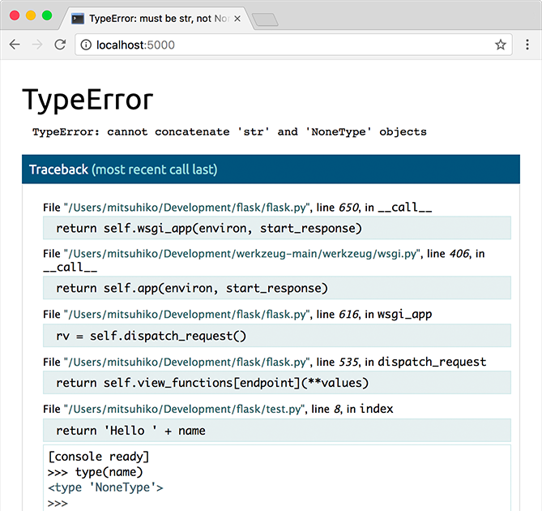
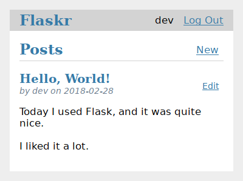
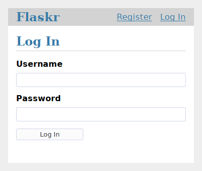
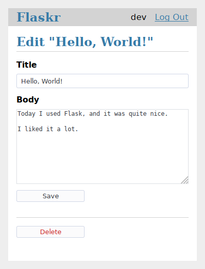

Flask belgelerine hoş geldiniz. Flask, hafif (lightweight) bir WSGI web uygulama çatısıdır (framework). Hızlı ve kolay bir başlangıç yapmaya imkân tanıyacak, aynı zamanda karmaşık uygulamalara doğru ölçeklenebilecek şekilde tasarlanmıştır.

[Kurulum](https://flask.palletsprojects.com/en/stable/installation/) bölümüyle başlayıp ardından [Hızlı Başlangıç](https://flask.palletsprojects.com/en/stable/quickstart/) bölümüyle genel bir bakış edinebilirsiniz. Flask ile küçük ama eksiksiz bir uygulamanın nasıl oluşturulacağını gösteren daha ayrıntılı bir [Öğretici (Tutorial)](https://flask.palletsprojects.com/en/stable/tutorial/) de mevcuttur. Yaygın kullanım kalıpları [Flask İçin Kalıplar (Patterns for Flask)](https://flask.palletsprojects.com/en/stable/patterns/) bölümünde anlatılmaktadır. Belgelerin geri kalanı, Flask'ın her bir bileşenini ayrıntılı biçimde ele almakta olup tam referans bilgisine [API](https://flask.palletsprojects.com/en/stable/api/) bölümünden ulaşılabilir.

Flask; [Werkzeug](https://werkzeug.palletsprojects.com/) WSGI araç setine(_toolkit_), [Jinja](https://jinja.palletsprojects.com/) şablon motoruna ve [Click](https://click.palletsprojects.com/) CLI araç setine bağımlıdır. Bilgi ararken Flask'ın belgelerinin yanı sıra onların(Werkzeug, Jinja ve Click CLI) belgelerini de kontrol ettiğinizden emin olun.

# 1. Kullanıcı Kılavuzu

Flask, başlangıç için makul varsayılan değerlerle birlikte yapılandırma(_configuration_) seçenekleri ve kullanım kuralları(_conventions_) sunar. Belgelerin bu bölümü, Flask çatısının(_Flask framework_) farklı parçalarını ve bunların nasıl kullanılabileceğini, özelleştirilebileceğini ve genişletilebileceğini açıklamaktadır. Flask'ın kendi olanaklarının ötesinde, daha fazla işlevsellik katmak için topluluk tarafından geliştirilen **eklentilere** de göz atabilirsiniz.

> [!TIP]
> #### Önemli Tanımlar:
> + **Conventions (yerleşik kullanım kuralları):** Flask'ın geliştiricilere önerdiği ve takip edilmesini kolaylaştırdığı kod yazma ve proje düzeni yaklaşımlarıdır. 
>  + **Sensible defaults (mantıklı varsayılan ayarlar):** Flask, çoğu uygulama için uygun olan ön tanımlı ayarlarla gelir. Böylece başlangıçta çok fazla yapılandırma yapmanız gerekmez.

> [!TIP]
> #### Flask Eklenti(Flask Extension)
> Flask bağlamında eklenti; Flask'ın çekirdeğinde bulunmayan ek işlevleri uygulamanıza kazandıran, bağımsız olarak geliştirilen Python paketleridir. Örneğin:
> + **Flask-SQLAlchemy** → veritabanı işlemleri
> + **Flask-Login** → kullanıcı oturumu yönetimi
> + **Flask-Mail** → e-posta gönderimi
> + **Flask-WTF** → form işleme ve doğrulama
> 
> Flask kasıtlı olarak "hafif (lightweight)" tutulmuştur; yani her şeyi dahili olarak sunmaz. İhtiyaç duyulan ek özellikler, topluluk tarafından geliştirilen bu eklentiler aracılığıyla projeye dahil edilir. Bu yaklaşım, geliştiricinin yalnızca ihtiyaç duyduğu parçaları seçmesine olanak tanır.

## 1.1. Kurulum

### 1.1.1. Python Sürümü

Python'un en güncel sürümünü kullanmanızı öneririz. Flask, **Python 3.9** ve daha yeni sürümleri desteklemektedir.
### 1.1.2. Bağımlılıklar

Flask kurulduğunda bu dağıtımlar otomatik olarak yüklenecektir:

+ **[Werkzeug](https://palletsprojects.com/p/werkzeug/)**, uygulamalar ile sunucular arasındaki standart Python arayüzü olan **WSGI**'yi uygular.
+ **[Jinja](https://palletsprojects.com/p/jinja/)**, uygulamanızın kullanıcıya sunduğu web sayfalarını oluşturan(_render_) bir şablon dilidir.
+ **[MarkupSafe](https://palletsprojects.com/p/markupsafe/)**, Jinja ile birlikte gelir. Enjeksiyon saldırılarını önlemek amacıyla şablonlar oluşturulurken güvenilmeyen girdileri kaçış işlemine(_escape_) tabi tutar.
+ **[ItsDangerous](https://palletsprojects.com/p/itsdangerous/)**, verilerin bütünlüğünü (integrity) garanti altına almak için verileri güvenli bir şekilde imzalar (digitally signs). Bu, Flask'ın oturum çerezini (session cookie) korumak için kullanılır.
+ **Click**, komut satırı uygulamaları geliştirmek için kullanılan bir çatıdır (framework). `flask` komutunu sağlar ve özel yönetim komutları eklemeye olanak tanır.
+ **[Blinker](https://blinker.readthedocs.io/)**, Sinyaller (Signals) için destek sunar.


> [!TIP]
> `flask` **komutunu** sağlar ve **özel yönetim komutları** eklemeye olanak tanır. Anlamı:
> #### 1. `flask` komutunu sağlar
> Flask'ı yükledikten sonra terminalde `flask` adlı bir komut kullanılabilir hale gelir. Örneğin:
> + `flask run` → geliştirme sunucusunu başlatır
> + `flask shell` → uygulama bağlamıyla bir Python kabuğu açar
> #### 2. Özel yönetim komutları eklemeye olanak tanır
> Geliştiriciler, Click sayesinde kendi ihtiyaçlarına göre yeni `flask` alt komutları yazabilir.
> Örneğin:
> + `flask veritabanı-olustur` → veritabanı tablolarını kurar
> + `flask cache-temizle` → önbelleği sıfırlar
> + `flask kullanicilari-listele` → sistemdeki kullanıcıları ekrana döker
> 
> Yani Click, yalnızca Flask'ın kendi dahili komutlarını değil, projeye özgü yönetimsel görevleri de komut satırından çalıştırılabilir hale getirme altyapısını sunar. Bu, özellikle Django'daki `manage.py` komut yapısına aşinaysanız benzer bir kavramdır.

#### 1.1.2.1. İsteğe Bağlı Bağımlılıklar

Bu dağıtımlar otomatik olarak kurulmaz. Eğer kendiniz kurarsanız, Flask bunları algılayacak ve kullanacaktır.

+ **[python-dotenv](https://github.com/theskumar/python-dotenv#readme)**, `flask` komutları çalıştırılırken **`.env` dosyasından ortam değişkenlerinin ([Environment Variables From dotenv](https://flask.palletsprojects.com/en/stable/cli/#dotenv))** yüklenmesini sağlar.
+ **[Watchdog](https://pythonhosted.org/watchdog/)**, geliştirme sunucusu (development server) için daha hızlı ve daha verimli bir **yeniden yükleme (reloader)** mekanizması sağlar.


> [!TIP]
> #### Watchdog olmadan (varsayılan durum):
> Flask'ın geliştirme sunucusu, dosya değişikliklerini algılamak için Python'ın dahili mekanizmasını kullanır. Bu mekanizma dosyaları belirli aralıklarla kontrol eder (polling), bu da bazen yavaş veya gecikmeli tepkilere yol açabilir.
> ##### Watchdog ile:
> ```
> pip install watchdog
> flask run
> ```
> Artık `app.py` dosyasında bir değişiklik yaptığınızda:
> ```python
> # app.py - bir satır değiştirdiniz
> @app.route("/")
> def index():
> 	return "Merhaba"     # bunu "Merhaba Dünya!" olarak değiştirdiniz
> ```
> Watchdog bu değişikliği dosya sistemi olayları (file system events) aracılığıyla **anında** algılar ve sunucu hemen yeniden yüklenir:
> ```
> * Detected change in 'app.py', reloading
> * Restarting with watchdog (inotify)
> * Debugger is active!
> ```
> Kısaca fark şudur:
> 
> ||Varsayılan|Watchdog ile|
> |---|---|---|
> |Algılama yöntemi|Periyodik yoklama (polling)|Anlık dosya sistemi olayı|
> |Hız|Daha yavaş|Daha hızlı|
> |CPU kullanımı|Daha yüksek|Daha düşük|
>
> **Dikkat:** Watchdog'un yeniden yükleyicisi yalnızca debug modunda çalışır: `flask run --debug`
#### 1.1.2.2. greenlet

Uygulamanızda **[Gevent ile birlikte asenkron (Async)](https://flask.palletsprojects.com/en/stable/gevent/?__cf_chl_f_tk=_OlXNUVtcewtCyrWF.5UU7diuWobBrE5UAp8VZcp9EU-1783079243-1.0.1.1-xu.K8861FQeu72vmysArFb4Nr79eXPFaRq5z_lrLBcU)** çalışma modelini kullanmayı tercih edebilirsiniz. Bu durumda **`greenlet` 1.0 veya daha yeni bir sürüm (`greenlet>=1.0`)** gereklidir. Eğer **PyPy** kullanıyorsanız, **PyPy 7.3.7 veya daha yeni bir sürüm (`PyPy>=7.3.7`)** gereklidir.

> [!TIP]
> #### Terim Açıklamaları
> + **Async (Asenkron):** Bir işlemin tamamlanmasını beklerken programın başka işlemleri de sürdürebilmesini sağlayan çalışma modelidir. Özellikle ağ istekleri gibi bekleme süreleri olan işlemlerde performansı artırır.
> + **Gevent:** Python'da yüksek eşzamanlılık (concurrency) sağlayan bir kütüphanedir. Ağ uygulamalarında çok sayıda bağlantıyı verimli bir şekilde yönetmek için kullanılır.
> + **greenlet:** Gevent'in temelini oluşturan düşük seviyeli bir kütüphanedir. Python'da hafif yürütme birimleri (lightweight execution units) oluşturarak görevler arasında hızlı geçiş yapılmasını sağlar.
> + **PyPy:** Python'un alternatif bir yorumlayıcısıdır (interpreter). Özellikle **JIT (Just-In-Time) derleyicisi** sayesinde, birçok uygulamada standart Python yorumlayıcısı (CPython) ile karşılaştırıldığında daha yüksek performans sunabilir.

### 1.1.3. Sanal Ortamlar (Virtual Environments)

Hem geliştirme(_development_) hem de üretim (_production_) aşamasında projenizin bağımlılıklarını yönetmek için bir sanal ortam(_virtual environment_) kullanın.

Sanal ortam hangi sorunu çözer? Ne kadar çok Python projeniz varsa, farklı Python kütüphanelerinin hatta Python'ın kendisinin farklı sürümleriyle çalışmanız o kadar olası hale gelir. Bir proje için kütüphanelerin daha yeni sürümleri, başka bir projedeki uyumluluğu bozabilir.

Sanal ortamlar, her proje için ayrı oluşturulan ve birbirinden bağımsız Python kütüphaneleri gruplarıdır. Bir proje için yüklenen paketler, diğer projeleri veya işletim sistemine kurulu paketleri etkilemez.

Python, sanal ortamlar oluşturmak için [`venv`](https://docs.python.org/3/library/venv.html#module-venv) modülüyle birlikte gelir.
#### 1.1.3.1. Bir ortam oluşturun(Create an environment)

Bir proje klasörü ve bunun içinde bir `.venv` klasörü oluşturun:

**macOS/Linux**

```bash
$ mkdir myproject
$ cd myproject
$ python3 -m venv .venv
```

**Windows**

```powershell
> mkdir myproject
> cd myproject
> py -3 -m venv .venv
```

#### 1.1.3.2. Ortamı aktifleştirin(Activate the environment)

Projeniz üzerinde çalışmaya başlamadan önce, ilgili ortamı aktifleştirin:

**macOS/Linux**

```bash
$ . .venv/bin/activate
```

**Windows**

```powershell
> .venv\Scripts\activate
```

Kabuk isteminiz (shell prompt), aktif hale getirilen ortamın adını gösterecek şekilde değişecektir.


> [!TIP]
> Buradaki **shell prompt**, terminalde komut yazdığınız satırın başındaki istemi ifade eder.
> Örneğin, sanal ortam etkinleştirilmeden önce terminal şu şekilde görünebilir:
> **macOS/Linux**
> ```bash
> $
> ```
> **Windows**
> ```powershell
> C:\Users\Tanju>
> ```
> Sanal ortam etkinleştirildikten sonra ise istem şu hale gelir:
> **macOS/Linux**
> ```bash
> (.venv) $
> ```
> **Windows**
> ```powershell
> (.venv) C:\Users\Tanju>
> ```
> Buradaki **`(.venv)`**, hangi sanal ortamın etkin olduğunu gösterir. Böylece yüklediğiniz paketlerin ve çalıştırdığınız Python yorumlayıcısının bu sanal ortama ait olduğunu kolayca anlayabilirsiniz.

### 1.1.4. Flask'ı Kurun

Aktifleştirilmiş ortamın içindeyken, Flask'ı kurmak için aşağıdaki komutu kullanın:

```bash
$ pip install Flask
```

Flask artık yüklenmiştir. Başlamak için **Hızlı Başlangıç (Quickstart)** bölümüne göz atabilir veya **Belgelere Genel Bakış (Documentation Overview)** sayfasına geçebilirsiniz.

## 1.2. Hızlı Başlangıç (Quickstart)

Başlamak için sabırsızlanıyor musunuz? Bu sayfa, **Flask'a iyi bir giriş** sunmaktadır. Ancak önce bir proje oluşturmak ve Flask'ı kurmak için **1.1. Kurulum (Installation)** bölümündeki adımları takip edin.

### 1.2.1. Minimum Düzeyde Bir Uygulama (A Minimal Application)

Minimum düzeyde bir Flask uygulaması şuna benzer:

```python
from flask import Flask

app = Flask(__name__)

@app.route("/")
def hello_world():
    return "<p>Hello, World!</p>"
```

Peki bu kod ne yaptı?

1. Öncelikle [`Flask`](https://flask.palletsprojects.com/en/stable/api/#flask.Flask) sınıfını içe aktardık (`import`). Bu sınıfın bir örneği (instance), **WSGI uygulamamız** olacaktır.
2. Ardından bu sınıfın bir örneğini oluşturuyoruz. İlk argüman, uygulamanın bulunduğu modülün ya da paketin adıdır. `__name__`, çoğu durumda uygun olan ve bunun için kullanışlı bir kısayoldur. Bu, Flask’ın şablonlar (_templates_) ve statik dosyalar (_static files_) gibi kaynakları nerede arayacağını bilmesi için gereklidir.
3. Daha sonra Flask'a hangi URL'nin fonksiyonumuzu tetiklemesi gerektiğini belirtmek için `route()` dekoratörünü(_decorator_) kullanırız.
4. Fonksiyon, kullanıcının tarayıcısında görüntülemek istediğimiz mesajı döndürür. Varsayılan içerik türü (_content type_) HTML'dir, bu nedenle metindeki HTML kodları tarayıcı tarafından işlenerek (_render_) gösterilecektir.

> [!TIP]
> #### **WSGI** (Web Server Gateway Interface) nedir?
> **WSGI** (Web Server Gateway Interface), web sunucusu ile Python web uygulaması arasındaki iletişimi standart hale getiren bir arayüz protokolüdür.
> Bunu bir tercüman gibi düşünebilirsiniz:
> ```
> Kullanıcı (tarayıcı)
>        ↓
>   Web Sunucusu          ← Nginx, Apache gibi
>   (HTTP'yi anlar)
>        ↓
>      WSGI               ← Aralarındaki ortak dil
>        ↓
>  Python Uygulaması      ← Flask, Django gibi
>   (Python'ı anlar)
> ```
> ##### Neden gereklidir?
> Web sunucuları HTTP protokolünü konuşur, Python uygulamaları ise Python kodunu çalıştırır. Bu ikisinin birbirleriyle nasıl haberleşeceğini WSGI belirler. WSGI olmasaydı her web sunucusu ile her Python çatısı arasında ayrı ayrı entegrasyon yazmak gerekirdi.
> ##### Pratikte ne anlama gelir?
> Flask ile bir uygulama yazdığınızda, onu Nginx veya Apache gibi herhangi bir WSGI uyumlu sunucuyla çalıştırabilirsiniz. Yani Flask uygulamanızı bir sunucudan diğerine taşımanız gerektiğinde kodunuzu değiştirmenize gerek kalmaz.

> [!TIP]
> #### Flask de  neden`__name__` kullanılır?
> Flask, uygulamanızla ilgili bazı dosyaları otomatik olarak bulmaya çalışır; ancak bunları nerede arayacağını bilmesi için bir başlangıç noktasına ihtiyaç duyar. İşte `__name__` bu başlangıç noktasını sağlar.
> ##### "Şablonlar ve statik dosyalar" ne demektir?
> **Şablonlar (templates):** HTML dosyalarıdır. Flask bunları varsayılan olarak `templates/` klasöründe arar:
> ```
>  proje/
>   hello.py
>   templates/
>     anasayfa.html    ← şablon
> ```
> **Statik dosyalar (static files):** CSS, JavaScript, resim gibi dosyalardır. Flask bunları `static/` klasöründe arar:
> ```
>  proje/
>   hello.py
>   static/
>     style.css        ← statik dosya
>     logo.png         ← statik dosya
> ```
> ##### Neden `__name__` gereklidir?
> Flask, `__name__` sayesinde `hello.py` dosyasının nerede olduğunu öğrenir ve `templates/` ile `static/` klasörlerini **o dosyanın yanında** arar. Aksi hâlde Flask bu klasörleri nerede arayacağını bilemez ve dosyaları bulamaz.


Dosyayı `hello.py` veya benzer bir adla kaydedin. Uygulamanızı `flask.py` olarak adlandırmamaya dikkat edin; aksi takdirde Flask'ın kendisiyle çakışma meydana gelir.

Uygulamayı çalıştırmak için `flask` komutunu veya `python -m flask` komutunu kullanın. Flask'a `--app` seçeneğiyle uygulamanızın nerede olduğunu belirtmeniz gerekmektedir.

```bash
$ flask --app hello run
 * Serving Flask app 'hello'
 * Running on http://127.0.0.1:5000 (Press CTRL+C to quit)
```


> [!NOTE]
> #### Uygulamanın Otomatik Olarak Bulunması (Application Discovery Behavior)
> Kolaylık sağlamak amacıyla, dosyanızın adı **`app.py`** veya **`wsgi.py`** ise **`--app`** seçeneğini kullanmanız gerekmez. Daha ayrıntılı bilgi için **[Komut Satırı Arayüzü (Command Line Interface)](https://flask.palletsprojects.com/en/stable/cli/)** bölümüne bakabilirsiniz.

Bu komut, test etmek için oldukça yeterli olan ancak muhtemelen canlı ortamda (production) kullanmak istemeyeceğiniz çok basit bir yerleşik (builtin) sunucu başlatır. Canlıya alma seçenekleri için [Canlı Ortama Dağıtım (Deploying to Production)](https://flask.palletsprojects.com/en/stable/deploying/) bölümüne bakın.

Şimdi [http://127.0.0.1:5000/](http://127.0.0.1:5000/) adresine gidin; "hello world" karşılama mesajınızı görmeniz gerekir.

Eğer başka bir program 5000 portunu zaten kullanıyorsa, sunucu başlatılmaya çalışırken `OSError: [Errno 98]` veya `OSError: [WinError 10013]` hatasını görürsünüz. Bu durumun nasıl çözüleceğini öğrenmek için[ Adres zaten kullanımda (Address already in use)](https://flask.palletsprojects.com/en/stable/server/#address-already-in-use) bölümüne bakın.


> [!NOTE]
> #### Dışarıdan Erişilebilir Sunucu (Externally Visible Server)
> Sunucuyu çalıştırdığınızda, sunucunun yalnızca kendi bilgisayarınızdan erişilebilir olduğunu, ağdaki diğer bilgisayarlardan erişilemediğini fark edeceksiniz. Bu varsayılan bir ayardır; çünkü hata ayıklama (debugging) modunda uygulamanın bir kullanıcısı, bilgisayarınızda rastgele Python kodları(_arbitrary Python code_) çalıştırabilir.
> 
> Eğer hata ayıklayıcıyı (debugger) devre dışı bıraktıysanız veya ağınızdaki kullanıcılara güveniyorsanız, komut satırına `--host=0.0.0.0` seçeneğini ekleyerek sunucuyu herkesin erişimine açabilirsiniz:
> 
> ```bash
> $ flask run --host=0.0.0.0
> ```
> Bu komut, işletim sisteminize tüm halka açık (_public_) IP adreslerini dinlemesini söyler.


> [!TIP]
> #### `0.0.0.0` Bir IP Adresi midir?
> Evet, ancak istemcilerin bağlandığı gerçek bir IP adresi değildir.
> 
> `0.0.0.0`, işletim sistemine şu anlamı taşır:
> > "Mevcut tüm ağ arayüzlerinde gelen bağlantıları dinle."
> 
> Yani örneğin bilgisayarınızda:
> + `127.0.0.1`
> + `192.168.1.15`
> + `10.0.0.8`
> 
> gibi birden fazla IP adresi varsa, uygulama bunların hepsinden erişilebilir hâle gelir.

### 1.2.2. Hata Ayıklama Modu (Debug Mode)

`flask run` komutu, geliştirme sunucusunu başlatmaktan daha fazlasını yapabilir. **Hata ayıklama modu (debug mode)** etkinleştirildiğinde, kodda bir değişiklik yapıldığında sunucu otomatik olarak yeniden yüklenir (**reload**). Ayrıca, bir istek (**request**) işlenirken bir hata oluşursa, tarayıcıda etkileşimli (**interactive**) bir hata ayıklayıcı (**debugger**) görüntülenir.




> [!warning]
> Hata ayıklayıcı (debugger), tarayıcı üzerinden rastgele Python kodları çalıştırılmasına izin verir. Bir PIN kodu ile korunuyor olsa da yine de büyük bir güvenlik riski teşkil eder. Geliştirme sunucusunu veya hata ayıklayıcıyı canlı ortamda (production) çalıştırmayın.

Hata ayıklama modunu etkinleştirmek için --debug seçeneğini kullanın.

```
$ flask --app hello run --debug
 * Serving Flask app 'hello'
 * Debug mode: on
 * Running on http://127.0.0.1:5000 (Press CTRL+C to quit)
 * Restarting with stat
 * Debugger is active!
 * Debugger PIN: nnn-nnn-nnn
```

Ayrıca bakınız:

+ Hata ayıklama(debug) modunda çalıştırma hakkında bilgi için [Geliştirme Sunucusu(Development Server)](https://flask.palletsprojects.com/en/stable/server/) ve[ Komut Satırı Arayüzü(Command Line Interface)](https://flask.palletsprojects.com/en/stable/cli/) bölümlerine bakın.
+ Yerleşik hata ayıklayıcıyı(built-in debugger) ve diğer hata ayıklayıcıları kullanma hakkında bilgi için Uygulama [Hatalarını Hata Ayıklama(Debugging Application Errors)](https://flask.palletsprojects.com/en/stable/debugging/) bölümüne bakın.
+ Hataları günlüğe(logging) kaydetmek ve düzgün hata sayfaları görüntülemek için [Uygulama Hatalarını Günlüğe Kaydetme ve Yönetme (Logging and Handling Application Errors)](https://flask.palletsprojects.com/en/stable/errorhandling/) bölümüne bakın.

### 1.2.3. HTML Kaçış Karakteri Kullanımı (HTML Escaping)

HTML döndürürken (Flask'taki varsayılan yanıt türü), enjeksiyon saldırılarından (injection attacks) korunmak için **çıktıda işlenen(render)** kullanıcı kaynaklı tüm değerlerin kaçış karakterlerine dönüştürülmesi (escape edilmesi) gerekir. İlerleyen bölümlerde ele alınacak olan ve Jinja ile işlenen HTML şablonları, bu işlemi otomatik olarak gerçekleştirecektir.("**çıktıda işlenen**" → kullanıcıdan gelen verinin HTML sayfasına gömülüp tarayıcıya gönderilmesi demektir.)

Burada gösterilen **`escape()`** fonksiyonu ise bu işlemi **manuel olarak** yapmak için kullanılabilir. Kısa ve sade olması amacıyla (**brevity**) çoğu örnekte bu fonksiyon kullanılmamıştır; ancak **güvenilmeyen (untrusted)** verileri nasıl kullandığınızın her zaman farkında olmalısınız.

```python
from flask import request
from markupsafe import escape

@app.route("/hello")
def hello():
    name = request.args.get("name", "Flask")
    return f"Hello, {escape(name)}!"
```

Eğer bir kullanıcı `/hello?name=<script>alert("bad")</script>` şeklinde bir gönderimde bulunursa, kaçış karakteri kullanımı (escaping) bu betiğin kullanıcının tarayıcısında çalıştırılması yerine metin olarak işlenmesini (render) sağlar.


> [!TIP]
> #### Jinja'nın Otomatik Koruması
> Jinja şablonlarında:
> ```html
> <h1>{{ username }}</h1>
> ```
> yazmanız yeterlidir.
> Jinja varsayılan olarak:
> ```python
> escape(username)
> ```
> işlemini sizin yerinize otomatik yapar.
> Bu nedenle Flask uygulamalarında çoğu zaman `escape()` fonksiyonunu elle çağırmanız gerekmez.

### 1.2.4. Yönlendirme (Routing)

Modern web uygulamaları, kullanıcılara yardımcı olmak için anlamlı URL'ler kullanır. Bir sayfa, kullanıcıların hatırlayabileceği ve doğrudan ziyaret etmek için kullanabileceği anlamlı bir URL içeriyorsa, kullanıcıların o sayfayı beğenip geri dönme olasılığı daha yüksektir.

Bir fonksiyonu bir URL'ye bağlamak için [`route()`](https://flask.palletsprojects.com/en/stable/api/#flask.Flask.route) dekoratörünü (decorator) kullanın.

```python
@app.route('/')
def index():
    return 'Index Page'

@app.route('/hello')
def hello():
    return 'Hello, World'
```

Daha fazlasını da yapabilirsiniz! URL'nin belirli bölümlerini dinamik hale getirebilir ve bir fonksiyona birden fazla kural bağlayabilirsiniz.

#### 1.2.4.1. Değişken Kuralları (Variable Rules)

Bölümleri `<variable_name>` şeklinde işaretleyerek bir URL'ye dinamik (değişken) bölümler ekleyebilirsiniz. Böylece fonksiyonunuz, bu `<variable_name>` ifadesini bir anahtar kelime argümanı (keyword argument) olarak alır. İsteğe bağlı olarak, `<converter:variable_name>` şeklinde bir dönüştürücü (converter) kullanarak argümanın türünü de belirtebilirsiniz.

```python
from markupsafe import escape

@app.route('/user/<username>')
def show_user_profile(username):
    # Bu kullanıcının profilini göster.
    return f'User {escape(username)}'

@app.route('/post/<int:post_id>')
def show_post(post_id):
    # Verilen ID'ye sahip gönderiyi göster; ID bir tam sayıdır (integer).
    return f'Post {post_id}'

@app.route('/path/<path:subpath>')
def show_subpath(subpath):
    # show the subpath after /path/
    return f'Subpath {escape(subpath)}'
```

Dönüştürücü türleri:

|          |                                                                                 |
| -------- | ------------------------------------------------------------------------------- |
| `string` | (varsayılan) eğik çizgi (slash, yani  `/`) içermeyen her türlü metni kabul eder |
| `int`    | pozitif tam sayıları kabul eder                                                 |
| `float`  | pozitif ondalıklı sayıları kabul eder                                           |
| `path`   | `string` gibidir ancak eğik çizgileri (slash, yani, `/`) de kabul eder          |
| `uuid`   | UUID dizgilerini (`strings`) kabul eder. UUID = Universally Unique Identifier   |


> [!TIP]
> Flask'ta converter belirtilmezse, varsayılan olarak **`string`** kullanılır.
> Yani şu iki tanım aynı anlama gelir:
> ```python
> @app.route("/users/<username>")
> ```
> ve 
> ```python
> @app.route("/users/<string:username>")
> ```
> Bu nedenle, yalnızca farklı bir veri türü gerektiğinde (`int`, `float`, `path` veya `uuid`) converter'ı açıkça belirtmeniz gerekir.


> [!TIP]
> #### HATIRLATMA
> Python'da iki tür argüman vardır:
> ##### 1. Sıralı Argüman(Positional Argument)
> Değerler sıraya göre gönderilir, isim belirtilmez:
> ```python
> def greeting(name, age):
> 	print("f{name}", {age} years old.")
> greeting("Linus", 30) # Sıraya göre eşleşir.
> ```
> ##### 2. Keyword Argument:
> Değerler parametre adı belirtilerek gönderilir, sıra önemli değildir:
> ```python
> greeting(age=30, name="Linus")
> ```
> **Keyword argument** (anahtar kelime argümanı), bir fonksiyona değer gönderirken parametre adını açıkça belirterek gönderilen argümandır.

#### 1.2.4.2. Benzersiz URL'ler / Yönlendirme Davranışı (Unique URLs / Redirection Behavior)

Aşağıdaki iki kural, sonlarında eğik çizgi (trailing slash, yani `/`) kullanılıp kullanılmaması bakımından birbirinden farklılık gösterir.

```python
@app.route('/projects/')
def projects():
    return 'The project page'

@app.route('/about')
def about():
    return 'The about page'
```

`projects` uç noktası (endpoint) için ana (canonical) URL, sonunda bir eğik çizgi barındırır. Bu durum, dosya sistemindeki bir klasöre benzer. Eğer URL'ye sonundaki eğik çizgi olmadan erişirseniz (`/projects`), Flask sizi sonunda eğik çizgi olan ana(canonical) URL'ye (`/projects/`) yönlendirir. 

`about` uç noktası için ana(canonical) URL ise sonunda bir eğik çizgi barındırmaz. Bu durum, bir dosyanın yol adına (pathname) benzer. URL'ye sonunda eğik çizgiyle erişmek (`/about/`) 404 "Bulunamadı" (Not Found) hatasına yol açar. Bu yaklaşım, bu kaynaklar için URL'lerin benzersiz kalmasını sağlar; böylece arama motorlarının aynı sayfayı iki kez dizine eklemesi (indexlemesi) engellenmiş olur.


> [!TIP]
> #### Canonical URL nedir?
> "Canonical URL" (kurallı URL), bir web sayfasına erişmek için belirlenen **tek ve resmi adres** demektir.
> ##### Neden gereklidir?
> Bazen aynı sayfaya birden fazla farklı URL üzerinden erişilebilir:
> ```
> http://example.com/projects
> http://example.com/projects/
> http://www.example.com/projects
> ```
> Bunların hepsi aynı sayfayı gösterse de adresleri farklıdır. Bu durum özellikle arama motorları açısından sorun yaratır; çünkü arama motoru aynı sayfayı farklı URL'ler altında ayrı sayfalar olarak dizine (indexlemesi) ekleyebilir.
> ##### Canonical URL bu sorunu çözer:
> Sayfanın tek ve doğru adresi belirlenir, diğer adresler ise bu adrese yönlendirilir:
> ```
> /projects   →  yönlendirilir  →  /projects/  ✓ (canonical URL)
> /projects/  →  doğrudan erişilir             ✓ (canonical URL)
> ```
> ##### Günlük hayattan bir benzetme:
> Bir kişinin hem ev adresi hem de iş adresi olabilir, ancak resmi yazışmalarda yalnızca biri kullanılır. İşte o resmi adres "canonical" adrestir.
>
> Kısacası canonical URL → bir kaynağın **tek ve yetkili adresi** demektir.

#### 1.2.4.3. URL Oluşturma (URL Building)

Belirli bir fonksiyona ait URL oluşturmak için [`url_for()`](https://flask.palletsprojects.com/en/stable/api/#flask.url_for) fonksiyonunu kullanın. İlk argüman olarak fonksiyonun adını ve ardından URL kuralındaki değişken kısımlara karşılık gelen dilediğiniz sayıda anahtar kelime argümanını (keyword argument) kabul eder. Bilinmeyen değişken kısımlar ise URL'nin sonuna sorgu parametresi (query parameter) olarak eklenir.


> [!TIP]
> Bu paragraf üç şeyi anlatmaktadır:
> ##### 1. İlk argüman olarak işlevin adını kabul eder
> ```python
> @app.route('/about')
> def about():
> 	return 'About'
> url_for('about') → '/hakkimda'
> ```
> ##### 2. URL kuralının değişken bölümlerine karşılık gelen keyword argument'ları kabul eder
> ```python
> @app.route('/user/<name>')
> def profile(name):
> 	return f'profile of {name}'
> ```
> Burada `name="Tanju"` keyword argument'ı, URL'deki `<name>` değişken bölümüne karşılık gelir.
> ##### 3. Bilinmeyen değişken bölümler sorgu parametresi olarak eklenir
> ```python
> url_for("profile", name="Tanju", page=2) → "/user/Tanju?page=2"
> ```
> Burada `page=2`, URL kuralında `<page>` diye bir değişken tanımlı olmadığı için URL'nin sonuna `?page=2` olarak eklenir. Buna **sorgu parametresi** denir.
> Özetle `url_for()` şu şekilde çalışır:
> ```python
>  url_for("fonksiyon_adı", bilinen_değişken="değer", bilinmeyen_değişken="değer")
>                             ↓                            ↓
>                       URL'nin içine girer          URL'nin sonuna eklenir
>                      /kullanici/Tanju             ?sayfa=2
> ```
> **Not:** Aşağıda tam bir örneği verilmiştir.

URL'leri şablonlarınızın (templates) içine doğrudan yazmak (hard-coding) yerine neden [`url_for()`](https://flask.palletsprojects.com/en/stable/api/#flask.url_for) URL tersine çevirme (URL reversing) fonksiyonunu kullanarak oluşturmalısınız?

1. **URL tersine çevirme (URL reversing)**, URL'leri doğrudan yazmaktan(_hard-coding_) daha açıklayıcı ve anlaşılırdır.
2. URL'lerinizi değiştirmeniz gerektiğinde, tek tek tüm sabit (hard-coded) URL'leri bulup düzenlemek yerine, değişikliği tek bir yerden yapabilirsiniz.
3. URL oluşturma işlemi, özel karakterlerin kaçış işlemlerini (escaping) şeffaf bir şekilde yönetir.
4. Oluşturulan yollar her zaman mutlaktır (absolute); böylece tarayıcılardaki göreceli yolların (relative paths) yol açabileceği beklenmedik davranışların önüne geçilir.
5. Uygulamanız URL kökünün (URL root) dışına yerleştirilmişse, örneğin `/` yerine `/myapplication` altındaysa, [`url_for()`](https://flask.palletsprojects.com/en/stable/api/#flask.url_for) bunu sizin için düzgün biçimde ele alır.

Örneğin, burada [`url_for()`](https://flask.palletsprojects.com/en/stable/api/#flask.Flask.test_request_context) fonksiyonunu denemek için [`test_request_context()`](https://flask.palletsprojects.com/en/stable/api/#flask.Flask.test_request_context) metodunu kullanıyoruz. [`test_request_context()`](https://flask.palletsprojects.com/en/stable/api/#flask.Flask.test_request_context), Flask'a biz bir Python kabuğu (shell) kullanıyor olsak bile sanki bir isteği (request) işliyormuş gibi davranmasını söyler. Bkz. [Bağlam Yerelleri (Context Locals)](https://flask.palletsprojects.com/en/stable/quickstart/#context-locals).

```python
from flask import url_for

@app.route('/')
def index():
    return 'index'

@app.route('/login')
def login():
    return 'login'

@app.route('/user/<username>')
def profile(username):
    return f'{username}\'s profile'

with app.test_request_context():
    print(url_for('index'))
    print(url_for('login'))
    print(url_for('login', next='/'))
    print(url_for('profile', username='John Doe'))
```

```
/
/login
/login?next=/
/user/John%20Doe
```


> [!TIP]
> #### Request context (istek bağlamı) nedir?
> **Request context (istek bağlamı)**, Flask'ın bir HTTP isteğini işlerken o isteğe ait tüm bilgileri geçici olarak sakladığı ortamdır.
> ##### Peki bu bilgiler nelerdir?
> Bir kullanıcı uygulamanıza istek gönderdiğinde Flask otomatik olarak şu bilgileri saklar:
> ```python
> request.method   # → "GET" mi, "POST" mu?
> request.url      # → "http://127.0.0.1:5000/hakkimda"
> request.args     # → URL'deki sorgu parametreleri (?isim=Tanju)
> request.form     # → Formdan gelen veriler
> request.cookies  # → Çerezler
> ```
> ##### Neden "bağlam (context)" denir?
> Çünkü bu bilgiler yalnızca o isteğin işlendiği süre boyunca geçerlidir. İstek bitince bilgiler silinir, yeni bir istek gelince yeniden oluşturulur:
> ```
> 1. İstek geldi  → request context oluşturuldu
>                    request.url = "/hakkimda"
>                    request.method = "GET"
> 
> 2. İstek işlendi → yanıt gönderildi
> 
> 3. İstek bitti  → request context silindi
> ```
> ##### Günlük hayattan benzetme:
> Bir müşteri bankaya geldiğinde kasiyer o müşteriye ait bir dosya açar (isim, hesap no vb.). İşlem bitince dosya kapanır. Sonraki müşteri için yeni bir dosya açılır. İşte request context bu geçici dosya gibidir.
> 
> Kısacası request context → **bir HTTP isteğine ait bilgilerin, yalnızca o istek süresince saklandığı geçici ortamdır.**

#### 1.2.4.4. HTTP Yöntemleri (HTTP Methods)

Web uygulamaları, URL'lere erişirken farklı HTTP metotları kullanır. Flask ile çalışırken HTTP metotlarına aşina olmanız gerekir. Varsayılan olarak bir rota (_route_) yalnızca `GET` isteklerine yanıt verir. Farklı HTTP metotlarını ele almak için [`route()`](https://flask.palletsprojects.com/en/stable/api/#flask.Flask.route) dekoratörünün `methods` argümanını kullanabilirsiniz.

```python
from flask import request

@app.route('/login', methods=['GET', 'POST'])
def login():
    if request.method == 'POST':
        return do_the_login()
    else:
        return show_the_login_form()
```

Yukarıdaki örnekte, bu rota için kullanılan **tüm HTTP metotları tek bir fonksiyon içinde** ele alınmaktadır. Eğer her bir metodun kullandığı bazı **ortak veriler (common data)** varsa, bu yaklaşım faydalı olabilir.

Bununla birlikte, farklı HTTP metotlarına ait **görünümleri (views)** ayrı fonksiyonlara da ayırabilirsiniz. Flask, yaygın olarak kullanılan her HTTP metodu için [`get()`](https://flask.palletsprojects.com/en/stable/api/#flask.Flask.get), [`post()`](https://flask.palletsprojects.com/en/stable/api/#flask.Flask.post) vb. dekoratörleri sağlayarak bu tür rotaları(_route_) tanımlamayı kolaylaştırır.

> [!TIP]
> #### View (Görünüm)
> Flask'ta **view**, bir URL isteğini karşılayan Python fonksiyonudur.
> Örneğin;
> ```python
> @app.route("/")
> def home():
> 	return "Ana Sayfa"
> ```
> Burada `home()` bir **view function**'dır.

```python
@app.get('/login')
def login_get():
    return show_the_login_form()

@app.post('/login')
def login_post():
    return do_the_login()
```

`GET` metodu mevcut olduğunda, Flask otomatik olarak `HEAD` metodu desteği ekler ve `HEAD` isteklerini [HTTP RFC](https://www.ietf.org/rfc/rfc2068.txt) standardına göre ele alır. Benzer şekilde, `OPTIONS` metodu da sizin için otomatik olarak uygulanır.

> [!TIP]
> #### Uygullama 1:
> ##### 1. Önce tam kodu oluşturun (`app.py`):
> ```python
> from flask import Flask, request
>
> app = Flask(__name__)
> 
> def do_the_login():
>     return "Giriş yapıldı! (POST isteği)"
> 
> def show_the_login_form():
>     return "Giriş formu gösteriliyor. (GET isteği)"
> 
> @app.route('/login', methods=['GET', 'POST'])
> def login():
>     if request.method == 'POST':
>         return do_the_login()
>     else:
>         return show_the_login_form()
> ```
> ##### 2. Sunucuyu başlatın:
> ```bash
> flask run --debug
> ```
> ##### 3. Yeni bir terminal açın ve curl komutlarını deneyin:
> **GET isteği:**
> ```bash
> curl http://127.0.0.1:5000/login
> ```
> **Çıktı:**
> ```
> Giriş formu gösteriliyor. (GET isteği)
> ```
> **POST isteği:**
> ```bash
> curl -X POST http://127.0.0.1:5000/login
> ```
> **Çıktı:**
> ```
> Giriş yapıldı! (POST isteği)
> ```
> **Curl komutlarının açıklaması:**
> 
> |Komut|Açıklama|
> |---|---|
> |`curl URL`|Varsayılan olarak GET isteği gönderir|
> |`curl -X POST URL`|POST isteği gönderir|
> |`curl -X POST -d "isim=Tanju" URL`|POST isteğiyle veri gönderir|
> 
> **İsteğe bağlı: Veriyle POST göndermek:**
> ```bash
> curl -X POST -d "kullanici=Tanju&sifre=1234" http://127.0.0.1:5000/login
> ```
> Bu veriyi okumak için koda şunu ekleyebilirsiniz:
> ```python
> def do_the_login():
>     kullanici = request.form.get("kullanici")
>     return f"{kullanici} giriş yaptı!"
> ```
### 1.2.5. Statik Dosyalar (Static Files)

Dinamik web uygulamalarının **statik dosyalara (static files)** da ihtiyacı vardır. Genellikle **CSS** ve **JavaScript** dosyaları bu gruba girer. İdeal olarak web sunucunuz bu dosyaları sizin için sunacak şekilde yapılandırılmıştır(_configured_); ancak geliştirme aşamasında Flask bunu da üstlenebilir. Paketinizin(**package**) içinde veya modülünüzün(**module**) hemen yanında `static` adında bir klasör oluşturmanız yeterlidir; bu klasör uygulamada `/static` adresi üzerinden erişilebilir olacaktır.

Statik dosyalar için URL oluşturmak amacıyla özel `'static'` uç nokta (endpoint) adını kullanın:

```python
url_for('static', filename='style.css')
```

Bu durumda dosyanın dosya sisteminde (**filesystem**) şu konumda bulunması gerekir:  `static/style.css`

### 1.2.6. Şablonları Oluşturma (Rendering Templates)

Python kodunun içinden doğrudan **HTML üretmek** hem pratik değildir hem de oldukça zahmetlidir. Bunun en önemli nedenlerinden biri, uygulamanın güvenliğini sağlamak için **HTML escaping (HTML kaçış işlemini)** işlemini kendiniz yapmak zorunda olmanızdır. Bu nedenle Flask, [**Jinja**](https://palletsprojects.com/p/jinja/) şablon motorunu (**template engine**) sizin için otomatik olarak yapılandırır(_configure_).

Şablonlar (**templates**), yalnızca HTML değil, **her türlü metin dosyasını** oluşturmak için kullanılabilir. Web uygulamalarında çoğunlukla **HTML sayfaları** oluşturulur; ancak bunun yanında **Markdown**, e-postalar için **düz metin (plain text)** veya başka metin tabanlı içerikler de üretilebilir.

HTML, CSS ve diğer web API'leri hakkında başvuru kaynağı olarak [**MDN Web Docs**](https://developer.mozilla.org/en-US/) kullanılabilir.

Bir şablonu işlemek (render etmek) için [`render_template()`](https://flask.palletsprojects.com/en/stable/api/#flask.render_template) metodunu kullanabilirsiniz. Tek yapmanız gereken, şablonun adını ve şablon motoruna (template engine) aktarmak istediğiniz değişkenleri anahtar kelime argümanları (keyword arguments) olarak sağlamaktır. Bir şablonun nasıl işleneceğine dair basit bir örneği aşağıda görebilirsiniz:

```python
from flask import render_template

@app.route('/hello/')
@app.route('/hello/<name>')
def hello(name=None):
    return render_template('hello.html', person=name)
```

Flask, şablonları `templates` klasöründe arar. Dolayısıyla uygulamanız bir modülse bu klasör modülün yanında, bir paketse paketin içinde yer alır:

**Durum 1:** bir modül(a module):

```
/application.py
/templates
    /hello.html
```

**Durum 2:** bir paket(a package):

```
/application
    /__init__.py
    /templates
        /hello.html
```

Şablonlar için Jinja şablonlarının (templates) tüm gücünden yararlanabilirsiniz. Daha fazla bilgi edinmek için resmi [Jinja Şablon Dokümantasyonu'na (Jinja Template Documentation)](https://jinja.palletsprojects.com/templates/) göz atabilirsiniz.

İşte örnek bir şablon:

```html
<!doctype html>
<title>Hello from Flask</title>

  <h1>Hello {{ person }}!</h1>

  <h1>Hello, World!</h1>

```

**`templates`** klasörü içindeki şablonlarda, [**`config`**](https://flask.palletsprojects.com/en/stable/api/#flask.Flask.config),[ **`request`**](https://flask.palletsprojects.com/en/stable/api/#flask.request), [**`session`**](https://flask.palletsprojects.com/en/stable/api/#flask.session) ve [**`g`**](https://flask.palletsprojects.com/en/stable/api/#flask.g) nesnelerine; ayrıca [**`url_for()`**](https://flask.palletsprojects.com/en/stable/api/#flask.url_for) ve [**`get_flashed_messages()`**](https://flask.palletsprojects.com/en/stable/api/#flask.get_flashed_messages) fonksiyonlarına da doğrudan erişebilirsiniz.

> [!NOTE]
> ####  `g` nedir?
> `g` nesnesinin ne olduğundan emin değil misiniz? Kendi ihtiyaçlarınız doğrultusunda bilgi depolayabileceğiniz bir nesnedir. Daha fazla bilgi için [`flask.g`](https://flask.palletsprojects.com/en/stable/api/#flask.g) belgelerine ve [Flask ile SQLite 3 Kullanımı(Using SQLite 3 with Flask)](https://flask.palletsprojects.com/en/stable/patterns/sqlite3/) bölümüne bakın.

Şablonlar, özellikle **kalıtım (inheritance)** kullanıldığında çok faydalıdır. Bunun nasıl çalıştığını öğrenmek için [**Template Inheritance (Şablon Kalıtımı)**](https://flask.palletsprojects.com/en/stable/patterns/templateinheritance/) bölümüne bakabilirsiniz. Temel olarak şablon kalıtımı, **başlık (header)**, **gezinme menüsü (navigation)** ve **alt bilgi (footer)** gibi her sayfada ortak olan bölümlerin tek bir yerde tanımlanmasını ve tüm sayfalarda yeniden kullanılmasını sağlar.

Otomatik kaçış işlemi (automatic escaping) etkin olduğundan, `person` değişkeni HTML içeriyorsa otomatik olarak kaçış işlemine tabi tutulur. Bir değişkene güveniyorsanız ve bunun güvenli HTML olduğunu biliyorsanız (örneğin wiki biçimlendirmesini HTML'ye dönüştüren bir modülden geldiyse), `Markup` sınıfını kullanarak veya şablonda `|safe` filtresini uygulayarak onu güvenli olarak işaretleyebilirsiniz. Daha fazla örnek için Jinja 2 belgelerine göz atın.

Aşağıda **`Markup`** sınıfının nasıl çalıştığına dair temel bir giriş örneği bulunmaktadır.

```python
>>> from markupsafe import Markup
>>> Markup('<strong>Hello %s!</strong>') % '<blink>hacker</blink>'
Markup('<strong>Hello &lt;blink&gt;hacker&lt;/blink&gt;!</strong>')
>>> Markup.escape('<blink>hacker</blink>')
Markup('&lt;blink&gt;hacker&lt;/blink&gt;')
>>> Markup('<em>Marked up</em> &raquo; HTML').striptags()
'Marked up » HTML'
```

> [!TIP]
> #### Wiki biçimlendirmesi (wiki markup) nedir?
> Wikipedia gibi wiki sistemlerinde içerik özel bir sözdizimi ile yazılır:
> ```html
> = Başlık =          → <h1>Başlık</h1>
> '''kalın'''         → <b>kalın</b>
> ''italik''          → <i>italik</i>
> [[bağlantı]]        → <a href="bağlantı">bağlantı</a>
> ```
> ##### Peki bu modül ne yapar?
> Wiki biçimlendirmesini HTML'ye dönüştüren bir modül, yukarıdaki sözdizimini alıp güvenli HTML'ye çevirir:
> ```python
> import wiki_modulü
> 
> metin = "'''Merhaba''' dünya"
> html = wiki_modulü.donustur(metin)
> # → "<b>Merhaba</b> dünya"
> ```
> ##### Neden "güvenilir" kabul edilir?
> Çünkü bu dönüşümü yapan modül:
> - Zararlı kodları (`<script>` gibi) zaten temizler
> - Yalnızca belirli HTML etiketleri üretir
> - Kullanıcıdan doğrudan HTML almaz

> [!NOTE]
> #### Değişiklik Günlüğü (Changelog)
> **Sürüm 0.5'te yapılan değişiklik:**
> Artık **otomatik HTML escaping (autoescaping)** tüm şablonlar (**templates**) için varsayılan olarak etkin değildir.
> Aşağıdaki dosya uzantılarına sahip şablonlarda otomatik escaping etkinleştirilir:
> + `.html`
> + `.htm`
> + `.xml`
> + `.xhtml`
> 
> Buna karşılık, **bir karakter dizisinden (string)** yüklenen şablonlarda otomatik escaping **devre dışıdır**.
> ##### Örnek:
> ```python
> from  flask import render_template_string
> render_template_string("<h1>{{ name }}</h1>")
> ```
> Bu template bir dosyadan değil, bir Python string'inden oluşturulmuştur. Bu tür template'lerde autoescaping varsayılan olarak kapalıdır.


> [!TIP]
> UYGULLAMA 2:
> ##### 1. Klasör yapısı şöyle olmalıdır:
> ```
> proje/
>   app.py
>   static/
>     style.css
>   templates/
>     anasayfa.html
> ```
> ##### 2. `static/style.css` dosyası:
> ```css
> body {
>     background-color: lightblue;
>     font-family: Arial, sans-serif;
> }
> 
> h1 {
>     color: darkblue;
> }
> ```
> ##### 3. `templates/anasayfa.html` dosyası:
> ```html
> <!DOCTYPE html>
> <html>
> <head>
>     <!-- url_for() ile CSS dosyasını bağlıyoruz -->
>     <link rel="stylesheet" href="{{ url_for('static', filename='style.css') }}">
>     <title>Anasayfa</title>
> </head>
> <body>
>     <h1>Merhaba Flask!</h1>
> </body>
> </html>
> ```
> ##### 4. `app.py` dosyası:
> ```python
> from flask import Flask, render_template
> 
> app = Flask(__name__)
> 
> @app.route("/")
> def anasayfa():
> 	return render_template("anasayfa.hmtl")
> ```
> ##### 5. Sunucuyu başlatın:
> ```bash
> flask run --debug
> ```
> ##### 6.Tarayıcıda açın:
> ```
> http://127.0.0.1:5000
> ```
> Sayfanın arka planının açık mavi, başlığın koyu mavi renkte göründüğünü göreceksiniz. Bu, `style.css` dosyasının başarıyla yüklendiği anlamına gelir.
> ##### `url_for('static', filename='style.css')` ne üretir?
> ```
> /static/style.css
> ```
> Yani tarayıcı bu CSS dosyasını şu adresten alır:
> ```
> http://127.0.0.1:5000/static/style.css
> ```

#### 1.2.6.1. UYGULLAMA: render_template ve Keyword parametreleri

**1. app.py**

```python
from flask import Flask, render_template

app = Flask(__name__)

@app.route('/profil')
def profil():
    return render_template('profil.html',
            username = 'Tanju',
            age = 30,
            city = 'İstanbul',
            jobs = ['Linux Sistem Administrator', 
		            'Rust Developer',
                    'Python Developer'],
            admin = True )

```

**2. `templates/profil.html`**

```html
<!DOCTYPE hmtl>
<html>
    <head>
        <title>render_template fonksiyonu ve keyword parametreleri </title>        
    </head>
    <body>
	    <!-- String değişken -->
        <h1>Hoş Geldiniz, {{ username  }} </h1>
		<!-- Sayı değişken -->
        <p>Yaş: {{ age }} </p>
        <p>Şehir: {{ city }} </p>
        <h2> İş Yetenekleri </h2>
        <ul>
            
                <li>{{ job }} </li>
            
        </ul>
		<!-- Boolean değişken -->
        
            <p>Admin panelinize Hoş Geldiniz!</p>
        
    </body>
</html>
```


**3. Çıktı:**

```
Hoş geldiniz, Tanju!
Yaş: 30
Şehir: İstanbul
- Elma
- Armut
- Muz
Admin panelinize hoş geldiniz!
```


### 1.2.7. İstek Verilerine Erişim (Accessing Request Data)

Web uygulamalarında, istemcinin (**client**) sunucuya (**server**) gönderdiği verilere uygun şekilde tepki verebilmek büyük önem taşır. Flask'ta bu bilgi, global `request` (istek) nesnesi tarafından sağlanır. 

Python konusunda biraz deneyiminiz varsa, `request` nesnesinin nasıl **global** olabildiğini ve buna rağmen Flask'ın **iş parçacığı güvenliğini (thread safety)** nasıl koruduğunu merak ediyor olabilirsiniz. Bunun cevabı **context locals (bağlam yerelleri)** mekanizmasıdır.(**Yani**, Python'a aşinaysanız, "Bu nesne global ise aynı anda birden fazla kullanıcı uygulamayı kullanırken nasıl karışıklık yaşanmıyor?" diye düşünebilirsiniz. Flask bunu **context locals** adı verilen özel bir mekanizma sayesinde güvenli bir şekilde yönetir.)

#### 1.2.7.1. Bağlam Yerelleri (Context Locals)


> [!NOTE]
> #### İç Bilgi (Insider Information)
> Bunun nasıl çalıştığını ve bağlam yerelleriyle(_context locals_) testlerin nasıl uygulanacağını anlamak istiyorsanız bu bölümü okuyun; aksi takdirde atlayabilirsiniz.

Flask'taki bazı nesneler(örneğin `request`, `session`, `current_app` ve `g`) **global nesneler** gibi görünür; ancak bunlar bildiğimiz anlamdaki sıradan global nesneler değildir. Bu nesneler aslında belirli bir bağlama (context) özgü nesnelerin vekilleridir (proxy), yani Bu nesneler aslında, **belirli bir bağlama (context)** özgü olan nesnelere yönlendirme yapan **proxy** nesneleridir. Kulağa karmaşık geliyor olabilir; ancak aslında anlaması oldukça kolaydır.


> [!TIP]
> #### Global Nesne Nedir?
> **Global nesne**, programın herhangi bir yerinden erişilebilen nesnedir.
> ##### Normal(Yerel) Nesne:
> ```python
> def fonksiyon():
> 	x = 10  # yalnızca bu fonksiyon içinden erişilebilir
> 	print(x)
> print(x)  # HATA! x burada erişilemez
> ```
> ##### Global Nesne:
> ```python
> x = 10  # programın her yerinden erişilebilir
> 
> def fonksiyon():
>     print(x)  # erişilebilir ✓
> 
> def baska_fonksiyon():
>     print(x)  # erişilebilir ✓
> ```

Bağlamın(_context_), isteği işleyen iş parçacığı(_handling thread_) olduğunu hayal edin. Bir istek gelir ve web sunucusu yeni bir iş parçacığı başlatmaya karar verir (veya başka bir yöntem seçer; arka plandaki nesne, iş parçacıkları dışındaki diğer eşzamanlılık/concurrency sistemleriyle de başa çıkabilecek yetenektedir).

> [!TIP]
> Flask'ın yalnızca iş parçacıkları (threads) ile değil, başka eşzamanlılık sistemleriyle de çalışabilmektedir.
> #### Eşzamanlılık (concurrency) nedir?
> Birden fazla isteği aynı anda işleyebilme yeteneğidir. Bunu sağlamanın birkaç farklı yolu vardır:
> ##### 1. İş parçacıkları(Threads):
> ```
> İstek A → İş parçacığı 1
> İstek B → İş parçacığı 2
> İstek C → İş parçacığı 3
> ```
> En yaygın yöntemdir. Her istek için ayrı bir iş parçacığı oluşturulur.
> ##### 2. Süreçler (Processes):
> ```
> İstek A → Süreç 1
> İstek B → Süreç 2
> ```
> Her istek için ayrı bir süreç oluşturulur. Gunicorn gibi sunucular bu yöntemi kullanır.
> ##### 3. Coroutine'ler (Greenlet/Asyncio):
> ```
> İstek A → Coroutine 1
> İstek B → Coroutine 2
> ```
> Gevent veya asyncio gibi kütüphaneler bu yöntemi kullanır. İş parçacığı yerine çok daha hafif yapılar kullanılır.
> 

Flask, isteği kendi içinde işlemeye başladığında, o anda çalışan iş parçacığının etkin bağlam (**active context**) olduğunu belirler ve mevcut uygulamayı (**current application**) ile **WSGI ortamını (WSGI environment)** bu bağlama (iş parçacığına) bağlar. Flask bunu oldukça akıllıca bir şekilde gerçekleştirir. Böylece bir Flask uygulaması, gerektiğinde başka bir Flask uygulamasını çağırabilir ve bu işlem sırasında bağlam yapısı bozulmaz.

**Peki bu sizin için ne anlama geliyor?**  Temel olarak, birim testleri (unit testing) gibi bir şey yapmıyorsanız bu durumu tamamen göz ardı edebilirsiniz. Bir istek (request) nesnesine bağımlı olan kodların, ortalıkta bir istek nesnesi olmadığı için aniden hata verdiğini fark edeceksiniz. Bunun çözümü, kendi istek nesnenizi oluşturup onu bağlama (context) bağlamaktır. Birim testleri için en kolay çözüm, [`test_request_context()`](https://flask.palletsprojects.com/en/stable/api/#flask.Flask.test_request_context) bağlam yöneticisini (context manager) kullanmaktır. Bu metot, `with` ifadesi(_statement_) ile birlikte kullanıldığında geçici bir test isteğini bağlama dahil eder ve böylece onunla etkileşime girebilmenizi sağlar. İşte bir örnek:

```python
from flask import request

with app.test_request_context('/hello', method='POST'):
    # now you can do something with the request until the
    # end of the with block, such as basic assertions:
    assert request.path == '/hello'
    assert request.method == 'POST'
```


> [!TIP]
> #### UYGULAMA 3:
> ##### 1. `app.py` dosyasını oluşturun:
> ```python
> from flask import Flask, request
> 
> app = Flask(__name__)
> 
> @app.route('/hello', methods=['POST'])
> def hello():
> 	return "Merhaba!"
> 
> # Test kodu
> with app.test_request_context('/hello', method='POST'):
> 	print("Yol (path):", request.path)       # → /hello
> 	print("Metot:", request.method)          # → POST
> 	print('---')
> 	
> 	# Doğrulama (assertion) örnekleri
> 	assert request.path == '/hello', "Yol yanlış"
> 	assert request.method = 'POST', "Metod yanlış"
> 	print("Tüm doğrulamalar başarılı!")
> ```
> ##### 2. Çalıştırın:
> ```bash
> python app.py
> ```
> **Çıktı:**
> ```
> Yol (path): /hello
> Metot: POST
> ---
> Tüm doğrulamalar başarılı!
> ```
> ##### 3. Şimdi kasıtlı olarak hatalı bir assertion deneyin:
> ```python
> with app.test_request_context('/hello', method='POST'):
> 	assert request.path == 'GET', "Metot yanlış"
> ```
> **Çıktı:**
> ```
> AssertionError: Metot yanlış!
> ```


> [!TIP]
> #### `assert` ne işe yarar?
> `assert` bir koşulun doğru olup olmadığını kontrol eder:
> ```python
> assert 2 + 2 == 4          # doğru → sessizce geçer
> assert 2 + 2 == 5          # yanlış → AssertionError fırlatır
> ```


Diğer bir seçenek ise [`request_context()`](https://flask.palletsprojects.com/en/stable/api/#flask.Flask.request_context) metoduna eksiksiz bir WSGI ortamı iletmektir:

```python
with app.request_context(environ):
    assert request.method == 'POST'
```

#### 1.2.7.2. İstek Nesnesi (The Request Object)

İstek nesnesi (request object) API bölümünde belgelenmiştir ve burada ayrıntılı olarak ele alınmayacaktır (bkz. [`Request`](https://flask.palletsprojects.com/en/stable/api/#flask.Request)). Aşağıda, en yaygın işlemlerden bazılarına genel bir bakış sunulmaktadır. İlk olarak, bu nesneyi `flask` modülünden içe aktarmanız (import etmeniz) gerekir:

```python
from flask import request
```

Mevcut istek yöntemi (request method), [`method`](https://flask.palletsprojects.com/en/stable/api/#flask.Request.method) niteliği (attribute) kullanılarak elde edilebilir. Form verilerine (bir `POST` veya `PUT` isteğinde iletilen veriler) erişmek için ise [`form`](https://flask.palletsprojects.com/en/stable/api/#flask.Request.form) niteliğini kullanabilirsiniz. Yukarıda bahsedilen iki niteliğe dair tam bir örnek aşağıda yer almaktadır:

```python
@app.route('/login', methods=['POST', 'GET'])
def login():
    error = None
    if request.method == 'POST':
        if valid_login(request.form['username'],
                       request.form['password']):
            return log_the_user_in(request.form['username'])
        else:
            error = 'Invalid username/password'
    # the code below is executed if the request method
    # was GET or the credentials were invalid
    return render_template('login.html', error=error)
```

**`form` niteliğinde istenen anahtar (key) mevcut değilse ne olur?** Bu durumda özel bir [`KeyError`](https://docs.python.org/3/library/exceptions.html#KeyError) hatası fırlatılır(_raise_). Bunu standart bir [`KeyError`](https://docs.python.org/3/library/exceptions.html#KeyError) gibi yakalayabilirsiniz; ancak yakalamazsanız, kullanıcılara bunun yerine otomatik olarak bir **HTTP 400 Bad Request**  hata sayfası gösterilir. Bu sayede birçok senaryoda bu sorunla ayrıca uğraşmak zorunda kalmazsınız.

URL içinde gönderilen parametrelere (`?anahtar=değer`) erişmek için ise [`args`](https://flask.palletsprojects.com/en/stable/api/#flask.Request.args) niteliğini(`arg` attribute) kullanabilirsiniz:
##### 1.2.7.2.1. UYGULAMA:

> [!CAUTION] Title
> Bu uygulama çeviri kitabında mevcut değildir. Konuyu pekiştirmek için bu kitaba dahil edilmiştir.

**1. Klasör yapısı**

```
proje/
  app.py
  templates/
    login.html
```

**2. `app.py` dosyası**

```python
from flask import Flask, request, render_template

app = Flask(__name__)

# Basit kullanıcı doğrulama işlevi
def valid_login(username, password):
    # Gerçek projede veritabanından kontrol edilir
    return username == "Tanju" and password == "1234"

# Kullanıcıyı sisteme alan işlev
def log_the_user_in(username):
    return f"Hoş geldiniz, {username}! Giriş başarılı."

@app.route('/login', methods=['POST', 'GET'])
def login():
    error = None
    if request.method == 'POST':
        if valid_login(request.form['username'],
                       request.form['password']):
            return log_the_user_in(request.form['username'])
        else:
            error = 'Geçersiz kullanıcı adı veya şifre!'
    # İstek GET ise veya kimlik bilgileri yanlışsa
    # login.html şablonu gösterilir
    return render_template('login.html', error=error)
```

**3. `templates/login.html` dosyası:**

```html
<!DOCTYPE html>
<html>
<head>
    <title>Giriş</title>
</head>
<body>
    <h1>Giriş Yap</h1>

    <!-- Hata varsa göster -->
    
        <p style="color: red;">{{ error }}</p>
    

    <!-- Giriş formu -->
    <form method="POST" action="/login">
        <label>Kullanıcı Adı:</label>
        <input type="text" name="username"><br><br>

        <label>Şifre:</label>
        <input type="password" name="password"><br><br>

        <input type="submit" value="Giriş Yap">
    </form>
</body>
</html>
```

**4. Sunucuyu başlatın:**

```bash
flask run --debug
```

**5. Tarayıcıda deneyin:**

```
http://127.0.0.1:5000/login
```

**Kodun akışı şöyledir:**

```
Kullanıcı /login adresine gider (GET isteği)
        ↓
login.html formu gösterilir
        ↓
Kullanıcı formu doldurup gönderir (POST isteği)
        ↓
valid_login() doğrulama yapar
        ↓
Doğru bilgi → log_the_user_in() → "Hoş geldiniz!"
Yanlış bilgi → error mesajı → login.html tekrar gösterilir
```

**Curl ile de test edebilirsiniz:**

GET isteği (formu görmek için):

```bash
curl http://127.0.0.1:5000/login
```

POST isteği (doğru bilgilerle):

```bash
curl -X POST -d "username=Tanju&password=1234" http://127.0.0.1:5000/login
```

Çıktı:

```
Hoş geldiniz, Tanju! Giriş başarılı.
```

POST isteği (yanlış bilgilerle):

```bash
curl -X POST -d "username=Tanju&password=yanlis" http://127.0.0.1:5000/login
```

Çıktı:

```
... Geçersiz kullanıcı adı veya şifre! ...
```

##### 1.2.7.2.2. UYGULAMA:  KeyError yakalama

> [!CAUTION] Title
> Bu uygulama çeviri kitabında mevcut değildir. Konuyu pekiştirmek için bu kitaba dahil edilmiştir.

**1. `app.py`:**

```python
from flask import Flask, request, render_template

app = Flask(__name__)

@app.route('/login', methods=['GET', 'POST'])
def login():
    if request.method == 'POST':
        try:
            # 'username' anahtarı formda yoksa KeyError fırlatılır
            username = request.form['username']
            return f"Hoş geldiniz, {username}!"
        except KeyError:
            return "Hata: Kullanıcı adı alanı eksik!", 400
    return render_template('login.html')
```

**2. `templates/login.html`:**

```html
<!DOCTYPE html>
<html>
<body>
    <h1>Giriş Yap</h1>

    <!-- Normale formu: username alanı var -->
    <h3>Normal Form:</h3>
    <form method="POST" action="/login">
        <input type="text" name="username" placeholder="Kullanıcı adı">
        <input type="submit" value="Giriş Yap">
    </form>

    <br>

    <!-- Bozuk form: username alanı yok -->
    <h3>Bozuk Form (username alanı eksik):</h3>
    <form method="POST" action="/login">
        <input type="text" name="yanlis_alan" placeholder="Yanlış alan">
        <input type="submit" value="Giriş Yap">
    </form>
</body>
</html>
```

**3. Sunucuyu başlatın:**

```bash
flask run --debug
```

**4. İki durumu deneyin:**

Normal form gönderildiğinde:

```
→ username anahtarı formda var
→ "Hoş geldiniz, Tanju!"
```

Bozuk form gönderildiğinde:

```
→ username anahtarı formda yok
→ KeyError fırlatılır
→ "Hata: Kullanıcı adı alanı eksik!"
```

**`try/except` kaldırırsanız ne olur?**

```python
@app.route('/login', methods=['GET', 'POST'])
def login():
    if request.method == 'POST':
        # try/except yok!
        username = request.form['username']
        return f"Hoş geldiniz, {username}!"
    return render_template('login.html')
```

Bozuk formu gönderdiğinizde Flask otomatik olarak şunu gösterir:

```
HTTP 400 Bad Request
```

Yani `try/except` yazmadan da Flask bu hatayı kendisi yakalar ve 400 hata sayfası gösterir.

#### 1.2.7.3. Dosya Yüklemeleri (File Uploads)

Flask ile yüklenen dosyaları kolayca işleyebilirsiniz. HTML formunuzda `enctype="multipart/form-data"` özniteliğini (attribute) ayarlamayı unutmadığınızdan emin olun; aksi takdirde tarayıcı dosyalarınızı sunucuya hiç iletmeyecektir.

Yüklenen dosyalar bellekte (RAM) veya dosya sisteminde geçici bir konumda saklanır. Bu dosyalara `request` nesnesi üzerindeki **`files`** özniteliği(_attribute_) aracılığıyla erişebilirsiniz. Yüklenen her dosya bu sözlükte (_dictionary_) saklanır. Standart bir Python **`file`** nesnesi gibi davranır; ancak dosyayı sunucunun dosya sistemine kaydetmenize olanak tanıyan bir [`save()`](https://werkzeug.palletsprojects.com/en/stable/datastructures/#werkzeug.datastructures.FileStorage.save) metoduna da sahiptir. İşte bunun nasıl çalıştığını gösteren basit bir örnek:

```python
from flask import request

@app.route('/upload', methods=['GET', 'POST'])
def upload_file():
    if request.method == 'POST':
        f = request.files['the_file']
        f.save('/var/www/uploads/uploaded_file.txt')
    ...
```

##### 1.2.7.3.1. UYGULAMA:

**1. Klasör yapısı:**

```
proje/
  app.py
  templates/
    yukle.html
  uploads/
```

**2. `app.py`:**

```python
from flask import Flask, request, render_template
import os

app = Flask(__name__)

@app.route('/upload', methods=['GET', 'POST'])
def upload_file():
    if request.method == 'POST':
        f = request.files['the_file']
        f.save(os.path.join('uploads', f.filename))
        return f"{f.filename} adlı dosya başarıyla yüklendi!"
    return render_template('yukle.html')
```

**3. `templates/yukle.html`:**

```html
<!DOCTYPE html>
<html>
<body>
    <h1>Dosya Yükle</h1>

    <!-- enctype="multipart/form-data" olmadan dosya iletilmez! -->
    <form method="POST" action="/upload" enctype="multipart/form-data">
        <input type="file" name="the_file">
        <br><br>
        <input type="submit" value="Yükle">
    </form>
</body>
</html>
```

**4. `uploads` klasörünü oluşturun:**

```bash
mkdir uploads
```

**5. Sunucuyu başlatın:**

```bash
flask run --debug
```

**6. Tarayıcıda deneyin:**

```
http://127.0.0.1:5000/upload
```

Bir dosya seçip yükleyin. Dosyanın `uploads/` klasörüne kaydedildiğini göreceksiniz.

**Kodun Akışı**

```
Kullanıcı /upload adresine gider (GET)
        ↓
yukle.html formu gösterilir
        ↓
Kullanıcı dosya seçip gönderir (POST)
        ↓
request.files['the_file'] dosyayı alır
        ↓
f.save() dosyayı uploads/ klasörüne kaydeder
        ↓
"Dosya başarıyla yüklendi!" mesajı gösterilir
```

**curl ile test etmek isterseniz:**

```bash
curl -X POST -F "the_file=@/home/tanju/belge.txt" http://127.0.0.1:5000/upload
```


> [!TIP]
> #### HATIRLATMA:
> `os.path.join()`, iki veya daha fazla yol parçasını birleştirerek tam bir dosya yolu oluşturur.
> ##### Basit örnek:
> ```python
> import os
> os.path.join('upload', 'belge.txt')
> # → 'uploads/belge.txt'
> ```
> ##### Neden `+` operatörü yerine `os.path.join()` kullanılır?
> Elle birleştirme yapılabilir ama hatalı olabilir:
> ```python
> 'uploads' + '/' + 'belge.txt'   # → 'uploads/belge.txt' ✓
> 'uploads' + 'belge.txt'          # → 'uploadsbelge.txt'  ✗ (eğik çizgi eksik!)
> ```
> `os.path.join()` ise bunu otomatik olarak doğru yapar:
> ```python
> os.path.join('uploads', 'belge.txt')  # → 'uploads/belge.txt' ✓
> ```
> ##### İşletim sistemi farkını da otomatik çözer:
> ```python
> # Linux/macOS:
os.path.join('uploads', 'belge.txt')  # → 'uploads/belge.txt'
> 
> # Windows:
> os.path.join('uploads', 'belge.txt')  # → 'uploads\belge.txt'
> ```
> Yani kodunuz hem Linux hem Windows'ta doğru çalışır.

Dosya istemcide yüklenmeden önce nasıl adlandırıldığını öğrenmek istiyorsanız [`filename`](https://werkzeug.palletsprojects.com/en/stable/datastructures/#werkzeug.datastructures.FileStorage.filename) niteliğine erişebilirsiniz. Ancak bu değerin sahte olabileceğini unutmayın; bu nedenle bu değere asla güvenmeyin. Dosyayı sunucuda saklamak için istemcideki dosya adını kullanmak istiyorsanız, Werkzeug'un sizin için sağladığı [`secure_filename()`](https://werkzeug.palletsprojects.com/en/stable/utils/#werkzeug.utils.secure_filename) fonksiyonundan geçirin:

##### 1.2.7.3.2. UYGULAMA:  `secure_filename` 

**1. `app.py`:**

```python
from flask import Flask, request, render_template
from werkzeug.utils import secure_filename
import os

app = Flask(__name__)

@app.route('/upload', methods=['GET', 'POST'])
def upload_file():
    if request.method == 'POST':
        file = request.files['the_file']
        guvenli_ad = secure_filename(file.filename)
        file.save(os.path.join('uploads', guvenli_ad))
        return f"Dosya '{guvenli_ad}' adıyla başarıyla yüklendi!"
    return render_template('yukle.html')
```

**2. `templates/yukle.html` (değişmedi):**

```html
<!DOCTYPE html>
<html>
<body>
    <h1>Dosya Yükle</h1>
    <form method="POST" action="/upload" enctype="multipart/form-data">
        <input type="file" name="the_file">
        <br><br>
        <input type="submit" value="Yükle">
    </form>
</body>
</html>
```

**`secure_filename()` ne yapar?**

Tehlikeli karakterleri temizler:

```python
secure_filename("belge.txt")
# → "belge.txt"  (normal, değişmez)

secure_filename("../../../etc/passwd")
# → "etc_passwd"  (tehlikeli yol karakterleri temizlendi!)

secure_filename("benim dosyam (1).txt")
# → "benim_dosyam_1_.txt"  (boşluk ve parantezler temizlendi)

secure_filename("../../gizli.txt")
# → "gizli.txt"  (tehlikeli ../.. kısmı temizlendi)
```

**Neden `../../../etc/passwd` tehlikelidir?**

Eğer `secure_filename()` kullanmazsanız:

```python
# Saldırgan dosyayı "../../../etc/passwd" adıyla gönderir
os.path.join('uploads', '../../../etc/passwd')
# → sunucunun kritik sistem dosyasının üzerine yazılabilir!
```

`secure_filename()` ile bu tehlike ortadan kalkar:

**curl ile test edebilirsiniz:**

```bash
curl -X POST -F "the_file=@belge.txt" http://127.0.0.1:5000/upload
```

Daha iyi örnekler için Dosya Yükleme([Uploading Files](https://flask.palletsprojects.com/en/stable/patterns/fileuploads/)) bölümüne bakın.

#### 1.2.7.4. Çerezler (Cookies)

Çerezlere erişmek için [`cookies`](https://flask.palletsprojects.com/en/stable/api/#flask.Request.cookies) niteliğini(_attribute_) kullanabilirsiniz. Çerez ayarlamak için ise yanıt nesnelerinin (response objects) [`set_cookie`](https://flask.palletsprojects.com/en/stable/api/#flask.Response.set_cookie) metodunu kullanabilirsiniz. İstek nesnelerinin(_request objects_) `cookies` niteliği, istemcinin ilettiği tüm çerezleri içeren bir sözlüktür (dictionary). Oturumları (sessions) kullanmak istiyorsanız çerezleri doğrudan kullanmayın; bunun yerine çerezlerin üzerine sizin için bir miktar güvenlik ekleyen Flask'taki [Oturumlar(Sessions)](https://flask.palletsprojects.com/en/stable/quickstart/#sessions) özelliğini kullanın.

Çerezleri okuma:

```python
from flask import request

@app.route('/')
def index():
    username = request.cookies.get('username')
    # use cookies.get(key) instead of cookies[key] to not get a
    # KeyError if the cookie is missing.
```

##### 1.2.7.4.1. UYGULAMA:  Çerez okuma

**1. `app.py`:**

```python
from flask import Flask, request, render_template

app = Flask(__name__)

@app.route('/')
def index():
    # cookies[key] yerine cookies.get(key) kullanıyoruz
    # çerez yoksa KeyError fırlatmak yerine None döner
    username = request.cookies.get('username')

    if username:
        return f"Hoş geldiniz, {username}! (Çerezden okundu)"
    else:
        return "Çerez bulunamadı! Henüz kullanıcı adı ayarlanmamış."
```

**2. Sunucuyu başlatın:**

```bash
flask run --debug
```

**3. Önce çerezi olmadan deneyin:**

```bash
curl http://127.0.0.1:5000/
```

**Çıktı:**

```
Çerez bulunamadı! Henüz kullanıcı adı ayarlanmamış.
```

**4. Çerezle deneyin:**

```bash
curl --cookie "username=Tanju" http://127.0.0.1:5000/
```

**Çıktı:**

```
Hoş geldiniz, Tanju! (Çerezden okundu)
```

> [!TIP]
> #### `cookies.get()` ile `cookies[]` arasındaki fark:
> ```python
> # Çerez yoksa KeyError fırlatır! ✗
> username = request.cookies['username']
> 
> # Çerez yoksa None döner, hata fırlatmaz ✓
> username = request.cookies.get('username')
> 
> # Çerez yoksa varsayılan değer döner ✓
> username = request.cookies.get('username', 'Misafir')
> ```

##### 1.2.7.4.2.  UYGULAMA:  Çerez yazma

**1. `app.py`:**

```python
from flask import Flask, make_response, render_template

app = Flask(__name__)

@app.route('/')
def index():
    resp = make_response(render_template('anasayfa.html'))
    resp.set_cookie('username', 'Tanju')
    return resp
```

**2. `templates/anasayfa.html`:**

```html
<!DOCTYPE html>
<html>
<body>
    <h1>Anasayfa</h1>
    <p>Çerez ayarlandı!</p>
</body>
</html>
```

**3. Sunucuyu başlatın:**

```bash
flask run --debug
```

**4. Tarayıcıda açın:**

```
http://127.0.0.1:5000/
```

**5. Çerezi kontrol edin:**

`F12` → `Application` → `Cookies` → `http://127.0.0.1:5000`

```
username = Tanju
```

**Kodun akışı:**

```
render_template('anasayfa.html')  → HTML içeriği oluşturulur
        ↓
make_response(...)                → HTML'den yanıt nesnesi oluşturulur
        ↓
resp.set_cookie('username', 'Tanju')  → çerez yanıta eklenir
        ↓
return resp                       → çerezle birlikte tarayıcıya gönderilir
```

##### 1.2.7.4.3.  UYGULAMA:  Çerez okuma ve Çerez yazma 

**`app.py`:**

```python
from flask import Flask, request, make_response

app = Flask(__name__)

# Çerezi ayarlayan route
@app.route('/set')
def set_cookie():
    response = make_response("Çerez ayarlandı! Şimdi / adresine gidin.")
    response.set_cookie('username', 'Tanju')
    return response

# Çerezi okuyan route
@app.route('/')
def index():
    username = request.cookies.get('username')

    if username:
        return f"Hoş geldiniz, {username}! (Çerezden okundu)"
    else:
        return "Çerez bulunamadı! Önce /set adresine gidin."
```

**Tarayıcıda şu sırayla deneyin:**

**1. Adım:** Önce şu adrese gidin:

```
http://127.0.0.1:5000/set
```

Çıktı:

```
Çerez ayarlandı! Şimdi / adresine gidin.
```

**2. Adım:** Ardından şu adrese gidin:

```
http://127.0.0.1:5000/
```

Çıktı:

```
Hoş geldiniz, Tanju! (Çerezden okundu
```


> [!TIP]
> + Çerezin gerçekten ayarlanıp ayarlanmadığını tarayıcıdan kontrol etmek için:
> + `F12` → `Application` sekmesi → `Cookies` → `http://127.0.0.1:5000`
> + Burada `username = Tanju` çerezini göreceksiniz.

---

Çerezlerin yanıt nesneleri (response objects) üzerinde ayarlandığını unutmayın. Normalde görünüm (view) fonksiyonlarından yalnızca metin (`string`) döndürdüğünüz için Flask bunları sizin adınıza otomatik olarak bir `response` nesnesine dönüştürür. Bu dönüşümü açıkça kendiniz yapmak isterseniz, [`make_response()`](https://flask.palletsprojects.com/en/stable/api/#flask.make_response) fonksiyonunu kullanabilir ve ardından elde ettiğiniz `response` nesnesini istediğiniz gibi değiştirebilirsiniz.

Bazı durumlarda, henüz bir `response` nesnesi mevcut olmadığı bir noktada çerez ayarlamak isteyebilirsiniz. Bunu **Deferred Request Callbacks (Ertelenmiş İstek Geri Çağrıları)** tasarım desenini kullanarak gerçekleştirebilirsiniz.

Bu konu hakkında daha fazla bilgi için [About Responses (Yanıtlar Hakkında)](https://flask.palletsprojects.com/en/stable/quickstart/#about-responses) bölümüne de bakabilirsiniz.

##### 1.2.7.4.4.  UYGULAMA:  `make_response()` fonksiyonu

+ Bu uygulamada `make_response()` fonksiyonun bize sağladığı avantajı anlatılmaktadır:

> [!tip]
> ##### `make_response()` ne zaman gerekir?
> Yanıt nesnesini **özelleştirmek** istediğinizde gerekir
> ##### Çerez eklemek istiyorsanız: 
>```python
># Bunu yapamazsınız! ✗
> @app.route('/')
> def index():
>     return "Merhaba!".set_cookie('username', 'Tanju')  # string üzerinde set_cookie yok!
> 
> # Bunu yapabilirsiniz ✓
> @app.route('/')
> def index():
>     resp = make_response("Merhaba!")
>     resp.set_cookie('username', 'Tanju')  # yanıt nesnesi üzerinde set_cookie var
>     return resp
>```
> 
> |Durum|Yöntem|
> |---|---|
> |Sadece içerik döndürmek|`return "Merhaba!"`|
> |Çerez eklemek|`make_response()`|
> |Durum kodu değiştirmek|`make_response()`|
> |Özel başlık eklemek|`make_response()`|

**`app.py`:**

```python
from flask import Flask, make_response

app = Flask(__name__)

# 1. Flask otomatik dönüştürür (değişiklik yapılamaz)
@app.route('/otomatik')
def otomatik():
    return "Merhaba! (Flask otomatik dönüştürdü)"

# 2. make_response() ile manuel dönüştürme (değişiklik yapılabilir)
@app.route('/manuel')
def manuel():
    resp = make_response("Merhaba! (make_response ile dönüştürüldü)")
    resp.set_cookie('username', 'Tanju')
    return resp
```

**Sunucuyu başlatın:**

```bash
flask run --debug
```

**Tarayıcıda deneyin:**

**1. Otomatik dönüşüm:**

```
http://127.0.0.1:5000/otomatik
```

Çıktı: `Merhaba! (Flask otomatik dönüştürdü)`  → F12 → Cookies → **Çerez yok**

**2. Manuel dönüşüm:**

```
http://127.0.0.1:5000/manuel
```

Çıktı: `Merhaba! (make_response ile dönüştürüldü)`  → F12 → Cookies → **`username = Tanju` çerezi var!**

**Özet:**

```
return "Merhaba!"          → Flask dönüştürür → değişiklik yapılamaz
make_response("Merhaba!")  → siz dönüştürürsünüz → çerez, başlık vb. eklenebilir
```

##### 1.2.7.4.5.  UYGULAMA: Deferred Request Callbacks

**`@app.after_request` dekoratörü** : Bu dekoratör, yanıt oluşturulduktan **sonra** otomatik olarak çalışır.

**`app.py`:**

```python
from flask import Flask, request, make_response

app = Flask(__name__)

# Her yanıttan sonra otomatik çalışır
@app.after_request
def cerez_ayarla(yanit):
    yanit.set_cookie('username', 'Tanju')
    return yanit

@app.route('/')
def index():
    # Burada henüz yanıt nesnesi yok!
    # Ama after_request sayesinde çerez yine de ayarlanır
    return "Anasayfa"

@app.route('/hakkimda')
def hakkimda():
    # Burada da yanıt nesnesi yok!
    # Ama after_request yine devreye girer
    return "Hakkımda sayfası"
```

**Sunucuyu başlatın:**

```bash
flask run --debug
```

**Tarayıcıda deneyin:**

```
http://127.0.0.1:5000/
http://127.0.0.1:5000/hakkimda
```

Her iki sayfada da `F12` → `Application` → `Cookies` bölümünde `username = Tanju` çerezini göreceksiniz.

**Özet olarak fark şudur:**

```
Normal yöntem:
return "Merhaba!"         → yanıt nesnesi yok → set_cookie() kullanılamaz

make_response() yöntemi:
resp = make_response(...)  → yanıt nesnesi var → set_cookie() kullanılabilir

after_request yöntemi:
return "Merhaba!"         → yanıt nesnesi yok → after_request yanıtı alır
                          → set_cookie() kullanılabilir ✓
```

### 1.2.8. Yönlendirmeler ve Hatalar (Redirects and Errors)

Bir kullanıcıyı başka bir uç noktaya (_endpoint_) yönlendirmek için [`redirect()`](https://flask.palletsprojects.com/en/stable/api/#flask.redirect) fonksiyonunu; bir isteği bir hata koduyla erkenden sonlandırmak (iptal etmek) için ise [`abort()`](https://flask.palletsprojects.com/en/stable/api/#flask.abort) fonksiyonunu kullanın:

```python
from flask import abort, redirect, url_for

@app.route('/')
def index():
    return redirect(url_for('login'))

@app.route('/login')
def login():
    abort(401)              # buraya hiç ulaşılmaz!
    this_is_never_executed()
```

Bu oldukça anlamsız bir örnektir; çünkü kullanıcı ana sayfadan (index) erişemedikleri bir sayfaya yönlendirilir (401, erişimin reddedildiği anlamına gelir), ancak mekanizmanın nasıl çalıştığını açıkça gösterir.

Varsayılan olarak, her hata kodu için siyah-beyaz basit bir hata sayfası gösterilir. Hata sayfasını özelleştirmek isterseniz `errorhandler()` dekoratörünü kullanabilirsiniz:

```python
from flask import render_template

@app.errorhandler(404)
def page_not_found(error):
    return render_template('page_not_found.html'), 404
```

#### 1.2.8.1. UYGULAMA: Redirect ve Error

**`app.py`:**

```python
from flask import Flask, abort, redirect, url_for, request

app = Flask(__name__)

# 1. Anasayfa → kullanıcıyı /login'e yönlendirir
@app.route('/')
def index():
    return redirect(url_for('login'))

# 2. Giriş sayfası
@app.route('/login', methods=['GET', 'POST'])
def login():
    if request.method == 'POST':
        username = request.form.get('username')
        password = request.form.get('password')

        if username == 'Tanju' and password == '1234':
            return f"Hoş geldiniz, {username}!"
        else:
            # Yetkisiz erişim → 401 hatasıyla isteği sonlandır
            abort(401)

    return '''
        <h1>Giriş Yap</h1>
        <form method="POST">
            <input type="text" name="username" placeholder="Kullanıcı adı"><br><br>
            <input type="password" name="password" placeholder="Şifre"><br><br>
            <input type="submit" value="Giriş Yap">
        </form>
    '''
```

**Sunucuyu başlatın:**

```bash
flask run --debug
```

**Tarayıcıda deneyin:**

1. Anasayfaya gidin: `http://127.0.0.1:5000/` → Otomatik olarak `/login` sayfasına yönlendirilirsiniz.

2. Doğru bilgilerle giriş yapın:

```
Kullanıcı adı: Tanju
Şifre: 1234
```

Çıktı:

```
Hoş geldiniz, Tanju!
```

3. Yanlış bilgilerle giriş yapın:

```
Kullanıcı adı: Tanju
Şifre: yanlis
```

Çıktı:

```
401 Unauthorized
```

**Kodun akışı:**

```
/ adresine gidilir
        ↓
redirect(url_for('login')) → /login adresine yönlendirilir
        ↓
Doğru bilgi → "Hoş geldiniz!"
Yanlış bilgi → abort(401) → istek hemen sonlandırılır
                           → 401 Unauthorized hatası gösterilir
```

---
#### 1.2.8.2. UYGULAMA: `errorhandler` dekoratörü

**1. Klasör yapısı:**

```
proje/
  app.py
  templates/
    page_not_found.html
```

**2. `app.py`:**

```python
from flask import Flask, render_template

app = Flask(__name__)

@app.route('/')
def index():
    return "Anasayfa"

# 404 hatası oluştuğunda bu işlev çalışır
@app.errorhandler(404)
def page_not_found(error):
    return render_template('page_not_found.html'), 404
```

**3. `templates/page_not_found.html`:**

```html
<!DOCTYPE html>
<html>
<body>
    <h1>404 - Sayfa Bulunamadı!</h1>
    <p>Aradığınız sayfa mevcut değil.</p>
    <a href="/">Anasayfaya Dön</a>
</body>
</html>
```

**4. Tarayıcıda deneyin:**

**Var olan sayfa:**

```
http://127.0.0.1:5000/
```

Çıktı: `Anasayfa`

**Olmayan sayfa:**

```
http://127.0.0.1:5000/olmayan-sayfa
```

Çıktı: Özelleştirilmiş 404 sayfanız görünür.

**`errorhandler()` olmadan ve olduğunda fark:**

```
errorhandler() olmadan → Flask'ın varsayılan siyah beyaz 404 sayfası
errorhandler() ile     → kendi tasarladığınız 404 sayfası
```

---

[`render_template()`](https://flask.palletsprojects.com/en/stable/api/#flask.render_template) çağrısından sonra gelen `404` değerine dikkat edin. Bu değer, Flask'a bu sayfanın HTTP durum kodunun **404 (Bulunamadı / Not Found)** olması gerektiğini bildirir. Varsayılan olarak durum kodu **200** kabul edilir. Bu da isteğin başarıyla işlendiği ve her şeyin yolunda gittiği anlamına gelir.

Daha ayrıntılı bilgi için [Handling Application Errors (Uygulama Hatalarını Yönetme)](https://flask.palletsprojects.com/en/stable/errorhandling/) bölümüne bakabilirsiniz.
### 1.2.9. Yanıtlar Hakkında (About Responses)

Bir görünüm (**view**) fonksiyonunun döndürdüğü değer, Flask tarafından otomatik olarak bir **response (yanıt)** nesnesine dönüştürülür. Döndürülen değer bir **string** ise, Flask bunu; yanıt gövdesi (**response body**) olarak bu metni, **200 OK** HTTP durum kodunu ve **`text/html`** MIME türünü içeren bir `response` nesnesine dönüştürür. Döndürülen değer bir **dict** veya **list** ise, Flask bir yanıt oluşturmak için `jsonify()` fonksiyonunu çağırır. Flask'ın dönüş değerlerini yanıt nesnelerine(_response objects_) dönüştürürken uyguladığı mantık şu şekildedir:

1. Doğru türde(`response`) bir yanıt (`response`) nesnesi döndürülürse, görünüm (view) fonksiyonundan doğrudan olduğu gibi döndürülür.
2. Bir **Dize (string)** döndürülürse, bu veri ve varsayılan parametrelerle bir yanıt nesnesi(_response object_) oluşturulur.
3. Dize(string) veya bayt (bytes) döndüren bir yineleyici (iterator) veya üretici (generator) ise, akış yanıtı (streaming response) olarak ele alınır.
4. Bir sözlük (dict) veya liste (list) ise, `jsonify()` kullanılarak bir yanıt nesnesi(_response object_) oluşturulur.
5. Bir demet (tuple) döndürülürse, demetin içindeki öğeler ek bilgi sağlayabilir. Bu tür demetlerin `(response, status)`, `(response, headers)` veya `(response, status, headers)` biçiminde olması gerekir. `status` değeri varsayılan durum kodunu geçersiz kılar(override); `headers` (başlıklar) ise ek başlık değerlerinden oluşan bir liste(`list`) veya sözlük(`dict`) olabilir.
6. Bunların hiçbiri geçerli olmazsa Flask, dönen değerin geçerli bir **WSGI uygulaması** olduğunu varsayar ve bunu bir `response` nesnesine dönüştürür.

Görünüm (view) fonksiyonunun içinde elde edilen yanıt (`response`) nesnesine doğrudan erişmek ve müdahale etmek isterseniz, [`make_response()`](https://flask.palletsprojects.com/en/stable/api/#flask.make_response) fonksiyonunu kullanabilirsiniz.

Şunun gibi bir görünüm(view) fonksiyonunuzun olduğunu varsayın:

```python
from flask import render_template

@app.errorhandler(404)
def not_found(error):
    return render_template('error.html'), 404
```

Yapmanız gereken tek şey, `return` ifadesini `make_response()` fonksiyonuyla sarmalamak, oluşturulan `response` nesnesini alıp üzerinde gerekli değişiklikleri yapmak ve ardından bu nesneyi döndürmektir:

```python
from flask import make_response

@app.errorhandler(404)
def not_found(error):
    resp = make_response(render_template('error.html'), 404)
    resp.headers['X-Something'] = 'A value'
    return resp
```
#### 1.2.9.1. UYGULAMA: Header ekleme

**1. Klasör yapısı:**

```
proje/
  app.py
  templates/
    error.html
  static/
    css/
      style.css
```

**2. `app.py`:**

```python
from flask import Flask, make_response, render_template

app = Flask(__name__)

@app.route('/')
def index():
    return "Anasayfa"

@app.errorhandler(404)
def not_found(error):
    # render_template() ile error.html oluşturuluyor
    # make_response() ile yanıt nesnesine dönüştürülüyor
    resp = make_response(render_template('error.html'), 404)

    # Yanıt nesnesine özel başlık ekleniyor
    resp.headers['X-Something'] = 'A value'
    return resp
```

**3. `templates/error.html`:**

```html
<!DOCTYPE html>
<html>
<head>
    <title>404 - Sayfa Bulunamadı</title>
    <link rel="stylesheet" href="{{ url_for('static', filename='style.css') }}">
</head>
<body>
    <h1>404 - Sayfa Bulunamadı!</h1>
    <p>Aradığınız sayfa mevcut değil.</p>
    <a href="{{ url_for('index') }}">Anasayfaya Dön</a>
</body>
</html>
```

**4. `static/css/style.css`:**

```css
body {
    font-family: Arial, sans-serif;
    text-align: center;
    background-color: #f2f2f2;
}

h1 {
    color: red;
}

a {
    color: blue;
}
```

**5. Olmayan bir sayfaya gidin:**

```
http://127.0.0.1:5000/olmayan-sayfa
```

Özelleştirilmiş 404 sayfanız görünür.

**6. Özel başlığı kontrol edin:**

`F12` → `Network` → sayfayı yenileyin → isteğe tıklayın → `Headers` sekmesi:

```
X-Something: A value
```

> [!INFO]
> #### `X-Something` başlığı ne işe yarar?
> `X-` ile başlayan başlıklar özel (custom) başlıklardır. Gerçek projelerde şu amaçlarla kullanılır:
> 
> |Başlık|Amaç|
> |---|---|
> |`X-Request-ID`|İstek takibi|
> |`X-RateLimit-Limit`|API istek limiti|
> |`X-Something`|Bu örnekte sadece gösterim amaçlı|

> [!TIP]
> #### `make_response()` olmadan ve olduğunda fark:
> ```python
> # make_response() olmadan → başlık ekleyemezsiniz ✗
> @app.errorhandler(404)
> def not_found(error):
>     return render_template('error.html'), 404
> 
> # make_response() ile → başlık ekleyebilirsiniz ✓
> @app.errorhandler(404)
> def not_found(error):
>     resp = make_response(render_template('error.html'), 404)
>     resp.headers['X-Something'] = 'A value'
>     return resp
> ```

#### 1.2.9.2. JSON ile API'ler (APIs with JSON)

Bir API yazarken yaygın olarak kullanılan yanıt biçimi JSON'dur. Flask ile bu tür bir API yazmaya başlamak oldukça kolaydır. Bir görünüm (view) fonksiyonundan bir **sözlük (`dict`)** veya **liste (`list`)** döndürürseniz, bu değer otomatik olarak bir JSON yanıtına(_JSON response_) dönüştürülür.

```python
@app.route("/me")
def me_api():
    user = get_current_user()
    return {
        "username": user.username,
        "theme": user.theme,
        "image": url_for("user_image", filename=user.image),
    }

@app.route("/users")
def users_api():
    users = get_all_users()
    return [user.to_json() for user in users]
```

Bu işlem, veriyi desteklenen her türlü JSON veri türünü serileştiren (serialize eden) [`jsonify()`](https://flask.palletsprojects.com/en/stable/api/#flask.json.jsonify) fonksiyonuna aktarmanın kısa yoludur. Bu da sözlük (dict) veya liste (list) içindeki tüm verilerin **JSON olarak serileştirilebilir** olması gerektiği anlamına gelir.

Veritabanı modelleri gibi karmaşık türler için, öncelikle verileri geçerli JSON türlerine dönüştürmek amacıyla bir serileştirme kütüphanesi kullanmak isteyeceksiniz. Topluluk tarafından desteklenen ve daha karmaşık uygulamaları kolaylaştıran birçok serileştirme kütüphanesi ve Flask API uzantısı bulunmaktadır.


> [!TIP]
> #### Serileştirme (serialization) nedir?
> **Serileştirme (serialization)**, Python'daki bir nesneyi veya veri yapısını başka bir ortama (örneğin ağ üzerinden) gönderilebilecek ya da dosyaya kaydedilebilecek bir biçime (JSON, XML gibi) dönüştürmek demektir.
> ##### Somut Örnek:
> Python'da bir sözlük vardır:
> ```python
> kullanici = {
>     "isim": "Tanju",
>     "yas": 30,
>     "sehir": "İstanbul"
> }
> ```
> Bu veriyi tarayıcıya göndermek için **metin biçimine** dönüştürülmesi gerekir. İşte bu dönüşüme serileştirme denir:
> ```python
> # Python sözlüğü → JSON metni (serileştirme)
> import json
> json.dumps(kullanici)
> # → '{"isim": "Tanju", "yas": 30, "sehir": "İstanbul"}'
> ```
> ##### JSON ile serileştirilebilen türler:
> ```python
> "Merhaba"   # string    ✓
> 42          # int       ✓
> 3.14        # float     ✓
> True        # bool      ✓
> None        # null      ✓
> [1, 2, 3]   # list      ✓
> {"a": 1}    # dict      ✓
> ```
> ##### JSON ile serileştirilebilemeyen türler:
> ```python
> datetime.now()      # tarih/saat nesnesi  ✗
> sqlite3.Row(...)    # veritabanı nesnesi  ✗
> ```
> Bu türler doğrudan JSON'a dönüştürülemez, önce elle dönüştürülmesi gerekir:
> ```python
> # Hatalı ✗
> return {"tarih": datetime.now()}
> 
> # Doğru ✓
> return {"tarih": str(datetime.now())}
> # → {"tarih": "2026-07-27 10:30:00"}
> ```


#### 1.2.9.3. UYGULAMA: JSON ile API Geliştirme

**1. app.py**

```python
from flask import Flask

app = Flask(__name__)

# Basit kullanıcı verisi (gerçekte veritabanından gelir)
users = [
    {"id": 1, "isim": "Tanju", "sehir": "İstanbul"},
    {"id": 2, "isim": "Ahmet", "sehir": "Ankara"},
    {"id": 3, "isim": "Ayşe",  "sehir": "İzmir"}
]

# Tek kullanıcı döndürür (dict → JSON)
@app.route("/me")
def me_api():
    user = users[0]  # ilk kullanıcıyı al
    return {
        "isim": user["isim"],
        "sehir": user["sehir"]
    }

# Tüm kullanıcıları döndürür (list → JSON)
@app.route("/users")
def users_api():
    return [user for user in users]
```

**Tarayıcıda deneyin:**

Tek kullanıcı:

```
http://127.0.0.1:5000/me
```

Çıktı:

```json
{
    "isim": "Tanju",
    "sehir": "İstanbul"
}
```

**Tüm kullanıcılar:**

```
http://127.0.0.1:5000/users
```

```json
[
    {"id": 1, "isim": "Tanju", "sehir": "İstanbul"},
    {"id": 2, "isim": "Ahmet", "sehir": "Ankara"},
    {"id": 3, "isim": "Ayşe",  "sehir": "İzmir"}
]
```

**curl ile de test edebilirsiniz:**

```bash
curl http://127.0.0.1:5000/me
curl http://127.0.0.1:5000/users
```

| Döndürülen değer | Flask ne yapar?            |
| ---------------- | -------------------------- |
| `dict`           | Otomatik JSON'a dönüştürür |
| `list`           | Otomatik JSON'a dönüştürür |

---

#### 1.2.9.3. UYGULAMA: JSON ile API Geliştirme ve Sqlite3

**1. app.py**

```python
from flask import Flask
import sqlite3

app = Flask(__name__)

def connect_database():
    conn = sqlite3.connect('users.db')
    conn.row_factory = sqlite3.Row
    return conn

@app.route("/me/<int:id>")
def me_api(id):
    connect = connect_database()
    cursor = connect.cursor()
    cursor.execute(f"SELECT * FROM users WHERE id = {id}")
    user = cursor.fetchone()
    connect.close()
    return {
            "isim": user["isim"],
            "sehir": user["sehir"]
            }

@app.route("/users")
def user_api():
    connect = connect_database()
    cursor = connect.cursor()
    cursor.execute("SELECT * FROM users")
    users = cursor.fetchall()
    connect.close()
    return [
            {
                "id": u["id"], "isim": u["isim"], "sehir": u["sehir"]
            } for u in users
         ]
```

**2. generate_database.py**

Bu projede kullanmak için; aşağıdaki kodlar sqlite3 türünde `users.db` oluşturacaktır;  `python generate_database.py`

```python
import sqlite3

baglanti = sqlite3.connect('kullanicilar.db')
imleç = baglanti.cursor()

imleç.execute('''
    CREATE TABLE IF NOT EXISTS kullanicilar (
        id INTEGER PRIMARY KEY,
        isim TEXT,
        tema TEXT,
        resim TEXT
    )
''')

imleç.execute(
	"INSERT INTO kullanicilar (isim, tema, resim) VALUES ('Tanju', 'karanlik', 'tanju.png')"
	)
imleç.execute(
	"INSERT INTO kullanicilar (isim, tema, resim) VALUES ('Ahmet', 'açik', 'ahmet.png')"
	)
imleç.execute(
	"INSERT INTO kullanicilar (isim, tema, resim) VALUES ('Ayşe', 'karanlik', 'ayse.png')"
	)

baglanti.commit()
baglanti.close()
print("Veritabanı oluşturuldu!")
```


**3. Tarayıcıda deneyin:**

Belirli bir kullanıcı için;

```
http://127.0.0.1:5000/me/1
```

Çıktı:

```json
{
    "isim": "Tanju",
    "sehir": "İstanbul"
}
```

Tüm kullanıcılar için;

```
http://127.0.0.1:5000/users
```

Çıktı:

```json
[
    {"id": 1, "isim": "Tanju", "sehir": "İstanbul"},
    {"id": 2, "isim": "Ahmet", "sehir": "Ankara"},
    {"id": 3, "isim": "Ayşe",  "sehir": "İzmir"}
]
```

**`row_factory = sqlite3.Row` ne işe yarar?**

Olmadan veri şöyle gelir:

```python
kullanici[0]  # → 1
kullanici[1]  # → "Tanju"
```

Olduğunda sözlük gibi erişilebilir:

```python
kullanici["id"]    # → 1
kullanici["isim"]  # → "Tanju"
```

---

#### 1.2.9.4. UYGULAMA:  Sınıf içerisinde JSON ile API'ler

**1. app.py**

```python
from flask import Flask, url_for
import sqlite3

app = Flask(__name__)

class User:
    def __init__(self, id, name, theme, image):
        self.id = id
        self.name = name
        self.theme = theme
        self.image = image

    def to_json(self):
        return {
                "name": self.name,
                "theme": self.theme,
                "image": url_for("static", filename=self.image)
            }
def connect_database():
    conn = sqlite3.connect('users.db')
    print(sqlite3.Row)
    conn.row_factory = sqlite3.Row
    return conn

def get_current_user(id):
    connect = connect_database()
    cursor = connect.cursor()
    cursor.execute(f"SELECT * FROM users WHERE id = {id}")
    line = cursor.fetchone()
    connect.close()
    return User(
            line["id"], line["name"], line["theme"], line["image"]
            )

def get_all_users():
    connect = connect_database()
    cursor = connect.cursor()
    cursor.execute("SELECT * FROM users")
    lines = cursor.fetchall()
    connect.close()
    return [
            User(l["id"], l["name"], l["theme"], l["image"]) for l in lines
        ]
```

**2. generate_database.py**

Bu projede kullanmak için; aşağıdaki kodlar sqlite3 türünde `users.db` oluşturacaktır.

```python
import sqlite3

conn = sqlite3.connect('users.db')

cursor = conn.cursor()

cursor.execute('''
              CREATE TABLE IF NOT EXISTS users (
                id INTEGER PRIMARY KEY,
                name TEXT,
                theme TEXT,
                image TEXT
            )
        ''')

cursor.execute(
        "INSERT INTO users (name, theme, image) values ('Tanju', 'Karanlık', 'tanju.png')"
        )
cursor.execute(
        "INSERT INTO users (name, theme, image) values ('Ahmet', 'Aydınlık', 'ahmet.png')"
        )
cursor.execute(
        "INSERT INTO users (name, theme, image) values ('Ayşe', 'İzmir', 'ayşe.png')"
        )
conn.commit()
conn.close()
print("Veritabanı oluşturuldu!")
```

**Tarayıcıda deneyin:**

```
http://127.0.0.1:5000/me/1
```

Çıktı:

```json
{
    "isim": "Tanju",
    "tema": "karanlik",
    "resim": "/static/tanju.png"
}
```

```
http://127.0.0.1:5000/users
```

Çıktı:

```json
[
    {"isim": "Tanju", "tema": "karanlik", "resim": "tanju.png"},
    {"isim": "Ahmet", "tema": "açik",    "resim": "ahmet.png"},
    {"isim": "Ayşe",  "tema": "karanlik", "resim": "ayse.png"}
]
```


> [!TIP]
> ####  `row_factory = sqlite3.Row` satırı
> `row_factory = sqlite3.Row` satırı, veritabanından gelen verilere **sütun adıyla** erişebilmemizi sağlar.
> ##### `row_factory` olmadan:
> ```python
> baglanti = sqlite3.connect('users.db')
> imleç = baglanti.cursor()
> imleç.execute("SELECT * FROM users WHERE id = 1")
> satir = imleç.fetchone()
> 
> # Yalnızca sıra numarasıyla erişilebilir
> print(satir[0])  # → 1        (id)
> print(satir[1])  # → "Tanju"  (name)
> print(satir[2])  # → "Karanlık" (theme)
> print(satir[3])  # → "/static/tanju.png" (image)
> 
> # Sütun adıyla erişmeye çalışırsanız hata verir!
> print(satir["name"])  # → HATA! ✗
> ```
> #####  **`row_factory` ile:**
> ```python
> baglanti = sqlite3.connect('users.db')
baglanti.row_factory = sqlite3.Row  # ← bu satır eklendi
imleç = baglanti.cursor()
imleç.execute("SELECT * FROM users WHERE id = 1")
satir = imleç.fetchone()
> 
> # Hem sıra numarasıyla hem de sütun adıyla erişilebilir
> print(satir[0])       # → 1           ✓
> print(satir["name"])  # → "Tanju"     ✓
> print(satir["theme"]) # → "Karanlık"  ✓
> print(satir["image"]) # → "/static/tanju.png" ✓
> ```
> ##### Neden önemlidir?
> Sütun adıyla erişmek çok daha okunabilirdir:
> ```python
> # row_factory olmadan → ne olduğu anlaşılmıyor ✗
> Kullanici(satir[0], satir[1], satir[2], satir[3])
> 
> # row_factory ile → ne olduğu açıkça anlaşılıyor ✓
> Kullanici(satir["id"], satir["name"], satir["theme"], satir["image"])
> ```

### 1.2.10. Oturumlar (Sessions)

`request` nesnesine ek olarak, [`session`](https://flask.palletsprojects.com/en/stable/api/#flask.session) adında ikinci bir nesne daha bulunmaktadır. Bu nesne, bir kullanıcıya özgü bilgileri bir istekten (request) sonraki isteğe kadar saklamanıza olanak tanır. Bu, sizin için çerezlerin üzerine uygulanır ve çerezleri kriptografik olarak imzalar. Bu şu anlama gelir: Kullanıcı çerezinizin içeriğini görebilir ancak imzalama için kullanılan gizli anahtarı (secret key) bilmediği sürece değiştiremez. 

Oturumları kullanabilmek için bir **gizli anahtar (secret key)** tanımlamanız gerekir. Oturumların çalışma şekli aşağıdaki gibidir:

```python
from flask import session

# Set the secret key to some random bytes. Keep this really secret!
app.secret_key = b'_5#y2L"F4Q8z\n\xec]/'

@app.route('/')
def index():
    if 'username' in session:
        return f'Logged in as {session["username"]}'
    return 'You are not logged in'

@app.route('/login', methods=['GET', 'POST'])
def login():
    if request.method == 'POST':
        session['username'] = request.form['username']
        return redirect(url_for('index'))
    return '''
        <form method="post">
            <p><input type=text name=username>
            <p><input type=submit value=Login>
        </form>
    '''

@app.route('/logout')
def logout():
    # remove the username from the session if it's there
    session.pop('username', None)
    return redirect(url_for('index'))
```

---
#### 1.2.9.1. UYGULAMA: Oturum oluşturma

**1. Klasör yapısı:**

```
proje/
  app.py
  templates/
    login.html
```

**2. app.py**

```python
from flask import Flask, session, request, redirect, url_for, render_template

app = Flask(__name__)

app.secret_key = b'_5#y2L"F4Q8z\n\xec]/'

@app.route('/')
def index():
    if 'username' in session:
        return f'Logged in as {session["username"]}'
    return 'You are not logged in'

@app.route('/login', methods=['GET', 'POST'])
def login():
    if request.method == 'POST':
        session['username'] = request.form['username']
        return redirect(url_for('index'))
    return render_template('login.html')

@app.route('/logout')
def logout():
    session.pop('username', None)
    return redirect(url_for('index'))
```

**3. `templates/login.html`:**

```html
<!DOCTYPE html>
<html>
    <head>
        <title>Oturumlar(Sessions)</title>
    </head>
    <body>
        <h1>Giriş Yap</h1>
        <form method="POST">
            <input type="text" name="username"
                placeholder="Kullanıcı adı">
            <br><br>
            <input type="submit" value="Giriş Yap">
        </form>
    </body>
</html>
```

**4. Tarayıcıda şu sırayla deneyin:**

**1. Adım:** Anasayfaya gidin:

```
http://127.0.0.1:5000/
```

Çıktı:

```
You are not logged in
```

**2. Adım:** Giriş yapın:

```
http://127.0.0.1:5000/login
```

Kullanıcı adı girin ve "Giriş Yap" butonuna tıklayın.

**3. Adım:** Anasayfaya yönlendirilirsiniz:

```
Logged in as Tanju
```

**4. Adım:** Çıkış yapın:

```
http://127.0.0.1:5000/logout
```

Çıktı:

```
You are not logged in
```

**Kodun akışı:**

```
/login → POST → session["username"] = "Tanju" → saklandı
                        ↓
/      → session["username"] var mı? → Evet → "Logged in as Tanju"
                        ↓
/logout → session.pop("username") → silindi
                        ↓
/      → session["username"] var mı? → Hayır → "You are not logged in"
```

**`session.pop('username', None)` ne yapar?**

python

```python
session.pop('username', None)
# session içinden 'username' anahtarını siler
# 'username' yoksa None döner, hata fırlatmaz
```

#### 1.2.9.2. UYGULAMA: Oturum oluşturma 2

```
proje/
  app.py
  templates/
	main.html
    login.html
```

**1. app.py**

```python
from flask import Flask, request, render_template, session, redirect, url_for

app = Flask(__name__)

app.secret_key = b'_5#y2L"F4Q8z\n\xec]/'

@app.route('/')
def index():
    return render_template('main.html')

@app.route('/login', methods=['GET', 'POST'])
def login():
    if request.method == 'POST':
        session['username'] = request.form['username']
        return redirect(
                url_for('index')
            )
    return render_template('login.html')

@app.route('/logout')
def logout():
    session.pop('username', None)
    return redirect(
            url_for('index')
        )
```

**2. `templates/main.html`:**

```python
<!DOCTYPE html>
<html>
    <head>
        <title>Ana Sayfa</title>
    </head>
    <body>
        
            <h1>Hoş geldiniz, {{ session['username'] }}!</h1>
            <a href="{{ url_for('logout') }}">Çıkış Yap</a>
        
            <h1>Giriş yapmadınız!</h1>
            <a href="{{ url_for('login') }}">Giriş Yap</a>
        
    </body>
</html>
```

**3. `templates/login.html`:**

```python
<!DOCTYPE html>
<html>
    <head>
        <title>Oturumlar(Sessions)</title>
    </head>
    <body>
        <h1>Giriş Yap</h1>
        <form method="POST">
            <input type="text" name="username"
                placeholder="Kullanıcı adı">
            <br><br>
            <input type="submit" value="Giriş Yap">
        </form>
    </body>
</html>
```

---

> [!NOTE]
> #### İyi bir gizli anahtar (secret key) nasıl oluşturulur?
> Bir **gizli anahtarın (secret key)** mümkün olduğunca rastgele olması gerekir. İşletim sisteminiz, kriptografik rastgele sayı üreteci (cryptographic random generator) kullanarak oldukça rastgele veriler oluşturabilecek mekanizmalara sahiptir. Flask'ın **`secret_key`** (veya [`SECRET_KEY`](https://flask.palletsprojects.com/en/stable/config/#SECRET_KEY)) değeri olarak kullanılabilecek bir anahtarı hızlıca oluşturmak için aşağıdaki komutu kullanabilirsiniz:
> ```bash
> $ python -c 'import secrets; print(secrets.token_hex())'
> '192b9bdd22ab9ed4d12e236c78afcb9a393ec15f71bbf5dc987d54727823bcbf'
> ```

#### 1.2.9.3. UYGULAMA: secret key

Ortam değişkenlerini (**environment variables**) kullanarak `secret_key` dâhil hassas bilgileri koda gömmeden (hardcode etmeden) yönetebileceğiniz, adımlarla açıklanmış sade bir Flask uygulaması yapalım.

Bu yaklaşım, kodunuzu GitHub gibi platformlara yüklerken şifrelerinizin ve gizli anahtarlarınızın çalınmasını önler.

**1. Gerekli Paketi Yükleyin**

Ortam değişkenlerini bir `.env` dosyasından otomatik olarak okumak için Python'da en yaygın kullanılan kütüphane `python-dotenv` kütüphanesidir. Terminalinizde şu komutla yükleyebilirsiniz:

```bash
pip install python-dotenv flask
```

 **2. `.env` Dosyasını Oluşturun**

Projenizin ana dizininde (kod dosyasıyla aynı yerde) `.env` adında bir dosya oluşturun ve içine şunları yazın:

```
# .env dosyası
SECRET_KEY=8f42a73054b1749f8f58848be5e6502c
PORT=5000
DEBUG=True
```

> [!CAUTION]
> Eğer Git kullanıyorsanız, `.env` dosyasını mutlaka `.gitignore` dosyanıza eklemelisiniz ki bu gizli bilgiler depoya yüklenmesin.

**3. Flask Kodunu Yazın (`app.py`)**

Şimdi ortam değişkenlerini `os.environ.get()` ile okuyan uygulamamızı oluşturalım:

```python
import os
from flask import Flask, session, redirect, url_for, request
from dotenv import load_dotenv

# .env dosyasındaki değişkenleri Python ortamına yükler
load_dotenv()

app = Flask(__name__)

# SECRET_KEY'i ortam değişkeninden alıyoruz. 
# İkinci parametre (fallback), .env bulunamazsa varsayılan olarak kullanılır.
app.secret_key = os.environ.get('SECRET_KEY', 'varsayilan-güvensiz-anahtar')

@app.route('/')
def index():
    user = session.get('user', 'Ziyaretçi')
    return f'''
        <h1>Hoş Geldiniz, {user}!</h1>
        <form action="/set-user" method="POST">
            <input type="text" name="username" placeholder="Adınızı girin">
            <button type="submit">Oturuma Kaydet</button>
        </form>
        <br>
        <a href="/clear">Oturumu Temizle</a>
    '''

@app.route('/set-user', methods=['POST'])
def set_user():
    # Kullanıcıdan gelen adı oturuma kaydediyoruz
    username = request.form.get('username')
    if username:
        session['user'] = username
    return redirect(url_for('index'))

@app.route('/clear')
def clear():
    # Oturumu sıfırlıyoruz
    session.clear()
    return redirect(url_for('index'))

if __name__ == '__main__':
    # PORT ve DEBUG değerlerini de ortam değişkeninden çekiyoruz
    port = int(os.environ.get('PORT', 5000))
    debug = os.environ.get('DEBUG', 'False').lower() == 'true'
    
    app.run(host='0.0.0.0', port=port, debug=debug)
```

**Burada Ne Yaptık?**

1. **`load_dotenv()`**: Proje dizinindeki `.env` dosyasını bulur ve içindeki anahtar-değer çiftlerini sistemin ortam değişkenlerine aktarır.
2. **`os.environ.get('SECRET_KEY')`**: Sistemdeki `SECRET_KEY` değişkenini okur. Kod içerisinde gizli metin (string) barındırmamış oluruz.
3. **Esneklik**: Port numarasını (`PORT`) veya debug modunu (`DEBUG`) kodu hiç değiştirmeden sadece `.env` dosyasını güncelleyerek değiştirebilirsiniz.

---


> [!CAUTION]
> #### Çerez (cookie) tabanlı oturumlar hakkında bir not:
> Flask, `session` nesnesine koyduğunuz değerleri alır ve bunları serileştirerek (serialize ederek) bir çerezin içine kaydeder. 
> Eğer bazı değerlerin istekler (request) arasında korunmadığını fark ediyorsanız, çerezlerin etkin olduğundan eminseniz ve herhangi bir açık hata mesajı da almıyorsanız, sayfa yanıtlarında gönderilen çerezin boyutunu, web tarayıcılarının desteklediği maksimum çerez boyutuyla karşılaştırın.
> Flask'ın varsayılan olarak kullandığı istemci taraflı (client-side) oturumların yanı sıra, oturumları sunucu tarafında (server-side) yönetmek isterseniz bunu destekleyen çeşitli Flask eklentileri (extensions) de bulunmaktadır.


> [!TIP]
> ##### 1. Flask'ın varsayılan oturum sistemi
> +  Flask, oturum verilerini varsayılan olarak **sunucuda değil**, kullanıcının tarayıcısındaki **cookie** içinde saklar.
> + `session["username"] = "Ali"` gibi eklediğiniz veriler şifrelenmiş/imzalanmış şekilde cookie'ye yazılır.
> ##### 2. Cookie boyutu sınırı
> + Tarayıcıların cookie boyutu yaklaşık **4 KB (4096 bayt)** ile sınırlıdır.
> + `session` içine çok fazla veri koyarsanız (örneğin uzun metinler, büyük listeler veya sözlükler), cookie bu sınırı aşabilir.
> + Bunun sonucunda bazı veriler kaydedilmeyebilir veya bir sonraki istekte kaybolabilir.

### 1.2.11. Anlık Mesajlar (Message Flashing)

İyi uygulamalar ve kullanıcı arayüzleri tamamen geri bildirimle ilgilidir. Kullanıcı yeterli geri bildirim alamazsa, büyük olasılıkla uygulamadan nefret eder hale gelecektir. Flask, anlık mesaj sistemi (flashing system) ile kullanıcıya geri bildirim vermenin gerçekten basit bir yolunu sunar. Anlık mesaj sistemi temel olarak, bir isteğin (request) sonunda bir mesaj kaydetmeyi ve bu mesaja bir sonraki (ve **yalnızca** bir sonraki) istekte erişmeyi mümkün kılar. Bu durum genellikle mesajı göstermek için bir düzen şablonuyla (layout template) birleştirilir.

Bir mesajı anlık olarak kaydetmek için [`flash()`](https://flask.palletsprojects.com/en/stable/api/#flask.flash) metodunu kullanın; mesajları almak için ise şablonlarda (templates) da kullanılabilen [`get_flashed_messages()`](https://flask.palletsprojects.com/en/stable/api/#flask.get_flashed_messages) metodunu kullanabilirsiniz. Tam bir örnek için [Anlık Mesajlaşma(Message Flashing)](https://flask.palletsprojects.com/en/stable/patterns/flashing/) bölümüne bakın.
#### 1.2.11.1. UYGULAMA: Anlık Mesaj

**1. Klasör yapısı:**

```
proje/
  app.py
  templates/
    index.html
    login.html
```

**2. app.py**

```python
from flask import Flask, flash, redirect, url_for, render_template, request, session

app = Flask(__name__)
app.secret_key = b'_5#y2L"F4Q8z\n\xec]/'

@app.route('/')
def index():
    return render_template('index.html')

@app.route('/login', methods=['GET', 'POST'])
def login():
    if request.method == 'POST':
        username = request.form['username']
        password = request.form['password']

        if username == 'Tanju' and password == '1234':
            session['username'] = username
            flash('Giriş başarılı!')          # ← başarı mesajı
            return redirect(url_for('index'))
        else:
            flash('Kullanıcı adı veya şifre yanlış!')  # ← hata mesajı
            return redirect(url_for('login'))

    return render_template('login.html')

@app.route('/logout')
def logout():
    session.pop('username', None)
    flash('Başarıyla çıkış yapıldı!')         # ← çıkış mesajı
    return redirect(url_for('index'))
```

**3. templates/index.html**

```html
<!DOCTYPE html>
<html>
	<body>
	    <h1>Anasayfa</h1>

	    <!-- Flaş mesajları burada gösterilir -->
	    
	        <p style="color: green;">{{ message }}</p>
	    

	    
	        <p>Hoş geldiniz, {{ session['username'] }}!</p>
	        <a href="{{ url_for('logout') }}">Çıkış Yap</a>
	    
	        <a href="{{ url_for('login') }}">Giriş Yap</a>
	    
	</body>
</html>
```

**4. `templates/login.html`:**

```html
<!DOCTYPE html>
<html>
<body>
    <h1>Giriş Yap</h1>

    <!-- Hata mesajları burada gösterilir -->
    
        <p style="color: red;">{{ message }}</p>
    

    <form method="POST">
        <input type="text" name="username" placeholder="Kullanıcı adı"><br><br>
        <input type="password" name="password" placeholder="Şifre"><br><br>
        <input type="submit" value="Giriş Yap">
    </form>
</body>
</html>
```

**5. Sunucuyu başlatın:**

```bash
flask run --debug
```

**6. Tarayıcıda deneyin:**

**Yanlış bilgilerle giriş:**

```
Kullanıcı adı: Tanju
Şifre: yanlis
→ "Kullanıcı adı veya şifre yanlış!" mesajı görünür
```

**Doğru bilgilerle giriş:**

```
Kullanıcı adı: Tanju
Şifre: 1234
→ Anasayfaya yönlendirilir
→ "Giriş başarılı!" mesajı görünür
```

**Çıkış:**

```
Çıkış Yap bağlantısına tıklayın
→ "Başarıyla çıkış yapıldı!" mesajı görünür
```

**"Yalnızca bir sonraki istekte" ne demektir?**

```
/login → flash("Giriş başarılı!")  → mesaj saklandı
              ↓
/index → get_flashed_messages()    → mesaj gösterildi ve silindi!
              ↓
/index → get_flashed_messages()    → mesaj yok! (zaten silindi)
```

Yani flaş mesajı yalnızca **bir kez** gösterilir, sonra otomatik olarak silinir.

#### 1.2.11.1. UYGULAMA: form'u anlama

Bu uygulamada `form` elementinde kullanılan `action` attribute'ün nasıl çalıştığını anlıyoruz.

**1. Klasör yapısı:**

```
proje/
  app.py
  templates/
    index.html
    welcome.html
```

**2. `app.py`:**

```python
from flask import Flask, request, render_template, redirect, url_for

app = Flask(__name__)

@app.route('/')
def index():
    return render_template('index.html')

@app.route('/login', methods=['POST'])
def login():
    username = request.form['username']
    return render_template('welcome.html', username=username)
```

**3. `templates/index.html`:**

```html
<!DOCTYPE html>
<html>
<body>
    <h1>Anasayfa</h1>
    <p>Giriş yapmak için aşağıdaki formu doldurun:</p>

    <!-- Form /index'te ama /login'e gönderiliyor -->
    <form method="POST" action="{{ url_for('login') }}">
        <input type="text" name="username" placeholder="Kullanıcı adı"><br><br>
        <input type="submit" value="Giriş Yap">
    </form>
</body>
</html>
```

**4. `templates/welcome.html`:**

```html
<!DOCTYPE html>
<html>
<body>
    <h1>Hoş geldiniz, {{ username }}!</h1>
    <a href="{{ url_for('index') }}">Anasayfaya Dön</a>
</body>
</html>
```

**5. Sunucuyu başlatın:**

```bash
flask run --debug
```

**6. Tarayıcıda deneyin:**

```
http://127.0.0.1:5000/
```

**Kodun akışı:**

```
/index → form gösterilir
       → kullanıcı adı girilir
       → "Giriş Yap" butonuna tıklanır
       → action="{{ url_for('login') }}" → /login'e POST isteği gönderilir
       → welcome.html gösterilir
```

**`action` olmasaydı ne olurdu?**

```html
<form method="POST">   ← action yok
```

Form `/index`'e gönderilirdi ve `/index` route'u `POST` metodunu desteklemediği için hata alırdınız:

```
405 Method Not Allowed
```

---

### 1.2.12.  Günlük Kaydı (Logging)


> [!warning]
> #####  Değişiklik Günlüğü (Changelog)
> 0.3 sürümünde eklendi.

Bazen doğru olması gereken ancak aslında olmayan verilerle uğraştığınız bir durumla karşılaşabilirsiniz. Örneğin, sunucuya HTTP isteği gönderen ancak açıkça hatalı biçimlendirilmiş (malformed) istemci taraflı kodunuz olabilir. Bunun nedeni bir kullanıcının verileri kurcalaması veya istemci kodunun başarısız olması olabilir. Çoğu zaman bu durumda `400 Bad Request` ile yanıt vermek yeterlidir; ancak bazen bu işe yaramaz ve kodun çalışmaya devam etmesi gerekir.

Yine de şüpheli bir şeyin yaşandığını günlüğe kaydetmek isteyebilirsiniz. İşte bu noktada **logger**'lar (günlükleyiciler) devreye girer. Flask **0.3 sürümünden itibaren**, kullanıma hazır şekilde yapılandırılmış (preconfigured) bir **logger** sunmaktadır.

İşte bazı örnek günlükleme (log) çağrıları:

```python
app.logger.debug('A value for debugging')
app.logger.warning('A warning occurred (%d apples)', 42)
app.logger.error('An error occurred')
```

Flask'a eklenmiş olan **[logger](https://flask.palletsprojects.com/en/stable/api/#flask.Flask.logger)**, Python'un standart **[`logging.Logger`](https://docs.python.org/3/library/logging.html#logging.Logger)** sınıfını kullanır. Bu nedenle daha fazla bilgi edinmek için Python'un resmi **[logging](https://docs.python.org/3/library/logging.html#module-logging)** dokümantasyonuna göz atabilirsiniz.

> [!TIP]
> #### Python'un standart `logger` sınıfı
> Flask'ın kendine özgü bir log sistemi yoktur. `app.logger` aslında Python'un yerleşik **`logging`** modülünü kullanır.
> ```python
> app.logger.info("Uygulama başlatıldı.")
> ```
> arka planda Python'un `logging.Logger` nesnesinin `info()` metodunu çağırır.
> Yani Flask'ta öğrendiğiniz şu metotlar:
> ```python
> app.logger.debug()
> app.logger.info()
> app.logger.warning()
> app.logger.error()
> app.logger.critical()
> ```
> aslında Python'un standart **`logging`** kütüphanesinden gelir.

Ayrıca **Uygulama Hatalarını Yönetme ([Handling Application Errors](https://flask.palletsprojects.com/en/stable/errorhandling/))** bölümüne de bakabilirsiniz.

#### 1.2.12.1. UYGULAMA: Basit log işlemi

**app.py:**

```python
from flask import Flask, request

app = Flask(__name__)

@app.route('/islem', methods=['POST'])
def islem():
    miktar = request.form.get('miktar')

    # Veri geldi mi?
    if miktar is None:
        app.logger.error('Miktar verisi hiç gönderilmedi!')
        return 'Hatalı istek!', 400

    # Sayı mı?
    try:
        miktar = int(miktar)
    except ValueError:
        app.logger.warning(f'Geçersiz miktar gönderildi: {miktar}')
        return 'Hatalı istek!', 400

    # Negatif mi?
    if miktar < 0:
        app.logger.warning(f'Şüpheli durum: negatif miktar gönderildi: {miktar}')
        # 400 döndürmek yerine kod çalışmaya devam ediyor
        miktar = 0

    app.logger.info(f'Miktar başarıyla işlendi: {miktar}')
    return f'Miktar: {miktar}'
```

**curl ile test edin:**

1. Normal istek:

```bash
curl -X POST -d "miktar=10" http://127.0.0.1:5000/islem
```

Terminal çıktısı:

```
INFO: Miktar başarıyla işlendi: 10
```

2. Geçersiz veri:

```bash
curl -X POST -d "miktar=abc" http://127.0.0.1:5000/islem
```

Terminal Çıktısı:

```
WARNING: Geçersiz miktar gönderildi: abc
```

3. Şüpheli veri(negatif sayı)

```bash
curl -X POST -d "miktar=-5" http://127.0.0.1:5000/islem
```

Terminal çıktısı:

```
WARNING: Şüpheli durum: negatif miktar gönderildi: -5
```

4. Veri olmadan:

```bash
curl -X POST http://127.0.0.1:5000/islem
```

Terminal çıktısı:

```
ERROR: Miktar verisi hiç gönderilmedi!
```

**Günlük seviyeleri:**

|Seviye|Kullanım|
|---|---|
|`app.logger.info()`|Normal bilgi mesajları|
|`app.logger.warning()`|Şüpheli ama devam edilebilir durumlar|
|`app.logger.error()`|Ciddi hatalar|
#### 1.2.12.2. UYGULAMA: Log'ları dosyaya kaydetme

Bunun için Python'un dahili `logging` modülünü kullanırız:

**`app.py`:**

```python
from flask import Flask, request
import logging

app = Flask(__name__)

# Log dosyasına kayıt için handler oluştur
handler = logging.FileHandler('app.log')
handler.setLevel(logging.WARNING)  # WARNING ve üzeri kayıt edilir

# Format belirle
formatter = logging.Formatter('%(asctime)s - %(levelname)s - %(message)s')
handler.setFormatter(formatter)

# Handler'ı Flask logger'ına ekle
app.logger.addHandler(handler)

@app.route('/islem', methods=['POST'])
def islem():
    miktar = request.form.get('miktar')

    if miktar is None:
        app.logger.error('Miktar verisi hiç gönderilmedi!')
        return 'Hatalı istek!', 400

    try:
        miktar = int(miktar)
    except ValueError:
        app.logger.warning(f'Geçersiz miktar gönderildi: {miktar}')
        return 'Hatalı istek!', 400

    if miktar < 0:
        app.logger.warning(f'Şüpheli durum: negatif miktar gönderildi: {miktar}')
        miktar = 0

    app.logger.info(f'Miktar başarıyla işlendi: {miktar}')
    return f'Miktar: {miktar}'
```

**Sunucuyu başlatın:**

```bash
flask run --debug
```

**curl ile test edin:**

```bash
curl -X POST -d "miktar=abc" http://127.0.0.1:5000/islem
curl -X POST -d "miktar=-5" http://127.0.0.1:5000/islem
curl -X POST http://127.0.0.1:5000/islem
```

**`app.log` dosyasının içeriği:**

```
2026-07-27 10:30:00 - WARNING - Geçersiz miktar gönderildi: abc
2026-07-27 10:30:05 - WARNING - Şüpheli durum: negatif miktar gönderildi: -5
2026-07-27 10:30:10 - ERROR - Miktar verisi hiç gönderilmedi!
```

**`setLevel()` seviyeleri:**

|Seviye|Ne kayıt edilir?|
|---|---|
|`logging.DEBUG`|Her şey|
|`logging.INFO`|INFO ve üzeri|
|`logging.WARNING`|WARNING ve üzeri|
|`logging.ERROR`|Yalnızca hatalar|

**Format değişkenleri:**

|Değişken|Açıklama|
|---|---|
|`%(asctime)s`|Tarih ve saat|
|`%(levelname)s`|Log seviyesi|
|`%(message)s`|Log mesajı|

#### 1.2.12.3. UYGULAMA: 

```python
from flask import Flask, request
import logging

app = Flask(__name__)

# Log formatını ve kaydedileceği dosyayı ayarlıyoruz
logging.basicConfig(
    filename='app.log',       # Logların yazılacağı dosya adı
    level=logging.INFO,       # INFO ve üzerindeki (WARNING, ERROR) logları kaydet
    format='%(asctime)s [%(levelname)s] - %(message)s'  # [Tarih] [Seviye] - Mesaj
)

@app.route('/login', methods=['POST'])
def login():
    username = request.form.get('username')
    password = request.form.get('password')

    # 1. Bilgilendirme Logu
    app.logger.info(f"Giriş denemesi yapıldı: Kullanıcı = {username}")

    if username == "admin" and password == "1234":
        return "Giriş Başarılı!"
    else:
        # 2. Uyarı Logu (Şüpheli veya hatalı durum)
        app.logger.warning(f"BAŞARISIZ GİRİŞ DENEMESİ! Kullanıcı: {username}, IP: {request.remote_addr}")
        return "Hatalı kullanıcı adı veya şifre!", 401

@app.route('/pay')
def pay():
    try:
        # Ödeme işlemi simülasyonu (Örn: sıfıra bölme hatası)
        1 / 0
    except Exception as e:
        # 3. Hata Logu
        app.logger.error(f"Ödeme adımı çöktü! Hata detayı: {e}")
        return "Sistemde bir hata oluştu.", 500

if __name__ == '__main__':
    app.run(debug=True)
```

**Test edin:**

**Başarılı giriş:**

```bash
curl -X POST -d "username=admin&password=1234" http://127.0.0.1:5000/login
```

**Başarısız giriş:**

```bash
curl -X POST -d "username=admin&password=yanlis" http://127.0.0.1:5000/login
```

**Ödeme hatası:**

```bash
curl http://127.0.0.1:5000/pay
```

**`app.log` dosyasının içeriği:**

```
2026-07-27 10:30:00 [INFO]    - Giriş denemesi yapıldı: Kullanıcı = admin
2026-07-27 10:30:05 [INFO]    - Giriş denemesi yapıldı: Kullanıcı = admin
2026-07-27 10:30:05 [WARNING] - BAŞARISIZ GİRİŞ DENEMESİ! Kullanıcı: admin, IP: 127.0.0.1
2026-07-27 10:30:10 [ERROR]   - Ödeme adımı çöktü! Hata detayı: division by zero
```

#### 1.2.12.4. UYGULAMA:

Eğer `curl` komutu yerine tarayıcı üzerinden işlem yapmak istersek, bunun için bir login formu olan HTML sayfası ekleyelim:

**Klasör yapısı:**

```
proje/
  app.py
  templates/
    login.html
```

**`templates/login.html`:**

```html
<!DOCTYPE html>
<html>
<body>
    <h1>Giriş Yap</h1>
    <form method="POST" action="{{ url_for('login') }}">
        <input type="text" name="username" placeholder="Kullanıcı adı"><br><br>
        <input type="password" name="password" placeholder="Şifre"><br><br>
        <input type="submit" value="Giriş Yap">
    </form>
</body>
</html>
```

**`app.py`'ye GET metodu ve render_template ekleyin:**

```python
from flask import Flask, request, render_template
import logging

app = Flask(__name__)

logging.basicConfig(
    filename='app.log',
    level=logging.INFO,
    format='%(asctime)s [%(levelname)s] - %(message)s'
)

@app.route('/login', methods=['GET', 'POST'])
def login():
    if request.method == 'POST':
        username = request.form.get('username')
        password = request.form.get('password')

        # 1. Bilgilendirme Logu
        app.logger.info(f"Giriş denemesi yapıldı: Kullanıcı = {username}")

        if username == "admin" and password == "1234":
            return "Giriş Başarılı!"
        else:
            # 2. Uyarı Logu
            app.logger.warning(f"BAŞARISIZ GİRİŞ DENEMESİ! Kullanıcı: {username}, IP: {request.remote_addr}")
            return "Hatalı kullanıcı adı veya şifre!", 401

    return render_template('login.html')

@app.route('/pay')
def pay():
    try:
        1 / 0
    except Exception as e:
        # 3. Hata Logu
        app.logger.error(f"Ödeme adımı çöktü! Hata detayı: {e}")
        return "Sistemde bir hata oluştu.", 500

if __name__ == '__main__':
    app.run(debug=True)
```

**Tarayıcıda deneyin:**

```
http://127.0.0.1:5000/login
```

**Doğru bilgilerle:**

```
Kullanıcı adı: admin
Şifre: 1234
→ "Giriş Başarılı!"
```

**Yanlış bilgilerle:**

```
Kullanıcı adı: admin
Şifre: yanlis
→ "Hatalı kullanıcı adı veya şifre!"
```

Her iki durumda da `app.log` dosyasına kayıt edildiğini göreceksiniz.

---
### 1.2.13. Flask Uygulamanıza WSGI Ara Katmanı (Middleware) Ekleme

Flask uygulamanıza bir WSGI ara yazılımı (middleware) eklemek için, uygulamanın `wsgi_app` özniteliğini (attribute) sarın (wrap edin). Örneğin, Nginx arkasında çalıştırmak için Werkzeug'ün `ProxyFix` ara yazılımını uygulamak isterseniz:

```python
from werkzeug.middleware.proxy_fix import ProxyFix
app.wsgi_app = ProxyFix(app.wsgi_app)
```

`app` nesnesinin kendisi yerine `app.wsgi_app` yapısını sarmak, `app` değişkeninin ara yazılıma değil, hâlâ Flask uygulamanıza işaret etmesini sağlar; böylece `app` nesnesini doğrudan kullanmaya ve yapılandırmaya devam edebilirsiniz.


#### 1.2.13.1 UYGULAMA:

**1. Nginx'i yükleyin:**

```bash
sudo dnf install nginx -y
```

**2. Klasör yapısı:**

```
proje/
  app.py
```

**3. `app.py`:**

```python
from flask import Flask, request
from werkzeug.middleware.proxy_fix import ProxyFix

app = Flask(__name__)

# x_for=1 → 1 proxy arkasındayız demek
app.wsgi_app = ProxyFix(app.wsgi_app, x_for=1, x_host=1)

@app.route('/')
def index():
    return f"""
        <p>Gerçek IP: {request.remote_addr}</p>
        <p>URL: {request.url}</p>
        <p>Host: {request.host}</p>
    """

if __name__ == '__main__':
    app.run(host='127.0.0.1', port=5000)
```


**4. Nginx yapılandırması:**

```bash
sudo nano /etc/nginx/conf.d/flask.conf
```


```nginx
server {
    listen 80;
    server_name localhost;

    location / {
        proxy_pass http://127.0.0.1:5000;

        # Gerçek IP ve diğer bilgileri Flask'a iletiyoruz
        proxy_set_header X-Forwarded-For $remote_addr;
        proxy_set_header X-Forwarded-Host $host;
        proxy_set_header Host $host;
    }
}
```


**5. Nginx'i başlatın:**

```bash
sudo nginx -t          # yapılandırmayı test et
sudo systemctl start nginx
sudo systemctl enable nginx
```


**6. Flask uygulamasını başlatın:**

```bash
python app.py
```


**7. Tarayıcıda deneyin:**

```
http://localhost        ← Nginx üzerinden (port 80)
http://localhost:5000   ← Doğrudan Flask (port 5000)
```


**`ProxyFix` olmadan ve olduğunda fark:**

```
http://localhost:5000 (doğrudan Flask):
Gerçek IP: 127.0.0.1

http://localhost (Nginx üzerinden, ProxyFix olmadan):
Gerçek IP: 127.0.0.1  ← Nginx'in IP'si (yanlış!)

http://localhost (Nginx üzerinden, ProxyFix ile):
Gerçek IP: 192.168.1.105  ← Kullanıcının gerçek IP'si (doğru!)
```


**SELinux engeli yaşarsanız:**

```bash
sudo setsebool -P httpd_can_network_connect 1
```

**Güvenlik duvarı ayarı:**

```bash
sudo firewall-cmd --add-service=http --permanent
sudo firewall-cmd --reload
```

---

### 1.2.14. Flask Eklentilerini (Extensions) Kullanma

**Eklentiler (extensions)**, yaygın olarak karşılaşılan görevleri yerine getirmenize yardımcı olan paketlerdir. Örneğin, **Flask-SQLAlchemy**, Flask uygulamalarında **SQLAlchemy** desteği sağlayarak onu Flask ile basit ve kolay bir şekilde kullanmanıza olanak tanır.

Flask eklentileri hakkında daha fazla bilgi için **Extensions (Eklentiler)** bölümüne bakabilirsiniz.

#### 1.2.14.1. UYGULAMA: Flask-SQLAlchemy

Önce Flask-SQLAlchemy'yi yükleyelim:

```bash
pip install flask-sqlalchemy
```

**1. Klasör yapısı:**

```
proje/
  app.py
  templates/
    login.html
```

**2. `app.py`:**

```python
from flask import Flask, request, render_template
from flask_sqlalchemy import SQLAlchemy

app = Flask(__name__)

# Veritabanı ayarları
app.config['SQLALCHEMY_DATABASE_URI'] = 'sqlite:///users.db'
app.secret_key = b'_5#y2L"F4Q8z\n\xec]/'

db = SQLAlchemy(app)

# Kullanıcı modeli
class User(db.Model):
    id       = db.Column(db.Integer, primary_key=True)
    username = db.Column(db.String(80), nullable=False)
    password = db.Column(db.String(80), nullable=False)

# Veritabanını ve kullanıcıları oluştur
with app.app_context():
    db.create_all()

    # Kullanıcı yoksa ekle
    if not User.query.first():
        db.session.add(User(username='Tanju', password='1234'))
        db.session.add(User(username='Ahmet', password='5678'))
        db.session.commit()
        print("Kullanıcılar oluşturuldu!")

@app.route('/login', methods=['GET', 'POST'])
def login():
    if request.method == 'POST':
        username = request.form.get('username')
        password = request.form.get('password')

        # Veritabanında kullanıcıyı ara
        user = User.query.filter_by(username=username, password=password).first()

        if user:
            return f"Giriş başarılı! Hoş geldiniz, {user.username}!"
        else:
            return "Hatalı kullanıcı adı veya şifre!", 401

    return render_template('login.html')
```

**3. `templates/login.html`:**

```html
<!DOCTYPE html>
<html>
<body>
    <h1>Giriş Yap</h1>
    <form method="POST" action="{{ url_for('login') }}">
        <input type="text" name="username" placeholder="Kullanıcı adı"><br><br>
        <input type="password" name="password" placeholder="Şifre"><br><br>
        <input type="submit" value="Giriş Yap">
    </form>
</body>
</html>
```

**4. Sunucuyu başlatın:**

```bash
flask run --debug
```

**5. Tarayıcıda deneyin:**

```
http://127.0.0.1:5000/login
```

**Doğru bilgilerle:**

```
Kullanıcı adı: Tanju
Şifre: 1234
→ "Giriş başarılı! Hoş geldiniz, Tanju!"
```

**Yanlış bilgilerle:**

```
Kullanıcı adı: Tanju
Şifre: yanlis
→ "Hatalı kullanıcı adı veya şifre!"
```

**sqlite3 ile Flask-SQLAlchemy karşılaştırması:**

||sqlite3|Flask-SQLAlchemy|
|---|---|---|
|Bağlantı|Manuel|Otomatik|
|Sorgu|SQL yazılır|Python ile yazılır|
|Tablo oluşturma|Manuel SQL|`db.create_all()`|
|Veri ekleme|`INSERT INTO ...`|`db.session.add(...)`|
|Veri sorgulama|`SELECT * FROM ...`|`User.query.filter_by(...)`|

### 1.2.15. Bir Web Sunucusuna Dağıtma(Deploying to a Web Server)

Yeni Flask uygulamanızı canlıya almaya (deploy) hazır mısınız? [Deploying to Production](https://flask.palletsprojects.com/en/stable/deploying/) bölümüne bakın.

## 1.3. Uygulamalı Ders(Tutorial)

İçindekiler

+ **1.3.1. Proje Düzeni (Project Layout)**


Bu eğitimde(_tutorial_), **Flaskr** adlı temel bir blog uygulamasının nasıl oluşturulacağı adım adım anlatılacaktır. Kullanıcılar kayıt olabilecek, giriş yapabilecek, gönderi oluşturabilecek ve kendi gönderilerini düzenleyip silebileceklerdir. Ayrıca uygulamayı paketleyip başka bilgisayarlara kurabileceksiniz.



Python'a zaten aşina olduğunuz varsayılmaktadır. Öncelikle Python belgelerindeki [resmî eğitim](https://docs.python.org/3/tutorial/) sayfası, Python'u öğrenmek veya bilgilerinizi gözden geçirmek için iyi bir başlangıçtır.

Bu eğitim, Flask'a iyi bir başlangıç sağlamayı amaçlasa da Flask'ın tüm özelliklerini ele almamaktadır. Flask'in neler yapabileceğine dair genel bir bakış için 1.2. Hızlı Başlangıç (_Quickstart_)  bölümüne göz atabilir, ardından daha fazlasını öğrenmek için belgelere dalabilirsiniz. Bu eğitimde yalnızca Flask ve Python tarafından sağlanan özellikler kullanılmaktadır. Başka bir projede ise bazı görevleri daha kolay hâle getirmek için [Flask Extensions (Flask Uzantıları)](https://flask.palletsprojects.com/en/stable/extensions/) veya diğer kütüphaneleri kullanmaya karar verebilirsiniz.



Flask esnektir. Belirli bir proje veya kod düzeni kullanmanızı gerektirmez(yani, Django gibi frameworkler belirli bir klasör yapısı **zorunlu** kılar. Flask'ta ise bu tamamen size bırakılmıştır.). Ancak başlangıçta daha yapılandırılmış(_structured_) bir yaklaşım kullanmak faydalıdır. Bu nedenle eğitim(_tutorial_), başlangıçta biraz **hazır kod (boilerplate)** yazmanızı gerektirecektir. Bunun amacı, yeni geliştiricilerin sıkça karşılaştığı birçok yaygın hatadan kaçınmak ve kolayca geliştirilebilecek bir proje yapısı(_structure_) oluşturmaktır. Flask konusunda daha fazla deneyim kazandıkça bu yapıdan(_structure_) ayrılabilir ve Flask'ın sunduğu esneklikten tamamen yararlanabilirsiniz.



Eğitimde oluşturulan proje, Flask deposunda örnek olarak [mevcuttur](https://github.com/pallets/flask/tree/3.1.3/examples/tutorial). Eğitimi takip ederken kendi projenizi ortaya çıkan son ürünle karşılaştırmak isterseniz bu örneği inceleyebilirsiniz.

### 1.3.1. Proje Düzeni (Project Layout)

Bir proje dizini oluşturun ve bu dizine geçin:

```bash
$ mkdir flask-tutorial
$ cd flask-tutorial
```

Ardından, bir Python sanal ortamı oluşturmak ve projeniz için Flask'ı yüklemek üzere [kurulum talimatlarını(1.1. Kurulum)](https://flask.palletsprojects.com/en/stable/installation/) takip edin.

Bundan sonraki bölümlerde, `flask-tutorial` dizininde çalıştığınız varsayılacaktır. Her kod bloğunun en üstünde belirtilen dosya adları, bu dizine göre **göreli yolları** ifade etmektedir.

---

Bir Flask uygulaması, tek bir dosya kadar basit olabilir.

**Dosya adı:** `hello.py`

```python
from flask import Flask

app = Flask(__name__)

@app.route('/')
def hello():
    return 'Hello, World!'
```

Ancak, bir proje büyüdükçe tüm kodu tek bir dosyada tutmak karmaşık ve yönetilemez bir hal alır. Python projeleri, kodları gerektiğinde içe aktarılabilen(_import_) birden fazla modüle ayırarak düzenlemek için **paketleri (packages)** kullanır. Bu eğitimde de aynı yöntem kullanılacaktır.

Proje dizini şunları içerecektir:

+ `flaskr/`: Uygulamanızın kodlarını ve dosyalarını içeren bir Python paketi.
+ `tests/`: Test modüllerini içeren bir dizin.
+ `.venv/`: Flask ve diğer bağımlılıkların yükleneceği bir Python sanal ortamı.
+ Python'a projenizi nasıl yükleyeceğini söyleyen **kurulum dosyaları**.
+ [Git](https://git-scm.com/) gibi **sürüm kontrolü yapılandırması(version control config)**. Projelerinizin boyutu ne olursa olsun, tüm projelerinizde bir tür sürüm kontrol sistemi kullanmayı alışkanlık hâline getirmelisiniz.
+ Gelecekte ekleyebileceğiniz **diğer proje dosyaları**.

Sonunda, proje düzeniniz(_project layout_) şu şekilde görünecektir:

```
/home/user/Projects/flask-tutorial
├── flaskr/
│   ├── __init__.py
│   ├── db.py
│   ├── schema.sql
│   ├── auth.py
│   ├── blog.py
│   ├── templates/
│   │   ├── base.html
│   │   ├── auth/
│   │   │   ├── login.html
│   │   │   └── register.html
│   │   └── blog/
│   │       ├── create.html
│   │       ├── index.html
│   │       └── update.html
│   └── static/
│       └── style.css
├── tests/
│   ├── conftest.py
│   ├── data.sql
│   ├── test_factory.py
│   ├── test_db.py
│   ├── test_auth.py
│   └── test_blog.py
├── .venv/
├── pyproject.toml
└── MANIFEST.in
```

Eğer sürüm kontrolü(_version control_) kullanıyorsanız, projenizi çalıştırırken oluşturulan aşağıdaki dosyalar **göz ardı edilmelidir**(_ignore_). Kullandığınız kod düzenleyiciye bağlı olarak başka dosyalar da oluşabilir. Genel olarak, kendi yazmadığınız dosyaları göz ardı edin. Örneğin git ile:

**Dosya adı:** `.gitignore`

```
.venv/

*.pyc
__pycache__/

instance/

.pytest_cache/
.coverage
htmlcov/

dist/
build/
*.egg-info/
```

### 1.3.2. Uygulama Kurulumu (Application Setup)

Bir Flask uygulaması, `Flask` sınıfının bir örneğidir (instance).  Yapılandırma(_configuration_) ve URL'ler gibi uygulamayla ilgili her şey bu sınıfa(_class_) kaydedilecektir.

Bir Flask uygulaması oluşturmanın en basit yolu, önceki sayfadaki **“Hello, World!”** örneğinde olduğu gibi, kodunuzun en üstünde doğrudan global bir **`Flask`** örneği(_instance_) oluşturmaktır. Bu yöntem basit ve bazı durumlarda kullanışlı olsa da proje büyüdükçe bazı zorlayıcı sorunlara yol açabilir. Bu bazı durumlarda basit ve kullanışlı olsa da proje büyüdükçe bazı karmaşık sorunlara yol açabilir.

**`Flask`** örneğini(_instance_) global olarak oluşturmak yerine, onu bir fonksiyonun içinde oluşturacaksınız. Bu fonksiyon **uygulama fabrikası (application factory)** olarak bilinir. Uygulamanın(_application_) ihtiyaç duyduğu tüm yapılandırma(_configuration_), kayıt(_registration_) ve diğer kurulum işlemleri bu fonksiyonun içinde gerçekleşecek ve ardından uygulama geri döndürülecektir.


> [!TIP]
> #### Neden bir işlev içinde oluşturuluyor?
> **Global oluşturma(sorunlu)**
> ```python
> # app.py
> app = Flask(__name__)
> app.config['DATABASE'] = 'production.db'
> 
> # Test sırasında farklı bir veritabanı kullanmak istesek?
> # Mümkün değil! app zaten oluşturuldu.
> ```
> #### Fonksiyon içinde oluşturmak
> ```python
> def create_app(config='production'):
>     app = Flask(__name__)
> 
>     if config == 'production':
>         app.config['DATABASE'] = 'production.db'
>     elif config == 'testing':
>         app.config['DATABASE'] = 'test.db'
> 
>     return app
> 
> # Üretim için:
> app = create_app('production')
> 
> # Test için:
> app = create_app('testing')
> ```
> Yani işlev içinde oluşturmak, uygulamayı **farklı yapılandırmalarla** oluşturmaya olanak tanır.


> [!TIP]
> #### Neden "factory" (fabrika) deniyor?
> Gerçek hayatta bir fabrika, aynı şablondan farklı ürünler üretir:
> ```
> Araba fabrikası → kırmızı araba
>                → mavi araba
>                → spor araba
> ```
> `create_app()` işlevi de aynı şekilde:
> ```python
> create_app('production')  → üretim uygulaması
> create_app('testing')     → test uygulaması
> create_app('development') → geliştirme uygulaması
> ```
> Aynı şablondan farklı yapılandırmalarda uygulama ürettiği için **fabrika** adı verilmiştir.
> 
> ||Global|Factory|
> |---|---|---|
> |Esneklik|Yok|Var|
> |Test kolaylığı|Zor|Kolay|
> |Farklı yapılandırma|Mümkün değil|Mümkün|

#### 1.3.2.1. Uygulama Fabrikası (The Application Factory)

Kod yazmaya başlama zamanı! `flaskr` dizinini oluşturun ve `__init__.py` dosyasını ekleyin. `__init__.py` dosyasının **iki görevi** vardır: Uygulama fabrikasını(_application factory_) içerecek ve Python'a `flaskr` dizininin bir **paket (package)** olarak ele alınması gerektiğini bildirecektir.

```bash
$ mkdir flaskr
```

**Dosya adı:** `flaskr/__init__.py`

```python
import os

from flask import Flask

def create_app(test_config=None):
    # create and configure the app
    app = Flask(__name__, instance_relative_config=True)
    app.config.from_mapping(
        SECRET_KEY='dev',
        DATABASE=os.path.join(app.instance_path, 'flaskr.sqlite'),
    )

    if test_config is None:
        # load the instance config, if it exists, when not testing
        app.config.from_pyfile('config.py', silent=True)
    else:
        # load the test config if passed in
        app.config.from_mapping(test_config)

    # ensure the instance folder exists
    os.makedirs(app.instance_path, exist_ok=True)

    # a simple page that says hello
    @app.route('/hello')
    def hello():
        return 'Hello, World!'

    return app
```

`create_app`, uygulama fabrikası (application factory) fonksiyonudur. Eğitimin ilerleyen kısımlarında bu fonksiyona eklemeler yapacaksınız, ancak şimdiden pek çok şey yapmaktadır.

1. `app = Flask(__name__, instance_relative_config=True)` satırı Flask örneğini (instance) oluşturur.
	+ `__name__`, mevcut Python modülünün adıdır. Uygulamanın bazı yolları (path) ayarlayabilmesi için nerede bulunduğunu bilmesi gerekir. `__name__`, bunu uygulamaya bildirmek için kullanılan kullanışlı bir yöntemdir.
	+ **`instance_relative_config=True`**, uygulamaya yapılandırma (konfigürasyon) dosyalarının `instance` klasörüne göre konumlandırıldığını söyler. Instance klasörü, `flaskr` paketinin dışında yer alır ve yapılandırma gizli anahtarları(secrets) ile veritabanı dosyası gibi sürüm kontrolüne(Git vb.) gönderilmemesi gereken yerel verileri barındırabilir.

> [!TIP]
> Yukarıdaki 1. maddeyi açıklayan basit bir örnek
> ##### 1. Klasör Yapısı:
> ```
> flask-tutorial/
> ├── flaskr
> │   ├── __init__.py
> │   └── __pycache__
> ├── instance
> │   └── config.py    ← gizli ayarlar burada (git'e gönderilmez!)
> └── venv
>     ├── bin
>     ├── include
>     ├── lib
>     ├── lib64 -> lib
>     └── pyvenv.cfg
> ```
> ##### 2. `instance/config.py`
> ```python
> # Gizli ayarlar burada saklanır
> SECRET_KEY = 'gizli-anahtar-123'
> DATABASE = 'instance/users.db'
> ```
> ##### 3. `flaskr/__init__.py`:
> ```python
> from flask import Flask
> 
> def create_app():
>     app = Flask(__name__, instance_relative_config=True)
> 
>     # instance/config.py dosyasından ayarları yükle
>     app.config.from_pyfile('config.py')
> 
>     @app.route('/')
>     def index():
>         return f"""
>             <p>SECRET_KEY: {app.config['SECRET_KEY']}</p>
>             <p>DATABASE: {app.config['DATABASE']}</p>
>         """
> 
>     return app
> ```
> ##### 3. Sunucuyu başlatın:
> ```bash
> flask --app flaskr run --debug
> ```
> **`instance_relative_config=True` olmadan ne olurdu?**
> ```python
> # instance_relative_config=True olmadan
> app.config.from_pyfile('config.py')
> # → flaskr/config.py arar ✗ (bulunamaz!)
> 
> # instance_relative_config=True ile
> app.config.from_pyfile('config.py')
> # → instance/config.py arar ✓ (bulunur!)
> ```

2. [`app.config.from_mapping()`](https://flask.palletsprojects.com/en/stable/api/#flask.Config.from_mapping) uygulamanın kullanacağı bazı varsayılan yapılandırma(konfigürasyon) ayarlarını belirler:
	+ [**`SECRET_KEY`**](https://flask.palletsprojects.com/en/stable/config/#SECRET_KEY), verilerin güvenliğini sağlamak için Flask ve uzantılar(_extensions_) tarafından kullanılır. Geliştirme sürecinde kolaylık sağlaması açısından `'dev'` olarak ayarlanmıştır; ancak uygulama dağıtıma(deploy) alınırken rastgele oluşturulmuş bir değerle değiştirilmelidir.
	+ `DATABASE`, SQLite veritabanı dosyasının kaydedileceği yoldur. Flask'ın instance klasörü için seçtiği yol olan `app.instance_path` altında yer alır. Veritabanı hakkında bir sonraki bölümde daha fazla bilgi edineceksiniz.

> [!TIP]
> `app.instance_path`, Flask'ın `instance/` klasörünün tam yolunu otomatik olarak belirlediği bir özelliktir.
> #### Somut Örnek:
> ```python
> def create_app():
>     app = Flask(__name__, instance_relative_config=True)
> 
>     print(app.instance_path)
>     # → /home/admin/flask-tutorial/instance
> ```
> Yani `DATABASE` ayarı şöyle çalışır:
> ```python
> app.config.from_mapping(
>     DATABASE=os.path.join(app.instance_path, 'flaskr.sqlite')
> )
> ```
> ```python
> app.instance_path = /home/admin/flask-tutorial/instance
>                                     +
>                               flaskr.sqlite
>                                     =
> /home/admin/flask-tutorial/instance/flaskr.sqlite
> ```
> Neden elle yazmak yerine `app.instance_path` kullanılır?
> ```python
> # Elle yazmak ✗ (her bilgisayarda farklı olabilir!)
> DATABASE = '/home/admin/flask-tutorial/instance/flaskr.sqlite'
> 
> # app.instance_path ile ✓ (her bilgisayarda otomatik doğru yol)
> DATABASE = os.path.join(app.instance_path, 'flaskr.sqlite')
> ```

3. [**`app.config.from_pyfile()`**](https://flask.palletsprojects.com/en/stable/api/#flask.Config.from_pyfile), mevcutsa **instance klasöründeki `config.py`** dosyasından alınan değerleri kullanarak varsayılan yapılandırma(_configuration_) ayarlarının üzerine yazar. Örneğin uygulama dağıtıma(deploy) alınırken gerçek bir **`SECRET_KEY`** belirlemek için kullanılabilir.
	+ `test_config` da uygulama fabrikasına parametre olarak geçirilebilir ve **instance yapılandırması yerine** kullanılır. Bunun amacı, eğitimin ilerleyen bölümlerinde yazacağınız testlerin, geliştirme sırasında yapılandırdığınız değerlerden bağımsız olarak yapılandırılabilmesini sağlamaktır.

> [!TIP]
> Yukarıdaki `app.config.from_pyfile()` ne olduğunu anlatan küçük bir örnek:
> ##### 1. Klasör Yapısı:
> ```
> flask-tutorial/
> ├── flaskr
> │   ├── __init__.py
> │   └── __pycache__
> ├── instance
> │   └── config.py
> └── venv
>     ├── bin
>     ├── include
>     ├── lib
>     ├── lib64 -> lib
>     └── pyvenv.cfg
> 
> 9 directories, 3 files
> ```
> ##### 2. `flaskr/__init__.py`:
> ```python
> from flask import Flask
> 
> def create_app():
>     app = Flask(__name__, instance_relative_config=True)
> 
>     # 1. Önce varsayılan ayarlar belirlenir
>     app.config.from_mapping(
>         SECRET_KEY='dev',           # geliştirme için geçici değer
>         DATABASE='flaskr.sqlite'    # geliştirme için geçici değer
>     )
> 
>     # 2. instance/config.py varsa varsayılan ayarları geçersiz kılar
>     app.config.from_pyfile('config.py', silent=True)
> 
>     @app.route('/')
>     def index():
>         return f"""
>             <p>SECRET_KEY: {app.config['SECRET_KEY']}</p>
>             <p>DATABASE: {app.config['DATABASE']}</p>
>         """
> 
>     return app
> ```
> ##### 3. `instance/config.py` olmadan çalıştırın:
> ```bash
> flask --app flaskr run --debug
> ```
> **Çıktı:**
> ```
> SECRET_KEY: dev             ← varsayılan değer
> DATABASE: flaskr.sqlite     ← varsayılan değer
> ```
> ##### 4. `instance/config.py` oluşturun:
> ```python
> # Gerçek üretim değerleri
> SECRET_KEY = 'gercek-gizli-anahtar-xyz-123'
> DATABASE = 'production.sqlite'
> ```
> ##### 5. Tekrar çalıştırın:
> ```bash
> flask --app flaskr run --debug
> ```
> **Çıktı:**
> ```
> SECRET_KEY: gercek-gizli-anahtar-xyz-123  ← config.py'den geldi
> DATABASE: production.sqlite                ← config.py'den geldi
> ```
> ##### Özet:
> ```
> instance/config.py YOK  →  varsayılan ayarlar kullanılır (dev, flaskr.sqlite)
> instance/config.py VAR  →  config.py'deki ayarlar varsayılanları geçersiz kılar
> ```
> `silent=True` ne işe yarar?
> ```python
> app.config.from_pyfile('config.py', silent=True)
> ```
> `instance/config.py` dosyası yoksa hata fırlatmaz, sessizce geçer. Geliştirme ortamında `config.py` olmadan da çalışmaya devam eder.

> [!TIP]
> Sonraki işleyeceğimiz test konusuna hazırlık olması için basit uygulama
> ##### 1. Dizin/Klasör Yapısı:
> ```
> flask-tutorial/
> ├── flaskr
> │   ├── __init__.py
> │   └── __pycache__
> ├── instance
> │   └── config.py
> ├── pyproject.toml
> ├── tests             <-- Bu dizini oluşturun
> │   ├── __pycache__
> │   └── test_app.py   <-- Bu dosyayı oluşturun
> └── venv
>     ├── bin
>     ├── include
>     ├── lib
>     ├── lib64 -> lib
>     └── pyvenv.cfg
> 
> 11 directories, 5 files
> ```
> ##### 2. `flaskr/__init__.py`:
> ```python
> from flask import Flask
> 
> def create_app(test_config=None):
>     app = Flask(__name__, instance_relative_config=True)
> 
>     # 1. Varsayılan ayarlar
>     app.config.from_mapping(
>         SECRET_KEY='dev',
>         DATABASE='flaskr.sqlite'
>     )
> 
>     if test_config is None:
>         # 2. Test değilse instance/config.py'den yükle
>         app.config.from_pyfile('config.py', silent=True)
>     else:
>         # 3. Test ise test_config'den yükle
>         app.config.from_mapping(test_config)
> 
>     @app.route('/')
>     def index():
>         return f"""
>             <p>SECRET_KEY: {app.config['SECRET_KEY']}</p>
>             <p>DATABASE: {app.config['DATABASE']}</p>
>         """
> 
>     return app
> ```
> **Önceki örneklerde kullandığımız `instance/config.py` dosyasını kullanabilirsiniz!**
> ##### 3. `pyproject.toml` dosyasın oluşturulması
> ```toml
> [tool.pytest.ini_options]
> pythonpath = ["."]
> testpaths = ["tests"
> ```
> ##### 4. `tests/test_app.py`:
> ```python
> from flaskr import create_app
> 
> def test_normal():
>     # Normal geliştirme ayarları
>     app = create_app()
>     assert app.config['SECRET_KEY'] == 'dev'
>     assert app.config['DATABASE'] == 'flaskr.sqlite'
>     print("Normal test geçti!")
> 
> def test_config():
>     # Test ayarları
>     app = create_app({
>         'SECRET_KEY': 'test-key',
>         'DATABASE': 'test.sqlite'
>     })
>     assert app.config['SECRET_KEY'] == 'test-key'
>     assert app.config['DATABASE'] == 'test.sqlite'
>     print("Config testi geçti!")
> ```
> ##### 5. `pytest` yükleyin:
> ```bash
> (.venv) $ pip install pytest
> ```
> ##### 6. `flask-tutorial/` dizininde çalıştırın:
> ```bash
> (.venv) $ pytest test/ -v
> ```
> **Çıktı:**
> ```
> tests/test_app.py::test_normal   PASSED
> tests/test_app.py::test_config   PASSED
> 
> 2 passed in 0.12s
> ```

|Komut|Ne için?|
|---|---|
|`flask --app flaskr run --debug`|Uygulamayı çalıştırmak için|
|`pytest tests/ -v`|Testleri çalıştırmak için|
4. `os.makedirs()` fonksiyonu, `app.instance_path` dizininin var olduğundan emin olur (yoksa oluşturur). Flask, `instance` klasörünü otomatik olarak oluşturmaz; ancak projeniz SQLite veritabanı dosyasını burada oluşturacağı için bu klasörün meydana getirilmesi gerekir.


> [!TIP]
> #### `os.makedirs()` ile basit bir Örnek
> ##### `flaskr/__init__.py`:
> ```python
> from flask import Flask
> import os
> 
> def create_app():
>     app = Flask(__name__, instance_relative_config=True)
> 
>     app.config.from_mapping(
>         SECRET_KEY='dev',
>         DATABASE=os.path.join(app.instance_path, 'flaskr.sqlite')
>     )
> 
>     # instance/ klasörü yoksa oluştur
>     try:
>         os.makedirs(app.instance_path)
>         print(f"instance/ klasörü oluşturuldu: {app.instance_path}")
>     except OSError:
>         # Klasör zaten varsa sessizce geç
>         print(f"instance/ klasörü zaten mevcut: {app.instance_path}")
> 
>     @app.route('/')
>     def index():
>         return f"DATABASE: {app.config['DATABASE']}"
> 
>     return app
> ```
> ##### Sunucuyu başlatın:
> ```bash
> (.venv) $ flask --app flaskr run --debug
> ```
> **İlk çalıştırmada terminal çıktısı:**
> ```
> instance/ klasörü oluşturuldu: /home/admin/flask-tutorial/instance
> ```
> **İkinci çalıştırmada terminal çıktısı:**
> ```
> instance/ klasörü zaten mevcut: /home/admin/flask-tutorial/instance
> ```
> 


> [!TIP]
> #### `os.makedir(app.instance_path` ve `exist_ok=True` parametresi
> `exist_ok=True`, klasör zaten varsa hata fırlatmadan devam etmesini sağlar. Bu, bir önceki örnekteki `try/except` bloğunun daha kısa hâlidir.
> ##### Karşılaştırma:
> ```python
> # try/except ile (uzun yol)
> try:
>     os.makedirs(app.instance_path)
> except OSError:
>     pass  # klasör zaten varsa hata görmezden gelinir
> 
> # exist_ok=True ile (kısa yol)
> os.makedirs(app.instance_path, exist_ok=True)
> ```
> İkisi de aynı işi yapar.
> 
> **`exist_ok=True` olmadan:**
> ```python
> os.makedirs(app.instance_path)
> # Klasör zaten varsa:
> # FileExistsError: [Error 17] File exists ✗
> ```
> `exist_ok=True` ile:
> ```python
> os.makedirs(app.instance_path, exist_ok=True)
> # Klasör zaten varsa bile hata vermez. ✓
> # Klasör yoksa oluşturur. ✓
> ```

5. [**`@app.route()`**](https://flask.palletsprojects.com/en/stable/api/#flask.Flask.route), eğitimin geri kalanına geçmeden önce uygulamanın çalıştığını görebilmeniz için basit bir **route (yönlendirme)** oluşturur. Bu dekoratör, `/hello` URL'si ile yanıt döndüren bir fonksiyon arasında bağlantı kurar; bu durumda dönen yanıt `'Hello, World!'` dizesidir (string).

#### 1.3.2.2. Uygulamayı Çalıştırma (Run The Application)

Artık uygulamanızı `flask` komutunu kullanarak çalıştırabilirsiniz. Terminalden Flask'a uygulamanızı nerede bulabileceğini söyleyin ve ardından uygulamayı **debug (hata ayıklama) modunda** çalıştırın. Unutmayın, hâlâ üst düzey `flask-tutorial` dizininde olmalısınız; `flaskr` paketinin içinde olmamalısınız.

Hata ayıklama (debug) modu, bir sayfa istisna (_exception_) fırlattığında etkileşimli bir hata ayıklayıcı(_debugger_) gösterir ve kodda değişiklik yaptığınızda sunucuyu otomatik olarak yeniden başlatır. Eğitimi takip ederken sunucuyu çalışır durumda bırakabilir ve yalnızca tarayıcıdaki sayfayı yeniden yükleyebilirsiniz.

```bash
$ flask --app flaskr run --debug
```

Şuna benzer bir çıktı göreceksiniz:

```
* Serving Flask app "flaskr"
* Debug mode: on
* Running on http://127.0.0.1:5000/ (Press CTRL+C to quit)
* Restarting with stat
* Debugger is active!
* Debugger PIN: nnn-nnn-nnn
```

Tarayıcınızda [http://127.0.0.1:5000/hello](http://127.0.0.1:5000/hello) adresini ziyaret ettiğinizde **“Hello, World!”** mesajını görmelisiniz. Tebrikler, artık Flask web uygulamanızı çalıştırıyorsunuz!

Eğer **5000 portu** başka bir program tarafından zaten kullanılıyorsa, sunucu başlatılmaya çalışıldığında `OSError: [Errno 98]` veya `OSError: [WinError 10013]` hatasını görürsünüz. Bu durumla nasıl ele alacağınızı öğrenmek için **[Address already in use (Adres zaten kullanımda)](https://flask.palletsprojects.com/en/stable/server/#address-already-in-use)** bölümüne bakabilirsiniz.
### 1.3.3. Veritabanını Tanımlama ve Erişim (Define and Access the Database)

Uygulama, kullanıcıları(_users_) ve gönderileri(_posts_) saklamak için **[SQLite](https://sqlite.org/about.html)** veritabanını kullanacaktır. Python, `sqlite3` modülü ile SQLite için yerleşik (built-in) destekle birlikte gelir. 

SQLite kullanışlıdır çünkü ayrı bir veritabanı sunucusu kurmanızı gerektirmez ve Python'a dahildir(_built-in_). . Ancak aynı anda gelen istekler veritabanına yazmaya çalışırsa, her yazma işlemi **sıralı olarak** gerçekleştirildiği için işlemler yavaşlayacaktır. Küçük uygulamalarda bu durum fark edilmeyecektir. Uygulamanız büyüdüğünde ise farklı bir veritabanına geçmek isteyebilirsiniz.

Bu eğitimde **SQL** hakkında ayrıntılı bilgi verilmeyecektir. SQL'e aşina değilseniz, SQLite belgelerinde [SQL dili](https://sqlite.org/lang.html) hakkında bilgi bulabilirsiniz.
#### 1.3.3.1. Veritabanına Bağlanma (Connect to the Database)

 Bir SQLite veritabanıyla (ve diğer birçok Python veritabanı kütüphanesiyle) çalışırken yapılması gereken ilk şey, veritabanına bir **bağlantı (connection)** oluşturmaktır. Sorgular ve işlemler bu bağlantı kullanılarak gerçekleştirilir ve işlemler tamamlandıktan sonra bağlantı kapatılır.

Web uygulamalarında bu bağlantı genellikle isteğe (request) bağlıdır. İstek işlenirken bir noktada oluşturulur ve yanıt gönderilmeden önce kapatılır.

> [!TIP]
> Web uygulamalarında akış şu şekildedir:
> ```
> İstek geldi (/users)
>         ↓
> Veritabanı bağlantısı açılır
>         ↓
> Sorgu çalıştırılır
>         ↓
> Veritabanı bağlantısı kapatılır
>         ↓
>Yanıt gönderilir
> ```

[`g`](https://flask.palletsprojects.com/en/stable/api/#flask.g), her istek (request) için özel ve benzersiz olan nesnedir (object). İstek sırasında birden fazla fonksiyon tarafından erişilebilecek verileri saklamak için kullanılır. Aynı istek içinde `get_db` fonksiyonu ikinci kez çağrılırsa, yeni bir bağlantı oluşturmak yerine mevcut bağlantı saklanır ve yeniden kullanılır.


> [!TIP]
> #### `g`'in çalışma mantığını anlatan bir örnek:
> ```python
> from flask import Flask, g
> 
> app = Flask(__name__)
> 
> def get_db():
>     # g üzerinde 'db' anahtarı yoksa oluştur
>     if 'db' not in g:
>         g.db = "Veritabanı bağlantısı oluşturuldu!"
>         print("Yeni bağlantı oluşturuldu")
>     else:
>         print("Mevcut bağlantı kullanıldı")
>     return g.db
> 
> @app.route('/')
> def index():
>     # İlk çağrı → yeni bağlantı oluşturulur
>     db1 = get_db()
> 
>     # İkinci çağrı → aynı istek içinde, mevcut bağlantı kullanılır
>     db2 = get_db()
> 
>     return f"db1 ve db2 aynı mı? {db1 == db2}"
> ```

`current_app`, isteği işleyen Flask uygulamasına işaret eden bir başka özel nesnedir. Bir uygulama fabrikası (application factory) kullandığınız için, kodunuzun geri kalanını yazarken ortada bir uygulama nesnesi (application object) bulunmaz. `get_db`, uygulama oluşturulup bir isteği işlerken çağrılacağından, `current_app` kullanılabilir.

> [!TIP]
> #### `current_app` nedir?
> Daha önce öğrendiğimiz gibi, uygulama fabrikası (application factory) kullanırken global bir `app` değişkeni **yoktur:**
> ```python
> def create_app():
> 	# ....
> 	return app
> ```
> `app`, yalnızca `create_app()` fonksiyonun içinde vardır. Peki başka bir dosyadan (örneğin `db.py`) uygulamaya nasıl erişilir?
> **İşte `current_app` burada devreye girer:**
> ```python
> # db.py
> from flask import current_app
> 
> def get_db():
> 	print(current_app.config['DATABASE']) # ← app'e "app." yazmadan erişiyoruz!
> ```
> ##### Somut Örnek:
> ```python
> from flask import Flask, current_app
> 
> def create_app():
>     app = Flask(__name__)
>     app.config['DATABASE'] = 'flaskr.sqlite'
> 
>     @app.route('/')
>     def index():
>         return get_db_name()
> 
>     return app
> 
> def get_db_name():
>     # current_app, o an çalışan Flask uygulamasına işaret eder
>     return current_app.config['DATABASE']
> ```
> ##### Neden `app` yerine `current_app` kullanılır?
> ```python
> # app'e doğrudan erişim → mümkün değil! (global app yok)
> def get_db_name():
>     return app.config['DATABASE']  # ✗ HATA! app tanımlı değil
> 
> # current_app ile → her zaman doğru uygulamaya erişir
> def get_db_name():
>     return current_app.config['DATABASE']  # ✓ çalışır
> ```
> **Özet:** `current_app` → **uygulama fabrikası kullanıldığında, o an aktif olan Flask uygulamasına erişmenin yoludur.**

[`sqlite3.connect()`](https://docs.python.org/3/library/sqlite3.html#sqlite3.connect), `DATABASE` yapılandırma anahtarının işaret ettiği dosyaya bir bağlantı kurar. Bu dosyanın henüz mevcut olması gerekmez ve veritabanını daha sonra başlatana kadar mevcut olmayacaktır.

[`sqlite3.Row`](https://docs.python.org/3/library/sqlite3.html#sqlite3.Row), bağlantıya sözlük (dict) gibi davranan satırlar döndürmesini söyler. Bu, sütunlara isimleriyle erişilmesine olanak tanır.

`close_db`, bir bağlantının oluşturulup oluşturulmadığını `g.db` değerinin ayarlanıp ayarlanmadığını kontrol ederek belirler. Bağlantı mevcutsa kapatılır. İlerleyen bölümlerde, her istekten sonra çağrılması için uygulama fabrikasında(_application factory_) `close_db` fonksiyonunu uygulamanıza tanıtacaksınız.

> [!INFO]
> + `close_db` fonksiyonunu şu an sadece tanımladınız, ama Flask onun her istekten sonra otomatik olarak çalıştırılması gerektiğini henüz **bilmiyor**. Bu fonksiyonun "her istek bittikten sonra çağrılması gereken bir fonksiyon" olduğunu Flask'a **ayrıca söylemeniz** gerekiyor.
> + "Application factory" (uygulama fabrikası), Flask uygulamasını oluşturan `create_app()` gibi bir fonksiyondur — uygulamayı doğrudan modül seviyesinde oluşturmak yerine, bir fonksiyon içinde oluşturup döndürürsünüz. Bu, testler için farklı konfigürasyonlarla birden fazla uygulama örneği oluşturmayı kolaylaştırır.
> + Yani cümlenin anlamı: "Şimdilik `close_db` fonksiyonunu yazdık ama henüz kimse onu çağırmıyor. İlerleyen bölümlerde, `create_app()` (application factory) fonksiyonu içinde şöyle bir satır ekleyeceğiz:
> ```python
> app.teardown_appcontext(close_db)
> ```
> + Bu satır sayesinde Flask, her istek tamamlandığında (`teardown`) otomatik olarak `close_db`'yi çağıracak — böylece veritabanı bağlantısı her seferinde düzgünce kapatılmış olacak."

> [!INFO]
> ```python
> def close_db(e=None):
>     db = g.pop('db', None)
> 
>     if db is not None:
>         db.close()
> ```
> + Bu kod, Flask uygulamalarında veritabanı bağlantısını güvenli bir şekilde kapatmak için kullanılan tipik bir fonksiyon. Satır satır açıklayayım:
> ```python
> def close_db(e=None):
> ```
> + Fonksiyon bir `e=None` parametresi alıyor. Bu parametre genellikle Flask'ın `teardown_appcontext` mekanizması tarafından otomatik geçirilen bir hata (exception) nesnesidir — eğer istek sırasında bir hata oluştuysa buraya gelir. Kullanılmasa bile Flask'ın bu tür callback fonksiyonlarına bir argüman geçirmesi beklendiği için parametre tanımlanır.
> ```python
> db = g.pop('db', None)
> ```
> + `g`, Flask'ta bir istek (request) süresince veri saklamak için kullanılan özel bir nesnedir.
> + `g.pop('db', None)`: `g` nesnesinden `'db'` anahtarını **çıkarır (siler) ve değerini döner**. Eğer `'db'` anahtarı hiç yoksa (yani hiç bağlantı açılmamışsa), hata vermek yerine `None` döner.
> + Bu satır aynı zamanda `g`'den `db`'yi temizlediği için, aynı bağlantının yanlışlıkla tekrar kullanılmasını da önler.
> ```python
> if db is not None:
> 	db.close()
> ```
> + Eğer bir veritabanı bağlantısı gerçekten oluşturulmuşsa (yani `db` `None` değilse), bu bağlantı `.close()` metoduyla kapatılır. 
> + Eğer hiç bağlantı açılmadıysa (`db` `None` ise), hiçbir şey yapılmaz — gereksiz yere kapatma işlemi denenmez.
#### 1.3.3.2. Tabloları Oluşturma(Create the Tables)

SQLite'ta veriler _tablolar_ ve _sütunlar_ içerisinde saklanır. Verileri kaydedebilmeniz ve geri çekebilmeniz için önce bunların oluşturulması gerekir. Flaskr, kullanıcıları `user` tablosunda, gönderileri ise `post` tablosunda saklayacaktır. Boş tabloları oluşturmak için gereken SQL komutlarını içeren bir dosya oluşturun:

**Dosya adı:** `flaskr/schema.sql`

```sql
DROP TABLE IF EXISTS user;
DROP TABLE IF EXISTS post;

CREATE TABLE user (
  id INTEGER PRIMARY KEY AUTOINCREMENT,
  username TEXT UNIQUE NOT NULL,
  password TEXT NOT NULL
);

CREATE TABLE post (
  id INTEGER PRIMARY KEY AUTOINCREMENT,
  author_id INTEGER NOT NULL,
  created TIMESTAMP NOT NULL DEFAULT CURRENT_TIMESTAMP,
  title TEXT NOT NULL,
  body TEXT NOT NULL,
  FOREIGN KEY (author_id) REFERENCES user (id)
```

Bu SQL komutlarını çalıştıracak Python fonksiyonlarını `db.py` dosyasına ekleyin:

**Dosya adı:** `flaskr/db.py`

```python
def init_db():
    db = get_db()

    with current_app.open_resource('schema.sql') as f:
        db.executescript(f.read().decode('utf8'))

@click.command('init-db')
def init_db_command():
    """Clear the existing data and create new tables."""
    init_db()
    click.echo('Initialized the database.')

sqlite3.register_converter(
    "timestamp", lambda v: datetime.fromisoformat(v.decode())
```

`open_resource()`, dosyayı `flaskr` paketine göre konumlandırarak açar; bu durum, uygulamayı daha sonra canlıya alırken (deploy ederken) o konumun tam olarak nerede olacağını bilmeniz gerekmediği için oldukça kullanışlıdır. `get_db` ise bir veritabanı bağlantısı döndürür ve bu bağlantı, dosyadan okunan komutları çalıştırmak için kullanılır.

> [!TIP]
> #### `executescript()` metodu:
> ```python
> import sqlite3
> 
> # Bellek üzerinde geçici bir veritabanı bağlantısı oluştur
> db = sqlite3.connect(":memory:")
> 
> # Birden fazla SQL komutunu tek seferde çalıştır
> db.executescript("""
>     CREATE TABLE user (
>         id INTEGER PRIMARY KEY,
>         name TEXT
>     );
> 
>     INSERT INTO user (name) VALUES ('Ali');
>     INSERT INTO user (name) VALUES ('Ayşe');
> """)
> 
> # Sonucu kontrol et
> cursor = db.execute("SELECT * FROM user")
> print(cursor.fetchall())
> 
> db.close()
> ```
> **Çıktı:**
> ```
> [(1, 'Ali'), (2, 'Ayşe')]
> ```
> ##### Burada ne oldu?
> Tek bir `executescript()` çağrısıyla **3 farklı komut** (bir `CREATE TABLE` ve iki `INSERT`) art arda çalıştırıldı.
> Eğer bunu `execute()` ile yapmaya çalışsaydınız, her komutu **ayrı ayrı** çağırmanız gerekirdi:
> 
>   ```python
>  db.execute("CREATE TABLE user (id INTEGER PRIMARY KEY, name TEXT)")
>  db.execute("INSERT INTO user (name) VALUES ('Ali')")
>  db.execute("INSERT INTO user (name) VALUES ('Ayşe')")
>   ```
>   **Özet:** `executescript()` = birden fazla SQL komutunu tek seferde, tek bir string olarak çalıştırma.

> [!TIP]
> #### `Click` Kütüphanesi
> **Click**, Python'da komut satırı arayüzleri (CLI - Command Line Interface) oluşturmak için kullanılan çok popüler ve pratik bir kütüphanedir.
> Öncelikle kütüphanenin yüklü olduğundan emin ol:
> ```bash
> pip install click
> ```
> ##### Basit Öğretici Örnek: Selamlama Botu
> Aşağıdaki kodu `uygulama.py` adında bir dosyaya kaydet:
> ```python
> import click
> 
> # Bu dekoratör, altındaki fonksiyonu bir komut satırı aracına dönüştürür.
> @click.command()
> # Opsiyonel bir parametre ekliyoruz.
> @click.option('--name', default='Yabancı', help='Selamlanacak kişinin adı.')
> def greeting(name):
> 	"""Bu program size isminizle merhaba der."""
> 	# Click'te print() yerine click.echo() kullanılması tavsiye edilir.
> 	click.echo(f"Merhba {isim}!")
> if __name__ == '__main__':
> 	greeting()
> ```
> ##### Kodda neler oluyor?
> + **`@click.command()`**: `selamla` fonksiyonunu standart bir Python fonksiyonu olmaktan çıkarıp, terminalden çağrılabilen bir komuta dönüştürür.
> + **`@click.option('--name', ...)`**: Terminalden `--name` şeklinde bir parametre (bayrak/flag) almamızı sağlar. Eğer kullanıcı bir isim girmezse, `default='Yabancı'` sayesinde varsayılan değeri kullanır.
> + **`click.echo()`**: Python'daki standart `print()` fonksiyonunun Click kütüphanesine özel halidir. Farklı işletim sistemlerindeki terminal renkleri ve karakter kodlamalarıyla (Unicode) daha sorunsuz çalışır.
> + **`"""Docstring"""`**: Fonksiyonun altına yazdığımız açıklama metni, Click tarafından otomatik olarak programın "Yardım" menüsüne eklenir.
> ##### Terminalden Nasıl Çalıştırılır?
> Terminali (veya Komut İstemini) aç ve dosyanın bulunduğu dizine gidip şu komutları sırasıyla dene:
> **1. Varsayılan haliyle çalıştırma:**
> ```bash
> python app.py  # Çıktı Merhaba Yabancı!
> ```
> **2. İsim parametresi vererek çalıştırma:**
> ```bash
> python app.py --name Tanju   # Çıktı: Merhaba Tanju
> ```
> **3. Otomatik oluşturulan yardım menüsüne bakma:**
> ```bash
> python app.py --help
> ```
> **Çıktı:**
> ```
> Usage: uygulama.py [OPTIONS]
> Bu program size isminizle merhaba der.
> Options:
> --isim TEXT Selamlanacak kişinin adı.
> --help Show this message and exit.
> ```

`click.command()`, `init-db` adında bir komut satırı komutu tanımlar. Bu komut, `init_db` fonksiyonunu çağırır ve kullanıcıya işlemin başarıyla tamamlandığını belirten bir mesaj gösterir. Komutların nasıl yazılacağını daha ayrıntılı öğrenmek için **[Komut Satırı Arayüzü (Command Line Interface)](https://flask.palletsprojects.com/en/stable/cli/)** bölümünü inceleyebilirsiniz.

[`sqlite3.register_converter()`](https://docs.python.org/3/library/sqlite3.html#sqlite3.register_converter) çağrısı, Python'a veritabanındaki zaman damgası (`timestamp`) değerlerini nasıl yorumlayacağını söyler. Bu değeri bir [`datetime.datetime`](https://docs.python.org/3/library/datetime.html#datetime.datetime) nesnesine dönüştürüyoruz.
#### 1.3.3.3. Uygulamaya Kaydetme (Register with the Application)

`close_db` ve `init_db_command` fonksiyonlarının uygulama örneğine (application instance) kaydedilmesi gerekir; aksi takdirde uygulama tarafından kullanılmayacaklardır. Ancak bir **uygulama fabrikası (factory function)** kullandığınız için, bu fonksiyonları yazarken uygulama örneğine (_application instance_) henüz erişiminiz yoktur. Bunun yerine, bir uygulamayı parametre olarak alan ve bu kayıt işlemlerini gerçekleştiren bir fonksiyon yazın.

**Dosya adı:** `flaskr/db.py`

```python
def init_app(app):
    app.teardown_appcontext(close_db)
    app.cli.add_command(init_db_command)
```

`app.teardown_appcontext()`, yanıt döndürüldükten sonra temizlik işlemleri yapılırken Flask'a bu fonksiyonu çağırmasını söyler.

> [!INFO]
> #### `app.teardown_appcontext()` nedir?
> 1. **İstek Bittiğinde Otomatik Çalışır:** Bir kullanıcı sitenizdeki bir sayfaya tıkladığında Flask bir istek alır, fonksiyonlarınızı çalıştırır, yanıtı hazırlar ve kullanıcıya gönderir. Yanıt kullanıcıya gönderildiği (veya uygulama bağlamı kapandığı) an `teardown_appcontext` ile işaretlediğiniz fonksiyon kendiliğinden tetiklenir.
> 2. **Temizlik (Resource Cleanup) Yapar:** Sıklıkla veritabanı bağlantılarını kapatmak (`close_db`), açık kalan dosya akışlarını sonlandırmak veya bellekte tutulan geçici istek verilerini temizlemek için kullanılır.
> 3. **Hata Dursa Bile Garanti Çalışır:** İstek işlenirken kodda bir hata (exception) oluşsa bile Flask bu fonksiyonu mutlaka çalıştırır. Böylece veritabanı bağlantısının açık kalıp sunucu belleğini tüketmesi önlenmiş olur.

`app.cli.add_command()`, `flask` komutuyla çağrılabilecek yeni bir komut ekler.

> [!INFO]
> Normalde terminalde `flask run` yazdığınızda Flask sunucuyu başlatır. `app.cli.add_command()` metodu sayesinde siz de tıpkı `run` gibi kendi yazdığınız komutları Flask'a tanıtmış olursunuz.
> Teknik olarak gerçekleşen süreç şudur:
> 1. **Özel Fonksiyon Tanımlama:** Örneğin veritabanını sıfırlayan `init_db_command` adında bir Python fonksiyonu hazırlarsınız.
> 2. **CLI Komutuna Dönüştürme:** Fonksiyonun üzerine `@click.command('init-db')` dekoratörünü koyarak bunu bir terminal komutu haline getirirsiniz.
> 3. **Uygulamaya Kaydetme:** `app.cli.add_command(init_db_command)` satırını çalıştırarak bu yeni komutu Flask uygulamasına eklersiniz.

Bu fonksiyonu fabrika (factory) fonksiyonunun içinden içe aktarın (import edin) ve çağırın. Yeni kodu, fabrika fonksiyonunun sonuna, `app` nesnesini döndürmeden hemen önce yerleştirin.

**Dosya adı:** `flaskr/__init__.py`

```python
def create_app():
    app = ...
    # existing code omitted

    from . import db
    db.init_app(app)

    return app
```
#### 1.3.3.4. Veritabanı Dosyasını Başlatma(Initialize the Database File)

Artık `init-db` uygulamaya kaydedildiğine göre, önceki sayfadaki `run` komutuna benzer şekilde `flask` komutu kullanılarak çağrılabilir.

> [!NOTE]
> Eğer sunucuyu önceki sayfadan beri çalıştırmaya devam ediyorsanız, sunucuyu durdurabilir veya bu komutu yeni bir terminalde çalıştırabilirsiniz. Yeni bir terminal kullanıyorsanız, _Kurulum (Installation)_ bölümünde açıklandığı gibi proje dizininize geçmeyi ve sanal ortamı (`env`) aktifleştirmeyi unutmayın.

`init-db` komutunu çalıştırın:

```bash
$ flask --app flaskr init-db
Initialized the database.
```

Artık projenizdeki `instance` klasörünün içinde bir `flaskr.sqlite` dosyası bulunacaktır. Flask, gelen isteğin URL'sini, isteği işlemesi gereken görünümle eşleştirmek için belirli **kalıplar (patterns)** kullanır.

### 1.3.4. Mimariler ve Görünümler (Blueprints and Views)

Bir **view (görünüm) fonksiyonu**, uygulamanıza gelen isteklere yanıt vermek için yazdığınız koddur. Flask, gelen isteğin URL'sini, isteği işlemesi gereken görünümle eşleştirmek için belirli **kalıplar (patterns)** kullanır. Görünüm, Flask'ın dışarıya gönderilecek bir **yanıta (response)** dönüştürdüğü verileri döndürür(yani, View fonksiyonu bir veri döndürür; Flask da bu veriyi istemciye gönderilecek HTTP yanıtına dönüştürür.). Flask ayrıca bunun tersini de yapabilir; bir görünümün adına ve argümanlarına dayanarak o görünüme ait bir **URL oluşturabilir**.


Kaldığımı yer;

https://flask.palletsprojects.com/en/stable/tutorial/database/