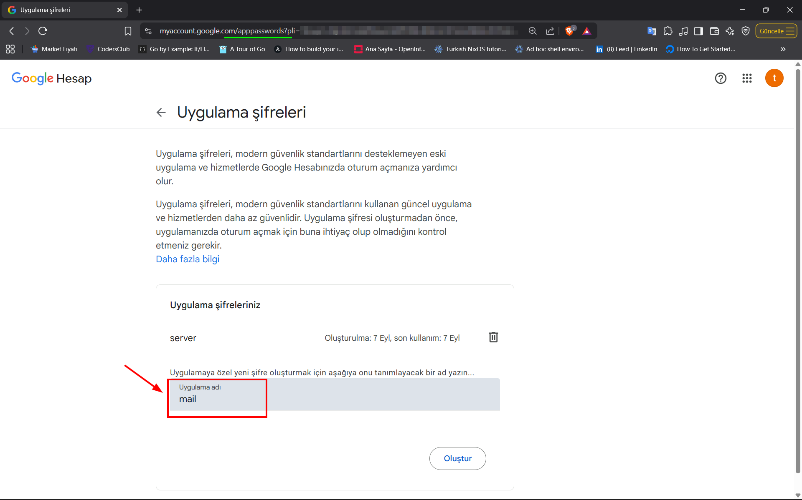
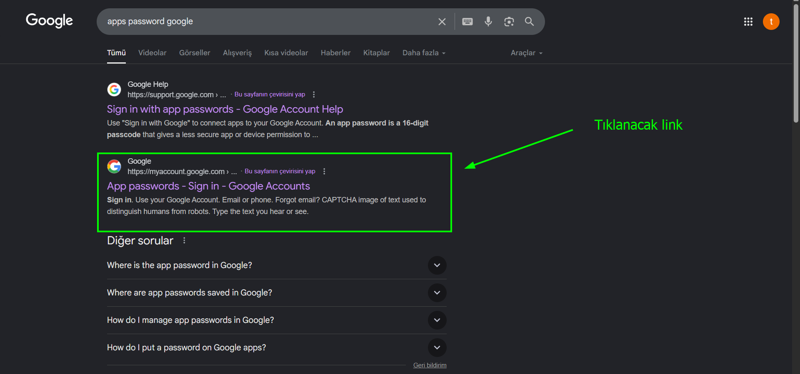

+ **Tanım:** **`smtplib`**, Python’un standart kütüphanesinde bulunan ve **SMTP (Simple Mail Transfer Protocol)** üzerinden e-posta göndermeyi sağlayan bir modüldür.

> [!NOTE]
> #### Ne işe yarar?
> + Python programınızdan **e-posta göndermek** için kullanılır.
> + SMTP sunucularına (örn. Gmail, Outlook, Yandex, kendi mail sunucunuz) bağlanmanızı sağlar.
> + E-postanın **gönderen, alıcı, konu, gövde** ve eklerini ayarlayıp gönderebilirsiniz.
> #### Özellikleri
> + Hem **şifreli (SSL/TLS)** hem de **şifresiz** bağlantıları destekler.
> + Mail sunucusuna giriş (kullanıcı adı & şifre ile) yapılabilir.
> + Genellikle `email` modülü ile birlikte kullanılır (çünkü `smtplib` sadece göndermeyi yapar, mesajın yapısını oluşturmaz).
> #### Kullanım Alanları
> + Otomatik bildirim e-postaları (örneğin hata raporları, log bilgileri).
> + Uygulama içinden kullanıcıya doğrulama e-postası göndermek.
> + Raporlama (günlük, haftalık raporların e-posta ile gönderilmesi).

# Örnek 1:
## App: Kaynak Kodu

```python
import smtplib
from email.mime.text import MIMEText

# Girdiler:
sender = 'gonderen@gmail.com'
receiver = input("Kime, alici@gmail.com :")
subject = input("Konu: ")

# Varsayılan alıcı
if not reciever:
    reciever = 'alici@gmail.com'

# Gönderilecek mesaj
msg = MIMEText("Merhaba, bu bir test e-postasıdır.")
msg["Subject"] = subject
msg["From"] = sender
msg["To"] = receiver

# SMTP sunucusuna bağlan
with smtplib.SMTP("smtp.gmail.com", 587) as server:
    server.starttls()  # TLS ile güvenli bağlantı
    server.login(sender, "uygulama_sifresi")
    server.send_message(msg)

print("Mail gönderildi!")
```

### Gmail’de Uygulama Şifresi Oluşturma

1. Google hesabına giriş yap → https://myaccount.google.com/
2. **Güvenlik (Security)** bölümüne gir.
3. **2 adımlı doğrulama (2FA)** açık olmalı. Açık değilse önce etkinleştir.
4. **Uygulama şifreleri (App passwords)** bölümünü bul.
5. “Mail” uygulaması ve “Windows” gibi bir cihaz seçip oluştur.
6. Google sana **16 haneli bir şifre** verecek. (Bunu normal şifren yerine Python kodunda kullanacaksın).




> [!WARNING]
> + Eğer 4. adımda **Uygulama şifreleri (App passwords)** bölümünü bulamazsanız, hesap açıkken google da `app passwords` kelimelerini aratınız.
> 
> 

## Kod Analizi:

### `MIMEText(...)` Sınıfı:

+ `MIMEText`, **e-posta içeriğini (gövdesini)** oluşturmak için kullanılır.
+ İçine yazdığın `"Merhaba, bu Python ile gönderilen test e-postasıdır."` kısmı, alıcının mail kutusunda göreceği mesaj metni olacak.
+ Varsayılan olarak **düz yazı (plain text)** gönderir. Eğer HTML göndermek isteseydik `"html"` parametresi eklerdik.
+ “MIME” = **Multipurpose Internet Mail Extensions** → E-postaların sadece düz yazı değil, HTML, resim, ses, dosya gibi farklı içerikleri de taşımasına izin veren standarttır.

```python
msg = MIMEText("Merhaba, bu bir test e-postasıdır.")
msg["Subject"] = subject
msg["From"] = sender
msg["To"] = receiver
```

#### Örnekler:

##### 1. Düz yazı (plain text) mail gövdesi:

```python
from email.mime.text import MIMEText

msg = MIMEText("Merhaba, bu bir düz yazı mailidir.", "plain")
```

##### 2. HTML mail gövdesi:

```python
from email.mime.text import MIMEText

html_content = """
<html>
  <body>
    <h1 style="color:blue;">Merhaba!</h1>
    <p>Bu <b>HTML</b> formatında gönderilmiş bir e-postadır.</p>
  </body>
</html>
"""
msg = MIMEText(html_content, "html")
```


> [!NOTE]
> - `smtplib` → **maili göndermeye yarar.**
> - `MIMEText` → **mailin içeriğini (gövdesini) oluşturmaya yarar.**
> - 📎 Eğer e-postana **dosya eklemek** istiyorsan, `MIMEText` tek başına yetmez → onun için `MIMEMultipart` ve `MIMEBase` kullanılır.

#### `msg['Subject']`

+ E-postanın **konusunu** belirtiyor.
+ Kullanıcı mail kutusunda bu kısmı “konu” satırında görecek.


> [!NOTE]
> #### 1. `MIMEText` nesnesi normal bir sınıf ama…
> + `MIMEText` → `MIMENonMultipart` → `Message` sınıfından türetilmiştir.
> + Ve bu **`Message` sınıfı** (Python’un `email.message` modülünde) özel bir sınıftır.
> #### 2. `Message` sınıfı dict gibi davranır.
> + `Message` sınıfı, Python’un **mapping (sözlük) benzeri bir API** sunar.
> + Yani sen `msg["Subject"] = "Konusu"` dediğinde, aslında `Message` sınıfının **özel metodları** devreye girer:
> 	- `__setitem__(self, name, val)` → `msg["Subject"] = "Konusu"` yazdığında çalışır.
> 	- `__getitem__(self, name)` → `msg["Subject"]` okuduğunda çalışır.
> 	- `__delitem__(self, name)` → `del msg["Subject"]` dediğinde çalışır.
> #### 3. Kodun içinde neler var?
> + Ubuntu 22.04 sunucusunda `vim /usr/lib/python3.12/email/message.py` komut ile açtığımızda;
> ```python
>    def __setitem__(self, name, val):
> 	   """Set the value of a header.
>
>        Note: this does not overwrite an existing header with the same field
>        name.  Use __delitem__() first to delete any existing headers.
>        """
>        max_count = self.policy.header_max_count(name)
>        if max_count:
>            lname = name.lower()
>            found = 0
>            for k, v in self._headers:
>                if k.lower() == lname:
>                    found += 1
>                    if found >= max_count:
>                        raise ValueError("There may be at most {} {} headers "
>                                         "in a message".format(max_count, name))
>        self._headers.append(self.policy.header_store_parse(name, val))
> ```
> ##### 3.1. Docstring (Yorum kısmı):
> ```python
> """Set the value of a header.
> 
> Note: this does not overwrite an existing header with the same field
>name.  Use __delitem__() first to delete any existing headers.
>"""
> ```
> + Bu metodun yaptığı iş: **bir header (başlık) eklemek.**
> + Ama dikkat: **aynı isimli bir header varsa üzerine yazmaz.**
> + Önce `__delitem__()` ile silmen gerekir.
> ##### 3.2. `max_count = self.policy.header_max_count(name)`:
> + `policy`, e-posta politikalarını tanımlar (örneğin, hangi header’dan kaç tane olabilir).
> + Örneğin;
> 	- `Subject` → en fazla 1 tane olabilir.
> 	- `Received` → birden fazla olabilir (her mail server kendi satırını ekler).
> ##### 3.3. Döngü ile header sayısını kontrol etme:
> ```python
> for k, v in self._headers:
>    if k.lower() == lname:
>        found += 1
>        if found >= max_count:
>            raise ValueError(...)
> ```
> + `self._headers`, aslında bir **liste**: içinde `(header_name, header_value)` çiftleri tutuluyor.
> + Aynı header’dan (`Subject` gibi) max_count kadar varsa, hata fırlatır (`ValueError`).
> ##### 3.4. `self._headers.append(...)`
> ```python
> self._headers.append(self.policy.header_store_parse(name, val))
> ```
> + Burada gerçekten header listeye ekleniyor.
> + `policy.header_store_parse` → header ismi (`name`) ve değeri (`val`) uygun formatta parse edip tuple `(name, val)` döner.
> + Bu tuple `_headers` listesine eklenir.
> ##### 3.5. Basitleştirilmiş versiyon:
> ```python
> def __setitem__(self, name, val):
>    # Aynı header'dan çok olmasına izin var mı?
>    izin_sayisi = self.policy.header_max_count(name)
>
>    # Header listesinde ara
>    if izin_sayisi:
>        say = 0
>        for k, v in self._headers:
>            if k.lower() == name.lower():
>                say += 1
>                if say >= izin_sayisi:
>                    raise ValueError(f"{name} en fazla {izin_sayisi} kez olabilir")
>
>    # Yeni header'ı listeye ekle
>    self._headers.append((name, val))
> ```
> ##### 3.6. Özet:
> + `msg["Subject"] = "Konusu"` yazınca → `__setitem__` çalışıyor.
> + Bu metod **aynı header daha önce var mı, kaç tane olabilir** kontrol ediyor.
> + Sonra header’ı `_headers` listesine `(name, value)` olarak ekliyor.
> + Header’lar bu listede tutuluyor → sonra `msg.as_string()` çağrılınca formatlanıp string haline geliyor.

#### `msg["From"]`

+ E-postayı **kimden** gönderdiğini belirtir.
+ Burada `"gonderen@example.com"` yazıyor → yani alıcıya gelen mailde “Kimden” kısmında bu adres görünecek.

#### `msg["To"]`

+ E-postanın **kime** gideceğini belirtir.
+ Burada `"alicimail@gmail.com"` yazıyor → yani mail bu adrese gidecek.

#### Özet:

Bu 4 satır aslında **e-postanın kartviziti** gibi:

+ `MIMEText(...)` → Gövde (mesaj içeriği).
+ `Subject` → Konu başlığı.
+ `From` → Gönderen adresi.
+ `To` → Alıcı adresi.
Bu yapı hazır olduktan sonra, `smtplib` yardımıyla sunucuya bağlanıp **maili gönderiyoruz**.

### `smtplib.SMTP` Sınıfı:

```python
# SMTP sunucusuna bağlan
with smtplib.SMTP("smtp.gmail.com", 587) as server:
    server.starttls()  # TLS ile güvenli bağlantı
    server.login(sender, "uygulama_sifresi")
    server.send_message(msg)
```

+ Bu, Python’daki **SMTP istemcisi (client)** sınıfıdır.
+ SMTP (Simple Mail Transfer Protocol) → **E-posta göndermeye yarayan internet protokolü**dür.
+ `with smtplib.SMTP("smtp.gmail.com", 587) as server` dediğinde, bir **sunucuya bağlanmak için** SMTP nesnesi(`instance`) oluşturuyoruz.

#### `"smtp.gmail.com"`

+ Bu, **Gmail’in SMTP sunucu adresi**dir.
+ Yani *“ben Gmail’in posta gönderme sunucusuna bağlanmak istiyorum”* diyorsun.
+ Eğer başka bir mail servisi kullansaydık, burası farklı olurdu (örneğin `smtp.office365.com`, `mail.yandex.com.tr` vs.).
#### `587`

+ Bu, **bağlantı için kullanılan port numarasıdır.**
+ SMTP’de yaygın kullanılan portlar:
	- **25** → Standart SMTP (ama genelde spam yüzünden ISP’ler kapatır).
	- **465** → SSL üzerinden SMTP (baştan şifreli bağlantı).
	- **587** → STARTTLS (önce düz bağlantı, sonra şifreleme başlatılır).
+ Burada `587` yazdığın için:
	- Gmail sunucusuna **TLS ile güvenli bağlantı kuracağını** belirtmiş oluyoruz.

+ **SMTP’de 465 ve 587 port farklarını** tablo halinde özetleyeyim

| Özellik          | Port 465                                               | Port 587                                                                          |
| ---------------- | ------------------------------------------------------ | --------------------------------------------------------------------------------- |
| **Protokol**     | SMTPS (eski yöntem, SSL üzerinden doğrudan şifreli)    | STARTTLS (önce düz metin başlar, sonra TLS ile şifrelenir)                        |
| **Durum**        | Artık resmi olarak kullanılmıyor, "deprecated"         | IETF tarafından standart olarak öneriliyor                                        |
| **Kullanım**     | SSL/TLS direkt bağlantı (baştan şifreli)               | Normal SMTP başlatılır, sonra STARTTLS komutuyla şifreleme açılır                 |
| **Güvenlik**     | Güvenli ama modern standartlara uygun değil            | Daha güvenli, modern istemciler için önerilen yöntem                              |
| **Destek**       | Eski istemciler ve bazı servislerde hala destekleniyor | Güncel e-posta servisleri (Gmail, Outlook, Yandex vb.) tarafından tercih ediliyor |
| **Önerilen mi?** | ❌ Hayır (geçmişte kaldı)                               | ✅ Evet (standarttır)                                                              |


> [!NOTE]
> **Özet:**
> + **465** = Eski, SSL üzerinden direkt şifreleme (artık önerilmiyor).
> + **587** = Günümüzde kullanılmalı, çünkü standart ve güvenli.

### smtplib.SMTP metotları:

```python
    server.starttls()  # TLS ile güvenli bağlantı
    server.login(sender, "uygulama_sifresi")
    server.send_message(msg)
```

#### A. `server.starttls()`

+ **Basitçe:**
	- Normal (şifrelenmemiş) bağlantıyı, güvenli (TLS ile şifrelenmiş) bağlantıya çevirir.
+ **Detaylı:**
	- Mail sunucusuna önce düz (plain) bağlantı kurulur.
	- Sonra `STARTTLS` komutu gönderilir.
	- Bu komut sayesinde mevcut bağlantı **TLS (Transport Layer Security)** ile şifrelenir.
	+ Yani, şifre, kullanıcı adı ve e-posta içeriği dinlenmeye karşı korunur.


> [!WARNING]
> + Eğer `starttls()` kullanmazsan, şifrelerin ve e-postaların düz metin olarak gidebilir (tehlikeli!).

#### B.`server.login("gonderen@example.com", "uygulama_sifresi")`

+ **Basitçe:**
	- Mail sunucusuna giriş yapmanı sağlar.
+ **Detaylı:**
	- İlk parametre: **kullanıcı adı** (genellikle e-posta adresin).
	- İkinci parametre: **şifre** (artık çoğu servis “uygulama şifresi” istiyor).
	- Sunucu, bilgileri doğrular → eğer doğruysa sana mail gönderme yetkisi verir.
	- Gmail, Yandex gibi servislerde genellikle normal şifreyi değil, özel oluşturulmuş “uygulama şifresi” kullanılır.

#### C. `server.send_message(msg)`

+ **Basitçe:**
	- Hazırladığın e-posta mesajını gönderir.
+ **Detaylı:**
	- `msg` parametresi, `email.message.EmailMessage` veya `MIMEText` gibi bir mesaj nesnesidir
	- Bu nesne(`email.message.EmailMessage` veya `MIMEText`) içinde **kimden (From), kime (To), konu (Subject), içerik (Body)** gibi bilgiler bulunur.
	- `send_message()` bu mesajı SMTP sunucusuna iletir, o da alıcının posta kutusuna ulaştırır.


> [!TIP]
> + `send_message()` modern ve kolaydır. Alternatif olarak `sendmail()` metodu da vardır, ama `send_message()` daha güvenli ve esnek.


> [!NOTE]
> #### Özet:
> 1. `starttls()` → Bağlantıyı güvenli yap.
> 2. `login()` → Sunucuya kullanıcı adı + şifreyle giriş yap.
> 3. `send_message()` → Hazırlanan mesajı gönder.


### Neden `with...as...`  ile kullanılıyor?

+ `with ... as ...` yapısı **`smtplib.SMTP()`** ile de sık kullanılır çünkü **bağlantıyı açıp kapatma işini** otomatik hale getirir.

#### 📌 Normal kullanım (with olmadan)

```python
import smtplib

server = smtplib.SMTP("smtp.gmail.com", 587)
server.starttls()
server.login("kullanici@gmail.com", "sifre")
server.sendmail("kullanici@gmail.com", "alici@gmail.com", "Merhaba!")
server.quit()  # 🔴 önemli, yoksa bağlantı açık kalır
```

> + Burada `server.quit()` çağırmazsan, SMTP oturumu açık kalır. Hata veya istisna olursa `quit()` hiç çalışmayabilir.

---
#### 📌 `with ... as ...` ile kullanım

```python
import smtplib

with smtplib.SMTP("smtp.gmail.com", 587) as server:
    server.starttls()
    server.login("kullanici@gmail.com", "sifre")
    server.sendmail("kullanici@gmail.com", "alici@gmail.com", "Merhaba!")
# ✅ Burada blok bitince server.quit() otomatik çağrılır
```


> [!NOTE]
> **Özet:**
> + `with` **garanti kapanış** sağlar.
> + Hata senaryolarında **manuel `quit()` unutma riskini sıfırlar**.


# Örnek 2:

## Sanal Ortamı Kurma

```shell
python3 -m venv .venv
```

+ `.venv` sanal ortamını aktif ediyoruz.

```shell
source .venv/bin/activate
```

+ `.venv` sanal ortamına `python-dotenv` kütüphanesini yüklüyoruz.

```shell
(.venv) pip install python-dotenv
```


> [!NOTE]
> + `python-dotenv` kütüphanesi, Python projelerinde **ortam değişkenlerini (.env dosyası üzerinden) yönetmeye yarayan** bir kütüphanedir.
> + 📌 Normalde bir uygulamanın şifre, API anahtarı, veritabanı bağlantı bilgisi gibi **gizli bilgileri** kodun içine yazmak güvenli değildir.
> + Bunun yerine `.env` dosyasına koyarsın, `python-dotenv` de bu dosyayı okuyup değerleri **`os.environ`** içine yükler.
> #### 1. Kurulum:
> ```shell
> pip install python-dotenv
> ```
> #### 2. `.env` dosyası oluştur:
> ```ini
> DEBUG=True
> SECRET_KEY=super_secret_key
> DB_USER=postgres
> DB_PASS=12345
> ```
> #### 3. Python kodunda kullan:
> ```python
> import os
> from dotenv import load_dotenv
> 
> # .env dosyasını yükle
> load_dotenv()
>
> # Ortam değişkenlerini oku
> debug = os.getenv("DEBUG")
> secret = os.getenv("SECRET_KEY")
> db_user = os.getenv("DB_USER")
> db_pass = os.getenv("DB_PASS")
> 
> print(debug, secret, db_user, db_pass)
> ```
> #### ✅ Avantajları
> + **Güvenlik** → Parolaları kodun içinde tutmazsın.
> + **Taşınabilirlik** → Farklı ortamlarda (development, test, production) farklı `.env` dosyaları kullanabilirsin.
> + **Kolay yönetim** → Tek dosya üzerinden uygulamanın tüm ayarlarını değiştirebilirsin.
> 
> **Yani kısaca:** `python-dotenv`, Python projelerinde **.env dosyasındaki değerleri `os.environ` içine yükleyerek ortam değişkenlerini kolayca kullanmanı sağlayan** bir yardımcı kütüphanedir.


```shell
(.venv) pip list
```

**pip Çıktısı:**

```shell
Package       Version
------------- -------
pip           24.0
python-dotenv 1.1.1
```

**.env**

```ini
EMAIL_ADDRESS = "tanjuyucal@gmail.com"
EMAIL_PASSWORD = "pzsrriukpioghtgx"
```

**email_setup.py**

```python
#!.venv/bin/python3

import smtplib
import os
from email.mime.text import MIMEText
from email.mime.multipart import MIMEMultipart
from dotenv import load_dotenv

load_dotenv()

SMTP_SERVER = "smtp.gmail.com"
SMTP_PORT = 587
EMAIL_ADDRESS = os.getenv('EMAIL_ADDRESS')
EMAIL_PASSWORD = os.getenv('EMAIL_PASSWORD')

def send_email(recipient_mail, subject, body):
    try:
        msg = MIMEMultipart()
        msg['From'] = EMAIL_ADDRESS
        msg['To'] = recipient_mail
        msg['Subject'] = subject

        msg.attach(MIMEText(body, 'plain'))

        with smtplib.SMTP(SMTP_SERVER, SMTP_PORT) as server:
            server.starttls()
            server.login(EMAIL_ADDRESS, EMAIL_PASSWORD)
            server.sendmail(EMAIL_ADDRESS, recipient_mail, msg.as_string())

        print("Email sent successfully!")
    except Exception as e:
        print(f"Error sending mail: {e}")

if __name__ == "__main__":
    recipient = "tanjuyucal@icloud.com"
    subject = "Test Email from Python"
    body = "This is a test email sent using Python and Gmail SMTP."
    send_email(recipient, subject, body)
```

```shell
source .venv/bin/activate
```

```shell
(.venv) chmod u+x email_setup.py
```

```shell
(.venv) ./email_setup.py    # Çıktı: Email sent successfully!
```

## Kod Analizi:

### 1. Shebang satırı:

```python
#!.venv/bin/python3
```

> + Bu satır, programın `.venv` klasöründe bulunan **Python yorumlayıcısı** ile çalıştırılacağını söyler.
> + Yani, eğer `.venv` sanal ortamın varsa, kod otomatik olarak oradaki `python3` ile çalışır.
### 2. Gerekli kütüphaneler:

```python
import smtplib
import os
from email.mime.text import MIMEText
from email.mime.multipart import MIMEMultipart
from dotenv import load_dotenv
```

> + `smtplib` → SMTP protokolü üzerinden e-posta göndermek için.
> + `os` → Ortam değişkenlerine (`EMAIL_ADDRESS`, `EMAIL_PASSWORD`) erişmek için.
> + `MIMEText` → E-postanın metin gövdesini oluşturur.
> + `MIMEMultipart` → Çok parçalı (metin + ek dosya + HTML) e-posta göndermek için.
> + `load_dotenv` → `.env` dosyasındaki ortam değişkenlerini yükler.

### 3. Ortam değişkenlerini yükleme:

```python
load_dotenv()
```

> + `.env` dosyasında yazılı olan değerler (`EMAIL_ADDRESS`, `EMAIL_PASSWORD`) belleğe alınır.
> + Böylece şifreyi koda **açık yazmak yerine** `.env` dosyasında saklamış oluyorsun (güvenlik için doğru yöntem 👍).

### 4. SMTP bilgileri:

```python
SMTP_SERVER = "smtp.gmail.com"
SMTP_PORT = 587
EMAIL_ADDRESS = os.getenv('EMAIL_ADDRESS')
EMAIL_PASSWORD = os.getenv('EMAIL_PASSWORD')
```

> + Gmail’in SMTP sunucusu: `smtp.gmail.com`.
> + `587` → STARTTLS bağlantısı için kullanılan port (şifreli iletişim başlatmak için).
> + `EMAIL_ADDRESS`, `EMAIL_PASSWORD` → `.env` dosyasından okunuyor.

### 5. Fonksiyon tanımı:

```python
def send_email(recipient_mail, subject, body):
```

> **Parametreler:**
> + `recipient_mail` → Mailin gideceği adres.
> + `subject` → Mailin konusu.
> + `body` → Mailin metin içeriği.

### 6. Mesajı oluşturma:

```python
msg = MIMEMultipart()
msg['From'] = EMAIL_ADDRESS
msg['To'] = recipient_mail
msg['Subject'] = subject

msg.attach(MIMEText(body, 'plain'))
```

> + `MIMEMultipart()` → Çok parçalı mail başlatılır.
> + `From` → Gönderen adresi.
> + `Subject` → Konu satırı.
> + `msg.attach(MIMEText(body, 'plain'))` → Gövde kısmına düz metin (plain text) eklenir.

### 7. SMTP bağlantısı ve gönderim:

```python
with smtplib.SMTP(SMTP_SERVER, SMTP_PORT) as server:
    server.starttls()
    server.login(EMAIL_ADDRESS, EMAIL_PASSWORD)
    server.sendmail(EMAIL_ADDRESS, recipient_mail, msg.as_string())
```

> + `with smtplib.SMTP(...)` → Sunucuya bağlanır. `with` kullanıldığı için iş bitince bağlantı otomatik kapanır.
> + `server.starttls()` → Bağlantıyı **TLS ile şifreler** (güvenlik).
> + `server.login(...)` → Gmail hesabına giriş yapar (kullanıcı adı ve şifre).
> + `server.sendmail(...)` → Maili gönderir.
> 	1. parametre → Gönderen
> 	2. parametre → Alıcı
> 	3. parametre → Mail içeriği (`msg.as_string()` ile string formatına dönüştürülür).

### 8. Hata yönetimi:

```python
except Exception as e:
    print(f"Error sending mail: {e}")
```

> + Eğer bağlantı ya da gönderim sırasında hata olursa, mesaj ekrana yazılır.

### 9. Programı çalıştırma:

```python
if __name__ == "__main__":
    recipient = "tanjuyucal@icloud.com"
    subject = "Test Email from Python"
    body = "This is a test email sent using Python and Gmail SMTP."
    send_email(recipient, subject, body)
```

> + Kod doğrudan çalıştırıldığında (`python script.py`), bu blok devreye girer.
> + `recipient`, `subject` ve `body` belirlenir, `send_email` fonksiyonu çağrılır.
> + Mail gönderilir ✅

# Örnek 3:

+ `MIMEMultipart` ve  `MIMEText` sınıfları arasındaki ilişkiyi anlamak

```python
#!.venv/bin/python3

import smtplib
import os
from email.mime.text import MIMEText
from email.mime.multipart import MIMEMultipart
from dotenv import load_dotenv

load_dotenv()

SMTP_SERVER = "smtp.gmail.com"
SMTP_PORT = 587
EMAIL_ADDRESS = os.getenv('EMAIL_ADDRESS')
EMAIL_PASSWORD = os.getenv('EMAIL_PASSWORD')

def send_email(recipient_mail, subject, *body):
    try:
        msg = MIMEMultipart()
        msg['From'] = EMAIL_ADDRESS
        msg['To'] = recipient_mail
        msg['Subject'] = subject

        msg.attach(MIMEText(body[1], 'plain'))
        msg.attach(MIMEText(body[0], 'html'))

        with smtplib.SMTP(SMTP_SERVER, SMTP_PORT) as server:
            server.starttls()
            server.login(EMAIL_ADDRESS, EMAIL_PASSWORD)
            server.sendmail(EMAIL_ADDRESS, recipient_mail, msg.as_string())

        print("Email sent successfully!")

        print(msg.as_string())

    except Exception as e:
        print(f"Error sending mail: {e}")

if __name__ == "__main__":
    recipient = "tanjuyucal@icloud.com"
    subject = "Test Email from Python"
    body_plain = "This is a test email sent using Python and Gmail SMTP."
    body_html = """
    <html>
    <body>
        <h2 style="color: blue;">Merhaba!</h2>
        <p>Bu mailin <b>HTML</b> sürümüdür.</p>
        <p>Python ile <span style="color:green;">çok parçalı e-posta</span> gönderebilirsin 🚀</p>
    </body>
    </html>
    """
    # liste = (body_plain, body_html)
    send_email(recipient, subject, body_html, body_plain)
```

## Kod Analizi:

|MIME Tipi|Ne için kullanılır?|Özellikleri|Örnek Senaryo|
|---|---|---|---|
|**`multipart/alternative`**|Aynı içeriğin farklı sürümleri|İstemci **en son ekleneni** tercih eder. Önce plain, sonra HTML eklenmeli.|Plain text + HTML birlikte gönderme|
|**`multipart/mixed`**|Mesaj + ek dosyalar (attachments)|Mesaj gövdesi ve ekler aynı pakette taşınır.|Metin + PDF, resim, Excel dosyası ekleme|
|**`multipart/related`**|HTML içerik + gömülü nesneler|HTML gövde içinde kullanılan resimler veya medya **inline** eklenir.|HTML e-postada `` ile resim gömme|
|**`multipart/report`**|Hata raporları, otomatik cevaplar|E-posta sistemleri için özel format.|Mail delivery failure raporu|

> [!NOTE]
> **Kural:**
> - **`alternative`** → aynı mesajın farklı sürümleri (plain, html). 
> - **`mixed`** → ek dosyalar için. 
> - **`related`** → HTML ile ilişkili resim/video gibi gömülü içerikler için.

# Kaynak:

+ [How to Send Emails in Python with Gmail (SMTP Tutorial!)](https://www.youtube.com/watch?v=QJobMzcmoMo)