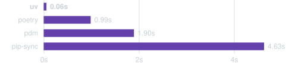

# 1.Giriş

Rust ile yazılmış, son derece hızlı bir Python paket ve proje yöneticisi.



Sıcak önbellekle [Trio](https://trio.readthedocs.io/)'nun bağımlılıklarının kurulması


> [!TIP]
> #### Warm cache(Sıcak Önbellek):
> + Bir paket yöneticisi (uv gibi) daha önce indirdiği paketleri yerel diskte bir önbellekte (cache) tutar. 
>  + "Warm cache" durumu, o paketler zaten önbellekte mevcutken yapılan kurulumu ifade eder. Yani uv, internetten tekrar indirme yapmaz; doğrudan diskteki kopyaları kullanır (genellikle hardlink/symlink ile bağlar). Bu yüzden kurulum **çok hızlıdır**.
>#### Cold cache (Soğuk Önbellek):
> + Bu durumda önbellekte ilgili paketler yoktur — ya hiç indirilmemiştir ya da önbellek temizlenmiştir.
> + uv, tüm paketleri PyPI'den (veya ilgili index'ten) sıfırdan indirmek zorunda kalır. Ağ hızına bağlı olduğu için bu işlem **daha yavaştır**.
> 
> **Aradaki fark:**
> 
> ||Warm cache|Cold cache|
> |---|---|---|
> |Paketler önbellekte var mı?|Evet|Hayır|
> |İndirme gerekiyor mu?|Hayır (diskten kopyalanır/linklenir)|Evet (ağdan indirilir)|
> |Hız|Hızlı|Yavaş|
> |Ne zaman oluşur?|Aynı paketi ikinci kez kurarken|İlk kurulumda veya cache temizlendikten sonra|

## 1.1. Öne Çıkan Özellikler(Highlights)

+ **Tek araç ile eksiksiz çözüm:** `pip`, `pip-tools`, `pipx`, `poetry`, `pyenv`, `twine`, `virtualenv` ve çok daha fazlasının yerini alan tek bir araç.
+ **10-100 kat daha hızlı:** pip'ten [10-100 kat daha hızlı](https://github.com/astral-sh/uv/blob/main/BENCHMARKS.md).
+ **Kapsamlı proje yönetimi:** Evrensel bir [kilit dosyası (lockfile)](https://docs.astral.sh/uv/concepts/projects/layout/#the-lockfile) ile [kapsamlı proje yönetimi](https://docs.astral.sh/uv/#projects) sağlar.
+ **Komut dizisi (script) çalıştırma:** [Satır içi bağımlılık metadata(_inline dependency metadata_)](https://docs.astral.sh/uv/guides/scripts/#declaring-script-dependencies) desteğiyle [script'leri çalıştırır](https://docs.astral.sh/uv/#scripts).
+ **Python sürüm yönetimi:** Python sürümlerini [kurar ve yönetir](https://docs.astral.sh/uv/#python-versions).
+ **Araç yönetimi:** Python paketi olarak yayımlanan araçları [kurar ve çalıştırır](https://docs.astral.sh/uv/#tools).
+ **`pip` uyumlu arayüz:** Tanıdık bir CLI ile performans artışı sağlayan, [pip uyumlu bir arayüz](https://docs.astral.sh/uv/#the-pip-interface) içerir.
	1. Bu cümle şunu anlatıyor: uv, pip'in komut satırı arayüzünü (CLI) taklit eden, pip ile uyumlu bir arayüz sunuyor. Yani kullanıcılar `uv pip install`, `uv pip list` gibi, alıştıkları pip komutlarına çok benzer komutlar kullanabiliyorlar — yeni bir sözdizimi öğrenmelerine gerek kalmıyor ("tanıdık CLI").
	2. Ama arka planda bu komutlar uv'nin hızlı motoruyla çalıştığı için, kullanıcı pip'i kullanıyormuş gibi hissederken aslında çok daha performanslı (hızlı) bir kurulum/paket yönetimi deneyimi yaşıyor.
+ **`Cargo` tarzı çalışma alanları (_workspaces_):** Ölçeklenebilir projeler için Rust'ın Cargo tarzı [workspace'leri](https://docs.astral.sh/uv/concepts/projects/workspaces/) (çalışma alanlarını) destekler.
+ **Disk alanı verimliliği:** Bağımlılıkların tekrar tekrar indirilmesini önleyen(deduplication) [**global bir önbellek (cache)**](https://docs.astral.sh/uv/concepts/cache/) kullanarak disk alanını verimli şekilde kullanır.
+ **Kolay kurulum:** Rust veya Python yüklemenize gerek kalmadan `curl` veya `pip` aracılığıyla kurulabilir.
+ **Çoklu platform desteği:** **macOS, Linux ve Windows** işletim sistemlerini destekler.
+ **Astral güvencesi:** `uv`, [Ruff](https://github.com/astral-sh/ruff)'ın geliştiricisi olan [Astral](https://astral.sh/) ekibi tarafından desteklenmektedir.
## 1.2. Kurulum:

uv'yi resmi bağımsız (standalone) yükleyicimizle kurun:

> [!INFO]
> #### uv bağlamında "standalone installer" (bağımsız yükleyici) ne demek?
> + Bu yükleyiciyi kullanmak için sisteminizde önceden Python veya Rust kurulu olmasına **gerek yok**. Yükleyici kendi başına yeterli — gerekli her şeyi (uv'nin çalıştırılabilir dosyasını) kendisi getirip kuruyor.
> + Buna karşılık, mesela "pip ile kurulum" (`pip install uv`) yaparsanız, bu bağımsız bir yöntem değildir çünkü önce Python ve pip'in kurulu olması gerekir.
> + Yani "standalone", bir yazılımın **başka bir bağımlılığa/ortama ihtiyaç duymadan kendi başına kurulabilmesi/çalışabilmesi** anlamına gelir.

**macOS ve Linux**

```bash
curl -LsSf https://astral.sh/uv/install.sh | sh
```

**Windows**

```powershell
powershell -ExecutionPolicy ByPass -c "irm https://astral.sh/uv/install.ps1 | iex"
```

Ardından, [ilk adımlara](https://docs.astral.sh/uv/getting-started/first-steps/) göz atabilir veya kısa bir genel bakış için okumaya devam edebilirsiniz.

> [!TIP]
> uv ayrıca **pip**, **Homebrew** ve daha birçok yöntem kullanılarak da yüklenebilir. Tüm kurulum yöntemlerini [kurulum sayfasında](https://docs.astral.sh/uv/getting-started/installation/) görebilirsiniz.
## 1.3. Projeler

uv, `rye` veya `poetry` benzer şekilde; **lockfile**, **workspace (çalışma alanları)** ve daha fazlasını destekleyerek proje bağımlılıklarını ve ortamlarını yönetir:

> [!INFO]
> `rye` ve `poetry`, Python projelerinin **bağımlılıklarını ve sanal ortamlarını yönetmek** için kullanılan araçlardır. `uv` de benzer ihtiyaçları karşılar.

```bash
$ uv init example
Initialized project `example` at `/home/user/example`

$ cd example
Creating virtual environment at: .venv
Resolved 2 packages in 170ms
	Built example @ file:///home/user/example
Prepared 2 packages in 627ms
Installed 2 packages in 1ms
  + example==0.1.0 (from file:///home/user/example)
  + ruff=0.5.4
    
$ uv run ruff check
All checks passed!

$ uv lock
Resolved 2 packages in 0.33ms

$ uv sync
Resolved 2 packages in 0.70ms
Checked 1 packages in 0.02ms
```

Başlamak için [proje rehberine](https://docs.astral.sh/uv/guides/projects/) göz atın.

uv, uv ile yönetilmese bile projelerin derlenmesini (building) ve yayınlanmasını (publishing) da destekler. Daha fazla bilgi için [paketleme rehberine](https://docs.astral.sh/uv/guides/package/) bakın.

> [!INFO]
> + Normalde uv'yi bir projede kullanmak için, o projenin uv ile "yönetiliyor" olması beklenir — yani `pyproject.toml`, `uv.lock` gibi dosyalarla uv'nin proje yapısına uygun olması gerekir.
> + Ama bu cümle diyor ki: **Projeniz uv ile yönetilmiyor olsa bile** (mesela poetry, setuptools veya başka bir araçla yönetiliyor olsa bile), yine de uv'yi şu iki iş için kullanabilirsiniz:
> 	1. **Building (derleme/paketleme):** Projenizi dağıtılabilir bir pakete dönüştürmek (örneğin `.whl` — wheel dosyası veya `.tar.gz` — sdist oluşturmak)
> 	2. **Publishing (yayınlama):** Bu paketi PyPI gibi bir paket deposuna yüklemek
> + Yani uv, sadece "uv projeleri" için değil, **herhangi bir Python projesi** için de paketleme/yayınlama aracı olarak kullanılabilir — bağımsız bir yardımcı araç gibi.
> + **Özet:** Projeniz uv'nin kendi proje yapısını kullanmasa bile, uv'yi yine de o projeyi paketlemek ve PyPI'ye yayınlamak için kullanabilirsiniz."

## 1.4. Betikler(Scripts):

**uv**, tek dosyalı betikler (single-file scripts) için bağımlılıkları ve ortamları yönetir.

Yeni bir betik oluşturun ve bağımlılıklarını belirten satır içi (inline) meta verileri ekleyin:

```bash
$ echo 'import requests; print(requests.get("https://astral.sh"))' > example.py

uv add --script example.py requests
Updated `example.py`
```

Ardından, betiği yalıtılmış bir sanal ortamda çalıştırın:

```bash
$ uv run example.py
Reading inline script metadata from: example.py
Installed 5 packages in 12ms
<Response [200]>
```

Başlamak için [betikler rehberine](https://docs.astral.sh/uv/guides/scripts/) göz atın.

> [!INFO]
> ```python
> import requests; print(requests.get("https://astral.sh"))
> ```
> Bu kod, `requests` kütüphanesini kullanarak basit bir HTTP GET isteği yapıyor:
> + **`import requests`** — Python'da HTTP istekleri yapmak için en yaygın kullanılan kütüphaneyi içe aktarıyor. Bu, standart kütüphanenin parçası değil, `pip install requests` (veya senin durumunda `uv add requests`) ile kurulması gerekir.
> + **`requests.get("https://astral.sh")`** — Belirtilen URL'ye bir **GET isteği** gönderiyor ve sunucudan gelen yanıtı bir `Response` nesnesi olarak döndürüyor.
> + **`print(...)`** — Bu `Response` nesnesini ekrana yazdırıyor.
> 
> **Kod Çıktısı:**
> + `Response` nesnesinin `__repr__` metodu sadece durum kodunu gösterir, örneğin:
> ```
> <Response [200]>
> ```
> + `200` başarılı bir isteği, `404` sayfa bulunamadı hatasını, `500` sunucu hatasını gösterir vb.

## 1.5. Araçlar(Tools):

`uv`, `pipx`'e benzer şekilde Python paketleri tarafından sağlanan komut satırı araçlarını çalıştırır ve kurar.


> [!INFO]
> #### `pipx` nedir?
> **pipx**, Python komut satırı araçlarını (CLI tool) izole ortamlarda kurmak ve çalıştırmak için kullanılan bir araçtır.
> 
> Normalde `pip install <paket>` yaptığınızda paket, aktif olan Python ortamına (genelde global ortama) kurulur. Eğer birden fazla araç kurarsanız, bunların bağımlılıkları çakışabilir (örneğin iki farklı araç aynı kütüphanenin farklı sürümlerini istiyorsa sorun çıkar).
> **pipx** bu sorunu şöyle çözer:
> + Her aracı **kendi izole sanal ortamında (virtual environment)** kurar.
> + Ama aracın komutunu (executable/CLI) **global olarak** kullanılabilir hale getirir — yani terminalde herhangi bir yerden çağırabilirsiniz.
> + Böylece araçlar birbirinin bağımlılıklarını kirletmez, ama siz yine de global bir komut gibi kullanırsınız.
> **Örnek kullanım alanı:** `black` (kod biçimlendirici), `poetry`, `httpie` gibi araçları kurmak için idealdir — bunlar birer "kütüphane" değil, kullanmak istediğiniz birer "program"dır.
> ```bash
> pipx install black
> ```
> Bu komuttan sonra terminalde herhangi bir yerden `black` yazarak çalıştırabilirsiniz, ama `black`'in bağımlılıkları sisteminizin geri kalanına karışmaz.
> **uv ile ilişkisi:** Metinde geçtiği gibi, uv'nin `uv tool install` ve `uvx` komutları da tam olarak pipx'in yaptığı işi yapar — yani uv, pipx'in işlevselliğini kendi içine entegre etmiş, daha hızlı bir alternatif sunar.

`uvx` (`uv tool run` komutunun kısayolu) kullanarak geçici (_ephemeral_) bir ortamda bir aracı çalıştırın:

```bash
$ uvx pycowsay 'hello world!'
Resolved 1 package in 167ms
Installed 1 package in 9 9ms
  + pycowsay=0.0.0.2
   """
   
  ------------
< hello world! >
  ------------
   \   ^__^
    \  (oo)\_______
       (__)\       )\/\
           ||----w |
           ||     ||
```

`uv tool install` ile bir aracı kurun:

```bash
$ uv tool install ruff
Resolved 1  package in 6ms
Installed 1 package in 2ms
  + ruff==0.5.4
Installed 1 executable: ruff

$ ruff --version
ruff 0.5.4
```

Başlamak için [araçlar kılavuzuna(tools guide)](https://docs.astral.sh/uv/guides/tools/) göz atın.
## 1.6. Python sürümleri

**uv**, Python'ı yükler ve sürümler arasında hızlı bir şekilde geçiş yapmanıza olanak tanır.

Birden fazla Python sürümü yükleyin:

```bash
$ uv python install 3.10 3.11 3.12
Searching for Python versions matching: Python 3.10
Searching for Python versions matching: Python 3.11
Searching for Python versions matching: Python 3.12
Installed 3 versions in 3.42s
  + cpython-3.10.14-macos-aarch64-none
  + cpython-3.11.9-macos-aarch64-none
  + cpython-3.12.4-macos-aarch64-none
```

İhtiyaç duyulan Python sürümlerini indirin:

```bash
$ uv venv --python 3.12.0
Using CPython 3.12.0
Creating virtual environment at: .venv
Activate with: source .venv/bin/activate

$ uv run --python pypy@3.8 -- python
Python 3.8.16 (a9dbdca6fc3286b0addd2240f11d97d8e8de187a, Dec 29 2022, 11:45:30)
[PyPy 7.3.11 with GCC Apple LLVM 13.1.6 (clang-1316.0.21.2.5)] on darwin
Type "help", "copyright", "credits" or "license" for more information.
>>>>
```

Mevcut dizinde belirli bir Python sürümünü kullanın:

```python
uv python pin 3.11
Pinned `.python-version` to `3.11`
```

Başlamak için [Python yükleme kılavuzuna(installing Python guide)](https://docs.astral.sh/uv/guides/install-python/) göz atın.
## 1.7. Pip arayüzü

`uv`; yaygın `pip`, `pip-tools` ve `virtualenv` komutlarının doğrudan yerine geçebilen (_drop-in replacement_) bir çözüm sunar.

**uv**, bağımlılık sürümü geçersiz kılmaları (dependency version overrides), platformdan bağımsız çözümlemeler (platform-independent resolutions), tekrarlanabilir çözümlemeler (reproducible resolutions), alternatif çözümleme stratejileri (alternative resolution strategies) ve daha fazlası gibi gelişmiş özelliklerle bu araçların arayüzlerini genişletir.

Mevcut iş akışlarınızı değiştirmeden `uv`'ye geçin ve `uv pip` arayüzüyle **10 ila 100 kat hız artışı** deneyimleyin.

Bağımlılık gereksinimlerini platformdan bağımsız bir `requirements` dosyasına derleyin:

```bash
uv pip compile requirements.in \
   --universal \
   --output-file requirements.txt
Resolved 43 packages in 12ms
```

Sanal bir ortam oluşturun:

```bash
$ uv venv
Using CPython 3.12.3
Creating virtual enviroment at: .venv
Activate with: source .venv/bin/activate
```

Kilitlenmiş gereksinimleri kurun:

```bash
$uv pip sync requirement.txt
Resolved 43 packages in 11ms
Installed 43 packages in 208ms
  + babel==2.15.0
  + black==24.4.2
  + certifi==2024.7.4
  ...
```

Başlamak için [pip arayüzü belgelerine](https://docs.astral.sh/uv/pip/) göz atın.
## 1.8. Daha fazlasını öğrenin

uv'yi kullanmaya başlamak için [ilk adımlara(first steps)](https://docs.astral.sh/uv/getting-started/first-steps/) bakın veya doğrudan [kılavuzlara(guides)](https://docs.astral.sh/uv/guides/) geçin.

# 2. Başlarken(Getting started)

`uv` ile başlamanıza yardımcı olmak için birkaç önemli konuyu ele alacağız:

- [uv'yi kurma](https://docs.astral.sh/uv/getting-started/installation/)
- [Kurulum sonrası ilk adımlar](https://docs.astral.sh/uv/getting-started/first-steps/)
- [uv'nin özelliklerine genel bakış](https://docs.astral.sh/uv/getting-started/features/)
- [Nasıl yardım alınır](https://docs.astral.sh/uv/getting-started/help/)

Okumaya devam edin veya başka bir bölüme atlayın:

+ Yaygın iş akışları için hazırlanan **[kılavuzları](https://docs.astral.sh/uv/guides/)** kullanarak hızlıca başlayın.(Eğer temel/teorik bilgilerle uğraşmak istemiyorsanız ve doğrudan **"ben şunu yapmak istiyorum, nasıl yaparım?"** tarzında pratik, adım adım talimatlar arıyorsanız, "guides" (kılavuzlar) bölümüne gidin.)
+ uv'deki temel **[kavramlar](https://docs.astral.sh/uv/concepts/)** hakkında daha fazla bilgi edinin.
+ Belirli bir konu hakkında ayrıntılı bilgi bulmak için **[referans belgelerini](https://docs.astral.sh/uv/reference/)** kullanın.

## 2.1. uv'yi Kurma

### 2.1.1. Kurulum Yöntemleri

uv'yi bağımsız (standalone) yükleyicilerimizle veya tercih ettiğiniz paket yöneticisiyle kurun.

#### 2.1.1.1. Bağımsız yükleyici(Standalone)

uv, uv'yi indirip yüklemek için bağımsız bir yükleyici(_standalone_) sunar:

**macOS ve Linux:**

`curl` kullanarak betiği indirin ve `sh` ile çalıştırın:

```bash
$ curl -LsSf https://astral.sh/uv/install.sh | sh
```

Sisteminizde `curl` yoksa, `wget` kullanabilirsiniz:

```bash
$ wget -qO- https://astral.sh/uv/install.sh | sh
```

URL'ye sürüm numarasını ekleyerek belirli bir sürümü isteyin:

```bash
curl -LsSf https://astral.sh/uv/0.12.10/install.sh | sh
```

**Windows:**

Betiği `irm` kullanarak indirin ve `iex` ile çalıştırın:

```powershell
powershell -ExecutionPolicy ByPass -c "irm https://astral.sh/uv/install.ps1 | iex"
```

[Çalıştırma ilkesini (_execution policy_)](https://learn.microsoft.com/en-us/powershell/module/microsoft.powershell.core/about/about_execution_policies?view=powershell-7.4#powershell-execution-policies) değiştirmek, internetten bir betiğin çalıştırılmasına olanak tanır.

URL'ye sürüm numarasını ekleyerek belirli bir sürüm isteyin:

```powershell
powershell -ExecutionPolicy ByPass -c "irm https://astral.sh/uv/0.12.10/install.ps1 | iex"
```


> [!TIP]
> Kurulum betiği kullanımdan önce incelenebilir:
> **macOS ve Linux**
> ```bash
> curl -LsSf https://astral.sh/uv/install.sh | less
> ```
> **Windows**
> ```powershell
> powershell -c "irm https://astral.sh/uv/install.ps1 | more"
> ```
> Alternatif olarak, yükleyici veya ikili (binary) dosyalar doğrudan [GitHub](https://docs.astral.sh/uv/getting-started/installation/#github-releases)'dan indirilebilir.

uv yüklemenizi özelleştirme hakkında ayrıntılı bilgi için [yükleyici (installer) ile ilgili referans belgelerine](https://docs.astral.sh/uv/reference/installer/) göz atın.
#### 2.1.1.2. PyPI

Kolaylık olması açısından uv, [PyPI](https://pypi.org/project/uv/) üzerinde de yayımlanmaktadır.

PyPI üzerinden yükleme yapıyorsanız, uv'yi yalıtılmış (izole) bir ortama yüklemenizi öneririz; örneğin `pipx` kullanarak:

```bash
$ pipx install uv
```

Ancak pip şu şekilde de kullanılabilir:

```bash
$ pip install uv
```

> [!NOTE]
> uv, birçok platform için önceden derlenmiş dağıtımlar (wheel) ile birlikte sunulur. Belirli bir platform için bir wheel mevcut değilse, uv kaynak koddan derlenir ve bunun için bir Rust araç zinciri (Rust toolchain) gerekir. uv'yi kaynak koddan derleme hakkında ayrıntılı bilgi için [katkıda bulunma kurulum kılavuzuna](https://github.com/astral-sh/uv/blob/main/CONTRIBUTING.md#setup) göz atın.


> [!INFO]
> #### Wheel nedir?
> **Wheel**, Python paketleri için kullanılan **önceden derlenmiş/paketlenmiş bir dağıtım formatıdır** (dosya uzantısı: `.whl`).
> ##### Neden wheel(tekerlek)?
> İsmi, Python paketleme ekosistemindeki eski format olan "egg" (yumurta) formatına bir şaka/gönderme olarak seçilmiş — "wheel" (tekerlek), "egg"den daha modern ve pratik bir taşıma/dağıtım şekli anlamına geliyor (bir esprili isimlendirme).
> ##### Ne işe yarar?
> Bir Python paketini dağıtmanın iki temel yolu vardır:
> 1. **Source distribution (sdist)** — `.tar.gz` uzantılı, paketin **kaynak kodunu** içerir. Kurulurken, eğer paket C/Rust gibi derlenmiş bileşenler içeriyorsa, kurulum sırasında **sizin makinenizde derleme (compile) işlemi** gerçekleşir. Bu yavaştır ve bir derleyici (compiler) gerektirir.
> 2. **Wheel (`.whl`)** — Paketin **önceden derlenmiş, kuruluma hazır** halidir. Kurulum sırasında hiçbir derleme yapılmaz; dosyalar sadece doğru yerlere kopyalanır. Bu çok daha **hızlıdır** ve derleyici gerektirmez.
> ##### Cümledeki bağlamı:
> Cümle şunu diyor: uv'nin kendisi (yani `uv` programının kendisi), farklı işletim sistemleri ve mimariler (Linux, macOS, Windows, ARM, x86, vb.) için **önceden derlenmiş wheel dosyaları** olarak dağıtılıyor. Yani `pip install uv` yaptığınızda, sisteminize uygun hazır bir ikili dosya (binary) indirilir — Rust ile yeniden derlemenize gerek kalmaz.
> 
> Ama **eğer** sisteminiz için hazır bir wheel yoksa (örneğin çok nadir bir platform/mimari kullanıyorsanız), o zaman uv'nin **kaynak kodundan derlenmesi** gerekir — bu da bir Rust derleyicisinin (toolchain) sisteminizde kurulu olmasını gerektirir.


[Burada kaldık:](https://docs.astral.sh/uv/#installation) 