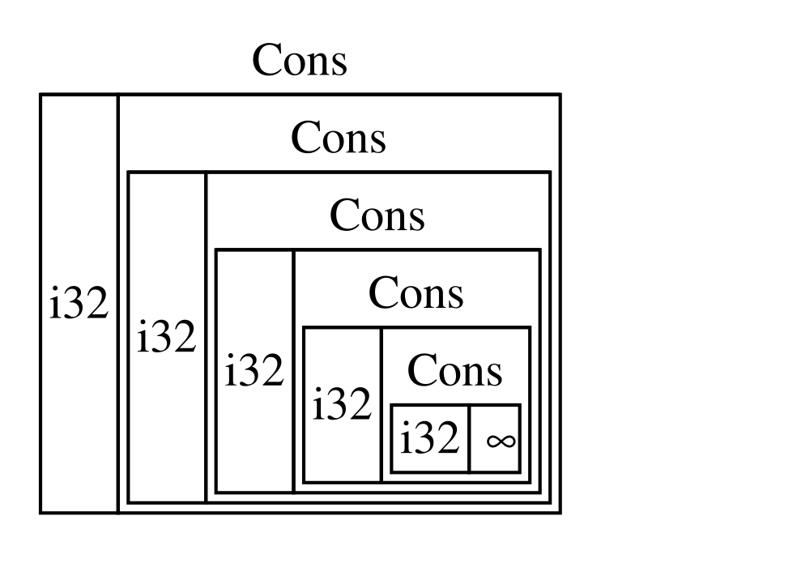

#programlama  #rust


> [!info]
> Bu çalışma, [_The Rust Programming Language_](https://doc.rust-lang.org/book/) kitabının Türkçe çevirisidir.
>
> **Çeviren:** Tanju Yücal
> 
>+  Bağlantılarım:
> 	+ **Linkedin**: [Tanju Yücal ](https://www.linkedin.com/in/tanju-yucal/)
> 	+ Github: https://github.com/tanjuy
> 
> Orijinal eser © Steve Klabnik, Carol Nichols ve Rust Community  
> Lisans: CC BY 4.0
# 🦀 Rust Programlama Dili

Steve Klabnik, Carol Nichols ve Chris Krycho tarafından, Rust topluluğunun katkılarıyla

Bu metnin bu sürümü, projelerinizin tümünde `Cargo.toml` dosyasında `edition = "2024"` ayarıyla Rust 2024 Edition deyimlerini(*idioms*) kullanacak şekilde yapılandırılmış, **Rust 1.90.0 (18-09-2025 tarihinde yayımlanan) veya daha yeni bir sürümü** kullandığınızı varsayar. Rust’ı kurma veya güncelleme talimatları için 1. bölümdeki "Installation"(1.1. Kurulum) kısmına bakın ve edition’lar hakkında bilgi için Ek E(Appendix E)’ye göz atın.

HTML formatına çevrimiçi olarak [https://doc.rust-lang.org/stable/book/](https://doc.rust-lang.org/stable/book/) adresinden, çevrimdışı olarak ise `rustup` ile yapılan Rust kurulumlarıyla erişilebilir; açmak için `rustup doc --book` komutunu çalıştırın.

Birçok topluluk [çevirisi](https://doc.rust-lang.org/book/appendix-06-translation.html) de mevcuttur.

Bu metin, [No Starch Press tarafından basılı kitap (paperback) ve e-kitap](https://nostarch.com/rust-programming-language-3e) formatında sunulmaktadır.

> [!CAUTION]
> Daha etkileşimli bir öğrenme deneyimi mi istiyorsunuz? Testler, vurgulamalar, görselleştirmeler ve daha fazlasını içeren Rust Book’un farklı bir sürümünü deneyin: [https://rust-book.cs.brown.edu](https://rust-book.cs.brown.edu)

# Özsöz

Rust programlama dili, birkaç kısa yıl içinde, küçük ve yeni gelişen bir meraklı topluluk tarafından oluşturulup geliştirilmesinden, dünyanın en sevilen ve en çok talep gören programlama dillerinden biri haline gelmesine kadar uzun bir yol kat etti. Geriye dönüp bakıldığında, Rust’ın gücü ve vaat ettikleriyle dikkat çekmesi ve sistem programlama alanında yer edinmesi kaçınılmazdı. Kaçınılmaz olmayan şey ise; açık kaynak topluluklarına yayılan ve endüstriler genelinde geniş çaplı benimsenmeyi tetikleyen küresel ilgi ve inovasyon artışıydı.

Bu noktada, bu ilgi ve benimseme patlamasını açıklamak için Rust'ın sunduğu harika özelliklere işaret etmek kolaydır. Kim bellek güvenliği, yüksek performans, kullanıcı dostu bir derleyici ve güçlü araçlar gibi pek çok özelliği istemez ki? Bugün gördüğünüz Rust dili, sistem programlama alanındaki yıllarca süren araştırmaları, canlı ve tutkulu bir topluluğun pratik bilgeliğiyle birleştiriyor. Bu dil bir amaç doğrultusunda tasarlandı ve özenle işlendi; geliştiricilere güvenli, hızlı ve güvenilir kod yazmayı kolaylaştıran bir araç sunuyor.

Ancak Rust’ı gerçekten özel kılan şey, sizi—yani kullanıcıyı—hedeflerinize ulaşmanız için güçlendirmeye dayanan kökleridir. Bu, sizin başarılı olmanızı isteyen bir dildir ve bu güçlendirme ilkesi, dili geliştiren, sürdüren ve savunan topluluğun özünde yer alır. Bu kapsamlı metnin önceki baskısından bu yana Rust, gerçek anlamda küresel ve güvenilir bir dil olarak daha da gelişmiştir. Rust Projesi artık, Rust'ın güvenli, istikrarlı ve sürdürülebilir olmasını sağlamak için kilit girişimlere yatırım yapan Rust Vakfı (Rust Foundation) tarafından güçlü bir şekilde destekleniyor.

_The Rust Programming Language_ kitabının bu baskısı; dilin yıllar içindeki evrimini yansıtan ve değerli yeni bilgiler sağlayan kapsamlı bir güncellemedir. Ancak bu sadece sözdizimi (syntax) ve kütüphaneler için bir rehber değil; kaliteye, performansa ve düşünceli tasarıma değer veren bir topluluğa katılmaya bir davettir. İster Rust'ı ilk kez keşfetmek isteyen deneyimli bir geliştirici, ister becerilerini geliştirmek isteyen kıdemli bir "Rustacean" olun; bu baskı herkes için bir şeyler sunuyor.

Rust yolculuğu; iş birliği, öğrenme ve sürekli geliştirme süreci olmuştur. Dilin ve ekosisteminin büyümesi, arkasındaki canlı ve çeşitli topluluğun doğrudan bir yansımasıdır. Çekirdek dil tasarımcılarından sıradan katkıda bulunanlara kadar binlerce geliştiricinin katkıları, Rust'ı bu kadar benzersiz ve güçlü bir araç yapan şeydir. Bu kitabı elinize aldığınızda, sadece yeni bir programlama dili öğrenmiyorsunuz—aynı zamanda yazılımı daha iyi, daha güvenli ve üzerinde çalışması daha keyifli hale getirmeyi amaçlayan bir harekete katılıyorsunuz.

Rust topluluğuna hoş geldiniz!

**Bec Rumbul, Rust Foundation Yönetim Direktörü**


# Giriş

> [!NOTE]
> Bu kitap baskısı, No Starch Press tarafından basılı ve e-kitap formatında yayımlanan _The Rust Programming Language_ ile aynıdır.

_The Rust Programming Language_(Rust Programlama Dili) kitabına hoş geldiniz; bu, Rust hakkında giriş seviyesinde bir kitaptır. Rust programlama dili, daha hızlı ve daha güvenilir yazılımlar yazmanıza yardımcı olur. Programlama dili tasarımında, yüksek seviyeli kullanım kolaylığı (ergonomi) ile düşük seviyeli kontrol genellikle birbiriyle çelişir; Rust bu çelişkiye meydan okur. Güçlü teknik kapasite(düşük seviyeli kontrol, yüksek performans, donanıma yakın programlama, vb.) ile mükemmel bir geliştirici deneyimini(kullanım kolaylığı, anlaşılır söz dizimi, faydalı hata mesajları, vb.) dengeleyen Rust; size, bu tür kontrollerle geleneksel olarak ilişkilendirilen tüm zorluklara katlanmak zorunda kalmadan, alt seviye ayrıntıları (bellek kullanımı gibi) kontrol etme seçeneği sunar.

## Rust Kimler İçindir

Rust, çeşitli nedenlerle birçok kişi için ideal bir dildir. En önemli gruplardan birkaçına bakalım.
### Geliştirici Ekipleri

Rust; sistem programlama bilgisi farklı seviyelerde olan, büyük geliştirici ekipleri arasındaki iş birliği için verimli bir araç olduğunu kanıtlıyor. Düşük seviyeli kod, çeşitli ince hatalara(*bugs*) eğilimlidir; bu hatalar diğer dillerin çoğunda yalnızca kapsamlı testler ve deneyimli geliştiricilerin dikkatli kod incelemeleriyle yakalanabilir. Rust'ta ise derleyici, eşzamanlılık hataları(*concurrency bugs*) da dahil olmak üzere bu zor yakalanan hatalar içeren kodu derlemeyi reddederek bir bekçi rolü(*gatekeeper role*) üstlenir. Derleyiciyle birlikte çalışarak ekipler, hataların peşinden koşmak yerine zamanlarını programın mantığına odaklanarak geçirebilir.

Rust ayrıca sistem programlama dünyasına çağdaş geliştirici araçları getirir:

+ Dahil edilmiş bağımlılık yöneticisi ve derleme aracı(*build tool*) olan **Cargo**, bağımlılıkları eklemeyi, derlemeyi ve yönetmeyi Rust ekosistemi genelinde sorunsuz ve tutarlı hale getirir. (Dahili bağımlılık yöneticisi(*included dependency manager*) = "Dahili" → Cargo'nun Rust ile birlikte hazır olarak geldiğini, ayrıca kurmanıza gerek olmadığını belirtir. Rust'ı kurduğunuzda Cargo da otomatik olarak kurulur.)
+ **`rustfmt`** biçimlendirme aracı, geliştiriciler arasında tutarlı bir kodlama stili sağlar.
+ **Rust Dil Sunucusu (*Rust Language Server*)**, kod tamamlama ve satır içi hata mesajları için entegre geliştirme ortamı (IDE) entegrasyonuna destek verir.

Rust ekosistemindeki bu ve diğer araçları kullanarak, geliştiriciler sistem düzeyinde kod yazarken verimli olabilirler.
### Öğrenciler

Rust, öğrenciler ve sistem kavramlarını öğrenmeye ilgi duyanlar içindir. Rust kullanarak birçok kişi işletim sistemi geliştirme(*operating systems development*) gibi konuları öğrenmiştir. Topluluk oldukça misafirperverdir ve öğrencilerin sorularını yanıtlamaktan mutluluk duyar. Bu kitap gibi çalışmalar aracılığıyla Rust ekipleri, sistem kavramlarını daha fazla insana, özellikle de programlamaya yeni başlayanlara daha erişilebilir kılmak istemektedir.

### Şirketler

Büyük ve küçük ölçekli yüzlerce şirket; komut satırı araçları, web servisleri, DevOps araçları, gömülü cihazlar, ses ve video analizi ile dönüştürme (transcoding), kripto paralar, biyoinformatik, arama motorları, Nesnelerin İnterneti (IoT) uygulamaları, makine öğrenmesi ve hatta Firefox web tarayıcısının önemli parçaları dahil olmak üzere çeşitli görevler için üretim aşamasında (production) Rust kullanmaktadır.

### Açık Kaynak Geliştiricileri

Rust; Rust programlama dilini, topluluğunu, geliştirici araçlarını ve kütüphanelerini geliştirmek(*build*) isteyen kişiler içindir. Rust diline katkıda bulunmanızdan memnuniyet duyarız.
### Hız ve Kararlılığı Önemseyenler

Rust, bir programlama dilinde hız ve kararlılık isteyen kişiler içindir. Hızdan kastımız hem Rust kodunun ne kadar hızlı çalıştığı hem de Rust’ın program yazmayı ne kadar hızlı mümkün kıldığıdır. Rust derleyicisinin yaptığı kontroller, yeni özellikler eklenirken ve kod yeniden düzenlenirken (*refactoring*) kararlılığı sağlar. Bu durum, bu kontrollerin bulunmadığı dillerdeki kırılgan eski kodlarla tam bir tezat oluşturuyor; geliştiriciler bu kodları değiştirmekten genellikle çekiniyorlar. 

Rust, **sıfır maliyetli soyutlamalar (zero-cost abstractions)** hedefiyle, üst seviye özelliklerin elle yazılmış düşük seviye kod kadar hızlı çalışmasını sağlamaya çalışır. Bu sayede Rust, güvenli kodun aynı zamanda hızlı kod olmasını hedefler.

Rust dili, pek çok başka kullanıcıyı da desteklemeyi ummaktadır; burada bahsedilenler yalnızca en büyük paydaşlardan bazılarıdır. Genel olarak Rust'ın en büyük hedefi, güvenlik ve üretkenlik, hız ve kullanım kolaylığı(ergonomi) sağlayarak programcıların onlarca yıldır kabul ettiği ödünleşimleri(*trade-off*) ortadan kaldırmaktır. Rust’ı deneyin ve sunduğu bu tercihlerin sizin için uygun olup olmadığını görün.

## Bu Kitap Kimler İçindir

Bu kitap, başka bir programlama dilinde kod yazmış olduğunuzu varsaymaktadır; ancak hangi dil olduğu konusunda herhangi bir varsayımda bulunmamaktadır. Bu materyali, çok çeşitli programlama geçmişine sahip kişilerin kolayca erişebileceği şekilde hazırlamaya çalıştık. Programlamanın ne olduğu veya nasıl düşünülmesi gerektiği hakkında fazla konuşmuyoruz. Eğer programlamaya tamamen yeniyseniz, özellikle programlamaya giriş niteliği taşıyan bir kitabı okumanız sizin için daha faydalı olacaktır.
## Bu Kitap Nasıl Kullanılır?

Genel olarak bu kitap, baştan sona sırasıyla okuduğunuzu varsayar. Sonraki bölümler önceki bölümlerdeki kavramlar üzerine inşa edilir; önceki bölümler belirli bir konunun tüm detaylarına inmeyebilir ancak o konuyu ilerleyen bölümlerde tekrar ele alır.

Bu kitapta iki tür bölüm bulacaksınız: **kavram bölümleri (concept chapters)** ve **proje bölümleri (project chapters)**. Kavram bölümlerinde Rust'ın bir yönünü öğreneceksiniz. Proje bölümlerinde ise şimdiye kadar öğrendiklerinizi uygulayarak birlikte küçük programlar inşa edeceğiz. 2., 12. ve 21. bölümler proje bölümleridir; geri kalanlar ise kavram bölümleridir.

**Bölüm 1**, Rust’ın nasıl kurulacağını, bir “Hello, world!” programının nasıl yazılacağını ve Rust’ın paket yöneticisi ve derleme aracı(*build tool*) olan Cargo’nun nasıl kullanılacağını açıklar. Bölüm 2, Rust'ta program yazımına uygulamalı bir giriş niteliğindedir ve bir sayı tahmin oyunu(*number-guessing game*) oluşturmanızı sağlar. Burada kavramları üst seviyeden ele alıyoruz; ilerleyen bölümler ise ek detaylar sunacak. Hemen işe koyulmak istiyorsanız, Bölüm 2 bunun için doğru yerdir. Eğer bir sonrakine geçmeden önce her detayı öğrenmeyi tercih eden titiz bir öğrenciyseniz, **Bölüm 2**'yi atlayıp doğrudan diğer programlama dillerine benzer Rust özelliklerini kapsayan **Bölüm 3**'e atlamak isteyebilirsiniz; ardından öğrendiğiniz detayları bir projede uygulamak istediğinizde Bölüm 2'e geri dönebilirsiniz.

**Bölüm 4**'de Rust'ın sahiplik (ownership) sistemini öğreneceksiniz. **Bölüm 5** **struct** ve **method** konularını ele alır. **Bölüm 6** ise enum'ları, `match` ifadelerini(*expression*) ve `if let` ile `let...else` kontrol akışı yapılarını kapsar. Özel türler oluşturmak için `struct`'ları ve `enum`'ları kullanacaksınız.

Bölüm 7'de, Rust'ın modül sistemi, kodunuzu düzenlemek için gizlilik kuralları(*privacy rules*) ve genel(*public*) uygulama programlama arayüzü (API=`application programming interface`) hakkında bilgi edineceksiniz. **Bölüm 8**, standart kütüphanenin sağladığı bazı yaygın koleksiyon veri yapılarını ele almaktadır: vektörler(*vectors)*, dizeler(*strings*) ve karma haritalar(*hash maps*). **Bölüm 9** ise Rust’ın hata yönetimi (*error handling*) felsefesini ve tekniklerini inceler.

**Bölüm 10**, size birden fazla türe uygulanan kodlar tanımlama gücü veren jenerikler (*generics*), özellikler (*traits*) ve yaşam süreleri (*lifetimes*) konularını derinlemesine inceler. **Bölüm 11** test konusuna ayrılmıştır; Rust’ın sağladığı güvenlik garantilerine rağmen, programınızın mantığının doğru çalıştığını doğrulamak için testler gereklidir. **Bölüm 12**'de, dosyalar içinde metin arayan `grep` komut satırı aracının işlevselliğinin bir alt kümesinin içeren kendi uygulamamızı oluşturacağız. Yani, bölüm 12'de, dosyalarda metin aramak için kullanılan `grep` komut satırı aracının bazı özelliklerini kendimiz sıfırdan geliştireceğiz. Bunun için önceki bölümlerde öğrendiğimiz birçok kavramı kullanacağız.

**Bölüm 13**'de, kökleri işlevsel programlama dillerine dayanan iki Rust özelliğini inceleyeceğiz: *closure*'lar ve *iterator*'ler. **Bölüm 14**’de, Cargo’yu daha derinlemesine inceleyeceğiz ve kütüphanelerinizi başkalarıyla paylaşmanın en iyi yöntemlerinden(*best practices*) bahsedeceğiz. bölüm 15'de ise standart kütüphanenin sağladığı **akıllı işaretçiler (smart pointers)** ve bunların çalışmasını sağlayan *trait*’ler ele alınacaktır.

**Bölüm 16**'de, eşzamanlı(*concurrent*) programlamanın farklı modellerini inceleyeceğiz ve Rust'ın birden fazla iş parçacığında(*thread*) korkusuzca programlama yapmanıza nasıl yardımcı olduğunu konuşacağız. **Bölüm 17**'de ise bunun üzerine inşa ederek Rust’ın *async* ve *await* sözdizimini; ayrıca task’ler, future’lar ve stream’leri ve bunların sağladığı hafif eşzamanlılık modelini(*lightweight concurrency model*) keşfedeceğiz.

**Bölüm 18**'de, Rust deyimlerinin (*idioms*) aşina olabileceğiniz nesne yönelimli programlama (object-oriented programming) ilkeleriyle nasıl karşılaştırıldığına bakıyor.(Yani, Rust'ın kendine özgü yazım ve kullanım biçimlerinin (deyimler/idioms), nesne yönelimli programlamadan (OOP) aşina olunan kavramlarla — örneğin kalıtım (inheritance), kapsülleme (encapsulation), polimorfizm (polymorphism) gibi — nasıl benzeştiğini ya da ayrıştığını karşılaştırmalı olarak ele aldığını ifade eder.) **Bölüm 19**'da, Rust programları genelinde fikirleri ifade etmenin güçlü yolları olan kalıplar (*patterns*) ve kalıp eşleştirme (*pattern matching*) üzerine bir başvuru kaynağıdır.(Yani, Rust'ta **kalıplar (patterns)**, kodun belirli bir veri yapısıyla eşleşip eşleşmediğini kontrol etmek için kullanılan yapılardır. **Kalıp eşleştirme (pattern matching)** ise bu kalıpları kullanarak verinin üzerinde işlem yapma yöntemidir — en çok `match` ifadesiyle karşılaşılır.) **Bölüm 20**'de, unsafe Rust, macros ve lifetimes, traits, types, fonksiyonlar ve closures hakkında daha fazlasını içeren ileri düzey konuyu içermektedir.

**Bölüm 21**'de, düşük seviyeli çok iş parçacıklı (*multithreaded*) bir web sunucusu uygulayacağımız bir projeyi tamamlayacağız!

Son olarak, bazı ekler(*appendix*’ler) dil hakkında daha çok başvuru niteliğinde faydalı bilgiler içerir. **Ek A(_Appendix A_)**, Rust’ın anahtar kelimelerini kapsar, **Ek B(_Appendix B_)**, Rust’ın operatörlerini ve sembollerini kapsar, **Ek C(_Appendix C_)**, standart kütüphane tarafından sağlanan *derivable trait*’leri kapsar, **Ek D(_Appendix D_)**, bazı kullanışlı geliştirme araçlarını kapsar, **Ek E(_Appendix E_)**, Rust sürümlerini (*editions*) açıklar. **Ek F(_Appendix F_)**’te kitabın çevirilerini bulabilirsiniz ve **Ek G(_Appendix G_)**'de ise Rust'ın nasıl yapıldığını ve nightly Rust'ın ne olduğunu kapsar.

Bu kitabı okumanın yanlış bir yolu yoktur: Eğer ileri atlamak istiyorsanız, bunu yapabilirsiniz! Herhangi bir kafa karışıklığı yaşarsanız, önceki bölümlere geri dönmeniz gerekebilir. Ama sizin için en iyi olan neyse onu yapın.

Rust öğrenme sürecinin önemli bir parçası, derleyicinin gösterdiği hata mesajlarını okumayı öğrenmektir: Bunlar sizi çalışan koda doğru yönlendirecektir. Bu nedenle, her durumda derleyicinin size göstereceği hata mesajıyla birlikte derlenmeyen birçok örnek sunacağız. Rastgele bir örneği girip çalıştırırsanız derlenmeyebileceğini bilin! Çalıştırmaya çalıştığınız örneğin hata vermesinin amaçlanıp amaçlanmadığını görmek için çevresindeki metni okuduğunuzdan emin olun. Çoğu durumda, derlenmeyen kodların doğru sürümüne sizi yönlendireceğiz. Ferris de çalışması amaçlanmayan kodları ayırt etmenize yardımcı olacaktır:

|                           Ferris                            |                Anlam                |
| :---------------------------------------------------------: | :---------------------------------: |
|      |       <br>Bu kod derlenmiyor!       |
|                |       <br>Bu kod panik verir!       |
|  | <br>Bu kod istenen sonucu vermiyor. |

Çoğu durumda, derlenmeyen kodların doğru sürümüne sizi yönlendireceğiz. 

## Kaynak Kodu

"Bu kitabın oluşturulmasında kullanılan kaynak dosyalar **[GitHub](https://github.com/rust-lang/book/tree/main/src)** üzerinde bulunabilir."


# 1. Başlarken(Getting Started)

Hadi Rust yolculuğuna başlayalım! Öğrenilecek çok şey var, ancak her yolculuk bir yerden başlar. Bu bölümde şunları ele alacağız:
+ Linux, macOS ve Windows üzerine Rust kurulumu
+ `Hello, world!` yazdıran bir program yazma
+ Rust’ın paket yöneticisi ve derleme sistemi olan Cargo’nun kullanımı
## 1.1. Kurulum

İlk adım Rust’ı kurmaktır. Rust’ı, Rust sürümlerini ve ilgili araçları yönetmek için kullanılan bir komut satırı aracı olan **rustup** üzerinden indireceğiz. İndirme işlemi için bir internet bağlantısına ihtiyacınız olacak.

> [!NOTE]
> Herhangi bir nedenle rustup kullanmak istemezseniz, daha fazla seçenek için [Diğer Rust Kurulum Yöntemleri](https://forge.rust-lang.org/infra/other-installation-methods.html) sayfasına bakabilirsiniz.

Aşağıdaki adımlar, Rust derleyicisinin (compiler) en son kararlı (stable) sürümünü kurar. Rust’ın uyumluluk güvencesi(geriye dönük uyumluluk garantisi), kitapta derlenebilen tüm örneklerin daha yeni Rust sürümleriyle de derlenmeye devam edeceğini garanti eder. Sürümler arasında çıktı biraz farklı olabilir, çünkü Rust sık sık hata mesajlarını ve uyarıları geliştirir. Başka bir deyişle, bu adımları kullanarak kurduğunuz daha yeni herhangi bir kararlı Rust sürümü, bu kitabın içeriğiyle beklendiği gibi çalışacaktır.


> [!NOTE]
> Bu bölümde ve kitap boyunca, terminalde kullanılan bazı komutları göstereceğiz. Bir terminale girmeniz gereken satırların tamamı `$` işareti ile başlar. `$` karakterini yazmanıza gerek yoktur; bu, her komutun başlangıcını belirtmek için gösterilen komut satırı istemidir (prompt). `$` ile başlamayan satırlar ise genellikle bir önceki komutun çıktısını gösterir. Ek olarak, PowerShell'e özgü örneklerde `$` yerine `>` kullanılacaktır.

### 1.1.1 Linux veya macOS’ta rustup Kurulumu

Eğer Linux veya macOS kullanıyorsanız, bir terminal açın ve aşağıdaki komutu girin:

```bash
$ curl --proto '=https' --tlsv1.2 https://sh.rustup.rs -sSf | sh
```

Bu komut bir betik (script) indirir ve Rust’ın en son kararlı sürümünü kuran `rustup` aracının kurulumunu başlatır. Sizden parola girmeniz istenebilir. Kurulum başarılı olursa aşağıdaki satır görüntülenir:

```
Rust is installed now. Great!
```

Ayrıca bir **linker**’a (bağlayıcıya) da ihtiyacınız olacak. *Linker*, Rust’ın derlenmiş çıktılarını tek bir dosya hâline getirmek için kullandığı bir programdır. Büyük ihtimalle sisteminizde zaten bulunmaktadır. Eğer linker hataları alırsanız, bir C derleyicisi kurmanız gerekir; çünkü bu derleyiciler genellikle bir *linker* içerir. Ayrıca bir C derleyicisi faydalıdır çünkü bazı yaygın Rust paketleri C koduna bağımlıdır ve bir C derleyicisine ihtiyaç duyacaktır.

macOS'te, aşağıdaki komutu çalıştırarak bir C derleyicisi edinebilirsiniz:

```bash
$ xcode-select --install
```

Linux kullanıcıları ise genellikle dağıtımlarının belgelerine göre GCC veya Clang kurmalıdır. Örneğin, Ubuntu kullanıyorsanız **build-essential** paketini kurabilirsiniz.


> [!TIP]
> #### Rock linux ve Alma linux için linker
> ```bash
> sudo dnf groupinstall "Development Tools"
> ``` 
> Bu paket grubunun içinde `gcc`, `make`, `binutils` gibi Rust'ın ihtiyaç duyabileceği temel araçlar bulunur.
> Daha minimal olarak sadece GCC de kurabilirsin:
> ```bash
> sudo dnf install gcc
> ```
> ##### `cc` artık bulunuyor mu kontrol et
> ```bash
> which cc  # Çıktı: /usr/bin/cc
> ```
> Başka bir yöntem olarak;
> ```bash
> cc --version
> ```

###  1.1.2. Windows’ta rustup Kurulumu

Windows’ta [https://www.rust-lang.org/tools/install](https://www.rust-lang.org/tools/install) adresine gidin ve Rust’ı kurmak için verilen talimatları izleyin. Kurulumun bir aşamasında sizden **Visual Studio** yüklemeniz istenecektir. Bu, programları derlemek için gereken bir bağlayıcıyı (linker) ve yerel kütüphaneleri (native libraries) sağlar. Bu adımda daha fazla yardıma ihtiyacınız olursa, [https://rust-lang.github.io/rustup/installation/windows-msvc.html](https://rust-lang.github.io/rustup/installation/windows-msvc.html) sayfasına bakabilirsiniz.

Bu kitabın geri kalanı, hem `cmd.exe` hem de PowerShell'de çalışan komutları kullanır. Eğer belirli farklılıklar varsa, hangisini kullanmanız gerektiğini açıklayacağız.
### 1.1.3. Sorun Giderme (Troubleshooting)

+ Rust’ın doğru şekilde kurulup kurulmadığını kontrol etmek için bir kabuk (shell) açın ve şu komutu girin:

```rust
$ rustc --version
```

Yayımlanan en son kararlı sürüm için, aşağıdaki formatta sürüm numarasını, commit hash’ini ve commit tarihini görmelisiniz:

```
rustc x.y.z (abcabcabc yyyy-mm-dd)
```

Eğer bu bilgileri görüyorsanız, Rust’ı başarıyla kurmuşsunuz demektir! Eğer görmüyorsanız, Rust’ın sisteminizdeki  `%PATH%` değişkenine eklenip eklenmediğini aşağıdaki şekilde kontrol edin.

Windows CMD’de:

```DOS
> echo %PATH%
```

PowerShell’de:

```powershell
> echo $env:Path
```

Linux ve macOS’ta:

```bash
$ echo $PATH
```

Eğer bunların hepsi doğruysa ve Rust hâlâ çalışmıyorsa, yardım alabileceğiniz birçok yer bulunmaktadır. Diğer Rust kullanıcılarıyla (kendi aramızda kullandığımız eğlenceli bir takma adla _Rustacean’lar_) nasıl iletişime geçebileceğinizi öğrenmek için [topluluk (community)](https://rust-lang.org/community/) sayfasına göz atabilirsiniz.

### 1.1.4.  Güncelleme ve Kaldırma

Rust `rustup` aracılığıyla kurulduktan sonra, yeni yayımlanan bir sürüme güncellemek oldukça kolaydır. Terminalinizden aşağıdaki güncelleme betiğini(*script*) çalıştırın:

```bash
$ rustup update
```

Rust ve `rustup` aracını sisteminizden kaldırmak için ise terminalinizden aşağıdaki kaldırma betiğini(*script*) çalıştırın:

```bash
$ rustup self uninstall
```

### 1.1.5. Yerel Belgeleri Okuma

Rust kurulumu, belgeleri çevrimdışı (offline) olarak okuyabilmeniz için belgelerin yerel bir kopyasını da içerir. Yerel belgeleri tarayıcınızda açmak için `rustup doc` komutunu çalıştırın.

Standart kütüphane tarafından sağlanan bir tür (*type*) veya fonksiyonun ne yaptığından ya da nasıl kullanılacağından emin olmadığınızda, öğrenmek için **uygulama programlama arayüzü** (**API = application programming interface**) dokümantasyonunu(belgelerini) kullanabilirsiniz.

### 1.1.6. Metin Editörleri ve IDE’ler Kullanımı

Bu kitap, Rust kodu yazmak için hangi araçları kullandığınız konusunda herhangi bir varsayımda bulunmaz. Neredeyse her metin editörü bu işi yapabilir! Ancak birçok metin editörü ve tümleşik geliştirme ortamı (**IDE = integrated development environments**) Rust için yerleşik(*built-in*) desteğe sahiptir. Rust web sitesindeki [araçlar(*tool*) sayfasında](https://rust-lang.org/tools/) her zaman birçok editör ve IDE'nin oldukça güncel bir listesini bulabilirsiniz.

### 1.1.7. Bu Kitapla Çevrimdışı Çalışma(Working Offline with This Book)

Birkaç örneklerde, standart kütüphane dışındaki Rust paketlerini kullanacağız. Bu örnekler üzerinde çalışabilmek için ya bir internet bağlantısına ihtiyacınız olacak ya da bu bağımlılıkları(*dependencies*) önceden indirmiş olmanız gerekecektir. Bağımlılıkları(*dependencies*) önceden indirmek için aşağıdaki komutları çalıştırabilirsiniz. (`cargo`'nun ne olduğunu ve bu komutların her birinin ne işe yaradığını daha sonra ayrıntılı olarak açıklayacağız.)

```bash
$ cargo new get-dependencies
$ cd get-dependencies
$ cargo add rand@0.8.5 trpl@0.2.0
```

Bu işlem, ilgili paketlerin indirilmesini önbelleğe (`cache`) alır; böylece daha sonra tekrar indirmenize gerek kalmaz. Bu komutları çalıştırdıktan sonra `get-dependencies` klasörünü saklamanıza gerek yoktur. Bu işlemi yaptıktan sonra, kitabın geri kalanında tüm `cargo` komutlarını çalıştırırken ağ bağlantısını kullanmak yerine bu önbelleğe alınmış sürümleri kullanmak için `--offline` bayrağını kullanabilirsiniz.

> [!TIP]
> Normalde internet bağlantısı gerektiren bir komut şöyle çalıştırılır:
> ```bash
> $ cargo build
> ```
> Bu komut, gerekli paketleri internetten indirmeye çalışır.
> ```bash
> $ cargo build --offline
> ```
> Bu komut, internete bağlanmaya çalışmaz; daha önce `cargo add rand@0.8.5 trpl@0.2.0` komutuyla **önbelleğe alınmış** paketleri kullanır.
> Yani kitabın ilerleyen bölümlerinde şöyle komutlar göreceksiniz:
> ```bash
> $ cargo run
> $ cargo build
> $ cargo test
> ```
> Eğer çevrimdışı çalışmak istiyorsanız, bunları şu şekilde çalıştırırsınız:
> ```bash
> $ cargo run --offline
> $ cargo build --offline
> $ cargo test --offline
> ```
> Bu özellik özellikle şu durumlarda kullanışlıdır:
> + İnternet bağlantınız yoksa
> + Yavaş bir internet bağlantınız varsa
> + Bağımlılıkların değişmesini istemiyorsanız

## 1.2. Merhaba Dünya!

Artık Rust’ı kurduğunuza göre, ilk Rust programınızı yazma zamanı! Yeni bir programlama dili öğrenirken, ekrana **“Hello, world!”** yazdıran küçük bir program yazmak gelenekseldir; biz de burada aynısını yapacağız.

> [!NOTE]
> Bu kitap, komut satırına temel düzeyde aşina olduğunuzu varsayar. Rust, kodunuzu nasıl düzenlediğiniz, hangi araçları kullandığınız veya kodunuzu nerede tuttuğunuz konusunda özel bir bir talepte bulunmaz. Bu nedenle, komut satırı yerine bir IDE kullanmayı tercih ediyorsanız, favori IDE'nizi kullanmakta özgürsünüz. Günümüzde birçok IDE, Rust için belirli bir düzeyde destek sunmaktadır; ayrıntılar için kullandığınız IDE’nin dokümantasyonuna bakabilirsiniz. Rust ekibi, **rust-analyzer** aracılığıyla güçlü IDE desteği sağlamaya odaklanmıştır. Daha fazla ayrıntı için [Ek D( Appendix D)](https://doc.rust-lang.org/book/appendix-04-useful-development-tools.html)’ye bakabilirsiniz.

### 1.2.1. Proje Dizini(Klasör) Kurulumu

Rust kodlarınızı saklamak için bir dizin (klasör) oluşturarak başlayacaksınız. Kodunuzun nerede bulunduğu Rust için önemli değildir; ancak bu kitaptaki alıştırmalar ve projeler için, ana dizininizde (**home directory**) bir **projects** klasörü(_projects directory_) oluşturmanızı ve tüm projelerinizi burada tutmanızı öneririz.

Terminali açın ve aşağıdaki komutları girerek bir _projects_ dizini ve bu _projects_ dizini içinde "Merhaba dünya!" projesi için bir dizin oluşturun.

```bash
$ mkdir ~/projects
$ cd ~/projects
$ mkdir hello_world
$ cd hello_world
```

Windows CMD için şunları girin:

```powershell
> mkdir "%USERPROFILE%\projects"
> cd /d "%USERPROFILE%\projects"
> mkdir hello_world
> cd hello_world
```

### 1.2.2. Rust Programlama Temelleri

Ardından, yeni bir kaynak dosyası oluşturun ve adını **main.rs** koyun. Rust dosyaları her zaman **.rs** uzantısıyla biter. Eğer dosya adınız birden fazla kelimeden oluşuyorsa, kelimeleri ayırmak için alt çizgi (`_`) kullanmak bir gelenektir. Örneğin, `helloworld.rs` yerine `hello_world.rs` kullanın.

Şimdi az önce yeni oluşturduğunuz `main.rs` dosyasını açın ve `Liste 1-1`'deki kodu girin.

**Dosya adı:** `src/main.rs`

```rust
fn main() {
    println!("Hello, world!");
}
```

> **Liste 1-1:** "Hello, world!" yazdıran bir program

Dosyayı kaydedin ve `~/projects/hello_world` dizinindeki terminal pencerenize geri dönün. Linux veya macOS'ta, dosyayı derlemek ve çalıştırmak için aşağıdaki komutları girin:

```bash
$ rustc main.rs
$ ./main
Hello, world!
```

Windows'ta, `./main` yerine `.\main` komutunu girin:

```powershell
> rustc main.rs
> .\main
Hello, world!
```

İşletim sisteminiz ne olursa olsun, terminale `Hello, world!` dizisi yazdırılmalıdır. Bu çıktıyı görmüyorsanız, yardım alma yolları için Kurulum bölümünün "1.1.3. Sorun Giderme(*Troubleshooting*)" kısmına geri dönün.

`Hello, world!` yazdırıldıysa, tebrikler! Resmi olarak bir Rust programı yazdınız. Bu sizi bir Rust programcısı yapar; hoş geldiniz!
### 1.2.3. Bir Rust Programının Anatomisi

Bu "Hello, world!" programını detaylıca inceleyelim. İşte bulmacanın ilk parçası:

```rust
fn main() {

}
```

Bu satırlar **main** adında bir fonksiyon tanımlar. `main` fonksiyonu özeldir: Her çalıştırılabilir (*executable*) Rust programında her zaman ilk çalışan koddur. Burada ilk satır, parametresi olmayan ve hiçbir şey döndürmeyen `main` adında bir fonksiyon tanımlar(*declare*). Eğer parametreler olsaydı, bunlar parantezlerin (`()`) içine yazılırdı.

Fonksiyonun gövdesi **{}** (süslü parantezler) içine alınır. Rust, tüm fonksiyon gövdelerinin süslü parantezler içinde olmasını zorunlu kılar. Açılış küme parantezini(`{`) fonksiyon bildirimiyle(*declaration*) aynı satıra, aralarına bir boşluk bırakarak yerleştirmek iyi bir stil anlayışıdır.


> [!TIP] 
> ##### Doğru Yazım (Önerilen Stil)
> Burada fonksiyon ismi, parantezler, boşluk ve süslü parantez aynı satırdadır.
> ```rust
> fn main() { // <-- Boşluk bırakıldı ve süslü parantez burada başladı
>     // Fonksiyon gövdesi
> }
> ```
> ##### Yanlış/Önerilmeyen Yazım
> Bazı dillerde (örneğin C# veya bazı C++ stillerinde) süslü parantez alt satıra indirilir, ancak bu Rust için standart bir yaklaşım değildir.
> ```cpp
> // Bu stil Rust'ta pek tercih edilmez
> fn main()
> {
>     // Fonksiyon gövdesi
> }
> ```


> [!NOTE]
> Rust projelerinde standart bir stil bağlı kalmak isterseniz, kodunuzu belirli bir formata sokan `rustfmt` adlı otomatik biçimlendirme aracını kullanabilirsiniz (`rustfmt` hakkında daha fazla bilgi [Ek D(Appendix D)](https://doc.rust-lang.org/book/appendix-04-useful-development-tools.html)’dedir). Rust ekibi, bu aracı tıpkı `rustc` gibi standart Rust dağıtımına dahil etmiştir; yani bilgisayarınızda halihazırda yüklü olmalıdır!

`main` fonksiyonunun gövdesi aşağıdaki kodu barındırır:

```rust
// #![allow(unused)]
// fn main() {
	println!("Hello, world!");
// }
```

Bu satır, bu küçük programdaki tüm işi yapar: Ekrana metin yazdırır. Burada dikkat edilmesi gereken üç önemli detay vardır. **Birincisi**, `println!` bir Rust makrosunu çağırır. Eğer bunun yerine bir fonksiyon çağırıyor olsaydı, `println` (ünlem işareti olmadan) şeklinde yazılırdı. Rust makroları, Rust sözdizimini (syntax) genişletmek amacıyla kod üreten kodlar yazmanın bir yoludur ve bunları[ Bölüm 20](https://doc.rust-lang.org/book/ch20-05-macros.html)'de daha ayrıntılı inceleyeceğiz. Şimdilik bilmeniz gereken tek şey, `!` işaretinin normal bir fonksiyon değil bir makro çağırdığınız anlamına geldiği ve makroların her zaman fonksiyonlarla aynı kuralları izlemediğidir.

**İkincisi**, `"Hello, world!"` dizgisini (string) görüyorsunuz. Bu string'i `println!` makrosuna bir argüman olarak geçiriyoruz ve string ekrana yazdırılıyor.

**Üçüncüsü** satırı bir noktalı virgül (`;`) ile bitiriyoruz; Bu, ifadenin (expression) sona erdiğini ve bir sonrakinin başlamaya hazır olduğunu belirtir. Çoğu Rust kodu satırı noktalı virgül ile biter.

## 1.3. Derleme ve Çalıştırma (Compilation and Execution)

Yeni oluşturduğunuz bir programı az önce çalıştırdınız; şimdi bu süreçteki her bir adımı inceleyelim.

Bir Rust programını çalıştırmadan önce, onu Rust derleyicisini kullanarak derlemeniz gerekir; bunun için `rustc` komutunu girip ardından kaynak dosyanızın adını aşağıdaki gibi belirtirsiniz:

```bash
$ rustc main.rs
```

Eğer C veya C++ geçmişiniz varsa, bunun **gcc** veya **clang** kullanımına benzediğini fark edebilirsiniz. Derleme başarılı olursa, Rust bir **ikili çalıştırılabilir dosya (binary executable)** üretir.

Linux, macOS ve Windows'ta PowerShell üzerinde, kabuğunuza `ls` komutunu girerek çalıştırılabilir dosyayı(`main`) görebilirsiniz:

```bash
$ ls
main  main.rs
```

Linux ve macOS'ta iki dosya görürsünüz. Windows'taki PowerShell'de, CMD kullanırken göreceğiniz üç dosyanın aynısını görürsünüz. Windows CMD ile şu komutu girersiniz:

```CMD
> dir /B %= /B seçeneği yalnızca dosya adlarını gösterir =%
main.exe
main.pdb
main.rs
```

Bu, `.rs` uzantılı kaynak kod dosyasını, çalıştırılabilir dosyayı (Windows'ta `main.exe`, ancak diğer tüm platformlarda `main`) ve Windows kullanıldığında `.pdb` uzantılı hata ayıklama(`debug`) bilgilerini içeren bir dosyayı gösterir. Buradan sonra `main` veya `main.exe` dosyasını aşağıdaki gibi çalıştırırsınız:

```bash
$ ./main   # Windows’ta .\main
```

Eğer **main.rs** dosyanız “Hello, world!” programıysa, bu komut terminale **Hello, world!** yazdıracaktır.

Ruby, Python veya JavaScript gibi dinamik bir dile daha aşina iseniz, bir programı derlemeye ve çalıştırmaya ayrı adımlar olarak alışık olmayabilirsiniz. Bu, programı derleyip ortaya çıkan çalıştırılabilir dosyayı başka birine verdiğinizde, o kişinin bilgisayarında Rust kurulu olmasa bile programı çalıştırabileceği anlamına gelir. Birine *.rb*, *.py* veya *.js* dosyası verirseniz, o kişinin (sırasıyla) Ruby, Python veya JavaScript uygulamasının kurulu olması gerekir. Buna karşılık, bu dillerde genellikle programı derlemek ve çalıştırmak tek bir komutla yapılır. Dil tasarımında her şey bir denge meselesidir(*trade-off*  : Teknik metinlerde "ödün", "denge" veya "takas" olarak çevrilebilir. Bir özelliğin avantajı için başka bir şeyden feragat edilmesini anlatır.)

Basit programlar için sadece `rustc` ile derleme yapmak yeterlidir; ancak projeniz büyüdükçe tüm seçenekleri yönetmek ve kodunuzu paylaşmayı kolaylaştırmak isteyeceksiniz. Bir sonraki bölümde, gerçek dünyadaki Rust programlarını yazmanıza yardımcı olacak **Cargo** aracını tanıtacağız.

## 1.3. Merhaba Cargo!

Cargo, Rust'ın derleme sistemi(*build system*) ve paket yöneticisidir. Çoğu Rust geliştiricisi (*Rustacean*), Rust projelerini yönetmek için bu aracı kullanır; çünkü Cargo, kodunuzu derlemek, kodunuzun bağımlı olduğu kütüphaneleri indirmek ve bu kütüphaneleri derlemek gibi birçok işi sizin yerinize halleder. (Kodunuzun ihtiyaç duyduğu bu kütüphanelere **bağımlılıklar — dependencies** denir.)

Şimdiye kadar yazdığımız gibi en basit Rust programlarının herhangi bir bağımlılığı yoktur. "Hello, world!" projesini Cargo ile oluşturmuş olsaydık, Cargo'nun yalnızca kodunuzu derlemeyi(*building*) ele alan bölümünü kullanırdık. Daha karmaşık Rust programları yazdıkça bağımlılıklar ekleyeceksiniz ve Cargo ile bir proje başlatırsanız, bağımlılıklar eklemek çok daha kolay olacaktır.

Rust projelerinin büyük çoğunluğu Cargo kullandığı için, bu kitabın geri kalanında sizin de Cargo kullandığınız varsayılmaktadır. Eğer Rust’ı "1.1. Kurulum" bölümünde anlatılan resmi yöntemlerle kurduysanız, Cargo, Rust ile birlikte yüklü gelir.

```bash
$ cargo --version
```

Eğer bir sürüm numarası görüyorsanız, Cargo yüklüdür! Eğer `command not found`(komut bulunamadı) gibi bir hata alırsanız, Cargo’yu ayrı olarak nasıl kuracağınızı öğrenmek için kullandığınız kurulum yönteminin dokümantasyonuna bakın.

### 1.3.1. Cargo ile Proje Oluşturma

Şimdi Cargo kullanarak yeni bir proje oluşturalım ve bunun önceki “Hello, world!” projemizden nasıl farklı olduğuna bakalım. `projects` dizininize (veya kodunuzu saklamaya karar verdiğiniz yere) geri gidin. Ardından, herhangi bir işletim sisteminde(yani, Linux, macOS veya Windows için geçerli) şu komutu çalıştırın:

```bash
$ cargo new hello_cargo
$ cd hello_cargo
```

İlk komut, *hello_cargo* adında yeni bir dizin(klasör) ve proje oluşturur. Projemize *hello_cargo* adını verdik ve Cargo, dosyalarını aynı isimdeki bir dizin(klasör) içinde oluşturur.

*hello_cargo* dizinine girin ve dosyaları listeleyin. Cargo’nun bizim için iki dosya ve bir dizin oluşturduğunu göreceksiniz: bir *Cargo.toml* dosyası ve içinde `main.rs` dosyası bulunan bir *src* dizini.

Ayrıca bir `.gitignore` dosyasıyla birlikte yeni bir Git deposu (repository) başlatmıştır. Eğer bir Git deposu içerisinde `cargo new` komutunu çalıştırırsanız Git dosyaları oluşturulmaz; bu davranışı `cargo new --vcs=git` kullanarak geçersiz kılabilirsiniz.(*override*)


> [!NOTE]
> Git yaygın olarak kullanılan bir sürüm kontrol sistemidir. `--vcs` bayrağını (flag) kullanarak `cargo new` komutunu farklı bir versiyon kontrol sistemi kullanacak veya hiç kullanmayacak(`--vcs none`) şekilde değiştirebilirsiniz. Mevcut seçenekleri görmek için `cargo new --help` komutunu çalıştırın.

Tercih ettiğiniz bir metin editörüyle **Cargo.toml** dosyasını açın. Dosyai `liste 1-2`'deki koda benzer görünmelidir.

**Dosya adı:** `Cargo.toml`

```toml
[package]
name = "hello_cargo"
version = "0.1.0"
edition = "2024"

[dependencies]
```

> **Liste 1-2:** cargo new tarafından oluşturulan `Cargo.toml` içeriği

Bu dosya, Cargo’nun yapılandırma formatı olan [TOML](https://toml.io/en/) (*Tom’s Obvious, Minimal Language*) formatındadır.

İlk satır olan `[package]`, bir bölüm başlığıdır ve aşağıdaki deyimlerin(*statements*) bir paketi yapılandırdığını belirtir. Bu dosyaya daha fazla bilgi ekledikçe, başka bölümler de ekleyeceğiz.

Sonraki üç satır, Cargo’nun programınızı derlemek için ihtiyaç duyduğu yapılandırma bilgilerini ayarlar: isim (**name**), sürüm (**version**) ve kullanılacak Rust sürümü (**edition**). **Edition** anahtarı hakkında [Ek E(Appendix E)](https://doc.rust-lang.org/book/appendix-05-editions.html)'de konuşacağız.

Son satır olan `[dependencies]`, projenizin bağımlılıklarını listeleyeceğiniz bölümün başlangıcıdır. Rust’ta kod paketlerine **crate** denir. Bu proje için başka crate’lere ihtiyacımız yok, Bu proje için başka bir crate'e ihtiyacımız olmayacak ancak Bölüm 2'deki ilk projemizde gerekecek; o yüzden bu bağımlılıklar bölümünü o zaman kullanacağız.

Şimdi `src/main.rs` dosyasını açın ve bir göz atın:

**Dosya adı:** `src/main.rs`

```rust
fn main() {
    println!("Hello, world!");
}
```

Cargo, tıpkı Liste 1-1'de yazdığımız gibi sizin için bir "Hello, world!" programı oluşturdu! Şu ana kadar bizim projemiz ile Cargo'nun oluşturduğu proje arasındaki farklar; Cargo'nun kodu `src` dizinine yerleştirmesi ve ana dizinde bir `Cargo.toml` yapılandırma(*configuration*) dosyasına sahip olmamızdır.

Cargo, kaynak dosyalarınızın `src` dizini içinde yer almasını bekler. Üst düzey (ana) proje dizini ise sadece README dosyaları, lisans bilgileri(*license information*), yapılandırma dosyaları(*configuration files*) ve kodunuzla ilgili olmayan diğer şeyler içindir. Her şeyin bir yeri vardır ve her şey yerli yerindedir.

Eğer "Hello, world!" projesinde yaptığımız gibi Cargo kullanmayan bir proje başlattıysanız, bunu Cargo kullanan bir projeye dönüştürebilirsiniz. Proje kodunu `src` dizinine taşıyın ve uygun bir `Cargo.toml` dosyası oluşturun. Bu `Cargo.toml` dosyasını edinmenin kolay bir yolu, onu sizin için otomatik olarak oluşturacak olan `cargo init` komutunu çalıştırmaktır.
### 1.3.2. Cargo Projesini Derleme(building) ve Çalıştırma

Şimdi “Hello, world!” programını Cargo ile derleyip çalıştırdığımızda nelerin farklı olduğuna bakalım. *hello_cargo* dizininizdeyken, projenizi derlemek için şu komutu girin:

```bash
$ cargo build
   Compiling hello_cargo v0.1.0 (file:///projects/hello_cargo)
    Finished dev [unoptimized + debuginfo] target(s) in 2.85 secs
```

Bu komut, çalıştırılabilir dosyayı mevcut dizin yerine `target/debug/hello_cargo` (Windows’ta `target\debug\hello_cargo.exe`) konumunda oluşturur. Varsayılan derleme(*building*) bir *debug* (hata ayıklama) derlemesi(*building*) olduğundan, Cargo ikili dosyayı(*binary*) `debug` adlı bir dizine koyar. Çalıştırılabilir dosyayı şu komutla çalıştırabilirsiniz:

```bash
$ ./target/debug/hello_cargo   # Windows’ta .\target\debug\hello_cargo.exe
Hello, world!
```

Her şey yolunda giderse, terminale `Hello, world!` yazdırılmalıdır. `cargo build` komutunu ilk kez çalıştırmak, Cargo'nun en üst düzeyde yeni bir dosya oluşturmasına da neden olur: **Cargo.lock**.  Bu dosya, projenizdeki bağımlılıkların tam sürümlerini takip eder. Bu projede bağımlılık yok, bu yüzden dosya biraz boştur. Bu dosyayı asla manuel olarak değiştirmeniz gerekmez; Cargo içeriğini sizin için yönetir.

Projeyi az önce `cargo build` ile derleyip(*build*) ve `./target/debug/hello_cargo` ile çalıştırdık ancak kodu derlemek ve ardından çıkan çalıştırılabilir dosyayı tek bir komutla çalıştırmak için **`cargo run`** komutunu da kullanabiliriz:

```bash
$ cargo run
    Finished dev [unoptimized + debuginfo] target(s) in 0.0 secs
     Running `target/debug/hello_cargo`
Hello, world!
```

`cargo run` kullanmak, `cargo build` çalıştırmayı ve ardından ikili dosyanın tam yolunu hatırlamak zorunda kalmaktan daha kullanışlıdır, bu nedenle çoğu geliştirici `cargo run` kullanır.

Bu sefer Cargo'nun `hello_cargo`'yu derlediğini belirten bir çıktı görmediğimize dikkat edin. Cargo dosyaların değişmediğini anladı, bu yüzden yeniden derlemedi ve sadece ikili dosyayı çalıştırdı. Eğer kaynak kodunuzu değiştirmiş olsaydınız, Cargo çalıştırmadan önce projeyi yeniden derleyecekti(*rebuild*) ve şu çıktıyı görecektiniz:

```bash
$ cargo run
   Compiling hello_cargo v0.1.0 (file:///projects/hello_cargo)
    Finished dev [unoptimized + debuginfo] target(s) in 0.33 secs
     Running `target/debug/hello_cargo`
Hello, world!
```

Cargo ayrıca **`cargo check`** adlı bir komut daha sağlar. Bu komut, kodunuzun derlendiğinden emin olmak için hızlıca kontrol eder ancak çalıştırılabilir bir dosya oluşturmaz:

```bash
$ cargo check
   Checking hello_cargo v0.1.0 (file:///projects/hello_cargo)
    Finished dev [unoptimized + debuginfo] target(s) in 0.32 secs
```

Neden çalıştırılabilir bir dosya istemeyesiniz ki? Genellikle `cargo check`, çalıştırılabilir dosya üretme adımını atladığı için `cargo build`'den çok daha hızlıdır.  Eğer kodu yazarken çalışmanızı sürekli kontrol ediyorsanız, `cargo check` kullanmak projenizin hala derlenip derlenmediğini size bildirme sürecini hızlandıracaktır! Bu nedenle birçok Rustacean, programlarını yazarken derlendiğinden emin olmak için periyodik olarak `cargo check` çalıştırır. Ardından, çalıştırılabilir dosyayı kullanmaya hazır olduklarında `cargo build` çalıştırırlar.

Cargo hakkında şu ana kadar öğrendiklerimizi özetleyelim:

+ `cargo new` kullanarak bir proje oluşturabiliriz.
+ `cargo build` kullanarak bir projeyi derleyebiliriz(*build*).
+ `cargo run` kullanarak bir projeyi tek adımda derleyip çalıştırabiliriz.
+ `cargo check` kullanarak ikili dosya(*binary*) üretmeden hataları kontrol etmek için projeyi derleyebiliriz.
+ Derleme(*build*) sonucunu kodumuzla aynı dizine kaydetmek yerine, Cargo bunu `target/debug` dizininde saklar.

Cargo kullanmanın ek bir avantajı da, üzerinde çalıştığınız işletim sistemi ne olursa olsun komutların aynı olmasıdır. Bu noktadan itibaren artık Linux ve macOS ile Windows için özel talimatlar(komutlar) sunmayacağız.
### 1.3.3. Yayın İçin Derleme(Building for Release)

Projeniz nihayet yayınlanmaya hazır olduğunda, onu optimizasyonlarla derlemek için `cargo build --release` komutunu kullanabilirsiniz. Bu komut, `target/debug` yerine `target/release` dizininde bir çalıştırılabilir dosya oluşturur. Optimizasyonlar Rust kodunuzun daha hızlı çalışmasını sağlar; ancak bunları etkinleştirmek programınızın derlenmesi için gereken süreyi uzatır.

İki farklı profilin olmasının nedeni budur: Biri, hızlı ve sık sık yeniden derleme(*rebuild*) yapmak istediğiniz **geliştirme (development)** aşaması içindir; diğeri ise bir kullanıcıya vereceğiniz, tekrar tekrar derlenmeyecek(*rebuild*) ve mümkün olduğunca hızlı çalışacak olan **nihai programı** derlemek(*build*) içindir. Kodunuzun çalışma süresini ölçüyorsanız(*benchmarking*), `cargo build --release` komutunu çalıştırdığınızdan ve `target/release` dizinindeki çalıştırılabilir dosyayla ölçüm yaptığınızdan emin olun.


> [!TIP]
> Bu nedenle iki farklı profil vardır:
> - **Geliştirme (development)** profili: Hızlı ve sık derleme yapmak istediğiniz durumlar için
> - **Release** profili: Son kullanıcıya vereceğiniz, tekrar tekrar derlenmeyecek ve mümkün olan en hızlı şekilde çalışması gereken programlar için

### 1.3.4. Cargo’nun Standartlarından Faydalanmak(Leveraging Cargo’s Conventions)

Basit projelerde, Cargo kullanmak yalnızca **rustc** kullanmaya kıyasla çok büyük bir avantaj sağlamaz; ancak programlarınız karmaşıklaştıkça gerçek değerini gösterir. Programlar birden fazla dosyaya büyüdüğünde veya bir bağımlılığa ihtiyaç duyduğunda, derlemeyi(*build*) koordine etmesi için Cargo'ya bırakmak çok daha kolaydır.

**hello_cargo** projesi basit olsa da, artık Rust kariyeriniz boyunca kullanacağınız gerçek araçların çoğunu kullanmaktadır. Aslında, herhangi bir proje üzerinde çalışmak için, kodu Git kullanarak indirmek(*check out*), o projenin dizinine geçmek ve projeyi derlemek(*build*) için aşağıdaki komutları kullanabilirsiniz:

```bash
$ git clone example.org/someproject
$ cd someproject
$ cargo build
```

Cargo hakkında daha fazla bilgi için [belgelerine](https://doc.rust-lang.org/cargo/) bakın.
## 1.4. Özet(Summary)

Rust yolculuğunuza harika bir başlangıç yaptınız! Bu bölümde şunları öğrendiniz:

+ `rustup` kullanarak Rust’ın en son kararlı sürümünü kurmayı
+ Rust’ı daha yeni bir sürüme güncellemeyi
+ Yerel olarak yüklenmiş belgeleri açmayı.
+ `rustc` kullanarak doğrudan bir "Hello, world!" programı yazmayı ve çalıştırmayı
+ Cargo’nun standartlarını(*conventions of cargo*) kullanarak yeni bir proje oluşturmayı ve çalıştırmayı

Artık Rust kodunu okumaya ve yazmaya alışmak için daha kapsamlı bir program oluşturmanın(*build*) tam zamanı. Bu nedenle, bölüm 2'de bir **sayı tahmin oyunu (guessing game)** programı geliştireceğiz(*build*). Eğer önce ortak programlama kavramlarının Rust’ta nasıl çalıştığını öğrenmek tercih ederseniz, Bölüm 3'e bakın ve ardından Bölüm 2'e geri dönün.

# 2. Bir Tahmin Oyunu Programlamak

+ Birlikte uygulamalı bir proje üzerinde çalışarak Rust dünyasına adım atalım! Bu bölüm, size birkaç yaygın Rust kavramını gerçek bir program içinde nasıl kullanacağınızı göstererek giriş yapacak. `let`, `match`, metotlar, ilişkili fonksiyonlar (associated functions), harici paketler (external crates) ve daha fazlasını öğreneceksiniz! Sonraki bölümlerde bu konuları daha detaylı inceleyeceğiz. Bu bölümde ise sadece temel kavramların pratiğini yapacaksınız.
+ Klasik bir başlangıç seviyesi problemi programlamayı uygulayacağız: Bir tahmin oyunu(*a guessing game*). İşte nasıl çalıştığı: Program, 1 ile 100 arasında rastgele bir tam sayı üretecek. Ardından oyuncudan bir tahmin girmesini isteyecek. Bir tahmin girildikten sonra, program tahminin çok düşük mü yoksa çok yüksek mi olduğunu belirtecek. Tahmin doğruysa, oyun bir tebrik mesajı yazdıracak ve çıkış yapacak. Rust’ı farklı bir şekilde kurduysanız, Cargo’nun yüklü olup olmadığını kontrol etmek için terminalinize şu komutu girin:
## 2.1. Yeni Bir Proje Kurulumu

+ Yeni bir proje oluşturmak için, 1. Bölümde oluşturduğunuz `projects` dizinine gidin ve aşağıdaki gibi Cargo kullanarak yeni bir proje oluşturun:

```shell
$ cargo new guessing_game
$ cd guessing_game
```

+ İlk komut olan `cargo new`, projenin adını (`guessing_game`) ilk argüman olarak alır. İkinci komut ise yeni oluşturulan proje dizinine geçiş yapar.
+ Oluşturulan `Cargo.toml` dosyasına bir göz atalım:

**Dosya adı:** `src/main.rs`

```toml
[package]
name = "guessing_game"
version = "0.1.0"
edition = "2024"

[dependencies]
```

+ Bölüm 1'de gördüğünüz gibi, `cargo new` sizin için otomatik olarak bir "Hello, world!" programı oluşturur. `src/main.rs` dosyasını kontrol edin:

```rust
fn main() {
    println!("Hello, world!");
}
```

+ Şimdi bu "Hello, world!" programını derleyelim ve `cargo run` komutunu kullanarak aynı adımda çalıştıralım:

```
$ cargo run
   Compiling guessing_game v0.1.0 (file:///projects/guessing_game)
    Finished `dev` profile [unoptimized + debuginfo] target(s) in 0.08s
     Running `target/debug/guessing_game`
Hello, world!
```

+ `run` komutu, bu oyunda yapacağımız gibi, bir proje üzerinde hızlıca yineleme(*hızlıca tekrar denemek*) yapmanız gerektiğinde, bir sonrakine geçmeden önce her yinelemeyi(*hızlıca tekrar denemek*) hızla test etmek için oldukça kullanışlıdır.(Yani, run komutu, projeyi hızlıca tekrar tekrar çalıştırıp test etmek için çok kullanışlıdır; bu oyunda da her adımı test ederek ilerleyeceğiz.)
+ Şimdi `src/main.rs` dosyasını tekrar açın. Tüm kodları bu dosyanın içine yazacağız.

## 2.2. Bir Tahmini İşleme (Processing a Guess)

+ Tahmin oyunu programının ilk bölümü kullanıcıdan girdi isteyecek, bu girdiyi işleyecek ve girdinin beklenen formda olup olmadığını kontrol edecektir. Başlangıç olarak oyuncunun bir tahmin girmesine izin vereceğiz. Liste 2-1'deki kodu `src/main.rs` dosyasına girin.

**Dosya adı:** `src/main.rs`

```rust
use std::io;

fn main() {
    println!("Guess the number!");

    println!("Please input your guess.");

    let mut guess = String::new();

    io::stdin()
        .read_line(&mut guess)
        .expect("Failed to read line");

    println!("You guessed: {guess}");
}
```

> **Liste 2-1:** Kullanıcıdan tahmin alan ve onu yazdıran kod

+ Bu kod çok fazla bilgi içeriyor, bu yüzden satır satır üzerinden geçelim.  Kullanıcı girdisi almak ve ardından sonucu çıktı olarak yazdırmak için `io` (input/output - giriş/çıkış) kütüphanesini kapsama (scope) dahil etmemiz gerekir. `io` kütüphanesi, `std` olarak bilinen standart kütüphaneden gelir:

```rust
use std::io; // <============= io kütüphanesi

fn main() {
    println!("Guess the number!");

    println!("Please input your guess.");

    let mut guess = String::new();

    io::stdin()
        .read_line(&mut guess)
        .expect("Failed to read line");

    println!("You guessed: {guess}");
}
```

+ Varsayılan olarak Rust, her programın kapsamına dahil ettiği standart kütüphanede tanımlanmış bir öğe kümesine sahiptir. Bu kümeye **prelude** (başlangıç kümesi) denir ve içindeki her şeyi [standart kütüphane dokümantasyonunda](https://doc.rust-lang.org/std/prelude/index.html) görebilirsiniz.
+ Kullanmak istediğiniz bir tip _prelude_ içinde değilse, o türü(*type*) bir `use` deyimiyle açıkça kapsama dahil etmeniz gerekir. `std::io` kütüphanesini kullanmak, kullanıcı girdisini kabul etme yeteneği de dahil olmak üzere size bir dizi yararlı özellik sunar.
+ Bölüm 1'de gördüğünüz gibi, `main` fonksiyonu programın giriş noktasıdır:

```rust
use std::io;

fn main() {  // <==================== giriş noktası
    println!("Guess the number!");

    println!("Please input your guess.");

    let mut guess = String::new();

    io::stdin()
        .read_line(&mut guess)
        .expect("Failed to read line");

    println!("You guessed: {guess}");
}
```

+ `fn` söz dizimi yeni bir fonksiyon tanımlar; parantezler `()` parametre olmadığını gösterir; ve süslü parantez `{` fonksiyonun gövdesini başlatır.
+ Yine Bölüm 1'de öğrendiğiniz gibi, `println!` ekrana bir dizgi (string) yazdıran bir makro'dur:

```rust
use std::io;

fn main() {
    println!("Guess the number!");        // <============== macro

    println!("Please input your guess."); // <============== macro

    let mut guess = String::new();

    io::stdin()
        .read_line(&mut guess)
        .expect("Failed to read line");

    println!("You guessed: {guess}");
}
```

+ Bu kod, oyunun ne olduğunu belirten bir mesaj(*prompt*) yazdırır ve kullanıcıdan girdi ister.(Prompt => kullanıcıyı yönlendiren mesaj)
### 2.2.1. Değerleri Değişkenlerle Saklama (Storing Values with Variables)

+ Sırada, kullanıcı girdisini saklamak için bir **değişken (variable)** oluşturacağız, bunun gibi:

```rust
use std::io;

fn main() {
    println!("Guess the number!");

    println!("Please input your guess.");

    let mut guess = String::new();   // <============= değişken

    io::stdin()
        .read_line(&mut guess)
        .expect("Failed to read line");

    println!("You guessed: {guess}");
}
```

+ Artık program daha ilginç hale geliyor! Bu küçük satırda çok şey oluyor. Değişkeni oluşturmak için `let` deyimini(*statement*) kullanıyoruz. İşte başka bir örnek:

```rust
let elmalar = 5;
```

+ Bu satır, `elmalar` adında yeni bir değişken oluşturur ve onu `5` değerine bağlar (bind). Rust'ta değişkenler varsayılan olarak **sabittir** (immutable); yani bir değişkene değer verdiğimizde bu değer bir daha değişmez. Bu kavramı Bölüm 3'teki "3.1. Değişkenler(Variables) ve Değişebilirlik(Mutability)" kısmında ayrıntılı olarak tartışacağız. Bir değişkeni **değişebilir** (mutable) yapmak için değişken adından önce `mut` ekleriz:

```rust
let apples = 5; // immutable(değiştirilemez)
let mut bananas = 5; // mutable(değiştirilebilir)
```


> [!NOTE]
> `//` söz dizimi, satır sonuna kadar devam eden bir **yorum** (comment) başlatır. Rust, yorumlardaki hiçbir şeyi dikkate almaz. Yorumları Bölüm 3'te(3.4. Yorum Satırları) daha detaylı inceleyeceğiz.

+ Tahmin oyunu(`guessing game`) programına dönersek, artık `let mut guess`'in `guess` adında değiştirilebilir bir değişken tanımlayacağını biliyorsunuz. Eşittir işareti (`=`), Rust'a şu anda değişkene bir şey bağlamak istediğimizi söyler. Eşittir işaretinin sağında, `guess`'in bağlandığı değer bulunur; bu değer, bir `String`'in yeni bir örneğini(*instance*) döndüren `String::new` fonksiyonunun çağrılmasının sonucudur. [String](https://doc.rust-lang.org/std/string/struct.String.html), standart kütüphane tarafından sağlanan, büyüyebilen, UTF-8 kodlu bir metin parçası olan bir string türüdür(yani, String, standart kütüphanede bulunan, boyutu değişebilen ve UTF-8 formatında kodlanmış bir metin veri tipidir.)
+ `::new` ifadesindeki `::` sözdizimi, `new`’ün `String` tipine ait bir ilişkili fonksiyon (*associated function*) olduğunu gösterir. İlişkili fonksiyon(*associated function*), bir tür üzerinde uygulanan fonksiyondur; bu örnekte bu tip `String`’dir. Bu `new` fonksiyonu yeni ve boş bir dizgi (string) oluşturur. `new` fonksiyonunu pek çok türde(*type*) bulacaksınız; çünkü bazı türlerin(*kind*) yeni değerini yapan fonksiyonlar için yaygın bir isimlendirmedir.(**Not:** type => i32, String, f64 gibi yani veri tipi **ama** kind => çeşit anlamında kullanılmıştır. Yani, spesifik bir type değil)
+ Özetle, `let mut tahmin = String::new();` satırı, şu anda yeni ve boş bir `String` örneğine(*instance*) bağlı olan, değiştirilebilir(*mutable*) bir değişken oluşturmuştur. Vay canına!
### 2.2.2. Kullanıcı Girdisi Alma (Receiving User Input)

+ Programın ilk satırında `use std::io;` ifadesiyle standart kütüphaneden giriş/çıkış (input/output) fonksiyonlarını dahil ettiğimizi hatırlayın. Şimdi, kullanıcı girdisini ele almamızı izin verecek olan `io` modülündeki `stdin` fonksiyonunu çağıracağız:

```rust
use std::io;

fn main() {
    println!("Guess the number!");

    println!("Please input your guess.");

    let mut guess = String::new();

    io::stdin()                   // <================ 
        .read_line(&mut guess)    // <================
        .expect("Failed to read line");

    println!("You guessed: {guess}");
}
```

+ Eğer programın başında `use std::io;` ile `io` modülünü içe aktarmasaydık, bu fonksiyon çağrısını `std::io::stdin` şeklinde yazarak da kullanabilirdik. `stdin` fonksiyonu, terminaliniz için standart girdinin bir tutucusu olarak (*handle*) temsil eden [`std::io::Stdin`](https://doc.rust-lang.org/std/io/struct.Stdin.html) türünde bir örnek(*instance*) döndürür.

> [!TIP]
> Alternatif kullanım: `use` kullanmadan
> ```rust
> // use std::io;
>
> fn main() {
>     println!("Guess the number!");
>     println!("Please input your guess.");
> 
>     let mut guess = String::new();
>     // io::stdin().read_line(&mut guess).expect("Failed to read line");
>     std::io::stdin().read_line(&mut guess).expect("Failed to read line");
> 
>     println!("You guessed: {guess}");
> }
> ```

+ Ardından `.read_line(&mut tahmin)` satırı, kullanıcıdan girdi almak için standart girdi tutucusu(*standart input handle*) üzerindeki [`read_line`](https://doc.rust-lang.org/std/io/struct.Stdin.html#method.read_line) metodunu çağırır. Ayrıca, kullanıcı girdisini hangi dizgiye (*string*'e) saklayacağını söylemek için `read_line`'a `&mut guess` değişkenini argüman olarak iletiyoruz. `read_line` metodunun asıl görevi, kullanıcının standart girdiye yazdığı her şeyi alıp bir string’in sonuna eklemektir (mevcut içeriğin üzerine yazmadan). Bu yüzden, o string’i argüman olarak geçiririz. String argümanının değiştirilebilir (mutable) olması gerekir, çünkü metot string’in içeriğini değiştirecektir.
+ Buradaki `&` işareti, bu argümanın bir **referans** olduğunu gösterir. Referanslar, veriyi bellekte birden fazla kez kopyalamaya gerek kalmadan, kodunuzun birden fazla bölümünün aynı veriye erişmesine izin veren bir yol sunar. Referanslar karmaşık bir özelliktir ve Rust’ın en büyük avantajlarından biri, referansları güvenli ve kolay bir şekilde kullanabilmesidir. Bu programı(tahmin oyunu) tamamlamak için bu detayların çoğunu bilmenize gerek yok. Şimdilik bilmeniz gereken, referansların da değişkenler gibi varsayılan olarak değiştirilemez (immutable) olduğudur. Bu nedenle, onu değiştirilebilir yapmak için `&guess` yerine `&mut guess` yazmanız gerekir. (Bölüm 4'de referanslar daha ayrıntılı olarak açıklanacaktır.)

### 2.2.3. Result ile Olası Hataları Ele Alma (Handling Potential Failure with Result)

+ Hâlâ aynı kod satırı üzerinde çalışıyoruz. Şu an metnin üçüncü satırı tartışıyoruz ancak bunun hâlâ tek bir mantıksal kod satırının parçası olduğuna dikkat edin. Bir sonraki bölüm şu metottur:

```rust
use std::io;

fn main() {
    println!("Guess the number!");

    println!("Please input your guess.");

    let mut guess = String::new();

    io::stdin()
        .read_line(&mut guess)
        .expect("Failed to read line");  // <============ üçüncü satır

    println!("You guessed: {guess}");
}
```

+ Bu kodu şu şekilde de yazabilirdik:

```rust
io::stdin().read_line(&mut guess).expect("Failed to read line");
```

+ Ancak tek bir uzun satırı okumak zordur, bu nedenle bölmek en iyisidir. `.method_name()` söz dizimiyle bir metot çağırdığınızda, uzun satırları parçalamaya yardımcı olması için yeni bir satır(*newline*) ve boşluk(*whitespace*) bırakmak genellikle akıllıca bir davranıştır. Şimdi bu satırın ne yaptığını ele alalım. Şimdi bu satırın ne işe yaradığını tartışalım.
+ Daha önce belirtildiği gibi, `read_line` kullanıcının girdiği her şeyi kendisine ilettiğimiz string'e koyar(yani, `read_line` metodu kullanıcıdan alınan girdiyi verdiğimiz string içine yazar.); ancak aynı zamanda bir `Result` değeri de döndürür. [`Result`](https://doc.rust-lang.org/std/result/enum.Result.html) bir **numaralandırmadır** (*enumeration* - **Bölüm: 6.Enum'lar ve Desen Eşleme(Pattern Matching)**), genellikle **enum** olarak adlandırılır; bu, birden fazla olası durumda bulunabilen bir türdür. Her olası duruma **varyant** (variant) diyoruz.
+ Bölüm 6  enum'ları daha ayrıntılı ele alacaktır(6.Enum'lar ve Desen Eşleme(*Pattern Matching*)). Bu `Result` tiplerinin amacı, hata yönetimi(*error-handling*) bilgilerini kodlamaktır.
+ `Result` tipinin(*type*) varyantları **`Ok`** ve **`Err`**'dir.  `Ok` varyantı işlemin başarılı olduğunu gösterir ve içinde başarıyla oluşturulan değeri barındırır. `Err` varyantı ise işlemin başarısız olduğu anlamına gelir ve işlemin nasıl veya neden başarısız olduğuna dair bilgiler içerir.
+ Herhangi bir türün değerleri gibi, `Result` türünün değerlerinde de tanımlı metotlar bulunur. Bir `Result` örneğinin(*instance*) çağırabileceğiniz bir [`expect` metodu](https://doc.rust-lang.org/std/result/enum.Result.html#method.expect) vardır. Bu `Result` örneği(*instance*) bir `Err` değeriyse, `expect` programın çökmesine neden olur ve `expect`'e argüman olarak ilettiğiniz mesajı gösterir. `read_line` metodu bir `Err` döndürürse, bu büyük olasılıkla altta yatan işletim sisteminden gelen bir hatanın sonucu olacaktır. Bu `Result` örneği(*instance*) bir `Ok` değeriyse, `expect` `Ok`'un tuttuğu dönüş değerini alır ve yalnızca o değeri size döndürür; böylece kullanabilirsiniz. Bu durumda, söz konusu değer kullanıcının girdisindeki bayt sayısıdır.


> [!TIP]
> + `read_line` metodu başarılı olduğunda, yani `Ok` varyantını döndürdüğünde, bu `Ok` içinde bir sayı barındırır. Bu sayı, kullanıcının girdiği metnin **kaç bayt olduğunu** belirtir.
> + Örneğin kullanıcı şunu girdiyse:
> ```rust
> hello
> ```
> + `read_line` şunu döndürür:
> ```rust
> Ok(6) // "hello" = 5 karakter + 1 yeni satır (\n) = 6 bayt
> ```
> + Yani `expect` metodu bu `Ok(6)` değerinden yalnızca `6` sayısını çıkarıp size verir.
> + Ancak pratikte bu sayıyı çoğu zaman **kullanmayız.** Bizim için önemli olan kullanıcının girdiği metindir, bayt sayısı değil. Bu nedenle tahmin oyununda bu değeri bir değişkene atamıyoruz, yok sayıyoruz.

+ Eğer `expect` metodunu çağırmazsanız, program derlenecektir ancak bir uyarı alırsınız:

```rust
$ cargo build
   Compiling guessing_game v0.1.0 (file:///projects/guessing_game)
warning: unused `Result` that must be used
  --> src/main.rs:10:5
   |
10 |     io::stdin().read_line(&mut guess);
   |     ^^^^^^^^^^^^^^^^^^^^^^^^^^^^^^^^^
   |
   = note: this `Result` may be an `Err` variant, which should be handled
   = note: `#[warn(unused_must_use)]` on by default
help: use `let _ = ...` to ignore the resulting value
   |
10 |     let _ = io::stdin().read_line(&mut guess);
   |     +++++++

warning: `guessing_game` (bin "guessing_game") generated 1 warning
    Finished `dev` profile [unoptimized + debuginfo] target(s) in 0.59s
```

+ Rust, `read_line`'dan döndürülen `Result` değerini kullanmadığınız konusunda uyarı vererek programın olası bir hatayı ele almadığını belirtir.
+ Uyarıyı bastırmanın doğru yolu aslında hatayı ele alma (*error-handling*) kodu yazmaktır; ancak bizim durumumuzda bir sorun oluştuğunda programın çökmesini istiyoruz, bu yüzden `expect` kullanabiliriz. Hatalardan nasıl iyileştireceğiniz(*recovery*) bölüm 9'de öğreneceksiniz.(Bölüm: 9.2 Result ile Kurtarılabilir Hatalar(*Recoverable Errors*))

### 2.2.4. println! Yer Tutucularıyla (*Placeholders*) Değer Yazdırma

+ Kapanış süslü parantezinden (`}`) başka, şu ana kadarki kodda tartışılacak yalnızca bir satır kaldı:

```rust
use std::io;

fn main() {
    println!("Guess the number!");

    println!("Please input your guess.");

    let mut guess = String::new();

    io::stdin()
        .read_line(&mut guess)
        .expect("Failed to read line");

    println!("You guessed: {guess}"); // <================
}
```

+ Bu satır, artık kullanıcının girdisini içeren string’i ekrana yazdırır. `{}` süslü parantezleri birer **yer tutucudur (placeholder)**: `{}` işaretini, bir değeri yerinde tutan küçük "yengeç kıskaçları" gibi düşünebilirsiniz. Bir değişkenin değerini yazdırırken, değişken adı süslü parantezlerin içine gelebilir. Bir ifadenin (*expression*) değerlendirilme sonucunu yazdırırken ise, format dizgisine(*string*) boş süslü parantezler yerleştirin ve ardından her bir boş yer tutucu için sırasıyla yazdırılacak ifadeleri(*expression*) virgülle ayrılmış bir liste olarak ekleyin.
+ Bir değişkeni ve bir ifadenin(*expression*) sonucunu tek bir `println!` çağrısında yazdırmak şu şekilde olur:

```rust
#![allow(unused)]
fn main() {
	let x = 5;
	let y = 10;

	println!("x = {x} and y + 2 = {}", y + 2);
}
```

+ Bu kod `x = 5 ve y + 2 = 12` yazdıracaktır.
### 2.2.5.  İlk Kısmı Test Etme (Testing the First Part)

+ Tahmin oyununun ilk bölümünü test edelim. `cargo run` komutunu kullanarak çalıştırın:

```rust
$ cargo run
   Compiling guessing_game v0.1.0 (file:///projects/guessing_game)
    Finished `dev` profile [unoptimized + debuginfo] target(s) in 6.44s
     Running `target/debug/guessing_game`
Guess the number!
Please input your guess.
6
You guessed: 6
```

+ Bu noktada oyunun ilk kısmı bitti: Klavyeden girdi alıyor ve ardından bunu ekrana yazdırıyoruz.
## 2.3. Gizli Bir Sayı Oluşturma (Generating a Secret Number)

+ Sırada, kullanıcının tahmin etmeye çalışacağı gizli bir sayı üretmemiz gerekiyor. Oyunun her oynandığında eğlenceli olması için bu gizli sayı her seferinde farklı olmalıdır. Oyunun çok zor olmaması için 1 ile 100 arasında rastgele bir sayı kullanacağız. Rust, standart kütüphanesinde henüz rastgele sayı işlevselliği içermemektedir. Ancak Rust ekibi, bahsedilen işlevselliğe sahip bir [`rand` crate](https://crates.io/crates/rand)'i sağlamaktadır.
### 2.3.1. Bir Crate ile İşlevselliği Artırma (Increasing Functionality with a Crate)

+ Bir **crate**'in (paket), Rust kaynak kod dosyalarından oluşan bir koleksiyon olduğunu hatırlayın. Şu ana kadar inşa ettiğimiz proje bir **binary crate**'dir, yani çalıştırılabilir bir dosyadır. `rand` crate’i ise bir **library crate**’tir; yani başka programlarda kullanılmak üzere yazılmış kod içerir ve tek başına çalıştırılamaz.

+ Cargo'nun harici *crate*'leri koordine etme yeteneği, asıl parladığı noktadır. `rand` *crate*'ini kullanan kodlar yazmadan önce, `Cargo.toml` dosyasını `rand` *crate*'ini bir bağımlılık (*dependency*) olarak içerecek şekilde değiştirmemiz gerekir. Şimdi o dosyayı açın ve Cargo'nun sizin için oluşturduğu `[dependencies]` bölüm başlığının hemen altına şu satırı ekleyin. `rand`’i burada verdiğimiz şekilde ve aynı sürüm numarasıyla yazdığınızdan emin olun; aksi halde bu eğitimdeki kod örnekleri çalışmayabilir.

**Dosya adı:** `src/main.rs`

```toml
[dependencies]
rand = "0.8.5"
```

+ `Cargo.toml` dosyasında, bir başlıktan sonra gelen her şey, başka bir bölüm başlayana kadar o bölümün parçasıdır. `[dependencies]` bölümünde, Cargo'ya projenizin hangi harici crate'lere bağımlı olduğunu ve bu crate'lerin hangi sürümlerini gerektirdiğinizi söylersiniz. Bu durumda, `rand` crate'ini **0.8.5** **anlamsal versiyon belirleyicisi (semantic version specifier)** ile belirtiyoruz. Cargo, versiyon numaralarını yazmak için bir standart olan **Anlamsal Versiyonlama** (*Semantic Versioning* - bazen **SemVer** olarak adlandırılır) sistemini anlar. `0.8.5` belirleyicisi aslında `^0.8.5` ifadesinin kısaltmasıdır; bu da "en az 0.8.5 olan ancak 0.9.0'dan küçük olan herhangi bir versiyon" anlamına gelir.


> [!NOTE]
> **Semantic Versioning (SemVer)**, yani **Anlamsal Sürümleme**, yazılım sürümlerini **anlamlı bir şekilde numaralandırma** yöntemidir. Rust ve birçok modern programlama ekosisteminde kullanılır.
> #### Yapı:
> Sürüm numarası genellikle üç bölümden oluşur:
> ```rust
> MAJOR.MINOR.PATCH
> ```
> + **MAJOR** → Büyük değişiklikler, geriye dönük uyumsuzluklar (breaking changes)
> + **MINOR** → Yeni özellikler eklenir ama mevcut kodlar çalışmaya devam eder (backward-compatible)
> + **PATCH** → Hata düzeltmeleri, küçük iyileştirmeler (backward-compatible)
> #### Örnek:
> ```rust
> 1.4.2
> ```
> + `1` → ana sürüm (major)
> + `4` → küçük sürüm / yeni özellikler (minor)
> + `2` → yama / hata düzeltme (patch)

+ Cargo, bu sürümlerin(yani 0.8.5 veya 0.9.0’dan küçük olan tüm sürümleri) 0.8.5 sürümüyle uyumlu genel (public) API’lere sahip olduğunu kabul eder ve bu sürüm belirtimi, bu bölümdeki kodla derlenebilecek en son yama sürümünü almanızı garanti eder.

> [!TIP]
> 👉 `rand = "0.8.5"` yazdığınızda, Cargo size **0.8.5 sürümüyle uyumlu en son “patch” (yama) sürümünü** otomatik olarak seçecek.
> Yani:
> + Diyelim ki `rand` crate’in 0.8.5 sürümü var.
> + Daha sonra 0.8.6, 0.8.7 gibi küçük yama güncellemeleri çıktı.
> + Bu sürüm belirtimi sayesinde **0.8.5 ile uyumlu en güncel sürüm** kullanılacak.
> 
> Ama 0.9.0 veya daha büyük sürümler **uyumlu olmayabilir**, bu yüzden Cargo onları seçmez.

+ 0.9.0 veya daha yüksek herhangi bir sürüm, aşağıdaki örneklerde kullanılan API ile aynı olacağı garanti edilmez.
+ Şimdi, kodda herhangi bir değişiklik yapmadan projeyi derleyelim; `Liste 2-2`’de gösterildiği gibi.

```rust
$ cargo build
  Updating crates.io index
   Locking 15 packages to latest Rust 1.85.0 compatible versions
    Adding rand v0.8.5 (available: v0.9.0)
 Compiling proc-macro2 v1.0.93
 Compiling unicode-ident v1.0.17
 Compiling libc v0.2.170
 Compiling cfg-if v1.0.0
 Compiling byteorder v1.5.0
 Compiling getrandom v0.2.15
 Compiling rand_core v0.6.4
 Compiling quote v1.0.38
 Compiling syn v2.0.98
 Compiling zerocopy-derive v0.7.35
 Compiling zerocopy v0.7.35
 Compiling ppv-lite86 v0.2.20
 Compiling rand_chacha v0.3.1
 Compiling rand v0.8.5
 Compiling guessing_game v0.1.0 (file:///projects/guessing_game)
  Finished `dev` profile [unoptimized + debuginfo] target(s) in 2.48s
```

> **Liste 2-2:** `rand` crate’ini bağımlılık olarak ekledikten sonra `cargo build` çalıştırmanın çıktısı

+ Farklı sürüm numaraları görebilirsiniz (ama hepsi kodla uyumlu olacaktır, bunun nedeni SemVer!), ayrıca satırlar farklı olabilir (işletim sistemine bağlı olarak) ve satırlar farklı bir sırada da olabilir.
+ Harici bir bağımlılık(*rand*) eklediğimizde Cargo, o bağımlılığın ihtiyaç duyduğu her şeyin en güncel sürümlerini **registry** (kayıt defteri) üzerinden getirir. Bu registry (kayıt defteri), **Crates.io**'daki verilerin bir kopyasıdır. Crates.io, Rust ekosistemindeki insanların açık kaynaklı Rust projelerini başkalarının kullanması için paylaştığı yerdir.(*Registry Konumu*: `~/.cargo/registry`)
+ Registry güncellendikten sonra Cargo, `[dependencies]` bölümünü kontrol eder ve hâlihazırda indirilmemiş olan tüm crate’leri indirir. Bu örnekte, yalnızca `rand`’i bağımlılık olarak listelemiş olsak da, Cargo `rand`’in çalışabilmesi için ihtiyaç duyduğu diğer *crate*’leri de indirir. Crate’ler indirildikten sonra, Rust bunları derler ve ardından bağımlılıkları kullanılabilir şekilde projeyi derler.
+ Herhangi bir değişiklik yapmadan hemen tekrar `cargo build` komutunu çalıştırırsanız, `Finished` satırı dışında herhangi bir çıktı almazsınız. Cargo, bağımlılıkları zaten indirdiğini ve derlediğini, sizin de `Cargo.toml` dosyanızda onlarla ilgili hiçbir şeyi değiştirmediğinizi bilir. Cargo ayrıca kendi kodunuzda da hiçbir şeyi değiştirmediğinizi bilir, bu yüzden onu da yeniden derlemez. Yapacak bir işi olmadığı için doğrudan çıkış yapar.
+ Eğer `src/main.rs` dosyasını açıp önemsiz bir değişiklik yapar, kaydedip tekrar derlerseniz, sadece iki satırlık bir çıktı görürsünüz:

```rust
$ cargo build
   Compiling guessing_game v0.1.0 (file:///projects/guessing_game)
    Finished `dev` profile [unoptimized + debuginfo] target(s) in 0.13s
```

+ Bu satırlar, Cargo'nun derlemeyi (build) yalnızca `src/main.rs` dosyasında yaptığınız o küçücük değişiklikle güncellediğini gösterir. Bağımlılıklarınız değişmediği için Cargo, bunlar için halihazırda indirmiş ve derlemiş olduğu dosyaları yeniden kullanabileceğini bilir.
#### 2.3.1.1. Yeniden Üretilebilir Derlemelerin Sağlanması

+  Cargo, sizin veya kodunuzu derleyen başka birinin her seferinde aynı çıktıyı (*artifact*) almasını sağlayan bir mekanizmaya sahiptir:  Cargo, siz aksini belirtene kadar yalnızca belirttiğiniz bağımlılık sürümlerini kullanacaktır. Örneğin, gelecek hafta `rand` crate'inin `0.8.6` sürümünün çıktığını ve bu sürümün önemli bir hata düzeltmesi içerdiğini, ancak aynı zamanda kodunuzu bozacak bir gerileme(*regression*) de içerdiğini varsayalım. Bunu ele almak için Rust, `cargo build`'i ilk kez çalıştırdığınızda `Cargo.lock` dosyasını oluşturur; bu nedenle artık `guessing_game` dizininde bu dosya bulunmaktadır.

> [!NOTE]
> #### Regresyon(Regression) nedir?
> Yazılım geliştirmede **regresyon (gerileme)**, daha önce düzgün çalışan bir şeyin yeni bir güncellemeyle birlikte **bozulması** durumudur.
> Yani,
> + Eski sürümde → kod **çalışıyor** ✅
> + Yeni sürümde → aynı kod **çalışmıyor** ❌
> 
> Günlük hayattan bir örnekle açıklamak gerekirse:
> + Telefonunuzu güncellediniz, yeni sürüm bazı hataları düzeltti **ama** daha önce kullandığınız bir uygulama artık çalışmıyor. Bu da bir regresyondur.

+ Bir projeyi ilk kez derlediğinizde, Cargo kriterlere uyan tüm bağımlılık sürümlerini belirler ve ardından bunları `Cargo.lock` dosyasına yazar. Projenizi gelecekte derlediğinizde, Cargo `Cargo.lock` dosyasının var olduğunu görecek ve sürümleri yeniden belirleme işini yapmak yerine orada belirtilen sürümleri kullanacaktır. Bu, otomatik olarak **yeniden üretilebilir bir derlemeye(*reproducible build*)** sahip olmanızı sağlar. Başka bir deyişle, `Cargo.lock` dosyası sayesinde siz açıkça yükseltme yapana kadar projeniz 0.8.5 sürümünde kalmaya devam edecektir. `Cargo.lock` dosyası yeniden üretilebilir derlemeler için önemli olduğundan, sıklıkla projenizdeki diğer kodlarla birlikte kaynak kontrol sistemine (Git gibi) dahil edilir(*checked into source control*).

> [!TIP]
> "Checked into source control" ifadesindeki **"checked in"** terimi, yazılım geliştirmede özel bir anlam taşır.
> **"Check in"** (kaynak denetimine eklemek/işlemek), Git gibi sürüm kontrol sistemlerinde bir dosyayı depoya **kaydetmek, işlemek (commit etmek)** anlamına gelir. Bu, yazılım dünyasında yerleşik bir terimdir:
> - **"Check in"** → dosyayı depoya eklemek/kaydetmek
> - **"Check out"** → dosyayı depodan almak
> 
> Yani cümle şunu söylemektedir:
> > "`Cargo.lock` dosyası, projedeki diğer kodlar gibi Git'e (veya başka bir sürüm kontrol sistemine) **commit edilmelidir.**"

#### 2.3.1.2. Yeni Bir Sürüm Almak İçin Crate Güncelleme (Updating a Crate to Get a New Version)

+ Bir crate’i güncellemek istediğinizde, Cargo size `update` komutunu sağlar. Bu komut `Cargo.lock` dosyasını görmezden gelir ve `Cargo.toml` içindeki belirttiğiniz kriterlere uyan en güncel sürümleri belirler. Cargo daha sonra bu yeni sürümleri `Cargo.lock` dosyasına yazar. Aksi takdirde, varsayılan olarak Cargo yalnızca `0.8.5`'ten büyük ve `0.9.0`'dan küçük sürümleri arayacaktır. Eğer `rand` crate'i `0.8.6` ve `0.999.0` adında iki yeni sürüm yayınlamış olsaydı, `cargo update` komutunu çalıştırdığınızda şuna benzer bir çıktı görürdünüz:

```rust
$ cargo update
    Updating crates.io index
     Locking 1 package to latest Rust 1.85.0 compatible version
    Updating rand v0.8.5 -> v0.8.6 (available: v0.999.0)
```

+ Cargo, `0.999.0` sürümünü yok sayar. Bu noktada, `Cargo.lock` dosyanızda artık kullandığınız `rand` crate'inin sürümünün `0.8.6` olduğunu belirten bir değişiklik de fark edersiniz. `rand` `0.999.0` sürümünü veya `0.999.x` serisindeki herhangi bir sürümü kullanmak için `Cargo.toml` dosyasını bunun yerine şöyle görünecek şekilde güncellemeniz gerekir (aşağıdaki örnekler `rand` `0.8` kullandığınızı varsaydığından bu değişikliği gerçekte yapmayın):

```toml
[dependencies]
rand = "0.999.0"
```

+  `cargo build`'i bir sonraki çalıştırışınızda, Cargo mevcut crate'lerin kayıt defterini(*the registry of crates*) güncelleyecek ve belirttiğiniz yeni sürüme göre `rand` gereksinimlerinizi yeniden değerlendirecektir.
+ [Cargo](https://doc.rust-lang.org/cargo/) ve [ekosistemi](https://doc.rust-lang.org/cargo/reference/publishing.html) hakkında söylenecek çok daha fazla şey var (bunları Bölüm 14'te tartışacağız), ancak şimdilik bilmeniz gerekenler bunlar. Cargo, kütüphanelerin yeniden kullanımını çok kolaylaştırır; böylece "**Rustacean**"lar birçok paketin bir araya getirilmesiyle oluşan daha küçük ve yönetilebilir projeler yazabilirler(yani, Rust’ta projeler, birçok hazır paketin birleşmesiyle hızlıca oluşturulur).

### 2.3.2. Rastgele Bir Sayı Üretme (Generating a Random Number)

+ Şimdi `rand` crate’ini kullanarak tahmin edilecek bir sayı üretmeye başlayalım. Bir sonraki adım, `src/main.rs` dosyasını `Liste 2-3`’te gösterildiği gibi güncellemektir.

**Dosya adı:** `src/main.rs`

```rust
use std::io;

use rand::Rng;

fn main() {
    println!("Guess the number!");

    let secret_number = rand::thread_rng().gen_range(1..=100);

    println!("The secret number is: {secret_number}");

    println!("Please input your guess.");

    let mut guess = String::new();

    io::stdin()
        .read_line(&mut guess)
        .expect("Failed to read line");

    println!("You guessed: {guess}");
}
```

> **Liste 2-3:** Rastgele sayı üretmek için kod eklenmesi

+ Öncelikle `use rand::Rng;` satırını ekliyoruz. `Rng` trait’i, rastgele sayı üreteçlerinin (*random number generator*) uyguladığı metotları tanımlar ve bu metotları kullanabilmemiz için bu trait’in kapsamda (scope içinde) olması gerekir. Trait’ler 10. bölümde detaylı olarak anlatılacaktır.

+ Ardından, ortaya iki çizgi daha ekliyoruz. İlk satırda, kullanacağımız belirli rastgele sayı üretecini(*random number generator*) elde etmek için `rand::thread_rng` fonksiyonunu çağırıyoruz. Bu üreteç(*generator*), çalışmakta olan thread’e (iş parçacığına) özeldir ve başlangıç değeri (*seed*) işletim sistemi tarafından sağlanır.

> [!TIP]
> #### Başlangıç değeri (seed) işletim sistemi tarafından sağlanır
>
> **Tohum (seed)**, rastgele sayı üretecinin başlangıç noktasıdır. Rastgele sayı üreteçleri aslında tamamen rastgele değildir; 
> bir başlangıç değerinden (tohumdan) yola çıkarak sayı üretirler.
> 
> Eğer tohum hep aynı olursa, üretilen sayılar da hep aynı olur. 
> Bu nedenle `thread_rng`, tohum olarak **işletim sisteminden** alınan gerçek anlamda rastgele bir değer kullanır. 
> İşletim sistemi bu tohumu; fare hareketleri, klavye girişleri, sistem saati gibi öngörülemeyen kaynaklardan elde eder.

+ Daha sonra, bu rastgele sayı üreteci(*random number generator*) üzerinde `gen_range` metodunu çağırıyoruz. Bu metot, `use rand::Rng;` ile kapsamımıza aldığımız `Rng` trait’i tarafından tanımlanmıştır. `gen_range` metodu, argüman olarak bir aralık ifadesi (*range expression*) alır ve bu aralık içinde rastgele bir sayı üretir. Burada kullandığımız aralık ifadesi `start..=end` şeklindedir ve hem alt hem de üst sınırı kapsar (*inclusive*). Dolayısıyla, 1 ile 100 arasında bir sayı istemek için `1..=100` şeklinde belirtmemiz gerekir.

> [!NOTE]
> Bir crate'ten hangi trait'leri kullanacağınızı ve hangi metotları ve fonksiyonları çağıracağınızı doğrudan bilemezsiniz; bu nedenle her crate'in kullanım talimatlarını içeren belgeleri vardır.
> Cargo'nun bir diğer güzel özelliği, `cargo doc --open` komutunu çalıştırmanın tüm bağımlılıklarınız tarafından sağlanan belgeleri yerel olarak derleyip tarayıcınızda açmasıdır.
> Örneğin `rand` crate'indeki diğer işlevselliklerle ilgileniyorsanız, `cargo doc --open` komutunu çalıştırın ve sol kenar çubuğundaki `rand` bağlantısına tıklayın.

+ İkinci yeni satır, gizli sayıyı yazdırır. Bu, programı geliştirirken test edebilmek için kullanışlıdır; ancak son sürümde bunu sileceğiz. Program başlar başlamaz cevabı ekrana yazdırırsa pek de bir oyun olmaz!
+ Programı birkaç kez çalıştırmayı deneyin:

```rust
$ cargo run
   Compiling guessing_game v0.1.0 (file:///projects/guessing_game)
    Finished `dev` profile [unoptimized + debuginfo] target(s) in 0.02s
     Running `target/debug/guessing_game`
Guess the number!
The secret number is: 7
Please input your guess.
4
You guessed: 4

$ cargo run
    Finished `dev` profile [unoptimized + debuginfo] target(s) in 0.02s
     Running `target/debug/guessing_game`
Guess the number!
The secret number is: 83
Please input your guess.
5
You guessed: 5
```

+ Farklı rastgele sayılar elde etmelisiniz ve bunların hepsi 1 ile 100 arasında sayılar olmalıdır. Harika iş!
## 2.4. Tahmini Gizli Sayıyla Karşılaştırma

+ Artık elimizde hem kullanıcı girişi hem de rastgele bir sayı olduğuna göre, bunları karşılaştırabiliriz. Bu adım `Liste 2-4`'te gösterilmiştir. Bu kodun henüz derlenmeyeceğini unutmayın; nedenini birazdan açıklayacağız.

**Dosya adı:** `src/main.rs`

```rust
use std::cmp::Ordering;
use std::io;

use rand::Rng;

fn main() {
    // --snip--
    println!("Guess the number!");

    let secret_number = rand::thread_rng().gen_range(1..=100);

    println!("The secret number is: {secret_number}");

    println!("Please input your guess.");

    let mut guess = String::new();

    io::stdin()
        .read_line(&mut guess)
        .expect("Failed to read line");

    println!("You guessed: {guess}");

    match guess.cmp(&secret_number) {
        Ordering::Less => println!("Too small!"),
        Ordering::Greater => println!("Too big!"),
        Ordering::Equal => println!("You win!"),
    }
}
```

> **Liste 2-4:** İki sayıyı karşılaştırmanın olası dönüş değerlerini ele alma(👉 İki sayıyı karşılaştırıp, çıkan sonuca göre farklı davranışlar sergilemek.)

+ Önce, standart kütüphaneden `std::cmp::Ordering` adlı bir türü kapsama(*scope*) alan başka bir `use` deyimi(*statement*) ekliyoruz. `Ordering` türü de bir *enum*'dur ve `Less`, `Greater` ve `Equal` varyantlarına sahiptir. Bunlar, iki değeri karşılaştırdığınızda ortaya çıkabilecek üç olası sonuçtur.
+ Daha sonra, en alta `Ordering` türünü kullanan beş yeni satır ekleriz. `cmp` metodu iki değeri karşılaştırır ve karşılaştırılabilecek her şey üzerinde çağrılabilir. Karşılaştırmak istediğiniz değerin(`&secret_number`)  bir referansı alınır: burada `guess` ile `secret_number` karşılaştırılmaktadır. Ardından, daha önce `use` deyimiyle(*statement*)  kapsama aldığımız `Ordering` *enum*’undan bir varyant döndürür. `cmp` metodunun `guess` ve `secret_number` değerlerini karşılaştırarak döndürdüğü `Ordering` varyantına göre ne yapacağımıza karar vermek için bir `match`(6.2. match Kontrol Akış Yapısı) ifadesi(*expression*) kullanıyoruz.
+ Bir `match` ifadesi(*expression*) **kollardan** (*arms*) oluşur. Bir kol(*arm*), eşleştirilecek(`match`) bir desenden(*pattern*) ve verilen değerin o kolun desenine(*pattern*) uyması durumunda çalıştırılması gereken koddan oluşur. Rust, `match`'e verilen değeri alır ve her bir kolun desenine(*pattern*) sırayla bakar. Desenler(*patterns*) ve `match` yapısı Rust'ın güçlü özellikleridir: Kodunuzun karşılaşabileceği çeşitli durumları ifade etmenize(*express*) ve hepsini ele aldığınızdan emin olmanıza olanak tanırlar. Bu özellikler sırasıyla Bölüm 6 ve Bölüm 19'de ayrıntılı olarak ele alınacaktır.
+ Şimdi burada kullandığımız `match` ifadesiyle(*expression*) ilgili bir örneği inceleyelim. Diyelim ki kullanıcı 50 tahmininde bulundu ve bu sefer rastgele üretilen gizli sayı 38 olsun.
+ Kod, 50 ile 38'i karşılaştırdığında, 50 değeri 38'den büyük olduğu için `cmp` metodu `Ordering::Greater` değerini döndürecektir. `match` ifadesi `Ordering::Greater` değerini alır ve her bir kolun desenini(*arm's pattern*) kontrol etmeye başlar. İlk kolun deseni(*arm's pattern*) olan `Ordering::Less`'e bakar ve `Ordering::Greater` değerinin `Ordering::Less` ile eşleşmediğini görür, bu yüzden o koldaki kodu görmezden gelir ve bir sonraki kola geçer. Bir sonraki kolun deseni(*arm's pattern*) `Ordering::Greater`'dır ve bu, `Ordering::Greater` ile **eşleşir!** Bu koldaki ilgili kod çalışır ve ekrana "Çok büyük!" (Too big!) yazdırır. `match` ifadesi(*expression*) ilk başarılı eşleşmeden sonra sona erer; bu nedenle bu senaryoda son kola bakmayacaktır.
+ Ancak, `Liste 2-4`'teki kod yine de derlenmeyecektir. Hadi deneyelim:

```rust
$ cargo build
   Compiling libc v0.2.86
   Compiling getrandom v0.2.2
   Compiling cfg-if v1.0.0
   Compiling ppv-lite86 v0.2.10
   Compiling rand_core v0.6.2
   Compiling rand_chacha v0.3.0
   Compiling rand v0.8.5
   Compiling guessing_game v0.1.0 (file:///projects/guessing_game)
error[E0308]: mismatched types
  --> src/main.rs:23:21
   |
23 |     match guess.cmp(&secret_number) {
   |                 --- ^^^^^^^^^^^^^^ expected `&String`, found `&{integer}`
   |                 |
   |                 arguments to this method are incorrect
   |
   = note: expected reference `&String`
              found reference `&{integer}`
note: method defined here
  --> /rustc/1159e78c4747b02ef996e55082b704c09b970588/library/core/src/cmp.rs:979:8

For more information about this error, try `rustc --explain E0308`.
error: could not compile `guessing_game` (bin "guessing_game") due to 1 previous error
```

+ Hatanın özü, **tür uyuşmazlığı** (mismatched types) olduğunu belirtiyor. Rust, güçlü ve statik bir tür sistemine sahiptir; ancak aynı zamanda **tür çıkarımı** (type inference) yeteneğine de sahiptir. `let mut guess = String::new()` yazdığımızda Rust, `guess` değişkeninin bir `String` olması gerektiğini çıkarabildi ve bizi türü açıkça yazmaya zorlamadı. Öte yandan, `secret_number` bir **sayısal tiptir**. Rust'ın sayı tiplerinden birkaçı 1 ile 100 arasında bir değere sahip olabilir: `i32` (32 bit signed integer), `u32` (32 bit unsigned integer), `i64` (64 bit signed integer) ve diğerleri. Aksi belirtilmedikçe, Rust varsayılan olarak i32 türünü kullanır; bu, başka bir yerde Rust'ın farklı bir sayısal tür çıkarımı yapmasına neden olacak tür bilgisi eklemediğiniz sürece `secret_number`'ın türüdür. **Hatanın nedeni, Rust'ın bir metin (string) ile bir sayı tipini karşılaştıramamasıdır.**
+ Sonuç olarak, programın girdi olarak okuduğu `String`'i, gizli sayıyla sayısal olarak karşılaştırabilmek için bir sayı türüne dönüştürmek istiyoruz. Bunu, `main` fonksiyon gövdesine şu satırı ekleyerek yapıyoruz:

**Dosya adı:** `src/main.rs`

```rust
use std::cmp::Ordering;
use std::io;

use rand::Rng;

fn main() {
    println!("Guess the number!");

    let secret_number = rand::thread_rng().gen_range(1..=100);

    println!("The secret number is: {secret_number}");

    println!("Please input your guess.");

    // --snip--

    let mut guess = String::new();

    io::stdin()
        .read_line(&mut guess)
        .expect("Failed to read line");

    let guess: u32 = guess.trim().parse().expect("Please type a number!");

    println!("You guessed: {guess}");

    match guess.cmp(&secret_number) {
        Ordering::Less => println!("Too small!"),
        Ordering::Greater => println!("Too big!"),
        Ordering::Equal => println!("You win!"),
    }
}
```

+ Söz konusu satır şöyledir:

```rust
let guess: u32 = guess.trim().parse().expect("Please type a number!");
```

+ `guess` adında bir değişken oluşturuyoruz. Ama bir dakika, programda zaten `guess` adında bir değişken yok muydu? Evet var, ama Rust, `guess`'in önceki değerini yeni bir değerle **gölgelememize**(*shadow*) olanak tanıyor. Gölgeleme(*shadow*), örneğin `guess_str` ve `guess` gibi iki benzersiz değişken oluşturmaya zorlamak yerine `guess` değişken adını yeniden kullanmamıza olanak tanır. Bunu Bölüm 3'te(3.1.2. Gölgeleme(*Shadowing*)) daha ayrıntılı ele alacağız, ancak şimdilik bu özelliğin genellikle bir değeri bir türden diğerine dönüştürmek istediğinizde kullanıldığını bilin.
+ Bu yeni değişkeni `guess.trim().parse()` ifadesine(*expression*) bağlıyoruz. İfadedeki(*expression*) `guess`, girdiyi string olarak içeren orijinal `guess` değişkenine atıfta bulunur. `String` örneği(*instance*) üzerindeki `trim` metodu, başlangıç ve sondaki tüm boşlukları(*whitespace*) temizler; bunu, metni yalnızca sayısal veri içerebilen bir `u32` türüne dönüştürmeden önce yapmalıyız. Kullanıcı, tahminini girmek ve `read_line` işlemini tamamlamak için **Enter** tuşuna basmalıdır, bu da metne bir "yeni satır" (newline) karakteri ekler. Örneğin, kullanıcı 5 yazıp Enter'a basarsa, `guess` şöyle görünür: `5\n`. `\n` "yeni satır"ı temsil eder. (Windows'ta Enter'a basmak, bir satır başı ve yeni satır olan `\r\n` ile sonuçlanır.) `trim` metodu `\n` veya `\r\n` karakterlerini temizleyerek geriye sadece `5` bırakır.
+ [String'ler üzerindeki `parse` metodu](https://doc.rust-lang.org/std/primitive.str.html#method.parse), bir string'i başka bir türe dönüştürür. Burada, string'den sayıya dönüştürmek için kullanıyoruz. `let guess: u32` kullanarak Rust'a istediğimiz tam sayı türünü söylememiz gerekir.  `guess`'ten sonraki iki nokta üst üste (`:`), Rust'a değişkenin türünü belirteceğimizi(*annotate*) söyler. Rust'ın birkaç yerleşik(*built-in*) sayı türü vardır; burada görülen `u32`, işaretsiz (unsigned) 32 bitlik bir tam sayıdır. Küçük pozitif sayılar için iyi bir varsayılan seçimdir. Diğer sayı türlerini Bölüm 3'te(3.2.1.1 Integer Types(Tamsayı Türleri)) öğreneceksiniz.
+ Ayrıca bu örnekteki `u32` tür belirtimi(*annotation*) ve `secret_number` ile yapılan karşılaştırma sayesinde Rust, `secret_number`’ın da `u32` olması gerektiğini çıkarır. Artık karşılaştırma aynı türdeki iki değer arasında gerçekleşecek!
+ `parse` metodu yalnızca mantıksal olarak sayıya dönüştürülebilen karakterler üzerinde çalışır ve bu nedenle kolayca hatalara yol açabilir. Örneğin, string `A👍%` içeriyorsa, bunu bir sayıya dönüştürmenin hiçbir yolu olmaz. Başarısız olabileceği için `parse` metodu, tıpkı `read_line` metodunda olduğu gibi bir **`Result`** tipi döndürür (daha önce "2.2.3. Result ile Olası Hataları Ele Alma (*Handling Potential Failure with Result*))" bölümünde tartışıldığı gibi). Bu `Result` tipine yine `expect` metodunu kullanarak aynı şekilde yaklaşacağız. `parse`, *string*'den bir sayı oluşturamadığı için bir `Err` `Result` varyantı döndürürse, `expect` çağrısı oyunu(*game*) çökertecek ve ona verdiğimiz mesajı yazdıracaktır. `parse`, string'i başarıyla bir sayıya dönüştürebilirse, `Result`'ın `Ok` varyantını döndürecek ve `expect`, `Ok` değerinden istediğimiz sayıyı döndürecektir.
+ Hadi şimdi programı çalıştıralım:

```rust
$ cargo run
   Compiling guessing_game v0.1.0 (file:///projects/guessing_game)
    Finished `dev` profile [unoptimized + debuginfo] target(s) in 0.26s
     Running `target/debug/guessing_game`
Guess the number!
The secret number is: 58
Please input your guess.
  76
You guessed: 76
Too big!
```

+ Harika! Tahminden önce boşluklar eklenmiş olsa bile, program kullanıcının 76 tahmininde bulunduğunu yine de anlayabildi. Farklı girdi çeşitleriyle(örneğin; 20, 50 40 gibi)  farklı davranışı doğrulamak için programı birkaç kez çalıştırın: Sayıyı doğru tahmin edin, çok yüksek bir sayı tahmin edin ve çok düşük bir sayı tahmin edin.
+ Oyunun büyük kısmını şu an çalışır hale getirdik, ancak kullanıcı sadece tek bir tahmin yapabiliyor. Bir **döngü (loop)** ekleyerek bunu değiştirelim!
## 2.5. Döngülerle Birden Fazla Tahmin Hakkı Tanımak

+ `loop` anahtar kelimesi sonsuz bir döngü oluşturur. Kullanıcılara sayıyı tahmin etmeleri için daha fazla şans vermek amacıyla bir döngü ekleyeceğiz:

**Dosya adı:** `src/main.rs`

```rust
use std::cmp::Ordering;
use std::io;

use rand::Rng;

fn main() {
    println!("Guess the number!");

    let secret_number = rand::thread_rng().gen_range(1..=100);

    // --snip--

    println!("The secret number is: {secret_number}");

    loop {  // <=====================
	    // tahmin girdi isteminden(*guess input prompt*)
        println!("Please input your guess.");

        // --snip--
        let mut guess = String::new();

        io::stdin()
            .read_line(&mut guess)
            .expect("Failed to read line");

        let guess: u32 = guess.trim().parse().expect("Please type a number!");

        println!("You guessed: {guess}");

        match guess.cmp(&secret_number) {
            Ordering::Less => println!("Too small!"),
            Ordering::Greater => println!("Too big!"),
            Ordering::Equal => println!("You win!"),
        }
    } // <============================
}
```

+ Gördüğünüz gibi, tahmin girdi isteminden(*guess input prompt*) sonraki her şeyi bir döngünün içine taşıdık. Döngü içindeki satırları dörder boşluk daha içeriden (*indent*) yazdığınızdan emin olun ve programı tekrar çalıştırın. Program artık sonsuza kadar yeni bir tahmin isteyecektir; bu da aslında yeni bir sorunu beraberinde getiriyor. Kullanıcının çıkış yapabilmesi mümkün görünmüyor!
+ Kullanıcı her zaman klavyedeki **`Ctrl-C`** kısayolunu kullanarak programı durdurabilir(*interrupt*). Ancak bu "doymak bilmez canavardan" kaçmanın bir yolu daha var; "Tahmini Gizli Sayı ile Karşılaştırmak" bölümündeki `parse` tartışmasında belirtildiği gibi: Eğer kullanıcı sayı olmayan bir yanıt girerse program çökecektir. Burada gösterildiği gibi, kullanıcının çıkış yapmasına izin vermek için bu durumdan faydalanabiliriz:

```rust
$ cargo run
   Compiling guessing_game v0.1.0 (file:///projects/guessing_game)
    Finished `dev` profile [unoptimized + debuginfo] target(s) in 0.23s
     Running `target/debug/guessing_game`
Guess the number!
The secret number is: 59
Please input your guess.
45
You guessed: 45
Too small!
Please input your guess.
60
You guessed: 60
Too big!
Please input your guess.
59
You guessed: 59
You win!
Please input your guess.
quit

thread 'main' panicked at src/main.rs:28:47:
Please type a number!: ParseIntError { kind: InvalidDigit }
note: run with `RUST_BACKTRACE=1` environment variable to display a backtrace
```

+ `quit` yazmak oyundan çıkacaktır; ancak fark edeceğiniz üzere, sayı olmayan herhangi bir girdi girmek de aynı şekilde çıkış yapacaktır. Bu durum, en hafif tabiriyle ideal olmaktan uzaktır; biz oyunun aynı zamanda doğru sayı tahmin edildiğinde de durmasını istiyoruz.
### 2.5.1. Doğru Tahminden Sonra Oyundan Çıkmak

+ Kullanıcı kazandığında oyunun kapanmasını sağlamak için bir `break` (kır/çık) deyimi(*statement*) ekleyerek programlayalım:

**Dosya adı:** `scr/main.rs`

```rust
use std::cmp::Ordering;
use std::io;

use rand::Rng;

fn main() {
    println!("Guess the number!");

    let secret_number = rand::thread_rng().gen_range(1..=100);

    println!("The secret number is: {secret_number}");

    loop {
        println!("Please input your guess.");

        let mut guess = String::new();

        io::stdin()
            .read_line(&mut guess)
            .expect("Failed to read line");

        let guess: u32 = guess.trim().parse().expect("Please type a number!");

        println!("You guessed: {guess}");

        // --snip--

        match guess.cmp(&secret_number) {
            Ordering::Less => println!("Too small!"),
            Ordering::Greater => println!("Too big!"),
            Ordering::Equal => {
                println!("You win!");
                break;    // <================= Döngü Çıkışı
            }
        }
    }
}
```

+ `You win!` ifadesinden sonra `break` satırını eklemek, kullanıcı gizli sayıyı doğru tahmin ettiğinde programın döngüden çıkmasını sağlar. Döngüden çıkmak aynı zamanda programdan çıkmak anlamına gelir, çünkü döngü(*loop*) `main` fonksiyonunun son kısmıdır.
### 2.5.2. Geçersiz Girdiyi (Invalid Input) Ele Alma

+ Oyunun davranışını daha da iyileştirmek için, kullanıcı sayı olmayan bir şey girdiğinde programı çöktürmek yerine, oyunun sayı olmayanı yok saymasını sağlayalım; böylece kullanıcı tahmin etmeye devam edebilir. Bunu, `Liste 2-5`'te gösterildiği gibi `guess` değişkeninin `String`'den `u32`'ye dönüştürüldüğü satırı değiştirerek yapabiliriz.

**Dosya adı:** `src/main.rs`

```rust
use std::cmp::Ordering;
use std::io;

use rand::Rng;

fn main() {
    println!("Guess the number!");

    let secret_number = rand::thread_rng().gen_range(1..=100);

    println!("The secret number is: {secret_number}");

    loop {
        println!("Please input your guess.");

        let mut guess = String::new();

        // --snip--

        io::stdin()
            .read_line(&mut guess)
            .expect("Failed to read line");

        let guess: u32 = match guess.trim().parse() {  // <=========
            Ok(num) => num,                            // <=========
            Err(_) => continue,                        // <=========
        };                                             // <=========

        println!("You guessed: {guess}");

        // --snip--

        match guess.cmp(&secret_number) {
            Ordering::Less => println!("Too small!"),
            Ordering::Greater => println!("Too big!"),
            Ordering::Equal => {
                println!("You win!");
                break;
            }
        }
    }
}
```

> **Liste 2-5:** Sayı olmayan bir tahmini yok saymak ve programı çökertmek yerine yeni bir tahmin istemek

+ Bir hatayla karşılaşıldığında programın çökmesi yerine hatayı yönetebilmek için `expect` çağrısından `match` ifadesine(*expression*) geçiş yapıyoruz. Unutmayın; `parse` metodu bir `Result` tipi döndürür ve `Result`, `Ok` ve `Err` varyantlarına sahip bir **enum**'dır. Tıpkı `cmp` metodundan dönen `Ordering` sonucunda yaptığımız gibi, burada da bir `match` ifadesi(*expression*) kullanıyoruz.
+ Eğer `parse`, string'i başarıyla bir sayıya dönüştürebilirse, elde edilen sayıyı içeren bir `Ok` değeri döndürür. Bu `Ok` değeri, ilk kolun (*arm*) deseniyle(*pattern*) eşleşir ve `match` ifadesi(*expression*), `parse` işleminin ürettiği ve `Ok` değerinin içine yerleştirdiği `num` değerini geri döndürür. Bu sayı(`num` değişkenin değeri), tam olarak istediğimiz yerde, yani oluşturduğumuz yeni `guess` değişkeninin içinde yerini alır.
+ Eğer `parse`, string'i bir sayıya dönüştüremezse, hata hakkında daha fazla bilgi içeren bir `Err` değeri döndürür. Bu `Err` değeri, ilk koldaki `Ok(num)` deseniyle(*pattern*) eşleşmez; ancak ikinci koldaki `Err(_)` deseniyle(*pattern*) eşleşir. Alt çizgi (`_`), "her şeyi kapsayan" (*catch-all*) bir değerdir; bu örnekte, içinde hangi bilgi olursa olsun tüm `Err` değerlerini eşleştirmek istediğimizi söylüyoruz. `continue` komutu, programa `loop` döngüsünün bir sonraki yinelemesine(*iteration*= başa dönme) gitmesini ve tekrar bir tahmin istemesini söyler. Yani program, `parse` işleminin karşılaşabileceği tüm hataları etkili bir şekilde görmezden gelir!
+ Artık programdaki her şey beklendiği gibi çalışıyor olmalı. Hadi deneyelim:

```rust
$ cargo run
   Compiling guessing_game v0.1.0 (file:///projects/guessing_game)
    Finished `dev` profile [unoptimized + debuginfo] target(s) in 0.13s
     Running `target/debug/guessing_game`
Guess the number!
The secret number is: 61
Please input your guess.
10
You guessed: 10
Too small!
Please input your guess.
99
You guessed: 99
Too big!
Please input your guess.
foo
Please input your guess.
61
You guessed: 61
You win!
```

+ Harika! Küçük bir son dokunuşla sayı tahmin oyununu bitirmiş olacağız. Programın hâlâ gizli sayıyı yazdırdığını hatırlayın. Bu, test aşamasında iyi işimize yaradı ancak oyunun heyecanını bozuyor. Gizli sayıyı çıktı olarak veren `println!` satırını silelim. Liste 2-6, kodun son halini göstermektedir.

**Dosya adı:** `src/main.rs`

```rust
use std::cmp::Ordering;
use std::io;

use rand::Rng;

fn main() {
    println!("Guess the number!");

    let secret_number = rand::thread_rng().gen_range(1..=100);

    loop {
        println!("Please input your guess.");

        let mut guess = String::new();

        io::stdin()
            .read_line(&mut guess)
            .expect("Failed to read line");

        let guess: u32 = match guess.trim().parse() {
            Ok(num) => num,
            Err(_) => continue,
        };

        println!("You guessed: {guess}");

        match guess.cmp(&secret_number) {
            Ordering::Less => println!("Too small!"),
            Ordering::Greater => println!("Too big!"),
            Ordering::Equal => {
                println!("You win!");
                break;
            }
        }
    }
}
```

> **Liste 2-6:** Tahmin oyununun(*guessing game*) tamamlanmış kodu

+ Bu noktada, sayı tahmin oyununu(*guessing game*) başarıyla inşa ettiniz. Tebrikler!
## 2.6. Özet

+ Bu proje, sizi birçok yeni Rust kavramıyla tanıştırmanın uygulamalı(*hands-on*) bir yoluydu: `let`, `match`, fonksiyonlar, harici crate'lerin kullanımı ve daha fazlası. Sonraki birkaç bölümde bu kavramları daha ayrıntılı öğreneceksiniz. Bölüm 4, Rust'ı diğer dillerden farklı kılan bir özellik olan sahipliği inceler. Bölüm 5 *struct*'ları ve metot söz dizimini ele alır;  Bölüm 6 ise *enum*'ların nasıl çalıştığını açıklar.

# 3. Ortak Programlama Kavramları

+ Bu bölüm, neredeyse her programlama dilinde karşılaşılan kavramları ve bunların Rust'ta nasıl çalıştığını ele almaktadır. Pek çok programlama dilinin özünde çok sayıda ortak nokta bulunur. Bu bölümde sunulan kavramların hiçbiri Rust'a özgü değildir; ancak bunları Rust bağlamında ele alacak ve kullanımlarına ilişkin kuralları açıklayacağız.
+ Özellikle; **değişkenler**, **temel tipler**, **fonksiyonlar**, **yorum satırları** ve **kontrol akışı** (control flow) hakkında bilgi edineceksiniz. Bu temeller her Rust programında yer alacaktır ve bunları erkenden öğrenmek, başlangıç için size güçlü bir çekirdek bilgi sağlayacaktır.

> [!CAUTION]
> Rust dilinde, tıpkı diğer dillerde olduğu gibi, yalnızca dil tarafından kullanılmak üzere ayrılmış bir dizi anahtar kelime bulunmaktadır. Bu kelimeleri değişken veya fonksiyon adı olarak kullanamayacağınızı unutmayın. Anahtar kelimelerin büyük çoğunluğunun özel anlamları vardır ve bunları Rust programlarınızda çeşitli görevleri yerine getirmek için kullanacaksınız; birkaçının ise şu an için ilişkilendirilmiş bir işlevi yoktur, ancak ileride Rust'a eklenmesi olası işlevler için rezerve edilmiştir. Anahtar kelimelerin listesini [Ek A (Appendix A)](https://doc.rust-lang.org/book/appendix-01-keywords.html)'da bulabilirsiniz.

## 3.1. Değişkenler ve Değiştirilebilirlik (Mutability)

+ “Storing Values with Variables” bölümünde belirtildiği gibi, **varsayılan olarak değişkenler değiştirilemezdir (immutable)**. Bu, Rust’ın sunduğu **güvenlik** ve **kolay eşzamanlılık (concurrency)** avantajlarından yararlanacak şekilde kod yazmanız için Rust’ın size verdiği birçok teşvikten biridir. Ancak yine de değişkenlerinizi **değiştirilebilir (mutable)** yapma seçeneğiniz vardır. Şimdi Rust’ın neden **değiştirilemezliği tercih etmenizi teşvik ettiğini** ve bazen neden bundan vazgeçmek isteyebileceğinizi inceleyelim.
+ Bir değişken **immutable** olduğunda, bir isimle bir değer **eşleştirildikten (bound)** sonra bu değeri değiştiremezsiniz. Bunu göstermek için, `projects` dizininizde şu komutu kullanarak **variables** adlı yeni bir proje oluşturun:

```shell
cargo new variables
```

+ Daha sonra yeni oluşturulan **variables** dizininde `src/main.rs` dosyasını açın ve içindeki kodu aşağıdaki kodla değiştirin. Bu kod **henüz derlenmeyecektir**.

**Dosya adı:** `src/main.rs`

**Bu kod derlenmez!**

```rust
fn main() {
    let x = 5;
    println!("The value of x is: {x}");
    x = 6;
    println!("The value of x is: {x}");
}
```

+ Programı kaydedin ve `cargo run` komutunu kullanarak çalıştırın. Aşağıdaki çıktıya benzer şekilde **değiştirilemezlik (immutability) hatası** ile ilgili bir hata mesajı almanız gerekir:

```shell
$ cargo run
   Compiling variables v0.1.0 (file:///projects/variables)
error[E0384]: cannot assign twice to immutable variable `x`
 --> src/main.rs:4:5
  |
2 |     let x = 5;
  |         - first assignment to `x`
3 |     println!("The value of x is: {x}");
4 |     x = 6;
  |     ^^^^^ cannot assign twice to immutable variable
  |
help: consider making this binding mutable
  |
2 |     let mut x = 5;
  |         +++

For more information about this error, try `rustc --explain E0384`.
error: could not compile `variables` (bin "variables") due to 1 previous error
```

+ Bu örnek, **derleyicinin (compiler)** programlarınızdaki hataları bulmanıza nasıl yardımcı olduğunu gösterir. Derleyici hataları bazen sinir bozucu olabilir; ancak aslında yalnızca programınızın **henüz istediğiniz şeyi güvenli bir şekilde yapmadığını** gösterir. Bu, kötü bir programcı olduğunuz anlamına gelmez. Deneyimli **Rust geliştiricileri (Rustaceans)** bile hâlâ derleyici hataları alırlar.
+ immutable (değiştirilemez) `x` değişkenine ikinci bir değer atamaya çalıştığınız için ``cannot assign twice to immutable variable `x` ``   hata mesajını aldınız.
+ Bir değerin **değiştirilemez (immutable)** olarak tanımlandığı halde onu değiştirmeye çalıştığımızda **derleme zamanında (compile-time) hata almamız çok önemlidir**. Çünkü bu tür durumlar hatalara(*bug*) yol açabilir. Kodumuzun bir bölümü bir değerin **asla değişmeyeceği varsayımıyla** çalışırken, kodun başka bir bölümü bu değeri değiştirirse, ilk bölüm tasarlandığı gibi çalışmayabilir. Bu tür bir hatanın(*bug*) nedenini sonradan takip etmek, özellikle kodun ikinci kısmı değeri sadece **bazen** değiştirdiğinde oldukça zor olabilir. Rust derleyicisi, bir değerin değişmeyeceğini belirttiğinizde o değerin gerçekten değişmeyeceğini garanti eder, böylece bunu kendiniz takip etmek zorunda kalmazsınız. Bu sayede kodunuz **anlaşılması ve mantıksal olarak takip edilmesi daha kolay** olur.
+ Ancak değişebilirlik (mutability) çok yararlı olabilir ve kod yazmayı daha kullanışlı hale getirebilir. Değişkenler varsayılan olarak değişmez olsa da, Bölüm 2'de yaptığınız gibi değişken adının önüne `mut` ekleyerek onları değişebilir hale getirebilirsiniz. `mut` eklemek, kodun diğer bölümlerinin bu değişkenin değerini değiştireceğini belirterek, gelecekte kodu okuyacak kişilere niyetinizi de iletmiş olur.
+ Örneğin, `src/main.rs` dosyasını şu şekilde değiştirelim:

**Dosya adı:** `src/main.rs`

```rust
fn main() {
    let mut x = 5;
    println!("The value of x is: {x}");
    x = 6;
    println!("The value of x is: {x}");
}
```

+ Programı şimdi çalıştırdığımızda şunu elde ederiz:

```rust
$ cargo run
   Compiling variables v0.1.0 (file:///projects/variables)
    Finished `dev` profile [unoptimized + debuginfo] target(s) in 0.30s
     Running `target/debug/variables`
The value of x is: 5
The value of x is: 6
```

+ `mut` kullanıldığında `x`'e bağlı değeri `5`'ten `6`'ya değiştirmemize izin verilir. Sonuç olarak, değişebilirlik kullanıp kullanmamaya karar vermek size bağlıdır ve bu, o belirli durumda neyin daha anlaşılır olduğuna dair düşüncenize göre şekillenir.(Sonuç olarak, **mutability kullanıp kullanmama kararı size aittir** ve belirli bir durumda kodun **en açık ve anlaşılır şekilde yazılmasına** göre karar verilmelidir.)

### 3.1.1. Sabitleri Tanımlama

+ Değişmez değişkenler gibi, **sabitler** de bir isme bağlanan ve değiştirilmesine izin verilmeyen değerlerdir; ancak sabitler ile değişkenler arasında birkaç fark vardır.

+ İlk olarak, sabitlerle birlikte `mut` anahtar kelimesini kullanmanıza izin verilmez. Sabitler sadece varsayılan olarak değişmez değildir; onlar **her zaman** değişmezdir. Sabitleri `let` yerine `const` anahtar kelimesiyle tanımlarsınız ve değerin veri tipi **mutlaka** belirtilmelidir (*type annotation*). Bir sonraki bölüm olan "3.2.1. Veri Tipleri" kısmında tiplere ve tip belirtimlerine(*type annotation*) değineceğiz, bu yüzden şimdilik detaylar için endişelenmeyin. Sadece tipi her zaman belirtmeniz gerektiğini bilin.

+ Sabitler(*constant*) **herhangi bir kapsamda (scope)** tanımlanabilir. Buna **global kapsam** da dahildir. Bu özellik, kodun birçok bölümünün bilmesi gereken değerler için sabitleri kullanışlı hale getirir.

+ Son fark ise şudur: **sabitlerin değeri yalnızca sabit bir ifade (constant expression)** olabilir. Yani değer, **sadece çalışma zamanında (runtime) hesaplanabilecek bir sonucun sonucu olamaz**.

+ İşte bir sabit tanımlama örneği:

```rust
#![allow(unused)]
fn main() {
const THREE_HOURS_IN_SECONDS: u32 = 60 * 60 * 3;
}
```


> [!TIP]
> ```rust
> const X: i32 = rand();
> ```
>  Bu kod hata verir, çünkü `rand()` runtime'da çalışır. ancak **program çalıştığında** bilinebilir.
>  
>  Compiler şu sorunu yaşar:
>  
> > Program çalışmadan rastgele bir sayı nasıl üretebilirim?
>  
>  Bu yüzden hata verir. 

| Özellik               | immutable variable | const      |
| --------------------- | ------------------ | ---------- |
| Tanım                 | `let`              | `const`    |
| Değiştirilebilir      | Hayır              | Hayır      |
| Tip belirtme          | Opsiyonel          | Zorunlu    |
| Runtime değer         | Evet               | Hayır      |
| Compile-time değer    | Evet               | Evet       |
| Global kullanılabilir | Genelde hayır      | Evet       |
| Convention            | snake_case         | UPPER_CASE |
+ Sabitin adı `UC_SAAT_SANIYE_CINSINDEN`'dir ve değeri; 60 (bir dakikadaki saniye sayısı), 60 (bir saatteki dakika sayısı) ve 3'ün (bu programda saymak istediğimiz saat sayısı) çarpımına ayarlanmıştır. Rust'ın sabitler için isimlendirme kuralı, kelimeler arasında alt çizgi kullanarak **tamamı büyük harf** kullanmaktır. Derleyici, derleme zamanında sınırlı sayıdaki işlemi değerlendirebilir(Rust compiler bazı sabit hesapları **program çalışmadan önce** yapabilir.); bu da sabiti doğrudan `10800` yazmak yerine, anlaması ve doğrulaması daha kolay bir şekilde yazmamıza olanak tanır. Sabitleri tanımlarken hangi işlemlerin kullanılabileceği hakkında daha fazla bilgi için [Rust Referansı'nın "sabit değerlendirme" (constant evaluation) bölümüne](https://doc.rust-lang.org/reference/const_eval.html) bakabilirsiniz.

+ Sabitler, tanımlandıkları kapsam dahilinde programın çalıştığı tüm süre boyunca geçerlidir. Bu özellik, sabitleri(*constants*) uygulama alanınızdaki (*application domain*) oyunun bir oyuncusunun kazanabileceği maksimum puan veya ışık hızı(**ışık hızı** gibi fiziksel sabitler - *the light of speed* ) gibi programın birden fazla bölümünün bilmesi gerekebilecek değerler için kullanışlı kılar.
+ Programınız genelinde kullanılan sabit(*hardcoded values*) kodlanmış değerleri sabit olarak adlandırmak(*constant*), bu değerin anlamını kodun gelecekteki bakımcılarına iletmek açısından faydalıdır. Ayrıca, sabit kodlanmış değerin ileride güncellenmesi gerekirse kodunuzda değişiklik yapmanız gereken yalnızca tek bir yer olmasını sağlamak da işleri kolaylaştırır.


> [!TIP]
> #### Hatırlatma:
> **Hardcoded = Koda doğrudan yazılmış sabit değer.** Yani bir değer:
> - kullanıcıdan alınmıyorsa
> - dosyadan okunmuyorsa
> - hesaplanmıyorsa
> - konfigürasyondan gelmiyorsa
> 
> ve **doğrudan kodun içine yazılmışsa**, buna **hardcoded değer** denir.

### 3.1.2. Gölgeleme (Shadowing)

+ Bölüm 2'deki tahmin oyunu eğitiminde(*guessing game tutorial*) gördüğünüz gibi, önceki bir değişkenle aynı ada sahip yeni bir değişken tanımlayabilirsiniz. Rustacean'lar(Rust geliştiriciler), birinci değişkenin ikinci tarafından gölgelendiğini söyler; bu, değişkenin adını kullandığınızda derleyicinin ikinci değişkeni göreceği anlamına gelir. Aslında ikinci değişken, birincisinin üzerini örter(gölgede bırakır) ve değişken adının tüm kullanımlarını kendine alır; ta ki kendisi de gölgelenene ya da kapsam(scope) sona erene kadar. Aşağıdaki gibi aynı değişken adını kullanarak ve `let` anahtar kelimesini tekrarlayarak bir değişkeni gölgeleyebiliriz:

**Dosya adı:** `src/main.rs`

```rust
fn main() {
    let x = 5;

    let x = x + 1;

    {
        let x = x * 2;
        println!("The value of x in the inner scope is: {x}");
    }

    println!("The value of x is: {x}");
}
```

+ Bu program önce `x`'i `5` değerine bağlar. Ardından, `let x =` ifadesini tekrarlayarak yeni bir `x` değişkeni oluşturur, orijinal değeri alıp `1` ekler, böylece `x`'in değeri `6` olur. Daha sonra, süslü parantezlerle oluşturulan bir iç kapsamda, üçüncü `let` ifadesi de `x`'i gölgeler ve önceki değeri `2` ile çarparak `x`'e `12` değerini veren yeni bir değişken oluşturur. Bu kapsam sona erdiğinde, içteki gölgeleme de biter ve `x` tekrar `6` değerine döner. Bu programı çalıştırdığımızda çıktı şu şekilde olacaktır:

```rust
$ cargo run
   Compiling variables v0.1.0 (file:///projects/variables)
    Finished `dev` profile [unoptimized + debuginfo] target(s) in 0.31s
     Running `target/debug/variables`
The value of x in the inner scope is: 12
The value of x is: 6
```

+ Gölgeleme(*Shadowing*), bir değişkeni `mut` olarak işaretlemekten farklıdır; çünkü `let` anahtar kelimesini kullanmadan yanlışlıkla bu değişkene tekrar atama yapmaya çalışırsak derleme zamanı hatası(*compile-time error*) alırız. `let` kullanarak bir değer üzerinde birkaç dönüşüm gerçekleştirebiliriz; ancak bu dönüşümler tamamlandıktan sonra değişken değişmez(*immutable*) olur. 
+ `mut` ile gölgeleme arasındaki diğer fark şudur: `let` anahtar kelimesini tekrar kullandığımızda aslında yeni bir değişken oluşturduğumuzdan, değerin türünü değiştirebilir ancak aynı adı yeniden kullanabiliriz. Örneğin, programımızın kullanıcıdan bazı metinler arasında kaç boşluk istediğini boşluk karakterleri girerek göstermesini istediğimizi ve ardından bu girdiyi bir sayı olarak saklamak istediğimizi varsayalım:

```rust
fn main() {
    let spaces = "   ";
    let spaces = spaces.len();
}
```

+ İlk `spaces` değişkeni string türündedir, ikinci `spaces` değişkeni ise sayı türündedir. Gölgeleme sayesinde `spaces_str` ve `spaces_num` gibi farklı isimler bulmak zorunda kalmayız; bunun yerine daha basit olan `spaces` adını yeniden kullanabiliriz. Ancak burada gösterildiği gibi `mut` kullanmaya çalışırsak derleme zamanı hatası(*compile-time error*) alırız:

**Bu kod derlenmez!**

```rust
fn main() {
    let mut spaces = "   ";
    spaces = spaces.len();
}
```

+ Hata, bir değişkenin tipini değiştirmemize (mutate) izin verilmediğini söyler:

```rust
$ cargo run
   Compiling variables v0.1.0 (file:///projects/variables)
error[E0308]: mismatched types
 --> src/main.rs:3:14
  |
2 |     let mut spaces = "   ";
  |                      ----- expected due to this value
3 |     spaces = spaces.len();
  |              ^^^^^^^^^^^^ expected `&str`, found `usize`

For more information about this error, try `rustc --explain E0308`.
error: could not compile `variables` (bin "variables") due to 1 previous error
```

+ Değişkenlerin nasıl çalıştığını incelediğimize göre, şimdi sahip olabilecekleri daha fazla veri türüne bakalım.
## 3.2. Veri Tipleri

+ Rust’taki her değer belirli bir **veri türüne (data type)** sahiptir. Bu veri türü, Rust’a hangi tür verinin belirtildiğini söyler; böylece Rust bu veriyle nasıl çalışacağını bilir. Veri türlerinin iki alt kümesini inceleyeceğiz: **skaler (scalar)** ve **bileşik (compound)** türler.
+ Rust’ın **statik tipli (statically typed)** bir dil olduğunu unutmayın. Bu, Rust’ın **tüm değişkenlerin türlerini derleme zamanında (compile time)** bilmesi gerektiği anlamına gelir. Derleyici genellikle kullandığımız değere ve o değeri nasıl kullandığımıza bakarak hangi türü kullanmak istediğimizi **kendisi çıkarabilir (type inference)**. Bölüm 2'deki "Tahmini Gizli Sayı ile Karşılaştırma" kısmında `parse` kullanarak bir `String`'i sayısal bir tipe dönüştürdüğümüzde olduğu gibi, birçok tipin mümkün olduğu durumlarda şu şekilde bir tip belirtimi (type annotation) eklemeliyiz:

```rust
#![allow(unused)]
fn main() {
	let guess: u32 = "42".parse().expect("Not a number!");
}
```

+ Yukarıdaki kodda gösterilen `: u32` tip belirtimini eklemezsek, Rust aşağıdaki hatayı görüntüleyecektir; bu, derleyicinin hangi tipi kullanmak istediğimizi bilmek için bizden daha fazla bilgiye ihtiyaç duyduğu anlamına gelir:

```rust
$ cargo build
   Compiling no_type_annotations v0.1.0 (file:///projects/no_type_annotations)
error[E0284]: type annotations needed
 --> src/main.rs:2:9
  |
2 |     let guess = "42".parse().expect("Not a number!");
  |         ^^^^^        ----- type must be known at this point
  |
  = note: cannot satisfy `<_ as FromStr>::Err == _`
help: consider giving `guess` an explicit type
  |
2 |     let guess: /* Type */ = "42".parse().expect("Not a number!");
  |              ++++++++++++

For more information about this error, try `rustc --explain E0284`.
error: could not compile `no_type_annotations` (bin "no_type_annotations") due to 1 previous error
```

+ Diğer veri türleri için de farklı **tür belirtimleri (type annotations)** göreceksiniz.

### 3.2.1. Skaler Türler

+  Bir **skaler (scalar)** tür, **tek bir değeri temsil eder**. Rust’ta dört temel skaler tür vardır:
	- **tamsayılar (integers)**
	- **kayan noktalı sayılar (floating-point numbers)**
	- **Boolean değerler**
	- **karakterler (characters)**
+ Bunları muhtemelen diğer programlama dillerinden de tanıyorsunuzdur. Rust'ta nasıl çalıştıklarına geçelim.
#### 3.2.1.1. Integer Types (Tamsayı Türleri)

+ Bir **tam sayı**, kesirli bileşeni olmayan bir sayıdır. Bölüm 2'de bir tam sayı tipi olan `u32` tipini kullanmıştık. Bu tip bildirimi, ilişkili olduğu değerin 32 bitlik yer kaplayan işaretsiz bir tam(*unsigned integer*) sayı (işaretli tam sayı(*signed integer*) tipleri `u` yerine `i` ile başlar) olması gerektiğini belirtir. `Tablo 3-1`, Rust'taki yerleşik tam sayı tiplerini göstermektedir. Bir tam sayı değerinin tipini belirtmek için bu varyantlardan herhangi birini kullanabiliriz.

**Tablo 3-1:** Rust'taki Tam Sayı Tipleri

| Length                 | Signed  | Unsigned |
| ---------------------- | ------- | -------- |
| 8-bit                  | `i8`    | `u8`     |
| 16-bit                 | `i16`   | `u16`    |
| 32-bit                 | `i32`   | `u32`    |
| 64-bit                 | `i64`   | `u64`    |
| 128-bit                | `i128`  | `u128`   |
| Architecture-dependent | `isize` | `usize`  |

+ Her varyant **işaretli (signed)** veya **işaretsiz (unsigned)** olabilir ve **belirli bir boyuta (explicit size)** sahiptir. **İşaretli** (signed) ve **işaretsiz** (unsigned), sayının negatif olma ihtimalinin olup olmadığını ifade eder. Başka bir deyişle, sayının bir işarete (+ veya -) ihtiyacı olup olmadığı (işaretli-signed) veya her zaman pozitif olacağı için işaretsiz(unsigned) temsil edilip edilemeyeceği (işaretsiz-unsigned) durumudur. Bu, sayıları kağıda yazmaya benzer: İşaret önemli olduğunda sayı artı veya eksi işaretiyle gösterilir; ancak sayının pozitif olduğu varsayılabiliyorsa işaret konulmaz. İşaretli sayılar **ikiye tümleyen** ([two's complement](https://en.wikipedia.org/wiki/Two%27s_complement)) gösterimiyle saklanır.

+ Her işaretli değişken(*signed variant*), n'in o değişkenin kullandığı bit sayısı olduğu durumlarda −(2ⁿ⁻¹)'den 2ⁿ⁻¹ − 1'e kadar olan sayıları (dahil) saklayabilir. Dolayısıyla bir `i8`, −(2⁷)'den 2⁷ − 1'e kadar olan sayıları saklayabilir; bu da −128'den 127'ye eşittir. İşaretsiz değişkenler(*unsigned variant*) 0'dan 2ⁿ − 1'e kadar olan sayıları saklayabilir; bu nedenle bir `u8`, 0'dan 2⁸ − 1'e kadar olan sayıları saklayabilir; bu da 0'dan 255'e eşittir.
+ Ayrıca `isize` ve `usize` türleri, programınızın çalıştığı bilgisayarın mimarisine bağlıdır: 64-bit mimarideyseniz 64 bit, 32-bit mimarideyseniz 32 bit.
+ Tam sayı sabitlerini (*Interger literals*) `Tablo 3-2`'de gösterilen formlardan herhangi biriyle yazabilirsiniz. Birden fazla sayısal tip olabilen sayı sabitlerinde, tipi belirlemek için `57u8` gibi bir tip soneki (suffix) kullanılabileceğini unutmayın. Sayı sabitleri(*Interger literals*), sayının okunmasını kolaylaştırmak için görsel bir ayırıcı olarak `_` kullanabilir; örneğin `1_000` yazımı `1000` ile aynı değere sahip olacaktır.

**Tablo 3-2:** Rust'ta Tam Sayı Sabitleri

| Number literals  | Example       |
| ---------------- | ------------- |
| Decimal          | `98_222`      |
| Hex              | `0xff`        |
| Octal            | `0o77`        |
| Binary           | `0b1111_0000` |
| Byte (`u8` only) | `b'A'`        |

> [!TIP]
> Peki hangi tam sayı türünü kullanacağınızı nasıl bileceksiniz? Emin değilseniz, Rust'ın varsayılanları genellikle iyi bir başlangıç noktasıdır: Tam sayı türleri varsayılan olarak `i32`'dir. `isize` veya `usize` kullanacağınız temel durum, bir tür koleksiyonu indekslediğiniz zamandır.


> [!NOTE]
> + Diyelim ki elinizde 0 ile 255 arasındaki değerleri tutabilen `u8` tipinde bir değişken var. Eğer bu değişkeni 256 gibi bu aralığın dışındaki bir değere değiştirmeye çalışırsanız, **tam sayı taşması** (*integer overflow*) meydana gelir ve bu da iki davranıştan biriyle sonuçlanır. **Hata ayıklama (debug)** modunda derleme yaparken Rust, tam sayı taşması kontrollerini programa dahil eder; böylece bu durum gerçekleşirse programınız çalışma zamanında(*runtime*) **panikler** (panic). Rust, bir program hata vererek kapandığında "panikleme(_panicking_)" terimini kullanır; panikleri Bölüm 9'daki "9.2. panic! ile Kurtarılamaz Hatalar" bölümünde daha derinlemesine inceleyeceğiz.
> + `--release` bayrağı ile **yayın (release)** modunda derleme yaptığınızda, Rust paniklere neden olan tam sayı taşması kontrollerini programa dahil **etmez**. Bunun yerine, taşma meydana gelirse Rust, **ikiye tümleyen sarmalaması** (two’s complement wrapping) gerçekleştirir. Kısaca, tipin tutabileceği maksimum değerden daha büyük olan değerler, tipin tutabileceği minimum değerden başlayarak "başa sarar(*wrapping*)". Bir `u8` durumunda, 256 değeri 0 olur, 257 değeri 1 olur ve bu böyle devam eder. Program paniklemez ancak değişken, muhtemelen beklediğinizden farklı bir değere sahip olur. Tam sayı taşmasının (*integer overflow*) başa sarılma(*wrapping*) davranışına güvenmek bir hata olarak kabul edilir.
> + Taşma(*overflow*) olasılığını açıkça yönetmek için standart kütüphane tarafından temel sayısal tipler için sağlanan şu metot gruplarını kullanabilirsiniz:
> 	- `wrapping_add` gibi `wrapping_*` metotlarıyla tüm modlarda **değerin başa sarılmasını (wrap)** sağlar.
> 	- `checked_*` metotlarıyla taşma varsa `None` değeri döndürün.
> 	- `overflowing_*` metotlarıyla değeri ve taşmanın olup olmadığını gösteren bir *Boolean* değeri döndürün.
> 	- `saturating_*` metotlarıyla değerin minimum veya maksimum değerinde doyuma ulaşın.(Değer taşma durumunda **minimum veya maksimum değerde sabitlenir (saturate)**)

> [!TIP]
> ##### Küçük Bir Örnekle Açıklama:
> Eğer bir oyun yapıyorsanız ve can değeri (health) 0 ile 255 arasındaysa:
> + **Wrapping:** 255 + 1 yaparsanız canınız bir anda 0 olur (başa döner).
> + **Saturating:** 255 + 1 yaparsanız canınız 255'te kalır (maksimuma sabitlenir).

#### 3.2.1.2. Kayan Noktalı Sayı Tipleri (Floating-Point Types)

+ Rust, ondalık noktalı sayılar olan **kayan noktalı sayılar** için iki adet ilkel(*primitive*) tipe sahiptir. Rust'ın kayan noktalı sayı tipleri, sırasıyla 32 bit ve 64 bit boyutunda olan `f32` ve `f64`'tür. Varsayılan tip `f64`'tür; çünkü modern işlemcilerde `f64`, `f32` ile yaklaşık olarak aynı hızdadır ancak daha fazla hassasiyet (precision) kapasitesine sahiptir. Tüm kayan noktalı sayı tipleri işaretlidir (signed).

+ İşte kayan noktalı sayıların kullanımını gösteren bir örnek:

**Dosya adı:** `src/main.rs`

```rust
fn main() {
    let x = 2.0; // f64

    let y: f32 = 3.0; // f32
}
```

+ Kayan noktalı sayılar **IEEE-754** standardına göre temsil edilirler.


> [!INFO]
> **IEEE-754**, bilgisayarlarda **kayan noktalı sayıların (floating-point numbers)** nasıl saklanacağını ve nasıl hesaplanacağını belirleyen **uluslararası bir standarttır**.
> Basitçe söylemek gerekirse:
> > Ondalıklı sayıların bilgisayar belleğinde nasıl temsil edileceğini tanımlayan kurallar kümesidir.
> 
> Çünkü bilgisayarlar **ondalıklı sayıları doğrudan saklayamaz**, onları **ikili sistemde (binary)** özel bir formatla saklar.

#### 3.2.1.3. Sayısal İşlemler(Numeric Operations)

+ Rust, tüm sayı tipleri için bekleyeceğiniz temel matematiksel işlemleri destekler: toplama, çıkarma, çarpma, bölme ve kalan (modül). Tam sayı bölmesi, sonucu sıfıra doğru en yakın tam sayıya yuvarlayarak keser (ondalık kısmı atar). Aşağıdaki kod, her bir sayısal işlemin bir `let` ifadesi içinde nasıl kullanılacağını göstermektedir:

```rust
fn main() {
    // addition(toplama)
    let sum = 5 + 10;

    // subtraction(çıkarma)
    let difference = 95.5 - 4.3;

    // multiplication(çarpma)
    let product = 4 * 30;

    // division(bölme)
    let quotient = 56.7 / 32.2;
    let truncated = -5 / 3; // Results in -1

    // remainder(kalan)
    let remainder = 43 % 5;
}
```

+ Bu ifadelerdeki(*statements*) her bir deyim(*expression*) bir matematiksel operatör kullanır ve tek bir değer hesaplar; bu değer daha sonra bir değişkene bağlanır. **[Ek B(Appendix B)](https://doc.rust-lang.org/book/appendix-02-operators.html)**, Rust'ın sunduğu tüm operatörlerin bir listesini içermektedir.
#### 3.2.1.4. Boolean Tipi

+ Diğer çoğu programlama dilinde olduğu gibi, Rust'ta da Boolean tipinin iki olası değeri vardır: `true` (doğru) ve `false` (yanlış). Boolean'lar bellekte **bir bayt** boyutundadır. Rust'ta Boolean tipi `bool` anahtar kelimesi kullanılarak belirtilir. Örneğin:

**Dosya adı:** `src/main.rs`

```rust
fn main() {
    let t = true;

    let f: bool = false; // açık tür belirtimiyle(annotation)
}
```

+ Boolean değerlerini kullanmanın temel yolu, `if` ifadesi(*expression*) gibi koşullu yapılardır. `if` ifadelerinin Rust'ta nasıl çalıştığını "3.5. Kontrol Akışı" (*3.5. Control Flow*) bölümünde ele alacağız.
#### 3.2.1.5. Karakter Tipi (The Character Type)

+ Rust'ın `char` tipi, dilin en ilkel(*primitive*) alfabetik tipidir. Aşağıda `char` değerlerinin tanımlanmasına dair bazı örnekler verilmiştir:

**Dosya adı:** `src/main.rs`

```rust
fn main() {
    let c = 'z';
    let z: char = 'ℤ'; // açık tür belirtimiyle(annotation)
    let heart_eyed_cat = '😻';
}
```


> [!CAUTION]
> *String literal*'lerinin çift tırnak kullanmasına karşın, `char` literal'lerini **tek tırnak(')** ile belirttiğimize dikkat edin.

+ Rust'ın `char` tipi **4 bayt** boyutundadır ve bir **Unicode Skaler Değeri**ni (Unicode Scalar Value) temsil eder; bu da onun ASCII'den çok daha fazlasını temsil edebileceği anlamına gelir. Aksanlı harfler; Çince, Japonca ve Korece karakterler; emojiler ve görünmeyen boşluk karakterleri (zero-width spaces) Rust'ta geçerli `char` değerleridir. Unicode skaler değerleri `U+0000` ile `U+D7FF` ve `U+E000` ile `U+10FFFF` aralığındadır (bu değerler dahildir). Ancak, "karakter" aslında Unicode'da tam bir kavram değildir, bu nedenle bir "karakterin" ne olduğuna dair insani sezginiz, Rust'taki bir `char` ile tam olarak örtüşmeyebilir.


> [!IMPORTANT]
> Günlük hayatta "karakter" denildiğinde aklımıza tek bir harf, rakam veya sembol gelir. Örneğin "é", "ğ" veya "😻" birer karakter gibi görünür.
> Ancak Unicode standardında "karakter" kavramı bu kadar basit değildir. Bazı görsel karakterler aslında **birden fazla Unicode skaler değerinin birleşiminden** oluşur. Örneğin:
> + "é" harfi, tek bir Unicode değeri olabileceği gibi, "e" harfi + ayrı bir aksan işaretinin **birleşimi** olarak da temsil edilebilir. Görsel olarak tek bir karakter gibi görünse de aslında **iki ayrı** Unicode değeridir.
> + Bazı emojiler de birden fazla Unicode değerinin birleşiminden oluşur. Örneğin 👨‍👩‍👧 ailesi emojisi aslında birkaç ayrı emojinin **birleştirilmesiyle** oluşur.
> 
> Bu **tek `char`** olur.
> ```rust
> let c = 'é';
> ```
> İki karakterin birleşimi
> ```
> e + ́
> ```
> Unicode:
> ```
> U+0065  (e)
> U+0301  (accent)
> ```
> Rust açısından bu: `2 adet char`
> 
> Rust'ın `char` türü ise her zaman **tek bir Unicode skaler değerini** temsil eder. Dolayısıyla:
> + Gözünüze tek bir karakter gibi görünen bir şey, Rust'ta **birden fazla** `char` olabilir.
> + Ya da Rust'ın tek bir `char` olarak sakladığı şey, ekranda **farklı** görünebilir.
> 
> Kısaca: **"Gördüğünüz" ile Rust'ın içinde sakladığı her zaman birebir örtüşmeyebilir.**
> ```rust
> fn main() {
>    // let s = "e\u{0301}";
>    let s = "\u{0065}\u{0301}";
>
>    println!("{}", s);
>    println!("char sayısı: {}", s.chars().count());
>}
> ```

+ Bu konuyu 8. Bölümün "8.2. UTF-8 Kodlamalı Metinlerin Dizeler İçinde Saklanması" bölümünde ayrıntılı olarak ele alacağız.

### 3.2.2. Bileşik Türler (Compound Types)

+ Bileşik tipler(_Compound types_), birden fazla değeri tek bir tip altında gruplayabilir. Rust'ın iki ilkel bileşik tipi vardır: demetler (tuples) ve diziler (arrays).

#### 3.2.2.1. Demet Tipi (The Tuple Type)

+ Demet(*tuple*), çeşitli tiplerdeki bir dizi değeri tek bir bileşik tipte gruplandırmanın genel bir yoludur. Demetlerin uzunluğu sabittir: Bir kez tanımlandıktan sonra boyutları büyüyemez veya küçülemez.

+ Parantez içinde, virgülle ayrılmış bir değer listesi yazarak bir demet oluştururuz. Demetteki her pozisyonun bir tipi vardır ve demetteki farklı değerlerin tiplerinin aynı olması gerekmez. Bu örnekte isteğe bağlı tip belirtimleri ekledik:

**Dosya adı:** `src/main.rs`

```rust
fn main() {
    let tup: (i32, f64, u8) = (500, 6.4, 1);
}
```

+ `tup` değişkeni demetin(*tuple*) tamamına bağlanır, çünkü bir demet tek bir bileşik öğe(*compound element*) olarak kabul edilir. Bir tuple içindeki **tek tek değerleri elde etmek** için **pattern matching (desen eşleştirme)** kullanarak tuple değerini **parçalayabiliriz (destructure)**. Bunun nasıl yapıldığını aşağıdaki örnek gösterir.

**Dosya adı:** `src/main.rs`

```rust
fn main() {
    let tup = (500, 6.4, 1);

    let (x, y, z) = tup;

    println!("The value of y is: {y}");
}
```

**Kod çıktısı:**

```bash
The value of y is: 6.4
```

+ Bu program önce bir **tuple oluşturur** ve onu **`tup` değişkenine bağlar**. Daha sonra **`let` ile bir desen (pattern)** kullanarak `tup` değerini alır ve onu **üç ayrı değişkene** dönüştürür: **`x`**, **`y`** ve **`z`**. Buna **destructuring (parçalama)** denir çünkü tek bir tuple değeri **üç parçaya ayrılmış olur**. Son olarak program **`y` değişkeninin değerini yazdırır**, bu değer **6.4**’tür.
+ Ayrıca bir tuple içindeki bir elemana **doğrudan erişmek** için **nokta (`.`) operatörünü** ve ardından erişmek istediğimiz değerin **indeksini** kullanabiliriz. Örneğin:

**Dosya adı:** `scr/main.rs`

```rust
fn main() {
    let x: (i32, f64, u8) = (500, 6.4, 1);

    let five_hundred = x.0;

    let six_point_four = x.1;

    let one = x.2;
}
```

+ Bu program **`x` adlı tuple’ı oluşturur** ve daha sonra tuple’ın her bir elemanına **kendi indekslerini kullanarak erişir**. Çoğu programlama dilinde olduğu gibi, bir tuple’daki **ilk indeks 0’dır**.


> [!IMPORTANT] 
>  Hiç değer içermeyen tuple’ın özel bir adı vardır: **unit**. Bu değer ve ona karşılık gelen tip **`()`** şeklinde yazılır ve **boş bir değeri** veya **boş bir dönüş tipini (return type)** temsil eder. 
>  Eğer İfadeler(*expressions*), başka bir değer döndürmüyorlarsa **örtük olarak (implicitly)** `unit` değerini döndürürler.

#### 3.2.2.2. Dizi Tipi (The Array Type)

+ Birden fazla değerden oluşan bir koleksiyona sahip olmanın başka bir yolu da **dizi** (array) kullanmaktır.(Birden fazla değeri bir arada tutmanın başka bir yolu da **array (dizi)** kullanmaktır.)

> [!CAUTION]
> Bir demetten (tuple) farklı olarak, bir dizinin **her öğesi aynı tipte olmalıdır.** Diğer bazı dillerdeki dizilerin aksine, Rust'taki dizilerin uzunluğu sabittir.

+ Bir dizinin içindeki değerleri **köşeli parantezler (`[]`) içinde virgülle ayırarak** yazarız:

**Dosya adı:** `src/main.rs`

```rust
fn main() {
    let a = [1, 2, 3, 4, 5];
}
```

+ Diziler, verilerinizin *heap* yerine, şimdiye kadar gördüğümüz diğer türlerle aynı şekilde *stack* üzerinde tahsis edilmesini istediğinizde (heap ve stack'i 4. Bölümde daha ayrıntılı ele alacağız) ya da her zaman sabit sayıda elemana sahip olmak istediğinizde kullanışlıdır. Ancak dizi (**array**) türü, **vector** türü kadar esnek değildir. **Vector**, standart kütüphane tarafından sağlanan benzer bir koleksiyon türüdür ve içeriği **heap üzerinde saklandığı için büyüyebilir veya küçülebilir**. Eğer bir **array mi yoksa vector mü kullanmanız gerektiğinden emin değilseniz**, büyük ihtimalle **vector kullanmanız daha doğru olacaktır**. 8. Bölümde(8.1. Vektörler Kullanarak Değer Listelerinin Saklanması) vektörler daha ayrıntılı ele alınmaktadır.
+ Buna karşılık, **eleman sayısının değişmeyeceğini bildiğiniz durumlarda** diziler daha kullanışlıdır. Örneğin bir programda **ayların isimlerini** kullanıyorsanız, büyük ihtimalle **vector yerine array kullanırsınız**, çünkü her zaman **12 eleman** olacağını bilirsiniz:

```rust
#![allow(unused)]
fn main() {
let months = ["January", "February", "March", "April", "May", "June", "July",
              "August", "September", "October", "November", "December"];
}
```

+ **Bir dizinin tipini**; köşeli parantez içine her bir öğenin tipini, ardından bir noktalı virgül ve dizideki öğe sayısını yazarak belirtirsiniz:(Bir dizinin türünü yazarken **köşeli parantezler** kullanılır. Parantezlerin içinde **her bir elemanın türü**, ardından **noktalı virgül (`;`)** ve daha sonra **dizideki eleman sayısı** belirtilir.):

```rust
#![allow(unused)]
fn main() {
	let a: [i32; 5] = [1, 2, 3, 4, 5];
}
```

+ Burada `i32` her elemanın türüdür. Noktalı virgülden sonra, 5 sayısı dizinin beş eleman içerdiğini belirtir.
+ Ayrıca aşağıda gösterildiği gibi, başlangıç değerini, ardından noktalı virgülü ve köşeli parantez içinde dizinin uzunluğunu belirterek her eleman için aynı değeri içerecek şekilde bir diziyi başlatabilirsiniz:

```rust
#![allow(unused)]
fn main() {
	let a = [3; 5];
}
```

+ `a` adlı dizi, başlangıçta hepsi 3 değerine ayarlanmış 5 eleman içerecektir. Bu, `let a = [3, 3, 3, 3, 3];` yazmakla aynıdır, ancak daha kısa bir yoldur.

#### 3.2.2.3. Dizi Elemanlarına Erişim (Array Element Access)

+ Bir dizi (**array**), **boyutu önceden bilinen ve sabit olan tek parça bir bellek alanıdır** ve **stack üzerinde tahsis edilebilir**. Bir dizinin elemanlarına **indeksleme (indexing)** kullanarak erişebilirsiniz.

**Dosya adı:** `src/main.rs`

```rust
fn main() {
    let a = [1, 2, 3, 4, 5];

    let first = a[0];
    let second = a[1];
}
```

+ Bu örnekte, `first` adlı değişken 1 değerini alacaktır; çünkü dizide `[0]` indeksindeki değer budur. `second` adlı değişken ise dizide `[1]` indeksinden 2 değerini alacaktır.

#### 3.2.2.4. Geçersiz Dizi Elemanına Erişim (Invalid Array Element Access)

+ Dizinin sonundan daha ilerideki bir öğeye erişmeye çalışırsanız ne olacağına bakalım. Diyelim ki **2. bölümdeki tahmin oyunu örneğine benzer şekilde**, kullanıcıdan bir dizi indeksi almak için şu kodu çalıştırıyorsunuz:

**Bu kod panik fırlatır!**

**Dosya adı:** `src/main.rs`

```rust
use std::io;

fn main() {
    let a = [1, 2, 3, 4, 5];

    println!("Please enter an array index.");

    let mut index = String::new();

    io::stdin()
        .read_line(&mut index)
        .expect("Failed to read line");

    let index: usize = index
        .trim()
        .parse()
        .expect("Index entered was not a number");

    let element = a[index];

    println!("The value of the element at index {index} is: {element}");
}
```

+ Bu kod başarıyla derlenir. Eğer bu kodu `cargo run` kullanarak çalıştırır ve `0`, `1`, `2`, `3` veya `4` girerseniz, program dizideki o indekse karşılık gelen değeri yazdıracaktır. Ancak dizinin sonunu geçen bir sayı, örneğin `10` girerseniz, şöyle bir çıktı görürsünüz:

```
thread 'main' panicked at src/main.rs:19:19:
index out of bounds: the len is 5 but the index is 10
note: run with `RUST_BACKTRACE=1` environment variable to display a backtrace
```

+ Program, indeksleme işleminde geçersiz bir değer kullanıldığı noktada bir **çalışma zamanı hatası (runtime error)** ile sonuçlandı. Program bir hata mesajıyla kapandı ve sonuncu `println!` ifadesini(*statement*) çalıştırmadı. İndeksleme kullanarak bir öğeye(elemana) erişmeye çalıştığınızda Rust, belirttiğiniz indeksin dizi uzunluğundan küçük olup olmadığını kontrol eder. Eğer indeks uzunluğa eşit veya daha büyükse, Rust **panikler (panic)**. Bu kontrolün çalışma zamanında yapılması gerekir; çünkü bu örnekte olduğu gibi, derleyicinin bir kullanıcının kod çalışırken hangi değeri gireceğini önceden bilmesi mümkün değildir.

+ Bu, Rust'ın bellek güvenliği(*memory safety*) ilkelerinin işleyişine bir örnektir. Birçok düşük seviyeli dilde (örneğin C veya C++) bu tür bir kontrol yapılmaz ve yanlış bir indeks verdiğinizde geçersiz bir bellek bölgesine erişilebilir. Rust, bellek erişimine izin verip devam etmek yerine programı anında kapatarak sizi bu tür hatalardan korur. Bölüm 9'de, Rust’ın **hata yönetimi (error handling)** daha ayrıntılı şekilde ele alınmakta ve **ne panik(panic) eden ne de geçersiz bellek erişimine izin veren**, okunabilir ve güvenli kodların nasıl yazılacağı anlatılmaktadır.

## 3.3. Fonksiyonlar (Functions)

+ Fonksiyonlar, Rust kodunda oldukça yaygın olarak kullanılır. Zaten dildeki en önemli fonksiyonlardan birini gördünüz: birçok programın başlangıç noktası olan **`main` fonksiyonu**. Ayrıca yeni fonksiyonlar tanımlamamızı sağlayan **`fn` anahtar kelimesini** de gördünüz.

+ Rust kodu, fonksiyon ve değişken isimleri için geleneksel stil olarak, tüm harflerin küçük olduğu ve kelimelerin alt çizgilerle ayrıldığı **snake case** (yılan stili) yapısını kullanır. İşte örnek bir fonksiyon tanımı içeren program:

**Dosya adı:** `scr/main.rs`

```rust
fn main() {
    println!("Hello, world!");

    another_function();
}

fn another_function() {
    println!("Another function.");
}
```


+ Rust'ta bir fonksiyonu, `fn` yazıp ardından bir fonksiyon ismi ve bir çift parantez koyarak tanımlarız. Süslü parantezler derleyiciye fonksiyon gövdesinin nerede başlayıp nerede bittiğini söyler.

+ Tanımladığımız herhangi bir fonksiyonu, adını ve ardından bir çift parantez`()` yazarak çağırabiliriz. `another_function` program içinde tanımlandığı için, `main` fonksiyonunun içinden çağrılabilir.

> [!CAUTION]
> Kaynak kodda `another_function`'ı `main` fonksiyonundan **sonra** tanımladığımıza dikkat edin; onu daha önce de tanımlayabilirdik.

+ Rust, fonksiyonlarınızı nerede tanımladığınızı önemsemez, sadece çağıran tarafından görülebilecek bir kapsamda (scope) tanımlanmış olmalarına bakar.(Yani, Rust için önemli olan, fonksiyonların nerede tanımlandığı değil, **çağrıldığı yerden erişilebilir bir kapsamda (scope) tanımlanmış olmasıdır**.)
+ Fonksiyonları daha derinlemesine incelemek için `functions` adında yeni bir ikili (binary) proje başlatalım. `another_function` örneğini `src/main.rs` içine yerleştirin ve çalıştırın. Şu çıktıyı görmelisiniz:

```
$ cargo run
   Compiling functions v0.1.0 (file:///projects/functions)
    Finished `dev` profile [unoptimized + debuginfo] target(s) in 0.28s
     Running `target/debug/functions`
Hello, world!
Another function.
```

+ Satırlar, `main` fonksiyonunda göründükleri sırayla yürütülür. Önce "Merhaba dünya!" mesajı yazdırılır, ardından `another_function` çağrılır ve onun mesajı yazdırılır.
### 3.3.1. Parametreler (Parameters)

+ Fonksiyonları **parametreler** alacak şekilde tanımlayabiliriz. Parametreler, bir fonksiyonun imzasının (signature) parçası olan **özel değişkenlerdir**. Bir fonksiyonun parametreleri olduğunda, bu parametreler için somut değerler(*concrete values*) sağlayabilirsiniz. Teknik olarak bu somut değerlere **argüman** (*argument*) denir; ancak günlük konuşmada insanlar "parametre" ve "argüman" kelimelerini hem fonksiyon tanımındaki değişkenler hem de fonksiyon çağrılırken aktarılan somut değerler(*concrete values*) için birbirinin yerine kullanma eğilimindedirler.

> [!TIP]
> Teknik olarak:
> - Fonksiyon tanımındaki değişkenlere → **parametre (parameter)**
> - Fonksiyon çağrılırken verilen değerlere → **argüman (argument)** denir
> 
> Ancak günlük kullanımda insanlar bu iki terimi genellikle **birbirinin yerine kullanır**.

+ `another_function`'ın bu sürümünde bir parametre ekliyoruz:

**Dosya adı:** `src/main.rs`

```rust
fn main() {
    another_function(5);
}

fn another_function(x: i32) {
    println!("The value of x is: {x}");
}
```

+ Bu programı çalıştırmayı deneyin; aşağıdaki çıktıyı almalısınız:

```
$ cargo run
   Compiling functions v0.1.0 (file:///projects/functions)
    Finished `dev` profile [unoptimized + debuginfo] target(s) in 1.21s
     Running `target/debug/functions`
The value of x is: 5
```

+ Fonksiyon imzalarında(**function signatures**), her parametrenin türünü **mutlaka** belirtmelisiniz. Bu, Rust'ın tasarımında kasıtlı bir karardır: Fonksiyon tanımlarında tür belirtimleri(*annotation*) gerektirmek, derleyicinin ne tür kastettiğinizi anlamak için kodun başka yerlerinde bunları kullanmanıza neredeyse hiç ihtiyaç duymaması anlamına gelir.

> [!TIP]
> Bu cümle şunu anlatmaktadır:
> Rust'ta bir fonksiyon tanımlarken parametrelerin türlerini **zorunlu olarak** belirtirsiniz. Örneğin:
> ```rust
> fn another_function(x: i32) { ... }
> ```
> Bu zorunluluk sayesinde derleyici, `x`'in `i32` türünde olduğunu **kesin olarak bilir.** Dolayısıyla bu fonksiyonu çağırdığınız yerde ayrıca tür belirtmenize gerek kalmaz:
> ```rust
> another_function(5); // Burada "5'in i32 olduğunu" ayrıca belirtmek gerekmez
> ```
> Eğer fonksiyon tanımında tür belirtme zorunluluğu olmasaydı, derleyici türü anlamak için kodun **pek çok farklı yerine** bakması ve sizden ek tür bilgisi istemesi gerekirdi.

+ Derleyici, fonksiyonun hangi türleri beklediğini bilirse daha yardımcı hata mesajları da verebilir.
+ Birden fazla parametre tanımlarken, parametre bildirimlerini aşağıdaki gibi virgülle ayırın:

```rust
fn main() {
    print_labeled_measurement(5, 'h');
}

fn print_labeled_measurement(value: i32, unit_label: char) {
    println!("The measurement is: {value}{unit_label}");
}
```

+ Bu örnek, iki parametreli `print_labeled_measurement` adında bir fonksiyon oluşturur. İlk parametre `value` olarak adlandırılmış ve `i32` türündedir. İkincisi `unit_label` olarak adlandırılmış ve `char` türündedir. Fonksiyon daha sonra hem `value` hem de `unit_label`'ı içeren bir metin yazdırır.
+ Bu kodu çalıştırmayı deneyelim. `functions` projenizdeki `src/main.rs` dosyasındaki mevcut kodu yukarıdaki örnekle değiştirin ve `cargo run` kullanarak çalıştırın:

```rust
$ cargo run
   Compiling functions v0.1.0 (file:///projects/functions)
    Finished `dev` profile [unoptimized + debuginfo] target(s) in 0.31s
     Running `target/debug/functions`
The measurement is: 5h
```

+ Fonksiyonu `value` değeri için `5` ve `unit_label` değeri için `'h'` ile çağırdığımız için, program çıktısı bu değerleri içerir.

### 3.3.2. Deyimler (Statements) ve İfadeler (Expressions)

+ Fonksiyon gövdeleri, isteğe bağlı olarak bir ifadeyle(*expression*) biten bir dizi deyimden(*statements*) oluşur.  Şimdiye kadar incelediğimiz fonksiyonlar sonunda bir ifadesi(*expression*) içermiyordu ancak bir deyimin(*statements*) parçası olarak bir ifade(*expression*) görmüştünüz.(Fonksiyonların sonunda henüz expression kullanmadık (yani return gibi),  ama statement’ların içinde expression kullandık.) Rust, **expression (ifadeye dayalı)** bir dil olduğu için bu ayrımı anlamak oldukça önemlidir. Diğer bazı dillerde bu ayrım bu kadar belirgin değildir, bu yüzden statement ve expression kavramlarının ne olduğunu ve fonksiyon gövdelerini nasıl etkilediklerini inceleyelim.


> [!important]
> - **Deyimler (Statements):** Bir eylem gerçekleştiren ve değer döndürmeyen talimatlardır.
> - **İfadeler (Expressions):** Bir sonuç değerine ulaşmak için hesaplanan yapılardır.(Expression’lar, değerlendirilir ve **bir değer üretir**.)

+ Bazı örneklere bakalım.
+ Aslında zaten deyimleri(*statements*) ve ifadeleri(*expression*) kullandık. `let` anahtar kelimesiyle bir değişken oluşturmak ve ona bir değer atamak bir **deyimdir**(*statements*). Liste 3-1'deki `let y = 6;` bir deyimdir(*statements*).

**Dosya adı:** `src/main.rs`

```rust
fn main() {
    let y = 6;
}
```

> **Liste 3-1:** Tek bir deyim(*statement*) içeren bir main fonksiyonu tanımı

+ Fonksiyon tanımları da deyimlerdir(*statement*); yukarıdaki örneğin tamamı başlı başına bir deyimdir.(Kısa süre sonra göreceğimiz üzere, bir fonksiyonu çağırmak ise bir deyim(*statement*) değildir.)
+ Deyimler(*statement*) değer döndürmezler. Bu nedenle, aşağıdaki kodun yapmaya çalıştığı gibi bir `let` deyimini başka bir değişkene atayamazsınız; bir hata alırsınız:

**Bu kod derlenmez!**

**Dosya adı:** `src/main.rs`

```rust
fn main() {
    let x = (let y = 6);
}
```

+ Bu programı çalıştırdığınızda alacağınız hata şuna benzer:

```rust
$ cargo run
   Compiling functions v0.1.0 (file:///projects/functions)
error: expected expression, found `let` statement
 --> src/main.rs:2:14
  |
2 |     let x = (let y = 6);
  |              ^^^
  |
  = note: only supported directly in conditions of `if` and `while` expressions

warning: unnecessary parentheses around assigned value
 --> src/main.rs:2:13
  |
2 |     let x = (let y = 6);
  |             ^         ^
  |
  = note: `#[warn(unused_parens)]` on by default
help: remove these parentheses
  |
2 -     let x = (let y = 6);
2 +     let x = let y = 6;
  |

warning: `functions` (bin "functions") generated 1 warning
error: could not compile `functions` (bin "functions") due to 1 previous error; 1 warning emitted
```

+ `let y = 6` ifadesi **bir değer döndürmez**, bu yüzden **`x`’in bağlanabileceği (atanabileceği) bir değer yoktur**. Bu, `C` ve `Ruby` gibi diğer dillerde olanlardan farklıdır; o dillerde atama işlemi, atamanın değerini döndürür(Yani, `C` ve `Ruby` gibi bazı diğer dillerden farklıdır; o dillerde **atama işlemi bir değer döndürür**). O dillerde `x = y = 6` yazabilirsiniz ve hem `x` hem de `y` 6 değerini alır; Rust'ta durum böyle değildir.

+ **İfadeler(Expression)** bir değeri hesaplar ve Rust'ta yazacağınız kodun geri kalanının çoğunu oluşturur.  `5 + 6` gibi matematiksel bir işlemi düşünün; bu, `11` değerini veren bir ifadedir(*expression*). İfadeler(*expression*) deyimlerin(*statment*) parçası olabilir: `Liste 3-1`'de, `let y = 6;` deyimindeki(*statment*) `6` rakamı, `6` değerini veren bir ifadedir(*expression*). Bir fonksiyonu çağırmak bir ifadedir(*expression*). Süslü parantezlerle oluşturulan yeni bir kapsam bloğu (scope block) da bir ifadedir(*expression*), örneğin:

```rust
fn main() {
    let y = {
        let x = 3;
        x + 1
    };

    println!("The value of y is: {y}");
}
```

```
The value of y is: 4
```

+ Şu ifade:

```rust
{
    let x = 3;
    x + 1
}
```

+ bu durumda `4` değerini veren(*evaluate*) bir ifadedir(*expression*). Bu değer, `let` deyiminin(*statement*) bir parçası olarak `y` değişkenine bağlanır.


> [!CAUTION]
> + **`x + 1` satırının sonunda noktalı virgül(`;`) olmadığına dikkat edin**, bu şimdiye kadar gördüğünüz satırların çoğundan farklıdır.
> + İfadelerin(*expression*) sonuna noktalı virgül konulmaz.
> + Bir ifadenin(*expression*) sonuna noktalı virgül eklerseniz, onu bir deyime dönüştürmüş olursunuz ve o artık bir değer döndürmez.

+ Bir sonraki bölümde fonksiyon dönüş değerlerini ve ifadeleri(*expression*) incelerken bunu aklınızda bulundurun.

### 3.3.3. Değer Döndüren Fonksiyonlar

+ Fonksiyonlar, kendilerini çağıran koda değer döndürebilir. Dönüş değerlerini adlandırmayız, ancak türlerini bir oktan (`->`) sonra bildirmemiz gerekir. Rust'ta bir fonksiyonun dönüş değeri, fonksiyon gövdesinin bloğundaki son ifadenin(*expression*) değeriyle eş anlamlıdır. `return` anahtar kelimesini kullanıp bir değer belirterek bir fonksiyondan erken dönebilirsiniz, ancak çoğu fonksiyon son ifadeyi örtük olarak (implicitly) döndürür. ("Örtük olarak" (İngilizcede "implicitly") şu anlama gelir: **Açıkça belirtmeden, otomatik olarak, arka planda kendiliğinden gerçekleşen** bir şeyi ifade eder.)
+ İşte değer döndüren bir fonksiyon örneği:

**Dosya adı:** `src/main.rs`

```rust
fn five() -> i32 {
    5
}

fn main() {
    let x = five();

    println!("The value of x is: {x}");
}
```

+ `five` fonksiyonunda ne bir fonksiyon çağrısı, ne bir makro, ne de bir `let` deyimi vardır; sadece tek başına 5 sayısı bulunur. Bu, Rust'ta tamamen geçerli bir fonksiyondur. Fonksiyonun dönüş türünün de `-> i32` olarak belirtildiğine dikkat edin. Bu kodu çalıştırmayı deneyin; çıktı şöyle olmalıdır:

```shell
$ cargo run
   Compiling functions v0.1.0 (file:///projects/functions)
    Finished `dev` profile [unoptimized + debuginfo] target(s) in 0.30s
     Running `target/debug/functions`
The value of x is: 5
```

+ `five` fonksiyonundaki `5`, fonksiyonun dönüş değeridir; bu yüzden dönüş türü `i32`'dir. Bunu biraz daha detaylı inceleyelim. Burada iki önemli nokta var: Birincisi, `let x = five();` satırı, bir değişkeni başlatmak için bir fonksiyonun dönüş değerini kullandığımızı gösterir. `five` fonksiyonu 5 döndürdüğü için, bu satır şununla aynıdır:

```rust
#![allow(unused)]
fn main() {
	let x = 5;
}
```

+ İkincisi, `bes` fonksiyonunun hiçbir parametresi yoktur ve dönüş değerinin türünü tanımlar, ancak fonksiyonun gövdesi, değerini döndürmek istediğimiz bir **ifade(*expression*)** olduğu için sonunda noktalı virgül olmayan yalnız bir `5`'ten ibarettir.
+ Başka bir örneğe bakalım:

**Dosya adı:**

```rust
fn main() {
    let x = plus_one(5);

    println!("The value of x is: {x}");
}

fn plus_one(x: i32) -> i32 {
    x + 1
}
```

+ Bu kodu çalıştırmak `The value of x is: 6` ekrana yazdıracaktır. Peki `x + 1`'i içeren satırın sonuna noktalı virgül koyarak onu bir ifadeden(*expression*) deyime(*statement*) dönüştürürsek ne olur?

**Bu kod derlenmez!**

**Dosya adı:** `src/main.rs`

```rust
fn main() {
    let x = plus_one(5);

    println!("The value of x is: {x}");
}

fn plus_one(x: i32) -> i32 {
    x + 1;
}
```

+ Bu kodu derlemek aşağıdaki gibi bir hata üretecektir:

```rust
$ cargo run
   Compiling functions v0.1.0 (file:///projects/functions)
error[E0308]: mismatched types
 --> src/main.rs:7:24
  |
7 | fn plus_one(x: i32) -> i32 {
  |    --------            ^^^ expected `i32`, found `()`
  |    |
  |    implicitly returns `()` as its body has no tail or `return` expression
8 |     x + 1;
  |          - help: remove this semicolon to return this value

For more information about this error, try `rustc --explain E0308`.
error: could not compile `functions` (bin "functions") due to 1 previous error
```

+ Ana hata mesajı olan **“mismatched types” (tür uyuşmazlığı)**, bu koddaki temel sorunu ortaya koyar. `plus_one` fonksiyonunun tanımı, **`i32` türünde bir değer döndüreceğini** söyler; ancak statement’lar (deyimler) bir değere değerlendirilmez ve bu durum **`()` (unit türü)** ile ifade(*expressed*) edilir. Bu nedenle aslında hiçbir değer döndürülmez; bu da fonksiyon tanımıyla çelişir ve bir hataya yol açar. Bu çıktıda Rust, bu sorunu düzeltmeye yardımcı olabilecek bir mesaj verir: Hatayı düzeltecek olan noktalı virgülün(`;`) kaldırılmasını önerir.
## 3.4. Yorum Satırları(Comments)

+ Tüm programcılar kodlarını anlaşılır kılmaya çalışır, ancak bazen ekstra açıklama gerekebilir. Bu durumlarda programcılar, kaynak kodlarına derleyicinin(*compiler*) görmezden geleceği, ancak kodu okuyan kişilerin faydalı bulabileceği yorumlar(*comments*) bırakırlar.
+ İşte basit bir yorum örneği:

```rust
#![allow(unused)]
fn main() {
	// hello, world
}
```

+ Rust'ta yaygın (idiomatik) yorum stili, yorumun iki eğik çizgi (`//`) ile başlamasıdır ve yorum satırın sonuna kadar devam eder. Tek bir satırı aşan yorumlar için her satıra `//` eklemeniz gerekir, şu şekilde:

```rust
#![allow(unused)]
fn main() {
// Burada karmaşık bir şeyler yapıyoruz, o kadar uzun ki
// bunu yapmak için birden fazla yorum satırına ihtiyacımız var! Vay canına!
// Umuyoruz ki bu yorum neler olup bittiğini açıklayacaktır.
}
```

+ Yorumlar, kod içeren satırların sonuna da yerleştirilebilir:

**Dosya adı:** `scr/main.rs`

```rust
fn main() {
    let lucky_number = 7; // Bugün şanslı hissediyorum
}
```

+ Ancak yorumları daha sık şu formatta, yani açıklama ekleneceği kodun üzerindeki ayrı bir satırda görürsünüz:

**Dosya adı:** `src/main.rs`

```rust

```

+ Rust ayrıca, Bölüm 14'teki "[Crates.io'da Bir Crate Yayınlamak](https://doc.rust-lang.org/book/ch14-02-publishing-to-crates-io.html)" bölümünde ele alacağımız başka bir yorum türüne, yani **dokümantasyon yorumlarına** (*documentation comments*) da sahiptir.
## 3.5. Kontrol Akışı (Control Flow)

+ Bir koşulun **doğru (true)** olup olmamasına bağlı olarak bazı kodları çalıştırabilme ve bir koşul **doğru olduğu sürece** bazı kodları tekrar tekrar çalıştırabilme yeteneği, çoğu programlama dilinde temel yapı taşlarındandır. Rust dilinde kodun yürütülme akışını kontrol etmenizi sağlayan en yaygın yapılar **`if` ifadeleri (if expressions)** ve **döngülerdir (loops)**.

### 3.5.1. if İfadeleri (if Expressions)

+ Bir `if` ifadesi, koşullara bağlı olarak kodunuzun farklı yollar izlemesini sağlar. Bir koşul verirsiniz ve ardından şöyle dersiniz: "Eğer bu koşul sağlanırsa, bu kod bloğunu çalıştır. Eğer koşul sağlanmazsa, bu kod bloğunu çalıştırma."
+ `if` ifadesini(*expression*) denemek için projeler dizininizde `branches` adında yeni bir proje oluşturun. `src/main.rs` dosyasına aşağıdaki kodu yazın:

**Dosya adı:** `src/main.rs`

```rust
fn main() {
    let number = 3;

    if number < 5 {
        println!("condition was true");
    } else {
        println!("condition was false");
    }
}
```

+ Tüm `if` ifadeleri(*expressions*) `if` anahtar kelimesiyle başlar ve ardından bir koşul gelir. Bu örnekte koşul, `number` değişkeninin değerinin 5’ten küçük olup olmadığını kontrol eder. Koşul **doğru** (`true`) ise çalıştırılacak kod bloğunu, koşulun hemen ardına süslü parantezlerin(`{}`) içine yerleştiririz. `if` ifadelerindeki koşullarla ilişkilendirilmiş kod bloklarına bazen, Bölüm 2'deki ["Tahmini sayıyı gizli sayıyla karşılaştırma"](https://doc.rust-lang.org/book/ch02-00-guessing-game-tutorial.html#comparing-the-guess-to-the-secret-number) kısmında tartıştığımız `match` ifadelerinde olduğu gibi **kol** (*arm*) denir.
+ İsteğe bağlı olarak, koşulun yanlış olarak değerlendirilmesi durumunda programa çalıştıracağı alternatif bir kod bloğu vermek için burada yaptığımız gibi bir `else` ifadesi de ekleyebiliriz. Eğer bir `else` ifadesi(*expression*) belirtmezseniz ve koşul yanlışsa(`false`), program `if` bloğunu atlayıp bir sonraki kod parçasına geçer.
+ Bu kodu çalıştırmayı deneyin; aşağıdaki çıktıyı görmelisiniz:

```rust
$ cargo run
   Compiling branches v0.1.0 (file:///projects/branches)
    Finished `dev` profile [unoptimized + debuginfo] target(s) in 0.31s
     Running `target/debug/branches`
condition was true
```

+ Ne olacağını görmek için `number` değişkeninin değerini, koşulu **`false` (yanlış)** yapacak bir değerle değiştirmeyi deneyelim:

```rust
fn main() {
    let number = 7;  // <=============

    if number < 5 {
        println!("condition was true");
    } else {
        println!("condition was false");
    }
}
```

+ Programı tekrar çalıştırın ve çıktıyı inceleyin:

```rust
$ cargo run
   Compiling branches v0.1.0 (file:///projects/branches)
    Finished `dev` profile [unoptimized + debuginfo] target(s) in 0.31s
     Running `target/debug/branches`
condition was false
```

+ Ayrıca, bu koddaki koşulun **mutlaka** bir `bool` (mantıksal değer) olması gerektiğini de belirtmekte fayda var. Eğer koşul bir `bool` değilse, bir hata alırız. Örneğin, aşağıdaki kodu çalıştırmayı deneyin:

**Bu kod derlenmez!**

**Dosya adı:** `src/main.rs`

```rust
fn main() {
    let number = 3;

    if number {  // <==============
        println!("number was three");
    }
}
```

+ Bu kez `if` koşulu 3 değerine karşılık gelir ve Rust bir hata verir.

```rust
$ cargo run
   Compiling branches v0.1.0 (file:///projects/branches)
error[E0308]: mismatched types
 --> src/main.rs:4:8
  |
4 |     if number {
  |        ^^^^^^ expected `bool`, found integer

For more information about this error, try `rustc --explain E0308`.
error: could not compile `branches` (bin "branches") due to 1 previous error
```

+ Hata, Rust’un bir **bool (boolean)** beklediğini ancak bir **tamsayı (integer)** aldığını gösterir. Rust, Ruby ve JavaScript gibi dillerin aksine, Boolean olmayan türleri otomatik olarak Boolean’a dönüştürmeye çalışmaz. Belirgin (explicit) olmalı ve `if` ifadesine(*expression*) koşul olarak her zaman bir *Boolean* sağlamalısınız. Örneğin, bir sayının **0’a eşit olmadığı durumlarda** `if` bloğunun çalışmasını istiyorsak, `if` ifadesini şu şekilde değiştirebiliriz:

**Dosya adı:** `src/main.rs`

```rust
fn main() {
    let number = 3;

    if number != 0 {   // <=============
        println!("number was something other than zero");
    }
}
```

+ Bu kodu çalıştırdığınızda, `number was something other than zero` yazdırılacaktır.

####  3.5.1.1. `else if` ile Birden Fazla Koşulu Ele Alma

+ `if` ve `else`'i bir `else if` ifadesinde birleştirerek birden fazla koşul kullanabilirsiniz. Örneğin:

**Dosya adı:** `src/main.rs`

```rust
fn main() {
    let number = 6;

    if number % 4 == 0 {
        println!("number is divisible by 4");
    } else if number % 3 == 0 {
        println!("number is divisible by 3");
    } else if number % 2 == 0 {
        println!("number is divisible by 2");
    } else {
        println!("number is not divisible by 4, 3, or 2");
    }
}
```

+ Bu programın izleyebileceği dört olası yol vardır. Çalıştırdıktan sonra aşağıdaki çıktıyı görmelisiniz:

```rust
$ cargo run
   Compiling branches v0.1.0 (file:///projects/branches)
    Finished `dev` profile [unoptimized + debuginfo] target(s) in 0.31s
     Running `target/debug/branches`
number is divisible by 3
```

+ Bu program yürütüldüğünde, her bir `if` ifadesini sırayla kontrol eder ve koşulu **doğru** (`true`) olan ilk gövdeyi çalıştırır.  6'nın 2'ye bölünebilir olmasına rağmen `number is divisible by 2` çıktısını görmediğimize, ayrıca `else` bloğundan `number is not divisible by 4, 3, or 2` metnini de görmediğimize dikkat edin. Bunun nedeni, Rust'ın yalnızca ilk `true` koşulu için bloğu çalıştırması ve bir tanesini bulduğunda geri kalanını denetlememesidir.
+ Çok fazla `else if` ifadesi(*expressions*) kullanmak kodunuzu karmaşıklaştırabilir; bu nedenle birden fazla koşulunuz varsa kodunuzu yeniden düzenlemek (*refactor*) isteyebilirsiniz. **Bölüm 6**, bu gibi durumlar için Rust'ın `match` adı verilen güçlü bir dallanma yapısını açıklamaktadır.
#### 3.5.1.2. `let` Deyiminde `if` Kullanımı

+ `if` bir ifade(*expression*) olduğu için, `Liste 3-2`'de olduğu gibi bir `let` deyiminin(*statement*) sağ tarafında sonucu bir değişkene atamak için kullanabiliriz.

**Dosya adı:** `src/main.rs`

```rust
fn main() {
    let condition = true;
    let number = if condition { 5 } else { 6 };

    println!("The value of number is: {number}");
}
```

> **Liste 3-2:** Bir `if` ifadesinin(*expression*) sonucunu bir değişkene atama

+ Bu örnekte `number` değişkeni, `if` ifadesinin sonucuna göre bir değere bağlanır (atanır). Ne olduğunu görmek için bu kodu çalıştırın:

```rust
$ cargo run
   Compiling branches v0.1.0 (file:///projects/branches)
    Finished `dev` profile [unoptimized + debuginfo] target(s) in 0.30s
     Running `target/debug/branches`
The value of number is: 5
```

+ Kod bloklarının, içlerindeki(`{ ... }`) son ifadeye göre değerlendirildiğini ve sayıların tek başlarına da birer ifade(*expression*) olduklarını unutmayın. Bu durumda, tüm `if` ifadesinin değeri hangi kod bloğunun çalıştığına bağlıdır. Bu, `if`'in her bir kolundan (*arm*) sonuç olarak gelme potansiyeli olan değerlerin **aynı tipte** olması gerektiği anlamına gelir; `Liste 3-2`'de hem `if` kolunun(*arm*) hem de `else` kolunun(*arm*) sonuçları `i32` tam sayılarıydı. Eğer aşağıdaki örnekte olduğu gibi tipler uyuşmazsa, bir hata alırız:

**Bu kod derlenmez!**

**Dosya adı:** `src/main.rs`

```rust
fn main() {
    let condition = true;

    let number = if condition { 5 } else { "six" };

    println!("The value of number is: {number}");
}
```

+ Bu kodu derlemeye çalıştığımızda bir hata alırız. `if` ve `else` kollarının(*arm*) değer türleri birbiriyle uyumsuzdur ve Rust, programdaki sorunun tam olarak nerede bulunacağını belirtir:

```rust
$ cargo run
   Compiling branches v0.1.0 (file:///projects/branches)
error[E0308]: `if` and `else` have incompatible types
 --> src/main.rs:4:44
  |
4 |     let number = if condition { 5 } else { "six" };
  |                                 -          ^^^^^ expected integer, found `&str`
  |                                 |
  |                                 expected because of this

For more information about this error, try `rustc --explain E0308`.
error: could not compile `branches` (bin "branches") due to 1 previous error
```

+ `if` bloğundaki ifade bir tam sayıya (integer), `else` bloğundaki ifade ise bir dizgiye (string) döndürür(bu cümlede aslı kullanılan fil: evaluate = değerlendirilir). Bu çalışmayacaktır; çünkü değişkenlerin tek bir türü(*type*) olmalıdır ve Rust'ın, `number` değişkeninin hangi türde(*type*) olduğunu derleme aşamasında kesin olarak bilmesi gerekir. `number` değişkenin türünü bilmek, derleyicinin `number` değişkeni kullandığımız her yerde türün geçerli olduğunu doğrulamasına olanak tanır. Eğer `number` değişkeninin türü(*type*) yalnızca çalışma zamanında (*runtime*) belirlenseydi, Rust bunu yapamazdı. Derleyici, herhangi bir değişken için birden fazla varsayımsal türü(*type*) takip etmek zorunda kalsaydı, hem çok daha karmaşık olurdu hem de kod hakkında daha az garanti verebilirdi.
### 3.5.2. Döngüler ile Tekrarlama (Repetition with Loops)

+ Bir kod bloğunu birden fazla kez çalıştırmak çoğu zaman kullanışlıdır.  Bu görev için Rust, döngü gövdesindeki kodu sonuna kadar çalıştıracak ve ardından hemen en baştan tekrar başlatacak birkaç farklı **döngü** (loop) sunar. Döngülerle denemeler yapmak için `loops` adında yeni bir proje oluşturalım.
+ Rust'ın üç çeşit döngüsü vardır: `loop`, `while` ve `for`. Şimdi her birini tek tek deneyelim.
#### 3.5.2.1. `loop` ile Kod Tekrarlama

+ `loop` anahtar kelimesi, Rust'a bir kod bloğunu sonsuza dek veya siz açıkça durmasını söyleyene kadar tekrar tekrar çalıştırmasını söyler.
+ Örnek olarak, `loops` dizininizdeki `src/main.rs` dosyasını şu şekilde değiştirin:

**Dosya adı:** `scr/main.rs`

```rust
fn main() {
    loop {
        println!("again!");
    }
}
```

+ Bu programı çalıştırdığımızda, programı manuel olarak durdurana kadar sürekli olarak **"again!"** yazıldığını göreceğiz. Çoğu terminal, sürekli döngüye giren bir programı kesmek için **`ctrl-C`** klavye kısayolunu destekler. Bir deneyin:

```rust
$ cargo run
   Compiling loops v0.1.0 (file:///projects/loops)
    Finished `dev` profile [unoptimized + debuginfo] target(s) in 0.08s
     Running `target/debug/loops`
again!
again!
again!
again!
^Cagain!
```

+ `^C` sembolü, **ctrl-C** tuşlarına bastığınız yeri temsil eder. Kodun kesme sinyalini(*interrupt signal*) aldığı sırada döngünün neresinde olduğuna bağlı olarak, `^C`'den sonra "tekrar!" kelimesini görebilir veya görmeyebilirsiniz.
+ Neyse ki Rust, kod kullanarak bir döngüden çıkmanın bir yolunu da sunar. Programın döngüyü ne zaman durduracağını söylemek için döngü içine **`break`** anahtar kelimesini yerleştirebilirsiniz. Bölüm 2'deki **"2.5.1. Doğru Tahminden Sonra Çıkış"** kısmında, kullanıcı doğru sayıyı tahmin edip oyunu kazandığında programdan çıkmak için bunu yaptığımızı hatırlayın.
+ Tahmin oyununda ayrıca `continue` de kullandık; bu anahtar kelime, bir döngüde programa döngünün bu yinelemesinde(*iteration*) kalan tüm kodu atlamasını(üzerinden atla) ve bir sonraki yinelemeye(*iteration*) geçmesini söyler.
#### 3.5.2.2. Döngülerden Değer Döndürme (Returning Values from Loops)

+ `loop` kullanımının amaçlarından biri, başarısız olma ihtimali olan bir işlemi tekrar denemektir. Örneğin, bir thread’in işini tamamlayıp tamamlamadığını kontrol etmek gibi (İnternet bağlantısı gelene kadar tekrar denemek veya Kullanıcı doğru giriş yapana kadar sormak). Ayrıca bu işlemin sonucunu döngüden çıkıp kodunuzun geri kalanına aktarmanız gerekebilir. Bunu yapmak için, döngüyü durdurmak için kullandığınız `break` ifadesinden sonra döndürülmesini istediğiniz değeri ekleyebilirsiniz; bu değer, aşağıda gösterildiği gibi kullanabilmeniz için döngüden dışarı aktarılacaktır:

```rust
fn main() {
    let mut counter = 0;

    let result = loop {
        counter += 1;

        if counter == 10 {
            break counter * 2;
        }
    };

    println!("The result is {result}");
}
```

+ Döngüden(*loop*) önce, `counter` adında bir değişken tanımlıyoruz ve onu `0` ile başlatıyoruz. Ardından, döngüden dönen değeri tutması için `result` adında bir değişken tanımlıyoruz. Döngünün(*loop*) her tekrarlanmasında `counter` değişkenine `1` ekliyoruz ve ardından `counter`'ın `10`'a eşit olup olmadığını kontrol ediyoruz. Eşit olduğunda, `break` anahtar kelimesini `counter * 2` değeriyle birlikte kullanıyoruz. Döngüden sonra, `result` değişkenine değer atayan deyimi(*statement*) bitirmek için bir noktalı virgül kullanıyoruz. Son olarak, bu örnekte `20` olan `result` değerini yazdırıyoruz.

> [!CAUTION]
> Bir döngünün içinden `return` ile de çıkabilirsiniz. `break` yalnızca mevcut döngüden çıkarken, `return` her zaman mevcut fonksiyondan çıkar.

#### 3.5.2.3. Döngü Etiketleriyle Belirsizliği Gidermek

+ İç içe döngüleriniz varsa, `break` ve `continue` o noktadaki en içteki döngüye(*loop*) uygulanır. İsteğe bağlı olarak, bir döngüye bir **döngü etiketi** (*loop label*) atayabilir; ardından bu etiketi `break` veya `continue` ile kullanarak, bu anahtar kelimelerin en içteki döngü(*loop*) yerine etiketlenmiş döngüye(*loop label*) uygulanmasını sağlayabilirsiniz. Döngü etiketleri tek tırnak (`'`) işareti ile başlamalıdır. İşte iki iç içe döngü(*nested loops*) içeren bir örnek:

```rust
fn main() {
    let mut count = 0;
    'counting_up: loop {
        println!("count = {count}");
        let mut remaining = 10;

        loop {
            println!("remaining = {remaining}");
            if remaining == 9 {
                break;
            }
            if count == 2 {
                break 'counting_up;
            }
            remaining -= 1;
        }

        count += 1;
    }
    println!("End count = {count}");
}
```

+ Dış döngü `'counting_up` etiketine sahiptir ve 0'dan 2'ye kadar sayacaktır. Etiketi olmayan iç döngü ise 10'dan 9'a doğru geri sayar. Etiket belirtmeyen ilk `break` ifadesi, yalnızca iç döngüden çıkacaktır. `break 'counting_up;` ifadesi ise dış döngüden çıkış yapacaktır. Bu kod şunları yazdırır:

```rust
$ cargo run
   Compiling loops v0.1.0 (file:///projects/loops)
    Finished `dev` profile [unoptimized + debuginfo] target(s) in 0.58s
     Running `target/debug/loops`
count = 0
remaining = 10
remaining = 9
count = 1
remaining = 10
remaining = 9
count = 2
remaining = 10
End count = 2
```

#### 3.5.2.4. `while` kullanarak koşullu döngüleri basitleştirme

+ Bir programın sıklıkla döngü(*loop*) içinde bir koşulu değerlendirmesi gerekir. Koşul `true` olduğu sürece döngü çalışır. Koşul artık doğru olmadığında, program döngüyü durdurmak için `break` fonksiyonunu çağırır. Bu tür bir davranışı `loop`, `if`, `else` ve `break` kombinasyonunu kullanarak uygulamak mümkündür; isterseniz bunu şu an bir programda deneyebilirsiniz. Ancak bu kalıp o kadar yaygındır ki, Rust bunun için **`while`** döngüsü adı verilen yerleşik bir dil yapıya(*built-in language construct*) sahiptir. `Liste 3-3`'te, programı üç kez döndürmek, her seferinde geri sayım yapmak ve ardından döngüden sonra bir mesaj yazdırıp çıkmak için `while` kullanıyoruz.

**Dosya adı:** `src/main.rs`

```rust
fn main() {
    let mut number = 3;

    while number != 0 {
        println!("{number}!");

        number -= 1;
    }

    println!("LIFTOFF!!!");
}
```

> **Liste 3-3:** Bir koşul `true` olduğu sürece kodu çalıştırmak için `while` döngüsü kullanmak

+ Bu yapı, `loop`, `if`, `else` ve `break` kullandığınızda gerekli olacak pek çok iç içe geçmeyi (nesting) ortadan kaldırır ve daha açıktır. Koşul **doğru** (`true`) olarak değerlendirildiği sürece kod çalışır; aksi takdirde döngüden çıkılır.
#### 3.5.2.4. `for` ile Koleksiyon Üzerinde Gezmek (Looping Through a Collection with for)

+ Bir dizi(*array*) gibi koleksiyonun elemanları üzerinde gezinmek(`loop over`) için `while` yapısını kullanmayı seçebilirsiniz. Örneğin, `Liste 3-4`'teki döngü, `a` dizisindeki(*array*) her bir elemanı yazdırır.

**Dosya adı:** `scr/main.rs`

```rust
fn main() {
    let a = [10, 20, 30, 40, 50];
    let mut index = 0;

    while index < 5 {
        println!("the value is: {}", a[index]);

        index += 1;
    }
}
```

> `Liste 3-4`: Bir `while` döngüsü kullanarak bir koleksiyonun her bir elemanı üzerinde gezinme(` Looping through`)

+ Burada kod, dizinin elemanları boyunca yukarı doğru sayar. İndeks `0`'dan başlar ve dizideki son indekse ulaşana kadar (yani `indeks < 5` artık `true` olmayana kadar) döngüye devam eder. Bu kodu çalıştırmak dizideki her elemanı yazdıracaktır:

```
$ cargo run
   Compiling loops v0.1.0 (file:///projects/loops)
    Finished `dev` profile [unoptimized + debuginfo] target(s) in 0.32s
     Running `target/debug/loops`
the value is: 10
the value is: 20
the value is: 30
the value is: 40
the value is: 50
```

+ Beklendiği gibi, beş dizi değerinin tamamı terminalde görünür. `indeks` bir noktada `5` değerine ulaşacak olsa da, döngü diziden altıncı bir değeri getirmeye çalışmadan önce yürütmeyi durdurur.

+ Ancak bu yaklaşım hataya açıktır; indeks değeri veya test koşulu yanlışsa programın paniklemesine (çökmesine) neden olabiliriz. Örneğin, `a` dizisinin tanımını dört elemanlı olacak şekilde değiştirip koşulu `while indeks < 4` olarak güncellemeyi unutursanız, kod panikler. Ayrıca yavaştır; çünkü derleyici, döngünün her yinelemesinde(*iteration*) indeksin dizi(*array*) sınırları içinde olup olmadığının koşullu denetimini gerçekleştirmek için çalışma zamanı(*runtime*) kodu ekler.

+ Daha kısa bir alternatif olarak, bir `for` döngüsü kullanabilir ve bir koleksiyondaki her öğe(*item*) için belirli bir kodu çalıştırabilirsiniz. Bir `for` döngüsü, `Liste 3-5`'teki kod gibi görünür.

**Dosya adı:** `src/main.rs`

```rust
fn main() {
    let a = [10, 20, 30, 40, 50];

    for element in a {
        println!("the value is: {element}");
    }
}
```

> `Liste 3-5`: Bir `for` döngüsü kullanarak bir koleksiyonun her bir elemanı üzerinde gezinme(` Looping through`)

+ Bu kodu çalıştırdığımızda, `Liste 3-4`'teki ile aynı çıktıyı görürüz. Daha da önemlisi, kodun güvenliğini artırdık ve dizinin sonuna kadar gidilmemesi veya yeterince gidilmemesi ve bazı öğelerin atlanması sonucu oluşabilecek hataların olasılığını ortadan kaldırdık. `for` döngülerinden üretilen makine kodu daha verimli olabilir çünkü her yinelemede(*iteration*) dizinin uzunluğunun indeksle karşılaştırılmasına gerek kalmaz.

+ `for` döngüsünü kullandığınızda, Liste 3-4'te kullanılan yöntemin aksine, dizideki değer sayısını değiştirirseniz başka herhangi bir kodu değiştirmeyi hatırlamanız gerekmez.

+ `for` döngülerinin güvenliği ve kısalığı, onları Rust'ta en yaygın kullanılan döngü yapısı yapar. Hatta `Liste 3-3`'teki `while` döngüsü kullanılan geri sayım örneğinde(*countdown example*) olduğu gibi, bir kodu belirli bir sayıda çalıştırmak istediğiniz durumlarda bile çoğu "Rustacean" (Rust kullanıcısı) bir `for` döngüsü kullanır. Bunu yapmanın yolu, standart kütüphane tarafından sağlanan ve bir(başlangıç → 1) sayıdan başlayıp diğer(bitiş →  4) bir sayıdan önce biten tüm sayıları sırayla üreten bir **`Range`** kullanmaktır. (`1..4` → 1’den başlar, **4 hariç** (yani 1, 2, 3))

+ İşte bir `for` döngüsü ve henüz bahsetmediğimiz başka bir metot olan, aralığı tersine çeviren `rev` (*reverse*) kullanıldığında geri sayımın(*countdown*) nasıl görüneceği:

**Dosya adı:** `src/main.rs`

```rust
fn main() {
    for number in (1..4).rev() {
        println!("{number}!");
    }
    println!("LIFTOFF!!!");
}
```

**Kod Çıktısı:**

```
3!  
2!  
1!  
LIFTOFF!!!
```

+ Bu kod biraz daha şık, değil mi?
## 3.6. Özet(Summary)

+ Başardınız! Bu oldukça kapsamlı bir bölümdü: Değişkenler, skaler ve bileşik veri tipleri, fonksiyonlar, yorum satırları, `if` ifadeleri(*expressions*) ve döngüler hakkında çok şey öğrendiniz.
+ Bu bölümde tartışılan kavramları pekiştirmek için aşağıdaki programları oluşturmayı deneyin:
	- Sıcaklık birimlerini Fahrenheit ve Celsius arasında dönüştürün.
	- n'inci Fibonacci sayısını hesaplayın.
	- "*The Twelve Days of Christmas*" Noel şarkısının sözlerini, şarkıdaki tekrarlardan yararlanarak (döngülerle) yazdırın.
+ Devam etmeye hazır olduğunuzda, Rust’ta diğer programlama dillerinde yaygın olmayan bir kavramdan bahsedeceğiz: **ownership (sahiplik)**.

# 4. Sahipliği (Ownership) Anlamak

+ Ownership (sahiplik), Rust’ın en **özgün(benzersiz)** özelliğidir ve dilin geri kalanı üzerinde derin etkileri vardır.
+ Rust’ın bir _garbage collector_ (çöp toplayıcı) kullanmadan bellek güvenliği garantileri verebilmesini sağlar. Bu yüzden ownership’in nasıl çalıştığını anlamak çok önemlidir.
+ Bu bölümde ownership kavramını, bununla ilişkili bazı özellikleri — **borrowing (ödünç alma)**, **slice’lar** ve Rust’ın veriyi bellekte nasıl düzenlediğini — ele alacağız.
## 4.1. Sahiplik (Ownership) Nedir?

+ Ownership (sahiplik), bir Rust programının belleği nasıl yöneteceğini belirleyen kurallar bütünüdür.
+ Çalışan tüm programlar, bilgisayarın belleğini nasıl kullanacaklarını yönetmek zorundadır.
+ Bazı programlama dillerinde, program çalışırken artık kullanılmayan belleği düzenli olarak tespit edip temizleyen bir **çöp toplayıcı (garbage collector)** bulunur.
+ Diğer bazı dillerde ise programcı belleği açıkça ayırmak (_allocate_) ve serbest bırakmak (_free_) zorundadır.

| **Yaklaşım**        | **Örnek Diller** | **Avantajı**        | **Dezavantajı**                           |
| ------------------- | ---------------- | ------------------- | ----------------------------------------- |
| **Çöp Toplayıcı**   | Java, Python     | Güvenli, kolay.     | Çalışma zamanı yükü (yavaşlama).          |
| **Manuel Yönetim**  | C, C++           | Tam kontrol, hızlı. | Hata yapmaya çok açık (bellek sızıntısı). |
| **Sahiplik (Rust)** | Rust             | Hızlı ve güvenli.   | Öğrenme eğrisi biraz daha diktir.         |

+ Rust ise üçüncü bir yaklaşım kullanır:
	- Bellek, derleyicinin denetlediği belirli kurallardan oluşan bir ownership sistemi aracılığıyla yönetilir.
	- Bu kurallardan herhangi biri ihlal edilirse program derlenmez.
	- Ownership’e ait özelliklerin hiçbiri program çalışırken performansı yavaşlatmaz.
+ Ownership birçok programcı için yeni bir kavram olduğundan, buna alışmak biraz zaman alabilir. Ancak iyi haber şu ki, Rust ve ownership sistemi kuralları konusunda deneyim kazandıkça, güvenli ve verimli kodu doğal biçimde yazmanın giderek daha kolaylaştığını göreceksiniz. Sabırlı olun ve pratik yapmaya devam edin.
+ Ownership’i anladığınızda, Rust’ı özgün kılan özellikleri kavramak için sağlam bir temel edinmiş olursunuz.
+ Bu bölümde ownership’i, oldukça yaygın bir veri yapısı olan **string’ler (metin dizileri)** üzerinden örneklerle öğreneceksiniz.


> [!NOTE]
> #### Yığın (Stack) ve Öbek (Heap)
> + Pek çok programlama dili, yığın (stack) ve öbek (heap) hakkında sıkça düşünmenizi gerektirmez. Ancak Rust gibi bir sistem programlama dilinde, bir değerin yığında mı yoksa öbekte mi olduğu, dilin nasıl davrandığını ve sizin neden belirli kararlar almanız gerektiğini etkiler. Sahipliğin (ownership) bazı kısımları bu bölümün ilerleyen kısımlarında yığın ve öbekle ilişkilendirilerek anlatılacaktır; bu yüzden hazırlık olması açısından burada kısa bir açıklama yer almaktadır.
> + Hem yığın hem de öbek, kodunuzun çalışma zamanında (runtime) kullanabileceği bellek parçalarıdır, ancak farklı şekillerde yapılandırılmışlardır.
> ##### Stack (Yığın)
> + **Yığın**(*stack*), değerleri alış sırasına göre saklar ve değerleri bu sıranın tersine göre çıkarır. Buna **son giren ilk çıkar** (Last In, First Out - LIFO) denir. 
> + Bir tabak yığınını düşünün: Yeni tabaklar eklediğinizde onları yığının en üstüne koyarsınız ve bir tabağa ihtiyacınız olduğunda en üsttekini alırsınız. Ortadan veya alttan tabak eklemek veya çıkarmak pek işe yaramazdı! 
> + Veri eklemeye yığına(*stack*) **itme** (*pushing onto the stack*), veri çıkarmaya ise yığından(*stack*) **çıkarma** (*popping off the stack*) denir. 
> + Yığında(stack) saklanan tüm verilerin bilinen, sabit bir boyutu olmalıdır. Derleme zamanında(*compile time*) boyutu bilinmeyen veya boyutu değişebilecek veriler ise bunun yerine öbekte(*heap*) saklanmalıdır.
> ##### Heap (Öbek)
> + Heap daha az düzenlidir. Heap’e veri koyduğunuzda, belirli bir miktarda alan talep edersiniz.
> + Bellek ayırıcı (_memory allocator_), heap içinde yeterince büyük boş bir alan bulur, burayı kullanımda olarak işaretler ve o konumun adresi olan bir **işaretçiyi** (*pointer*) döndürür. Bu işleme **heap üzerinde bellek ayırma (allocation)** denir. Genellikle kısaca _allocation_ olarak anılır. (Yığına(*stack*) değer itmek(*push*), tahsis etme(*allocation*) olarak kabul edilmez)
> + Heap’teki verinin adresi olan pointer (işaretçi) sabit boyutlu olduğu için stack’te saklanabilir. Ancak asıl veriye erişmek için pointer’ı takip etmeniz gerekir.
> + Bir restoran benzetmesi yapalım: İçeri girdiğinizde kaç kişi olduğunuzu söylersiniz. Görevli, size uygun boş bir masa bulur ve sizi oraya götürür. Grubunuzdan biri geç gelirse, hangi masaya oturduğunuzu sorarak sizi bulabilir. İşte pointer da buna benzer şekilde çalışır.
> ##### Performans Farkı
> + Stack'e veri itmek(*pushing*),  heap'te yer tahsis etmekten(*allocation*) daha hızlıdır; çünkü ayırıcı(*allocator*) hiçbir zaman yeni veriyi saklamak için yer aramak zorunda kalmaz; o konum her zaman yığının en üstüdür.
> + Karşılaştırma yapıldığında, heap'te yer tahsis etmek(*allocation*) daha fazla iş gerektirir; çünkü ayırıcı(*allocator*) önce veriyi tutacak kadar büyük bir alan bulmalı ve ardından bir sonraki tahsisat için defter tutma (bookkeeping) işlemlerini yapmalıdır.
> + Heap'teki veriye erişmek, genellikle stack'teki veriye erişmekten daha yavaştır çünkü oraya ulaşmak için bir işaretçiyi takip etmeniz gerekir. Günümüz işlemcileri, bellekte daha az zıpladıkları sürece daha hızlı çalışırlar.
> + Benzetmeye devam edersek; birçok masadan sipariş alan bir garsonu düşünün. Bir sonraki masaya geçmeden önce tek bir masadaki tüm siparişleri almak en verimlisidir. A masasından, sonra B masasından, sonra tekrar A'dan ve tekrar B'den sipariş almak çok daha yavaş bir süreç olurdu. Aynı şekilde, bir işlemci birbirine yakın verilere (stack'de olduğu gibi) odaklandığında, birbirinden uzak verilere (heap'te olabileceği gibi) odaklanmasından daha iyi iş çıkarır.
> ##### Fonksiyon Çağrıları ve Stack
> + Kodunuz bir fonksiyonu çağırdığında, fonksiyona geçirilen değerler (potansiyel olarak heap’teki verilere işaret eden pointer’lar dahil) ve fonksiyonun yerel değişkenleri *yığına itilir(pushing onto the stack)*.
> + Fonksiyon sona erdiğinde, bu değerler *yığından çıkarılır(popping off the stack)*.
> ##### Ownership ile İlişkisi
> + Kodun hangi bölümlerinin heap’teki hangi verileri kullandığını takip etmek, heap’teki gereksiz veri kopyalarını azaltmak ve kullanılmayan heap verilerini temizleyerek belleğin tükenmesini önlemek gibi sorunları ownership sistemi çözer.
> + Ancak ownership’in temel amacının heap verisini yönetmek olduğunu bilmek, neden bu şekilde çalıştığını açıklamaya yardımcı olabilir.

### 4.1.1. Ownership Kuralları

+ Öncelikle ownership kurallarına bakalım. Bu kuralları, bunları açıklayan örnekleri incelerken aklınızda bulundurun:
	1. Rust’taki her değerin bir sahibi (**owner**) vardır.
	2. Aynı anda yalnızca **bir tane** sahibi olabilir.
	3. Sahibi kapsam (**scope**) dışına çıktığında, değer **drop edilir** (bellekten temizlenir).

### 4.1.2. Değişken Kapsamı (Variable Scope)

+ Artık temel Rust sözdizimini geçtiğimiz için, örneklerde sürekli `fn main() { ... }` kodunu dahil etmeyeceğiz.

> [!CAUTION]
> + Eğer örnekleri takip ediyorsanız, bunları manuel olarak bir `main` fonksiyonunun içine yerleştirmeyi unutmayın.
> + Bu sayede örneklerimiz biraz daha özlü olacak ve kalıplaşmış kodlar yerine asıl ayrıntılara odaklanmamızı sağlayacaktır. Yani, örnekler daha sade olacak ve ayrıntılara odaklanabileceğiz.

+ Ownership’e ilk örnek olarak bazı değişkenlerin kapsamına bakalım. **Scope (kapsam)**, bir program içinde bir öğenin geçerli olduğu aralığı ifade eder. Şu değişkeni ele alalım:

```rust
#![allow(unused)]
fn main() {
	let s = "hello";
}
```

+ `s` değişkeni bir string literal'ine (dize sabitine) işaret eder; burada string'in değeri programımızın metnine sabit kodlanmıştır(**hardcoded**).

> [!TIP]
> Bu cümlede anlatılmak istenen şu:
> ```rust
> let s = "hello";
> ```
> Buradaki `"hello"` bir **string literal**’dır. Yani:
> + Değeri programın içine **doğrudan yazılmıştır**.
> + Çalışma zamanında oluşturulmaz.
> + Derleme zamanında bellidir.
> + Genellikle programın **binary’si içinde sabit bir veri olarak** saklanır.
> 
> Dolayısıyla `s` değişkeni heap’te yeni bir `String` üretmez. Sadece bellekte zaten var olan `"hello"` sabit metnine bir **referans** tutar.

+ Değişken, tanımlandığı noktadan başlayarak içinde bulunduğu kapsamın sonuna kadar geçerlidir.
+ `Liste 4-1`, `s` değişkeninin nerede geçerli olacağını açıklayan yorumlarla birlikte bir program gösterir.

```rust
fn main() {
	{                      // s burada geçerli değil, çünkü henüz bildirilmedi
        let s = "hello";   // s bu noktadan itibaren geçerlidir
        // s ile bir şeyler yap
    }                      // bu kapsam artık bitti ve s artık geçerli değil
}
```

> **Liste 4-1:** Bir değişken ve geçerli olduğu kapsam

+ Başka bir ifadeyle burada iki önemli zaman noktası vardır:
	- `s` kapsam içine girdiğinde geçerli olur.
	- Kapsam dışına çıkana kadar geçerliliğini sürdürür.
+ Bu noktada, kapsamlar ile değişkenlerin ne zaman geçerli olduğu arasındaki ilişki, diğer programlama dillerindekine benzerdir. Şimdi bu anlayışın üzerine inşa ederek `String` türünü tanıtacağız.
### 4.1.3. String Türü

+ Ownership kurallarını açıklayabilmek için, 3. Bölümdeki “3.1. Veri Türleri” kısmında ele aldıklarımızdan daha karmaşık bir veri türüne ihtiyacımız var.
+ Daha önce işlediğimiz türler sabit bir boyuta sahiptir, yığında (*stack*) saklanabilirler, kapsamları bittiğinde yığından(*stack*) çıkarılabilirler ve kodun başka bir bölümü aynı değeri farklı bir kapsamda kullanmak isterse hızlıca kopyalanarak yeni, bağımsız bir örnek(*instance*) oluşturulabilirler.
+ **Ancak öbekte(*heap*) saklanan verilere bakmak ve Rust'ın bu verileri ne zaman temizleyeceğini nasıl bildiğini keşfetmek istiyoruz ve `String` tipi bunun için harika bir örnektir(*example*).**
+ Bu bölümde `String`’in ownership ile ilgili yönlerine odaklanacağız. Bu özellikler yalnızca `String` için değil; ister standart kütüphaneden gelsin ister sizin tarafınızdan oluşturulmuş olsun, diğer karmaşık veri türleri için de geçerlidir. `String`’in ownership dışındaki özelliklerini ise 8. Bölümde ele alacağız.(8.2. UTF-8 Kodlamalı Metinlerin Dizeler İçinde Saklanması)
+ Bir metin değerinin programımıza sabit olarak kodlandığı **string literal** (metin sabitlerini) zaten görmüştük.(sabit olarak kodlama = hardcode)

> [!TIP]
> #### Hardcode (hard-coded) nedir?
> **Hardcode (hard-coded)**, bir değerin programın içine **doğrudan sabit olarak yazılması** demektir.
> Yani değer:
> + Dışarıdan alınmaz (kullanıcıdan, dosyadan, API’den vs.)
> + Çalışma zamanında değişmez
> + Kodun içine gömülüdür
> ```rust
> let port = 8080;          // hard-coded değer
> let name = "Tanju";       // hard-coded string literal
> ```
> Burada `8080` ve `"Tanju"` değerleri programın içine sabit olarak yazılmıştır. Değiştirmek için kodu değiştirip yeniden derlemek gerekir.
> ##### Hardcode Olmayan Örnek
> ```rust
> let port = std::env::var("PORT").unwrap();
> ```
> Burada değer ortam değişkeninden geliyor; sabit değil.
> ##### Kısaca
> > Hardcode = Değeri kodun içine sabit olarak gömmek.
> 
> Genellikle küçük örneklerde sorun değildir; ancak gerçek uygulamalarda yapılandırma (config) değerlerini hard-code etmek iyi bir pratik değildir.

+ *String literal*’lar kullanışlıdır, ancak metin kullanmak isteyebileceğimiz her durum için uygun değildirler.
	- Bunun bir nedeni değiştirilemez (*immutable*) olmalarıdır.
	- Bir diğeri ise her string değerinin kodumuzu yazarken bilinemiyor olmasıdır: Örneğin, kullanıcı girdisi almak ve bunu saklamak istersek ne olur?
+ İşte bu gibi durumlar için Rust’ta `String` türü vardır. Bu tür heap üzerinde ayrılmış veriyi yönetir ve bu sayede derleme zamanında boyutu bilinmeyen miktarda metni saklayabilir.
+ Bir string literal’dan `String` oluşturmak için `from` fonksiyonu kullanılabilir:

```rust
#![allow(unused)]
fn main() {
	let s = String::from("hello");
}
```

+ Çift iki nokta `::` operatörü, bu `from` fonksiyonunu `string_from` gibi bir isimle kullanmak yerine `String` türü altında bir isim alanı (**namespace**) ile kullanmamızı sağlar.
	+ Buradaki çift iki nokta `::` operatörü, `from` fonksiyonunun `String` türü altında tanımlı olduğunu gösterir. Yani genel bir `string_from` gibi bir isim kullanmak yerine, bu fonksiyona `String::from` şeklinde erişiriz.
+ Bu sözdizimini Bölüm 5'teki "Metotlar"(5.3. Metot Sözdizimi) kısmında ve Bölüm 7'deki(Modül ağacındaki öğelere erişim yolları) modül yapılarından bahsederken daha ayrıntılı ele alacağız.
+ Bu tür string değiştirilebilir (mutable) olabilir:

```rust
let mut s = String::from("hello");

s.push_str(", world!"); // push_str() bir String'e metin ekler

println!("{s}"); // ekrana `hello, world!` yazdırır
```

+ Peki buradaki fark nedir? Neden `String` değiştirilebilirken *string literal*’lar değiştirilemez?
+ Fark, bu iki türün belleği nasıl yönettiğinde yatmaktadır.


> [!TIP]
> ##### Bellek Yönetimi Farkı
> Bu iki tür arasındaki temel farkı şöyle özetleyebiliriz:
> + **String Literals (Metin Sabitleri):** Kodun içine gömülüdür, boyutları sabittir ve hızlıdırlar ancak değiştirilemezler.
> + **String Türü:** Öbekte (heap) yer tutar. Çalışma anında büyüyebilir, küçülebilir ve içeriği tamamen değiştirilebilir.
> 
> **Özetle:** `String` türü, program çalışırken ne kadar yer kaplayacağını bilmediğimiz (kullanıcı girişi gibi) esnek metinler için kullanılır.

### 4.1.4. Bellek ve Tahsis (Memory and Allocation)

+ Bir string literal söz konusu olduğunda, içeriği derleme zamanında bildiğimiz için metin doğrudan son oluşturulan çalıştırılabilir dosyanın (binary) içine sabit olarak yerleştirilir (hard-coded edilir). String literal’ların hızlı ve verimli olmasının nedeni budur. Ancak bu özellikler yalnızca string literal'inin değişmezliğinden (immutability) gelir.
+ Ne yazık ki, derleme zamanında boyutu bilinmeyen ve program çalışırken boyutu değişebilecek her metin parçası için belleği binary’nin içine sabit olarak koyamayız.
+ `String` türüyle değiştirilebilir ve büyüyebilen bir metni destekleyebilmek için, içeriği tutacak belleği **derleme zamanında boyutu bilinmeden** heap üzerinde ayırmamız gerekir.
	1. Bellek, çalışma zamanında (_runtime_) bellek ayırıcıdan (_memory allocator_) talep edilmelidir.
	2. String ile işimiz bittiğinde bu belleği tahsis ediciye geri döndürmenin bir yoluna ihtiyacımız var.
+ Birinci kısım bizim tarafımızdan yapılır: `String::from` çağrıldığında, onun uygulaması (implementation - yani fonksiyon ) ihtiyaç duyduğu belleği talep eder. Bu, programlama dillerinde neredeyse evrenseldir.
+ **Ancak ikinci kısım farklıdır.**
	- **Çöp toplayıcısı (Garbage Collector - GC)** olan dillerde, GC artık kullanılmayan belleğin takibini yapar ve onu temizler, bizim bu konuda düşünmemize gerek kalmaz.
	- GC olmayan çoğu dilde ise, belleğin ne zaman artık kullanılmadığını belirlemek ve onu tıpkı talep ederken yaptığımız gibi açıkça serbest bırakmak (free) bizim sorumluluğumuzdur.
	- Bunu doğru yapmak tarihsel olarak zor bir programlama problemi olmuştur.
	- Eğer unutursak belleği boşa harcarız. Eğer çok erken yaparsak geçersiz bir değişkenimiz olur.
	- Eğer iki kez yaparsak, bu da bir hatadır(bug).
	- Tam olarak bir "tahsis etme" (allocate) işlemini, tam olarak bir "serbest bırakma" (free) işlemiyle eşleştirmemiz gerekir.
+ **Rust farklı bir yol izler:**
	- Bellek, ona sahip olan değişken kapsam (scope) dışına çıktığı anda otomatik olarak geri iade edilir.
	- İşte Listing 4-1'deki kapsam örneğimizin string literal yerine String kullanan bir versiyonu:

```rust
fn main() {
    {
        let s = String::from("hello"); // s bu noktadan itibaren geçerlidir

        // s ile bir şeyler yap
    }                                  // bu kapsam artık bitti ve s artık
                                       // geçerli değil
}
```

+ Bir değişken kapsam dışına çıktığında Rust bizim için özel bir fonksiyon çağırır. Bu fonksiyonun adı [drop](https://doc.rust-lang.org/std/ops/trait.Drop.html#tymethod.drop)’tur. `String` türünü yazan kişi, belleği geri verme kodunu `drop` fonksiyonunun içine yerleştirir. Rust kapanış süslü parantezine (`}`) gelindiğinde `drop`’u otomatik olarak çağırır. 

> [!NOTE]
> C++’ta, bir kaynağın (resource) yaşam süresinin sonunda serbest bırakılması desenine **RAII (Resource Acquisition Is Initialization)** denir. Eğer RAII kullanmışsanız, Rust’taki `drop` davranışı size tanıdık gelecektir.

+ Bu desen, Rust kodunun yazılış biçimi üzerinde derin bir etkiye sahiptir. Şu an basit görünebilir; ancak heap’te ayrılmış veriyi birden fazla değişkenin kullanmasını istediğimiz daha karmaşık durumlarda beklenmedik davranışlarla karşılaşabiliriz.

> [!TIP]
> Desen;
> 1. `String` heap’te bellek ayırır.
> 2. O `String`’in sahibi olan değişken scope dışına çıkar.
> 3. Rust otomatik olarak `drop` fonksiyonunu çağırır.
> 4. Heap belleği geri verilir.

+ Şimdi bu durumların bazılarını inceleyelim.

#### 4.1.4.1. Move ile Değişkenler ve Verinin Etkileşimi

+ Rust’ta birden fazla değişken aynı veriyle farklı şekillerde etkileşime girebilir. `Liste 4-2`, bir tam sayı (integer) kullanan örneği göstermektedir.

```rust
fn main() {
    let x = 5;
    let y = x;
}
```

> **Liste 4-2:** x değişkeninin tam sayı değerini y'ye atamak

+ Bunun ne yaptığını muhtemelen tahmin edebiliriz: 
	- "5 değerini `x`'e bağla; sonra `x` içindeki değerin bir kopyasını çıkar ve bunu `y`'ye bağla." Artık elimizde `x` ve `y` adında iki değişken var ve her ikisi de 5'e eşit. Gerçekten de olan budur; çünkü tam sayılar bilinen, sabit boyutlu basit değerlerdir ve bu iki "5" değeri **yığına (stack)** itilir(*pushed onto the stack*).
+ Şimdi bir de `String` versiyonuna bakalım:

```rust
fn main() {
    let s1 = String::from("hello");
    let s2 = s1;
}
```

+  Bu çok benzer görünüyor, bu yüzden çalışma şeklinin de aynı olduğunu varsayabiliriz: Yani ikinci satırın, `s1` içindeki değerin bir kopyasını alıp `s2`'ye bağlayacağını düşünebiliriz. Ancak durum pek de öyle değil. 

+ `String`'in arka planda neler yaptığını görmek için `Şekil 4-1`'e bakın. Bir `String` üç parçadan oluşur (solda gösterilmiştir): dizenin içeriğini tutan belleğe bir **işaretçi (pointer)**, bir **uzunluk (length)** ve bir **kapasite (capacity)**. Bu veri grubu yığında (stack) saklanır. Sağ tarafta ise içeriği tutan yığındaki (heap) bellek bulunur.

> [!NOTE]
> Bir `String` üç parçadan oluşur (stack üzerinde tutulur - solda gösterilmiştir):
> 1. Heap’teki veriyi gösteren bir **pointer**
> 2. **length** (kaç byte kullanıldığı)
> 3. **capacity** (allocator’dan alınmış toplam alan)
> 
> Stack’te bu üçlü yapı bulunur. Asıl karakter verisi ise heap’te saklanır.

+ Bu veri grubu yığında (stack) saklanır. Sağ tarafta ise içeriği tutan yığındaki (*heap*) bellek bulunur.


> **Şekil 4-1**: s1'e bağlı "hello" değerini tutan bir *String*'in bellekteki temsili

+ **Uzunluk**, `String` içeriğinin şu anda kaç baytlık bellek kullandığıdır. **Kapasite** ise `String`'in bellek ayırıcıdan (*allocator*) aldığı toplam bellek miktarıdır (bayt cinsinden). Uzunluk ve kapasite arasındaki fark önemlidir, ancak bu bağlamda değil; bu yüzden şimdilik kapasiteyi görmezden gelebilirsiniz.

+ `s1`'i `s2`'ye atadığımızda, `String` verisi kopyalanır; yani yığında bulunan işaretçi(*pointer*), uzunluk(*length*) ve kapasiteyi(*capacity*) kopyalarız. İşaretçinin işaret ettiği yığındaki (*heap*) veriyi **kopyalamayız**. Diğer bir deyişle, bellekteki veri temsili `Şekil 4-2`'deki gibi görünür.


> **Şekil 4-2:** s1'in işaretçi, uzunluk ve kapasitesinin bir kopyasına sahip olan s2 değişkeninin bellekteki temsili.

+ Bu gösterim, Rust'ın heap verilerini de kopyalaması durumunda belleğin nasıl görüneceğini gösteren `Şekil 4-3`'e benzemez. Eğer Rust bunu yapsaydı, yığındaki veri çok büyük olduğunda `s2 = s1` işlemi çalışma zamanı performansı açısından çok maliyetli olabilirdi.


> **Şekil 4-3:** Rust'ın yığın verilerini de kopyalaması durumunda `s2 = s1`'in neler yapabileceğine dair başka bir **olasılık**.

+ Daha önce, bir değişken kapsam dışına çıktığında Rust'ın otomatik olarak `drop` fonksiyonunu çağırdığını ve o değişken için *heap* belleğini temizlediğini söylemiştik. Ancak `Şekil 4-2`, her iki veri işaretçisinin(pointer) de aynı konumu gösterdiğini gösteriyor. Bu bir sorundur: `s2` ve `s1` kapsam dışına çıktığında, her ikisi de aynı belleği serbest bırakmaya çalışacaktır. Bu, **"double free" (çift serbest bırakma)** hatası olarak bilinir ve daha önce bahsettiğimiz bellek güvenliği hatalarından biridir. Belleği iki kez serbest bırakmak belleğin bozulmasına yol açabilir ve bu da potansiyel olarak güvenlik açıklarına neden olabilir.

+ Bellek güvenliğini sağlamak için `let s2 = s1;` satırından sonra Rust, `s1`'i artık geçerli saymaz. Bu nedenle, `s1` kapsam dışına çıktığında Rust'ın hiçbir şeyi serbest bırakması gerekmez. `s2` oluşturulduktan sonra `s1`'i kullanmaya çalıştığınızda ne olacağına bakın; çalışmayacaktır:

**Bu kod derlenmez!**

```rust
fn main() {
    let s1 = String::from("hello");
    let s2 = s1;

    println!("{s1}, world!");
}
```

+ Rust geçersiz kılınmış referansı kullanmanızı engellediği için şuna benzer bir hata alırsınız:

```shell
$ cargo run
   Compiling ownership v0.1.0 (file:///projects/ownership)
error[E0382]: borrow of moved value: `s1`
 --> src/main.rs:5:16
  |
2 |     let s1 = String::from("hello");
  |         -- move occurs because `s1` has type `String`, which does not implement the `Copy` trait
3 |     let s2 = s1;
  |              -- value moved here
4 |
5 |     println!("{s1}, world!");
  |                ^^ value borrowed here after move
  |
  = note: this error originates in the macro `$crate::format_args_nl` which comes from the expansion of the macro `println` (in Nightly builds, run with -Z macro-backtrace for more info)
help: consider cloning the value if the performance cost is acceptable
  |
3 |     let s2 = s1.clone();
  |                ++++++++

For more information about this error, try `rustc --explain E0382`.
error: could not compile `ownership` (bin "ownership") due to 1 previous error
```

+ Diğer dillerle çalışırken **"shallow copy" (sığ kopyalama)** ve **"deep copy" (derin kopyalama)** terimlerini duyduysanız, verileri kopyalamadan işaretçiyi, uzunluğu ve kapasiteyi kopyalama kavramı muhtemelen bir sığ kopyalama gibi geliyordur. Ancak Rust aynı zamanda ilk değişkeni geçersiz kıldığı için, bu işlem sığ kopyalama yerine **"move" (taşıma)** olarak bilinir. Bu örnekte, `s1`'in `s2`'ye **taşındığını** söyleriz. Yani gerçekte olan şey `Şekil 4-4`'te gösterilmiştir.


> **Şekil 4-4:** s1 geçersiz kılındıktan sonra bellekteki temsili.

+ Bu, sorunumuzu çözer! Sadece `s2` geçerli olduğundan, kapsam dışına çıktığında belleği tek başına o serbest bırakacaktır ve işlem tamamlanacaktır.

> [!TIP]
> #### Shallow Copy (Yüzeysel Kopya)
> **Tanım:** Nesnenin yalnızca üst seviye (stack’teki) alanları kopyalanır; heap’teki veri **kopyalanmaz**, sadece referansı/adresi kopyalanır.
> ##### Ne olur?
> + İki değişken aynı *heap* verisini gösterir.
> + İçerik değişirse iki değişkende de değişmiş görünür.
> + Bellek yönetimi dikkat gerektirir (double free riski olabilir).
> ```
> s1 ──► [heap verisi]
> s2 ──┘
> ```
> İkisi de aynı heap alanını gösterir.
> #### Deep Copy (Derin Kopya)
> **Tanım:** Hem üst seviye veri hem de heap’teki verinin **tamamı yeni bir bellek alanına kopyalanır**.
> ##### Ne olur?
> + İki değişken birbirinden tamamen bağımsızdır.
> + Biri değişirse diğeri etkilenmez.
> + Bellek maliyeti daha yüksektir (çünkü veri gerçekten çoğaltılır).
> ```
> s1 ──► [heap verisi A]
> s2 ──► [heap verisi B]
> ```
> A ve B aynı içeriğe sahip ama farklı bellek alanlarıdır.

+ Ayrıca burada ima edilen bir tasarım tercihi vardır: Rust, verilerinizin otomatik olarak “derin kopyalarını” (deep copy) asla oluşturmaz. 
+ Bu nedenle, herhangi bir otomatik kopyalamanın çalışma zamanı performansı açısından maliyetinin düşük olduğu varsayılabilir.
	- Rust’ta otomatik işlemler **her zaman ucuzdur**.
	- Pahalı işlemler ise **daima programcı tarafından bilinçli olarak talep edilir**.
	- Bu, Rust’ın hem performans öngörülebilirliğini hem de bellek güvenliğini sağlayan temel tasarım prensiplerinden biridir.
#### 4.1.4.2. Kapsam ve Atama (Scope and Assignment)

+ Bunun tersi durum da kapsam (scope), sahiplik (ownership) ve belleğin `drop` fonksiyonu aracılığıyla serbest bırakılması arasındaki ilişki için geçerlidir.

> [!TIP]
> **Önce normal durumu hatırlayalım:**
> + Bir değer scope dışına çıkarsa (örneğin blok biterse),
> + Rust otomatik olarak `drop` çağırır,
> + Bellek serbest bırakılır.
> ```
> scope biter → drop çalışır → bellek free edilir
> ```
> **Tersi de doğrudur:**
> + **Eğer bir değerin sahipliği(ownership) kaybolursa (örneğin yeni bir değer atanırsa),**
> + Eski değer artık erişilemez hale gelir,
> + Rust hemen `drop` çağırır,
> + Bellek anında serbest bırakılır.
> ```
> sahiplik kaybolur (atama ile) → drop çalışır → bellek free edilir
> ```

+ Mevcut bir değişkene tamamen yeni bir değer atadığınızda, Rust `drop` fonksiyonunu çağırır ve orijinal değerin belleğini hemen serbest bırakır. Örneğin şu kodu ele alalım:

```rust
fn main() {
    let mut s = String::from("hello");
    s = String::from("ahoy");

    println!("{s}, world!");
}
```

+ Başlangıçta `s` adında bir değişken tanımlar ve onu değeri `"hello"` olan bir `String`’e bağlarız. Ardından hemen `"ahoy"` değerine sahip yeni bir `String` oluşturur ve bunu `s` değişkenine atarız. Bu noktada *heap* üzerindeki orijinal değere artık hiçbir şey referans vermemektedir. `Şekil 4-5`, bu andaki *stack* ve *heap* verilerini göstermektedir:


> **Şekil 4-5:** Orijinal değer tamamen değiştirildikten sonra bellekteki temsil.

+ Böylece orijinal string derhal kapsam dışına çıkar. Rust onun üzerinde `drop` fonksiyonunu çalıştırır ve belleği hemen serbest bırakılır. Programın sonunda değeri yazdırdığımızda çıktı `"ahoy, world!"` olacaktır.
#### 4.1.4.3. Clone ile Değişkenler ve Verinin Etkileşimi

 + Eğer `String`'in sadece yığındaki (stack) verilerini değil, aynı zamanda öbekteki (heap) verilerini de **derinlemesine kopyalamak (deep copy)** istersek, `clone` adı verilen yaygın bir yöntemi kullanabiliriz.
+ Metot sözdizimini 5. Bölüm’de ele alacağız; ancak metotlar birçok programlama dilinde ortak bir özellik olduğundan, muhtemelen daha önce karşılaşmışsınızdır.
+ İşte `clone` metodunun çalışır haldeki bir örneği:

```rust
fn main() {
    let s1 = String::from("hello");
    let s2 = s1.clone();

    println!("s1 = {s1}, s2 = {s2}");
}
```

+ Bu kod sorunsuz bir şekilde çalışır ve açıkça Şekil 4-3’te gösterilen davranışı üretir; yani heap üzerindeki veri gerçekten kopyalanır.
+ `clone` çağrısını gördüğünüzde, rastgele (keyfi) bir kodun çalıştırıldığını ve bu kodun maliyetli olabileceğini bilirsiniz. Bu, farklı bir işlemin gerçekleştiğini gösteren görsel bir işarettir.(Bu nedenle `clone()` çağrısı potansiyel olarak pahalıdır. Rust’ın tasarım felsefesi şudur: Pahalı işlemler kodda açıkça görünmelidir. Burada bilinçli olarak pahalı bir işlem talep ediyorsunuz.)
#### 4.1.4.4. Sadece Stack'deki Veri: Copy

+ Henüz değinmediğimiz başka bir ayrıntı daha var. Aşağıdaki, tamsayıları (integer) kullanan kod — bir kısmı Liste 4-2’de gösterilmişti — çalışır ve geçerlidir:

```rust
fn main() {
    let x = 5;
    let y = x;

    println!("x = {x}, y = {y}");
}
```

+ Ancak bu kod az önce öğrendiklerimizle çelişiyor gibi görünmektedir: `clone` çağrısı yok, fakat `x` hâlâ geçerli ve `y`’ye **taşınmış (move edilmiş)** değil.
+ Bunun nedeni, derleme zamanında boyutu bilinen tam sayılar gibi türlerin tamamen **yığında (stack)** depolanmasıdır; bu nedenle gerçek değerlerin kopyalarını oluşturmak hızlıdır. Bunun nedeni, derleme zamanında boyutu bilinen tam sayılar gibi türlerin tamamen **yığında (stack)** depolanmasıdır; bu nedenle gerçek değerlerin kopyalarını oluşturmak hızlıdır. Bu da, `y` değişkenini oluşturduktan sonra `x`'in geçerli kalmasını engellememiz için hiçbir neden olmadığı anlamına gelir. Başka bir deyişle, burada deep copy ile shallow copy arasında bir fark yoktur; dolayısıyla `clone` çağırmak, normal kopyalamadan farklı bir davranış üretmez ve bu yüzden gerekmez.

> [!NOTE]
> + Rust, tam sayılarda olduğu gibi yığında(stack) depolanan türlerin üzerine koyabileceğimiz `Copy` özelliği (trait) adında özel bir belirtece sahiptir (özellikler hakkında 10. Bölümde daha fazla konuşacağız). Eğer bir tür `Copy` özelliğini(trait) uyguluyorsa (implement), onu kullanan değişkenler taşınmaz, bunun yerine basitçe kopyalanır; bu da başka bir değişkene atandıktan sonra bile onları geçerli kalırlar.
> + Rust, bir tip veya onun herhangi bir parçası `Drop` trait’ini uyguluyorsa, o tipe `Copy` işaretlemesi yapmamıza izin vermez. Eğer bir tip kapsam dışına çıktığında özel bir işlem yapılması gerekiyorsa ve biz o tipe `Copy` eklemeye çalışırsak, derleme zamanında hata alırız. Kendi tipinize `Copy` özelliğini nasıl ekleyeceğinizi öğrenmek için Ek C’deki “Türetilen Trait’ler” (Derivable Traits) bölümüne bakabilirsiniz.

+ Peki, hangi tipler `Copy` trait'ini uygular? Emin olmak için verilen tipin dokümantasyonunu kontrol edebilirsiniz, ancak genel bir kural olarak, herhangi bir basit skaler değer grubu `Copy`'yi uygulayabilir ve tahsis gerektiren veya **bir tür kaynak olan** hiçbir şey `Copy`'yi uygulayamaz. İşte `Copy`'yi uygulayan tiplerden bazıları:
	- `u32` gibi tüm **tam sayı** (*integer*) türleri.
	- `true` ve `false` değerlerine sahip **Boolean** türü, `bool`.
	- `f64` gibi tüm **kayan noktalı sayı** (*floating-point*) türleri..
	- Karakter tipi, `char`.
	- Tuple'lar, eğer sadece `Copy`'yi de uygulayan tipleri içeriyorlarsa. Örneğin, `(i32, i32)` `Copy`'yi uygular, ancak `(i32, String)` uygulamaz.


> [!TIP]
> "Bir tür kaynak" (some form of resource) ifadesiyle kastedilen, **sistem kaynaklarıdır**. Örnekler:
> **Kaynak örnekleri:**
> - **Dosya tanıtıcıları (file handles)** - açık dosyalar
> - **Ağ bağlantıları (network connections)** - soketler
> - **Bellek tahsisleri** - öbekte (heap) tahsis edilmiş bellek
> - **Veritabanı bağlantıları**
> - **Mutex'ler ve kilit mekanizmaları**
> - **Thread'ler**
> ##### Neden Copy uygulamazlar?
> 1. Basitçe kopyalanamazlar (bir dosya tanıtıcısını kopyalamak mantıklı değildir)
> 2. Özel temizlik gerektirirler (kullanım bittiğinde kapatılmalı/serbest bırakılmalıdır)
> 3. Sahiplik önemlidir (iki değişken aynı kaynağı sahiplenemez)
> ##### Örneklerle:
> - `String` → öbekte bellek tahsis eder → kaynak → `Copy` uygulamaz
> - `Vec<T>` → öbekte bellek tahsis eder → kaynak → `Copy` uygulamaz
> - `File` → dosya tanıtıcısı → kaynak → `Copy` uygulamaz
> - `i32` → sadece bir sayı → kaynak DEĞİL → `Copy` uygular ✓
> 
> Yani "kaynak", yönetilmesi ve temizlenmesi gereken herhangi bir sistem kaynağıdır.

### 4.1.5. Ownership (Sahiplik) ve Fonksiyonlar

+ Bir değerin bir fonksiyona geçirilme mekanizması, bir değişkene değer atama mekanizmasına benzer. Bir değişkeni fonksiyona geçirmek, tıpkı atamada olduğu gibi, değerin ya taşınmasına (*move*) ya da kopyalanmasına (*copy*) neden olur. `Liste 4-3`, değişkenlerin hangi noktalarda kapsam içine girip çıktığını gösteren açıklamalarla birlikte bir örnek içermektedir.

**Dosya adı:** `src/main.rs`

```rust
fn main() {
    let s = String::from("hello");  // s kapsam içine girer

    takes_ownership(s);             // s'nin değeri fonksiyona taşınır...
                                    // ... ve bu yüzden burada artık geçerli değildir

    let x = 5;                      // x kapsam(scope) içine girer

    makes_copy(x);                  // i32, Copy trait'ini uyguladığı için
                                    // x fonksiyona taşınmaz(move),
                                    // bu nedenle sonrasında x'i kullanmak sorun değildir.

} // Burada önce x, sonra s kapsam dışı kalır. Ancak s'nin değeri taşındığı(move) için
  // s için özel bir şey (drop) gerçekleşmez.

fn takes_ownership(some_string: String) { // some_string kapsam içine girer
    println!("{some_string}");
} // Burada some_string kapsam dışına çıkar ve `drop` çağrılır.
  // Arkasındaki (heap) bellek serbest bırakılır.

fn makes_copy(some_integer: i32) { // some_integer kapsam içine girer
    println!("{some_integer}");
} // Burada some_integer kapsam dışına çıkar. Özel bir durum gerçekleşmez.
```

> **Liste 4-3:** Sahiplik(*ownership*) ve kapsamın(*scope*) açıklamalarla gösterildiği fonksiyonlar

**Kod Çıktısı:**

```shell
hello  
5
```

+ Eğer `takes_ownership` çağrısından sonra `s`’yi kullanmaya çalışsaydık, Rust derleme zamanında (compile time) bir hata verirdi. Bu statik kontroller bizi hatalardan korur. `main` fonksiyonuna `s` ve `x`’i kullanan ek kodlar ekleyerek, hangi durumlarda kullanabildiğinizi ve sahiplik(*ownership*) kurallarının hangi durumlarda buna izin vermediğini gözlemleyebilirsiniz.

### Dönüş Değerleri ve Kapsam (Return Values and Scope)

+ **Fonksiyonlardan değer döndürmek de sahipliği (*ownership*) aktarabilir.** `Liste 4-4`, `Liste 4-3`’tekilere benzer açıklamalarla birlikte, bir değer döndüren fonksiyon örneğini göstermektedir.

**Dosya adı:** `src/main.rs`

```rust
fn main() {
    let s1 = gives_ownership();        // gives_ownership dönüş değerini
                                       // s1'e taşır

    let s2 = String::from("hello");    // s2 kapsam(scope) içine girer

    let s3 = takes_and_gives_back(s2); // s2, takes_and_gives_back fonksiyonuna
                                       // taşınır; bu fonksiyon da dönüş
                                       // değerini s3'e taşır.
} // Burada s3 kapsam dışına çıkar ve drop edilir.
  // s2 taşındığı için onun için bir şey yapılmaz.
  // s1 kapsam dışına çıkar ve drop edilir.

fn gives_ownership() -> String {       // gives_ownership, dönüş değerini
                                       // çağıran fonksiyona taşır.

    let some_string = String::from("yours"); // some_string kapsam içine girer.

    some_string                        // some_string döndürülür ve
                                       // çağıran fonksiyona taşınır.
}

// Bu fonksiyon bir String alır ve bir String döndürür.
fn takes_and_gives_back(a_string: String) -> String {
    // a_string kapsam içine girer.

    a_string  // a_string döndürülür ve çağıran fonksiyona taşınır.
}
```

> **Liste 4-4:** Dönüş değerlerinin sahipliğinin(*ownership*) aktarılması

+ Bir değişkenin sahipliği her zaman aynı deseni izler: Bir değeri başka bir değişkene atamak onu taşır (move). Heap üzerinde veri içeren bir değişken kapsam dışına çıktığında, eğer sahipliği başka bir değişkene aktarılmamışsa, değer `drop` tarafından temizlenir.
+ Bu yöntem çalışsa da, her fonksiyonda sahipliği alıp tekrar geri döndürmek biraz zahmetlidir. Eğer bir fonksiyonun bir değeri kullanmasını ama sahipliğini almamasını istiyorsak ne olacak? İçeri aktardığımız her şeyi tekrar geri döndürmek zorunda kalmak oldukça can sıkıcıdır; özellikle de fonksiyon gövdesinden üretmek istediğimiz başka bir veriyi de döndürmek istiyorsak.
+ Rust, Liste 4-5’te gösterildiği gibi, tuple kullanarak birden fazla değer döndürmemize izin verir.

```rust
fn main() {
    let s1 = String::from("hello");

    let (s2, len) = calculate_length(s1);

    println!("The length of '{s2}' is {len}.");
}

fn calculate_length(s: String) -> (String, usize) {
    let length = s.len(); // len() returns the length of a String

    (s, length)
}
```

```
The length of 'hello' is 5.
```

+ Ancak bu yaklaşım, oldukça yaygın olması gereken bir kavram için fazla törensel (gereksiz ayrıntılı - seremoni) ve zahmetlidir. Neyse ki Rust, bir değeri sahipliğini aktarmadan kullanmamıza imkân tanıyan bir özelliğe sahiptir: referanslar (references).

## 4.2. Referanslar ve Ödünç Alma (References and Borrowing)

+ Listing 4-5’teki tuple kodunun sorunu, `String` değerini `calculate_length` fonksiyonuna taşıdığımız (move ettiğimiz) için, fonksiyon çağrısından sonra `String`’i tekrar kullanabilmek amacıyla onu çağıran fonksiyona geri döndürmek zorunda olmamızdır. Bunun yerine `String` değerine bir referans verebiliriz. Bir referans, bir işaretçiye (pointer) benzer; o adreste saklanan veriye erişmek için takip edebileceğimiz bir adrestir ve o veri başka bir değişkene aittir (ownership başka değişkendedir). Pointer’dan farklı olarak, referans belirli bir türde geçerli bir değeri, referansın yaşam süresi boyunca işaret ettiğini garanti eder.
+ Aşağıda, bir değerin sahipliğini almak yerine, parametre olarak bir nesneye referans alan `calculate_length` fonksiyonunun nasıl tanımlanıp kullanılacağı gösterilmektedir:

```rust
fn main() {
    let s1 = String::from("hello");

    let len = calculate_length(&s1);

    println!("The length of '{s1}' is {len}.");
}

fn calculate_length(s: &String) -> usize {
    s.len()
}
```

+ Öncelikle, değişken tanımındaki ve fonksiyon dönüş değerindeki tüm tuple kodunun kaldırıldığını fark edin. İkinci olarak, `calculate_length` fonksiyonuna `&s1` gönderiyoruz ve fonksiyon tanımında `String` yerine `&String` alıyoruz. Bu `&` işaretleri referansları temsil eder ve sahipliğini almadan bir değere erişmemizi(referans vermeyi) sağlar. `Şekil 4-6` bu konsepti göstermektedir.


> **Şekil 4-6:** `String s1`'e işaret eden `&String s`'nin diyagramı


> [!NOTE]
> Not: `&` ile referans vermenin tersi işleme dereference denir ve `*` operatörü ile yapılır. Dereference operatörünü Bölüm 8’de göreceğiz ve ayrıntılı olarak Bölüm 15’te inceleyeceğiz.

```rust
fn main() {
    let s1 = String::from("hello");  // <===== 

    let len = calculate_length(&s1); // <=====

    println!("The length of '{s1}' is {len}.");
}

fn calculate_length(s: &String) -> usize {
    s.len()
}
```

+ `&s1` sözdizimi, `s1` değerine referans oluşturmamızı sağlar; ancak bu değerin sahipliğini almaz. Referans, ona sahip olmadığı için, referans kullanılmayı bıraktığında işaret ettiği değer drop edilmez (bellekten silinmez).

+ Aynı şekilde, fonksiyonun imzası da `s` parametresinin türünün bir referans olduğunu belirtmek için `&` kullanır. Bazı açıklayıcı notlar ekleyelim:

```rust
fn main() {
    let s1 = String::from("hello");

    let len = calculate_length(&s1);

    println!("The length of '{s1}' is {len}.");
}

fn calculate_length(s: &String) -> usize { // s bir String'e referanstır
    s.len()
} // Burada s kapsam dışına çıkar. Ancak s, işaret ettiği şeyin sahipliğine
  // sahip olmadığı için String silinmez(dropped).
```

+ `s` değişkeninin geçerli olduğu kapsam, herhangi bir fonksiyon parametresinin kapsamı ile aynıdır; ancak referansın işaret ettiği değer, `s`'nin kullanımı bittiğinde silinmez, çünkü `s` o değerin sahibi değildir. Fonksiyonlar gerçek değerler yerine parametre olarak referans aldıklarında, sahipliği geri vermek için değerleri döndürmemize gerek kalmaz, çünkü sahipliğe zaten hiç sahip olmamışızdır.
+ Bir referans oluşturma işlemine **borrowing (ödünç alma)** denir. Gerçek hayattaki gibi düşünebilirsiniz: Bir nesnenin sahibi vardır; siz onu ödünç alırsınız. İşiniz bitince geri verirsiniz. Ona sahip olmazsınız.
+ Peki, ödünç aldığımız bir şeyi değiştirmeye çalışırsak ne olur? `Listing 4-6`'daki kodu deneyin. Spoiler uyarısı: Çalışmaz!

**Dosya adı:** `src/main.rs`

```rust
fn main() {
    let s = String::from("hello");

    change(&s);
}

fn change(some_string: &String) {
    some_string.push_str(", world");
}
```

> **Liste 4-6:** Ödünç alınan(*borrowing*) bir değeri değiştirme girişimi

+ İşte alacağınız hata:

```
$ cargo run
   Compiling ownership v0.1.0 (file:///projects/ownership)
error[E0596]: cannot borrow `*some_string` as mutable, as it is behind a `&` reference
 --> src/main.rs:8:5
  |
8 |     some_string.push_str(", world");
  |     ^^^^^^^^^^^ `some_string` is a `&` reference, so the data it refers to cannot be borrowed as mutable
  |
help: consider changing this to be a mutable reference
  |
7 | fn change(some_string: &mut String) {
  |                         +++

For more information about this error, try `rustc --explain E0596`.
error: could not compile `ownership` (bin "ownership") due to 1 previous error
```

+ Değişkenlerin varsayılan olarak değiştirilemez (immutable) olması gibi, referanslar da varsayılan olarak değiştirilemezdir. Referansına sahip olduğumuz bir şeyi değiştirmemize izin verilmez.

### 4.2.1. Değiştirilebilir Referanslar (Mutable References)

+ Listing 4-6’daki kodu, küçük birkaç değişiklik yaparak ve mutable reference (`&mut`) kullanarak ödünç alınmış bir değeri değiştirebilir hale getirebiliriz:

**Dosya adı:** `src/main.rs`

```rust
fn main() {
    let mut s = String::from("hello");

    change(&mut s);
}

fn change(some_string: &mut String) {
    some_string.push_str(", world");
}
```

+ Öncelikle, `s` değişkenini `mut` (değiştirilebilir) olarak değiştiriyoruz. Ardından, `change` fonksiyonunu çağırdığımız yerde `&mut s` ile değiştirilebilir bir referans oluşturuyoruz ve fonksiyon imzasını `some_string: &mut String` ile değiştirilebilir bir referans kabul edecek şekilde güncelliyoruz. Bu, `change` fonksiyonunun ödünç aldığı değeri değiştireceğini (*mutate*) çok net bir hale getirir.


> [!CAUTION]
> Değiştirilebilir referansların büyük bir kısıtlaması vardır: **Bir değerin değiştirilebilir bir referansına sahipseniz, o değere başka hiçbir referansınız olamaz.**

+ `s` değişkeni için iki tane değiştirilebilir referans oluşturmaya çalışan bu kod hata verecektir:

**Dosya adı:** `src/main.rs`

**Bu kod derlenmez!**

```rust
fn main() {
    let mut s = String::from("hello");

    let r1 = &mut s;
    let r2 = &mut s;

    println!("{r1}, {r2}");
}
```

+ Hata mesajı:

```
$ cargo run
   Compiling ownership v0.1.0 (file:///projects/ownership)
error[E0499]: cannot borrow `s` as mutable more than once at a time
 --> src/main.rs:5:14
  |
4 |     let r1 = &mut s;
  |              ------ first mutable borrow occurs here
5 |     let r2 = &mut s;
  |              ^^^^^^ second mutable borrow occurs here
6 |
7 |     println!("{r1}, {r2}");
  |                -- first borrow later used here

For more information about this error, try `rustc --explain E0499`.
error: could not compile `ownership` (bin "ownership") due to 1 previous error
```

+ Bu hata, bu kodun geçersiz olduğunu söylüyor çünkü `s`'yi aynı anda birden fazla kez değiştirilebilir olarak ödünç alamayız(*mutable borrowing*). İlk değiştirilebilir ödünç alma `r1`'dedir ve `println!`de kullanılana kadar sürmeli, ancak bu değiştirilebilir referansın oluşturulması ile kullanımı arasında, `r1` ile aynı veriyi ödünç alan `r2`'de başka bir değiştirilebilir referans oluşturmaya çalıştık.


> [!NOTE]
> Aynı veriye aynı anda birden fazla değiştirilebilir referans verilmesini engelleyen bu kısıtlama, veri değişimine izin verir ama bunu çok kontrollü bir biçimde yapar. Bu, yeni Rust kullanıcılarının (Rustaceans) zorlandığı bir konudur çünkü çoğu dil istediğiniz zaman veri değiştirmenize izin verir. Bu kısıtlamanın avantajı, Rust'ın derleme zamanında **veri yarışlarını (data races)** önleyebilmesidir. Bir veri yarışı, şu üç durum gerçekleştiğinde ortaya çıkar ve bir "race condition" (yarış durumu) ile benzerdir:
> 1. İki veya daha fazla işaretçi (*pointer*) aynı veriye aynı anda erişiyor.
> 2. İşaretçilerden(*pointer*) en az biri veriye yazmak için kullanılıyor.
> 3. Veriye erişimi senkronize etmek için kullanılan herhangi bir mekanizma yok.

+ Veri yarışları, belirsiz davranışlara (undefined behavior) neden olur ve çalışma zamanında bunları teşhis edip düzeltmek oldukça zordur; Rust, veri yarışı içeren kodları derlemeyi reddederek bu sorunu kökten çözer!
+ Her zaman olduğu gibi, yeni bir kapsam oluşturmak için süslü parantezler(`{}`) kullanabiliriz, bu da *eşzamanlı olmamak* kaydıyla birden fazla değiştirilebilir referansa izin verir:

```rust
fn main() {
    let mut s = String::from("hello");

    {
        let r1 = &mut s;
    } // r1 burada kapsam dışına çıkar, böylece sorunsuzca yeni bir referans oluşturabiliriz.

    let r2 = &mut s;
}
```

+ Rust, değiştirilebilir(*mutable*) ve değiştirilemez (*immutable*) referansların bir arada kullanılması konusunda da benzer bir kural uygular. Şu kod bir hataya yol açar:

**Bu kod derlenmez!**

```rust
fn main() {
    let mut s = String::from("hello");

    let r1 = &s; // sorun yok
    let r2 = &s; // sorun yok
    let r3 = &mut s; // BÜYÜK SORUN

    println!("{r1}, {r2}, and {r3}");
}
```

+ Hata şudur:

```shell
$ cargo run
   Compiling ownership v0.1.0 (file:///projects/ownership)
error[E0502]: cannot borrow `s` as mutable because it is also borrowed as immutable
 --> src/main.rs:6:14
  |
4 |     let r1 = &s; // no problem
  |              -- immutable borrow occurs here
5 |     let r2 = &s; // no problem
6 |     let r3 = &mut s; // BIG PROBLEM
  |              ^^^^^^ mutable borrow occurs here
7 |
8 |     println!("{r1}, {r2}, and {r3}");
  |                -- immutable borrow later used here

For more information about this error, try `rustc --explain E0502`.
error: could not compile `ownership` (bin "ownership") due to 1 previous error
```

> [!CAUTION]
> Vay be! Aynı değere değiştirilemeyen bir referansımız(*immutable referans*) varken değiştirilebilir bir referansa(*mutable bir referansa*) da sahip olamayız.

+ Değiştirilemez bir referansın kullanıcıları, değerin bir anda altlarından değişmesini beklemezler! Ancak birden fazla değiştirilemez referansa izin verilir, çünkü veriyi sadece okuyan hiç kimse, başkasının veriyi okumasını etkileme gücüne sahip değildir.


> [!CAUTION]
> + Unutmayın ki bir referansın kapsamı, tanımlandığı yerden başlar ve o referansın **son kez kullanıldığı** yere kadar devam eder. 
> + Örneğin, bu kod derlenecektir çünkü değiştirilemez referansların(*immutable references*) son kullanımı, değiştirilebilir(*mutable references*) referans tanımlanmadan önceki `println!` satırındadır:

```rust
fn main() {
    let mut s = String::from("hello");

    let r1 = &s; // sorun yok
    let r2 = &s; // sorun yok
    println!("{r1} and {r2}");
    // r1 ve r2 değişkenleri, bu noktadan sonra kullanılmayacak.

    let r3 = &mut s; // sorun yok
    println!("{r3}");
}
```

+ `r1` ve `r2` referanslarının kapsamı, son kullanıldıkları `println!`'den sonra sona erer; bu da `r3` oluşturulmadan öncedir. Bu kapsamlar birbiriyle çakışmadığı için bu koda izin verilir.
+ Derleyici, referansın kapsam sonundan önce bir noktada artık kullanılmadığını anlayabilir.(Aşağıdaki Tip kutucuğunda açıklanmıştır.)

> [!TIP]
> + Rust derleyicisi, bir referansın **gerçek kullanım süresini** analiz eder. Yani yalnızca süslü parantezlerle belirlenen lexical scope’a bakmaz; referansın **en son nerede kullanıldığına** bakar.
> + Normalde `r1` ve `r2` değişkenleri teknik olarak scope sonuna kadar yaşar. Ancak derleyici şunu analiz eder:
> 	1. `r1` ve `r2` en son `println!` içinde kullanıldı.
> 	2. O satırdan sonra artık kullanılmıyorlar.
> 	3. Dolayısıyla immutable borrow burada fiilen sona ermiştir.
> 	4. Bu yüzden mutable borrow (`r3`) oluşturulabilir.
> + Bu analiz mekanizmasına **Non-Lexical Lifetimes (NLL)** denir. Rust, referansın yaşam süresini blok sonuna kadar zorlamaz; son kullanım noktasına kadar indirger.
> + **Özet:** Derleyici, referansın gerçekten ne zamana kadar kullanıldığını statik analiz ile belirler ve referans artık kullanılmıyorsa, o noktadan sonra yeni bir borrow’a izin verir.

+ Ödünç alma(*borrowing*) hataları zaman zaman sinir bozucu olsa da, Rust derleyicisinin potansiyel bir hatayı erkenden (çalışma zamanı yerine derleme zamanında) işaret ettiğini ve sorunun tam olarak nerede olduğunu gösterdiğini unutmayın. Böylece verilerinizin neden beklediğiniz gibi olmadığını takip etmek zorunda kalmazsınız.
### 4.2.2. Dangling References (Sarkan Referanslar)

+ İşaretçi (pointer) içeren dillerde, bazı belleği serbest bırakırken(*free*) o belleğe bir işaretçiyi(pointer) koruyarak yanlışlıkla sarkan bir işaretçi (dangling pointer) oluşturmak kolaydır—başka birine verilmiş olabilecek bellekteki bir konuma referans veren bir işaretçi(pointer).
+ Rust'ta ise, bunun aksine, derleyici referansların asla sarkan referansları(*dangling References*) olmayacağını garanti eder: Bazı verilere bir referansınız varsa, derleyici verinin, ona olan referanstan önce kapsam dışına çıkmayacağını sağlar.
+ Rust’ın bunu compile-time’da nasıl engellediğini görmek için bilinçli olarak bir dangling reference oluşturmaya çalışalım:

**Dosya adı:** `src/main.rs`

**Bu kod derlenmez!**

```rust
fn main() {
    let reference_to_nothing = dangle();
}

fn dangle() -> &String {
    let s = String::from("hello");

    &s
}
```

+ Bu hata mesajı, henüz işlemediğimiz bir özelliğe atıfta bulunuyor: **Yaşam Süreleri (Lifetimes)**. Yaşam sürelerini 10. Bölümde detaylıca tartışacağız. Ancak, ömür süreleriyle ilgili kısımları göz ardı ederseniz, mesaj bu kodun neden sorunlu olduğuna dair anahtarı içeriyor:

```
bu fonksiyonun dönüş türü ödünç alınmış bir değer içeriyor, ancak ödünç alınabileceği bir değer yok
```

+ `dangle` kodumuzun her aşamasında tam olarak neler olduğuna daha yakından bakalım:

**Dosya adı:** `src/main.rs`

**Bu kod derlenmez!**

```rust
fn main() {
    let reference_to_nothing = dangle();
}

fn dangle() -> &String { // dangle bir String referansı döndürür

    let s = String::from("hello"); // yeni bir String'dir

    &s // String'e bir referans döndürüyoruz, s
} // Burada, s kapsam dışına çıkar ve düşürülür(drop), dolayısıyla belleği yok olur.
  // Tehlike!
```

+ `s`, `dangle` fonksiyonunun içinde oluşturulduğu için, fonksiyonun kodu bittiğinde `s` bellekten silinecektir(*deallocated*). Ancak biz ona(`&String`) bir referans döndürmeye çalıştık. Bu referansın(`&s`) geçersiz bir `String`'i işaret edeceği anlamına gelir. Bu hiç iyi değil! Rust bunu yapmamıza izin vermez.
+ Buradaki çözüm, `String`'i doğrudan döndürmektir:

```rust
fn main() {
    let string = no_dangle();
}

fn no_dangle() -> String {
    let s = String::from("hello");

    s
}
```

+ Bu kod hiçbir sorun olmadan çalışır. Sahiplik (ownership) dışarıya **taşınır (move)** ve hiçbir şey bellekten silinmez(*deallocated*).

### 4.2.3. Referans Kuralları (The Rules of References)

Referanslar hakkında şimdiye kadar konuştuklarımızı özetleyelim:
+ **Herhangi bir zamanda,** ya **bir adet** değiştirilebilir (mutable) referansa **ya da** dilediğiniz sayıda değiştirilemez (immutable) referansa sahip olabilirsiniz.
+ Referanslar **her zaman geçerli** olmak zorundadır (dangling referanslara izin verilmez).
Bir sonraki bölümde, farklı bir referans türüne bakacağız: **slice’lar (dilimler)**.

## 4.3. Slice(Dilim) Tipi

+ **Dilimler (slice)**, bir koleksiyon içindeki bitişik (contiguous) bir eleman dizisine referans vermenizi sağlar. Slice bir referans türüdür; dolayısıyla **ownership (sahiplik)** taşımaz.

> [!NOTE]
> İşte küçük bir programlama problemi:
> > Parametre olarak boşluklarla ayrılmış kelimelerden oluşan bir string alan ve bu string içinde bulduğu ilk kelimeyi döndüren bir fonksiyon yazın.
> > Eğer fonksiyon string içinde bir boşluk bulamazsa, tüm string tek bir kelime demektir; bu durumda tüm string döndürülmelidir.

> [!CAUTION]
> **Not:** Dilimleri tanıtmak amacıyla, bu bölümde sadece ASCII karakterleri kullandığımızı varsayıyoruz; UTF-8 kodlu metinlerin işlenmesine dair daha kapsamlı bir tartışma Bölüm 8'deki "8.2. String'ler ile UTF-8 Kodlu Metinleri Depolama" bölümünde yer almaktadır.

+ String'lerin çözdüğü sorunu anlamak için, önce string'leri kullanmadan bu fonksiyonun imzasını nasıl yazacağımıza bakalım:

```rust
fn first_word(s: &String) -> ?
```

+ `first_word` fonksiyonu `&String` tipinde bir parametreye sahiptir. Sahipliğe ihtiyacımız yok, bu yüzden bu kullanım uygundur. (İdiomatik Rust'ta, fonksiyonlar ihtiyaç duymadıkça argümanların sahipliğini almazlar; bunun nedenleri ilerledikçe daha netleşecektir.) Peki ne döndürmeliyiz? Bir *string*'in bir kısmından bahsetmenin gerçekten bir yolu yok. Ancak, bir boşlukla belirtilen kelimenin sonunun indeksini döndürebiliriz.(*String*’in bir parçasını doğrudan ifade edemiyoruz. Bunun yerine ilk boşluğun indeksini döndürebiliriz.) Bunu deneyelim, `Listing 4-7`'de gösterildiği gibi.

```rust
fn first_word(s: &String) -> usize {
    let bytes = s.as_bytes();

    for (i, &item) in bytes.iter().enumerate() {
        if item == b' ' {
            return i;
        }
    }

    s.len()
}

fn main() {}
```

> **Liste 4-7:** `String` parametresinin içindeki bir konuma karşılık gelen bayt indeksini döndüren `first_word` fonksiyonu

+ `String` içindeki her bir öğeyi tek tek kontrol etmemiz ve bir değerin boşluk olup olmadığını anlamamız gerektiği için, `as_bytes` yöntemini kullanarak `String`'i bir bayt dizisine(*array*) dönüştürüyoruz.

```rust
fn first_word(s: &String) -> usize {
    let bytes = s.as_bytes(); // <<============= string --> byte

    for (i, &item) in bytes.iter().enumerate() {
        if item == b' ' {
            return i;
        }
    }

    s.len()
}

fn main() {}
```

+ Sonra, `iter` metodunu kullanarak bayt dizisi üzerinde bir tekrarlayıcı (*iterator*) oluşturuyoruz:

```rust
fn first_word(s: &String) -> usize {
    let bytes = s.as_bytes();

    for (i, &item) in bytes.iter().enumerate() { // <<========= iter()
        if item == b' ' {
            return i;
        }
    }

    s.len()
}

fn main() {}
```

+ Yineleyicileri Bölüm 13'te(13.2. Processing a Series of Items with Iterators) daha detaylı tartışacağız. Şimdilik, `iter`'in bir koleksiyondaki her elemanı döndüren bir metot olduğunu ve `enumerate`'in `iter`'in sonucunu sarıp her elemanı bir tuple'ın parçası olarak döndürdüğünü bilin. `enumerate`'den döndürülen tuple'ın ilk elemanı indekstir ve ikinci eleman elemana bir referanstır. Bu, indeksi kendimiz hesaplamaktan biraz daha kullanışlıdır.
+ `enumerate` metodu bir demet döndürdüğü için, bu demeti(*tuple*) ayrıştırmak (*destructure*) için desenler (*patterns*) kullanabiliriz. Desenleri Bölüm 6'da(6.2.1. Değerlere Bağlanan Desenler) daha fazla tartışacağız. `for` döngüsünde, tuple'daki indeks için `i` ve tuple'daki tek bayt için `&item` içeren bir desen belirtiyoruz. `.iter().enumerate()`'den elemana(`(index, element)`) bir referans aldığımız için, desende `&` kullanıyoruz.
+ `for` döngüsünün içinde, bayt literal sözdizimini kullanarak boşluğu temsil eden baytı arıyoruz. Eğer bir boşluk bulursak, konumunu döndürüyoruz. Aksi takdirde, `s.len()` kullanarak string'in uzunluğunu döndürürüz.

```rust
        if item == b' ' {
            return i;
        }
    }

    s.len()
```

+ Artık string'deki ilk kelimenin sonunun indeksini bulmanın bir yoluna sahibiz, ancak bir sorun var. Kendi başına bir `usize` döndürüyoruz, ama bu sadece `&String` bağlamında anlamlı bir sayıdır. Başka bir deyişle, String'den ayrı bir değer olduğu için, gelecekte hala geçerli olacağının garantisi yok. Listing 4-7'deki `first_word` fonksiyonunu kullanan Listing 4-8'deki programı düşünün.

**Dosya adı:** `src/main.rs`

```rust
fn first_word(s: &String) -> usize {
    let bytes = s.as_bytes();

    for (i, &item) in bytes.iter().enumerate() {
        if item == b' ' {
            return i;
        }
    }

    s.len()
}

fn main() {
    let mut s = String::from("hello world");

    let word = first_word(&s); // word değişkeni 5 değerini alacak

    s.clear(); // bu String'i boşaltır, onu "" ile eşit yapar

    // word değişkeni hala burada 5 değerine sahip, ama s artık 5 değeriyle
    // anlamlı bir şekilde kullanabileceğimiz herhangi bir içeriğe sahip değil,
    // bu yüzden word artık tamamen geçersiz!
}
```

> **Liste 4-8:** `first_word` fonksiyonunun çağrılmasından elde edilen sonucu saklayıp ardından `String` içeriğini değiştirmek

+ Bu program herhangi bir hata olmadan derlenir ve `s.clear()` çağrısından sonra `word` değişkenini kullansaydık da yine derlenirdi. Çünkü `word`, `s`’nin durumuyla hiçbir şekilde bağlantılı değildir; bu nedenle `word` hâlâ 5 değerini tutar. Bu 5 değerini `s` değişkeniyle birlikte ilk kelimeyi çıkarmaya çalışmak için kullanabilirdik; ancak bu bir hata olurdu, çünkü `word` içine 5 değerini kaydettiğimizden beri `s`’nin içeriği değişmiştir.

+ `word`'deki indeksin s'deki veriyle senkronize olmaması konusunda endişelenmek zorunda kalmak yorucu ve hataya açıktır! Bu indeksleri yönetmek bir `second_word` fonksiyonu yazarsak daha da kırılgandır. İmzası şöyle görünmek zorunda kalırdı:
+ `word` içindeki indeksin `s` içindeki verilerle senkronizasyonunun bozulması konusunda endişelenmek sıkıcı ve hataya açıktır! Eğer bir de `second_word` fonksiyonu yazarsak, bu indeksleri yönetmek daha da kırılgan (hassas ve kolay bozulabilir) hâle gelir. Böyle bir fonksiyonun imzası muhtemelen şu şekilde olmak zorunda kalırdı:

```rust
fn second_word(s: &String) -> (usize, usize) {
```

+ Artık hem bir başlangıç hem de bir bitiş indeksini takip ediyoruz ve belirli bir durumdaki veriden hesaplanmış, fakat o duruma hiçbir şekilde bağlı olmayan daha fazla değere sahibiz. Etrafta dolaşan ve senkronize tutulması gereken, birbiriyle ilgisiz üç değişkenimiz oldu.
+ Neyse ki Rust’ın bu probleme bir çözümü var: **string slice’lar (string dilimleri)**.
###  4.3.1. String Slices (Dizgi Dilimleri)

+ Bir string slice, bir `String`'in ardışık(*contiguous*) elemanlarına yapılan bir **referanstır** ve şu şekilde görünür:

```rust
fn main() {
    let s = String::from("hello world");

    let hello = &s[0..5];  // Kod çıktısı: hello
    let world = &s[6..11]; // Kod çıktısı: world
}
```

+ Tüm `String`’e bir referans olmak yerine, `hello` değişkeni `String`’in bir bölümüne referanstır; bu bölüm `[0..5]` ifadesiyle belirtilmiştir. Slice’ları (dilimleri), köşeli parantezler içinde bir aralık belirterek oluştururuz: `[starting_index..ending_index]`. Burada `starting_index`, dilimin başladığı ilk konumu; `ending_index` ise dilimin son elemanından **bir sonraki** konumu ifade eder. Dahili olarak slice veri yapısı, dilimin **başlangıç konumunu** ve **uzunluğunu** saklar. Bu uzunluk değeri `ending_index - starting_index` hesaplamasına karşılık gelir. Dolayısıyla `let world = &s[6..11];` ifadesinde `world`, `s`'nin 6. indeksindeki bayta işaret eden bir işaretçi ve 5 değerinde bir uzunluk içeren bir slice olur.

+ **Şekil 4-7** bunu bir diyagramda göstermektedir.


> **Şekil 4-7:** Bir `String`’in bir bölümüne referans veren bir string slice

+ Rust’taki `..` aralık (range) sözdiziminde, eğer dilimleme işlemi **0 indeksinden başlayacaksa**, iki noktanın (`..`) önündeki değeri yazmak zorunda değilsiniz.

```rust
#![allow(unused)]
fn main() {
	let s = String::from("hello");

	let slice = &s[0..2]; // Kod çıktısı: he
	let slice = &s[..2];  // Kod çıktısı: he
}
```

+ Aynı şekilde, eğer oluşturduğunuz slice `String`’in son baytını da kapsıyorsa, sondaki sayıyı yazmayabilirsiniz. Bu durumda aşağıdaki kullanımlar aynı anlama gelir.

```rust
#![allow(unused)]
fn main() {
	let s = String::from("hello");

	let len = s.len();

	let slice = &s[3..len];  // Kod çıktısı: lo
	let slice = &s[3..];     // Kod çıktısı: lo
}
```

+ Tüm `String`’i kapsayan bir slice oluşturmak için başlangıç ve bitiş değerlerinin ikisini de yazmayabilirsiniz. Bu nedenle aşağıdaki ifadelere eşdeğerdir.

```rust
#![allow(unused)]
fn main() {
	let s = String::from("hello");

	let len = s.len();

	let slice = &s[0..len];
	let slice = &s[..];
}
```


> [!WARNING]
> **Not:** String slice aralık indeksleri, geçerli **UTF-8 karakter sınırlarında** olmalıdır. Çok baytlı bir karakterin ortasında bir string slice oluşturmaya çalışırsanız, programınız hata vererek sonlanır.

+ Tüm bu bilgileri göz önünde bulundurarak, şimdi `first_word` fonksiyonunu bir **slice** döndürecek şekilde yeniden yazalım. **"String slice"** anlamına gelen tür, Rust’ta **`&str`** olarak yazılır.

```rust
fn first_word(s: &String) -> &str {
    let bytes = s.as_bytes();

    for (i, &item) in bytes.iter().enumerate() {
        if item == b' ' {
            return &s[0..i];
        }
    }

    &s[..]
}

fn main() {}
```

+ Kelimenin sonunun indeksini, **Listeleme 4-7’de yaptığımız gibi**, ilk boşluk karakterinin bulunduğu yeri arayarak elde ederiz. Bir boşluk bulduğumuzda, string’in başlangıcını ve boşluğun indeksini başlangıç ve bitiş indeksleri olarak kullanarak bir **string slice** döndürürüz.
+ Artık `first_word` fonksiyonunu çağırdığımızda, **altta yatan veriye bağlı tek bir değer** elde ederiz. Bu değer, slice’ın başlangıç noktasına bir referans ve slice içindeki eleman sayısından oluşur.

**Dosya adı:** `src/main.rs` 

```rust
fn first_word(s: &String) -> &str {
    let bytes = s.as_bytes();

    for (i, &item) in bytes.iter().enumerate() {
        if item == b' ' {
            return &s[0..i];
        }
    }

    &s[..]
}

fn main() {
    let mut s = String::from("hello world");

    let word = first_word(&s);

    s.clear(); // error!

    println!("the first word is: {word}");
}
```

+ Derleyici hatası şu şekildedir:

```shell
$ cargo run
   Compiling ownership v0.1.0 (file:///projects/ownership)
error[E0502]: cannot borrow `s` as mutable because it is also borrowed as immutable
  --> src/main.rs:18:5
   |
16 |     let word = first_word(&s);
   |                           -- immutable borrow occurs here
17 |
18 |     s.clear(); // error!
   |     ^^^^^^^^^ mutable borrow occurs here
19 |
20 |     println!("the first word is: {word}");
   |                                   ---- immutable borrow later used here

For more information about this error, try `rustc --explain E0502`.
error: could not compile `ownership` (bin "ownership") due to 1 previous error
```


> [!CAUTION]
> Borrowing (ödünç alma) kurallarından hatırlayacağınız üzere, eğer bir değere **değiştirilemez (immutable) bir referansımız** varsa, aynı anda **değiştirilebilir (mutable) bir referans** da alamayız.

+ `clear` metodu `String`’i kısaltmak (içeriğini boşaltmak) zorunda olduğu için **mutable bir referans** almak zorundadır. Ancak `clear` çağrısından sonra gelen `println!`, `word` içindeki referansı kullanır; bu nedenle o noktada **immutable referans hâlâ aktif durumdadır**.
+ Rust, `clear` içindeki **mutable referansın** ve `word` içindeki **immutable referansın** aynı anda var olmasına izin vermez ve bu yüzden derleme başarısız olur.
+ Rust yalnızca API’mizi kullanmayı kolaylaştırmakla kalmaz, aynı zamanda **bütün bir hata sınıfını derleme zamanında ortadan kaldırır**. (Rust sadece fonksiyonun kullanım arayüzünü (API) daha kolay hale getirmekle kalmaz, aynı zamanda bazı hataları daha program çalışmadan **derleme sırasında tamamen ortadan kaldırır**.)

#### 4.3.1.1. Slice'lar gibi String Literal'leri

+ String literallerinin (string sabitlerinin) **binary dosyasının içinde saklandığından** daha önce bahsettiğimizi hatırlayın. Artık **slice** kavramını bildiğimize göre, string literal'lerini doğru şekilde anlayabiliriz:

```rust
#![allow(unused)]
fn main() {
    let s = "Hello, world!";
}
```


> [!CAUTION]
>  + Burada `s` değişkeninin tipi **`&str`**’dir. Yani bu, **binary dosyasının içindeki belirli bir konumu gösteren bir slice (dilim)**'tir.
>  + String literallerinin **değiştirilemez (immutable)** olmasının nedeni de budur; çünkü **`&str` değiştirilemez bir referanstır (immutable reference)**.

#### 4.3.1.2. String Slice’ları Parametre Olarak Kullanmak

+ String literal'lerinden ve `String` değerlerinden **slice (dilim)** alınabildiğini bilmek, `first_word` fonksiyonunda bir iyileştirme daha yapmamıza imkân verir; bu da **fonksiyonun imzasıdır**:

```rust
fn first_word(s: &String) -> &str {
```

> [!CAUTION]
> Daha deneyimli bir Rust geliştiricisi (**Rustacean**), bunun yerine **Liste 4-9’da gösterilen fonksiyon imzasını** kullanırdı; çünkü bu sayede aynı fonksiyonu hem **`&String` değerleri** hem de **`&str` değerleri** ile kullanmak mümkün olur.

| Durum             | Veri nerede? | Slice neyi gösterir             |
| ----------------- | ------------ | ------------------------------- |
| `"Hello"` literal | binary       | binary içindeki veri            |
| `String::from()`  | heap         | heap içindeki veri              |
| `&s[0..5]`        | heap         | heap içindeki string’in parçası |
```rust
fn first_word(s: &str) -> &str {   // <<<<<<<<< &str
    let bytes = s.as_bytes();

    for (i, &item) in bytes.iter().enumerate() {
        if item == b' ' {
            return &s[0..i];
        }
    }

    &s[..]
}

fn main() {
    let my_string = String::from("hello world");

    // `first_word`, `String`'lerin dilimlerinde(slice), ister kısmi ister tam olsun, çalışır.
    let word = first_word(&my_string[0..6]);
    let word = first_word(&my_string[..]);
    // `first_word`, `String`'lere yapılan referanslar üzerinde de çalışır; bunlar, 
    // `String`'lerin tam dilimlerine eşdeğerdir.
    let word = first_word(&my_string);

    let my_string_literal = "hello world";

    // `first_word`, string literallerinin dilimlerinde(slice), ister kısmi ister tam olsun, 
    // çalışır.
    let word = first_word(&my_string_literal[0..6]);
    let word = first_word(&my_string_literal[..]);

    // String literalleri zaten birer string dilimi olduğundan, bu dilim söz 
    // dizimi(slice syntax - &veri[başlangıç..bitiş]) olmadan da çalışır!
    let word = first_word(my_string_literal);
}
```

> **Liste 4-9:** `s` parametresinin türü olarak string slice kullanarak `first_word` fonksiyonunun iyileştirilmesi

+ Eğer elimizde bir **string slice** varsa, onu doğrudan parametre olarak verebiliriz. Eğer elimizde bir **`String`** varsa, `String`’in bir slice’ını veya `String`’e bir referansı da verebiliriz.
+ Bu esneklik, **deref coercion** (dolaylı referans dönüşümü) özelliğinden yararlanır. Bu özelliği **15. Bölümdeki “[Using Deref Coercions in Functions and Methods](https://doc.rust-lang.org/book/ch15-02-deref.html#using-deref-coercions-in-functions-and-methods)”** bölümünde ele alacağız.
+ Bir fonksiyonu, `String`’e referans almak yerine **string slice** alacak şekilde tanımlamak, hiçbir işlevselliği kaybetmeden **API’mizi daha genel ve daha kullanışlı** hale getirir.


> [!TIP]
> #### `&String` Nedir?
> `&String`, **heap üzerinde tutulan bir `String` nesnesine referanstır**.
> ```rust
> fn foo(s: &String) {
> 	println!("{s}");
> }
> ```
> Burada
> - `String` → heap’te veri tutan, büyüyebilen (growable) bir türdür.
> - `&String` → o `String`’in referansıdır.
> - Bu, "bir String'e borrow edilmiş referans" demektir.
> #### `&str` Nedir?
> `&str`, bir **string slice**’tır. Yani, Bir string verisinin bir bölümüne referanstır.
> ```rust
> fn foo(s: &str) {
> 	println!("{s}");
> }
> ```
> `&str` şunları temsil edebilir:
> + String literal: `"hello"` (binary içinde sabit durur)
> + Bir `String`’in tamamı
> + Bir `String`’in bir kısmı
> + Başka bir string slice

```rust
fn main() {
    let my_string = String::from("hello world");

    // `first_word`, `String`'lerin dilimlerinde(slice), ister kısmi ister tam olsun, çalışır.
    let word = first_word(&my_string[0..6]);
    let word = first_word(&my_string[..]);
    // `first_word`, `String`'lere yapılan referanslar üzerinde de çalışır; bunlar, 
    // `String`'lerin tam dilimlerine eşdeğerdir.
    let word = first_word(&my_string);

    let my_string_literal = "hello world";

    // `first_word`, string literallerinin dilimlerinde(slice), ister kısmi ister tam olsun, 
    // çalışır.
    let word = first_word(&my_string_literal[0..6]);
    let word = first_word(&my_string_literal[..]);

    // String literalleri zaten birer string dilimi olduğundan, bu dilim söz 
    // dizimi(slice syntax - &veri[başlangıç..bitiş]) olmadan da çalışır!
    let word = first_word(my_string_literal);
}
```
### 4.3.2. Diğer Slice’lar

+ String slice’ların, tahmin edebileceğiniz gibi, **string’lere özgü** olduğunu düşünebilirsiniz. Ancak daha **genel bir slice türü** de vardır. Aşağıdaki diziyi (array) ele alalım:

```rust
#![allow(unused)]
fn main() {
	let a = [1, 2, 3, 4, 5];
}
```

+ Bir string’in bir bölümüne referans vermek isteyebileceğimiz gibi, bir dizinin(*array*) de yalnızca **bir bölümüne referans vermek isteyebiliriz**. Bunu şu şekilde yaparız:

```rust
#![allow(unused)]
fn main() {
	let a = [1, 2, 3, 4, 5];

	let slice = &a[1..3];
	// let slice: &[i32] = &a[1..3];

	assert_eq!(slice, &[2, 3]);
}
```

+ Bu slice’ın tipi **`&[i32]`**’dir. Bu, string slice’ların çalıştığı şekilde çalışır:  ilk elemana bir referans ve dilimin uzunluğunu saklar. 
+ Bu tür slice’ları **diğer pek çok koleksiyon için de** kullanırsınız. Bu koleksiyonları **8. Bölümde vektörleri (vector) ele alırken** ayrıntılı olarak inceleyeceğiz.
## 4.4. Özet(Summary)

+ **Ownership (sahiplik)**, **borrowing (ödünç alma)** ve **slices (dilimler)** kavramları, Rust programlarında **bellek güvenliğini derleme zamanında (compile time)** sağlar.
+ Rust dili, diğer sistem programlama dilleri gibi **bellek kullanımını kontrol etmenizi** sağlar. Ancak Rust’ta verinin **sahibi (owner)** scope dışına çıktığında, o verinin **otomatik olarak temizlenmesi (free edilmesi)** sayesinde bu kontrolü sağlamak için ekstra kod yazmanız ve hata ayıklamanız gerekmez.
+ **Ownership**, Rust’ın diğer birçok özelliğinin nasıl çalıştığını da etkiler. Bu yüzden kitabın geri kalanında bu kavramlardan tekrar tekrar bahsedilecektir.
+ Şimdi **Bölüm 5’e** geçelim ve verileri birlikte gruplamak için kullanılan **`struct` (yapı)** kavramına bakalım.
# 5. İlişkili Verileri Düzenlemek için Struct’ları Kullanmak:

+ Bir **struct** (ya da açık adıyla _structure_), birbirleriyle ilişkili birden fazla değeri anlamlı bir grup oluşturacak şekilde bir araya getirmenize ve isimlendirmenize olanak tanıyan özel(custom) bir veri tipidir. 
+ Eğer nesne yönelimli (object-oriented) bir dile aşinaysanız, bir **struct** bir nesnenin veri özniteliklerine (attributes) benzer.
+ Bu bölümde, **tuple** ile **struct** arasındaki farkları karşılaştırarak bildiğiniz bilgilerin üzerine ekleyeceğiz ve **struct’ların verileri gruplamak için ne zaman daha iyi bir seçenek olduğunu** göstereceğiz.
## 5.1. Struct’ları Tanımlama ve Örneklerini (Nesnelerini) Oluşturma:

+ Rust’ta **`struct` (structure)**, kendi veri türünü (custom data type) tanımlamak için kullanılır.
+ Yani, birden fazla veriyi tek bir mantıksal varlık altında toplamanı sağlar -- tıpkı C, C++ veya Go'daki `struct` yada python'daki sınıf(`class`) yapısında benzer şeklinde.

+ `structs`, "`Tuple` Türü" bölümünde tartışılan `tuple`'lara benzer, çünkü her ikisi de birden fazla ilişkili değeri tutar.
+ `Tuple`'lar gibi, bir struct'ın parçaları da farklı tiplerde olabilir.
+ Demetlerden(`Tuple`) farklı olarak, bir struct'da her veri parçasına isim verirsiniz, böylece değerlerin ne anlama geldiği açık olur.
+ Struct’ların **nasıl tanımlandığını** ve **nasıl örneklendirileceğini (instantiate)** göstereceğiz. Ayrıca **ilişkili fonksiyonların (associated functions)** nasıl tanımlandığını, özellikle **method** olarak adlandırılan ve bir **struct türüyle ilişkili davranışı belirleyen** fonksiyonları ele alacağız.
+ **Struct’lar** ve **enum’lar** (6. bölümde ele alınacak), programınızın alanına özgü **yeni türler oluşturmanın temel yapı taşlarıdır**. Bu sayede Rust’ın **derleme zamanındaki (compile-time) tür denetiminden** tam anlamıyla yararlanabilirsiniz.(Struct ve enum kullanarak programın alanına(domain -> Banka uygulaması, Oyun, E-ticaret) uygun yeni veri tipleri oluşturursun. Böylece Rust’ın güçlü tip kontrolü sayesinde hatalar program çalışmadan önce yakalanır.)

### A. Temel Tanım

```rust
struct User {
    active: bool,
    username: String,
    email: String,
    sign_in_count: u64,
}

fn main() {}
```


> [!NOTE]
> #### `fields`(alanlar) nedir?
> + Rust’ta **`fields` (alanlar)**, bir `struct`’ın **içinde tanımlanan veri parçalarıdır**.
> + Yani bir `struct`’ın “özellikleri” veya “veri bileşenleridir.”
> #### Örnek:
> + Bir `struct` tanımlarken, **alanların (fields)** her biri bir **isim (identifier)** ve bir **tür (type)** içerir.
> ```rust
> struct Person {
> 	name: String,
> 	age: u8,
> 	is_student: bool
> }
> ```
> Burada,
> + `name`, `age` ve `is_student` — **alan adlarıdır (fields)**
> + `String`, `u8` ve `bool` — **alanların türleridir (types)**
> +  Bu alanlar birlikte `Person` yapısını (struct’ını) oluşturur.

---

+ Bir yapıyı(`struct`) tanımladıktan sonra kullanmak için, her alan için somut değerler belirterek o yapının(`struct`) bir örneğini(`instance`) oluştururuz.
+ Yapının(`struct`) adını belirterek bir örnek(`instance`) oluşturuyoruz ve ardından `key:value` çiftlerini süslü parantezler içerisine ekliyoruz; burada anahtarlar(`key`), alanların(`fields`) isimleri ve değerler(`value`), bu alanlarda depolamak istediğimiz verilerdir.
+ Alanları(`fields`) yapıda(`struct`) tanımladığımız sırayla belirtmemize gerek yok.
+ Başka bir deyişle, struct tanımı tür için genel bir şablon gibidir ve örnekler(`instances`), türün veya tipin değerlerini oluşturmak için bu şablonu belirli verilerle doldurur.

```rust
struct User {
    active: bool,
    username: String,
    email: String,
    sign_in_count: u64,
}

fn main() {
    let user1 = User {
        active: true,
        username: String::from("someusername123"),
        email: String::from("someone@example.com"),
        sign_in_count: 1,
    };
}
```

---

+ Bir yapıdan(`struct`) belirli bir değeri almak için nokta işaretini kullanırız.
+ Örneğin, bu kullanıcının e-posta adresine erişmek için `user1.email` adresini kullanıyoruz.
+ Eğer örnek(`instance`) değiştirilebilir ise, nokta işareti ile değeri değiştirebiliriz ve belirli alan(`field`) içerisine atma yapabiliriz.
+ Aşağıdaki kod, değiştirilebilir bir Kullanıcı örneğinin(`instance`) e-posta alanındaki(`email field`) değerin nasıl değiştirileceğini gösterir.

```rust
struct User {
    active: bool,
    username: String,
    email: String,
    sign_in_count: u64,
}

fn main() {
    let mut user1 = User {
        active: true,
        username: String::from("someusername123"),
        email: String::from("someone@example.com"),
        sign_in_count: 1,
    };

    user1.email = String::from("anotheremail@example.com");
}
```


> [!CAUTION]
> + Unutma, örneğin tamamının değiştirilebilir (mutable) olması gerekir; Rust yalnızca belirli alanların (field’ların) değiştirilebilir olarak işaretlenmesine izin vermez.
> + Yani, Bir struct’ın sadece belirli alanlarını (fields) `mutable` yapamazsın. Eğer herhangi bir alanını değiştirmek istiyorsan, struct örneğinin tamamı `mutable` olmalıdır.
> ```rust
> let mut user1 = User {
> 	...
> }
> ```
> + Burada `user1` değişkeni `let mut` ile tanımlandığı için **struct'ın tamamı mutabledir.**
> ```rust
> let user1 = User {
>	...
> }
> ```
> + Burada rust `field` üzerinde herhangi değişiklik yapılmasına izin vermeyecektir!

---

+ Her ifadede olduğu gibi, fonksiyon gövdesindeki son ifade olarak yeni bir struct örneği oluşturabiliriz; böylece o örnek, açıkça `return` yazmadan dolaylı (implicit) olarak geri döndürülmüş olur.
+ Yani, Rust dilinde **fonksiyonların son ifadesi**, eğer noktalı virgül (`;`) ile bitmiyorsa, otomatik olarak (implicit) geri döndürülür. Yani `return` yazmak zorunda değilsin.
+ Aşağıda, verilen e-posta(`email`) ve kullanıcı adı(`username`) ile bir `User` örneği döndüren bir `build_user` fonksiyonunu gösterir.
+ `active` alan(field) true değerini alır ve `sign_in_count` ise `1` değerini alır.

```rust
struct User {
    active: bool,
    username: String,
    email: String,
    sign_in_count: u64,
}

fn build_user(email: String, username: String) -> User {
    User {
        active: true,
        username: username,
        email: email,
        sign_in_count: 1,
    } // ← Bu satır return yazmadan otomatik olarak döner
}

fn main() {
    let user1 = build_user(
        String::from("someone@example.com"),
        String::from("someusername123"),
    );
}
```


> [!CAUTION]
> + `User { ... }` ifadesi fonksiyonun **son satırı**.
> + Bu ifadenin **sonunda noktalı virgül yok!**
> + Bu nedenle Rust, **bunu otomatik olarak fonksiyonun dönüş değeri kabul eder.**
> + Yani, `return User { ... }` yazmana gerek kalmaz.
> + **Peki Noktalı Virgül Olsaydı Ne Olurdu?**
> ```rust
> fn build_user( ... ) -> User {
> 	User {
> 		...
> 	}; // ← Noktalı virgül koyarsan bu artık bir “ifade” değil, bir “statement” olur.
> } // Ve fonksiyon hiçbir şey döndürmez → hata verir! 
> ```
> + Neden? Çünkü artık bu satırın dönüş değeri yoktur, sadece çalışır ve biter.
> + Struct oluşturmak da bir **ifadedir (expression)**.

> + Fonksiyon parametrelerini yapı alanlarıyla(struct field) aynı isimle adlandırmak mantıklıdır, ancak `mail` ve `username` alan(filed) adlarını ve değişkenlerini tekrarlamak biraz sıkıcıdır.
> + Eğer yapı(`struct`) daha fazla alana(field) sahip olsaydı, her ismi tekrarlamak daha da can sıkıcı olurdu.

### B. Field Init Kısaltması:

+ Parametre adları ve yapı alanı(struct field) adları aşağıdaki koda tam olarak aynı olduğundan, build_user'ı yeniden yazmak için `field init shorthand` sözdizimini kullanabiliriz.
+ Aşağıdaki koda gösterildiği gibi, tam olarak aynı şekilde davranır ancak `username` adı ve `email` tekrarı yoktur.

```rust
struct User {
    active: bool,
    username: String,
    email: String,
    sign_in_count: u64,
}

fn build_user(email: String, username: String) -> User {
    User {
        active: true,
        username,
        email,
        sign_in_count: 1,
    }
}

fn main() {
    let user1 = build_user(
        String::from("someone@example.com"),
        String::from("someusername123"),
    );
}
```

> + Burada, `email` adında bir alana(`fiedl`)sahip olan User yapısının(`User struct`) yeni bir örneğini(`instance`) oluşturuyoruz.
> + `email` alanının(`field`) değerini `build_user` fonksiyonunun `email` parametresindeki değere ayarlamak istiyoruz.
> + `email` alanı(`field`) ve `email` parametresi aynı ada sahip olduğundan `email: email` yerine sadece `email` yazmamız yeterli olacaktır.

### C. `Struct Update` Sözdizimiyle Diğer Örneklerden Örnekler Oluşturma:

+ Aynı tipteki başka bir örneğin(`instance`) değerlerinin çoğunu içeren, ancak bazılarını değiştiren bir yapının(`struct`) yeni bir örneğini(`instance`) oluşturmak genellikle yararlıdır.
+ Bunu `struct update` sözdizimini kullanarak yapabilirsiniz.
+ Öncelikle aşağıdaki `user2`'de `update syntax` olmadan düzenli olarak yeni bir `User` örneğinin(`instance`) nasıl oluşturulacağını gösteriyoruz.
+ `email` için yeni bir değer belirledik ancak bunun dışında aşağıdaki koda oluşturduğumuz `user1`'deki aynı değerleri kullanıyoruz.

```rust
struct User {
    active: bool,
    username: String,
    email: String,
    sign_in_count: u64,
}

fn main() {
    // --snip--

    let user1 = User {
        email: String::from("someone@example.com"),
        username: String::from("someusername123"),
        active: true,
        sign_in_count: 1,
    };

    let user2 = User {
        active: user1.active,
        username: user1.username,
        email: String::from("another@example.com"),
        sign_in_count: user1.sign_in_count,
    };
}
```

> + `struct update syntax` kullanarak, yukarıdaki koda gösterildiği gibi daha az kodla aynı etkiyi elde edebiliriz.
> + `..` sözdizimi, açıkça ayarlanmamış kalan alanların(`fields`), verilen örnekteki(`instance`) alanlarla(`fields`) aynı değere sahip olması gerektiğini belirtir.

```rust
struct User {
    active: bool,
    username: String,
    email: String,
    sign_in_count: u64,
}

fn main() {
    // --snip--

    let user1 = User {
        email: String::from("someone@example.com"),
        username: String::from("someusername123"),
        active: true,
        sign_in_count: 1,
    };

    let user2 = User {
        email: String::from("another@example.com"),
        ..user1  // <<------------------------------ Update Syntax
    };
}
```

> + İlk koda, `user2`'de `email` için farklı bir değere sahip ancak user1'deki `username`, `active` ve `sign_in_count` alanları(`fields`) için aynı değerlere sahip bir örnek(`instance`) oluşturur.

> [!CAUTION]
> + `..user1`, kalan alanların(`fields`) değerlerini user1'deki karşılık gelen alanlardan(`fields`) almasını belirtmek için en sona gelmelidir, ancak yapının(`struct`) tanımındaki alanların(fields) sırasına bakılmaksızın istediğimiz kadar alan için herhangi bir sırada değer belirtmeyi seçebiliriz.

> + `struct update syntax`'in = işaretini atama gibi kullandığını unutmayın; bunun nedeni, ["Move ile Etkileşimde Bulunan Değişkenler ve Veriler"](https://doc.rust-lang.org/book/ch04-01-what-is-ownership.html#variables-and-data-interacting-with-move) bölümünde gördüğümüz gibi, verileri taşımasıdır.
> + Eğer `user2`'ye hem `email` hem de `username` için yeni `String` değerleri vermiş olsaydık ve böylece sadece `user1`'den gelen `active` ve `sign_in_count` değerlerini kullansaydık, `user2` oluşturulduktan sonra `user1` hala geçerli olurdu.
> + Hem `active` hem de `sign_in_count`, Kopyalama özelliğini(`Copy trait`) uygulayan türlerdir, bu nedenle ["Yığın-Yalnızca Veriler: Kopyalama"](https://doc.rust-lang.org/book/ch04-01-what-is-ownership.html#stack-only-data-copy) bölümünde tartıştığımız davranış geçerli olacaktır.
> + Bu örnekte `user1.email`'i de kullanabiliriz çünkü değeri `user1`'den dışarı taşınmadı.

### D. Farklı Tipler Oluşturmak İçin `Named Fields` Olmadan `Tuple Structs` Kullanma:

+ Rust ayrıca tuple'lara benzeyen yapıları da destekler, bunlara `tuple yapıları` denir.
+ `Tuple struct`’lar, alanlarıyla (`field`) ilişkilendirilmiş isimlere sahip değildir; bunun yerine sadece alanların türlerinden (type) oluşurlar. Yine de, struct adı sayesinde ek bir anlam kazandırırlar.
+ `Tuple struct`’ları, tüm `tuple`'a bir isim vermek ve tuple'ı diğer tuple'lardan farklı bir tipte(`type`) yapmak istediğinizde ve her alanı(`field`) normal bir yapıda(`struct`) olduğu gibi adlandırmanın ayrıntılı veya gereksiz olacağı durumlarda kullanışlıdır.
+ Bir `tuple struct `tanımlamak için, `struct` anahtar kelimesiyle başlayıp `struct` adını ve ardından `tuple` içindeki türleri yazarsınız. 
+ Örneğin, burada `Color` ve `Point` adında iki tuple struct tanımlayıp kullanıyoruz:

```rust
struct Color(i32, i32, i32);
struct Point(i32, i32, i32);

fn main() {
    let black = Color(0, 0, 0);
    let origin = Point(0, 0, 0);
}
```


> [!CAUTION]
> + `black` ve `origin` değerlerinin farklı türler(`types`) olduğunu unutmayın çünkü bunlar farklı `tuple struct`'larının örnekleridir(`instance`).
> + Tanımladığınız her `struct`, `struct` içindeki alanlar(`field`) aynı tipte(`type`) olsa bile, kendi tipine(`type`) sahiptir.
> + Örneğin, `Color` türünde(`Color type`) bir parametre alan bir fonksiyon, her iki tür de üç `i32` değerinden oluşmasına rağmen, bir `Point`'i argüman olarak alamaz.
> + Bunun dışında, tuple struct örnekleri (instance’ları), tıpkı tuple’larda olduğu gibi parçalara ayrılarak (destructure edilerek) tek tek bileşenlerine ayrılabilir ve ayrıca belirli bir değere erişmek için nokta (`.`) operatöründen sonra indeks kullanabilirsiniz.
> ```rust
> // Tuple struct tanımları
> struct Color(i32, i32, i32);
> struct Point(f32, f32, f32);
>
> fn main() {
>    let red = Color(255, 0, 0);
>    let point = Point(3.5, 7.2, 1.0);
>
>    // .indeks ile erişim
>    println!("Red color: {}, {}, {}", red.0, red.1, red.2);
>    println!("Point x: {}", point.0);
>
>    // Destructuring (parçalama)
>    let Color(r, g, b) = red;
>    println!("Destructured color: {}, {}, {}", r, g, b);
>}
> ```
> + **Kodu Açıklaması:**
> 	- `Color` ve `Point` isimlerinde `tuple struct`'lar tanımlandı.
> 	- `field` adları yok; sadece türleri var.
> 	- `.0`, `.1`, `.2` şeklinde indeks numarasıyla erişim yapılabilir.
> 	- `let Color(r, g, b) = red;` kısmında olduğu gibi **destructure edilerek** parçalara ayrılabilir.


> [!CAUTION]
> + Demetlerin(`tuple`) aksine, demet yapıları(`tuple struct`), yapıyı parçalara ayırırken(`destucture`) yapının türünü belirtmenizi gerektirir.
> + Örneğin, `origin` içindeki değerleri `x`, `y` ve `z` adlı değişkenlere ayırmak için `let Point(x, y, z) = origin;` şeklinde yazmalıyız.
> ```rust
> // Tuple struct tanımı
> struct Point(i32, i32, i32);
> 
> fn main() {
>    let origin = Point(10, 20, 30);
>
>    // Destructuring yapılırken struct adı belirtilmeli
>    let Point(x, y, z) = origin;
>
>    println!("x: {}, y: {}, z: {}", x, y, z);
> }
> ```
> + **Tuple Stuct vs Tuple**
> + Normal tuple'da şöyle yazabiliriz:
> ```rust
> let (a, b, c) = (1, 2, 3);
> ```
> + Ama tuple struct'ta tür ismi belirtmenden olmaz:
> ```rust
> let Point(x, y, z) = origin; // ✅ Doğru
> // let (x, y, z) = origin;   // ❌ Hatalı
> ```

### E. Herhangi Bir Alanı Olmayan Birim Benzeri Yapılar(Unit-Like Structs):

+ Ayrıca hiçbir alanı(`field`) olmayan yapıları(`struct`) da tanımlayabilirsiniz!
+ Bunlara `unit-like struct` denir çünkü ["Tuple Türü"](https://doc.rust-lang.org/book/ch03-02-data-types.html#the-tuple-type) bölümünde bahsettiğimiz `unit type` olan `()`'ne benzer şekilde davranırlar.
+ Unit benzeri (unit-like) struct’lar, bir tür üzerinde `trait` (özellik) uygulamak istediğinizde ancak bu türün içinde herhangi bir veri saklamanıza gerek olmadığında faydalı olabilir. Yani, Unit-like struct’lar, içinde veri tutmanıza gerek olmayan ama yine de bir `trait`’i uygulamak istediğiniz durumlarda işe yarar.
+ `trait`'leri 10. Bölümde ele alacağız.
+ `AlwaysEqual` adında bir birim yapısının(`unit struct`) bildirilmesi ve örneklendirilmesine(`declaring and instantiating`) dair bir örnek aşağıda verilmiştir:

```rust
struct AlwaysEqual;  // declaring - bildirilmesi

fn main() {
    let subject = AlwaysEqual; // instantiating - örneklenmesi
}
```

> + `AlwaysEqual`'ı tanımlamak için `struct` anahtar kelimesini, istediğimiz ismi(`AlwaysEqual`) ve ardından noktalı virgülü(`;`) kullanırız.
> + Süslü parantezlere veya ayraçlara gerek yok!
> + `AlwaysEqual` türünden bir örneği (`instance`), `subject` değişkenine benzer şekilde atayabiliriz: Tanımladığımız ismi kullanarak, süslü parantez `{}` veya normal parantez `()` olmadan. Yani, `AlwaysEqual` yapısından bir örnek oluşturmak için sadece ismini yazmamız yeterlidir; süslü veya normal parantez kullanmamıza gerek yoktur.
> + Daha sonra bu tür (type) için bir davranış (behavior) uygulayacağımızı hayal edin; öyle ki, `AlwaysEqual` türünün her örneği, başka herhangi bir türün her örneğiyle her zaman eşit olsun — belki de test amaçlı olarak bilinen bir sonuç elde etmek için. Yani, İleride bu tür için, `AlwaysEqual`’ın her örneğinin diğer tüm türlerin örnekleriyle her zaman eşit olacağı bir davranış tanımlayacağımızı düşünün; örneğin testlerde tahmin edilebilir bir sonuç elde etmek için.
> + Bu davranışı uygulamak için hiçbir veriye ihtiyacımız olmayacaktı!
> + 10. bölümde, `unit-like-struct`lar da dahil olmak üzere bu türlere nasıl **`trait`’ler (özellikler)** tanımlayacağınızı ve onları nasıl **uygulayacağınızı (`implement`)** öğreneceksiniz.

#### E.1. Struct Data'ların Sahipliği:
+ Liste 5-1'deki `User` struct tanımında `&str string` dilim türü yerine `owned String` türünü kullandık.
+ Bu bilinçli bir tercihtir çünkü bu `struct`’ın her örneğinin (`instance`’ının) sahip olduğu tüm verilerin mülkiyetine (`ownership`) sahip olmasını ve bu verilerin, `struct` geçerli olduğu sürece geçerli kalmasını istiyoruz.


> [!NOTE]
> #### Ne Anlatılmak İsteniyor:
> Rust’ta **`String`** ve **`&str`** arasında önemli bir fark vardır:
> + `String` → verinin sahibi olan(`owned`) bir string türüdür.
> + `&str` → **başka bir yere ait veriye referans eden (borrowed) bir string dilimidir.**
> ```rust
> struct User {
>    active: bool,
>    username: String,
>    email: String,
>    sign_in_count: u64,
>}
> ```
> + Burada `username` ve `email` alanları **`String`** türünde.
> 	- ➡️ `User` nesnesi oluşturulduğunda, `username` ve `email` verilerinin **sahibi (owner)** `User`’dır.
> 	- ➡️ Yani, `User` bellekte durduğu sürece bu string verileri de geçerli olur.
> 	- ➡️ `User` silinince (`drop` edilince) bu veriler otomatik olarak silinir.
> + Eğer `&str` kullansaydık:
> ```rust
> struct User {
>    username: &str,   // ❌
>    email: &str,      // ❌
>}
> ```
> + bu durumda `User` sadece **başka bir yere ait string’lere referans verirdi.**
> + Yani `User` var olsa bile, o referans ettiği string’ler silinirse program hata verir. (`dangling reference`).
> + Bu da Rust’ın **ownership** ve **lifetime** kurallarına uymadığı için derlenmez.
> #### Özet:
> + `User` struct’ında `String` kullandık çünkü her kullanıcı kendi verilerinin sahibi olmalı.  
> + Böylece o veriler, kullanıcı nesnesi (struct) var olduğu sürece güvenli bir şekilde bellekte kalır.

+ Struct’ların, başka bir şeye ait olan verilere referans (gönderme) yapacak şekilde veri tutması da mümkündür; ancak bunu yapabilmek için, Rust’ın 10. bölümde ele alacağımız _lifetime_ (ömür) özelliğini kullanmak gerekir.
+ Lifetimes, bir struct’ın referans verdiği verilerin, struct geçerli olduğu sürece geçerli kalmasını garanti eder.
+ Diyelim ki, bir struct içinde yaşam sürelerini (lifetimes) belirtmeden bir referans depolamaya çalışıyorsunuz; aşağıdaki örnekte olduğu gibi. Bu işe yaramaz.

**Dosya adı: `src/main.rs`**

```rust
struct User {
    active: bool,
    username: &str,
    email: &str,
    sign_in_count: u64,
}

fn main() {
    let user1 = User {
        active: true,
        username: "someusername123",
        email: "someone@example.com",
        sign_in_count: 1,
    };
}
```

+ Derleyici, yaşam süresi belirteçlerine (`lifetime specifiers`) ihtiyaç duyduğunu belirterek hata verecektir.
+ Yani, bu struct bir **referans** tutuyor ama ben bu referansın **ne kadar süre geçerli olacağını** bilmiyorum.  Lütfen bana bir **lifetime (örneğin `'a`)** belirt.
+ Bu uyarı, Rust’ın **bellek güvenliği** mekanizmasının bir parçasıdır.
+ Derleyici lifetime olmadan referansın **geçerliliğini garanti edemez**, o yüzden kodu derlemez.

```rust
$ cargo run
   Compiling structs v0.1.0 (file:///projects/structs)
error[E0106]: missing lifetime specifier
 --> src/main.rs:3:15
  |
3 |     username: &str,
  |               ^ expected named lifetime parameter
  |
help: consider introducing a named lifetime parameter
  |
1 ~ struct User<'a> {
2 |     active: bool,
3 ~     username: &'a str,
  |

error[E0106]: missing lifetime specifier
 --> src/main.rs:4:12
  |
4 |     email: &str,
  |            ^ expected named lifetime parameter
  |
help: consider introducing a named lifetime parameter
  |
1 ~ struct User<'a> {
2 |     active: bool,
3 |     username: &str,
4 ~     email: &'a str,
  |

For more information about this error, try `rustc --explain E0106`.
error: could not compile `structs` (bin "structs") due to 2 previous errors
```

> + 10. bölümde, bu hataları nasıl düzelteceğimizi ve struct’lar içinde referansların nasıl saklanabileceğini tartışacağız. Ancak şimdilik, bu tür hataları düzeltmek için `&str` gibi referanslar yerine `String` gibi sahip olunan (owned) türleri kullanacağız.
> + Yani şunu söylüyor:
> 	- Şimdilik `&str` (referans) kullanmaya çalışmak yerine, doğrudan `String` (sahip olunan veri) kullan.
> 	- Çünkü `String` veriyi **kendisi sahiplenir** ve **lifetime belirtmeye gerek kalmaz**.
> 	- İleride (10. bölümde) Rust’ta **lifetime** konusunu öğrenince, struct içinde `&str` gibi referansları güvenli şekilde kullanmayı da öğreneceksin.

> [!NOTE]
> #### Ne Anlatılmak İsteniyor?
> + Burada Rust'ın **lifetime**(ömür) kavramına giriş yapılyor.
> + Yani, bir struct’ın içindeki veriler **kendisinin sahibi değilse** (örneğin sadece bir `&str` referansı tutuyorsa), Rust bu referansın **geçerlilik süresini (lifetime)** takip eder.
> + Amaç şudur👇:
> 	- Struct geçerli olduğu sürece, o struct’ın referans verdiği veriler de geçerli olmalı.
> 	- Eğer veri önce silinirse, struct “boş referans” (dangling reference) tutmuş olur — Rust bunu engeller.
> #### 📘 Basit Örnek (ilerideki konudan fikir vermesi için):
> ```rust
> struct User<'a> {
>    username: &'a str, // referans (borrowed data)
>}
>
>fn main() {
>    let name = String::from("Tanju");
>    let user = User { username: &name };
>    println!("{}", user.username);
>}
> ```
> + Burada `'a` lifetime parametresi sayesinde Rust şunu anlar:
> 	- `user` yapısı, `name` değişkeni geçerli olduğu sürece geçerlidir.
> + Yani `user`'ın ömrü, `name`'in ömründen uzun olamaz.
> + Bu da bellek güvenliğini sağlar. ✅


> [!NOTE] Title
> #### `String` vs `&str` farkıyla:
> #####  1. `String` kullanan struct (verinin sahibi)
> ```rust
> struct User {
 >   username: String, // User bu verinin sahibi
>}
>
>fn main() {
>    let name = String::from("Tanju");
>    let user = User { username: name }; // sahiplik transfer edilir
>
>    // println!("{}", name); ❌ artık name geçersiz (move oldu)
>    println!("{}", user.username); // ✅ user verinin sahibi, kullanabilir
>} // burada user scope dışına çıkar ve String otomatik olarak silinir
> ```
> + `User` struct’ı `username` verisinin **sahibidir (owner)**.
> + `name` değişkeni artık verinin sahibi değildir (ownership `user`’a geçti).
> + `user` silindiğinde `String` verisi de bellekte otomatik temizlenir.
> + Bu yüzden **`lifetime`** belirtmeye gerek yoktur.
> ```rust
> struct User<'a> {
>    username: &'a str, // Bu struct veriyi sadece ödünç alıyor (borrow)
>}
>
>fn main() {
>    let name = String::from("Tanju");
>    let user = User { username: &name }; // name'den ödünç alındı
>
>    println!("{}", user.username);
>} // name ve user aynı anda scope dışına çıktığı için sorun yok
> ```
> + `User` struct'ı verinin sahibi değildir, sadece referansını (`&str`)  tutar.
> + Bu nedenle Rust, `User`’ın ömrü (`'a`) ile `name`’in ömrünü **eşleştirmemizi ister**.  (`'a` lifetime parametresi bunu yapar.)
> + Böylece Rust, `user` geçerli olduğu sürece `name`’in de geçerli olmasını **garanti eder**.
> #### Sonuç:
> + Eğer struct içindeki veri **struct’a ait olacaksa** → `String` kullan.
> + Eğer veri **başka bir yerde tanımlanmışsa ve sadece referans tutmak istiyorsan** → `&str` kullan, ama **lifetime belirtmeyi unutma**.

| Özellik              | `String`                      | `&str`                        |
| -------------------- | ----------------------------- | ----------------------------- |
| Sahiplik (Ownership) | Struct sahip olur             | Struct sadece referans tutar  |
| Bellek yönetimi      | Struct silinince veri silinir | Veri başka yerde tutulur      |
| Lifetime gerekliği   | Gerekmez                      | Gerekir (`'a` ile belirtilir) |
| Bellek güvenliği     | Rust otomatik halleder        | Rust lifetime ile denetler    |

## 5.2. Struct’ları Kullanan Örnek Bir Program:

+ Struct’ları ne zaman kullanmak isteyebileceğimizi anlamak için, bir dikdörtgenin alanını hesaplayan bir program yazalım.
+ Önce tek değişkenler kullanarak başlayacağız, ardından programı **struct** kullanacak şekilde yeniden düzenleyeceğiz (refactor edeceğiz).
	- Başlangıçta **her değeri ayrı değişkenlerde** tutacağız.
	- Sonrasında, bu ilişkili verileri **struct içine toplayarak daha düzenli ve anlamlı** bir hale getireceğiz.
+ Cargo ile piksel cinsinden belirtilen bir dikdörtgenin genişliğini ve yüksekliğini alacak ve dikdörtgenin alanını hesaplayacak **rectangles** adında yeni bir ikili (binary) proje oluşturalım.
	- **Binary project** → Çalıştırılabilir bir program (komut satırından çalıştırabileceğimiz).
	- **Cargo** → Rust’ın proje yönetim ve derleme aracı.
	- Proje adı: **rectangles**
	- Amaç: Genişlik ve yükseklik değerlerini alıp alanı hesaplamak.
+ Liste 5-8, projemizin `src/main.rs` dosyasında tam olarak bunu yapmanın bir yolunu gösteren kısa bir program göstermektedir.

**Dosya adı: `src/main.rs`**

```rust
fn main() {
    let width1 = 30;
    let height1 = 50;

    println!(
        "The area of the rectangle is {} square pixels.",
        area(width1, height1)
    );
}

fn area(width: u32, height: u32) -> u32 {
    width * height
}
```

**Çıktı:**

```bash
The area of the rectangle is 1500 square pixels.
```

> + liste 5-8: Ayrı genişlik ve yükseklik değişkenleriyle belirtilen bir dikdörtgenin alanının hesaplanması

+ Şimdi bu programı `cargo run` kullanarak çalıştıralım:

```shell
$ cargo run
   Compiling rectangles v0.1.0 (file:///projects/rectangles)
    Finished `dev` profile [unoptimized + debuginfo] target(s) in 0.42s
     Running `target/debug/rectangles`
The area of the rectangle is 1500 square pixels.
```

> + Bu kod, her bir boyutu (genişlik ve yükseklik) ile `area` fonksiyonuna göndererek dikdörtgenin alanını hesaplamayı başarıyor, ancak bu kodu daha **açık** ve **okunabilir** hale getirmek için daha fazlasını yapabiliriz.

+ Bu koddaki sorun, `area` fonksiyonunun imzasında (tanım satırında) açıkça görülmektedir.

```rust
fn main() {
    let width1 = 30;
    let height1 = 50;

    println!(
        "The area of the rectangle is {} square pixels.",
        area(width1, height1)
    );
}

fn area(width: u32, height: u32) -> u32 {
    width * height
}
```

> + `area` fonksiyonu, **bir** dikdörtgenin alanını hesaplamak için tasarlanmıştır; ancak yazdığımız fonksiyonun **iki parametresi** vardır ve bu parametrelerin **birbirleriyle ilişkili** olduğu programımızın hiçbir yerinde açıkça belli değildir.
> + Genişlik (**width**) ve yükseklik (**height**) değerlerini **bir arada gruplamak**, kodu hem **daha okunabilir** hem de **daha kolay yönetilebilir** hale getirecektir.
> + Bunu yapmanın bir yolunu aslında 3. bölümdeki **"[Tuple Türü](https://doc.rust-lang.org/book/ch03-02-data-types.html#the-tuple-type)"** başlığı altında konuşmuştuk:  bunu **tuple’lar** kullanarak yapabiliriz.

### 5.2.1. Tuple’lar ile Yeniden Düzenleme (Refactoring):

+ `Liste 5-9`, **tuple’ları kullanan** programımızın başka bir versiyonunu göstermektedir.

**Dosya Adı: `src/main.rs`**

```rust
fn main() {
    let rect1 = (30, 50);

    println!(
        "The area of the rectangle is {} square pixels.",
        area(rect1)
    );
}

fn area(dimensions: (u32, u32)) -> u32 {
    dimensions.0 * dimensions.1
}
```

> + `Liste 5-9`: Dikdörtgenin genişliğini ve yüksekliğini bir tuple ile belirtme

**Çıktı:**

```bash
The area of the rectangle is 1500 square pixels.
```


> + Bir bakıma, bu program daha iyidir. Tuple’lar bize biraz yapı kazandırır ve artık sadece **tek bir argüman** geçiriyoruz.
> + Ancak diğer yandan, bu versiyon daha az açıktır: Tuple’lar öğelerine isim vermez, bu yüzden tuple’ın bölümlerine **indeks** ile erişmemiz gerekir ve bu da hesaplamayı **daha az anlaşılır** hale getirir.
> 	- Yani `(width, height)` gibi bir tuple kullanıldığında, `width` ve `height` isimleriyle değil, **sıra numaralarıyla** (`rect.0`, `rect.1`) erişilir.
> + Genişlik ve yüksekliği karıştırmak, alan hesabı için önemli olmayabilir; ancak dikdörtgeni ekranda **çizmek istersek**, bu durum önemli hale gelir!
> 	- Yani Tuple kullanıldığında `rect.0` ve `rect.1` gibi isimler belirsizdir; hangisi genişlik, hangisi yükseklik karışabilir.
> 	- Alan hesabında (`width * height`) fark etmez ama **grafiksel çizimde** (örneğin koordinat belirlerken) **doğru alanın ne olduğunu bilmek gerekir**.
> + Genişliğin 0 dizini, yüksekliğin ise 1 dizini olduğunu aklımızda tutmalıyız.
> + Başka birinin bizim kodumuzu kullanması durumunda bunu anlaması ve aklında tutması daha da zor olacaktır.
> + Verilerimizin anlamını kodumuzda aktarmadığımız için artık hata yapmak daha kolay.

### 5.2.2. Yapılarla (Struct’larla) Yeniden Düzenleme: Daha Fazla Anlam Katmak:

+ Verileri etiketleyerek anlama kazandırmak için `struct` kullanıyoruz.
+ Kullandığımız tuple’ı, tamamı için bir isim ve bölümleri için de isimler içeren bir struct’a dönüştürebiliriz; bu, 5-10 numaralı listede gösterilmiştir.
	- Yani burada deniyor ki: elimizdeki tuple’ı daha anlamlı hale getirmek için, hem tüm yapıya bir isim (örneğin `Rectangle`) hem de içindeki parçalara (örneğin `width`, `height`) isimler verebiliriz.

```rust
struct Rectangle {
    width: u32,
    height: u32,
}

fn main() {
    let rect1 = Rectangle {
        width: 30,
        height: 50,
    };

    println!(
        "The area of the rectangle is {} square pixels.",
        area(&rect1)
    );
}

fn area(rectangle: &Rectangle) -> u32 {
    rectangle.width * rectangle.height
}
```

> + `Liste 5-10`: Bir `Rectangle` struct tanımlanması

**Çıktı:**

```shell
The area of the rectangle is 1500 square pixels.
```

> + Burada bir **struct** tanımladık ve ona `Rectangle` adını verdik. Küme parantezleri içinde, alanları `width` ve `height` olarak tanımladık; her ikisinin de türü `u32`.
> + Sonra, `main` içinde genişliği 30 ve yüksekliği 50 olan özel bir `Rectangle` örneği (instance) oluşturduk.
> + Artık `area` fonksiyonumuz **bir parametre** ile tanımlandı; bu parametreye `rectangle` adını verdik ve türü, bir `Rectangle` struct örneğinin **değiştirilemez (immutable) referansı**dir. ⚠️
> + 4. bölümde de bahsedildiği gibi, struct’ın sahipliğini almak yerine **ödünç almak (borrow)** istiyoruz.
> + Böylece `main` fonksiyonu sahipliğini korur ve `rect1`’i kullanmaya devam edebilir. İşte bu yüzden fonksiyon imzasında ve fonksiyonu çağırdığımız yerde `&` kullanıyoruz.
> 	- Burada anlatılmak istenen;
> 		- `rectangle: &Rectangle` → **Rectangle örneğine referans (borrow)** alır, sahipliğini almaz.
> 		- `&rect1` → `rect1`’in adresini gönderir, böylece fonksiyon sadece **okuma izni** kazanır.
> 	- Bu sayede:
> 		- `main` hala `rect1`'i kullanabilir.
> 		- Rust'ın **ownership ve borrowing kuralları** korunmuş olur.
> + `area` fonksiyonu, `Rectangle` örneğinin `width` ve `height` alanlarına erişir (dikkat edin, ödünç alınmış bir struct örneğinin alanlarına erişmek **alan değerlerini taşımaz (move etmez)**; bu yüzden struct’ların sıklıkla ödünç alındığını görürsünüz).
> 	- `rectangle.width` ve `rectangle.height` → alanlara **sadece erişiyoruz**, sahipliği(`ownership`) almıyoruz.
> 	- Bu, Rust’ta **borrow (ödünç alma) ile veri güvenliği** sağlamak için önemlidir.
> 	- Eğer struct yerine alanları doğrudan fonksiyona gönderseydik, değerler **move** olur ve orijinal değişken artık kullanılamazdı.
> + Artık `area` fonksiyonumuzun imzası tam olarak demek istediğimizi ifade ediyor: `Rectangle`’ın alanını, onun `width` ve `height` alanlarını kullanarak hesapla.
> 	- Fonksiyonun imzası (`fn area(rectangle: &Rectangle) -> u32`) açıkça şunu söylüyor:
> 	- Bir `Rectangle` al (ödünç olarak) ve onun alanını hesapla.
> + Bu, genişlik (`width`) ve yüksekliğin (`height`) birbiriyle ilişkili olduğunu ifade eder ve 0 ile 1 gibi tuple indeksleri kullanmak yerine değerlere açıklayıcı isimler verir. Bu da kodun **anlaşılırlığı açısından bir kazançtır.**
> 	- Struct kullanmak, tuple’a göre daha okunaklıdır çünkü:
> 		- `rectangle.width` demek `tuple.0` demekten daha anlamlıdır.
> 		- Böylece kodun **ne yaptığını anlamak** kolaylaşır, hata yapma olasılığı da azalır.

#### HATIRLATMA:

###### 1. `&rect1` nedir?

+ `&rect1` ifadesi, **`rect1` değişkenine ait verinin kendisini değil, ona bir “referans”ı (yani adresini)** gönderir.
+ Yani, `rect1` değişkeninin sahipliğini (`ownership`) **başka bir fonksiyona devretmeden**, sadece **ona erişim izni** verir.
+ ➡️ Rust’ta bu, **borrowing (ödünç alma)** olarak bilinir.
+ Bu sayede:
	- `area` fonksiyonu `rect1`’in değerini kullanabilir,
	- ama `rect1`’in sahipliği (`ownership`) `main` fonksiyonunda kalır,
	- dolayısıyla `rect1`’i sonradan tekrar kullanabilirsin (Rust bunu güvenli kılar).
###### 2. `&Rectangle` nedir?

+ `&Rectangle`, fonksiyonun parametre türüdür.
+ Yani `area` fonksiyonu, **Rectangle yapısına ait bir referans** (adres) bekler.

```rust
fn area(rectangle: &Rectangle) -> u32
```

> + Bu şu anlama gelir:
> 	- Bu fonksiyon, bir `Rectangle`’a ait **referansı** alır ama onun sahipliğini almaz.

###### 3. Neden referans kullanılıyor?

+ Rust’ta eğer biz fonksiyona doğrudan `rect1` gönderseydik (yani `area(rect1)` deseydik), `area` fonksiyonu **rect1’in sahipliğini alırdı**, ve `main` fonksiyonu artık `rect1`’i kullanamazdı.
+ Ama biz sadece **değerini okumak** istiyoruz, değiştirmek değil.
+ Bu nedenle referans (`&`) kullanarak hem güvenli hem verimli bir şekilde erişim sağlıyoruz.

| İfade        | Anlamı            | Açıklama                                            |
| ------------ | ----------------- | --------------------------------------------------- |
| `rect1`      | Değerin kendisi   | `Rectangle` yapısının bir örneği                    |
| `&rect1`     | Değerin referansı | `rect1`’in adresini (referansını) gönderir          |
| `&Rectangle` | Parametre tipi    | Bir `Rectangle` referansı kabul eden fonksiyon türü |
###### 1️⃣ Referans Kullanmazsak (Ownership taşınır):

```rust
struct Rectangle {
    width: u32,
    height: u32,
}

fn main() {
    let rect1 = Rectangle { width: 30, height: 50 };

    println!("Alan: {}", area(rect1)); // ❌ burası hata verir

    println!("Genişlik: {}", rect1.width); // ❌ rect1 artık geçersiz
}

fn area(rectangle: Rectangle) -> u32 {
    rectangle.width * rectangle.height
}
```

> + `area` fonksiyonu parametre olarak **sahipliği** alıyor (`rectangle: Rectangle`).
> + Dolayısıyla `rect1` artık `main` içinde kullanılamaz.
> + Rust bunu **çift serbest bırakmayı önlemek için** engeller.

###### 2️⃣ Referans Kullanırsak (Borrowing):

```rust
struct Rectangle {
    width: u32,
    height: u32,
}

fn main() {
    let rect1 = Rectangle { width: 30, height: 50 };

    println!("Alan: {}", area(&rect1)); // ✅ &rect1 ile referans gönderiyoruz
    println!("Genişlik: {}", rect1.width); // ✅ rect1 hala geçerli
}

fn area(rectangle: &Rectangle) -> u32 {
    rectangle.width * rectangle.height
}
```

> + `&rect1` → `rect1`’in **adresini** gönderiyoruz, sahipliğini vermiyoruz.
> + `area` fonksiyonu, parametre olarak `&Rectangle` alıyor → sadece ödünç alıyor.
> + Böylece `rect1` hâlâ `main` içinde kullanılabiliyor.
> + **Hafıza güvenliği** ve **ownership kuralları** korunmuş oluyor.


### 5.2.3. Türetilmiş (derived) trait’lerle kullanışlı işlevler ekleme:

+ Programımızı hata ayıklarken (`debugging` yaparken), bir `Rectangle` örneğini ekrana yazdırabilmek ve tüm alanlarının değerlerini görebilmek faydalı olurdu.
+ Listeleme 5-11, önceki bölümlerde kullandığımız gibi `println!` makrosunu kullanmayı dener. Ancak bu, **çalışmayacaktır.**
	- Yani, Normalde `println!` makrosuyla değişkenleri yazdırabiliyoruz, ama bir `struct` (örneğin `Rectangle`) doğrudan yazdırılamaz.

```rust
struct Rectangle {
    width: u32,
    height: u32,
}

fn main() {
    let rect1 = Rectangle {
        width: 30,
        height: 50,
    };

    println!("rect1 is {rect1}");
}
```

> + Liste 5-11: Bir `Rectangle` örneğini ekrana yazdırmayı girişimi

+ Bu kodu derlediğimizde, şu temel mesajla birlikte bir hata alırız:

```shell
error[E0277]: `Rectangle` doesn't implement `std::fmt::Display`
```

> + `println!` makrosu birçok farklı biçimlendirme türü yapabilir ve varsayılan olarak süslü parantezler (`{}`), `println!`’a **Display** olarak bilinen biçimlendirmeyi kullanmasını söyler: yani çıktının, doğrudan son kullanıcıya gösterilmesi amaçlanan bir biçimde üretilmesini sağlar.
> 	- Rust’ta `println!("{}", value)` yazdığında `Display` biçimlendirmesi kullanılır.  
> 	- Bu, genellikle **insan tarafından okunabilir** bir çıktı içindir.
> + Şu ana kadar gördüğümüz ilkel (primitive) türler, varsayılan olarak `Display` özelliğini (trait’ini) uygular; çünkü bir `1` sayısını veya başka bir ilkel türü kullanıcıya göstermek için yalnızca tek bir mantıklı yol vardır
> 	- Rust’ta `i32`, `u32`, `bool`, `char` gibi **temel türler**, `println!` ile doğrudan yazdırılabilir çünkü `Display` trait’i onlar için zaten tanımlıdır.
> 	- Ama `struct` gibi özel türlerde bu yoktur; yani, Rust onların **nasıl gösterileceğini** bilemez.
> + Ancak `struct`’larda, `println!` makrosunun çıktıyı nasıl biçimlendirmesi gerektiği o kadar açık değildir, çünkü birden fazla gösterim olasılığı vardır: Virgüller olsun mu olmasın mı? Süslü parantezler yazdırılsın mı? Tüm alanlar gösterilsin mi?
> + Bu belirsizlik nedeniyle Rust, ne istediğimizi tahmin etmeye çalışmaz ve bu yüzden `struct` türleri için `println!` ve `{}` yer tutucusuyla kullanılabilecek bir **`Display`** uygulaması (uyarlaması) varsayılan olarak sağlanmaz.

+ Hataları okumaya devam edersek, şu faydalı notu göreceğiz:
+ Yani derleyicinin verdiği hata mesajının devamında, Rust bize **neden hata olduğunu** ve **nasıl çözülebileceğini** açıklayan bir ek bilgi (not) gösterecektir.

```
   = help: the trait `std::fmt::Display` is not implemented for `Rectangle`
   = note: in format strings you may be able to use `{:?}` (or {:#?} for pretty-print) instead
```

+ Hadi deneyelim!
+ `println!` makrosu artık şöyle görünecek: `println!("rect1 is {rect1:?}");`
+ Süslü parantezlerin içine `:?` belirtecini eklemek, `println!`’a **Debug** adı verilen bir çıktı biçimini kullanmak istediğimizi söyler.
+ **Debug** trait’i, `struct`’ımızı geliştiriciler için faydalı bir biçimde ekrana yazdırmamızı sağlar; böylece kodumuzu hata ayıklarken (debug yaparken) değerini görebiliriz.
+ Bu değişikliği yaptıktan sonra kodu derleyelim. Tüh! Hâlâ bir hata alıyoruz:

```
error[E0277]: `Rectangle` doesn't implement `Debug`
```

+ Ama derleyici yine de bize yardımcı olacak bir not veriyor:

```
   = help: the trait `Debug` is not implemented for `Rectangle`
   = note: add `#[derive(Debug)]` to `Rectangle` or manually `impl Debug for Rectangle`
```

> + Rust, hata ayıklama (debug) bilgilerini ekrana yazdırmak için gerekli işlevselliği içerir, ancak bu özelliğin `struct`’ımız için kullanılabilir hale gelmesi için bunu açıkça etkinleştirmemiz gerekir.
> + Bunu yapmak için, `struct` tanımının hemen öncesine `#[derive(Debug)]` adlı dış özniteliği (outer attribute) ekleriz; bu, 5-12 numaralı listede gösterilmiştir.

**Dosya Adı: `scr/main.rs`**

```rust
#[derive(Debug)]
struct Rectangle {
    width: u32,
    height: u32,
}

fn main() {
    let rect1 = Rectangle {
        width: 30,
        height: 50,
    };

    println!("rect1 is {rect1:?}");
}
```

> + `Liste 5-12`: `Debug` özelliğini (trait’ini) türetmek için özniteliğin eklenmesi ve `Rectangle` örneğinin (`instance`’ının) debug biçimlendirmesi kullanılarak yazdırılması.
> + Yani, Bu ifade, “`#[derive(Debug)]` ekleyerek `Debug` trait’ini etkinleştiriyoruz ve ardından `println!("{:?}", rect1)` ile `Rectangle` yapısını ekrana yazdırıyoruz.” anlamına gelir.

**Çıktı:**

```bash
rect1 is Rectangle { width: 30, height: 50 }
```

+ Artık programı çalıştırdığımızda herhangi bir hata almayacağız ve aşağıdaki çıktıyı göreceğiz:

```
$ cargo run
   Compiling rectangles v0.1.0 (file:///projects/rectangles)
    Finished `dev` profile [unoptimized + debuginfo] target(s) in 0.48s
     Running `target/debug/rectangles`
rect1 is Rectangle { width: 30, height: 50 }
```

> + Güzel! Çıktı çok estetik görünmüyor ama bu örnekteki tüm alanların (field’ların) değerlerini gösteriyor ve bu da kesinlikle hata ayıklama sırasında faydalı olur.
> + Daha büyük struct’larımız olduğunda, çıktının biraz daha okunabilir olması faydalıdır; bu durumlarda, `println!` string’inde `{:?}` yerine `{:#?}` kullanabiliriz.
> 	- `{:?}` → tek satırda ve ham biçimde debug çıktısı verir.
> 	- `{:#?}` → **pretty-print** denilen, daha okunabilir bir biçimde (satır satır ve girintili) debug çıktısı sağlar.
> + Bu örnekte, `{:#?}` stilinin kullanılması aşağıdaki çıktıyı verecektir:

```
$ cargo run
   Compiling rectangles v0.1.0 (file:///projects/rectangles)
    Finished `dev` profile [unoptimized + debuginfo] target(s) in 0.48s
     Running `target/debug/rectangles`
rect1 is Rectangle {
    width: 30,
    height: 50,
}
```

> + **Debug** (hata ayıklama) formatını kullanarak bir değeri yazdırmanın bir diğer yolu da **`dbg!`** makrosunu kullanmaktır. Bu makro, bir ifadenin **sahipliğini alır** (bu, bir referans alan `println!`'den farklıdır), kodunuzda bu `dbg!` makro çağrısının bulunduğu **dosya ve satır numarasını** ve ayrıca o ifadenin **sonuç değerini** yazdırır ve ardından **değerin sahipliğini geri döndürür**.


> [!NOTE]
> #### `println!`
> + Bir değeri veya ifadeyi **ekrana yazdırmak** için kullanılır.
> + Genellikle kullanıcıya yönelik **temiz ve formatlı çıktı** üretir.
> ```
> let x = 5;
> println!("x: {}", x);  // x: 5
> ```
> + **Referans alır**: Eğer bir struct veya değişken gönderiyorsak, genellikle `&` ile referans göndeririz (`println!("{:?}", &my_struct)`).
> #### `dbg!`
> + Daha çok **hata ayıklama(debugging)** amacıyla kullanılır.
> + Gönderilen ifadeyi değerlendirir, **sahipliğini alır** (ownership), dosya adı ve satır numarasıyla birlikte ekrana yazdırır.
> + Çıktıyı **geliştiriciye yönelik** gösterir (Debug formatı varsayılan).
> + Ayrıca, ifadenin **değerini geri döndürür**, bu yüzden değişkene atayabilirsiniz.
> ```rust
> let x = 5;
> let y = dbg!(x * 2); // [src/main.rs:3] x * 2 = 10
> ```

| Özellik           | `println!`          | `dbg!`                           |
| ----------------- | ------------------- | -------------------------------- |
| Amaç              | Kullanıcıya çıktı   | Geliştirici/debug için çıktı     |
| Referans/Sahiplik | Referans alır (`&`) | Sahipliği alır (ownership)       |
| Ek bilgi          | Yok                 | Dosya ve satır numarası gösterir |
| Geri dönüş        | Yok                 | İfadenin değerini döndürür       |
| Format            | Display veya Debug  | Debug (`{:?}`) varsayılan        |


> [!CAUTION]
> + `dbg!` makrosunu çağırmak, çıktıyı **standart hata (stderr) akışına** yazdırır; oysa `println!`, çıktıyı **standart çıktı (stdout) akışına** yazar.
> 	- **stdout** → normal program çıktıları için kullanılır (ekrana yazdırılır veya yönlendirilir).
> 	- **stderr** → hata mesajları veya debug bilgileri için ayrılmıştır.
> + `stderr` ve `stdout` hakkında daha fazla bilgiyi, 12. bölümdeki “[Hata Mesajlarını Standart Çıktı Yerine Standart Hata Akışına Yazmak](https://doc.rust-lang.org/book/ch12-06-writing-to-stderr-instead-of-stdout.html)” başlıklı bölümde ele alacağız.

+ İşte genişlik alanına atanan değerin yanı sıra rect1'deki tüm yapının değeriyle ilgilendiğimiz bir örnek:
+ Yani, verilen kod örneğinde, sadece **`width`** değişkeninin son değerini değil, aynı zamanda **`rect1`** adındaki **tüm yapı nesnesinin** (örneğin bir dikdörtgenin genişlik, yükseklik ve alan gibi tüm bilgilerinin) değerini de incelemek istiyoruz.

```rust
#[derive(Debug)]
struct Rectangle {
    width: u32,
    height: u32,
}

fn main() {
    let scale = 2;
    let rect1 = Rectangle {
        width: dbg!(30 * scale),
        height: 50,
    };

    dbg!(&rect1);
}
```

> + `30 * scale` ifadesinin etrafına `dbg!` koyabiliriz ve `dbg!`, ifadenin değerinin sahipliğini(`ownership`) geri verdiği için, `width` alanı `dbg!` çağrısı olmasaydı ne değer alacaktıysa yine aynı değeri alacaktır.
> 	- `dbg!` makrosunu 30 * scale ifadesine uygulasak bile, `dbg!` ifadenin değerini geri verdiğinden `width` alanı normalde alacağı değeri almaya devam eder.
> 	- Yani, `dbg!` makrosunun ifadeyi _değiştirmediği_, sadece onu ekrana bastığıdır. `dbg!` kullanmak programın değerlerini bozmaz.
> + `dbg!` makrosunun `rect1`’in sahipliğini(`ownership`) almasını istemediğimiz için, sonraki çağrıda `rect1`’e bir referans kullanıyoruz. Bu örneğin çıktısı şöyle görünür:
> 	-  Bu cümleyi aşağıdaki "`dbg!(&rect1)` ile `dbg!(rect1)` arasındaki fark" Notu açıklamaktadır.


> [!NOTE]
> #### `dbg!(&rect1)` ile `dbg!(rect1)` arasındaki fark:
> ##### Sahiplik (Ownership) farkı:
>  + `dbg!(rect1)`
> 	- → `dbg!` makrosu **ifadenin sahipliğini alır (takes ownership)**.
> 	- Yani `rect1` değeri `dbg!` içine **taşınır (moved)**.
> 	- Bu yüzden `dbg!` çağrısından **sonra `rect1` artık kullanılamaz**.
> + `dbg!(&rect1)`
> 	- → Burada `rect1`’in **referansını (borrow)** geçiriyorsun.
> 	- Yani `rect1` hâlâ **main fonksiyonunda kullanılabilir durumda kalır**.
> 	- Çünkü sadece **ödünç verilmiştir**, taşınmamıştır.

| Kullanım       | Anlamı                        | Sonrasında `rect1` kullanılabilir mi? |
| -------------- | ----------------------------- | ------------------------------------- |
| `dbg!(rect1)`  | Sahipliği taşır (move)        | ❌ Hayır                               |
| `dbg!(&rect1)` | Referansla borç alır (borrow) | ✅ Evet                                |

```
$ cargo run
   Compiling rectangles v0.1.0 (file:///projects/rectangles)
    Finished `dev` profile [unoptimized + debuginfo] target(s) in 0.61s
     Running `target/debug/rectangles`
[src/main.rs:10:16] 30 * scale = 60
[src/main.rs:14:5] &rect1 = Rectangle {
    width: 60,
    height: 50,
}
```

> + İlk çıktının, `30 * scale` ifadesini debug ettiğimiz `src/main.rs` dosyasındaki 10. satırdan geldiğini görebiliyoruz ve bu ifadenin sonucu 60’tır (tamsayılar için uygulanmış Debug biçimlendirmesi yalnızca değerlerini yazdırır).
> 	- Yani, İlk çıktının `src/main.rs` dosyasının 10. satırından geldiğini görüyoruz. Burada `30 * scale` ifadesini debug ediyoruz ve sonuç değeri 60 olarak görünüyor. (Tamsayılar için Debug formatı sadece sayısal değerlerini gösterecek şekilde uygulanmıştır.
> + `src/main.rs` dosyasının 14. satırındaki dbg! çağrısı `&rect1` değerini, yani `Rectangle` yapısını çıktı olarak verir.
> + Bu çıktı, `Rectangle` türü için uygulanmış **`pretty Debug`** biçimlendmesini kullanır.
> + `dbg!` makrosu, kodunun ne yaptığını anlamaya çalışırken gerçekten çok yardımcı olabilir!


> [!NOTE]
> #### 📌 Pretty Debug Nedir?
> + Rust’ta **Debug trait**, bir değerin ekrana yazdırılabilmesini sağlar.
> 	- Normal `Debug` → basit, tek satır, minimal bilgi
> 	- Pretty Debug (`{:#?}`) → daha okunabilir, **güzel formatlanmış**, **çok satırlı** çıktı
> ```rust
> #[derive(Debug)]
> struct Rectangle {
>    width: u32,
>    height: u32,
>}
>
> fn main() {
>    let rect1 = Rectangle { width: 60, height: 50 };
>
>    // Normal Debug
>    println!("{:?}", rect1);
>
>    // Pretty Debug
>    println!("{:#?}", rect1);
>}
> ```
> #### Çıktı:
> **Normal Çıktı:**
> ```
> Rectangle { width: 60, height: 50 }
> ```
> **Pretty Debug (`{:#?}`)**
> ```
> Rectangle {
>    width: 60,
>    height: 50,
>}
> ```

> + Debug trait’ine ek olarak, Rust, `derive` özniteliği ile kullanabileceğimiz ve özel (custom) türlerimize faydalı davranışlar ekleyebilen bir dizi trait sağlamıştır.
> + Bu trait’ler ve davranışları  [Appendix C](https://doc.rust-lang.org/book/appendix-03-derivable-traits.html)’de listelenmiştir. Bu trait’leri kendi özel davranışlarımızla nasıl uygulayacağımızı ve kendi trait’lerimizi nasıl oluşturacağımızı Bölüm 10’da ele alacağız.
> + `derive` dışında da birçok öznitelik vardır; daha fazla bilgi için [Rust Reference’taki ‘Attributes’ bölümüne](https://doc.rust-lang.org/reference/attributes.html) bakabilirsiniz.

> + `Area` (alan) fonksiyonumuz oldukça spesifik: yalnızca dikdörtgenlerin alanını hesaplar. 
> + Bu davranışı `Rectangle` yapımıza(`struct`) daha sıkı bağlamak faydalı olur, çünkü başka bir türle çalışmaz. 
> + Şimdi, bu kodu nasıl yeniden düzenleyebileceğimize ve `area` fonksiyonunu `Rectangle` türü üzerinde tanımlanmış bir alan (`area`) **metodu** haline nasıl getirebileceğimize bakalım.


## 5.3. Metot Sözdizimi:

+ Metotlar (methods), fonksiyonlara benzer: `fn` anahtar kelimesi ve bir isimle tanımlanırlar, parametreleri ve bir dönüş değeri olabilir, ve metot başka bir yerden çağrıldığında çalıştırılacak bazı kodları içerirler.
+ Fonksiyonların aksine, metotlar bir struct (veya enum ya da trait nesnesi, bunları sırasıyla Bölüm 6 ve Bölüm 18’de ele alacağız) bağlamı içinde tanımlanır ve ilk parametreleri her zaman `self`’tir; bu `self`, metot çağrısının yapıldığı struct örneğini(`struct instance`) temsil eder.

### 5.3.1. Metotları Tanımlama:

+ Parametre olarak bir `Rectangle` örneği alan `area` fonksiyonunu değiştirelim ve bunun yerine, `Rectangle` struct’ı üzerinde tanımlanmış bir `area` metodu haline getirelim; bunun nasıl yapılacağını 5-13 numaralı listede görebilirsiniz.

```rust
#[derive(Debug)]
struct Rectangle {
    width: u32,
    height: u32,
}

impl Rectangle {
    fn area(&self) -> u32 {
        self.width * self.height
    }
}

fn main() {
    let rect1 = Rectangle {
        width: 30,
        height: 50,
    };

    println!(
        "The area of the rectangle is {} square pixels.",
        rect1.area()
    );
}
```

> + Liste 5-13: Rectangle yapısı üzerinde bir area (alan) metodu tanımlamak

+ Fonksiyonu `Rectangle` bağlamında tanımlamak için, `Rectangle` için bir `impl` (`implementation`) bloğu başlatırız. 
+ Bu `impl` bloğunun içindeki her şey `Rectangle` türüyle ilişkilendirilecektir. 
+ Daha sonra `area` fonksiyonunu bu `impl` bloğunun süslü parantezleri içine taşırız ve fonksiyonun imzasındaki ilk (ve bu durumda yalnızca) parametreyi `self` olarak değiştiririz; ayrıca fonksiyonun gövdesindeki tüm kullanımları da buna göre güncelleriz.
+ `main` fonksiyonunda, daha önce `area` fonksiyonunu çağırıp `rect1`’i argüman olarak geçtiğimiz yerde, bunun yerine `Rectangle` örneğimiz üzerinde `area` metodunu çağırmak için metot sözdizimini kullanabiliriz.
+ Metot sözdizimi bir örnekten(`instance`) sonra gelir: örneğin sonuna bir nokta ekleriz, ardından metot adı, parantezler ve varsa argümanlar gelir.
+ `area` metodunun imzasında, `rectangle: &Rectangle` yerine `&self` kullanıyoruz.
+ Aslında `&self`, `self: &Self` ifadesinin kısaltmasıdır.
	- `fn area(&self) -> u32 {...}` ile `fn area(self: &Self) -> u32 {...}` aynıdır.
+ Bir `impl` bloğunun içinde `Self` türü, o `impl` bloğunun tanımlandığı tür için bir takma addır.
+ Metotların ilk parametresi, türü `Self` olan `self` adında bir parametre olmalıdır, bu yüzden Rust size ilk parametre konumunda yalnızca `self` yazarak bunu kısaltma imkânı verir.
+ Ancak, bu metodun `Self` örneğini ödünç aldığını belirtmek için kısaltmanın önüne hâlâ `&` koymamız gerekir; tıpkı `rectangle: &Rectangle` yazdığımız gibi.
+ Metotlar, tıpkı diğer parametrelerde olduğu gibi, `self`’in sahipliğini(`ownership`) alabilir, `self`’i değiştirilemez (`immutably`) ödünç alabilir — burada yaptığımız gibi — veya `self`’i değiştirilebilir (`mutably`) ödünç alabilir.
+ Burada **&self** kullanmayı, fonksiyon versiyonunda **&Rectangle** kullanmamızla aynı sebepten seçtik: **sahipliği almak istemiyoruz** ve **yapı içindeki veriyi sadece okumak istiyoruz, yazmak değil**.
+ Eğer metodun yaptığı işlemin bir parçası olarak, üzerinde çağrıldığı örneği (instance’ı) değiştirmek isteseydik, ilk parametre olarak **&mut self** kullanırdık.
+ Sadece **self** kullanan (yani sahipliği alan) bir metod ise **nadiren kullanılır**; bu teknik genellikle metodun `self`i başka bir şeye dönüştürdüğü ve dönüşümden sonra çağıranın orijinal örneği kullanmasını engellemek istediğiniz durumlarda tercih edilir.
+ Bir türün bir örneğiyle (instance’ıyla) yapabileceğimiz tüm işlemleri tek bir **impl bloğu** içine yerleştiririz; böylece kodumuzu kullanan kişiler, `Rectangle` ile ilgili yetenekleri (neler yapabileceğini) kütüphanemizin farklı yerlerinde aramak zorunda kalmazlar.
+ Dikkat edin: Bir metoda, yapının alanlarından (`field`) biriyle aynı ismi vermeyi seçebiliriz.  
+ Örneğin, `Rectangle` üzerinde `width` adıyla bir alan olmasına rağmen, aynı zamanda `width` adında bir metot da tanımlayabiliriz.

```rust
#[derive(Debug)]
struct Rectangle {
    width: u32,
    height: u32,
}

impl Rectangle {
    fn width(&self) -> bool {
        self.width > 0
    }
}

fn main() {
    let rect1 = Rectangle {
        width: 30,
        height: 50,
    };

    if rect1.width() {
        println!("The rectangle has a nonzero width; it is {}", rect1.width);
    }
}
```

> + Burada, `width` metodunun, örneğin(`instance`) `width` alanındaki(`width field`) değer 0’dan büyükse `true`, 0 ise `false` döndürmesini seçiyoruz: aynı isme sahip bir metodun içinde o alanı (`field`) istediğimiz amaçla kullanabiliriz.  
> + `main` fonksiyonunda `rect1.width` ifadesinden sonra parantez kullanırsak, Rust bunun `width` metodu olduğunu anlar.
> + Parantez kullanmazsak, Rust bunun `width` alanı (`field`) olduğunu anlar.

> + Çoğu zaman (ama her zaman değil), bir metoda bir alanla (field) aynı ismi verdiğimizde, yalnızca o alandaki değeri döndürmesini ve başka hiçbir şey yapmamasını isteriz.
> + Bu tür metotlara _getter_ denir ve bazı dillerin aksine Rust, struct alanları için getter metotlarını otomatik olarak oluşturmaz.
> + `Getter`'lar faydalıdır çünkü alanı (`field`) `private` yapabilir, metodu ise `public` yapabilirsiniz. Böylece bu alan için yalnızca okuma (`read-only`) erişimi sağlayarak türün `public API`’sine dahil etmiş olursunuz.
> + Alanların ve metotların `public` veya private olmasının ne anlama geldiğini ve bunların nasıl belirtileceğini **7. bölümde** tartışacağız.
	- Aşağıdaki Not yukarıdaki paragrafları açıklamaktadır(chatGPT):

> [!NOTE]
> + Rust’ta bir `impl` bloğunun içinde yazdığın **Self** kelimesi aslında **o struct’ın adıyla aynı şeyi ifade eder**.
> + Yani;
> 	- Struct’ın adı: `Rectangle`
> 	- `impl Rectangle` içinde `Self` yazarsan → **`Rectangle` ile tamamen aynı anlamdadır.**
> 	- `Self` = `Rectangle`
> + Bu, sadece yazımı kolaylaştırmak ve okunabilirliği arttırmak için kullanılır.
> ```rust
> struct Rectangle {
 >   width: u32,
>    height: u32,
>}
>
>impl Rectangle {
>    fn new(width: u32, height: u32) -> Self {
>        Self { width, height }
>    }
>}
> ```
> + Burada:
> 	- `fn new(...) -> Self` aslında **`-> Rectangle`** demektir.
> 	- `Self { width, height }` aslında **`Rectangle { width, height }`** demektir.
> + Yani aşağıdaki iki kod tamamen aynıdır:
> ```rust
> fn new(width: u32, height: u32) -> Self { ... }
> ```
> ve
> ```rust
> fn new(width: u32, height: u32) -> Rectangle { ... }
> ```


> [!NOTE]
> #### Neden `Self` kullanılır?
> + ✔ Kod daha okunabilir olur.
> 	- Özellikle generic yapılarda veya uzun struct isimlerinde çok işine yarar.
> + ✔ Refactoring kolaylaşır.
> 	- Struct’ın adı değişse bile `Self` olduğundan kod bozulmaz.
> + ✔ Rust topluluğunda **standart yazım şeklidir**

#### 5.3.1.1. `Self` ile `self` arasında fark:

**🟥 1. **Self (büyük S)** → Türün kendisi**

+ `Self` bir tip(type) anlamına gelir. Yani, `struct` adının yerine kullanılır.

```rust
struct Rectangle {
    width: u32,
    height: u32,
}

impl Rectangle {
    fn new(w: u32, h: u32) -> Self {
        Self { width: w, height: h }
    }
}
```

🟦 2. **self (küçük s)** → Metotun aldığı örnek (instance)

+ `self`,  metodu çağıran nesnenin kendisidir.

```rust
impl Rectangle {
    fn area(&self) -> u32 {
        self.width * self.height
    }
}
```

> + Buradaki:
> 	- `self` → `rect1`, `rect2` gibi bir örnektir.
> 	- Yani **`Self`’in örneğidir.**

**Örneğini Oluşturma:**

```rust
let rect1 = Rectangle { width: 10, height: 20 };
rect1.area();
```

> + Burada `rect1.area()` çağrıldığında:
> 	- `self` = `rect1`

|Yazım|Anlam|Açıklama|
|---|---|---|
|**Self**|Tür|`Rectangle` demek|
|**self**|Nesne (instance)|`rect1`, `rect2` gibi|
**Self = Tür, self = Nesne**

```rust
struct Rectangle {
    width: u32,
    height: u32,
}

impl Rectangle {
    // Self → Tür (Rectangle)
    fn new(width: u32, height: u32) -> Self {
        Self { width, height }
    }

    // self → nesne (örnek)
    fn area(&self) -> u32 {
        self.width * self.height
    }
}

fn main() {
    let rect1 = Rectangle::new(10, 20); // Self burada Rectangle

    println!("Area: {}", rect1.area()); // self burada rect1
}
```

#### 5.3.1.2. self sahiplenme (ownership)

+ `self` sahipliği alır

```rust
struct Rectangle {
    width: u32,
    height: u32,
}

impl Rectangle {

	// Self ile constructor gibi fonksiyon
    fn new(w: u32, h: u32) -> Self {
        Self {width: w, height: h}
    }

    fn area(self: &Self) -> u32 {
        self.width * self.height
    }

    fn destory(self) {
        println!(
            "Rectangle yok edildi: {}x{}", self.width, self.height
            );
    }
}

fn main() {

    let rect1 = Rectangle::new(10,20);
    println!("{}",rect1.area());

    rect1.destory();  // self burada rect (tüm ownership geçti)
    println!("{}",rect1.area());  // HATA verir.
}
```

> + Bu metot `self` alıyor → yani **nesnenin sahipliğini alıyor**.
> + `&self` değil → artık rect kullanılamaz.

#### 5.3.1.3. self mut olarak borrow

```rust
struct Rectangle {
    width: u32,
    height: u32,
}

impl Rectangle {

    fn new(w: u32, h: u32) -> Self {
        Self {width: w, height: h}
    }

    fn area(self: &Self) -> u32 {
        self.width * self.height
    }

    fn destory(self) {
        println!(
            "Rectangle yok edildi: {}x{}", self.width, self.height
            );
    }

    fn grow(&mut self, amount: u32) {
        self.width += amount;
        self.height += amount;
    }
}


fn main() {

    let mut rect1 = Rectangle::new(10,20);
    rect1.grow(5); // +5
    println!("+5 Ek: {} {}", rect1.width, rect1.height);
}
```

**Çıktı:**

```
+5 Ek: 15x25
```

> + `&mut self` → nesne üzerinde değişiklik yapma izni

| Yazım         | Anlam                          | Ne için kullanılır?               |
| ------------- | ------------------------------ | --------------------------------- |
| **Self**      | Türün kendisi                  | `Rectangle` oluşturmak, döndürmek |
| **&self**     | Nesnenin borçlanmış hali       | Okuma işlemleri                   |
| **&mut self** | Nesnenin değiştirilebilir hali | Alan değiştirme                   |
| **self**      | Nesnenin sahipliğini alan hali | Nesneyi tüketen işlemler          |

+ Metotları fonksiyonlar yerine kullanmanın temel nedeni — metot söz dizimini sağlamanın ve her metodun imzasında self türünü tekrar tekrar yazmak zorunda olmamanın yanı sıra — **düzen sağlamaktır**.
	1. Bu yüzden `Rectangle` türünü **tekrar tekrar yazmak zorunda kalmazsın**.
	2. **Her defasında `&Rectangle` yazmak yerine sadece `&self` yazarsın.**

> [!NOTE]
> ##### Her metodun imzasında self türünü tekrar tekrar yazmak zorunda olmamak
> + Eğer metot değil de **fonksiyon** yazarak devam etseydin, her fonksiyonun imzasında Rectangle türünü yazmak zorundaydın:
> ```rust
> fn area(rect: &Rectangle) -> u32
> fn width(rect: &Rectangle) -> u32
> fn height(rect: &Rectangle) -> u32
> fn can_hold(rect1: &Rectangle, rect2: &Rectangle) -> bool
> ```
> + Her defasında **&Rectangle** yazmak zorundaydın.
> + Ama **metot** kullandığında:
> ```rust
> impl Rectangle {
 >   fn area(&self) -> u32
>    fn width(&self) -> u32
>    fn height(&self) -> u32
>    fn can_hold(&self, other: &Rectangle) -> bool
>}
> ```
> + Burada
> 	- `self` → zaten Rectangle türüdür (Self)
> 	- `&self` → `&Rectangle` yazmanın kısa hali
> + Bu yüzden `Rectangle` türünü **tekrar tekrar yazmak zorunda kalmazsın**.

---

> [!NOTE]
> #### `->` operatörü nerede? Rust’ta neden yok?
> + C ve C++’ta, metot çağırmak için iki farklı operatör kullanılır:
> 	- **nesnenin kendisi üzerinde** bir metot çağırıyorsanız `.` kullanırsınız,
> 	- **nesnenin bir pointer’ı üzerinde** metot çağırıyorsanız ve önce pointer’ı dereference etmeniz gerekiyorsa `->` kullanırsınız.
> + Başka bir deyişle, eğer `object` bir pointer ise, **`object->something()` ifadesi, `(*object).something()` ifadesine benzer.**
> + Rust’ta `->` operatörüne eşdeğer bir şey yoktur; onun yerine Rust’ta **otomatik referans ve dereference** (automatic referencing and dereferencing) adı verilen bir özellik vardır.
> + Metot çağırmak(`->` benzer şekilde), Rust’ta bu davranışın görüldüğü nadir durumlardan biridir.
> + Here’s how it works: when you call a method with `object.something()`, Rust automatically adds in `&`, `&mut`, or `*` so `object` matches the signature of the method. Tıpkı aşağıdaki kod gibi;
> ```rust
> #![allow(unused)]
> fn main() {
> #[derive(Debug,Copy,Clone)]
> struct Point {
>    x: f64,
>    y: f64,
>}
>
> impl Point {
>   fn distance(&self, other: &Point) -> f64 {
>       let x_squared = f64::powi(other.x - self.x, 2);
>       let y_squared = f64::powi(other.y - self.y, 2);
>
>       f64::sqrt(x_squared + y_squared)
>   }
>}
>let p1 = Point { x: 0.0, y: 0.0 };
>let p2 = Point { x: 5.0, y: 6.5 };
>p1.distance(&p2);  // 1. Yöntem
>(&p1).distance(&p2); // 2. Yöntem
>} 
> ```
> + İlk yöntem çok daha temiz görünüyor.
> + Bu otomatik referans ekleme davranışı, metodların net bir alıcıya (receiver) sahip olmasından dolayı çalışır—yani `self` tipi.
> + Bir metodun alıcısı ve adı bilindiğinde, Rust metodun **okuma yaptığını (`&self`)**, **değişiklik yaptığını (`&mut self`)** veya **sahipliği devraldığını (`self`)** kesin olarak belirleyebilir.
> + Rust’ın metod alıcıları için `borrowing`’i (ödünç alma) otomatik yapması, `ownership` (sahiplik) kavramını pratikte kullanışlı ve rahat hale getiren önemli bir etkendir.


> [!NOTE]
> #### Rust’ta `->` operatörü yok çünkü
> + Rust, **pointer ve referansları otomatik olarak dereference eder**. Yani, C/C++’taki gibi elle `*` veya `->` yazmana gerek yoktur.
> #### Örnek: C++
> ```Cpp
> struct Rectangle {
>    int width;
>    int height;
>    int area() { return width * height; }
>};
>
>Rectangle rect;
>Rectangle* ptr = &rect;
>
>rect.area();     // . ile çağır
>ptr->area();     // -> ile pointer üzerinden çağır
>(*ptr).area();   // veya dereference ederek çağırabilirsin
> ```
> #### Aynı Örnek Rust
> ```rust
> struct Rectangle {
>    width: u32,
>    height: u32,
>}
>
>impl Rectangle {
>    fn area(&self) -> u32 {
>        self.width * self.height
>    }
>}
>
>fn main() {
>    let rect = Rectangle { width: 10, height: 20 };
>    let rect_ref = &rect;
>
>    println!("{}", rect.area());      // doğrudan nesne
>    println!("{}", rect_ref.area());  // referans üzerinden çağrı, Rust otomatik deref yapar
>}
>```
>+ `rect_ref.area()` çağrısı **`&rect`** bir referans olmasına rağmen sorunsuz çalışır.
>+ Rust otomatik olarak `*rect_ref` yapar ve metodu çağırır.
>+ Bu yüzden **C++’taki `->` operatörüne gerek yoktur.**

| Dil   | Pointer üzerinden metot çağırma        |
| ----- | -------------------------------------- |
| C/C++ | `ptr->method()` veya `(*ptr).method()` |
| Rust  | `&instance.method()` (otomatik deref)  |
#### 5.3.1.4 Rust otomatik olarak `&`, `&mut` veya `*` ekler:

+ Rust’ta bir metot bir **referans**, **mutable referans** veya **owned değer** alacak şekilde tanımlanabilir:

```rust
struct MyStruct {
    value: i32,
}

impl MyStruct {
    // self referansı immutable
    fn read(&self) -> i32 {
        self.value
    }

    // self referansı mutable
    fn increment(&mut self) {
        self.value += 1;
    }

    // self'i sahiplenir (move)
    fn consume(self) -> i32 {
        self.value
    }
}
```

+ Metot çağırırken Rust sizin yerinize uygun işareti ekler:

```rust
fn main() {
    let mut obj = MyStruct { value: 10 };

    // read() metodu &self alıyor, Rust otomatik olarak &obj koyar
    println!("{}", obj.read()); // -> Rust bunu obj.read() yerine (&obj).read() gibi yorumlar

    // increment() metodu &mut self alıyor, Rust otomatik olarak &mut obj koyar
    obj.increment(); // -> Rust bunu (&mut obj).increment() gibi yorumlar

    // consume() metodu self alıyor, yani obj'in sahipliğini alır
    let v = obj.consume(); // -> obj artık kullanılamaz, çünkü sahipliği consume() aldı
}
```

> + **Özet:** Rust, metot çağrılarında sizin yerinize `&`, `&mut` veya `*` ekleyerek çağırdığınız objeyi metot imzasına uydurur. Yani sizin `&obj` ya da `&mut obj` yazmanız çoğu zaman gerekmez.
### 5.3.2 Daha Fazla Parametreler ile Metotlar:

+ Metotları kullanma pratiği yapalım: Rectangle yapısında ikinci bir metot daha implemente edeceğiz.
+ Bu sefer `Rectangle`’ın bir örneğinin(`instance`), başka bir `Rectangle` örneğini(`instance`) alıp, ikinci `Rectangle`’ın tamamen `self` (birinci `Rectangle`) içine sığıp sığamayacağını kontrol etmesini istiyoruz.
+ Eğer sığıyorsa `true`, aksi halde `false` döndürmeli.
+ Yani `can_hold` metodunu tanımladıktan sonra, `Listing 5-14`’te gösterilen programı yazabilmek istiyoruz.

**Dosya Adı:`src/main.rs`**

```rust
fn main() {
    let rect1 = Rectangle {
        width: 30,
        height: 50,
    };
    let rect2 = Rectangle {
        width: 10,
        height: 40,
    };
    let rect3 = Rectangle {
        width: 60,
        height: 45,
    };

    println!("Can rect1 hold rect2? {}", rect1.can_hold(&rect2));
    println!("Can rect1 hold rect3? {}", rect1.can_hold(&rect3));
}
```

> + `Listing 5-14`: Henüz yazılmamış olan `can_hold` metodunu kullanmak

+ Beklenen çıktı aşağıdaki gibi olacaktır; çünkü `rect2`’nin her iki boyutu da `rect1`’in boyutlarından küçüktür, ancak rect3 rect1’den daha geniştir.

```shell
Can rect1 hold rect2? true
Can rect1 hold rect3? false
```

+ Bir metot tanımlamak istediğimizi biliyoruz, bu yüzden `impl Rectangle` bloğu içinde olacak.
+ Metot adı `can_hold` olacak ve parametre olarak başka bir `Rectangle`’ın değiştirilemez bir ödünç(`immutable borrow`) alacak.
+ Parametrenin türünün(type) ne olacağını, metodu çağıran koda bakarak anlayabiliriz: `rect1.can_hold(&rect2)` ifadesi, `Rectangle` örneği olan `rect2`’nin değiştirilemez bir ödünç(`immutable borrow`) alımını (`&rect2`) geçiriyor.
+ Bu mantıklıdır çünkü `rect2`’yi sadece okumamız gerekiyor (eğer yazmamız gerekseydi değiştirilebilir bir borç—`mutable borrow`—gerekirdi) ve `can_hold` metodunu çağırdıktan sonra `main` fonksiyonunun `rect2`’nin sahipliğini elinde tutmasını istiyoruz, böylece onu tekrar kullanabiliriz.
	- Yani `rect2`, `can_hold` metoduna **geçici olarak ödünç verilsin**,  ama sonra **hala main fonksiyonunda kullanılabilir kalsın**.
+ `can_hold` metodunun dönüş değeri `Boolean (bool)` olacak ve `implementasyonu`, `self`’in genişlik ve yüksekliğinin, diğer `Rectangle`’ın genişlik ve yüksekliğinden büyük olup olmadığını kontrol edecek.
+ Şimdi `Listing 5-13`’teki `impl` bloğuna yeni `can_hold` metodunu ekleyelim; bu, `Listing 5-15`’te gösterilmiştir

```rust
#[derive(Debug)]
struct Rectangle {
    width: u32,
    height: u32,
}

impl Rectangle {
    fn area(&self) -> u32 {
        self.width * self.height
    }

    fn can_hold(&self, other: &Rectangle) -> bool {
        self.width > other.width && self.height > other.height
    }
}

fn main() {
    let rect1 = Rectangle {
        width: 30,
        height: 50,
    };
    let rect2 = Rectangle {
        width: 10,
        height: 40,
    };
    let rect3 = Rectangle {
        width: 60,
        height: 45,
    };

    println!("Can rect1 hold rect2? {}", rect1.can_hold(&rect2));
    println!("Can rect1 hold rect3? {}", rect1.can_hold(&rect3));
}
```

> + `Listing 5-15`: Parametre olarak başka bir `Rectangle` örneği(`Rectangle instance`) alan `can_hold` metodunun `Rectangle` üzerinde uygulanması

```shell
Can rect1 hold rect2? true  
Can rect1 hold rect3? false
```

> + Bu kodu` Listing 5-14’`teki main fonksiyonuyla birlikte çalıştırdığımızda istediğimiz çıktıyı elde ederiz.
> + Metotlar, self parametresinden sonra imzaya eklediğimiz birden fazla parametre alabilir ve bu parametreler, fonksiyonlardaki parametreler gibi çalışır.
> 	- **Rust'ta bir metot (method) tanımlarken, ilk parametre her zaman `self` olur.**  
> 	- Bu, metodun **hangi nesne üzerinde çalıştığını** gösterir.
> 	- Ama **`self`'ten sonra** metota **istediğin kadar ek parametre** yazabilirsin.
> 	- Ve bu parametreler, normal bir fonksiyondaki parametreler gibi çalışır:


> [!NOTE]
> #### İmza(Signature) nedir?
> + Rust, C, C++, Java, Python gibi birçok dilde bir fonksiyonun veya metodun:
> 	- adı
> 	- parametre listesi
> 	- parametre tipleri
> 	- dönüş tipi
> + gibi tanımlayıcı özelliklerinin tamamına "signature" yani imza denir.
> + Yani Bir fonksiyonun/metodun **nasıl çağrılacağını belirleyen bölüm demektir.**
> ```rust
> fn can_hold(&self, other: &Rectangle) -> bool
> ```
> + Buradaki satır komple **metodun imzasıdır.**
> 
> **İçerisinde:**
> + metodun adı: `can_hold`
> + parametreler:
> 	- `&self`
> 	- `other: &Rectangle`
> + dönüş tipi: `bool`
> + Bunların hepsi bir arada → **imza (signature)**
> #### Neden "imza" deniyor?
> + Çünkü bir fonksiyonu tanımlayan şey budur.
> + Bir insanı nasıl imzasıyla tanıyorsan, bir fonksiyonu da "signature" yani imzasıyla tanırsın.
> + Derleyici de fonksiyonları bu imza üzerinden ayırt eder.

### 5.3.3. Associated Fonksiyonlar:

+ Bir `impl` bloğu içinde tanımlanan tüm fonksiyonlara, `impl` anahtar sözcüğünden sonra adı yazılan türle ilişkili oldukları için ‘ilişkili fonksiyonlar’ (`associated functions`) denir.
+ Bu fonksiyonların ilk parametreleri `self` olmak zorunda değildir (dolayısıyla metot değildirler); çünkü çalışmak için o türe ait bir örneğe ihtiyaç duymazlar.
+ Daha önce buna bir örnek kullandık: `String` türü üzerinde tanımlanmış olan `String::from` fonksiyonu.
+ Metot olmayan ilişkili fonksiyonlar (`associated functions`) genellikle `struct`’ın yeni bir örneğini(`instance`) döndürecek `constructor` olarak kullanılır.
+ Bunlara genellikle `new` adı verilir, ancak `new` özel bir isim değildir ve dilin içine gömülü değildir.
+ Örneğin, bir ilişkili fonksiyon(`associated function`) olarak `square` adını seçebiliriz; bu fonksiyon tek bir boyut parametresi alır ve hem genişlik hem yükseklik için kullanır.
+ Böylece kare bir `Rectangle` oluşturmak, aynı değeri iki kez belirtmek zorunda kalmaktan daha kolay hale gelir

**Dosya Adı:`scr/main.rs`**

```rust
#[derive(Debug)]
struct Rectangle {
    width: u32,
    height: u32,
}

impl Rectangle {
    fn square(size: u32) -> Self {
        Self {
            width: size,
            height: size,
        }
    }
}

fn main() {
    let sq = Rectangle::square(3);
}
```

> + Fonksiyonun dönüş tipinde ve gövdesinde kullanılan `Self` anahtar kelimesi, `impl` anahtar kelimesinden sonra yazılan türün takma adıdır; bu örnekte bu tür `Rectangle`’dır.

> + Bu ilişkili fonksiyonu çağırmak için struct adıyla birlikte `::` sözdizimini kullanırız; örneğin `let sq = Rectangle::square(3);`.
> + Bu fonksiyon `struct` tarafından isim alanına (`namespace`) alınmıştır: `::` sözdizimi hem ilişkili fonksiyonlar(`associated function`) hem de modüller tarafından oluşturulan isim alanları(`namespace`) için kullanılır.
> + **Modülleri Bölüm 7’de tartışacağız.**


> [!NOTE]
> + Rust’ta bir **associated function** (ilişkili fonksiyon) doğrudan bir struct’a bağlıdır. Yani:
> 	- Fonksiyon **`global scope`**’ta değil, `struct`’ın “isim alanı” (`namespace`) içinde tanımlanır.
> 	- Bu yüzden fonksiyonu çağırırken **struct adını** kullanmak zorundayız.
> + `square` fonksiyonu **Rectangle struct’ının namespace’inde** yer alır.
> + Bu nedenle çağırırken:
> ```rust
> let sq = Rectangle::square(3);
> ```
> + Sadece `square(3)` yazamayız, çünkü `global scope`’ta böyle bir fonksiyon yoktur.
> + Rust, fonksiyonun hangi struct’a ait olduğunu **namespace aracılığıyla** bilir.


> [!NOTE]
> + Rust’ta `::` operatörü **bir öğenin hangi isim alanına (namespace) ait olduğunu belirtmek için kullanılır**.
> 
> **Associated Fonksiyonlarda**
> ```rust
> Rectangle::square(3)
> ```
> + Burada `square` fonksiyonu `Rectangle` `struct`’ına ait. `::` operatörü ile “bu fonksiyon `Rectangle` isim alanının(`Rectangle namespace`) içinde” deniyor.
> 
>  **Modüllerde**
>  ```rust
>  std::io::stdin()
>  ```
>  + Burada `stdin` fonksiyonu `std::io` modülünün içinde. Yani modüller de kendi isim alanlarını oluşturur ve `::` ile erişilir.


### 5.3.4 Method ve Associated Fonksiyonlar:

+ Rust’ta **`associated function` (bağlı fonksiyon)** ve **method (metot)** birbirine benzeyen ama önemli farklara sahip iki kavramdır.
+ Bunlar `impl` blokları içinde tanımlanır ama kullanım şekilleri farklıdır.
#### 5.3.4.1. 🟦 Associated Function (Bağlı Fonksiyon) Nedir?

+ **Associated function**, bir **struct**, **enum** veya **trait** ile ilişkilendirilmiş fonksiyondur ama **self parametresi almaz**.
+ Yani bir nesne üzerinde çalışmaz.


> [!NOTE]
> ✔ **Özellikler**
> + `self`, `&self` veya `&mut self` ALMAZ.
> + Genelde **yapıcı fonksiyon (constructor)** gibi kullanılır.
> + Çağrılırken **tip adı üzerinden çağrılır**: `Type::function()`

```rust
struct Rectangle {
    width: u32,
    height: u32,
}

impl Rectangle {
    // Associated function -> çünkü self almıyor
    fn new(width: u32, height: u32) -> Rectangle {
        Rectangle { width, height }
    }
}

fn main() {
    let rect = Rectangle::new(30, 50);
}
```

> + `new()` bir associated function’dır, metot değildir.

#### 5.3.4.2. 🟩 Method (Metot) Nedir?

+ **Method**, bir struct örneği (instance) üzerinde çalışan fonksiyondur.
+ Bu yüzden mutlaka **self**, `&self` veya `&mut self` parametresi alır.

> [!NOTE]
> ✔ Özellikler
> + Bir **örnek** üzerinde çalışır.
> + Çağrılırken **nokta kullanılır**: `instance.method()`

```rust
impl Rectangle {
    fn area(&self) -> u32 {
        self.width * self.height
    }
}

fn main() {
    let rect = Rectangle { width: 30, height: 50 };
    println!("Alan: {}", rect.area());
}
```

> + `area()` bir metottur, çünkü `&self` alıyor.

🟥 **Associated Function ve Method Arasındaki Fark**

|Özellik|Associated Function|Method|
|---|---|---|
|**self alır mı?**|❌ Hayır|✔ Evet|
|**Nereden çağrılır?**|Tip adıyla: `Type::function()`|Örnek ile: `value.method()`|
|**Ne işe yarar?**|Genelde constructor, yardımcı fonksiyon|Nesne üzerinde işlem yapar|
|**Instance gerekir mi?**|❌ Hayır|✔ Evet|
#### 5.3.4.3. 🟧 Son Kıyas Örneği

```rust
impl Rectangle {
    // associated function
    fn square(size: u32) -> Rectangle {
        Rectangle { width: size, height: size }
    }

    // method
    fn area(&self) -> u32 {
        self.width * self.height
    }
}

fn main() {
    let sq = Rectangle::square(10);  // Associated function çağrısı
    println!("{}", sq.area());       // Method çağrısı
}
```

### 5.3.5. Birden Fazla impl Bloğu:

+ Her struct’ın birden fazla `impl` bloğuna sahip olmasına izin verilir.
+ `Liste 5-15`, her metodu kendi `impl` bloğunda bulunduran `Liste 5-16`'da gösterilen koda eşdeğerdir.

```rust
#[derive(Debug)]
struct Rectangle {
    width: u32,
    height: u32,
}

impl Rectangle {
    fn area(&self) -> u32 {
        self.width * self.height
    }
}

impl Rectangle {
    fn can_hold(&self, other: &Rectangle) -> bool {
        self.width > other.width && self.height > other.height
    }
}

fn main() {
    let rect1 = Rectangle {
        width: 30,
        height: 50,
    };
    let rect2 = Rectangle {
        width: 10,
        height: 40,
    };
    let rect3 = Rectangle {
        width: 60,
        height: 45,
    };

    println!("Can rect1 hold rect2? {}", rect1.can_hold(&rect2));
    println!("Can rect1 hold rect3? {}", rect1.can_hold(&rect3));
}
```

> + `Liste 5-16`: Birden fazla `impl` bloğu kullanarak `Liste 5-15`'i yeniden yazma

> + Buradaki metotları birden fazla `impl` bloğuna ayırmak için bir sebep yok, ancak bu geçerli bir sözdizimidir. 
> + Birden fazla `impl` bloğunun işe yaradığı bir durumu, genel tipler (`generics`) ve `trait`’leri ele aldığımız **10. Bölümde** göreceğiz.

#### 5.3.6. Özet:

+ Struct’lar, alanınıza (problem alanınıza - domain) uygun, anlamlı özel türler oluşturmanıza olanak tanır.
+ Struct kullanarak birbirleriyle ilişkili veri parçalarını bir arada tutabilir ve her parçaya bir isim vererek kodunuzu daha anlaşılır hale getirebilirsiniz.
+ `impl` bloklarında, türünüzle ilişkili fonksiyonlar tanımlayabilirsiniz;
+ metotlar ise struct örneklerinin(`instance`) nasıl davranacağını belirlemenizi sağlayan bir tür ilişkili fonksiyondu.
+ Ancak özel türler(`custom types`) oluşturmanın tek yolu struct’lar değildir; alet çantamıza(`toolbox`) bir başka araç eklemek için şimdi Rust’ın `enum` özelliğine bakalım.

# 6. Enum’lar ve Desen Eşleme (Pattern Matching):

+ Bu bölümde, **enumeration**'ları (numaralandırmalar) inceleyeceğiz, kısaca **enum**'lar olarak adlandırılırlar.
+ Enum’lar, bir türün sahip olabileceği olası varyantları sıralayarak bir tür tanımlamanıza olanak tanır.
+ Önce bir enum tanımlayıp kullanarak enum’ların nasıl hem anlam hem de veri içerebildiğini göstereceğiz.
	- Rust enum’ları sadece bir isimden ibaret değildir; bir varyantın içinde ekstra veri tutabilir ve böylece hem **ne** olduğunu (anlam), hem de **ilgili bilgiyi** (veri) tek bir yapıda taşıyabilir.
+ Ardından, bir değerin ya bir şey olabileceğini ya da hiçbir şey olmayabileceğini ifade eden, Option adı verilen özellikle kullanışlı bir enum’u inceleyeceğiz.
+ Daha sonra, `match` ifadesindeki **pattern matching** (desen eşleme) özelliğinin, bir `enum`'un farklı değerleri için farklı kodlar çalıştırmayı nasıl kolaylaştırdığına bakacağız.
+ Son olarak, `if let` yapısının kodunuzdaki enum'ları yönetmek için mevcut olan başka bir kullanışlı ve özlü ifade biçimi olduğunu ele alacağız.

## 6.1. Bir `enum` tanımlama:

+  Struct’lar, bir Rectangle’ın genişliği ve yüksekliği gibi birbiriyle ilişkili alanları ve verileri bir araya getirmenizi sağlarken, enum’lar bir değerin belirli olası değerlerden biri olduğunu ifade etmenize olanak tanır.
+ **Örneğin, Rectangle’ın Circle (daire) ve Triangle (üçgen) gibi çeşitli şekillerden biri olduğunu söylemek isteyebiliriz. Bunu yapmak için Rust, bu olasılıkları bir enum olarak ifade etmemize izin verir.**
	- Bu cümleyi aşağıdaki Note açıklamıştır.


> [!NOTE]
> #### 1. Struct ve Enum Arasındaki Fark Ne?
> ##### 1. Struct → Birbiriyle ilişkili verileri gruplayan yapı
> + Struct; bir nesnenin **özelliklerini** bir araya toplamak için kullanılır.
> ```rust
> struct Rectangle {
>    width: u32,
>    height: u32,
>}
> ```
> 
> Burada Rectangle, **iki parçadan oluşan bir veri paketidir**:
> + genişlik
> + yükseklik
> Burada Rectangle, **iki parçadan oluşan bir veri paketidir**:
> ---
> ##### 2. Enum → Bir değerin birden fazla mümkün durumdan biri olduğunu söyleyen yapı
> + Enum ise bir nesnenin **hangi türde/şekilde/durumda olduğunu** belirtmek içindir.
> 
> Örneğin;
> + Rectangle
> + Circle
> + Triangle
> bunların hepsi birer şekildir
> ```rust
> enum Shape {
>    Rectangle,
>    Circle,
>    Triangle,
>}
> ```
> + Yani **enum = bir değerin bir seçenekler kümesinden biri olduğu**.

+ Kodla ifade etmek isteyebileceğimiz bir duruma bakalım ve bu durumda neden `enum`’ların yararlı ve `struct`’lara göre daha uygun olduğunu görelim.
+ Diyelim ki IP adresleriyle çalışmamız gerekiyor. Günümüzde IP adresleri için iki ana standart kullanılıyor: sürüm dört ve sürüm altı.
+ Programımızın karşılaşacağı bir IP adresi için tek olasılıklar bunlar olduğundan, tüm olası varyantları sıralayabiliriz; numaralandırmanın adı da buradan gelir.
	- Yani, Programımızın karşılaşabileceği IP adresleri yalnızca bu iki olasılıktan oluştuğu için, tüm olası varyantları tek tek sıralayabiliriz; işte `enumeration` (enumerasyon) adı da buradan gelir.
+ Her IP adresi ya sürüm dört ya da sürüm altı olabilir, ancak aynı anda ikisi birden olamaz.
+ IP adreslerinin bu özelliği, enum veri yapısını uygun hâle getirir çünkü bir enum değeri yalnızca kendi varyantlarından biri olabilir.
+ Hem sürüm dört hem de sürüm altı adresler temelde birer IP adresidir; bu nedenle, kod herhangi bir IP adresi türü için geçerli durumu ele alırken, bunlar aynı tür olarak değerlendirilmelidir.


> [!NOTE]
> #### 2. Struct ve Enum Arasındaki Fark Ne?
> + IP adreslerinin iki türü vardır:
> 	- IPv4
> 	- IPv6
> + Bir IP adresi **aynı anda ikisi birden olamaz** — ya IPv4’tür ya da IPv6.
> 
> Bu özellik tam olarak enum’ların çalışma şekline uyar:
> - Bir enum değeri **bir seçenekler kümesinden sadece bir tanesi** olabilir.
> 
> Bu yüzden Rust’ta IP adreslerini şöyle bir enum ile ifade etmek **doğru ve mantıklı** olur:
> ```rust
> enum IpAddrKind {
>    V4,
>    V6,
>}
> ```
> ##### Peki neden struct değil?
> + Struct birden fazla veriyi aynı anda tutmak içindir.
> + Ama burada IP adresi **aynı anda hem IPv4 hem IPv6 olamaz**, dolayısıyla struct doğru model olmaz.
> + Enum ise **“bu seçeneklerden biridir”** demek için tasarlanmıştır.

+ Bu kavramı kodda ifade etmek için bir `IpAddrKind enum`’u tanımlayıp bir IP adresinin alabileceği olası türleri — V4 ve V6 — listeleyebiliriz. Bunlar `enum`’un varyantlarıdır.

```rust
enum IpAddrKind {               // <---
    V4,                         // <--- 
    V6,                         // <---
}                               // <---

fn main() {
    let four = IpAddrKind::V4;
    let six = IpAddrKind::V6;

    route(IpAddrKind::V4);
    route(IpAddrKind::V6);
}

fn route(ip_kind: IpAddrKind) {}
```

> + `IpAddrKind` artık kodumuzun başka yerlerinde kullanabileceğimiz özel bir veri türüdür.

### 6.1.1. Enum Değerleri:

+ `IpAddrKind`’in iki varyantının her birinden örnekleri(`instances`) şu şekilde oluşturabiliriz:

```rust
enum IpAddrKind {
    V4,
    V6,
}

fn main() {
    let four = IpAddrKind::V4;     // <---  1. instance
    let six = IpAddrKind::V6;      // <---  2. instance

    route(IpAddrKind::V4);
    route(IpAddrKind::V6);
}

fn route(ip_kind: IpAddrKind) {}
```


> [!CAUTION]
> + Enum’un varyantlarının kendi tanımlayıcısı (ismi) altında ad alanına(`namespace`) alındığını ve ikisini ayırmak için çift iki nokta (`::`) kullandığımızı unutmayın
> 	- Yani, Enum içindeki seçenekler (varyantlar), enum’un adıyla bir ad alanı(`namespace`) içinde bulunur ve bunlara erişirken `::` kullanırız.
> + Bu, kullanışlıdır çünkü artık `IpAddrKind::V4` ve `IpAddrKind::V6` değerlerinin her ikisi de aynı türdendir: `IpAddrKind`.
> + Böylece, örneğin, herhangi bir `IpAddrKind` alan bir fonksiyon tanımlayabiliriz.

```rust
enum IpAddrKind {
    V4,
    V6,
}

fn main() {
    let four = IpAddrKind::V4;
    let six = IpAddrKind::V6;

    route(IpAddrKind::V4);
    route(IpAddrKind::V6);
}

fn route(ip_kind: IpAddrKind) {}   // <--- 
```

+ Ve bu fonksiyonu şu iki varyanttan biriyle çağırabiliriz:

```rust
enum IpAddrKind {
    V4,
    V6,
}

fn main() {
    let four = IpAddrKind::V4;
    let six = IpAddrKind::V6;

    route(IpAddrKind::V4); // 1. Varyant
    route(IpAddrKind::V6); // 2. Varyant
}

fn route(ip_kind: IpAddrKind) {}
```

> + Enum kullanmanın daha da fazla avantajı vardır.
> + IP adresi türümüz hakkında biraz daha düşündüğümüzde, şu anda gerçek IP adresi verisini saklayabileceğimiz(depolayabileceğimiz) bir yolumuz olmadığını fark ediyoruz; sadece hangi türde olduğunu biliyoruz.
> + 5. bölümde yeni öğrendiğiniz yapıları (_struct_) düşündüğünüzde, bu problemi 6-1 numaralı listede gösterildiği gibi struct kullanarak çözmeye çalışmak isteyebilirsiniz.

```rust
fn main() {
    enum IpAddrKind {
        V4,
        V6,
    }

    struct IpAddr {
        kind: IpAddrKind,
        address: String,
    }

    let home = IpAddr {
        kind: IpAddrKind::V4,
        address: String::from("127.0.0.1"),
    };

    let loopback = IpAddr {
        kind: IpAddrKind::V6,
        address: String::from("::1"),
    };
}
```

> + `Liste 6-1:` Bir IP adresinin verisini ve `IpAddrKind` varyantını bir struct kullanarak saklamak

> Burada iki alanı olan bir **IpAddr** struct’ı tanımladık:
> + **kind** alanı, daha önce tanımladığımız **IpAddrKind** enum türündedir.
> + **address** alanı ise **String** türündedir.
> 
> Bu struct’tan iki örnek oluşturduk.
> + İlk örnek **`home`**’dur ve **`IpAddrKind::V4`** değerini `kind` olarak taşır; buna karşılık gelen adres verisi **`"127.0.0.1"`**’dir.
> + İkinci örnek **loopback**’tir. Bu örnekte `kind` değeri olarak `enum`’ın diğer varyantı olan **V6** kullanılmıştır ve buna karşılık gelen adres verisi **"::1"** şeklindedir.
> + Bu şekilde, bir struct kullanarak **IP adresinin türünü** ve **adres değerini** bir arada tutmuş olduk; yani artık tür (V4 veya V6) ile adres verisi birlikte saklanıyor.

+ Ancak aynı kavramı yalnızca bir **`enum`** kullanarak ifade etmek çok daha sade bir yapıdır:
	- Bir `struct` içinde `enum` kullanmak yerine, veriyi doğrudan `enum` varyantlarının içine koyabiliriz.
	- **`IpAddr`** `enum`’ının bu yeni tanımı, hem **`V4`** hem de **`V6`** varyantlarının kendilerine bağlı birer **`String`** değeri taşıyacağını belirtmektedir.

```rust
fn main() {
    enum IpAddr {
        V4(String),
        V6(String),
    }

    let home = IpAddr::V4(String::from("127.0.0.1"));

    let loopback = IpAddr::V6(String::from("::1"));
}
```

> + Verileri her bir `enum` varyantına doğrudan ekliyoruz, bu yüzden ekstra bir `struct`’a ihtiyaç kalmıyor.
> + Ayrıca burada `enum`’ların nasıl çalıştığıyla ilgili başka bir detayı da görmek daha kolay: tanımladığımız her enum varyantının adı, aynı zamanda `enum`’ın bir örneğini oluşturan bir fonksiyon hâline gelir.
> + Yani, `IpAddr::V4()` bir `String` argümanı alan ve `IpAddr` türünün bir örneğini döndüren bir fonksiyon çağrısıdır.
> + **Bu kurucu fonksiyonu (`constructor`) `enum`’ı tanımladığımız anda otomatik olarak elde ederiz.**
> 	- Yani, Enum'u tanımlamamızın sonucunda bu constructor fonksiyonunu otomatik olarak elde ederiz.


> [!NOTE]
> #### 📌 Enum Varyantları Nasıl Fonksiyon Oluyor?
> Aşağıdaki enum’ı ele alalım:
> ```rust
> enum IpAddr {
>    V4(String),
>    V6(String),
>}
> ```
> Burada
> + `V4` **bir fonksiyon gibi davranır**.
> + `V6` **bir fonksiyon gibi davranır**.
> 
> Rust derleyicisi, sen bu enum’ı tanımladığın anda otomatik olarak şu imzaları üretmiş olur:
> ```rust
> fn V4(arg: String) -> IpAddr
> fn V6(arg: String) -> IpAddr
> ```
> 
> Tabii bunlar `IpAddr` ad alanı (namespace) altındadır, yani tam hâli:
> ```rust
> IpAddr::V4(String) -> IpAddr
> IpAddr::V6(String) -> IpAddr
> ```
> ---
> #### Örnek Kullanım:
> ```rust
> fn main() {
>    let home = IpAddr::V4(String::from("127.0.0.1"));
>    let loopback = IpAddr::V6(String::from("::1"));
>
>    println!("IPv4: {:?}", home);
>    println!("IPv6: {:?}", loopback);
>}
> ```
> 
> Burada olan
> + `IpAddr::V4("127.0.0.1".to_string())`
> 	→ bir **fonksiyon çağrısıdır**, ve `IpAddr::V4` varyantını içeren bir `IpAddr` döndürür.
> + `IpAddr::V6("::1".to_string())`
> 	→ yine bir **fonksiyon çağrısıdır**, ve `IpAddr` döndürür.

+ `Enum` kullanmanın, `struct` kullanmaya göre başka bir avantajı daha vardır: her bir varyant farklı türlerde ve farklı miktarlarda veri içerebilir. 
+ Örneğin, IPv4 adresleri her zaman 0 ile 255 arasında değer alan dört sayısal bileşenden oluşur. 
+ IPv4 adreslerini dört adet `u8` değeri olarak saklamak, ancak IPv6 adreslerini tek bir `String` olarak ifade etmek isteseydik, bunu bir `struct` ile yapamazdık. 
+ `Enum`’lar ise bu durumu kolayca çözebilir:

```rust
fn main() {
    enum IpAddr {
        V4(u8, u8, u8, u8),
        V6(String),
    }

    let home = IpAddr::V4(127, 0, 0, 1);

    let loopback = IpAddr::V6(String::from("::1"));
}
```

> + Dördüncü ve altıncı versiyon IP adreslerini saklamak için veri yapıları tanımlamanın birkaç farklı yolunu gösterdik.
> + Ancak görünen o ki, IP adreslerini saklamak ve hangi türden olduklarını kodlamak o kadar yaygın bir ihtiyaç ki, [standart kütüphanede kullanabileceğimiz hazır bir tanım var!](https://doc.rust-lang.org/std/net/enum.IpAddr.html)
> + Gelin standart kütüphanenin `IpAddr`'ı nasıl tanımladığına bakalım: bizim tanımlayıp kullandığımız `enum` ve varyantların tıpatıp aynısına sahip, ancak adres verisini varyantların içine, her varyant için farklı şekilde tanımlanmış iki ayrı `struct` biçiminde gömüyor:

```rust
#![allow(unused)]
fn main() {
struct Ipv4Addr {
    // --snip--
}

struct Ipv6Addr {
    // --snip--
}

enum IpAddr {
    V4(Ipv4Addr),
    V6(Ipv6Addr),
}
}
```

> + Bu kod, bir `enum` varyantının içine her türlü veriyi koyabileceğinizi gösteriyor: örneğin `string`'ler, sayısal tipler veya `struct`'lar. 
> + Hatta başka bir `enum` bile ekleyebilirsiniz! Ayrıca, standart kütüphane tipleri çoğu zaman sizin aklınıza gelebilecek çözümlerden çok daha karmaşık değildir.


> [!CAUTION]
> + Standart kütüphane `IpAddr` için bir tanım içerse bile, standart kütüphanenin tanımını kendi kapsamımıza(`scope`) dahil etmediğimiz için çakışma olmadan kendi tanımımızı(`scope`) oluşturup kullanabileceğimizi unutmayın. 
> + Türleri kapsama(`scope`) dahil etme konusunu 7. Bölüm'de daha ayrıntılı ele alacağız.

+ `Liste 6-2`'deki başka bir `enum` örneğine bakalım: bu örnekte varyantların içine gömülmüş çok çeşitli tipler bulunuyor.

```rust
enum Message {
    Quit,
    Move { x: i32, y: i32 },
    Write(String),
    ChangeColor(i32, i32, i32),
}

fn main() {}
```

> Liste 6-2: Varyantlarının her biri farklı miktarda ve tipte değer saklayan bir `Message` `enum`'u

> Bu `enum`'un farklı tiplere sahip dört varyantı var:
> + `Quit`: Kendisiyle ilişkili hiçbir veri yok
> + `Move`: Tıpkı bir `struct` gibi isimlendirilmiş alanlara sahip
> + `Write`: Tek bir `String` içeriyor.
> + `ChangeColor`: Üç adet `i32` değeri içeriyor

+ `Liste 6-2`'deki gibi varyantlara sahip bir `enum` tanımlamak, farklı türde `struct` tanımlamaya benzer; tek fark `enum`'un `struct` anahtar kelimesini kullanmaması ve tüm varyantların `Message` tipi altında bir arada gruplanmış olmasıdır. 
+ Aşağıdaki `struct`'lar, önceki `enum` varyantlarının tuttuğu verilerin aynısını tutabilir:

```rust
struct QuitMessage; // unit struct
struct MoveMessage {
    x: i32,
    y: i32,
}
struct WriteMessage(String); // tuple struct
struct ChangeColorMessage(i32, i32, i32); // tuple struct

fn main() {}
```

+ Ancak her biri kendi tipine sahip farklı `struct`'lar kullansaydık, `Liste 6-2`'de tanımlanan ve tek bir tip olan `Message` `enum`'u ile yapabildiğimiz kadar kolay bir şekilde bu mesaj türlerinden herhangi birini alan bir fonksiyon tanımlayamazdık.
	- Yani `enum`'un avantajı: farklı veri yapılarını tek bir tip altında toplayarak, hepsini aynı fonksiyona parametre olarak geçirebilmeni sağlaması.

+ `Enum`'lar ve `struct`'lar arasında bir benzerlik daha var: tıpkı `impl` kullanarak `struct`'lar üzerinde metodlar tanımlayabildiğimiz gibi, `enum`'lar üzerinde de metodlar tanımlayabiliriz.

```rust
fn main() {
    enum Message {
        Quit,
        Move { x: i32, y: i32 },
        Write(String),
        ChangeColor(i32, i32, i32),
    }

    impl Message {
        fn call(&self) {
            // method body would be defined here
        }
    }

    let m = Message::Write(String::from("hello"));
    m.call();
}
```

> + Metodun gövdesi, metodu çağırdığımız değeri almak için `self`'i kullanacaktır.
> + Bu örnekte, `Message::Write(String::from("hello"))` değerine sahip `m` adında bir değişken oluşturduk ve `m.call()` çalıştığında `call` metodunun gövdesindeki `self` işte bu değer olacaktır.
> + Standart kütüphanede çok yaygın ve kullanışlı olan başka bir `enum`'a bakalım: `Option`.

### 6.1.2. `Option` Enum'u ve Null Değerlere Göre Avantajları:

+ Bu bölüm, standart kütüphane tarafından tanımlanan başka bir `enum` olan `Option`'ın bir vaka çalışmasını inceler. 
+ `Option` tipi, bir değerin bir şey olabileceği veya hiçbir şey olamayacağı çok yaygın senaryoyu kodlar.
	- Yani, _Option_ türü, bir değerin bazen bir şey olabileceği bazen ise hiç olmayabileceği çok yaygın senaryoyu ifade eder.


> [!CAUTION]
> + Örneğin, boş olmayan bir listeden ilk elemanı isterseniz bir değer elde edersiniz. Boş bir listeden ilk elemanı isterseniz hiçbir şey elde etmezsiniz.
> + Bu konsepti tip sistemi açısından ifade etmek, derleyicinin ele almanız gereken tüm durumları ele alıp almadığınızı kontrol edebileceği anlamına gelir; bu işlevsellik, diğer programlama dillerinde son derece yaygın olan hataları önleyebilir.
> + ❌ **Diğer dillerde (ör: Python, Java, JS…)**
> + Eğer liste boşsa:
> ```text
> NullPointerException
> IndexError
> undefined erişimi
> runtime error
> ```
> + Hata program çalışırken patlar.

+ Programlama dili tasarımı genellikle hangi özellikleri dahil ettiğiniz açısından düşünülür, ancak hariç tuttuğunuz özellikler de önemlidir.
+ Rust, birçok diğer dilin sahip olduğu `null` özelliğine sahip değildir. `Null`, orada hiçbir değer olmadığı anlamına gelen bir değerdir.
+ `Null` olan dillerde, değişkenler her zaman iki durumdan birinde olabilir: `null` veya null-olmayan.


> [!NOTE]
> Tony Hoare, null'ın mucidi, 2009'daki "Null Referanslar: Milyar Dolarlık Hata" sunumunda şunları söyledi:
> 
> Buna benim milyar dolarlık hatam diyorum. O zamanlar, nesne yönelimli bir dilde referanslar için ilk kapsamlı tip sistemini tasarlıyordum. Amacım, tüm referans kullanımlarının kesinlikle güvenli olmasını sağlamak ve kontrolün derleyici tarafından otomatik olarak yapılmasını sağlamaktı. Ancak null referans ekleme cazibesine karşı koyamadım, çünkü uygulaması çok kolaydı. Bu, son kırk yılda muhtemelen milyar dolarlık acıya ve hasara neden olan sayısız hataya, güvenlik açığına ve sistem çökmesine yol açtı.

+ `Null` değerlerle ilgili sorun şu ki, bir `null` değeri null-olmayan(`not-null`) bir değer olarak kullanmaya çalışırsanız, bir tür hata alırsınız.
+ Bu `null` veya null-olmayan(`not-null`) özellik her yerde olduğu için, bu tür bir hatayı yapmak son derece kolaydır.
+ Ancak, `null`'ın ifade etmeye çalıştığı konsept hala faydalı bir konsepttir: `null`, bir nedenden ötürü şu anda geçersiz veya mevcut olmayan bir değerdir.
+ Sorun aslında konseptin kendisiyle değil, özel implementasyonla(uygulanmasıyla) ilgilidir.
+ Bu nedenle, Rust'ta `null`'lar yoktur, ancak bir değerin mevcut olması veya olmaması konseptini kodlayabilen bir `enum` vardır.
+ Bu enum `Option<T>`'dir ve [standart kütüphane tarafından](https://doc.rust-lang.org/std/option/enum.Option.html) şu şekilde tanımlanır:

```rust
#![allow(unused)]
fn main() {
	enum Option<T> {
	    None,
	    Some(T),
	}
}
```

+ `Option<T>` `enum`'u o kadar kullanışlıdır ki prelude'a bile dahil edilmiştir; onu açıkça kapsama dahil etmenize gerek yoktur. Varyantları da prelude'a dahildir: `Some` ve `None`'ı doğrudan `Option::` öneki olmadan kullanabilirsiniz.`Option<T>` enum'u yine de sadece normal bir `enum`'dur ve `Some(T)` ile `None`, hala `Option<T>` tipinin varyantlarıdır.
+ Yani, `Option<T>` enum'u o kadar faydalıdır ki, Rust'ın prelude'una (otomatik olarak her programa dahil edilen standart kütüphane bölümüne) dahil edilmiştir; yani onu açıkça içe aktarmanıza (import etmenize) gerek yoktur. Varyantları da prelude'a dahildir: `Some` ve `None`'ı `Option::` öneki koymadan doğrudan kullanabilirsiniz. Bununla birlikte, `Option<T>` enum'u yine de sıradan bir enum'dur ve `Some(T)` ile `None` hala `Option<T>` tipine ait varyantlardır.
+ **Yani kısaca:** Normalde bir enum'u kullanmak için önce `use` ile içe aktarman gerekir. Ama `Option` o kadar yaygın kullanılır ki, Rust onu otomatik olarak her programa dahil ediyor. Bu yüzden direkt `Some(5)` veya `None` yazabiliyorsun, `Option::Some(5)` yazmana gerek kalmıyor.

> [!NOTE]
> #### Prelude Nedir?
> + **Prelude**, Rust'ın her programa otomatik olarak dahil ettiği standart kütüphane öğelerinin bir koleksiyonudur.
> + Yani, Normalde bir kütüphaneden bir şey kullanmak istediğinde önce onu içe aktarman gerekir:
> ```rust
> use std::collections::HashMap; // Bunu yazmak zorundasın
>
> fn main() {
>    let map = HashMap::new();
>}
> ```
> + Ama bazı şeyler o kadar sık kullanılır ki, Rust der ki "bunları her seferinde `use` ile yazmana gerek yok, ben otomatik olarak dahil ediyorum." 
> + İşte bu otomatik dahil edilen şeylere **prelude** denir.
> ##### Prelude'da neler var?
> - `Option<T>` ve varyantları (`Some`, `None`)
> - `Result<T, E>` ve varyantları (`Ok`, `Err`)
> - `Vec<T>` (vektör)
> - `String`
> - Yaygın trait'ler (`Clone`, `Copy`, `Debug`, vb.)
> - Makrolar (`println!`, `vec!`, vb.)
> ```rust
> fn main() {
>    // Bunların hiçbirini import etmene gerek yok:
>    let x = Some(5);        // Option prelude'da
>    let y = None;           // None prelude'da
>    let v = vec![1, 2, 3];  // vec! makrosu prelude'da
>    println!("Merhaba");    // println! prelude'da
>}
> ```
> + Yani **prelude = Rust'ın "bunları çok kullanacaksın, hep hazır olsun" dediği temel araç seti.**

+ `<T>` sözdizimi, henüz bahsetmediğimiz bir Rust özelliğidir. Bu, jenerik tip parametresidir ve jenerikleri 10. Bölüm'de daha detaylı inceleyeceğiz.
+ Şimdilik bilmeniz gereken tek şey, `<T>` ifadesinin Option enum’undaki `Some` varyantının herhangi bir türden bir adet veri tutabileceği anlamına geldiğidir.
+ Ayrıca, `T` yerine kullanılan her somut türün, ortaya çıkan `Option<T>`yi tamamen farklı bir tür yaptığıdır.

> [!NOTE]
> + Her somut tip, farklı bir `Option` tipi oluşturur:
> ```rust
> let x: Option<i32> = Some(5);      // Bu Option<i32> tipi
> let y: Option<String> = Some(String::from("hey"));  // Bu Option<String> tipi
> ```
> + `Option<i32>` ile `Option<String>` **farklı tiplerdir**. Birbirinin yerine kullanamazsın:
> ```rust
> let x: Option<i32> = Some(5);
> let y: Option<String> = x;  // HATA! Tipler uyuşmuyor
> ```

+ Aşağıda sayı ve karakter türlerini tutmak için `Option` değerlerinin nasıl kullanılacağına dair örnekler bulunmaktadır.

```rust
fn main() {
    let some_number = Some(5);
    let some_char = Some('e');

    let absent_number: Option<i32> = None;
}
```

> + `some_number`'ın tipi `Option<i32>`'dir. `some_char`'ın tipi `Option<char>`'dır, bu da farklı bir tiptir. 
> + Rust bu tipleri çıkarım yapabilir(Rust'ın tipi otomatik olarak anlayabilmesi demektir.) çünkü `Some` varyantının içinde bir değer belirttik. 
> + `absent_number` için ise Rust, genel `Option` tipini belirtmemizi ister: 
> + derleyici, sadece bir `None` değerine bakarak karşılık gelen `Some` varyantının tutacağı tipi çıkarım yapamaz. 
> + Burada Rust'a `absent_number`'ın `Option<i32>` tipinde olmasını kastettiğimizi söylüyoruz.


> [!NOTE]
> **Rust'ın tipi otomatik olarak anlayabilmesi**
> ```rust
> let some_number = Some(5);
> ```
> + Burada 5 yazdığımızda Rust der ki: "5 bir `i32` sayısı, o halde `some_number`'ın tipi `Option<i32>` olmalı." Biz açıkça `: Option<i32>` yazmasak bile Rust bunu **kendisi anlar veya çıkarım yapar.**
> 
> **Çıkarım Yapma Durumu(tip belirtmeye gerek yok)**
> ```rust
> let some_number = Some(5);        // Rust: "5 gördüm, demek ki Option<i32>"
> let some_char = Some('z');        // Rust: "'z' gördüm, demek ki Option<char>"
> ```
> 
>  **Çıkarım Yapamama Durumu(tip belirtme gerekir)**
>  ```rust
>  let absent_number = None;  // HATA! Rust: "None görüyorum ama ne tipi?"
>  ```
>  + `None` içinde değer yok, bu yüzden Rust "bu `Option<i32>` mi, `Option<String>` mi, yoksa başka bir şey mi?" bilemez. Geliştiricin söylemesi gerekir:
>  ```rust
>  let absent_number: Option<i32> = None;  // Şimdi Rust anladı: Option<i32>
>  ```


> [!NOTE]
> **Option türünü _manuel olarak_ belirleme:**
> 
> ```rust
> let a: Option<i32> = Some(5);
> let b: Option<String> = Some(String::from("hello"));
> let c: Option<f64> = None;
> ```

+ Bir `Some` değerine sahip olduğumuzda, bir değerin mevcut olduğunu ve bu değerin `Some` içinde tutulduğunu biliriz.
+ Bir `None` değerine sahip olduğumuzda, bir anlamda bu `null` ile aynı şey demektir: geçerli bir değerimiz yoktur.
+ Peki `Option<T>`'ye sahip olmak, `null`'a sahip olmaktan neden daha iyidir?
+ Kısacası, `Option<T>` ve `T` (burada `T` herhangi bir tip olabilir) farklı tipler olduğu için, derleyici bir `Option<T>` değerini kesinlikle geçerli bir değermiş gibi kullanmamıza izin vermez.
+ Örneğin, bu kod derlenmeyecektir, çünkü bir `i8`'i bir `Option<i8>`'e eklemeye çalışıyor:

```rust
fn main() {
    let x: i8 = 5;
    let y: Option<i8> = Some(5);

    let sum = x + y;
}
```

> Bu kodu çalıştırdığımızda aşağıdaki gibi bir hata mesajı alırız:

```
$ cargo run
   Compiling enums v0.1.0 (file:///projects/enums)
error[E0277]: cannot add `Option<i8>` to `i8`
 --> src/main.rs:5:17
  |
5 |     let sum = x + y;
  |                 ^ no implementation for `i8 + Option<i8>`
  |
  = help: the trait `Add<Option<i8>>` is not implemented for `i8`
  = help: the following other types implement trait `Add<Rhs>`:
            `&i8` implements `Add<i8>`
            `&i8` implements `Add`
            `i8` implements `Add<&i8>`
            `i8` implements `Add`

For more information about this error, try `rustc --explain E0277`.
error: could not compile `enums` (bin "enums") due to 1 previous error
```

+ **Yoğun bir durum!** Aslında bu hata mesajı bize şunu söylüyor: Rust, bir `i8` ile bir `Option<i8>` toplamanın nasıl yapılacağını anlamıyor, çünkü bunlar **farklı türler**.
+ Rust’ta elimizde `i8` gibi bir türden bir değer varsa, derleyici her zaman geçerli (valid) bir değere sahip olduğumuzu garanti eder.
+ Bu nedenle, bu değeri kullanmadan önce “acaba null mı?” diye kontrol etmemiz gerekmez.
+ Ancak elimizde bir `Option<i8>` (veya hangi türle çalışıyorsak onun `Option`’ı) varsa, **değerin bulunmama ihtimali** vardır ve işte bu durumda derleyici, değeri kullanmadan önce bu olasılığı doğru şekilde ele almanızı zorunlu kılar.


> [!NOTE]
> Paragrafı **çok net bir örnekle** açıklayayım.
> #### 📌 Option ile i8’in Farkı — Yukarıdaki Kod
> Temel fikir:
> - `i8` → **Her zaman bir sayı vardır.**
> - `Option<i8>` → **Ya bir sayı vardır (`Some`), ya da hiç yoktur (`None`).**
> - Rust, bu iki türü karıştırmaz ve karıştırmanı da engeller. Yani, `i8` ile `Option<i8>` toplayamazsın.
> - Çünkü;
> 	+ `x` → kesin bir sayı (i8).
> 	+ `y` → sayı olabilir ama olmayabilir; Rust bunu **sana zorla kontrol ettiriyor.**
> #### ✔️ Doğru kullanım:
> ```rust
> fn main() {
>    let x: i8 = 5;
>    let y: Option<i8> = Some(5);
>
>    let result = match y {
>        Some(value) => x + value,
>        None => x, // ya da başka bir işlem
>    };
>
>    println!("{}", result);
>}
> ```
>  + **Dikkat:** `match` anahtar kelimesi sonraki konuda anlatılacaktır.
> #### 🔍 Ne oluyor burada?
> - Eğer `y = Some(3)` → sonuç `5 + 5 = 10`
> - Eğer `y = None` → sayı yok, Rust seni bunu düşünmeye zorluyor

+ **Başka bir deyişle,** bir `Option<T>` üzerinde çalışmadan önce onu mutlaka bir `T` türüne dönüştürmen gerekir; ancak ondan sonra `T` türüne ait işlemleri yapabilirsin.
+ Genel olarak bu, null ile ilgili en yaygın sorunlardan birini yakalamaya yardımcı olur:  **Bir şeyin null olmadığını varsaymak ama aslında null olması.**


> [!NOTE]
> **Cümlede anlatılmak istenen şey tam olarak şu:**
> + Rust, seni `Option<T>` değerini önce işleyip içindeki gerçek `T` değerini _güvenli şekilde çıkarmaya_ zorluyor.
> + Böylece diğer dillerdeki şu klasik hatayı engelliyor:
> 	- "Ben burada değer vardır diye düşündüm ama aslında yokmuş! (`null` hatası)"
> + Rust buna asla izin vermiyor.

+ Null olmayan(`not-null`) bir değeri yanlışlıkla `null` olarak varsayma riskinin ortadan kaldırılması, kodunuzda daha emin olmanızı sağlar.
+ Bir değerin **muhtemelen null olabileceğini** ifade etmek istiyorsanız, bunu açıkça belirtmeniz gerekir: yani değerin türünü `Option<T>` olarak tanımlamalısınız.
+ Sonra bu değeri kullandığınızda, derleyici sizi **değerin null olabileceği durumu açıkça ele almaya** zorlar.
+ Bir değerin türü `Option<T>` değilse, o değerin **null olmadığını güvenle varsayabilirsiniz**.

+ **Peki, elinizde bir `Option<T>` değeri olduğunda ve bu değer `Some` varyantındaysa, içindeki `T` değerini nasıl çıkarıp kullanabilirsiniz?**
+ `Option<T>` `enum`’unun, farklı durumlarda çok kullanışlı olabilecek **birçok metodu** vardır; bunları [belgelerinde](https://doc.rust-lang.org/std/option/enum.Option.html) inceleyebilirsiniz.
+ `Option<T>` üzerindeki metodlara hakim olmak, Rust ile yolculuğunuzda **son derece faydalı** olacaktır.

+ Genel olarak, bir `Option<T>` değerini kullanabilmek için, `enum`’un **her iki varyantını da ele alan** bir koda ihtiyacınız vardır.
	- **`Some(T)`** olduğu durumda çalışacak bir koda ihtiyaç duyarsınız ve bu kod, içindeki **T değerini** kullanabilir.
	- **`None`** olduğu durumda çalışacak farklı bir koda ihtiyaç duyarsınız ve bu durumda kullanabileceğiniz bir **T değeri yoktur**.
+ `match` ifadesi, özellikle `enum`’larla birlikte kullanıldığında, tam olarak bunu yapan bir kontrol akışı yapısıdır: Hangi `enum` varyantının kullanıldığına bağlı olarak **farklı kodların çalışmasını sağlar** ve eşleşen varyantın içindeki veriyi kullanmanıza olanak tanır.


## 6.2. `match` Kontrol Akışı Yapısı

+ Rust, bir değeri çeşitli desenlerle (`pattern`) karşılaştırmanıza ve hangi desenle eşleştiğine göre kod çalıştırmanıza imkân tanıyan **son derece güçlü bir kontrol akışı yapısı** olan `match` ifadesine sahiptir.
+ Desenler; **sabit değerlerden**, **değişken isimlerinden**, **joker karakterlerden (`wildcards`)** ve daha birçok şeyden oluşabilir.
+ Bu desen çeşitlerinin tamamı ve ne işe yaradıkları **Bölüm 19'da** ayrıntılı şekilde ele alınmaktadır.
+ `match` ifadesini güçlü yapan şey, desenlerin ifade gücü ve **derleyicinin tüm olası durumların ele alındığını doğrulamasıdır**.

> [!NOTE]
> #### Match neden güçlü?
> + Tüm enum varyantlarını **ele almanı** zorunlu kılar.
> + Rust garantiler: "Her olasılığı kontrol etmiş misin?"
> 
> Bu da daha güvenli kod demektir.

+ Bir `match` ifadesini, **bozuk para ayırma makinesi** gibi düşünebilirsiniz:
	- Paralar, çeşitli boyutlarda deliklerin bulunduğu bir kanaldan kayar ve her para, karşılaştığı ilk deliğe uyarak içinden düşer.
+ Aynı şekilde, bir `match` ifadesinde değerler de her deseni sırayla kontrol eder ve **değerin “uyduğu” ilk desende**, değer ilgili kod bloğuna düşer ve çalıştırma sırasında o blokta kullanılır.
+ Bozuk paralardan söz etmişken, **`match`** kullanımını göstermek için onları örnek olarak kullanalım!
+ Bilinmeyen bir ABD bozuk parasını alan ve tıpkı bozuk para sayma makinesi gibi, **bu paranın hangi tür olduğunu belirleyip değerini sent cinsinden döndüren** bir fonksiyon yazabiliriz. Bu, **`Liste 6-3`**’te gösterilmiştir.

```rust
enum Coin {
    Penny,
    Nickel,
    Dime,
    Quarter,
}

fn value_in_cents(coin: Coin) -> u8 {
    match coin {
        Coin::Penny => 1,   // return 1
        Coin::Nickel => 5,
        Coin::Dime => 10,
        Coin::Quarter => 25,
    }
}

fn main() {}
```

> Liste 6-3: Bir `enum` ve `enum`'un varyantlarını desen olarak kullanan bir match ifadesi

> + **`value_in_cents`** fonksiyonundaki **`match`** ifadesini parçalara ayıralım.
> + Önce **match** anahtar kelimesini ve ardından bir ifade yazarız; bu örnekte ifade **coin** değeridir.
> + Bu, `if` ile kullanılan koşullu ifadeye çok benziyor gibi görünür, ancak büyük bir fark var:
> 	- **`if`** ifadesinde koşulun `Boolean (true/false)` bir değeri değerlendirilmesi gerekir,
> 	- **ama `match` ifadesinde koşul herhangi bir tür olabilir.**
> + Bu örnekteki `coin`'in tipi, ilk satırda tanımladığımız `Coin enum`'udur.

> + Sırada **`match` kolları (arms)** vardır.  Bir kolun iki parçası bulunur: **bir desen (`pattern`)** ve **bazı kodlar**.
> + Buradaki ilk kolun deseni **`Coin::Penny`** değeridir ve ardından, deseni çalıştırılacak koddan ayıran **`=>`** operatörü gelir.
> 	- Bu durumda kod sadece `1` değeridir.
> + Her bir kol, bir sonrakinden **virgül** ile ayrılır.


> [!NOTE]
> #### Bir match kolu (arm) nedir?
> Bir kol iki parçadan oluşur:
> ```rust
> Coin::Penny => 1,
   ^ desen       ^ kod
> ```
> 
> + **Desen (pattern)**: `Coin::Penny`
> 	→ Eğer `coin` değişkeni Penny ise…
> + **Kod (expression/block)**: `1`
> 	→ Bu kol seçilir ve `1` değeri return edilir.
> 
> Her match kolu, bir eşleştirme deseni (Penny, Nickel, Dime...) ve bu eşleşme gerçekleştiğinde çalıştırılacak koddan (1, 5, 10...) oluşur.

+ `Match` ifadesi çalıştığında, ortaya çıkan değer her bir kolun (`arm`’ın) deseniyle sırayla karşılaştırılır.
+ Eğer bir desen değerle eşleşirse, o desenle ilişkili kod çalıştırılır.
+ Eğer desen değerle eşleşmezse, tıpkı bir bozuk para ayıklama makinesinde olduğu gibi yürütme bir sonraki kola geçmeye devam eder.
+ İhtiyacımız olduğu kadar çok `match` kolu kullanabiliriz: 6-3 numaralı listede, `match` ifademizde dört tane kol bulunmaktadır.
+ Her kol ile ilişkili kod bir **ifadedir (`expression`)** ve eşleşen kolun ifadesinin **oluşan değeri**, tüm `match` ifadesinin döndürdüğü değer olur.
	- `match`’in her kolundaki kod bir ifade olup, o kol eşleştiğinde o ifade çalışır ve `match`’in **sonucu olarak döner**.


> [!NOTE]
> Burada **ifade (expression)** kısmı **`1`**’dir, yani match kolunun sağ tarafındaki değer veya kod bloğu.
> 
> - `Coin::Penny` → Bu **desen (pattern)**’dir, yani eşleşme için kontrol edilen kısmı gösterir.
> - `1` → Bu **ifade (expression)**’dir, yani eşleşme gerçekleşirse çalıştırılan ve match’in sonucu olan kısımdır.
> ```rust
> Coin::Penny => 1,
> ```
> 
> Yani özetle:
> + **`Coin::Penny`** → desendir (hangi duruma uyduğunu kontrol eder)
> + **1** → ifadedir (eşleşirse döndürülecek değer)

+ Genellikle, `match` kolundaki kod kısa ise süslü parantez `{}` kullanmayız; tıpkı **6-3 numaralı listede** olduğu gibi, her kol sadece bir değer döndürüyorsa.
+ Eğer bir `match` kolunda **birden fazla satır kod çalıştırmak** istiyorsanız, süslü parantez kullanmanız gerekir ve bu durumda kolun sonundaki virgül isteğe bağlıdır.
+ Örneğin, aşağıdaki kod, her `Coin::Penny` ile çağrıldığında **“Lucky penny!”** yazdırır, ancak yine de bloğun son değerini, yani **1**’i döndürür.

```rust
enum Coin {
    Penny,
    Nickel,
    Dime,
    Quarter,
}

fn value_in_cents(coin: Coin) -> u8 {
    match coin {
        Coin::Penny => {
            println!("Lucky penny!");
            1 // return 1;
        }
        Coin::Nickel => 5,
        Coin::Dime => 10,
        Coin::Quarter => 25,
    }
}

fn main() {}
```

### 6.2.1. Değerlere Bağlanan Desenler:

+ `Match` kollarının bir diğer yararlı özelliği, desenle eşleşen değerlerin parçalarına bağlanabilmeleridir. Enum varyantlarından değerleri bu şekilde çıkarabiliriz.
+ Örnek olarak, enum varyantlarımızdan birini içinde veri tutacak şekilde değiştirelim. 1999'dan 2008'e kadar, Amerika Birleşik Devletleri bir yüzünde 50 eyaletin her biri için farklı tasarımlara sahip çeyreklik paralar bastı. Başka hiçbir madeni para eyalet tasarımı almadı, bu yüzden sadece çeyrekliklerin bu ekstra değeri var. Bu bilgiyi `Quarter` varyantını, içinde saklanan bir `UsState` değeri içerecek şekilde değiştirerek `enum`'umuza ekleyebiliriz; bunu Liste 6-4'te yaptık.

```rust
#[derive(Debug)] // so we can inspect the state in a minute
enum UsState {
    Alabama,
    Alaska,
    // --snip--
}

enum Coin {
    Penny,
    Nickel,
    Dime,
    Quarter(UsState),
}

fn main() {}
```

> Liste 6-4: `Quarter` varyantının aynı zamanda bir `UsState` değeri de tuttuğu bir `Coin enum`'u


> [!NOTE]
> #### Örnek: ABD eyalet çeyreklik paraları
> + 1999-2008 yılları arasında ABD, her eyalet için özel tasarımlı çeyreklik paralar basmıştı. Diyelim ki Quarter paralarının hangi eyalete ait olduğunu saklamak istiyoruz:
> ```rust
> #[derive(Debug)] // println! ile yazdırabilmek için
>enum UsState {
>    Alabama,
>    Alaska,
>    // ... diğer eyaletler
>}
>
>enum Coin {
>    Penny,
>    Nickel,
>    Dime,
>    Quarter(UsState),  // Quarter'ın içinde eyalet bilgisi var!
>}
>
>fn value_in_cents(coin: Coin) -> u8 {
>    match coin {
>        Coin::Penny => 1,
>        Coin::Nickel => 5,
>        Coin::Dime => 10,
>        Coin::Quarter(state) => {  // state değişkenine eyalet bilgisi bağlanır
>            println!("Bu quarter {:?} eyaletinden!", state);
>            25
>        }
>    }
>}
>
>fn main() {
>    let coin = Coin::Quarter(UsState::Alaska);
>    let value = value_in_cents(coin);
>    println!("Değer: {} cent", value);
>}
>```
>
>**Çıktı:**
>```
>Bu quarter Alaska eyaletinden!
>Değer: 25 cent
> ```
> #### Ne oldu burada?
> 1. `Quarter(UsState::Alaska)` oluşturduk - içinde Alaska bilgisi var
> 2.  `Match`'te `Coin::Quarter(state)` yazdık
> 3.  `state` değişkeni otomatik olarak `UsState::Alaska` değerini aldı
> 4. Artık `state`'i kullanabiliyoruz!

+ Arkadaşımızın tüm 50 eyalet quarters(çeyreklik) koleksiyonunu tamamlamaya çalıştığını hayal edelim. Bozukluklarımızı madeni para türüne göre ayırırken, aynı zamanda her quarter’ın üzerinde yazan eyaletin adını da söyleyelim ki eğer arkadaşımızın koleksiyonunda olmayan bir eyalet varsa, onu koleksiyonuna ekleyebilsin.
+ Bu kod için yazdığımız `match` ifadesinde, `Coin::Quarter` varyantıyla eşleşen desene `state` adında bir değişken ekliyoruz. Bir `Coin::Quarter` değeri eşleştiğinde, `state` değişkeni o quarter’ın(çeyrekliğin) temsil ettiği eyalet değerine bağlanır. Daha sonra bu `state` değişkenini ilgili kolun (arm) içindeki kodda kullanabiliriz. Aşağıdaki gibi:

```rust
#[derive(Debug)]
enum UsState {
    Alabama,
    Alaska,
    // --snip--
}

enum Coin {
    Penny,
    Nickel,
    Dime,
    Quarter(UsState),
}

fn value_in_cents(coin: Coin) -> u8 {
    match coin {
        Coin::Penny => 1,
        Coin::Nickel => 5,
        Coin::Dime => 10,
        Coin::Quarter(state) => {
            println!("State quarter from {state:?}!");
            25
        }
    }
}

fn main() {
    value_in_cents(Coin::Quarter(UsState::Alaska));
    // Çıkısı: State quarter from Alaska!
}
```

> + Eğer `value_in_cents(Coin::Quarter(UsState::Alaska))` çağrısını yapsaydık, `coin` değeri `Coin::Quarter(UsState::Alaska)` olurdu.
> + Bu değeri her bir `match` koluyla karşılaştırdığımızda, `Coin::Quarter(state)` koluna gelene kadar hiçbiri eşleşmez.
> + Bu noktada `state` değişkenine bağlanacak olan değer `UsState::Alaska` olur.
> + Ardından bu bağlamayı `println!` ifadesinde kullanabiliriz, böylece `Quarter` için `Coin` `enum` varyantının içindeki eyalet değerini çıkarmış oluruz.
> 	- Yani, Rust, `match` ile bir `Coin::Quarter` değerinin içindeki eyalet bilgisini çıkarıp kullanmamıza izin verir.


> [!NOTE]
> #### Kodda olan durum:
> ```rust
> enum Coin {
>    Penny,
>    Nickel,
>    Dime,
>    Quarter(UsState),
>}
> ```
> + `Quarter` varyantı bir değer taşır: `UsState`.
> + Yani bir çeyrek (Quarter) paranın hangi eyalete ait olduğunu içerir.
> ```rust
> Coin::Quarter(UsState::Alaska)
> ```
> + Bu, “Alaska eyaletine ait bir Quarter” demektir.
> #### `match` içerisindeki şu kısım:
> ```rust
> Coin::Quarter(state) => {
>    println!("State quarter from {:?}", state);
>    25
>}
> ```
> Burada `state` adlı değişken **Quarter varyantının içindeki veriye bağlanıyor**.
> + Eğer gelen değer `Coin::Quarter(UsState::Alaska)` ise 
> 	- → `state` değişkenine `UsState::Alaska` atanır.
> 
> Böylece:
> ```rust
> println!("State quarter from {:?}", state);
> ```
> + satırında artık **Quarter içindeki gerçek değere**, yani `UsState::Alaska`'ya erişmiş oluruz.
> 
> Rust, `match` ile bir `Coin::Quarter` değerinin içindeki eyalet bilgisini çıkarıp kullanmamıza izin verir.

### 6.2.2. `Option<T>` ile Eşleştirme

+ Önceki bölümde, `Option<T>` kullanırken `Some` durumunun içindeki `T` değerini almak istemiştik; `Option<T>`‘yi de tıpkı `Coin enum`’unda yaptığımız gibi `match` kullanarak ele alabiliriz! Madeni paraları karşılaştırmak yerine `Option<T>` varyantlarını karşılaştıracağız, ancak `match` ifadesinin çalışma şekli aynı kalır.
+ Diyelim ki bir `Option<i32>` alan bir fonksiyon yazmak istiyoruz ve eğer içinde bir değer varsa, bu değere 1 eklesin. Eğer içinde bir değer yoksa, fonksiyon `None` döndürsün ve herhangi bir işlem yapmaya kalkışmasın.
+ Bu fonksiyonu yazmak match sayesinde çok kolaydır ve 6-5 numaralı listede gösterildiği gibi görünecektir.

```rust
fn main() {
    fn plus_one(x: Option<i32>) -> Option<i32> {
        match x {
            None => None,
            Some(i) => Some(i + 1),
        }
    }

    let five = Some(5);
    let six = plus_one(five);
    let none = plus_one(None);
}
```

> Liste 6-5: `Option<i32>` üzerinde bir `match` ifadesi kullanan bir fonksiyon.

+ `plus_one` fonksiyonunun ilk çalışmasını daha ayrıntılı inceleyelim.
+ `plus_one(five)` çağrısını yaptığımızda, `plus_one` fonksiyonunun içindeki `x` değişkeni `Some(5)` değerine sahip olacaktır.
+ Daha sonra bunu her bir `match` koluyla karşılaştırırız:

```rust
fn main() {
    fn plus_one(x: Option<i32>) -> Option<i32> {
        match x {
            None => None,     // <=======================
            Some(i) => Some(i + 1),
        }
    }

    let five = Some(5);
    let six = plus_one(five);
    let none = plus_one(None);
}
```

+ `Some(5)` değeri `None` desenine (`pattern`’ine) uymadığı için bir sonraki kola geçeriz:

```rust
fn main() {
    fn plus_one(x: Option<i32>) -> Option<i32> {
        match x {
            None => None,
            Some(i) => Some(i + 1),  // <=======================
        }
    }

    let five = Some(5);
    let six = plus_one(five);
    let none = plus_one(None);
}
```

+ Peki `Some(5)`, `Some(i)` desenine uyar mı? Uyar! Aynı varyanta sahibiz.  `i` değişkeni, `Some` içindeki değere bağlanır, yani `i` değeri 5 olur.  Ardından bu kola ait kod çalıştırılır; böylece `i` değerine 1 ekleriz ve içinde toplam 6 olan yeni bir `Some` değeri oluştururuz.
+ Şimdi de `Liste 6-5`’teki `plus_one` fonksiyonunun ikinci çağrısını ele alalım; burada `x` değeri `None`’dır.  `match` ifadesine gireriz ve ilk kola göre karşılaştırma yaparız:

```rust
fn main() {
    fn plus_one(x: Option<i32>) -> Option<i32> {
        match x {
            None => None,     // <=======================
            Some(i) => Some(i + 1),
        }
    }

    let five = Some(5);
    let six = plus_one(five);
    let none = plus_one(None);
}
```

+ Eşleşti!(`None` ile eşleştiğini bahis etmektedir!) Ekleyebileceğimiz bir değer olmadığı için program durur ve `=>` işaretinin sağındaki `None` değerini döndürür.
+ `Match` ile `enum`’ları birleştirmek birçok durumda faydalıdır. Rust kodunda bu deseni sıkça göreceksiniz: bir `enum` ile `match` yapılır, içindeki verilere bir değişken bağlanır ve ardından buna göre kod çalıştırılır. 
+ İlk başta biraz karmaşık gelebilir, ama alıştıktan sonra keşke tüm dillerde bu özellik olsaydı diyeceksiniz. Kullanıcılar arasında sürekli favori bir yöntemdir.

### 6.2.3. `Match`’ler Tüm Olasılıkları Kapsar:

+ `Match` ifadesiyle ilgili ele almamız gereken bir diğer konu: kolların desenleri (`patterns`) tüm olasılıkları kapsamalıdır.
+ Aşağıdaki `plus_one` fonksiyonunun bu sürümünü ele alalım; bu sürümde bir hata var ve derlenmeyecektir:

```rust
fn main() {
    fn plus_one(x: Option<i32>) -> Option<i32> {
        match x {
            Some(i) => Some(i + 1),
        }
    }

    let five = Some(5);
    let six = plus_one(five);
    let none = plus_one(None);
}
```

+ None durumunu ele almadık, bu yüzden bu kod bir hataya yol açacaktır. Neyse ki, bu Rust’un yakalayabileceği bir hata. 
+ Bu kodu derlemeye çalışırsak, şu hatayı alırız:

```
$ cargo run
   Compiling enums v0.1.0 (file:///projects/enums)
error[E0004]: non-exhaustive patterns: `None` not covered
 --> src/main.rs:3:15
  |
3 |         match x {
  |               ^ pattern `None` not covered
  |
note: `Option<i32>` defined here
 --> /rustc/4eb161250e340c8f48f66e2b929ef4a5bed7c181/library/core/src/option.rs:572:1
 ::: /rustc/4eb161250e340c8f48f66e2b929ef4a5bed7c181/library/core/src/option.rs:576:5
  |
  = note: not covered
  = note: the matched value is of type `Option<i32>`
help: ensure that all possible cases are being handled by adding a match arm with a wildcard pattern or an explicit pattern as shown
  |
4 ~             Some(i) => Some(i + 1),
5 ~             None => todo!(),
  |

For more information about this error, try `rustc --explain E0004`.
error: could not compile `enums` (bin "enums") due to 1 previous error
```

> + Rust, tüm olası durumları kapsamadığımızı ve hatta hangi deseni unuttuğumuzu bile bilir! 
> + Rust’taki `match` ifadeleri kapsayıcıdır (`exhaustive`): Kodun geçerli olabilmesi için tüm olasılıkları tüketmemiz gerekir. 
> + Özellikle `Option<T>` durumunda, Rust’ın `None` durumunu açıkça ele almayı unutmamıza izin vermemesi, elimizde bir değer olduğunu varsayıp aslında `null` olabileceği durumlara düşmemizi engeller 
> 	- Yani, Rust seni yanlış varsayımlardan koruyor. Bir değerin her zaman var olduğunu sanmana izin vermiyor; `None` ihtimalini mutlaka düşünmeni sağlıyor.
> + ve böylece daha önce bahsedilen milyar dolarlık hatanın ortaya çıkmasını imkânsız hâle getirir.


### 6.2.4. `Catch-All` Desenler ve `_` Placeholder(Yer Tutucusu)

+ Enum’ları kullanarak yalnızca birkaç özel değer için özel işlemler yapabilir, fakat diğer tüm değerler için de varsayılan bir işlem gerçekleştirebiliriz.
+ Bir oyun geliştirdiğimizi hayal edin: Eğer zar attığınızda 3 gelirse oyuncu ilerlemez, bunun yerine yeni ve havalı bir şapka kazanır. Eğer 7 gelirse oyuncu havalı bir şapkasını kaybeder.
+ Diğer tüm değerlerde ise oyuncu zarın gösterdiği sayı kadar oyun tahtası üzerinde ilerler. Aşağıdaki `match` ifadesi bu mantığı uygular.
+ Zar sonucu rastgele bir değer yerine doğrudan sabit bir sayı olarak verilmiştir ve diğer tüm işlemler, örneğin fonksiyonlar, örnek dışında kalması için gövdesiz olarak temsil edilmiştir:
	- Yani, Bu örnekte zar atma gerçek değil; sabit bir sayı yazıldı. Ayrıca fonksiyonların içi doldurulmadı çünkü örneğin amacı sadece `match` kullanımını göstermek.

```rust
fn main() {
    let dice_roll = 9;
    match dice_roll {
        3 => add_fancy_hat(),
        7 => remove_fancy_hat(),
        other => move_player(other),
    }

    fn add_fancy_hat() {}
    fn remove_fancy_hat() {}
    fn move_player(num_spaces: u8) {}
}
```

> + İlk iki kolda (arm) kullanılan desenler, 3 ve 7 olan literal (doğrudan yazılmış) değerlerdir. Diğer tüm olası değerleri kapsayan son kolda ise desen olarak _other_ adını verdiğimiz bir değişken kullanılır. Bu son kolda çalışan kod, bu _other_ değişkenini alıp `move_player` fonksiyonuna göndererek kullanır.

> + Bu kod derlenir, çünkü her ne kadar bir `u8`’in alabileceği tüm olası değerleri tek tek yazmamış olsak da, son desen (catch-all) özel olarak listelenmeyen tüm değerlerle eşleşir. Bu _catch-all_ deseni, `match` ifadesinin kapsamlı (`exhaustive`) olma zorunluluğunu karşılar.

> + Dikkat edilmelidir ki, bu _catch-all_ kolunu en sona koymak zorundayız; çünkü desenler sırayla değerlendirilir. Eğer _catch-all_ kolunu daha önce koyarsak, diğer kollar asla çalıştırılamaz. Bu nedenle, Rust eğer bir _catch-all_ kolundan sonra başka kollar eklemeye çalışırsak bize uyarı verir!


> [!CAUTION]
> ```rust
> fn main() {
>    let dice_roll = 9;
>    match dice_roll {
>        3 => add_fancy_hat(),
>        7 => remove_fancy_hat(),
>        // other => move_player(other),
>    }
>
>    fn add_fancy_hat() {}
>    fn remove_fancy_hat() {}
>    // fn move_player(num_spaces: u8) {}
>}
> ```
> + Eğer `other` kolunu kapatıp derlenirse konu daha net anlarsınız:
> ```shell
> cargo clippy
> ```
> + Çıktısı:
> ```
>     Checking hello-world v0.1.0 (/home/veritabani/rustDersleri/hello-world)
>error[E0004]: non-exhaustive patterns: `i32::MIN..=2_i32`, `4_i32..=6_i32` and `8_i32..=i32::MAX` not covered
> --> src/main.rs:6:10
>   |
>6 |    match dice_roll {
>   |          ^^^^^^^^^ patterns `i32::MIN..=2_i32`, `4_i32..=6_i32` and `8_i32..=i32::MAX` not covered
>   |
>   = note: the matched value is of type `i32`
>help: ensure that all possible cases are being handled by adding a match arm with a wildcard pattern, a match arm with multiple or-patterns as shown, or mul
>tiple match arms
>   |
>8 ~        7 => remove_fancy_hat(),
>9 ~        i32::MIN..=2_i32 | 4_i32..=6_i32 | 8_i32..=i32::MAX => todo!(),
>   |
>
>For more information about this error, try `rustc --explain E0004`.
>error: could not compile `hello-world` (bin "hello-world") due to 1 previous error
> ```

> + Rust’ta, bir _catch-all_ (her şeyi yakalayan) desen kullanmak istediğimizde fakat bu desende eşleşen değeri kullanmak istemediğimizde kullanabileceğimiz özel bir desen daha vardır: `_`.
> + `_` özel bir desendir; herhangi bir değerle eşleşir ancak bu değeri bir değişkene bağlamaz.
> + Bu, Rust’a o değeri kullanmayacağımızı söyler; bu nedenle Rust bize “kullanılmayan değişken” uyarısı vermez.

> + Oyunun kurallarını değiştirelim: artık, zar atıp 3 veya 7 dışında bir şey gelirse tekrar zar atmanız gerekiyor.
> + Artık catch-all (her şeyi yakalayan) değeri kullanmamıza gerek yok, bu yüzden other adlı değişkeni kullanmak yerine kodumuzu `_` kullanacak şekilde değiştirebiliriz:

```rust
fn main() {
    let dice_roll = 9;
    match dice_roll {
        3 => add_fancy_hat(),
        7 => remove_fancy_hat(),
        _ => reroll(),
    }

    fn add_fancy_hat() {}
    fn remove_fancy_hat() {}
    fn reroll() {}
}
```

+ Bu örnek aynı zamanda kapsamlılık (`exhaustiveness`) gereksinimini de karşılar çünkü son kolda (arm) diğer tüm değerleri açıkça görmezden geliyoruz; hiçbir şeyi unutmamış olmuyoruz.
+ Son olarak, oyunun kurallarını bir kez daha değiştireceğiz; artık 3 veya 7 dışında bir şey atarsanız, sıranızda(sıra sizdeyken) başka hiçbir şey olmayacak.
+ Bunu, `_` koluna (arm) karşılık gelen kod olarak birim değeri (boş tuple türü, "[Tuple Türü](https://doc.rust-lang.org/book/ch03-02-data-types.html#the-tuple-type)" bölümünde bahsetmiştik) kullanarak ifade edebiliriz.

```rust
fn main() {
    let dice_roll = 9;
    match dice_roll {
        3 => add_fancy_hat(),
        7 => remove_fancy_hat(),
        _ => (),
    }

    fn add_fancy_hat() {}
    fn remove_fancy_hat() {}
}
```

> + Burada Rust’a açıkça şunu söylemiş oluyoruz: Önceki kollarda (arm) eşleşmeyen herhangi bir değeri kullanmayacağız ve bu durumda hiçbir kod çalıştırmak istemiyoruz.

> + Desenler (`patterns`) ve eşleştirme (matching) ile ilgili daha öğrenecek çok şey var; bunları [19. bölümde](https://doc.rust-lang.org/book/ch19-00-patterns.html) ele alacağız.
> + Şimdilik, match ifadesinin biraz uzun olduğu durumlarda kullanışlı olabilen `if let` sözdizimine geçeceğiz.

## 6.3. if let ve let else ile Kısa ve Öz Kontrol Akışı:

+ `if let` sözdizimi, `if` ve `let`'i birleştirerek daha az ayrıntılı/sözcüklü bir şekilde bir desene uyan değerleri ele almanıza, diğerlerini ise görmezden gelmenize olanak tanır.
	- Yani, Rust’ta `if let` yapısı, belirli bir desenle eşleşen değerleri kontrol etmek ve o duruma özgü kodu çalıştırmak için kullanılır. Normalde `match` ile bütün varyantları tek tek kontrol etmeniz gerekirken, `if let` sayesinde yalnızca ilgilendiğiniz varyant için kısa ve okunaklı bir kod yazabilirsiniz. Geri kalan varyantları yok sayabilirsiniz; onları ayrıca belirtmenize gerek yok.
+ Liste 6-6’daki programı düşünün: `config_max` değişkenindeki `Option<u8>` değerine bakıyor, ancak yalnızca değer `Some` varyantı olduğunda kodu çalıştırmak istiyor.

```rust
fn main() {
    let config_max = Some(3u8);
    match config_max {
        Some(max) => println!("The maximum is configured to be {max}"),
        _ => (),
    }
}
```

> `Liste 6-6`: Yalnızca değer Some olduğunda kodu çalıştıran bir `match` ifadesi

> + Eğer değer `Some` ise, desendeki değeri `max` değişkenine bağlayarak `Some` içindeki değeri yazdırıyoruz. `None` değeri ile ilgili herhangi bir işlem yapmak istemiyoruz.
> + Ancak `match` ifadesini geçerli kılmak için, yalnızca bir varyantı işledikten sonra `_ => ()` eklememiz gerekiyor; bu da eklenmesi zorunlu ve can sıkıcı bir tekrar kodu oluşturuyor.

+ Bunun yerine, bunu **`if let`** kullanarak daha kısa bir şekilde yazabiliriz.  Aşağıdaki kod, `Liste 6-6`’daki `match` ifadesiyle aynı şekilde davranır.

```rust
fn main() {
    let config_max = Some(3u8);
    if let Some(max) = config_max {
        println!("The maximum is configured to be {max}");
    }
}
```

**Kod Çıktııs:**

```shell
The maximum is configured to be 3
```


> [!CAUTION]
> + `match config_max { ..` ile çalıştırdığımızda rust derleyicisi bize uyarı vermektedir:
> ```shell
> cargo clippy
> ```
> + Çıktısı:
> ```
>     Checking hello-world v0.1.0 (/home/veritabani/rustDersleri/hello-world)
>warning: you seem to be trying to use `match` for destructuring a single pattern. Consider using `if let`
>  --> src/main.rs:6:5
>   |
> 6 | /     match config_max {
> 7 | |         Some(max) => {
> 8 | |             println!("The maximum is configured to be {max}");
> 9 | |         },
>10 | |         _ => (),
>11 | |     }
>   | |_____^
>   |
>   = help: for further information visit https://rust-lang.github.io/rust-clippy/rust-1.91.0/index.html#single_match
>   = note: `#[warn(clippy::single_match)]` on by default
>help: try
>   |
> 6 ~     if let Some(max) = config_max {
> 7 +         println!("The maximum is configured to be {max}");
> 8 +     }
>   |
>
>warning: `hello-world` (bin "hello-world") generated 1 warning (run `cargo clippy --fix --bin "hello-world"` to apply 1 suggestion)
>    Finished `dev` profile [unoptimized + debuginfo] target(s) in 0.32s
> ``` 

> + **`if let` sözdizimi**, bir kalıp (`pattern`) ve bir ifadeyi (`expression`) eşittir işaretiyle ayırır.  
> + Bu yapı, bir ifadeyi `match`’e vermek ve kalıbı da `match`’in ilk kolu (`arm`’ı) olarak kullanmakla aynı şekilde çalışır.(`liste: 6-6`)
> + Bu durumda kalıp **`Some(max)`**’tir ve **`max`**, `Some` içindeki değere(`3u8`) bağlanır. 
>+ Daha sonra, tıpkı `match` ifadesindeki ilgili kolda yaptığımız gibi, `if let` bloğunun içinde `max` değişkenini kullanabiliriz.
>+ `if let` bloğundaki kod yalnızca değer kalıpla eşleştiğinde çalışır.

> + **`if let` kullanmak**, daha az yazım, daha az girinti (`indentation`) ve daha az gereksiz (`boilerplate`) kod demektir.
> + Ancak, `match` ifadesinin sağladığı _tüm olasılıkları kapsama_ (`exhaustive checking`) kontrolünü kaybedersiniz; yani herhangi bir durumu ele almayı unutmamanızı garanti eden kontrol ortadan kalkar.
> + **`match` ve `if let` arasında seçim yapmak**, bulunduğunuz duruma göre değişir.  Daha kısa ve temiz bir sözdizimi kazanmak adına _tüm durumları kapsama kontrolünü kaybetmenin_ uygun bir değiş-tokuş olup olmadığına bağlıdır.
	- **Hangi yapıyı kullanacağınız**, ihtiyacınıza göre değişir.  Kısalık uğruna, `match`’in sağladığı **tüm durumların ele alındığından emin olma** güvencesini bırakmaya hazır olup olmadığınıza bakmalısınız.

> + **Başka bir deyişle, `if let`’i; değerin bir desene uyduğu durumda kod çalıştıran ve diğer tüm değerleri yok sayan bir `match` ifadesinin sözdizimsel şekeri (kolaylaştırılmış hali) olarak düşünebilirsiniz.**

>+ Bir `if let` ifadesine bir `else` bloğu ekleyebiliriz. 
>+ `else` ile birlikte gelen kod bloğu,` if let` ve `else` yapısına eşdeğer olan `match` ifadesindeki `_` durumu ile ilişkili kod bloğuyla aynıdır.
>	- `else` ifadesi `match` ifadesi de olan `_` ile aynı görevi yapabilir.
>+ `Liste 6-4`’teki `Coin enum` tanımını hatırlayın; *Quarter(Çeyreklik)* çeşidi aynı zamanda bir `UsState` değeri de içeriyordu.
>+ Eğer gördüğümüz tüm *quarter* olmayan paraları saymak ve aynı zamanda *quarter* olanların eyaletini duyurmak isteseydik, bunu aşağıdaki gibi bir `match` ifadesiyle yapabilirdik:

```rust
#[derive(Debug)]
enum UsState {
    Alabama,
    Alaska,
    // --snip--
}

enum Coin {
    Penny,
    Nickel,
    Dime,
    Quarter(UsState),
}

fn main() {
    let coin = Coin::Penny;
    let mut count = 0;
    match coin {
        Coin::Quarter(state) => println!("State quarter from {state:?}!"),
        _ => count += 1,
    }
}
```

+ Veya bunu bir `if let` ve `else` ifadesi kullanarak da yapabiliriz, şöyle:

```rust
#[derive(Debug)]
enum UsState {
    Alabama,
    Alaska,
    // --snip--
}

enum Coin {
    Penny,
    Nickel,
    Dime,
    Quarter(UsState),
}

fn main() {
    let coin = Coin::Penny;
    let mut count = 0;
    if let Coin::Quarter(state) = coin {
        println!("State quarter from {state:?}!");
    } else {
        count += 1;
    }
}
```

###  6.3.1 `let...else` ile “Mutlu Yol”da Kalmak

+ Yaygın kullanım deseni, bir değer mevcut olduğunda bazı hesaplamalar yapmak ve aksi takdirde varsayılan bir değer döndürmektir.
+ `UsState` değerine sahip madeni paralar örneğimize devam edecek olursak, quarter'ın (çeyreğin) üzerindeki eyaletin ne kadar eski olduğuna bağlı olarak eğlenceli bir şey söylemek veya yapmak isteseydik, bir eyaletin yaşını kontrol etmek için `UsState` üzerinde şu şekilde bir metot tanımlayabiliriz:

```rust
#[derive(Debug)] // so we can inspect the state in a minute
enum UsState {
    Alabama,
    Alaska,
    // --snip--
}

impl UsState {                                    // <========= metot
    fn existed_in(&self, year: u16) -> bool {     // <========= metot
        match self {                              // <========= metot
            UsState::Alabama => year >= 1819,     // <========= metot
            UsState::Alaska => year >= 1959,      // <========= metot
            // -- snip --                         // <========= metot
        }                                         // <========= metot
    }                                             // <========= metot
}                                                 // <========= metot

enum Coin {
    Penny,
    Nickel,
    Dime,
    Quarter(UsState),
}

fn describe_state_quarter(coin: Coin) -> Option<String> {
    if let Coin::Quarter(state) = coin {
        if state.existed_in(1900) {
            Some(format!("{state:?} is pretty old, for America!"))
        } else {
            Some(format!("{state:?} is relatively new."))
        }
    } else {
        None
    }
}

fn main() {
    if let Some(desc) = describe_state_quarter(Coin::Quarter(UsState::Alaska)) {
        println!("{desc}");
    }
}
```

+ Daha sonra madeni paranın türü üzerinde eşleştirme yapmak için `if let` kullanabiliriz ve `Liste 6-7`'de olduğu gibi koşulun gövdesi içinde bir `state` değişkeni tanıtabiliriz.

```rust
#[derive(Debug)] // so we can inspect the state in a minute
enum UsState {
    Alabama,
    Alaska,
    // --snip--
}

impl UsState {
    fn existed_in(&self, year: u16) -> bool {
        match self {
            UsState::Alabama => year >= 1819,
            UsState::Alaska => year >= 1959,
            // -- snip --
        }
    }
}

enum Coin {
    Penny,
    Nickel,
    Dime,
    Quarter(UsState),
}

// if let - state -------------------------------------------
fn describe_state_quarter(coin: Coin) -> Option<String> {        
    if let Coin::Quarter(state) = coin {
        if state.existed_in(1900) {
            Some(format!("{state:?} is pretty old, for America!"))
        } else {
            Some(format!("{state:?} is relatively new."))
        }
    } else {
        None
    }
}
// if let - state --------------------------------------------

fn main() {
    if let Some(desc) = describe_state_quarter(Coin::Quarter(UsState::Alaska)) {
        println!("{desc}");
    }
}
```

> `Liste 6-7`: `if let` içine iç içe yerleştirilmiş koşullarla bir eyaletin 1900'de mevcut olup olmadığını kontrol etme.

+ Bu işimizi görür, ancak yapılacak işi `if let` ifadesinin gövdesine taşımış olur ve yapılacak iş daha karmaşık olursa, üst düzey dalların (`branch`'lerin) birbiriyle nasıl ilişkili olduğunu takip etmek zor olabilir.
	- Üst düzey dallar (Top-level branches) → kodun en üst seviyedeki büyük karar noktalarıdır.
+ Ayrıca, ifadelerin bir değer ürettiği gerçeğinden faydalanarak, `if let`’ten eyaleti (`state`) elde etmek veya erken dönmek için bunu kullanabiliriz; bunun bir örneği `Liste 6-8`’de gösterilmiştir. (Benzer bir şeyi `match` ile de yapabilirsiniz.)

> [!NOTE]
> #### Bu Cümle Ne Anlatıyor?
> ##### 1. `if let` içinde işlem yapmak kodu karmaşıklaştırabilir:
> + Eğer `if let` bloğunun içi çok dolu olursa:
> ```rust
> if let Coin::Quarter(state) = coin {
> 	// Burada çok iş yapılırsa
> } else {
> 	// Başka bir yol
> }
> ```
> 
> Bu çoğaldıkça:
> - Mantık dalları (branch’ler) _gizlenir_
> - Kodun “üst seviyedeki mantığını” okumak zorlaşır.
> - Dizayn dağılır
> 
> Yani,
> + `if let` içindeki iş büyüdükçe kodun akışı bozulur, okunabilirlik azalır.


```rust
#[derive(Debug)] // so we can inspect the state in a minute
enum UsState {
    Alabama,
    Alaska,
    // --snip--
}

impl UsState {
    fn existed_in(&self, year: u16) -> bool {
        match self {
            UsState::Alabama => year >= 1819,
            UsState::Alaska => year >= 1959,
            // -- snip --
        }
    }
}

enum Coin {
    Penny,
    Nickel,
    Dime,
    Quarter(UsState),
}

// bu değer(coin: Coin) fonksiyona move edilerek veriliyor
fn describe_state_quarter(coin: Coin) -> Option<String> {       // <==
    let state = if let Coin::Quarter(state) = coin {            // <==
        state // ← if bloğunun dönüş değeri                     // <==
    } else {
	    return None; // → Fonksiyondan çık, None döndür ✓       // <==
    };                                                          // <==

    if state.existed_in(1900) {                                 // <==
        Some(format!("{state:?} is pretty old, for America!"))  // <==
    } else {                                                    // <==
        Some(format!("{state:?} is relatively new."))           // <==
    }
}

fn main() {
					// bu değer(coin: Coin) fonksiyona move edilerek veriliyor
    if let Some(desc) = describe_state_quarter(Coin::Quarter(UsState::Alaska)) {
        println!("{desc}");
    }
}
```

> `Liste 6-8`: `if let` kullanarak ya bir değer üretmek ya da erken dönmek(Fonksiyondan erken çıkış).

> [!NOTE]
> ##### 2. Rust’ta ifadeler (`expressions`) değer üretebildiği için, bu özellik daha temiz kod yazmamızı sağlar:
> + Rust’ta `if`, `match`, blok `{}` hepsi **değer üretebilir**.
> + Bu yüzden şöyle yapabiliriz:
> 	- ❌ İş yükünü `if let` içinde yapmak yerine
> 	- ✔️ `if let` bir değer (`state`) üretsin
> 	- ✔️ Geri kalan iş blok dışında yapılsın
> ```rust
> let state = if let Coin::Quarter(state) = coin {
>     state
> } else {
> 	return None;
> }
> ```
> ##### Bu Kod Ne Yapıyor?
> + Eğer `coin` bir `Quarter` ise, içindeki `state` değerini çıkart
> + Eğer `Quarter` **değilse** (örneğin `Penny`, `Nickel`, `Dime` ise), fonksiyondan hemen `None` döndür ve çık.
> + Bu bir **erken dönüş** (`early return`) örneğidir.


> [!tip]
> + `state` yazınca **`if` bloğundan değer döner** ve `let state = ...` atamasına gider.
> + `return state` yazarsak **fonksiyondan çıkış** yapar, `let` ataması hiç gerçekleşmez!


> [!NOTE]
> + **Eğer borrowing olsaydı şöyle olurdu:**
> ```rust
> ...
> ...
> ...
> fn describe_state_quarter(coin: &Coin) -> Option<String> {  // <== Borrowing
>    let state = if let Coin::Quarter(state) = coin {
>        state
>    } else {
>        return None;
>    };
>
>    if state.existed_in(1900) {
>        Some(format!("{state:?} is pretty old, for America!"))
>    } else {
>        Some(format!("{state:?} is relatively new."))
>    }
>}
>
>fn main() {
>    if let Some(desc) = describe_state_quarter(&Coin::Quarter(UsState::Alaska)) {  // <==
>        println!("{desc}");
>    }
>}
> ```

> + Bu da kendine özgü bir şekilde biraz can sıkıcı! `if let`'in bir dalı değer döndürürken, diğeri fonksiyonun tamamından çıkıyor.

> + Bu yaygın deseni daha güzel ifade edebilmek için Rust, `let...else` yapısını sunar.
> + `let...else` sözdizimi, sol tarafında bir desen (`pattern`) ve sağ tarafında bir ifade (`expression`) alır; `if let`’e çok benzer, ancak bir `if` dalı yoktur, yalnızca bir `else` dalı vardır.
> + Eğer desen eşleşirse, desendeki değer dıştaki kapsamda bağlanır (`bind` edilir).
> + Eğer desen eşleşmezse, program `else` dalına girer ve bu dal mutlaka fonksiyondan dönüş yapmak zorundadır.

> + `Liste 6-9`’da, `Liste 6-8`’in `if let` yerine `let...else` kullanıldığında nasıl göründüğünü görebilirsiniz.

```rust
#[derive(Debug)] // so we can inspect the state in a minute
enum UsState {
    Alabama,
    Alaska,
    // --snip--
}

impl UsState {
    fn existed_in(&self, year: u16) -> bool {
        match self {
            UsState::Alabama => year >= 1819,
            UsState::Alaska => year >= 1959,
            // -- snip --
        }
    }
}

enum Coin {
    Penny,
    Nickel,
    Dime,
    Quarter(UsState),
}

fn describe_state_quarter(coin: Coin) -> Option<String> {
    let Coin::Quarter(state) = coin else {
        return None;
    };

    if state.existed_in(1900) {
        Some(format!("{state:?} is pretty old, for America!"))
    } else {
        Some(format!("{state:?} is relatively new."))
    }
}

fn main() {
    if let Some(desc) = describe_state_quarter(Coin::Quarter(UsState::Alaska)) {
        println!("{desc}");
    }
}
```

> `Liste 6-9` : `let...else` ile fonksiyon akışını daha anlaşılır hale getirmek.

> + Dikkat edersen, bu şekilde fonksiyonun ana gövdesinde ‘mutlu yol’da (happy path) kalıyor; `if let` kullanıldığında olduğu gibi iki dal arasında önemli ölçüde farklı bir kontrol akışı oluşturmuyor.


> [!info]
> + Yukarıdaki cümle ne demek istiyor:
> + **"Happy path" (mutlu yol)** yazılımda çok sık kullanılan bir terimdir.
> #### Happy Path nedir?
> Bir fonksiyonun, işlemin veya algoritmanın en ideal, en sorunsuz, beklendiği gibi ilerleyen akışına "happy path" denir.
> Yani,
> + Hiç hata yoktur.
> + İstenmeyen durumlarla karşılaşılmaz.
> + Mantık akışı düzgün şekilde ilerler.
> + Kod _esas yapılmak istenen işlemi_ kesintisiz yapar.
> 
> Buna karşılık, hata durumları, beklenmeyen durumlar, boş değerler, başarısızlıklar vs. **“unhappy path”** veya **“error path”** olarak geçer.

+ Eğer programınızdaki mantık `match` kullanarak ifade etmek için fazla karmaşıksa, `if let` ve `let...else`'in de Rust alet çantanızda olduğunu aklınızda tutun.


> [!info]
> #### Domain (Etki Alanı / İş Alanı) Nedir?
> + Yazılım dünyasında, bir uygulamanın üzerine kurulduğu ve modellemeye çalıştığı özel uzmanlık alanıdır.
> + Örneğin:
> 	- **E-ticaret domain'i:** Sipariş, Ürün, Sepet, Ödeme, Kargo gibi kavramları içerir.
> 	- **Oyun domain'i:** Oyuncu, Can Puanı, Silah, Seviye, Skor gibi kavramları içerir.
> 	- **Muhasebe domain'i:** Hesap, Bilanço, Gelir/Gider, Fatura gibi kavramları içerir.
> #### Cümlenin anlamı:
> + Artık Rust programlarınız, **çalıştığınız özel iş alanındaki** kavramları (örneğin: 'Müşteri', 'Fatura', 'Stok' gibi) `struct` ve `enum` yapıları kullanarak temsil edebilirsiniz.
> #### Örnek:
> + Diyelim ki bir **okul yönetim sistemi** yazıyorsunuz (domain: eğitim yönetimi).
> + Bu domain'deki kavramları Rust'ta şöyle ifade edersiniz:
> ```rust
> // Domain kavramlarını struct ve enum ile modellemek:
>enum DersTipi {
>    Zorunlu,
>    Secmeli,
>}
>
>struct Ogrenci {
>    id: u32,
>    ad: String,
>    kayitli_dersler: Vec<Ders>,
>}
>
>struct Ders {
>    kod: String,
>    ad: String,
>    tip: DersTipi,
>}
> ```
> 
> Yani **domain**, programınızın dilini ve mantığını şekillendiren **gerçek hayat bağlamıdır**. Rust'ın güçlü tür sistemi sayesinde bu kavramları güvenli ve anlaşılır bir şekilde kodlayabilirsiniz.


> [!info]
> #### API nedir?
>  + **Dikkat:** Burada bahsedilen **API**, web API'si değil, çok daha genel bir kavram
> + API = Application Programming Interface
> + **Yani:** Bir programcının sizin yazdığınız kodu kullanırken **etkileşime girdiği kısım**.
> + **API = Kodunuzun "dışarıya açık" kısmı**
> 	- ✅ `pub` ile işaretlenmiş fonksiyonlar, `struct`'lar, `enum`'lar
> 	- ✅ Başka programcıların kullanabileceği şeyler
> 	- ❌ Private/gizli implementasyon detayları **API değil**

> [!summary]
> + Şimdi `enum`'ları kullanarak, numaralandırılmış bir değerler kümesinden biri olabilen özel tipler oluşturmayı ele aldık. 
> 	- `Enum`'lar, kendi tanımladığınız yeni bir veri türüdür (custom type).
> 	- Bu özel tür, **önceden tanımlanmış sabit seçenekler kümesinden** yalnızca birini alabilir.
> 	- "Enumerated values" = "Numaralandırılmış değerler" = Sabit, belirli seçenekler.
> + Standart kütüphanenin `Option<T>` tipinin, hataları önlemek için tip sistemini nasıl kullanmanıza yardımcı olduğunu gösterdik.
> 	- Yani, `Option<T>` sayesinde "değer olmayabilir" durumunu Rust derleyici seviyesinde kontrol eder. Diğer dillerdeki `null` hatalarını önler çünkü `None` durumunu **mutlaka** ele almanız gerekir.
> + `Enum` değerlerinin içinde veri olduğunda, kaç durumu ele almanız gerektiğine bağlı olarak bu değerleri çıkarmak ve kullanmak için `match` veya `if let` kullanabilirsiniz.
> ---
> + Rust programlarınız artık alan adınızdaki (domain) kavramları `struct`'lar ve `enum`'lar kullanarak ifade edebilir. API'nizde kullanmak üzere özel tipler oluşturmak tip güvenliğini sağlar: derleyici, fonksiyonlarınızın yalnızca her bir fonksiyonun beklediği tipteki değerleri almasını garanti eder.
> ---
> + Kullanıcılarınıza kullanımı kolay olan ve tam olarak kullanıcılarınızın ihtiyaç duyacağı şeyleri ortaya koyan, iyi organize edilmiş bir API sunmak için, şimdi Rust'ın modüllerine geçelim.

# 7. Büyüyen Projeleri Paketler, Crate’ler ve Modüller ile Yönetmek:

+ Büyük programlar yazdıkça, kodunuzu düzenlemek giderek daha önemli hale gelecektir. İlgili işlevleri gruplayarak ve farklı özelliklere sahip kodları ayırarak, belirli bir özelliği uygulayan kodun nerede bulunacağını ve bir özelliğin nasıl çalıştığını değiştirmek için nereye gidileceğini daha net hale getireceksiniz.
+ Şu ana kadar yazdığımız programlar tek bir dosyada, tek bir modül içindeydi. Bir proje büyüdükçe, kodu birden fazla modüle ve ardından birden fazla dosyaya bölerek düzenlemelisiniz.
+ Bir paket, birden fazla `binary crate` ve isteğe bağlı olarak bir `library crate` içerebilir.


> [!NOTE]
> #### ✔️ Bir Rust paketi, aynı anda:
> + Birden fazla binary crate içerebilir
> 	- Yani bir paketten birden fazla çalıştırılabilir program (örneğin birden fazla `main.rs`) üretebilirsin.
> + İsteğe bağlı olarak bir tane library crate içerebilir
> 	- Yani paket isterse bir kütüphane (`lib.rs`) da sağlayabilir. Ama bu zorunlu değildir.
> #### 🎯 Ne demek oluyor?
> Bir Rust projesi (package):
> + Hem birden fazla “uygulama / komut satırı aracı” üretebilir 
> 	-  (örneğin: `cargo run --bin server`, `cargo run --bin client`)
> + Hem de tüm bu uygulamaların ortak kullandığı bir kütüphane sunabilir (`src/lib.rs`)
> #### 📌 Örnek senaryo:
> Diyelim ki bir proje yapıyorsun:
> + `server` adında bir program
> + `client` adında bir program
> + Ortak kullanılan veri yapıları ve fonksiyonlar için bir kütüphane (`lib.rs`)
> 
> Bunların hepsi **tek bir package içinde bulunabilir**.

+ Bir paket büyüdükçe, bazı bölümleri ayırıp harici bağımlılık haline gelen ayrı crate’lere dönüştürebilirsiniz.

> [!NOTE]
> #### ✔️ Proje büyüdükçe, bazı bölümleri ayırıp **ayrı crate’ler** haline getirebilirsin
> Yani başlangıçta tek bir package içinde yazılan kodlar zamanla çok büyürse veya daha karmaşık hale gelirse:
> + Bazı parçaları **ayrı projelere (crate’lere)** bölebilirsin.
> + Bu yeni crate’ler artık **harici bağımlılık (external dependency)** olur.
> + Ana proje bu yeni crate’leri `Cargo.toml` içinde **dependency** olarak kullanır.
> #### 🧪 Örnek açıklama
> Başta tek bir projede her şeyi yazıyorsun:
> ```shell
> my_project/
>  src/
>    main.rs
>    utils.rs
>    parser.rs
>    network.rs
> ```
> + Projede `parser` çok büyüdü ve başka projelerde de kullanmak istiyorsun.
> #### 🔽 Ne yaparsın?
> + `parser` modülünü alıp **ayrı bir crate** olarak dışarı çıkarırsın:
> ```shell
> my_parser/
>   src/lib.rs
> ```
> + Sonra ana projende bunu bağımlılık yaparsın:
> ```toml
> # my_project/Cargo.toml
>[dependencies]
>my_parser = "1.0"
> ```
> Artık `parser` kodu:
> + Ayrı bir crate’tir
> + Ana proje için **harici bağımlılık** haline gelmiştir

+ Bu bölüm tüm bu teknikleri kapsar. Birlikte gelişen birbiriyle ilişkili paketler kümesinden oluşan çok büyük projeler için Cargo, workspace'ler sağlar; bunu Bölüm 14'teki "[Cargo Workspace'leri](https://doc.rust-lang.org/book/ch14-03-cargo-workspaces.html)" kısmında ele alacağız.

+ Ayrıca, uygulama detaylarını kapsüllemeyi (`encapsulation`) de ele alacağız. Bu sayede kodu daha üst seviyede yeniden kullanabilirsiniz: Bir işlemi bir kez uyguladıktan sonra, diğer kodlar, bu işlemin nasıl çalıştığını bilmeden, sizin oluşturduğunuz herkese açık (public) arayüz üzerinden bu kodu çağırabilir.Kodunuzu yazma şekliniz, hangi bölümlerin başka kodların kullanması için herkese açık olacağını, hangi bölümlerin ise yalnızca size ait olup değişiklik yapma hakkını saklı tuttuğunuz özel (private) uygulama detayları olacağını belirler. Bu da zihninizde tutmanız gereken detayların miktarını azaltmanın başka bir yoludur.
+ İlgili bir kavram da scope'tur (kapsam): kodun yazıldığı iç içe geçmiş bağlamın, "scope içinde/scope da" olarak tanımlanmış bir dizi ismi vardır. Kod okurken, yazarken ve derlerken, programcıların ve derleyicilerin belirli bir yerdeki belirli bir ismin bir değişkene, fonksiyona, struct'a, enum'a, modüle, sabite veya başka bir öğeye mi atıfta bulunduğunu ve bu öğenin ne anlama geldiğini bilmesi gerekir. Scope'lar oluşturabilir ve hangi isimlerin scope içinde veya dışında olduğunu değiştirebilirsiniz. Aynı scope içinde aynı isme(değişken) sahip iki öğeye sahip olamazsınız; isim(değişken) çakışmalarını çözmek için araçlar mevcuttur.
+ Rust, kodunuzun organizasyonunu yönetmenize olanak tanıyan bir dizi özelliğe sahiptir; bunlar arasında hangi detayların açığa çıkarıldığı, hangi detayların private olduğu ve programlarınızdaki her scope'ta hangi isimlerin bulunduğu yer alır. Bazen toplu olarak modül sistemi olarak adlandırılan bu özellikler şunları içerir:
	- **Packages (Paketler)** - Cargo özelliği, crate'leri oluşturmanıza, test etmenize ve paylaşmanıza olanak tanır.
	- **Crates (Sandıklar)** - Bir kütüphane veya çalıştırılabilir dosya üreten modül ağacı
	- **Modules (Modüller)** ve **use** anahtar kelimesi - Kodun organizasyonunu, kapsamını (scope) ve yolların (paths) gizliliğini kontrol etmenizi sağlar
	- **Paths (Yollar)** - Bir öğeyi (`struct`, fonksiyon, modül vb.) isimlendirme yolu


> [!NOTE] Title
> #### Modül ağacı" ne demek?
> + Bir crate, içinde birden fazla modülün (kod dosyalarının) hiyerarşik olarak düzenlendiği bir yapıdır. Tıpkı bir ağaç gibi:
> ```bash
> crate (kök)
>  ├── modül1
>  │   ├── alt_modül1
>  │   └── alt_modül2
>  └── modül2
> ```

+ Bu bölümde, tüm bu özellikleri ele alacağız, nasıl etkileşime girdiklerini tartışacağız ve `scope`'u (kapsamı) yönetmek için bunları nasıl kullanacağınızı açıklayacağız. Sonunda, modül sistemi hakkında sağlam bir anlayışa sahip olmalı ve `scope`'larla bir profesyonel gibi çalışabilmelisiniz!

## 7.1. Package'ler and Crate'ler

+ Ele alacağımız modül sisteminin ilk kısımları paketler ve crate'lerdir.
+ Crate, Rust derleyicisinin bir seferde dikkate aldığı en küçük kod miktarıdır. Cargo yerine `rustc`'yi çalıştırsanız ve tek bir kaynak kod dosyası geçseniz bile (Bölüm 1'deki "Bir Rust Programı Yazma ve Çalıştırma" kısmında yaptığımız gibi), derleyici o dosyayı bir crate olarak kabul eder. Crate'ler modüller içerebilir ve modüller, ilerleyen bölümlerde göreceğimiz gibi, crate ile birlikte derlenen diğer dosyalarda tanımlanmış olabilir.
+ Bir crate iki biçimden birinde olabilir: binary crate veya library crate.
+ Binary crate'ler, komut satırı programı veya sunucu gibi, çalıştırılabilir bir dosyaya derleyebileceğiniz programlardır.
	- Yani, Binary crate’ler, bir çalıştırılabilir dosyaya derlenebilen ve çalıştırabileceğiniz programlardır; örneğin bir komut satırı uygulaması veya bir sunucu üzerinde.
+ Her birinin, çalıştırılabilir dosya çalıştığında ne olacağını tanımlayan **main** adında bir fonksiyonu olmalıdır.
	- Her **binary crate**, çalıştırılabilir dosya çalıştığında ne olacağını tanımlayan `main` adlı bir fonksiyona sahip olmalıdır.
+ Şimdiye kadar oluşturduğumuz tüm crate'ler binary crate'ler olmuştur.
---
+ Library crate'lerin main fonksiyonu yoktur ve çalıştırılabilir bir dosyaya derlenmezler. Bunun yerine, birden fazla projeyle paylaşılması amaçlanan işlevselliği(fonksiyonilite) tanımlarlar. Örneğin, Bölüm 2'de kullandığımız rand crate'i, rastgele sayılar üreten işlevsellik sağlar. Rustacean'lar "crate" dediklerinde çoğu zaman library crate'i kastederler ve "crate" kelimesini genel programlama kavramı olan "library" (kütüphane) ile birbirinin yerine kullanırlar.

+ Crate root, Rust derleyicisinin başladığı ve crate'inizin kök modülünü oluşturan bir kaynak dosyadır (modülleri "Kapsam ve Gizliliği Kontrol Etmek İçin Modülleri Tanımlama" bölümünde derinlemesine açıklayacağız).
	- Yani, Crate kökü (crate root), Rust derleyicisinin derlemeye başladığı kaynak dosyasıdır ve crate’inizin kök modülünü oluşturur.

> [!NOTE]
> + **Crate root**, bir Rust projesinde derleyicinin işe başladığı **ana kaynak dosyadır**.
> + **Hangi dosya crate root'tur?**
> ##### 1. **Binary crate için:** `src/main.rs`
> + Derleyici buradan başlar
> + `main()` fonksiyonu burada olmalıdır.
> ##### 2. Library crate için: `src/lib.rs`
> - Derleyici buradan başlar
> - Kütüphanenin genel yapısı burada tanımlanır
> ##### Neden root(kök) denir?
> + Çünkü bu dosya, crate'inizin **modül ağacının kökünü** oluşturur. Tıpkı bir ağacın kökünden dalların çıkması gibi, diğer tüm modüller bu ana dosyadan türetilir veya buradan referans edilir.
> ```shell
> my_project/
>  └── src/
>      ├── main.rs      # ← Binary crate'in root'u
>      ├── lib.rs       # ← Library crate'in root'u (varsa)
>      └── helper.rs    # ← Alt modül (root değil)
> ```

+ Bir package (paket), bir dizi işlevsellik sağlayan bir veya daha fazla crate'in bir araya getirilmesidir.
+ Bir package, bu crate'lerin nasıl oluşturulacağını açıklayan bir Cargo.toml dosyası içerir.
	- **Bir paket, içindeki crate’lerin nasıl derleneceğini tanımlayan bir _Cargo.toml_ dosyası içerir.**
+ Cargo aslında, kodunuzu oluşturmak için kullandığınız komut satırı aracı için binary crate içeren bir package'dir.
	- **Aslında Cargo’nun kendisi de bir pakettir:**
+ Cargo package'i ayrıca binary crate'in bağımlı olduğu bir library crate de içerir.
+ Diğer projeler, Cargo komut satırı aracının kullandığı mantığı kullanmak için Cargo library crate'ine bağımlı olabilir.

---
+ Bir package istediğiniz kadar binary crate içerebilir, ancak en fazla yalnızca bir library crate içerebilir. Bir package, ister library ister binary crate olsun, en az bir crate içermelidir.
+ Bir package oluşturduğumuzda ne olduğunu inceleyelim. Önce `cargo new my-project` komutunu giriyoruz:

```shell
$ cargo new my-project
     Created binary (application) `my-project` package
$ ls my-project
Cargo.toml
src
$ ls my-project/src
main.rs
```

> + `cargo new my-project` komutunu çalıştırdıktan sonra, Cargo’nun neler oluşturduğunu görmek için `ls` komutunu kullanırız.
> + Proje dizininde, bize bir paket sağlayan bir `Cargo.toml` dosyası bulunur. Ayrıca içinde `main.rs` dosyasının yer aldığı bir `src` dizini vardır.


> [!CAUTION]
> + Metin düzenleyicinizde `Cargo.toml` dosyasını açın; `src/main.rs` dosyasından bahsedilmediğini fark edeceksiniz.
> + Cargo bir geleneği takip eder:
> 	- `src/main.rs`, paketin ismiyle aynı isme sahip **binary crate**’in _crate root_ dosyasıdır.
> 	- Aynı şekilde, paket dizininde `src/lib.rs` varsa, paket yine ismiyle aynı isme sahip bir **library crate** içerir ve `src/lib.rs` onun _crate root_’udur.
> + Cargo, bu crate root dosyalarını **rustc** derleyicisine göndererek ilgili library veya binary crate’i oluşturur.
> ```toml
> [package]
> name = "my-project"  ← Bu crate'in adıdır
> version = "0.1.0"
> edition = "2021"
> ```
> + Crate'in adı `Cargo.toml` dosyasındaki `[package]` bölümündeki `name` alanında tanımlıdır. `main.rs` veya `lib.rs` sadece dosya adlarıdır, crate'in kendisinin adı değildir.

+ Burada, yalnızca `src/main.rs` içeren bir `package`'imiz var, bu da yalnızca `my-project` adında bir *binary crate* içerdiği anlamına gelir.
+ Bir package `src/main.rs` ve `src/lib.rs` içeriyorsa, iki crate'e sahiptir: bir *binary* ve bir *library*, her ikisi de package(paket) ile aynı ada sahiptir.
+ Bir package(paket), `src/bin` dizinine dosyalar yerleştirerek birden fazla *binary crate*'e sahip olabilir: her dosya ayrı bir *binary crate* olacaktır.

## 7.2. Scope ve Privacy'yi Kontrol Etmek İçin Modülleri Tanımlama:

+ Bu bölümde modüllerden ve modül sisteminin diğer parçalarından bahsedeceğiz; özellikle, öğelere (items) isim vermenizi sağlayan yolları (paths), bir yolu kapsam(`scope`) içine almak için kullanılan `use` anahtar kelimesini ve öğeleri herkese açık yapmak için kullanılan `pub` anahtar kelimesini ele alacağız. Ayrıca `as` anahtar kelimesini, harici paketleri ve `glob` operatörünü de inceleyeceğiz.

### 7.2.1. Modüller Hızlı Rehberi

+ Modüller ve yolların (paths) ayrıntılarına geçmeden önce, burada modüllerin, yolların(path'lerin), `use` anahtar sözcüğünün ve `pub` anahtar sözcüğünün derleyicide nasıl çalıştığına ve çoğu geliştiricinin kodunu nasıl organize ettiğine dair hızlı bir referans sunuyoruz. Bu kuralların her birinin örneklerini bu bölüm boyunca inceleyeceğiz, ancak modüllerin nasıl çalıştığını hatırlamak için burası harika bir başvuru noktasıdır.
+ **Modül bildirme:** Crate root dosyasında yeni modüller bildirebilirsiniz; diyelim ki `mod garden;` ile bir **"garden"** modülü bildirdiniz. Derleyici modülün kodunu şu yerlerde arayacaktır:
	- Satır içi (inline), `mod garden`'ı takip eden noktalı virgülün yerine geçen süslü parantezler içinde
	- `src/garden.rs` dosyasında
	- `src/garden/mod.rs` dosyasında


> [!NOTE]
> #### Noktalı virgülle vs Süslü parantezle:
> ##### 1. Noktalı Virgülle(Ayrı Dosyalarda):
> ```rust
> mod garden;  // ← Noktalı virgül var
> ```
> + Bu durumda derleyici `garden` modülünün kodunu **başka bir dosyada** arar (`src/garden.rs` veya `src/garden/mod.rs`)
> ##### 2. Süslü Parantezle(Satır içi/inline):
> ```rust
> mod garden {  // ← Noktalı virgül YOK, süslü parantez VAR
>    // Modülün kodu buraya yazılır
>    pub fn plant() {
>        println!("Bitki ektim!");
>    }
>}
> ```
> + Bu durumda modülün kodu **aynı dosyanın içinde**, süslü parantezler arasında yazılır.

+ **Alt modül bildirme:** Crate kök dosyası dışındaki herhangi bir dosyada alt modüller tanımlayabilirsiniz. Örneğin `src/garden.rs` dosyasında `mod vegetables;` yazdığınızı düşünelim. Bu durumda derleyici alt modülün kodunu, üst modülün adına sahip klasör içinde şu yerlerde arar:
	- Noktalı virgül yerine süslü parantez içinde doğrudan `mod vegetables` satırının hemen altında (**inline**)
	- `src/garden/vegetables.rs` dosyasında
	- `src/garden/vegetables/mod.rs` dosyasında


> [!NOTE]
> Ama **crate kök dosyası dışında** olduğunuz için (yani `src/main.rs` veya `src/lib.rs` içinde değil, örneğin `src/garden.rs` içindeyseniz):
> + Yazdığınız `mod vegetables;` satırı **alt modül (submodule)** oluşturur.
> + Bu alt modülün kodu, **üst modülün klasörü içinde** aranır.
> #### 🔍 Örnek ile açıklayalım:
> + Diyelim ki dosya yapınız şöyle:
> ```css
> src/
>  main.rs         (crate root)
>  garden.rs       (buradayız)
> ```
> + `garden.rs` içinde şunu yazdınız:
> ```rust
> mod vegetables;
> ```
> Bu durumda derleyici şunu düşünür:
> + "Bu `vegetables` bir **alt modül**, o halde kodu _garden_ modülünün klasöründe olmalı."
> Ve şu yerlerde arar:
> 1. `src/garden/vegetables.rs`
> 2. `src/garden/vegetables/mod.rs`
> 3. Inline(Süslü parantezle yazılmış mod)
> 
> **Inline nedir?**
> ```rust
> // src/garden.rs
> mod vegetables {
> 	// Kod burada
> }
> ``` 
> **Dosya Yapısı:**
> ```shell
> src/ 
> ├── main.rs 
> ├── garden.rs           ← garden modülü 
> └── garden/             ← garden için dizin 
> 	└── vegetables.rs   ← vegetables alt modülü
> ```

+ **Modüllerdeki koda giden yollar:**  Bir modül crate’inizin parçası olduktan sonra, gizlilik (privacy) kuralları izin verdiği sürece, crate’in herhangi bir yerinden o modüldeki koda modül yolunu kullanarak erişebilirsiniz. Örneğin, `garden::vegetables` modülindeki bir `Asparagus` tipi şu yolda bulunur: 

```rust
crate::garden::vegetables::Asparagus
```

> [!NOTE]
> #### Mutlak ve Göreceli Yol:
> Rust'ta bir path yazarken **nereden başladığınızı** belirtmeniz gerekir:
> ##### 1. `crate::`- Mutlak Yol(Absolute Path):
> ```rust
> crate::garden::vegetables::Asparagus
> ```
> + Mevcut crate'in kökünden başla
> + `src/main.rs` veya `src/lib.rs`'den başlar
> + Her yerden aynı şekilde çalışır
> + `crate::` kelimesi, "bu crate'in en başından (root'undan) başlayarak şu yolu takip et" demektir. Bu sayede kodunuzun nerede olduğuna bakmaksızın her yerden aynı yolu kullanabilirsiniz.
> ##### 2. Göreceli Yol(Relative Path):
> ```rust
> garden::vegetables::Asparagus
> ```
> - Bulunduğum yerden başla
> - Hangi dosyada olduğuna bağlı olarak değişir.
> ```shell
> src/ 
> ├── main.rs 
> └── garden/ 
> 	└── vegetables.rs
> ```
> `main.rs`'den `Asparagus`'a ulaşmak için:
> ```rust
> // Mutlak yol (her zaman aynı)
>use crate::garden::vegetables::Asparagus;
>
>// Veya göreceli yol (main.rs'deyseniz)
>use garden::vegetables::Asparagus;
> ```

+ **Özel (private) ve genel (public):** Bir modül içindeki kod, varsayılan olarak üst modüllerinden gizlidir (private).
+ Bir modülü public yapmak için, mod yerine pub mod ile bildirin. Public bir modül içindeki öğeleri de public yapmak için, bildirimlerinin önünde pub kullanın.
	- Yani, Bir modülü public(genel) yapmak için `mod` yerine `pub mod` yazmanız gerekir. Benzer şekilde, public(genel) bir modül içindeki elemanları da public(genel) yapmak istiyorsanız bildirimlerinin başına `pub` eklemeniz gerekir.
+ **`use` anahtar kelimesi:** Bir scope içinde, use anahtar kelimesi uzun path'lerin tekrarını azaltmak için öğelere kısayollar oluşturur.
+ `crate::garden::vegetables::Asparagus`'a başvurabilen veya erişilebilen herhangi bir scope'ta, `use crate::garden::vegetables::Asparagus`; ile bir kısayol oluşturabilirsiniz ve bundan sonra o scope'ta bu türü kullanmak için sadece Asparagus yazmanız yeterlidir.
+ Burada, bu kuralları gösteren backyard adında bir binary crate oluşturuyoruz. Yine backyard adındaki crate'in dizini, şu dosya ve dizinleri içerir:

```shell
backyard
├── Cargo.lock
├── Cargo.toml
└── src
    ├── garden
    │   └── vegetables.rs
    ├── garden.rs
    └── main.rs
```

+ Bu durumda crate root dosyası src/main.rs'dir ve şunları içerir:

**Dosya Adı:** `src/main.rs`

```rust
use crate::garden::vegetables::Asparagus;

pub mod garden;

fn main() {
    let plant = Asparagus {};
    println!("I'm growing {plant:?}!");
}
```

+ `pub mod garden;` satırı, derleyiciye `src/garden.rs` dosyasında bulduğu kodu dahil etmesini söyler; bu dosyanın içeriği ise şudur:

**Dosya Adı:** `src/garden.rs`

```rust
pub mod vegetables;
```

+ Burada, `pub mod vegetables;` ifadesi `src/garden/vegetables.rs` içindeki kodun da dahil edildiği anlamına gelir. Bu dosyanın içeriği ise şöyledir:

```rust
#[derive(Debug)]
pub struct Asparagus {}
```

+ Şimdi bu kuralların detaylarına girelim ve onları uygulamalı olarak gösterelim!

### 7.2.2. İlişkili Kodu Modüllerde Gruplandırma:

+ Modüller, okunabilirlik ve kolayca yeniden kullanım için bir crate içindeki kodu düzenlememize olanak tanır. Modüller ayrıca öğelerin gizliliğini kontrol etmemizi de sağlar çünkü bir modül içindeki kod varsayılan olarak **private**'tır. **Private** öğeler, dışarıdan kullanıma açık olmayan dahili(iç) uygulama detaylarıdır. Modülleri ve içlerindeki öğeleri public(genel) yapmayı seçebiliriz, bu da onları harici kodun kullanmasına ve onlara bağımlı olmasına izin verecek şekilde açığa çıkarır.
+ Örnek olarak, bir restoranın işlevselliğini sağlayan bir library crate yazalım. Fonksiyonların imzalarını tanımlayacağız ancak gövdelerini boş bırakacağız, böylece bir restoranın uygulamasından ziyade kodun organizasyonuna odaklanacağız.
+ Restoran endüstrisinde, bir restoranın bazı bölümleri front of house (ön bölüm), diğerleri ise back of house (arka bölüm) olarak adlandırılır. Front of house, müşterilerin bulunduğu yerdir; bu, ev sahiplerinin müşterileri oturttuğu, garsonların sipariş ve ödeme aldığı ve barmenların içki hazırladığı yerleri kapsar. Back of house, şeflerin ve aşçıların mutfakta çalıştığı, bulaşıkçıların temizlik yaptığı ve yöneticilerin idari işleri yaptığı yerdir.
---
+ Crate’imizi bu şekilde yapılandırmak için, fonksiyonlarını **iç içe (nested) modüller** içine organize edebiliriz.
+ `cargo new restaurant --lib` komutunu çalıştırarak **restaurant** adlı yeni bir kütüphane (library) oluşturun.
+ Ardından, modülleri ve fonksiyon imzalarını tanımlamak için Liste 7-1’deki kodu **src/lib.rs** dosyasına ekleyin; bu kod, restoranın **front of house** (müşteri alanı) kısmını temsil eder.

```rust
mod front_of_house {
    mod hosting {
        fn add_to_waitlist() {}

        fn seat_at_table() {}
    }

    mod serving {
        fn take_order() {}

        fn serve_order() {}

        fn take_payment() {}
    }
}
```

> `Liste 7-1`: Diğer modülleri ve onların içinde fonksiyonları barındıran bir `front_of_house` modülü

+ Bir modülü, `mod` anahtar sözcüğünü ve ardından modülün adını (bu örnekte `front_of_house`) yazarak tanımlarız. Modülün gövdesi ise süslü parantezler içine yazılır. Modüllerin içinde başka modüller de koyabiliriz; bu örnekte `hosting` ve `serving` modüllerinde olduğu gibi. Modüller ayrıca `struct`, `enum`, sabit (`constant`), `trait` ve `Liste 7-1`’de olduğu gibi fonksiyon tanımları gibi başka öğeleri de barındırabilir.
+ Modülleri kullanarak ilgili tanımları bir araya toplayabilir ve neden ilişkili olduklarını ifade eden bir isim verebiliriz. Bu kodu kullanan programcılar, tüm tanımları tek tek okumak zorunda kalmadan sadece ilgili gruplara bakarak kod içerisinde kolayca gezinebilir; bu da aradıkları tanımları bulmalarını kolaylaştırır. Koda yeni işlev ekleyecek programcılar da düzeni bozmadan bu işlevleri nereye koymaları gerektiğini bilirler.


> [!NOTE]
> #### 1. İlgili tanımları bir araya gruplandırmak:
> + Birbiriyle ilişkili kod parçalarını (fonksiyonlar, struct'lar vb.) aynı modül altında toplayabilirsiniz.
> + Burada:
> 	- `add_to_waitlist` ve `seat_at_table` → müşteri karşılama ile ilgili → `hosting` modülünde
> 	- `take_order` ve `serve_order` → servis ile ilgili → `serving` modülünde
> #### 2. Neden ilişkili olduklarını isimlendirmek:
> + Modül adı, içindeki kodların **neden bir arada olduğunu** açıklar.
> 	- `hosting` → "Bu fonksiyonlar müşteri karşılama (`hosting`) işleriyle ilgili"
> 	- `serving` → "Bu fonksiyonlar servis işleriyle ilgili"
> 
> **Özetle:** Modüller hem ilgili kodları **bir araya toplar** hem de onlara **anlamlı bir isim vererek** neden birlikte olduklarını belirtir. Böylece kod daha düzenli ve anlaşılır olur.

+ Daha önce `src/main.rs` ve `src/lib.rs`'nin *crate root*'ları olarak adlandırıldığından bahsetmiştik. İsimlerinin nedeni, bu iki dosyadan herhangi birinin içeriğinin, modül ağacı(`module tree`) olarak bilinen crate'in modül yapısının kökünde crate adında bir modül oluşturmasıdır.
+ Listeleme 7-2, Listeleme 7-1'deki yapıya ait modül ağacını göstermektedir.

```shell
crate
 └── front_of_house
     ├── hosting
     │   ├── add_to_waitlist
     │   └── seat_at_table
     └── serving
         ├── take_order
         ├── serve_order
         └── take_payment
```

> `Liste 7-2`: `Liste 7-1`’deki kodun modül ağacı

> [!NOTE]
> + Bu iki dosyadan birinin içeriği, otomatik olarak **`crate` adında bir modül** oluşturur ve bu modül **modül ağacının en üstünde** (kökünde) bulunur.
> #### Modül Ağacı nedir?
> + Rust'taki tüm modüller bir **ağaç yapısı** oluşturur:
> ```shell
> crate  ← Kök (root), src/lib.rs veya src/main.rs
> └── front_of_house
>      ├── hosting
>      │    ├── add_to_waitlist
>      │    └── seat_at_table
>      └── serving
>           ├── take_order
>           └── serve_order
> ```
> #### Neden "crate root" denir?
> Çünkü:
> 1. `src/main.rs` veya `src/lib.rs` dosyasının içeriği → `crate` modülünü oluşturur
> 2. Bu `crate` modülü → ağacın kökü (root) konumundadır
> 3. Diğer tüm modüller bu kökün altında dallanır


> [!NOTE]
> #### Crate Modülü Soyut Bir Kavram mı?
> + Rust derleyicisi, `src/main.rs` veya `src/lib.rs` dosyasını okurken **otomatik olarak** şu modül ağacını oluşturur:
> ```rust
> // src/lib.rs dosyası
>  mod front_of_house { 
> 	 mod hosting {} 
> }
> ```
> + **Derleyicinin gördüğü yapı:**
> ```shell
> crate ← Rust bunu otomatik ekler (görünmez ama var)
>  └── front_of_house 
> 	 └── hosting
> ```
> + `crate` modülü kodda yazılmasa da, Rust derleyicisi onu **arka planda otomatik olarak oluşturur**.
> #### Kanıt: `crate::` kullanımı:
> + Kodda `crate::` yazdığınızda, bu gerçekten çalışır:
> ```rust
> // src/lib.rs
> mod front_of_house {
>    pub mod hosting {
>        pub fn add_to_waitlist() {}
>    }
>}
>
>pub fn eat_at_restaurant() {
>    // crate:: kullanarak başlıyoruz
>    crate::front_of_house::hosting::add_to_waitlist();
>}
> ```
> + Eğer `crate` sadece soyut bir kavram olsaydı, bu kod çalışmazdı. Ama çalışıyor çünkü **Rust gerçekten `crate` adında bir kök modül oluşturuyor**.
> #### Sonuç:
> + Eğer `crate` sadece soyut bir kavram olsaydı, bu kod çalışmazdı. Ama çalışıyor çünkü **Rust gerçekten `crate` adında bir kök modül oluşturuyor**.
> +  **Görünmez ama var:** Kodda yazmıyoruz ama `crate::` ile erişebiliyoruz.
> + **"Crate root" ifadesi:** Hem fiziksel dosyayı hem de derleyicinin oluşturduğu kök modülü ifade eder.

+ Bu ağaç, bazı modüllerin diğer modüllerin içinde nasıl iç içe geçtiğini gösterir; örneğin, hosting, front_of_house'un içinde iç içe geçmiştir. Ağaç ayrıca bazı modüllerin kardeş (sibling) olduğunu da gösterir, yani aynı modül içinde tanımlanmışlardır; hosting ve serving, front_of_house içinde tanımlanmış kardeşlerdir. Eğer A modülü B modülünün içinde yer alıyorsa, A modülünün B modülünün çocuğu (child) olduğunu ve B modülünün A modülünün ebeveyni (parent) olduğunu söyleriz. Tüm modül ağacının, crate adlı örtük (implicit) modülün altında köklendiğine dikkat edin.
+ Modül ağacı size bilgisayarınızdaki dosya sisteminin dizin ağacını hatırlatabilir; bu çok uygun bir karşılaştırmadır! Tıpkı bir dosya sistemindeki dizinler gibi, kodunuzu düzenlemek için modülleri kullanırsınız. Ve tıpkı bir dizindeki dosyalar gibi, modüllerimizi bulmak için bir yola ihtiyacımız vardır.
	- Yani, Tıpkı bilgisayarınızda bir dosyayı bulmak için yolunu bilmeniz gerektiği gibi, Rust'ta da bir fonksiyonu veya yapıyı kullanmak için **hangi modülde olduğunu** (yolunu) bilmeniz gerekir.
	- Modüllere erişmek için onların *adresini* (path'ini) yazmamız gerekir, tıpkı dosya sisteminde dosyalara erişmek gibi.

## 7.3. Modül ağacındaki öğelere erişim yolları:

+ Rust’a, modül ağacında bir öğenin (item’ın) nerede olduğunu göstermek için, bir dosya sisteminde gezinirken kullandığımız yola (path’e) benzer bir yol kullanırız. Bir fonksiyonu çağırmak için onun yolunu bilmemiz gerekir.
+ Bir yol iki biçimde olabilir:
1. **Mutlak yol (absolute path)**, Kök krate’ten(`crate root`) başlayan tam yoldur; harici bir crate'ten gelen kod için mutlak yol, crate adıyla başlar ve mevcut crate'ten gelen kod için literal crate(`crate::`) ile başlar.


> [!NOTE]
> Rust’ta bir fonksiyon, struct veya modüle erişirken **mutlak yol (absolute path)** kullanıyorsan
> #### 1. Eğer erişeceğin kod _başka bir crate_ içindeyse:
> + Mutlak yol **crate’in kendi adıyla** başlar.
> ```rust
> rand::thread_rng();
> ```
> + Burada `rand` dış bir crate’dir → mutlak yol `rand` ile başlar.
> #### 2. Eğer erişeceğin kod *kendi crate’inin* içindeyse:
> + Mutlak yol **crate** kelimesiyle başlar (literal “crate”).
> ```rust
> crate::front_of_house::hosting::add_to_waitlist();
> ```
> + Burada `crate` → "bu projedeki crate’in kökü" anlamına gelir.
> + Yani `crate::` = `src/lib.rs` veya `src/main.rs` dosyasının kök modülü.


2. **Göreceli yol (relative path)**, mevcut modülden başlar ve `self`, `super` veya mevcut modüldeki bir tanımlayıcı (identifier) kullanır.

> [!NOTE]
> Göreceli yol, "bulunduğunuz yerden" başlar ve üç farklı şekilde yazılabilir:
> #### 1. `self` - mevcut modül:
> + Bulunduğunuz modülün içindeki bir şeye erişmek için:
> ```rust
> mod front_of_house {
>    pub mod hosting {
>        pub fn add_to_waitlist() {}
>        
>        pub fn seat() {
>            // self = bu modül (hosting)
>            self::add_to_waitlist();
>        }
>    }
>}
> ``` 
> + `self` = "bulunduğum modül" (`hosting`)
> #### 2. `super` - bir üst modül (parent):
> + Bir üst seviyedeki modüle erişmek için:
> ```rust
> mod front_of_house {
>    pub fn greet() {}
>    
>    pub mod hosting {
>        pub fn welcome() {
>            // super = bir üst modül (front_of_house)
>            super::greet();
>        }
>    }
>}
> ```
> + `super` = "bir üst modül" (parent), tıpkı dosya sistemindeki `../` gibi
> #### 3. Doğrudan tanımlayıcı(identifier):
> + Mevcut seviyede veya alt modülde bir şeyi direkt adıyla çağırma:
> ```rust
> mod front_of_house {
>    pub mod hosting {
>        pub fn add_to_waitlist() {}
>    }
>    
>    pub fn eat() {
>        // "hosting" tanımlayıcısını doğrudan kullanıyoruz
>        hosting::add_to_waitlist();
>    }
>}
> ```

| Rust       | Dosya Sistemi       |
| ---------- | ------------------- |
| `crate::`  | `/` (kök dizin)     |
| `self::`   | `./` (mevcut dizin) |
| `super::`  | `../` (üst dizin)   |

+ Hem mutlak hem de göreceli yollar, çift iki nokta üst üste (::) ile ayrılmış bir veya daha fazla tanımlayıcı ile takip edilir.


> [!NOTE]
> Hem mutlak hem de göreceli yollarda **modül/fonksiyon adları `::` ile birbirinden ayrılır**.
> ##### Mutlak Yol:
> ```rust
> crate::front_of_house::hosting::add_to_waitlist()
>  ↑       ↑            ↑         ↑
>  └───────┴────────────┴─────────┴─ Bunlar "tanımlayıcılar" (identifiers)
>      └──────┴──────┴─── Bunlar :: ile ayrılıyor
> ```
> ##### Göreceli Yol:
> ```rust
> front_of_house::hosting::add_to_waitlist()
>     ↑           ↑           ↑
>     └───────────┴───────────┴─ Tanımlayıcılar
>         └──────┴─── :: ile ayrılıyor
> ```

+ `Liste 7-1`’e geri dönersek, diyelim ki `add_to_waitlist` fonksiyonunu çağırmak istiyoruz.  Bu, şu soruyu sormakla aynıdır: **`add_to_waitlist` fonksiyonunun yolu (path’i) nedir?**  `Liste 7-3`, `Liste 7-1`’in bazı modül ve fonksiyonlarının çıkarılmış hâlini içerir.
+ `add_to_waitlist` fonksiyonunu, **crate root**’ta tanımlanan yeni bir fonksiyon olan `eat_at_restaurant` içinden çağırmanın iki yolunu göstereceğiz. Bu yollar doğrudur, ancak bu örneğin olduğu gibi derlenmesini engelleyecek başka bir sorun daha vardır. Bu sorunun nedenini birazdan açıklayacağız.
+ `eat_at_restaurant` fonksiyonu, kütüphane crate’imizin **herkese açık API’sinin** bir parçasıdır; bu yüzden onu `pub` anahtar sözcüğüyle işaretliyoruz.  `pub` hakkında daha fazla detaya Exposing Paths with the pub Keyword (`pub` Anahtar Kelimesi ile Path'leri Herkese Açma) bölümünde gireceğiz.

**Dosya Adı:** `src/lib.rs`

```rust
mod front_of_house {
    mod hosting {
        fn add_to_waitlist() {}
    }
}

pub fn eat_at_restaurant() {
    // Absolute path
    crate::front_of_house::hosting::add_to_waitlist();

    // Relative path
    front_of_house::hosting::add_to_waitlist();
}
```

> `Liste 7-3:` Mutlak ve göreceli yollar kullanarak `add_to_waitlist` fonksiyonunu çağırma

+ `eat_at_restaurant` fonksiyonu içinde `add_to_waitlist` fonksiyonunu ilk çağırışımızda **mutlak (absolute) bir yol** kullanıyoruz.
+ `add_to_waitlist` fonksiyonu, `eat_at_restaurant` ile **aynı crate içinde** tanımlandığı için mutlak bir yol başlatmak amacıyla `crate` anahtar kelimesini kullanabiliriz.  Daha sonra, `add_to_waitlist` fonksiyonuna ulaşana kadar sırayla tüm modülleri ekleriz.
+ Aynı yapıya sahip bir dosya sistemi hayal edebilirsiniz: `add_to_waitlist` adlı bir programı çalıştırmak için şu yolu belirtirdik:

```shell
/front_of_house/hosting/add_to_waitlist
```

+ Crate kökünden (crate root) başlamak için `crate` adını kullanmak, dosya sistemi kökünden başlamak için `/` kullanmaya benzer.
---
+ `eat_at_restaurant` fonksiyonu içinde `add_to_waitlist` fonksiyonunu ikinci kez çağırdığımızda, bu sefer **göreceli (relative) bir yol** kullanıyoruz. Yol, `eat_at_restaurant` ile modül ağacında aynı seviyede tanımlanmış olan `front_of_house` modülünün adıyla başlıyor.
+ Dosya sistemi benzetmesine göre, burada kullanılan yol şu şeklinde olurdu;

```bash
front_of_house/hosting/add_to_waitlist
```

+ Bir yolun bir modül adıyla başlaması, o yolun **göreceli bir yol** olduğunu gösterir.
---
+ Göreceli (*relative*) ya da mutlak (*absolute*) yol kullanmayı seçmek, projenize göre vereceğiniz bir karardır ve bir öğenin tanımını, o öğeyi kullanan koddaki yerinden ayrı mı yoksa birlikte mi taşıma olasılığınıza bağlıdır.
+ Örneğin, `front_of_house` modülünü ve `eat_at_restaurant` fonksiyonunu `customer_experience` adında bir modülün içine taşırsak, `add_to_waitlist` için kullandığımız **mutlak yolu** güncellememiz gerekir; ancak **göreceli yol** hâlâ geçerli olur.
+ Buna karşılık, `eat_at_restaurant` fonksiyonunu tek başına `dining` adında bir modüle taşırsak, `add_to_waitlist` için kullandığımız **mutlak yol aynı kalır**, fakat **göreceli yolu** güncellememiz gerekir.

> [!NOTE]
>  ##### Durum 1: İlk Hali
>  ```rust
>  crate
> ├── front_of_house
> │    └── hosting (fn add_to_waitlist)
> └── eat_at_restaurant  ← buradayız
>  ```
>  ##### Durum 2: eat_at_restaurant başka bir modüle taşınıyor
>  ```rust
>  crate
> ├── front_of_house
> │    └── hosting (fn add_to_waitlist)
> └── dining
>      └── eat_at_restaurant  ← artık buradayız!
>  ```

+ Hadi 7-3 numaralı listeyi derlemeyi deneyelim ve henüz neden derlenmediğini öğrenelim! Alacağımız hatalar 7-4 numaralı listede gösterilmiştir.

```rust
$ cargo build
   Compiling restaurant v0.1.0 (file:///projects/restaurant)
error[E0603]: module `hosting` is private
 --> src/lib.rs:9:28
  |
9 |     crate::front_of_house::hosting::add_to_waitlist();
  |                            ^^^^^^^  --------------- function `add_to_waitlist` is not publicly re-exported
  |                            |
  |                            private module
  |
note: the module `hosting` is defined here
 --> src/lib.rs:2:5
  |
2 |     mod hosting {
  |     ^^^^^^^^^^^

error[E0603]: module `hosting` is private
  --> src/lib.rs:12:21
   |
12 |     front_of_house::hosting::add_to_waitlist();
   |                     ^^^^^^^  --------------- function `add_to_waitlist` is not publicly re-exported
   |                     |
   |                     private module
   |
note: the module `hosting` is defined here
  --> src/lib.rs:2:5
   |
2  |     mod hosting {
   |     ^^^^^^^^^^^

For more information about this error, try `rustc --explain E0603`.
error: could not compile `restaurant` (lib) due to 2 previous errors
```

> `Liste 7-4`: `Liste 7-3`’teki kodu derlerken alınan derleyici hataları

+ Hata mesajları, hosting modülünün private olduğunu söylüyor. Başka bir deyişle, `hosting` modülü ve `add_to_waitlist` fonksiyonu için doğru yollara sahibiz, ancak Rust bunları kullanmamıza izin vermiyor çünkü private bölümlere erişimi yok. Rust'ta, tüm öğeler (fonksiyonlar, metodlar, `struct`'lar, `enum`'lar, modüller ve sabitler) varsayılan olarak üst modüllere karşı private'tır. Bir fonksiyon veya `struct` gibi bir öğeyi private yapmak istiyorsanız, onu bir modüle koyarsınız.
+ Bir üst modüldeki öğeler, alt modüllerin içindeki private öğeleri kullanamaz, ancak alt modüllerdeki öğeler, ata modüllerindeki öğeleri kullanabilir. Bunun nedeni, alt modüllerin uygulama detaylarını sarıp gizlemesi, ancak alt modüllerin tanımlandıkları bağlamı görebilmeleridir. Metaforumuza devam edersek, gizlilik kurallarını bir restoranın arka ofisi gibi düşünün: orada olan şeyler restoran müşterileri için private'tır, ancak ofis yöneticileri işlettikleri restoranda her şeyi görebilir ve yapabilir.


> [!NOTE]
> #### Üst Modül(Parent) ile Alt Modül(Child) Arasından Erişim:
> ##### 1. Üst modül → Alt modüle ERİŞEMEZ (varsayılan olarak)
> ```rust
> mod parent {
>    fn parent_function() {
>        // HATA! child_function private
>        child::child_function(); // ❌
>    }
>   
>    mod child {
>        fn child_function() {} // private
>    }
>}
> ```
> + Üst modül, alt modülün private öğelerini göremez.
> ##### 2. Alt modül → Üst modüle ERİŞEBİLİR
> ```rust
> mod parent {
>    fn parent_function() {} // private ama child erişebilir
>    
>    mod child {
>        fn child_function() {
>            // ✅ Çalışır! Üst modüldeki fonksiyona erişebildik
>            super::parent_function();
>        }
>    }
>}
> ```
> + Alt modül, üst modülün öğelerini görebilir.
> #### Neden Böyle?
> + **"alt modüller uygulama detaylarını gizler"** → Alt modül kendi içinde ne yaptığını gizler (kapsülleme)
> + **"alt modüller tanımlandıkları bağlamı görür"** → Ama bulunduğu ortamı (üst modülü) görebilir

+ Rust, modül sisteminin bu şekilde işlemesini seçti, böylece iç uygulama detaylarını gizlemek varsayılan olur. Bu şekilde, dış kodu bozmadan iç kodun hangi kısımlarını değiştirebileceğinizi bilirsiniz. Ancak, Rust size `pub` anahtar kelimesini kullanarak bir öğeyi public yaparak alt modüllerin kodunun iç kısımlarını dış ata modüllere açma seçeneği sunar.

### 7.3.1. `pub` Anahtar Kelimesi ile Path'leri Herkese Açma:

+ Hata aldığımız 7-4 numaralı listeye dönelim; bu hata bize `hosting` modülünün özel (`private`) olduğunu söylüyordu. Üst (parent) modülde bulunan `eat_at_restaurant` fonksiyonunun, alt (child) modülde bulunan `add_to_waitlist` fonksiyonuna erişebilmesini istiyoruz. Bu nedenle, 7-5 numaralı listede gösterildiği gibi `hosting` modülünü `pub` anahtar kelimesiyle işaretliyoruz (public yapıyoruz).

**Dosya Adı:**

```rust
mod front_of_house {
    pub mod hosting {
        fn add_to_waitlist() {}
    }
}

// -- snip --
pub fn eat_at_restaurant() {
    // Absolute path
    crate::front_of_house::hosting::add_to_waitlist();

    // Relative path
    front_of_house::hosting::add_to_waitlist();
}
```

> `Liste 7-5`: `eat_at_restaurant`'tan(`eat_at_restaurant` içerisinde) kullanmak için `hosting` modülünü `pub` olarak bildirme

+ Ne yazık ki, `Liste 7-5`'teki kod hala `Liste 7-6`'da gösterildiği gibi derleyici hatalarıyla sonuçlanıyor.

```
$ cargo build
   Compiling restaurant v0.1.0 (file:///projects/restaurant)
error[E0603]: function `add_to_waitlist` is private
  --> src/lib.rs:10:37
   |
10 |     crate::front_of_house::hosting::add_to_waitlist();
   |                                     ^^^^^^^^^^^^^^^ private function
   |
note: the function `add_to_waitlist` is defined here
  --> src/lib.rs:3:9
   |
3  |         fn add_to_waitlist() {}
   |         ^^^^^^^^^^^^^^^^^^^^

error[E0603]: function `add_to_waitlist` is private
  --> src/lib.rs:13:30
   |
13 |     front_of_house::hosting::add_to_waitlist();
   |                              ^^^^^^^^^^^^^^^ private function
   |
note: the function `add_to_waitlist` is defined here
  --> src/lib.rs:3:9
   |
3  |         fn add_to_waitlist() {}
   |         ^^^^^^^^^^^^^^^^^^^^

For more information about this error, try `rustc --explain E0603`.
error: could not compile `restaurant` (lib) due to 2 previous errors

```

> `Liste 7-6`: Liste 7-5’teki kodu derlerken oluşan derleyici hataları

+ Ne oldu? mod hosting'in önüne pub anahtar kelimesini eklemek, modülü public yapar. Bu değişiklikle, front_of_house'a erişebilirsek, hosting'e de erişebiliriz. Ancak hosting'in içeriği hala private'tır; modülü public yapmak, içeriğini public yapmaz. Bir modül üzerindeki pub anahtar kelimesi, yalnızca ata modüllerindeki kodun ona başvurmasına izin verir, iç koduna erişmesine değil. Modüller birer kapsayıcı olduğundan, sadece modülü public yaparak yapabileceğimiz pek bir şey yoktur; daha ileri gitmeli ve modül içindeki öğelerden bir veya daha fazlasını da public yapmayı seçmeliyiz.
+ `Liste 7-6`'daki hatalar, `add_to_waitlist` fonksiyonunun *private* olduğunu söylüyor. Gizlilik kuralları, modüllerin yanı sıra `struct`'lar, `enum`'lar, fonksiyonlar ve metodlar için de geçerlidir.
+ Şimdi, **`Liste 7-7`’de olduğu gibi**, `add_to_waitlist` fonksiyon tanımının önüne `pub` anahtar kelimesini ekleyerek bu fonksiyonu da public (herkese açık) yapalım.

**Dosya Adı:** `src/lib.rs`

```rust
mod front_of_house {
    pub mod hosting {
        pub fn add_to_waitlist() {}
    }
}

// -- snip --
pub fn eat_at_restaurant() {
    // Absolute path
    crate::front_of_house::hosting::add_to_waitlist();

    // Relative path
    front_of_house::hosting::add_to_waitlist();
}
```

> `Liste 7-7`: `mod hosting` ve `fn  add_to_waitlist`'e `pub` anahtar kelimesini eklemek, fonksiyonu `eat_at_restaurant`'tan çağırmamıza izin verir.

+ Artık kod derlenecek! `pub` anahtar kelimesini eklemenin, gizlilik kurallarına göre `eat_at_restaurant` içinde bu yolları kullanmamıza neden izin verdiğini görmek için mutlak ve göreceli yollara bakalım.
+ **Mutlak yolda**, crate'imizin modül ağacının kökü olan crate ile başlarız. `front_of_house` modülü, `crate root`'ta tanımlanmıştır. `front_of_house` `public`(herkese açık) olmasa da, `eat_at_restaurant` fonksiyonu `front_of_house` ile aynı modülde tanımlandığı için (yani, `eat_at_restaurant` ve `front_of_house` kardeştir), `eat_at_restaurant`'tan `front_of_house`'a başvurabiliriz. Sıradaki, `pub` ile işaretlenmiş `hosting` modülüdür. `hosting`'in üst modülüne erişebiliriz, dolayısıyla `hosting`'e erişebiliriz. Son olarak, `add_to_waitlist` fonksiyonu `pub` ile işaretlenmiştir ve üst modülüne erişebiliriz, bu nedenle bu fonksiyon çağrısı çalışır!
+ **Göreceli yolda**, mantık mutlak yolla aynıdır, ilk adım dışında: `crate root`'tan başlamak yerine, yol `front_of_house`'tan başlar. `front_of_house` modülü, `eat_at_restaurant` ile aynı modül içinde tanımlanmıştır, dolayısıyla `eat_at_restaurant`'ın tanımlandığı modülden başlayan göreceli yol çalışır. Ardından; `hosting` ve `add_to_waitlist`, `pub` ile işaretlendiği için, yolun geri kalanı çalışır ve bu fonksiyon çağrısı geçerlidir!
+ Library crate'inizi diğer projelerin kodunuzu kullanabilmesi için paylaşmayı planlıyorsanız, public API'niz, crate'inizi kullanan kullanıcılarla yaptığınız ve kodunuzla nasıl etkileşime girebileceklerini belirleyen sözleşmedir. İnsanların crate'inize bağımlı olmasını kolaylaştırmak için public API'nizdeki değişiklikleri yönetmeyle ilgili birçok husus vardır. Bu hususlar bu kitabın kapsamı dışındadır; bu konuyla ilgileniyorsanız, [The Rust API Guidelines](https://rust-lang.github.io/api-guidelines/)'a bakın.


> [!tip]
> #### Binary ve Kütüphane İçeren Paketler İçin En İyi Pratikler
> + Bir paketin hem src/main.rs binary crate root'u hem de `src/lib.rs` library crate root'u içerebileceğinden ve her iki crate'in de varsayılan olarak paket adına sahip olacağından bahsetmiştik.
> + Tipik olarak, hem library hem de binary crate içeren bu modele sahip paketler, binary crate'te library crate'te tanımlanan kodu çağıran bir çalıştırılabilir dosyayı başlatmak için yeterli miktarda kod içerecektir.
> + Bu, diğer projelerin paketin sağladığı işlevselliğin çoğundan faydalanmasını sağlar çünkü library crate'in kodu paylaşılabilir.
> ---
> + Modül ağacı **src/lib.rs** içinde tanımlanmalıdır. Bu sayede, tüm public öğeler (public items) binary crate içinde, yol isimlendirmesi paketin adıyla başlatılarak kullanılabilir. 
> + Binary crate, kütüphane crate’in bir kullanıcısı hâline gelir; tıpkı tamamen harici bir crate’in kütüphane crate’i kullanması gibi. Binary crate yalnızca public API’ye erişebilir. Bu durum, iyi bir API tasarlamanıza yardımcı olur; çünkü hem yazar hem de müşteri siz olursunuz!
> ---
> + Bölüm 12'de,, hem *binary crate* hem de *library crate* içeren bir komut satırı programı üzerinden bu organizasyon yaklaşımını *uygulamalı olarak* göstereceğiz.

### 7.3.2. `super` ile Göreli (Relative) Yolları Başlatmak:

+ Geçerli (current) modül veya crate kökü yerine, **üst (parent) modülden başlayan göreli yolları**, yolun başında `super` kullanarak oluşturabiliriz. Bu, dosya sisteminde **üst dizine çıkmak** anlamına gelen `..` söz dizimiyle bir yol başlatmaya benzer.
+ `super` kullanımı, bir öğenin üst modülde bulunduğunu bildiğimiz durumlarda ona referans vermemizi sağlar. Bu da, modül üst modülüyle yakından ilişkiliyse fakat ileride üst modülün modül ağacı içinde başka bir yere taşınması ihtimali varsa, **modül ağacını yeniden düzenlemeyi daha kolay hâle getirir**.
+ `Liste 7-8`’deki kodu ele alalım: Bu kod, bir şefin yanlış bir siparişi düzelttiği ve siparişi bizzat müşteriye götürdüğü durumu modellemektedir. `back_of_house` modülü içinde tanımlanan `fix_incorrect_order` fonksiyonu, **üst modülde** tanımlı olan `deliver_order` fonksiyonunu çağırır. Bunu yaparken, `deliver_order`’a giden yolu `super` ile başlatarak belirtir.

**Dosya Adı:** `src/lib.rs`

```rust
fn deliver_order() {}

mod back_of_house {
    fn fix_incorrect_order() {
        cook_order();
        super::deliver_order();
    }

    fn cook_order() {}
}
```

> `Liste 7-8`: `super` ile başlayan göreli(`relative`) bir yol kullanarak bir fonksiyon çağırma

+ `fix_incorrect_order` fonksiyonu `back_of_house` modülünün içindedir, bu yüzden `super` kullanarak `back_of_house` modülünün üst (ebeveyn) modülüne geçebiliriz. Bu durumda ebeveyn modül `crate`, yani kök modüldür. Buradan `deliver_order` fonksiyonunu ararız ve buluruz. Başarılı!
+ `back_of_house` modülü ile `deliver_order` fonksiyonunun büyük olasılıkla birbirleriyle olan bu ilişkiyi koruyacağını ve crate’in modül ağacını yeniden düzenlemeye karar verdiğimizde birlikte taşınacaklarını düşünüyoruz. Bu nedenle `super` kullandık; böylece ileride bu kod farklı bir modüle taşınırsa, güncellememiz gereken yerlerin sayısı daha az olur.
### 7.3.3. Struct'ları ve Enum'ları Public Yapma:

+ `Struct` ve `enum`’ları da **pub** anahtar kelimesiyle herkese açık (public) olarak tanımlayabiliriz; ancak **struct** ve **enum**’lar için **pub** kullanımında dikkat edilmesi gereken bazı ek ayrıntılar vardır.
+ Bir **struct** tanımının başına **pub** koyarsak, struct’ın kendisi public olur; ancak **struct’ın alanları (fields) varsayılan olarak hâlâ private** kalır. Her bir alanın public olup olmayacağını **ayrı ayrı** belirleyebiliriz.
+ `Liste 7-9`’da, **`back_of_house::Breakfast`** adlı public bir `struct` tanımladık. Bu `struct` içinde **toast** alanı(field) public iken, **seasonal_fruit** alanı private’tır. Bu durum, bir restorandaki şu senaryoyu modellemektedir: Müşteri, yemeğin yanında hangi ekmeğin (toast) geleceğini seçebilir; ancak yemeğe eşlik edecek meyveye şef karar verir. Şef bu kararı, mevsime ve stok durumuna göre verir. Mevcut meyveler sık sık değiştiği için müşteriler meyveyi seçemez, hatta hangi meyvenin geleceğini önceden göremez.

**Dosya Adı:** `src/lib.rs`

```rust
mod back_of_house {
    pub struct Breakfast {
        pub toast: String,
        seasonal_fruit: String,
    }

    impl Breakfast {
        pub fn summer(toast: &str) -> Breakfast {
            Breakfast {
                toast: String::from(toast),
                seasonal_fruit: String::from("peaches"),
            }
        }
    }
}

pub fn eat_at_restaurant() {
    // Order a breakfast in the summer with Rye toast.
    let mut meal = back_of_house::Breakfast::summer("Rye");
    // Change our mind about what bread we'd like.
    meal.toast = String::from("Wheat");
    println!("I'd like {} toast please", meal.toast);

    // The next line won't compile if we uncomment it; we're not allowed
    // to see or modify the seasonal fruit that comes with the meal.
    // meal.seasonal_fruit = String::from("blueberries");
}
```

> `Liste 7-9:` Bazı alanları (field) public, bazı alanları `private` olan bir `struct`

+ `back_of_house::Breakfast` yapısındaki **`toast`** alanı (field) public olduğu için, **`eat_at_restaurant`** fonksiyonu içinde nokta gösterimi (dot notation) kullanarak **`toast`** alanını hem okuyabilir hem de yazabiliriz. Dikkat ederseniz, **`seasonal_fruit`** alanını **`eat_at_restaurant`** içinde kullanamayız; çünkü **`seasonal_fruit`** private’tır. **`seasonal_fruit`** alanının değerini değiştiren satırın yorumunu kaldırmayı deneyin; hangi hatayı aldığınızı göreceksiniz.
+ Ayrıca şuna dikkat edin: **`back_of_house::Breakfast`** yapısının private bir alanı olduğu için, bu `struct` bir **public ilişkili fonksiyon** (associated function) aracılığıyla bir **`Breakfast`** örneği oluşturmak zorundadır (biz bu fonksiyona burada **`summer`** adını verdik). Eğer **`Breakfast`** böyle bir fonksiyon sağlamasaydı, **`eat_at_restaurant`** içinde bir **`Breakfast`** örneği oluşturamazdık; çünkü **`seasonal_fruit`** alanı private olduğu için bu alanın değerini **`eat_at_restaurant`** içinde ayarlayamazdık.
+ Buna karşılık, bir **`enum`**’u public yaparsak, onun **tüm varyantları (variants)** da otomatik olarak public olur. Bunun için yalnızca **`enum`** anahtar kelimesinin önüne **`pub`** yazmamız yeterlidir; `Liste 7-10`’da gösterildiği gibi.

**Dosya Adı:** `src/lib.rs`

```rust
mod back_of_house {
    pub enum Appetizer {
        Soup,
        Salad,
    }
}

pub fn eat_at_restaurant() {
    let order1 = back_of_house::Appetizer::Soup;
    let order2 = back_of_house::Appetizer::Salad;
}
```

> `Liste 7-10`: Bir `enum`’u public olarak tanımlamak, onun tüm varyantlarını (variantlarını) da `public` yapar.

+ `Appetizer` `enum`'unu public yaptığımız için, `eat_at_restaurant` içinde `Soup` ve `Salad` varyantlarını kullanabiliriz.
+ `Enum`'lar, varyantları public olmadıkça pek kullanışlı değildir; her durumda tüm `enum` varyantlarını `pub` ile işaretlemek zorunda kalmak can sıkıcı olurdu, bu nedenle `enum` varyantları için varsayılan durum `public` olmaktır. `Struct`'lar genellikle alanları public olmadan da kullanışlıdır, bu nedenle `struct` alanları(fields), `pub` ile işaretlenmedikçe her şeyin varsayılan olarak private olması genel kuralını takip eder.
+ Henüz ele almadığımız `pub` ile ilgili bir durum daha var ve bu bizim son modül sistemi özelliğimizdir: `use` anahtar kelimesi. Önce `use`'u tek başına ele alacağız, ardından `pub` ve `use`'u nasıl birleştireceğimizi göstereceğiz.

## 7.4. `use` Anahtar Kelimesi ile Yolları(Path) Kapsama(Scope) Alma:

+ Fonksiyonları çağırmak için yolları (path’leri) sürekli yazmak zahmetli ve tekrarlı gelebilir. Liste 7-7’de, `add_to_waitlist` fonksiyonunu çağırmak için ister mutlak (absolute) ister göreli (relative) yolu seçmiş olalım, her seferinde `front_of_house` ve `hosting` bölümlerini de belirtmek zorunda kalıyorduk. Neyse ki bu süreci basitleştirmenin bir yolu vardır: `use` anahtar sözcüğünü kullanarak bir yol için bir kez kısayol oluşturabilir ve ardından aynı kapsam (scope) içinde her yerde bu daha kısa adı kullanabiliriz.
+ Liste 7-11’de, `eat_at_restaurant` fonksiyonunun kapsamına `crate::front_of_house::hosting` modülünü dahil ediyoruz. Böylece `eat_at_restaurant` içinde `add_to_waitlist` fonksiyonunu çağırmak için yalnızca `hosting::add_to_waitlist` ifadesini kullanmamız yeterli oluyor.

**Dosya Adı:** `src/lib.rs`

```rust
mod front_of_house {
    pub mod hosting {
        pub fn add_to_waitlist() {}
    }
}

use crate::front_of_house::hosting;

pub fn eat_at_restaurant() {
    hosting::add_to_waitlist();
}
```

> `Liste 7-11`: `use` ile bir modülün kapsama(scope) alınması

+ Bir kapsam (scope) içinde `use` ve bir yol (path) eklemek, dosya sisteminde sembolik bir bağlantı (symbolic link) oluşturmaya benzer. Kasa (crate) kökünde `use crate::front_of_house::hosting` ifadesini eklediğimizde, `hosting` artık o kapsamda geçerli bir isim olur; sanki `hosting` modülü doğrudan crate kökünde tanımlanmış gibi davranır. `use` ile kapsama alınan yollar, diğer tüm yollar gibi gizlilik (privacy) kurallarına da tabidir.
+ Unutulmamalıdır ki `use`, yalnızca tanımlandığı kapsama özel bir kısayol oluşturur. Liste 7-12’de `eat_at_restaurant` fonksiyonu `customer` adlı yeni bir alt modüle taşınmıştır. Bu durum, `use` bildiriminin bulunduğu kapsamdan farklı bir kapsam oluşturduğu için, fonksiyon gövdesi derlenmez.


**Dosya Adı:** `src/lib.rs`

```rust
mod front_of_house {
    pub mod hosting {
        pub fn add_to_waitlist() {}
    }
}

use crate::front_of_house::hosting;

mod customer {
    pub fn eat_at_restaurant() {
        hosting::add_to_waitlist();
    }
}
```


> `Liste 7-12`: Bir `use` ifadesi yalnızca bulunduğu kapsamda(`scope`) geçerlidir.

+ Derleyici hatası, kısayolun artık `customer` modülü içinde geçerli olmadığını gösteriyor:

```
$ cargo build
   Compiling restaurant v0.1.0 (file:///projects/restaurant)
error[E0433]: failed to resolve: use of undeclared crate or module `hosting`
  --> src/lib.rs:11:9
   |
11 |         hosting::add_to_waitlist();
   |         ^^^^^^^ use of undeclared crate or module `hosting`
   |
help: consider importing this module through its public re-export
   |
10 +     use crate::hosting;
   |

warning: unused import: `crate::front_of_house::hosting`
 --> src/lib.rs:7:5
  |
7 | use crate::front_of_house::hosting;
  |     ^^^^^^^^^^^^^^^^^^^^^^^^^^^^^^
  |
  = note: `#[warn(unused_imports)]` on by default

For more information about this error, try `rustc --explain E0433`.
warning: `restaurant` (lib) generated 1 warning
error: could not compile `restaurant` (lib) due to 1 previous error; 1 warning emitted
```

+ Ayrıca use ifadesinin artık kendi kapsamında kullanılmadığına dair bir uyarı olduğuna dikkat edin! Bu sorunu düzeltmek için, use ifadesini customer modülünün içine taşıyın veya alt modül olan customer içinde super::hosting ile üst modüldeki kısayola referans verin.


> [!NOTE]
> **Bu sorunu düzeltmek için**
> ##### 1. Yöntem: `super`
> ```rust
>mod front_of_house {
>    pub mod hosting {
>        pub fn add_to_waitlist() {}
>    }
>}
>
>use crate::front_of_house::hosting;
>
>mod customer {
>    pub fn eat_at_restaurant() {
>        super::hosting::add_to_waitlist();
>    }
>}
> ```
> ##### 2. Yöntem:  `use`'u `customer` içerisine taşıma
> ```rust
>mod front_of_house {
>    pub mod hosting {
>        pub fn add_to_waitlist() {}
>    }
>}
>
>mod customer {
>    use crate::front_of_house::hosting;
>    pub fn eat_at_restaurant() {
>        hosting::add_to_waitlist();
>    }
>}
> ```

### 7.4.1. Rust’a Özgü (İdiyomatik) `use` Path’leri Oluşturma:

+ `Liste 7-11`’de, aynı sonucu elde etmek için `Liste 7-13`’te olduğu gibi `use` yolunu doğrudan `add_to_waitlist` fonksiyonuna kadar belirtmek yerine, neden `use crate::front_of_house::hosting` ifadesini kullandığımızı ve ardından `eat_at_restaurant` içinde `hosting::add_to_waitlist` çağrısını yaptığımızı merak etmiş olabilirsiniz.

**Dosya Adı:** `src/lib.rs`

```rust
mod front_of_house {
    pub mod hosting {
        pub fn add_to_waitlist() {}
    }
}

use crate::front_of_house::hosting::add_to_waitlist;

pub fn eat_at_restaurant() {
    add_to_waitlist();
}
```

> `Liste 7-13`: `use` ile `add_to_waitlist` fonksiyonunu kapsama almak (idiyomatik olmayan bir kullanım)


> [!NOTE]
> #### İdiyomatik nedir?
> Programlama bağlamında **idiyomatik**, bir dilin:
> + Topluluk tarafından **benimsenmiş**
> + Resmî dokümantasyonlarda **önerilen**
> + Okunabilirliği ve niyeti **en iyi yansıtan**
> + "Bu dili bilen biri böyle yazar" denilen
> 
> **doğal ve doğru kullanım biçimini** ifade eder.
> + Yani “çalışıyor mu?” sorusundan çok, **“Bu dilde doğru ve yerleşik şekilde mi yazılmış?”** sorusunun cevabıdır.


> [!tip]
> + Liste 7-11 ve Liste 7-13 her ikisi de aynı işi yapıyor olsa da, bir fonksiyonu `use` ile kapsama almanın idiyomatik yolu Liste 7-11’de gösterilmiştir. Fonksiyonun ait olduğu üst (parent) modülü `use` ile kapsama almak, fonksiyonu çağırırken bu üst modülü belirtmemizi gerektirir. Fonksiyon çağrısında üst modülün belirtilmesi, fonksiyonun yerel olarak tanımlanmadığını açıkça gösterirken, tam yolun tekrar edilmesini de en aza indirir. Liste 7-13’teki kodda ise `add_to_waitlist` fonksiyonunun nerede tanımlandığı net değildir.
> + Öte yandan, `use` ile struct’lar, enum’lar ve diğer öğeler kapsama alınırken, tam yolun belirtilmesi idiyomatik kabul edilir. Liste 7-14, standart kütüphanedeki `HashMap` struct’ını bir ikili (binary) crate’in kapsamına almanın idiyomatik yolunu göstermektedir.

**Dosya Adı:** `src/main.rs`

```rust
use std::collections::HashMap;

fn main() {
    let mut map = HashMap::new();
    map.insert(1, 2);
}
```

> `Liste 7-14`: `HashMap`’i idiyomatik bir şekilde kapsama almak

+ Bu deyimin arkasında güçlü bir neden yoktur: Bu sadece ortaya çıkmış bir gelenektir ve insanlar Rust kodunu bu şekilde okumaya ve yazmaya alışmışlardır.
+ Bu idiyomun bir istisnası, `use` ifadeleriyle aynı ada sahip iki öğeyi kapsama almaya çalıştığımız durumdur; çünkü Rust buna izin vermez. Liste 7-15, aynı ada sahip ancak farklı üst (parent) modüllere ait iki `Result` türünün kapsama nasıl alındığını ve bunlara nasıl referans verildiğini göstermektedir.

**Dosya Adı:** `src/lib.rs`

```rust
use std::fmt;
use std::io;

fn function1() -> fmt::Result {
    // --snip--
    Ok(())
}

fn function2() -> io::Result<()> {
    // --snip--
    Ok(())
}
```

> L`iste 7-15`: Aynı ada sahip iki türü aynı kapsama(scope) almak, üst (parent) modüllerinin kullanılmasını gerektirir.

+ Gördüğünüz gibi, üst (parent) modülleri kullanmak iki `Result` türünü birbirinden ayırt eder. Eğer bunun yerine `use std::fmt::Result` ve `use std::io::Result` ifadelerini kullansaydık, aynı kapsam içinde iki farklı `Result` türü bulunmuş olurdu ve `Result` ismini kullandığımızda Rust hangisini kastettiğimizi bilemezdi.

### 7.4.2. `as` Anahtar Sözcüğü ile Yeni Adlar Verme:

+ `use` ile aynı ada sahip iki türü aynı kapsama alma problemine başka bir çözüm daha vardır: Yolun (path) ardından `as` anahtar sözcüğünü kullanarak tür için yeni bir yerel ad, yani bir takma ad (alias) tanımlayabiliriz. Liste 7-16, Liste 7-15’teki kodun, iki `Result` türünden birini `as` kullanarak yeniden adlandırma yoluyla yazılmış başka bir hâlini göstermektedir.

```rust
use std::fmt::Result;
use std::io::Result as IoResult;

fn function1() -> Result {
    // --snip--
}

fn function2() -> IoResult<()> {
    // --snip--
}
```

> `Liste 7-16`: `as` anahtar sözcüğü ile kapsama(scope) alınırken bir türün yeniden adlandırılması

+ İkinci `use` ifadesinde, `std::io::Result` türü için **IoResult** adında yeni bir isim seçtik. Bu isim, kapsama aldığımız `std::fmt` içindeki `Result` ile çakışmayacaktır. Liste 7-15 ve Liste 7-16 idiyomatik kabul edilir; dolayısıyla hangisini seçeceğiniz size kalmıştır.

### 7.4.3. `pub use` ile İsimlerin Yeniden Dışa Aktarılması:

+ Bir ismi `use` anahtar sözcüğü ile kapsama aldığımızda, bu isim yalnızca içe aktarıldığı kapsama özeldir (private). Bu kapsamın dışındaki kodun, sanki bu isim o kapsamda tanımlanmış gibi ona başvurabilmesini sağlamak için `pub` ve `use` anahtar sözcüklerini birlikte kullanabiliriz. Bu tekniğe **yeniden dışa aktarma (re-exporting)** denir; çünkü bir öğeyi kapsama alırken, aynı zamanda bu öğeyi başkalarının da kendi kapsamlarına alabilmesi için erişilebilir hâle getirmiş oluruz.
+ `Liste 7-17`, kök (root) modüldeki `use` ifadesi `pub use` olarak değiştirilmiş hâliyle `Liste 7-11`’deki kodu göstermektedir.

**Dosya Adı:** `src/lib.rs`

```rust
mod front_of_house {
    pub mod hosting {
        pub fn add_to_waitlist() {}
    }
}

pub use crate::front_of_house::hosting;

pub fn eat_at_restaurant() {
    hosting::add_to_waitlist();
}
```

> `Liste 7-17`: `pub use` kullanarak bir ismi, yeni bir kapsamdan tüm kodlar için erişilebilir kılma

+ Bu değişiklikten önce, dışarıdaki kodun `add_to_waitlist` fonksiyonunu çağırabilmesi için `restaurant::front_of_house::hosting::add_to_waitlist()` yolunu kullanması gerekiyordu; bu da `front_of_house` modülünün `pub` olarak işaretlenmesini zorunlu kılıyordu. Şimdi ise bu `pub use` ifadesi, `hosting` modülünü kök (root) modülden yeniden dışa aktardığı için, dışarıdaki kod `restaurant::hosting::add_to_waitlist()` yolunu kullanabilir.

> [!NOTE]
> Buradaki Örnek yukarıdaki cümleyi daha netleştirmektedir:
> #### `pub use` ve sadece `use` arasındaki fark şöyle:
> ##### `use` (sadece)
> - Bir öğeyi **sadece o modül içinde** kullanılabilir hale getirir
> - Öğe **private** (özel) kalır
> - Dış modüller bu öğeye erişemez
> ```rust
> mod my_module {
>    use std::collections::HashMap;  // Sadece my_module içinde kullanılabilir
>    
>    pub fn do_something() {
>        let map = HashMap::new();  // Burada kullanılabilir
>    }
>}
>
>// Dışarıdan HashMap'e erişilemez
> ```
> ##### `pub use` (yeniden dışa aktarma)
> + Bir öğeyi hem o modülde kullanılabilir yapar
> + Hem de **dışarıya açar** (public yapar)
> + Başka modüller bu öğeyi sizin modülünüzden alabilir
> ```rust
> mod my_module {
>    pub use std::collections::HashMap;  // Hem içerde hem dışarıda kullanılabilir
>    
>    pub fn do_something() {
>        let map = HashMap::new();
>    }
>}
>
> // Dışarıdan erişilebilir:
>use my_module::HashMap;  // HashMap'i my_module'den alabiliriz
> ```
> ##### Özet:
> + **`use`**: "Bunu sadece ben kullanacağım"
> + **`pub use`**: "Bunu hem ben kullanacağım, hem başkalarına sunacağım"
> 
> `pub use` özellikle kütüphane yazarken çok kullanışlıdır - iç yapıyı gizleyip kullanıcılara daha basit bir API sunmak için kullanılır.

+ Yeniden dışa aktarma (`re-exporting`), kodunuzun iç yapısı ile kodunuzu çağıran programcıların alanı (domain) nasıl düşündüğü birbirinden farklı olduğunda oldukça faydalıdır. Örneğin bu restoran benzetmesinde, restoranı işleten kişiler "ön taraf" (*front of house*) ve "arka taraf" (*back of house*) şeklinde düşünür. Ancak restorana gelen müşteriler, restoranın bölümlerini muhtemelen bu şekilde kavramsallaştırmaz. `pub use` sayesinde, kodumuzu bir yapıyla yazıp, dışarıya farklı bir yapı sunabiliriz. Bu yaklaşım, hem kütüphane üzerinde çalışan programcılar hem de kütüphaneyi kullanan programcılar için düzenli ve anlaşılır bir yapı sağlar.
+ Bölüm 14’teki **“Kullanışlı Bir Açık API Dışa Aktarma ([Exporting a Convenient Public API](https://doc.rust-lang.org/book/ch14-02-publishing-to-crates-io.html#exporting-a-convenient-public-api))”** başlığında, `pub use`’un başka bir örneğini ve bunun crate belgelerinizi (documentation) nasıl etkilediğini inceleyeceğiz.

### 7.4.4. Harici Paketleri Kullanma:

+ Bölüm 2'de, rastgele sayılar üretmek için **rand** adlı harici bir paketi kullanan bir tahmin oyunu (*guessing game*) projesi yazmıştık. Projemizde **rand**’i kullanabilmek için, `Cargo.toml` dosyasına aşağıdaki satırı eklemiştik:

**Dosya Adı:** `Cargo.toml`

```toml
rand = "0.8.5"
```

+ `Cargo.toml` dosyasına **rand**’i bir bağımlılık (dependency) olarak eklemek, Cargo’ya **rand** paketini ve onun tüm bağımlılıklarını **crates.io** üzerinden indirip projeye dahil etmesini ve **rand**’i projemiz için kullanılabilir hâle getirmesini söyler.
+ Ardından, **`rand`**’in tanımlarını paketimizin *kapsamına almak* için, crate adını (**rand**) temel alan bir `use` satırı ekleyerek kapsama almak istediğimiz öğeleri listeledik. 2. Bölüm’deki **“Rastgele Bir Sayı Üretme (Generating a Random Number)”** kısmını hatırlayacak olursak, `Rng` `trait`’ini *kapsama almış* ve `rand::thread_rng` fonksiyonunu çağırmıştık:

```rust
use std::io;

use rand::Rng;

fn main() {
    println!("Guess the number!");

    let secret_number = rand::thread_rng().gen_range(1..=100);

    println!("The secret number is: {secret_number}");

    println!("Please input your guess.");

    let mut guess = String::new();

    io::stdin()
        .read_line(&mut guess)
        .expect("Failed to read line");

    println!("You guessed: {guess}");
}
```


> [!TIP]
> ##### 1. `rand`’in tanımlarını paketimizin kapsamına almak:
> + `rand` kütüphanesinin içindeki fonksiyonları, struct'ları, trait'leri kendi kodumuza dahil etmek anlamına gelir. Böylece onları kullanabiliriz.
> ##### 2. crate adını (`rand`) temel alan bir `use` satırı:
> + Şu şekilde bir satır yazdık demek:
> ```rust
> use rand::...;
> ```
> + `rand` dış pakettir (crate), önce onun adını yazıyoruz.
> ##### 3. kapsama almak istediğimiz öğeleri listeledik:
> + `rand` paketinin içinden sadece ihtiyacımız olan şeyleri seçtik. Örneğin:
> ```rust
> use rand::Rng;    // Rng trait'ini getirdik
> ```

+ Rust topluluğu üyeleri, **crates.io** üzerinde pek çok paketi kullanıma sunmuştur. Bu paketlerden herhangi birini kendi paketimize dahil etmek de aynı adımları izlemeyi gerektirir: paketi, paketimizin `Cargo.toml` dosyasında listelemek ve ardından o crate içindeki öğeleri kapsama almak için `use` anahtar sözcüğünü kullanmak.
+ Standart **`std`** kütüphanesinin de paketimize **harici (external)** bir crate olduğunu unutmayın. Ancak standart kütüphane Rust diliyle birlikte dağıtıldığı için, **`std`**’yi eklemek amacıyla `Cargo.toml` dosyasında herhangi bir değişiklik yapmamıza gerek yoktur. Buna rağmen, **`std`** içindeki öğeleri paketimizin kapsamına alabilmek için `use` ile ona referans vermemiz gerekir. Örneğin, `HashMap` için şu satırı kullanırız:

```rust
#![allow(unused)]
fn main() {
use std::collections::HashMap;
}
```

+ Bu, standart kütüphane crate’inin adı olan `std` ile başlayan mutlak (*absolute*) bir yoldur.

### 7.4.5. `use` Listelerini Sadeleştirmek için İç İçe (*Nested*) Yollar Kullanımı:

+ Aynı crate veya aynı modül içinde tanımlanmış birden fazla öğeyi kullanıyorsak, her bir öğeyi ayrı bir `use` satırında listelemek dosyalarımızda oldukça fazla dikey alan kaplayabilir. Örneğin, `Liste 2-4`’teki tahmin oyunu (*guessing game*) örneğinde yer alan şu iki `use` ifadesi, `std` içindeki öğeleri kapsama almaktadır:

**Dosya Adı:** `src/main.rs`

```rust
use rand::Rng; 
// --snip-- 
use std::cmp::Ordering; 
use std::io; 
// --snip--

fn main() {
    println!("Guess the number!");

    let secret_number = rand::thread_rng().gen_range(1..=100);

    println!("The secret number is: {secret_number}");

    println!("Please input your guess.");

    let mut guess = String::new();

    io::stdin()
        .read_line(&mut guess)
        .expect("Failed to read line");

    let guess: u32 = guess.trim().parse().expect("Please type a number!");

    println!("You guessed: {guess}");

    match guess.cmp(&secret_number) {
        Ordering::Less => println!("Too small!"),
        Ordering::Greater => println!("Too big!"),
        Ordering::Equal => println!("You win!"),
    }
}
```

+ Bunun yerine, aynı öğeleri tek bir satırda kapsama almak için iç içe (nested) yolları kullanabiliriz. Bunu, yolun ortak kısmını belirtip ardından iki nokta üst üste (`::`) koyarak ve farklılık gösteren yol kısımlarını küme parantezleri (`{}`) içinde listeleyerek yaparız. Bu kullanım, Liste 7-18’de gösterilmektedir.

**Dosya Adı:** `src/main.rs`

```rust
use rand::Rng;
// --snip--
use std::{cmp::Ordering, io};
// --snip--

fn main() {
    println!("Guess the number!");

    let secret_number = rand::thread_rng().gen_range(1..=100);

    println!("The secret number is: {secret_number}");

    println!("Please input your guess. ");
	
    let mut guess = String::new();

    io::stdin()
        .read_line(&mut guess)
        .expect("Failed to read line");

    let guess: u32 = guess.trim().parse().expect("Please type a number!");

    println!("You guessed: {guess}");

    match guess.cmp(&secret_number) {
        Ordering::Less => println!("Too small!"),
        Ordering::Greater => println!("Too big!"),
        Ordering::Equal => println!("You win!"),
    }
}
```

> `Liste 7-18`: Aynı öneke (prefix’e) sahip birden fazla öğeyi kapsama almak için iç içe (nested) bir yolun belirtilmesi


> [!tip]
> + `trim()`: Boşlukları ve newline karakterini temizler.
> + `parse()`: String'i sayıya çevirir.
> + `expect()`: Hata olursa panic yapar

+ Daha büyük programlarda, aynı crate veya modülden birçok öğeyi içeri almak için iç içe (nested) yollar kullanmak, gereken ayrı `use` ifadelerinin sayısını önemli ölçüde azaltabilir.
+ Bir yolun (path) herhangi bir seviyesinde iç içe yol kullanabiliriz. Bu, ortak bir alt yolu paylaşan iki `use` ifadesini birleştirirken oldukça faydalıdır. Örneğin, Liste 7-19’da iki `use` ifadesi gösterilmektedir: biri `std::io`’yu kapsama alanına getirir, diğeri ise `std::io::Write`’ı kapsama alanına getirir.

**Dosya Adı:** `src/main.rs`

```rust
use std::io;
use std::io::Write;
```

> `Liste 7-19`: Birinin diğerinin alt yolu (subpath’i) olduğu iki adet `use` ifadesi

+ Bu iki yolun ortak kısmı `std::io`’dur ve bu, aynı zamanda ilk yolun tamamıdır. Bu iki yolu tek bir `use` bildirimi hâline getirmek için, iç içe (*nested*) yolda `self` anahtar kelimesini kullanabiliriz; bu durum `Liste 7-20`’de gösterilmektedir.

**Dosya Adı:** `src/main.rs`

```rust
use std::io::{self, Write};
```

> `Liste 7-20`: `Liste 7-19`’daki yolların tek bir `use` bildirimi içinde birleştirilmesi

+ Bu satır sayesinde `std::io` modülü ile `std::io::Write` türü (trait’i) mevcut kapsamda(into scope) kullanılabilir hâle gelir.

### 7.4.6. `Glob` Operatörü ile Öğeleri İçe Aktarma:

+ İstediğimiz bir yol (path) altında tanımlanmış **tüm public öğeleri** kapsama (scope) almak istersek, bu yolun sonuna `*` **glob operatörünü** ekleyebiliriz:

```rust
#![allow(unused)]
fn main() {
use std::collections::*;
}
```

+ Bu `use` ifadesi, `std::collections` içinde tanımlı olan **tüm public öğeleri** mevcut kapsama alır. Ancak **glob operatörünü kullanırken dikkatli olunmalıdır**. *Glob* kullanımı, hangi isimlerin kapsamda olduğunu ve programınızda kullanılan bir ismin nerede tanımlandığını anlamayı zorlaştırabilir. Ayrıca, bağımlı olduğunuz bir crate tanımlarını değiştirirse, sizin içe aktardığınız öğeler de değişmiş olur. Örneğin, bağımlılık aynı kapsama sizin tanımlarınızla **aynı isme sahip** yeni bir tanım eklerse, bu durum bağımlılığı güncellediğinizde **derleme (compiler) hatalarına** yol açabilir.
+ Glob operatörü çoğunlukla **test yazarken** kullanılır; test edilen her şeyi `tests` modülü içine almak için tercih edilir. Bu konu, Bölüm 11’deki **["How to Write Tests"](https://doc.rust-lang.org/book/ch11-01-writing-tests.html#how-to-write-tests)** başlığında ele alınacaktır. Ayrıca glob operatörü bazen **prelude deseni**nin bir parçası olarak da kullanılır. Bu desen hakkında daha fazla bilgi için [standart kütüphane dokümantasyonuna](https://doc.rust-lang.org/std/prelude/index.html#other-preludes) bakabilirsiniz.


> [!NOTE] Title
> #### Prelude Nedir?
> + **Prelude**, Rust’ta **çok sık kullanılan tür, trait ve fonksiyonların**, kullanıcı tarafından `use` yazılmasına gerek kalmadan **otomatik olarak scope’a alınması** anlamına gelir.
> + Yani, “Rust programı yazarken neredeyse her zaman lazım olan şeyler, zahmetsizce hazır gelsin”  mantığıyla oluşturulmuş bir yaklaşımdır.
> ##### Standart Prelude (std prelude):
> + Rust, her crate’e otomatik olarak şu modülü ekler:
> 	- `Option`, `Result`
> 	- `Some`, `None`, `Ok`, `Err`
> 	- `Vec`, `String`
> 	- `Copy`, `Clone`
> 	- `Drop`
> 	- `Iterator`
> 	- `ToString`
> ```rust
> std::prelude::v1
> ```
> + Bu yüzden şunları **hiç import etmeden** kullanabiliyoruz:
> ```rust
> let x: Option<i32> = Some(5);
> let v: Vec<i32> = Vec::new();
> ```
> + Ama şunu yazmıyoruz:
> ```rust
> use std::option::Option;
> use std::vec::Vec;
> ```
> + Çünkü bunlar **prelude sayesinde zaten scope’ta**.

> [!NOTE]
> #### Prelude deseni (pattern) ne demek?
> + Prelude deseni, **kendi kütüphanende** de benzer bir yapı kurman demektir.
> + Yani;
> 	- Kullanıcıların **en sık ihtiyaç duyacağı şeyleri**
> 	- Tek bir modülde toplayıp
> 	- Kullanıcıya tek satırda import ettirmek
> ##### Örnek: Kendi prelude’unu yazmak
> ```rust
> // lib.rs
> pub mod prelude {
>    pub use crate::config::Config;
>    pub use crate::errors::MyError;
>    pub use crate::utils::init;
>}
> ```
> + Kütüphaneyi kullanan kişi:
> ```rust
> use my_crate::prelude::*;
> ```
> + Ve artık şunları **tek tek import etmeden** kullanabilir:
> ```rust
> let cfg = Config::new();
> init();
> ```
> + İşte burada `*` (glob) operatörü **bilinçli ve kontrollü** kullanılmış olur.

## 7.5. Modülleri Farklı Dosyalara Ayırma:

+ Şimdiye kadar bu bölümdeki tüm örneklerde, birden fazla modül tek bir dosya içinde tanımlanmıştı. Ancak modüller büyüdükçe, kodun okunmasını ve içinde gezinmeyi kolaylaştırmak için modül tanımlarını **ayrı bir dosyaya taşımak** isteyebilirsiniz.
+ Örneğin, birden fazla restoran modülü içeren **Liste 7-17**’deki koddan başlayalım. Bu kez tüm modülleri crate root dosyasında tanımlamak yerine, modülleri ayrı dosyalara ayıracağız. Bu durumda crate root dosyası `src/lib.rs`’dir; ancak aynı yöntem crate root dosyası `src/main.rs` olan binary crate’ler için de geçerlidir.
+ İlk olarak `front_of_house` modülünü kendi dosyasına çıkaracağız. `front_of_house` modülünün süslü parantezleri (`{}`) içindeki kodu kaldırıp yalnızca `mod front_of_house;` bildiriminin kalmasını sağlayacağız. Böylece `src/lib.rs`, **Liste 7-21**’de gösterilen kodu içerecektir. Bu noktada kod **derlenmeyecektir**, çünkü **Liste 7-22**’de gösterildiği gibi `src/front_of_house.rs` dosyasını henüz oluşturmadık.

**Dosya Adı:** `src/lib.rs`

```rust
mod front_of_house;

pub use crate::front_of_house::hosting;

pub fn eat_at_restaurant() {
    hosting::add_to_waitlist();
}
```

> `Liste 7-21`: Gövdesi `src/front_of_house.rs` dosyasında yer alacak olan `front_of_house` modülünün tanımlanması

+ Ardından, süslü parantezlerin (`{}`) içinde yer alan kodu **`src/front_of_house.rs`** adlı yeni bir dosyaya taşıyın; bu durum **Liste 7-22**’de gösterilmektedir. Derleyici, crate root dosyasında `front_of_house` adlı modül bildirimiyle karşılaştığı için, bu modülün içeriğini **bu dosyada araması gerektiğini bilir**.

**Dosya Adı:** `src/front_of_house.rs`

```rust
pub mod hosting {
    pub fn add_to_waitlist() {}
}
```

> `liste 7-22`: `src/front_of_house.rs` dosyasındaki `front_of_house` modülü içindeki tanımlar

+ Şunu unutmayın: Bir dosyayı mod bildirimi (`mod`) ile **modül ağacınıza yalnızca bir kez** yüklemeniz yeterlidir. Derleyici, dosyanın projenin bir parçası olduğunu öğrendikten sonra (ve `mod` ifadesini nereye koyduğunuza bakarak kodun modül ağacında **hangi konumda** yer aldığını bildiği için), projedeki diğer dosyalar bu yüklü dosyadaki koda, **bildirildiği yere giden bir yol (path)** kullanarak erişmelidir. Bu konu, **Paths for Referring to an Item in the Module Tree(7.3. Modül ağacındaki öğelere erişim yolları)"** bölümünde ele alınmıştır. Başka bir deyişle, `mod` anahtar kelimesi, bazı diğer programlama dillerinde görmüş olabileceğiniz bir **"nclude" (dosya ekleme)** işlemi değildir.


> [!NOTE] Title
> #### Kritik nokta: `mod` ne yapar, ne yapmaz?
> +  ✅ `mod` ne yapar?
> 	- Bir dosyayı projeye **tanıtır**
> 	- O dosyanın **modül ağacındaki yerini belirler**
> 	- Derleyiciye “Bu modül burada” der.
> +  ❌ `mod` ne yapmaz?
> 	- Dosyayı kopyalayıp başka yerlere yapıştırmaz.
> 	- C/C++’taki `#include` gibi **her kullanıldığında tekrar eklemez**
> #### Artık başka dosyalarda ne olur?
> + Diyelim ki `front_of_house` içinde bir fonksiyon var:
> ```rust
> pub mod hosting {
>    pub fn add_to_waitlist() {}
>}
> ```
> + Başka bir yerde **şunu yapmazsın:**
> ```rust
> mod front_of_house; // ❌ yanlış, tekrar etmiyorsun
> ```
> + Bunun yerine **path kullanırsın**:
> ```rust
> fn eat_at_restaurant() {
>    crate::front_of_house::hosting::add_to_waitlist();
>}
> ```
> + Çünkü;
> 	- Derleyici bu modülün **zaten projede olduğunu biliyor**
> 	- Nerede durduğunu da biliyor.
> 	- Sen sadece **adresini söylüyorsun**

+ Şimdi `hosting` modülünü kendi dosyasına ayıracağız. Bu süreç biraz farklıdır; çünkü `hosting`, kök (root) modülün değil, `front_of_house` modülünün **alt (child) modülüdür**. Bu nedenle `hosting` için olan dosyayı, modül ağacındaki üst modüllerin adını taşıyan yeni bir dizin içine koyacağız; bu durumda dizin adı **`src/front_of_house`** olacaktır.
+ `hosting` modülünü taşımaya başlamak için, `src/front_of_house.rs` dosyasını yalnızca `hosting` modülünün bildirimini içerecek şekilde değiştiririz:

**Dosya Adı:** `src/front_of_house.rs`

```rust
pub mod hosting;
```

+ Daha sonra, `hosting` modülüne ait tanımların yer alması için `src/front_of_house` adlı bir klasör ve bu klasörün içinde `hosting.rs` adlı bir dosya oluştururuz.

**Dosya Adı:** `src/front_of_house/hosting.rs`

```rust
pub fn add_to_waitlist() {}
```

+ Eğer bunun yerine `hosting.rs` dosyasını `src` dizinine koysaydık, derleyici `hosting.rs` içindeki kodun crate root’ta bildirilen bir `hosting` modülüne ait olmasını beklerdi; `front_of_house` modülünün bir alt modülü olarak bildirilmiş olmasını değil. Derleyicinin hangi modülün kodu için hangi dosyalara bakacağına dair kuralları, dizin ve dosya yapısının modül ağacına daha yakından uymasını sağlar.
+ Yani, `hosting.rs` dosyasını doğrudan `src` dizinine koyarsak, derleyici bu dosyayı kök modülde tanımlı bir `hosting` modülü olarak yorumlar. Oysa burada `hosting`, `front_of_house` modülünün alt modülüdür. Rust derleyicisinin dosya–modül eşleme kuralları, klasör ve dosya yapısının modül ağacıyla uyumlu olmasını amaçlar.


> [!NOTE]
> #### Alternatif Dosya Yolları
> Şimdiye kadar Rust derleyicisinin kullandığı **en yaygın (idiomatic)** dosya yollarını ele aldık; ancak Rust, **daha eski bir dosya yolu stilini** de destekler. Crate root’ta bildirilen `front_of_house` adlı bir modül için derleyici, modülün kodunu şu konumlarda arar:
>
> - `src/front_of_house.rs` (ele aldığımız yöntem)
>    
> - `src/front_of_house/mod.rs` (eski stil, hâlâ desteklenmektedir)
>    
>
> `front_of_house` modülünün bir alt modülü olan `hosting` adlı bir modül için ise derleyici, modülün kodunu şu konumlarda arar:
> 
> - `src/front_of_house/hosting.rs` (ele aldığımız yöntem)
>    
> - `src/front_of_house/hosting/mod.rs` (eski stil, hâlâ desteklenmektedir)
>    
>
> Aynı modül için **her iki stili birden** kullanırsanız, derleyici hatası alırsınız. Aynı proje içinde **farklı modüller için** bu iki stilin karışık şekilde kullanılması mümkündür; ancak bu durum projede gezinen kişiler için kafa karıştırıcı olabilir.
>
> `mod.rs` adlı dosyaları kullanan stilin temel dezavantajı şudur: Projenizde çok sayıda `mod.rs` dosyası oluşabilir ve bunları editörde aynı anda açık tuttuğunuzda hangisinin hangi modüle ait olduğunu ayırt etmek zorlaşabilir.

+ Her modülün kodunu ayrı bir dosyaya taşıdık ve **modül ağacı (module tree)** aynı şekilde kaldı. Tanımlar artık farklı dosyalarda bulunsa bile, `eat_at_restaurant` içindeki fonksiyon çağrıları **hiçbir değişiklik yapılmadan** çalışmaya devam eder. Bu teknik, modüller boyut olarak büyüdükçe onları yeni dosyalara taşımanıza olanak tanır.
+ Ayrıca `src/lib.rs` içindeki `pub use crate::front_of_house::hosting` ifadesi de değişmemiştir ve `use` anahtar kelimesinin, crate’in bir parçası olarak **hangi dosyaların derleneceği üzerinde hiçbir etkisi yoktur**. Modülleri tanımlayan anahtar kelime `mod`’dur ve Rust, bir modül için gerekli kodu bulmak üzere, modül ile **aynı ada sahip** dosyaya bakar.

### 7.5.1. Özet:

+ Rust, bir paketi birden fazla crate’e(*bir veya birden fazla binary crate ve bir tane library crate* ), bir crate’i ise modüllere ayırmanıza olanak tanır(package → crate → module). Böylece bir modülde tanımlanmış öğelere başka bir modülden erişebilirsiniz. Bunu **mutlak (absolute)** veya **göreli (relative)** yollar belirterek yapabilirsiniz. Bu yollar, `use` ifadesiyle kapsama alınabilir; böylece aynı kapsam içinde bir öğeyi birden fazla kez kullanırken daha kısa yollar tercih edebilirsiniz. Modül içindeki kodlar varsayılan olarak **özel (private)**tir, ancak tanımları **public** yapmak için `pub` anahtar kelimesini ekleyebilirsiniz.
+ Bir sonraki bölümde, düzgün şekilde organize edilmiş kodunuzda(modüler, crate, `use` ve `pub` dosya yapısın düzenlenmesi) kullanabileceğiniz standart kütüphanedeki bazı **koleksiyon veri yapıları**nı inceleyeceğiz.

# 8. Yaygın Koleksiyonlar

+ Rust’un standart kütüphanesi, **koleksiyonlar** olarak adlandırılan, son derece kullanışlı birçok veri yapısını içerir. Diğer veri türlerinin çoğu tek bir değeri temsil ederken, koleksiyonlar **birden fazla değeri** barındırabilir. 


> [!caution]
>
> + Yerleşik dizi (array) ve demet (tuple) türlerinden farklı olarak, bu koleksiyonların işaret ettiği veriler **heap** üzerinde saklanır. Bu da veri miktarının derleme zamanında bilinmesini gerektirmez; program çalışırken **büyüyebilir veya küçülebilir**.

+ Her koleksiyon türünün kendine özgü yetenekleri ve maliyetleri vardır; bulunduğunuz duruma uygun olanı seçmek ise zamanla geliştireceğiniz bir beceridir. Bu bölümde, Rust programlarında **çok sık kullanılan üç koleksiyonu** ele alacağız:


> [!NOTE]
> + **Bir vektör (vector)**, değişken sayıda(yani, eleman sayısı **derleme zamanında sabit değildir**) değeri **yan yana** saklamanıza(**bellekte ardışık (contiguous)** olarak saklanma) olanak tanır.
> + **Bir string**, karakterlerden oluşan bir koleksiyondur. Daha önce `String` türünden bahsetmiştik; ancak bu bölümde onu **ayrıntılı olarak** ele alacağız.
> + **Bir hash map**, belirli bir anahtarla (key) bir değeri ilişkilendirmenizi sağlar. Bu yapı, **map (eşleme)** olarak adlandırılan daha genel bir veri yapısının özel bir uygulamasıdır.
> + Yani,
> 	- Map = genel fikir
> 	- HashMap = bu fikrin **belirli bir teknikle** (hash) hayata geçirilmiş hâli
> + Aynı map fikri farklı şekillerde de uygulanabilir:
> 	- HashMap (hash tabanlı)
> 	- TreeMap / BTreeMap (ağaç tabanlı)
> 	- OrderedMap (sıralı)

+ Standart kütüphanenin sunduğu diğer koleksiyon türleri hakkında bilgi edinmek için [belgelere (dokümantasyona)](https://doc.rust-lang.org/std/collections/index.html) bakabilirsiniz.
+ Bu bölümde; vektörlerin, string’lerin ve hash map’lerin nasıl oluşturulup güncellendiğini ve her birini özel kılan özelliklerin neler olduğunu ele alacağız.

## 8.1. Vektörler Kullanarak Değer Listelerinin Saklanması:

+ İnceleyeceğimiz ilk koleksiyon türü `Vec<T>`’dir; buna vektör de denir. Vektörler, birden fazla değeri bellekte yan yana yerleştiren tek bir veri yapısı içinde saklamanıza olanak tanır. Vektörler yalnızca aynı türdeki değerleri saklayabilir. Bir dosyadaki metin satırları ya da bir alışveriş sepetindeki ürün fiyatları gibi, bir öğe listesiniz olduğunda vektörler oldukça kullanışlıdır.

### 8.1.1. Yeni bir Vektör Oluşturma:

+ Yeni, boş bir vektör oluşturmak için `Liste 8-1`’de gösterildiği gibi `Vec::new` fonksiyonunu çağırırız.

```rust
fn main() {
    let v: Vec<i32> = Vec::new();
}
```

> `Liste 8-1`: `i32` türündeki değerleri tutmak için yeni, boş bir vektör oluşturma

+ Burada bir **tür belirtimi (type annotation)** eklediğimize dikkat edin. Bu vektöre herhangi bir değer eklemediğimiz için, Rust hangi türden elemanlar saklamak istediğimizi bilemez. Bu önemli bir noktadır.
+ Vektörler **generic (genel)** yapılar kullanılarak uygulanmıştır; generic’lerin kendi türlerinizle nasıl kullanılacağını 10. Bölüm’de ele alacağız.
+ Şimdilik şunu bilmeniz yeterlidir: standart kütüphane tarafından sağlanan `Vec<T>` tipinin herhangi bir tipi tutabileceğini bilin.
+ Belirli bir tipi tutacak bir vector oluşturduğumuzda, tipi açılı parantezler(`<>`) içinde belirtebiliriz.
+ `Liste 8-1`’de, `v` değişkenindeki **`Vec<T>`**’nin `i32` türünde elemanlar tutacağını Rust’a söylemiş olduk.
+ Çoğu zaman, başlangıçta değerler içeren bir **`Vec<T>`** oluşturursunuz ve Rust hangi türde değer saklamak istediğinizi **kendisi çıkarır (type inference)**; bu nedenle genellikle bu tür belirtimine ihtiyaç duymazsınız. Rust, bu işi kolaylaştırmak için **`vec!` makrosunu** sağlar. Bu makro, verdiğiniz değerleri içeren yeni bir vektör oluşturur. `Liste 8-2`, 1, 2 ve 3 değerlerini tutan yeni bir **`Vec<i32>`** oluşturur. Tamsayı türü `i32`’dir çünkü 3. Bölüm’deki **"[Veri Türleri](https://doc.rust-lang.org/book/ch03-02-data-types.html#data-types)"** kısmında da bahsettiğimiz gibi, varsayılan tamsayı türü `i32`’dir.

```rust
fn main() {
    let v = vec![1, 2, 3];
}
```

> `Liste 8-2`: İçinde değerler bulunan yeni bir vektörün oluşturulması

+ Başlangıçta `i32` türünde değerler verdiğimiz için, Rust `v` değişkeninin türünün `Vec<i32>` olduğunu çıkarım yoluyla belirleyebilir ve ayrıca bir tür belirtimine gerek kalmaz. Bir sonraki adımda, bir vektörün nasıl değiştirileceğine bakacağız.

### 8.1.2. Bir Vektörü Güncelleme:

+ Bir vektör oluşturup daha sonra içine elemanlar eklemek için, Liste 8-3’te gösterildiği gibi `push` metodunu kullanabiliriz.

```rust
fn main() {
    let mut v = Vec::new();

    v.push(5);
    v.push(6);
    v.push(7);
    v.push(8);
}
```

> `Liste 8-3`: Bir vektöre değerler eklemek için `push` metodunun kullanılması

+ Her değişkende olduğu gibi, değerini değiştirebilmek istiyorsak `mut` anahtar kelimesini kullanarak onu değiştirilebilir (`mutable`) yapmamız gerekir; bu konu 3. Bölümde ele alınmıştı. İçine koyduğumuz sayıların tamamı `i32` türündedir ve Rust bu bilgiyi verilerden kendisi çıkardığı için `Vec<i32>` şeklinde bir tür belirtimine `(type annotation`) ihtiyaç duymayız.
+ Bir vektörde saklanan bir değere başvurmanın (erişmenin) iki yolu vardır: indeksleme yoluyla ya da `get` metodunu kullanarak. Aşağıdaki örneklerde, daha fazla açıklık sağlamak için bu fonksiyonlardan dönen değerlerin türlerini özellikle belirtmiş bulunuyoruz.”
+ `Liste 8-4`, bir vektördeki bir değere erişmenin her iki yöntemini de göstermektedir: indeksleme sözdizimi ve `get` metodu.

```rust
fn main() {
    let v = vec![1, 2, 3, 4, 5];

    let third: &i32 = &v[2];
    println!("The third element is {third}");

    let third: Option<&i32> = v.get(2);
    match third {
        Some(third) => println!("The third element is {third}"),
        None => println!("There is no third element."),
    }
}
```

> `Liste 8-4`: Bir vektördeki bir öğeye erişmek için indeksleme sözdizimini ve `get` metodunu kullanma

**Çıktısı:**

```rust
The third element is 3  
The third element is 3
```


> [!CAUTION]
> + Burada birkaç detaya dikkat edelim.
> + Üçüncü elemana erişmek için indeks değeri olarak **2** kullanıyoruz; çünkü vektörler sıfırdan başlayarak numaralandırılır.
> + `&` ve `[]` kullanımı, bize verilen indeks değerindeki elemana bir **referans** verir.
> + `get` metodunu, indeksi argüman olarak vererek kullandığımızda ise `match` ile kullanabileceğimiz bir `Option<&T>` elde ederiz


+ Rust, bir elemana referans vermek için bu iki farklı yolu sunar; böylece mevcut elemanların aralığı dışında bir indeks değeri kullanmaya çalıştığınızda programın nasıl davranacağını seçebilirsiniz. **Örnek olarak**, beş elemanlı bir vektörümüz olduğunu ve ardından her iki teknikle de indeks değeri **100** olan bir elemana erişmeye çalıştığımızda ne olacağını görelim. Bu durum, **`Liste 8-5`**’te gösterilmektedir.

```rust
fn main() {
    let v = vec![1, 2, 3, 4, 5];

    let does_not_exist = &v[100];
    let does_not_exist = v.get(100);
}
```

> `Liste 8-5`: Beş eleman içeren bir vektörde, indeks değeri 100 olan elemana erişmeye çalışma

+ Bu kodu çalıştırdığımızda, ilk yöntem olan `[]` **programın panic yapmasına** neden olur; çünkü var olmayan bir elemana referans vermektedir. Bu yöntem, vektörün sonunu aşan bir elemana erişilmeye çalışıldığında programın **çökmesini istediğiniz** durumlarda kullanmak için en uygunudur.
+ `get` metoduna ise vektörün sınırları dışında bir indeks verildiğinde, panic oluşturmadan **`None` döndürür**. Bu yöntemi, normal koşullar altında zaman zaman vektörün aralığı dışındaki bir elemana erişme ihtimali varsa kullanırsınız. Bu durumda kodunuz, **Bölüm 6’da anlatıldığı gibi**, `Some(&element)` veya `None` durumlarını ele alacak bir mantığa sahip olur.  Örneğin, indeks değeri bir kullanıcının girdiği bir sayıdan geliyor olabilir. Kullanıcı yanlışlıkla çok büyük bir sayı girerse ve program `None` değeri alırsa, kullanıcıya mevcut vektörde kaç eleman olduğunu söyleyebilir ve geçerli bir değer girmesi için ona bir şans daha verebilirsiniz. Bu yaklaşım, bir yazım hatası nedeniyle programın çökmesinden çok daha **kullanıcı dostudur**.
+ Program geçerli bir referansa sahip olduğunda, **borrow checker**, sahiplik ve ödünç alma kurallarını (**Bölüm 4’te ele alınmıştır**) uygulayarak bu referansın ve vektörün içeriğine ait diğer tüm referansların geçerli kalmasını sağlar. Aynı kapsam içinde hem **mutable** hem de **immutable** referanslara sahip olamayacağınızı belirten kuralı hatırlayın. Bu kural, **Liste 8-6**’da geçerlidir; burada bir vektörün ilk elemanına immutable bir referans tutarken, vektörün sonuna yeni bir eleman eklemeye çalışırız. Eğer fonksiyonun ilerleyen kısmında bu elemana tekrar referans vermeye çalışırsak, bu program çalışmaz.

```rust
fn main() {
    let mut v = vec![1, 2, 3, 4, 5];

    let first = &v[0];   // immutable referans

    v.push(6);           // v üzerinde mutable işlem

    println!("The first element is: {first}");
}
```

> Liste 8-6: Bir elemana referans varken vektöre yeni bir eleman ekleme girişimi

+ Bu kodun derlenmesi şu hataya yol açacaktır:

```rust
$ cargo run
   Compiling collections v0.1.0 (file:///projects/collections)
error[E0502]: cannot borrow `v` as mutable because it is also borrowed as immutable
 --> src/main.rs:6:5
  |
4 |     let first = &v[0];
  |                  - immutable borrow occurs here
5 |
6 |     v.push(6);
  |     ^^^^^^^^^ mutable borrow occurs here
7 |
8 |     println!("The first element is: {first}");
  |                                     ------- immutable borrow later used here

For more information about this error, try `rustc --explain E0502`.
error: could not compile `collections` (bin "collections") due to 1 previous error
```


+ **Liste 8-6’daki kod**, ilk bakışta çalışması gerekiyormuş gibi görünebilir: Vektörün ilk elemanına alınmış bir referans, neden vektörün sonundaki değişikliklerle ilgilensin ki?
+ Bu hatanın nedeni, **vektörlerin çalışma şeklidir**. Vektörler, değerleri bellekte **yan yana (ardışık)** olarak sakladıkları için, vektörün sonuna yeni bir eleman eklemek; eğer vektörün şu anda bulunduğu yerde tüm elemanları yan yana koyacak kadar alan yoksa, **yeni bir bellek alanı ayırmayı** ve eski elemanları bu yeni alana **kopyalamayı** gerektirebilir.
+ Bu durumda, ilk elemana ait referans **artık serbest bırakılmış (deallocate edilmiş) belleği** işaret ediyor olurdu. **Ödünç alma (borrowing) kuralları**, programların bu tür bir duruma düşmesini engellemek için vardır.


> [!tip]
> + Not: `Vec<T>` tipinin nasıl uygulandığına dair daha fazla ayrıntı için [The Rustonomicon](https://doc.rust-lang.org/nomicon/vec/vec.html) belgesine bakın.

### 8.1.3. Bir vektördeki değerler üzerinde dolaşma(Iterasyon):

+ Bir vektördeki her bir elemana sırasıyla erişmek için, tek tek indeksler kullanmak yerine tüm elemanlar üzerinde **iterasyon (yineleme)** yaparız. **Liste 8-7**, `i32` değerlerinden oluşan bir vektördeki her elemana **immutable referanslar** alarak bunları yazdırmak için bir `for` döngüsünün nasıl kullanılacağını göstermektedir.

```rust
fn main() {
    let v = vec![100, 32, 57];
    for i in &v {
        println!("{i}");
    }
}
```

> `Liste 8-7`: Bir vektördeki her bir elemanı, `for` döngüsü kullanarak elemanlar üzerinde iterasyon yapıp yazdırma

+ Ayrıca, **mutable(`mut v`)** bir vektördeki her bir elemana **mutable referanslar(`&mut v`)** üzerinden iterasyon yaparak tüm elemanlarda değişiklik de yapabiliriz. **Liste 8-8**’deki `for` döngüsü, her bir elemana 50 eklemektedir.

```rust
let mut v = vec![100, 32, 57];
for i in &mut v {
    *i += 50;
}
```

> `Liste 8-8`: Bir vektördeki elemanlara mutable referanslar(`&mut v`) üzerinden iterasyon yapma

+ Mutable referansın işaret ettiği değeri değiştirebilmek için, `+=` operatörünü kullanmadan önce `i` içindeki değere ulaşmak amacıyla **`*` dereference (çözümleme) operatörünü** kullanmamız gerekir. *Dereference* operatörü hakkında daha fazla bilgiyi **Bölüm 15’teki "[Referansı Takip Ederek Değere Ulaşma](https://doc.rust-lang.org/book/ch15-02-deref.html#following-the-pointer-to-the-value-with-the-dereference-operator)"** başlığında ele alacağız.
+ Bir vektör üzerinde ister immutable ister mutable şekilde iterasyon yapmak, **borrow checker** kuralları sayesinde güvenlidir. **`Liste 8-7`** ve **`Liste 8-8`**’deki `for` döngülerinin gövdelerinde eleman eklemeye ya da çıkarmaya çalışsaydık, **`Liste 8-6`**’daki koda benzer bir derleyici hatası alırdık. Bunun nedeni, `for` döngüsünün vektör üzerinde tuttuğu referansın, vektörün tamamının aynı anda değiştirilmesini engellemesidir.

### 8.1.4. Birden çok türü depolamak için bir enum kullanılması:

+ Vektörler yalnızca **aynı türden** değerleri saklayabilir. Bu durum bazen kullanışsız olabilir; çünkü **farklı türlerde öğelerden oluşan bir listeyi** saklama ihtiyacı olan pek çok kullanım senaryosu vardır. Neyse ki, bir `enum`’un varyantları **aynı enum türü** altında tanımlanır. Bu nedenle, farklı türlerde elemanları temsil etmek için tek bir türe ihtiyaç duyduğumuzda, bir `enum` tanımlayıp kullanabiliriz.

+ Örneğin, bir elektronik tablodaki (spreadsheet) bir satırdan değerler almak istediğimizi düşünelim. Bu satırdaki bazı sütunlar tamsayılar, bazıları kayan noktalı sayılar ve bazıları da metin (string) içerebilir. Bu farklı değer türlerini tutacak varyantlara sahip bir `enum` tanımlayabiliriz ve tüm bu varyantlar **aynı tür**, yani enum’un kendisi olarak kabul edilir. Daha sonra, bu enum’u tutan bir vektör oluşturabiliriz; böylece sonuç olarak **farklı türlerde değerleri** tek bir vektör içinde saklamış oluruz. Bu yaklaşım **Liste 8-9**’da gösterilmektedir.

```rust
fn main() {
    enum SpreadsheetCell {
        Int(i32),
        Float(f64),
        Text(String),
    }

    let row = vec![
        SpreadsheetCell::Int(3),
        SpreadsheetCell::Text(String::from("blue")),
        SpreadsheetCell::Float(10.12),
    ];
}
```

> `Liste 8-9`: Farklı türlerdeki değerleri tek bir vektörde saklamak için bir `enum` tanımlama

+ Rust, bir vektörün içinde hangi türlerin bulunacağını **derleme zamanında** bilmek zorundadır; böylece her bir elemanı saklamak için **heap üzerinde tam olarak ne kadar bellek ayrılması gerektiğini** hesaplayabilir. Ayrıca, bu vektörde **hangi türlere izin verildiğini** açıkça belirtmemiz gerekir.
+ Eğer Rust, bir vektörün herhangi bir türde değeri tutmasına izin verseydi, vektör elemanları üzerinde yapılan işlemler sırasında bu türlerin bir veya birkaçının **hata üretme ihtimali** olurdu.
+ Bir `enum` ile birlikte `match` ifadesi kullanmak, **Bölüm 6’da tartışıldığı gibi**, Rust’ın tüm olası durumların derleme zamanında ele alındığından emin olmasını sağlar.,
+ Eğer bir programın çalışma zamanında bir vector'de depolamak için alacağı tiplerin tam listesini bilmiyorsanız, `enum` tekniği işe yaramayacaktır. Bunun yerine, Bölüm 18'de ele alacağımız bir `trait` nesnesi kullanabilirsiniz.
+ Artık vektörlerin en yaygın kullanım yollarından bazılarını ele aldığımıza göre, standart kütüphanenin `Vec<T>` üzerinde tanımladığı pek çok faydalı metot için **[API dokümantasyonunu](https://doc.rust-lang.org/std/vec/struct.Vec.html)** incelemeniz faydalı olacaktır. Örneğin, `push` metoduna ek olarak, `pop` metodu da son elemanı kaldırır ve geri döndürür.

### 8.1.5. Bir vektör düşürüldüğünde, elemanları da düşürülür:

+ Diğer tüm `struct`’larda olduğu gibi, bir vektör de kapsam (scope) dışına çıktığında serbest bırakılır; bu durum `Liste 8-10`’da gösterilmektedir.

```rust
fn main() {
    {
        let v = vec![1, 2, 3, 4];

        // do stuff with v
    } // <- v goes out of scope and is freed here
}
```

> `Liste 8-10`: Vektörün ve içindeki elemanların nerede düşürüldüğünü (drop edildiğini) gösterme

+ Vektör düşürüldüğünde (drop edildiğinde), içindeki tüm içerik de düşürülür; yani tuttuğu tamsayılar bellekten temizlenir. **Borrow checker**, bir vektörün içeriğine ait tüm referansların(*yani, içeriğine yapılan referansların*), yalnızca vektörün kendisi geçerli olduğu sürece kullanılmasını garanti eder.
+ Şimdi bir sonraki koleksiyon türüne geçelim: **String**!

## 8.2. UTF-8 Kodlamalı Metinlerin Dizeler İçinde Saklanması

+ 4. Bölümde string’lerden bahsetmiştik, ancak şimdi onları daha ayrıntılı olarak inceleyeceğiz.
+ Yeni Rust kullanıcıları (Rustacean’lar) genellikle string’ler konusunda zorlanır; bunun üç temel nedeni vardır:
	1. Rust’ın olası hataları açıkça ortaya koyma eğilimi,
	2. string’lerin birçok programcının sandığından daha karmaşık bir veri yapısı olması
	3. ve UTF-8 kodlaması.
+ Bu faktörler bir araya geldiğinde, özellikle diğer programlama dillerinden gelenler için konu zorlayıcı hâle getirebilir.
+ String’leri koleksiyonlar bağlamında ele alıyoruz, çünkü string’ler baytların (bytes) bir koleksiyonu olarak uygulanmıştır ve bu baytlar metin olarak yorumlandığında kullanışlı işlevsellik sağlayan bazı metotlarla birlikte gelir.
+ Bu bölümde, her koleksiyon türünde bulunan `String` üzerindeki işlemleri ele alacağız; örneğin oluşturma, güncelleme ve okuma işlemleri.
+ Ayrıca `String`’in diğer koleksiyonlardan farklı olduğu noktaları da tartışacağız; özellikle insanların ve bilgisayarların string verisini yorumlama biçimleri arasındaki farklar nedeniyle, bir `String` üzerinde indeksleme yapmanın neden karmaşık olduğunu açıklayacağız.

### 8.2.1. String’leri Tanımlama:

+ Öncelikle string terimi ile ne demek istediğimizi tanımlayalım. Rust'ın temel dilinde sadece bir string tipi vardır: genellikle ödünç alınmış formu `&str` olarak görülen `string slice str`.(`String Slice => &str`)


> [!tip]
> + Rust dilinin temelinde yalnızca `str` adlı bir string türü vardır ve bu tür pratikte hep referans (`&str`) olarak kullanılır; `String` ise bunun üzerine inşa edilmiş, heap’te saklanan ayrı bir standart kütüphane yapısıdır.

```rust
// "merhaba" bellekte bir yerlerde saklanıyor
// &str → o yeri gösteren bir işaretçi

let s: &str = "merhaba";
//     ^^^^
//     Bu bir referans (pointer)
//     Gerçek veriyi gösteriyor
```

```rust
BELLEK:
┌─────────────────┐
│ "merhaba" ← str │  ← Gerçek veri (str tipi)
└─────────────────┘
        ↑
        │
    ┌───┴────┐
    │  &str  │  ← İşaretçi (referans)
    └────────┘
```


+ Bölüm 4'te, başka bir yerde depolanan UTF-8 kodlamalı *string* verilerine referanslar olan *string slice*'ları tartışmıştık. Örneğin, *string literal*'leri programın *binary*'sinde saklanır ve bu yüzden *string slice*'lardır.

+ **String türü**, Rust’ın çekirdek dilinin bir parçası olarak kodlanmış değil, **standart kütüphane tarafından sağlanan**; **büyüyebilen (growable)**, **değiştirilebilir (mutable)**, **sahipliği olan (owned)** ve **UTF-8 kodlamalı** bir string türüdür.

+ Rust geliştiricileri (“Rustacean”lar) Rust’ta “string” ifadesini kullandıklarında, yalnızca tek bir türü değil; **String** veya **string slice (`&str`)** türlerinden herhangi birini kastediyor olabilirler.

+ Bu bölüm büyük ölçüde **String** türü üzerine odaklansa da, Rust’ın standart kütüphanesinde her iki tür de yoğun biçimde kullanılır ve hem **String** hem de **string slice** türleri **UTF-8 kodlamalıdır**.


**Bellek Düzeni:**

```rust
PROGRAM BINARY (Disk'te):
┌──────────────────┐
│ "merhaba" literal│  ← Compile-time'da buraya yerleştirilir
└──────────────────┘
        ↑
        │
    ┌───┴────┐
    │  &str  │  ← Programın ömrü boyunca geçerli (&'static str)
    └────────┘

HEAP (Çalışma zamanında):
┌─────────────────────┐
│ String("merhaba")   │  ← Runtime'da oluşturulur
└─────────────────────┘
        ↑
        │
    ┌───┴────┐
    │  &str  │  ← String yaşadığı sürece geçerli
    └────────┘
```

### 8.2.2. Yeni bir String Oluşturma:

+ `Vec<T>` ile mevcut olan birçok işlem, String ile de mevcuttur çünkü String aslında, bazı ek garantiler, kısıtlamalar ve yeteneklerle birlikte bir bayt vektörü(*vector of bytes*) çevresine uygulanmış bir sarmalayıcıdır(*wrapper*). `Vec<T>` ve String ile aynı şekilde çalışan bir fonksiyon örneği, Liste 8-11'de gösterilen bir örnek oluşturmak için kullanılan `new` fonksiyonudur.


> [!tip]
> + Bu paragraf, Rust programlama dilinde `String` tipinin dahili olarak bir `Vec<u8>` (bayt vektörü) üzerine inşa edildiğini ve bu nedenle vektörlerle benzer metodlara sahip olduğunu açıklıyor. 
> + `new()` fonksiyonu her ikisinde de boş bir örnek oluşturmak için kullanılır. Metindeki "wrapper" terimi, "sarmalayıcı" veya "kapsayıcı" olarak çevrilebilir; burada String'in temelde bir vektör olduğu ama ek kurallar (örneğin geçerli UTF-8 kodlaması zorunluluğu) getirdiği vurgulanıyor.


```rust
fn main() {
    let mut s = String::new();
}
```

> `Liste 8-11`: Yeni, boş bir `String` oluşturma

+ Bu satır, daha sonra içine veri yükleyebileceğimiz **`s` adlı yeni ve boş bir string** oluşturur.
+ Çoğu zaman string’i başlatırken kullanmak istediğimiz **bazı başlangıç verileri** olur. Bunun için, **string literal’lerin de uyguladığı `Display` trait’ini** uygulayan herhangi bir tür üzerinde kullanılabilen **`to_string`** metodunu kullanırız.
	- Bu cümlede denmek istenen şudur: String’i boş oluşturmak yerine, `Display` trait’ini uygulayan (örneğin string literal gibi) bir değeri `to_string()` ile doğrudan `String` olarak başlatabiliriz.

+  **Liste 8-12**, bununla ilgili iki örnek göstermektedir.

```rust
fn main() {
    let data = "initial contents";

    let s = data.to_string();

    // The method also works on a literal directly:
    let s = "initial contents".to_string();
}
```

> `Liste 8-12`: Bir *string literal*’den `to_string` metodu kullanarak bir `String` oluşturma

+ Bu kod, “initial contents” içeriğine sahip bir `String` oluşturur.

> [!NOTE]
> #### 1. `Display` trait burada neden geçiyor?
> + Rust’ta `to_string()` **her türde otomatik olarak yoktur**.
> + Bir türde `to_string()` kullanılabilmesi için:
> 	- O türün **`Display` trait’ini uygulaması gerekir**
> 	- Yani, Bu tür ekrana yazdırılabiliyor mu?
> 	- Eğer cevap **evet** ise: Rust onu string’e çevirebilir.
> #### 2. Sadece string’ler mi `to_string()` kullanabilir?
> + Hayır. `Display` uygulayan **her şey** kullanabilir.
> ```rust
> let a = 10.to_string();        // i32 → String
> let b = 3.14.to_string();     // f64 → String
> let c = true.to_string();     // bool → String
> ```
> + Hepsi çalışır çünkü: `i32`, `f64`, `bool` → `Display` uygular
> #### 3. Neden böyle bir sistem var?
> + Rust şunu ister:
> 	- Rastgele türlerin string’e çevrilmesini engellemek
> 	- Sadece **mantıklı biçimde yazdırılabilen** türlere izin vermek

+ Bir string literal’den `String` oluşturmak için `String::from` fonksiyonunu da kullanabiliriz. Liste 8-13’teki kod, `to_string` kullanan Liste 8-12’deki kod ile eşdeğerdir.

```rust
fn main() {
    let s = String::from("initial contents");
}
```

> `Liste 8-13`: Bir *string literal*’den `String` oluşturmak için `String::from` fonksiyonunun kullanılması

+ String’ler çok farklı amaçlarla kullanıldığından, string’ler için birçok farklı genel (generic) API kullanabiliriz; bu da bize pek çok seçenek sunar. Bazıları gereksiz veya tekrarlı gibi görünebilir, ancak hepsinin kendine özgü bir yeri vardır. Bu bağlamda, `String::from` ile `to_string` aynı işi yapar; dolayısıyla hangisini seçeceğiniz, daha çok stil ve okunabilirlik meselesidir.


> [!TIP]
> #### Genel(Generic) API nedir?
> +  **Tanım:** tek bir somut tipe bağlı olmayan, birden fazla türle çalışabilecek şekilde tasarlanmış fonksiyonlar, metodlar veya arayüzlerdir.
> + Bu fonksiyon sadece tek bir türle sınırlı değil.
> ```rust
> let s = "Hello".to_string();
> let n = 5.to_string();
> ```
> + **İki farklı tür**, ama **aynı metot** çalışıyor.
> + **Özet:** Genel (generic) API, Rust’ta bir fonksiyonun veya metodun tek bir türe bağlı kalmadan, belirli bir davranışı (trait’i) sağlayan tüm türlerle çalışabilmesini sağlayan tasarım yaklaşımıdır


+ String’lerin UTF-8 kodlamalı olduğunu unutmayın; bu nedenle, `Liste 8-14`’te gösterildiği gibi, uygun şekilde kodlanmış her türlü veriyi string’lerin içinde tutabiliriz.

```rust
fn main() {
    let hello = String::from("السلام عليكم");
    let hello = String::from("Dobrý den");
    let hello = String::from("Hello");
    let hello = String::from("שלום");
    let hello = String::from("नमस्ते");
    let hello = String::from("こんにちは");
    let hello = String::from("안녕하세요");
    let hello = String::from("你好");
    let hello = String::from("Olá");
    let hello = String::from("Здравствуйте");
    let hello = String::from("Hola");
}
```

> `Liste 8-14`: Farklı dillerdeki selamlaşma ifadelerinin string’lerde saklanması

+ Bunların hepsi geçerli (`valid`) `String` değerleridir.

### 8.2.3. Bir String'i Güncelleme:

+ Bir `String`, içine daha fazla veri eklendiğinde boyut olarak büyüyebilir ve içeriği değişebilir; tıpkı bir `Vec<T>`’nin içeriğinin değişebilmesi gibi.
+ Ayrıca, `String` değerlerini birleştirmek (*concatenate*) için `+` operatörünü veya `format!` makrosunu pratik bir şekilde kullanabilirsiniz.


#### 8.2.3.1. `push_str` ya da `push` kullanarak String’e veri ekleme:

+ `Liste 8-15`'te gösterildiği gibi, bir *string slice*(`&str`) eklemek için `push_str` metodunu kullanarak bir String'i büyütebiliriz.

```rust
fn main() {
    let mut s = String::from("foo");
    s.push_str("bar");
}
```

> Liste 8-15: `push_str` metodunu kullanarak bir String’e *string slice*(`&str`)  ekleme

+ Bu iki satırdan sonra `s`, `foobar` içeriğine sahip olacaktır. `push_str` metodu bir `string slice` (`&str`) alır; çünkü parametrenin sahipliğini (*ownership*) almamız gerekmez.

> [!TIP]
> + `push_str` metodunun imzası:
> ```rust
>  pub fn push_str(&mut self, string: &str) {
> ```
> + Metot **`String` değil `&str` alır**
> + Yani **sahiplik devri yoktur**, sadece **ödünç alma (borrowing)** vardır

+ Örneğin, `Liste 8-16`’daki kodda, `s2`’nin içeriğini `s1`’e ekledikten sonra `s2`’yi hâlâ kullanabilmek istiyoruz.

```rust
fn main() {
    let mut s1 = String::from("foo");
    let s2 = "bar";
    s1.push_str(s2);
    println!("s2 is {s2}");
}
```

> `Liste 8-16`: Bir `string slice`'nın içeriğini bir `String`’e ekledikten sonra onu kullanmaya devam etmek

**Çıktısı:**

```
s2 is bar
```

+ Eğer `push_str` metodu `s2`'nin sahipliğini alsaydı, son satırda onun değerini yazdıramazdık. Ancak bu kod, beklediğimiz şekilde çalışmaktadır.
----
+ `push` metodu tek bir karakteri parametre olarak alır ve bu karakteri `String`’e ekler. `Liste 8-17`'de, `push` metodu kullanılarak bir `String`’e `l` harfi eklenmektedir.

```rust
fn main() {
    let mut s = String::from("lo");
    s.push('l');
}
```

> `Liste 8-17`: `push` kullanarak bir `String` değerine tek bir karakter ekleme

+ Sonuç olarak, `s` değişkeni `lol` değerini içerecektir.
#### 8.2.3.2. `+` operatörü ya da `format!` makrosu kullanılarak *string* birleştirme:

+ Çoğu zaman, var olan iki *string*’i birleştirmek isteyeceksiniz. Bunu yapmanın bir yolu, `Liste 8-18`’de gösterildiği gibi **`+` operatörünü** kullanmaktır.

```rust
fn main() {
	let s1 = String::from("Hello, ");
	let s2 = String::from("world!");
	let s3 = s1 + &s2; // s1’in burada taşındığına (move edildiğine) ve artık kullanılamayacağına dikkat edin
}
```

> `Liste 8-18`: `+` operatörünü kullanarak iki `String` değerini yeni bir `String` değeri hâline getirme

+ `s3` string’i `"Hello, world!"` değerini içerecektir. 
+ Toplama işleminden sonra `s1`’in artık geçerli olmamasının nedeni ve `s2` için neden bir referans kullandığımız, `+` operatörünü kullandığımızda çağrılan metodun imzasıyla ilgilidir.
+ `+` operatörü, `add` metodunu kullanır ve bu metodun imzası kabaca şu şekildedir:

```rust
fn add(self, s: &str) -> String {
```

+ Standart kütüphanede `add` metodu, jenerikler (*generics*) ve ilişkili tipler (*associated types*) kullanılarak tanımlanmıştır.
+ Burada ise somut tipleri yerleştirdik; bu da metodu `String` değerleriyle çağırdığımızda olan şeydir.
	- Yani, Rust standart kütüphanesinde `add` metodu **jenerik** olarak tanımlıdır. Yani gerçek tipler yerine **genel (soyut) tipler** kullanılır. Ancak sen bu metodu gerçek bir kodda çağırdığında, Rust bu genel tiplerin yerine **gerçek (somut) tipleri(concrete types)** koyar.
	- Biz burada jenerik tanımı değil, `String` ile çağrıldığında ortaya çıkan gerçek (somut) hâlini gösteriyoruz
+ Generic'leri Bölüm 10'da tartışacağız.
+ Bu imza bize + operatörünün zor kısımlarını anlamak için ihtiyacımız olan ipuçlarını verir.
+ Ancak bir durun—`&s2`’nin tipi `&String`tir, `add` fonksiyonunun ikinci parametresinde belirtilen `&str` değildir. O hâlde Liste 8-18 neden derleniyor?
+ `add` çağrısında `&s2`’yi kullanabilmemizin sebebi, derleyicinin `&String` argümanını otomatik olarak `&str`’ye **zorlayabilmesidir (coerce)**.
+ `add` metodunu çağırdığımızda Rust, burada `&s2`’yi `&s2[..]` hâline dönüştüren bir **deref coercion** (dereference zorlaması) uygular.
+ Deref coercion konusunu Bölüm 15’te daha ayrıntılı ele alacağız. `add` metodu `s` parametresinin sahipliğini almadığı için, bu işlemden sonra `s2` hâlâ geçerli bir `String` olarak kalır.
+ Rust, burada `&s2`’yi `&s2[..]` hâline dönüştüren bir **deref coercion** (dereference zorlaması) uygular.
+ *Deref coercion* konusunu Bölüm 15’te daha ayrıntılı ele alacağız. `add` metodu `s` parametresinin sahipliğini almadığı için, bu işlemden sonra `s2` hâlâ geçerli bir `String` olarak kalır.
+ İkinci olarak, fonksiyon imzasında `add` metodunun `self` parametresinin başında `&` olmadığını görürüz. Bu, `add`’in `self`’in **sahipliğini aldığını** gösterir. Bu nedenle `Liste 8-18`’deki `s1`, `add` çağrısına taşınır (*move* edilir) ve bu çağrıdan sonra artık geçerli olmaz.
+ Dolayısıyla `let s3 = s1 + &s2;` ifadesi, her iki string’i de kopyalayıp yeni bir string oluşturuyormuş gibi görünse de, gerçekte olan şudur:
+ `s1`’in sahipliği alınır, `s2`’nin içeriğinin bir kopyası buna(`$1`) eklenir ve ardından ortaya çıkan sonucun sahipliği geri döndürülür.
+ Başka bir deyişle, çok fazla kopyalama yapıyormuş gibi görünse de, aslında durum böyle değildir; bu uygulama kopyalamaya kıyasla **daha verimli** olacak şekilde tasarlanmıştır.

---

+ Birden fazla *string*’i birleştirmemiz gerektiğinde, `+` operatörünün davranışı kullanışsız (hantal / zor yönetilir) hale gelir.
	- Yani, birden fazla *string*’i art arda birleştirmek istediğimizde, `+` operatörünü kullanmak karmaşık ve okunması zor bir hâl alır.

```rust
fn main() {
    let s1 = String::from("tic");
    let s2 = String::from("tac");
    let s3 = String::from("toe");

    let s = s1 + "-" + &s2 + "-" + &s3;
}
```

+ Bu noktada `s` değişkeni `tic-tac-toe` değerini içerecektir. Ancak bu kadar çok `+` ve `"-"` karakteri olduğu için, kodun ne yaptığını görmek zorlaşır. *String*’leri daha karmaşık şekillerde birleştirmek için bunun yerine `format!` makrosunu kullanabiliriz:
+ Bu kod da `s` değişkenini `tic-tac-toe` olarak ayarlar. `format!` makrosu `println!` makrosuna benzer şekilde çalışır; ancak çıktıyı ekrana yazdırmak yerine, içeriği bir `String` olan bir değer döndürür.
+ `format!` kullanan kod sürümü okunması çok daha kolaydır ve `format!` makrosu tarafından üretilen kod referanslar kullanır, böylece bu çağrı, parametrelerinden hiçbirinin sahipliğini almaz.


### 8.2.4. String’lere İndeksleme ile Erişim:

+ Birçok başka programlama dilinde, bir string içindeki tek tek karakterlere indeks numarasıyla erişmek geçerli ve yaygın bir işlemdir. Ancak Rust’ta bir `String`’in parçalarına indeksleme sözdizimini kullanarak erişmeye çalışırsanız, bir hata alırsınız. `Liste 8-19`’da geçersiz olan bir kod örneği gösterilmektedir.

**Bu kod derlenmez!**

```rust
fn main() {
    let s1 = String::from("hi");
    let h = s1[0];
}
```

> `Listing 8-19`: Bir String ile indeksleme sözdizimini kullanmaya çalışma

+ Bu kod çalıştırıldığında aşağıdaki hatayı üretir:

```rust
$ cargo run
   Compiling collections v0.1.0 (file:///projects/collections)
error[E0277]: the type `str` cannot be indexed by `{integer}`
 --> src/main.rs:3:16
  |
3 |     let h = s1[0];
  |                ^ string indices are ranges of `usize`
  |
  = note: you can use `.chars().nth()` or `.bytes().nth()`
          for more information, see chapter 8 in The Book: <https://doc.rust-lang.org/book/ch08-02-strings.html#indexing-into-strings>
  = help: the trait `SliceIndex<str>` is not implemented for `{integer}`
          but trait `SliceIndex<[_]>` is implemented for `usize`
  = help: for that trait implementation, expected `[_]`, found `str`
  = note: required for `String` to implement `Index<{integer}>`

For more information about this error, try `rustc --explain E0277`.
error: could not compile `collections` (bin "collections") due to 1 previous error
```

+ Bu hata mesajı durumu açıkça anlatır: **Rust string’ler indekslemeyi desteklemez.** Peki neden? Bu soruyu cevaplayabilmek için Rust’ın string’leri bellekte nasıl sakladığını konuşmamız gerekir.

#### 8.2.4.1. Dahili (İç) Gösterim:

+ Bir `String`, aslında `Vec<u8>` üzerine kurulmuş bir sarmalayıcıdır (wrapper).
+ `Liste 8-14`’teki düzgün şekilde `UTF-8` ile kodlanmış *string* örneklerimizden bazılarına bakalım. İlk olarak şu örneği ele alalım:

```rust
fn main() {
    let hello = String::from("السلام عليكم");
    let hello = String::from("Dobrý den");
    let hello = String::from("Hello");
    let hello = String::from("שלום");
    let hello = String::from("नमस्ते");
    let hello = String::from("こんにちは");
    let hello = String::from("안녕하세요");
    let hello = String::from("你好");
    let hello = String::from("Olá");
    let hello = String::from("Здравствуйте");
    let hello = String::from("Hola");  // <<===========
}
```

+ Bu durumda `len` değeri 4 olacaktır; bu da `"Hola"` *string*’ini saklayan vektörün 4 bayt uzunluğunda olduğu anlamına gelir. Bu harflerin her biri `UTF-8` ile kodlandığında 1 bayt yer kaplar. Ancak aşağıdaki satır sizi şaşırtabilir (bu *string*’in başındaki karakterin `3` rakamı değil, büyük Kiril harfi `Ze` olduğunu unutmayın):

```rust
fn main() {
    let hello = String::from("السلام عليكم");
    let hello = String::from("Dobrý den");
    let hello = String::from("Hello");
    let hello = String::from("שלום");
    let hello = String::from("नमस्ते");
    let hello = String::from("こんにちは");
    let hello = String::from("안녕하세요");
    let hello = String::from("你好");
    let hello = String::from("Olá");
    let hello = String::from("Здравствуйте");  // <<===========
    let hello = String::from("Hola");
}
```

+ Bu string’in uzunluğunun ne kadar olduğu sorulsa, muhtemelen 12 dersiniz. Oysa Rust’ın verdiği cevap 24’tür: Bunun nedeni, "Здравствуйте" kelimesini `UTF-8` ile kodlamak için 24 bayt gerekmesidir; çünkü bu *string* içindeki her *Unicode skaler değeri* 2 bayt yer kaplar.
+ Dolayısıyla string’in baytları üzerinden yapılan bir indeksleme, her zaman geçerli bir *Unicode skaler değerine* karşılık gelmez. Bunu göstermek için aşağıdaki geçersiz Rust kodunu düşünelim:


> [!NOTE]
> #### Unicode skaler değeri ne demektir?
> + **Unicode skaler değeri**, Unicode standardında tanımlanmış, **tek bir anlamlı karakter birimini** temsil eden sayısal bir değerdir.
> + Teknik olarak: **U+0000 ile U+D7FF** ve **U+E000 ile U+10FFFF** aralığındaki Unicode kod noktalarıdır(Unicode Code Point).
> + Yani **Unicode’un geçerli karakterleri** diyebiliriz.
> + Örnekler:
> 	- `A` → `U+0041`
> 	- `h` → `U+0068`
> 	- `З` → `U+0417`
> 	- `你` → `U+4F60`
> 
> Bunların her biri **bir Unicode skaler değeridir**.(Unicode scalar value = Geçerli bir Unicode karakteri)

**Bu kod derlenmez!**

```rust
let hello = "Здравствуйте";
let answer = &hello[0];
```

+ Artık `answer` değişkeninin, ilk harfi  **З** olmayacağını biliyorsunuz.  UTF-8 ile kodlandığında **З** harfinin ilk baytı 208, ikinci baytı ise 151’dir. Bu durumda `answer`’ın 208 olması gerektiği düşünülebilir; ancak 208 tek başına geçerli bir karakter değildir.
+ Bir kullanıcı bu *string*’in ilk harfini istediğinde, 208 değerinin döndürülmesi büyük olasılıkla istenen bir sonuç değildir. Üstelik string yalnızca Latin harfleri içerse bile kullanıcılar genellikle bayt değerini almak istemez: Eğer `&"hi"[0]` geçerli bir kod olsaydı, dönen değer `h` değil, 104 olurdu.
+ Sonuç olarak, beklenmeyen değerlerin döndürülmesini ve hemen fark edilmeyebilecek hataların oluşmasını engellemek için Rust bu kodu hiç derlemez ve geliştirme sürecinin erken aşamasında bu tür yanlış anlaşılmaları önler.

#### 8.2.4.2. Baytlar, Skaler Değerler ve Grafem Kümeleri:

+ UTF-8 ile ilgili bir diğer önemli nokta da, Rust’ın bakış açısından *string*’lere **aslında üç farklı şekilde** bakılabilmesidir: **baytlar**, **skaler değerler** ve **grafem kümeleri** (harf dediğimiz şeye en yakın kavram).

+ Devanagari alfabesiyle yazılmış Hintçe **"नमस्ते"** kelimesine bakarsak, bu kelime `u8` değerlerinden oluşan bir vektör olarak şu şekilde saklanır:

```rust
[224, 164, 168, 224, 164, 174, 224, 164, 184, 224, 165, 141, 224, 164, 164,
224, 165, 135]
```

+ Bu, toplam **18 bayt** eder ve bilgisayarların bu veriyi en nihayetinde saklama biçimi budur.
+ Bunu Unicode **skaler değerler** (Rust’taki `char` türünün temsil ettiği şey) olarak ele aldığımızda ise, bu baytlar şu şekilde görünür:

```rust
['न', 'म', 'स', '्', 'त', 'े']
```

+ Burada **altı adet `char` değeri** vardır; ancak dördüncü ve altıncı olanlar harf değildir. Bunlar tek başlarına anlam ifade etmeyen **işaretler (diacritics)** tir.


> [!TIP]
> #### Diacritics (Ayırt Edici İşaretler) Nedir?
> + **Diacritics**, tek başına **harf olmayan**, ancak bir harfin **okunuşunu, anlamını veya biçimini değiştiren** ek işaretlerdir.
> 	- `'न'`, `'म'`, `'स'`, `'त'` → harf
> 	- `'्'` ve `'े'` → **diacritics**
> + Özellik:
> 	- `'्'` (virama) → Harfin sesini bastırır.
> 	- `'े'` → Ünlü ses ekler
> #### Neden Rust bunu özellikle vurguluyor?
> + Çünkü;
> 	- `char` ≠ "insanın gördüğü harf"
> 	- Bir "harf" (grafem), **birden fazla `char`** içerebilir.
> 	- Diacritics bu farkın en net örneğidir.
> + Örneğin;
> ```text
> "स्" = 'स' + '्'
> ```
> + İnsan için: **tek harf**
> + Bilgisayar için: **iki Unicode skaler değeri**

+ Son olarak, bunlara **grafem kümeleri** olarak baktığımızda, bir insanın Hintçe kelimeyi oluşturan **dört harf** olarak algıladığı şeyleri elde ederiz:


> [!TIP]
> #### Grafem nedir?
> + **Grafem**, bir insanın **tek bir “harf” olarak algıladığı en küçük yazı birimidir**.
> + Grafem **bilgisayarın değil, insanın algısına** göredir.
> + Bir grafem:
> 	- 1 Unicode skaler değerden oluşabilir.
> 	- ya da **birden fazla Unicode skaler değerin birleşimi** olabilir.
> #### Grafem kümesi (grapheme cluster) nedir?
> + **Grafem kümesi,** bir grafemi oluşturan bir veya daha fazla Unicode skaler değerinin birleşimidir.
> + Unicode standardı, hangi skaler değerlerin birlikte **tek bir “görünen harf”** oluşturduğunu tanımlar. İşte bu birliktelik **grafem kümesi**dir.
> ##### Basit Latin Harfi:
> ```text
> "a"
> ```
> +  Unicode skaler değeri: `U+0061`
> + `char` sayısı: 1
> + grafem sayısı: 1
> ##### Aksanlı Harf:
> ```text
> "é"
> ```
> + İki farklı şekilde temsil edilebilir:
> 	- Tek skaler değer: `'é' → U+00E9`
> 	- Birleşik Biçim: `'e' (U+0065) + '́' (U+0301)`
> + İnsan için: **1 harf (1 grafem)**
> + Bilgisayar için: **2 char (2 skaler değer)**
> + Burada:
> 	- `'स्'` → **grafem kümesi**
> 	- `'ते'` → **grafem kümesi**


+ Rust, bilgisayarların depoladığı ham string verisini yorumlamanın farklı yollarını sağlar, böylece her program verinin hangi insan dilinde olduğuna bakılmaksızın ihtiyaç duyduğu yorumu seçebilir.
	- Bu cümle, Rust'ın string verilerini baytlar, Unicode scalar values veya grapheme clusters gibi farklı düzeylerde yorumlayabilme esnekliğini vurguluyor.
+ Rust’ın bir `String` üzerinde karakter elde etmek için indekslemeye izin vermemesinin son bir nedeni daha vardır: **indeksleme işlemlerinden her zaman sabit zamanlı (O(1)) olmaları beklenir**. Ancak `String` ile bunu garanti etmek mümkün değildir; çünkü Rust’ın, geçerli karakterlerin sayısını belirlemek için *string*’in başından başlayarak verilen indekse kadar içeriği adım adım dolaşması gerekir.


> [!NOTE]
> #### A. Sabit Zamanlı (O(1)) ne anlama geldir?
> + O(1) şu demektir:
> 	- Veri ne kadar büyük olursa olsun 
> 	- İstenen elemana erişim süresi değişmez.
> 	- Her zaman *tek adımda* erişilir
> + Örnek:
> 	- 10 elemanlı dizi
> 	- 10 milyon elemanlı dizi
> 
> Her ikisinde de:
> ```rust
> arr[5]
> ```
> işlemi aynı sürede gerçekleşir.
> #### B. O(1)’in temel şartı: Doğrudan adres hesaplama:
> + O(1) işlemler **asla arama yapmaz**.
> + Bunun yerine:
> 	1. Başlangıç adresi bilinir.
> 	2. Sabit bir matematiksel formülü hedef adres hesaplanır.
> 	3. Bellekten okunur.
> #### C. En net örnek: Dizi (array / Vec) indeksleme:
> ```rust
> let v = vec![10, 20, 30, 40];
> let x = v[2];
> ```
> ##### C.1. Bellekte olanlar
> Varsayalım:
> + `v` bellekte **0x1000** adresinde başlıyor
> + Her `i32` → **4 byte**
> ##### Rust/CPU şunu yapar:
> ```ini
> adres = 0x1000 + (2 * 4)
> ```
> + Bellekten oku → 30
> + **Ne Oldu?**
> 	- Döngü Yok
> 	- Karakter çözme yok
> 	- Veri sayısına bakılmadı.
> 
> ➡ **O(1)**
> #### O(1) neden her zaman mümkün değildir?
> Çünkü her veri yapısı sabit boyutlu değildir.
> ##### String Örneği:
> ```rust
> String = Vec<u8>
> ```
> + UTF-8 → karakterler **değişken uzunluklu**
> + 1 char = 1–4 byte
> + `s[i] → i.` karakter mi?
> 	- Bunu bulmak için baştan itibaren çözmek gerekir
> 
> ➡ **O(n)**

### 8.2.5. String'leri Dilimleme:

+ Bir string üzerinde indeksleme yapmak çoğu zaman **kötü bir fikirdir**, çünkü string indeksleme işleminin **hangi türde bir değer döndürmesi gerektiği açık değildir**:  bir **bayt değeri mi**, bir **karakter mi**, bir **grafem kümesi mi**, yoksa bir **string dilimi (&str)** mi?
+ Bu nedenle, indeksleri gerçekten kullanarak string dilimleri oluşturmanız gerekiyorsa, Rust sizden **daha açık ve net olmanızı ister**.
+ Tek bir sayı ile `[]` kullanarak indekslemek yerine, **bir aralık (range)** ile `[]` kullanarak belirli baytları içeren bir string dilimi oluşturabilirsiniz:

```rust
#![allow(unused)]
fn main() {
let hello = "Здравствуйте";

let s = &hello[0..4];
}
```

+ Burada `s`, string’in **ilk 4 baytını** içeren bir `&str` olacaktır. Daha önce de belirttiğimiz gibi, bu string’deki her karakter **2 bayt** uzunluğundadır; bu da `s` değişkeninin **“Зд”** içeriğine sahip olacağı anlamına gelir.

```rust
$ cargo run
   Compiling collections v0.1.0 (file:///projects/collections)
    Finished `dev` profile [unoptimized + debuginfo] target(s) in 0.43s
     Running `target/debug/collections`

thread 'main' panicked at src/main.rs:4:19:
byte index 1 is not a char boundary; it is inside 'З' (bytes 0..2) of `Здравствуйте`
note: run with `RUST_BACKTRACE=1` environment variable to display a backtrace
```


> [!caution]
> + Bu nedenle, aralıklar (range) kullanarak string dilimleri oluştururken **dikkatli olunmalıdır**, çünkü yanlış bir aralık seçimi **programınızın çökmesine (panic)** neden olabilir.

### 8.2.6. String’ler üzerinde iterasyon:

+ String’lerin parçaları üzerinde işlem yapmanın en iyi yolu, **karakterlerle mi yoksa baytlarla mı çalışmak istediğinizi açıkça belirtmektir**. Tek tek Unicode skaler değerleri için `chars` metodunu kullanın.
+ `"Зд"` üzerinde `chars` çağrıldığında, iki adet `char` türünde değer ayrıştırılır ve bunlar üzerinde yineleme (iterasyon) yaparak her bir elemana erişebilirsiniz:

```rust
#![allow(unused)]
fn main() {
	for c in "Зд".chars() {
	    println!("{c}");
	}
}
```

+ Bu kod aşağıdaki çıktıyı üretir:

```shell
З
д
```

+ Alternatif olarak, `bytes` metodu her bir ham baytı döndürür; bu da alanınıza (problem domain’inize) bağlı olarak uygun olabilir:

```rust
#![allow(unused)]
fn main() {
	for b in "Зд".bytes() {
	    println!("{b}");
	}
}
```

+ Bu kod, bu *string*’i oluşturan 4 baytı ekrana yazdırır:

```rust
208
151
208
180
```

+ Ancak **geçerli bir Unicode skaler değerin birden fazla bayttan oluşabileceğini unutmamak gerekir**.
+ Devanagari yazısı gibi durumlarda olduğu üzere, string’lerden **grafem kümeleri** elde etmek karmaşıktır; bu nedenle bu işlevsellik standart kütüphanede sunulmaz. Eğer buna ihtiyaç duyuyorsanız, **[crates.io](https://crates.io/)** üzerinde bu amaçla kullanılabilecek crate’ler mevcuttur.

### 8.2.7. String’lerin Karmaşıklıklarının Ele Alınması:

+ Özetlemek gerekirse, *string*’ler karmaşıktır.
+ Farklı programlama dilleri bu karmaşıklığı programcıya nasıl sunacakları konusunda farklı tercihler yapar. Rust ise String verisinin doğru şekilde ele alınmasını tüm Rust programları için varsayılan davranış haline getirmeyi seçmiştir.
	- Burada kastedilen **string’lerin (metinlerin) içsel olarak karmaşık olmasıdır**.
	- Bazı diller (örneğin *Python*, *JavaScript*): Bu karmaşıklığı **programcıdan gizler**, *String* indekslemeyi serbest bırakır, Hatalar genellikle **çalışma zamanında** ortaya çıkar. Yani Bu zor detayları sen düşünme, ben hallederim” yaklaşımı vardır.
	- Rust’un yaklaşımı farklıdır: Karmaşıklığı **saklamak yerine görünür kılar**, Potansiyel hatalara **derleme zamanında** engel olur, "Yanlış anlaşılabilecek" işlemleri (örneğin `s[0]`) **yasaklar**. Yani, Bu veriyi yanlış yorumlamanı istemiyorum. Ne yaptığını açıkça belirt.
+ Bu da programcıların UTF-8 verisini ele alırken en baştan daha fazla düşünmesini gerektirir. Bu tercih, *string*’lerin karmaşıklığını diğer programlama dillerine kıyasla daha görünür kılar; ancak geliştirme sürecinin ilerleyen aşamalarında ASCII olmayan karakterlerle ilgili hatalarla uğraşmak zorunda kalmanızı engeller.
+ İyi haber şu ki, standart kütüphane bu karmaşık durumları doğru şekilde ele alabilmenize yardımcı olmak için `String` ve `&str` türleri üzerine kurulmuş pek çok işlevsellik sunar.
+ Bir *string* içinde arama yapmak için `contains`, bir *string*’in belirli bölümlerini başka bir *string* ile değiştirmek için `replace` gibi faydalı metotların belgelerini mutlaka inceleyin.

+ Şimdi biraz daha az karmaşık bir konuya geçelim: hash map’ler!

## 8.3. Hash Map’lerde Anahtarlarla İlişkili Değerlerin Saklanması:

+ Yaygın koleksiyonlarımızdan sonuncusu hash map'tir.
+ `HashMap<K, V>` tipi, `K` tipindeki anahtarların `V` tipindeki değerlere eşleştirilmesini bir hashleme (*hashing*) fonksiyonu kullanarak saklar; bu fonksiyon, bu anahtarları ve değerleri belleğe nasıl yerleştireceğini belirler.
+ Birçok programlama dili bu tür bir veri yapısını destekler, ancak genellikle hash, map, object, hash table, dictionary veya associative array gibi farklı bir isim kullanırlar; bunlar sadece birkaç örnektir.

+ Hash map’ler, vektörlerde olduğu gibi bir **indeks** kullanarak değil, **herhangi bir türden olabilen bir anahtar** kullanarak veri aramak istediğinizde kullanışlıdır. Örneğin bir oyunda, her takımın skorunu bir hash map içinde tutabilirsiniz: burada her anahtar bir takımın adı olurken, değerler de o takımların skorlarıdır. Elinizde bir takım adı olduğunda, o takımın skorunu kolayca alabilirsiniz.

+ Bu bölümde hash map’lerin **temel API’sini** ele alacağız;
+ ancak standart kütüphanede `HashMap<K, V>` üzerinde tanımlı fonksiyonların içinde gizli daha pek çok kullanışlı özellik bulunmaktadır. Her zaman olduğu gibi, daha fazla bilgi için standart kütüphane dokümantasyonuna göz atın.

### 8.3.1. Yeni Bir Hash Map Oluşturma:

+ Boş bir hash map oluşturmanın bir yolu `new` kullanmak ve elemanları `insert` ile eklemektir. `Liste 8-20`’de, adları **Blue** ve **Yellow** olan iki takımın skorlarını takip ediyoruz. **Blue** takımı 10 puanla başlıyor, **Yellow** takımı ise 50 puanla başlıyor.

```rust
fn main() {
    use std::collections::HashMap;

    let mut scores = HashMap::new();

    scores.insert(String::from("Blue"), 10);
    scores.insert(String::from("Yellow"), 50);
}
```

> **Liste 8-20:** Yeni bir hash map oluşturma ve bazı anahtar–değer çiftlerini ekleme


> [!caution]
> + Standart kütüphanenin **collections** bölümünden `HashMap`’i önce `use` etmemiz gerektiğine dikkat edin!

+ Üç yaygın koleksiyonumuz arasında bu yapı en az kullanılanıdır; bu nedenle **prelude** tarafından otomatik olarak kapsama (scope) alınmaz.
+ Hash map’ler ayrıca standart kütüphaneden daha az destek alır; örneğin onları oluşturmak için yerleşik bir makro bulunmaz.

> [!important]
> + Vektörlerde olduğu gibi, hash map’ler de verilerini **heap** üzerinde saklar.
> + Bu `HashMap`’in anahtarları `String` türünde, değerleri ise `i32` türündedir.
> + Vektörlerde olduğu gibi hash map’ler de **homojendir**: tüm anahtarlar aynı türde olmalı ve tüm değerler de aynı türde olmalıdır.


### 8.3.2. Hash Map’te Değerlere Erişme:

+ Bir hash map’ten bir değeri almak için, **get** metoduna ilgili **anahtarı** veririz. Bu durum `Liste 8-21`’de gösterilmektedir.

```rust
fn main() {
    use std::collections::HashMap;

    let mut scores = HashMap::new();

    scores.insert(String::from("Blue"), 10);
    scores.insert(String::from("Yellow"), 50);

    let team_name = String::from("Blue");
    let score = scores.get(&team_name).copied().unwrap_or(0);
}
```

> **Liste 8-21:** Hash map’te saklanan Blue takımının skoruna erişme

+ Burada `score`, **Blue** takımıyla ilişkilendirilmiş değeri alır ve sonuç **10** olur.
+ `get` metodu `Option<&V>` döndürür; eğer hash map içinde bu anahtar için bir değer yoksa, `get` metodu `None` döner.
+ Bu programda `Option`, önce `copied` çağrılarak `Option<&i32>` yerine `Option<i32>` elde edilerek, ardından `unwrap_or` kullanılarak ele alınır.


> [!TIP]
> #### 1. `get` metodu neden `Option<&V>` döndürür?
> + `scores` bir `HashMap<String, i32>`
> + `get` metodu **değeri kopyalamaz**, yalnızca **içerideki değere bir referans** verir.
> + Bu yüzden dönüş tipi: `Option<&i32>`
> + Neden `Option`?
> 	- Çünkü verdiğin anahtar (`"Blue"`) hash map içinde **olabilir de olmayabilir de**
> 	- Rust, “kesin vardır” varsayımı yapmana izin vermez.
> + Durumlar:
> 	- Anahtar varsa → `Some(&10)`
> 	- Anahtar yoksa → `None`
> #### 2. Neden doğrudan `i32` değil de `&i32`?
> + Rust **varsayılan olarak sahipliği (ownership) vermez**.
> + Hash map hâlâ o değerin sahibidir.
> 	- `get` sadece “şuna bir bak” der
> 	- Bu nedenle sana **ödünç alınmış (borrowed)** bir değer verir: `&i32`
> 
> Bu, bellek güvenliği açısından çok kritiktir.

+ Böylece `scores` içinde bu anahtar için bir kayıt yoksa `score` değeri **sıfır (0)** olarak ayarlanır.
+ Bir hash map içindeki her **anahtar–değer** çiftini, vektörlerde yaptığımıza benzer şekilde, bir `for` döngüsü kullanarak dolaşabiliriz:

```rust
fn main() {
    use std::collections::HashMap;

    let mut scores = HashMap::new();

    scores.insert(String::from("Blue"), 10);
    scores.insert(String::from("Yellow"), 50);

    for (key, value) in &scores {
        println!("{key}: {value}");
    }
}
```

+ Bu kod, her anahtar–değer çiftini **rastgele (belirsiz) bir sırayla** yazdırır:

```rust
Yellow: 50
Blue: 10
```

### 8.3.3. Hash Map’lerde Sahipliğin (Ownership) Yönetilmesi:

+ `i32` gibi **Copy** trait’ini uygulayan türler için, değerler hash map içine **kopyalanır**. `String` gibi **sahipliği olan (owned)** türlerde ise değerler **taşınır (move edilir)** ve hash map bu değerlerin sahibi olur.
+ Bu durum Liste 8-22’de gösterilmektedir.

```rust
fn main() {
    use std::collections::HashMap;

    let field_name = String::from("Favorite color");
    let field_value = String::from("Blue");

    let mut map = HashMap::new();
    map.insert(field_name, field_value);
    // field_name ve field_value bu noktadan sonra geçersizdir;
    // kullanmayı denerseniz derleyicinin verdiği hatayı görebilirsiniz!
}
```

> **Liste 8-22:** Anahtarlar ve değerler eklendikten sonra hash map’in bunların sahibi olduğunu gösterme

+ `insert` çağrısıyla hash map içine taşındıktan sonra, `field_name` ve `field_value` değişkenlerini artık kullanamayız.


> [!warning]
> + Eğer *hash map* içine **değerlere ait referanslar** eklerseniz, değerler *hash map* içine taşınmaz.
> + Ancak bu referansların işaret ettiği değerler, en az *hash map* geçerli olduğu süre boyunca geçerli olmak zorundadır.
> + Bu konuları **10. Bölümdeki "[Yaşam Süreleri (Lifetimes) ile Referansları Doğrulamak](https://doc.rust-lang.org/book/ch10-03-lifetime-syntax.html#validating-references-with-lifetimes)"** kısmında daha ayrıntılı ele alacağız.
> ```rust
> use std::collections::HashMap;
>
> fn main() {
>    let field_name = String::from("Favorite color");
>    let field_value = String::from("Blue");
>
>    let mut map = HashMap::new();
>    map.insert(&field_name, &field_value); // <= Referanslar
>
>    println!("{field_name}");
>    println!("{}", field_value);
>}
> ```

### 8.3.4. Bir Hash Map’i Güncelleme:

+ Anahtar–değer çiftlerinin sayısı artırılabilir olsa da, **her benzersiz anahtar** aynı anda yalnızca **tek bir değerle** ilişkilendirilebilir (ancak bunun tersi geçerli değildir: örneğin **Blue** takımı ile **Yellow** takımı, `scores` *hash map*’i içinde her ikisi de **10** değerine sahip olabilir).
+ Bir *hash map* içindeki veriyi değiştirmek istediğinizde, bir anahtarın zaten bir değere sahip olduğu durumu **nasıl ele alacağınıza karar vermeniz gerekir**.
	- Eski değeri tamamen yok sayarak yeni değerle **değiştirebilirsiniz**.
	- Eski değeri koruyup yeni değeri yok sayabilir, yalnızca anahtarın zaten bir değeri yoksa yeni değeri ekleyebilirsiniz.(*Hash map* içinde **aynı anahtar zaten varsa** → **mevcut değere dokunma** veya *Hash map* içinde **bu anahtar yoksa** → **yeni değeri ekle**)
	- Ya da eski değer ile yeni değeri **birleştirebilirsiniz**.
+ Şimdi bunların her birinin nasıl yapılacağına bakalım!

#### 8.3.4.1. Bir Değerin Üzerine Yazma (Overwriting):

+ Bir hash map içine bir anahtar–değer çifti ekledikten sonra, **aynı anahtarı farklı bir değerle** tekrar eklerseniz, o anahtarla ilişkilendirilmiş olan değer **değiştirilir (üzerine yazılır)**.
+ `Liste 8-23`’teki  kod `insert`'i iki kez çağırsa da, *hash map* yalnızca bir anahtar-değer çifti içerecektir çünkü *Blue* takımın anahtarı için her iki seferde de değer ekliyoruz.

```rust
fn main() {
    use std::collections::HashMap;

    let mut scores = HashMap::new();

    scores.insert(String::from("Blue"), 10);
    scores.insert(String::from("Blue"), 25);

    println!("{scores:?}");
}
```

> **Liste 8-23:** Belirli bir anahtarla saklanan değerin değiştirilmesi

Bu kodun çıktısı:

```rust
{"Blue": 25}
```

+ olacaktır. Başlangıçta eklenen **10** değeri, **üzerine yazılarak** **25** ile değiştirilmiştir.


> [!NOTE]
> ```rust
> {scores:?}
> ```
> + `:?` → **Debug formatı** anlamına gelir.
> + Rust’ta bir tür `Debug` trait’ini implement ediyorsa, `:?` ile yazdırılabilir.
> + `HashMap` tipi **`Debug` trait’ini destekler**, bu yüzden bu kullanım geçerlidir.


> [!NOTE]
> + `HashMap` **`Display` trait’ini implement etmez.**
> + Bu nedenle şunu yazamazsın:
> ```rust
> println!("{}", scores); // ❌ derleme hatası
> ```
> + Ama şunu yazabilirsin:
> ```rust
> println!("{:?}", scores); // ✅
> ```

#### 8.3.4.2. Bir Anahtar Mevcut Değilse Yalnızca Anahtar ve Değer Ekleme:

+ Belirli bir anahtarın hash map içinde zaten bir değere sahip olup olmadığını kontrol etmek ve buna göre işlem yapmak oldukça yaygındır: Eğer anahtar hash map içinde **zaten varsa**, mevcut değer olduğu gibi **korunur**; eğer anahtar **yoksa**, anahtar ve ona karşılık gelen bir değer **eklenir**.
+ Hash map'lerin bunu yapmak için entry adında özel bir API'si vardır; bu API, kontrol etmek istediğiniz anahtarı parametre olarak alır.
+ `entry` metodunun dönüş değeri, bir değerin var olup olmadığını temsil eden **`Entry`** adlı bir *enum*’dur.
+ Örneğin **Yellow** takımı için bir değer atanmış mı diye kontrol etmek istediğimizi düşünelim. Eğer yoksa **50** değerini eklemek istiyoruz; **Blue** takımı için de aynı kontrolü yapıyoruz.
+ `entry` API’sini kullanarak kod, Liste 8-24’teki gibi görünür.

```rust
fn main() {
    use std::collections::HashMap;

    let mut scores = HashMap::new();
    scores.insert(String::from("Blue"), 10);

    scores.entry(String::from("Yellow")).or_insert(50);
    scores.entry(String::from("Blue")).or_insert(50);

    println!("{scores:?}");
}
```

> **Liste 8-24:** Anahtarın zaten bir değeri yoksa ekleme yapmak için `entry` metodunun kullanımı

+ `Entry` üzerinde tanımlı olan **`or_insert`** metodu,
	- eğer ilgili anahtar *hash map* içinde **mevcutsa**, o anahtara karşılık gelen değere **değiştirilebilir (mutable) bir referans** döndürür;
	- eğer anahtar mevcut değilse, parametre olarak verilen değeri bu anahtar için **yeni değer olarak ekler** ve eklenen bu değere ait **mutable bir referans** döndürür.
+ Bu teknik, kontrol mantığını kendimiz yazmaya kıyasla çok daha temizdir ve ayrıca **borrow checker** ile de daha uyumlu çalışır.

+ Liste 8-24’teki kod çalıştırıldığında aşağıdaki çıktı üretilir:

```rust
{"Yellow": 50, "Blue": 10}
```

+ İlk `entry` çağrısı, **Yellow** takımının henüz bir değeri olmadığı için anahtarı **50** değeriyle birlikte ekler.
+ İkinci `entry` çağrısı ise hash map’i değiştirmez; çünkü **Blue** takımı zaten **10** değerine sahiptir.


#### 8.3.4.3. Eski Değere Göre Bir Değeri Güncelleme:

+ Hash map’lerin yaygın kullanım senaryolarından biri, bir anahtarın değerini bulup **mevcut (eski) değere göre güncellemektir**.
+ Örneğin, Liste 8-25’teki kod, bir metin içinde her kelimenin kaç kez geçtiğini sayar. Burada anahtar olarak **kelimeleri**, değer olarak ise o kelimenin **kaç kez görüldüğünü** tutan bir *hash map* kullanılır. Eğer bir kelimeyle **ilk kez** karşılaşılıyorsa, önce **0** değeri eklenir.

```rust
fn main() {
    use std::collections::HashMap;

    let text = "hello world wonderful world";

    let mut map = HashMap::new();

    for word in text.split_whitespace() {
        let count = map.entry(word).or_insert(0);
        *count += 1;
    }

    println!("{map:?}");
}
```

> **Liste 8-25:** Kelimelerin kaç kez geçtiğini saymak için *hash map* kullanan örnek

+ Bu kodun çıktısı:

```rust
{"world": 2, "hello": 1, "wonderful": 1}
```

+ olacaktır. Anahtar–değer çiftlerinin farklı bir sırayla yazdırıldığını görebilirsiniz;
+ **"[8.3.2. Hash Map’te Değerlere Erişme](#832-hash-mapte-değerlere-erişme)"** bölümünde de belirtildiği gibi, *hash map* üzerinde dolaşma işlemi **rastgele (belirsiz) bir sırayla** gerçekleşir.
+ `split_whitespace` metodu, `text` içindeki değeri boşluklara göre ayırarak **alt dilimler (subslices)** üzerinde bir iterator döndürür.
+ `or_insert` metodu ise belirtilen anahtar için değerin **değiştirilebilir bir referansını (`&mut V`)** döndürür.
+ Burada bu mutable referansı `count` değişkeninde sakladığımız için, değere atama yapabilmek adına önce yıldız (`*`) operatörü ile `count`’u **dereference** etmemiz gerekir.
+ Bu mutable referans, `for` döngüsünün sonunda kapsam (scope) dışına çıkar; dolayısıyla yapılan tüm bu değişiklikler, **borrow kuralları** açısından güvenli ve izin verilen işlemlerdir.
	+ Yani, `count` **sadece for döngüsünün içindedir**. Döngünün **her turu (iteration)** ayrı bir scope gibidir. Tur bittiğinde `count` **yok edilir**

### 8.3.5. Hashleme Fonksiyonları

+ Varsayılan olarak `HashMap`, hash tablolarını hedef alan denial-of-service (DoS) saldırılarına karşı dayanıklılık sağlayabilen **SipHash** adlı bir hashleme fonksiyonu kullanır.
+ Bu, mevcut en hızlı hashleme algoritması değildir; ancak performanstaki düşüşe karşılık sağlanan **daha iyi güvenlik** bu ödün vermeye değerdir.
+ Eğer kodunuzun performansını analiz eder (profiling yapar) ve varsayılan hash fonksiyonunun sizin amaçlarınız için **çok yavaş** olduğunu fark ederseniz, **farklı bir hasher belirterek** başka bir fonksiyona geçebilirsiniz.
+ Bir _hasher_, `BuildHasher` trait’ini uygulayan bir türdür.


> [!tip]
> #### 1. BuildHasher Nedir?
> + **BuildHasher** = HashMap için hangi hashing algoritmasının kullanılacağını belirleyen bir trait
> #### 2. Tip Seviyesinde Seçim (Derleme Zamanı)
> + Rust'ta `HashMap` tanımına baktığında üç tane jenerik parametre görürsün: `HashMap<K, V, S>`
> + Buradaki **`S`** (State), `BuildHasher` trait'ini uygulayan yapıdır. Eğer siz bu `S` parametresini değiştirirseniz, `HashMap`'in kullanacağı algoritmayı da değiştirmiş olursunuz.
> #### 3. HashMap Tanımı (genel form)
> ```rust
> HashMap<K, V, S>
> ```
> + `K` → Key
> + `V` → Value
> + `S` → Hasher (varsayılan: `RandomState` → SipHash)


+ Trait’lerin ne olduğu ve nasıl uygulanacağı **Bölüm 10**’da ele alınacaktır. Kendi hasher’ınızı sıfırdan yazmanız gerekmez; **[crates.io](https://crates.io/)** üzerinde, Rust kullanıcıları tarafından paylaşılmış ve birçok yaygın hashleme algoritmasını uygulayan hasher’lar sunan kütüphaneler bulunmaktadır.

## 8.4. Özet:

+ Vektörler (`Vec`), string’ler (`String`) ve hash map’ler (`HashMap`), programlarda veriyi **saklamanız**, **erişmeniz** ve **değiştirmeniz** gerektiğinde ihtiyaç duyacağınız işlevselliğin büyük bir kısmını sağlar. İşte artık çözebilecek donanıma sahip olduğunuz bazı alıştırmalar:
	1. **Medyan ve Mod Hesaplama:** Bir tam sayı listesi verildiğinde, bir vektör kullanarak listenin **medyanını** (liste sıralandığında ortadaki değer) ve **modunu** (en sık tekrarlanan değer; burada bir hash map kullanmak faydalı olacaktır) döndürün.
	2. **Pig Latin Dönüştürücü:** Karakter dizilerini (stringleri) "Pig Latin"e dönüştürün. Her kelimenin ilk ünsüz harfi kelimenin sonuna taşınır ve "ay" eki eklenir; örneğin "first" kelimesi "irst-fay" olur. Ünlü harfle başlayan kelimelerin sonuna ise "hay" eklenir ("apple" kelimesinin "apple-hay" olması gibi). UTF-8 kodlamasıyla ilgili detayları aklınızda bulundurun
		+ Her kelimenin **ilk sessiz harfi** kelimenin sonuna taşınır ve **`ay`** eklenir ( `first` → `irst-fay`)
		+ **Sesli harfle başlayan** kelimelerin sonuna ise **`hay`** eklenir (`apple` → `apple-hay`)
	3. **Çalışan Yönetim Sistemi:** Hash map ve vektörleri kullanarak, bir kullanıcının bir şirketteki departmanlara çalışan isimleri eklemesine olanak tanıyan bir metin arayüzü oluşturun.
		+ Örneğin: "Sally'yi Mühendislik'e ekle" veya "Amir'i Satış'a ekle".
		+ Ardından, kullanıcının bir departmandaki tüm kişilerin listesini veya şirketteki tüm kişileri (departmanlara göre gruplanmış ve alfabetik olarak sıralanmış şekilde) görüntülemesini sağlayın.

+ Standart kütüphane (*standard library*) API dokümantasyonu; vektörlerin(`Vec`), karakter dizilerinin(`String`) ve hash map’lerin(`HashMap`) bu alıştırmalarda işinize yarayacak metotlarını detaylıca açıklamaktadır.
+ Artık işlemlerin başarısız olabileceği daha karmaşık programlara geçiyoruz; bu yüzden **hata yönetimi (error handling)** konusunu ele almak için mükemmel bir zaman. Bir sonraki bölümde bunu yapacağız!


# 9. Hata Yönetimi (Error Handling)

+ Yazılımda hatalar hayatın bir gerçeğidir; bu nedenle Rust, bir şeylerin ters gittiği durumları yönetmek için bir dizi özelliğe sahiptir. Pek çok durumda Rust, kodunuzun derlenmesi için bir hata olasılığını önceden kabul etmenizi ve buna karşı bir önlem almanızı zorunlu kılar. Bu gereklilik, hataları henüz canlı ortama (production) dağıtım yapmadan keşfetmenizi ve uygun şekilde yönetmenizi sağlayarak programınızı daha dayanıklı (robust) hale getirir.
+ Rust, hataları iki ana kategoriye ayırır: **kurtarılabilir (recoverable)** ve **kurtarılamaz (unrecoverable)** hatalar.
	- **Kurtarılabilir Hatalar:** "Dosya bulunamadı" gibi hatalardır. Bu durumda genellikle kullanıcıya sorunu raporlamak ve işlemi tekrar denemek isteriz.
	- **Kurtarılamaz Hatalar:** Bir dizinin(`array`) sınırları dışındaki bir konuma erişmeye çalışmak gibi, her zaman birer "*bug*" (yazılım hatası) belirtisi olan durumlardır. Bu durumda programı derhal durdurmak isteriz.
+ Çoğu dil bu iki hata türü arasında bir ayrım yapmaz ve her ikisini de **istisnalar (exceptions)** gibi mekanizmalarla aynı şekilde yönetir. Rust'ta ise istisnalar yoktur.
+ Bunun yerine,
	- kurtarılabilir hatalar için `Result<T, E>` türünü,
	- program kurtarılamaz bir hatayla karşılaştığında ise çalışmayı durduran `panic!` makrosunu kullanır.
+ Bu bölüm, önce `panic!` makrosunun çağrılmasını ele alacak, ardından `Result<T, E>` değerlerinin döndürülmesinden bahsedecektir. Ayrıca, bir hatadan kurtulmaya çalışmak ile çalışmayı durdurmak arasında karar verirken neleri göz önünde bulundurmamız gerektiğini keşfedeceğiz.

## 9.1. `panic!` ile Kurtarılamaz Hatalar

+ Bazen kodunuzda kötü şeyler olur ve bu konuda yapabileceğiniz hiçbir şey yoktur. Bu durumlar için Rust, `panic!` makrosuna sahiptir.
+ Pratikte panik (panic) durumuna yol açmanın iki yolu vardır:
	1. Kodunuzun paniklemesine neden olacak bir eylemde bulunmak (bir dizinin sınırları dışındaki bir elemana erişmeye çalışmak gibi) veya
	2. `panic!` makrosunu doğrudan çağırmak.
+ Her iki durumda da programımızda bir panik durumu tetikleriz.
+ Varsayılan olarak bu panikler; bir hata mesajı yazdırır, yığını geri sarar (**unwind**), yığındaki verileri temizler ve programdan çıkar.
+ Bir ortam değişkeni (**environment variable**) aracılığıyla, paniğin kaynağını tespit etmeyi kolaylaştırmak adına Rust'ın panik anında çağrı yığınını (**call stack**) görüntülemesini de sağlayabilirsiniz.


> [!NOTE]
> #### Önemli Terimler Notu:
> + **Unwind (Geri sarma):** Panik anında Rust'ın bellek yığınını (stack) geriye doğru tarayarak her bir fonksiyondaki verileri temizlemesi işlemidir.
> + **Call Stack (Çağrı Yığını):** Programın o ana kadar hangi fonksiyonları hangi sırayla çağırdığını gösteren listedir.
> + **Explicitly (Doğrudan/Açıkça):** Kodun içinde sizin tarafınızdan bilerek yazılması.


> [!NOTE]
> + Varsayılan olarak, bir panik meydana geldiğinde program **yığını geri sarmaya (unwinding)** başlar. Bu, Rust'ın yığın (stack) boyunca geriye doğru ilerlemesi ve karşılaştığı her fonksiyondaki verileri temizlemesi anlamına gelir. Ancak, bu geriye doğru tarama ve temizlik işlemi oldukça zahmetli bir iştir. Bu nedenle Rust, alternatif olarak programı temizlik yapmadan anında sonlandıran **iptal etme (aborting)** seçeneğini seçmenize de olanak tanır.
> + İptal etme (aborting) durumunda, programın kullandığı belleğin işletim sistemi tarafından temizlenmesi gerekecektir. Eğer projenizde ortaya çıkan ikili dosya (binary) boyutunu mümkün olduğunca küçültmeniz gerekiyorsa, `Cargo.toml` dosyanızdaki ilgili `[profile]` bölümlerine `panic = 'abort'` satırını ekleyerek panik anında geri sarma yerine iptal etme yöntemine geçebilirsiniz.
> 	- Yani, Derleyici, programın içine "hata anında hangi veriler nasıl temizlenecek" bilgisini içeren **ekstra kodlar ve tablolar** eklemek zorundadır.(Stack unwinding aşamasında)
> 	- Bu ekstra kodlar, programın son boyutunun (binary) büyümesine neden olur.
> 	- Bu durumda, o "nazik temizlik" için gereken ekstra kodlara ihtiyaç kalmaz. Derleyici bu kodları dosyanın içine eklemediği için de **dosyanın boyutu küçülür.**
> + Örneğin, "release" modunda panik anında iptal etme yöntemini kullanmak istiyorsanız şunu ekleyin:
> ```rust
> [profile.release]
> panic = 'abort'
> ```

+ Gelin, basit bir programda `panic!` makrosunu çağırmayı deneyelim:

**Dosya adı:** `src/main.rs`

```rust
fn main() {
    panic!("crash and burn");
}
```

+ Programı çalıştırdığınızda şuna benzer bir çıktı göreceksiniz:

```rust
$ cargo run
   Compiling panic v0.1.0 (file:///projects/panic)
    Finished `dev` profile [unoptimized + debuginfo] target(s) in 0.25s
     Running `target/debug/panic`

thread 'main' panicked at src/main.rs:2:5:
crash and burn
note: run with `RUST_BACKTRACE=1` environment variable to display a backtrace
```

+ `panic!` çağrısı, son iki satırda yer alan hata mesajına neden olur.
+ İlk satır, bizim panik mesajımızı ve paniğin kaynak kodumuzda nerede oluştuğunu gösterir: `src/main.rs:2:5` ifadesi, hatanın `src/main.rs` dosyamızın **ikinci satırı, beşinci karakterinde** olduğunu belirtir.


> [!NOTE]
> #### Çıktıdaki Önemli Noktalar:
> + **`thread 'main' panicked`**: Hatanın ana iş parçacığında (main thread) gerçekleştiğini söyler.
> + **`crash and burn`**: Bizim `panic!` makrosu içine yazdığımız özel mesajdır.
> + **`src/main.rs:2:5`**: Hatanın tam koordinatıdır (Satır: 2, Sütun: 5).
> + **`RUST_BACKTRACE=1`**: Eğer hata daha karmaşık bir yerden geliyorsa, hataya giden tüm yol haritasını (backtrace) görmek için bu komutu nasıl kullanacağınızı hatırlatan bir nottur.


+ Bu durumda, belirtilen satır doğrudan kendi kodumuzun bir parçasıdır ve o satıra gittiğimizde `panic!` makrosu çağrısını görürüz. Ancak bazı durumlarda `panic!` çağrısı, kodumuzun çağırdığı başka bir kodun içinde olabilir. Bu gibi durumlarda hata mesajında bildirilen dosya adı ve satır numarası, en nihayetinde `panic!` çağrısına yol açan **bizim kodumuzun satırı değil**, `panic!` makrosunun çağrıldığı **başka birine ait (örneğin bir kütüphaneye ait) kodu** gösterir.
+ Paniğe neden olan kodumuzun hangi kısmı olduğunu bulmak için, `panic!` çağrısının geldiği fonksiyonların **backtrace** (geri izleme) dökümünü kullanabiliriz. Bir `panic!` geri izlemesinin nasıl kullanılacağını anlamak için başka bir örneğe bakalım: `panic!` çağrısının doğrudan makroyu çağırmamızdan değil de, kodumuzdaki bir hata (bug) nedeniyle bir kütüphaneden geldiği durumun nasıl olduğunu görelim. `Liste 9-1`, bir vektördeki geçerli indeks aralığının dışındaki bir indekse erişmeye çalışan bir kod içermektedir.

**Dosya adı:** `src/main.rs`

```rust
fn main() {
    let v = vec![1, 2, 3];

    v[99];
}
```

> **Liste 9-1**: Bir vektörün sonundaki elemandan sonrasına erişmeye çalışmak; bu durum `panic!` çağrısına neden olacaktır.

+ Burada, vektörümüzün 100. elemanına (indeksleme sıfırdan başladığı için 99. indekse) erişmeye çalışıyoruz, ancak vektörün sadece üç elemanı var. Bu durumda Rust panikleyecektir. `[]` (indeks operatörü) kullanımı bir eleman döndürmeyi amaçlar, ancak geçersiz bir indeks girdiğinizde Rust'ın burada döndürebileceği doğru bir eleman yoktur.
+ C dilinde, bir veri yapısının sınırlarının dışını okumaya çalışmak **tanımsız davranıştır (undefined behavior)**. Bellek o veri yapısına ait olmasa bile, veri yapısındaki o elemana karşılık gelecek bellek konumunda her ne varsa onu alabilirsiniz. Buna **tampon aşımı okuması (buffer overread)** denir; eğer bir saldırgan, veri yapısından sonra saklanan ve normalde izin verilmemesi gereken verileri okuyacak şekilde indeksi manipüle edebilirse, bu durum güvenlik açıklarına yol açabilir.


> [!NOTE]
> #### Önemli Teknik Kavramlar:
> + **Undefined Behavior (Tanımsız Davranış):** Programın nasıl davranacağının dilin standartları tarafından belirlenmediği, yani her türlü sonucun (çökme, yanlış veri, sessizce devam etme vb.) çıkabileceği durumdur.
> + **Buffer Overread (Tampon Aşımı Okuması):** Bir programın, kendisine ayrılan bellek sınırının ötesini okuması durumudur.


> [!TIP]
> #### Rust Neden Farklı?
>
> + C dili hızı önemsediği için her seferinde "Sınırın içinde miyiz?" diye kontrol etmez; bu da hata yapmaya açıktır. Rust ise her erişimde bu kontrolü yapar. 
> + Eğer sınır dışındaysanız, hatalı bir veri okuyup güvenlik açığı yaratmaktansa programı güvenli bir şekilde durdurmayı (`panic!`) tercih eder.

+ Programınızı bu tür güvenlik açıklarından korumak için Rust, mevcut olmayan bir indeksteki elemanı okumaya çalıştığınızda çalışmayı durdurur ve devam etmeyi reddeder. Hadi deneyip görelim:


```rust
$ cargo run
   Compiling panic v0.1.0 (file:///projects/panic)
    Finished `dev` profile [unoptimized + debuginfo] target(s) in 0.27s
     Running `target/debug/panic`

thread 'main' panicked at src/main.rs:4:6:
index out of bounds: the len is 3 but the index is 99
note: run with `RUST_BACKTRACE=1` environment variable to display a backtrace
```

+ Bu hata, `main.rs` dosyamızın 4. satırına, yani `v` vektörünün 99. indeksine erişmeye çalıştığımız yere işaret eder.
+ `note:` satırı bize, hataya tam olarak neyin sebep olduğunu anlamak için `RUST_BACKTRACE` ortam değişkenini ayarlayarak bir **backtrace (geri izleme)** dökümü alabileceğimizi söyler. Backtrace, o ana gelene kadar çağrılmış olan tüm fonksiyonların listesidir.
+ Rust'taki geri izleme dökümleri diğer dillerdeki gibi çalışır: Backtrace okumanın püf noktası, en üstten başlayarak **kendi yazdığınız dosyaları görene kadar** okumaktır. Sorunun kaynaklandığı yer tam orasıdır. Bu noktanın üzerindeki satırlar, sizin kodunuzun çağırdığı kodlardır; altındaki satırlar ise sizin kodunuzu çağıran kodlardır. Bu "öncesi ve sonrası" satırları; Rust çekirdek kodlarını, standart kütüphane kodlarını veya kullandığınız paketleri (crates) içerebilir.
+ Şimdi `RUST_BACKTRACE` ortam değişkenini **0 dışında herhangi bir değere** ayarlayarak bir backtrace elde etmeyi deneyelim. **Liste 9-2**, göreceğiniz çıktıya benzer bir çıktıyı göstermektedir.

```rust
$ RUST_BACKTRACE=1 cargo run
thread 'main' panicked at src/main.rs:4:6:
index out of bounds: the len is 3 but the index is 99
stack backtrace:
   0: rust_begin_unwind
             at /rustc/4d91de4e48198da2e33413efdcd9cd2cc0c46688/library/std/src/panicking.rs:692:5
   1: core::panicking::panic_fmt
             at /rustc/4d91de4e48198da2e33413efdcd9cd2cc0c46688/library/core/src/panicking.rs:75:14
   2: core::panicking::panic_bounds_check
             at /rustc/4d91de4e48198da2e33413efdcd9cd2cc0c46688/library/core/src/panicking.rs:273:5
   3: <usize as core::slice::index::SliceIndex<[T]>>::index
             at file:///home/.rustup/toolchains/1.85/lib/rustlib/src/rust/library/core/src/slice/index.rs:274:10
   4: core::slice::index::<impl core::ops::index::Index<I> for [T]>::index
             at file:///home/.rustup/toolchains/1.85/lib/rustlib/src/rust/library/core/src/slice/index.rs:16:9
   5: <alloc::vec::Vec<T,A> as core::ops::index::Index<I>>::index
             at file:///home/.rustup/toolchains/1.85/lib/rustlib/src/rust/library/alloc/src/vec/mod.rs:3361:9
   6: panic::main
             at ./src/main.rs:4:6
   7: core::ops::function::FnOnce::call_once
             at file:///home/.rustup/toolchains/1.85/lib/rustlib/src/rust/library/core/src/ops/function.rs:250:5
note: Some details are omitted, run with `RUST_BACKTRACE=full` for a verbose backtrace.
```

> **Liste 9-2:** `RUST_BACKTRACE` ortam değişkeni ayarlandığında, `panic!` çağrısı sonucu üretilen backtrace (geri izleme).

+ Bu epey fazla çıktı demek! Göreceğiniz çıktı, işletim sisteminize ve Rust sürümünüze bağlı olarak farklılık gösterebilir. Bu bilgileri içeren geri izleme dökümlerini alabilmek için **hata ayıklama sembollerinin (debug symbols)** etkin olması gerekir. Hata ayıklama sembolleri, burada yaptığımız gibi `cargo build` veya `cargo run` komutlarını `--release` bayrağı olmadan kullandığınızda varsayılan olarak etkindir.
+ Liste 9-2'deki çıktıda, geri izleme(*backtrace*) dökümünün 6. satırı projemizde soruna neden olan yere işaret ediyor: `src/main.rs` dosyasının 4. satırı. Eğer programımızın paniklemesini istemiyorsak, incelememize **kendi yazdığımız bir dosyadan bahseden ilk satırın** işaret ettiği konumdan başlamalıyız.
+ Kasten panikleyecek kod yazdığımız `Liste 9-1`'de, paniği düzeltmenin yolu vektör indeks aralığının dışında bir eleman talep etmemektir. Gelecekte kodunuz paniklediğinde; kodun hangi değerlerle hangi işlemi yaparak paniğe neden olduğunu ve bunun yerine ne yapması gerektiğini bulmanız gerekecektir.
+ Bölümün ilerleyen kısımlarında, "[9.3. `panic!` mi kullanmalı, yoksa kullanmamalı mı?](##93-panic!-mi-kullanmalı-yoksa-kullanmamalı-mı)" başlığı altında hata durumlarını yönetmek için `panic!` kullanımına tekrar değineceğiz. Sırada, `Result` kullanarak bir hatadan nasıl kurtulacağımıza bakacağız.


## 9.2. `Result` ile Kurtarılabilir Hatalar (Recoverable Errors)

+ Çoğu hata, programın tamamen durmasını gerektirecek kadar ciddi değildir. Bazen bir fonksiyon başarısız olur; ancak bunun nedeni kolayca yorumlanabilir ve buna uygun şekilde tepki verilebilir. Örneğin bir dosyayı açmaya çalıştığınızda, dosya mevcut olmadığı için bu işlem başarısız olabilir. Böyle bir durumda süreci sonlandırmak yerine, dosyayı oluşturmayı tercih edebilirsiniz.
+ Bölüm 2'deki "**Result ile Olası Hataların Ele Alınması**" kısmından hatırlayacağınız üzere, `Result` enum'ı şu şekilde iki varyant (`Ok` ve `Err`) içerecek şekilde tanımlanmıştır:

```rust
#![allow(unused)]
fn main() {
	enum Result<T, E> {
	    Ok(T),
	    Err(E),
	}
}
```

+ Buradaki `T` ve `E` harfleri genel (generic) tip parametreleridir; "generics" konusunu Bölüm 10'da daha detaylı inceleyeceğiz. Şu an bilmeniz gereken şey;
	- `T`, işlem **başarılı** olduğunda `Ok` varyantı içinde döndürülecek değerin türünü temsil eder.
	- `E` ise işlem **başarısız** olduğunda `Err` varyantı içinde döndürülecek hata türünü temsil eder.
+ `Result` bu genel(*generic*) tip parametrelerine sahip olduğu için, döndürmek istediğimiz başarı ve hata değerlerinin farklılık gösterebileceği pek çok farklı durumda `Result` tipini ve üzerinde tanımlı fonksiyonları kullanabiliriz.
+ Şimdi, başarısız olma ihtimali bulunan ve bu nedenle bir `Result` değeri döndüren bir fonksiyonu çağıralım. **Liste 9-3**’te bir dosyayı açmayı deniyoruz.

**Dosya adı** : `src/main.rs`

```rust
use std::fs::File;

fn main() {
    let greeting_file_result = File::open("hello.txt");
}
```

> **Liste 9-3**: Dosya Açma

+ `File::open` fonksiyonunun dönüş tipi bir `Result<T, E>`'dir.
+ Buradaki genel (*generic*) parametre olan `T`, `File::open` uygulaması tarafından başarı durumundaki değerin tipi olan `std::fs::File` (bir dosya tutucu/*a file handle*) ile doldurulmuştur. Hata durumunda kullanılan `E` parametresinin tipi ise `std::io::Error`'dır.

> [!NOTE]
> + `File::open` fonksiyonu **şu şekilde tanımlanmıştır** (basitleştirilmiş hâliyle):
> ```rust
> fn open(path: &str) -> Result<std::fs::File, std::io::Error>
> ```
> + Yani,
> 	- `T` yerine → `std::fs::File`
> 	- `E` yerine → `std::io::Error`
> + Cümleyi günlük ama teknik dile çevirirsek:
> 	- `Result<T, E>` genel bir şablondur.
> 	- `File::open` fonksiyonu bu şablonu kullanırken, **başarılı olursa dönecek değerin türünün `std::fs::File` olduğunu belirlemiştir.**
> ```rust
> // Genel şablon
> Result<T, E>
>
> // File::open için somut hâli
> Result<std::fs::File, std::io::Error>
> ```
> + **Özet**: Bu cümle, `Result<T, E>` içindeki `T`’nin soyut olmadığını; `File::open` fonksiyonunda `T`’nin somut olarak `std::fs::File` ile doldurulduğunu anlatmaktadır.

+ Bu dönüş tipi, `File::open` çağrısının başarılı olabileceği ve okuma veya yazma yapabileceğimiz bir dosya tutucu döndürebileceği anlamına gelir. Öte yandan, fonksiyon çağrısı başarısız da olabilir: Örneğin, dosya mevcut olmayabilir veya dosyaya erişim iznimiz olmayabilir.

+ `File::open` fonksiyonu, işlemin başarılı mı yoksa başarısız mı olduğunu bize bildirecek; aynı zamanda bize ya dosya tutucuyu ya da hata bilgisini verecek bir yola ihtiyaç duyar. Bu bilgi, tam olarak `Result` enum'ının ilettiği şeydir.
	- Yani, `File::open` fonksiyonunun, başarılı mı yoksa başarısız mı olduğunu bize bildirebilmesi ve aynı zamanda ya dosya tanıtıcısını ya da hata bilgisini vermesi gerekir. İşte bu bilgi, tam olarak `Result` enum’u tarafından taşınır.

+ `File::open` işleminin başarılı olduğu durumda, `greeting_file_result` değişkenindeki değer, içinde bir dosya tutucu barındıran bir `Ok` örneği (*instance*) olacaktır. Başarısız olduğu durumda ise `greeting_file_result` içindeki değer, oluşan hatanın türü hakkında daha fazla bilgi içeren bir `Err` örneği olacaktır.

+ `File::open` fonksiyonunun döndürdüğü değere göre farklı eylemler gerçekleştirmek için `Liste 9-3`'teki koda eklemeler yapmamız gerekiyor.
+ Liste 9-4, Bölüm 6'da ele aldığımız temel bir araç olan `match` ifadesini kullanarak `Result` tipinin nasıl yönetileceğini göstermektedir.


> [!NOTE]
> + **File Handle (Dosya Tutucu):** İşletim sisteminin bir dosyaya erişmek için programınıza verdiği "anahtar" veya referans.
> + **Instance (Örnek):** Bir veri tipinden (bu durumda enum'dan) oluşturulmuş somut nesne.

**Dosya adı:** `src/main.rs`

```rust
use std::fs::File;

fn main() {
    let greeting_file_result = File::open("hello.txt");

    let greeting_file = match greeting_file_result {
        Ok(file) => file,
        Err(error) => panic!("Problem opening the file: {error:?}"),
    };
}
```


> [!caution]
> + Unutmayın ki; `Option` *enum*'ında olduğu gibi, `Result` *enum*'ı ve varyantları da **prelude** (standart kütüphaneyle birlikte otomatik yüklenenler) tarafından kapsam içine alınmıştır.
> + Bu nedenle `match` kollarında `Ok` ve `Err` varyantlarından önce `Result::` yazmamıza gerek yoktur.

+ `match` ifadesinin diğer kolu ise `File::open` fonksiyonundan bir `Err` değeri aldığımız durumu yönetir. Bu örnekte, `panic!` makrosunu çağırmayı tercih ettik. Eğer mevcut dizinimizde `hello.txt` adında bir dosya yoksa ve bu kodu çalıştırırsak, `panic!` makrosundan şu çıktıyı alırız:

```rust
$ cargo run
   Compiling error-handling v0.1.0 (file:///projects/error-handling)
    Finished `dev` profile [unoptimized + debuginfo] target(s) in 0.73s
     Running `target/debug/error-handling`

thread 'main' panicked at src/main.rs:8:23:
Problem opening the file: Os { code: 2, kind: NotFound, message: "No such file or directory" }
note: run with `RUST_BACKTRACE=1` environment variable to display a backtrace
```

+ Her zamanki gibi, bu çıktı bize tam olarak neyin ters gittiğini söyler.

### 9.2.1. Farklı Hata Türleri Üzerinde Eşleştirme:

+ `Liste 9-4`'teki kod, `File::open` fonksiyonunun neden başarısız olduğuna bakmaksızın `panic!` yapacaktır. Ancak biz, farklı başarısızlık nedenleri için farklı aksiyonlar almak istiyoruz.
	- Eğer `File::open`, dosya mevcut olmadığı için başarısız olduysa, dosyayı oluşturmak ve yeni dosyanın tutucusunu (handle) döndürmek istiyoruz.
	- Eğer `File::open` başka herhangi bir nedenle başarısız olduysa (örneğin, dosyayı açma iznimiz yoksa), kodun yine Liste 9-4'te olduğu gibi paniklemesini istiyoruz.
+ Bunun için, `Liste 9-5`'te gösterilen iç içe geçmiş (*inner*) bir `match` ifadesi ekliyoruz.

**Dosya adı:** `src/main.rs`

```rust
use std::fs::File;
use std::io::ErrorKind;

fn main() {
    let greeting_file_result = File::open("hello.txt");

    let greeting_file = match greeting_file_result {
        Ok(file) => file,
        Err(error) => match error.kind() {
            ErrorKind::NotFound => match File::create("hello.txt") {
                Ok(fc) => fc,
                Err(e) => panic!("Problem creating the file: {e:?}"),
            },
            _ => {
                panic!("Problem opening the file: {error:?}");
            }
        },
    };
}
```

> **Liste 9-5**: Farklı hata türlerini farklı şekillerde yönetmek

+ `File::open` fonksiyonunun `Err` varyantı içinde döndürdüğü değerin tipi `io::Error`'dır; bu, standart kütüphane tarafından sunulan bir yapıdır (*struct*).
	- Bu yapının, bir `io::ErrorKind` değeri almak için çağırabileceğimiz `kind` adında bir metodu vardır.
	- `io::ErrorKind` *enum*'ı standart kütüphane tarafından sağlanır ve bir G/Ç (I/O) işleminden kaynaklanabilecek farklı hata türlerini temsil eden varyantlara sahiptir.
+ Kullanmak istediğimiz varyant, açmaya çalıştığımız dosyanın henüz mevcut olmadığını belirten `ErrorKind::NotFound` varyantıdır.
+ Bu yüzden `greeting_file_result` üzerinde bir eşleştirme (*match*) yapıyoruz, ancak aynı zamanda `error.kind()` üzerinde de bir iç eşleştirme yapıyoruz.
+ İçteki `match` ifadesinde kontrol etmek istediğimiz koşul, `error.kind()` tarafından döndürülen değerin `ErrorKind` *enum*'ının `NotFound` varyantı olup olmadığıdır.
	- Eğer öyleyse, `File::create` ile dosyayı oluşturmaya çalışırız.
	- Ancak `File::create` fonksiyonu da başarısız olabileceği için, içteki `match` ifadesine ikinci bir kol eklememiz gerekir.
	- Dosya oluşturulamadığında farklı bir hata mesajı yazdırılır.
+ Dıştaki `match` ifadesinin ikinci kolu ise aynı kalır; böylece program, dosya bulunamaması hatası dışındaki tüm hatalarda panikler.


> [!NOTE]
> #### `Result<T, E>` ile `match` Kullanımına Alternatifler
> + Bu epey fazla `match` demek! `match` ifadesi çok kullanışlıdır ancak aynı zamanda oldukça ilkel (*primitive*) bir yapıdır.
> + Bölüm 13'te, `Result<T, E>` üzerinde tanımlanmış birçok metodla birlikte kullanılan **closure** (isimsiz fonksiyonlar) konusunu öğreneceksiniz.
> + Bu metotlar, `Result<T, E>` değerlerini işlerken `match` kullanmaya kıyasla **çok daha kısa ve okunabilir** kodlar yazmanızı sağlar.
> + Örneğin, `Liste 9-5`'teki mantığın aynısını bu kez *closure*'lar ve `unwrap_or_else` metodunu kullanarak yazmanın bir yolu şöyledir:
> ```rust
> use std::fs::File;
> use std::io::ErrorKind;
>
> fn main() {
>    let greeting_file = File::open("hello.txt").unwrap_or_else(|error| {
>        if error.kind() == ErrorKind::NotFound {
>            File::create("hello.txt").unwrap_or_else(|error| {
>                panic!("Problem creating the file: {error:?}");
>            })
>        } else {
>            panic!("Problem opening the file: {error:?}");
>        }
>    });
>}
> ```
> + Bu kod, Liste 9-5 ile aynı şekilde davranmasına rağmen hiçbir `match` ifadesi içermez ve okunması daha temizdir.
> + Bölüm 13'ü okuduktan sonra bu örneğe tekrar dönün ve standart kütüphane dokümantasyonundan `unwrap_or_else` metoduna bakın.
> + Hatalarla uğraşırken, bu metodların birçoğu devasa ve iç içe geçmiş `match` ifadelerini sadeleştirebilir.
> 	- Yani, `Result<T, E>` ile çalışırken, bu tür metotların iç içe geçmiş büyük `match` ifadelerini **önemli ölçüde sadeleştirebildiğini** göreceksiniz.
> ##### `unwrap_or_else` nedir?
> + Bu metod kabaca şunu söyler: _"Eğer sonuç başarılıysa (`Ok`) içindeki değeri ver; ama eğer hata (`Err`) varsa, sana vereceğim şu fonksiyonu (closure) çalıştır._

#### 9.2.1.1. Hata Durumunda Panik Oluşturmak İçin Kısayollar

+ `match` kullanımı yeterince iyi çalışır; ancak biraz **fazla ayrıntılı (verbose)** olabilir ve her zaman kodun niyetini net biçimde ifade etmeyebilir.
+ `Result<T, E>` türü üzerinde, daha özel görevleri yerine getirmek için tanımlanmış birçok **yardımcı metot** bulunmaktadır.
+ **`unwrap`** metodu, Liste 9-4'te yazdığımız `match` ifadesiyle tıpatıp aynı şekilde çalışan bir kestirme yoldur.
	- Eğer `Result` değeri `Ok` varyantı ise, `unwrap` içindeki değeri döndürür.
	- Eğer `Result` değeri `Err` varyantı ise, `unwrap` bizim yerimize `panic!` makrosunu çağırır.
+ İşte iş başındaki bir `unwrap` örneği:

**Dosya adı:** `src/main.rs`

```rust
use std::fs::File;

fn main() {
    let greeting_file = File::open("hello.txt").unwrap();
}
```

**Kod Çıktısı:**

```rust
Compiling playground v0.0.1 (/playground)  
warning: unused variable: `greeting_file`  
--> src/main.rs:4:9  
|  
4 | let greeting_file = File::open("hello.txt").unwrap();  
| ^^^^^^^^^^^^^ help: if this is intentional, prefix it with an underscore: `_greeting_file`  
|  
= note: `#[warn(unused_variables)]` (part of `#[warn(unused)]`) on by default  
  
warning: `playground` (bin "playground") generated 1 warning (run `cargo fix --bin "playground" -p playground` to apply 1 suggestion)  
Finished `dev` profile [unoptimized + debuginfo] target(s) in 0.80s  
Running `target/debug/playground`  
  
thread 'main' (13) panicked at src/main.rs:4:49:  
called `Result::unwrap()` on an `Err` value: Os { code: 2, kind: NotFound, message: "No such file or directory" }  
note: run with `RUST_BACKTRACE=1` environment variable to display a backtrace
```

+ Eğer bu kodu `hello.txt` dosyası olmadan çalıştırırsak, `unwrap` metodunun yaptığı `panic!` çağrısından kaynaklanan bir hata mesajı görürüz:

```rust
thread 'main' panicked at src/main.rs:4:49:
called `Result::unwrap()` on an `Err` value: Os { code: 2, kind: NotFound, message: "No such file or directory" }
```

+ Benzer şekilde, `expect` metodu da `panic!` çağrısında kullanılacak hata mesajını **bizim belirlememize** imkân tanır. `unwrap` yerine `expect` kullanmak ve anlamlı hata mesajları vermek, kodun niyetini daha iyi ifade eder ve bir `panic!` durumunun kaynağını bulmayı kolaylaştırır. `expect`’in sözdizimi şu şekildedir:

```rust
use std::fs::File;

fn main() {
    let greeting_file = File::open("hello.txt")
        .expect("hello.txt should be included in this project");
}
```

+ `expect`, `unwrap` ile aynı şekilde kullanılır: ya dosya tanıtıcısını döndürür ya da `panic!` makrosunu çağırır.
+ Ancak `expect`’in çağırdığı `panic!` içindeki hata mesajı, `unwrap`’ın kullandığı varsayılan mesaj yerine, `expect`’e parametre olarak verdiğimiz metin olur.
+ Çıktı şu şekilde görünür:

```rust
thread 'main' panicked at src/main.rs:5:10:
hello.txt should be included in this project: Os { code: 2, kind: NotFound, message: "No such file or directory" }
```

+ Üretim kalitesindeki (production-quality) kodlarda çoğu Rust geliştiricisi(*Rustaceans*), `unwrap` yerine `expect` kullanmayı tercih eder ve işlemin neden her zaman başarılı olmasının beklendiğine dair daha fazla bağlam (context) sunar. Bu sayede, eğer varsayımlarınız bir gün yanlış çıkarsa, hata ayıklama (debugging) sırasında kullanabileceğiniz daha fazla bilgiye sahip olursunuz.


> [!NOTE]
> ##### Özetle Fark Nedir?
> + **`unwrap`**: "Bunu aç, hata varsa standart bir mesajla çök."
> + **`expect`**: "Bunu aç, hata varsa **benim belirlediğim şu açıklamayla** çök."

### 9.2.2. Hataların Yayılması (Propagating Errors)

+ Bir fonksiyonun gerçekleştiriminde (implementation) hata oluşturabilecek bir işlem çağrıldığında, hatayı fonksiyonun içinde ele almak yerine, **hatayı çağıran koda geri döndürebilirsiniz**. Buna hatanın **yayılması (propagating)** denir.
+ Bu yaklaşım, hatanın nasıl ele alınacağına karar verme yetkisini çağıran koda bırakır; çünkü çoğu zaman çağıran kodda, hatanın nasıl işlenmesi gerektiğini belirleyecek daha fazla bilgi veya iş mantığı bulunur.
+ Örneğin `Liste 9-6`, bir dosyadan kullanıcı adını okuyan bir fonksiyonu göstermektedir. Eğer dosya mevcut değilse veya okunamazsa, bu fonksiyon bu hataları kendisini çağıran koda döndürecektir.

**Dosya adı:** `src/main.rs`

```rust
#![allow(unused)]
fn main() {
	use std::fs::File;
	use std::io::{self, Read};

	fn read_username_from_file() -> Result<String, io::Error> {
	    let username_file_result = File::open("hello.txt");

	    let mut username_file = match username_file_result {
	        Ok(file) => file,
	        Err(e) => return Err(e),
	    };

	    let mut username = String::new();

	    match username_file.read_to_string(&mut username) {
	        Ok(_) => Ok(username),
	        Err(e) => Err(e),
	    }
	}
}
```

> **Liste 9-6:** `match` kullanarak hataları çağıran koda geri döndüren bir fonksiyon

> [!NOTE]
> + Çıktı elde etmek için kodun tam hali:
> ```rust
> use std::fs::File;
> use std::io::{self, Read};
>
> // Sizin yazdığınız fonksiyon
> fn read_username_from_file() -> Result<String, io::Error> {
>    let username_file_result = File::open("hello.txt");
>
>    let mut username_file = match username_file_result {
>        Ok(file) => file,
>        Err(e) => return Err(e),
>    };
>
>    let mut username = String::new();
>
>    match username_file.read_to_string(&mut username) {
>        Ok(_) => Ok(username),
>        Err(e) => Err(e),
>    }
>}
>
> fn main() {
>    // Fonksiyonu çağırıyoruz ve sonucu kontrol ediyoruz
>    match read_username_from_file() {
>        Ok(isim) => println!("Dosyadan okunan isim: {}", isim),
>        Err(hata) => println!("Bir hata oluştu: {}", hata),
>    }
>}
> ```

> [!caution]
> + Bu fonksiyon çok daha kısa bir yolla yazılabilir, ancak hata yönetimini derinlemesine incelemek için başlangıçta birçok işlemi manuel olarak yapacağız; sonunda ise kısa yolu göstereceğiz.

+ Önce fonksiyonun dönüş tipine bakalım: `Result<String, io::Error>`. Bu, fonksiyonun `Result<T, E>` tipinde bir değer döndürdüğü anlamına gelir;
	- burada genel(*generic*) parametre `T`, somut tip olan `String` ile,
	- genel(*generic*) tip `E` ise somut tip olan `io::Error` ile doldurulmuştur.

+ Eğer bu fonksiyon hiçbir sorunla karşılaşmadan başarılı olursa, fonksiyonu çağıran kod, dosyadan okunan **kullanıcı adını** içeren bir `Ok(String)` değeri alır.
+ Fonksiyon herhangi bir sorunla karşılaşırsa, çağıran kod, sorun hakkında daha fazla bilgi içeren bir `io::Error` örneğini(`instance`) barındıran bir `Err` değeri alır.
+ Bu fonksiyonun dönüş tipi olarak `io::Error`’ı seçmemizin nedeni, fonksiyon gövdesinde hata oluşturabilecek her iki işlemin de (`File::open` ve `read_to_string`) hata durumunda `io::Error` türünde bir değer döndürmesidir.
+ Fonksiyonun gövdesi `File::open` fonksiyonunu çağırarak başlar.  Ardından, Liste 9-4'tekine benzer bir `match` ile `Result` değerini işleriz.
	- Eğer `File::open` başarılı olursa, desen değişkeni `file` içindeki dosya tutucu, değiştirilebilir (*mutable*) `username_file` değişkeninin değeri olur ve fonksiyon devam eder.
	- `Err` durumunda ise, `panic!` çağırmak yerine, fonksiyondan tamamen erken çıkmak (*early return*) için `return` anahtar kelimesini kullanırız ve `File::open`'dan gelen (şu an `e` değişkeninde olan) hata değerini bu fonksiyonun hata değeri olarak çağıran koda geri iletiriz.


> [!NOTE]
> #### Desen Değişkeni ne demektir?
> + **Desen değişkeni**, `match`, `if let`, `while let` gibi yapılarda, bir değerin içini **parçalayarak (destructure ederek)** elde edilen ve **o anda oluşturulan geçici değişkendir**.
> ##### Örnek:
> + `Ok(file)`
> 	- `Ok(file)` bir *desen(pattern)*'dir.
> 	- `file` ise bu desenin içindeki *desen değişenidir.*
> + **Anlamı şudur:**
> 	- Eğer değer `Ok` ise, içindeki değeri al ve ona `file` adını ver.

+ Böylece, eğer `username_file` içinde bir dosya tutucumuz(*a file handle*) varsa, fonksiyon `username` değişkeninde yeni bir `String` oluşturur ve dosyanın içeriğini `username` içine okumak için `username_file` üzerindeki `read_to_string` metodunu çağırır.
+ `File::open` başarılı olsa bile `read_to_string` metodu da başarısız olabileceği için bir `Result` döndürür.
	- Eğer `read_to_string` başarılı olursa, fonksiyonumuz başarılı olmuştur ve dosyadan gelen kullanıcı adını bir `Ok` içine sararak döndürürüz.
	- Eğer `read_to_string` başarısız olursa, hata değerini `File::open` sonucunu işleyen `match` ifadesinde yaptığımız gibi döndürürüz.
+ Ancak, bu fonksiyonun son ifadesi olduğu için açıkça `return` dememize gerek yoktur.


> [!NOTE]
> #### 1. `Ok(_)` ne demek?
> + Bu değeri(`usize`) **bilerek görmezden geliyorum** demektir.
> #### 2. `Ok(_) => Ok(username)` neden böyle?
> + Okuma başarılıysa:
> 	- `username` string’i artık dosya içeriğini **taşıyor**
> 	- Fonksiyonun görevi: `String` döndürmek
> + Okuma başarılıysa, sonucu `Ok` içine sar ve `username`’i döndür
> #### 3. `Err(e) => Err(e)` ne demektir?
> + Aynı hatayı **hiç değiştirmeden**
> + Çağıran koda geri gönder.
> + Bu hatayı ben çözmeye çalışmıyorum, yukarıya iletiyorum

+ Bu fonksiyonu çağıran kod, ya bir kullanıcı adı içeren `Ok` değeri ya da bir `io::Error` içeren `Err` değeri alacaktır. Bu değerlerle ne yapılacağına karar vermek tamamen çağıran koda bağlıdır. Örneğin çağıran kod:
	- `panic!` çağırarak programı sonlandırabilir,
	- Varsayılan bir kullanıcı adı(`username`) kullanabilir,
	- Kullanıcı adını(`username`) dosya dışındaki(örneğin bir veri tabanından) başka bir kaynaktan elde edebilir.
+ Çağıran kodun gerçekte ne yapmaya çalıştığına dair yeterli bilgiye sahip olmadığımız için, tüm başarı veya hata bilgilerini uygun şekilde yönetmesi için yukarıya doğru yayıyoruz(`propagating`).
+ Hataların bu şekilde yayılması Rust’ta o kadar yaygın bir kalıptır ki, Rust bu işlemi kolaylaştırmak için **soru işareti operatörünü (`?`)** sağlamaktadır.

#### 9.2.2.1. `?` Operatörü Kısayolu

+ Liste 9-7, Liste 9-6’daki `read_username_from_file` fonksiyonuyla **aynı işlevselliğe sahip**, ancak bu kez `?` operatörünü kullanan bir uygulamayı göstermektedir.

```rust
#![allow(unused)]
fn main() {
	use std::fs::File;
	use std::io::{self, Read};

	fn read_username_from_file() -> Result<String, io::Error> {
	    let mut username_file = File::open("hello.txt")?;
	    let mut username = String::new();
	    username_file.read_to_string(&mut username)?;
	    Ok(username)
	}
}
```

> **Liste 9-7** `?` operatörünü kullanarak hataları çağıran koda döndüren bir fonksiyon yani, `?` operatörüyle hataları çağıran koda ileten bir fonksiyon 

+ Bir `Result` değerinin sonuna konulan `?`, neredeyse Liste 9-6’da `Result` değerlerini ele almak için tanımladığımız `match` ifadeleriyle **aynı şekilde çalışır**.
	- Eğer `Result` değeri `Ok` ise, `Ok` içindeki değer bu ifadeden döndürülür ve program çalışmaya devam eder.
	- Eğer değer `Err` ise, `Err` tüm fonksiyondan **erken dönüş** yapılarak çağıran koda geri döndürülür; sanki `return` anahtar kelimesini kullanmışız gibi.(Sadece `e` tek başına dönmez, çağıran koda `Err(e)` döner)


> [!warning]
> #### `match` ile `?` arasındaki önemli fark
> + Liste 9-6’daki `match` ifadesi ile `?` operatörü arasında **önemli bir fark vardır**:
> + Üzerinde `?` operatörü çağrılan hata değerleri, standart kütüphanedeki `From` trait'inde tanımlanan ve değerleri bir tipten diğerine dönüştürmek için kullanılan `from` fonksiyonundan geçer.
> + `?` operatörü `from` fonksiyonunu çağırdığında, alınan hata tipi, mevcut fonksiyonun dönüş tipinde tanımlanan hata tipine dönüştürülür.
> + Bu, bir fonksiyonun birçok farklı nedenle başarısız olabileceği durumlarda, tüm bu hataları temsil etmek için tek bir hata tipi döndürmesi açısından kullanışlıdır.
> #### Örnek Özel bir hata türü
> + Örneğin, Liste 9-7'deki fonksiyonu, kendi tanımladığımız `OurError` adlı özel bir hata tipini döndürecek şekilde değiştirebiliriz.
> + Eğer bir `io::Error`dan `OurError` oluşturmak için `impl From<io::Error> for OurError` tanımlamasını da yaparsak, fonksiyonun içindeki `?` çağrıları, koda başka hiçbir ekleme yapmaya gerek kalmadan `from` fonksiyonunu çağıracak ve hata tiplerini otomatik olarak dönüştürecektir.
> + Basit veya küçük bir örnek projede bu kod: `src/main.rs`
> ```rust
> use std::io;
>
> #[allow(dead_code)]
> #[derive(Debug)]
> enum OurError {
>    Io(io::Error),
> }
>
>impl From<io::Error> for OurError {
>    fn from(error: io::Error) -> Self {
>        OurError::Io(error)
>    }
>}
>
>fn open_file() -> Result<(), OurError> {
>    std::fs::File::open("hello.txt")?;
>    Ok(())
>}
>
>fn main() {
>    if let Err(e) = open_file() {
>        println!("Hata: {:?}", e);
>    }
>}
> ```
> + Bu kullanım tamamen geçerlidir ve öğrenme aşamasında tercih edilir.

+ Liste 9-7 bağlamında,
	- `File::open` çağrısının sonundaki `?`, `Ok` içindeki değeri `username_file` değişkenine döndürecektir.
	- Bir hata oluşursa, `?` operatörü tüm fonksiyondan erken çıkacak (*return early*) ve her türlü `Err` değerini çağıran koda iletecektir. **(Sadece `e` tek başına dönmez, çağıran koda `Err(e)` döner)**
+ Aynı durum `read_to_string` çağrısının sonundaki `?` için de geçerlidir.
+ `?` operatörü, **çok sayıda tekrarlanan (boilerplate) hata yönetimi kodunu ortadan kaldırır** ve fonksiyonun uygulanmasını daha sade hâle getirir.
+ Hatta bu kodu, `?` operatöründen hemen sonra metot zincirleme (*method chaining*) kullanarak daha da kısaltabiliriz; bu durum Liste 9-8’de gösterilmektedir.

**Dosya adı:** `src/main.rs`

```rust
#![allow(unused)]
fn main() {
	use std::fs::File;
	use std::io::{self, Read};

	fn read_username_from_file() -> Result<String, io::Error> {
	    let mut username = String::new();

	    File::open("hello.txt")?.read_to_string(&mut username)?;

	    Ok(username)
	}
}
```

> **Liste 9-8**: `?` operatöründen sonra metod çağrılarını zincirleme

+ `username` içindeki yeni `String` oluşturma işlemini fonksiyonun başına taşıdık; bu kısım değişmedi.
+ Bir `username_file` değişkeni oluşturmak yerine, `read_to_string` çağrısını doğrudan `File::open("hello.txt")?` sonucuna zincirledik.
+ `read_to_string` çağrısının sonunda hala bir `?` var ve hem `File::open` hem de `read_to_string` başarılı olduğunda, hata döndürmek yerine hala `username` içeren bir `Ok` değeri döndürüyoruz.
+ İşlevsellik yine `Liste 9-6` ve `Liste 9-7` ile aynıdır; bu sadece yazmanın farklı ve daha ergonomik bir yoludur.
+ `Liste 9-9`, `fs::read_to_string` kullanarak bunu daha da kısaltmanın bir yolunu göstermektedir.

**Dosya adı:** `src/main.rs`

```rust
#![allow(unused)]
fn main() {
	use std::fs;
	use std::io;

	fn read_username_from_file() -> Result<String, io::Error> {
	    fs::read_to_string("hello.txt")
	}
}
```

> **Liste 9-9**: Dosyayı açıp sonra okumak yerine `fs::read_to_string` kullanmak


> [!caution] Title
> + `Liste 9-8`:
> 	- `std::io::Read::read_to_string(&mut username)` metottu kullanılıyor.
> + `Liste 9-9`:
> 	- `std::fs::read_to_string("hello.txt")` metottu kullanılıyor.


+ Bir dosyayı bir dizgiye (*string*) okumak oldukça yaygın bir işlemdir, bu nedenle standart kütüphane; dosyayı açan, yeni bir `String` oluşturan, dosyanın içeriğini okuyan, içeriği o `String` içine yerleştiren ve onu döndüren kullanışlı `fs::read_to_string` fonksiyonunu sunar.
+ Tabii ki, `fs::read_to_string` kullanmak bize tüm hata yönetimini açıklama fırsatı vermezdi, bu yüzden önce uzun yoldan yaptık.

#### 9.2.2.2. `?` Operatörü Nerelerde Kullanılabilir?

+ `?` operatörü yalnızca, kullanıldığı değerin türüyle **"uyumlu bir dönüş türüne" sahip** fonksiyonlarda kullanılabilir.
+ Bunun nedeni, `?` operatörünün, Listing 9-6’da tanımladığımız `match` ifadesine benzer şekilde, **fonksiyondan erken dönüş (early return)** yapacak şekilde tanımlanmış olmasıdır.


> [!NOTE]
> #### uyumlu dönüş türü
> ```rust
> fn main() {
> 	let f = File::open("hello.txt");
> }
> ```
> + `File::open(...)` → `Result<File, io::Error>` döner
> 	- `?` der ki:
> 	- "Eğer `Err(io::Error)` ise, fonksiyondan `Err(io::Error)` döneyim" 

+ Listing 9-6’da, `match` ifadesi bir `Result` değeri üzerinde çalışıyordu ve erken dönüş yapılan kolda `Err(e)` değeri döndürülüyordu. Dolayısıyla, bu `return` ifadesinin geçerli olabilmesi için fonksiyonun dönüş türünün de bir `Result` olması gerekir.
+ `Liste 9-10`'da, dönüş tipi `?` operatörünü kullandığımız değerle uyumsuz olan bir `main` fonksiyonunda bu operatörü kullanırsak alacağımız hataya bakalım:

```rust
use std::fs::File;

fn main() {
    let greeting_file = File::open("hello.txt")?;
}
```

> **Liste 9-10:** Dönüş türü `()` olan bir `main` fonksiyonunda `?` kullanmaya çalışmak derleme hatasına yol açar.

+ Bu kod, başarısız olabilecek bir dosya açma işlemi yapmaktadır.
+ `?` operatörü, `File::open` tarafından döndürülen `Result` değerini takip eder, ancak bu `main` fonksiyonunun dönüş tipi `Result` değil, `()` (boş tip) şeklindedir. Bu kodu derlediğimizde şu hata mesajını alırız:

```rust
$ cargo run
   Compiling error-handling v0.1.0 (file:///projects/error-handling)
error[E0277]: the `?` operator can only be used in a function that returns `Result` or `Option` (or another type that implements `FromResidual`)
 --> src/main.rs:4:48
  |
3 | fn main() {
  | --------- this function should return `Result` or `Option` to accept `?`
4 |     let greeting_file = File::open("hello.txt")?;
  |                                                ^ cannot use the `?` operator in a function that returns `()`
  |
  = help: the trait `FromResidual<Result<Infallible, std::io::Error>>` is not implemented for `()`
help: consider adding return type
  |
3 ~ fn main() -> Result<(), Box<dyn std::error::Error>> {
4 |     let greeting_file = File::open("hello.txt")?;
5 +     Ok(())
  |

For more information about this error, try `rustc --explain E0277`.
error: could not compile `error-handling` (bin "error-handling") due to 1 previous error
```

+ Bu hata, `?` operatörünü yalnızca `Result`, `Option` veya `FromResidual` *trait*'ini uygulayan başka bir tür döndüren fonksiyonlarda kullanmamıza izin verildiğini belirtir.
	1. Eğer herhangi bir kısıtlamanız yoksa, fonksiyonunuzun dönüş tipini `?` kullandığınız değerle uyumlu olacak şekilde değiştirmek.
	2. `Result<T, E>` değerini uygun şekilde yönetmek için bir `match` ifadesi veya `Result<T, E>` metodlarından birini kullanmak.
+ Hata mesajı ayrıca `?` operatörünün `Option<T>` değerleriyle de kullanılabileceğinden bahsetmişti.
+ `Result` üzerindeki kullanımında olduğu gibi, bir `Option` üzerinde `?` operatörünü yalnızca `Option` döndüren bir fonksiyon içinde kullanabilirsiniz.
	- Yani, `Option` üzerinde `?` kullanacaksanız, fonksiyonun dönüş türü de **`Option` olmak zorundadır**.
+ `Option<T>` üzerinde çağrıldığında `?` operatörünün davranışı, `Result<T, E>` üzerindeki davranışına benzer:
	- Eğer değer `None` ise, `None` o noktada fonksiyondan erkenden döndürülür.
	- Eğer değer `Some` ise, `Some` içindeki değer ifadenin sonucudur ve fonksiyon devam eder.
+ `Liste 9-11`, verilen metnin ilk satırının son karakterini bulan bir fonksiyon örneği içermektedir.

```rust
fn last_char_of_first_line(text: &str) -> Option<char> {
    text.lines().next()?.chars().last()
}

fn main() {
    assert_eq!(
        last_char_of_first_line("Hello, world\nHow are you today?"),
        Some('d')
    );

    assert_eq!(last_char_of_first_line(""), None);
    assert_eq!(last_char_of_first_line("\nhi"), None);
}
```

> **Liste 9-11**: `Option<T>` değeri üzerinde `?` operatörünün kullanımı

+ Bu fonksiyon `Option<char>` döndürür çünkü orada bir karakter olma ihtimali olduğu gibi, olmama ihtimali de vardır.
+ Bu kod, `text` *string slice*(`&str`) argümanını alır ve üzerinde *string* içindeki satırlar üzerinde gezinen bir *iteratör* döndüren `lines` metodunu çağırır.
+ Fonksiyon ilk satırı incelemek istediği için, *iteratörden* ilk değeri almak üzere `next` metodunu çağırır.
	1. Eğer `text` boş bir *string* ise, `next` çağrısı `None` döndürecektir; bu durumda `?` operatörünü kullanarak işlemi durdurur ve `last_char_of_first_line` fonksiyonundan `None` döndürürüz.
	2. Eğer `text` boş değilse, `next` metodu `text` içindeki ilk satırın *string slice*'ını içeren bir `Some` değeri döndürecektir.
+ `?` operatörü bu *string slice*'ını dışarı çıkarır (*extract*) ve biz de o satırdaki karakterlerin *iteratörünü* almak için `chars` metodunu çağırabiliriz.
+ Bu ilk satırdaki son karakterle ilgilendiğimiz için *iteratördeki* son öğeyi döndüren `last` metodunu çağırırız.
+ Bu bir `Option`'dır.(`last` metodu da bir `Option` döndürür) çünkü ilk satırın boş olması mümkündür;
	- örneğin `text` değişkeni `"\nhi"` örneğinde olduğu gibi boş bir satırla başlıyor olabilir.
	- Ancak, ilk satırda bir son karakter varsa, bu `Some` varyantı içinde döndürülecektir.
+ Ortadaki `?` operatörü bize bu mantığı ifade etmek için kısa bir yol sunarak fonksiyonu tek satırda yazmamıza olanak tanır.
+ Eğer `Option` üzerinde `?` operatörünü kullanamasaydık, bu mantığı daha fazla metot çağrısı veya bir `match` ifadesi kullanarak kurmamız gerekirdi.


> [!NOTE]
> #### `assert_eq!` ne yapar?
> ```rust
> assert_eq!(sol, sağ);
> ```
> + `sol == sağ` mı diye kontrol eder
> + **Eşitse** → program normal şekilde devam eder
> + **Eşit değilse** → program **panic!** eder ve hata mesajı üretir
> #### `assert_eq!` nerede kullanılır?
> + ✔ Testlerde (en yaygın)
> + ✔ Geliştirme sırasında: Hata ayıklama ve varsayımları doğrulamak için

**`assert_eq!` ile `==` farkı:**

| `==`                 | `assert_eq!`                         |
| -------------------- | ------------------------------------ |
| Sadece karşılaştırır | Karşılaştırır + hata fırlatır        |
| Sonuç `bool`         | Sonuç **program durur / devam eder** |
| Sessizdir            | Hata mesajı üretir                   |

> [!TIP]
> #### `Option` üzerinde `?` operatörünü kullanamasaydık
> + `next()?` satırının **gerçekte yaptığı şey**
> + Bunu zihninizde şu `match` ile eşdeğer düşünmelisiniz:
> ```rust
> match text.lines().next() {
> 	Some(line) => line,
> 	None => return None,
> }
> ```
> #### Göresel Olarak:
> ```rust
> text.lines().next()
>        |
>        v
>     Option<&str>
>        |
>        +-- None  --------->  return None (erken çıkış)
>        |
>        +-- Some("&str") --->  devam et
> ```
> + `?` operatörü burada **kontrol + erken dönüş** işini otomatik yapar.


> [!NOTE]
> #### Örnek 1: `text = ""`(boş string)
> ```rust
> text = ""
> lines() -> iterator (boş)
> next()  -> None
> ?       -> return None
> ```
> + Fonksiyon burada biter. 
> 	- Sonuc: `None` 


> [!NOTE]
> #### Örnek 2: `text = "Hello\nWorld"`
> ```rust
> text = "Hello\nWorld"
> lines() -> ["Hello", "World"]
> next()  -> Some("Hello")
> ?       -> "Hello"
> chars() -> ['H', 'e', 'l', 'l', 'o']
> last()  -> Some('o')
> ```
> + Sonuç: `Some('o')`


> [!NOTE]
> #### Örnek 3: `text = "\nWorld"`(ilk satır boş)
> ```rust
> text = "\nWorld"
> lines() -> ["", "World"]
> next()  -> Some("")
> ?       -> ""
> chars() -> []
> last()  -> None
> ```
> + Sonuç: None
> + 📌 Burada ikinci `None`, `last()` çağrısından gelir.


> [!NOTE]
> ##### Zincirleme Çağrısının Görsel Zinciri
> ```rust
> text
 > │
>  ▼
> lines()
>  │
>  ▼
> Iterator<Item = &str>
>  │
>  ▼
> next() ──► Option<&str>
>  │
>  ▼
> ?  (erken dönüş kontrolü)
>  │
>  ▼
> &str
>  │
>  ▼
> chars()
>  │
>  ▼
> Iterator<Item = char>
>  │
>  ▼
> last()
>  │
>  ▼
> Option<char>
> ```


> [!NOTE]
> ##### Genel Akış Diyagramı (Yüksek Seviye)
> ```rust
> fn last_char_of_first_line(text: &str) -> Option<char> {
> 	text.lines().next()?.chars().last()
> }
> ```
>```rust
>         text: &str
>             |
>             v
>      text.lines()
>             |
>             v
>      iterator over lines
>            |
>            v
>          next()
>         /      \
>    None        Some(first_line)
>     |               |
>     |               v
>  return None   first_line.chars()
>                     |
>                     v
>                iterator over chars
>                     |
>                     v
>                   last()
>                 /        \
>             None         Some(char)
>               |              |
>               v              v
>          return None    return Some(char)
>```

> [!WARNING]
> + Unutmayın ki; `Result` döndüren bir fonksiyonda `Result` üzerinde, `Option` döndüren bir fonksiyonda ise `Option` üzerinde `?` operatörünü kullanabilirsiniz, ancak bunları birbirine karıştıramazsınız.

+ `?` operatörü bir `Result`ı otomatik olarak `Option`a veya tam tersine dönüştürmez;
	- bu durumlarda, dönüşümü açıkça yapmak için `Result` üzerindeki `ok` metodu veya
	- `Option` üzerindeki `ok_or` metodu gibi araçları kullanabilirsiniz.
+ Şimdiye kadar kullandığımız tüm `main` fonksiyonları `()` döndürüyordu.


> [!tip]
> + Hiçbir şey döndürmemek:
> ```rust
> fn main() {
> }
> ```
> + Bu aslında şudur:
> ```rust
> fn main() -> () {
> }
> ```


> [!TIP]
> #### `()` neden kullanılıyor?
> ```rust
> ()
> ```
> + Rust'ta **unit type** denir.
> + Bu fonksiyonun başarı durumunda döndürecek bir verisi yok
> + C'deki `void` gibi düşünebilirsin.

+ `main` fonksiyonu özeldir çünkü çalıştırılabilir bir programın giriş ve çıkış noktasıdır ve programın beklendiği gibi davranması için dönüş tipinin ne olabileceği konusunda **kısıtlamalar vardır**.


> [!NOTE]
> #### Kısıtlama tam olarak nedir?
> + Rust'ta her fonksiyon istediği türü döndürebilir, AMA `main` fonksiyonu bunu yapamaz.
> ##### ❌ Geçersiz Örnekler:
> ```rust
> fn main() -> i32 { 5 }
> fn main() -> String { "ok".to_string() }
> fn main() -> Option<()> {}
> ```

+ Neyse ki `main` fonksiyonu `Result<(), E>` de döndürebilir.
+ `Liste 9-12`, `Liste 9-10`'daki kodu içerir ancak `main` fonksiyonunun dönüş tipini `Result<(), Box<dyn Error>>` olarak değiştirdik ve sonuna bir `Ok(())` dönüş değeri ekledik. Bu kod artık derlenecektir.

**Dosya adı:** `src/main.rs`

```rust
use std::error::Error;
use std::fs::File;

fn main() -> Result<(), Box<dyn Error>> {
    let greeting_file = File::open("hello.txt")?;

    Ok(())
}
```

> **Liste 9-12:** `main` fonksiyonunun `Result<(), E>` döndürecek şekilde değiştirilmesi, `Result` değerleri üzerinde `?` operatörünün kullanılmasına izin verir.

+ `Box<dyn Error>` tipi bir **trait nesnesidir (trait object)**; buna Bölüm 18'deki "Paylaşılan Davranış Üzerinde Soyutlama Yapmak için Trait Object’lerin Kullanılması" kısmında değineceğiz.
+ Şimdilik `Box<dyn Error>` ifadesini **"her türlü hata"** anlamına gelecek şekilde okuyabilirsiniz.
	- `Box<dyn Error>`, farklı hata tiplerini tek bir çatı altında toplamaya yarayan esnek bir yapıdır.
+ Hata tipi `Box<dyn Error>` olan bir `main` fonksiyonunda `Result` değeri üzerinde `?` kullanılmasına izin verilir, çünkü bu her türlü `Err` değerinin erkenden döndürülmesine olanak tanır.
+ Bu `main` fonksiyonunun gövdesi her ne kadar sadece `std::io::Error` tipinde hatalar döndürecek olsa da, `Box<dyn Error>` belirterek bu imza (*signature*), `main` gövdesine başka hatalar döndüren kodlar eklense bile doğru kalmaya(doğru çalışmaya) devam edecektir.
+ Bir `main` fonksiyonu `Result<(), E>` döndürdüğünde, eğer `main` `Ok(())` döndürürse program `0` değeriyle, bir `Err` değeri döndürürse sıfır olmayan (*nonzero*) bir değerle sonlanır.
+ C dilinde yazılmış çalıştırılabilir dosyalar çıktıklarında tam sayılar döndürür: Başarıyla sonlanan programlar `0`, hata veren programlar ise `0` dışında bir tam sayı döndürür.
+ Rust da bu geleneğe uyumlu olmak için çalıştırılabilir dosyalardan tam sayı döndürür.

> [!NOTE]
> #### Neden `<Result<(), E>` serbest bırakılmış?
> + Çünkü Rust şunu yapar:
> ```rust
> Ok(()) -> program 0 ile çıkar
> Err(e) -> program != 0 ile çıkar + hatayı yazdırır
> ```
> Yani:
> ```rust
> File::open("hello.txt")?;
> ```
> + satırı hata verirse:
> 	- `?` → `Err` döndürür
> 	- `main` → erken çıkar
> 	- işletim sistemi → hatalı çıkış kodu alır
> + Bu, C’deki şu yapının **güvenli Rust karşılığıdır**:
> ```C
> if (error) {
> 	return 1;
> }
> ```

+ `main` fonksiyonu, içinde bir `ExitCode` döndüren `report` fonksiyonunu barındıran [`std::process::Termination` trait](https://doc.rust-lang.org/std/process/trait.Termination.html)'ini uygulayan herhangi bir tipi döndürebilir.

+ **Kendi tipleriniz için `Termination` trait'ini uygulamak** hakkında daha fazla bilgi için standart kütüphane dokümantasyonuna başvurun.


> [!NOTE]
> #### Kendi tipleriniz için `Termination` trait'ini uygulamak:
> + İstersen **kendi yazdığın bir türü** bile `main`’den döndürebilirsin  **ama sadece** `Termination` trait’ini uygularsan
> ```rust
> use std::process::{ExitCode, Termination};
>
> struct MyExit;
> 
> impl Termination for MyExit {
>    fn report(self) -> ExitCode {
>        ExitCode::from(42)
>    }
>}
>
> fn main() -> MyExit {
>     MyExit
> }
> ```
> + Linux Shell'de
> ```shell
> echo $?   # Çıktı: 42
> ```

+ `panic!` çağırmanın veya `Result` döndürmenin detaylarını tartıştığımıza göre, hangi durumda hangisinin kullanılmasının uygun olduğuna nasıl karar vereceğimiz konusuna geri dönelim.

## 9.3. `panic!` mi kullanmalı, yoksa kullanmamalı mı?

+ Peki, ne zaman `panic!` çağırmanız gerektiğine ve ne zaman `Result` döndürmeniz gerektiğine nasıl karar verirsiniz? Kod `panic!` ettiğinde, artık **toparlanmanın (recover)** bir yolu yoktur. İster toparlanmanın mümkün olduğu ister olmadığı durumlar olsun, her hata durumu için `panic!` çağırabilirsiniz; ancak bunu yaptığınızda, bir durumun **kurtarılamaz (unrecoverable)** olduğuna, çağıran kod adına **siz karar vermiş olursunuz**.
+ Buna karşılık, bir `Result` değeri döndürmeyi seçtiğinizde, çağıran koda seçenekler sunmuş olursunuz.
+ Çağıran kod, kendi bağlamına uygun bir şekilde
	- hatadan toparlanmayı deneyebilir ya da
	- bu durumda bir `Err` değerinin kurtarılamaz olduğuna karar verip `panic!` çağırarak, toparlanabilir bir hatayı kurtarılamaz bir hataya dönüştürebilir.
	
> [!TIP]
> + Bu nedenle, **başarısız olma ihtimali olan bir fonksiyon tanımlarken varsayılan olarak `Result` döndürmek iyi bir tercihtir.**

+ Örnekler(`example`), prototip kodlar ve testler gibi durumlarda ise, `Result` döndürmek yerine `panic!` eden kod yazmak daha uygundur.
+ Gelin bunun nedenlerini inceleyelim;
+  ardından derleyicinin başarısızlığın imkansız olduğunu anlayamadığı ama sizin bir insan olarak anlayabildiğiniz durumları tartışalım.
+ Bölüm, kütüphane kodlarında (*library code*) panikleyip paniklememe kararına dair bazı genel yönergelerle sona erecek.

### 9.3.1. Örnekler, Prototip Kod ve Testler

+ Bir kavramı açıklamak için örnek yazarken, aynı zamanda kapsamlı hata yönetimi (robust error handling) kodları eklemek, örneğin anlaşılmasını zorlaştırabilir. Örneklerde, `unwrap` gibi panik oluşturabilecek bir metod çağrısının, uygulamanızda hataları nasıl ele almak isteyeceğinize dair **bir yer tutucu (placeholder)** olarak kullanıldığı kabul edilir. Bu yaklaşım, uygulamanın geri kalanının ne yaptığına bağlı olarak değişebilir.
+ Benzer şekilde, henüz hataların nasıl ele alınacağına karar vermediğiniz prototip aşamasında `unwrap` ve `expect` metotları oldukça kullanışlıdır. Bu metotlar, programınızı daha sağlam (robust) hâle getirmeye hazır olduğunuzda, kodun hangi noktalarında iyileştirme yapılması gerektiğini açıkça gösteren işaretler bırakır.
+ Eğer bir **test** içinde bir metod çağrısı başarısız olursa, o metod test edilen asıl işlev olmasa bile tüm testin başarısız olmasını istersiniz. Bir testin başarısız olarak işaretlenme yolu `panic!` olduğu için, `unwrap` veya `expect` çağırmak tam olarak yapılması gereken şeydir.


> [!tip]
> "Örnekler" ile kastedilen, **eğitim amaçlı, bir konsepti açıklamak için yazılan kod parçalarıdır**.

### 9.3.2. Derleyiciden Daha Fazla Bilgiye Sahip Olduğunuz Durumlar

+ `Result` değerinin bir `Ok` değerine sahip olacağını garanti eden başka bir mantığınız varsa, ancak derleyici bu mantığı anlayamıyorsa, `expect` çağırmak yine uygun olacaktır.
+ Genel olarak çağırdığınız işlem başarısız olma ihtimaline sahip olsa bile, sizin özel durumunuzda bu mantıksal olarak imkansız olabilir; yine de ele almanız gereken bir `Result` değerine sahip olacaksınız.
	- Yani, çağırdığınız işlem genel olarak başarısız olma ihtimaline sahiptir; yani hâlâ ele alınması gereken bir `Result` değeri döner. Ancak **sizin özel durumunuzda**, mantıksal olarak bu hatanın gerçekleşmesi **imkânsızdır**. Derleyici bu mantığı anlayamadığı için `Err` olasılığını varsaymaya devam eder.
+ Eğer kodu manuel olarak inceleyerek asla bir `Err` varyantı almayacağınızdan emin olabiliyorsanız, `expect` çağırmak ve argüman metnine neden asla bir `Err` varyantı almayacağınızı düşündüğünüzü belgelemek (dokümante etmek) tamamen kabul edilebilirdir. İşte bir örnek:
	- Yani, eğer kodu **manuel olarak inceleyerek** hiçbir zaman `Err` varyantının oluşmayacağından eminseniz, `expect` kullanmak tamamen kabul edilebilir bir yaklaşımdır. Bu durumda, `expect` metoduna verdiğiniz metinle **neden `Err` beklemediğinizi belgelemek** iyi bir uygulamadır.
+ Burada, sabit kodlanmış (*hardcoded*) bir dizgiyi (*string*) ayrıştırarak bir `IpAddr` örneği oluşturuyoruz. `127.0.0.1` adresinin geçerli bir IP adresi olduğunu görebiliyoruz, bu yüzden burada `expect` kullanmak kabul edilebilirdir.
+ Eğer IP adresi dizgisi programın içine sabit kodlanmış olmak yerine bir kullanıcıdan gelseydi ve dolayısıyla hata ihtimali olsaydı, `Result`ı kesinlikle daha sağlam bir şekilde ele almak isterdik. Bu IP adresinin sabit kodlanmış olduğu varsayımını `expect` içinde belirtmek, gelecekte IP adresini başka bir kaynaktan almamız gerekirse, `expect` yapısını daha iyi bir hata yönetimi koduyla değiştirmemiz gerektiğini bize hatırlatacaktır.

### 9.3.3. Hata Yönetimi İçin Genel Kılavuzlar

+ Kodunuzun **kötü bir duruma (bad state)** girmesi mümkünse, bu durumda `panic!` kullanmanız tavsiye edilir.
+ Bu bağlamda "kötü durum"; bir varsayımın, garantinin, sözleşmenin veya değişmezin (invariant) bozulmasıdır. Örneğin; kodunuza geçersiz, çelişkili veya eksik değerlerin geçilmesi ve buna ek olarak şu durumlardan bir veya daha fazlasının gerçekleşmesidir:
	- Kötü durum, bir kullanıcının veriyi yanlış formatta girmesi gibi ara sıra olması muhtemel bir şeyin aksine, **beklenmedik** bir şeydir.
	- Bu noktadan sonraki kodunuzun, her adımda problemi kontrol etmek yerine, bu kötü durumda **olmadığınıza güvenmesi** gerekiyordur.
	- Kullandığınız tiplerde bu bilgiyi kodlamanın (encode etmenin) iyi bir yolu yoktur. (Bunun ne anlama geldiğini Bölüm 18'deki "[Durumları ve Davranışları Tip Olarak Kodlamak](https://doc.rust-lang.org/book/ch18-03-oo-design-patterns.html#encoding-states-and-behavior-as-types)" kısmında inceleyeceğiz.)
---
+ Eğer birisi kodunuzu çağırır ve mantıksız değerler geçerse, kütüphanenizi kullanan kişinin ne yapmak istediğine karar verebilmesi için mümkünse bir hata(`Result` ) döndürmek en iyisidir. (`Result`)
+ Ancak, devam etmenin **güvensiz veya zararlı** olabileceği durumlarda en iyi seçenek `panic!` çağırmak ve kütüphanenizi kullanan kişiyi kodlarındaki hata (*bug*) konusunda uyarmaktır; böylece bunu geliştirme aşamasında düzeltebilirler.(`panic`)
+ Benzer şekilde, **kontrolünüz dışında olan harici bir kodu** çağırıyorsanız ve bu kod **geçersiz bir durum** döndürüyorsa ve sizin bunu düzeltme imkânınız yoksa, `panic!` kullanmak çoğu zaman uygundur.(`panic`)
---
+ Ancak, başarısızlık **beklenen** bir şey olduğunda, `panic!` yerine `Result` döndürmek daha uygundur.
	- Bir ayrıştırıcıya (parser) bozuk veri verilmesi veya 
	- bir HTTP isteğinin hız sınırına (rate limit) takıldığınızı belirten bir durum döndürmesi buna örnektir.
+ Bu durumlarda `Result` döndürmek, başarısızlığın beklenen bir olasılık olduğunu ve çağıran kodun bunu nasıl ele alacağına karar vermesi gerektiğini gösterir.
---
+ Eğer kodunuz, **geçersiz değerlerle çağrıldığında kullanıcıyı riske atabilecek** bir işlem yapıyorsa, önce bu değerlerin geçerli olup olmadığını doğrulamalı ve geçerli değillerse `panic!` etmelidir.
	- Bu, büyük ölçüde **güvenlik** ile ilgilidir: Geçersiz veriler üzerinde işlem yapmak, kodunuzu güvenlik açıklarına maruz bırakabilir.
	- Standart kütüphanenin, sınırların dışında bir bellek erişimi yapılmaya çalışıldığında `panic!` çağırmasının temel sebebi de budur. Sahip olunmayan belleğe erişmeye çalışmak, yaygın ve ciddi bir güvenlik problemidir.
---
+ Fonksiyonların genellikle **sözleşmeleri (contracts)** vardır:
	- Davranışları ancak girdiler belirli gereksinimleri karşılıyorsa garanti edilir.
	- Sözleşme ihlal edildiğinde paniklemek mantıklıdır; çünkü bir sözleşme ihlali her zaman **çağıran taraflı bir yazılım hatasını (bug)** gösterir ve bu, çağıran kodun açıkça ele almasını isteyeceğiniz türden bir hata değildir.
	- Aslında, çağıran kodun bunu telafi etmesinin makul bir yolu yoktur; programcıların kodu düzeltmesi gerekir.
	- Bir fonksiyonun sözleşmeleri, özellikle bir ihlal paniğe yol açacaksa, fonksiyonun API dokümantasyonunda açıklanmalıdır.

---

+ Ancak, tüm fonksiyonlarınızda çok sayıda hata kontrolü yapmak kelime kalabalığı yaratır ve can sıkıcı olur.
+ Neyse ki, kontrollerin çoğunu sizin yerinize yapması için **Rust'ın tip sistemini** (ve dolayısıyla derleyicinin yaptığı tip kontrolünü) kullanabilirsiniz.
+ Fonksiyonunuzun parametresi belirli bir tipse, derleyicinin geçerli bir değere sahip olduğunuzu zaten garanti ettiğini bilerek kodunuzun mantığına devam edebilirsiniz.
+ Örneğin, `Option` yerine doğrudan bir tipe sahipseniz, programınız "hiç birşey - *nothing* (`None`)" yerine "bir şey - *something*" gelmesini bekler.
	- Bu durumda kodunuz `Some` ve `None` varyantları için iki durumu ele almak zorunda kalmaz: Kesinlikle bir değere sahip olduğu tek bir durumu olur.
+ Fonksiyonunuza "hiçlik" (null/nothing) geçirmeye çalışan kod derlenmeyecektir bile; dolayısıyla fonksiyonunuzun çalışma zamanında (runtime) bu durumu kontrol etmesine gerek kalmaz.
+ Başka bir örnek, parametrenin asla negatif olmamasını sağlayan `u32` gibi işaretsiz bir tam sayı tipi kullanmaktır.

### 9.3.4. Doğrulama için Özel Türler (Custom Types for Validation)

+ Rust’un tür sistemini kullanarak geçerli bir değere sahip olduğumuzu garanti etme fikrini bir adım daha ileri götürelim ve **doğrulama için özel bir tür (custom type)** oluşturmayı inceleyelim.
+ Bölüm 2'deki, tahmin oyunu örneğini hatırlayın: Kodumuz kullanıcıdan 1 ile 100 arasında bir sayı tahmin etmesini istiyordu.
+ Ancak, tahmini gizli sayıyla karşılaştırmadan önce kullanıcının girdiği sayının gerçekten bu aralıkta olup olmadığını doğrulamıyorduk; yalnızca tahminin pozitif olup olmadığını kontrol ediyorduk.
+ Bu durumda sonuçlar çok da müthiş değildi: "Çok büyük" veya "Çok küçük" çıktıları hâlâ doğru oluyordu. Ancak, kullanıcıyı geçerli tahminlere yönlendirmek ve kullanıcının **aralık dışı bir sayı girmesi** ile **örneğin harfler yazması** gibi durumlarda farklı davranışlar sergilemek faydalı bir geliştirme olurdu.
+ Bunu yapmanın bir yolu, tahmini yalnızca `u32` yerine `i32` olarak ayrıştırmak (parse etmek) olabilir; böylece potansiyel olarak negatif sayılara da izin verilir ve ardından sayının belirlenen aralıkta olup olmadığı kontrol edilir. Örneğin:

**Dosya adı:** `src/main.rs`

```rust
use rand::Rng;
use std::cmp::Ordering;
use std::io;

fn main() {
    println!("Guess the number!");

    let secret_number = rand::rng().random_range(1..=100);

    loop {
        // --snip--

        println!("Please input your guess.");

        let mut guess = String::new();

        io::stdin()
            .read_line(&mut guess)
            .expect("Failed to read line");

        let guess: i32 = match guess.trim().parse() {
            Ok(num) => num,
            Err(_) => continue,
        };

        if guess < 1 || guess > 100 {
            println!("The secret number will be between 1 and 100.");
            continue;
        }

        match guess.cmp(&secret_number) {
            // --snip--
            Ordering::Less => println!("Too small!"),
            Ordering::Greater => println!("Too big!"),
            Ordering::Equal => {
                println!("You win!");
                break;
            }
        }
    }
}
```


> [!TIP]
> #### `trim()` fonksiyonu:
> + `trim()`, bir **string slice (`&str`)** üzerindeki:
> 	- baştaki (leading)
> 	- sondaki (trailing)
> + **boşluktaki karakterleri** (space, tab, newline, `\n`, `\r\n` vb.) temizler.
> + Standart kütüphane adresi: [`trim()`](https://doc.rust-lang.org/std/primitive.str.html#method.trim) 
> ##### Nereden gelir?
> + `trim()` → **`&str` tipi**nin metodudur.
> + `String` üzerinde çağrıldığında, otomatik olarak `&str`’e dönüştürülür.
> ```rust
> let s = "   42\n";
> let cleaned = s.trim();
> assert_eq!(cleaned, "42");
> ```


> [!TIP]
> + `parse()` bir **string slice’i (`&str`) başka bir tipe dönüştürmeye** çalışır.
> 	- Başarılı olursa → `Ok(T)`
> 	- Başarısız olursa → `Err(...)`
> +  Hedef tip `FromStr` trait’ini uygulamış olmalı
> + `i32`, `u32`, `f64`, `IpAddr` vb. hepsi bunu uygular
> ```rust
> let n: i32 = "42".parse().unwrap();
> ```
> + Standart kütüphane adresi: [`parse()`](https://doc.rust-lang.org/std/primitive.str.html#method.parse)


|Fonksiyon|Ne yapar|Tür|
|---|---|---|
|`trim()`|Baş/son boşlukları temizler|`&str -> &str`|
|`parse()`|String’i tipe çevirir|`&str -> Result<T, E>`|

+ `if` ifadesi, değerin aralık dışında olup olmadığını kontrol eder, kullanıcıya sorun hakkında bilgi verir ve `continue` çağrısıyla döngünün bir sonraki yinelemesine geçerek kullanıcıdan yeni bir tahmin ister. Bu `if` ifadesinden sonra, `guess` ile gizli sayı arasındaki karşılaştırmalara güvenle devam edebiliriz; çünkü bu noktada `guess`’in 1 ile 100 arasında olduğunu biliyoruz.
+ Ancak bu ideal bir çözüm değildir: Eğer programın sadece 1 ile 100 arasındaki değerlerle çalışması mutlak surette kritik olsaydı ve bu gereksinime sahip birçok fonksiyonunuz bulunsaydı, her fonksiyonda böyle bir kontrol yapmak hem can sıkıcı olurdu (hem de performansı etkileyebilirdi).

---

+ Bunun yerine, özel bir modül içerisinde yeni bir tip oluşturabilir ve doğrulamaları her yerde tekrarlamak yerine, o tipin bir örneğini (*instance*) oluşturan bir fonksiyonun içine koyabiliriz.
+ Bu sayede, fonksiyonların kendi imzalarında (*signatures*) bu yeni tipi kullanmaları ve aldıkları değerleri güvenle kullanmaları emniyetli hale gelir.
+ `Liste 9-13`, yalnızca `new` fonksiyonu 1 ile 100 arasında bir değer aldığında bir `Guess` örneği(*instance*) oluşturacak olan `Guess` tipini tanımlamanın bir yolunu göstermektedir.

**Dosya adı:** `src/guessing_game.rs`

```rust
pub struct Guess {
    value: i32,
}

impl Guess {
    pub fn new(value: i32) -> Guess {
        if value < 1 || value > 100 {
            panic!("Guess value must be between 1 and 100, got {value}.");
        }

        Guess { value }
    }

    pub fn value(&self) -> i32 {
        self.value
    }
}
```

> **Liste 9-13**: Sadece 1 ile 100 arasındaki değerlerle devam edecek bir `Guess` tipi

**Dosya adı:** `src/main.rs`

```rust
pub mod guessing_game;
use crate::guessing_game::Guess;

use std::io;
use rand::Rng;
use std::cmp::Ordering;


fn main() {

    let secret_number = rand::rng().random_range(1..=100);
    println!("{}",secret_number);

    loop {
        println!("Please input your guess.");
        let mut input = String::new();

        io::stdin()
            .read_line(&mut input)
            .expect("Failed to read line");

        let number: i32 = match input.trim().parse() {
            Ok(n) => n,
            Err(_) => {
                println!("Lütfen sayı giriniz.");
                continue;
            }
        };

        let guess = Guess::new(number);

        match guess.value().cmp(&secret_number) {
            Ordering::Less => println!("Too small!"),
            Ordering::Greater => println!("Too big!"),
            Ordering::Equal => {
                println!("You win!");
                break;
            }
        }
    }
}
```

+ Burada tanımladığımız `Guess` struct'ının `value` adında `i32` tutan bir alanı (field) vardır; sayı burada saklanacaktır.


> [!CAUTION]
> + Bu kodun, burada gösterilmeyen ancak `src/lib.rs` dosyasına eklenmiş bir `mod guessing_game;` modül bildirimine bağlı olduğunu unutmayın.
> + Bu yeni modül dosyasında, içinde `value` adlı bir alan(`field`) bulunan `Guess` isimli bir yapı (`struct`) tanımlarız. Bu alan `i32` türündedir ve sayının kendisini tutar.

+ Daha sonra, `Guess` üzerinde, `Guess` değerlerinin örneklerini(`instance`) oluşturan `new` adında **ilişkili bir fonksiyon**(`a associated function`) uyguluyoruz.
+ `new` fonksiyonu, `i32` tipinde `value` adlı bir parametre alacak ve bir `Guess` döndürecek şekilde tanımlanır.
+ `new` fonksiyonunun gövdesindeki kod, `value`'nun 1 ile 100 arasında olduğundan emin olmak için test eder.
+ Eğer `value` bu testi geçmezse, bir `panic!` çağrısı yaparız, bu da çağrı yapan kodu yazan programcıyı düzeltmesi gereken bir hata olduğu konusunda uyarır, çünkü bu aralığın dışında bir değerle bir `Guess` oluşturmak, `Guess::new`'in dayandığı sözleşmeyi ihlal eder.
+ `Guess::new`'in panik yapabileceği koşullar, kamuya açık API dokümantasyonunda tartışılmalıdır; Bölüm 14'te oluşturacağınız API dokümantasyonunda bir `panic!` olasılığını belirten dokümantasyon kurallarını ele alacağız.
+ Eğer `value` testi geçerse, `value` alanı `value` parametresine ayarlanmış yeni bir `Guess` oluşturur ve `Guess`'i döndürürüz.
+ Ardından, `self`'i ödünç alan(`&self`), başka parametresi olmayan ve bir `i32` döndüren `value` adlı bir metot uyguluyoruz.
+ Bu tür bir metot bazen _getter_ (alıcı) olarak adlandırılır çünkü amacı alanlarından(`field`) bazı verileri almak ve döndürmektir.
+ Bu *public* (kamuya açık) metot gereklidir çünkü `Guess` *struct*'ının `value` alanı(`field`) *private*'dır (özeldir).
+ `value` alanının private olması önemlidir, böylece `Guess` struct'ını kullanan kod `value`'yu doğrudan ayarlayamaz:
	- `guessing_game` modülü dışındaki kod, bir `Guess` örneği oluşturmak için `Guess::new` fonksiyonunu kullanmak zorundadır, böylece bir `Guess`'in `Guess::new` fonksiyonundaki koşullar tarafından kontrol edilmemiş bir `value`'ya sahip olmasının hiçbir yolu olmadığından emin olunur.
+ Sadece 1 ile 100 arasındaki sayıları parametre olarak alan veya döndüren bir fonksiyon, imzasında `i32` yerine `Guess` aldığını veya döndürdüğünü belirtebilir ve gövdesinde herhangi bir ek kontrol yapmasına gerek kalmaz.
	- Yani, Bir fonksiyon yalnızca 1–100 arası sayılarla çalışacaksa, `i32` yerine `Guess` tipini kullanabilir; böylece fonksiyonun içinde tekrar tekrar kontrol (doğrulama) yapmasına gerek kalmaz.


> [!TIP]
> #### Fonksiyon imzasında ne değişir?
> ##### ❌ Eski yaklaşım:
> ```rust
> fn process_guess(value: i32) {
> 	// tekrar kontrol gerekir 
> }
> ```
> ##### ✅ Yeni yaklaşım:
> ```rust
> fn process_guess(guess: Guess) {
> 	// Kontrol gerekmez.
> }
> ```
> + Bu imza şunu söyler:
> 	- "Bu fonksiyon yanlış bir değer almaz."

+ Rust'ın hata yönetimi özellikleri, daha sağlam (*robust*) kodlar yazmanıza yardımcı olmak için tasarlanmıştır.
+ `panic!` makrosu, programınızın yönetemediği bir durumda olduğunu belirtir ve geçersiz veya yanlış değerlerle devam etmeye çalışmak yerine süreci durdurmanıza olanak tanır.
+ `Result` *enum* yapısı, operasyonların kodunuzun telafi edebileceği (kurtarabileceği) bir şekilde başarısız olabileceğini belirtmek için *Rust*'ın tip sistemini kullanır.
+ Sizin kodunuzu çağıran diğer kodlara, potansiyel başarı veya başarısızlık durumlarını ele almaları gerektiğini bildirmek için de `Result` kullanabilirsiniz.
+ Uygun durumlarda `panic!` ve `Result` kullanmak, kodunuzu kaçınılmaz sorunlar karşısında daha güvenilir hale getirecektir.
+ Artık standart kütüphanenin `Option` ve `Result` enum'larıyla generic'leri kullanmasının yararlı yollarını gördüğünüze göre, generic'lerin nasıl çalıştığından ve onları kodunuzda nasıl kullanabileceğinizden bahsedeceğiz.

# 10. Jenerik Türler, Özellikler (Trait’ler) ve Yaşam Süreleri(Lifetimes)

+ Her programlama dili, kavramların tekrarını etkili bir şekilde yönetmek için çeşitli araçlara sahiptir.
+ Rust’ta bu araçlardan biri **generic** yapılardır: somut (*concrete*) tiplerin veya diğer özelliklerin yerine geçen soyut temsilciler.
+ Kodu derlerken ve çalıştırırken yerlerinde ne olacağını bilmeden, *generic*'lerin davranışını veya diğer *generic*'lerle nasıl ilişkilendiklerini ifade edebiliriz.

---

+ Fonksiyonlar; `i32` veya `String` gibi somut bir tür yerine, herhangi bir generic türde parametreler alabilirler. Bu, aynı kodun birden fazla somut değer üzerinde çalışması için bilinmeyen değerlere sahip parametreler almalarına benzer.
+ Aslında, 6. Bölümde `Option<T>`, 8. Bölümde `Vec<T>` ve `HashMap<K, V>`, 9. Bölümde ise `Result<T, E>` ile *generic*'leri zaten kullanmıştık.
+ Bu bölümde, kendi türlerinizi, fonksiyonlarınızı ve metotlarınızı *generic*'lerle nasıl tanımlayacağınızı keşfedeceksiniz!


> [!NOTE]
> 1. İlk olarak, kod tekrarını azaltmak için bir fonksiyonun nasıl dışarı çıkarılacağını (*extract*) inceleyeceğiz.
> 2. Ardından, sadece parametre türleri bakımından farklılık gösteren iki fonksiyondan *generic* bir fonksiyon oluşturmak için aynı tekniği kullanacağız.
> 3. Ayrıca, `struct` (yapı) ve `enum` (numaralandırma) tanımlarında *generic* türlerin nasıl kullanılacağını açıklayacağız.
> 4. Daha sonra, davranışı *generic* bir şekilde tanımlamak için **trait**'leri (özellikleri) nasıl kullanacağınızı öğreneceksiniz.
> 	+ Bir generic türü, sadece herhangi bir türü değil, yalnızca belirli bir davranışa sahip olan türleri kabul edecek şekilde kısıtlamak için traitleri generic türlerle birleştirebilirsiniz.
> 5. Son olarak, **lifetimes** (yaşam süreleri) konusunu ele alacağız:
> 	+ Bunlar, derleyiciye referansların birbirleriyle nasıl ilişkili olduğu hakkında bilgi veren bir generic türüdür.
> 	+ Yaşam süreleri, ödünç alınan (borrowed) değerler hakkında derleyiciye yeterli bilgiyi vermemizi sağlar; böylece derleyici, referansların bizim yardımımız olmadan sağlayabileceğinden daha fazla durumda geçerli olmasını garanti edebilir.


> [!TIP]
> + Metni daha iyi anlamanız için Rust ekosisteminde kullanılan bazı terimlerin karşılıkları şunlardır:
> 	1. **Generic Types:** Genel Türler (Herhangi bir türün yerini tutabilen yapılar).
> 	2. **Traits:** Özellikler (Bir türün neler yapabileceğini tanımlayan arayüzler).
> 	3. **Lifetimes:** Yaşam Süreleri (Bir referansın bellekte ne kadar süre geçerli kalacağını belirten kurallar).
> 	4. **Concrete Type:** Somut Tür (Örn: Tam sayı, metin gibi net tanımlanmış türler).

### 10.a. Bir Fonksiyonu Dışarı Çıkararak Tekrarı Kaldırma

+ *Generic* yapılar, kod tekrarını ortadan kaldırmak için belirli (spesifik) türlerin yerine birden fazla türü temsil eden bir **yer tutucu (placeholder)** kullanmamıza olanak tanır.
+ *Generic* sözdizimine (*syntax*) dalmadan önce, ilk olarak *generic* türleri içermeyen bir yönteme bakalım: Belirli değerleri, birden fazla değeri temsil eden bir yer tutucuyla değiştiren bir **fonksiyon oluşturma** (*extracting a function*) yöntemiyle tekrarı nasıl gidereceğimizi göreceğiz.
+ Ardından, aynı tekniği *generic* bir fonksiyon oluşturmak(*extracting a function*) için uygulayacağız!
+ Kod içinde tekrarlanan ve bir fonksiyona dönüştürülebilecek yapıları nasıl fark edeceğimizi öğrendikçe, *generic*’lerin kullanılabileceği tekrarlanan kodları da daha kolay fark etmeye başlayacaksınız.
+ Başlangıç olarak, Liste 10-1’de yer alan ve bir sayı listesindeki **en büyük sayıyı bulan** kısa bir programla başlayalım.

**Dosya adı:** `src/main.rs`

```rust
fn main() {
    let number_list = vec![34, 50, 25, 100, 65];

    let mut largest = &number_list[0];

    for number in &number_list {
        if number > largest {
            largest = number;
        }
    }

    println!("The largest number is {largest}");
    assert_eq!(*largest, 100);
}
```

> **Liste 10-1:** Bir sayı listesindeki en büyük sayıyı bulma

+ Tam sayılardan oluşan bir listeyi `number_list` değişkeninde saklıyoruz ve listedeki ilk sayının referansını `largest` adlı bir değişkene yerleştiriyoruz.
+ Ardından listedeki tüm sayıları sırayla geziyoruz; eğer mevcut sayı `largest` değişkeninde saklanan sayıdan büyükse, o değişkendeki referansı yenisiyle değiştiriyoruz.
+ Ancak, mevcut sayı şimdiye kadar görülen en büyük sayıdan küçük veya ona eşitse, değişken değişmez ve kod listedeki bir sonraki sayıya geçer.
+ Listedeki tüm sayılar değerlendirildikten sonra, `largest` en büyük sayıya işaret etmelidir ki bu örnekte bu sayı 100'dür.
+ Şimdi iki farklı sayı listesindeki en büyük sayıyı bulmakla görevlendirildik.
	- Bunu yapmak için, `Liste 10-1`'deki kodu kopyalayıp `Liste 10-2`'de gösterildiği gibi programın iki farklı yerinde aynı mantığı kullanmayı seçebiliriz.

**Dosya adı:** `src/main.rs`

```rust
fn main() {
    let number_list = vec![34, 50, 25, 100, 65];

    let mut largest = &number_list[0];  // <--- 

    for number in &number_list {
        if number > largest {
            largest = number;
        }
    }

    println!("The largest number is {largest}");

    let number_list = vec![102, 34, 6000, 89, 54, 2, 43, 8];

    let mut largest: &i32 = &number_list[0];  // <--- &i32(Dikkat)

    for number in &number_list {
        if number > largest {
            largest = number;
        }
    }

    println!("The largest number is {largest}");
}
```

> **Liste 10-2:** İki farklı sayı listesinde en büyük sayıyı bulan kod

+ Bu kod çalışıyor olsa da, kodu tekrar etmek hem zahmetlidir hem de hata yapmaya açıktır. Ayrıca, kodda bir değişiklik yapmak istediğimizde, bu değişikliği birden fazla yerde güncellememiz gerektiğini de unutmamamız gerekir.
+ Bu tekrarları ortadan kaldırmak için, parametre olarak kendisine verilen herhangi bir tamsayı listesini işleyen bir fonksiyon tanımlayarak bir **soyutlama (abstraction)** oluşturacağız.
+ Bu çözüm, kodumuzu daha anlaşılır hale getirir ve bir listedeki en büyük sayıyı bulma kavramını soyut bir şekilde ifade etmemizi sağlar.
---
+ `Liste 10-3`’te, en büyük sayıyı bulan kodu `largest` adlı bir fonksiyonun içine çıkarıyoruz.
+ Ardından, `Liste 10-2`’deki iki farklı liste için en büyük sayıyı bulmak üzere bu fonksiyonu çağırıyoruz.
+ Ayrıca, gelecekte sahip olabileceğimiz başka `i32` değerlerinden oluşan listelerde de bu fonksiyonu kullanabiliriz.

**Dosya adı:** `src/main.rs`

```rust
fn largest(list: &[i32]) -> &i32 {
    let mut largest = &list[0];

    for item in list {
        if item > largest {
            largest = item;
        }
    }

    largest
}

fn main() {
    let number_list = vec![34, 50, 25, 100, 65];

    let result = largest(&number_list);
    println!("The largest number is {result}");
    assert_eq!(*result, 100);

    let number_list = vec![102, 34, 6000, 89, 54, 2, 43, 8];

    let result = largest(&number_list);
    println!("The largest number is {result}");
    assert_eq!(*result, 6000);
}
```

> **Liste 10-3:** İki listede en büyük sayıyı bulmak için soyutlanmış kod


> [!TIP]
> #### Hatırlatma: `list: &[i32]` neyi ifade eder?
> Bu ifade **“i32 türünden elemanlar içeren bir dilimin (slice) referansı”** anlamına gelir.
> + **Sahiplik (ownership) taşınmaz:** Fonksiyona vektörün kendisini değil, sadece **okuma amaçlı bir referansını** veriyoruz.
> + **Performanslıdır:** Kopyalama yoktur, sadece bellek adresi gönderilir.
> ##### Fonksiyon bağlamında anlamı:
> ```rust
> fn largest(list: &[list]) -> &i32
> ```
> - Kendisine verilen sayı listesini **sahiplenmez**.
> - Listeyi **sadece okur**
> - Listenin içinden **en büyük elemana ait referansı** geri döndürür
> ##### Özet:
> + `&[i32]`, “Bu fonksiyon i32 listesini kullanacak ama ona sahip olmayacak” demenin Rust’taki doğru ve güvenli yoludur.

+ `largest` fonksiyonunun `list` adında bir parametresi vardır; bu parametre fonksiyona geçirebileceğimiz herhangi bir somut `i32` dilimini (slice) temsil eder. Sonuç olarak, fonksiyonu çağırdığımızda kod, içine gönderdiğimiz spesifik değerler üzerinde çalışır.
+ Özetle, Liste 10-2’deki kodu Liste 10-3’e dönüştürmek için şu adımları izledik:
	1. Tekrar eden kodu tespit et.
	2. Tekrar eden kodu fonksiyon gövdesine taşı ve bu kodun girdi ve çıktılarını fonksiyon imzasında (signature) belirt.
	3. Tekrarlanan kodun iki örneğini, bunun yerine fonksiyonu çağıracak şekilde güncelle.
+ Bir sonraki adımda, kod tekrarını azaltmak için bu adımların aynısını **generic** yapılarla uygulayacağız.
+ Fonksiyon gövdesinin belirli değerler(`i32`, `f64`, `char` vb.) yerine soyut bir `list` üzerinde çalışabilmesi gibi; *generic* yapılar da kodun **soyut türler** üzerinde çalışmasına olanak tanır.


> [!TIP]
> #### 1. Somut(Concrete) Türler:
> + Somut türler, bilgisayarın hafızada ne kadar yer kaplayacağını ve onunla tam olarak ne yapacağını bildiği, **kesinleşmiş** türlerdir.
> 	- **Örnekler:** `i32` (32-bit tam sayı), `f64` (64-bit ondalıklı sayı), `String` (metin), `char` (karakter).
> #### 2. Soyut (Abstract) Yapılar (Genericler):
> + Soyutlama, bir mantığın **türden bağımsız** hale getirilmesidir. "Şu an hangi tür olduğunu bilmiyorum ama bu türün X özelliklerine sahip olduğunu varsayıyorum" demektir.
> 	- **Örnekler:** `T`, `U`, `V` gibi yer tutucular (Genericler).

+ Örneğin, biri `i32` dilimindeki(*slice of `i32` values*) en büyük elemanı bulan, diğeri ise `char`(karakter) dilimindeki(*slice of `char` values*) en büyük elemanı bulan iki fonksiyonumuz olduğunu varsayalım. Bu tekrarları nasıl ortadan kaldırabiliriz? 
+ Şimdi bunu inceleyelim.

## 10.1. Genel Veri Türleri (Generic Data Types)

+ *Generic*'leri; fonksiyon imzaları veya `struct` gibi öğeler için tanımlar oluşturmak amacıyla kullanırız. Bu tanımlar, daha sonra birçok farklı **somut (concrete) veri türü** ile birlikte kullanılabilir. Önce, *Generic*'leri; kullanarak **fonksiyonların, struct’ların, enum’ların ve metotların** nasıl tanımlandığına bakacağız. Ardından, *Generic*'leri; **kod performansını** nasıl etkilediğini ele alacağız.
### 10.1.1. Fonksiyon Tanımlarında (In Function Definitions)


> [!caution]
> #### A. Function Definition (Fonksiyon Tanımlama)
> + Sıfırdan yeni bir fonksiyon oluşturmaktır. Fonksiyonun adını, parametrelerini, dönüş tipini ve gövdesini yazarsınız.
> #### B. Function Extract (Fonksiyon Çıkarma)
> + Mevcut kodda **tekrarlanan** veya **belirli bir işi yapan** kod parçasını alıp, onu ayrı bir fonksiyona dönüştürmektir. Yani kod zaten var, siz onu bir fonksiyon haline getiriyorsunuz.

+ *Generic*'leri kullanan bir fonksiyon tanımlarken, *generic*'leri fonksiyonun imzasında(*signature*), normalde parametrelerin ve dönüş değerinin veri tiplerini belirttiğimiz yere yerleştiririz.
+ Bunu yapmak kodumuzu daha esnek hale getirir ve kod tekrarını önlerken fonksiyonumuzu çağıranlara daha fazla işlevsellik sağlar.
+ `largest` fonksiyonumuza devam edersek, `Liste 10-4`’te her ikisi de bir dilim (*slice*) içindeki en büyük değeri bulan iki ayrı fonksiyon gösterilmektedir.
+ Daha sonra bunları *generic*'leri kullanan **tek bir fonksiyonda** birleştireceğiz.

```rust
fn largest_i32(list: &[i32]) -> &i32 {
    let mut largest = &list[0];

    for item in list {
        if item > largest {
            largest = item;
        }
    }

    largest
}

fn largest_char(list: &[char]) -> &char {
    let mut largest = &list[0];

    for item in list {
        if item > largest {
            largest = item;
        }
    }

    largest
}

fn main() {
    let number_list = vec![34, 50, 25, 100, 65];

    let result = largest_i32(&number_list);
    println!("The largest number is {result}");
    assert_eq!(*result, 100);

    let char_list = vec!['y', 'm', 'a', 'q'];

    let result = largest_char(&char_list);
    println!("The largest char is {result}");
    assert_eq!(*result, 'y');
}
```

> **Liste 10-4:**  Yalnızca **isimleri** ve **fonksiyon imzalarındaki türleri** farklı olan iki fonksiyon


> [!INFO]
> #### Hatırlatma: Karakter karşılaştırması
> + Bu fonksiyonda **karakter karşılaştırması**, Rust’ta `char` türünün sahip olduğu **doğal sıralama kuralına** göre yapılır. Bu kural, karakterlerin **Unicode kod noktalarına (code point)** dayanır.
> ##### Basit Örnek:
> ```rust
> fn main() {
> 	let a = 'a';
> 	let b = 'z';
> 	println!("{}", b > a); // true
> }
> ```
> + Çünkü **Unicode değerleri** şöyledir:
> 	- `'a'` → 97
> 	- `'z'` → 122
> + **Sonuç:** `122 > 97` olduğu için:

+ `largest_i32` fonksiyonu, `Liste 10-3`'te bir dilim (*slice*) içindeki en büyük `i32` değerini bulmak için dışarı çıkardığımız fonksiyondur.
+ `largest_char` fonksiyonu ise bir dilim içindeki en büyük `char` değerini bulur.
+ Fonksiyon gövdeleri aynı koda sahiptir; bu nedenle tek bir fonksiyona **generic (genel) bir tür parametresi** dahil ederek bu tekrarı ortadan kaldıralım.
---
+ Yeni ve tek bir fonksiyondaki türleri parametreleştirmek için, tıpkı bir fonksiyona verilen değer parametrelerinde yaptığımız gibi, tür parametresini isimlendirmemiz gerekir.
+ Tür parametresi ismi olarak herhangi bir tanımlayıcı kullanabilirsiniz. Ancak biz `T` harfini kullanacağız; çünkü Rust'ta geleneksel olarak tür parametresi isimleri kısadır (genellikle tek bir harf) ve Rust'ın tür isimlendirme kuralı `UpperCamelCase` (Büyük Deve Hörgücü) şeklindedir.
+ "Type" (Tür) kelimesinin kısaltması olan `T`, çoğu Rust programcısının varsayılan seçimidir.
---
+ Fonksiyonun gövdesinde bir parametre kullandığımızda, derleyicinin bu adın ne anlama geldiğini bilmesi için parametre adını imzada bildirmemiz gerekir.
+ Benzer şekilde, bir fonksiyon imzasında bir tür parametresi adı kullandığımızda, onu kullanmadan önce tür parametre adını bildirmemiz gerekir.
+ *Generic* `largest` fonksiyonunu tanımlamak için, tür adı bildirimlerini açılı ayraçlar `<>` içine, fonksiyonun adı ile parametre listesi arasına şöyle yerleştiririz:

```rust
fn largest<T>(list: &[T]) -> &T {
```

> + Bu tanımı şöyle okuruz:
> 	- "`largest` fonksiyonu, **T adlı bir tür üzerinde generic'tir**."
> 	- Bu fonksiyonun `list` adlı tek bir parametresi vardır ve bu parametre, **T türünden değerlerin bir dilimidir** (`&[T]`).
> 	- `largest` fonksiyonu, yine **aynı T türünden bir değere referans** döndürür.

+ **Liste 10-5**, imzasında (signature) **generic veri türü** kullanan birleştirilmiş `largest` fonksiyon tanımını göstermektedir.
+ Bu liste ayrıca, fonksiyonu hem `i32` değerlerinden oluşan bir dilimle(*slice*) hem de `char` değerleriyle nasıl çağırabileceğimizi de gösterir.

> [!CAUTION]
>  + Ancak bu kodun **henüz derlenmeyeceğini** unutmayın.

**Dosya adı:** `src/main.rs`

```rust
fn largest<T>(list: &[T]) -> &T {
    let mut largest = &list[0];

    for item in list {
        if item > largest {
            largest = item;
        }
    }

    largest
}

fn main() {
    let number_list = vec![34, 50, 25, 100, 65];

    let result = largest(&number_list);
    println!("The largest number is {result}");

    let char_list = vec!['y', 'm', 'a', 'q'];

    let result = largest(&char_list);
    println!("The largest char is {result}");
}
```

> **Liste 10-5:** *Generic* tür parametreleri kullanan `largest` fonksiyonu; bu haliyle henüz derlenmez.

+ Eğer bu kodu şu an derlersek, şu hatayı alırız:

```rust
$ cargo run
   Compiling chapter10 v0.1.0 (file:///projects/chapter10)
error[E0369]: binary operation `>` cannot be applied to type `&T`
 --> src/main.rs:5:17
  |
5 |         if item > largest {
  |            ---- ^ ------- &T
  |            |
  |            &T
  |
help: consider restricting type parameter `T` with trait `PartialOrd`
  |
1 | fn largest<T: std::cmp::PartialOrd>(list: &[T]) -> &T {
  |             ++++++++++++++++++++++

For more information about this error, try `rustc --explain E0369`.
error: could not compile `chapter10` (bin "chapter10") due to 1 previous error
```

+ Yardım metni, bir *trait* olan `std::cmp::PartialOrd`'dan bahsediyor ve bir sonraki bölümde *trait*'ler hakkında konuşacağız.
+ Şimdilik, bu hatanın `largest`'ın gövdesinin `T`'nin olabileceği tüm olası türler için çalışmayacağını belirttiğini bilin.
+ Gövdede `T` türündeki değerleri karşılaştırmak istediğimiz için, yalnızca değerleri **sıralanabilen(ordered)** türleri kullanabiliriz.
+ Karşılaştırmaları etkinleştirmek için, standart kütüphane türlerle uygulayabileceğiniz `std::cmp::PartialOrd` *trait*'ine sahiptir (bu *trait* hakkında daha fazla bilgi için Ek C'ye bakın).
	- Yani, Karşılaştırmaları etkinleştirmek için standart kütüphanede, türler üzerinde uygulayabileceğiniz (*implement*) `std::cmp::PartialOrd` *trait*'i bulunur
+ `Liste 10-5`'i düzeltmek için, yardım metninin önerisini takip edebilir ve `T` için geçerli türleri yalnızca `PartialOrd`'u uygulayan türlerle kısıtlayabiliriz.
+ Liste daha sonra derlenecektir, çünkü standart kütüphane hem `i32` hem de `char` üzerinde `PartialOrd`'u uygular.


> [!TIP]
> + Rust derleyicisi çok titizdir. Siz `fn largest<T>` dediğinizde, derleyiciye şunu demiş olursunuz: "Bu fonksiyon **herhangi bir** türle çalışabilir."
> + Ancak fonksiyonun içinde `>` (büyüktür) operatörünü kullanıyorsunuz. Derleyici ise haklı olarak şunu sorar:
> 	- "Ya kullanıcı buraya büyüktür/küçüktür kavramı olmayan bir tür (örneğin bir dosya yapısı veya karmaşık bir veri) gönderirse ne olacak? Her tür birbiriyle kıyaslanamaz!"
> + İşte bu yüzden derleyici bizden `T` türünü biraz daha spesifik hale getirmemizi istiyor.

### 10.1.2. Struct Tanımlarında Generic Kullanımı

+ `<>` sözdizimini kullanarak, bir veya daha fazla alanında **generic tür parametresi** kullanan *struct*’lar da tanımlayabiliriz.
+ **Liste 10-6**, `x` ve `y` koordinat değerlerini **herhangi bir türde** tutabilen bir `Point<T>` *struct*’ını tanımlar.

**Dosya adı:** `src/main.rs`

```rust
struct Point<T> {
    x: T,
    y: T,
}

fn main() {
    let integer = Point { x: 5, y: 10 };
    let float = Point { x: 1.0, y: 4.0 };
}
```

> **Liste 10-6:** `x` ve `y` değerlerini `T` türünde tutan bir `Point<T>` *struct*’ı

+ *Struct* tanımlarında *generic*'leri kullanmanın sözdizimi, fonksiyon tanımlarında kullanılan sözdizimine(*syntax*) benzerdir.
+ Öncelikle, tür parametresinin adını(`T`), *struct* adından hemen sonra açılı ayraçlar (`<>`) içinde tanımlarız. Ardından, normalde somut (*concrete*) veri türlerini belirteceğimiz(`x: T` ve `y: T`) yerlerde bu *generic* türü struct tanımı içinde kullanırız.

> [!NOTE]
> + `Point<T>` yapısını tanımlamak için yalnızca tek bir generic tür kullandığımıza dikkat edin;
> + bu tanım, `Point<T>` yapısının bir `T` türü üzerinde generic olduğunu ve `x` ile `y` alanlarının (bu tür her ne olursa olsun) **her ikisinin de aynı türden** olduğunu söyler.
> + Eğer `Liste 10-7`'de olduğu gibi farklı türlerde değerlere sahip bir `Point<T>` örneği (*instance*) oluşturmaya çalışırsak kodumuz derlenmeyecektir.

**Dosya adı:** `src/main.rs`

```rust
struct Point<T> {
    x: T,
    y: T,
}

fn main() {
    let wont_work = Point { x: 5, y: 4.0 };
}
```

> **Liste 10-7:** x ve y alanları aynı *generic* veri türü T'ye sahip oldukları için aynı türden olmak zorundadır.

+ Bu örnekte, `x` değişkenine 5 tam sayı değerini atadığımızda, derleyiciye bu `Point<T>` örneği (*instance*) için *generic* `T` türünün bir tam sayı(*integer*) olacağını bildirmiş oluruz. 
+ Ardından, `x` ile aynı türde olacağını tanımladığımız `y` için 4.0 değerini belirttiğimizde, şu şekilde bir tür uyumsuzluğu hatası alırız:

```rust
$ cargo run
   Compiling chapter10 v0.1.0 (file:///projects/chapter10)
error[E0308]: mismatched types
 --> src/main.rs:7:38
  |
7 |     let wont_work = Point { x: 5, y: 4.0 };
  |                                      ^^^ expected integer, found floating-point number

For more information about this error, try `rustc --explain E0308`.
error: could not compile `chapter10` (bin "chapter10") due to 1 previous error
```

+ Hem `x` hem de `y`'nin generic olduğu ancak **farklı türlere** sahip olabildiği bir `Point` yapısı tanımlamak için, birden fazla generic tür parametresi kullanabiliriz.
+ Örneğin `Liste 10-8`'de, `Point` tanımını `x`'in `T` türünde, `y`'nin ise `U` türünde olduğu `T` ve `U` türleri üzerinden *generic* olacak şekilde değiştiriyoruz.

**Dosya adı:** `src/main.rs`

```rust
struct Point<T, U> {
    x: T,
    y: U,
}

fn main() {
    let both_integer = Point { x: 5, y: 10 };
    let both_float = Point { x: 1.0, y: 4.0 };
    let integer_and_float = Point { x: 5, y: 4.0 };
}
```

> **Liste 10-8:** x ve y'nin farklı türlerde değerler alabilmesi için iki tür üzerinden *generic* olan bir `Point<T, U>` yapısı

+ Artık gösterilen tüm `Point` örneklerine(*instance*) izin verilir!
+ Bir tanım(Point yapısı) içerisinde istediğiniz kadar *generic* tür parametresi kullanabilirsiniz, ancak birkaç taneden fazlasını kullanmak kodunuzun okunmasını zorlaştırır.

> [!TIP]
> + Eğer kodunuzda çok sayıda generic türe ihtiyaç duyduğunuzu fark ediyorsanız, bu durum kodunuzun daha küçük parçalara bölünerek yeniden yapılandırılması gerektiğine dair bir işaret olabilir.

### 10.1.3. Enum Tanımlarında Generic Kullanımı

+ *Struct*'larda yaptığımız gibi, *enum*'ları da varyantlarında (kollarında) *generic* veri türleri tutacak şekilde tanımlayabiliriz.
+ Standart kütüphanenin sunduğu ve 6. Bölümde kullandığımız `Option<T>` *enum*'ına tekrar bakalım:

```rust
#![allow(unused)]
fn main() {
	enum Result<T, E> {
	    Ok(T),
	    Err(E),
	}
}
```

+ Bu tanım artık sizin için daha anlamlı olmalıdır. Gördüğünüz gibi `Option<T>` *enum*’u, `T` türü üzerinde *generic*'tir ve iki varyanta sahiptir:
	- `Some`, `T` türünde tek bir değer tutar,
	- `None` ise hiçbir değer tutmaz.
+ `Option<T>` *enum*’unu kullanarak "*opsiyonel* (var olabilir ya da olmayabilir) bir değer" kavramını *soyut* olarak ifade edebiliriz.

> [!TIP]
> + Burada **“soyut”** denmesinin nedeni, `Option<T>`’nin **belirli bir somut veri türünü değil**, türden bağımsız bir **kavramı** temsil etmesidir.
> + Günlük hayattan kısa benzetme:
> 	- **Somut:** "Cebimde 10 TL olabilir ya da olmayabilir"
> 	- **Soyut:** "Cebimde _bir şey_ olabilir ya da olmayabilir"

+ `Option<T>` *generic* olduğu için, bu soyutlamayı *opsiyonel* değerin türü ne olursa olsun kullanabiliriz.
+ Enum'lar da birden fazla generic tür kullanabilirler. 9. Bölümde kullandığımız `Result` enum'ının tanımı buna bir örnektir:

```rust
#![allow(unused)]
fn main() {
	enum Result<T, E> {
	    Ok(T),
	    Err(E),
	}
}
```

+ `Result` enum’u iki tür üzerinde *generic*'tir: `T` ve `E`. İki varyanta sahiptir:
	- `Ok`, `T` türünde bir değer tutar,
	- `Err`, `E` türünde bir hata değeri tutar.
+ Bu tanım, başarılı olma ihtimali olan (T türünde bir değer döndüren) ya da başarısız olma ihtimali olan (E türünde bir hata döndüren) işlemler için `Result` *enum*’unu kullanmayı son derece pratik hale getirir.
+ Nitekim bu yapıyı, Dosya açma örneğinde (`Liste 9-3`) kullandık: 
	- dosya başarıyla açıldığında `T` yerine `std::fs::File`, 
	- dosya açılırken bir sorun oluştuğunda ise `E` yerine `std::io::Error` türü kullanıldı.
+ Kodunuzda, sadece tuttukları değerlerin türleri bakımından farklılık gösteren birden fazla *struct* veya *enum* tanımı olduğunu fark ettiğinizde, *generic* türler kullanarak bu tekrardan kaçınabilirsiniz.

### 10.1.4. Metod Tanımlarında Generic Kullanımı

+ Struct ve enum’lar üzerinde metotlar tanımlayabiliriz (Bölüm 5’te yaptığımız gibi) ve bu metot tanımlarında da **generic türleri** kullanabiliriz.
+ Liste 10-9, Liste 10-6’da tanımladığımız `Point<T>` struct’ını ve bu struct üzerinde tanımlanmış `x` adlı bir metodu göstermektedir.

**Dosya adı:** `src/main.rs`

```rust
struct Point<T> {
    x: T,
    y: T,
}

impl<T> Point<T> {
    fn x(&self) -> &T {
        &self.x
    }
}

fn main() {
    let p = Point { x: 5, y: 10 };

    println!("p.x = {}", p.x());
}
```

> **Liste 10-9:** `Point<T>` *struct*’ı üzerinde, `T` türündeki `x` alanına(*field*) bir referans döndüren `x` adlı bir metodun uygulanması

**Kod Çıktısı:**

```rust
p.x = 5
```

+ Burada, `Point<T>` üzerinde `x` alanındaki(*field*) veriye referans döndüren `x` isimli bir metot tanımladık.
+ `Point<T>` tipi üzerinde metotlar tanımladığımızı belirtebilmek için, `T` harfini `impl` kelimesinden hemen sonra beyan etmemiz gerektiğine dikkat edin.
+ `T`'yi `impl`'den sonra *generic* bir tür olarak beyan ederek, Rust'ın `Point` yanındaki açılı ayraçlar içindeki türün somut bir tür değil, *generic* bir tür olduğunu anlamasını sağlarız.
+ Bu *generic* parametre için *struct* tanımındakinden farklı bir isim seçebilirdik, ancak aynı ismi kullanmak gelenekseldir(*convention*).


> [!NOTE]
> #### Farklı isim kullanmak da **mümkün** (ama önerilmez)
> ```rust
> struct Point<T> {
>    x: T,
>    y: T,
> }
>
> impl<U> Point<U> {
>    fn x(&self) -> &U {
>        &self.x
>    }
> }
> ```
> + ✅ Bu kod **tamamen geçerlidir**
> + ❌ Ancak okuyan kişi için daha kafa karıştırıcıdır
> + Çünkü zihinde şu soru oluşur: "*Struct* `T` kullanıyor, *impl* neden `U` kullanıyor? Farklı bir şey mi?"

+ Eğer generic bir tür beyan eden bir `impl` bloğu içinde metot yazarsanız, bu metot, *generic* türün yerine hangi somut tür gelirse gelsin o tipin tüm örnekleri (instances) üzerinde tanımlanmış olacaktır.
	- Yani, *Generic* bir `impl<T>` bloğu içinde yazılan metot, `T` yerine hangi somut tür(`i32`, `f64`, `String`, vb.) gelirse gelsin, o türün tüm örnekleri için geçerli olur.

---

+ **Metot Tanımlarında Kısıtlamalar**
+ Bir tür üzerinde metotlar tanımlarken *generic* türler üzerine kısıtlamalar da getirebiliriz.
+ **Örneğin**, herhangi bir generic türe sahip `Point<T>` örnekleri yerine, yalnızca `Point<f32>` örnekleri üzerinde çalışan metotlar uygulayabiliriz.
+ Liste 10-10'da somut (*concrete*) bir tür olan `f32`'yi kullanıyoruz; bu da `impl` kelimesinden sonra herhangi bir tür beyan etmediğimiz anlamına gelir.

**Dosya adı:** `src/main.rs`

```rust
struct Point<T> {
    x: T,
    y: T,
}

impl<T> Point<T> {
    fn x(&self) -> &T {
        &self.x
    }
}

impl Point<f32> {
    fn distance_from_origin(&self) -> f32 {
        (self.x.powi(2) + self.y.powi(2)).sqrt()
    }
}

fn main() {
    let p = Point { x: 5, y: 10 };

    println!("p.x = {}", p.x());
}
```

> Liste 10-10: Sadece generic tür parametresi `T`'nin belirli bir somut türde(`f32`) olduğu durumlar için geçerli olan bir `impl` bloğu


> [!WARNING]
> + Bu kod, `Point<f32>` türünün `distance_from_origin` (merkez noktasına uzaklık) adında bir metoda sahip olacağı; ancak `T` türünün `f32` olmadığı diğer `Point<T>` örneklerinin bu metoda sahip olmayacağı anlamına gelir.
> #####  ✅  `distance_from_origin(&self) -> f32` metottu kullanılabilir:
> ```rust
> let p = Point { x: 3.0_f32, y: 4.0_f32 };
> ```
> ##### ❌ `distance_from_origin(&self) -> f32` metottu kullanılmaz:
> ```rust
> let p = Point { x: 3, y: 4 };
> ```
> + Bu metot, noktamızın `(0.0, 0.0)` koordinatlarındaki noktaya olan uzaklığını ölçer ve yalnızca *ondalıklı sayı (floating-point)* türleri için geçerli olan matematiksel işlemleri kullanır.


> [!NOTE]
> #### Neden Önemli?
> Burada Rust'ın çok güçlü bir özelliğini görüyoruz:
> 
> 1. `impl<T> Point<T>` bloğu ile **tüm** Point türlerine ortak özellikler veriyoruz (örneğin `x()` metodunu her tür kullanabilir).
> 2. `impl Point<f32>` bloğu ile **sadece** ondalıklı sayılara özel yetenekler tanımlıyoruz.
> 
> Bu ayrım sayesinde, tam sayılardan (`i32`) oluşan bir noktada karekök (`sqrt`) alma gibi anlamsız (veya desteklenmeyen) işlemlerin yapılmasını derleme aşamasında engellemiş oluyoruz.

---

+ Bir *struct* tanımındaki *generic* tür parametreleri, her zaman o *struct*'ın metot imzalarında kullandığınız parametrelerle aynı olmak zorunda değildir.
	- Yani, Bir struct tanımındaki *generic* tip parametreleri, aynı *struct*'ın metot imzalarında kullandıklarınızla her zaman aynı değildir.
+ `Liste 10-11`, **örneği** daha net hale getirmek için `Point` *struct*'ı için `X1` ve `Y1` *generic* türlerini, `mixup` metot imzası için ise `X2` ve `Y2` türlerini kullanmaktadır.
+ Bu metod; `self` (çağıran) `Point` nesnesinden gelen `x` değerini (`X1` türünde) ve parametre olarak dışarıdan gelen `Point` nesnesinden gelen `y` değerini (`Y2` türünde) kullanarak yeni bir `Point` örneği oluşturur.

**Dosya adı:** `src/main.rs`

```rust
struct Point<X1, Y1> {
    x: X1,
    y: Y1,
}

impl<X1, Y1> Point<X1, Y1> {
    fn mixup<X2, Y2>(self, other: Point<X2, Y2>) -> Point<X1, Y2> {
        Point {
            x: self.x,
            y: other.y,
        }
    }
}

fn main() {
    let p1 = Point { x: 5, y: 10.4 };
    let p2 = Point { x: "Hello", y: 'c' };

    let p3 = p1.mixup(p2);

    println!("p3.x = {}, p3.y = {}", p3.x, p3.y);
}
```

> **Liste 10-11:** *Struct* tanımından farklı *generic* türler kullanan bir metot

**Kod Çıktısı:**

```
p3.x = 5, p3.y = c
```


> [!TIP]
> + **`X1, Y1`** → `self` olan **mevcut Point’in türleridir.**
> + **`X2, Y2`** → metoda **parametre olarak gelen `other` Point’in türleridir.**
> ```rust
> self: Point<X1, Y1>
> other: Point<X2, Y2>
> ```
> + Bu iki `Point` **aynı türlere sahip olmak zorunda değildir**. İşte bu yüzden **ayrı generic isimler kullanılır**.
	
+ `main` fonksiyonunda;
	- `x` alanı(*field*) `i32` (değeri `5`) ve `y` alanı(*field*) `f64` (değeri `10.4`) olan bir `Point` tanımlıyoruz.
	- `p2` değişkeni, `x` için bir *string* dilimi (değeri "Hello" olan) ve `y` için bir `char` (değeri 'c' olan) içeren bir `Point` *struct*'ıdır.(*string* dilimi = `&str`)
	- `p1` üzerinde `p2` argümanıyla `mixup` metodunu çağırmak bize `p3`'ü verir; `p3`'ün `x` değeri `i32` olacaktır çünkü `x`, `p1`'den gelmiştir.
	- `p3` değişkeninin `y` değeri ise bir `char` olacaktır çünkü `y`, `p2`'den gelmiştir.
	- `println!` makro çağrısı `p3.x = 5, p3.y = c` çıktısını verecektir.
+ **Bu örneğin amacı,**
	- bazı *generic* parametrelerin `impl` ile ve bazılarının metot tanımıyla bildirildiği bir durumu göstermektir.
	- Burada `X1` ve `Y1` *generic* parametreleri `impl`'den sonra beyan edilmiştir çünkü bunlar *struct* tanımıyla uyumludur.
	- *Generic* parametreler `X2` ve `Y2`, `fn mixup`'tan sonra bildirilir çünkü yalnızca metotla ilgilidir.


> [!important]
> + **`impl<X1, Y1>`**: Bu kısım, metodun hangi struct üzerinde (`Point<X1, Y1>`) çalışacağını belirler.
> + **`fn mixup<X2, Y2>`**: Bu kısım, metodun kendisine özel, dışarıdan gelecek yeni türleri tanımlar.
> + **Sonuç Türü**: `Point<X1, Y2>` dönerek, ilk noktanın `x` türünü ve ikinci noktanın `y` türünü miras aldığını açıkça belirtir.

### 10.1.5. Generic Kullanan Kodun Performansı

+ Generic tür parametreleri kullanmanın çalışma zamanında (runtime) bir maliyeti olup olmadığını merak ediyor olabilirsiniz. İyi haber şu ki; generic türleri kullanmak, programınızı somut türler kullandığınız durumdan daha yavaş çalıştırmaz.
+ Rust bunu, derleme zamanında generic kod üzerinde **monomorphization** (somutlaştırma) işlemini gerçekleştirerek başarır.

> [!info]
> + **Monomorphization**, generic kodun, derleme sırasında kullanılan somut türlerle doldurularak spesifik koda dönüştürülmesi sürecidir.
> + Bu süreçte derleyici, Liste 10-5'teki *generic* fonksiyonu oluşturmak için izlediğimiz adımların tam tersini yapar:
> + Derleyici, generic kodun çağrıldığı tüm yerlere bakar ve generic kodun hangi somut türlerle çağrıldığını tespit ederek o türlere özel (ayrı ayrı) kod üretir.

+ Bunun nasıl çalıştığına standart kütüphanenin *generic* `Option<T>` *enum*'ını kullanarak bakalım:

```rust
#![allow(unused)]
fn main() {
	let integer = Some(5);
	let float = Some(5.0);
}
```

+ Rust bu kodu derlediğinde *monomorphization* işlemini gerçekleştirir.
	- Bu süreçte derleyici, `Option<T>` örneklerinde(*instances*) kullanılan değerleri okur ve iki tür `Option<T>` tanımlar: Biri `i32`, diğeri ise `f64`.
	- Bu doğrultuda, `Option<T>`'nin *generic* tanımını `i32` ve `f64` için özelleşmiş iki tanıma genişleterek, *generic* tanımı bu spesifik olanlarla değiştirir.
+ Kodun somutlaştırılmış (monomorphized) versiyonu şuna benzer görünür(derleyici burada gösterim için kullandığımızdan farklı isimler kullanır yani, derleyici gerçekte burada kullandığımız isimlerden farklı isimler kullanır; bu sadece açıklama amaçlıdır)

**Dosya adı:** `src/main.rs`

```rust
enum Option_i32 {
    Some(i32),
    None,
}

enum Option_f64 {
    Some(f64),
    None,
}

fn main() {
    let integer = Option_i32::Some(5);
    let float = Option_f64::Some(5.0);
}
```

+ Generic `Option<T>`, derleyici tarafından oluşturulan spesifik tanımlarla değiştirilir.
+ Rust, *generic* kodu her bir örnekteki(*instance*) türü belirten koda dönüştürdüğü için, *generic* kullanmanın çalışma zamanında hiçbir maliyeti olmaz.
+ Kod çalıştığında, her tanımı elle çoğaltmış olsaydık nasıl performans gösteriyorsa tam olarak öyle performans gösterir.
+ *Monomorfizasyon* süreci, Rust’taki *generic*’lerin çalışma zamanında son derece verimli olmasını sağlar.


> [!NOTE]
> #### Pekiştirme: Generic  ➡️ monomorphization
> ```rust
> fn largest<T: PartialOrd>(list: &[T]) -> &T {
>    let mut largest = &list[0];
>
>    for item in list {
>        if item > largest {
>            largest = item;
>        }
>    }
>
>    largest
>}
> ```
> ##### Derleyicinin yaptığı monomorphization
> + 🔹 **i32 için üretilen kod (temsili)**
> ```rust
> fn largest_i32(list: &[i32]) -> &i32 {
>    let mut largest = &list[0];
>
>    for item in list {
>        if item > largest {
>            largest = item;
>        }
>    }
>
>    largest
>}
> ```
> + 🔹 **char için üretilen kod (temsili)**
> ```rust
> fn largest_char(list: &[char]) -> &char {
>    let mut largest = &list[0];
>
>    for item in list {
>        if item > largest {
>            largest = item;
>        }
>    }
>
>    largest
>}
> ```
> + **Dikkat:** 📌 Bu isimler (`largest_i32`, `largest_char`) **gerçek değil**, öğretici temsildir. Derleyici içerde farklı sembol isimleri kullanır.

## 10.2. Traits ile Paylaşılan Davranışı Tanımlamak

+ Bir **trait**, belirli bir türün sahip olduğu ve diğer türlerle paylaşabileceği işlevselliği tanımlar.
+ Paylaşılan davranışı soyut bir şekilde tanımlamak için *trait*'leri kullanabiliriz.
+ Bir *generic* türün, belirli bir davranışa sahip olan herhangi bir tür olabileceğini belirtmek için **trait bounds** (*trait* kısıtlamaları) yapısını kullanabiliriz.

> [!NOTE]
> **Traitler**, bazı farklılıkları olsa da, diğer dillerde genellikle **interface** (arayüz) olarak adlandırılan özelliğe benzerler.

### 10.2.1. Bir Trait Tanımlamak

+ Bir türün davranışı, o tür üzerinde çağırabileceğimiz metotlardan oluşur.
+ Eğer tüm bu türler üzerinde aynı metotları çağırabiliyorsak, farklı türler aynı davranışı paylaşıyor demektir.
+ *Trait* tanımları, belirli bir amacı gerçekleştirmek için gerekli olan bir dizi davranışı tanımlamak amacıyla metot imzalarını bir araya getirmenin bir yoludur.
+ Örneğin, çeşitli tür(*kind*) ve miktarlarda metin tutan birden fazla *struct*'ımız (yapı) olduğunu varsayalım:
	- Belirli bir konumda kaydedilmiş bir haberi tutan bir `NewsArticle` (HaberMakalesi) *struct*'ı ve 
	- en fazla 280 karakter olabilen ayrıca yeni bir gönderi mi, bir yeniden paylaşım mı yoksa başka bir gönderiye yanıt mı olduğunu belirten meta verileri içeren bir `SocialPost` (SosyalMedyaGönderisi) *struct*'ı.
+ Biz, `NewsArticle` veya `SocialPost` örneklerinde(*instance*) saklanabilecek verilerin özetlerini gösterebilen, `aggregator` adlı bir medya toplayıcı kütüphane (_library crate_) oluşturmak istiyoruz.
+ Bunu yapabilmek için her türden bir özet almamız gerekir ve bu özeti, bir örnek üzerinde `summarize` metodunu çağırarak isteyeceğiz.
+ Liste 10-12, bu davranışı ifade eden herkese açık (`public`) bir `Summary` trait’inin tanımını göstermektedir.

**Dosya adı:** `src/main.rs`

```rust
pub trait Summary {
    fn summarize(&self) -> String;
}
```

> **Liste 10-12:** `summarize` adlı bir metot tarafından sağlanan davranıştan oluşan bir `Summary` *trait*’i

+ Burada, `trait` anahtar kelimesini ve ardından *trait*’in adını (bu örnekte `Summary`) kullanarak bir *trait* tanımlıyoruz.
+ Ayrıca, bu *crate*’e bağımlı olan diğer *crate*’lerin de bu *trait*’ten yararlanabilmesi için *trait*’i `pub` olarak bildiriyoruz; bunu ilerleyen örneklerde göreceğiz.
+ Süslü parantezlerin içinde, bu *trait*’i uygulayan türlerin sahip olması gereken davranışları tanımlayan metot imzalarını bildiriyoruz; bu örnekte bu imza `fn summarize(&self) -> String` şeklindedir.
+ Metot imzasından sonra, süslü parantezler içinde bir uygulama(*implementation*) vermek yerine noktalı virgül (`;`) kullanırız.
	- Bu *trait*’i uygulayan her tür, metot gövdesi için kendine özgü bir davranış sağlamak zorundadır.
	- Derleyici, `Summary` *trait*’ine sahip olan her türün, tam olarak bu imzaya sahip bir `summarize` metodunu tanımladığını zorunlu kılar.
	- Bir trait, gövdesinde birden fazla metot barındırabilir: Metot imzaları satır satır listelenir ve her satır noktalı virgül ile sona erer.

### 10.2.2. Bir Tür Üzerinde Trait Uygulamak

+ Artık `Summary` trait’inin metot imzalarını tanımladığımıza göre, bu trait’i medya toplayıcımızdaki türler üzerinde uygulayabiliriz(*implement-impl*).
+ Liste 10-13, `Summary` trait’inin `NewsArticle` yapısı için nasıl uygulandığını göstermektedir.
	- Bu uygulamada(*implement*), `summarize` metodunun dönüş değeri; başlık (_headline_), yazar (_author_) ve konum (_location_) bilgileri kullanılarak oluşturulur.
+ `SocialPost` yapısı için ise `summarize` metodunu, kullanıcı adı ve ardından gönderinin tüm metni gelecek şekilde tanımlıyoruz (gönderi içeriğinin zaten 280 karakterle sınırlı olduğunu varsayıyoruz).


> [!TIP]
> #### Hatırlatma: `main.rs` ve `lib.rs` birlikte oluşturma
> ```shell
> cargo new aggregator
> ```
> ```shell
> cd aggregator; touch src/lib.rs
> ```
> + Oluşturulan ağaç yapısı:
> ```shell
> aggregator
> ├── Cargo.toml
> └── src
>     ├── lib.rs
>     └── main.rs
> 1 directory, 3 files
> ```
> + Cargo bu yapıyı **otomatik olarak tanır**, ek bir ayar gerekmez.


**Dosya adı:** `src/lib.rs`

```rust
pub trait Summary {
    fn summarize(&self) -> String;
}

pub struct NewsArticle {
    pub headline: String,
    pub location: String,
    pub author: String,
    pub content: String,
}

impl Summary for NewsArticle {
    fn summarize(&self) -> String {
        format!("{}, by {} ({})", self.headline, self.author, self.location)
    }
}

pub struct SocialPost {
    pub username: String,
    pub content: String,
    pub reply: bool,
    pub repost: bool,
}

impl Summary for SocialPost {
    fn summarize(&self) -> String {
        format!("{}: {}", self.username, self.content)
    }
}
```

> **Liste 10-13:** `Summary` *trait*’inin `NewsArticle` ve `SocialPost` türleri için uygulanması

+ Bir tür üzerinde trait uygulamak, normal metodları uygulamaya benzer. Fark şudur: `impl` kelimesinden sonra uygulamak istediğimiz **trait adını** yazarız, ardından `for` anahtar kelimesini kullanırız ve son olarak trait'i hangi **tür** için uygulamak istiyorsak onun adını belirtiriz.

+ `impl` bloğunun içine, trait tanımında yer alan metod imzalarını yerleştiririz.
	- Her imzanın sonuna noktalı virgül koymak yerine, süslü parantezler kullanır ve metodun gövdesini, o belirli tür için sahip olmasını istediğimiz özel davranışla doldururuz.

+ `Summary` *trait*’i artık `NewsArticle` ve `SocialPost` üzerinde uygulanmış olduğuna göre, bu crate’i kullanan kişiler `NewsArticle` ve `SocialPost` örnekleri üzerinde *trait* metotlarını, tıpkı normal metotları çağırır gibi çağırabilirler.
+ Tek fark, kullanıcının hem ilgili **türleri** hem de **trait’i** kapsama alanına (_scope_) dahil etmesi gerekmesidir.
+ Aşağıda, bir ikili (_binary_) crate’in bizim `aggregator` kütüphane *crate*’imizi nasıl kullanabileceğine dair bir örnek yer almaktadır:

**Dosya adı:** `src/main.rs`

```rust
use aggregator::{SocialPost, Summary};

fn main() {
    let post = SocialPost {
        username: String::from("horse_ebooks"),
        content: String::from(
            "of course, as you probably already know, people",
        ),
        reply: false,
        repost: false,
    };

    println!("1 new post: {}", post.summarize());
}
```

+ Bu kodun çıktısı şu olacaktır:

```
1 new post: horse_ebooks: of course, as you probably already know, people.
```


> [!CAUTION]
> + `aggregator` kütüphanesine(*crate*) bağımlı olan diğer kütüphaneler(*crate*) de `Summary` *trait*'ini kapsama dahil ederek kendi türleri üzerinde `Summary` *trait*'ini uygulayabilirler.
> + Dikkat edilmesi gereken bir kısıtlama şudur: Bir trait'i bir tür üzerinde ancak **trait ya da türden en az biri (veya her ikisi) bizim kütüphanemize(*crate*) yerel (local) ise** uygulayabiliriz.
> 	- Örneğin, `SocialPost` türü bizim kütüphanemize yerel olduğu için, standart kütüphane trait'i olan `Display`'i `SocialPost` üzerinde uygulayabiliriz.
> 	- Aynı şekilde, `Summary` trait'i bizim kütüphanemize yerel olduğu için `Summary`'yi `Vec<T>` üzerinde uygulayabiliriz.
> + Ancak, dışarıdan gelen (external) bir trait'i, dışarıdan gelen bir tür üzerinde uygulayamayız.
> 	- Örneğin, `Display` trait'ini `Vec<T>` üzerinde `aggregator` kütüphanemiz içinde uygulayamayız; çünkü hem `Display` hem de `Vec<T>` standart kütüphanede tanımlanmıştır ve bizim kütüphanemize yerel değildir.
> + Bu kısıtlama, **tutarlılık (coherence)** özelliğinin ve daha spesifik olarak **yetim kuralı (orphan rule)** olarak adlandırılan kuralın bir parçasıdır; bu isim, ebeveyn türün orada bulunmamasından dolayı verilmiştir.
> 	- Bu kural, başkalarının yazdığı kodun sizin kodunuzu bozmasını (veya tam tersini) engeller.
> 	- Bu kural olmasaydı, iki farklı kütüphane aynı tür için aynı *trait*'i uygulayabilirdi ve Rust hangi uygulamayı kullanacağını bilemezdi.


> [!INFO]
> #### Kendi trait’imiz + standart kütüphane türü → Serbest
> ##### `Display` implementasyonu
> **Dosya adı:** `src/lib.rs`
> ```rust
> use std::fmt
> 
> pub struct Article {
> 	pub title: String,
> }
> 
> impl fmt::Display for Article {
> 	fn fmt(&self, f: &mut fmt::Formatter<'_>) -> fmt::Result {
> 		write!(f, "Makale başlığı: {}", self.title)
> 	}
> }
> ```
> **Dosya adı:** `src/main.rs`
> ```rust
> fn main() {
> 	let article = Article {
> 		title: String::from("Rust Traits"),
> 	};
> 	println!("{}", article);
> }
> ```
> **Çıktı:**
> ```
> Makale başlığı: Rust Traits
> ```


> [!INFO]
> #### Standart trait + standart tür → ❌ YASAK (Orphan Rule)
> İşte **yasak olan** durum tam olarak budur.
> ```rust
> use std::fmt;
> 
> // ❌ DERLENMEZ
> impl fmt::Display for Vec<String> {
> 	fn fmt(&self, f: &mut fmt::Formatter<'_'>) -> fmt::Result {
> 		write!(f, "Vec içinde {} eleman var", self.len())
> 	}
> }
> ```
> **❌ HATA**
> + Trait standart kütüphaneden(`Display`)
> + Tür standart kütüphaneden(`Vec`)
> + **İkisi de bize ait değil**
> 
> Rust burada durur ve der ki:
> 
> 	"Buna izin veremem; başka bir crate de aynısını yaparsa hangisini seçeceğimi bilemem."

| **Trait Kaynağı** | **Tür (Type) Kaynağı**             | **Uygulanabilir mi?** |
| ----------------- | ---------------------------------- | --------------------- |
| Yerel (Sizin)     | Yerel (Sizin)                      | **Evet**              |
| Yerel (Sizin)     | Dışarıdan (Standart Kütüphane vb.) | **Evet**              |
| Dışarıdan         | Yerel (Sizin)                      | **Evet**              |
| Dışarıdan         | Dışarıdan                          | **HAYIR**             |

+ Bazen, bir trait içindeki metotların tamamı için her türde ayrı ayrı uygulama yazmak yerine, bu metotların bir kısmı ya da tamamı için **varsayılan bir davranış** tanımlamak faydalı olabilir.
+ Bu sayede, trait’i belirli bir tür üzerinde uygularken her bir metodun varsayılan davranışını aynen kullanabilir ya da istersek bu davranışı geçersiz kılabiliriz (_override_).
+ Liste 10-14’te, Liste 10-12’de yaptığımız gibi yalnızca metot imzasını tanımlamak yerine, `Summary` trait’inin `summarize` metodu için varsayılan bir string değeri belirtiyoruz.

**Dosya adı:** `src/lib.rs`

```rust
pub trait Summary {
    fn summarize(&self) -> String {
        String::from("(Read more...)")
    }
}

pub struct NewsArticle {
    pub headline: String,
    pub location: String,
    pub author: String,
    pub content: String,
}

impl Summary for NewsArticle {}

pub struct SocialPost {
    pub username: String,
    pub content: String,
    pub reply: bool,
    pub repost: bool,
}

impl Summary for SocialPost {
    fn summarize(&self) -> String {
        format!("{}: {}", self.username, self.content)
    }
}
```

> **Liste 10-14:** `summarize` metodunun varsayılan bir uygulamasıyla `Summary` trait'ini tanımlama

+ `NewsArticle` örneklerini varsayılan uygulamayı kullanarak özetlemek için, `impl Summary for NewsArticle {}` şeklinde **boş bir `impl` bloğu** tanımlamamız yeterlidir. Bu durumda `NewsArticle`, `Summary` trait’inin `summarize` metodu için sağlanan varsayılan davranışı aynen kullanır.

---

+ `NewsArticle` üzerinde artık `summarize` metodunu doğrudan tanımlamıyor olsak bile, bu metot için bir **varsayılan uygulama** sağlamış ve `NewsArticle`’ın `Summary` *trait*’ini uyguladığını belirtmiş durumdayız.
+ Bunun sonucunda, aşağıdaki örnekte görüldüğü gibi, `NewsArticle` türünden bir örnek(instance) üzerinde yine de `summarize` metodunu çağırabiliriz:

```rust
use aggregator::{self, NewsArticle, Summary};

fn main() {
    let article = NewsArticle {
        headline: String::from("Penguins win the Stanley Cup Championship!"),
        location: String::from("Pittsburgh, PA, USA"),
        author: String::from("Iceburgh"),
        content: String::from(
            "The Pittsburgh Penguins once again are the best \
             hockey team in the NHL.",
        ),
    };

    println!("New article available! {}", article.summarize());
}
```

+ Bu kodun çıktısı şu şekildedir:

```
`New article available! (Read more...)`.
```

+ Varsayılan bir uygulama oluşturmak, `Liste 10-13`’teki `SocialPost` için yazılmış `Summary` uygulamasında herhangi bir değişiklik yapmamızı gerektirmez.
+ Bunun nedeni, varsayılan bir uygulamayı **geçersiz kılma (*override*)** sözdiziminin, varsayılanı olmayan bir *trait* metodunu uygularken kullanılan sözdizimiyle **aynı olmasıdır**.


> [!TIP]
> **Özet:**
> + **Boş Uygulama Bloğu:** `impl Summary for NewsArticle {}` yazarak Rust'a "Bu yapı için varsayılan davranışları kabul ediyorum," demiş olursunuz.
> + **Geçersiz Kılma (Overriding):** `SocialPost` örneğinde olduğu gibi metot gövdesini kendiniz yazarsanız, varsayılan kod devre dışı kalır ve sizin yazdığınız kod çalışır.

+ Varsayılan uygulamalar, aynı trait içindeki diğer metotları —bu diğer metotların varsayılan bir uygulaması olmasa bile— çağırabilirler.
+ Bu sayede bir *trait*, kullanıcıya çok sayıda yararlı işlevsellik sunabilir ve bu *trait*'i uygulayanlardan sadece küçük bir kısmı (temel metotları) tanımlamalarını bekler.
+ Örneğin, `Summary` *trait*'ini, uygulanması zorunlu olan bir `summarize_author` metoduna sahip olacak şekilde tanımlayabiliriz; ardından `summarize_author` metodunu çağıran varsayılan bir `summarize` metodu tanımlayabiliriz:

```rust
pub trait Summary {
	// Bu metodun varsayılan uygulaması YOK - herkes kendisi yazmalı
    fn summarize_author(&self) -> String;
	// Bu metodun varsayılan uygulaması VAR
	// Ve üstteki metodu çağırıyor!
    fn summarize(&self) -> String {
        format!("(Read more from {}...)", self.summarize_author())
    }
}

pub struct SocialPost {
    pub username: String,
    pub content: String,
    pub reply: bool,
    pub repost: bool,
}

impl Summary for SocialPost {
    fn summarize_author(&self) -> String {
        format!("@{}", self.username)
    }
}
```

+ `Summary` *trait*'inin bu versiyonunu kullanmak için, *trait*'i bir tür üzerinde uygularken sadece `summarize_author` metodunu tanımlamamız yeterlidir:

```rust
pub trait Summary {
    fn summarize_author(&self) -> String;

    fn summarize(&self) -> String {
        format!("(Read more from {}...)", self.summarize_author())
    }
}

pub struct SocialPost {
    pub username: String,
    pub content: String,
    pub reply: bool,
    pub repost: bool,
}

impl Summary for SocialPost {
	// Sadece bunu yazmak zorundayız
    fn summarize_author(&self) -> String {
        format!("@{}", self.username)
    }
    // summarize metodunu yazmadık ama kullanabiliriz!
}
```

> [!TIP]
> ##### Ne Demek İstiyor?
> + **Senaryo:** Bir trait'te birden fazla metot var. Bunlardan bazıları varsayılan (default) uygulamaya sahip, bazıları yok.
> + **Önemli nokta:** Varsayılan uygulaması OLAN bir metot, varsayılan uygulaması OLMAYAN başka bir metodu çağırabilir.
> ##### Bu Ne İşe Yarar?
> + **Fayda:** Trait'i uygulayan kişi sadece `summarize_author` metodunu yazmak zorunda. `summarize` metodu otomatik olarak hazır geliyor.
> ##### Özet
> + Trait tasarımcısı: "10 metottan 9'unu ben hazır vereyim, siz sadece 1 tanesini yazın yeter" diyor. Böylece trait'i kullanmak kolaylaşıyor.

+ `summarize_author` metodunu tanımladıktan sonra, `SocialPost` yapısının örnekleri üzerinde `summarize` metodunu çağırabiliriz; böylece `summarize` metodunun varsayılan uygulaması, bizim sağladığımız `summarize_author` tanımını çağıracaktır.
+ Sadece `summarize_author` metodunu uyguladığımız için, `Summary` *trait*'i bize daha fazla kod yazmamıza gerek kalmadan `summarize` metodunun davranışını kazandırmış olur.
+ Şöyle görünür:

```rust
use aggregator::{self, SocialPost, Summary};

fn main() {
    let post = SocialPost {
        username: String::from("horse_ebooks"),
        content: String::from(
            "of course, as you probably already know, people",
        ),
        reply: false,
        repost: false,
    };

    println!("1 new post: {}", post.summarize());
}
```


> [!warning]
> + Bir metodun üzerine yazılmış (overriding) bir uygulama içerisinden, aynı metodun varsayılan uygulamasını çağırmak mümkün değildir.

### 10.2.3. Trait’leri Parametre Olarak Kullanmak

+ Trait'leri tanımlamayı ve uygulamayı öğrendiğinize göre, artık birçok farklı türü kabul eden fonksiyonlar tanımlamak için trait'leri nasıl kullanabileceğimizi inceleyebiliriz.
+ Liste 10-13'te `NewsArticle` ve `SocialPost` türleri üzerinde uyguladığımız `Summary` *trait*'ini kullanarak, `item` parametresi üzerinde `summarize` metodunu çağıran bir `notify` (bildir) fonksiyonu tanımlayacağız.
+ Bu `item` parametresi, `Summary` trait'ini uygulayan herhangi bir türde olacaktır.
+ Bunu yapmak için şu şekilde `impl Trait` söz dizimini kullanırız:

```rust
pub trait Summary {
    fn summarize(&self) -> String;
}

pub struct NewsArticle {
    pub headline: String,
    pub location: String,
    pub author: String,
    pub content: String,
}

impl Summary for NewsArticle {
    fn summarize(&self) -> String {
        format!("{}, by {} ({})", self.headline, self.author, self.location)
    }
}

pub struct SocialPost {
    pub username: String,
    pub content: String,
    pub reply: bool,
    pub repost: bool,
}

impl Summary for SocialPost {
    fn summarize(&self) -> String {
        format!("{}: {}", self.username, self.content)
    }
}

pub fn notify(item: &impl Summary) {
    println!("Breaking news! {}", item.summarize());
}
```

+ `item` parametresi için somut(*concrete*) bir tür belirtmek yerine, `impl` anahtar kelimesini ve *trait* adını belirtiyoruz.
+ Bu parametre, belirtilen *trait*'i uygulayan **herhangi bir türü** kabul eder.
+ `notify` fonksiyonunun gövdesinde, `item` üzerinde `Summary` *trait*'inden gelen `summarize` gibi herhangi bir metodu çağırabiliriz.
+ `notify` fonksiyonunu çağırabilir ve içine herhangi bir `NewsArticle` veya `SocialPost` örneği gönderebiliriz.

> [!caution]
> + Fonksiyonu `String` veya `i32` gibi başka bir türle çağıran kodlar derlenmeyecektir; çünkü bu türler `Summary` trait'ini uygulamazlar.


> [!NOTE]
> #### Çağıran tarafta ne olur?
> ```rust
> fn main() {
>    let article = NewsArticle {
>        headline: "Rust 1.75 Released".to_string(),
>        location: "Internet".to_string(),
>        author: "Rust Team".to_string(),
>        content: "Lots of improvements".to_string(),
>    };
>
>    let post = SocialPost {
>        username: "tanju".to_string(),
>        content: "Rust traits are powerful".to_string(),
>        reply: false,
>        repost: false,
>    };
>
>    notify(&article);
>    notify(&post);
>}
> ```
> + Bu yaklaşım şunu sağlar:
> 	- Fonksiyon **somut tipe bağımlı değildir**
> 	- Sadece **davranışa (trait’e)** bağımlıdır
> 	- Bu da **polymorphism (çok biçimlilik)** sağlar


> [!TIP]
> #### HATIRLATMA
> ##### 1. `"Rust 1.75 Released"` aslında ne tür?
> + Bu ifade;
> ```rust
> "Rust 1.75 Released"
> ```
> + bir **string literal**’dır ve tipi şudur:
> ```rust
> &'static str
> ```
> ##### 2. `String` ile `&str` aynı şey değildir
> + Rust **otomatik dönüşüm yapmaz**. Dolayısıyla şunu yazamazsın:
> ```rust
> headline: "Rust 1.75 Released", // ❌ &str ≠ String
> ```
> ##### 3. `to_string()` ne yapar?
> ```rust
> "Rust 1.75 Released".to_string()
> ```
> + `&str` → `String` dönüşümü yapar
> + *Heap*’te yeni bir `String` oluşturur
> + *Struct* alanı artık **verinin sahibi** olur
 
#### 10.2.3.1. Trait Bound (Trait Kısıtlaması) Sözdizimi

+ `impl Trait` sözdizimi basit durumlar için kullanışlıdır, ancak aslında **trait bound** olarak bilinen daha uzun bir formun "*syntax sugar*" (yazım kolaylığı sağlayan basitleştirilmiş hali) versiyonudur; şöyle görünür:

```rust
pub fn notify<T: Summary>(item: &T) {
    println!("Breaking news! {}", item.summarize());
}
```

+ Bu uzun form, bir önceki bölümdeki örnekle eşdeğerdir ancak daha ayrıntılıdır(*verbose*).
+ *Trait* kısıtlamalarını(*trait bound*), generic tür parametresinin beyanıyla birlikte, iki nokta üst üste işaretinden sonra ve açılı ayraçların (`<>`) içinde belirtiriz.
+ `impl Trait` sözdizimi basit durumlarda daha kullanışlıdır ve daha **kısa ve okunabilir** kod yazmamızı sağlar. Buna karşılık, tam trait bound sözdizimi daha **karmaşık gereksinimleri** ifade etmemize olanak tanır.
+ Örneğin, `Summary` *trait*'ini uygulayan iki parametremiz olabilir. Bunu `impl Trait` sözdizimiyle yapmak şöyle görünür:

```rust
pub fn notify(item1: &impl Summary, item2: &impl Summary) {
```

+ `impl Trait` kullanımı, bu fonksiyonun `item1` ve `item2` için **farklı türler** kabul etmesine olanak tanır (her iki tür de `Summary` trait’ini uyguladığı sürece).
+ Ancak, her iki parametrenin de **aynı somut tipe** sahip olmasını zorunlu kılmak istersek, trait bound kullanmamız gerekir:

```rust
pub fn notify<T: Summary>(item1: &T, item2: &T) {
```

+ Burada `item1` ve `item2` parametrelerinin türü olarak belirtilen generic `T`, fonksiyonu şu şekilde kısıtlar:
	- `item1` ve `item2` için geçirilen değerlerin **somut türü aynı olmak zorundadır**.


> [!tip]
> #### `impl Trait` kullanan fonksiyon (FARKLI TÜRLERE İZİN VERİR)
> ```rust
> fn notify(item1: &impl Summary, item2: &impl Summary) {
>    println!("{}", item1.summarize());
>    println!("{}", item2.summarize());
>}
> ```
> Kullanım (DERLENİR ✅)
> ```rust
> notify_same(&article, &post); // ✔ Farklı türler ama sorun yok
> ```
> #### Trait bound kullanan fonksiyon (`T: Summary`)
> ```rust
> fn notify_same<T: Summary>(item1: &T, item2: &T) {
>    println!("{}", item1.summarize());
>    println!("{}", item2.summarize());
>}
> ```
> Kullanım (DERLENMEZ ❌)
> ```rust
> notify_same(&article, &post);
> ```
> - **notify_same(&article, &post);**
> 	+ `item1` → `NewsArticle`
> 	+ `item2` → `SocialPost`
> 	+ Ama `T` **tek bir somut tür** olmak zorunda

#### 10.2.3.2. `+` Sözdizimi ile Birden Fazla Trait Bound Kullanımı

+ Birden fazla *trait bound* belirtmek de mümkündür.
+ Diyelim ki `notify` fonksiyonunun `item` üzerinde hem `summarize` (özetleme) metodunu kullanmasını hem de `display` (ekrana yazdırma) biçimlendirmesini kullanmasını istiyoruz:
	- `notify` tanımında, `item`'ın hem `Display` hem de `Summary` *trait*'lerini uygulaması gerektiğini belirtiriz.
	- Bunu `+` sözdizimini kullanarak yapabiliriz:

```rust
pub fn notify(item: &(impl Summary + Display)) {
```

+ `+` sözdizimi, *generic* türler üzerindeki *trait* kısıtlamalarıyla (*trait bounds*) birlikte de geçerlidir:

```rust
pub fn notify<T: Summary + Display>(item: &T) {
```

+ Bu iki *trait bound* belirtildiğinde, `notify` fonksiyonunun gövdesinde hem `summarize` metodunu çağırabiliriz hem de `{}` kullanarak `item`’ı biçimlendirebiliriz.

##### Örnek 1:

**Dosya adı:** `src/main.rs`

```rust
use aggregator::{NewsArticle, notify};


fn main() {
    let article = NewsArticle{
        headline: "Rust 1.75 Released".to_string(),
        location: "Internet".to_string(),
        author: "Rust Team".to_string(),
        content: "Lots of improvements".to_string(),
    };

    notify(&article);
}
```

**Dosya adı:** `src/lib.rs`

```rust
use core::fmt;

// Basit bir `Summary` trait’i tanımlayalım
pub trait Summary {
    fn summarize(&self) -> String;
}

// Bir struct tanımlayalım
pub struct NewsArticle {
    pub headline: String,
    pub location: String,
    pub author: String,
    pub content: String,
}

// `Summary` trait’ini implemente edelim
impl Summary for NewsArticle {
    fn summarize(&self) -> String {
        format!(
            "{}, by {} ({})", self.headline, self.author, self.location
        )
    }
}

// Aynı struct için `Display` trait’ini implemente edelim
impl fmt::Display for NewsArticle {
    fn fmt(&self, f: &mut std::fmt::Formatter<'_>) -> std::fmt::Result {
        write!(f, "News Article: {}", self.headline)
    }
}

// İKİ TRAIT’İ BİRDEN İSTEYEN fonksiyon
// `+` kullanarak (asıl konu burası 👇)
pub fn notify(item: &(impl Summary + fmt::Display)) {
    println!("Display ile: {}", item);
    println!("Summary ile: {}", item.summarize());
}
```

**Kod Çıktısı:**

```
Display ile: News Article: Rust 1.75 Released
Summary ile: Rust 1.75 Released, by Rust Team (Internet)
```

#### 10.2.3.3. `where` Koşulları ile Daha Okunaklı Trait Bound’lar

+ Çok sayıda *trait bound* kullanmanın bazı dezavantajları vardır.
+ Her *generic* türün kendine ait *trait bound*’ları olduğu için, birden fazla *generic* tür parametresi içeren fonksiyonlarda, fonksiyon adının ile parametre listesinin arasında çok fazla *trait bound* bilgisi yer alabilir.
+ Bu durum, fonksiyon imzasını (signature) okumayı zorlaştırır.
+ Bu nedenle Rust, trait bound’ları fonksiyon imzasından sonra yer alan bir **`where` bloğu** içinde belirtmemize olanak tanıyan alternatif bir sözdizimi sunar.
+ Örneğin, aşağıdaki gibi yazmak yerine:

```rust
fn some_function<T: Display + Clone, U: Clone + Debug>(t: &T, u: &U) -> i32 {
```

+ şu şekilde bir `where` bloğu kullanabiliriz:

```rust
fn some_function<T, U>(t: &T, u: &U) -> i32
where
    T: Display + Clone,
    U: Clone + Debug,
{
    unimplemented!()
}
```

+ Bu kullanımda fonksiyon imzası daha sade ve düzenlidir: fonksiyon adı, parametre listesi ve dönüş tipi birbirine daha yakın durur.
+ Böylece, çok sayıda *trait bound* içeren fonksiyonlar bile, çok sayıda *trait bound* içermeyen fonksiyonlara benzer şekilde daha okunabilir hâle gelir.

##### Örnek:

**Dosya adı:** `src/main.rs`

```rust
use aggregator::{NewsArticle, SocialPost, notify};

fn main() {
    let article = NewsArticle{
    headline: String::from("Rust 2026 Yayında!"),
    author: String::from("Gemini"),
    };

    let post = SocialPost {
    username: String::from("@rust_dili"),
    content: String::from("Traitler çok güçlüdür!"),
    };

// Fonksiyonu çağırıyoruz 
// T = NewsArticle, U = SocialPost oldu. 
// Her ikisi de hem Summary hem Display uyguladığı için Rust buna izin verir.
    notify(&article, &post);
}
```

**Dosya adı: `src/lib.rs`**

```rust
use core::fmt;

// 1. Trait Tanımları:
pub trait Summary {
    fn summarize(&self) -> String;
}

// 2. Veri Yapıları:
pub struct NewsArticle {
    pub headline: String,
    pub author: String,
}

pub struct SocialPost {
    pub username: String,
    pub content: String,
}

// 3. Trait Uygulamaları (Summary):
impl Summary for NewsArticle {
    fn summarize(&self) -> String {
        format!(
            "{} (Yazar: {})", self.headline, self.author
        )
    }
}

impl Summary for SocialPost {
    fn summarize(&self) -> String {
        format!("{}: {}", self.username, self.content)
    }
}

// 4. Trait Uygulamaları (Display - println! içindeki {} için zorunludur)
/*
impl fmt::Display for NewsArticle {
    fn fmt(&self, f: &mut fmt::Formatter) -> fmt::Result {
        write!(f, "Haber Başlığı: {}", self.headline)
    }
}
*/

impl fmt::Display for NewsArticle {
    fn fmt(&self, f: &mut std::fmt::Formatter<'_>) -> std::fmt::Result {
        write!(f, "News Article: {}", self.headline)
    }
}


impl fmt::Display for SocialPost {
    fn fmt(&self, f: &mut fmt::Formatter) -> fmt::Result {
        write!(f, "Gönderi sahibi: {}", self.username)
    }
}

// 'where' kullanan fonksiyon
pub fn notify<T, U>(item1: &T, item2: &U) 
where 
    T: Summary + fmt::Display,
    U: Summary + fmt::Display,
{
    println!(
        "News 1 summery: {} - Detay: {}", item1.summarize(), item1
    );
    println!(
        "News 2 Summary: {} - Detay: {}", item2.summarize(), item2
    );
}
```

**Kod Çıktısı:**

```
News 1 summery: Rust 2026 Yayında! (Yazar: Gemini) - Detay: News Article: Rust 2026 Yayında!
News 2 Summary: @rust_dili: Traitler çok güçlüdür! - Detay: Gönderi sahibi: @rust_dili
```

### 10.2.4. Trait Uygulayan Türleri Döndürmek

+ `impl Trait` sözdizimini, burada gösterildiği gibi bir *trait*'i uygulayan bir türün değerini döndürmek için **dönüş türü** (*return position*) kısmında da kullanabiliriz:
	- `impl Trait` sözdizimini, dönüş (*return*) konumunda da kullanabiliriz. Bu sayede, bir *trait*’i uygulayan _herhangi bir türden_ bir değer döndürebiliriz. Aşağıdaki örnekte bu kullanım gösterilmektedir:

**Dosya adı:** `scr/lib.rs`

```rust
pub trait Summary {
    fn summarize(&self) -> String;
}

pub struct NewsArticle {
    pub headline: String,
    pub location: String,
    pub author: String,
    pub content: String,
}

impl Summary for NewsArticle {
    fn summarize(&self) -> String {
        format!("{}, by {} ({})", self.headline, self.author, self.location)
    }
}

pub struct SocialPost {
    pub username: String,
    pub content: String,
    pub reply: bool,
    pub repost: bool,
}

impl Summary for SocialPost {
    fn summarize(&self) -> String {
        format!("{}: {}", self.username, self.content)
    }
}

fn returns_summarizable() -> impl Summary {
    SocialPost {
        username: String::from("horse_ebooks"),
        content: String::from(
            "of course, as you probably already know, people",
        ),
        reply: false,
        repost: false,
    }
}
```

**Dosya adı:** `src/main.rs`

```rust
use aggregator::{notify, return_summarizable};

fn main() {
    
    let post = return_summarizable();
    
    // println!("{}", post.summarize());
    
	notify(&post);
}
```

+ Dönüş tipinde `impl Summary` kullanarak, `returns_summarizable` fonksiyonunun **`Summary` trait’ini uygulayan bir tür** döndürdüğünü belirtmiş oluruz; ancak somut (concrete) türün adını açıkça yazmamıza gerek kalmaz. Bu örnekte fonksiyon aslında bir `SocialPost` döndürmektedir, fakat bu fonksiyonu çağıran kodun bunu bilmesine gerek yoktur.


> [!TIP]
> #### Gelecekte kodu değiştirme özgürlüğü verir
> ##### Bugün:
> ```rust
> fn returns_summarizable() -> impl Summary {
>    SocialPost { ... }
>}
> ```
> ##### Yarın:
> ```rust
> fn returns_summarizable() -> impl Summary {
>    NewsArticle { ... }
>}
> ```
> + ⚠️ Dışarıdan bakan hiçbir kod farkı hissetmez.
> 
> Bu şu anlama gelir:
> + Kütüphane geliştiricisi için **büyük avantaj**
> + Kullanıcı kodları **kırılmaz**

+ Bir fonksiyonun dönüş tipini, yalnızca uyguladığı trait üzerinden belirtme yeteneği; özellikle **closure**’lar ve **iterator**’lar bağlamında oldukça kullanışlıdır.
+ Bu konuları 13. Bölüm’de ele alacağız.
+ *Closure*’lar ve *iterator*’lar, ya yalnızca derleyicinin bildiği türler üretir ya da yazılması çok uzun ve karmaşık türler oluşturur.
+ `impl Trait` sözdizimi, bir fonksiyonun `Iterator` trait’ini uygulayan _herhangi bir tür_ döndürdüğünü, çok uzun bir tür adını yazmak zorunda kalmadan, kısa ve net bir şekilde ifade etmemizi sağlar.

---

+ **Ancak** `impl Trait` yalnızca **tek bir somut tür** döndürülüyorsa kullanılabilir.
+ **Örneğin**, dönüş tipi `impl Summary` olarak belirtilmiş bir fonksiyonun, koşula bağlı olarak **ya `NewsArticle` ya da `SocialPost`** döndürmesi mümkün değildir.
+ Aşağıdaki kod bu nedenle çalışmaz:

```rust
pub trait Summary {
    fn summarize(&self) -> String;
}

pub struct NewsArticle {
    pub headline: String,
    pub location: String,
    pub author: String,
    pub content: String,
}

impl Summary for NewsArticle {
    fn summarize(&self) -> String {
        format!("{}, by {} ({})", self.headline, self.author, self.location)
    }
}

pub struct SocialPost {
    pub username: String,
    pub content: String,
    pub reply: bool,
    pub repost: bool,
}

impl Summary for SocialPost {
    fn summarize(&self) -> String {
        format!("{}: {}", self.username, self.content)
    }
}

fn returns_summarizable(switch: bool) -> impl Summary {
    if switch {
        NewsArticle {
            headline: String::from(
                "Penguins win the Stanley Cup Championship!",
            ),
            location: String::from("Pittsburgh, PA, USA"),
            author: String::from("Iceburgh"),
            content: String::from(
                "The Pittsburgh Penguins once again are the best \
                 hockey team in the NHL.",
            ),
        }
    } else {
        SocialPost {
            username: String::from("horse_ebooks"),
            content: String::from(
                "of course, as you probably already know, people",
            ),
            reply: false,
            repost: false,
        }
    }
}
```

+ `impl Trait` sözdiziminin derleyici içindeki uygulanma biçimine yönelik kısıtlamalar nedeniyle, bir fonksiyonun bu şekilde **iki farklı somut tür** (`NewsArticle` veya `SocialPost`) döndürmesine izin verilmez
+ Bu tür bir davranışın nasıl gerçekleştirileceğini, 18. Bölüm’deki **"Paylaşılan Davranış Üzerinde Soyutlama Yapmak için Trait Object’lerin Kullanılması"** başlığı altında ele alacağız.

### 10.2.5. Trait Bound’ları Kullanarak Metotları Koşullu Olarak Uygulamak

+ Generic tür parametreleri kullanan bir `impl` bloğunda trait bound’lar kullanarak, belirli trait’leri uygulayan türler için **koşullu olarak metotlar tanımlayabiliriz**.
+ **Örneğin**,` Liste 10-15`’teki `Pair<T>` türü her zaman `new` fonksiyonunu uygular; bu fonksiyon yeni bir `Pair<T>` örneği(*instance*) döndürür (5. Bölüm’deki _Method Syntax_ kısmından hatırlayacağınız üzere, `Self`, `impl` bloğunun türü için bir tür takma adıdır; bu örnekte `Pair<T>`’dir).


> [!TIP]
> + Bir struct generic ise (`Pair<T>` gibi), bazı metotlar **her `T` için geçerli**, bazı metotlar ise **sadece `T` belli özelliklere sahipse** kullanılabilir.
> + Yani;
> 	- "Herkese açık" metotlar
> 	- "Şartlı" metotlar vardır


> [!NOTE]
> #### `impl<T> Pair<T>` bloğu (herkes için geçerli)
> + `T` **ne olursa olsun** (`i32`, `String`, `bool`, özel struct…)
> + `Pair<T>::new` **her zaman vardır**
> + Çünkü:
> 	- `new` metodu `T` ile ilgili **hiçbir özel şey istemiyor**
> 	- Karşılaştırma yok
> 	- Yazdırma yok
> #### İkinci `impl` bloğu (şartlı metot)
> + **Bu çok kritik nokta:**
> + Bu `cmp_display` metodu **her `Pair<T>` için yoktur**.
> + Sadece şu durumda vardır:
> 	- `T` karşılaştırılabiliyorsa (`PartialOrd`)
> 	- `T` ekrana yazdırılabiliyorsa (`Display`)
> + Çünkü `cmp_display` şunları yapıyor:
> ```rust
> if self.x >= self.y { ... }
> println!("{}", self.x);
> ```
> Bu işlemler:
> + Karşılaştırma (`>=`) → `PartialOrd`
> + Yazdırma (`{}`) → `Display`
> 
> Eğer `T` bu trait’leri **uygulamıyorsa**, bu metodu vermek **mantıksız ve hatalı** olurdu.

**Dosya adı:** `src/lib.rs`

```rust
use std::fmt::Display;

struct Pair<T> {
    x: T,
    y: T,
}

impl<T> Pair<T> {
    fn new(x: T, y: T) -> Self {
        Self { x, y }
    }
}

impl<T: Display + PartialOrd> Pair<T> {
    fn cmp_display(&self) {
        if self.x >= self.y {
            println!("The largest member is x = {}", self.x);
        } else {
            println!("The largest member is y = {}", self.y);
        }
    }
}
```

> **Liste 10-15:** *Trait bound*’lara bağlı olarak *generic* bir tür üzerinde metotların koşullu biçimde uygulanması

> [!NOTE]
> #### Somut örnekle netleştirelim
> ##### ✅ Çalışır
> ```rust
> let p = Pair::new(3, 5);
> p.cmp_display();
> ```
> Çünkü:
> + `i32` → `Display` + `PartialOrd`
> ##### ❌ Çalışmaz
> ```rust
> struct Foo;
> 
> let p = Pair::new(Foo, Foo);
> p.cmp_display(); // DERLEME HATASI
> ```
> + Çünkü: `Foo` ne karşılaştırılabilir ne de yazdırılabilir.


> [!TIP]
> #### `Self` OLMADAN yazsaydık nasıl olurdu?
> + Aynı kodu `Self` kullanmadan yazalım:
> ```rust
>  impl<T> Pair<T> {
>     fn new(x: T, y: T) -> Pair<T> {
>         Pair { x, y }
>     }
> }
> ```
> Gördüğünüz gibi:
> + `Self` yerine açıkça `Pair<T>` yazdık
> + Mantık **tamamen aynı**


> [!TIP]
> **Dosya adı:** `src/main.rs`
> ```rust
> use trait_tutorial::User;
>
> fn main() {
>    let u = User::new(String::from("Tanju"));
>    println!("{u:?}");
>}
> ```
> **Dosya adı:** `src/lib.rs`
> ```rust
> #[derive(Debug)]
> pub struct User {
>     pub name: String,
> }
>
> impl User {
>     pub fn new(name: String) -> Self {
>         Self { name }
>     }
> }
> ```
> + `Self` → `User`
> + `new` fonksiyonu bir `User` oluşturur
> + Bu örnekte: `Self == User`
> 	- Derleyici bunu otomatik olarak bilir.

+ Ayrıca, **başka bir trait’i uygulayan tüm türler için bir trait’i koşullu olarak uygulamak** da mümkündür.
+ Belirli *trait bound*’ları sağlayan her tür için yapılan bu tür uygulamalara _blanket implementation_ (genel uygulama) denir ve Rust standart kütüphanesinde yaygın biçimde kullanılır.
+ Örneğin, standart kütüphane `Display` *trait*’ini uygulayan **her tür** için `ToString` trait’ini uygular. Standart kütüphanedeki `impl` bloğu aşağıdaki koda benzer:

```rust
impl<T: Display> ToString for T {
    // --snip--
}
```

#### 10.2.5.1. Blanket implementation (genel uygulama):


> [!NOTE]
> Şu ifade merkezde:
> ```rust
> impl<T: Display> ToString for T {
> 	// ...
> }
> ```
> Bu kod şunu söyler:
> + Display trait’ini uygulayan her T tipi için, ToString trait’i zaten uygulanmış kabul edilir.
> ##### Bunu günlük dille anlatalım
> Şöyle düşün:
> + Eğer bir şey **ekranda yazdırılabiliyorsa** (`Display`)
> + Rust diyor ki:
> 	- "O zaman ben bunu **string’e çevirebilmeyi** de garanti ederim (`ToString`)"
> 
> Yani **tek tek her tipe `ToString` yazmaya gerek yok**.


> [!TIP]
> #### Neden buna "blanket implementation" deniyor?
> + Çünkü:
> 	- Tek bir `impl` yazıyorsun
> 	- Ama bu `impl`, **şartı sağlayan tüm türleri kapsıyor**
> 	- Üzerine bir battaniye (blanket) gibi örtülüyor

**Somut Örnek:**

```rust
use std::fmt::Display;

struct User {
    name: String,
}

impl Display for User {
    fn fmt(&self, f: &mut std::fmt::Formatter<'_>) -> std::fmt::Result {
        write!(f, "User: {}", self.name)
    }
}
```

+ Burada dikkat et: Biz `ToString` yazmadık Ama şu kod çalışır:

```rust
fn main() {
	let u = User { name: String::from("Tanju") };
	
	let s = u.to_string();  // <-- Bu nasıl çalıştı?
}
```

+ Cevap:
	- `User` → `Display` uyguluyor.
	- `Display` uygulayan her şey → otomatik `ToString` alıyor
	- Bu da **blanket implementation** sayesinde


> [!IMPORTANT]
> + `to_string()` sihirli değil, Arkasında şu kural var:
> ```rust
> impl<T: Display> ToString for T
> ```


> [!NOTE]
> #### Öğretici Örnek
> **Dosya adı:** `src/main.rs`
> ```rust
> // Bu trait şunu söylüyor: "Beni uygulayan bir şey konuşabilir."
> pub trait Speak {
>     fn speak(&self) -> String;
> }
>
> // Bu da: “Yüksek sesle konuşabilir.”
> pub trait LoudSpeak {
>     fn load_speak(&self) -> String;
> }
> 
> // Speak trait’ini uygulayan HER T tipi, 
> // otomatik olarak LoudSpeak’i de uygular.
> impl<T: Speak> LoudSpeak for T {
>     fn load_speak(&self) -> String {
>         self.speak().to_uppercase()
>     }
> }
>
> pub struct Human {
>     pub name: String,
> }
>
> impl Speak for Human {
>     fn speak(&self) -> String {
>         format!("Merhaba, ben {}", self.name)
>     }
> }
> ```
> **Dosya adı:** `src/main.rs`
> ```rust
> use trait_tutorial::{Human, LoudSpeak, Speak};
>
> fn main() {
>     let h = Human{
>         name: String::from("Tanju"),
>     };
> 
>     println!("{}", h.speak());
>     println!("{}", h.load_speak());
> }
> ```
> 
> **Önemli Nokta:** Human struct'ı için Speak uygulaması(`impl`) tanımlanmış ama LoudSpeak uygulaması(`impl`) tanımlanmadığı halde `h.loud_speak()` metodu çalışmaktadır. Neden?
> **Çünkü:** `impl<T: Speak> LoudSpeak for T` Speak'i olan HER ŞEY, LoudSpeak'i de alır. 
> #### Rust standart kütüphane ile bağlantı
> + Bu yaptığımız şey, Rust'ın şunu yapmasıyla birebir aynıdır:
> ```rust
> impl<T: Display> ToString for T
> ```
> Yani:
> + `Display` → varsa
> + `to_string()` → otomatik gelir.

+ Standart kütüphane bu *blanket implementation*'ine sahip olduğu için, `Display` trait'ini uygulayan herhangi bir tür üzerinde `ToString` trait'i tarafından tanımlanan `to_string` metodunu çağırabiliriz.
+ Örneğin, tam sayılar `Display` uyguladığı için onları şu şekilde `String` değerlerine dönüştürebiliriz:

```rust
#![allow(unused)]
fn main() {
	let s = 3.to_string();
}
```

+ *Blanket implementation*'ler  dokümantasyonda trait'in "*Implementors*" bölümünde görünür. Örneğin; [`ToString trait`](https://doc.rust-lang.org/std/string/trait.ToString.html)
+ Trait’ler ve *trait bound*’lar, *generic* tür parametreleri kullanarak **kod tekrarını azaltmamıza** olanak tanırken, aynı zamanda derleyiciye *generic* türün **belirli bir davranışı** sağlaması gerektiğini açıkça belirtmemizi sağlar.
+ Derleyici de bu *trait bound* bilgilerini kullanarak, kodumuzda kullanılan tüm somut türlerin gerekli davranışları gerçekten sağladığını denetler.
+ Dinamik tipli dillerde, bir tür üzerinde tanımlı olmayan bir metodu çağırırsak bu hatayı **çalışma zamanında (runtime)** alırız. Rust ise bu hataları **derleme zamanına (compile time)** taşır; böylece kodumuz çalıştırılmadan önce sorunları düzeltmek zorunda kalırız.
+ Ayrıca, davranışları çalışma zamanında kontrol eden ek kodlar yazmamıza gerek kalmaz; çünkü bu kontroller zaten derleme aşamasında yapılmıştır. Bu yaklaşım, *generic*’lerin sağladığı esnekliği kaybetmeden **daha yüksek performans** elde etmemizi sağlar.
## 10.3. Yaşam Süreleri (Lifetimes) ile Referansları Doğrulamak:

+ Yaşam süreleri, halihazırda kullanmakta olduğumuz başka bir **generic** türüdür.
+ Yaşam süreleri, bir türün istediğimiz davranışa sahip olmasını sağlamaktan ziyade, referansların ihtiyaç duyduğumuz sürece geçerli kalmasını sağlar.
+ Bölüm 4'teki "Referanslar ve Ödünç Alma" kısmında tartışmadığımız bir detay şudur: Rust'taki her referansın bir **yaşam süresi** (lifetime) vardır; bu, söz konusu referansın geçerli olduğu kapsamdır (scope).
+ Çoğu zaman, tıpkı türlerin çıkarımlanması gibi, yaşam süreleri de örtüktür(implicit) ve derleyici tarafından çıkarımlanır(inferred).(infer = çıkarım yapmak, sonuç çıkarmak)
	- Yani, çoğu zaman, yaşam süreleri örtük ve çıkarımsaldır, tıpkı çoğu zaman türlerin çıkarımsal olması gibi.
+ Bizden sadece birden fazla türün mümkün olduğu durumlarda türleri açıkça belirtmemiz istenir.
+ Benzer şekilde, referansların yaşam süreleri birbirleriyle birkaç farklı şekilde ilişkili olabildiğinde, bu yaşam sürelerini belirtmek (annotate) zorundayızdır:
+ Rust, çalışma zamanında(*runtime*) kullanılan *gerçek referansların* kesinlikle geçerli olacağından emin olmak için, generic yaşam süresi parametrelerini kullanarak bu ilişkileri belirtmemizi şart koşar.
	- *Gerçek referanslar* = çalışma anında gerçekten kullanılan, geçerli olması gereken referanslar. (Gerçek (geçerli) referansın tersi → _Dangling reference_)
	- Gerçek referanslar: program **çalışırken (runtime)** bellekte **fiilen kullanılan**, yani **soyut veya teorik değil**, gerçekten var olan ve bir değeri işaret eden referanslar demektir.
+ Yaşam sürelerini açıkça belirtme kavramı, çoğu başka programlama dilinde bulunmaz; bu nedenle ilk başta yabancı gelebilir. Bu bölümde Yaşam sürelerini tüm ayrıntılarıyla ele almayacağız; ancak kavrama alışabilmeniz için, karşılaşmanız muhtemel yaygın yaşam süreleri sözdizimlerini (syntax) inceleyeceğiz.


> [!TIP]
> #### Yaşam Sürelerinin Amacı Nedir?
> Yaşam sürelerinin temel amacı, Rust'ın en büyük düşmanlarından biri olan **"Dangling References"** (Askıda Kalan Referanslar) sorununu önlemektir.
> + **Askıda Kalan Referans:** Bir verinin bellekten silinmesine rağmen, o veriyi gösteren bir referansın (pointer) hala var olmaya devam etmesi durumudur. Bu referansı kullanmaya çalışmak programın çökmesine veya güvenlik açıklarına yol açar.
> + **Rust'ın Çözümü:** Rust derleyicisi (Borrow Checker), "Baktığın verinin ömrü, senin referansının ömründen daha mı uzun?" diye kontrol eder. Eğer veri, referanstan önce ölecekse kod derlenmez.

### 10.3.1. Dangling References (Askıda Kalan / Geçersiz Referanslar)

+ Yaşam sürelerinin(lifetimes) temel amacı, **askıda kalan referansları (dangling references)** önlemektir.
+ Eğer bu tür referansların var olmasına izin verilseydi, bir programın **amaçladığı veriden farklı bir veriyi** işaret etmesine(hatalı bellek bölgesine erişmesine) neden olurlardı.
+ Bir dış kapsamı (*outer scope*) ve bir iç kapsamı (*inner scope*) olan Liste 10-16'daki programı inceleyelim.

```rust
// Bu kod derlenmez!
fn main() {
    let r;                // ---------+-- 'a (r'nin yaşam süresi başlar)
                          //          |
    {                     //          |
        let x = 5;        // --+-- 'b | (x'in yaşam süresi başlar)
        r = &x;           //   |      |
    }                     // --+      | (x kapsam dışına çıkar ve ölür)
                          //          |
    println!("r: {r}");   //          | (r burada kullanılmaya çalışılıyor!)
}                         // ---------+
```

> **Liste 10-16:** Kapsamı (scope) sona ermiş bir değere ait referansı kullanma girişimi


> [!WARNING]
> + 10-16, 10-17 ve 10-23 numaralı listelerdeki örnekler, değişkenleri **başlangıç değeri vermeden** tanımlar; böylece değişken adı dış kapsamı(*outer scope*) içinde var olur.
> + İlk bakışta bu durum, Rust’ta **null değerlerin olmamasıyla çelişiyor gibi** görünebilir.
> + Ancak bir değişkene değer atanmadan önce onu kullanmaya çalışırsak, **derleme zamanında (compile-time) bir hata alırız**. 
> + Bu da Rust’ın gerçekten **null değerlere izin vermediğini** gösterir.

+ Dış kapsam (*outer scope*), başlangıç değeri olmayan `r` adlı bir değişken tanımlar; iç kapsam (*inner scope*) ise başlangıç değeri `5` olan `x` adlı bir değişken tanımlar.
+ İç kapsamdayken(*inner scope*), `r` değişkeninin değerini `x`’e bir referans olacak şekilde ayarlamaya çalışırız.
+ Daha sonra iç kapsam(*inner scope*) sona erer ve `r` içindeki değeri yazdırmaya çalışırız.
+ Bu kod **derlenmez**, çünkü `r`’nin referans verdiği değer, onu kullanmaya çalışmadan önce kapsam (scope) dışına çıkmıştır.
+ Aşağıda hata mesajı yer almaktadır:

```rust
$ cargo run
   Compiling chapter10 v0.1.0 (file:///projects/chapter10)
error[E0597]: `x` does not live long enough
 --> src/main.rs:6:13
  |
5 |         let x = 5;
  |             - binding `x` declared here
6 |         r = &x;
  |             ^^ borrowed value does not live long enough
7 |     }
  |     - `x` dropped here while still borrowed
8 |
9 |     println!("r: {r}");
  |                   - borrow later used here

For more information about this error, try `rustc --explain E0597`.
error: could not compile `chapter10` (bin "chapter10") due to 1 previous error
```

+ Hata mesajı, `x` değişkeninin "yeterince uzun yaşamadığını" (does not live long enough) söyler. Bunun nedeni, 7. satırda iç kapsam sona erdiğinde `x`'in kapsam dışı kalacak olmasıdır.
+ Ancak `r`, dış kapsam için hala geçerlidir; kapsamı daha geniş olduğu için `r`'nin "daha uzun yaşadığını" söyleriz.
+ Eğer Rust bu kodun çalışmasına izin verseydi, `r` değişkeni, `x` değişkeninin kapsam dışına çıktığında serbest bırakılan (*deallocated*) bir bellek bölgesine referans veriyor olacaktı ve `r` değişkeni ile yapmaya çalıştığımız hiçbir şey doğru çalışmayacaktı.
+ Peki, Rust bu kodun geçersiz olduğunu nasıl anlar? Bir **ödünç alma denetleyicisi** (borrow checker) kullanarak.
### 10.3.2. Borrow Checker (Ödünç Alma Denetleyicisi)

+ Rust derleyicisi, tüm ödünç almaların (borrow) geçerli olup olmadığını belirlemek için kapsamları (scope) karşılaştıran bir **borrow checker**’a sahiptir.
+ 10-17 numaralı listede, 10-16 numaralı listedeki kodun aynısı yer almakta; ancak bu kez değişkenlerin ömür sürelerini (lifetimes) gösteren ek açıklamalar (annotations) ile birlikte sunulmaktadır.

```rust
// Bu kod derlenmez!
fn main() {
    let r;                // ---------+-- 'a (r'nin ömrü)
                          //          |
    {                     //          |
        let x = 5;        // -+-- 'b  | (x'in ömrü)
        r = &x;           //  |       |
    }                     // -+       |
                          //          |
    println!("r: {r}");   //          |
}                         // ---------+ 
```

**Liste 10-17:** sırasıyla 'a ve 'b olarak adlandırılan r ve x değişkenlerinin yaşam sürelerinin gösterimi

+ Burada, `r`'nin yaşam süresini `'a`, `x`'in yaşam süresini ise `'b` ile işaretledik. 
+ Gördüğünüz gibi, içteki `'b` bloğu, dıştaki `'a` yaşam süresi bloğundan çok daha küçüktür. 
+ Derleme zamanında Rust, bu iki yaşam süresinin boyutunu karşılaştırır ve `r`'nin `'a` yaşam süresine sahip olduğunu ancak `'b` yaşam süresine sahip bir belleğe referans verdiğini görür. 
+ Program reddedilir çünkü `'b`, `'a`'dan daha kısadır: **Referansın konusu olan veri, referansın kendisi kadar uzun yaşamamaktadır.** Başka bir deyişle, **referansın işaret ettiği değer, referansın kendisi kadar uzun yaşamamaktadır**.

---

+ Liste 10-18, kodu askıda kalan bir referans (*dangling reference*) içermeyecek şekilde düzeltir ve kod hatasız bir şekilde derlenir:

```rust
fn main() {
    let x = 5;            // ----------+-- 'b (x'in ömrü)
                          //           |
    let r = &x;           // --+-- 'a  | (r'nin ömrü)
                          //   |       |
    println!("r: {r}");   //   |       |
                          // --+       |
}                         // ----------+
```

> **Liste 10-18:** Geçerli bir referans; çünkü veri, referanstan daha uzun bir yaşam süresine sahip

**Kod Çıktısı:**

```
r: 5
```

+ Burada `x`, bu örnekte `'a`'dan daha büyük olan `'b` yaşam süresine sahiptir. Bu, `r`'nin `x`'e referans verebileceği anlamına gelir; çünkü Rust, `x` geçerli olduğu sürece `r` içindeki referansın her zaman geçerli olacağını bilir.
+ Artık referansların yaşam sürelerinin nerede olduğunu ve Rust'ın referansların her zaman geçerli olmasını sağlamak için yaşam sürelerini nasıl analiz ettiğini öğrendiğinize göre, şimdi fonksiyon parametrelerindeki ve dönüş değerlerindeki **generic yaşam sürelerini** inceleyelim.

### 10.3.3. Fonksiyonlarda Generic Yaşam Süreleri(Generic Lifetimes in Functions)

+ İki string diliminden (string slice) daha uzun olanını döndüren bir fonksiyon yazacağız. Bu fonksiyon iki string dilimi alacak ve tek bir string dilimi döndürecek.
+ `longest` fonksiyonunu uyguladığımızda, Liste 10-19'daki kodun ekrana `En uzun string: abcd` yazdırmasını bekliyoruz.
**Dosya adı:** `src/main.rs`

```rust
fn main() {
    let string1 = String::from("abcd");
    let string2 = "xyz";

    let result = longest(string1.as_str(), string2);
    println!("The longest string is {result}");
}
```

> **Liste 10-19:** İki *string* diliminden daha uzun olanı bulmak için *longest* fonksiyonunu çağıran bir main fonksiyonu


> [!tip]
> #### `as_str()` metodu
> + `as_str()` **`String` tipine ait bir metottur** ve şunu yapar: Bir `String`’i sahipliği taşımayan (`borrowed`) bir `&str` dilimine dönüştürür.
> + Tanımı kavramsal olarak şöyledir:
> ```rust
> pub const fn as_str(&self) -> &str {
>    self
> }
> ```
> #### `&string` ile `string.as_str()` arasında fark
> Kitaptaki çağrı:
> ```rust
> result = longest(string1.as_str(), string2.as_str());
> ```
> Aslında **şu da tamamen geçerlidir**:
> ```rust
> result = longest(&string1, &string2);
> ```
> Çünkü:
> + `&String` → `&str` (deref coercion)
> + Fonksiyon imzası: `fn longest(x: &str, y: &str) -> &str`
> + Rust bunu kabul eder.
> 
> Yani kitap burada: bilinçli olarak açık yazımı tercih etmiştir. Lifetime konusunu daha görünür kılmak istemiştir.


> [!CAUTION]
> + Fonksiyonun parametre olarak sahiplik (`ownership`) almasını istemediğimiz için, `string` yerine referans olan string dilimlerini(`string slice`) almasını istediğimize dikkat edin.
> + Liste 10-19'da kullandığımız parametre türlerinin neden tercih edildiğiyle ilgili daha fazla tartışma için Bölüm 4'teki "Parametre Olarak String Dilimleri" bölümüne bakabilirsiniz.

+ Eğer `longest` fonksiyonunu Liste 10-20'de gösterildiği gibi uygulamaya çalışırsak, kod derlenmeyecektir.

**Dosya adı:** `src/main.rs`

```rust
fn main() {
    let string1 = String::from("abcd");
    let string2 = "xyz";

    let result = longest(string1.as_str(), string2);
    println!("The longest string is {result}");
}

fn longest(x: &str, y: &str) -> &str {
    if x.len() > y.len() { x } else { y }
}
```

> **Liste 10-20:** İki string slice arasından daha uzun olanı döndüren, ancak henüz derlenmeyen `longest` fonksiyonunun bir uygulaması

+ Bunun yerine, yaşam sürelerinden bahseden şu hatayı alırız:

```rust
$ cargo run
   Compiling chapter10 v0.1.0 (file:///projects/chapter10)
error[E0106]: missing lifetime specifier
 --> src/main.rs:9:33
  |
9 | fn longest(x: &str, y: &str) -> &str {
  |               ----     ----     ^ expected named lifetime parameter
  |
  = help: this function's return type contains a borrowed value, but the signature does not say whether it is borrowed from `x` or `y`
help: consider introducing a named lifetime parameter
  |
9 | fn longest<'a>(x: &'a str, y: &'a str) -> &'a str {
  |           ++++     ++          ++          ++

For more information about this error, try `rustc --explain E0106`.
error: could not compile `chapter10` (bin "chapter10") due to 1 previous error
```

+ Yardım metni, dönüş türünün üzerinde generic bir yaşam süresi parametresine ihtiyaç duyulduğunu ortaya koyuyor; çünkü Rust, döndürülen referansın `x`'i mi yoksa `y`'yi mi işaret ettiğini anlayamaz. Aslında bunu biz de bilmiyoruz, çünkü fonksiyonun gövdesindeki `if` bloğu `x`'e, `else` bloğu ise `y`'ye bir referans döndürüyor!

+ Bu fonksiyonu tanımlarken, fonksiyona hangi somut değerlerin geçirileceğini bilmeyiz; bu nedenle `if` durumunun mu yoksa `else` durumunun mu çalışacağını bilemeyiz.
+ Ayrıca içeri aktarılacak referansların somut yaşam sürelerini de bilmeyiz; dolayısıyla döndüreceğimiz referansın her zaman geçerli olup olmayacağını belirlemek için Liste 10-17 ve 10-18'de yaptığımız gibi kapsamları (scopes) inceleyemeyiz.
+ Ödünç alma denetleyicisi (*borrow checker*) de bunu belirleyemez, çünkü `x` ve `y`'nin yaşam sürelerinin dönüş değerinin yaşam süresiyle nasıl bir ilişkisi olduğunu bilmez.
+ Bu hatayı düzeltmek için, referanslar arasındaki ilişkiyi tanımlayan *generic* yaşam süresi parametreleri ekleyeceğiz; böylece ödünç alma denetleyicisi analizini gerçekleştirebilecek.


> [!tip]
> #### Neden Hata Alıyoruz? (Mantıksal Analiz)
> Rust'ın buradaki ikilemi şudur:
> 1. **Girdi Belirsizliği:** Fonksiyon iki tane referans alıyor. Biri 10 saniye, diğeri 5 saniye yaşayabilir.
> 2. **Çıktı Belirsizliği:** Fonksiyon bunlardan birini geri döndürüyor. Ama hangisini?
> 3. **Güvenlik Riski:** Eğer fonksiyon 5 saniye yaşayanı döndürürse ama biz sonucu 10 saniye boyunca kullanmaya çalışırsak program çöker.
> 
> Derleyici diyor ki: _"Bana bu ikisinin ömürleri arasındaki ilişkiyi söyle (örneğin: 'ikisi de en az sonuç kadar yaşamalı'), aksi takdirde hafıza güvenliğini garanti edemem."_

### 10.3.4. Yaşam Süresi Belirleme (Annotation) Sözdizimi

+ Yaşam süresi belirteçleri, referansların ne kadar süre yaşayacağını **değiştirmez**. Bunun yerine, referansların ömürlerini etkilemeden, birden fazla referansın yaşam sürelerinin birbirleriyle olan **ilişkisini** tanımlarlar.
+ Fonksiyonların, imzasında generic bir tür parametresi belirtildiğinde herhangi bir türü kabul edebilmesi gibi; fonksiyonlar, generic bir yaşam süresi parametresi belirtildiğinde de herhangi bir yaşam süresine sahip referansları kabul edebilirler.
+ Yaşam süresi belirteçlerinin biraz sıra dışı bir sözdizimi vardır: Yaşam süresi parametrelerinin isimleri bir kesme işareti (`'`) ile başlamalıdır ve genellikle generic türlerde olduğu gibi tamamen küçük harf ve çok kısadır.
+ Çoğu kişi ilk yaşam süresi belirteci için `'a` ismini kullanır. Yaşam süresi parametre belirteçlerini, referansın `&` işaretinden sonra yerleştiririz ve belirteci referansın türünden ayırmak için bir boşluk kullanırız.
+ Aşağıda bazı örnekler yer almaktadır: 
	- Yaşam süresi parametresi olmayan bir `i32` referansı, 
	- `'a` adlı açık bir yaşam süresi parametresi olan bir `i32` referansı ve 
	- yine `'a` yaşam süresine sahip, değiştirilebilir (*mutable*) bir `i32` referansı:

```rust
&i32        // bir referans
&'a i32     // açıkça belirtilmiş yaşam süresine sahip bir referans
&'a mut i32 // açıkça belirtilmiş yaşam süresine sahip, değiştirilebilir bir referans
```

+ Tek başına bir yaşam süresi belirtecinin pek bir anlamı yoktur; çünkü bu belirteçlerin(örneğin `'a`) amacı Rust'a, birden fazla referansın, *generic* yaşam süresi parametrelerinin birbirleriyle nasıl ilişkili olduğunu söylemektir.
+ Şimdi, `longest` fonksiyonu bağlamında yaşam süresi belirteçlerinin(örneğin `'a`) birbirleriyle nasıl ilişkilendiğini inceleyelim.


> [!tip]
> + Yaşam süresi belirteçlerini (örneğin `'a`), Rust'a "bu değişkeni daha uzun yaşat" demek için kullanmazsınız. Bu mümkün değildir.
> + Bunun yerine, derleyiciye bir **söz** verirsiniz:
> 	- **`&'a i32`:** "Bu referansın işaret ettiği verinin ömrü, en az `'a` etiketiyle işaretlediğim diğer şeyler kadar uzun olacak."

### 10.3.5. Fonksiyon İmzalarında Yaşam Süreleri

+ Fonksiyon imzalarında yaşam süresi belirteçlerini kullanmak için, tıpkı generic tür parametrelerinde yaptığımız gibi, generic yaşam süresi parametrelerini fonksiyon ismi ile parametre listesi arasındaki açılı ayraçlar (`<>`) içinde beyan etmemiz gerekir.
+ İmzanın şu kısıtlamayı(*constraint*) ifade etmesini istiyoruz: Döndürülen referans, her iki parametre de geçerli olduğu sürece geçerli olacaktır.
+ Parametrelerin yaşam süreleri ile dönüş değerinin yaşam süresi arasındaki ilişki budur.
+ Bu yaşam süresini `'a` olarak adlandıracağız ve ardından Liste 10-21'de gösterildiği gibi her bir referansa ekleyeceğiz.

```rust
fn main() {
    let string1 = String::from("abcd");
    let string2 = "xyz";

    let result = longest(string1.as_str(), string2);
    println!("The longest string is {result}");
}

fn longest<'a>(x: &'a str, y: &'a str) -> &'a str {
    if x.len() > y.len() { x } else { y }
}
```

> **Liste 10-21:** İmzadaki tüm referansların aynı 'a yaşam süresine sahip olması gerektiğini belirten longest fonksiyonu tanımı

```bash
The longest string is abcd
```

+ Bu kod derlenmeli ve Liste 10-19'daki `main` fonksiyonu ile kullanıldığında istediğimiz sonucu üretmelidir.

+ Fonksiyon imzası artık Rust'a şunu söyler: Belirli bir `'a` yaşam süresi için fonksiyon iki parametre alır ve her iki parametre de (string dilimleri) en az `'a` yaşam süresi kadar yaşar.
+ Fonksiyon imzası ayrıca Rust'a, fonksiyondan döndürülen string diliminin de en az `'a` yaşam süresi kadar yaşayacağını söyler.
+ Pratikte bu, `longest` fonksiyonu tarafından döndürülen referansın yaşam süresinin, **fonksiyon argümanları tarafından başvurulan değerlerin yaşam sürelerinden küçük olanıyla aynı** olduğu anlamına gelir.
+ Rust'ın bu kodu analiz ederken kullanmasını istediğimiz ilişkiler bunlardır.


> [!WARNING]
> + Unutmayın, bu fonksiyon imzasında yaşam süresi parametrelerini belirttiğimizde, içeri aktarılan veya döndürülen hiçbir değerin yaşam süresini değiştirmiyoruz.
> + Aksine, ödünç alma denetleyicisinin (borrow checker) bu kısıtlamalara uymayan her türlü değeri reddetmesi gerektiğini belirtiyoruz.
> + `longest` fonksiyonunun `x` ve `y`'nin tam olarak ne kadar yaşayacağını bilmesine gerek yoktur; sadece bu imzayı karşılayabilecek bir kapsamın (scope) `'a` yerine geçebileceğini bilmesi yeterlidir.


> [!tip]
> Buradaki en kritik nokta, döndürülen değerin ömrünün girdilerin ömürlerinin **kesişimi (en küçüğü)** kadar olmasıdır.
> 
> + Eğer `x` 10 satır boyunca geçerliyse ve `y` 5 satır boyunca geçerliyse, fonksiyonun döndürdüğü sonuç (`'a`) en fazla 5 satır boyunca geçerli olabilir.

+ Fonksiyonlarda yaşam sürelerini belirtirken, işaretlemeler fonksiyon gövdesine değil, fonksiyon imzasına yazılır.
+ Yaşam süresi(*lifetime*) işaretlemeleri(`'a`), tıpkı imzadaki türler gibi fonksiyonun sözleşmesinin (contract) bir parçası haline gelir.
+ Fonksiyon imzalarının yaşam süresi sözleşmesini(*lifetime contract*) içermesi, Rust derleyicisinin yaptığı analizin daha basit olmasını sağlar. 
+ Eğer bir fonksiyonun işaretlenme biçiminde veya çağrılma şeklinde bir sorun varsa, derleyici hataları kodumuzun ilgili kısmını ve kısıtlamaları daha kesin bir şekilde işaret edebilir.
+ Eğer bunun yerine Rust derleyicisi, yaşam süreleri arasındaki ilişkiler hakkında bizim neyi amaçladığımıza dair daha fazla çıkarım yapsaydı(*inference*), derleyici sorunun kaynağından çok uzak bir noktadaki kullanımı hata olarak gösterebilirdi.
+ `longest` fonksiyonuna somut (concrete) referanslar verdiğimizde, `'a` yerine geçen somut yaşam süresi; `x`’in kapsamının `y`’nin kapsamıyla **örtüşen (overlap eden)** kısmıdır.
+ Başka bir deyişle, generic `'a` yaşam süresi, `x` ve `y`'nin yaşam sürelerinden küçük olanına eşit olan somut yaşam süresini alacaktır.
+ Döndürülen referansı da aynı `'a` yaşam süresi parametresiyle işaretlediğimiz için, döndürülen referans da `x` ve `y`'nin yaşam sürelerinden küçük olanının süresi boyunca geçerli olacaktır.
+ **Farklı somut yaşam sürelerine sahip referanslar geçirerek**, yaşam süresi işaretlemelerinin(`'a`) `longest` fonksiyonunu nasıl kısıtladığına(*restrict*) bakalım.
+ Liste 10-22 buna dair doğrudan bir örnektir.

```rust
fn main() {
    let string1 = String::from("long string is long");

    {
        let string2 = String::from("xyz");
        let result = longest(string1.as_str(), string2.as_str());
        println!("The longest string is {result}");
    }
}

fn longest<'a>(x: &'a str, y: &'a str) -> &'a str {
    if x.len() > y.len() { x } else { y }
}
```

> **Liste 10-22:** Farklı somut yaşam sürelerine sahip *String* değerlerine referanslar vererek *longest* fonksiyonunun kullanılması

+ Bu örnekte, `string1` dış kapsamın sonuna kadar, `string2` iç kapsamın sonuna kadar geçerlidir ve `result` değişkeni, iç kapsamın sonuna kadar geçerli olan bir şeye referans verir.
+ Bu kodu çalıştırdığınızda ödünç alma denetleyicisinin (borrow checker) onay verdiğini göreceksiniz; kod derlenecek ve `The longest string is long string is long` yazdıracaktır.


> [!tip]
> Derleyicinin burada yaptığı "küçük olan yaşam süresini seçme" işlemini şu şekilde hayal edebiliriz:
> + **string1:** Maratona katılan ve bitiş çizgisine kadar koşan bir koşucu.
> + **string2:** Sadece yarışın son 100 metresinde koşan bir koşucu.
> + **'a (Kesişim):** Fonksiyonun güvenle "geçerlidir" diyebileceği süre, her iki koşucunun da aynı anda pistte olduğu o son 100 metredir.

---

+ Sırada, `result` içindeki referansın yaşam süresinin, iki argümanın yaşam sürelerinden daha küçük olanına eşit olması gerektiğini gösteren bir örnek deneyelim.
+ `result` değişkeninin beyanını (*declaration*) dış kapsamda bırakıp, değer atamasını `string2` ile birlikte iç kapsamda yapacağız.
+ Ardından, `result` değişkenini kullanan `println!` satırını, iç kapsam sona erdikten sonraya, yani dış kapsama taşıyacağız.
+ Liste 10-23'teki kod derlenmeyecektir.

```rust
// BU KOD DERLENMEZ!
fn main() {
    let string1 = String::from("uzun string uzundur");
    let result;
    {
        let string2 = String::from("xyz");
        result = longest(string1.as_str(), string2.as_str());
    } // string2 burada bellekten silinir (dropped)
    println!("En uzun string: {result}");
}

fn longest<'a>(x: &'a str, y: &'a str) -> &'a str {
    if x.len() > y.len() { x } else { y }
}
```

> **Liste 10-23:** *string2* kapsam dışına çıktıktan sonra *result*'ı kullanma girişimi

+ Bu kodu derlemeye çalıştığımızda şu hatayı alırız:

```rust
$ cargo run
   Compiling chapter10 v0.1.0 (file:///projects/chapter10)
error[E0597]: `string2` does not live long enough
 --> src/main.rs:6:44
  |
5 |         let string2 = String::from("xyz");
  |             ------- binding `string2` declared here
6 |         result = longest(string1.as_str(), string2.as_str());
  |                                            ^^^^^^^ borrowed value does not live long enough
7 |     }
  |     - `string2` dropped here while still borrowed
8 |     println!("The longest string is {result}");
  |                                      ------ borrow later used here

For more information about this error, try `rustc --explain E0597`.
error: could not compile `chapter10` (bin "chapter10") due to 1 previous error
```

+ Hata, `result` değişkeninin `println!` ifadesi için geçerli olabilmesi için `string2`'nin de dış kapsamın sonuna kadar geçerli olması gerektiğini gösteriyor.
+ Rust bunu biliyor çünkü fonksiyon parametrelerinin ve dönüş değerlerinin yaşam sürelerini aynı `'a` yaşam süresi parametresini kullanarak işaretledik.

---

+ Bir insan olarak bu koda baktığımızda, `string1`’in `string2`’den daha uzun ömürlü olduğunu ve dolayısıyla `result`’ın `string1`’e bir referans tutacağını görebiliriz.
+ `string1` henüz kapsam dışına çıkmadığı için `string1`’e bir referans, `println!` ifadesi sırasında hâlâ geçerli olacaktır.
+ Ancak derleyici bu durumu bu özel örnekte **göremez**.
+ Biz Rust’a, `longest` fonksiyonundan dönen referansın ömür süresinin, fonksiyona verilen referansların ömür süreleri arasında **daha kısa olanıyla aynı** olduğunu söyledik.
+ Bu nedenle *borrow checker*, 10-23 numaralı listedeki kodu **potansiyel olarak geçersiz bir referans içerdiği** gerekçesiyle reddeder.


> [!TIP]
> Rust, bir referansın **ne zaman kullanıldığına** bakar, **ne zaman oluşturulduğuna değil**. Bu nedenle problem:
> ```rust
> result = longest(string1.as_str(), string2.as_str());
> ```
> satırında **değil**, referansın **son kullanıldığı yer** olan:
> ```rust
> println!("The longest string is {result}");
> ```
> satırında ortaya çıkar.
> ##### Neden böyle?
> Borrow checker’ın temel kuralı şudur:
> + **Bir referans, kullanıldığı tüm süre boyunca işaret ettiği veri hayatta olmalıdır.**
> 
> Bu yüzden Rust şu soruyu sorar:
> + `result` referansı **en son nerede kullanılıyor?**
> + Cevap:
> ```rust
> println!("The longest string is {result}");
> ```
> İşte Rust, lifetime’ı **bu noktaya kadar** geçerli varsayar.
> ##### Özet:
> + **Lifetime analizi, fonksiyon çağrıldığı yerde değil, referansın kullanıldığı yerde yapılır.** 
> + Bu yüzden referans alınan satır: `println!("The longest string is {result}");`
> + Rust, `longest(...)` çağrısına değil, `result` referansının **en son kullanıldığı yere** bakar; çünkü referansın güvenli olması gereken süre, **kullanım süresidir**, oluşturulma anı değil.

+ Son olarak, `longest` fonksiyonuna verilen referansların değerlerini ve ömür sürelerini değiştirerek daha fazla deney tasarlamayı deneyin. Kodun derlenmeden önce borrow checker’dan geçip geçmeyeceğine dair tahminlerde bulunun; ardından derleyip tahminlerinizin doğru olup olmadığını kontrol edin.

### 10.3.6. İlişkiler (Relationships)

+ Yaşam süresi(*lifetime*) parametrelerini belirtme şekliniz, fonksiyonunuzun ne yaptığına bağlıdır.
+ Örneğin, `longest` fonksiyonunun uygulamasını, en uzun olanı bulmak yerine her zaman ilk parametreyi döndürecek şekilde değiştirseydik, `y` parametresi için bir yaşam süresi belirtmemize gerek kalmazdı.
+ Aşağıdaki kod derlenecektir:

**Dosya adı:** `src/main.rs`

```rust
fn main() {
    let string1 = String::from("abcd");
    let string2 = "efghijklmnopqrstuvwxyz";

    let result = longest(string1.as_str(), string2);
    println!("The longest string is {result}");
}

fn longest<'a>(x: &'a str, y: &str) -> &'a str {
    x
}
```

+ Burada `x` parametresi ve dönüş türü için bir `'a` yaşam süresi parametresi belirttik, ancak `y` parametresi için belirtmedik; çünkü `y`'nin yaşam süresinin `x`'in yaşam süresiyle veya dönüş değeriyle herhangi bir **ilişkisi** yoktur.
+ Bir fonksiyondan referans döndürürken, dönüş türü için belirlenen yaşam süresi parametresinin, parametrelerden en az biriyle eşleşmesi gerekir.

+ Eğer döndürülen referans, parametrelerden hiçbirine referans vermiyorsa, o zaman fonksiyonun **kendi içinde oluşturulmuş** bir değere referans veriyor demektir.
+ Ancak bu durumda; değer, fonksiyonun sonunda kapsam dışına çıkacağı için bu bir **askıda kalan referans (dangling reference)** olacaktır.
+ Derlenemeyecek `longest` fonksiyonun bu uygulama girişimini ele alalım:

```rust
fn main() {
    let string1 = String::from("abcd");
    let string2 = "xyz";

    let result = longest(string1.as_str(), string2);
    println!("The longest string is {result}");
}

fn longest<'a>(x: &str, y: &str) -> &'a str {
    let result = String::from("really long string");
    result.as_str()
}
```

+ Burada, dönüş türü için bir `'a` yaşam süresi parametresi belirtmiş olsak bile, bu uygulama derlenemeyecektir; çünkü dönüş değerinin yaşam süresi parametrelerin yaşam süresiyle hiçbir şekilde ilişkili değildir. Aldığımız hata mesajı şöyledir:

```rust
$ cargo run
   Compiling chapter10 v0.1.0 (file:///projects/chapter10)
error[E0515]: cannot return value referencing local variable `result`
  --> src/main.rs:11:5
   |
11 |     result.as_str()
   |     ------^^^^^^^^^
   |     |
   |     returns a value referencing data owned by the current function
   |     `result` is borrowed here

For more information about this error, try `rustc --explain E0515`.
error: could not compile `chapter10` (bin "chapter10") due to 1 previous error

```

+ Sorun şudur: `result` değişkeni `longest` fonksiyonunun sonunda kapsam dışına çıkar ve temizlenir.
+ Biz ise fonksiyondan `result`'a giden bir referans döndürmeye çalışıyoruz.
+ Askıda kalan referansı(*dangling reference*) düzeltebilecek herhangi bir yaşam süresi parametresi belirlememizin imkanı yoktur ve Rust, askıda kalan(*dangling reference*), bir referans oluşturmamıza izin vermez.
+ Bu durumda en iyi çözüm, bir referans yerine **sahipli bir veri türü (owned data type)** döndürmektir; böylece değeri temizleme sorumluluğu fonksiyonu çağıran kişiye geçer.


> [!NOTE]
> #### Sorunun özü
> Problem şudur:
> + `result`, `longest` fonksiyonu sona erdiğinde scope dışına çıkar ve bellekten temizlenir
> + Ancak fonksiyon, bu yerel değişkene (`result`) ait bir referansı döndürmeye çalışmaktadır
> + Bu, kaçınılmaz olarak **dangling reference** üretir
> 
> Bu durumu lifetime parametreleriyle düzeltmenin **hiçbir yolu yoktur** ve Rust buna izin vermez.
> #### Doğru yaklaşım:
> Bu tür durumlarda en doğru çözüm, **referans döndürmek yerine sahipliği (ownership) olan bir veri tipi döndürmektir**. Böylece:
> + Döndürülen değerin yaşam süresinden çağıran fonksiyon sorumlu olur
> + Bellek güvenliği garanti altına alınır

+ Nihayetinde yaşam süresi sözdizimi, fonksiyonların çeşitli parametreleri ile dönüş değerlerinin yaşam sürelerini birbirine bağlamakla ilgilidir. Bunlar birbirine bağlandığında Rust, bellek açısından güvenli işlemlere izin vermek ve askıda kalan işaretçiler oluşturacak veya bellek güvenliğini ihlal edecek işlemleri engellemek için yeterli bilgiye sahip olur.


> [!NOTE]
> #### Genel Sonuç
> Özetle, lifetime sözdizimi; fonksiyonların parametreleri ve dönüş değerleri arasındaki **lifetime ilişkilerini birbirine bağlamak** için vardır. Bu ilişkiler doğru şekilde tanımlandığında Rust:
> + Bellek açısından güvenli işlemlere izin verir
> + *Dangling pointer* oluşabilecek durumları ise derleme aşamasında engeller
> 
> Bu mekanizma, Rust’ın bellek güvenliğini **çöp toplayıcıya ihtiyaç duymadan** sağlamasının temel nedenlerinden biridir.

#### 10.3.6.1. Owership ile tekrar yazma:

+ Bu duruma göre kodun **doğru ve Rust’a uygun şekilde** yeniden yazılması gerekir. Temel kuralı netleştirelim ve ardından kodu gösterelim.


> [!NOTE]
> ##### Kural:
> Fonksiyon içinde oluşturulan bir değere referans döndürülemez.  Bu durumda **referans (`&str`) değil, sahipliği olan (`String`) bir değer döndürülmelidir.**

##### ❌ Hatalı yaklaşım (neden çalışmaz)

```rust
fn longest<'a>(x: &str, y: &str) -> &'a str {
    let result = String::from("really long string");
    result.as_str() // ❌ dangling reference
}
```

**Sebep:**
+ `result` fonksiyon içinde oluşturuluyor
+ Fonksiyon bitince `result` drop ediliyor
+ Ama sen onun referansını dışarı vermeye çalışıyorsun

#####  ✅ Doğru yaklaşım 1: `String` döndürmek (en yaygın ve doğru çözüm)

```rust
fn longest(x: &str, y: &str) -> String {
    if x.len() > y.len() {
        x.to_string()
    } else {
        y.to_string()
    }
}
```

**Kullanımı:**

```rust
fn main() {
    let string1 = String::from("abcd");
    let string2 = "xyz";

    let result = longest(string1.as_str(), string2);
    println!("The longest string is {result}");
}
```

**Neden doğru?**
+  Fonksiyon **yeni bir `String` oluşturup sahipliğini çağırana veriyor**
+ Bellek güvenliği problemi yok
+ Lifetime annotation’a gerek yok

##### ✅ Doğru yaklaşım 2: Sabit bir string döndürmek (özel durum)

Eğer döndürülen değer **string literal** ise:

```rust
fn longest() -> &'static str {
    "really long string"
}
```

Bu sadece şu yüzden çalışır:
+ String literal’ler `'static` lifetime’a sahiptir
+ Program boyunca bellekten silinmezler

⚠️ Ancak bu bizim örneğindeki problem için **genel çözüm değildir**.

### 10.3.7. Struct Tanımlarında Yaşam Süreleri(In Struct Definitions)

+ Şimdiye kadar tanımladığımız yapıların (*struct*) tümü "sahipli" (*owned*) türleri tutuyordu.
+ **Referans tutan yapılar(*structs*) da tanımlayabiliriz; ancak bu durumda, yapı(*struct*) tanımındaki her referans için bir yaşam süresi belirteci (*lifetime annotation*) eklememiz gerekir.**
+ `Liste 10-24`'te, bir *string slice* (`&str`) tutan `ImportantExcerpt` isimli bir *struct* yer almaktadır.

**Dosya adı:** `src/main.rs`

```rust
struct ImportantExcerpt<'a> {
    part: &'a str,
}

fn main() {
    let novel = String::from("Call me Ishmael. Some years ago...");
    let first_sentence = novel.split('.').next().unwrap();
    let i = ImportantExcerpt {
        part: first_sentence,
    };
}
```

> **Liste 10-24:** Bir referans tutan ve bu nedenle lifetime annotation’ı gerektiren bir struct

+ Bu *struct*, `part` adlı tek bir alana sahiptir ve bu alan bir *string slice*, yani bir **referans** tutar.
+ Generic veri türlerinde olduğu gibi, *generic lifetime* parametresinin adını *struct* adından sonra, köşeli parantezler (`<>`) içinde tanımlarız.
+ Böylece bu *lifetime* parametresini *struct* tanımının gövdesinde kullanabiliriz.

> [!CAUTION] 
> Bu annotation şu anlama gelir:
> - `ImportantExcerpt` türünden oluşturulan bir nesne, `part` alanında tuttuğu referanstan daha uzun süre yaşayamaz.

+ Buradaki `main` fonksiyonu, `novel` değişkenine ait `String`’in ilk cümlesine referans tutan bir `ImportantExcerpt` örneği(*instance*) oluşturur.
+ `novel` içindeki veri, `ImportantExcerpt` örneği oluşturulmadan önce mevcuttur.
+ Ayrıca `novel`, `ImportantExcerpt` örneği scope dışına çıkana kadar yaşamaya devam eder. Bu nedenle, `ImportantExcerpt` içindeki referans **geçerli ve güvenlidir**.


> [!NOTE]
> #### Hatırlatma:
> #####  `split` Metodu
> + `split` metodu, bir string'i belirli bir ayırıcıya (delimiter) göre parçalara bölen bir metoddur.
> + Söz Dizimi:
> ```rust
> str.split(pattern)
> ```
> ##### Return Değeri:
> + `split` metodu **`Split` iterator'ı** döndürür. Bu bir iterator olduğu için direkt olarak bir dizi veya vektör değildir, ancak üzerinde iterator metodları kullanabilirsiniz.
> ##### Örnek:
> ```rust
> fn main() { 
> 	let text = "elma,armut,muz"; 
> 	let fruits = text.split(','); // Iterator olduğu için döngüde kullanılabilir 
> 	for fruit in fruits { 
> 		println!("{}", fruit); 
> 		} 
> }
> ```
> ##### Önemli Notktalar:
> + `split` **ödünç alınmış** string slice'ları (`&str`) döndürür
> + Lazy evaluation kullanır (ihtiyaç duyulana kadar hesaplama yapmaz)


> [!TIP]
> #### Özet:
> + Bir struct içinde referans sakladığınızda, Rust'a şu sözü vermiş olursunuz:
> 	- **"Bu struct, içindeki referansın işaret ettiği veri öldüğü an ölmelidir."**
> + Eğer bu `'a` işaretini koymazsanız, derleyici şu riskten korkar: Ya içindeki veri (`novel`) bellekten silinirse ama siz hala `i` (struct örneği) üzerinden o veriye erişmeye çalışırsanız?
> + `'a` belirteci, bu ikisinin ömrünü birbirine bağlayarak bellek hatasını imkansız hale getirir.
> + **Pratik bir kural:** Bir struct içinde `&` işareti görüyorsanız, mutlaka bir `'a` (veya benzeri bir isim) görmeniz gerekir.

### 10.3.8. Yaşam Süresi İhmali (Lifetime Elision)

+ Her referansın bir yaşam süresi olduğunu ve referans kullanan fonksiyonlar veya yapılar (*struct*) için yaşam süresi parametreleri belirtmeniz gerektiğini öğrendiniz.
+ Ancak, `Liste 4-9`'da yer alan (ve burada `Liste 10-25`'te tekrar gösterilen) fonksiyon, yaşam süresi belirteçleri(*lifetime annotation*) olmadan derlenebilmişti.

```rust
fn first_word(s: &str) -> &str {
    let bytes = s.as_bytes();

    for (i, &item) in bytes.iter().enumerate() {
        if item == b' ' {
            return &s[0..i];
        }
    }

    &s[..]
}

fn main() {
    let my_string = String::from("hello world");

    // first_word works on slices of `String`s
    let word = first_word(&my_string[..]);

    let my_string_literal = "hello world";

    // first_word works on slices of string literals
    let word = first_word(&my_string_literal[..]);

    // Because string literals *are* string slices already,
    // this works too, without the slice syntax!
    let word = first_word(my_string_literal);
}
```

> **Liste 10-25:** Parametresi ve dönüş değeri referans olmasına rağmen *lifetime annotation*’ı olmadan derlenen bir fonksiyon


> [!NOTE]
> #### `as_bytes()` metodu nedir?
> ```rust
> s.as_bytes()
> ```
> + 👉 Bir *string*’i *byte* (u8) dizisi olarak görmemizi sağlar.
> #### Ne Yapar?
> + `String` veya `&str` → **`&[u8]`** döndürür.
> + **Kopyalama yapmaz**
> + Sadece string’in bellekteki **ham byte temsilini** verir
> ```rust
> let s = "hello";
> let bytes = s.as_bytes();
> println!("{:?}", bytes);
> ```


> [!NOTE]
> ```rust
> for (i, &item) in bytes.iter().enumerate() {
> ```
> + `bytes.iter()` - byte'lar üzerinde iterator oluşturur.
> + `enumerate()` - her elemana **index** (i) ekler.
> + `(i, &item)` - i=index, &item=byte değeri
> + Örnek: `(0, 104)`, `(1, 101)`, `(2, 108)`...

+ Bu fonksiyonun yaşam süresi belirteçleri(*lifetime annotation*) olmadan derlenmesinin nedeni tarihseldir:
+ Rust'ın erken versiyonlarında (1.0 öncesi), bu kod derlenmezdi çünkü her referansın açıkça belirtilmiş bir yaşam süresine(*lifetime*) ihtiyacı vardı. O zamanlar, fonksiyon imzası şu şekilde yazılırdı:

```rust
fn first_word<'a>(s: &'a str) -> &'a str {
```

+ Çok fazla Rust kodu yazdıktan sonra, Rust ekibi, programcıların belirli durumlarda aynı yaşam süresi belirteçlerini(*lifetime annotation*) tekrar tekrar yazdığını fark etti.
+ Bu durumlar tahmin edilebilirdi ve birkaç belirgin kalıbı(*deterministic patterns*) takip ediyordu.


> [!NOTE]
> #### Deterministic patterns nedir?
> Sonucu önceden kesin olan, her zaman aynı girdiye aynı çıktıyı veren yapı/desen.

+ Geliştiriciler, bu kalıpları derleyicinin koduna programladılar; böylece ödünç alma denetleyicisi (*borrow checker*) bu durumlarda yaşam sürelerini tahmin edebilir hale geldi ve açıkça belirtme ihtiyacı ortadan kalktı.
+ **Rust tarihindeki bu bilgi önemlidir, çünkü gelecekte daha fazla belirgin kalıp(deterministik kalıp) ortaya çıkabilir ve derleyiciye eklenebilir. İleride daha da az yaşam süresi belirteci(lifetime annotation) yazmamız gerekebilir.**
+ Rust'ın referans analizine programlanmış bu kalıplara **lifetime elision kuralları** denir.
+ Bunlar programcıların uyması gereken kurallar değildir; derleyicinin dikkate alacağı bir dizi özel durumdur. Eğer kodunuz bu durumlara uyuyorsa, yaşam sürelerini(*lifetime*) açıkça yazmanıza gerek kalmaz.
+ *Elision kuralları* tam bir çıkarım (*inference*) sağlamaz.
+ Eğer Rust kuralları uyguladıktan sonra referansların hangi yaşam sürelerine sahip olduğu konusunda hala bir belirsizlik varsa, derleyici geri kalan referansların yaşam süresinin ne olması gerektiği konusunda tahmin yürütmez.
+ Tahmin yürütmek yerine, derleyici yaşam süresi belirteçleri(*lifetime annotation*) ekleyerek çözebileceğiniz bir hata verir.
+ Fonksiyon veya metot parametrelerindeki yaşam sürelerine **girdi yaşam süreleri (input lifetimes)**, dönüş değerlerindeki yaşam sürelerine ise **çıktı yaşam süreleri (output lifetimes)** denir.
+ Derleyici, açık belirteçlerin(*annotation*) olmadığı durumlarda referansların yaşam sürelerini(*lifetime*) çözmek için üç kural kullanır.
	- İlk kural girdi yaşam sürelerine,
	- ikinci ve üçüncü kurallar ise çıktı yaşam sürelerine uygulanır.
+ Eğer derleyici üç kuralın sonuna gelir de hala yaşam sürelerini çözemediği referanslar kalırsa, bir hata vererek durur.
+ Bu kurallar hem `fn` tanımları hem de `impl` blokları için geçerlidir.
+ **İlk kural,**  
	- derleyicinin referans olan her parametreye bir yaşam süresi parametresi atamasıdır. Başka bir deyişle, bir parametresi olan bir fonksiyon bir yaşam süresi parametresi alır: `fn foo<'a, 'b>(x: &'a i32, y: &'b i32)` ve bu böyle devam eder.

> [!tip]
> #### Birinci Kural: Özet
> Derleyici, **referans olan her parametreye ayrı bir lifetime parametresi atar**.
> Başka bir deyişle:
> + Tek parametreli bir fonksiyon → **tek lifetime**
> ```rust
> fn foo<'a>(x: &'a i32);
> ```
> + İki parametreli bir fonksiyon → **iki ayrı lifetime**
> ```rust
> fn foo<'a, 'b>(x: &'a i32, y: &'b i32);
> ```
> 
> Ve bu şekilde devam eder.

+ **İkinci kural,**
	- eğer tam olarak bir tane girdi yaşam süresi (*input lifetime*) parametresi varsa, o yaşam süresi tüm çıktı yaşam süresi (*output lifetime*) parametrelerine atanır: `fn foo<'a>(x: &'a i32) -> &'a i32`.


> [!tip]
> #### İkinci kural: Özet
> Eğer **yalnızca bir tane input lifetime** (girdi lifetime’ı) varsa, **bu lifetime tüm output lifetime’lara (dönüş referanslarına) atanır**.
> **Örnek:**
> ```rust
> fn foo<'a>(x: &'a i32) -> &'a i32;
> ```

+ **Üçüncü kural**,
	- eğer birden fazla girdi yaşam süresi parametresi varsa ancak bu bir metot olduğu için parametrelerden biri `&self` veya `&mut self` ise, `self`'in yaşam süresi tüm çıktı yaşam süresi parametrelerine atanır.
	- Bu üçüncü kural, metotların okunmasını ve yazılmasını çok daha keyifli hale getirir çünkü daha az sembol gerektirir.

> [!tip]
> #### Basit Örnek:
> ```rust
> struct Text {
> 	contenxt: String,
> }
> impl Text {
> 	fn get(&self, other: &str) -> &str {
> 		self.content.as_str()
> 	}
> }
> ```
> **Burada neler var?**
> + `&self` → **bir input reference**
> + `other: &str` → **ikinci input reference**
> + `-> &str` → **referans döndürülüyor**
> + Lifetime **hiç yazılmadı** ama kod **geçerli**
> #### Derleyicinin Gördüğü Gerçek İmza (Zihinsel Model):
> Derleyici bunu aslında şöyle anlıyor:
> ```rust
> fn get<'a, 'b>(&'a self, other: &'b str) -> &'a str
> ```
> 🔴 Dikkat et:
> + `other`’ın lifetime’ı (`'b`) **önemsenmedi**
> + Dönüş değeri **`self`’in lifetime’ına (`'a`) bağlandı**
> 
> İşte bu **üçüncü lifetime elision kuralı**dır.

---

+ Hadi derleyiciymişiz gibi davranalım.
+ Bu kuralları, `Liste 10-25`'teki `first_word` fonksiyonunun imzasındaki referansların yaşam sürelerini bulmak için uygulayalım.
+ İmza, referanslarla ilişkili herhangi bir yaşam süresi(*lifetime*) olmadan başlar:

```rust
fn first_word(s: &str) -> &str
```

+ Ardından derleyici, her parametrenin kendi yaşam süresini almasını öngören **birinci kuralı** uygular.
+ Her zamanki gibi buna `'a` diyelim, böylece imza şu hale gelir:

```rust
fn first_word<'a>(s: &'a str) -> &str {
```

+ Tam olarak bir tane girdi yaşam süresi(*lifetime*) olduğu için **ikinci kural** geçerlidir. **İkinci kural**, tek girdi parametresinin yaşam süresinin(*lifetime*) çıktı yaşam süresine atanacağını belirtir, dolayısıyla imza şimdi şöyledir:

```rust
fn first_word<'a>(s: &'a str) -> &'a str {
```

+ Artık bu fonksiyon imzasındaki tüm referansların yaşam süreleri var ve derleyici, programcının bu fonksiyon imzasındaki yaşam sürelerini açıklamasına gerek kalmadan analizine devam edebilir.

---

+ Başka bir örneğe bakalım, bu sefer `Listing 10-20`'de üzerinde çalışmaya başladığımızda yaşam süresi parametreleri olmayan `longest` fonksiyonunu kullanalım:

```rust
fn longest(x: &str, y: &str) -> &str {
```

+ Birinci kuralı uygulayalım: Her parametre kendi yaşam süresini alır. Bu sefer bir yerine iki parametremiz var, dolayısıyla iki yaşam süremiz var:

```rust
fn longest<'a, 'b>(x: &'a str, y: &'b str) -> &str {
```

+ Birden fazla girdi yaşam süresi olduğu için ikinci kuralın geçerli olmadığını görebilirsiniz.
+ Üçüncü kural da geçerli değildir, çünkü `longest` bir metot değil bir fonksiyondur, dolayısıyla parametrelerin hiçbiri `self` değildir.
+ Üç kuralın hepsini uyguladıktan sonra, hala dönüş tipinin yaşam süresinin ne olduğunu bulamamış durumdayız.
+ Bu yüzden `Listing 10-20`'deki kodu derlemeye çalışırken hata aldık:
	- Derleyici yaşam süresi çıkarım kurallarını(*lifetime elision rules*) uyguladı ama yine de imzadaki referansların tüm yaşam sürelerini çözemedi.
+ Üçüncü kural esas olarak yalnızca **metot imzalarında** geçerli olduğu için, bir sonraki bölümde lifetime’ları bu bağlamda ele alacağız. Böylece bu kural sayesinde neden metot imzalarında çoğu zaman *lifetime anotasyonu* yazmamıza gerek olmadığını göreceğiz.
+ Burada iki girdi yaşam süresi (input lifetime) vardır; bu yüzden Rust **birinci yaşam süresi ihmal kuralını** uygular ve hem `&self`'e hem de `announcement` parametresine kendi yaşam sürelerini verir.

### 10.3.9. Metot Tanımlarında Yaşam Süreleri

+ Yaşam sürelerine(*lifetime*) sahip bir yapı üzerinde metotlar uygularken, `Liste 10-11`'de gösterildiği gibi *generic* tür parametreleriyle aynı sözdizimini kullanırız.
+ Yaşam süresi parametrelerini nerede beyan edip nerede kullanacağımız; 
	+ bunların yapının alanlarıyla(*struct fields*) mı yoksa 
	+ metodun parametreleri ve dönüş değerleriyle mi ilgili olduğuna bağlıdır.
+ Yapı alanları(*struct fields*) için kullanılan yaşam süresi isimlerinin her zaman `impl` anahtar kelimesinden sonra beyan edilmesi ve ardından yapının(*struct*) isminden sonra kullanılması gerekir; çünkü bu yaşam süreleri yapının türünün bir parçasıdır.
+ `impl` bloğu içindeki metot imzalarında, referanslar yapının alanlarındaki referansların yaşam süresine bağlı olabilir veya onlardan bağımsız olabilir.
+ Ek olarak, yaşam süresi *lifetime elision* kuralları sayesinde metot imzalarında yaşam süresi belirteçleri(*lifetime anotation*) genellikle gerekli olmaz.
+ Liste 10-24'te tanımladığımız `ImportantExcerpt` yapısını kullanarak bazı örneklere bakalım.

+ İlk olarak, tek parametresi `self`'e bir referans olan ve dönüş değeri hiçbir şeye referans vermeyen bir `i32` olan `level` isimli bir metodu inceleyelim:

```rust
struct ImportantExcerpt<'a> {
    part: &'a str,
}

// Yukarıda açıklanan metot:
impl<'a> ImportantExcerpt<'a> {   // <---
    fn level(&self) -> i32 {      // <---
        3                         // <---
    }                             // <---
}                                 // <---

impl<'a> ImportantExcerpt<'a> {
    fn announce_and_return_part(&self, announcement: &str) -> &str {
        println!("Attention please: {announcement}");
        self.part
    }
}

fn main() {
    let novel = String::from("Call me Ishmael. Some years ago...");
    let first_sentence = novel.split('.').next().unwrap();
    let i = ImportantExcerpt {
        part: first_sentence,
    };
}
```

+ `impl`'den sonraki yaşam süresi parametresi beyanı ve bunun tür isminden sonra kullanılması zorunludur; ancak **birinci elision kuralı** nedeniyle, `self` referansının yaşam süresini işaretlememiz gerekmez.


> [!NOTE]
> ##### ✅ Birinci lifetime elision kuralı
> + Her referans parametre kendi lifetime’ını alır.
> + Yani derleyici bunu yapar:
> ```rust
> fn level<'b>(&'b self) -> i32
> ```
> Ama:
> + `'b` **hiçbir yere bağlanmadığı** ve dönüşte referans olmadığı için
> +  👉 lifetime **tamamen yerel kalır** ve bizim yazmamıza gerek yoktur.
> ```rust
> impl<'a> ImportantExcerpt<'a> {
>    fn level(&self) -> i32 {
>        3
>    }
>}
> ```
> **Kritik noktalar**
> + Girdi (input): `&self` → **referans**
> + Çıktı (output): `i32` → **referans değil**

+ İşte **üçüncü lifetime elision kuralının** uygulandığı bir örnek:

```rust
struct ImportantExcerpt<'a> {
    part: &'a str,
}

impl<'a> ImportantExcerpt<'a> {
    fn level(&self) -> i32 {
        3
    }
}

// Yukarıda açıklanan metot:
impl<'a> ImportantExcerpt<'a> {
    fn announce_and_return_part(&self, announcement: &str) -> &str {
        println!("Attention please: {announcement}");
        self.part
    }
}

fn main() {
    let novel = String::from("Call me Ishmael. Some years ago...");
    let first_sentence = novel.split('.').next().unwrap();
    let i = ImportantExcerpt {
        part: first_sentence,
    };
}
```

Bu metotta:
+ **İki adet input lifetime vardır**:
	- biri `&self`
	- diğeri `announcement: &str`
+ Rust, önce **birinci elision kuralını** uygular ve her iki parametreye de ayrı lifetime’lar atar.

Ardından, parametrelerden biri `&self` olduğu için **üçüncü lifetime elision kuralı** devreye girer:

> Eğer bir metotta birden fazla input lifetime varsa ve bunlardan biri `&self` veya `&mut self` ise, **dönüş değerinin lifetime’ı `self`’in lifetime’ı olur**.

Bu sayede, dönüş tipi olan `&str`’nin lifetime’ı otomatik olarak `&self`’in lifetime’ına bağlanır ve tüm lifetime ilişkileri netleşmiş olur.

`main` fonksiyonu

```rust
fn main() {
    let novel = String::from("Call me Ishmael. Some years ago...");
    let first_sentence = novel.split('.').next().unwrap();
    let i = ImportantExcerpt {
        part: first_sentence,
    };
}
```

+ Burada `ImportantExcerpt` örneği, `novel` değişkenine ait bir veriye referans tutar.
+ `novel`, `i` değişkeninden daha uzun süre yaşadığı için, struct içindeki referans **geçerlidir**.
### 10.3.10. Statik Yaşam Süresi (The Static Lifetime)

+ Tartışmamız gereken özel bir yaşam süresi de `'static`'tir; bu, etkilenen referansın **programın tüm süresi boyunca** yaşayabileceğini ifade eder.
+ Tüm *string literal*'leri, `'static` yaşam süresine sahiptir ve bunu şu şekilde açıklayabiliriz:

```rust
#![allow(unused)]
fn main() {
	let s: &'static str = "I have a static lifetime.";
}
```

+ Bu string’in metni doğrudan **programın derlenmiş binary dosyasının içine** yerleştirilir ve bu veri **her zaman erişilebilir durumdadır**.
+ Bu nedenle, **tüm string literal’lerin lifetime’ı `'static`tir**.
+ Hata mesajlarında `'static` yaşam süresini kullanmanız yönünde öneriler görebilirsiniz. Ancak bir referans için yaşam süresi olarak `'static` belirtmeden önce, elinizdeki referansın gerçekten programınızın tüm ömrü boyunca yaşayıp yaşamadığını ve bunu isteyip istemediğinizi düşünün.
+ Çoğu zaman, `'static` yaşam süresini öneren bir hata mesajı, askıda kalan bir referans (dangling reference) oluşturma girişiminden veya mevcut yaşam sürelerinin uyuşmazlığından kaynaklanır. 
+ Bu gibi durumlarda çözüm, `'static` yaşam süresini belirtmek değil, bu sorunları düzeltmektir.

### 10.3.11. Generic Tür Parametreleri, Trait Bound’lar ve Lifetime'lar

+ *Generic* tür parametrelerini, *trait* sınırlarını (*trait bounds*) ve yaşam sürelerini tek bir fonksiyonda belirtmenin sözdizimine kısaca bir göz atalım!

```rust
fn main() {
    let string1 = String::from("abcd");
    let string2 = "xyz";

    let result = longest_with_an_announcement(
        string1.as_str(),
        string2,
        "Today is someone's birthday!",
    );
    println!("The longest string is {result}");
}

use std::fmt::Display;

fn longest_with_an_announcement<'a, T>(
    x: &'a str,
    y: &'a str,
    ann: T,
) -> &'a str
where
    T: Display,
{
    println!("Announcement! {ann}");
    if x.len() > y.len() { x } else { y }
}
```

**Kod Çıktısı:**

```
Announcement! Today is someone's birthday!
The longest string is abcd
```

+ Bu, `Liste 10-21`'deki iki *string slice*’tan daha uzun olanını döndüren `longest` fonksiyonudur.
+ Ancak şimdi, `where` cümlesinde belirtildiği üzere `Display` trait'ini uygulayan herhangi bir türle doldurulabilen, `T` generic türünde `ann` isimli fazladan bir parametreye sahiptir.
+ Bu ekstra parametre `{}` kullanılarak yazdırılacaktır; bu yüzden `Display` *trait bound* gereklidir.
+ Yaşam süreleri de birer generic tür olduğu için, `'a` yaşam süresi parametresi ile `T` generic tür parametresinin beyanları, fonksiyon isminden sonraki açılı ayraçlar içinde aynı liste içinde yer alır.


> [!NOTE]
> + Burada `where` cümleciği şunu söyler:
> 	- **"T jenerik tipi, Display trait'ini implement etmek zorundadır"**
> + Bu gereklidir çünkü fonksiyon içinde `println!("Announcement! {ann}")` satırı `ann` parametresini yazdırıyor.
> + Bir değeri `{}` ile yazdırabilmek için o tipin `Display` trait'ini implement etmiş olması gerekir.
> ##### Alternatif Yazım Şekli:
> + Aynı şeyi şöyle de yazabilirdik:
> ```rust
>  fn longest_with_an_announcement<'a, T: Display>(
>     x: &'a str,
>     y: &'a str,
>     ann: T,
> ) -> &'a str
>{
>    println!("Announcement! {ann}");
>    if x.len() > y.len() { x } else { y }
>}
> ```

### 10.3.12. Özet

+ Bu bölümde oldukça fazla konu ele aldık!
+ Artık **generic tür parametreleri**, **trait’ler ve trait bound’lar** ile **generic lifetime parametreleri** hakkında bilgi sahibi olduğunuza göre, **tekrar içermeyen** ve **birçok farklı durumda çalışabilen** kodlar yazmaya hazırsınız.
	- *Generic* tür parametreleri, aynı kodu farklı türlere uygulamanıza olanak tanır.
	- *Trait*’ler ve *trait bound*’lar ise, türler *generic* olsa bile, kodun ihtiyaç duyduğu **davranışlara** sahip olduklarını garanti eder.
	- **Yaşam süresi belirteçlerini (lifetime annotations)** kullanarak, bu esnek kodun askıda kalan referanslar (dangling references) oluşturmamasını sağlamayı öğrendiniz.
+ Üstelik tüm bu analizler **derleme zamanında** gerçekleşir, bu da çalışma zamanı (runtime) performansını asla etkilemez!
+ İster inanın ister inanmayın, bu bölümde tartıştığımız konular hakkında öğrenilecek daha çok şey var:
	- Bölüm 18, trait'leri kullanmanın başka bir yolu olan **trait nesnelerini (trait objects)** ele alıyor.
+ Ayrıca, yalnızca çok ileri düzey senaryolarda ihtiyaç duyacağınız, Yaşam süresi belirteçlerini (lifetime annotations) içeren daha karmaşık senaryolar da mevcuttur; bunlar için _Rust Reference_ (Rust Kılavuzu) kitabını okumalısınız.
+ Ancak bir sonraki adımda, kodunuzun olması gerektiği gibi çalıştığından emin olabilmeniz için Rust'ta nasıl **test yazacağınızı** öğreneceksiniz.
# 11. Otomatik Testler Yazmak

+ Edsger W. Dijkstra, 1972 tarihli "Mütevazı Programcı" (*The Humble Programmer*) adlı makalesinde şöyle demiştir:

> "Program test etmenin hataların varlığını göstermede çok etkili bir yol olabileceğini, ancak hataların yokluğunu göstermede umutsuz derecede yetersiz olduğunu"

+ Bu durum, elimizden geldiğince test yapmaktan vazgeçmemiz gerektiği anlamına gelmez!
+ Programlarımızdaki **doğruluk** (correctness), kodumuzun niyet ettiğimiz şeyi ne ölçüde gerçekleştirdiğidir.
+ Rust, program doğruluğuna yüksek derecede önem verecek şekilde tasarlanmıştır; ancak doğruluk karmaşıktır ve kanıtlanması kolay değildir.
+ Rust'ın tip sistemi bu yükün büyük bir kısmını üstlense de her şeyi yakalayamaz. Bu nedenle Rust, otomatik yazılım testleri yazmanız için gerekli desteği bünyesinde barındırır.
+ Örneğin, kendisine aktarılan her sayıya 2 ekleyen `add_two` adında bir fonksiyon yazdığımızı varsayalım. Bu fonksiyonun imzası parametre olarak bir tam sayı kabul eder ve sonuç olarak bir tam sayı döndürür.
+ Bu fonksiyonu uygulayıp derlediğimizde Rust; fonksiyona bir `String` değeri veya geçersiz bir referans geçirilmediğinden emin olmak için öğrendiğiniz tüm tip denetimlerini ve sahiplik (borrow checking) kontrollerini yapar.
+ **Ancak Rust, bu fonksiyonun tam olarak bizim niyet ettiğimiz şeyi yapıp yapmadığını; yani parametreye 10 eklemek veya 50 çıkarmak yerine gerçekten 2 ekleyip eklemediğini kontrol edemez! İşte testler burada devreye girer.**
+ `add_two` fonksiyonuna 3 değerini gönderdiğimizde, dönen değerin 5 olduğunu doğrulayan (assert) testler yazabiliriz. Kodumuzda her değişiklik yaptığımızda bu testleri çalıştırarak, mevcut doğru davranışların değişmediğinden emin olabiliriz.
+ Test yazmak karmaşık bir beceridir:
	- Tek bir bölümde iyi test yazmanın her detayını kapsayamasak da, bu bölümde Rust'ın test imkanlarının mekaniğini tartışacağız.
+ Test yazarken kullanabileceğiniz 
	- notasyonlardan (annotations) ve makrolardan, 
	- testleri çalıştırmak için sunulan varsayılan davranışlardan ve seçeneklerden; 
	- ayrıca testlerin **birim testler** (unit tests) ve **entegrasyon testleri** (integration tests) 
+ olarak nasıl organize edileceğinden bahsedeceğiz.

## 11.1. Testler Nasıl Yazılır?

+ Testler, test amaçlı olmayan (asıl) kodun(*non-test code*) beklenen şekilde çalışıp çalışmadığını doğrulayan Rust fonksiyonlarıdır.


> [!NOTE]
> Test fonksiyonlarının gövdeleri genellikle şu üç eylemi gerçekleştirir:
> 1. Gerekli verileri veya durumu hazırlar (**Setup**).
> 2. Test etmek istediğiniz kodu çalıştırır.
> 3. Sonuçların beklediğiniz gibi olduğunu doğrular (**Assert**).

+ Şimdi Rust'ın bu eylemleri gerçekleştirmek için özel olarak sunduğu özelliklere bakalım; bunlar arasında `test` özniteliği (attribute), birkaç makro ve `should_panic` özniteliği(attribute) yer alır.

### 11.1.1. Test Fonksiyonlarını Kurma

+ En basit haliyle Rust'ta bir test, `test` özniteliği ile işaretlenmiş (annotated) bir fonksiyondur.
+ Öznitelikler, Rust kod parçaları hakkındaki meta verilerdir; Bölüm 5'te struct'lar ile kullandığımız `derive` özniteliği buna bir örnektir.
+ Bir fonksiyonu test fonksiyonuna dönüştürmek için, `fn` satırından önceki satıra `#[test]` ekleyin.
+ Testlerinizi `cargo test` komutuyla çalıştırdığınızda, Rust bu işaretlenmiş fonksiyonları çalıştıran bir "test çalıştırıcı" (*test runner*) ikili dosyası (*binary*) oluşturur ve her bir test fonksiyonunun geçip geçmediğini raporlar.
+ Cargo ile her yeni kütüphane projesi oluşturduğumuzda, içinde bir test fonksiyonu bulunan bir test modülü bizim için otomatik olarak oluşturulur.
+ Bu modül, her yeni projeye başladığınızda tam yapıyı ve sözdizimini tekrar tekrar araştırmak zorunda kalmamanız için size bir şablon sunar.
+ İstediğiniz kadar ek test fonksiyonu ve test modülü ekleyebilirsiniz.


> [!NOTE]
> + Cargo otomatik olarak size hazır bir test şablonu oluşturur, böylece her yeni projede "test nasıl yazılıyordu?" diye düşünmenize gerek kalmaz.
> + Şablon OLMASAYDI: Her yeni proje oluşturduğunuzda şunları hatırlamanız gerekirdi.
> 	- Hmm, test modülü nasıl başlıyordu?
> 	- `#[cfg(test)]` mi yazıyorduk?
> 	- mod tests mi? mod test mi?
> 	- `use super::*;` gerekli miydi?
> 	- `#[test]` niteliği nereye geliyordu?

+ Gerçek bir kodu test etmeden önce, şablon test üzerinde denemeler yaparak testlerin nasıl çalıştığının bazı yönlerini keşfedeceğiz.
+ Ardından, yazdığımız bir kodu çağıran ve davranışının doğru olduğunu doğrulayan gerçek dünya testleri yazacağız.
+ Daha sonra, yazdığımız bazı kodları çağıran ve davranışlarının doğru olduğunu doğrulayan gerçek dünya(*real-world*) testleri yazacağız.
+ Hadi, iki sayıyı toplayacak `adder` adında yeni bir kütüphane projesi oluşturalım:

```bash
$ cargo new adder --lib
     Created library `adder` project
$ cd adder
```

+ `adder` kütüphanenizdeki `src/lib.rs` dosyasının içeriği `Liste 11-1`'deki gibi görünmelidir.

**Dosya adı:** `src/lib.rs`

```rust
pub fn add(left: u64, right: u64) -> u64 {
    left + right
}

#[cfg(test)]
mod tests {
    use super::*;

    #[test]
    fn it_works() {
        let result = add(2, 2);
        assert_eq!(result, 4);
    }
}
```

> **Liste 11-1**: `cargo new` tarafından otomatik olarak oluşturulan kod.

+ Şimdilik sadece `it_works` fonksiyonuna odaklanalım.
+ `#[test]` notasyonuna(*annotation*) dikkat edin:
	- Bu öznitelik(*attribute*), bunun bir test fonksiyonu olduğunu belirtir, böylece test çalıştırıcısı(*test runner*) bu fonksiyonu bir test olarak ele alacağını bilir.
+ Test modülünde, ortak senaryoları kurmaya yardımcı olan veya ortak işlemleri gerçekleştiren test dışı fonksiyonlar da bulunabilir. Bu nedenle, hangi fonksiyonların test olduğunu her zaman özellikle belirtmemiz gerekir.

> [!TIP]
> + **`tests` modülünün içinde sadece test fonksiyonları olmak zorunda değildir.**
> + Yani, Bazı fonksiyonlar **test değildir**. Ama testlere **yardımcı olmak için** yazılır
>
> **Küçük ve net örnek**
> ```rust
> #[cfg(test)]
> mod tests {
>    use super::*;
>
>    // ❌ Bu bir test DEĞİL
>    fn setup() -> i32 {
>        10
>    }
>
>    // ✅ Bu bir TEST
>    #[test]
>    fn test_add() {
>        let base = setup();          // yardımcı fonksiyon kullanılıyor
>        let result = add(base, 5);
>    assert_eq!(result, 15);
>     }
> }
> ```

+ Örnek fonksiyon gövdesi, `add` fonksiyonunun 2 ve 2 ile çağrılmasından elde edilen sonucu içeren `result` değişkeninin 4'e eşit olduğunu doğrulamak (assert) için `assert_eq!` makrosunu kullanır.
+ Bu doğrulama, tipik bir test formatına örnek teşkil eder. Hadi, bu testin geçtiğini görmek için testi çalıştıralım.
+ `cargo test` komutu, Liste 11-2'de gösterildiği gibi projemizdeki tüm testleri çalıştırır.

```shell
$ cargo test
   Compiling adder v0.1.0 (file:///projects/adder)
    Finished `test` profile [unoptimized + debuginfo] target(s) in 0.57s
     Running unittests src/lib.rs (target/debug/deps/adder-01ad14159ff659ab)

running 1 test
test tests::it_works ... ok

test result: ok. 1 passed; 0 failed; 0 ignored; 0 measured; 0 filtered out; finished in 0.00s

   Doc-tests adder

running 0 tests

test result: ok. 0 passed; 0 failed; 0 ignored; 0 measured; 0 filtered out; finished in 0.00s
```

> **Liste 11-2:** Otomatik olarak oluşturulan testin çalıştırılması sonucu elde edilen çıktı

+ Cargo testi derledi ve çalıştırdı.
+ `running 1 test` (1 test çalıştırılıyor) satırını görüyoruz.
+ Bir sonraki satır, oluşturulan test fonksiyonunun adını (`tests::it_works`) ve bu testi çalıştırma sonucunun `ok` (tamam) olduğunu gösterir.
+ Genel özet olan `test result: ok.` ifadesi tüm testlerin geçtiği anlamına gelir; `1 passed; 0 failed` (1 geçti; 0 kaldı) kısmı ise geçen veya kalan testlerin toplam sayısını verir.
+ Bir testi, belirli bir durumda çalışmaması için "yok sayıldı" (*ignored*) olarak işaretlemek mümkündür; buna bu bölümün ilerleyen kısımlarındaki "Özellikle İstenmediği Sürece Testleri Yok Saymak" başlığında değineceğiz. Burada böyle bir işlem yapmadığımız için özet kısmında `0 ignored` (0 yok sayıldı) görünüyor.
+ Ayrıca, `cargo test` komutuna bir argüman göndererek sadece adı bir dizgeyle (*string*) eşleşen testleri de çalıştırabiliriz; buna **"filtreleme"** denir ve bunu "İsme Göre Testlerin Bir Kısmını Çalıştırmak" bölümünde inceleyeceğiz. Burada çalıştırılan testleri filtrelemediğimiz için özetin sonunda `0 filtered out` (0 elendi/filtrelendi) yazmaktadır.
+ `0 measured` (0 ölçüldü) istatistiği, performansı ölçen kıyaslama testleri (**benchmark tests**) içindir. Kıyaslama testleri, bu yazının yazıldığı an itibarıyla yalnızca **Nightly Rust** (geliştirme aşamasındaki sürüm) üzerinde kullanılabilmektedir. Daha fazla bilgi için [kıyaslama testleri hakkındaki dokümantasyona](https://doc.rust-lang.org/unstable-book/library-features/test.html) bakabilirsiniz.

---

+ Test çıktısının `Doc-tests adder` ile başlayan bir sonraki bölümü, dökümantasyon testlerinin sonuçları içindir.
+ Henüz herhangi bir dökümantasyon testimiz yok, ancak Rust, API dokümantasyonumuzda görünen kod örneklerini derleyebilir.

> [!tip]
> #### API (Application Programming Interface) nedir?
> + **API**, bir kütüphanenin (library) veya modülün **dış dünyaya sunduğu arayüzdür**.
> + Rust özelinde bu şunları kapsar:
> 	- `pub fn` → dışarıya açık fonksiyonlar
> 	- `pub struct` → dışarıya açık yapılar
> 	- `pub enum` → dışarıya açık enum’lar
> 	- `pub trait` → dışarıya açık trait’ler
> + bunların **nasıl kullanılacağını anlatan dokümantasyon**
> #### "API dokümantasyonunuzda" ne demek?
> + API dokümantasyonunuzda yer alan kod örnekleri
> + 👉 Başkalarının senin kütüphaneni kullanırken okuyacağı açıklamalar ve örnekler
> ```rust
> /// İki sayıyı toplar.
> ///
> /// # Örnek
> /// \`\`\`
> /// let result = mylib::add(2, 3);
> /// assert_eq!(result, 5);
> /// \`\`\`
>  pub fn add(left: u64, right: u64) -> u64 {
>    left + right
> }
> ```

+ Bu özellik, dökümanlarınızın ve kodunuzun birbiriyle senkronize kalmasına yardımcı olur!
+ Dökümantasyon testlerinin nasıl yazılacağını Bölüm 14'teki "Test Olarak Dökümantasyon Yorumları" bölümünde tartışacağız. Şimdilik `Doc-tests` çıktısını görmezden geleceğiz.

---

+ Gelin, testi kendi ihtiyaçlarımıza göre özelleştirmeye başlayalım. Önce `it_works` fonksiyonunun adını `exploration` gibi farklı bir isimle değiştirelim:

**Dosya adı:** `src/lib.rs`

```rust
pub fn add(left: u64, right: u64) -> u64 {
    left + right
}

#[cfg(test)]
mod tests {
    use super::*;

    #[test]
    fn exploration() {
        let result = add(2, 2);
        assert_eq!(result, 4);
    }
}
```

+ Ardından, `cargo test` komutunu tekrar çalıştırın. Çıktı artık `it_works` yerine `exploration` ismini gösterecektir:

```rust
$ cargo test
   Compiling adder v0.1.0 (file:///projects/adder)
    Finished `test` profile [unoptimized + debuginfo] target(s) in 0.59s
     Running unittests src/lib.rs (target/debug/deps/adder-92948b65e88960b4)

running 1 test
test tests::exploration ... ok

test result: ok. 1 passed; 0 failed; 0 ignored; 0 measured; 0 filtered out; finished in 0.00s

   Doc-tests adder

running 0 tests

test result: ok. 0 passed; 0 failed; 0 ignored; 0 measured; 0 filtered out; finished in 0.00s
```

+ Şimdi başka bir test ekleyelim, ancak bu sefer başarısız olan bir test yapalım!
+ Test fonksiyonundaki bir şey **paniklediğinde** (panic) testler başarısız olur.
+ Her test yeni bir iş parçacığında (**thread**) çalıştırılır ve ana iş parçacığı bir test iş parçacığının öldüğünü gördüğünde, test başarısız olarak işaretlenir.

> [!TIP]
> #### Önemli nokta (çoğu kişinin karıştırdığı yer)
> > ❌ “Her test ayrı CPU çekirdeğinde çalışır”
> >  ✅ **Yanlış**
> 
> > ✅ “Her test ayrı OS thread’inde çalışır”
> > ✅ “Her test ayrı OS thread’inde çalışır”
> 
> ##### Küçük şema ile düşün
> ```mathematica
> CPU Core 1 ──┐
> CPU Core 2 ──┼── OS Scheduler ── Test Thread 1
> CPU Core 3 ──┼── OS Scheduler ── Test Thread 2
> CPU Core 4 ──┘                   Test Thread 3
>                                  Test Thread 4
> ```
> ##### Rust neden thread kullanıyor?
> Testler:
> - birbirinden izole olsun
> - biri çökerse diğerleri etkilenmesin
> - mümkünse paralel çalışsın
> 
> Bu yüzden thread kullanımı ideal.

+ Bölüm 9'da, paniklemenin en basit yolunun `panic!` makrosunu çağırmak olduğundan bahsetmiştik.
+ `another` adında yeni bir fonksiyon ekleyin, böylece `src/lib.rs` dosyanız `Liste 11-3`'teki gibi görünecektir.

```rust
pub fn add(left: u64, right: u64) -> u64 {
    left + right
}

#[cfg(test)]
mod tests {
    use super::*;

    #[test]
    fn exploration() {
        let result = add(2, 2);
        assert_eq!(result, 4);
    }

    #[test]
    fn another() {
        panic!("Make this test fail");
    }
}
```

> **Liste 11-3:** `panic!` makrosu çağrıldığı için başarısız olacak ikinci bir test eklenmesi

+ Testleri tekrar `cargo test` komutuyla çalıştırın. Çıktı, `exploration` testinin geçtiğini, `another` testinin ise başarısız olduğunu gösteren` Liste 11-4`’e benzer olacaktır.

```rust
$ cargo test
   Compiling adder v0.1.0 (file:///projects/adder)
    Finished `test` profile [unoptimized + debuginfo] target(s) in 0.72s
     Running unittests src/lib.rs (target/debug/deps/adder-92948b65e88960b4)

running 2 tests
test tests::another ... FAILED
test tests::exploration ... ok

failures:

---- tests::another stdout ----

thread 'tests::another' panicked at src/lib.rs:17:9:
Make this test fail
note: run with `RUST_BACKTRACE=1` environment variable to display a backtrace


failures:
    tests::another

test result: FAILED. 1 passed; 1 failed; 0 ignored; 0 measured; 0 filtered out; finished in 0.00s

error: test failed, to rerun pass `--lib`
```

+ `ok` yerine, `test tests::another` satırı `FAILED` (BAŞARISIZ) gösteriyor.
+ Bireysel sonuçlar(Tek tek test sonuçları) ile özet arasında iki yeni bölüm belirir: 
	- İlki, her test hatasının ayrıntılı nedenini görüntüler.
	- Bu durumda, `tests::another` testinin `src/lib.rs` dosyasının 17. satırında "*Make this test fail*" mesajıyla paniklediği ayrıntısını alıyoruz.
	- Bir sonraki bölüm, yalnızca başarısız olan tüm testlerin adlarını listeler; bu, çok sayıda test ve çok sayıda ayrıntılı hata çıktısı olduğunda kullanışlıdır.
+ Hata ayıklamayı kolaylaştırmak için başarısız bir testin adını kullanarak yalnızca o testi çalıştırabiliriz(Başarısız olan bir testin adını kullanarak yalnızca o testi çalıştırabilir ve hatayı daha kolay ayıklayabiliriz.); testleri çalıştırma yolları hakkında "11.2. Testlerin Nasıl Çalıştırılacağını Kontrol Etmek" bölümünde daha fazla konuşacağız.
+ Özet satırı en sonda görüntülenir: Genel olarak test sonucumuz **FAILED** (BAŞARISIZ). Bir testimiz geçti ve bir testimiz kaldı.
+ Farklı senaryolarda test sonuçlarının nasıl göründüğünü incelediğimize göre, şimdi testlerde yararlı olan `panic!` dışındaki diğer makrolara göz atalım.

###  11.1.2. `assert!` ile Sonuçları Kontrol Etme

+ Standart kütüphane tarafından sağlanan `assert!` makrosu, bir testteki belirli bir koşulun `true` (doğru) olarak değerlendirildiğinden emin olmak istediğinizde kullanışlıdır.
+ `assert!` makrosuna Boolean (doğru/yanlış) değer üreten bir argüman veririz.
	- Eğer değer `true` ise hiçbir şey olmaz ve test geçer.
	- Eğer değer `false` ise, `assert!` makrosu testi başarısız kılmak için `panic!` fonksiyonunu çağırır.
+ `assert!` makrosunu kullanmak, kodumuzun niyet ettiğimiz şekilde çalışıp çalışmadığını kontrol etmemize yardımcı olur.
+ Bölüm 5, `Liste 5-15`'te bir `Rectangle` (Dikdörtgen) struct'ı ve bir `can_hold` (içine alabilir mi) metodu kullanmıştık; bunlar `Liste 11-5`'te tekrar edilmiştir.
+ Bölüm 5, Liste 5-15'te bir `Rectangle` (Dikdörtgen) struct'ı ve bir `can_hold` (içine alabilir mi) metodu kullanmıştık; bunlar Liste 11-5'te tekrar edilmiştir. Hadi bu kodu `src/lib.rs` dosyasına koyalım ve ardından `assert!` makrosunu kullanarak onun için bazı testler yazalım.

```rust
#[derive(Debug)]
struct Rectangle {
    width: u32,
    height: u32,
}

impl Rectangle {
    fn can_hold(&self, other: &Rectangle) -> bool {
        self.width > other.width && self.height > other.height
    }
}
```

> **Liste 11-5:** Bölüm 5'ten Rectangle struct'ı ve can_hold metodu.

+ `can_hold` metodu bir Boolean döndürür, bu da onun `assert!` makrosu için mükemmel bir kullanım durumu olduğu anlamına gelir.
+ `Liste 11-6`'da, genişliği 8 ve yüksekliği 7 olan bir `Rectangle` örneği oluşturarak ve bunun genişliği 5, yüksekliği 1 olan başka bir `Rectangle` örneğini içine alabileceğini doğrulayarak (asserting) `can_hold` metodunu sınayan bir test yazıyoruz.

**Dosya adı:** `src/lib.rs`

```rust
#[derive(Debug)]
struct Rectangle {
    width: u32,
    height: u32,
}

impl Rectangle {
    fn can_hold(&self, other: &Rectangle) -> bool {
        self.width > other.width && self.height > other.height
    }
}

#[cfg(test)]
mod tests {
    use super::*;

    #[test]
    fn larger_can_hold_smaller() {
        let larger = Rectangle {
            width: 8,
            height: 7,
        };
        let smaller = Rectangle {
            width: 5,
            height: 1,
        };

        assert!(larger.can_hold(&smaller));
    }
}
```

> **Liste 11-6:** Büyük bir dikdörtgenin küçük bir dikdörtgeni gerçekten içine alıp alamayacağını kontrol eden bir `can_hold` testi.

+ `tests` modülü içindeki `use super::*;` satırına dikkat edin.
+ `tests` modülü, Bölüm 7'deki "*7.3. Modül ağacındaki öğelere erişim yolları*" bölümünde ele aldığımız olağan görünürlük kurallarını izleyen normal bir modüldür.


> [!TIP]
>  ##### `tests` modülü … normal bir modüldür
>  + `#[cfg(test)] mod tests { ... }` ile yazdığımız `tests`, özel veya sihirli bir yapı **değildir**.
>  + Rust’taki herhangi bir `mod` neyse, `tests` de odur.
> ##### olağan görünürlük kurallarını izler
> + Rust’ta bir modül:
> 	- Üst (parent) modülündeki öğelere **doğrudan erişemez**
> 	- `pub` olmayan şeyler normalde **görünmezdir**
> + Yani `tests` modülü, dışarıdaki fonksiyonlara/struct’lara erişmek için **açıkça onları içeri almak zorundadır**.
> ##### Bu yüzden şu satır gerekir:
> ```rust
> use super::*;
> ```
> + `super` → bir üst modül (genelde `lib.rs`)
> + `*` → oradaki her şeyi içeri al
> Yani:
> > “Test modülü, test ettiği kodu otomatik olarak görmez; biz onu özellikle içeri almak zorundayız.”

+ `tests` modülü bir iç modül olduğundan, dış modüldeki test edilen kodu iç modülün kapsamına (*scope*) almamız gerekir.
+ Burada bir "*glob*" (`*`) kullanıyoruz, böylece dış modülde tanımladığımız her şey bu `tests` modülü için kullanılabilir hale gelir.
+ Testimize `larger_can_hold_smaller` adını verdik ve ihtiyacımız olan iki `Rectangle` örneğini oluşturduk. Ardından `assert!` makrosunu çağırdık ve ona `larger.can_hold(&smaller)` çağrısının sonucunu ilettik. Bu ifadenin `true` dönmesi gerekir, bu yüzden testimiz geçmelidir. Hadi öğrenelim!

```rust
$ cargo test
   Compiling rectangle v0.1.0 (file:///projects/rectangle)
    Finished `test` profile [unoptimized + debuginfo] target(s) in 0.66s
     Running unittests src/lib.rs (target/debug/deps/rectangle-6584c4561e48942e)

running 1 test
test tests::larger_can_hold_smaller ... ok

test result: ok. 1 passed; 0 failed; 0 ignored; 0 measured; 0 filtered out; finished in 0.00s

   Doc-tests rectangle

running 0 tests

test result: ok. 0 passed; 0 failed; 0 ignored; 0 measured; 0 filtered out; finished in 0.00s
```

+ Geçti! Şimdi başka bir test ekleyelim; bu sefer küçük bir dikdörtgenin büyük bir dikdörtgeni **içine alamayacağını** doğrulayalım:

```rust
#[derive(Debug)]
struct Rectangle {
    width: u32,
    height: u32,
}

impl Rectangle {
    fn can_hold(&self, other: &Rectangle) -> bool {
        self.width > other.width && self.height > other.height
    }
}

#[cfg(test)]
mod tests {
    use super::*;

    #[test]
    fn larger_can_hold_smaller() {
        // --snip--
        let larger = Rectangle {
            width: 8,
            height: 7,
        };
        let smaller = Rectangle {
            width: 5,
            height: 1,
        };

        assert!(larger.can_hold(&smaller));
    }

    #[test]
    fn smaller_cannot_hold_larger() {
        let larger = Rectangle {
            width: 8,
            height: 7,
        };
        let smaller = Rectangle {
            width: 5,
            height: 1,
        };

        assert!(!smaller.can_hold(&larger));
    }
}
```

+ Bu durumda `can_hold` fonksiyonunun doğru sonucu `false` olduğu için, bu sonucu `assert!` makrosuna iletmeden önce tersine çevirmemiz (ünlem işareti `!` ile değilini almamız) gerekir. Sonuç olarak, `can_hold` fonksiyonu `false` dönerse testimiz geçecektir:

```rust
$ cargo test
   Compiling rectangle v0.1.0 (file:///projects/rectangle)
    Finished `test` profile [unoptimized + debuginfo] target(s) in 0.66s
     Running unittests src/lib.rs (target/debug/deps/rectangle-6584c4561e48942e)

running 2 tests
test tests::larger_can_hold_smaller ... ok
test tests::smaller_cannot_hold_larger ... ok

test result: ok. 2 passed; 0 failed; 0 ignored; 0 measured; 0 filtered out; finished in 0.00s

   Doc-tests rectangle

running 0 tests

test result: ok. 0 passed; 0 failed; 0 ignored; 0 measured; 0 filtered out; finished in 0.00s
```

+ İki test de geçti! Şimdi kodumuza bir hata (bug) eklediğimizde test sonuçlarımıza ne olduğuna bakalım. 
+ Genişlikleri karşılaştırırken büyüktür işaretini (`>`), küçüktür işareti (`<`) ile değiştirerek `can_hold` metodunun uygulanışını değiştirelim:

```rust
#[derive(Debug)]
struct Rectangle {
    width: u32,
    height: u32,
}

// --snip--
impl Rectangle {                                               // <--
    fn can_hold(&self, other: &Rectangle) -> bool {            // <-- 
        self.width < other.width && self.height > other.height // <--
    }                                                          // <--
}                                                              // <--

#[cfg(test)]
mod tests {
    use super::*;

    #[test]
    fn larger_can_hold_smaller() {
        let larger = Rectangle {
            width: 8,
            height: 7,
        };
        let smaller = Rectangle {
            width: 5,
            height: 1,
        };

        assert!(larger.can_hold(&smaller));
    }

    #[test]
    fn smaller_cannot_hold_larger() {
        let larger = Rectangle {
            width: 8,
            height: 7,
        };
        let smaller = Rectangle {
            width: 5,
            height: 1,
        };

        assert!(!smaller.can_hold(&larger));
    }
}
```

+ Testleri tekrar çalıştırdığımızda:

```rust
$ cargo test
   Compiling rectangle v0.1.0 (file:///projects/rectangle)
    Finished `test` profile [unoptimized + debuginfo] target(s) in 0.66s
     Running unittests src/lib.rs (target/debug/deps/rectangle-6584c4561e48942e)

running 2 tests
test tests::larger_can_hold_smaller ... FAILED
test tests::smaller_cannot_hold_larger ... ok

failures:

---- tests::larger_can_hold_smaller stdout ----

thread 'tests::larger_can_hold_smaller' panicked at src/lib.rs:28:9:
assertion failed: larger.can_hold(&smaller)
note: run with `RUST_BACKTRACE=1` environment variable to display a backtrace


failures:
    tests::larger_can_hold_smaller

test result: FAILED. 1 passed; 1 failed; 0 ignored; 0 measured; 0 filtered out; finished in 0.00s

error: test failed, to rerun pass `--lib`
```

+ Testlerimiz hatayı yakaladı! Çünkü `larger.width` değeri 8, `smaller.width` değeri ise 5’tir. `can_hold` içindeki genişlik karşılaştırması artık **false** döndürmektedir; çünkü 8, 5’ten küçük değildir.

### 11.1.3. `assert_eq!` ve `assert_ne!` ile Eşitlik Testi

+ İşlevselliği doğrulamanın yaygın bir yolu, test edilen kodun sonucu ile kodun döndürmesini beklediğiniz değer arasında bir eşitlik testi yapmaktır. Bunu `assert!` makrosunu kullanarak ve ona `==` operatörünü içeren bir ifade göndererek yapabilirsiniz.
+ Ancak bu o kadar yaygın bir testtir ki, standart kütüphane bu testi daha kolay yapabilmeniz için bir çift makro sunar: `assert_eq!` ve `assert_ne!`. Ayrıca, doğrulama başarısız olursa her iki değeri de yazdırırlar; bu da testin neden başarısız olduğunu görmeyi kolaylaştırır.
+ Aksine `assert!` makrosu, `==` ifadesi için sadece `false` değeri aldığını belirtir, ancak bu `false` değerine yol açan değerleri yazdırmaz.

---

+ `Liste 11-7`'de, parametresine 2 ekleyen `add_two` adında bir fonksiyon yazıyoruz ve ardından bu fonksiyonu `assert_eq!` makrosunu kullanarak test ediyoruz.

**Dosya adı:** `scr/lib.rs`

```rust
pub fn add_two(a: u64) -> u64 {
    a + 2
}

#[cfg(test)]
mod tests {
    use super::*;

    #[test]
    fn it_adds_two() {
        let result = add_two(2);
        assert_eq!(result, 4);
    }
}
```

> **Liste 11-7:** `add_two` fonksiyonunun `assert_eq!` makrosu ile test edilmesi.

+ Testin geçtiğini kontrol edelim!

```rust
$ cargo test
   Compiling adder v0.1.0 (file:///projects/adder)
    Finished `test` profile [unoptimized + debuginfo] target(s) in 0.58s
     Running unittests src/lib.rs (target/debug/deps/adder-92948b65e88960b4)

running 1 test
test tests::it_adds_two ... ok

test result: ok. 1 passed; 0 failed; 0 ignored; 0 measured; 0 filtered out; finished in 0.00s

   Doc-tests adder

running 0 tests

test result: ok. 0 passed; 0 failed; 0 ignored; 0 measured; 0 filtered out; finished in 0.00s
```

+ `add_two(2)` çağrısının sonucunu tutan `result` adlı bir değişken oluşturduk. Ardından, `result` ve `4` değerlerini `assert_eq!` makrosuna argüman olarak gönderdik. Bu testin çıktı satırı `test tests::it_adds_two ... ok` şeklindedir ve `ok` metni testimizin geçtiğini gösterir!
+ `assert_eq!` başarısız olduğunda nasıl göründüğünü anlamak için kodumuza bir hata (bug) ekleyelim. `add_two` fonksiyonunun uygulamasını, 2 yerine 3 ekleyecek şekilde değiştirelim:

```rust
pub fn add_two(a: u64) -> u64 {
    a + 3
}

#[cfg(test)]
mod tests {
    use super::*;

    #[test]
    fn it_adds_two() {
        let result = add_two(2);
        assert_eq!(result, 4);
    }
}
```

+ Testleri tekrar çalıştıralım:

```rust
$ cargo test
   Compiling adder v0.1.0 (file:///projects/adder)
    Finished `test` profile [unoptimized + debuginfo] target(s) in 0.61s
     Running unittests src/lib.rs (target/debug/deps/adder-92948b65e88960b4)

running 1 test
test tests::it_adds_two ... FAILED

failures:

---- tests::it_adds_two stdout ----

thread 'tests::it_adds_two' panicked at src/lib.rs:12:9:
assertion `left == right` failed
  left: 5
 right: 4
note: run with `RUST_BACKTRACE=1` environment variable to display a backtrace


failures:
    tests::it_adds_two

test result: FAILED. 0 passed; 1 failed; 0 ignored; 0 measured; 0 filtered out; finished in 0.00s

error: test failed, to rerun pass `--lib`
```

+ Testimiz hatayı yakaladı!
	- `tests::it_adds_two` testi başarısız oldu ve mesaj bize başarısız olan doğrulamanın `left == right` (sol == sağ) olduğunu, ayrıca sol ve sağ değerlerin ne olduğunu söyler.
	- Bu mesaj hata ayıklamaya (*debugging*) başlamamıza yardımcı olur: `add_two(2)` çağrısının sonucuna sahip olan `left` (sol) argümanı 5 idi, ancak `right` (sağ) argümanı 4 idi.
	- Çok sayıda testin çalıştığı bir senaryoda bunun ne kadar yararlı olacağını tahmin edebilirsiniz.
+ Bazı dillerde ve test çatılarında (*framework*), eşitlik doğrulama fonksiyonlarının parametrelerine `expected` (beklenen) ve `actual` (gerçekleşen) denir ve argümanları belirttiğimiz sıra önemlidir. Ancak Rust'ta bunlar `left` ve `right` olarak adlandırılır; beklediğimiz değer ile kodun ürettiği değeri hangi sırada yazdığımızın bir önemi yoktur. Bu testteki doğrulamayı `assert_eq!(4, result)` şeklinde de yazabilirdik; bu da yine aynı `assertion left == right failed` hata mesajını üretirdi.
+ `assert_ne!` makrosu, verdiğimiz iki değer birbirine eşit **değilse** geçecek, eşitse başarısız olacaktır.
	- Bu makro, en çok bir değerin ne olacağından emin olmadığımız ama kesinlikle ne **olmaması** gerektiğini bildiğimiz durumlarda kullanışlıdır.
	- Örneğin, girdisini bir şekilde değiştirmesi garanti edilen ancak girdinin nasıl değiştirileceğinin testin çalıştırıldığı haftanın gününe bağlı olduğu bir fonksiyonu test ediyorsak, doğrulanacak en iyi şey fonksiyonun çıktısının girdisine eşit olmadığıdır.


> [!NOTE]
> #### `assert_ne!`  makrosunu pekiştirme
> + Diyelim ki bir "günün mesajı" fonksiyonumuz var. Bu fonksiyon, verilen bir metni alıyor ve haftanın gününe göre farklı şekillerde değiştiriyor:
> ```rust
> use chrono::Datelike;
>
> pub fn gunun_mesaji(mesaj: &str) -> String {
>    use chrono::Weekday;
>    let gun = chrono::Local::now().weekday();
>    
>    match gun {
>        Weekday::Mon => format!("🌟 {}", mesaj),
>        Weekday::Tue => format!("{} ✨", mesaj),
>        Weekday::Wed => mesaj.to_uppercase(),
>        Weekday::Thu => mesaj.to_lowercase(),
>        Weekday::Fri => format!("🎉 {} 🎉", mesaj),
>        Weekday::Sat => mesaj.chars().rev().collect(),
>        Weekday::Sun => format!("😴 {}", mesaj),
>    }
>}
>
>#[cfg(test)]
>mod tests {
>    use super::*;
>
>    #[test]
>    fn mesaj_degistirilir() {
>        let girdi = "merhaba";
>        let sonuc = gunun_mesaji(girdi);
>        
>        // Tam olarak ne olacağını bilmiyoruz (hangi gün olduğuna bağlı)
>        // ama kesinlikle orijinal mesajdan farklı olmalı
>        assert_ne!(sonuc, girdi);
>    }
>}
> ```
> Bu testte:
> + Fonksiyonun girdisini **mutlaka** değiştireceğini biliyoruz
> + Ama **nasıl** değiştireceğini bilmiyoruz (testin çalıştığı güne bağlı)
> + O yüzden `assert_eq!` kullanamayız (bekleneni bilmiyoruz)
> + Sadece `assert_ne!` kullanarak "çıktı, girdiden farklı olmalı" diyebiliriz

+ Perde arkasında `assert_eq!` ve `assert_ne!` makroları sırasıyla `==` ve `!=` operatörlerini kullanır.
+ Doğrulamalar başarısız olduğunda, bu makrolar argümanlarını **debug** formatını kullanarak yazdırır; bu da karşılaştırılan değerlerin `PartialEq` ve `Debug` *trait*'lerini (özelliklerini) uygulamış olması gerektiği anlamına gelir.
+ Tüm ilkel (*primitive*) tipler ve standart kütüphane tiplerinin çoğu bu *trait*'leri uygular.
+ Kendi tanımladığınız *struct* veya *enum*'lar için, bu tiplerin eşitliğini doğrulamak adına `PartialEq` trait'ini uygulamanız gerekecektir.
+ Doğrulama başarısız olduğunda değerleri yazdırmak için `Debug` trait'ini de uygulamanız gerekir.
+ Bölüm 5,` Liste 5-12`'de belirtildiği gibi, her iki *trait* de türetilebilir (*derivable*) olduğundan, bu genellikle *struct* veya *enum* tanımınızın üzerine `#[derive(PartialEq, Debug)]` notasyonunu(*annotation*) eklemek kadar basittir.
+ Bu ve diğer türetilebilir özellikler (derivable traits) hakkında daha fazla ayrıntı için Ek C, **'["Derivable Traits,"](https://doc.rust-lang.org/book/appendix-03-derivable-traits.html) bölümüne bakınız.**
#### Örnek:

+ **Trait'ler Olmadan (Hata Verir)**

```rust
struct Kisi {
    isim: String,
    yas: u32,
}

#[cfg(test)]
mod tests {
    use super::*;

    #[test]
    fn kisi_testi() {
        let kisi1 = Kisi {
            isim: String::from("Ahmet"),
            yas: 25,
        };
        let kisi2 = Kisi {
            isim: String::from("Ahmet"),
            yas: 25,
        };
        
        // HATA! Kisi, PartialEq implement etmiyor
        assert_eq!(kisi1, kisi2);
    }
}
```

Bu kod **derlenmez** ve şu hatayı verir:

```
error: binary operation `==` cannot be applied to type `Kisi`
```

+ **Trait'lerle (Çalışır)**

```rust
#[derive(PartialEq, Debug)]  // Bu satırı ekledik!
struct Kisi {
    isim: String,
    yas: u32,
}

#[cfg(test)]
mod tests {
    use super::*;

    #[test]
    fn kisi_testi() {
        let kisi1 = Kisi {
            isim: String::from("Ahmet"),
            yas: 25,
        };
        let kisi2 = Kisi {
            isim: String::from("Ahmet"),
            yas: 25,
        };
        
        // Şimdi çalışır!
        assert_eq!(kisi1, kisi2);
    }

    #[test]
    fn kisi_testi_hatali() {
        let kisi1 = Kisi {
            isim: String::from("Ahmet"),
            yas: 25,
        };
        let kisi2 = Kisi {
            isim: String::from("Mehmet"),
            yas: 30,
        };
        
        assert_eq!(kisi1, kisi2);
        // Test başarısız olur ve Debug sayesinde değerleri gösterir:
        // left: Kisi { isim: "Ahmet", yas: 25 }
        // right: Kisi { isim: "Mehmet", yas: 30 }
    }
}
```

### 11.1.4. Özel Hata (Failure) Mesajları Ekleme

+ `assert!`, `assert_eq!` ve `assert_ne!` makrolarına isteğe bağlı argümanlar ekleyerek, başarısızlık durumunda yazdırılacak **özel mesajlar** oluşturabilirsiniz.
+ Zorunlu argümanlardan sonra belirtilen tüm ek argümanlar, (Bölüm 8'deki "format! ile Birleştirme" kısmında tartışılan) `format!` makrosuna iletilir.
+ Böylece `{}` yer tutucuları ve bu tutuculara gelecek değerleri içeren format string kullanabilirsiniz.
+ Özel mesajlar, bir doğrulamanın (assertion) ne anlama geldiğini dökümante etmek için kullanışlıdır; bir test başarısız olduğunda, koddaki sorunun ne olduğu hakkında daha iyi bir fikre sahip olursunuz.
+ **Örneğin**, insanları isimleriyle selamlayan bir fonksiyonumuz olduğunu ve fonksiyona ilettiğimiz ismin çıktıda görünüp görünmediğini test etmek istediğimizi varsayalım:

```rust
pub fn greeting(name: &str) -> String {
    format!("Hello {name}!")
}

#[cfg(test)]
mod tests {
    use super::*;

    #[test]
    fn greeting_contains_name() {
        let result = greeting("Carol");
        assert!(result.contains("Carol"));
    }
}
```

+ Bu programın gereksinimleri henüz tam olarak netleşmedi ve selamlamanın başındaki ``Hello`` metninin değişeceğinden oldukça eminiz.
+ Gereksinimler değiştiğinde testi sürekli güncellemek zorunda kalmak istemiyoruz.
+ Bu yüzden `greeting` fonksiyonundan dönen değerle tam bir eşitlik kontrolü yapmak yerine, sadece çıktının girdi parametresindeki metni içerip içermediğini doğruluyoruz.

> [!tip]
> + **`contains`**, bir metnin (String / &str) içinde **belirli bir alt metin geçiyor mu** diye kontrol eder.
> ```rust
> result.contains("Carol")
> ```
> + ➡️ `result` adlı metnin içinde `"Carol"` kelimesi varsa **`true`**, yoksa **`false`** döner.
> Testlerde şu anlama gelir:
> > "Fonksiyonun ürettiği çıktı, beklediğim kelimeyi içeriyor mu?"

+ Şimdi `greeting` fonksiyonunu `name` dışarıda bırakacak şekilde değiştirerek bir hata (*bug*) ekleyelim ve varsayılan test başarısızlığı çıktısının nasıl göründüğüne bakalım:

```rust
pub fn greeting(name: &str) -> String {
    String::from("Hello!")
}

#[cfg(test)]
mod tests {
    use super::*;

    #[test]
    fn greeting_contains_name() {
        let result = greeting("Carol");
        assert!(result.contains("Carol"));
    }
}
```

+ Bu testi çalıştırdığımızda şu çıktıyı alırız:

```
$ cargo test
   Compiling greeter v0.1.0 (file:///projects/greeter)
    Finished `test` profile [unoptimized + debuginfo] target(s) in 0.91s
     Running unittests src/lib.rs (target/debug/deps/greeter-170b942eb5bf5e3a)

running 1 test
test tests::greeting_contains_name ... FAILED

failures:

---- tests::greeting_contains_name stdout ----

thread 'tests::greeting_contains_name' panicked at src/lib.rs:12:9:
assertion failed: result.contains("Carol")
note: run with `RUST_BACKTRACE=1` environment variable to display a backtrace


failures:
    tests::greeting_contains_name

test result: FAILED. 0 passed; 1 failed; 0 ignored; 0 measured; 0 filtered out; finished in 0.00s

error: test failed, to rerun pass `--lib`
```

+ Bu sonuç sadece doğrulamanın başarısız olduğunu ve hangi satırda olduğunu gösterir.
+ Daha kullanışlı bir hata mesajı, `greeting` fonksiyonundan gelen değeri de yazdırırdı. Hadi, `greeting` fonksiyonundan aldığımız gerçek değeri içeren ve bir yer tutucuya sahip(`{result}`), özel bir hata mesajı ekleyelim:

```rust
pub fn greeting(name: &str) -> String {
    String::from("Hello!")
}

#[cfg(test)]
mod tests {
    use super::*;

    #[test]
    fn greeting_contains_name() {
        let result = greeting("Carol");
        assert!(
            result.contains("Carol"),
            "Greeting did not contain name, value was `{result}`"
        );
    }
}
```

+ Şimdi testi çalıştırdığımızda, daha bilgilendirici bir hata mesajı alacağız:

```bash
$ cargo test
   Compiling greeter v0.1.0 (file:///projects/greeter)
    Finished `test` profile [unoptimized + debuginfo] target(s) in 0.93s
     Running unittests src/lib.rs (target/debug/deps/greeter-170b942eb5bf5e3a)

running 1 test
test tests::greeting_contains_name ... FAILED

failures:

---- tests::greeting_contains_name stdout ----

thread 'tests::greeting_contains_name' panicked at src/lib.rs:12:9:
Greeting did not contain name, value was `Hello!`
note: run with `RUST_BACKTRACE=1` environment variable to display a backtrace


failures:
    tests::greeting_contains_name

test result: FAILED. 0 passed; 1 failed; 0 ignored; 0 measured; 0 filtered out; finished in 0.00s

error: test failed, to rerun pass `--lib`
```

+ Test çıktısında gerçekten hangi değerin döndüğünü görebiliyoruz; bu da beklediğimiz şey yerine gerçekte ne olduğunu anlayarak hatayı ayıklamamıza (*debug*) yardımcı olur.

### 11.1.5. `should_panic` ile Panikleri Kontrol Etmek

+ Dönüş değerlerini kontrol etmenin yanı sıra, kodumuzun hata durumlarını beklediğimiz şekilde ele alıp almadığını kontrol etmek de önemlidir.
+ **Örneğin,** Bölüm 9 Liste 9-13'te oluşturduğumuz `Guess` (Tahmin) tipini düşünün.
+ `Guess` yapısını kullanan diğer kodlar, `Guess` örneklerinin(*instance*) yalnızca 1 ile 100 arasındaki değerleri içereceği garantisine dayanır.
+ Bu aralığın dışındaki bir değerle `Guess` örneği(*instance*) oluşturma girişiminin paniklediğinden (panic) emin olan bir test yazabiliriz.
+ Bunu, test fonksiyonumuza `should_panic` özniteliğini(*attribute*) ekleyerek yaparız.
	- Eğer fonksiyon içindeki kod paniklerse test geçer;
	- eğer fonksiyon içindeki kod paniklemezse test başarısız olur.
+ `Liste 11-8`, `Guess::new` fonksiyonunun hata koşullarının beklediğimiz zaman gerçekleşip gerçekleşmediğini kontrol eden bir testi göstermektedir.

**Dosya adı:** `src/lib.rs`

```rust
pub struct Guess {
    value: i32,
}

impl Guess {
    pub fn new(value: i32) -> Guess {
        if value < 1 || value > 100 {
            panic!("Guess value must be between 1 and 100, got {value}.");
        }

        Guess { value }
    }
}

#[cfg(test)]
mod tests {
    use super::*;

    #[test]
    #[should_panic]
    fn greater_than_100() {
        Guess::new(200);
    }
}
```

> **Liste 11-8:** Bir koşulun paniklemeye (*panic!*) sebep olup olmayacağını test etmek.


> [!CAUTION]
> + `#[should_panic]` özniteliğini, `#[test]` özniteliğinden sonra ve uygulandığı test fonksiyonundan önce yerleştiririz.

+ Bu test başarılı olduğunda elde edilen sonuca bakalım:

```rust
$ cargo test
   Compiling guessing_game v0.1.0 (file:///projects/guessing_game)
    Finished `test` profile [unoptimized + debuginfo] target(s) in 0.58s
     Running unittests src/lib.rs (target/debug/deps/guessing_game-57d70c3acb738f4d)

running 1 test
test tests::greater_than_100 - should panic ... ok

test result: ok. 1 passed; 0 failed; 0 ignored; 0 measured; 0 filtered out; finished in 0.00s

   Doc-tests guessing_game

running 0 tests

test result: ok. 0 passed; 0 failed; 0 ignored; 0 measured; 0 filtered out; finished in 0.00s
```

+ Harika görünüyor! Şimdi, `new` fonksiyonunun değer 100'den büyük olduğunda paniklemesi gereken koşulu kaldırarak kodumuza bir hata (*bug*) ekleyelim:

```rust
pub struct Guess {
    value: i32,
}

// --snip--
impl Guess {
    pub fn new(value: i32) -> Guess {
        if value < 1 {
            panic!("Guess value must be between 1 and 100, got {value}.");
        }

        Guess { value }
    }
}

#[cfg(test)]
mod tests {
    use super::*;

    #[test]
    #[should_panic]
    fn greater_than_100() {
        Guess::new(200);
    }
}
```

+ Liste 11-8'deki testi şimdi çalıştırdığımızda başarısız olacaktır:

```rust
$ cargo test
   Compiling guessing_game v0.1.0 (file:///projects/guessing_game)
    Finished `test` profile [unoptimized + debuginfo] target(s) in 0.62s
     Running unittests src/lib.rs (target/debug/deps/guessing_game-57d70c3acb738f4d)

running 1 test
test tests::greater_than_100 - should panic ... FAILED

failures:

---- tests::greater_than_100 stdout ----
note: test did not panic as expected at src/lib.rs:21:8

failures:
    tests::greater_than_100

test result: FAILED. 0 passed; 1 failed; 0 ignored; 0 measured; 0 filtered out; finished in 0.00s

error: test failed, to rerun pass `--lib`
```

+ Bu durumda çok yardımcı bir mesaj almayız, ancak test fonksiyonuna baktığımızda `#[should_panic]` ile işaretlendiğini görürüz.
+ Aldığımız başarısızlık (FAILED) sonucu, test fonksiyonundaki kodun bir paniğe yol açmadığı anlamına gelir.
---
+ `should_panic` kullanan testler bazen **yeterince kesin olmayabilir**. Çünkü bir `should_panic` testi, **beklediğimiz nedenden farklı bir sebeple panic oluşsa bile** başarılı sayılır.
+ `should_panic` testlerini daha hassas yapmak için, `should_panic` attribute’una **isteğe bağlı bir `expected` parametresi** ekleyebiliriz. Test mekanizması, oluşan hata mesajının sağlanan metni içerdiğinden emin olacaktır.
+ **Örneğin,** `Liste 11-9`’daki güncellenmiş `Guess` kodunu ele alalım.
+ Bu sürümde `new` fonksiyonu, değerin çok küçük ya da çok büyük olmasına göre **farklı panic mesajları** üretmektedir.

**Dosya adı:** `src/lib.rs`

```rust
pub struct Guess {
    value: i32,
}

// --snip--

impl Guess {
    pub fn new(value: i32) -> Guess {
        if value < 1 {
            panic!(
                "Guess value must be greater than or equal to 1, got {value}."
            );
        } else if value > 100 {
            panic!(
                "Guess value must be less than or equal to 100, got {value}."
            );
        }

        Guess { value }
    }
}

#[cfg(test)]
mod tests {
    use super::*;

    #[test]
    #[should_panic(expected = "less than or equal to 100")]
    fn greater_than_100() {
        Guess::new(200);
    }
}
```

> **Liste 11-9:** Belirli bir alt string(substring) içeren bir panik mesajı için test yapmak.

+ Bu test **başarılı olur**, çünkü `should_panic` attribute’undaki `expected` parametresine verdiğimiz metin, `Guess::new` fonksiyonunun panic mesajının **bir alt parçasıdır (substring)**.
+ Beklediğimiz panik mesajının tamamını da belirtebilirdik; bu durumda mesaj şu olurdu:

```rust
Guess value must be greater than or equal to 1, got 200.
```

+ Ne kadarını yazacağımız:
	- Panic mesajının ne kadar **benzersiz veya dinamik** olduğuna
	- Testi ne kadar **hassas** yapmak istediğimize
+ bağlıdır. Burada yalnızca bir alt metni kontrol etmek, test fonksiyonunun gerçekten `value > 100` durumuna girdiğini garanti etmek için yeterlidir.
+ `expected` mesajı içeren bir `should_panic` testi başarısız olduğunda ne olduğunu görmek için, `if value < 1` ve `else if value > 100` bloklarının içeriklerini birbirleriyle değiştirerek kodumuza tekrar bir hata ekleyelim:

```rust
pub struct Guess {
    value: i32,
}

impl Guess {
    pub fn new(value: i32) -> Guess {
        if value < 1 {           // <--
            panic!(
                "Guess value must be less than or equal to 100, got {value}." // <--
            );
        } else if value > 100 {  // <--
            panic!(
                "Guess value must be greater than or equal to 1, got {value}." // <--
            );
        }

        Guess { value }
    }
}

#[cfg(test)]
mod tests {
    use super::*;

    #[test]
    #[should_panic(expected = "less than or equal to 100")]
    fn greater_than_100() {
        Guess::new(200);
    }
}
```

+ Bu durumda testi çalıştırdığımızda başarısız olacaktır:

```bash
$ cargo test
   Compiling guessing_game v0.1.0 (file:///projects/guessing_game)
    Finished `test` profile [unoptimized + debuginfo] target(s) in 0.66s
     Running unittests src/lib.rs (target/debug/deps/guessing_game-57d70c3acb738f4d)

running 1 test
test tests::greater_than_100 - should panic ... FAILED

failures:

---- tests::greater_than_100 stdout ----

thread 'tests::greater_than_100' panicked at src/lib.rs:12:13:
Guess value must be greater than or equal to 1, got 200.
note: run with `RUST_BACKTRACE=1` environment variable to display a backtrace
note: panic did not contain expected string
      panic message: "Guess value must be greater than or equal to 1, got 200."
 expected substring: "less than or equal to 100"

failures:
    tests::greater_than_100

test result: FAILED. 0 passed; 1 failed; 0 ignored; 0 measured; 0 filtered out; finished in 0.00s

error: test failed, to rerun pass `--lib`
```

+ Hata mesajı, bu testin gerçekten de beklediğimiz gibi panikle sonuçlandığını, ancak panik mesajının beklenen `less than or equal to 100` string'ini içermediğini gösteriyor.
+ Bu durumda aldığımız panik mesajı `Guess value must be greater than or equal to 1, got 200` idi.
+ Artık hatamızın (bug) nerede olduğunu çözmeye başlayabiliriz!

### 11.1.6. Testlerde `Result<T, E>` Kullanımı

+ Şimdiye kadar incelediğimiz tüm testler, başarısız olduklarında panikliyorlardı (panic).
+ Ancak `Result<T, E>` kullanan testler de yazabiliriz!
+ Aşağıda, Liste 11-1’deki testin `panic` etmek yerine `Result<T, E>` kullanacak ve hata durumunda `Err` döndürecek şekilde yeniden yazılmış hâlini görebilirsiniz:

```rust
pub fn add(left: u64, right: u64) -> u64 {
    left + right
}

#[cfg(test)]
mod tests {
    use super::*;

    #[test]
    fn it_works() -> Result<(), String> {
        let result = add(2, 2);

        if result == 4 {
            Ok(())
        } else {
            Err(String::from("two plus two does not equal four"))
        }
    }
}
```

+ `it_works` fonksiyonu artık `Result<(), String>` dönüş tipine sahip.
+ Fonksiyonun gövdesinde, `assert_eq!` makrosunu çağırmak yerine;
	- test başarılı olduğunda `Ok(())`,
	- test başarısız olduğunda ise içinde bir `String` bulunan `Err` döndürürüz.
+ Testleri `Result<T, E>` döndürecek şekilde yazmak, test gövdesi içinde **soru işareti (`?`) operatörünü** kullanmanıza olanak tanır. Bu, içindeki herhangi bir işlem `Err` varyantı döndürdüğünde başarısız olması gereken testleri yazmanın pratik bir yoludur.


> [!TIP]
>  Yukarıdaki cümleye basit örnek:
> ```rust
> fn divide(a: i32, b: i32) -> Result<i32, String> {
>     if b == 0 {
>         Err(String::from("Sıfıra bölünemez!"))
>     } else {
>         Ok(a / b)
>     }
> }
> 
> 
> 
> #[cfg(test)]
> mod tests {
>     use super::*;
> 
>     #[test]
>     fn tes_with_question_mark() -> Result<(), String> {
>         let result1 = divide(10, 2)?;  // ✅ Başarılı: result1 = 5
>         let result2 = divide(20, 4)?;  // ✅ Başarılı: result2 = 5
>         let result3 = divide(8, 4)?;   // ❌ HATA! Burada test durur ve Err döner
> 
> 		// Buraya asla gelemez çünkü üstte hata oldu
>         assert_eq!(result1, 5);
>         Ok(())
>     }
> }
> ```


> [!CAUTION]
> + `Result<T, E>` kullanan testlerde `#[should_panic]` notasyonunu kullanamazsınız.
> + Bir işlemin `Err` varyantı döndürdüğünü doğrulamak (assert) istiyorsanız, o `Result<T, E>` değeri üzerinde soru işareti operatörünü kullanmayın.
> + Bunun yerine `assert!(deger.is_err())` ifadesini kullanın.


> [!TIP]
> 
> ```rust
> 
> fn check_age(age: i32) -> Result<(), String> {
>     if age < 18 {
>         Err(String::from("Çok gençsin"))
>     } else {
>         Ok(())
>     }
> }
> 
> #[cfg(test)]
> #[test]
> fn test_young_age_correct() -> Result<(), String> {
>     let result = check_age(15);
> 
>     assert!(result.is_err());
> 
>     Ok(())
> }
> ```

**Karşılaştırma**

| Durum                           | Ne yapmalı?                               |
| ------------------------------- | ----------------------------------------- |
| Hata bekliyorsak                | `assert!(result.is_err())`                |
| Başarı bekliyorsak              | `assert!(result.is_ok())` veya `?` kullan |
| Belirli hata mesajı bekliyorsak | `assert_eq!(result, Err(...))`            |

+ Artık testleri yazmanın birkaç yolunu bildiğinize göre, testlerimizi çalıştırdığımızda neler olduğuna bakalım ve `cargo test` ile kullanabileceğimiz farklı seçenekleri keşfedelim.

## 11.2. Testlerin Nasıl Çalıştırılacağını Kontrol Etmek

+ `cargo run` komutunun kodunuzu derleyip ardından oluşan ikili dosyayı (binary) çalıştırması gibi, `cargo test` de kodunuzu test modunda derler ve oluşan test ikili dosyasını çalıştırır.
+ `cargo test` tarafından üretilen ikili dosyanın varsayılan davranışı, tüm testleri paralel olarak çalıştırmak ve test çalıştırmaları sırasında üretilen çıktıyı yakalamaktır; bu da çıktının görüntülenmesini engeller(yani, testler başarılı olduğunda, testlerin içindeki print komutlarının çıktıları ekrana yazdırılmaz, gizlenir.) ve test sonuçlarıyla ilgili çıktıyı okumayı kolaylaştırır.
+ Ancak, bu varsayılan davranışı değiştirmek için komut satırı seçeneklerini belirtebilirsiniz.
---
+ Bazı komut satırı seçenekleri
	- doğrudan `cargo test` komutuna iletilirken,
	- bazıları ise oluşan test ikili dosyasına iletilir.
+ Bu iki tür argümanı birbirinden ayırmak için; önce `cargo test`'e giden argümanları listeler, ardından `--` ayırıcısını koyar ve sonrasında test ikili dosyasına giden argümanları eklersiniz.
+ `cargo test --help` komutunu çalıştırmak `cargo test` ile kullanabileceğiniz seçenekleri görüntülerken, `cargo test -- --help` komutunu çalıştırmak ayırıcıdan sonra kullanabileceğiniz seçenekleri görüntüler.
+ Bu seçenekler ayrıca ["The rustc Book"un "Tests" (Testler)](https://doc.rust-lang.org/rustc/tests/index.html) bölümünde dökümante edilmiştir.
### 11.2.1. Testleri Paralel veya Ardışık Olarak Çalıştırma

+ Birden fazla testi çalıştırdığınızda, varsayılan olarak bu testler iş parçacıkları (threads) kullanılarak **paralel** bir şekilde çalıştırılır; bu da testlerin daha hızlı tamamlanmasını ve daha çabuk geri bildirim almanızı sağlar.
+ Testler aynı anda çalıştığı için, testlerinizin birbirine veya mevcut çalışma dizini ya da çevre değişkenleri (environment variables) gibi paylaşılan herhangi bir duruma (shared state) bağımlı olmadığından emin olmalısınız.
+ **Örneğin,** her testinizin disk üzerinde `test-output.txt` adında bir dosya oluşturan ve bu dosyaya veri yazan bir kod çalıştırdığını varsayalım. Ardından, her test bu dosyadaki veriyi okuyor ve dosyanın her test için farklı olan belirli bir değeri içerdiğini doğruluyor (assert). Testler aynı anda çalıştığı için, bir testin dosyayı yazması ile okuması arasındaki sürede, başka bir test bu dosyanın üzerine yazabilir. Bu durumda ikinci test başarısız olacaktır; ancak bu başarısızlık kodun yanlış olmasından değil, paralel çalışan testlerin birbirine müdahale etmesinden kaynaklanır. Çözümlerden biri, her testin farklı bir dosyaya yazmasını sağlamaktır; bir diğeri ise testleri tek tek çalıştırmaktır.
+ Eğer testleri paralel çalıştırmak istemiyorsanız ya da kullanılan thread sayısı üzerinde daha ayrıntılı bir kontrol istiyorsanız, test ikili dosyasına `--test-threads` bayrağını ve kullanmak istediğiniz thread sayısını gönderebilirsiniz. Aşağıdaki örneğe göz atın:

```rust
$ cargo test -- --test-threads=1
```

+ Burada test thread sayısını **1** olarak ayarlıyoruz; bu da programa hiçbir paralellik kullanmamasını söylüyor. Testleri tek bir thread ile çalıştırmak, paralel çalıştırmaya kıyasla daha uzun sürecektir; ancak testler paylaşılan bir durumu kullanıyorsa, birbirleriyle **çakışmayacaklardır**.

### 11.2.2. Fonksiyon Çıktısını Göstermek

+ Varsayılan olarak, bir test geçerse Rust'ın test kütüphanesi standart çıktıya (standard output) yazdırılan her şeyi yakalar (capture).
	- **Örneğin**, bir testte `println!` çağırırsak ve test geçerse, terminalde `println!` çıktısını görmeyiz; yalnızca testin geçtiğini belirten satırı görürüz.
	- Eğer bir test başarısız olursa, standart çıktıya yazdırılan her şeyi hata mesajının geri kalanıyla birlikte görürüz.
+ Bir örnek olarak, `Liste 11-10`'da parametresinin değerini yazdıran ve 10 döndüren basit bir fonksiyonun yanı sıra, biri geçen diğeri kalan iki test bulunmaktadır.

**Dosya adı:** `src/lib.rs`
*Bu kod panic üretir!*

```rust
fn prints_and_returns_10(a: i32) -> i32 {
    println!("I got the value {a}");
    10
}

#[cfg(test)]
mod tests {
    use super::*;

    #[test]
    fn this_test_will_pass() {
        let value = prints_and_returns_10(4);
        assert_eq!(value, 10);
    }

    #[test]
    fn this_test_will_fail() {
        let value = prints_and_returns_10(8);
        assert_eq!(value, 5);
    }
}
```

> **Liste 11-10:** `println!` çağıran bir fonksiyon için testler.

+ Bu testleri `cargo test` ile çalıştırdığımızda aşağıdaki çıktıyı görürüz:

```rust
$ cargo test
   Compiling silly-function v0.1.0 (file:///projects/silly-function)
    Finished `test` profile [unoptimized + debuginfo] target(s) in 0.58s
     Running unittests src/lib.rs (target/debug/deps/silly_function-160869f38cff9166)

running 2 tests
test tests::this_test_will_fail ... FAILED
test tests::this_test_will_pass ... ok

failures:

---- tests::this_test_will_fail stdout ----
I got the value 8

thread 'tests::this_test_will_fail' panicked at src/lib.rs:19:9:
assertion `left == right` failed
  left: 10
 right: 5
note: run with `RUST_BACKTRACE=1` environment variable to display a backtrace


failures:
    tests::this_test_will_fail

test result: FAILED. 1 passed; 1 failed; 0 ignored; 0 measured; 0 filtered out; finished in 0.00s

error: test failed, to rerun pass `--lib`
```

+ Dikkat ederseniz bu çıktının hiçbir yerinde, başarılı olan test çalıştığında yazdırılan **`I got the value 4`** satırı yoktur. Bu çıktı yakalanmıştır.
+ Başarısız olan testin çıktısı olan **`I got the value 8`** ise, test özet çıktısında ve testin neden başarısız olduğunu gösteren bölümde yer alır.
+ Eğer **başarılı testler için de** yazdırılan değerleri görmek istiyorsak, Rust’a `--show-output` seçeneğiyle başarılı testlerin çıktısını da göstermesini söyleyebiliriz:

```rust
$ cargo test -- --show-output
```

+ `Liste 11-10`’daki testleri `--show-output` bayrağı ile tekrar çalıştırdığımızda şu çıktıyı görürüz:

```rust
$ cargo test -- --show-output
   Compiling silly-function v0.1.0 (file:///projects/silly-function)
    Finished `test` profile [unoptimized + debuginfo] target(s) in 0.60s
     Running unittests src/lib.rs (target/debug/deps/silly_function-160869f38cff9166)

running 2 tests
test tests::this_test_will_fail ... FAILED
test tests::this_test_will_pass ... ok

successes:

---- tests::this_test_will_pass stdout ----
I got the value 4


successes:
    tests::this_test_will_pass

failures:

---- tests::this_test_will_fail stdout ----
I got the value 8

thread 'tests::this_test_will_fail' panicked at src/lib.rs:19:9:
assertion `left == right` failed
  left: 10
 right: 5
note: run with `RUST_BACKTRACE=1` environment variable to display a backtrace


failures:
    tests::this_test_will_fail

test result: FAILED. 1 passed; 1 failed; 0 ignored; 0 measured; 0 filtered out; finished in 0.00s

error: test failed, to rerun pass `--lib`
```

+ Bu sefer, başarılı testin (`this_test_will_pass`) çalışması sırasında yazdırılan **`I got the value 4`** çıktısı da açıkça gösterilmektedir.

### 11.2.3. Testlerin Bir Alt Kümesini İsme Göre Çalıştırma

+ Tüm test paketini çalıştırmak bazen uzun sürebilir. Eğer kodun belirli bir bölümü üzerinde çalışıyorsanız, yalnızca o koda ait testleri çalıştırmak isteyebilirsiniz.
+ Çalıştırmak istediğiniz testin ya da testlerin **adını**, `cargo test` komutuna argüman olarak vererek hangi testlerin çalışacağını seçebilirsiniz.
+ Testlerin bir alt kümesini(yani, bir kısmını) nasıl çalıştıracağımızı göstermek için, önce `add_two` fonksiyonu için Liste 11-11’de gösterildiği gibi üç test oluşturacağız ve ardından hangilerini çalıştıracağımızı seçeceğiz.

```rust
pub fn add_two(a: u64) -> u64 {
    a + 2
}

#[cfg(test)]
mod tests {
    use super::*;

    #[test]
    fn add_two_and_two() {
        let result = add_two(2);
        assert_eq!(result, 4);
    }

    #[test]
    fn add_three_and_two() {
        let result = add_two(3);
        assert_eq!(result, 5);
    }

    #[test]
    fn one_hundred() {
        let result = add_two(100);
        assert_eq!(result, 102);
    }
}
```

> **Liste 11-11:** Üç farklı isme sahip üç test

+ Daha önce gördüğümüz gibi, testleri herhangi bir argüman vermeden çalıştırırsak, tüm testler **paralel** olarak çalıştırılır:

```rust
$ cargo test
   Compiling adder v0.1.0 (file:///projects/adder)
    Finished `test` profile [unoptimized + debuginfo] target(s) in 0.62s
     Running unittests src/lib.rs (target/debug/deps/adder-92948b65e88960b4)

running 3 tests
test tests::add_three_and_two ... ok
test tests::add_two_and_two ... ok
test tests::one_hundred ... ok

test result: ok. 3 passed; 0 failed; 0 ignored; 0 measured; 0 filtered out; finished in 0.00s

   Doc-tests adder

running 0 tests

test result: ok. 0 passed; 0 failed; 0 ignored; 0 measured; 0 filtered out; finished in 0.00s
```

#### 11.2.3.1. Tek Bir Testi Çalıştırma

+ Herhangi bir test fonksiyonunun adını `cargo test` komutuna argüman olarak vererek yalnızca o testin çalışmasını sağlayabiliriz:

```shell
$ cargo test one_hundred
   Compiling adder v0.1.0 (file:///projects/adder)
    Finished `test` profile [unoptimized + debuginfo] target(s) in 0.69s
     Running unittests src/lib.rs (target/debug/deps/adder-92948b65e88960b4)

running 1 test
test tests::one_hundred ... ok

test result: ok. 1 passed; 0 failed; 0 ignored; 0 measured; 2 filtered out; finished in 0.00s
```

+ Yalnızca `one_hundred` ismine sahip olan test çalıştı; diğer iki test bu isimle eşleşmedi.
+ Test çıktısı, sonunda `2 filtered out` (2 elendi/filtrelendi) ifadesini görüntüleyerek, çalıştırılmayan başka testlerimiz olduğunu bize bildirir.
+ Bu yöntemi kullanarak birden fazla test adını tek tek belirterek yazamayız; `cargo test` komutuna verilen yalnızca ilk değer dikkate alınacaktır. Ancak, birden fazla testi aynı anda çalıştırmanın bir yolu vardır.

####  11.2.3.2. Birden Fazla Testi Çalıştırmak İçin Filtreleme Yapmak

+ Bir test adının bir kısmını belirtebiliriz; böylece adı bu değerle eşleşen tüm testler çalıştırılacaktır.
+ **Örneğin,** testlerimizden ikisinin adı `add` içerdiği için, `cargo test add` komutunu çalıştırarak bu iki testi çalıştırabiliriz:

```bash
$ cargo test add
   Compiling adder v0.1.0 (file:///projects/adder)
    Finished `test` profile [unoptimized + debuginfo] target(s) in 0.61s
     Running unittests src/lib.rs (target/debug/deps/adder-92948b65e88960b4)

running 2 tests
test tests::add_three_and_two ... ok
test tests::add_two_and_two ... ok

test result: ok. 2 passed; 0 failed; 0 ignored; 0 measured; 1 filtered out; finished in 0.00s
```

+ Bu komut, adında `add` geçen tüm testleri çalıştırdı ve `one_hundred` adlı testi filtreleyerek dışarıda bıraktı.

> [!CAUTION]
>  Ayrıca, bir testin içinde bulunduğu modülün de test adının bir parçası haline geldiğini unutmayın; bu sayede bir modülün adıyla filtreleme yaparak o modül içindeki tüm testleri çalıştırabilirsiniz.

### 11.2.4. Özellikle İstenmediği Sürece Testleri Yok Saymak

+ Bazen belirli bazı testlerin çalıştırılması çok zaman alabilir, bu nedenle `cargo test` komutunu çoğu kez çalıştırdığınızda bu testleri hariç tutmak isteyebilirsiniz.
+ Çalıştırmak istediğiniz tüm testleri argüman olarak tek tek listelemek yerine, zaman alan testleri `ignore` (yok say) özniteliğiyle(*attribute*) işaretleyerek onları dışarıda bırakabilirsiniz:

**Dosya adı:** `src/lib.rs`

```rust
pub fn add(left: u64, right: u64) -> u64 {
    left + right
}

#[cfg(test)]
mod tests {
    use super::*;

    #[test]
    fn it_works() {
        let result = add(2, 2);
        assert_eq!(result, 4);
    }

    #[test]
    #[ignore]
    fn expensive_test() {
        // code that takes an hour to run
    }
}
```

+ Hariç tutmak istediğimiz testin üzerine `#[test]` satırından sonra `#[ignore]` satırını ekleriz. Şimdi testlerimizi çalıştırdığımızda `it_works` çalışır, ancak `expensive_test` çalışmaz:

```bash
$ cargo test
   Compiling adder v0.1.0 (file:///projects/adder)
    Finished `test` profile [unoptimized + debuginfo] target(s) in 0.60s
     Running unittests src/lib.rs (target/debug/deps/adder-92948b65e88960b4)

running 2 tests
test tests::expensive_test ... ignored
test tests::it_works ... ok

test result: ok. 1 passed; 0 failed; 1 ignored; 0 measured; 0 filtered out; finished in 0.00s

   Doc-tests adder

running 0 tests

test result: ok. 0 passed; 0 failed; 0 ignored; 0 measured; 0 filtered out; finished in 0.00s
```

+ `expensive_test` fonksiyonu `ignored` (yok sayıldı) olarak listelenir. Eğer sadece yok sayılan testleri çalıştırmak istersek, `cargo test -- --ignored` komutunu kullanabiliriz:

```shell
$ cargo test -- --ignored
   Compiling adder v0.1.0 (file:///projects/adder)
    Finished `test` profile [unoptimized + debuginfo] target(s) in 0.61s
     Running unittests src/lib.rs (target/debug/deps/adder-92948b65e88960b4)

running 1 test
test tests::expensive_test ... ok

test result: ok. 1 passed; 0 failed; 0 ignored; 0 measured; 1 filtered out; finished in 0.00s

   Doc-tests adder

running 0 tests

test result: ok. 0 passed; 0 failed; 0 ignored; 0 measured; 0 filtered out; finished in 0.00s
```

+ Hangi testlerin çalışacağını kontrol ederek, `cargo test` sonuçlarınızın hızlı bir şekilde dönmesini sağlayabilirsiniz.
+ `ignored`(Yok sayılan) testlerin sonuçlarını kontrol etmenin mantıklı olduğu ve sonuçları beklemek için vaktiniz olduğu bir noktada, bunun yerine `cargo test -- --ignored` çalıştırabilirsiniz.
+ Eğer yok sayılıp sayılmadığına bakmaksızın tüm testleri çalıştırmak isterseniz, `cargo test -- --include-ignored` komutunu kullanabilirsiniz.

## 11.3. Testlerin Organizasyonu

+ Bölümün başında da belirtildiği gibi, test etme süreci karmaşık bir disiplindir ve farklı kişiler farklı terminoloji ve organizasyon yaklaşımları kullanır.
+ Rust topluluğu testleri iki ana kategoriye ayırır: **birim testleri (unit tests)** ve **entegrasyon testleri (integration tests)**.
	- **Birim testleri**, küçük ve daha odaklıdır; genellikle tek bir modülü izole şekilde test ederler ve **özel (private) arayüzleri** de test edebilirler.
	- **Entegrasyon testleri** ise kütüphanenizin tamamen dışındadır ve kodunuzu, herhangi bir dış kodun kullanacağı şekilde kullanır. Yalnızca **public arayüzü** kullanırlar ve bir test içinde birden fazla modülü birlikte çalıştırabilirler.
+ Her iki test türünü de yazmak önemlidir; çünkü bu sayede kütüphanenizin parçalarının hem ayrı ayrı hem de birlikte beklediğiniz gibi çalıştığından emin olabilirsiniz.

**Temel Farklar Özeti:**

| **Özellik** | **Birim Testleri (Unit Tests)**       | **Entegrasyon Testleri (Integration Tests)** |
| ----------- | ------------------------------------- | -------------------------------------------- |
| **Odak**    | Tek bir modül / fonksiyon             | Tüm kütüphane ve modüllerin uyumu            |
| **Erişim**  | Private ve Public her şeye erişebilir | Sadece Public API'ye erişebilir              |
| **Konum**   | `src` içindeki dosyalarda             | Ayrı bir `tests` dizininde                   |

> [!TIP]
> Birim testleri, kodun iç mantığının (parçaların) doğruluğunu kontrol ederken; entegrasyon testleri, bu parçalar birleştiğinde ortaya çıkan bütünün (makinenin) düzgün çalışıp çalışmadığını kontrol eder.

### 11.3.1. Birim Testleri (Unit Tests)

+ Birim testlerinin amacı, kodun her bir parçasını (*unit*) diğer kodlardan **izole şekilde** test ederek, kodun nerede beklendiği gibi çalışıp nerede çalışmadığını hızlıca tespit etmektir.
+ Birim testlerini, test ettikleri kodla birlikte **`src` dizininde**, ilgili dosyanın içinde yazarsınız.
+ Yaygın kullanım (convention), her dosyada test fonksiyonlarını içeren `tests` adında bir modül oluşturmak ve bu modülü `#[cfg(test)]` ile işaretlemektir.
#### 11.3.1.1. `tests` Modülü ve `#[cfg(test)]`

+ `tests` modülü üzerindeki `#[cfg(test)]` notasyonu(*annotation*), Rust'a bu test kodunu yalnızca `cargo test` çalıştırdığınızda derlemesini ve çalıştırmasını söyler; `cargo build` çalıştırdığınızda değil.


> [!TIP]
> Bu yaklaşımın iki avantajı vardır:
> + Sadece kütüphaneyi derlemek istediğinizde derleme süresinden tasarruf sağlar.
> + Derlenen son çıktının (artifact) boyutunu küçültür; çünkü test kodları dahil edilmez.

+ Entegrasyon testleri farklı bir dizinde bulunduğu için `#[cfg(test)]` anotasyonuna ihtiyaç duymaz. Ancak birim testleri, kodla aynı dosyada yer aldığı için, derleme sonucuna dahil edilmemeleri gerektiğini belirtmek amacıyla `#[cfg(test)]` kullanılır.
+ Bu bölümün ilk kısmında yeni `adder` projesini oluşturduğumuzda, Cargo'nun bizim için ürettiği kodu hatırlayın:

**Dosya adı:** `src/lib.rs`

```rust
pub fn add(left: u64, right: u64) -> u64 {
    left + right
}

#[cfg(test)]
mod tests {
    use super::*;

    #[test]
    fn it_works() {
        let result = add(2, 2);
        assert_eq!(result, 4);
    }
}
```

+ Otomatik olarak oluşturulan `tests` modülündeki `cfg` niteliği (attribute), "configuration" (yapılandırma) anlamına gelir ve 
+ Rust'a, takip eden öğenin yalnızca belirli bir yapılandırma seçeneği verildiğinde dahil edilmesi gerektiğini söyler.(Bu kod parçasını normalde görmezden gel, ama eğer sana 'test modunda çalış' dersem onu da pakete dahil et. `#[cfg(test)]` bu modülün **yalnızca `cargo test` çalıştırıldığında** derlenmesini sağlar. `cargo build` yapıldığında bu kod tamamen yok sayılır.)
+ Buradaki yapılandırma seçeneği `test`tir ve Rust tarafından testleri derlemek ve çalıştırmak için sağlanır.
+ `cfg` özniteliği(*attribute*) sayesinde Cargo, test kodumuzu yalnızca `cargo test` ile testleri gerçekten çalıştırdığımızda derler.
+ Bu durum yalnızca `#[test]` ile işaretlenmiş fonksiyonları değil, modül içindeki yardımcı (helper) fonksiyonları da kapsar.

> [!TIP]
> #### Yardımcı(Helper) fonskiyonları
> + Bir sayının çift olup olmadığını kontrol edip mesaj yazdıran bir program düşünelim:
> ```rust
> fn is_even(n: i32) -> bool {
> 	n % 2 == 0
> }
> 
> fn print_number_info(n: i32) {
> 	if is_even(n) {
> 		println!("Sayı çifttir");
> 	} else {
> 		println!("Sayı tektir");
> 	}
> }
> ```
> Burada
> + `print_number_info` → ana işlev
> + `is_even` → yardımcı (helper) fonksiyon
> + `is_even` tek başına büyük bir iş yapmaz; ana fonksiyona destek olur.
> ---
> + Özellikle test yazarken helper fonksiyonlar sık kullanılır:
> ```rust
> // Yardımcı(Helper) fonksiyonu
> fn setup() -> i32 {
>    42
>}
>
>#[test]
>fn test_value() {
>    let value = setup();
>    assert_eq!(value, 42);
>}
> ```
> Burada `setup()`:
> + Test öncesi hazırlık yapar
> + Test kodunu sadeleştirir
> + Tekrarı önler

#### 11.3.1.2. Özel (Private) Fonksiyonların Test Edilmesi

+ Test topluluğunda, özel (private) fonksiyonların doğrudan test edilip edilmemesi gerektiği konusunda tartışmalar vardır. Bazı dillerde özel fonksiyonları test etmek zor ya da imkânsızdır.
+ Hangi test yaklaşımını benimserseniz benimseyin, Rust’ın gizlilik (privacy) kuralları özel fonksiyonları test etmenize **izin verir**.
+ Liste 11-12’deki `internal_adder` adlı private fonksiyonu ele alalım:

**Dosya adı:** `src/lib.rs`

```rust
pub fn add_two(a: u64) -> u64 {
    internal_adder(a, 2)
}

fn internal_adder(left: u64, right: u64) -> u64 {
    left + right
}

#[cfg(test)]
mod tests {
    use super::*;

    #[test]
    fn internal() {
        let result = internal_adder(2, 2);
        assert_eq!(result, 4);
    }
}
```

> **Liste 11-12:** Bir private(özel) fonksiyonun test edilmesi

+ Burada dikkat edilmesi gereken nokta: `internal_adder` fonksiyonu `pub` olarak işaretlenmemiştir, yani private’tır.
+ Ancak testler de normal Rust kodudur ve `tests` modülü de sıradan bir modüldür. Daha önce "7.3. Modül Ağacında Bir Öğeye Referans Vermek İçin Yollar" bölümünde tartıştığımız gibi, bir alt modül (*child module*), üst modülündeki (*ancestor module*) öğelere erişebilir.
+ Bu testte, `use super::*;` ifadesiyle `tests` modülünün üst modülündeki(*parent module*) tüm öğeleri kapsam içine alıyoruz. Böylece test, `internal_adder` fonksiyonunu çağırabilir.
+ Eğer *private* fonksiyonların test edilmemesi gerektiğini düşünüyorsanız, Rust sizi bunu yapmaya zorlamaz; ancak dili tasarlayanlar, test yazan geliştiriciye bu imkânı bilinçli olarak sağlamıştır.
### 11.3.2. Entegrasyon Testleri

+ Rust’ta **entegrasyon testleri**, kütüphanenizin tamamen dışındadır.(Entegrasyon testleri, kütüphane kodunun _içinde_ değil, ayrı bir yerde konumlanır.)
+ Kütüphanenizi, herhangi başka bir kodun kullanacağı şekilde kullanırlar; bu da yalnızca kütüphanenizin **public API’sinde** yer alan fonksiyonları çağırabilecekleri anlamına gelir.
+ **Amaçları, kütüphanenizin birçok parçasının birlikte doğru çalışıp çalışmadığını test etmektir.**
+ Tek başına doğru çalışan kod birimleri, birlikte kullanıldıklarında sorun çıkarabilirler. Bu nedenle entegre edilmiş kodun test kapsamı da önemlidir. Entegrasyon testleri oluşturmak için önce bir `tests` dizinine ihtiyacınız vardır.

#### 11.3.2.1. tests Dizini

+ Proje dizinimizin en üst seviyesinde, `src` dizininin yanında bir `tests` dizini oluştururuz. Cargo, entegrasyon testi dosyalarını bu dizinde arayacağını bilir.
+ Ardından istediğimiz kadar test dosyası oluşturabiliriz; Cargo bu dosyaların her birini ayrı bir **crate** (paket birimi) olarak derleyecektir.
+ Hadi bir entegrasyon testi oluşturalım. `Liste 11-12`'deki kod hala `src/lib.rs` dosyasındayken, bir `tests` dizini açın ve `tests/integration_test.rs` adında yeni bir dosya oluşturun. Dizin yapınız şu şekilde görünmelidir:

```
adder
├── Cargo.lock
├── Cargo.toml
├── src
│   └── lib.rs
└── tests
    └── integration_test.rs
```

+ `tests/integration_test.rs` dosyasına `Listing 11-13`’teki kodu girin.

**Dosya adı:** `tests/integration_test.rs`

```rust
use adder::add_two;

#[test]
fn it_adds_two() {
    let result = add_two(2);
    assert_eq!(result, 4);
}
```

> **Listing 11-13:** adder crate’indeki bir fonksiyonun entegrasyon testi

> [!TIP]
> **Dosya adı:** `src/lib.rs`
> ```rust
> pub fn add_two(left: u64, right: u64) -> u64 {
> 	left + right
> }
> ```

+ `tests` dizinindeki her dosya ayrı bir crate'tir, bu nedenle kütüphanemizi her bir test crate'inin kapsamına dahil etmemiz gerekir. Bu sebeple, birim testlerinde ihtiyaç duymadığımız `use adder::add_two;` satırını kodun en üstüne ekliyoruz.
+ `tests/integration_test.rs` dosyasındaki herhangi bir kodu `#[cfg(test)]` ile işaretlememize gerek yoktur. Cargo, `tests` dizinine özel davranır ve bu dizindeki dosyaları yalnızca `cargo test` çalıştırıldığında derler.
+ Şimdi `cargo test` komutunu çalıştırın:

```rust
$ cargo test
   Compiling adder v0.1.0 (file:///projects/adder)
    Finished `test` profile [unoptimized + debuginfo] target(s) in 1.31s
     Running unittests src/lib.rs (target/debug/deps/adder-1082c4b063a8fbe6)

running 1 test
test tests::internal ... ok

test result: ok. 1 passed; 0 failed; 0 ignored; 0 measured; 0 filtered out; finished in 0.00s

     Running tests/integration_test.rs (target/debug/deps/integration_test-1082c4b063a8fbe6)

running 1 test
test it_adds_two ... ok

test result: ok. 1 passed; 0 failed; 0 ignored; 0 measured; 0 filtered out; finished in 0.00s

   Doc-tests adder

running 0 tests

test result: ok. 0 passed; 0 failed; 0 ignored; 0 measured; 0 filtered out; finished in 0.00s
```

> [!NOTE]
> Çıktının üç bölümü vardır:
> 1. Birim testleri
> 2. Entegrasyon testleri
> 3. Dokümantasyon testleri (doc tests)

> [!CAUTION]
> + Unutmayın, bir bölümdeki herhangi bir test başarısız olursa, sonraki bölümler çalıştırılmaz.
> + Örneğin, bir birim testi başarısız olursa, entegrasyon ve döküman testleri için herhangi bir çıktı oluşmaz çünkü bu testler yalnızca tüm birim testleri geçtiğinde çalıştırılır.

+ Entegrasyon testleri bölümü `Running tests/integration_test.rs` satırı ile başlar.
+ Ardından, bu entegrasyon testindeki her test fonksiyonu için bir satır ve özet satırı gelir.
+ Her entegrasyon testi dosyasının kendi bölümü vardır, bu nedenle `tests` dizinine daha fazla dosya eklersek daha fazla entegrasyon testi bölümü göreceğiz.

> [!NOTE]
> + Rust, `tests` klasörü içindeki her bir `.rs` dosyasını birbirinden tamamen bağımsız küçük programlar (crate) gibi ele alır.
> + `cargo test` komutunu çalıştırdığınızda Rust, testleri gruplara ayırarak raporlar. Eğer `tests` klasöründe birden fazla dosyanız varsa, her biri için ayrı bir başlık ve özet tablosu görürsünüz.
> + Örneğin, `tests` klasöründe iki dosyanız olduğunu varsayalım:
> 	- `tests/setup_tests.rs`
> 	- `tests/api_tests.rs`
> + Çıktı şu şekilde bölümlere ayrılacaktır:
> ```
> Running unittests src/lib.rs  <-- (1. Bölüm: Birim Testleri)
> ... (sonuçlar)
>
>     Running tests/setup_tests.rs  <-- (2. Bölüm: İlk Entegrasyon Dosyası)
> test it_works ... ok
> ... (sonuçlar)
>
>      Running tests/api_tests.rs    <-- (3. Bölüm: İkinci Entegrasyon Dosyası)
> test api_responds ... ok
> ... (sonuçlar)
> ```
> + Yani her dosya, kendi "başarılı/başarısız" istatistiğine sahip bağımsız birer blok oluşturur.

+ Belirli bir entegrasyon test fonksiyonunu çalıştırmak için, test fonksiyonunun adını `cargo test` komutuna argüman olarak verebilirsiniz.
+ Belirli bir entegrasyon testi dosyasındaki tüm testleri çalıştırmak için ise `cargo test` komutundan sonra `--test` argümanını ve ardından dosyanın adını kullanın:

```shell
$ cargo test --test integration_test
   Compiling adder v0.1.0 (file:///projects/adder)
    Finished `test` profile [unoptimized + debuginfo] target(s) in 0.64s
     Running tests/integration_test.rs (target/debug/deps/integration_test-82e7799c1bc62298)

running 1 test
test it_adds_two ... ok

test result: ok. 1 passed; 0 failed; 0 ignored; 0 measured; 0 filtered out; finished in 0.00s
```

+ Bu komut yalnızca `tests/integration_test.rs` dosyasındaki testleri çalıştıracaktır.
#### 11.3.2.2. Entegrasyon Testlerinde Alt Modüller (Submodules)

+ Daha fazla entegrasyon testi ekledikçe, bunları organize etmeye yardımcı olmak için `tests` dizininde daha fazla dosya oluşturmak isteyebilirsiniz; örneğin, test fonksiyonlarını test ettikleri işlevselliğe göre gruplandırabilirsiniz.
+ Daha önce de belirtildiği gibi, testler dizinindeki her dosya ayrı bir crate olarak derlenir; bu da son kullanıcıların *crate*'inizi kullanma şeklini daha yakından taklit etmek için ayrı kapsamlar oluşturmak açısından faydalıdır.
	- Yani, Daha önce söylediğimiz gibi, `tests` klasöründeki her dosya ayrı bir *crate* gibi derlenir. Bu sayede testler, kütüphaneyi gerçek bir kullanıcının kullanacağı şekilde kullanmak zorunda kalır. Bu da daha gerçekçi testler yazmamızı sağlar.(Biraz daha açıklayıcı bir versiyon: `tests` klasöründeki her dosya bağımsız bir crate olarak derlendiği için, ana kütüphanenin iç yapısına doğrudan erişemez. Sadece public olan kısımları kullanabilir. Bu durum, testlerin kütüphaneyi dışarıdan bir kullanıcı gibi kullanmasını sağlar.)
+ Ancak bu aynı zamanda `tests` dizinindeki dosyaların, `src` içindeki dosyalarla aynı davranışı paylaşmadığı anlamına gelir. Bölüm 7’de kodu modüllere ve dosyalara ayırma konusunu incelerken bunu öğrenmiştiniz.
+ `tests` dizinindeki dosyaların farklı davranışı en çok şu durumda fark edilir: Birden fazla entegrasyon test dosyasında kullanılacak yardımcı (helper) fonksiyonlarınız vardır ve bunları Bölüm 7’deki “Modülleri Farklı Dosyalara Ayırma” bölümünde anlatıldığı gibi ortak bir modüle çıkarmaya çalışırsınız.
+ Örneğin `tests/common.rs` dosyasını oluşturup içine `setup` adında bir fonksiyon koyduğumuzu varsayalım. Bu fonksiyona, birden fazla test dosyasındaki test fonksiyonlarından çağırmak istediğimiz bazı hazırlık (setup) kodlarını ekleyebiliriz:

**Dosya adı:** `tests/common.rs`

```rust
pub fn setup() {
    // setup code specific to your library's tests would go here
}
```

+ Testleri tekrar çalıştırdığımızda, `common.rs` dosyası için çıktı içinde yeni bir bölüm görürüz. Oysa bu dosya hiçbir test fonksiyonu içermemektedir ve `setup` fonksiyonunu da hiçbir yerden çağırmamışızdır:

```shell
$ cargo test
   Compiling adder v0.1.0 (file:///projects/adder)
    Finished `test` profile [unoptimized + debuginfo] target(s) in 0.89s
     Running unittests src/lib.rs (target/debug/deps/adder-92948b65e88960b4)

running 1 test
test tests::internal ... ok

test result: ok. 1 passed; 0 failed; 0 ignored; 0 measured; 0 filtered out; finished in 0.00s

     Running tests/common.rs (target/debug/deps/common-92948b65e88960b4)

running 0 tests

test result: ok. 0 passed; 0 failed; 0 ignored; 0 measured; 0 filtered out; finished in 0.00s

     Running tests/integration_test.rs (target/debug/deps/integration_test-92948b65e88960b4)

running 1 test
test it_adds_two ... ok

test result: ok. 1 passed; 0 failed; 0 ignored; 0 measured; 0 filtered out; finished in 0.00s

   Doc-tests adder

running 0 tests

test result: ok. 0 passed; 0 failed; 0 ignored; 0 measured; 0 filtered out; finished in 0.00s
```


> [!CAUTION]
> 
> + `common` dosyasının test sonuçlarında görünmesi ve `running 0 tests` yazması istediğimiz bir durum değildir. Biz sadece diğer entegrasyon test dosyalarıyla bazı kodları paylaşmak istemiştik.
> + Bunun önüne geçmek için `tests/common.rs` oluşturmak yerine `tests/common/mod.rs` oluştururuz. Proje dizini artık şöyle görünür:

```shell
├── Cargo.lock
├── Cargo.toml
├── src
│   └── lib.rs
└── tests
    ├── common
    │   └── mod.rs
    └── integration_test.rs
```

+ Bu, Bölüm 7’de "Alternatif Dosya Yolları(7.5. Modülleri Farklı Dosyalara Ayırma)" kısmında bahsedilen eski isimlendirme kuralıdır ve Rust bunu hâlâ destekler. Dosyayı bu şekilde adlandırmak, Rust’a `common` modülünü bir entegrasyon test dosyası olarak ele almamasını söyler.
+ `setup` fonksiyonunu `tests/common/mod.rs` dosyasına taşıyıp `tests/common.rs` dosyasını sildiğimizde, test çıktısında artık `common` için ayrı bir bölüm görünmez. `tests` dizininin alt dizinlerindeki dosyalar ayrı crate olarak derlenmez ve test çıktısında ayrı bölüm oluşturmaz.
+ `tests/common/mod.rs` dosyasını oluşturduktan sonra, onu herhangi bir entegrasyon testi dosyasından bir modül olarak kullanabiliriz. İşte `tests/integration_test.rs` içindeki `it_adds_two` testinden `setup` fonksiyonunu çağırma örneği:

**Dosya adı:** `tests/integration_test.rs`

```rust
use adder::add_two;

mod common;

#[test]
fn it_adds_two() {
    common::setup();

    let result = add_two(2);
    assert_eq!(result, 4);
}
```

+ `mod common;` deklarasyonunun Bölüm 7'de gösterdiğimiz modül deklarasyonuyla aynı olduğuna dikkat edin. Ardından, test fonksiyonu içinde `common::setup()` fonksiyonunu çağırabiliriz.
#### 11.3.2.3. Binary Crate'ler (main.rs) için Entegrasyon Testleri

+ Projemiz yalnızca bir `src/main.rs` dosyası içeren ve `src/lib.rs` dosyası olmayan bir **binary crate** (çalıştırılabilir paket) ise, `tests` dizininde entegrasyon testleri oluşturamayız ve `src/main.rs` içinde tanımlanan fonksiyonları bir `use` ifadesiyle kapsama dahil edemeyiz.
+ Çünkü yalnızca **library crate’ler** başka crate’lerin kullanabileceği fonksiyonları dışa açar. Binary crate’ler kendi başlarına çalıştırılmak üzere tasarlanmıştır.
+ Bu, binary (çalıştırılabilir dosya) sağlayan Rust projelerinin, mantığı `src/lib.rs` içinde tutan ve bunu çağıran basit bir `src/main.rs` dosyasına sahip olmasının nedenlerinden biridir.
	 - İşte bu yüzden, çalıştırılabilir program üreten Rust projelerinde genellikle şu yöntem kullanılır: Ana mantık `src/lib.rs`'ye yazılır, `src/main.rs` ise bu mantığı çağıran basit bir dosya olarak tutulur.

> [!TIP]
> Bu nedenle Rust projelerinde yaygın yapı şudur:
> + `src/main.rs` → yalnızca programı başlatır
> + Asıl iş mantığı → `src/lib.rs` içinde yer alır

+ Bu yapıyı kullanarak entegrasyon testleri, önemli işlevselliği kullanılabilir hale getirmek için `use` ile kütüphane crate'ini test edebilir. Eğer önemli işlevler çalışıyorsa, `src/main.rs` içindeki küçük miktar kod da çalışacaktır ve bu küçük kodun test edilmesine gerek kalmaz.

### 11.3.3. Özet

+ Rust’ın test özellikleri, kodunuzun nasıl çalışması gerektiğini açıkça tanımlamanıza olanak tanır. Böylece kod üzerinde değişiklikler yaptığınızda, hâlâ beklediğiniz gibi çalıştığından emin olabilirsiniz.
	1. **Birim testleri(unit tests)**: Kütüphanenin farklı parçalarını ayrı ayrı test eder ve private (özel) uygulama detaylarını test edebilir.
	2. **Entegrasyon testleri (integration tests):** kütüphanenin birçok parçasının birlikte doğru çalışıp çalışmadığını kontrol eder ve kodu, dış kodların kullanacağı şekilde test etmek için kütüphanenin genel (public) API'sini kullanır.
+ Rust’ın tip sistemi ve ownership kuralları bazı hata türlerini engellemeye yardımcı olur; ancak kodunuzun beklenen davranışıyla ilgili mantıksal (logic) hataları azaltmak için testler yine de kritik öneme sahiptir.

# 12. Bir G/Ç Projesi: Komut Satırı Programı Geliştirmek

Bu bölüm, şu ana kadar öğrendiğiniz birçok becerinin bir özeti ve standart kütüphanedeki (*standard library*) birkaç yeni özelliğin keşfi niteliğindedir. Artık ustalaşmaya başladığınız Rust kavramlarını pratik etmek için; dosyalarla ve komut satırı giriş/çıkış işlemleriyle etkileşime giren bir komut satırı aracı inşa edeceğiz.

Rust'ın hızı, güvenliği, tek bir ikili (*binary*) çıktı üretmesi ve platformlar arası(*cross-platform*) destek sunması; onu komut satırı araçları oluşturmak için ideal bir dil haline getirir. Bu yüzden projemiz için klasik bir komut satırı arama aracı olan **grep**'in (_globally search a regular expression and print_) kendi versiyonumuzu yapacağız. En basit kullanım durumunda `grep`, belirtilen bir dosya içerisinde yine belirtilen bir dizgeyi(*string*) arar. Bunu yapabilmek için `grep`, argüman olarak bir dosya yolu(*path*) ve bir dizge(*string*) alır. Ardından dosyayı okur, dosya içinde bu dizgeyi(*string argument*) içeren satırları bulur ve bu satırları ekrana yazdırır.

Bu süreçte, komut satırı aracımızın diğer birçok araçta bulunan terminal özelliklerini nasıl kullanacağını göstereceğiz. Kullanıcının aracımızın davranışını yapılandırmasına izin vermek için bir **ortam değişkeninin** (*environment variable*) değerini okuyacağız. Ayrıca hata mesajlarını standart çıktıya (`stdout`) değil, standart hata konsol akışına (`stderr`) yazdıracağız; böylece örneğin kullanıcı, hata mesajlarını ekranda görmeye devam ederken başarılı çıktıyı bir dosyaya yönlendirebilecek.

Rust topluluğu üyelerinden Andrew Gallant, zaten `ripgrep` adında, tam özellikli ve oldukça hızlı bir `grep` sürümü geliştirmiştir. Bizim geliştireceğimiz sürüm ise buna kıyasla oldukça basit olacak; ancak bu bölüm, `ripgrep` gibi gerçek dünya projelerini anlayabilmeniz için gerekli olan arka plan bilgisini sağlayacaktır.

`grep` projemiz, şimdiye kadar öğrendiğiniz birçok kavramı bir araya getirecek:

- Kodun organize edilmesi (Bölüm 7)
- Vektörlerin ve dizgelerin(*strings*) kullanımı (Bölüm 8)
- Uygun yerlerde **trait** ve **lifetime** kullanımı (Bölüm 10)
- Test yazımı (Bölüm 11)

Ayrıca, Bölüm 13 ve Bölüm 18'de ayrıntılı olarak ele alınacak olan closure'lara, iterator'lara ve trait nesnelerine de 
kısaca giriş yapacağız.
##  12.1. Komut Satırı Argümanlarını Kabul Etme

Her zamanki gibi `cargo new` ile yeni bir proje oluşturalım. Sisteminizde halihazırda bulunabilecek `grep` aracından ayırt etmek için projemize `minigrep` adını vereceğiz:

```bash
$ cargo new minigrep
     Created binary (application) `minigrep` project
$ cd minigrep
```

İlk görevimiz, **minigrep**’in iki adet komut satırı argümanını kabul etmesini sağlamaktır: dosya yolu ve aranacak metin. Yani programımızı `cargo run` komutuyla çalıştırırken, `--` (çift tire) kullanarak bundan sonraki argümanların Cargo’ya değil programımıza ait olduğunu belirtmek, ardından aranacak metni(*searchstring*) ve içinde arama yapılacak dosyanın yolunu(_example-filename.txt_) vermek istiyoruz. Örneğin:

```bash
$ cargo run -- searchstring example-filename.txt
```

Şu anda `cargo new` tarafından oluşturulan program, verdiğimiz argümanları işleyemez. crates.io üzerinde, komut satırı argümanlarını kabul eden programlar yazmayı kolaylaştıran bazı hazır kütüphaneler bulunmaktadır. Ancak siz bu kavramı yeni öğrendiğiniz için, bu özelliği kendimiz gerçekleştireceğiz.
### 12.1.1. Argüman Değerlerini Okumak 

`minigrep`'in kendisine ilettiğimiz komut satırı argümanlarının değerlerini okuyabilmesini sağlamak için, Rust'ın standart kütüphanesinde sunulan `std::env::args` fonksiyonuna ihtiyacımız olacak. Bu fonksiyon, `minigrep`'e iletilen komut satırı argümanlarının bir iterator'nü döndürür. Iterator'ları **Bölüm 13**'te tam kapsamlı olarak ele alacağız. Şuan için, Iterator’ler hakkında yalnızca iki detayı bilmeniz yeterli: Iterator’ler bir dizi değer üretir ve bir iterator üzerinde `collect` metodunu çağırarak onu, iterator'ın ürettiği tüm elemanları barındıran bir vektör gibi bir koleksiyona dönüştürebiliriz.(**Not:** `collect()` metodun çalışma ilkesi açıklanmış son cümlede, [detay için](https://doc.rust-lang.org/core/iter/trait.Iterator.html#method.collect))

`Liste 12-1`'deki kod, `minigrep` programınızın kendisine iletilen herhangi bir komut satırı argümanını okumasına ve ardından değerleri bir vektör içinde toplamasına olanak tanır.

**Dosya adı:** `src/main.rs`

```rust
use std::env;

fn main() {
    let args: Vec<String> = env::args().collect();
    dbg!(args);
}
```

> **Liste 12-1:** Komut satırı argümanlarını bir vektörde içerisinde toplamak ve yazdırmak

İlk olarak, `args` fonksiyonunu kullanabilmek için `use` deyimiyle(*statement*) `std::env` modülünü kapsama (*scope*) dahil ediyoruz. `std::env::args` fonksiyonunun iki modül seviyesine iç içe yerleştirilmiş olduğuna dikkat edin. Bölüm 7’de de tartıştığımız gibi, istediğimiz fonksiyon birden fazla modülün içinde yer aldığında, doğrudan fonksiyonu değil, üst (*parent*) modülü kapsamımıza almayı tercih ediyoruz. Bu sayede `std::env` içindeki diğer fonksiyonları da kolayca kullanabiliriz. Ayrıca bu yaklaşım, `use std::env::args` yazıp fonksiyonu sadece `args` olarak çağırmaktan daha az belirsizlik yaratır; çünkü `args`, mevcut modülde tanımlanmış başka bir fonksiyonla kolayca karıştırılabilir.


> [!NOTE]
> #### `args` Fonksiyonu ve Geçersiz Unicode
> `std::env::args` fonksiyonunun, herhangi bir argümanın geçersiz Unicode içermesi durumunda panikleyeceğini (programı hata vererek durduracağını) unutmayın. Eğer programınızın geçersiz Unicode içeren argümanları kabul etmesi gerekiyorsa, bunun yerine `std::env::args_os` kullanın. Bu fonksiyon, `String` yerine `OsString` değerleri üreten bir iterator döndürür. Biz burada basitlik adına `std::env::args` kullanıyoruz; çünkü `OsString` değerleri platforma göre farklılık gösterir ve `String`’e kıyasla kullanımı daha karmaşıktır.

`main` fonksiyonunun ilk satırında `env::args` fonksiyonunu çağırıyoruz ve iterator tarafından üretilen tüm değerleri bir vektöre dönüştürmek için hemen `collect` metodunu kullanıyoruz. `collect` fonksiyonunu birçok farklı koleksiyon türü oluşturmak için kullanabiliriz; bu nedenle, bir string vektörü(`Vec<String>`) istediğimizi belirtmek için `args` değişkeninin tipini açıkça belirtiyoruz (*type annotation*). Rust’ta genellikle tür belirtimi (*type annotation*) yapmanız gerekmez; ancak `collect` özelinde, Rust hangi koleksiyonu istediğimizi çıkaramadığı için çoğu zaman bunu açıkça belirtmemiz gerekir.

Son olarak, hata ayıklama (debug) makrosunu kullanarak vektörü yazdırıyoruz. Kodu önce hiç argüman vermeden, ardından iki argümanla çalıştırmayı deneyelim:

```bash
$ cargo run
   Compiling minigrep v0.1.0 (file:///projects/minigrep)
    Finished `dev` profile [unoptimized + debuginfo] target(s) in 0.61s
     Running `target/debug/minigrep`
[src/main.rs:5:5] args = [
    "target/debug/minigrep",
]
```

```bash
$ cargo run -- needle haystack
   Compiling minigrep v0.1.0 (file:///projects/minigrep)
    Finished `dev` profile [unoptimized + debuginfo] target(s) in 1.57s
     Running `target/debug/minigrep needle haystack`
[src/main.rs:5:5] args = [
    "target/debug/minigrep",
    "needle",
    "haystack",
]
```

Vektördeki ilk değerin `"target/debug/minigrep"` olduğunu fark edin; bu, oluşturduğumuz çalıştırılabilir dosyanın (*binary*) adıdır. Bu, C dilindeki argüman listesi davranışıyla eşleşir ve programların çalıştırılırken hangi isimle çağrıldıklarını kullanmalarına olanak tanır. Program adını mesajlarda yazdırmak veya programın hangi komut satırı takma adıyla (*alias*) çağrıldığına bağlı olarak davranışını değiştirmek istediğiniz durumlarda, bu isme erişebilmek genellikle kolaylık sağlar. Ancak bu bölümün amacı açısından, bu değeri göz ardı edeceğiz ve yalnızca ihtiyacımız olan iki argümanı kaydedeceğiz.


> [!tip] Title
> #### C dilindeki argüman listesi
> C programlama dilinde `main` fonksiyonu şöyle tanımlanır:
> ```C
> int main(int argc, char *argv[]) { ... }
> ```
> Burada `argv[0]` her zaman **programın kendi adıdır**. Bu, C'den gelen köklü bir gelenektir.
> Rust da aynı geleneği sürdürmektedir — yani `args` vektörünün **ilk elemanı (indeks 0) her zaman programın adıdır**, kullanıcının verdiği gerçek argümanlar ise 1. indeksten itibaren başlar.

### 12.1.2. Argüman Değerlerini Değişkenlerde Saklamak

Program şu anda komut satırı argümanları olarak verilen değerlere erişebiliyor. Şimdi bu iki argümanın değerlerini değişkenlerde saklamamız gerekiyor; böylece bu değerleri programın geri kalanında kullanabiliriz. Bunu `Liste 12-2`’de gerçekleştireceğiz.

**Dosya adı:** `src/main.rs`

```rust
use std::env;

fn main() {
    let args: Vec<String> = env::args().collect();

    let query = &args[1];
    let file_path = &args[2];

    println!("Searching for {query}");
    println!("In file {file_path}");
}
```

> **Liste 12-2:** Liste 12-2: Sorgu(*query*) argümanını ve dosya yolu(*file path*) argümanını tutacak değişkenlerin oluşturulması

Vektörü yazdırdığımızda gördüğümüz gibi, programın adı `args[0]` konumunda yer alır; bu nedenle argümanları `1` indeksinden itibaren almaya başlıyoruz. **minigrep**’in aldığı ilk argüman, aramak istediğimiz metindir; bu yüzden ilk argümanın bir referansını alarak bunu `query` değişkenine atıyoruz. İkinci argüman ise dosya yoludur; bu nedenle ikinci argümanın bir referansını alarak bunu `file_path` değişkenine atıyoruz.

Kodun beklediğimiz gibi çalıştığını doğrulamak için, bu değişkenlerin değerlerini geçici olarak ekrana yazdırıyoruz. Şimdi programı `test` ve `sample.txt` argümanlarıyla tekrar çalıştıralım:

```bash
$ cargo run -- test sample.txt
   Compiling minigrep v0.1.0 (file:///projects/minigrep)
    Finished `dev` profile [unoptimized + debuginfo] target(s) in 0.0s
     Running `target/debug/minigrep test sample.txt`
Searching for test
In file sample.txt
```

Harika, program çalışıyor! İhtiyacımız olan argüman değerleri doğru değişkenlere atanmış durumda. Daha sonra, kullanıcı hiç argüman vermediğinde ortaya çıkabilecek bazı hatalı durumları ele almak için hata yönetimi (*error handling*) ekleyeceğiz; ancak şimdilik bu durumu göz ardı edip bunun yerine dosya okuma yeteneği eklemeye odaklanacağız.
## 12.2.  Bir Dosya Okumak

Şimdi `file_path` argümanında belirtilen dosyayı okuma işlevini ekleyeceğiz. Öncelikle bunu test edebilmek için örnek bir dosyaya ihtiyacımız var: Birkaç satırdan oluşan ve içinde bazı tekrar eden kelimeler bulunan küçük bir metin dosyası kullanacağız. `Liste 12-3`, bu iş için gayet uygun olan bir Emily Dickinson şiiri içermektedir! Projenizin kök dizininde `poem.txt` adında bir dosya oluşturun ve "*I’m Nobody! Who are you?*" şiirini girin.

**Dosya adı:** `poem.txt`

```text
I'm nobody! Who are you?
Are you nobody, too?
Then there's a pair of us - don't tell!
They'd banish us, you know.

How dreary to be somebody!
How public, like a frog
To tell your name the livelong day
To an admiring bog!
```

> **Liste 12-3:** Emily Dickinson’a ait bir şiir, iyi bir test örneği oluşturur.

Metni yerine yerleştirdikten sonra, `src/main.rs` dosyasını düzenleyin ve Liste 12-4’te gösterildiği gibi dosyayı okumak için gerekli kodu ekleyin.

**Dosya adı:** `src/main.rs`

```rust
use std::env;
use std::fs;                                     // <======

fn main() {
    // --snip--
    let args: Vec<String> = env::args().collect();

    let query = &args[1];
    let file_path = &args[2];

    println!("Searching for {query}");
	println!("In file {file_path}");              // <======

    let contents = fs::read_to_string(file_path)  // <======
        .expect("Should have been able to read the file"); // <======

    println!("With text:\n{contents}");           // <======
}
```

> **Liste 12-4:** İkinci argüman tarafından belirtilen dosyanın içeriğini okumak

> [!tip]
> ##### Projenin Ağaç Yapısı:
> Burada `poem.txt` dosyasın nerede bulunduğuna dikkat ediniz:
> ```bash
> .
> ├── Cargo.lock
> ├── Cargo.toml
> ├── poem.txt           <=== Dikkat
> ├── src
> │   └── main.rs        <=== Dikkat
> └── target
>     ├── CACHEDIR.TAG
>     ├── debug
>     └── flycheck0
> ```

Öncelikle, `use` deyimi(*statement*) ile standart kütüphanenin ilgili bir bölümünü kapsamımıza dahil ederiz: Dosya işlemleri için `std::fs` modülüne ihtiyacımız var.

`main` fonksiyonunda, yeni eklenen `fs::read_to_string` deyimi(*statement*) `file_path` değişkenini alır, ilgili dosyayı açar ve dosyanın içeriğini barındıran `std::io::Result<String>` türünde bir değer döndürür.

Bundan sonra, dosya okunduktan sonra `contents` değişkeninin değerini yazdıran geçici bir `println!` ifadesi daha ekliyoruz; böylece programın şu ana kadar düzgün çalışıp çalışmadığını kontrol edebiliriz.

Bu kodu, birinci komut satırı argümanı olarak herhangi bir string ile (çünkü henüz arama kısmını uygulamadık) ve ikinci argüman olarak `poem.txt` dosyasıyla çalıştıralım:

```
$ cargo run -- the poem.txt
   Compiling minigrep v0.1.0 (file:///projects/minigrep)
    Finished `dev` profile [unoptimized + debuginfo] target(s) in 0.0s
     Running `target/debug/minigrep the poem.txt`
Searching for the
In file poem.txt
With text:
I'm nobody! Who are you?
Are you nobody, too?
Then there's a pair of us - don't tell!
They'd banish us, you know.

How dreary to be somebody!
How public, like a frog
To tell your name the livelong day
To an admiring bog!
```

Harika! Kod, dosyanın içeriğini okuyup ekrana yazdırdı. Ancak kodun birkaç kusuru var. Şu anda `main` fonksiyonu birden fazla sorumluluk üstleniyor: Genel olarak, her fonksiyonun yalnızca tek bir işi üstlenmesi durumunda kod daha anlaşılır ve bakımı daha kolay olur. Bir diğer sorun ise hataları olabileceği kadar iyi ele almıyor olmamızdır. Program şu an küçük olduğu için bu kusurlar büyük bir problem oluşturmuyor; ancak program büyüdükçe, bu sorunları düzgün bir şekilde düzeltmek daha zor olacaktır. Bir program geliştirirken erken aşamada yeniden düzenleme (*refactoring*) yapmak iyi bir yöntemdir(*Good Practice*); çünkü küçük kod parçalarını yeniden düzenlemek(*refactoring*) çok daha kolaydır. Bir sonraki adımda bunu yapacağız.


## 12.3.  Modülerliği ve Hata Yönetimini İyileştirmek İçin Yeniden Düzenleme(Refactoring)

Programımızı geliştirmek için, programın yapısı ve potansiyel hataları nasıl ele aldığıyla ilgili dört sorunu düzelteceğiz. **İlk olarak,** `main` fonksiyonumuz şu an iki görevi yerine getiriyor: hem argümanları ayrıştırıyor (parse ediyor) hem de dosya okuyor.  Program büyüdükçe, `main` fonksiyonunun üstlendiği görev sayısı da artacaktır. Bir fonksiyonun sorumlulukları arttıkça, onu anlamak zorlaşır, test etmek güçleşir ve bir değişiklik yaparken başka bir kısmı bozma riski artar. İşlevselliği, her fonksiyonun tek bir görevden sorumlu olacağı şekilde ayırmak en iyisidir.(Yani, her fonksiyonun tek bir işi üstlenecek şekilde yapılandırılması en sağlıklı yaklaşımdır.)

Bu sorun aynı zamanda **ikinci problemle** de bağlantılıdır: `query` ve `file_path` programımız için yapılandırma (*configuration*) değişkenleri olsa da, `contents` gibi değişkenler programın mantığını (*logic*) yürütmek için kullanılır.(Yani, `query` ve `file_path` → kullanıcının verdiği ayarlar (yapılandırma), `contents` → programın işi yaparken kullandığı veri (mantık)). `main` fonksiyonu uzadıkça, kapsam (*scope*) içine almamız gereken değişken sayısı da artar; kapsamda ne kadar çok değişken olursa, her birinin ne işe yaradığını takip etmek de o kadar zorlaşır. Bu nedenle, yapılandırma değişkenlerini tek bir yapı (*struct*) içinde toplamak, amaçlarını daha anlaşılır hale getirir.

**Üçüncü sorun**, dosya okuma işlemi başarısız olduğunda bir hata mesajı yazdırmak için `expect` kullanmış olmamızdır; ancak bu hata mesajı sadece "Dosya okunabilmeliydi" (_Should have been able to read the file_) yazdırıyor. Bir dosyayı okumak birçok nedenden dolayı başarısız olabilir: Örneğin dosya eksik olabilir veya onu açmak için iznimiz olmayabilir. Şu anda, durum ne olursa olsun her şey için aynı hata mesajını yazdırıyoruz ve bu da kullanıcıya hiçbir bilgi vermiyor!

**Dördüncü olarak**, bir hatayı yönetmek için `expect` kullanıyoruz ve eğer kullanıcı programımızı yeterli argüman belirtmeden çalıştırırsa, Rust'tan sorunu net bir şekilde açıklamayan bir "indeks sınırların dışında" (_index out of bounds_) hatası alacaklar. Tüm hata yönetimi(*error-handling*) kodlarının tek bir yerde olması en iyisidir; böylece gelecekteki geliştiriciler(*maintainers*), hata yönetimi mantığının değişmesi gerektiğinde danışacakları tek bir yere sahip olurlar. Tüm hata yönetimi(*error-handling*) kodunun tek bir yerde toplanması, son kullanıcılarımız(*end users*) için anlamlı mesajlar yazdırmamızı garantileyecek.

Projemizi yeniden düzenleyerek(*refactoring*) hadi bu dört sorunu çözmeye başlayalım?
### 12.3.1. Binary Projelerde Sorumlulukların Ayrılması

Birden fazla görevin sorumluluğunu `main` fonksiyonuna yükleme şeklindeki organizasyonel problem, birçok binary(ikili) projede yaygındır. Sonuç olarak birçok Rust programcısı, `main` fonksiyonu büyümeye başladığında binary(ikili) bir programın farklı sorumluluklarını (*concerns*) ayırmayı faydalı bulur. Bu süreç şu adımlardan oluşur:

+ Programınızı `main.rs` ve `lib.rs` olarak ikiye bölün ve programın asıl mantığını(*logic*) `lib.rs` dosyasına taşıyın.
+ Komut satırı argümanlarını ayrıştırma (*parsing*) mantığı basit olduğu sürece `main` fonksiyonunda kalabilir.
+ Komut satırı ayrıştırma mantığı karmaşıklaşmaya başladığında, onu `main` fonksiyonundan çıkarıp diğer fonksiyonlara veya türlere(`struct`, `enum`, vb.) aktarın.

Bu süreçten sonra `main` fonksiyonunda kalan sorumluluklar aşağıdakilerle sınırlı olmalıdır:

- Komut satırı ayrıştırma mantığını argüman değerleriyle çağırmak.(`parse_config(&args);`)
- Diğer tüm yapılandırmaları (*configuration*) kurmak.
- `lib.rs` içindeki bir `run` fonksiyonunu çağırmak.
-  Eğer `run` bir hata döndürürse bu hatayı yönetmek.

Bu kalıp, sorumlulukların ayrılmasıyla (*separating concerns*) ilgilidir: `main.rs` programın çalıştırılmasından sorumludur, `lib.rs` ise işin asıl mantığını içerir. `main` fonksiyonunu doğrudan test edemediğiniz için, bu yapı programınızın tüm mantığını `main` dışına taşıyarak test edebilmenize olanak tanır. `main` fonksiyonunda kalan kod ise, sadece okuyarak doğruluğunu kontrol edebileceğiniz kadar küçük olur. Bu süreci takip ederek programımızı yeniden düzenleyelim.

#### 12.3.1.1. Argüman Ayrıştırıcısını Dışarı Çıkarma(Extracting the Argument Parser)

Argümanları ayrıştırma(*Argument Parser*) işlevselliğini, `main` fonksiyonunun çağıracağı ayrı bir fonksiyona aktaracağız. `Liste 12-5`, `main` fonksiyonunun `src/main.rs` içinde tanımlayacağımız yeni bir `parse_config` fonksiyonunu çağıran yeni başlangıç halini göstermektedir.

**Dosya adı:** `scr/main.rs`

```rust
use std::env;
use std::fs;

fn main() {
    let args: Vec<String> = env::args().collect();

    let (query, file_path) = parse_config(&args);


    println!("Searching for {query}");
    println!("In file {file_path}");

    let contents = fs::read_to_string(file_path)
        .expect("Should have been able to read the file");

    println!("With text:\n{contents}");
}

fn parse_config(args: &[String]) -> (&str, &str) {
    let query = &args[1];
    let file_path = &args[2];

    (query, file_path)
}
```

> `Liste 12-5`: `parse_config` fonksiyonunu `main` fonksiyonundan ayırma(*Extracting*)

Komut satırı argümanlarını hâlâ bir vektörde topluyoruz; ancak artık `main` fonksiyonu içinde 1. indeksteki argümanı `query` değişkenine ve 2. indeksteki argümanı `file_path` değişkenine atamak yerine, tüm vektörü `parse_config` fonksiyonuna gönderiyoruz. Ardından `parse_config` fonksiyonu, hangi argümanın hangi değişkene gideceğini belirleyen mantığı yürütür ve değerleri tekrar `main`’e geri döndürür. `query` ve `file_path` değişkenlerini hâlâ `main` içinde oluşturuyoruz, ancak `main` artık komut satırı argümanlarının ve değişkenlerin birbirine nasıl karşılık geldiğini belirleme sorumluluğuna sahip değildir.

Bu yeniden düzenleme küçük programımız için biraz gereksiz gibi görünebilir; ancak küçük ve aşamalı adımlarla yeniden düzenleme yapıyoruz(*refactoring*). Bu değişikliği yaptıktan sonra, argüman ayrıştırmanın(*argument parsing*) hâlâ çalışıp çalışmadığını doğrulamak için programı tekrar çalıştırın. İlerlemenizi sık sık kontrol etmek iyi bir pratiktir; çünkü bir sorun ortaya çıktığında sebebini tespit etmeyi kolaylaştırır.

#### 12.3.1.2. Yapılandırma Değerlerini Gruplamak

`parse_config` fonksiyonunu daha da geliştirmek için küçük bir adım daha atabiliriz. Şu anda bir demet (*tuple*) döndürüyoruz, ancak hemen ardından bu demeti tekrar parçalarına ayırıyoruz. Bu, henüz doğru **soyutlamaya** sahip olmadığımızın bir işaretidir.

Geliştirme yapılması gerektiğini gösteren bir diğer gösterge de `parse_config` ismindeki "config" (yapılandırma) kısmıdır; bu, döndürdüğümüz iki değerin birbiriyle ilişkili olduğunu ve her ikisinin de tek bir yapılandırma değerinin parçası olduğunu ima eder. Şu anda bu iki değeri bir demet içinde gruplandırmak dışında, verinin yapısında bu anlamı tam olarak iletemiyoruz. Bunun yerine, bu iki değeri bir **struct** (yapı) içine koyacağız ve her bir struct alanına(*struct field*) anlamlı bir isim vereceğiz. Bunu yapmak, bu kodun gelecekteki bakımını yapacak kişilerin farklı değerlerin birbirleriyle nasıl ilişkili olduğunu ve amaçlarının ne olduğunu anlamasını kolaylaştıracaktır.

`Liste 12-6`, `parse_config` fonksiyonunda yapılan bu iyileştirmeleri göstermektedir.

**Dosya adı:** `src/main.rs`

```rust
use std::env;
use std::fs;

fn main() {
    let args: Vec<String> = env::args().collect();

    let config = parse_config(&args);

    println!("Searching for {}", config.query);
    println!("In file {}", config.file_path);

    let contents = fs::read_to_string(config.file_path)
        .expect("Should have been able to read the file");

    // --snip--

    // println!("With text:\n{contents}");
}

struct Config {
    query: String,
    file_path: String,
}

fn parse_config(args: &[String]) -> Config {
    let query = args[1].clone();
    let file_path = args[2].clone();

    Config { query, file_path }
}
```

**Liste 12-6:** `parse_config` fonksiyonunu bir `Config` struct’ı döndürecek şekilde yeniden düzenleme(*refactoring*)

`query` ve `file_path` adında alanlara (*fields*) sahip `Config` isimli bir yapı (*struct*) ekledik. `parse_config` fonksiyonunun imzası artık bir `Config` değeri döndürdüğünü gösteriyor. `parse_config` gövdesinde, daha önce `args` içindeki `String` değerlerine referans veren string slice'lar döndürürken; artık `Config` yapısını sahipli (*owned*) `String` değerleri içerecek şekilde tanımlıyoruz. `main` içindeki `args` değişkeni, argüman değerlerinin sahibidir(yani, `args` değişkeni içindeki tüm `String` verilerin **sahibidir**) ve `parse_config` fonksiyonunun bunları sadece ödünç almasına (*borrow*) izin verir. Bu durum, eğer `Config` yapısı `args` içindeki değerlerin sahipliğini almaya çalışsaydı, Rust'ın ödünç alma kurallarını ihlal edeceğimiz anlamına gelirdi.

`String` verisini yönetmenin pek çok yolu vardır; en kolay, ancak biraz verimsiz yol, değerler üzerinde `clone` metodunu çağırmaktır. Bu, `Config` örneğinin sahip olacağı string verisinin tam bir kopyasını oluşturur; bu da referans(`&str`) saklamaya kıyasla daha fazla zaman ve bellek kullanımı anlamına gelir. Ancak veriyi klonlamak, referansların yaşam sürelerini(*lifetimes*) yönetmek zorunda kalmadığımız için kodumuzu oldukça sadeleştirir. Bu durumda, biraz performanstan feragat edip sadelik kazanmak makul bir takas(_trade-off_) olur.


> [!NOTE]
> #### `clone` Kullanmanın Getirdiği Takaslar (Trade-Offs)
> Birçok Rust geliştiricisi (_Rustacean_), çalışma zamanı(*runtime cost*) maliyeti nedeniyle sahiplik(*ownership*) problemlerini çözmek için `clone` kullanmaktan kaçınma eğilimindedir. [Bölüm 13](https://doc.rust-lang.org/stable/book/ch13-00-functional-features.html)’te, bu tür durumlarda daha verimli yöntemlerin nasıl kullanılacağını öğreneceksiniz. Ancak şimdilik, ilerlemeye devam edebilmek için birkaç string verisini kopyalamak kabul edilebilir bir yaklaşımdır; çünkü bu kopyalama işlemini yalnızca bir kez yapacaksınız ve dosya yolu ile arama metni oldukça küçüktür. İlk denemede kodu aşırı optimize(*hyperoptimization*) etmeye çalışmak yerine, biraz verimsiz de olsa çalışan bir programa sahip olmak daha iyidir. Rust konusunda deneyim kazandıkça, en verimli çözümlerle başlamak daha kolay hale gelecektir; ancak şimdilik `clone` kullanmak tamamen kabul edilebilir bir yaklaşımdır.

`main`'i, `parse_config` tarafından döndürülen `Config` örneğini(_instance_) `config` adlı bir değişkene atayacak şekilde güncelledik ve daha önce ayrı `query` ve `file_path` değişkenlerini kullanan kodu, artık bunlar yerine `Config` struct'ındaki alanları(_fields_) kullanacak şekilde güncelledik.

Artık kodumuz, `query` ve `file_path`'in birbiriyle ilişkili olduğunu ve amaçlarının programın nasıl çalışacağını yapılandırmak olduğunu daha açık bir şekilde ifade etmektedir. Bu değerleri kullanan her kod parçası, onları `config` örneği(*instance*) içinde, amaçlarına göre adlandırılmış alanlarda(_fields_) bulacağını bilir.

> [!tip]
> Yukarıdaki paragrafı biraz daha açıklarsak:
> 
> Artık kodumuz, `query` ve `file_path`'in birbiriyle ilişkili olduğunu ve ikisinin de programın nasıl çalışacağını belirlemek amacıyla kullanıldığını daha açık bir şekilde ortaya koymaktadır. Bu değerlere ihtiyaç duyan her kod parçası, onları `config` örneği içinde, amacını yansıtan isimlerle tanımlanmış alanlarda arayacağını bilir.
> 
> Yani cümle şunu anlatmaktadır:
> - **Önce:** `query` ve `file_path` ayrı değişkenlerdi; aralarındaki ilişki belirsizdi.
> - **Sonra:** İkisi de `Config` struct'ı içinde toplandı; böylece ikisinin de aynı amaca, yani programı yapılandırmaya hizmet ettiği açıkça görülmektedir.
> 
> Ve artık bu değerlere ihtiyaç duyan her kod:
> ```rust
> config.query
> config.file_path
> ```
> şeklinde erişir; bu da kodun daha okunabilir ve anlaşılır olmasını sağlar.

#### 12.3.1.3. `Config` için Bir Kurucu (*Constructor*) Oluşturmak

Şimdiye kadar, komut satırı argümanlarını ayrıştırmaktan sorumlu mantığı `main`'den çıkarıp `parse_config` fonksiyonuna yerleştirdik. Bunu yapmak, `query` ve `file_path` değerlerinin birbiriyle ilişkili olduğunu görmemize yardımcı oldu ve bu ilişkinin kodumuzda yansıtılması gerekiyordu. Ardından, `query` ve `file_path` değerlerinin ortak amacını isimlendirmek ve bu değerleri `parse_config` fonksiyonundan yapı alan(*struct field*) isimleri olarak döndürebilmek için bir `Config` struct'ı ekledik.

Artık `parse_config` fonksiyonunun amacı bir `Config` örneği(_instance_) oluşturmak olduğuna göre, bu fonksiyonu sıradan bir fonksiyon olmaktan çıkarıp `Config` struct’ı ile ilişkili `new` adlı bir fonksiyona dönüştürebiliriz. Bu değişikliği yapmak kodu daha **idiomatik** (dile uygun - Rust’ın yaygın kullanım tarzına daha uygun) hale getirecektir. Standart kütüphanedeki `String` gibi türlerin örneklerini(_instance_) `String::new` çağrısıyla oluşturabiliyoruz. Benzer şekilde, `parse_config` fonksiyonunu `Config` ile ilişkilendirilmiş bir `new` fonksiyonuna dönüştürerek, `Config::new` çağrısıyla `Config` örnekleri oluşturabileceğiz. `Liste 12-7`, yapmamız gereken değişiklikleri göstermektedir.

**Dosya adı:** `src/main.rs`

```rust
use std::env;
use std::fs;

fn main() {
    let args: Vec<String> = env::args().collect();

    let config = Config::new(&args);

    println!("Searching for {}", config.query);
    println!("In file {}", config.file_path);

    let contents = fs::read_to_string(config.file_path)
        .expect("Should have been able to read the file");

    println!("With text:\n{contents}");

    // --snip--
}

// --snip--

struct Config {
    query: String,
    file_path: String,
}

impl Config {
    fn new(args: &[String]) -> Config {  // A associated function
        let query = args[1].clone();
        let file_path = args[2].clone();

        Config { query, file_path }
    }
}
```

> **Liste 12-7:** `parse_config` fonksiyonunun `Config::new` olarak değiştirilmesi

`main` fonksiyonunda `parse_config`’i çağırdığımız yeri, bunun(yani,`parse_config`) yerine `Config::new`’u çağıracak şekilde güncelledik. `parse_config` fonksiyonunun adını `new` olarak değiştirdik ve onu bir `impl` bloğu içine taşıdık; böylece `new` fonksiyonu `Config` ile ilişkilendirilmiş oldu. Kodun hâlâ doğru çalıştığından emin olmak için tekrar derlemeyi deneyin.
### 12.3.2. Hata Yönetimini Düzeltme(Fixing the Error Handling)

Şimdi hata yönetimimizi düzeltmeye odaklanacağız. Hatırlarsanız, eğer `args` vektörü üçten az öğe içeriyorsa, 1. veya 2. indeksteki değerlere erişmeye çalışmak programın **panic** yapmasına(aniden kapanmasına) neden olacaktır. Programı hiçbir argüman vermeden çalıştırmayı deneyin; şuna benzer bir çıktı alacaksınız:

```
$ cargo run
   Compiling minigrep v0.1.0 (file:///projects/minigrep)
    Finished `dev` profile [unoptimized + debuginfo] target(s) in 0.0s
     Running `target/debug/minigrep`

thread 'main' panicked at src/main.rs:27:21:
index out of bounds: the len is 1 but the index is 1
note: run with `RUST_BACKTRACE=1` environment variable to display a backtrace
```

Buradaki _“index out of bounds: the len is 1 but the index is 1”_ satırı, aslında programcılar için yazılmış bir hata mesajıdır. Son kullanıcılarımızın bunun yerine ne yapmaları gerektiğini anlamalarına yardımcı olmayacaktır. Hadi bunu şimdi düzeltelim.

#### 12.3.2.1. Hata Mesajlarını Geliştirme(Improving the Error Message)

`Liste 12-8`'de, `new` fonksiyonuna 1. ve 2. indekse erişmeden önce dilimin(`slice`) yeterince uzun olup olmadığını doğrulayacak bir kontrol ekliyoruz. Eğer `slice` yeterince uzun değilse, program `panic` yapar ve daha iyi bir hata mesajı görüntüler.

> [!tip]
> İşte buradaki `&[String]` bir **dilimdir.** Yani:
> - `Vec<String>` → sahipli, dinamik boyutlu bir koleksiyon
> - `&[String]` → bu koleksiyonun tamamına veya bir bölümüne yapılan **referans (dilim)**
> 
> **Kısaca:** `args` olarak iletilen `&[String]` diliminde en az 3 eleman yoksa (program adı + 2 argüman), program panikler.

**Dosya adı:** `src/main.rs`

```rust
use std::env;
use std::fs;

fn main() {
    let args: Vec<String> = env::args().collect();

    let config = Config::new(&args);

    println!("Searching for {}", config.query);
    println!("In file {}", config.file_path);

    let contents = fs::read_to_string(config.file_path)
        .expect("Should have been able to read the file");

    println!("With text:\n{contents}");
}

struct Config {
    query: String,
    file_path: String,
}

impl Config {
    // --snip--
    fn new(args: &[String]) -> Config {
        if args.len() < 3 {
            panic!("not enough arguments");
        }
        // --snip--

        let query = args[1].clone();
        let file_path = args[2].clone();

        Config { query, file_path }
    }
}
```

> **Liste 12-8:** Argüman sayısı için kontrol eklenmesi

Bu kod, Liste 9-13'te yazdığımız `Guess::new` fonksiyonuna benzerdir(*9.3.4. Doğrulama için Özel Türler*); orada `value` argümanı geçerli değerler aralığının dışında olduğunda `panic!` çağırmıştık. Burada bir değer aralığını denetlemek yerine, `args`'ın uzunluğunun en az `3` olduğunu denetliyoruz ve fonksiyonun geri kalanı bu koşulun sağlandığı varsayımı altında çalışabilir. `args` üçten az öğe içeriyorsa, bu koşul `true` olacak ve programı hemen sonlandırmak için `panic!` makrosunu çağırıyoruz.

`new` fonksiyonuna eklediğimiz bu birkaç satır kodla birlikte, hatanın şimdi nasıl göründüğünü görmek için programı argüman olmadan tekrar çalıştıralım:

```
$ cargo run
   Compiling minigrep v0.1.0 (file:///projects/minigrep)
    Finished `dev` profile [unoptimized + debuginfo] target(s) in 0.0s
     Running `target/debug/minigrep`

thread 'main' panicked at src/main.rs:26:13:
not enough arguments
note: run with `RUST_BACKTRACE=1` environment variable to display a backtrace
```

Bu çıktı daha iyi: Artık makul bir hata mesajımız var. Ancak, kullanıcılarımıza vermek istemediğimiz gereksiz(*extraneous*) bilgiler de hala orada duruyor. Belki de `Liste 9-13`'te kullandığımız teknik burası için en iyisi değildir: Bölüm 9'da tartışıldığı gibi, bir `panic!` çağrısı, bir kullanım sorunundan ziyade bir programlama sorunu(*bug*) için daha uygundur.(`panic!` → geliştirici hataları için, `Result` → kullanıcı hataları için). Bunun yerine, [Bölüm 9](https://doc.rust-lang.org/stable/book/ch09-03-to-panic-or-not-to-panic.html#guidelines-for-error-handling)’da(*9.3.3. Hata Yönetimi İçin Genel Kılavuzlar*) öğrendiğiniz diğer yöntemi kullanacağız—başarı ya da hata durumunu ifade eden bir [`Result` döndürmek](https://doc.rust-lang.org/stable/book/ch09-02-recoverable-errors-with-result.html)(9.2. Result ile Kurtarılabilir Hatalar).
#### 12.3.2.2. `panic!` Çağırmak Yerine `Result` Döndürmek

Bunun yerine, başarılı durumda bir `Config` örneği içeren ve hata durumunda sorunu açıklayan bir `Result` değeri döndürebiliriz. Ayrıca fonksiyon ismini `new` yerine `build` olarak değiştireceğiz; çünkü birçok programcı `new` fonksiyonlarının asla hata vermemesini bekler. `Config::build`, `main` ile iletişim kurarken, bir sorun olduğunu belirtmek için `Result` türünü(*type*) kullanabilir. Ardından `main` fonksiyonunu, `Err` varyantını kullanıcılarımız için daha pratik bir hataya dönüştürecek şekilde değiştirebiliriz; böylece `panic!` çağrısının neden olduğu `thread 'main'` ve `RUST_BACKTRACE` gibi çevreleyici metinlerden kurtulmuş oluruz.

`Liste 12-9`, artık `Config::build` olarak adlandırdığımız fonksiyonun dönüş değerinde ve `Result` döndürebilmesi için fonksiyon gövdesinde yapmamız gereken değişiklikleri göstermektedir. Bu noktada kod henüz derlenmeyecektir; çünkü `main` fonksiyonunu da güncellememiz gerekiyor. Bunu bir sonraki listede yapacağız(Bir sonraki `Liste: 12-10`).

 
**Dosya adı:** `src/main.rs`    

```rust
use std::env;
use std::fs;

fn main() {
    let args: Vec<String> = env::args().collect();

    let config = Config::new(&args);

    println!("Searching for {}", config.query);
    println!("In file {}", config.file_path);

    let contents = fs::read_to_string(config.file_path)
        .expect("Should have been able to read the file");

    println!("With text:\n{contents}");
}

struct Config {
    query: String,
    file_path: String,
}

impl Config {
    fn build(args: &[String]) -> Result<Config, &'static str> {
        if args.len() < 3 {
            return Err("not enough arguments");
        }

        let query = args[1].clone();
        let file_path = args[2].clone();

        Ok(Config { query, file_path })
    }
}
```

> **Liste 12-9:** `Config::build` fonksiyonundan bir `Result` döndürmek

`build` fonksiyonumuz, başarı durumunda bir `Config` örneği ve hata durumunda bir string literal içeren bir `Result` döndürür. Hata değerlerimiz her zaman `'static` yaşam süresine(_lifetime_) sahip string literal’lar olacaktır. `Config` dönüş değerini bir `Ok` içine sardık(*wrap*) yani, `Config` dönüş değerini `Ok` içine alıyoruz. Bu değişiklikler, fonksiyonun yeni tür imzasına (*type signature*) uymasını sağlar.

> [!TIP]
> + Eski fonksiyon imzası(*type signature*): `fn new(args: &[String]) -> Config {`, 
> + Yeni fonksiyon imzası(*type signature*): `fn build(args: &[String]) -> Result<Config, &'static str> {`

`Config::build` fonksiyonundan bir `Err` değeri döndürmek, `main` fonksiyonunun `build` fonksiyonundan dönen `Result` değerini ele almasına ve hata durumunda süreci daha temiz bir şekilde sonlandırmasına olanak tanır.
#### 12.3.2.3. `Config::build` Fonksiyonunu Çağırma ve Hataları Ele Alma

Hata durumunu ele almak ve kullanıcı dostu bir mesaj yazdırmak için, `Liste 12-10`'da gösterildiği gibi `Config::build` tarafından döndürülen `Result`'ı ele alacak şekilde `main`'i güncellememiz gerekir. Ayrıca komut satırı aracından sıfır olmayan bir hata koduyla(`process::exit(1)`) çıkış yapma sorumluluğunu `panic!`'ten alacağız ve bunun yerine elle uygulayacağız. Sıfır olmayan(*nonzero*) bir çıkış durumu (exit status), programımızı çağıran sürece - *process* (örneğin terminale veya bir script'e), programın bir hata durumuyla sonlandığını bildirmek için kullanılan bir gelenektir.

**Dosya adı:** `src/main.rs`

```rust
use std::env;
use std::fs;
use std::process;

fn main() {
    let args: Vec<String> = env::args().collect();

    let config = Config::build(&args).unwrap_or_else(|err| {
        println!("Problem parsing arguments: {err}");
        process::exit(1);
    });

    // --snip--

    println!("Searching for {}", config.query);
    println!("In file {}", config.file_path);

    let contents = fs::read_to_string(config.file_path)
        .expect("Should have been able to read the file");

    println!("With text:\n{contents}");
}

struct Config {
    query: String,
    file_path: String,
}

impl Config {
    fn build(args: &[String]) -> Result<Config, &'static str> {
        if args.len() < 3 {
            return Err("not enough arguments");
        }

        let query = args[1].clone();
        let file_path = args[2].clone();

        Ok(Config { query, file_path })
    }
}
```

> **Liste 12-10:** Bir `Config` oluşturma işlemi başarısız olursa bir hata koduyla çıkış yapma

Bu listede, henüz detaylı olarak incelemediğimiz bir metot kullandık: `unwrap_or_else`. [Bu metod](https://doc.rust-lang.org/std/result/enum.Result.html#method.unwrap_or_else), standart kütüphane tarafından `Result<T, E>` üzerinde tanımlanmıştır. `unwrap_or_else` kullanmak, bize `panic!` içermeyen(`non-panic`), özel bir hata yönetimi tanımlama imkanı sağlar. Eğer `Result` bir `Ok` değeri ise, bu metodun davranışı `unwrap` ile benzerdir: `Ok`'un sardığı iç değeri döndürür(Yani, `Ok` içindeki değeri döndürür.). Ancak, eğer değer bir `Err` ise, bu metot bir **closure** (*anonim fonksiyon*) içindeki **kodu**(`println!("Problem parsing arguments: {err}");` ve `process::exit(1);`) çağırır; **closure**, tanımladığımız ve `unwrap_or_else`'e argüman olarak aktardığımız isimsiz bir fonksiyondur(anonymous function - *anonim fonksiyon*). Closure'ları [Bölüm 13](https://doc.rust-lang.org/stable/book/ch13-00-functional-features.html)'te daha ayrıntılı olarak ele alacağız. Şimdilik, yalnızca `unwrap_or_else`'in `Err`'ün iç değerini —bu durumda `Liste 12-9`'da eklediğimiz `"not enough arguments"` statik string'ini— dikey çizgiler(`|err|`) arasında görünen `err` argümanı içinde closure'ımıza aktaracağını bilmeniz yeterlidir. Daha sonra, closure içindeki kod, çalıştığında bu `err` değerini kullanabilir.

Standart kütüphaneden `process` modülünü kapsama(*scope*) dahil etmek için yeni bir `use` satırı ekledik. Hata durumunda çalıştırılacak closure içindeki kod yalnızca iki satırdır: `err` değerini yazdırıyoruz ve ardından `process::exit` çağırıyoruz. `process::exit` fonksiyonu programı derhal durduracak ve çıkış durumu kodu(*exit status code*) olarak kendisine geçilen sayıyı döndürecektir. Bu, `Liste 12-8`'de kullandığımız `panic!` tabanlı işlemeye benzerdir; ancak artık tüm ekstra çıktıyı almıyoruz. Hadi deneyelim:

```rust
$ cargo run
   Compiling minigrep v0.1.0 (file:///projects/minigrep)
    Finished `dev` profile [unoptimized + debuginfo] target(s) in 0.48s
     Running `target/debug/minigrep`
Problem parsing arguments: not enough arguments
```

Harika! Bu çıktı kullanıcılarımız için çok daha dostane.

> [!TIP]
> + **Unwrap_or_else:** "Ya paketi aç ya da şunu yap" anlamına gelir. Başarılıysa veriyi alır, hata oluşursa `else` kısmındaki kod bloğunu çalıştırır.
> + **Vertical pipes (`| |`):** Dikey çizgiler. Closure'ın aldığı parametreleri (burada hata mesajı olan `err`) içine yazdığımız yerdir.
> + **Process::exit(1):** Programı belirli bir hata koduyla (genelde 1) kapatır. Bu, işletim sistemine "İşlem hatalı bitti" demenin standart yoludur.

### 12.3.3. `main`'den Mantığı Ayırma(Extracting Logic from main)

Ayarların işlenmesini(*configuration parsing*) yeniden düzenlemeyi(*refactoring*) tamamladığımıza göre, şimdi programın asıl mantığına odaklanalım. "12.3.1. Binary Projelerde Sorumlulukların Ayrılması" bölümünde belirttiğimiz gibi; şu anda `main` fonksiyonunda bulunan ve yapılandırmayı ayarlama(*setting up configuration*) veya hataları ele alma(_handling errors_) ile ilgili olmayan tüm mantığı barındıracak `run` adlı bir fonksiyon ayıracağız(*extract*). İşimiz bittiğinde, `main` fonksiyonu özlü(*concise*) ve sadece gözle bakarak kolayca doğrulanabilir bir halde olacak; ayrıca diğer tüm mantık işlemleri için testler yazabileceğiz.

`Liste 12-11`, `run` fonksiyonunu ayırmaya yönelik küçük ve aşamalı bir iyileştirmeyi göstermektedir.

> [!TIP]
> #### "Extract" Ne Demek?
> Yazılım mühendisliğinde **"extract"** (çıkarmak), mevcut bir fonksiyonun içindeki bir kod bloğunu alıp **ayrı bir fonksiyona taşımak** anlamına gelir.
> Bu tekniğe İngilizce'de:
> - **"Extract Function"** (Fonksiyon çıkarma)
> - **"Extract Method"** (Metot çıkarma)
> 
> denir ve Martin Fowler'ın ünlü "Refactoring" kitabında tanımlanmış standart bir tekniktir.

**Dosya adı:** `src/main.rs`

```rust
use std::env;
use std::fs;
use std::process;

fn main() {
    // --snip--

    let args: Vec<String> = env::args().collect();

    let config = Config::build(&args).unwrap_or_else(|err| {
        println!("Problem parsing arguments: {err}");
        process::exit(1);
    });

    println!("Searching for {}", config.query);
    println!("In file {}", config.file_path);

    run(config);
}

fn run(config: Config) {
    let contents = fs::read_to_string(config.file_path)
        .expect("Should have been able to read the file");

    println!("With text:\n{contents}");
}

// --snip--

struct Config {
    query: String,
    file_path: String,
}

impl Config {
    fn build(args: &[String]) -> Result<Config, &'static str> {
        if args.len() < 3 {
            return Err("not enough arguments");
        }

        let query = args[1].clone();
        let file_path = args[2].clone();

        Ok(Config { query, file_path })
    }
}
```

> **Liste 12-11:** Program mantığının geri kalanını içeren bir `run` fonksiyonunun dışarı çıkarılması(*extracting*)

`run` fonksiyonu artık `main` içindeki kalan tüm işleyişi(*mantığı*) içerir; bu, dosyanın okunmasıyla başlayan kısmı kapsar. `run` fonksiyonu, bir `Config` örneğini(`instance`) argüman olarak alır.
#### 12.3.3.1. `run` Fonksiyonundan Hata Döndürmek

Geri kalan program mantığının `run` fonksiyonuna ayrılmasıyla, `Liste 12-9`'daki `Config::build` örneğinde yaptığımız gibi hata yönetimini iyileştirebiliriz. `expect` çağırarak programın paniklemesine izin vermek yerine, `run` fonksiyonu bir şeyler ters gittiğinde bir `Result<T, E>` döndürecektir.  Bu, hata yönetimiyle ilgili mantığı `main` fonksiyonu içinde, kullanıcı dostu bir şekilde daha da  sağlamlaştırmamıza(*consolidate*) olanak tanıyacaktır. Liste 12-12, `run` fonksiyonunun imzasında ve gövdesinde yapmamız gereken değişiklikleri göstermektedir.

> [!tip]
> #### Teknik Detay: "Consolidate" (Sağlamlaştırmak/Merkezileştirmek)
> + Metinde geçen "consolidate" ifadesi çok önemlidir. Eğer projeniz büyürse ve 10 farklı fonksiyonunuz olursa, hepsinin kendi kendine `panic!` yapması kaosa yol açar. 
> + Hataları `Result` ile `main`'e "paslamak", tüm hata mesajlarının nasıl görüneceğine ve programın nasıl kapanacağına **tek bir noktadan** karar vermenizi sağlar.

**Dosya adı:** `src/main.rs`

```rust
use std::env;
use std::fs;
use std::process;
use std::error::Error;

// --snip--


fn main() {
    let args: Vec<String> = env::args().collect();

    let config = Config::build(&args).unwrap_or_else(|err| {
        println!("Problem parsing arguments: {err}");
        process::exit(1);
    });

    println!("Searching for {}", config.query);
    println!("In file {}", config.file_path);

    run(config);
}

fn run(config: Config) -> Result<(), Box<dyn Error>> {     // <=========
    let contents = fs::read_to_string(config.file_path)?;  // <=========

    println!("With text:\n{contents}");                    // <=========

    Ok(())                                                 // <=========
}                                                          // <=========

struct Config {
    query: String,
    file_path: String,
}

impl Config {
    fn build(args: &[String]) -> Result<Config, &'static str> {
        if args.len() < 3 {
            return Err("not enough arguments");
        }

        let query = args[1].clone();
        let file_path = args[2].clone();

        Ok(Config { query, file_path })
    }
}
```

> **Liste: 12-12:** `run` fonksiyonunun `Result` döndürecek şekilde değiştirilmesi

Burada üç önemli değişiklik yaptık. İlk olarak, `run` fonksiyonunun dönüş türünü `Result<(), Box<dyn Error>>` olarak değiştirdik.  Bu fonksiyon daha önce birim tipi(*unit type*) ,`()`, döndürüyordu ve biz bunu `Ok` durumunda döndürülen değer olarak koruyoruz.

> [!TIP]
>  #### 1. Eski Durum: Sadece İşini Yap ve Bitir
>  Önceki halinde `run` fonksiyonunun dönüş türü yazılmamıştı, yani varsayılan olarak `()` (birim tür/unit type) döndürüyordu.
>  ```rust
>   fn run(config: Config) { // Dönüş türü yazılmasa da aslında -> () demektir.
>      let contents = fs::read_to_string(config.file_path).expect("hata");
>      println!("Dosya içeriği: {}", contents);
>      // Fonksiyon biterken gizli bir () döndürür.
> }
>  ```
>  #### 2. Yeni Durum: Başarıyı Bir Raporla Bildir
>  Şimdi fonksiyonun dönüş türünü `Result<(), Box<dyn Error>>` yaptık. Bu, "Sana bir rapor gönderiyorum; raporun başarı kısmında yine bir boş kutu (`()`) var, ama hata kısmında ne olduğu belli olmayan bir hata olabilir," demektir.
>  ```rust
>  fn run(config: Config) -> Result<(), Box<dyn Error>> {
>     let contents = fs::read_to_string(config.file_path)?; // Hata olursa Err döner
>     println!("Dosya içeriği: {}", contents);
> 
>     Ok(()) // İşte bahsedilen kısım burası!
>}
>  ```

Hata tipi için ise bir trait object olan `Box<dyn Error>` kullandık (ve `std::error::Error`’ı dosyanın başında bir `use` ifadesiyle kapsamımıza dahil ettik). Trait object’leri [Bölüm 18](https://doc.rust-lang.org/stable/book/ch18-00-oop.html)’de detaylı olarak ele alacağız. Şimdilik sadece şunu bilmeniz yeterli: `Box<dyn Error>`, fonksiyonun `Error` trait'ini (özelliğini) uygulayan bir tür döndüreceği anlamına gelir; ancak geri dönen değerin tam olarak hangi türde olacağını belirtmek zorunda değiliz. Bu, farklı hata durumlarında farklı tipte olabilecek hata değerleri döndürme esnekliği sağlar. `dyn` anahtar kelimesi “dynamic” (dinamik) ifadesinin kısaltmasıdır.

> [!TIP]
> #### `Box<dyn Error>` Nedir?
> `Box<dyn Error>`, Rust'ta "kutusuna konmuş herhangi bir hata tipi" anlamına gelir. Hadi parçalara ayıralım:
> #####  Parçaların Anlamı:
> - **`Error`**: Standart kütüphanede bulunan bir **özellik (trait)**. Bir tipin hata olarak davranabilmesi için bu özelliği uygulaması(*trait implement*) gerekir.
> - **`dyn`**: "Dynamic" kelimesinin kısaltması. Bu, "tam olarak hangi tip olduğunu şimdi söylemeyeceğim, çalışma zamanında belli olacak" demektir.
> - **`Box`**: Veriyi heap'te (yığın bellek) saklayan akıllı bir işaretçi. Hata tipinin boyutu derleme zamanında bilinemediği için `Box` kullanırız.
> ##### Basit Benzetme:
> `Box<dyn Error>`'ı şöyle düşünebilirsiniz: "İçine her türlü hata konulabilen bir kutu." Bu kutu; ister dosya hatası, ister ağ hatası, ister kendi özel hatanız olsun, `Error` özelliğini gerçekleyen her şeyi kabul eder.

İkinci olarak, Bölüm 9’da(*9.2.2.1. ? Operatörü Kısayolu*) bahsettiğimiz gibi `expect` çağrısını kaldırıp yerine `?` operatörünü kullandık. Hata durumunda `panic!` yapmak yerine, `?` operatörü hatayı mevcut fonksiyondan çağırana geri döndürür.

> [!TIP]
> #### Hatırlatma: ? 
> `Result<T, E>` döndüren bir fonksiyon çağrısından sonra kullanılır ve şu mantıkla çalışır:
> - Eğer `Result` → **`Ok(değer)`** ise → değeri çıkarır ve devam eder
> - Eğer `Result` → **`Err(hata)`** ise → hatayı **hemen döndürür** (fonksiyondan çıkar)
> 
> ##### `?` Operatörü **Olmadan:**
> ```rust
> fn read_file() -> Result<String, std::io::Error> {
>     let contents = match fs::read_to_string("dosya.txt") {
>         Ok(s) => s,
>         Err(e) => return Err(e), // Hata varsa hemen döndür
>     };
>     
>     Ok(contents)
> }
> ```
> ##### `?` Operatörü **İle:**
> ```rust
> fn read_file() -> Result<String, std::io::Error> {
>     let contents = fs::read_to_string("dosya.txt")?; // Çok daha kısa!
>     Ok(contents)
> }
> ```
> ##### Nasıl Çalışır?
> ```rust
> let contents = fs::read_to_string(config.file_path)?;
> ```
> Bu satır şu anlama gelir:
> 1.  `fs::read_to_string()` çağrısı bir `Result` döndürür
> 2.  Eğer `Ok(içerik)` → `contents` değişkenine `içerik` atanır
> 3.  Eğer `Err(hata)` → **fonksiyon hemen durur** ve hatayı döndürür
> 
> **Önemli Kural:** `?` operatörünü **yalnızca** `Result` veya `Option` döndüren fonksiyonlar içinde kullanabilirsiniz:

Üçüncü olarak, `run` fonksiyonu artık başarı durumunda bir `Ok` değeri döndürüyor. Fonksiyon imzasında başarı türünü `()` olarak bildirdiğimiz için, bu birim tür(_unit type_) değerini bir `Ok` içine sarmalamamız gerekiyor. Bu `Ok(())` yazımı ilk bakışta biraz tuhaf görünebilir. Ancak `()` değerini bu şekilde kullanmak, `run` fonksiyonunu sadece yan etkileri (side effects - örneğin ekrana bir şey yazdırmak) için çağırdığımızı, bize ihtiyaç duyacağımız bir değer döndürmediğini belirtmenin **idiomatik** (dile özgü) yoludur.

> [!tip]
> #### Yan Etki (Side Effect) Nedir?
> Bir fonksiyonun **dönüş değeri dışında** yaptığı her şey "yan etki" olarak adlandırılır.
> **Yan Etkiler Şunları İçerir:**
> + Dosyaya yazma/okuma
> + Ekrana çıktı yazdırma
> + Veritabanını güncelleme
> + Global bir değişkeni değiştirme
> + Ağ isteği yapma
> + Rastgele sayı üretme

Bu kodu çalıştırdığınızda derlenecektir; ancak bir uyarı (warning) gösterecektir:

```rust
$ cargo run -- the poem.txt
   Compiling minigrep v0.1.0 (file:///projects/minigrep)
warning: unused `Result` that must be used
  --> src/main.rs:19:5
   |
19 |     run(config);
   |     ^^^^^^^^^^^
   |
   = note: this `Result` may be an `Err` variant, which should be handled
   = note: `#[warn(unused_must_use)]` on by default
help: use `let _ = ...` to ignore the resulting value
   |
19 |     let _ = run(config);
   |     +++++++

warning: `minigrep` (bin "minigrep") generated 1 warning
    Finished `dev` profile [unoptimized + debuginfo] target(s) in 0.71s
     Running `target/debug/minigrep the poem.txt`
Searching for the
In file poem.txt
With text:
I'm nobody! Who are you?
Are you nobody, too?
Then there's a pair of us - don't tell!
They'd banish us, you know.

How dreary to be somebody!
How public, like a frog
To tell your name the livelong day
To an admiring bog!
```

Rust bize kodumuzun `Result` değerini yok saydığını ve `Result` değerinin bir hatanın oluştuğunu gösterebileceğini söylüyor. Ancak bir hata olup olmadığını denetlemiyoruz ve derleyici bize muhtemelen burada bir hata yönetim kodu(_error-handling code_) olması gerektiğini hatırlatıyor! Bu sorunu şimdi düzeltelim.
####  12.3.3.2. `run` Fonksiyonundan Dönen Hataları `main` İçinde Ele Alma

Hataları kontrol edeceğiz ve `Liste 12-10`'daki `Config::build` örneğinde kullandığımıza benzer bir teknikle bunları ele alacağız; ancak küçük bir farkla:

**Dosya adı:** `src/main.rs`

```rust
use std::env;
use std::error::Error;
use std::fs;
use std::process;

fn main() {
    // --snip--

    let args: Vec<String> = env::args().collect();

    let config = Config::build(&args).unwrap_or_else(|err| {
        println!("Problem parsing arguments: {err}");
        process::exit(1);
    });

    println!("Searching for {}", config.query);
    println!("In file {}", config.file_path);

    if let Err(e) = run(config) {                 // <============
        println!("Application error: {e}");       // <============
        process::exit(1);                         // <============
    }                                             // <============
}

fn run(config: Config) -> Result<(), Box<dyn Error>> {
    let contents = fs::read_to_string(config.file_path)?;

    println!("With text:\n{contents}");

    Ok(())
}

struct Config {
    query: String,
    file_path: String,
}

impl Config {
    fn build(args: &[String]) -> Result<Config, &'static str> {
        if args.len() < 3 {
            return Err("not enough arguments");
        }

        let query = args[1].clone();
        let file_path = args[2].clone();

        Ok(Config { query, file_path })
    }
}
```

`run` fonksiyonunun bir `Err` değeri döndürüp döndürmediğini kontrol etmek ve eğer döndürürse `process::exit(1)` fonksiyonunu çağırmak için `unwrap_or_else` yerine `if let` kullanıyoruz. `run` fonksiyonu, `Config::build`'in `Config` örneğini(*instance*) döndürdüğü şekilde `unwrap` yapmak isteyeceğimiz bir değer döndürmüyor. `run` başarı durumunda `()` döndürdüğünden, yalnızca bir hatayı tespit etmeyi önemsiyoruz; bu nedenle yalnızca `()` olacak olan sarılmış değeri döndürmek için `unwrap_or_else`'e ihtiyacımız yok.

Her iki durumda da `if let` ve `unwrap_or_else` fonksiyonlarının gövdeleri aynıdır: Hatayı yazdırıp çıkış yapıyoruz.

> [!TIP]
> #### Hatırlatma: `if let`
> ```rust
> if let Err(e) = run(config) {
> 	println!("Hata: {}" ,e);
> }
> ``` 
> 👉 Bu ne demek?
> - Eğer `Err` ise → çalıştır
> - Eğer `Ok` ise → hiçbir şey yapma
> #### Ne zaman kullanılır?
> 👉 Şu durumlarda:
> + sadece **Err** ile ilgileniyorsan
> + veya sadece **Ok** ile ilgileniyorsan
> + diğer durum önemsizse
### 12.3.4. Kodun Bir Kütüphane Crate'ine Bölünmesi

Şu ana kadar `minigrep` projemiz oldukça iyi görünüyor! Şimdi `src/main.rs` dosyasını böleceğiz ve bazı kodları `src/lib.rs` dosyasına koyacağız. Bu şekilde, kodu test edebilir ve daha az sorumluluk taşıyan bir `src/main.rs` dosyasına sahip olabiliriz.

Metin arama sorumluluğunu taşıyan kodu `src/main.rs` yerine `src/lib.rs` içinde tanımlayalım; bu, bizim (veya `minigrep` kütüphanemizi kullanan başka birinin) arama fonksiyonunu sadece ikili (binary) dosyamızdan değil, daha fazla bağlamdan çağırmamıza olanak tanıyacaktır.

İlk olarak, Liste 12-13'te gösterildiği gibi `src/lib.rs` içinde `search` fonksiyonunun imzasını, `unimplemented!` makrosunu çağıran bir gövdeyle tanımlayalım. Uygulamayı doldurduğumuzda imzayı daha ayrıntılı açıklayacağız.

    Bu kod henüz derlenmez!
**Dosya adı:** `src/lib.rs`

```rust
pub fn search<'a>(query: &str, contents: &'a str) -> Vec<&'a str> {
    unimplemented!();
}
```

> **Liste 12-13:** `src/lib.rs` içinde `search` fonksiyonunun tanımlanması

`search` fonksiyonunu kütüphane crate'imizin herkese açık(*public*) API'sinin bir parçası olarak belirlemek için fonksiyon tanımında `pub` anahtar kelimesini kullandık. Artık ikili(binary) crate'imizden kullanabileceğimiz ve test edebileceğimiz bir kütüphane crate'ine sahibiz!

Şimdi, `Liste 12-14`'te gösterildiği gibi `src/lib.rs` içinde tanımlanan kodu `src/main.rs` içindeki binary crate'in kapsamına(*scope*) dahil etmemiz ve çağırmamız gerekiyor.

**Dosya adı:** `src/main.rs`

```rust
use std::env;
use std::error::Error;
use std::fs;
use std::process;

// --snip--
use minigrep::search;

fn main() {
    // --snip--
    let args: Vec<String> = env::args().collect();

    let config = Config::build(&args).unwrap_or_else(|err| {
        println!("Problem parsing arguments: {err}");
        process::exit(1);
    });

    if let Err(e) = run(config) {
        println!("Application error: {e}");
        process::exit(1);
    }
}

// --snip--

struct Config {
    query: String,
    file_path: String,
}

impl Config {
    fn build(args: &[String]) -> Result<Config, &'static str> {
        if args.len() < 3 {
            return Err("not enough arguments");
        }

        let query = args[1].clone();
        let file_path = args[2].clone();

        Ok(Config { query, file_path })
    }
}

fn run(config: Config) -> Result<(), Box<dyn Error>> {     // <===========
    let contents = fs::read_to_string(config.file_path)?;  // <===========

    for line in search(&config.query, &contents) {         // <===========
        println!("{line}");                                // <===========
    }                                                      // <===========

    Ok(())                                                 // <===========
}                                                          // <===========
```

> **Liste 12-14:**  `src/main.rs` içinde `minigrep` kütüphane crate'inin `search` fonksiyonunun kullanılması(`lib.rs` içinde tanımladığımız `search` fonksiyonunu, `main.rs` içinde kullanacağız.)

`search` fonksiyonunu kütüphane crate'inden binary crate'in kapsamına(*scope*) dahil etmek için bir `use minigrep::search` satırı ekliyoruz. Ardından, `run` fonksiyonunda dosya içeriğini yazdırmak yerine, `search` fonksiyonunu çağırıyoruz ve argüman olarak `config.query` değerini ve `contents` değişkenini geçiyoruz. Daha sonra `run` fonksiyonu, sorgu(`&config.query`) eşlemesi olmuş `search`  fonksiyonundan dönen  her bir satırı yazdırmak için bir `for` döngüsü kullanacaktır. Ayrıca bu an, `main` fonksiyonunda sorguyu(`config.query`) ve dosya yolunu(`config.file_path`) görüntüleyen `println!` çağrılarını kaldırmak için de iyi bir zamandır; böylece programımız (eğer hata oluşmazsa) sadece arama sonuçlarını yazdırır.

`search` fonksiyonunun, herhangi bir yazdırma işlemi gerçekleşmeden önce tüm sonuçları döndürdüğü bir vektörde toplayacağını unutmayın(yani, `search` fonksiyonu, sonuçları yazdırmadan önce hepsini bir vektörde toplar ve sonra döndürür.). Bu uygulama, büyük dosyalarda arama yaparken sonuçları görüntülemede yavaş olabilir; çünkü sonuçlar bulundukça yazdırılmaz; bunu düzeltmenin olası bir yolunu Bölüm 13'de iterator'ler kullanarak ele alacağız.

Vay be! Bu çok fazla iş oldu, ama gelecekte başarı için kendimizi hazırladık. Artık hataları ele almak çok daha kolay ve kodu daha modüler hale getirdik. Bundan sonra hemen hemen tüm çalışmalarımız `src/lib.rs` içinde yapılacaktır.

Eski kodla zor olacak ancak yeni kodla kolay olan bir şey yaparak bu yeni kazanılan modülerlikten(_modularity_) faydalanalım: Bazı testler yazacağız!(Yani, Şimdi bu yeni modüler yapının avantajını kullanalım: Eski kodla zor olan ama yeni yapıyla kolay hale gelen bir şey yapacağız—testler yazmak!)
## 12.4.  Test Odaklı Geliştirme ile İşlevsellik Eklemek(Adding Functionality with Test-Driven Development)

Artık arama mantığını `src/main.rs` dosyasından ayırıp `src/lib.rs` içine yerleştirdiğimiz için, kodumuzun temel işlevselliği için test yazmak çok daha kolaydır. Fonksiyonları çeşitli argümanlarla doğrudan çağırabilir ve komut satırından binary dosyamızı(`src/main.rs`) çağırmak zorunda kalmadan dönüş değerlerini denetleyebiliriz.

Bu bölümde, aşağıdaki adımları içeren **test odaklı geliştirme(TDD)** sürecini kullanarak `minigrep` programına arama mantığını ekleyeceğiz:

1. Başarısız olan bir test yaz ve gerçekten beklediğin nedenle başarısız olduğunu doğrulamak için çalıştır.
2. Yeni testin geçmesini sağlayacak kadar (ne eksik ne fazla) kod yaz veya mevcut kodu değiştir.
3.  Yeni eklediğiniz veya değiştirdiğiniz **kodu yeniden düzenleyin (refactor)** ve testlerin başarılı olmaya devam ettiğinden emin olun.
4.  1. adımdan itibaren süreci tekrar et!

Her ne kadar yazılım geliştirme için birçok yöntem olsa da, TDD kod tasarımını yönlendirmeye yardımcı olabilir. Testi geçecek kodları yazmadan önce test yazma, süreç boyunca yüksek test kapsamını(*test coverage*) korumaya yardımcı olur(önce testi yaz; kod henüz yok, test başarısız olur -> Sonra kodu yaz; testi geçecek kadar).


> [!TIP]
> #### Test Kapsamı (Test Coverage) Nedir?
> Test kapsamı, yazdığınız kodun yüzde kaçının testler tarafından kontrol edildiğini gösteren bir ölçüdür.
> + Eğer 10 satır kodunuz varsa ve testleriniz bu 10 satırın tamamını bir şekilde çalıştırıp doğruluğunu denetliyorsa, kapsamınız **%100**'dür.
> + Kod yazıldıktan sonra test yazmak genellikle zordur; çünkü bazı senaryoları (hata durumları gibi) koda sonradan dahil etmek karmaşıklaşabilir.
> #### "Önce Test" Mantığı Kapsamı Nasıl Artırır?
> Eğer bir kural olarak **"testini yazmadığım tek bir satır kod bile eklemeyeceğim"** derseniz, doğal olarak kodunuzun kapsamı her zaman zirvede kalır.
> + **Atlanmış Senaryo Kalmaz:** Kodun her bir dalı (if/else blokları gibi) zaten o dalı tetikleyen bir test sayesinde var olmuştur.
> + **Gereksiz Kod Yazılmaz:** TDD'de sadece "testi geçecek kadar" kod yazarsınız. Bu da kütüphanenizde test edilmemiş, "belki lazım olur" diye eklenmiş "ölü kodların" oluşmasını engeller.
> #### Süreç Boyunca Güvenlik
> Metinde kastedilen "korumaya yardımcı olur" ifadesi şu anlama gelir: Projeniz büyüdükçe (örneğin `minigrep`'e yeni özellikler eklediğinizde), her yeni adımda önce test yazdığınız için, eski testler mevcut kodu korurken yeni testler de yeni eklenen alanı korumaya başlar. Böylece projenin hiçbir yerinde **"karanlıkta kalmış"** (doğruluğundan emin olunmayan) bir kod parçası kalmaz.

Dosya içeriğinde sorgu string'i için gerçekten arama yapacak ve sorguyla eşleşen satırların bir listesini üretecek işlevselliğin uygulamasını test odaklı olarak geliştireceğiz. Bu işlevselliği `search` adlı bir fonksiyon içinde tanımlayacağız.
### 12.4.1. Başarısız Bir Test Yazmak

`src/lib.rs` dosyasında, Bölüm 11'de(*11.1.1. Test Fonksiyonlarını Kurma*) yaptığımız gibi bir test fonksiyonu içeren bir `tests` modülü ekleyeceğiz. Bu test fonksiyonu, `search` fonksiyonunun sahip olmasını istediğimiz davranışı belirler: Fonksiyon(`search`) bir sorgu(*query*) ve aranacak metni alacak(*contents*); ardından metin içinden sadece sorguyu içeren satırları döndürecektir. `Liste 12-15` bu testi göstermektedir.


    Bu kod derlenmiyor!

**Dosya adı:** `src/lib.rs`

```rust
pub fn search<'a>(query: &str, contents: &'a str) -> Vec<&'a str> {
    unimplemented!();
}

// --snip--

#[cfg(test)]
mod tests {
    use super::*;

    #[test]
    fn one_result() {
        let query = "duct";
        let contents = "\
Rust:
safe, fast, productive.
Pick three.";

        assert_eq!(vec!["safe, fast, productive."], search(query, contents));
    }
}
```

> **Liste 12-15:** Sahip olmayı istediğimiz işlevsellik için `search` fonksiyonu için başarısız bir test oluşturma

Bu test `"duct"` string'ini arar. Aradığımız metin üç satırdan oluşur ve bu satırlardan yalnızca biri `"duct"` içerir (açılış çift tırnağından sonra gelen ters eğik çizginin(*backslash*) `\`, Rust’a bu string literal’ının başına yeni satır karakteri eklememesini söylediğine dikkat edin). `search` fonksiyonundan dönen değerin yalnızca beklediğimiz satırı içerdiğini doğruluyoruz(*assert*).

Eğer bu testi çalıştırırsak, şu anda başarısız olacaktır çünkü `unimplemented!` makrosu “not implemented” (uygulanmadı) mesajıyla panik yapar (programı çökertir). TDD(Test Odaklı Geliştirme) ilkelerine uygun olarak, `Liste 12-16`'da gösterildiği gibi `search` fonksiyonunu her zaman boş bir vektör döndürecek şekilde tanımlayarak fonksiyonu çağırırken testin paniklemesini önleyecek kadar küçük bir adım atacağız. Ardından test derlenecek ve başarısız olacaktır; çünkü boş bir vektör, içinde "safe, fast, productive." satırını içeren bir vektörle eşleşmez.

**Dosya adı:** `src/lib.rs`

```rust
pub fn search<'a>(query: &str, contents: &'a str) -> Vec<&'a str> {
    vec![]
}

#[cfg(test)]
mod tests {
    use super::*;

    #[test]
    fn one_result() {
        let query = "duct";
        let contents = "\
Rust:
safe, fast, productive.
Pick three.";

        assert_eq!(vec!["safe, fast, productive."], search(query, contents));
    }
}
```

> **Liste 12-16:** `search` fonksiyonunu, çağrıldığında panik(`panic`) oluşturmaması için yeterli olacak şekilde tanımlama

Şimdi, `search` fonksiyonunun imzasında neden belirgin bir `'a` yaşam süresi(*lifetime*) tanımlamamız gerektiğini ve bu yaşam süresini hem `contents` argümanında hem de dönüş değerinde neden kullandığımızı tartışalım. Bölüm 10'dan hatırlayacağınız üzere; yaşam süresi parametreleri, hangi argümanın yaşam süresinin dönüş değerinin yaşam süresine bağlı olduğunu belirtir. Bu durumda, döndürülen vektörün, `contents` argümanının dilimlerine(*slice*) referans veren string slice’lar içermesi gerektiğini belirtiyoruz (yani `query` argümanına değil).


> [!TIP]
> `'a` işareti şunu söyler:
> > "Döndürdüğüm vektördeki string dilimleri(*string slice*), **`contents` parametresinin içinden** gelir, `query`'den değil."

> [!TIP]
> Yaşam süresi (`'a`) burada **zorunludur** çünkü Rust'ın **borrow checker**'ı (ödünç alma denetleyicisi) şunu bilmek zorundadır:
> > "Fonksiyondan döndürülen referanslar ne kadar süre geçerli kalacak?"
> ---
> Rust şunu sorar:
> > "Bu `Vec<&str>` içindeki referanslar **hangi veriye** işaret ediyor? `query`'ye mi, `contents`'e mi?"
> 
> Çünkü:
> + Eğer `query`'ye işaret ediyorsa → `query` yaşadığı sürece geçerlidir
> + Eğer `contents`'e işaret ediyorsa → `contents` yaşadığı sürece geçerlidir
> #### Yaşam Süresi İle Çözüm
> Burada `'a` şunu söyler:
> > "Döndürülen `Vec<&str>` içindeki referanslar, **`contents` parametresinin yaşam süresine** bağlıdır."
> 
> Derleyici der ki:
> > "`results` içindeki referanslar `contents` yaşadığı sürece geçerlidir. Eğer `contents` yok olursa, `results`'ı kullanamazsın!"
> 
> ```rust
> fn main() {
>     let query = String::from("duct");
>     let results;
>    
>    {
>         let contents = String::from("safe, fast, productive.");
>         results = search(&query, &contents);
>     } // ← contents yok oluyor
>    
>     println!("{:?}", results); // ❌ Derleyici bunu engeller!
>     // "error: `contents` does not live long enough"
> }
> ```
> ##### Özet
> **Neden `'a` kullanılıyor?**
> 1. Rust, döndürülen referansların ne kadar geçerli olduğunu bilmek zorunda
> 2. `'a` derleyiciye şunu söyler: "Döndürülen vektör, `contents` yaşadığı sürece geçerlidir"
> 3. Bu sayede Rust, `contents` yok olduktan sonra `results`'ı kullanmanızı **engeller**
> 4. Böylece **bellek güvenliği** sağlanır

Başka bir deyişle, Rust'a `search` fonksiyonu tarafından döndürülen verinin, `search` fonksiyonuna `contents` argümanında iletilen veri kadar yaşayacağını söylüyoruz. Bu çok önemlidir! Bir slice tarafından referans verilen verinin, referansın geçerli olabilmesi için kendisinin de geçerli olması gerekir; eğer derleyici `contents` yerine `query` üzerinden string slice'leri oluşturduğumuzu varsayarsa, güvenlik denetimlerini yanlış yapacaktır.

Yaşam süresi belirtimlerini(*annotations*) unutur ve bu fonksiyonu derlemeye çalışırsak, şu hatayı alırız:

```
$ cargo build
   Compiling minigrep v0.1.0 (file:///projects/minigrep)
error[E0106]: missing lifetime specifier
 --> src/lib.rs:1:51
  |
1 | pub fn search(query: &str, contents: &str) -> Vec<&str> {
  |                      ----            ----         ^ expected named lifetime parameter
  |
  = help: this function's return type contains a borrowed value, but the signature does not say whether it is borrowed from `query` or `contents`
help: consider introducing a named lifetime parameter
  |
1 | pub fn search<'a>(query: &'a str, contents: &'a str) -> Vec<&'a str> {
  |              ++++         ++                 ++              ++

For more information about this error, try `rustc --explain E0106`.
error: could not compile `minigrep` (lib) due to 1 previous error

```

Rust, çıktı için bu iki parametreden hangisine ihtiyaç duyduğumuzu bilemez, bu yüzden bunu ona açıkça söylememiz gerekir. Yardım metninin(*error message*), tüm parametreler ve çıktı türü için aynı yaşam süresi parametresini belirtmeyi önerdiğine dikkat edin; **ancak bu yanlıştır!** Çünkü `contents`, tüm metnimizi barındıran parametredir ve biz bu metnin eşleşen kısımlarını döndürmek istiyoruz; bu yüzden `contents` parametresinin, yaşam süresi söz dizimi(*lifetime syntax*) kullanılarak dönüş değeriyle ilişkilendirilmesi gereken **tek** parametre olduğunu biliyoruz.

Diğer programlama dilleri, imza(*signature*) kısmında argümanları dönüş değerlerine bağlamanızı gerektirmez, ancak bu uygulama(*practice*) zamanla kolaylaşacaktır. Bu örneği, Bölüm 10'daki "**10.3. Yaşam Süreleri(*Lifetimes*) ile Referansları Doğrulamak**" bölümündeki örneklerle karşılaştırmak isteyebilirsiniz.
### 12.4.2. Testi Geçmek İçin Kod Yazma

Şu anda testimiz başarısız oluyor çünkü her zaman boş bir vektör döndürüyoruz. Bunu düzeltmek ve `search` fonksiyonunu gerçekleştirmek için programımızın şu adımları izlemesi gerekir:

1. İçeriğin (`contents`) her bir satırını tek tek dolaş (**iterate**).
2. Satırın sorgu(`query`) string'imizi içerip içermediğini kontrol et.
3. Eğer içeriyorsa, bunu döndüreceğimiz değerler listesine ekle.
4. İçermiyorsa hiçbir şey yapma.
5. Eşleşen sonuçların listesini döndür.

Şimdi her adımı tek tek ele alalım; satırları dolaşmakla(*iteration*) başlayalım.
#### 12.4.2.1. `lines` Metodu ile Satırlar Üzerinde Gezinme(*iterating*)

Rust, string'lerin satır satır gezinerek(*iteration*) işlenmesini sağlayan ve ismi de kullanım amacına uygun olarak `lines` olan yardımcı bir metoda sahiptir. Bu metot, `Liste 12-17`'de gösterildiği gibi çalışır. Bu kodun henüz derlenmeyeceğini unutmayın.

  Bu kod derlenmiyor!

**Dosya adı:** `src/lib.rs`

```rust
pub fn search<'a>(query: &str, contents: &'a str) -> Vec<&'a str> {
    for line in contents.lines() {
        if line.contains(query) {
            // do something with line
        }
    }
}

#[cfg(test)]
mod tests {
    use super::*;

    #[test]
    fn one_result() {
        let query = "duct";
        let contents = "\
Rust:
safe, fast, productive.
Pick three.";

        assert_eq!(vec!["safe, fast, productive."], search(query, contents));
    }
}
```

> **Liste 12-17:** `contents` içindeki her bir satır üzerinde gezinme(*iterate*). 

`lines` metodu bir iterator döndürür. Iterator'ları [Bölüm 13](https://doc.rust-lang.org/stable/book/ch13-02-iterators.html)'de derinlemesine ele alacağız. Ancak `Liste 3-5`'te iterator kullanmanın bu yolunu gördüğünüzü hatırlayın; orada bir koleksiyondaki her öğe üzerinde bazı kodlar çalıştırmak için iterator ile bir `for` döngüsü kullanmıştık(yani, `Listing 3-5`’te bir koleksiyon içindeki her öğe üzerinde işlem yapmak için bir iterator ile birlikte `for` döngüsü kullanmıştık).

> [!TIP]
> #### `lines()` metodu nedir?
> `lines()` metodu, bir string'i **satır satır** ayıran ve her satırı ayrı ayrı işlemenize olanak tanıyan bir **iterator** döndürür.
> ```rust
> let text = "birinci satır\nikinci satır\nüçüncü satır";
> 
> for line in text.lines() {
>     println!("{}", line);
> }
> ```
> **Çıktı:**
> ```
> birinci satır
> ikinci satır
> üçüncü satır
> ```
> ##### Nasıl Çalışır?
> `lines()` metodu:
> - String'i `\n` (yeni satır) karakterlerine göre böler(linux için: `\n`, windows için: `\n\r`)
> - Her satırı ayrı bir `&str`(string slice) olarak döndürür
> - Satır sonlarındaki `\n` karakterini **dahil etmez**
> ##### Dosya İçeriğini Satırlara Ayırmak
> ```rust
> let contents = "Rust:\nsafe, fast, productive.\nPick three.";
> 
> let lines: Vec<&str> = contents.lines().collect();
> 
> println!("{:?}", lines);
> // ["Rust:", "safe, fast, productive.", "Pick three."]
> ```
#### 12.4.2.2. Her Satırda Sorguyu Arama(Searching Each Line for the Query)

Sonraki adımda, mevcut satırın sorgu string'imizi içerip içermediğini denetleyeceğiz. Neyse ki string'lerin bunu bizim için yapan `contains` adlı yardımcı bir metodu var! `Listing 12-18`’de gösterildiği gibi, `search` fonksiyonunda `contains` metodunu çağırarak kontrol ekleyin.

  Bu kod derlenmiyor!

**Dosya adı:** `src/lib.rs`

```rust
pub fn search<'a>(query: &str, contents: &'a str) -> Vec<&'a str> {
    for line in contents.lines() {
        if line.contains(query) {
            // do something with line
        }
    }
}

#[cfg(test)]
mod tests {
    use super::*;

    #[test]
    fn one_result() {
        let query = "duct";
        let contents = "\
Rust:
safe, fast, productive.
Pick three.";

        assert_eq!(vec!["safe, fast, productive."], search(query, contents));
    }
}
```

> **Liste 12-18:** Satırın(`line`) , `query` içindeki string'i içerip içermediğini görmek için işlevselliğin eklenmesi

Şu anda işlevselliği adım adım inşa ediyoruz. Kodun derlenebilmesi için, fonksiyon imzasında belirttiğimiz gibi fonksiyon gövdesinden bir değer döndürmemiz gerekir.
#### 12.4.2.3. Eşleşen Satırları Depolama

Bu fonksiyonu tamamlamak için, geri döndürmek istediğimiz eşleşen satırları depolayacak bir yola ihtiyacımız var. Bunun için `for` döngüsünden önce değiştirilebilir(**mutable**) bir vektör oluşturabilir ve satırları bu vektöre depolamak için `push` metodunu çağırabiliriz. `Liste 12-19`'da gösterildiği gibi, `for` döngüsü bittikten sonra bu vektörü döndürürüz.

**Dosya adı:** `src/lib.rs`

```rust
pub fn search<'a>(query: &str, contents: &'a str) -> Vec<&'a str> {
    let mut results = Vec::new();

    for line in contents.lines() {
        if line.contains(query) {
            results.push(line);
        }
    }

    results
}

#[cfg(test)]
mod tests {
    use super::*;

    #[test]
    fn one_result() {
        let query = "duct";
        let contents = "\
Rust:
safe, fast, productive.
Pick three.";

        assert_eq!(vec!["safe, fast, productive."], search(query, contents));
    }
}
```

> **Liste: 12-19:**  Eşleşen satırları depoluyoruz(`results`'da), böylece onları(`results`) geri döndürebiliriz.

Artık `search` fonksiyonu yalnızca `query`'i içeren satırları döndürmeli ve testimiz geçmelidir. Hadi testi çalıştıralım:

```rust
$ cargo test
   Compiling minigrep v0.1.0 (file:///projects/minigrep)
    Finished `test` profile [unoptimized + debuginfo] target(s) in 1.22s
     Running unittests src/lib.rs (target/debug/deps/minigrep-9cd200e5fac0fc94)

running 1 test
test tests::one_result ... ok

test result: ok. 1 passed; 0 failed; 0 ignored; 0 measured; 0 filtered out; finished in 0.00s

     Running unittests src/main.rs (target/debug/deps/minigrep-9cd200e5fac0fc94)

running 0 tests

test result: ok. 0 passed; 0 failed; 0 ignored; 0 measured; 0 filtered out; finished in 0.00s

   Doc-tests minigrep

running 0 tests

test result: ok. 0 passed; 0 failed; 0 ignored; 0 measured; 0 filtered out; finished in 0.00s
```

Testimiz geçti, yani kodun çalıştığını biliyoruz!

Bu noktada, aynı işlevselliği korumak ve testlerin geçmeye devam etmesini sağlamak şartıyla, `search` fonksiyonunun uygulamasını yeniden düzenleme(**refactoring**) fırsatlarını değerlendirebiliriz. `search` fonksiyonundaki kod çok kötü değil, ancak iterator’ların bazı faydalı özelliklerinden henüz yararlanmıyor. Bölüm 13'de iterator’ları detaylı olarak ele aldığımızda bu örneğe geri dönecek ve nasıl geliştirebileceğimize bakacağız.

Artık tüm program çalışıyor olmalı! Hadi deneyelim; önce Emily Dickinson’ın şiirinden tam olarak bir satır döndürmesi gereken bir kelimeyle başlayalım: **frog**.

```
$ cargo run -- frog poem.txt
   Compiling minigrep v0.1.0 (file:///projects/minigrep)
    Finished `dev` profile [unoptimized + debuginfo] target(s) in 0.38s
     Running `target/debug/minigrep frog poem.txt`
How public, like a frog
```

Harika! Şimdi de "*body*" gibi birden fazla satırla eşleşecek bir kelimeyi deneyelim:

```
$ cargo run -- body poem.txt
   Compiling minigrep v0.1.0 (file:///projects/minigrep)
    Finished `dev` profile [unoptimized + debuginfo] target(s) in 0.0s
     Running `target/debug/minigrep body poem.txt`
I'm nobody! Who are you?
Are you nobody, too?
How dreary to be somebody!
```

Son olarak, şiirde hiç geçmeyen bir kelime aradığımızda hiçbir satır döndürülmediğinden emin olalım; örneğin *monomorphization*:

```
$ cargo run -- monomorphization poem.txt
   Compiling minigrep v0.1.0 (file:///projects/minigrep)
    Finished `dev` profile [unoptimized + debuginfo] target(s) in 0.0s
     Running `target/debug/minigrep monomorphization poem.txt`
```

Mükemmel! Klasik bir aracın kendi mini versiyonunu inşa ettik ve uygulamaların nasıl organize edileceği(*structure*) hakkında çok şey öğrendik. Ayrıca dosya giriş-çıkışı (I/O), yaşam süreleri(*lifetimes*), test etme ve komut satırı ayrıştırma(*parsing*) konularında da bilgi edindik.

Bu projeyi tamamlamak için, ortam değişkenleriyle(*environment variables*) nasıl çalışılacağını ve standart hata çıktısına(*standard error*) nasıl yazdırılacağını kısaca göstereceğiz. Bunların ikisi de komut satırı programları yazarken oldukça faydalıdır.
## 12.4. Ortam Değişkenleri ile Çalışma

`minigrep` binary programını, ek bir özellik ekleyerek geliştireceğiz: kullanıcının bir ortam değişkeni aracılığıyla etkinleştirebileceği büyük/küçük harfe duyarsız(*case-insensitive*) arama seçeneği. Bu özelliği bir komut satırı seçeneği(*command line option*) haline getirebilir ve kullanıcıların bunu her uygulamak istediklerinde girmelerini zorunlu tutabilirdik; ancak bunun yerine bir çevre değişkeni yaparak, kullanıcılarımızın bu değişkeni bir kez ayarlamasına ve o terminal oturumundaki tüm aramalarının büyük-küçük harfe duyarsız(*case-insensitive*) olmasına olanak tanıyoruz.

### 12.4.1. Büyük/Küçük Harf Duyarsız Arama İçin Başarısız Bir Test Yazma

Öncelikle, `minigrep` kütüphanesine çevre değişkeni bir değere sahip olduğunda çağrılacak olan yeni bir `search_case_insensitive` fonksiyonu ekliyoruz. Test odaklı geliştirme (TDD) sürecini izlemeye devam edeceğiz; bu nedenle ilk adım yine başarısız olan bir test yazmaktır. Yeni `search_case_insensitive` fonksiyonu için yeni bir test ekleyeceğiz ve `Liste 12-20`'de gösterildiği gibi, iki test arasındaki farkı netleştirmek için eski testimizin ismini `one_result` yerine `case_sensitive` olarak değiştireceğiz.

  Bu kod derlenmiyor!

**Dosya adı:** `src/lib.rs`

```rust
pub fn search<'a>(query: &str, contents: &'a str) -> Vec<&'a str> {
    let mut results = Vec::new();

    for line in contents.lines() {
        if line.contains(query) {
            results.push(line);
        }
    }

    results
}

#[cfg(test)]
mod tests {
    use super::*;

    #[test]
    fn case_sensitive() {
        let query = "duct";
        let contents = "\
Rust:
safe, fast, productive.
Pick three.
Duct tape.";

        assert_eq!(vec!["safe, fast, productive."], search(query, contents));
    }

    #[test]
    fn case_insensitive() {
        let query = "rUsT";
        let contents = "\
Rust:
safe, fast, productive.
Pick three.
Trust me.";

        assert_eq!(
            vec!["Rust:", "Trust me."],
            search_case_insensitive(query, contents)
        );
    }
}
```

> **Liste 12-20:** Birazdan ekleyeceğimiz büyük-küçük harfe duyarsız(*case-insensitive*) fonksiyonu için yeni bir başarısız test ekleme

Eski testin `contents`(içerik) kısmını da düzenlediğimize dikkat edin. Büyük harf **"D"** ile başlayan `"Duct tape."` metnini içeren yeni bir satır ekledik; bu satır, büyük-küçük harf duyarlı(*case-sensitive*) bir arama yaptığımızda `"duct"` sorgusuyla eşleşmemelidir. Eski testi bu şekilde değiştirmek, halihazırda uyguladığımız büyük-küçük harf duyarlı(*case-sensitive*) arama işlevini yanlışlıkla bozmadığımızdan emin olmamıza yardımcı olur. Bu test şu an geçmeli ve biz büyük-küçük harf duyarsız(*case-insensitive*) arama üzerinde çalışırken de geçmeye devam etmelidir(Bu test şu anda geçmelidir ve yeni özelliği geliştirirken de geçmeye devam etmelidir.).

Büyük/küçük harf duyarsız(_case-insensitive_) arama için yazdığımız yeni testte sorgu olarak `"rUsT"` kullanılıyor. Eklemek üzere olduğumuz `search_case_insensitive` fonksiyonunda, `"rUsT"` sorgusu büyük “R” içeren `"Rust:"` satırıyla eşleşmeli ve ayrıca `"Trust me."` satırıyla da eşleşmelidir; her ikisi de sorgudan farklı büyük/küçük(*casing*) harf kullanımına sahip olsa bile. Bu bizim başarısız testimizdir ve `search_case_insensitive` fonksiyonunu henüz tanımlamadığımız için derleme hatası verecektir. `Liste 12-16`'da `search` fonksiyonu için yaptığımız şekilde, testin derlenmesini ve başarısız olmasını görmek için her zaman boş bir vektör döndüren bir iskelet(*skeleton*) uygulama eklemekten çekinmeyin.

### 12.4.2. `search_case_insensitive` Fonksiyonunu Uygulama

`Liste 12-21`'de gösterilen `search_case_insensitive` fonksiyonu, `search` fonksiyonuyla neredeyse aynı olacaktır. Tek fark, hem `query`'yi hem de her bir `line`'ı (satırı) küçük harfe çevirecek olmamızdır; böylece giriş argümanlarının harf büyüklüğü ne olursa olsun, satırın sorguyu içerip içermediğini kontrol ederken aynı harf büyüklüğünde olacaklardır.

**Dosya adı:** `src/lib.rs`

```rust
pub fn search<'a>(query: &str, contents: &'a str) -> Vec<&'a str> {
    let mut results = Vec::new();

    for line in contents.lines() {
        if line.contains(query) {
            results.push(line);
        }
    }

    results
}

pub fn search_case_insensitive<'a>(
    query: &str,
    contents: &'a str,
) -> Vec<&'a str> {
    let query = query.to_lowercase();
    let mut results = Vec::new();

    for line in contents.lines() {
        if line.to_lowercase().contains(&query) {
            results.push(line);
        }
    }

    results
}

#[cfg(test)]
mod tests {
    use super::*;

    #[test]
    fn case_sensitive() {
        let query = "duct";
        let contents = "\
Rust:
safe, fast, productive.
Pick three.
Duct tape.";

        assert_eq!(vec!["safe, fast, productive."], search(query, contents));
    }

    #[test]
    fn case_insensitive() {
        let query = "rUsT";
        let contents = "\
Rust:
safe, fast, productive.
Pick three.
Trust me.";

        assert_eq!(
            vec!["Rust:", "Trust me."],
            search_case_insensitive(query, contents)
        );
    }
}
```

> **Liste 12-21:** Karşılaştırma yapmadan önce sorguyu ve satırı küçük harfe dönüştüren `search_case_insensitive` fonksiyonunun tanımlanması

İlk olarak, `query` string'ini küçük harfe dönüştürüyoruz ve orijinal `query`'yi gölgeleyerek(*shadowing*) aynı adla yeni bir değişkende depoluyoruz. Sorgu üzerinde `to_lowercase` metodunu çağırmak gereklidir; böylece kullanıcının sorgusu "rust", "RUST", "Rust" veya "rUsT" olsa bile, sorguyu "rust"mış gibi ele alırız ve harf büyüklüğüne karşı duyarsız oluruz. `to_lowercase` temel Unicode karakterlerini işleyebilse de yüzde yüz doğru sonuç vermeyebilir. Gerçek bir uygulama yazıyor olsaydık burada biraz daha fazla çalışma yapmamız gerekirdi, ancak bu bölüm Unicode değil çevre değişkenleri hakkında olduğundan konuyu burada bırakacağız.

`query`'nin artık bir string slice(`&str`) yerine bir `String` olduğuna dikkat edin; çünkü `to_lowercase` çağırmak mevcut verilere referans vermek yerine yeni veri oluşturur. Örneğin sorgunun "rUsT" olduğunu varsayalım: Bu string slice(`&str`), bizim kullanabileceğimiz küçük harfli bir "u" veya "t" karakteri içermez; bu nedenle içinde "rust" barındıran yeni bir `String` tahsis etmek(*allocate*) zorundayız. Artık `query`'yi `contains` metoduna bir argüman olarak geçirirken başına bir ampersand (`&`) eklememiz gerekir; çünkü `contains` metodunun imzası bir string slice(`&str`) alacak şekilde tanımlanmıştır

Ardından, tüm karakterleri küçük harfe çevirmek için her bir `line` (satır) üzerinde `to_lowercase` çağrısı ekliyoruz. Artık hem `line` hem de `query` değişkenlerini küçük harfe dönüştürdüğümüze göre, sorgunun harf büyüklüğü ne olursa olsun eşleşmeleri bulabiliriz.

Bakalım bu uygulama testlerden geçecek mi:

```
$ cargo test
   Compiling minigrep v0.1.0 (file:///projects/minigrep)
    Finished `test` profile [unoptimized + debuginfo] target(s) in 1.33s
     Running unittests src/lib.rs (target/debug/deps/minigrep-9cd200e5fac0fc94)

running 2 tests
test tests::case_insensitive ... ok
test tests::case_sensitive ... ok

test result: ok. 2 passed; 0 failed; 0 ignored; 0 measured; 0 filtered out; finished in 0.00s

     Running unittests src/main.rs (target/debug/deps/minigrep-9cd200e5fac0fc94)

running 0 tests

test result: ok. 0 passed; 0 failed; 0 ignored; 0 measured; 0 filtered out; finished in 0.00s

   Doc-tests minigrep

running 0 tests

test result: ok. 0 passed; 0 failed; 0 ignored; 0 measured; 0 filtered out; finished in 0.00s
```

Harika! Testler geçti. Şimdi yeni `search_case_insensitive` fonksiyonunu `run` fonksiyonu içerisinden çağıralım. İlk olarak, büyük/küçük harf duyarlı(*case-sensitive*) ve büyük/küçük harf duyarsız(*case-insensitive*) arama arasında geçiş yapmak için `Config` struct'ına bir yapılandırma(*configuration option*) seçeneği ekleyeceğiz. Bu alanı(*struct field*) eklemek derleyici hatalarına neden olacaktır; çünkü henüz bu alanı hiçbir yerde başlatmıyoruz.

  Bu kod derlenmiyor!

**Dosya adı:** `src/main.rs`

```rust
use std::env;
use std::error::Error;
use std::fs;
use std::process;

use minigrep::{search, search_case_insensitive};  

// --snip--


fn main() {
    let args: Vec<String> = env::args().collect();

    let config = Config::build(&args).unwrap_or_else(|err| {
        println!("Problem parsing arguments: {err}");
        process::exit(1);
    });

    if let Err(e) = run(config) {
        println!("Application error: {e}");
        process::exit(1);
    }
}

pub struct Config {             // <==========
    pub query: String,          // <==========
    pub file_path: String,      // <==========
    pub ignore_case: bool,      // <==========
}

impl Config {
    fn build(args: &[String]) -> Result<Config, &'static str> {
        if args.len() < 3 {
            return Err("not enough arguments");
        }

        let query = args[1].clone();
        let file_path = args[2].clone();

        Ok(Config { query, file_path })
    }
}

fn run(config: Config) -> Result<(), Box<dyn Error>> {
    let contents = fs::read_to_string(config.file_path)?;

    let results = if config.ignore_case {
        search_case_insensitive(&config.query, &contents)
    } else {
        search(&config.query, &contents)
    };

    for line in results {
        println!("{line}");
    }

    Ok(())
}
```

`Config` struct'ımıza  boolean türündeki `ignore_case` alanını(*field*) ekledik. Şimdi, `Liste 12-22`'de gösterildiği gibi, `run` fonksiyonunun bu `ignore_case` alanındaki(*field*) değeri kontrol etmesi ve `search` fonksiyonunu mu yoksa `search_case_insensitive` fonksiyonunu mu çağıracağına karar vermesi gerekiyor. Bu kod da henüz derlenmeyecektir.

  Bu kod derlenmiyor!

**Dosya adı:** `src/main.rs`

```rust
use std::env;
use std::error::Error;
use std::fs;
use std::process;

use minigrep::{search, search_case_insensitive};    // <==========

// --snip--


fn main() {
    let args: Vec<String> = env::args().collect();

    let config = Config::build(&args).unwrap_or_else(|err| {
        println!("Problem parsing arguments: {err}");
        process::exit(1);
    });

    if let Err(e) = run(config) {
        println!("Application error: {e}");
        process::exit(1);
    }
}

pub struct Config {
    pub query: String,
    pub file_path: String,
    pub ignore_case: bool,
}

impl Config {
    fn build(args: &[String]) -> Result<Config, &'static str> {
        if args.len() < 3 {
            return Err("not enough arguments");
        }

        let query = args[1].clone();
        let file_path = args[2].clone();

        Ok(Config { query, file_path })
    }
}

fn run(config: Config) -> Result<(), Box<dyn Error>> {       // <==========
    let contents = fs::read_to_string(config.file_path)?;    // <==========

    let results = if config.ignore_case {                    // <==========
        search_case_insensitive(&config.query, &contents)    // <==========
    } else {                                                 // <==========
        search(&config.query, &contents)                     // <==========
    };                                                       // <==========

    for line in results {                                    // <==========
        println!("{line}");                                  // <==========
    }

    Ok(())                                                   // <==========
}                                                            // <==========
```

> **Liste 12-22:** `config.ignore_case` değerine göre `search` veya `search_case_insensitive` fonksiyonunun çağrılması

Son olarak, ortam değişkenini kontrol etmemiz gerekiyor. Çevre değişkenleriyle çalışmamızı sağlayan fonksiyonlar, standart kütüphanedeki `env` modülünde bulunur ve bu modül `src/main.rs` dosyasının en üstünde zaten kapsama (scope) dahil edilmiştir. `Liste 12-23`'te gösterildiği gibi, `IGNORE_CASE` adındaki bir ortam değişkenine herhangi bir değer atanıp atanmadığını kontrol etmek için `env` modülündeki `var` fonksiyonunu kullanacağız.

> [!TIP]
> #### `env::var` Nasıl Çalışır?
> 1. **Değişken Varsa (`Ok`):** Eğer kullanıcı terminalde `IGNORE_CASE=1` (veya herhangi bir değer) tanımladıysa, fonksiyon `Ok` döndürür.
> 2. **Değişken Yoksa (`Err`):** Eğer böyle bir değişken tanımlanmamışsa, fonksiyon `Err` döndürür.

**Dosya adı:** `src/main.rs`

```rust
use std::env;
use std::error::Error;
use std::fs;
use std::process;

use minigrep::{search, search_case_insensitive};

fn main() {
    let args: Vec<String> = env::args().collect();

    let config = Config::build(&args).unwrap_or_else(|err| {
        println!("Problem parsing arguments: {err}");
        process::exit(1);
    });

    if let Err(e) = run(config) {
        println!("Application error: {e}");
        process::exit(1);
    }
}

pub struct Config {
    pub query: String,
    pub file_path: String,
    pub ignore_case: bool,
}

impl Config {                                                      // <==========
    fn build(args: &[String]) -> Result<Config, &'static str> {    // <==========
        if args.len() < 3 {                                        // <==========
            return Err("not enough arguments");                    // <==========
        }                                                          // <==========

        let query = args[1].clone();                               // <==========
        let file_path = args[2].clone();                           // <==========

        let ignore_case = env::var("IGNORE_CASE").is_ok();         // <==========

        Ok(Config {                                                // <==========
            query,                                                 // <==========
            file_path,                                             // <==========
            ignore_case,                                           // <==========
        })                                                         // <==========
    }                                                              // <==========
}                                                                  // <==========

fn run(config: Config) -> Result<(), Box<dyn Error>> {
    let contents = fs::read_to_string(config.file_path)?;

    let results = if config.ignore_case {
        search_case_insensitive(&config.query, &contents)
    } else {
        search(&config.query, &contents)
    };

    for line in results {
        println!("{line}");
    }

    Ok(())
}
```

> **Liste 12-23:** `IGNORE_CASE` adlı ortam değişkeninde herhangi bir değer olup olmadığının kontrol edilmesi

Burada `ignore_case` adında yeni bir değişken oluşturuyoruz. Değerini ayarlamak için `env::var` fonksiyonunu çağırıyoruz ve ona `IGNORE_CASE` ortam değişkeninin adını veriyoruz. `env::var` fonksiyonu bir `Result` döndürür. Eğer ortam değişkenine herhangi bir değer atanmışsa, bu değer `Ok` varyantı içinde döndürülür. Eğer ortam değişkeni ayarlanmamışsa, `Err` varyantı döner.

Ortam değişkeninin ayarlanıp ayarlanmadığını kontrol etmek için `Result` üzerindeki `is_ok` metodunu kullanıyoruz; bu ayarlanmışsa programın büyük-küçük harf duyarsız(*case-insensitive*) bir arama yapması gerektiği anlamına gelir. Eğer `IGNORE_CASE` çevre değişkenine hiçbir şey atanmamışsa, `is_ok` metodu `false` döndürecek ve program büyük-küçük harf duyarlı bir arama gerçekleştirecektir. Çevre değişkeninin **değeriyle** ilgilenmiyoruz, sadece ayarlanıp ayarlanmadığına bakıyoruz; bu yüzden `unwrap`, `expect` veya `Result` üzerinde gördüğümüz diğer metotlar yerine `is_ok` metodunu kontrol ediyoruz.

`ignore_case` değişkenindeki değeri `Config` örneğine geçiriyoruz; böylece `run` fonksiyonu bu değeri okuyabilir ve `Liste 12-22`’de uyguladığımız gibi `search_case_insensitive` ya da `search` fonksiyonlarından hangisini çağıracağına karar verebilir.

Hadi bir deneyelim! Önce ortam değişkenini ayarlamadan ve sorgu olarak `"to"` vererek programı çalıştıralım; bu durumda `"to"` kelimesini tamamen küçük harflerle içeren tüm satırlarla eşleşmesi gerekir:

```
$ cargo run -- to poem.txt
   Compiling minigrep v0.1.0 (file:///projects/minigrep)
    Finished `dev` profile [unoptimized + debuginfo] target(s) in 0.0s
     Running `target/debug/minigrep to poem.txt`
Are you nobody, too?
How dreary to be somebody!
```

Görünüşe göre bu hala çalışıyor! Şimdi programı `IGNORE_CASE` değişkenini `1` yaparak ama aynı `"to"` sorgusuyla çalıştıralım:

```bash
$ IGNORE_CASE=1 cargo run -- to poem.txt
```

Eğer PowerShell kullanıyorsanız, ortam değişkenini ayarlamanız ve programı ayrı komutlar olarak çalıştırmanız gerekecektir:

```powershell
PS> $Env:IGNORE_CASE=1; cargo run -- to poem.txt
```

Bu işlem, `IGNORE_CASE` ortam değişkeninin mevcut kabuk (shell) oturumu boyunca geçerli olmasını sağlar. Bu değişkeni kaldırmak için `Remove-Item` cmdlet’i kullanılabilir:

```powershell
PS> Remove-Item Env:IGNORE_CASE
```

Büyük harf içerebilecek ve `"to"` barındıran satırları almalıyız:

```
Are you nobody, too?
How dreary to be somebody!
To tell your name the livelong day
To an admiring bog!
```

Mükemmel, içinde `"To"` geçen satırları da aldık! Artık `minigrep` programımız, bir ortam değişkeni aracılığıyla kontrol edilen büyük/küçük harf duyarsız(*case-insensitive*) arama yapabiliyor. Böylece, komut satırı argümanları veya ortam değişkenleri kullanılarak ayarlanan seçeneklerin nasıl yönetileceğini öğrenmiş oldunuz.

Bazı programlar, aynı yapılandırma(*configuration*) için hem argümanlara hem de ortam değişkenlerine izin verir. Bu durumlarda programlar, birinin veya diğerinin öncelikli olduğuna karar verir. Kendi başınıza yapacağınız başka bir alıştırma olarak; büyük-küçük harf duyarlılığını(*case sensitivity*) hem bir komut satırı argümanı hem de bir ortam değişkeni aracılığıyla kontrol etmeyi deneyin. Program birinde duyarlı(*case sensitivity*), diğerinde duyarsız(*case insensitivity*) olacak şekilde çalıştırılırsa, komut satırı argümanının mı yoksa çevre değişkeninin mi öncelikli olması gerektiğine karar verin.

`std::env` modülü, ortam değişkenleriyle çalışmak için çok daha fazla kullanışlı özellik içerir. Nelerin mevcut olduğunu görmek için dokümantasyonuna göz atabilirsiniz.
#### 12.4.3. Hataları Standart Hata Çıkışına Yönlendirme

Şu anda tüm çıktılarımızı terminale `println!` makrosunu kullanarak yazdırıyoruz. Genel bilgiler için **standart çıktı** (`stdout`) ve hata mesajları için **standart hata** (`stderr`). Bu ayrım, kullanıcıların bir programın başarılı çıktısını bir dosyaya yönlendirmeyi seçmelerine olanak tanırken, hata mesajlarını hala ekrana yazdırabilmelerini sağlar.

`println!` makrosu yalnızca standart çıktıya yazdırabilir, bu nedenle standart hataya yazdırmak için başka bir şey kullanmamız gerekir.
#### 12.4.3.1. Hataların Nereye Yazıldığını Kontrol Etme

İlk olarak, `minigrep` tarafından yazdırılan içeriğin şu anda standart çıktıya nasıl yazıldığını gözlemleyelim; buna standart hataya yazmak istediğimiz hata mesajları da dahil. Bunu yapmak için, standart çıktı(*stdout*) akışını bir dosyaya yönlendireceğiz ve bilinçli olarak bir hata oluşturacağız. Standart hata(*stderr*) akışını yönlendirmeyeceğiz; böylece stderr’e gönderilen içerikler ekranda görünmeye devam edecek.

Komut satırı programlarının hata mesajlarını standart hata(*stderr*) akışına göndermesi beklenir, böylece standart(*stdout*) çıktı akışını bir dosyaya yönlendirsek bile hata mesajlarını ekranda görebiliriz. Ancak programımız şu anda doğru davranmıyor: Birazdan hata mesajı çıktısını ekrana basmak yerine bir dosyaya kaydettiğini göreceğiz!

Bu davranışı göstermek için, programı `>` ve standart(*stdout*) çıktı akışını yönlendirmek istediğimiz dosya yolu olan `output.txt` ile çalıştıracağız. Herhangi bir argüman geçirmeyeceğiz, bu da bir hata oluşmasına neden olacak:

```bash
$ cargo run > output.txt
```

`>` sözdizimi, kabuğa(*shell*) standart çıktının içeriğini ekran yerine `output.txt` dosyasına yazmasını söyler. Ekrana yazdırılmasını beklediğimiz hata mesajını görmedik, bu da onun dosyada sonlanmış olması gerektiği anlamına gelir. `output.txt` dosyasının içeriği şu şekildedir:

```
Problem parsing arguments: not enough arguments
```

Evet, hata mesajımız standart çıktıya yazdırılıyor. Bu tür hata mesajlarının standart hataya(*stderr*) yazdırılması çok daha kullanışlıdır; böylece dosyada yalnızca başarılı bir çalıştırmadan elde edilen veriler yer alır. Bunu değiştireceğiz.
### 12.4.3. Hataları Standart Hataya Yazdırma

Hata mesajlarının yazdırılma şeklini değiştirmek için `Liste 12-24`'teki kodu kullanacağız. Bu bölümün başında yaptığımız yeniden düzeneleme(*refactoring*) sayesinde, hata mesajlarını yazdıran tüm kodlar tek bir fonksiyonda, yani `main` fonksiyonunda toplanmıştır. Standart kütüphane, standart hata(*stderr*) akışına yazdıran `eprintln!` makrosunu sunar; bu nedenle hata yazdırmak için `println!` çağırdığımız iki yeri `eprintln!` kullanacak şekilde değiştirelim.

**Dosya adı:** `src/main.rs`

```rust
use std::env;
use std::error::Error;
use std::fs;
use std::process;

use minigrep::{search, search_case_insensitive};

fn main() {                                                   // <==========
    let args: Vec<String> = env::args().collect();            // <==========

    let config = Config::build(&args).unwrap_or_else(|err| {  // <==========
        eprintln!("Problem parsing arguments: {err}");        // <==========
        process::exit(1);                                     // <==========
    });                                                       // <==========

    if let Err(e) = run(config) {                             // <==========
        eprintln!("Application error: {e}");                  // <==========
        process::exit(1);                                     // <==========
    }                                                         // <==========
}

pub struct Config {
    pub query: String,
    pub file_path: String,
    pub ignore_case: bool,
}

impl Config {
    fn build(args: &[String]) -> Result<Config, &'static str> {
        if args.len() < 3 {
            return Err("not enough arguments");
        }

        let query = args[1].clone();
        let file_path = args[2].clone();

        let ignore_case = env::var("IGNORE_CASE").is_ok();

        Ok(Config {
            query,
            file_path,
            ignore_case,
        })
    }
}

fn run(config: Config) -> Result<(), Box<dyn Error>> {
    let contents = fs::read_to_string(config.file_path)?;

    let results = if config.ignore_case {
        search_case_insensitive(&config.query, &contents)
    } else {
        search(&config.query, &contents)
    };

    for line in results {
        println!("{line}");
    }

    Ok(())
}
```

> **Liste 12-24:** Hata mesajlarını `eprintln!` kullanarak standart çıktı yerine standart hataya yazma

Şimdi programı tekrar aynı şekilde, hiçbir argüman vermeden ve standart çıktıyı `>` ile yönlendirerek çalıştıralım:

```bash
$ cargo run > output.txt
Problem parsing arguments: not enough arguments
```

Artık hatayı ekranda görüyoruz ve `output.txt` hiçbir şey içermiyor; bu, komut satırı programlarından beklediğimiz davranıştır.

Şimdi programı hata vermeyecek argümanlarla tekrar çalıştıralım ve standart çıktıyı yine bir dosyaya yönlendirelim:

```bash
$ cargo run -- to poem.txt > output.txt
```

Terminalde herhangi bir çıktı görmeyeceğiz ve `output.txt` sonuçlarımızı içerecek:

**Dosya adı:** `output.txt`

```
Are you nobody, too?
How dreary to be somebody!
```

Bu, artık başarılı çıktı için standart çıktıyı(*stdout*) ve hata çıktısı için uygun şekilde standart hatayı(*stderr*) kullandığımızı göstermektedir.

> [!tip]
> Rust’ta iki farklı çıktı vardır:
> - `println!` → **stdout (normal çıktı)**
> - `eprintln!` → **stderr (hata çıktısı)**
> 
> **Özet:** `eprintln!` hata mesajları için, `println!` normal program çıktıları için kullanılır. Bu ayrım, çıktıları yönlendirirken (piping/redirecting) çok işe yarar ve profesyonel komut satırı araçlarının standart davranışıdır.
## 12.5. Özet

Bu bölüm, şimdiye kadar öğrendiğiniz bazı önemli kavramları tekrar ele aldı ve Rust'ta yaygın G/Ç (I/O) işlemlerinin nasıl gerçekleştirileceğini konu aldı. Komut satırı argümanlarını, dosyaları, ortam değişkenlerini ve hataları yazdırmak için `eprintln!` makrosunu kullanarak artık komut satırı uygulamaları yazmaya hazırsınız. Önceki bölümlerde öğrendiğiniz kavramlarla birlikte, yazdığınız kod iyi organize edilmiş olacak, veriyi uygun veri yapılarında etkili bir şekilde depolayacak, hataları düzgün bir şekilde yönetecek ve iyi bir şekilde test edilmiş olacaktır.

Bir sonraki bölümde, fonksiyonel programlama dillerinden etkilenmiş bazı Rust özelliklerini inceleyeceğiz: **closure’lar** ve **iterator’lar**.

# 13. Fonksiyonel Programlama Özellikleri: Iterator’lar ve Closure’lar

Rust’ın tasarımı, birçok mevcut dil ve teknikten ilham almıştır ve önemli etkilerden biri de fonksiyonel programlamadır. Fonksiyonel tarzda programlama, sıklıkla **fonksiyonların birer değer gibi kullanılmasını** içerir; yani fonksiyonların argüman olarak geçirilmesi, başka fonksiyonlardan döndürülmesi, daha sonra çalıştırılmak üzere değişkenlere atanması gibi durumlar söz konusudur.

Bu bölümde, fonksiyonel programlamanın ne olduğu ya da olmadığı konusunu tartışmayacağız, bunun yerine Rust'ın genellikle fonksiyonel olarak adlandırılan birçok dildeki özelliklere benzer bazı özelliklerini ele alacağız.

Daha spesifik olarak şunları konu alacağız:

- **Closure’lar**: Bir değişkende depolayabileceğiniz, fonksiyona benzer yapılar
- **Iterator'lar**: bir dizi elemanı işlemenin bir yolu
- **Bölüm 12**'deki G/Ç (I/O) projesini iyileştirmek(*improve*) için **closure**'ların ve **iterator**'ların nasıl kullanılacağı
- **Closure**'ların ve **iterator**'ların performansı (spoiler uyarısı: Düşündüğünüzden daha hızlılar!)

Daha önce, fonksiyonel tarzdan etkilenmiş olan pattern matching ve enum gibi bazı Rust özelliklerini zaten gördük. Closure’ları ve iterator’ları iyi öğrenmek, hızlı ve idiomatic (Rust’a özgü, doğru stilde) kod yazmanın önemli bir parçası olduğu için bu bölümü tamamen bu konulara ayıracağız.("**Etkilenmiş**" demek, Rust’ın fonksiyonel programlamadan bazı fikirleri alıp kendi yapısına uyarlaması demektir.)
## 13.1. Closure’lar

Rust’taki closure’lar, bir değişkende saklayabileceğiniz veya diğer fonksiyonlara argüman olarak geçirebileceğiniz anonim fonksiyonlardır. Closure'ı bir yerde oluşturabilir ve ardından farklı bir bağlamda(durumda) değerlendirmek için başka bir yerde çağırabilirsiniz. Fonksiyonlardan farklı olarak, **closure**'lar tanımlandıkları kapsamdaki(*scope*) değerleri yakalayabilir. Bu closure özelliklerinin kod yeniden kullanımına ve davranış özelleştirmesine nasıl olanak sağladığını göstereceğiz.

> [!TIP]
> ##### 1. Kod Yeniden Kullanımı (Code Reuse)
> Aynı kodu tekrar tekrar yazmak yerine, bir closure oluşturup farklı yerlerde kullanabilirsiniz.
> ```rust
> // Bir closure tanımlama
> let multiple = |x| x * 2;
>  // Farklı yerle de kullan
>  let result_1 = multiple(5);   // 10
>  let result_2 = multiple(10);  // 20
>  let result_3 = multiple(20);  // 40
> ```
> ##### 2. Davranış Özelleştirmesi (Behavior Customization)
> Closure'lar, bulundukları ortamdaki değişkenleri "yakalar" (capture), böylece aynı fonksiyon farklı durumlarda farklı davranabilir.
> ```rust
> let multiple = 3;
> new_multiple = |x| x * multiple;   // 'multiple' değişkenini yakaladı
> let result = new_multiple(5); // 15 (5 * 3)
> // multiple değişirse, closure'ın davranışıda değişir
> ```
### 13.1.1. Ortamı Yakalama (Capturing the Environment)

İlk olarak, daha sonra kullanmak üzere tanımlandıkları ortamdaki değerleri yakalamak için closure'ları nasıl kullanabileceğimizi inceleyeceğiz. Senaryo şöyle: Tişört şirketimiz, tanıtım amaçlı(promosyon) olarak ara sıra posta listemizden birine özel, sınırlı sayıda bir tişört hediye ediyor. Posta listesindeki kişiler isteğe bağlı olarak profillerine favori renklerini ekleyebilirler. Ücretsiz tişört kazanan kişinin favori rengi ayarlanmışsa, o renkte tişört alır. Kişi favori bir renk belirtmemişse, şirketin o anda en çok stokta bulundurduğu rengi alır.

Bunu uygulamanın birçok yolu vardır. Bu örnekte, `Red` ve `Blue` varyantlarına sahip `ShirtColor` adlı bir enum kullanacağız (basitlik için mevcut renk sayısını sınırlıyoruz). Şirketin envanterini, içinde mevcut tişört renklerini temsil eden `Vec<ShirtColor>` tipinde `shirts` adlı bir alan(*field*) bulunduran `Inventory` adlı bir struct ile temsil edeceğiz. `Inventory` üzerinde tanımlanan `giveaway` metodu, kazananın isteğe bağlı renk tercihini alır ve kişinin alacağı tişört rengini döndürür. Bu kurulum `Liste 13-1`'de gösterilmiştir.

**Dosya adı:** `src/main.rs`

```rust
#[derive(Debug, PartialEq, Copy, Clone)]
enum ShirtColor {
    Red,
    Blue,
}

struct Inventory {
    shirts: Vec<ShirtColor>,
}

impl Inventory {
    fn giveaway(&self, user_preference: Option<ShirtColor>) -> ShirtColor {
        user_preference.unwrap_or_else(|| self.most_stocked())
    }

    fn most_stocked(&self) -> ShirtColor {
        let mut num_red = 0;
        let mut num_blue = 0;

        for color in &self.shirts {
            match color {
                ShirtColor::Red => num_red += 1,
                ShirtColor::Blue => num_blue += 1,
            }
        }
        if num_red > num_blue {
            ShirtColor::Red
        } else {
            ShirtColor::Blue
        }
    }
}

fn main() {
    let store = Inventory {
        shirts: vec![ShirtColor::Blue, ShirtColor::Red, ShirtColor::Blue],
    };

    let user_pref1 = Some(ShirtColor::Red);
    let giveaway1 = store.giveaway(user_pref1);
    println!(
        "The user with preference {:?} gets {:?}",
        user_pref1, giveaway1
    );

    let user_pref2 = None;
    let giveaway2 = store.giveaway(user_pref2);
    println!(
        "The user with preference {:?} gets {:?}",
        user_pref2, giveaway2
    );
}
```

> **Liste 13-1:** Tişört şirketinin hediye dağıtım senaryosu

`main` içinde tanımlanan `store`, bu sınırlı sayıda tanıtım(promosyon) için dağıtılacak iki mavi ve bir kırmızı tişörte sahiptir. Kırmızı tişört tercihi olan bir kullanıcı ve herhangi bir tercihi olmayan bir kullanıcı için `giveaway` metodunu çağırıyoruz.

Tekrar belirtmek gerekirse, bu kod birçok şekilde uygulanabilirdi; ve burada closure'lara odaklanmak için, closure kullanan `giveaway` metodunun gövdesi dışında, daha önce öğrendiğiniz kavramlara bağlı kaldık(yani, Bu kodda **sadece `giveaway` metodunun içindeki closure kısmı yeni**, geri kalan her şey daha önce öğrendiğiniz konulardan oluşuyor.). `giveaway` metodunda, kullanıcı tercihini `Option<ShirtColor>` tipinde bir parametre olarak alıyoruz. `giveaway` metodunda, kullanıcı tercihini `Option<ShirtColor>` tipinde bir parametre olarak alıyoruz ve `user_preference` üzerinde `unwrap_or_else` metodunu çağırıyoruz. `Option<T>` üzerindeki `unwrap_or_else` metodu standart kütüphane tarafından tanımlanmıştır. Bu metot(`unwrap_or_else`) bir argüman alır: herhangi bir argüman almayan ve `T` değeri döndüren bir **closure** (bu durumda `Option<T>`'nin `Some` varyantında saklanan aynı tip, yani `ShirtColor`). Eğer `Option<T>`, `Some` varyantıysa, `unwrap_or_else` `Some` içindeki değeri döndürür. Eğer `Option<T>`, `None` varyantıysa, `unwrap_or_else` closure'ı çağırır ve closure tarafından döndürülen değeri döndürür.

`unwrap_or_else` metoduna argüman olarak `|| self.most_stocked()` closure ifadesini veriyoruz. Bu, kendisi hiçbir parametre almayan bir closure'dır (eğer closure parametrelere sahip olsaydı, iki dikey çubuk(`||`) arasında görünürlerdi). Closure'ın gövdesi `self.most_stocked()` metodunu çağırır. Closure'ı burada tanımlıyoruz ve `unwrap_or_else`'in uygulanması(*implemention*), sonuç gerekli olduğunda closure'ı daha sonra değerlendirecektir, yani çalıştıracaktır.

Bu kodu çalıştırmak şunları yazdırır:

```
$ cargo run
   Compiling shirt-company v0.1.0 (file:///projects/shirt-company)
    Finished `dev` profile [unoptimized + debuginfo] target(s) in 0.27s
     Running `target/debug/shirt-company`
The user with preference Some(Red) gets Red
The user with preference None gets Blue
```

Buradaki ilginç yönlerden biri, mevcut `Inventory` örneği(*instance*) üzerinde `self.most_stocked()` metodunu çağıran bir closure geçmiş olmamızdır. Closure, `self` (Inventory) örneğine ait **değiştirilemez bir referansı (immutable reference; &self)** yakalar ve belirttiğimiz kodla birlikte bunu `unwrap_or_else` metoduna iletir. Fonksiyonlar ise ortamlarını bu şekilde yakalama yeteneğine sahip değildir.


> [!TIP]
> #### Automatic Dereferencing veya Autoref
> ##### 1. Rust Sizin Yerinize Ekliyor
> `most_stocked` metodunun tanımına bakalım:
> ```rust
> fn most_stocked(&self) -> ShirtColor { ... }
> ```
> Bu metot `&self` (immutable reference) bekliyor. Ancak Rust, bir metot çağırırken eğer nesnenin kendisi elinizdeyse veya nesneye bir referansınız varsa, metodun beklediği tipe göre otomatik olarak referans alır (`&`) veya referansı çözer (`*`).
> Yani siz `self.most_stocked()` yazdığınızda, derleyici arka planda şunu kontrol eder:
> - `self` bir `Inventory` mi? Evet.
> - `most_stocked` ne bekliyor? `&Inventory`.
> - **O halde:** Derleyici bunu otomatik olarak `(&self).most_stocked()` şekline dönüştürür.
> ##### 2. Closure İçindeki Durum
> Closure (`|| self.most_stocked()`) içinde `self`’i kullandığınızda, closure bu `self`’i zaten **immutable reference** olarak yakalar. Yani closure'ın içindeki o `self` kelimesi artık aslında bir `&Inventory` gibi davranır.
> ##### 3. Okunabilirlik
> Eğer her seferinde `(&self).metot()` yazmak zorunda kalsaydık, kod çok kalabalık ve okunması zor bir hale gelirdi. Rust tasarımcıları, metodun tanımı zaten ne tür bir referans (`&self` veya `&mut self`) gerektiğini bildiği için, çağırma kısmında bunu belirtmeyi isteğe bağlı (ve genellikle gereksiz) kılmıştır.
> ##### Özet:
> + `self.most_stocked()` yazdığınızda Rust, metodun `&self` beklediğini görür ve otomatik olarak referansı sizin yerinize oluşturur.
> + Closure, `self`'i yakalarken onun üzerine bir "bakış" (reference) oluşturduğu için, içerde tekrar `&` kullanmanıza gerek kalmaz.
> 
> **Küçük bir ipucu:** Eğer `most_stocked` metodu `&self` yerine doğrudan `self` (ownership) bekleseydi, o zaman durum çok farklı olurdu; ama Rust'ta metotların %90'ı veriyi sahiplenmek yerine ödünç almak için `&self` kullanır.

### 13.1.2. Closure Türlerini Çıkarsama ve Tür Belirtme(Inferring and Annotating)

Fonksiyonlar ve closure'lar arasında daha fazla fark vardır. Closure'lar genellikle `fn` fonksiyonlarının yaptığı gibi parametrelerin veya dönüş değerinin tiplerini belirtmenizi gerektirmez(*annotate*). Fonksiyonlarda tip belirtimi(*type annotation*) zorunludur çünkü bu tipler, kullanıcılarınıza sunulan açık bir arayüzün (*an exposed interface*) parçasıdır. Bu arayüzü katı bir şekilde tanımlamak, herkesin bir fonksiyonun hangi tip değerleri kullandığı ve döndürdüğü konusunda hemfikir olmasını sağlamak için önemlidir. Öte yandan closure’lar ise bunun gibi dışa açık bir arayüzde kullanılmazlar. Bunun yerine, değişkenlerde depolanırlar ve isimlendirilmeden, kütüphanemizin kullanıcılarına doğrudan sunulmadan kullanılırlar(Burada denmek istenen, closure’ların genellikle public API’nin parçası olmadığı ve sadece iç kullanım için yazıldığıdır.).

Closure’lar tipik olarak kısa olur ve herhangi bir rastgele senaryodan ziyade sadece dar bir bağlamda(durumda) geçerlidirler. Bu sınırlı bağlamlar dahilinde derleyici, çoğu değişkenin tipini çıkarım(*infer*) yapabildiği gibi parametrelerin ve dönüş değerinin tiplerini de tahmin(*infer*) edebilir (derleyicinin closure tip belirteçlerine(*annotation*) ihtiyaç duyduğu nadir durumlar da vardır).

Değişkenlerde olduğu gibi, kesinlikle gerekli olandan daha ayrıntılı olmak pahasına açıklık ve netlik artırmak istiyorsak tip belirteçleri(*annotation*) ekleyebiliriz. Bir closure için tipleri belirtmek, `Liste 13-2`'deki tanımlamaya benzer görünecektir. Bu örnekte, closure'ı Liste 13-1'de yaptığımız gibi argüman olarak geçtiğimiz noktada tanımlamak yerine, bir closure tanımlayıp onu bir değişkende saklıyoruz.

**Dosya adı:** `src/main.rs`

```rust
use std::thread;
use std::time::Duration;

fn generate_workout(intensity: u32, random_number: u32) {     // <=========
    let expensive_closure = |num: u32| -> u32 {               // <=========
        println!("calculating slowly...");                    // <=========
        thread::sleep(Duration::from_secs(2));                // <=========
        num                                                   // <=========
    };                                                        // <=========

    if intensity < 25 {
        println!("Today, do {} pushups!", expensive_closure(intensity));
        println!("Next, do {} situps!", expensive_closure(intensity));
    } else {
        if random_number == 3 {
            println!("Take a break today! Remember to stay hydrated!");
        } else {
            println!(
                "Today, run for {} minutes!",
                expensive_closure(intensity)
            );
        }
    }
}

fn main() {
    let simulated_user_specified_value = 10;
    let simulated_random_number = 7;

    generate_workout(simulated_user_specified_value, simulated_random_number);
}
```

> **Liste 13-2**: Closure'da parametre ve dönüş değeri tiplerinin isteğe bağlı tip belirteçlerini(*annotation*) ekleme

Tip belirteçleri eklendiğinde, closure'ların sözdizimi fonksiyonların sözdizimine daha çok benzer hale gelir. Burada, karşılaştırma yapabilmek için parametresine 1 ekleyen bir fonksiyon ve aynı davranışa sahip bir closure tanımlıyoruz. İlgili kısımları hizalamak için bazı boşluklar ekledik. Bu durum, dikey boru (`|`) kullanımı ve isteğe bağlı olan kısımlar hariç, closure sözdiziminin fonksiyon sözdizimine ne kadar benzer olduğunu göstermektedir:

```rust
fn  add_one_v1   (x: u32) -> u32 { x + 1 }
let add_one_v2 = |x: u32| -> u32 { x + 1 };
let add_one_v3 = |x|             { x + 1 };
let add_one_v4 = |x|               x + 1  ;
```

İlk satır bir fonksiyon tanımını gösterir ve ikinci satır tamamen tip belirtilmiş bir closure tanımını gösterir. Üçüncü satırda, closure tanımından tip belirteçlerini kaldırıyoruz. Dördüncü satırda, süslü parantezleri kaldırıyoruz; bunlar isteğe bağlıdır çünkü closure gövdesi yalnızca bir ifade(*expression*) içerir. Bunların hepsi çağrıldıklarında aynı davranışı üretecek geçerli tanımlardır. `add_one_v3` ve `add_one_v4` satırlarının derlenebilmesi için closure'ların değerlendirilmesi (çağrılması) gerekir; çünkü tipler(*type*) kullanımlarından çıkarım yapılacaktır(*infer*). Bu durum, `let v = Vec::new();` örneğinde olduğu gibi, Rust'ın tipi anlayabilmesi için ya tip belirtimine(*annotation*) ya da `Vec` içine belirli bir tipte değerlerin eklenmesine ihtiyaç duymasına benzer.

> [!tip]
> Rust bazen tipi tek başına çıkarım yapamaz, **nasıl kullanıldığını görmesi gerekir**.
> ```rust
> // ❌ HATA - Rust tipi bilmiyor
> let v = Vec::new();  // Vec ne tipte olacak? i32? String? bool?
> 
> // ✅ Çözüm 1: Tip belirteci ekle
> let v: Vec<i32> = Vec::new();
> 
> // ✅ Çözüm 2: Kullanımdan çıkar
> let v = Vec::new();
> v.push(5);  // Ah, 5 bir i32! Demek ki Vec<i32>
> ```
> Bu durum, `let v = Vec::new();` ifadesinin de Rust'ın tipi çıkarabilmesi(*annotation*) için ya tip belirteci (`Vec<i32>`) ya da `Vec`'e eklenen değerlerden (örneğin `v.push(5)`) tip bilgisine ihtiyaç duymasına benzer.
> 
> Her iki durumda da Rust şunu diyor:
> > "Bana ya **tipini söyle** ya da **nasıl kullanacağını göster**, öyle çıkarayım!"

Closure tanımları için derleyici, her bir parametre ve dönüş değeri için **tek bir somut tip (concrete type)** çıkarsayacaktır. Örneğin, `Liste 13-3`, parametre olarak aldığı değeri olduğu gibi döndüren kısa bir closure tanımını göstermektedir. Bu closure, bu örnekteki amaçlarımız dışında pek kullanışlı değildir. Tanıma herhangi bir tip belirteci(*type annotation*) eklemediğimize dikkat edin. Tip belirteçleri(*type annotation*) olmadığı için, closure'ı herhangi bir tiple çağırabiliriz; burada ilk seferde `String` ile bunu yaptık. Eğer daha sonra `example_closure`'ı bir tamsayı (*integer*) ile çağırmaya çalışırsak, bir hata alırız.

  Bu kod derlenmiyor!

**Dosya adı:** `src/main.rs`

```rust
fn main() {
    let example_closure = |x| x;

    let s = example_closure(String::from("hello"));
    let n = example_closure(5);
}
```

> **Liste 13-3:** Tipleri çıkarımla(*infer*) belirlenen bir closure'ı iki farklı tiple çağırma denemesi

Derleyici bize şu hatayı verir:

```rust
$ cargo run
   Compiling closure-example v0.1.0 (file:///projects/closure-example)
error[E0308]: mismatched types
 --> src/main.rs:5:29
  |
5 |     let n = example_closure(5);
  |             --------------- ^ expected `String`, found integer
  |             |
  |             arguments to this function are incorrect
  |
note: expected because the closure was earlier called with an argument of type `String`
 --> src/main.rs:4:29
  |
4 |     let s = example_closure(String::from("hello"));
  |             --------------- ^^^^^^^^^^^^^^^^^^^^^ expected because this argument is of type `String`
  |             |
  |             in this closure call
note: closure parameter defined here
 --> src/main.rs:2:28
  |
2 |     let example_closure = |x| x;
  |                            ^
help: try using a conversion method
  |
5 |     let n = example_closure(5.to_string());
  |                              ++++++++++++

For more information about this error, try `rustc --explain E0308`.
error: could not compile `closure-example` (bin "closure-example") due to 1 previous error

```

`example_closure`'ı `String` değeriyle ilk kez çağırdığımızda, derleyici `x`'in tipini ve closure'ın dönüş tipini `String` olarak çıkarım yapar(*infer*). Bu tipler daha sonra `example_closure` içindeki closure'a kilitlenir ve aynı closure'ı farklı bir tiple kullanmaya çalıştığımızda bir tip hatası alırız.
### 13.1.3. Referansları Yakalama veya Sahipliği Taşıma

Closure'lar, ortamlarındaki değerleri üç şekilde yakalayabilir; bunlar bir fonksiyonun parametre alabileceği üç yola doğrudan karşılık gelir: **değişmez ödünç alma (borrowing immutably)**, **değişebilir ödünç alma (borrowing mutably)** ve **sahipliği alma (taking ownership)**.


> [!tip]
> Closure'ın bir değeri nasıl yakalayacağı (referans mı, sahiplik mi), o değeri closure içinde nasıl kullandığınıza bağlıdır.
> **Rust Otomatik Karar Veriyor:**
> ```rust
> let mut list = vec![1, 2, 3];
>
> // Durum 1: Sadece okuma → Değişmez referans yakalanır
> let sadece_oku = || println!("Liste: {:?}", list);
> // Rust: "Sadece yazdırıyor, &list yeterli"
> 
> // Durum 2: Değiştirme → Değişebilir referans yakalanır  
> let degistir = || list.push(4);
> // Rust: "push yapıyor, &mut list gerekli"
> 
> // Durum 3: Sahiplik alma → Değer taşınır
> let sahiplen = || drop(list);
> // Rust: "drop çağırıyor, sahipliği almalı"
> ```
> Rust closure'ın **içine bakıyor**:
> - Sadece okuyorsan → `&T` (değişmez referans)
> - Değiştiriyorsan → `&mut T` (değişebilir referans)
> - Tüketiyorsan → `T` (sahiplik)
> 
> **SEN karar vermiyorsun, Rust KODUNA bakarak karar veriyor!**

`Liste 13-4`’te, `list` adlı vektöre değiştirilemez bir referans(*immutable reference*) yakalayan bir **closure** tanımlıyoruz; çünkü **closure**’ın yalnızca değeri ekrana yazdırmak için değiştirilemez bir referansa(*immutable reference*) ihtiyacı vardır.

**Dosya adı:** `src/main.rs`

```rust
fn main() {
    let list = vec![1, 2, 3];
    println!("Before defining closure: {list:?}");

    let only_borrows = || println!("From closure: {list:?}");

    println!("Before calling closure: {list:?}");
    only_borrows();
    println!("After calling closure: {list:?}");
}
```

> **Liste 13-4:** Değişmez bir referans(*immutable reference*) yakalayan bir closure'ı tanımlama ve çağırma

Bu örnek ayrıca bir değişkenin bir closure tanımına bağlanabileceğini ve daha sonra değişken adını ve parantezleri kullanarak, sanki değişken adı bir fonksiyon adıymış gibi closure'ı çağırabileceğimizi göstermektedir.

Aynı anda `list` değişkenine ait birden fazla değiştirilemez referansa (*immutable reference*) sahip olabildiğimiz için; `list`, closure tanımından önce, closure tanımından sonra ama çağrılmadan önce ve closure çağrıldıktan sonra hala kod tarafından erişilebilirdir. Bu kod derlenir, çalışır ve şu çıktıyı verir:

> [!tip]
> Değişmez(*immutable reference*) referanslar (`&T`) birden fazla olabilir, bu yüzden `list`'i her yerde kullanabiliyoruz.
> 
> **Kod Örneği:**
> ```rust
> let list = vec![1, 2, 3];
> 
> // 1. Closure tanımından ÖNCE
> println!("Before defining closure: {:?}", list);  // ✅ Çalışır
> 
> // Closure tanımı (değişmez referans yakalıyor)
> let sadece_oku = || println!("From closure: {:?}", list);
> 
> // 2. Closure tanımından SONRA ama çağrılmadan ÖNCE
> println!("Before calling closure: {:?}", list);  // ✅ Çalışır
> 
>// 3. Closure çağrısı
> sadece_oku();
> 
>// 4. Closure çağrıldıktan SONRA
> println!("After calling closure: {:?}", list);  // ✅ Çalışır
> ```
> **Özet:** 
> + Değişmez referans (`&T`) → Paylaşımlı → Herkes okuyabilir → Sorun yok! ✅ 
> + Değişebilir referans (`&mut T`) → Özel → Sadece biri kullanabilir → Dikkatli ol! ⚠️

```
$ cargo run
   Compiling closure-example v0.1.0 (file:///projects/closure-example)
    Finished `dev` profile [unoptimized + debuginfo] target(s) in 0.43s
     Running `target/debug/closure-example`
Before defining closure: [1, 2, 3]
Before calling closure: [1, 2, 3]
From closure: [1, 2, 3]
After calling closure: [1, 2, 3]
```

Ardından, Liste 13-5'te, closure gövdesini `list` vektörüne bir eleman ekleyecek şekilde değiştiriyoruz. Closure artık **değiştirilebilir bir referans(*mutable reference*)** yakalar.

**Dosya adı:** `src/main.rs`

```rust
fn main() {
    let mut list = vec![1, 2, 3];
    println!("Before defining closure: {list:?}");

    let mut borrows_mutably = || list.push(7);

    borrows_mutably();
    println!("After calling closure: {list:?}");
}
```

> **Liste 13-5:** Değiştirilebilir bir referansı(**mutable reference**) yakalayan bir closure tanımlama ve çağırma

Bu kod derlenir, çalışır ve şu çıktıyı verir:

```
$ cargo run
   Compiling closure-example v0.1.0 (file:///projects/closure-example)
    Finished `dev` profile [unoptimized + debuginfo] target(s) in 0.43s
     Running `target/debug/closure-example`
Before defining closure: [1, 2, 3]
After calling closure: [1, 2, 3, 7]
```

`borrows_mutably` closure'ının tanımı ile çağrılması arasında artık bir `println!` bulunmadığına dikkat edin: `borrows_mutably` tanımlandığında, `list` değişkenine ait **değiştirilebilir bir referansı(*mutable reference*)** yakalar. Closure çağrıldıktan sonra closure'ı tekrar kullanmıyoruz, dolayısıyla değişebilir ödünç alma(*mutable borrow*) sona erer.

> [!tip]
> ```rust
> let mut list = vec![1, 2, 3];
> 
> println!("Before: {:?}", list);  // ✅ list serbest
> 
> let mut borrows_mutably = || list.push(7);  
> // Closure tanımlandı ve &mut list'i yakaladı
> // Artık list KİLİTLİ - başka kimse kullanamaz!
> 
> // println!("Buraya koyamazsın: {:?}", list);  // ❌ HATA!
> // Çünkü closure hala &mut list tutuyor
> 
> borrows_mutably();  // Closure çağrıldı
> // SON KULLANIM - artık closure bitti, &mut list SERBEST!
> 
> println!("After: {:?}", list);  // ✅ Artık list tekrar kullanılabilir
> ```

Closure tanımı ile closure çağrısı arasında, yazdırmak için değişmez bir ödünç almaya(_immutable borrow_) izin verilmez, çünkü değişebilir bir ödünç alma(_mutable borrow_) varken başka hiçbir ödünç almaya izin verilmez. Hangi hata mesajını alacağınızı görmek için oraya bir `println!` eklemeyi deneyin!

Closure gövdesi aslında sahipliğe ihtiyaç duymasa bile, closure’ın çevresindeki(_environment_) değerlerin sahipliğini(_ownership_) almasını zorlamak istiyorsanız, parametre listesinden önce `move` anahtar sözcüğünü kullanabilirsiniz.

Bu teknik çoğunlukla bir closure'ı yeni bir iş parçacığına(*thread*) geçirirken verileri taşımak için kullanışlıdır, böylece veriler yeni iş parçacığına ait olur. Bölüm 16'da eşzamanlılık(*concurrency*) hakkında konuştuğumuzda iş parçacıklarını ve neden kullanmak isteyebileceğinizi ayrıntılı olarak tartışacağız, ancak şimdilik `move` anahtar kelimesine ihtiyaç duyan bir closure kullanarak yeni bir iş parçacığı oluşturmayı(_spawn_) kısaca keşfedelim. `Listing 13-6`, ana iş parçacığı yerine yeni bir iş parçacığında vektörü yazdıracak şekilde değiştirilmiş `Listing 13-4`'ü göstermektedir.

**Dosya adı:** `src/main.rs`

```rust
use std::thread;

fn main() {
    let list = vec![1, 2, 3];
    println!("Before defining closure: {list:?}");

    thread::spawn(move || println!("From thread: {list:?}"))
        .join()
        .unwrap();
}
```

> **Liste 13-6**: İş parçacığı(*thread*) için closure'ın `list`'in sahipliğini almasını zorlamak üzere `move` kullanımı

**Kod Çıktısı:**

```
Before defining closure: [1, 2, 3]  
From thread: [1, 2, 3]
```

Yeni bir iş parçacığı(*thread*) oluşturuyoruz ve iş parçacığına(*thread*) argüman olarak çalıştıracağı bir closure veriyoruz. Closure gövdesi `list`'i yazdırıyor. `Liste 13-4`'te, closure `list`'i sadece değiştirilemez bir referans(i*mmutable reference*) kullanarak yakalamıştı; çünkü yazdırmak için gereken en az erişim buydu. Bu örnekte, closure gövdesi hala sadece değiştirilemez(*immutable reference*) bir referansa ihtiyaç duymasına rağmen, closure tanımının başına `move` anahtar kelimesini koyarak `list`'in closure içine **taşınması (moved)** gerektiğini belirtmemiz gerekir. Eğer ana iş parçacığı(*thread*), yeni iş parçacığı(*thread*) üzerinde `join` çağırmadan önce daha fazla işlem gerçekleştirse, yeni iş parçacığı ana iş parçacığının geri kalanı bitmeden önce bitebilir veya ana iş parçacığı önce bitebilir. Eğer ana iş parçacığı(*thread*) `list`'in sahipliğini(*ownership*) korusaydı ancak yeni iş parçacığından önce sona erip `list`'i bellekten silseydi(*drop*), iş parçacığı(*thread*) içindeki değiştirilemez referans geçersiz olurdu. Bu nedenle derleyici, referansın geçerli kalabilmesi için `list`'in yeni iş parçasına verilen closure içine taşınmasını şart koşar. Hangi derleyici hatalarını aldığınızı görmek için `move` anahtar kelimesini kaldırmayı veya closure tanımlandıktan sonra ana iş parçacığında `list`'i kullanmayı deneyin!


> [!tip]
> - **`move`** → "list artık senin, güvendesin!" (sahiplik)
> - **`join()`** → "Bitene kadar seni bekleyeceğim!" (sıralama)

> [!tip]
> #### `move` anahtar kelimesi nedir?
> **move** anahtar kelimesi, bir closure'ın çevresindeki değişkenleri **ödünç almak (borrow)** yerine, o değişkenlerin **sahipliğini (ownership)** tamamen kendi üzerine almasını sağlar.
> Normalde Rust derleyicisi, closure içinde bir değişken kullanıldığında en az kısıtlayıcı yöntemi (genelde referans almayı) seçer. Ancak `move` kullandığınızda şu gerçekleşir:
> - **Sahiplik Devri:** Değişken ana kapsamdan çıkarılır ve closure'ın içine taşınır.
> - **Erişim Kısıtlaması:** Değişken closure'a taşındığı için, artık dışarıdaki (ana kapsamdaki) kod o değişkeni bir daha kullanamaz.
> - **Yaşam Süresi Güvencesi:** Özellikle yeni bir **thread** (iş parçacığı) başlatırken kullanılır. Ana thread kapansa bile, veri closure ile birlikte yeni thread'e taşındığı için programın hata vermesini (geçersiz referans oluşmasını) engeller.


> [!TIP]
> #### `join()` metotu nedir?
> İki iş parçacığı (thread) aynı anda çalışıyor, hangisinin önce biteceği belirsiz. Ana thread ve yeni thread **yarışıyor**. Hangisi önce bitecek belli değil:
> - Eğer **yeni thread önce biterse** → Sorun yok ✅
> - Eğer **ana thread önce biterse** → `list` silinir, yeni thread çöker! ❌
> 
> ** `join()` Bunu Çözer:**
> ```rust
> fn main() {
>     let list = vec![1, 2, 3];
>   
>     thread::spawn(|| {
>         println!("From thread: {:?}", list);
>     })
>     .join()  // ← BEKLE! Yeni thread bitene kadar ana thread durur
>     .unwrap();
>     
>     // Buraya ancak yeni thread bittikten sonra gelir
>     println!("Both done!");
> }
> ```
> **Özet:**
> ```
> join() OLMADAN:
> Ana Thread ─────────────► BİTTİ (list silindi!)
> Yeni Thread ──────────────────────► 💥 ÇÖKTÜ (list yok!)
> 
> join() İLE:
> Ana Thread ─────────────┐ BEKLE
> Yeni Thread ────────►BİTTİ
> Ana Thread        ─────────► DEVAM ✅
> ```

### 13.1.4. Yakalanan Değerleri Closure'dan Dışarı Taşıma

Bir closure, tanımlandığı ortamdan bir referansı veya bir değerin sahipliğini yakaladıktan sonra (bu durum closure'ın **içine** neyin taşındığını etkiler), closure gövdesindeki kod, closure daha sonra değerlendirildiğinde bu referanslara veya değerlere ne olacağını belirler (bu da closure'dan **dışarı** neyin taşındığını etkiler).

> [!tip]
> Closure tanımlandığında ortamdan değerleri yakalar (GİRİŞ), closure çalıştırıldığında ise gövdesindeki kod bu değerlere ne olacağını belirler (ÇIKIŞ).
> **Görsel Açıklama:**
> ```
> ORTAM                 CLOSURE İÇİ           CLOSURE DIŞI
>   │                        │                     │
>   │  Aşama 1: Yakalama     │                     │
>   ├──────────────────────> │                     │
>   │     (x, y, z)          │                     │
>   │                        │                     │
>   │  Aşama 2: Çalıştırma   │                     │
>   │                        ├─────────────────────>
>   │                        │    drop(x)          │
>   │                        │    return y         │
>   │                        │    (z içeride kalır)│
> ```

Bir closure gövdesi şunlardan herhangi birini yapabilir: Yakalanan bir değeri closure dışına taşıyabilir(**move**),  yakalanan değeri değiştirebilir(**mutate**), değeri ne taşıyabilir ne de değiştirebilir veya en başta ortamdan hiçbir şey yakalamayabilir.

Bir closure'ın ortamdaki değerleri yakalama ve işleme biçimi, closure'ın hangi trait'leri uygulayacağını etkiler; trait'ler ise fonksiyonların ve yapıların(structs) ne tür closure'lar kullanabileceklerini belirleme yoludur. 

> [!tip]
> Closure'ın değerleri nasıl kullandığı, onun hangi trait'i alacağını belirler. Bu trait sayesinde fonksiyonlar "ben sadece şu tür closure'ları kabul ederim" diyebilir.
> ```rust
> let x = String::from("hey");
> 
> // Sadece okuyor → Fn trait'i
> let c1 = || println!("{}", x);
> 
> // Değiştiriyor → FnMut trait'i  
> let mut c2 = || x.push_str("!");
> 
> // Tüketiyor → FnOnce trait'i
> let c3 = || drop(x);
> ```

Closure'lar, gövdelerinin değerleri nasıl işlediğine bağlı olarak, aşağıdaki **Fn** trait'lerinden birini, ikisini veya üçünü birden artımlı (*additive*=eklemeli, kademeli) bir şekilde otomatik olarak uygulayacaktır:

+ **FnOnce:** Bir kez çağrılabilen closure'lar için geçerlidir. Tüm closure'lar bu trait'i uygular(_implement_) çünkü her closure en az bir kez çağrılabilir. Yakaladığı değerleri kendi gövdesinin dışına taşıyan(*move*) bir closure, yalnızca `FnOnce` trait'ini uygular(_implement_) ve diğer `Fn` trait'lerinden hiçbirini uygulamaz(_implement_); çünkü bu closure sadece bir kez çağrılabilir.
+ **FnMut:** Yakaladığı değerleri gövdesinin dışına taşımayan ancak yakalanan değerleri değiştirebilen(*mutate*) closure'lar için geçerlidir. Bu closure'lar birden fazla kez çağrılabilir.
+ **Fn:** Yakaladığı değerleri dışarı taşımayan, değerleri değiştirmeyen ve aynı zamanda ortamdan hiçbir şey yakalamayan closure'lar için geçerlidir. Bu closure'lar, çevrelerini değiştirmeden birden fazla kez çağrılabilir; bu durum, bir closure'ın aynı anda (*concurrently*=eşzamanlı olarak) birden fazla kez çağrılması gibi durumlarda önemlidir.

Şimdi, `Liste 13-1`’de kullandığımız `Option<T>` üzerindeki `unwrap_or_else` metodunun tanımına bakalım:

```rust
impl<T> Option<T> {
    pub fn unwrap_or_else<F>(self, f: F) -> T
    where
        F: FnOnce() -> T
    {
        match self {
            Some(x) => x,
            None => f(),
        }
    }
}
```

`T`'nin, bir `Option`'ın `Some` varyantındaki değerin tipini temsil eden generic tip olduğunu hatırlayın. Bu `T` tipi, aynı zamanda `unwrap_or_else` fonksiyonunun dönüş tipidir: Örneğin, bir `Option<String>` üzerinde `unwrap_or_else` çağıran kod, sonuç olarak bir `String` alacaktır.

Ardından, `unwrap_or_else` fonksiyonunun `F` adında ek bir generic tip parametresine sahip olduğuna dikkat edin. `F` tipi, `unwrap_or_else` çağrılırken sağladığımız closure olan `f` parametresinin tipidir(Bu `f` parametresi bir closure (bir işlev bloğu), `F` ise bu closure'ın **türünü** temsil eden generic tip).

`F` jenerik(*generic*) tipi üzerinde belirtilen **trait bound** (trait kısıtlaması) `FnOnce() -> T` şeklindedir; bu da `F`'in bir kez çağrılabilmesi, hiç argüman almaması ve bir `T` döndürmesi gerektiği anlamına gelir.  Trait kısıtlamada(**trait bound**) `FnOnce` kullanılması, `unwrap_or_else` metodunun `f`'i birden fazla kez çağırmayacağı kısıtlamasını ifade eder. `unwrap_or_else` gövdesinde, eğer `Option` değeri `Some` ise `f`'in hiç çağrılmayacağını görebiliriz. Eğer `Option` değeri `None` ise `f` bir kez çağrılacaktır. Tüm closure'lar `FnOnce`'ı uyguladığından, `unwrap_or_else` her üç closure türünü de kabul eder ve mümkün olduğunca esnek bir yapıya kavuşur(`Fn` ve `FnMut` uygulayan her closure, **aynı zamanda** `FnOnce`'ı da uygular. Çünkü birden fazla çağrılabilen bir şey, en az bir kez de çağrılabilir demektir.Yani cümlenin özeti şu: **`FnOnce` en az kısıtlayıcı trait olduğundan, onu talep eden bir fonksiyon her tür closure'ı kabul edebilir → bu da maksimum esneklik demektir.**).


> [!NOTE]
> Eğer yapmak istediğimiz işlem ortamdan bir değer yakalamayı (capturing) gerektirmiyorsa, `Fn` trait'lerinden birini uygulayan bir yapıya ihtiyaç duyduğumuz yerde bir closure yerine doğrudan bir **fonksiyonun adını** kullanabiliriz. Örneğin, bir `Option<Vec<T>>` değeri üzerinde, eğer değer `None` ise yeni ve boş bir vektör elde etmek için `unwrap_or_else(Vec::new)` şeklinde çağrı yapabiliriz. Derleyici, bir fonksiyon tanımı için geçerli olan `Fn` trait'lerinden hangisi uygunsa onu otomatik olarak uygular.

Şimdi, dilimler (slices) üzerinde tanımlanmış olan standart kütüphane metodu `sort_by_key`'e bakalım; bunun `unwrap_or_else` metodundan nasıl ayrıldığını ve `sort_by_key`'in trait kısıtlaması(*trait bound*) için neden `FnOnce` yerine **`FnMut`** kullandığını inceleyelim. Closure, üzerinde işlem yapılan dilimdeki(_slice'daki_) mevcut öğeye bir referans şeklinde tek bir argüman alır ve sıralanabilir `K` tipinde bir değer döndürür. Bu fonksiyon, bir dilimi her bir öğenin belirli bir niteliğine (attribute) göre sıralamak istediğinizde kullanışlıdır. `Liste 13-7`'de, `Rectangle` örneklerinden(*instances*) oluşan bir listemiz var ve bunları `width` niteliklerine göre küçükten büyüğe sıralamak için `sort_by_key` kullanıyoruz.

**Dosya adı:** `src/main.rs`

```rust
#[derive(Debug)]
struct Rectangle {
    width: u32,
    height: u32,
}

fn main() {
    let mut list = [
        Rectangle { width: 10, height: 1 },
        Rectangle { width: 3, height: 5 },
        Rectangle { width: 7, height: 12 },
    ];

    list.sort_by_key(|r| r.width);
    println!("{list:#?}");
}
```

> **Liste 13-7:** Dikdörtgenleri(_rectangles_) genişliğe göre sıralamak için `sort_by_key` kullanımı

Bu kod şu çıktıyı verir:

```
$ cargo run
   Compiling rectangles v0.1.0 (file:///projects/rectangles)
    Finished `dev` profile [unoptimized + debuginfo] target(s) in 0.41s
     Running `target/debug/rectangles`
[
    Rectangle {
        width: 3,
        height: 5,
    },
    Rectangle {
        width: 7,
        height: 12,
    },
    Rectangle {
        width: 10,
        height: 1,
    },
]
```

`sort_by_key` metodunun bir `FnMut` closure alacak şekilde tanımlanmasının sebebi, closure'ı birden fazla kez çağırmasıdır: dilimdeki(*slice*'daki) her bir öğe için bir kez. `|r| r.width` closure'ı ortamından hiçbir şeyi yakalamaz, değiştirmez(*mutate*) veya dışarı taşımaz(*move*); bu nedenle trait kısıtlaması(*trait bound*) gereksinimlerini karşılar.

Buna karşılık, `Liste 13-8`, ortamdan bir değeri dışarı taşıdığı(_move_) için **yalnızca `FnOnce`** trait'ini uygulayan(_implement_) bir closure örneğini göstermektedir. Derleyici, bu closure'ı `sort_by_key` ile kullanmamıza izin vermeyecektir.

  Bu kod derlenmiyor!

**Dosya adı:** `src/main.rs`

```rust
#[derive(Debug)]
struct Rectangle {
    width: u32,
    height: u32,
}

fn main() {
    let mut list = [
        Rectangle { width: 10, height: 1 },
        Rectangle { width: 3, height: 5 },
        Rectangle { width: 7, height: 12 },
    ];

    let mut sort_operations = vec![];
    let value = String::from("closure called");

    list.sort_by_key(|r| {
        sort_operations.push(value);
        r.width
    });
    println!("{list:#?}");
}
```

> [Liste 13-8](https://doc.rust-lang.org/stable/book/ch13-01-closures.html#listing-13-8): `sort_by_key` ile `FnOnce` closure kullanmaya çalışma

Bu, `sort_by_key` fonksiyonunun sıralama sırasında closure’ı kaç kez çağırdığını saymaya çalışmanın yapay ve karmaşık bir yoludur (ve çalışmaz). Bu kod, closure’ın çevresindeki `value` adlı `String` değeri `sort_operations` vektörüne ekleyerek(_push_) bu sayımı yapmaya çalışır. Closure, `value` değişkenini yakalar ve ardından `value`’nun sahipliğini(_ownership_) `sort_operations` vektörüne aktararak onu closure dışına taşır (move eder). Bu closure yalnızca bir kez çağrılabilir; ikinci kez çağrılmaya çalışıldığında çalışmaz, çünkü `value` artık tekrar `sort_operations` içine eklenebilmek için ortamda bulunmayacaktır! Bu nedenle, bu closure yalnızca `FnOnce` trait'ini uygular(_trait implement_). Bu kodu derlemeye çalıştığımızda, closure'ın `FnMut` uygulaması(_implement_) gerektiği, ancak `value` değerinin closure dışına taşınamayacağı yönünde bir hata alırız.

```
$ cargo run
   Compiling rectangles v0.1.0 (file:///projects/rectangles)
error[E0507]: cannot move out of `value`, a captured variable in an `FnMut` closure
  --> src/main.rs:18:30
   |
15 |     let value = String::from("closure called");
   |         -----   ------------------------------ move occurs because `value` has type `String`, which does not implement the `Copy` trait
   |         |
   |         captured outer variable
16 |
17 |     list.sort_by_key(|r| {
   |                      --- captured by this `FnMut` closure
18 |         sort_operations.push(value);
   |                              ^^^^^ `value` is moved here
   |
help: consider cloning the value if the performance cost is acceptable
   |
18 |         sort_operations.push(value.clone());
   |                                   ++++++++

For more information about this error, try `rustc --explain E0507`.
error: could not compile `rectangles` (bin "rectangles") due to 1 previous error
```

Hata, closure gövdesinde `value` değişkenini ortamın dışına taşıyan(*move*) satıra işaret eder. Bunu düzeltmek için, closure gövdesini ortamdan değerleri dışarı taşımayacak şekilde değiştirmemiz gerekir. Ortamda(_environment_) bir sayaç tutmak ve closure gövdesi içinde bu sayacın değerini artırmak, closure'ın kaç kez çağrıldığını saymanın çok daha doğrudan ve basit bir yoludur. `Liste 13-9`'daki closure, `sort_by_key` ile sorunsuz çalışır; çünkü `num_sort_operations` sayacına ait yalnızca **değiştirilebilir bir referansı (mutable reference)** yakalar ve bu sayede birden fazla kez çağrılabilir.

**Dosya adı:** `src/main.rs`

```rust
#[derive(Debug)]
struct Rectangle {
    width: u32,
    height: u32,
}

fn main() {
    let mut list = [
        Rectangle { width: 10, height: 1 },
        Rectangle { width: 3, height: 5 },
        Rectangle { width: 7, height: 12 },
    ];

    let mut num_sort_operations = 0;
    list.sort_by_key(|r| {
        num_sort_operations += 1;
        r.width
    });
    println!("{list:#?}, sorted in {num_sort_operations} operations");
}
```

> [Liste 13-9](https://doc.rust-lang.org/stable/book/ch13-01-closures.html#listing-13-9): sort_by_key ile FnMut bir closure kullanımına izin verilir.

`Fn` özellikleri(trait'leri), closure kullanan fonksiyonları veya tipleri tanımlarken veya kullanırken önemlidir. Bir sonraki bölümde iterator'ları tartışacağız. Birçok iterator metodu closure argümanları alır, bu yüzden devam ederken bu closure detaylarını aklınızda tutun!

## 13.2. Iterator'larla Bir Dizi Öğeyi İşleme

Iterator deseni, bir dizi öğe üzerinde sırayla bir görev gerçekleştirmenize olanak tanır. Bir iterator, her öğe üzerinde dolaşma mantığından(*iterating*) ve dizinin ne zaman sona erdiğini belirlemekten sorumludur. Iterator'lar kullandığınızda, bu mantığı kendiniz yeniden uygulamak zorunda kalmazsınız.

> [!TIP]
> Iterator kullanmazsanız, döngü mantığını elle yazmanız gerekir. Iterator kullanırsanız, bu iş sizin için hazır.
> ##### Iterator KULLANMADAN (Elle Yazmak):
> ```rust
> let v = vec![1, 2, 3];
> 
> // Mantığı KENDİNİZ yazıyorsunuz:
> let mut index = 0;               // İndeks takibi
> while index < v.len() {          // Bitiş kontrolü
> 	let item = &v[index];       // Öğeye erişim
> 	println!("{}", item);       
> 	index += 1;                 // İndeksi artırma
> }                         
> ```
> ##### Kendiniz yapmanız gerekenler:
> + ✍️ İndeks değişkeni oluşturmak
> + ✍️ Bitiş koşulunu kontrol etmek
> + ✍️ Her adımda indeksi artırmak
> + ✍️ Sınır kontrolü yapmak (v.len())

Rust'ta iterator'lar **tembeldir(_lazy_)**; yani, onları tüketerek(*consume*) tamamen bitirecek bir metot çağırana kadar hiçbir etkileri yoktur. Örneğin, `Liste 13-10`’daki kod, `Vec<T>` üzerinde tanımlı `iter` metodunu çağırarak `v1` vektöründeki öğeler üzerinde bir iterator oluşturur. Bu kod tek başına faydalı bir iş yapmaz.

**Dosya adı:** `src/main.rs`

```rust
fn main() {
    let v1 = vec![1, 2, 3];

    let v1_iter = v1.iter();
}
```

> **[Liste 13-10](https://doc.rust-lang.org/stable/book/ch13-02-iterators.html#listing-13-10)**: Bir iterator oluşturma

Iterator, `v1_iter` değişkeninde saklanır. Bir iterator oluşturduktan sonra onu çeşitli şekillerde kullanabiliriz. . Liste 3-5'te, bir dizinin her bir ögesi üzerinde kod çalıştırmak için bir `for` döngüsü kullanarak dolaşmıştık.  Arka planda(*under the hood*) bu işlem, üstü kapalı bir şekilde(*implicitly*) bir iterator oluşturdu ve tüketti; ancak şimdiye kadar bunun tam olarak nasıl çalıştığına değinmemiştik.

Liste 13-11'deki örnekte, iterator'ın oluşturulması ile `for` döngüsünde kullanılması işlemlerini birbirinden ayırıyoruz. `for` döngüsü `v1_iter` içindeki iterator'ı kullanarak çağrıldığında, iterator'daki her bir eleman döngünün bir tekrarında (iteration) kullanılır ve bu da her bir değeri ekrana yazdırır.

**Dosya adı:** `src/main.rs`

```rust
fn main() {
    let v1 = vec![1, 2, 3];

    let v1_iter = v1.iter();

    for val in v1_iter {
        println!("Got: {val}");
    }
}
```

> **[Liste 13-11](https://doc.rust-lang.org/stable/book/ch13-02-iterators.html#listing-13-11)**: Bir `for` döngüsünde iterator kullanılması

Standart kütüphaneleri tarafından iterator sağlanmayan dillerde, muhtemelen bu aynı işlevselliği 0 indeksinde bir değişken başlatarak, o değişkeni vektöre indekslemek için kullanarak bir değer elde ederek ve döngü içinde değişken değerini vektördeki toplam öğe sayısına ulaşana kadar artırarak yazardınız.

> [!TIP]
> Iterator olmayan dillerde, manuel döngü yazmanız gerekir.
> ```C
> // C dilinde (iterator yok):
> int numbers[] = {1,2,3,4,5}
> int length = 5;
> 
> int i = 0;                    // ← "0 indeksinde değişken başlat"
> while (i < length) {          // ← "toplam öğe sayısına ulaşana kadar"
> 	int value = number[i];   // ← "vektöre indekslemek için kullan"
> 	printf("%d\n", value);
> 	i++;                     // ← "değişken değerini artır"
> }
> ```
> Standart kütüphanesinde iterator olmayan dillerde, aynı işi yapmak için şunları yapmanız gerekir: bir indeks değişkeni oluşturmak (i=0), her adımda bu indeksi kullanarak vektörden değer almak (numbers[i]), ve döngü bitene kadar indeksi artırmak (i++).

Iterator'lar tüm bu mantığı sizin için halleder ve potansiyel olarak hata yapabileceğiniz tekrarlayan kodları azaltır. Iterator'lar, aynı mantığı sadece vektörler gibi indeksleyebileceğiniz veri yapılarıyla değil, birçok farklı dizi çeşidiyle(_kinds of sequences_) de kullanabilmeniz için size daha fazla esneklik sağlar. Şimdi iterator'ların bunu nasıl yaptığını inceleyelim.
### 13.2.1. `Iterator` Trait’i ve `next` Metodu

Tüm iterator'lar, standart kütüphanede tanımlanmış olan `Iterator` adlı bir trait'i (özellik) uygular(_implement_). Bu trait'in tanımı şuna benzer:

```rust
#![allow(unused)]
fn main() {
	pub trait Iterator {
	    type Item;

	    fn next(&mut self) -> Option<Self::Item>;

	    // methods with default implementations elided
	}
}
```

Bu tanımın bazı yeni sözdizimleri(_syntax_) kullandığına dikkat edin: `type Item` ve `Self::Item`. bunlar bu trait ile ilişkilendirilmiş bir tip(*associated type*) tanımlıyor. İlişkilendirilmiş tipler(*associated type*) hakkında Bölüm 20'de derinlemesine konuşacağız. Şimdilik bilmeniz gereken şey şudur: Bu kod, `Iterator` trait’ini implement etmenin aynı zamanda bir `Item` türü tanımlamayı gerektirdiğini söyler ve bu `Item` türü, `next` metodunun dönüş tipinde kullanılır. Başka bir deyişle, `Item` türü iterator’dan döndürülecek olan türdür.

> [!tip]
> #### Associated types (İlişkili Tipler)
> **Associated types (İlişkili Tipler)**, Rust'ta bir trait (özellik) tanımlarken, o trait'in içine yerleştirilen ve henüz ne olduğu kesinleşmemiş **placeholder (yer tutucu)** bir tiptir.
> En net örneğini az önce incelediğimiz `Iterator` trait'inde görebiliriz:
> ```rust
>  pub trait Iterator {
>     type Item; // İşte ilişkili tip bu!
> 
>     fn next(&mut self) -> Option<Self::Item>;
> }
> ```
> #### Kısaca Mantığı ve Amacı:
> 1. **"Tipi Sonra Seç" Sözü:** Trait'i yazan kişi der ki: _"Ben bir iterator arayüzü tasarlıyorum ama bu iterator'ın `i32` mi, `String` mi yoksa bir `User` struct'ı mı üreteceğini şimdiden bilemem. O yüzden buraya geçici olarak `Item` adını koyuyorum."_
> 2. **Uygulama Esnasında Belirleme:** Bir struct için bu trait'i uyguladığınızda (implementasyon anında), bu tipin gerçekte ne olacağını beyan edersiniz:

`Iterator` trait'i, onu uygulayan yapıların(implementors) yalnızca tek bir metot tanımlamasını zorunlu kılar:  `next` metodu. Bu metod, iterator’daki öğeleri birer birer `Some` içine sarılmış şekilde döndürür; iterasyon(_iteration_) sona erdiğinde ise `None` döndürür.

Iterator’lar üzerinde `next` metodunu doğrudan çağırabiliriz. `Liste 13-12`, vektörden oluşturulan iterator üzerinde tekrarlayan `next` çağrılarından hangi değerlerin döndüğünü göstermektedir.

**Dosya adı:** `src/lib.rs`

```rust
#[cfg(test)]
mod tests {
    #[test]
    fn iterator_demonstration() {
        let v1 = vec![1, 2, 3];

        let mut v1_iter = v1.iter();

        assert_eq!(v1_iter.next(), Some(&1));
        assert_eq!(v1_iter.next(), Some(&2));
        assert_eq!(v1_iter.next(), Some(&3));
        assert_eq!(v1_iter.next(), None);
    }
}
```

`v1_iter`'i değişebilir (mutable) yapmamız gerektiğine dikkat edin: Bir iterator üzerinde `next` metodunu çağırmak, iterator'ın dizi içinde nerede olduğunu takip etmek için kullandığı **iç durumu (internal state) değiştirir**. Başka bir deyişle, bu kod iterator’ı tüketir (_consume eder_), yani kullanıp bitirir. `next`'e yapılan her çağrı, iterator'dan bir öğe yer. Bir `for` döngüsü kullandığımızda `v1_iter`'i değişebilir(_mutable_) yapmamıza gerek yoktu, çünkü döngü `v1_iter`'in sahipliğini(_ownership_) aldı ve onu perde arkasında değişebilir(_mutable_) hale getirdi.

Ayrıca, `next` çağrılarından elde ettiğimiz değerlerin, vektördeki değerlere ait **değiştirilemez referanslar (`immutable references`)** olduğuna dikkat edin. `iter` metodu, değişmez referanslar(_immutable references_) üzerinde bir iterator üretir. Eğer `v1`'in sahipliğini alan ve sahiplenilmiş değerler(_owned values_) döndüren bir iterator oluşturmak istiyorsak, `iter` yerine `into_iter` çağırabiliriz. Benzer şekilde, eğer değiştirilebilir referanslar (`mutable references`) üzerinde dolaşmak(_iteration_) istersek, `iter` yerine **`iter_mut`** metodunu çağırabiliriz.


> [!TIP]
> #### Üç Iterator Metodu:
> ##### 1. `iter()` - Değişmez Referans
> ```rust
> let v = vec![1,2,3];
> 
> let iter = v.iter();           // &T türünde iterator
> for &x in iter {
> 	println!("{}", x);        // x değişmez referans
> }
> println!("{:?}", v);          // ✅ v hala kullanılabilir
> ```
> ##### 2. `iter_mut()` - Değişebilir Referans
> ```rust
> let mut v = vec![1,2,3];
> 
> let iter = v.iter_mut();     // &mut T türünde iterator
> for x in iter {
> 	*x += 1;                // x'i değiştirebiliriz
> }
> println!("{:?}", v);        // ✅ v hala kullanılabilir (değişti)
> ```
> ##### 3. `into_iter()` - Sahiplik(Ownership)
> ```rust
> let v = vec![1,2,3];
> 
> let iter = v.into_iter();  // T türünde iterator (sahiplik)
> for x in iter {
> 	println!("{}", x);    // x'in sahipliği iterator'dan geçti
> 	// drop(x) otomatik olmuş gibi
> }
> // println!("{:?}", v); // ❌ HATA! v artık ait değil
> ```
> ##### Karşılaştırma Tablosu:
> |Metot|Referans Tipi|Sahiplik|v Kullanılabilir?|
> |---|---|---|---|
> |`iter()`|`&T`|Hayır|✅ Evet|
> |`iter_mut()`|`&mut T`|Hayır|✅ Evet|
> |`into_iter()`|`T`|**Evet**|❌ Hayır|
> 
> ##### Özet:
> - **`iter()`** → "Ödünç almak" (borrows)
> - **`iter_mut()`** → "Ödünç almak (değişebilir)" (borrows mutably)
> - **`into_iter()`** → "Taşımak" (moves ownership)
> 
> **into = in + to** = "İçine taşı" = Sahipliği iterator'a ver! 🚚

### 13.2.2. Iterator'ı Tüketen Metotlar (Consuming Adapters)

`Iterator` trait'i, standart kütüphane tarafından sağlanan varsayılan uygulamalarla(_default implementations_) birçok farklı metoda sahiptir; `Iterator` trait'i için standart kütüphane API dokümantasyonuna bakarak bu metodlar hakkında bilgi alabilirsiniz. Bu metotlardan bazıları kendi tanımları içinde `next` metodunu çağırır; `Iterator` trait'ini uygularken `next` metodunu uygulamanızın zorunlu olmasının sebebi de tam olarak budur.


> [!TIP]
> #### `next` metodu uygulamak neden zorunlu?
> `Iterator` trait'inin diğer bütün metodları `next` metoduna bağlıdır. Sadece `next`'i yazarsanız, geri kalanı otomatik olarak çalışır.
> ##### `Iterator` Trait'inin Yapısı:
> ```rust
>  trait Iterator {
>     type Item;
>     
>     // SADECEKİ ZORUNLU metot:
>     fn next(&mut self) -> Option<Self::Item>;
>     
>     // Geri kalanı VARSAYILAN uygulamalarla geliyor:
>     fn sum(self) -> Self::Item { ... }      // next kullanıyor
>     fn map<F>(self, f: F) -> ... { ... }    // next kullanıyor
>     fn filter<P>(self, p: P) -> ... { ... } // next kullanıyor
>     fn count(self) -> usize { ... }         // next kullanıyor
>     // ... ve daha 50+ metot
> }
> ```
> ##### `sum` Metodu İçeri Bakarsanız:
> ```rust
> // Standart kütüphanedeki uygulama (basitleştirilmiş):
> fn sum<S>(self) -> S 
> where S: Sum<Self::Item>
> {
>    let mut total = S::default();
>     while let Some(item) = self.next() {  // ← next() burada!
>         total = total + item;
>     }
>     total
> }
> ```
> ##### Sizin İşiniz:
> ```rust
> struct MyIterator {
>     current: u32,
> }
> 
> impl Iterator for MyIterator {
>    type Item = u32;
>    
>     // SADECEKİ bunu yazmalısınız:
>     fn next(&mut self) -> Option<Self::Item> {
>         if self.current < 5 {
>             let val = self.current;
>             self.current += 1;
>             Some(val)
>         } else {
>             None
>         }
>     }
> }
> 	
> // Geri kalanı HAZIR:
> let iter = MyIterator { current: 0 };
> let total: u32 = iter.sum();  // ✅ Otomatik çalışır!
> let count = MyIterator { current: 0 }.count();  // ✅ Otomatik çalışır!
> ```
> ##### Analoji
> Sanki şöyle bir sözleşme:
> > "Sen bana `next()` metodunu yaz, ben sana `sum()`, `map()`, `filter()`, `count()` vb. 50+ metodu bedava veririm!"
> 
> ```rust
> Sen yazarsın:          Rust verir:
> next()        ───────> sum()
>               ───────> map()
>               ───────> filter()
>               ───────> count()
>               ───────> find()
>               ───────> any()
>               ... ve 45+ daha!
> ```
> ##### Özet
> `Iterator` trait'ini uygulamak için sadece `next` metodunu yazmanız gerekir; diğer bütün metodlar (`sum`, `map`, `filter` vb.) `next`'i kullanan varsayılan uygulamalara zaten sahiptir.

`next` metodunu çağıran metodlar, tüketici adaptörler(*consuming adapters*) olarak adlandırılır çünkü onları çağırmak iterator'ı kullanır. Bir örnek `sum` metodudur; bu metod iterator'ın sahipliğini alır ve `next`'i tekrarlayan şekilde çağırarak öğeler üzerinde dolaşır(_iteration_), böylece iterator'ı tüketir. Bu metot, ögeler üzerinde dolaşırken(_iteration_) her bir ögeyi yürüyen bir toplama(running total = Her adımda değeri toplama ekleyerek güncellenmiş toplamı tutar.) ekler ve dolaşma(_iteration_) tamamlandığında toplam sonucu döndürür. `Liste 13-13`, `sum` metodunun kullanımını gösteren bir test içermektedir.

**Dosya adı:** `src/lib.rs`

```rust
#[cfg(test)]
mod tests {
    #[test]
    fn iterator_sum() {
        let v1 = vec![1, 2, 3];

        let v1_iter = v1.iter();

        let total: i32 = v1_iter.sum();

        assert_eq!(total, 6);
    }
}
```

> **[Liste 13-13](https://doc.rust-lang.org/stable/book/ch13-02-iterators.html#listing-13-13)**: Iterator'daki tüm ögelerin toplamını almak için `sum` metodunun çağrılması

`sum` metodunu çağırdıktan sonra `v1_iter` değişkenini kullanmamıza izin verilmez; çünkü `sum` metodu, üzerinde çağrıldığı iterator'ın **sahipliğini (ownership) alır**.
### 13.2.3. Başka Iterator'lar Üreten Metotlar

Iterator adaptörleri, `Iterator` trait'i üzerinde tanımlanan ve iterator'ı tüketmeyen metodlardır. Bunun yerine, orijinal iterator'ın bazı yönlerini değiştirerek farklı iterator'lar üretirler. `Liste 13-14`, iterator adaptör metodu olan `map`'i çağırmanın bir örneğini göstermektedir; bu metod, öğeler üzerinde dolaşırken(_iteration_) her öğe üzerinde çağrılacak bir closure alır. `map` metodu, değiştirilmiş öğeleri üreten yeni bir iterator döndürür. Buradaki closure, vektördeki her öğenin değerini 1 artıran yeni bir iterator oluşturur.

  Bu kod istenen sonucu vermiyor.

**Dosya adı:** `scr/main.rs`

```rust
fn main() {
    let v1: Vec<i32> = vec![1, 2, 3];

    v1.iter().map(|x| x + 1);
}
```

> **Liste 13-14:** Yeni bir iterator oluşturmak için `map` iterator adapter’ını çağrılması

Ancak, bu kod bir uyarı(*warning*) üretir:

```
$ cargo run
   Compiling iterators v0.1.0 (file:///projects/iterators)
warning: unused `Map` that must be used
 --> src/main.rs:4:5
  |
4 |     v1.iter().map(|x| x + 1);
  |     ^^^^^^^^^^^^^^^^^^^^^^^^
  |
  = note: iterators are lazy and do nothing unless consumed
  = note: `#[warn(unused_must_use)]` on by default
help: use `let _ = ...` to ignore the resulting value
  |
4 |     let _ = v1.iter().map(|x| x + 1);
  |     +++++++

warning: `iterators` (bin "iterators") generated 1 warning
    Finished `dev` profile [unoptimized + debuginfo] target(s) in 0.47s
     Running `target/debug/iterators`
```

`Liste 13-14`’teki kod aslında hiçbir şey yapmaz; belirttiğimiz closure hiçbir zaman çağrılmaz. Uyarı bize bunun nedenini hatırlatır: Iterator adapter’ları _lazy_’dir (tembel çalışır) ve burada iterator’ı tüketmemiz(_consume_) gerekir.

> [!TIP]
> #### Tembel (Lazy) Ne Demek?
> **Iterator adaptörleri, siz "çalıştır" demeden hiçbir şey yapmaz.**
> ```rust
> let v = vec![1,2,3];
> 
> // map() çağrıldı AMA henüz hiçbir şey olmadı!
> let iter = v.iter().map(|x| x + 1);    // ← Bu satırda closure ÇALIŞMADI bile!
> // Rust sadece "tamam, bu işlemi yapacaksın" diye not etti
> ```
> ##### Gerçek Hayat Analojisi:
> ```
> Tembel olmayan (eager) garson:
> "Kahve getir" → Hemen gider, hemen getirir ✅
> 
> Tembel (lazy) garson:
> "Kahve getir" → "Tamam" der ama yerinden kalkmaz 😴
> "Şimdi getir!" deyince → O zaman kalkar getirir
> ```
> ##### Kod Örneği:
> ```rust
> let v = vec![1,2,3];
> 
> // ADIM 1: map() çağrıldı
> // Ama TEMBEL - henüz hiçbir şey yapmadı!
> let iter = v.iter().map(|x| {
> 	println!("Çalıştım!");
> 	x + 1
> })
> println!("map() çağrıldı ama closure çalışmadı!");
> 
> // ADIM 2: collect() ile "tüket"
> // Şimdi iterator çalışmaya başladı!
> let result: Vec<_> = iter.collect();
> // Çıktı: "Çalıştım!" (3 kere)
> ```
> **Kod Çıktısı:**
> ```
> map() çağrıldı ama closure çalışmadı!
>  Çalıştım!
>  Çalıştım! 
>  Çalıştım!
> ```


> [!TIP]
> #### Neden Tembel Tasarlanmış?
> **Performans için!**
> ```rust
> let v: Vec<i32> = (1..1_000_000).collect();
> 
> // TEMBEL: Sadece ilk 3 öğeyi işler!
> let first_terminal: Vec<i32> = v.iter()
> 	.map(|x| x * 2)       // ← 1.000.000 işlem yapılmadı!
> 	.filter(|x| x > &0)   // ← 1.000.000 işlem yapılmadı!
> 	.take(3)              // ← Sadece 3 öğe alınacak
> 	.collect();           // ← Şimdi sadece 3 işlem yapıldı! ✅
> ```
> + `take(n)` = "Bana sadece ilk n tanesini ver, geri kalanıyla ilgilenme!"
> ##### "Tüketmek" Ne Demek?
> ```
> // Tüketici metodlar (consuming) - iterator'ı çalıştırır:
> .collect()  // ← Hepsini topla
> .sum()      // ← Hepsini topla
> .count()    // ← Hepsini say
> .for_each() // ← Hepsini işle
> 
> // Bunlar "tüket" komutu gibi - lazy iterator'ı harekete geçirir!
> ```
> Iterator adaptörleri, siz onları tüketici bir metotla (`collect`, `sum` vb.) çalıştırana kadar bekler ve hiçbir şey yapmaz.
> ##### Özet:
> ```
> TEMBEL (Lazy):
> map(), filter(), take()  →  "Tamam, not aldım" 📝 (bekler)
> 
> TÜKETİCİ (Consuming):
> collect(), sum()         →  "Haydi çalış!" 🚀 (harekete geçirir)
> ```
> **Tembel + Tüketici = Verimli Rust Kodu!** 🎯

Bu uyarıyı düzeltmek ve iterator’ı tüketmek için, `Liste 12-1`’de `env::args` ile kullandığımız `collect` metodunu kullanacağız. Bu metod iterator'ı tüketir(_consume_) ve ortaya çıkan değerleri bir koleksiyon veri tipinde toplar.

`Liste 13-15`'te, `map` çağrısından döndürülen iterator üzerinde dönülerek(_iterating_) elde edilen sonuçları bir vektörün içine topluyoruz(`Liste 13-15`'te, `map`'in ürettiği yeni iterator'ı `collect` ile bir vektöre dönüştürüyoruz.). Sonuçta oluşan bu vektör, orijinal vektördeki her öğenin 1 artırılmış hâlini içerecektir.

**Dosya adı:** `src/main.rs`

```rust
fn main() {
    let v1: Vec<i32> = vec![1, 2, 3];

    let v2: Vec<_> = v1.iter().map(|x| x + 1).collect();

    assert_eq!(v2, vec![2, 3, 4]);
}
```

> **[Liste 13-15](https://doc.rust-lang.org/stable/book/ch13-02-iterators.html#listing-13-15)**: Yeni bir iterator oluşturmak için `map` metodunu, ardından yeni iterator'ı tüketip bir vektör oluşturmak için `collect` metodunu çağırma

`map` bir closure aldığı için, her öğe üzerinde gerçekleştirmek istediğimiz herhangi bir işlemi belirtebiliriz. Bu, `Iterator` trait'inin sağladığı yineleme(_iteration_) davranışını yeniden kullanırken, closure'ların belirli bir davranışı nasıl özelleştirmenize(_customize_) izin verdiğine dair harika bir örnektir(Bu, vektörün elemanlarını tek tek gezme işini `Iterator` trait'ine bırakırken, her elemana ne yapacağınızı bir closure yardımıyla tamamen kendinize göre nasıl özelleştirebileceğinizi gösteren harika bir örnektir.).

Karmaşık eylemleri okunabilir bir şekilde gerçekleştirmek için yineleyici adaptörlerine(_iterator adapters_) yapılan birden fazla çağrıyı arka arkaya zincirleyebilirsiniz(chaining). Ancak tüm iterator'lar tembel(_lazy_) olduğundan, yineleyici adaptörlerine(_iterator adapters_) yapılan çağrılardan sonuç elde etmek için mutlaka tüketen adaptör metotlarından(_consuming adapter methods_) birini çağırmanız gerekir.

### 13.2.4. Ortamlarını Yaklayan Closure’lar

Birçok iterator adapter’ı argüman olarak closure alır ve iterator adapter’larına verdiğimiz closure’lar çoğunlukla ortamalarını(_environment_) yakalayan closure’lar olacaktır.

Bu örnek için, argüman olarak bir closure alan **`filter`** metodunu kullanacağız. Bu closure, iterator'dan bir öge alır ve bir `bool` (`true` veya `false`) döndürür. Eğer closure `true` döndürürse, o değer `filter` tarafından üretilen yinelemeye(_iteration_) dahil edilir. Eğer closure `false` döndürürse, değer dahil edilmez.

`Liste 13-16`'da, bir `Shoe` struct örnekleri(_instance_) koleksiyonu üzerinde dönmek için, ortamından `shoe_size` değişkenini yakalayan bir closure ile birlikte `filter` metodunu kullanıyoruz. Bu işlem, yalnızca belirtilen boyuttaki ayakkabıları(_shoes_) döndürecektir.

**Dosya adı:** `src/lib.rs`

```rust
#[derive(PartialEq, Debug)]
struct Shoe {
    size: u32,
    style: String,
}

fn shoes_in_size(shoes: Vec<Shoe>, shoe_size: u32) -> Vec<Shoe> {
    shoes.into_iter().filter(|s| s.size == shoe_size).collect()
}

#[cfg(test)]
mod tests {
    use super::*;

    #[test]
    fn filters_by_size() {
        let shoes = vec![
            Shoe {
                size: 10,
                style: String::from("sneaker"),
            },
            Shoe {
                size: 13,
                style: String::from("sandal"),
            },
            Shoe {
                size: 10,
                style: String::from("boot"),
            },
        ];

        let in_my_size = shoes_in_size(shoes, 10);

        assert_eq!(
            in_my_size,
            vec![
                Shoe {
                    size: 10,
                    style: String::from("sneaker")
                },
                Shoe {
                    size: 10,
                    style: String::from("boot")
                },
            ]
        );
    }
}
```

> **[Liste 13-16:](https://doc.rust-lang.org/stable/book/ch13-02-iterators.html#listing-13-16)** `shoe_size` değişkenini yakalayan bir closure ile `filter` metodunun kullanılması

> [!TIP]
> ##### Ortamı Ödünç Alma (Borrowing the Environment):
> Closure gövdesindeki `s.size == shoe_size` ifadesinde yer alan `shoe_size`, closure'a parametre olarak gelen bir değer değildir. Fonksiyonun parametre listesinden gelen bir değişkendir.
> Closure bu değeri ortamdan **değiştirilemez bir referans (`&u32`)** olarak otomatik olarak yakalar. Rust'ın sahiplik kuralları sayesinde, bu filtreleme işlemi sürerken `shoe_size` değişkeninin güvenli bir şekilde bellekte kalacağı garanti edilir.

`shoes_in_size` fonksiyonu, parametre olarak bir ayakkabı vektörünün(`shoes: Vec<Shoe>`) sahipliğini(_ownership_) ve bir ayakkabı numarasını(`shoe_size: u32`) alır. Fonksiyon, yalnızca belirtilen numaradaki(`shoe_size: u32`) ayakkabıları içeren bir vektör döndürür.

`shoes_in_size` fonksiyonunun gövdesinde, vektörün sahipliğini alan bir iterator oluşturmak için `into_iter` metodunu çağırırız. Ardından, bu iterator'ı yalnızca closure'ın `true` döndürdüğü elemanları içeren yeni bir iterator'a dönüştürmek(adapt etmek) için `filter` metodunu çağırırız.

Closure, ortamdan(environment) `shoe_size` parametresini yakalar ve bu değeri her bir ayakkabının numarasıyla karşılaştırarak yalnızca belirtilen numaradaki ayakkabıları tutar. Son olarak, `collect` metodunu çağırmak, dönüştürülmüş(_adapted_) iterator tarafından döndürülen değerleri bir araya getirerek fonksiyon tarafından döndürülecek olan bir vektörün içine toplar.

> [!tip] Title
> #### _Adapt_ ile _convert_ arasında fark:
> İngilizce metinde; Yazar bilinçli olarak "convert" (dönüştür) değil "adapt" (adapte et) kelimesini seçmiş. İkisi arasında önemli bir fark var:
> ##### "Convert" (Dönüştürme):
> ```rust
> // Tamamen farklı bir şeye dönüşür
> let s = 5.to_string();  // i32 → String (tamamen farklı tip)
> ```
> ##### "Adapt" (Adapte Etme):
> ```rust
> // Aynı yapı, sadece davranışı değişir
> v.iter()
>     .filter(|x| x > 0)  // Hala iterator, ama filtrelenmiş
>     .map(|x| x + 1)     // Hala iterator, ama dönüştürülmüş
> ```
> ##### Fark Nedir?
> ```rust
> Orijinal iterator:  [1, 2, 3, 4, 5]  ← Iterator
>                           ↓ filter
> Adapte edilmiş:     [2, 4]            ← Hala Iterator!
>                           ↓ map  
> Adapte edilmiş:     [3, 5]            ← Hala Iterator!
> ```
> **Yani:** `filter` ve `map` iterator'ı tamamen farklı bir şeye çevirmez, sadece **davranışını adapte eder.** Çıktı hala bir iterator!
> ##### Özet:
> + **"Adapt"** → Iterator hala iterator, sadece davranışı değişti
> + **"Convert"** → Tamamen farklı bir şeye dönüştü

Test, `shoes_in_size`'ı çağırdığımızda yalnızca belirttiğimiz değerle aynı numaraya sahip ayakkabıları geri aldığımızı göstermektedir.

## 13.3. G/Ç Projemizi İyileştirme(Improving Our I/O Project)

Iterator'lar hakkındaki bu yeni bilgiyle, kodun bazı yerlerini daha anlaşılır ve öz hale getirmek için iterator'lar kullanarak Bölüm 12'deki G/Ç projesini iyileştirebiliriz. Iterator'ların `Config::build` fonksiyonu ile `search` fonksiyonu üzerindeki uygulamalarımızı(_implementation-impl_) nasıl daha iyi hale getirebileceğine bir bakalım.
### 13.3.1. Bir Iterator Kullanarak `clone`'u Kaldırma

Listing 12-6’da, `String` değerlerinden oluşan bir slice alan ve bu slice’ın elemanlarına indeksleme yapıp değerleri klonlayarak(`clone()`) bir `Config` struct örneği oluşturan kod eklemiştik. bu sayede `Config` struct'ının bu değerlere sahip olmasını (own) sağlamıştık. `Liste 13-17`'de, `Config::build` fonksiyonunun uygulamasını(_implementation-impl_) `Liste 12-23`'te olduğu haliyle yeniden gösteriyoruz.

**Dosya adı:** `src/main.rs`

```rust
use std::env;
use std::error::Error;
use std::fs;
use std::process;

use minigrep::{search, search_case_insensitive};

fn main() {
    let args: Vec<String> = env::args().collect();

    let config = Config::build(&args).unwrap_or_else(|err| {
        println!("Problem parsing arguments: {err}");
        process::exit(1);
    });

    if let Err(e) = run(config) {
        println!("Application error: {e}");
        process::exit(1);
    }
}

pub struct Config {
    pub query: String,
    pub file_path: String,
    pub ignore_case: bool,
}

impl Config {                                                     // <--------------
    fn build(args: &[String]) -> Result<Config, &'static str> {   // <--------------
        if args.len() < 3 {                                       // <--------------
            return Err("not enough arguments");                   // <--------------
        }                                                         // <--------------

        let query = args[1].clone();                              // <--------------
        let file_path = args[2].clone();                          // <--------------

        let ignore_case = env::var("IGNORE_CASE").is_ok();        // <--------------

        Ok(Config {                                               // <--------------
            query,                                                // <--------------
            file_path,                                            // <--------------
            ignore_case,                                          // <--------------
        })                                                        // <--------------
    }                                                             // <--------------
}                                                                 // <--------------

fn run(config: Config) -> Result<(), Box<dyn Error>> {
    let contents = fs::read_to_string(config.file_path)?;

    let results = if config.ignore_case {
        search_case_insensitive(&config.query, &contents)
    } else {
        search(&config.query, &contents)
    };

    for line in results {
        println!("{line}");
    }

    Ok(())
}
```

> **[Liste 13-17](https://doc.rust-lang.org/stable/book/ch13-03-improving-our-io-project.html#listing-13-17)**: `Liste 12-23`’teki `config::build` fonksiyonunun yeniden gösterimi

O zamanlar verimsiz olan `clone` çağrıları hakkında endişelenmememizi söylemiştik; çünkü bunları ileride kaldıracaktık. İşte o zaman geldi!

Burada `clone`'a ihtiyaç duyduk çünkü `args` parametresinde `String` elemanlarına sahip bir dilimimiz (slice) vardı, ancak `build` fonksiyonu `args`'ın sahibi değildi. Bir `Config` örneğinin(_instance_) sahipliğini(_ownership_) döndürmek için, `Config` örneğinin(_instance_) kendi değerlerine sahip olabilmesi amacıyla `Config`'in `query` ve `file_path` alanlarındaki(_field_) değerleri klonlamak zorunda kaldık.

Iterator'lar hakkındaki yeni bilgimizle, `build` fonksiyonunu bir dilimi ödünç almak(_borrowing a slice_) yerine argüman olarak bir iterator'ın sahipliğini alacak şekilde değiştirebiliriz. Dilimin(_slice_) uzunluğunu kontrol eden ve belirli konumlara indeksleyen kod yerine iterator işlevselliğini kullanacağız. Bu, `Config::build` fonksiyonunun ne yaptığını daha net hale getirecektir çünkü değerlere iterator erişecektir.

`Config::build` fonksiyonu iterator'ın sahipliğini aldığında ve ödünç alma işlemi yapan indeksleme operasyonlarını kullanmayı bıraktığında, `clone` çağrısı yapıp yeni bir bellek alanı açmak (allocation) yerine, `String` değerlerini iterator'dan doğrudan `Config` içine **taşıyabiliriz (move)**.


> [!TIP]
> **Eskiden:** `clone` kullanıyorduk çünkü dilimi ödünç alıyorduk, sahipliğimiz yoktu.
> **Şimdi:** Iterator'ın sahipliğini alıyoruz, bu yüzden `clone` yerine değerleri **doğrudan taşıyabiliriz.**
> ##### Kod Karşılaştırması:
> ```rust
> // ESKİ (clone gerekli):
> fn build(args: &[String]) {  // ← Ödünç aldık
>     let query = args[1].clone();  // ← Klonlamak zorundayız
> }
> 
> // YENİ (clone gereksiz):
> fn build(mut args: impl Iterator<Item = String>) {  // ← Sahipliği aldık
>     let query = args.next().unwrap();  // ← Doğrudan taşıdık ✅
> }
> ```
> Iterator'ın sahipliğini aldığımızda, değerleri kopyalamak (clone) yerine doğrudan `Config`'e taşıyabiliriz.

#### 13.3.1.1. Döndürülen Iterator’ı Doğrudan Kullanma

I/O projenizin `src/main.rs` dosyasını açın. Dosya şu şekilde görünmelidir:

**Dosya adı:** `src/main.rs`

```rust
use std::env;
use std::error::Error;
use std::fs;
use std::process;

use minigrep::{search, search_case_insensitive};

fn main() {
    let args: Vec<String> = env::args().collect();            // <--------------

    let config = Config::build(&args).unwrap_or_else(|err| {  // <--------------
        eprintln!("Problem parsing arguments: {err}");        // <--------------
        process::exit(1);                                     // <--------------
    });                                                       // <--------------

    // --snip--

    if let Err(e) = run(config) {
        eprintln!("Application error: {e}");
        process::exit(1);
    }
}

pub struct Config {
    pub query: String,
    pub file_path: String,
    pub ignore_case: bool,
}

impl Config {
    fn build(args: &[String]) -> Result<Config, &'static str> {
        if args.len() < 3 {
            return Err("not enough arguments");
        }

        let query = args[1].clone();
        let file_path = args[2].clone();

        let ignore_case = env::var("IGNORE_CASE").is_ok();

        Ok(Config {
            query,
            file_path,
            ignore_case,
        })
    }
}

fn run(config: Config) -> Result<(), Box<dyn Error>> {
    let contents = fs::read_to_string(config.file_path)?;

    let results = if config.ignore_case {
        search_case_insensitive(&config.query, &contents)
    } else {
        search(&config.query, &contents)
    };

    for line in results {
        println!("{line}");
    }

    Ok(())
}
```

  Bu kod derlenmiyor!

**Dosya adı:** `src/main.rs`

```rust
use std::env;
use std::error::Error;
use std::fs;
use std::process;

use minigrep::{search, search_case_insensitive};

fn main() {                                                         // <--------------
    let config = Config::build(env::args()).unwrap_or_else(|err| {  // <--------------
        eprintln!("Problem parsing arguments: {err}");              // <--------------
        process::exit(1);                                           // <--------------
    });                                                             // <--------------

    // --snip--

    if let Err(e) = run(config) {
        eprintln!("Application error: {e}");
        process::exit(1);
    }
}

pub struct Config {
    pub query: String,
    pub file_path: String,
    pub ignore_case: bool,
}

impl Config {
    fn build(args: &[String]) -> Result<Config, &'static str> {
        if args.len() < 3 {
            return Err("not enough arguments");
        }

        let query = args[1].clone();
        let file_path = args[2].clone();

        let ignore_case = env::var("IGNORE_CASE").is_ok();

        Ok(Config {
            query,
            file_path,
            ignore_case,
        })
    }
}

fn run(config: Config) -> Result<(), Box<dyn Error>> {
    let contents = fs::read_to_string(config.file_path)?;

    let results = if config.ignore_case {
        search_case_insensitive(&config.query, &contents)
    } else {
        search(&config.query, &contents)
    };

    for line in results {
        println!("{line}");
    }

    Ok(())
}
```

> **[Liste 13-18](https://doc.rust-lang.org/stable/book/ch13-03-improving-our-io-project.html#listing-13-18)**: `env::args` dönüş değerinin `config::build` fonksiyonuna geçirilmesi

`env::args` fonksiyonu bir iterator döndürür! Iterator değerlerini bir vektörde toplayıp ardından `Config::build`'e bir dilim(_slice_) geçirmek yerine, artık `env::args`'tan döndürülen iterator'ın sahipliğini doğrudan `Config::build`'e geçiriyoruz.

> [!TIP]
> #### HATIRLATMA
> ##### "Dilim" (Slice) Nedir?
> Bir vektörün veya dizinin bir bölümüne referans.
> **Eski Yöntem (Dilim ile):**
> ```rust
> // Önce iterator'ı vektöre topla
> let args: Vec<String> = env::args().collect();
> 
> // Sonra vektörün DİLİMİNİ geçir (&[String])
> Config::build(&args)
> //            ↑
> //        Bu bir dilim! (vektörün tamamına referans)
> ```
> **Yeni Yöntem (Iterator ile):**
> ```rust
> // Doğrudan iterator'ı geç (vektör oluşturmaya gerek yok!)
> Config::build(env::args())
> //            ↑
> //        Bu bir iterator! (dilim değil)
> ```
> ##### Göresel Karşılaştırma:
> ```rust
> ESKİ:
> env::args() → collect() → Vec<String> → &[String] → Config::build
>                               ↑               ↑
>                          Vektör oluştu    Dilim geçirildi
> 
> YENİ:
> env::args() → Config::build
>       ↑
> Doğrudan iterator geçirildi (ara adım yok!)
> ```
> **Özet:**
> + **Dilim** (`&[String]`) → Vektörün içine referans
> + **Iterator** → Değerleri birer birer üreten yapı

Sırada `Config::build`'in tanımını güncellememiz gerekiyor. `Config::build`'in imzasını `Liste 13-19`'daki gibi görünecek şekilde değiştirelim. Kod bu haliyle henüz derlenmeyecektir; çünkü fonksiyonun gövdesini de güncellememiz gerekir.

**Dosya adı:** `src/main.rs`

```rust
use std::env;
use std::error::Error;
use std::fs;
use std::process;

use minigrep::{search, search_case_insensitive};

fn main() {
    let config = Config::build(env::args()).unwrap_or_else(|err| {
        eprintln!("Problem parsing arguments: {err}");
        process::exit(1);
    });

    if let Err(e) = run(config) {
        eprintln!("Application error: {e}");
        process::exit(1);
    }
}

pub struct Config {
    pub query: String,
    pub file_path: String,
    pub ignore_case: bool,
}

impl Config {                                      // <--------------
    fn build(                                      // <--------------
        mut args: impl Iterator<Item = String>,    // <--------------
    ) -> Result<Config, &'static str> {            // <--------------
        // --snip--
        if args.len() < 3 {
            return Err("not enough arguments");
        }

        let query = args[1].clone();
        let file_path = args[2].clone();

        let ignore_case = env::var("IGNORE_CASE").is_ok();

        Ok(Config {
            query,
            file_path,
            ignore_case,
        })
    }
}

fn run(config: Config) -> Result<(), Box<dyn Error>> {
    let contents = fs::read_to_string(config.file_path)?;

    let results = if config.ignore_case {
        search_case_insensitive(&config.query, &contents)
    } else {
        search(&config.query, &contents)
    };

    for line in results {
        println!("{line}");
    }

    Ok(())
}
```

> **[Liste 13-19](https://doc.rust-lang.org/stable/book/ch13-03-improving-our-io-project.html#listing-13-19)**: `Config::build` imzasının bir iterator bekleyecek şekilde güncellenmesi

`env::args` fonksiyonu için standart kütüphane dokümantasyonu, döndürdüğü iterator'ın tipinin `std::env::Args` olduğunu ve bu tipin `Iterator` trait'ini uygulayıp(_implement-impl_) `String` değerleri döndürdüğünü göstermektedir.

`Config::build` fonksiyonunun imzasını güncelledik; böylece `args` parametresi artık `&[String]` yerine `impl Iterator<Item = String>` trait bound’una sahip generic bir tür olarak tanımlanıyor. Bölüm 10'un "10.2.3. Trait'leri Parametre Olarak Kullanma" bölümünde ele aldığımız `impl Trait` sözdiziminin bu kullanımı, `args`'ın `Iterator` trait'ini uygulayan ve `String` öğeleri döndüren herhangi bir tip olabileceği anlamına gelir.

`args`'ın sahipliğini(_ownership_) aldığımız ve üzerinde dolaşarak(_iteration_) `args`'ı değiştireceğimiz (`mutate` edeceğimiz) için, `args` parametresinin tanımına onu değiştirilebilir kılmak adına **`mut`** anahtar kelimesini ekleyebiliriz.
#### 13.3.1.2. Iterator Trait Metodlarını Kullanma

Sırada `Config::build`'in gövdesini düzelteceğiz. `args`, `Iterator` trait'ini uyguladığından(_implement-impl_), üzerinde `next` metodunu çağırabileceğimizi biliyoruz! `Liste 13-20`, `Liste 12-23`’teki kodu `next` metodunu kullanacak şekilde günceller.

**Dosya adı:** `src/main.rs`

```rust
use std::env;
use std::error::Error;
use std::fs;
use std::process;

use minigrep::{search, search_case_insensitive};

fn main() {
    let config = Config::build(env::args()).unwrap_or_else(|err| {
        eprintln!("Problem parsing arguments: {err}");
        process::exit(1);
    });

    if let Err(e) = run(config) {
        eprintln!("Application error: {e}");
        process::exit(1);
    }
}

pub struct Config {
    pub query: String,
    pub file_path: String,
    pub ignore_case: bool,
}

impl Config {                                                // <--------------
    fn build(                                                // <--------------
        mut args: impl Iterator<Item = String>,              // <--------------
    ) -> Result<Config, &'static str> {                      // <--------------
        args.next();                                         // <--------------

        let query = match args.next() {                      // <--------------
            Some(arg) => arg,                                // <--------------
            None => return Err("Didn't get a query string"), // <--------------
        };                                                   // <--------------

        let file_path = match args.next() {                  // <--------------
            Some(arg) => arg,                                // <--------------
            None => return Err("Didn't get a file path"),    // <--------------
        };                                                   // <--------------

        let ignore_case = env::var("IGNORE_CASE").is_ok();   // <--------------

        Ok(Config {                                          // <--------------
            query,                                           // <--------------
            file_path,                                       // <--------------
            ignore_case,                                     // <--------------
        })                                                   // <--------------
    }                                                        // <--------------
}                                                            // <--------------

fn run(config: Config) -> Result<(), Box<dyn Error>> {
    let contents = fs::read_to_string(config.file_path)?;

    let results = if config.ignore_case {
        search_case_insensitive(&config.query, &contents)
    } else {
        search(&config.query, &contents)
    };

    for line in results {
        println!("{line}");
    }

    Ok(())
}
```

> **[Liste 13-20](https://doc.rust-lang.org/stable/book/ch13-03-improving-our-io-project.html#listing-13-20)**: `Config::build` gövdesinin iterator metotlarını kullanacak şekilde değiştirilmesi

`env::args`'ın dönüş değerindeki ilk değerin programın adı olduğunu hatırlayın. Bunu yok saymak ve sonraki değere geçmek istiyoruz, bu yüzden önce `next`'i çağırıyoruz ve dönüş değeriyle hiçbir şey yapmıyoruz. Ardından, `Config` struct'ının `query` alanına koymak istediğimiz değeri almak için tekrar `next` metodunu çağırıyoruz. Eğer `next` bir `Some` döndürürse, değeri dışarı çıkarmak (extract etmek) için bir `match` yapısı kullanıyoruz. Eğer `None` döndürürse, bu yeterli argüman verilmediği anlamına gelir ve bir `Err` değeriyle fonksiyondan erken döneriz (`return early`). Aynı işlemi `file_path` değeri için de tekrarlıyoruz.
### 13.3.2. Iterator Adapter’ları ile Kodu Daha Açık Hâle Getirme

G/Ç projemizdeki `search` fonksiyonunda da iterator'lardan yararlanabiliriz; bu fonksiyon, `Liste 12-19`'daki haliyle burada `Liste 13-21`'de tekrar gösterilmektedir.

**Dosya adı:** `src/lib.rs`

```rust
pub fn search<'a>(query: &str, contents: &'a str) -> Vec<&'a str> {  // <--------------
    let mut results = Vec::new();                        // <--------------

    for line in contents.lines() {                       // <--------------
        if line.contains(query) {                        // <--------------
            results.push(line);                          // <--------------
        }                                                // <--------------         
    }                                                    // <--------------

    results                                              // <--------------
}                                                        // <--------------

#[cfg(test)]
mod tests {
    use super::*;

    #[test]
    fn one_result() {
        let query = "duct";
        let contents = "\
Rust:
safe, fast, productive.
Pick three.";

        assert_eq!(vec!["safe, fast, productive."], search(query, contents));
    }
}
```

> **[Liste 13-21](https://doc.rust-lang.org/stable/book/ch13-03-improving-our-io-project.html#listing-13-21)**: `Liste 12-19`'daki `search` fonksiyonunun uygulaması

Bu kodu, iterator adapter metodlarını kullanarak daha kısa ve öz bir şekilde yazabiliriz. Bunu yapmak, arada değiştirilebilir(`mutable`) bir `results` vektörü bulundurma zorunluluğunu da ortadan kaldırır.  Fonksiyonel programlama tarzı, kodu daha net hale getirmek için değiştirilebilir durum (*mutable state*) miktarını en aza indirmeyi tercih eder. Değişebilir durumu(_mutable state_) kaldırmak, gelecekte aramayı paralel olarak gerçekleştirmeye yönelik bir iyileştirmeye olanak tanıyabilir çünkü `results` vektörüne eşzamanlı erişimi yönetmek zorunda kalmayacağımız. `Liste 13-22` bu değişikliği göstermektedir.

**Dosya adı:** `src/lib.rs`

```rust
pub fn search<'a>(query: &str, contents: &'a str) -> Vec<&'a str> {  // <--------------
    contents                                                 // <--------------
        .lines()                                             // <--------------
        .filter(|line| line.contains(query))                 // <--------------
        .collect()                                           // <--------------
}                                                            // <--------------

pub fn search_case_insensitive<'a>(
    query: &str,
    contents: &'a str,
) -> Vec<&'a str> {
    let query = query.to_lowercase();
    let mut results = Vec::new();

    for line in contents.lines() {
        if line.to_lowercase().contains(&query) {
            results.push(line);
        }
    }

    results
}

#[cfg(test)]
mod tests {
    use super::*;

    #[test]
    fn case_sensitive() {
        let query = "duct";
        let contents = "\
Rust:
safe, fast, productive.
Pick three.
Duct tape.";

        assert_eq!(vec!["safe, fast, productive."], search(query, contents));
    }

    #[test]
    fn case_insensitive() {
        let query = "rUsT";
        let contents = "\
Rust:
safe, fast, productive.
Pick three.
Trust me.";

        assert_eq!(
            vec!["Rust:", "Trust me."],
            search_case_insensitive(query, contents)
        );
    }
}
```

> **[Liste 13-22](https://doc.rust-lang.org/stable/book/ch13-03-improving-our-io-project.html#listing-13-22)**: `search` fonksiyonunun uygulanmasında iterator adaptör(_iterator Adapter_) metotlarının kullanılması

`search` fonksiyonunun amacının `contents` içinde `query`'yi içeren tüm satırları döndürmek olduğunu hatırlayın. `Liste 13-16`’daki `filter` örneğine benzer şekilde, bu kod yalnızca `line.contains(query)` ifadesinin `true` döndürdüğü satırları tutmak için `filter` adapter’ını kullanır. Ardından eşleşen satırları `collect` ile başka bir vektörde topluyoruz. Çok daha basit! `search_case_insensitive` fonksiyonunda da iterator metodlarını kullanmak için aynı değişikliği yapmaktan çekinmeyin.

> [!TIP]
> ##### `search_case_insensitive` fonksiyonun iterator adaptor ile metodun tekrar uygulanması
> ```rust
> pub fn search_case_insensitive<'a>(query: &str, contents: &'a str) -> Vec<&'a str> {
> 
>     let query = query.to_lowercase();
>     contents
>         .lines()
>         .filter(|line| line.to_lowercase().contains(&query))
>         .collect()
> 
>    /*
>     let query = query.to_lowercase();
> 
>     let mut results = Vec::new();
> 
>     for line in contents.lines() {
>         if line.to_lowercase().contains(&query) {
>             results.push(line);
>         }
>     }
>     results
>     */
> }
> ```

Daha fazla iyileştirme için, `collect` çağrısını kaldırarak ve dönüş tipini `impl Iterator<Item = &'a str>` olarak değiştirerek `search` fonksiyonundan bir iterator döndürün; böylece fonksiyon bir iterator adaptörü haline gelir. Testleri de güncellemeniz gerektiğini unutmayın! Bu değişikliği yapmadan önce ve sonra `minigrep` aracınızı kullanarak büyük bir dosyada arama yapın ve davranış farkını gözlemleyin. Bu değişiklikten önce, program **tüm sonuçları toplayana kadar hiçbir sonuç yazdırmayacaktır**; ancak değişiklikten sonra, sonuçlar eşleşen her satır bulunduğu anda ekrana basılacaktır, çünkü `run` fonksiyonundaki `for` döngüsü **iterator'ın tembelliğinden (laziness)** yararlanabilecektir.

> [!TIP]
> ##### Değişiklikten Önce
> ```rust
> contents
>     .lines()
>     .filter(|line| line.contains(query))
>     .collect()
> ```
> Burada:
> 1. Tüm satırlar taranır.
> 2. Eşleşen tüm sonuçlar bir `Vec` içinde toplanır.
> 3. Ancak bundan sonra sonuçlar yazdırılabilir.
> 
> Yani program:
> > "Önce bütün sonuçları bul, sonra göster."
> 
> ##### Değişiklikten Sonra
> ```rust
> pub fn search<'a>( query: &'a str, contents: &'a str,)
>	-> impl Iterator<Item = &'a str> {
>     contents
>         .lines()
>         .filter(move |line| line.contains(query))
}
> ```
> Artık:
> +  Sonuçlar bir `Vec` içinde biriktirilmez.
> + Her eşleşme bulunduğu anda kullanılabilir.
> + Ek bellek tahsisi azalır.
> + Iterator'ın _lazy_ yapısından faydalanılır.

+ Dönüş tipini `impl Iterator<Item = &'a str>` olarak değiştirerek;

**Dosya adı:** `src/main.rs`

```rust
use std::{
    env, error::Error, fs, process
};
use minigrep::{
    search, search_case_insensitive
};

fn main() {
    // let args: Vec<String> = env::args().collect();

    let config = Config::build(env::args()).unwrap_or_else(
        |err| {
            eprintln!("Problem parsing arguments: {err}");
            process::exit(1);
        }
    );

    if let Err(e) =  run(config) {
        eprintln!("Application error: {e}");
        process::exit(1);
    }

}

struct Config {
    pub query: String,
    pub file_path: String,
    pub ignore_case: bool,
}

impl Config {
    fn build(
        mut args: impl Iterator<Item = String>,
    ) -> Result<Config, &'static str> {
        args.next();


        let query = match args.next() {
            Some(arg) => arg,
            None => return Err("Didn't get a query string"),
        };
        let file_path = match args.next() {
            Some(arg) => arg,
            None => return Err("Didn't get a file path"),
        };

        let ignore_case = env::var("IGNORE_CASE").is_ok();

        Ok(Config { query, file_path, ignore_case })
    }
}

fn run(config: Config) -> Result<(), Box<dyn Error>> {
    let contents = fs::read_to_string(config.file_path)?;

    let results: Vec<_> = if config.ignore_case {
        search_case_insensitive(&config.query, &contents).collect()
    } else {
        search(&config.query, &contents).collect()
    };
    for line in results {
        println!("{line}");
    }

    Ok(())
}
```

**Dosya adı:** `src/lib.rs`

```rust
pub fn search<'a>(query: &str, contents: &'a str)
    -> impl Iterator<Item = &'a str> {
    contents.lines()
        .filter(move |line| line.contains(query))
}

pub fn search_case_insensitive<'a>(query: &str, contents: &'a str)
    -> impl Iterator<Item = &'a str> {
        let query = query.to_lowercase();
        contents.lines()
            .filter(
	            move |line| line.to_lowercase().contains(&query)
	        )
}

#[cfg(test)]
mod tests {
    use super::*;

    #[test]
    fn case_sensitive() {
        let query = "duct";
        let contents = "\
Rust:
safe, fast, productive.
Pick three.
Duck tape";

        assert_eq!(
            vec!["safe, fast, productive."],
            search(query, contents).collect::<Vec<_>>()
        );
    }

    #[test]
    fn case_insensitive() {
        let query = "rUsT";
        let contents = "\
Rust:
safe, fast, productive.
Pick three.
Trust me.";

        assert_eq!(
            vec!["Rust:", "Trust me."],
            search_case_insensitive(query, contents).collect::<Vec<_>>()
        );
    }

    #[test]
    fn one_result() {
        let query = "duct";
        let contents = "\
Rust:
safe, fast, productive.
Pick three.";

        assert_eq!(
            vec!["safe, fast, productive."],
            search(query, contents).collect::<Vec<_>>()
        );
    }
}
```

### 13.3.3. Döngüler ve Iterator'lar Arasında Seçim Yapma

Bir sonraki mantıklı soru, kendi kodunuzda hangi tarzı ve neden seçmeniz gerektiğidir: `Liste 13-21`'deki orijinal uygulama mı yoksa `Liste 13-22`'deki iterator kullanan sürüm mü (iterator'ı döndürmek yerine tüm sonuçları döndürmeden önce topladığımızı varsayarak)? Rust programcılarının çoğu iterator stilini kullanmayı tercih eder. İlk başta alışmak biraz daha zordur, ancak çeşitli iterator adaptörlerine(_iterator adapters_) ve ne yaptıklarına dair bir his edindiğinizde, iterator'lar anlaşılması daha kolay olabilir. Döngünün çeşitli kısımlarıyla uğraşmak ve yeni vektörler oluşturmak yerine, kod döngünün üst düzey(_high-level objective of the loop_) amacına odaklanır. Bu, sıradan kodun bir kısmını soyutlayarak iterator'daki her elemanın geçmesi gereken filtreleme koşulu gibi bu koda özgü kavramları görmeyi kolaylaştırır.

> [!TIP]
> #### Karşılaştırma
> Iterator kullandığınızda, tekrar eden genel kod gizlenir ve asıl önemli olan kısım öne çıkar.
> ##### Döngü ile (Genel kod görünüyor):
> ```rust
> let mut results = Vec::new();      // ← Sıradan kod (her yerde aynı)
> for line in contains.lines() {     // ← Sıradan kod (her yerde aynı)
> 	if line.contains(query) {     // ← ASIL ÖNEMLİ KISIM!
> 		results.push(line);       // ← Sıradan kod (her yerde aynı)
> 	}
> }
> ```
> ##### Iterator ile (Sadece önemli kısım görünüyor):
> ```rust
> contains.lines()
> 	.filter(|line| line.contains(query))  // ← Sıradan kod (her yerde aynı)
> 	.collect()
> ```
> ##### Özet:
> Iterator, tekrar eden genel kodları gizler ve asıl önemli olan kısmı (filtreleme koşulunu) öne çıkarır, böylece kod daha kolay anlaşılır.

Peki iki uygulama gerçekten eşdeğer midir? Sezgisel varsayım, daha alt düzey döngünün(_lower-level loop_) daha hızlı olacağı yönünde olabilir. Performans hakkında konuşalım.

## 13.4. Döngüler ve Iterator'lar Arasındaki Performans İlişkisi

Döngüleri mi yoksa iterator'ları mı kullanacağınıza karar vermek için hangi uygulamanın daha hızlı olduğunu bilmeniz gerekir: Açık bir `for` döngüsü kullanan `search` fonksiyonu sürümü mü, yoksa iterator kullanan sürüm mü?

Sir Arthur Conan Doyle'un Sherlock Holmes'un Maceraları kitabının tüm içeriğini bir `String`'e yükleyerek ve içerikte "the" kelimesini arayarak bir kıyaslama(_benchmark_) testi yaptık. İşte `for` döngüsü kullanan `search` sürümü ve iterator kullanan sürüm üzerindeki kıyaslama(_benchmark_) testinin sonuçları:

```
test bench_search_for  ... bench:  19,620,300 ns/iter (+/- 915,700)
test bench_search_iter ... bench:  19,234,900 ns/iter (+/- 657,200)
```

Her iki uygulama da benzer bir performansa sahip! Kıyaslama kodunu(_benchmark code_) burada açıklamayacağız çünkü mesele iki sürümün eşdeğer olduğunu kanıtlamak değil, bu iki uygulamanın performans açısından nasıl karşılaştırıldığına dair genel bir fikir edinmektir.

Daha kapsamlı bir kıyaslama için, `contents` olarak çeşitli boyutlarda çeşitli metinler, `query` olarak farklı kelimeler ve farklı uzunluklardaki kelimeler ve diğer her türlü varyasyonu kullanarak kontrol etmelisiniz. Esas nokta şudur: Iterator’lar yüksek seviyeli bir soyutlama(_high-level abstraction_) olmalarına rağmen, derlendiklerinde genellikle sizin elle yazacağınız düşük seviyeli kodla(_lower-level code_) yaklaşık olarak aynı makine koduna dönüştürülürler. Iterator'lar, Rust'ın **sıfır maliyetli soyutlamalarından (zero-cost abstractions)** biridir; bununla kastettiğimiz şey, bu soyutlamayı kullanmanın çalışma zamanında(_runtime_) ekstra hiçbir ek yük(_overhead_) getirmemesidir. Bu, C++'ın orijinal tasarımcısı ve uygulayıcısı Bjarne Stroustrup'un 2012 ETAPS açılış konuşması "C++'ın Temelleri(Foundations of C++)"nde sıfır yük (zero-overhead) kavramını tanımlama şekline benzerdir:

> Genel olarak, C++ uygulamaları sıfır yük(**zero-overhead**) ilkesine uymaktadır: Kullanmadığınız şey için bedel ödemezsiniz. Ve daha da ötesi: Kullandığınız şeyi, elle daha iyi kodlayamazdınız.

Birçok durumda, iterator kullanan Rust kodu elle yazacağınız assembly koduyla aynı koda derlenir. Döngü açma(*loop unrolling*) ve dizi(_array_) erişiminde sınır denetimini(*bounds checking*) ortadan kaldırma gibi optimizasyonlar uygulanır ve ortaya çıkan kodu son derece verimli hale getirir. Bunu artık bildiğinize göre, **iterator**'ları ve **closure**'ları çekinmeden kullanabilirsiniz! Kodu daha üst düzeydeymiş gibi gösterirler, ancak bunu yaparken çalışma zamanı performans cezası getirmezler.

> [!TIP]
> #### Döngünün Düzleştirilmesi (Loop Unrolling):
> İşlemciler (CPU) için bir döngüyü çalıştırmak maliyetlidir. Her adımda döngü sayacını artırmak, "Sona geldik mi?" diye kontrol etmek ve döngünün başına geri atlamak (branching) işlemci boru hattında (pipeline) gecikmelere neden olur.
> Derleyici, eğer eleman sayısı derleme aşamasında belliyse veya tahmin edilebiliyorsa döngüyü "düzleştirir".
> **Bizim yazdığımız:**
> ```rust
> for i in 0..4 { println!("{}", i)}
> ```
> **Derleyicinin makine koduna dönüştürdüğü (Unrolled):**
> ```rust
> println!("{}", 0);
> println!("{}", 1);
> println!("{}", 2);
> println!("{}", 3);
> ```
> Böylece işlemci hiçbir atlama (jump/branch) komutuyla uğraşmaz, kodu dümdüz bir hat üzerinde maksimum hızda işler.
> #### Sınır Kontrollerinin Kaldırılması (Eliminating Bounds Checking):
> Rust, güvenli bir dil olduğu için normal şartlarda bir diziye indeksle (`vektör[i]`) eriştiğinizde arka planda gizli bir `if` kontrolü çalıştırır: _"Acaba `i` değeri vektörün boyutundan büyük mü? Bellek taşması var mı?"_ Bu kontrol güvenliği sağlar ama her adımda çalışması performansa minik bir darbe vurur.
> Ancak bir iterator kullandığınızda (örneğin `contents.lines()` veya `.iter()`), Rust zaten listenin başını ve sonunu kesin olarak bilir. Sınırların dışına çıkılması teknik olarak imkansızdır. Derleyici bunu fark ettiği an, **"Burada bellek hatası olması imkansız" diyerek tüm o gizli `if` kontrollerini (bounds check) assembly kodundan tamamen siler (eliminate eder).** Sonuç? Elinizle yazacağınız riskli, güvensiz ve kontrolsüz bir C kodunun hızıyla, Rust'ın %100 güvenli iterator kodunun hızı tamamen eşitlenir!

## 13.5. Özet

Closure'lar ve iterator'lar, fonksiyonel programlama dili fikirlerinden esinlenen Rust özellikleridir. Rust'ın üst düzey fikirleri, alt düzey performansla net bir şekilde ifade etme yeteneğine katkıda bulunurlar. Closure ve iterator uygulamaları, çalışma zamanı (runtime) performansının etkilenmeyeceği şekildedir. Bu, Rust'ın sıfır maliyetli soyutlamalar(_ zero-cost abstractions_) sağlamaya çalışma hedefinin bir parçasıdır.

G/Ç projemizin ifade gücünü iyileştirdiğimize göre, şimdi projeyi dünyayla paylaşmamıza yardımcı olacak `cargo`'nun bazı özelliklerine bakalım.(**"İfade gücü(expressiveness)"** = Kodun amacını ne kadar az kelimeyle, ne kadar açık anlattığı. Iterator'lar sayesinde kod daha az satırla daha çok şey anlatıyor, yani **ifade gücü artıyor!** 🎯)

# 14. Cargo ve Crates.io Hakkında Daha Fazlası

Şimdiye kadar kodumuzu derlemek, çalıştırmak ve test etmek için Cargo'nun yalnızca en temel özelliklerini kullandık, ancak Cargo çok daha fazlasını yapabilir. Bu bölümde, size aşağıdakileri nasıl yapacağınızı göstermek için diğer, daha gelişmiş özelliklerinden bazılarını ele alacağız:

- **Yayın profilleri (release profiles)** aracılığıyla derlemenizi özelleştirmek.
- Kütüphaneleri [crates.io](https://crates.io/)'da yayımlama.
- Büyük projeleri **çalışma alanları(workspaces)** ile organize etmek.
- [crates.io](https://crates.io/)'dan ikili dosyalar (binaries) yükleme.
- Özel komutlar kullanarak Cargo'yu genişletme(Cargo'ya yeni alt komutlar ekleyerek yeteneklerini artırma. Örneğin; `cargo audit`, `cargo watch`).

Cargo, bu bölümde ele aldığımız işlevsellikten çok daha fazlasını yapabilir, bu yüzden tüm özelliklerinin tam bir açıklaması için [dokümantasyonuna](https://doc.rust-lang.org/cargo/) bakın.

## 14.1. Yayın Profilleri(Release Rrofiles) ile Derlemeleri Özelleştirmek

Rust'ta yayın profilleri(release profiles); bir programcının kod derleme seçenekleri üzerinde daha fazla kontrol sahibi olmasını sağlayan, farklı yapılandırmalara(*configurations*) sahip, önceden tanımlanmış ve özelleştirilebilir profillerdir. Her profil, diğerlerinden bağımsız olarak yapılandırılır.

Cargo'nun iki ana profili vardır: `cargo build` çalıştırdığınızda Cargo'nun kullandığı `dev` profili ve `cargo build --release` çalıştırdığınızda Cargo'nun kullandığı `release` profili. `dev` profili, geliştirme(*development*) için iyi varsayılan değerlerle tanımlanmıştır ve `release` profili, üretim/yayın(*release*) derlemeleri için iyi varsayılan değerlere sahiptir.

Bu profil adları, derlemelerinizin(_build_) çıktısından tanıdık gelebilir:

```
$ cargo build
    Finished `dev` profile [unoptimized + debuginfo] target(s) in 0.00s
$ cargo build --release
    Finished `release` profile [optimized] target(s) in 0.32s
```

`dev` ve `release`, derleyici tarafından kullanılan farklı profillerdir.

Cargo, projenin Cargo.toml dosyasına herhangi bir `[profile.*]` bölümü açıkça eklemediğinizde geçerli olan her profil için varsayılan ayarlara sahiptir. Özelleştirmek istediğiniz herhangi bir profil için `[profile.*]` bölümleri ekleyerek, varsayılan ayarların herhangi bir alt kümesini geçersiz(_override_) kılabilirsiniz. Örneğin, `dev` ve `release` profilleri için `opt-level` ayarının varsayılan değerleri şunlardır:

**Dosya adı:** `Cargo.toml`

```toml
[profile.dev]
opt-level = 0

[profile.release]
opt-level = 3
```

`opt-level` ayarı, Rust'ın kodunuza uygulayacağı optimizasyon sayısını 0'dan 3'e kadar bir aralıkla kontrol eder. Daha fazla optimizasyon uygulamak derleme süresini uzatır, bu yüzden geliştirme aşamasındaysanız ve kodunuzu sık sık derliyorsanız, ortaya çıkan kod daha yavaş çalışsa bile daha hızlı derlemek için daha az optimizasyon isteyeceksinizdir. Bu nedenle `dev` için varsayılan `opt-level` değeri `0`'dır. Kodunuzu yayınlamaya(*release*) hazır olduğunuzda, derlemeye daha fazla zaman harcamak en iyisidir. Yayın(*release*) modunda yalnızca bir kez derleyeceksiniz, ancak derlenmiş programı birçok kez çalıştıracaksınız, bu yüzden yayın(*release*) modu daha uzun derleme süresi karşılığında daha hızlı çalışan kod elde etmenizi sağlar. İşte bu nedenle `release` profili için varsayılan `opt-level` değeri `3`'tür.

Cargo.toml dosyasına farklı bir değer ekleyerek varsayılan bir ayarı geçersiz kılabilirsiniz(_override_). Örneğin, geliştirme profilinde optimizasyon seviyesi 1'i kullanmak istiyorsak, proje Cargo.toml dosyamıza şu iki satırı ekleyebiliriz:

**Dosya adı:** `Cargo.toml`

```toml
[profile.dev]
opt-level = 1
```

Bu kod, varsayılan değer olan `0`'ı geçersiz kılar (_override_). Artık `cargo build` çalıştırdığımızda, Cargo `dev` profili için varsayılan ayarları kullanacak ve buna ek olarak bizim `opt-level` özelleştirmemizi de kullanacaktır. `opt-level`'ı `1` olarak ayarladığımız için, Cargo varsayılandan daha fazla optimizasyon uygulayacak, ancak bir yayın derlemesindeki(_release build_) kadar fazla olmayacaktır.

Her profil için yapılandırma seçeneklerinin ve varsayılan değerlerin tam listesi için [Cargo'nun dokümantasyonuna](https://doc.rust-lang.org/cargo/reference/profiles.html) bakın.

## 14.2. Bir Crate'i Crates.io'da Yayımlama

Projelerimizde bağımlılık(*dependency*) olarak [crates.io](https://crates.io/) üzerindeki paketleri kullandık, ancak kendi paketlerinizi yayınlayarak(_publishing_) kodunuzu diğer insanlarla da paylaşabilirsiniz. [crates.io](https://crates.io/) üzerindeki crate kayıt sistemi (_crate registry = Rust paketlerinin depolandığı ve dağıtıldığı merkezi bir depodur._), paketlerinizin kaynak kodunu dağıtır. Bu nedenle ağırlıklı olarak açık kaynak (_open source_) kodları barındırır.

Rust ve Cargo, yayınladığınız paketin insanlar tarafından daha kolay bulunmasını ve kullanılmasını sağlayan özelliklere sahiptir. Gelecek bölümlerde bu özelliklerin bazılarından bahsedeceğiz ve ardından bir paketin nasıl yayınlanacağını(_publish_) açıklayacağız.

### 14.2.1. Faydalı Dokümantasyon Yorumları Yazmak

Paketlerinizi doğru ve eksiksiz bir şekilde belgelemek, diğer kullanıcıların bunları nasıl ve ne zaman kullanacaklarını bilmelerine yardımcı olur; bu nedenle dokümantasyon yazmaya zaman ayırmaya kesinlikle değer. Bölüm 3'de, iki eğik çizgi (`//`) kullanarak Rust koduna nasıl yorum ekleneceğini tartışmıştık. Rust ayrıca dokümantasyon için özel bir yorum türüne sahiptir. Bunlara **documentation comment (dokümantasyon yorumu)** denir ve bu yorumlardan HTML dokümantasyonu üretilebilir. HTML, crate'inizin nasıl uygulandığından ziyade onu nasıl kullanacaklarını bilmekle ilgilenen programcılar için tasarlanmış, `public API` öğelerine ait dokümantasyon yorumlarının içeriğini görüntüler.(API = Fonksiyonu dışa açılan imzası veya Enum ve varyantları da API'nin parçasıdır. vb.)

Dokümantasyon yorumları, iki yerine üç eğik çizgi `///` kullanır ve metni biçimlendirmek için Markdown gösterimini(_Markdown notation_) destekler. Dokümantasyon yorumlarını, belgeledikleri ögenin hemen önüne yerleştirmeniz gerekir. Liste 14-1, `my_crate` adlı bir crate'deki `add_one` fonksiyonu için dokümantasyon yorumlarını göstermektedir.


**Dosya adı:** `src/lib.rs`

```rust
/// Adds one to the number given.
///
/// # Examples
///
/// ```
/// let arg = 5;
/// let answer = my_crate::add_one(arg);
///
/// assert_eq!(6, answer);
/// ```
pub fn add_one(x: i32) -> i32 {
    x + 1
}
```

> **[Liste 14-1:](https://doc.rust-lang.org/stable/book/ch14-02-publishing-to-crates-io.html#listing-14-1)** Bir Fonksiyon İçin Dokümantasyon Yorumu

Burada, `add_one` fonksiyonunun ne yaptığını açıklayan bir açıklama veriyoruz, ardından **Examples (Örnekler)** başlıklı bir bölüm başlatıyoruz ve `add_one` fonksiyonunun nasıl kullanılacağını gösteren bir kod örneği sunuyoruz. `cargo doc` komutunu çalıştırarak bu dokümantasyon yorumundan HTML dokümantasyonu oluşturabiliriz. Bu komut, Rust ile birlikte dağıtılan `rustdoc` aracını çalıştırır ve oluşturulan HTML dokümantasyonunu target/doc dizinine koyar.

Kolaylık olması açısından, `cargo doc --open` komutunu çalıştırmak mevcut crate'inizin dokümantasyonu için HTML dosyalarını (ayrıca crate'inizin tüm bağımlılıklarının dokümantasyonlarını da) oluşturur ve sonucu bir web tarayıcısında açar. `add_one` fonksiyonuna gidin ve dokümantasyon yorumlarındaki metnin `Şekil 14-1`'de gösterildiği gibi nasıl işlendiğini göreceksiniz.


> **Şekil 14-1**: `add_one` fonksiyonu için HTML dokümantasyonu
#### 14.2.1.1. Yaygın Olarak Kullanılan Bölümler

Liste 14-1'de, HTML sayfasında "Examples" (Örnekler) başlıklı bir bölüm oluşturmak için `# Examples` Markdown başlığını kullandık. Crate yazarlarının dokümantasyonlarında yaygın olarak kullandıkları diğer bazı bölümler şunlardır:

+ **Panics (Panikler):**  Belgelenen fonksiyonun panikleyebileceği senaryolardır. (Yani, Belgelenen fonksiyonun hangi senaryolarda `panic!` fırlatıp çökeceğini açıklar.) Programlarının paniklemesini istemeyen fonksiyon çağırıcıları, bu durumlarda fonksiyonu çağırmadıklarından emin olmalıdır.
+ **Errors (Hatalar):** Eğer fonksiyon bir `Result` döndürüyorsa; ne tür hataların oluşabileceğini, bu hatalara hangi koşulların sebep olabileceğini açıklamak kullanıcılar için son derece faydalıdır. Böylece farklı hata türlerini farklı şekillerde ele alacak kodlar yazabilirler.
+ **Safety (Güvenlik):** Fonksiyonun çağrılması `unsafe` (güvensiz) ise (güvensizliği Bölüm 20'de ele alıyoruz), fonksiyonun neden güvensiz olduğunu açıklayan ve fonksiyonun çağırıcıların uymasını beklediği değişmezleri (invariants) ele alan bir bölüm olmalıdır.


> [!TIP]
> #### Invariant Nedir?
> Buradaki **invariant**, fonksiyonun doğru çalışabilmesi için her zaman doğru olması gereken koşullar anlamına gelir.
> ```rust
> unsafe fn read(ptr: *const u8, len: usize)
> ```
> fonksiyonu için şu bir invariant olabilir:
> > `ptr`, en az `len` byte uzunluğunda geçerli bir bellek bölgesini göstermelidir.
>
> Fonksiyon bu koşulun sağlandığını varsayar; kontrol etmeyebilir.

Çoğu dokümantasyon yorumunun bu bölümlerin tamamına ihtiyacı yoktur; ancak bu liste, kullanıcıların kodunuz hakkında bilmek isteyeceği kritik detayları size hatırlatacak harika bir kontrol listesidir (checklist).
#### 14.2.1.2. Test Olarak Dokümantasyon Yorumları

Dokümantasyon yorumlarınıza örnek kod blokları eklemek, kütüphanenizin nasıl kullanılacağını göstermeye yardımcı olabilir ve ek bir avantajı da vardır: **`cargo test` çalıştırmak, dokümantasyonunuzdaki kod örneklerini test olarak çalıştıracaktır!** Örneklerle birlikte gelen dokümantasyondan daha iyisi yoktur. Ancak dokümantasyon yazıldıktan sonra kod değiştiği için çalışmayan örneklerden daha kötüsü de yoktur(Gerçek kod güncellendi ama dokümantasyondaki örnekler güncellenmedi, ikisi uyumsuz hale geldi!). `Liste 14-1`'deki `add_one` fonksiyonunun dokümantasyonuyla `cargo test` çalıştırırsak, test sonuçlarında şuna benzer bir bölüm göreceğiz:

```rust
   Doc-tests my_crate

running 1 test
test src/lib.rs - add_one (line 5) ... ok

test result: ok. 1 passed; 0 failed; 0 ignored; 0 measured; 0 filtered out; finished in 0.27s
```

Şimdi, fonksiyonu veya örneği değiştirirsek ve örnekteki `assert_eq!` panikler hale gelirse ve `cargo test`'i tekrar çalıştırırsak, doc testlerinin örnek ile kodun birbirleriyle uyumsuz olduğunu yakaladığını göreceğiz!
#### 14.2.1.3. İçerilen Öğe Yorumları(Contained Item Comments)

`//!` dokümantasyon yorum stili, yorumları takip eden öğelere değil, yorumları içeren öğeye dokümantasyon ekler. Bu dokümantasyon yorumlarını(_doc comments_) genellikle crate veya modülü bir bütün olarak belgelemek için crate kök dosyasının içinde (geleneksel olarak `src/lib.rs`) veya bir modülün içinde kullanırız.

Örneğin, `add_one` fonksiyonunu içeren `my_crate` crate'inin amacını açıklayan dokümantasyon eklemek için, `Liste 14-2`'de gösterildiği gibi `src/lib.rs` dosyasının başına `//!` ile başlayan dokümantasyon yorumları ekliyoruz.

**Dosya adı:** `src/lib.rs`

```rust
//! # My Crate
//!
//! `my_crate` is a collection of utilities to make performing certain
//! calculations more convenient.

/// Adds one to the number given.
// --snip--
///
/// # Examples
///
/// ```
/// let arg = 5;
/// let answer = my_crate::add_one(arg);
///
/// assert_eq!(6, answer);
/// ```
pub fn add_one(x: i32) -> i32 {
    x + 1
}
```

> **[Liste 14-2](https://doc.rust-lang.org/stable/book/ch14-02-publishing-to-crates-io.html#listing-14-2)**: Bir bütün olarak `my_crate` crate'inin dokümantasyonu


> [!TIP]
> #### Teknik Analiz: `///` ile `//!` Arasındaki Yapısal Fark Nedir?
> Bu iki yorum tarzı arasındaki farkı anlamak, dokümantasyonunuzun HTML sayfalarında doğru yerde görünmesi açısından kritiktir:
> + **`///` (Dışsal / İleriye Dönük):** Kendisinden **hemen sonra gelen** ögeyi (bir fonksiyon, struct, enum veya modül tanımı) belgeler. HTML sayfasında o fonksiyonun kendi başlığı altında görünür.
> + **`//!` (İçsel / Kapsayıcıya Yönelik):** İçinde bulunduğu **dosyanın veya modülün tamamını** belgeler. Bu yüzden her zaman dosyanın en üstüne, herhangi bir kod satırı başlamadan önce yazılır. HTML sayfasında ise kütüphanenizin (veya ilgili modülün) **ana giriş (Readme/Giriş) sayfasını** oluşturur.

`//!` ile başlayan son satırdan sonra herhangi bir kod olmadığına dikkat edin. Yorumları `///` yerine `//!` ile başlattığımız için, bu yorumu takip eden bir öğeyi değil, bu yorumu içeren ögenin kendisini belgeliyoruz. Bu durumda, o öğe crate kökü(_crate root_) olan src/lib.rs dosyasıdır. Bu yorumlar tüm crate'i açıklar.

`cargo doc --open` komutunu çalıştırdığımızda, bu yorumlar `my_crate` dokümantasyonunun ana sayfasında(_front page_), crate içindeki public öğelerin listelenmesinden önce görüntülenir. Bu durum `Şekil 14-2`'de gösterilmektedir.

Öğelerin içindeki dokümantasyon yorumları, özellikle crate'leri ve modülleri açıklamak için kullanışlıdır. Kullanıcılarınızın crate'in organizasyonunu ve yapısını anlamalarına yardımcı olmak adına, **kapsayıcının(*container*) genel amacını** açıklamak için bu yorumları kullanın.


> **Şekil 14-2**: Crate'in tamamını açıklayan yorum da dahil olmak üzere `my_crate` için oluşturulmuş dokümantasyon

### 14.2.2. Kullanışlı Bir Public API Dışa Aktarma

Public API'nizin yapısı, bir crate yayımlarken önemli bir husustur.  Crate'inizi kullanan kişiler, yapıya sizden daha az aşinadır ve crate'inizin büyük bir modül hiyerarşisi varsa kullanmak istedikleri parçaları bulmakta güçlük çekebilirler.

Bölüm 7'de, `pub` anahtar kelimesini kullanarak öğeleri nasıl halka açık(_public_) hale getireceğimizi ve `use` anahtar kelimesiyle öğeleri bir kapsama(_scope_) nasıl dahil edeceğimizi ele aldık. Ancak, bir crate geliştirirken size mantıklı gelen yapı, kullanıcılarınız için çok kullanışlı olmayabilir. Struct'larınızı birden fazla seviye içeren bir hiyerarşi içinde organize etmek isteyebilirsiniz; ancak hiyerarşinin derinliklerinde tanımladığınız bir türü (type) kullanmak isteyen kişiler, o türün varlığından haberdar olmakta bile zorlanabilirler. Ayrıca `use my_crate::UsefulType;` yerine `use my_crate::some_module::another_module::UsefulType;` yazmak zorunda kalmaktan rahatsız olabilirler.

İyi haber şu ki, eğer kütüphanenizin yapısı başka bir kütüphaneden kullanan diğer kişiler için kullanışlı değilse, iç organizasyonunuzu yeniden düzenlemek zorunda değilsiniz: Bunun yerine, **`pub use`** kullanarak gizli(_private_) yapınızdan farklı bir halka açık(_public_) yapı oluşturmak üzere ögeleri **yeniden dışa aktarabilirsiniz (re-export)**. Yeniden dışa aktarma işlemi, bir konumdaki halka açık(_public_) bir ögeyi alır ve sanki orada tanımlanmış gibi başka bir konumda da halka açık(_public_) hale getirir.

Örneğin, sanatsal kavramları modellemek için `art` adında bir kütüphane yaptığımızı varsayalım. Bu kütüphanenin içinde iki modül vardır: `PrimaryColor` ve `SecondaryColor` adlı iki enum içeren bir `kinds` modülü ve `Liste 14-3`'te gösterildiği gibi `mix` adlı bir fonksiyon içeren bir `utils` modülü.

**Dosya adı:** `src/lib.rs`

```rust
//! # Art
//!
//! A library for modeling artistic concepts.

pub mod kinds {
    /// The primary colors according to the RYB color model.
    pub enum PrimaryColor {
        Red,
        Yellow,
        Blue,
    }

    /// The secondary colors according to the RYB color model.
    pub enum SecondaryColor {
        Orange,
        Green,
        Purple,
    }
}

pub mod utils {
    use crate::kinds::*;

    /// Combines two primary colors in equal amounts to create
    /// a secondary color.
    pub fn mix(c1: PrimaryColor, c2: PrimaryColor) -> SecondaryColor {
        // --snip--
        unimplemented!();
    }
}
```

> **Liste 14-3**: Öğeleri(`PrimaryColor`, `SecondaryColor` ve `mix`) `kinds` ve `utils` modülleri içinde düzenlenmiş bir `art` kütüphanesi

`Şekil 14-3`, bu crate için `cargo doc` tarafından oluşturulan dokümantasyonun ana sayfasının nasıl görüneceğini göstermektedir.


> **Şekil 14-3**: `kinds` ve `utils` modüllerini listeleyen `art` dokümantasyonunun ana sayfası

`PrimaryColor` ve `SecondaryColor` türlerinin yanı sıra `mix` fonksiyonunun da ana sayfada(_front page_) listelenmediğine dikkat edin. Bunları görebilmek için `kinds` ve `utils` modüllerine tıklamamız gerekir. Bu kütüphaneye bağımlı olan başka bir crate, halihazırda tanımlanmış olan modül yapısını belirterek `art`'tan öğeleri kapsama dahil eden `use` ifadelerine ihtiyaç duyacaktır(yani, Bu kütüphaneyi kullanan başka bir crate, `art`'taki öğeleri içe aktarmak için modülün tam yolunu (`art::kinds::PrimaryColor` gibi) yazmak zorunda kalacaktır.). `Liste 14-4`, `art` crate'inden `PrimaryColor` ve `mix` öğelerini kullanan bir crate örneğini göstermektedir.

**Dosya adı:** `src/main.rs`

```rust
use art::kinds::PrimaryColor;
use art::utils::mix;

fn main() {
    let red = PrimaryColor::Red;
    let yellow = PrimaryColor::Yellow;
    mix(red, yellow);
}
```

> **[Liste 14-4](https://doc.rust-lang.org/stable/book/ch14-02-publishing-to-crates-io.html#listing-14-4)**: İç yapısı dışa aktarılmış olan `art` crate'nin öğelerini(`PrimaryColor` ve `mix`) kullanan bir crate

`Liste 14-4`'te `art` crate'ini kullanan kodun yazarı, `PrimaryColor` ögesinin(_item_) `kinds` modülünde, `mix` fonksiyonunun ise `utils` modülünde olduğunu çözmek (anlamak) zorunda kaldı. `art` crate'inin modül yapısı, onu kullananlardan çok `art` crate'i üzerinde çalışan geliştiricilerle daha ilgilidir. İç yapı, `art` crate'ini nasıl kullanacağını anlamaya çalışan biri için yararlı herhangi bir bilgi içermez; aksine, onu kullanan geliştiricilerin nereye bakacaklarını bulmak zorunda kalmaları ve `use` ifadelerinde modül adlarını belirtmek zorunda olmaları nedeniyle kafa karışıklığına yol açar(yani, İç modül yapısı, kütüphaneyi kullanmak isteyen birine hiçbir şey anlatmıyor; tam tersine 'hangi modüle bakayım?' ve 'use ifadesine ne yazayım?' gibi gereksiz sorular doğurarak kafayı karıştırıyor.).

İç organizasyonu halka açık(*public*) API'den arındırmak için, `Liste 14-3`'teki `art` crate'i kodunu, ögeleri en üst katmanda yeniden dışa aktaracak(*re-export*) `pub use` ifadelerini ekleyecek şekilde değiştirebiliriz; bu durum `Liste 14-5`'te gösterilmiştir."

**Dosya adı:** `src/lib.rs`

```rust
//! # Art
//!
//! A library for modeling artistic concepts.

pub use self::kinds::PrimaryColor;
pub use self::kinds::SecondaryColor;
pub use self::utils::mix;

pub mod kinds {
    // --snip--
    /// The primary colors according to the RYB color model.
    pub enum PrimaryColor {
        Red,
        Yellow,
        Blue,
    }

    /// The secondary colors according to the RYB color model.
    pub enum SecondaryColor {
        Orange,
        Green,
        Purple,
    }
}

pub mod utils {
    // --snip--
    use crate::kinds::*;

    /// Combines two primary colors in equal amounts to create
    /// a secondary color.
    pub fn mix(c1: PrimaryColor, c2: PrimaryColor) -> SecondaryColor {
        SecondaryColor::Orange
    }
}
```

> **[Liste 14-5](https://doc.rust-lang.org/stable/book/ch14-02-publishing-to-crates-io.html#listing-14-5)**: Ögeleri yeniden dışa aktarmak için `pub use` ifadelerinin(_statements_) eklenmesi

`cargo doc` komutunun bu crate için oluşturduğu API dokümantasyonu, `Şekil 14-4`'te gösterildiği gibi artık yeniden dışa aktarılan(_re-export_) ögeleri ana sayfada(_front-page_) listeleyecek ve onlara bağlantı(*link*) verecektir; bu da `PrimaryColor` ve `SecondaryColor` türleri ile `mix` fonksiyonunun bulunmasını çok daha kolay hale getirir.


> **Şekil 14-4**: Yeniden dışa aktarılan(_re-export_) öğeleri listeleyen `art` dokümantasyonunun ana sayfası(_front page_)

`art` crate'ini kullananlar, `Liste 14-4`'te gösterildiği gibi `Liste 14-3`'teki iç yapıyı hâlâ görebilir ve kullanabilirler. Bunun yanında, `Liste 14-6`'da gösterildiği gibi, `Liste 14-5` ile sunulan daha kullanışlı yapıyı da tercih edebilirler.(Burada yazarın vermek istediği mesaj şudur: `pub use` ile yapılan **re-export**, eski kullanım biçimini bozmaz (geriye dönük uyumluluk korunur); sadece kullanıcılar için daha kısa ve daha kolay bir erişim yolu sağlar.).

**Dosya adı:** `src/main.rs`

```rust
use art::PrimaryColor;
use art::mix;

fn main() {
    // --snip--
    let red = PrimaryColor::Red;
    let yellow = PrimaryColor::Yellow;
    mix(red, yellow);
}
```

> **[Liste 14-6](https://doc.rust-lang.org/stable/book/ch14-02-publishing-to-crates-io.html#listing-14-6)**: `art` crate'inden yeniden dışa aktarılan öğeleri kullanan bir program

Çok sayıda iç içe geçmiş(*nested*) modülün bulunduğu durumlarda, türleri **`pub use`** ile en üst katmanda yeniden dışa aktarmak(_re-export_), crate'i kullanan kişilerin deneyiminde önemli bir fark yaratabilir.

`pub use` ifadesinin diğer bir yaygın kullanımı ise, mevcut crate'inizdeki bir bağımlılığın(dependency) tanımlarını yeniden dışa aktararak, o bağımlılığın tanımlarını kendi crate'inizin halka açık (public) API'sinin bir parçası haline getirmektir.(**TIP eklenecek**).

Kullanışlı bir halka açık API yapısı oluşturmak bilimden ziyade bir sanattır ve kullanıcılarınız için en iyi çalışan API'yi bulmak adına denemeler (iterasyonlar) yapabilirsiniz. `pub use`'u seçmek, crate'inizi kendi içinde nasıl yapılandıracağınız konusunda size esneklik sağlar ve bu iç yapıyı kullanıcılarınıza sunduğunuz şeyden ayrıştırır(*decouple*). Yüklediğiniz crate'lerin bazı kodlarına bakın ve iç yapılarının halka açık(_public_) API'lerinden farklı olup olmadığını görün.

### 14.2.3. Crates.io Hesabı Oluşturma

Herhangi bir crate yayımlayabilmeniz için önce [crates.io](https://crates.io/) üzerinde bir hesap oluşturmanız ve bir API token'ı edinmeniz gerekir. Bunun için [crates.io](https://crates.io/) ana sayfasını ziyaret edin ve bir GitHub hesabı aracılığıyla giriş yapın. (Şu anda GitHub hesabı kullanmak zorunludur, ancak gelecekte site hesap oluşturmak için başka yöntemleri de destekleyebilir.) Giriş yaptıktan sonra, [https://crates.io/me/](https://crates.io/me/) adresindeki hesap ayarlarınızı ziyaret edin ve API anahtarınızı alın.

```
$ cargo login
abcdefghijklmnopqrstuvwxyz012345
```

Bu komut, API token'ınızı Cargo'ya bildirir ve onu yerel olarak `~/.cargo/credentials.toml` dosyasında saklar. Bu token'ın gizli bir bilgi olduğunu unutmayın; onu hiç kimseyle paylaşmayın. Eğer herhangi bir nedenle bu token'ı biriyle paylaşırsanız, [crates.io](https://crates.io/) üzerinden mevcut token'ı iptal etmeli (_revoke_) ve yeni bir token oluşturmalısınız.
### 14.2.4. Yeni Bir Crate'e Metadata(Künye Bilgisi) Ekleme

Yayınlamak istediğiniz bir crate olduğunu varsayalım. Yayınlamadan önce, crate'in `Cargo.toml` dosyasındaki `[package]` bölümüne bazı metadata(*künye bilgileri*) eklemeniz gerekecektir.

> [!tip]
> + Buradaki **metadata** terimi, crate'in kendisiyle ilgili açıklayıcı bilgiler anlamına gelir. 
> + Örneğin crate'in adı (`name`), sürümü (`version`), yazarı (`authors`), lisansı (`license`) ve açıklaması (`description`) metadata örnekleridir. Bu bilgiler crates.io üzerinde crate'inizin nasıl görüntüleneceğini belirler.

Crate'inizin benzersiz(*unique*) bir adı olmalıdır. Bir crate üzerinde yerel ortamınızda çalışırken ona istediğiniz adı verebilirsiniz. Ancak [crates.io](https://crates.io/) üzerindeki crate adları "ilk gelen alır" *(first-come, first-served*) prensibine göre tahsis edilir. Bir crate adı bir kez alındığında, başka hiç kimse aynı adla bir crate yayımlayamaz. Bir crate'i yayımlamaya çalışmadan önce kullanmak istediğiniz adı aratın. Eğer ad kullanılmışsa, başka bir ad bulmanız ve yayımlama için yeni adı kullanmak üzere `Cargo.toml` dosyasındaki `[package]` bölümü altında `name` alanını düzenlemeniz gerekecektir, şöyle:

**Dosya adı:** `Cargo.toml`

```toml
[package]
name = "guessing_game"
```

Benzersiz bir ad seçmiş olsanız bile, bu noktada crate'i yayımlamak için `cargo publish` çalıştırdığınızda, bir uyarı ve ardından bir hata alacaksınız:

```
$ cargo publish
    Updating crates.io index
warning: manifest has no description, license, license-file, documentation, homepage or repository.
See https://doc.rust-lang.org/cargo/reference/manifest.html#package-metadata for more info.
--snip--
error: failed to publish to registry at https://crates.io

Caused by:
  the remote server responded with an error (status 400 Bad Request): missing or empty metadata fields: description, license. Please see https://doc.rust-lang.org/cargo/reference/manifest.html for more information on configuring these fields
```

Bu, bir hatayla sonuçlanır çünkü bazı önemli bilgileri eksik bıraktınız: Bir açıklama (description) ve lisans (license) bilgisi gereklidir. Böylece insanlar crate'inizin ne işe yaradığını ve onu hangi koşullar altında kullanabileceklerini anlayabilirler. Cargo.toml'da, sadece bir veya iki cümlelik bir açıklama ekleyin, çünkü bu, crate'inizle birlikte arama sonuçlarında görünecektir. `license` alanı için ise bir lisans tanımlayıcısı (license identifier) değeri belirtmeniz gerekir. [Linux Foundation'ın Yazılım Paket Veri Değişimi (SPDX; Software Package Data Exchange)](https://spdx.org/licenses/), bu değer için kullanabileceğiniz tanımlayıcıları listeler. Örneğin, crate'inizi MIT Lisansı kullanarak lisansladığınızı belirtmek için, MIT tanımlayıcısını ekleyin:

> [!TIP]
> Burada **SPDX (Software Package Data Exchange)**, yazılımlarda kullanılan lisansların standartlaştırılmış kısa adlarını tanımlayan bir sistemdir. Örneğin:
> + `MIT` → MIT Lisansı
> + `Apache-2.0` → Apache License 2.0
> + `GPL-3.0-only` → GNU General Public License v3
> + `BSD-3-Clause` → BSD 3-Clause License
> 
> Cargo, lisans bilgisini bu standart tanımlayıcılar üzerinden okumayı tercih eder.
> Lisans isimleri yazarken herkes farklı yazabilir: SPDX bunu standartlaştırıyor: **Hepsi için tek bir tanımlayıcı kullan!**

**Dosya adı:** `Cargo.toml`

```toml
[package]
name = "guessing_game"
license = "MIT"
```

Eğer SPDX'te görünmeyen bir lisans kullanmak istiyorsanız, o lisansın metnini bir dosyaya koymanız, dosyayı projenize dahil etmeniz ve ardından `license` anahtarını kullanmak yerine o dosyanın adını belirtmek için `license-file`'ı kullanmanız gerekir. 

Projeniz için hangi lisansın uygun olduğuna karar vermek bu kitabın kapsamı dışındadır. Rust topluluğundaki pek çok kişi, projelerini Rust ile aynı şekilde, `MIT OR Apache-2.0` şeklinde ikili bir lisans (dual license) kullanarak lisanslar. Bu uygulama, projeniz için birden fazla lisans kullanmak istediğinizde lisans tanımlayıcılarını `OR` ile ayırarak belirtebileceğinizi de göstermektedir.

Benzersiz bir ad, sürüm numarası, açıklama ve lisans bilgisi eklendikten sonra, yayımlanmaya hazır bir projenin `Cargo.toml` dosyası aşağıdaki gibi görünebilir:

**Dosya adı:** `Cargo.toml`

```toml
[package]
name = "guessing_game"
version = "0.1.0"
edition = "2024"
description = "A fun game where you guess what number the computer has chosen."
license = "MIT OR Apache-2.0"

[dependencies]
```

> [!TIP]
> Buradaki **MIT OR Apache-2.0** ifadesi şu anlama gelir:
> + Kullanıcı isterse MIT Lisansı'nın şartlarına göre,
> + İsterse Apache 2.0 Lisansı'nın şartlarına göre
> 
> yazılımınızı kullanabilir. Bu nedenle buna **çift lisanslama (dual licensing)** denir ve Rust ekosisteminde oldukça yaygın bir uygulamadır.

[Cargo'nun dokümantasyonu](https://doc.rust-lang.org/cargo/),başkalarının crate'inizi daha kolay keşfedebilmesi ve kullanabilmesi için belirtebileceğiniz diğer metadata(künye bilgileri) bilgilerini de açıklamaktadır.
### 14.2.5. Crates.io'da Yayınlama

Bir hesap oluşturduğunuza, API token'ınızı kaydettiğinize, crate'iniz için bir isim seçtiğinize ve gerekli metadata bilgilerini belirttiğinize göre artık yayımlamaya hazırsınız! Bir crate'i yayımlamak, belirli bir sürümünü diğer insanların kullanabilmesi için [crates.io](https://crates.io/)'ya yüklemek anlamına gelir.

Dikkatli olun, çünkü bir yayımlama işlemi **kalıcıdır**. Belirli bir sürümün üzerine asla tekrar yazılamaz ve belirli durumlar haricinde kod silinemez. Crates.io'nun en önemli hedeflerinden biri, crates.io'daki crate'lere bağımlı olan tüm projelerin derleme işlemlerinin (build) çalışmaya devam edebilmesi için kalıcı bir kod arşivi olarak hizmet etmektir. Sürüm silmelerine izin vermek, bu hedefi gerçekleştirmeyi imkansız hale getirirdi. Ancak, yayımlayabileceğiniz crate sürümü sayısında bir sınır yoktur.

`cargo publish` komutunu tekrar çalıştırın. Artık başarıyla tamamlanması gerekir:

```
$ cargo publish
    Updating crates.io index
   Packaging guessing_game v0.1.0 (file:///projects/guessing_game)
    Packaged 6 files, 1.2KiB (895.0B compressed)
   Verifying guessing_game v0.1.0 (file:///projects/guessing_game)
   Compiling guessing_game v0.1.0
(file:///projects/guessing_game/target/package/guessing_game-0.1.0)
    Finished `dev` profile [unoptimized + debuginfo] target(s) in 0.19s
   Uploading guessing_game v0.1.0 (file:///projects/guessing_game)
    Uploaded guessing_game v0.1.0 to registry `crates-io`
note: waiting for `guessing_game v0.1.0` to be available at registry
`crates-io`.
You may press ctrl-c to skip waiting; the crate should be available shortly.
   Published guessing_game v0.1.0 at registry `crates-io`
```

Tebrikler! Artık kodunuzu Rust topluluğuyla paylaştınız ve herkes sizin crate'inizi kendi projesine kolayca bir bağımlılık (*dependency*) olarak ekleyebilir.

### 14.2.6. Mevcut Bir Crate'in Yeni Bir Sürümünü Yayımlama

Crate'inizde değişiklikler yaptığınızda ve yeni bir sürümü yayımlamaya hazır olduğunuzda, `Cargo.toml` dosyanızda belirtilen `version` değerini değiştirir ve yeniden yayımlarsınız. Yaptığınız değişikliklerin türüne bağlı olarak, bir sonraki uygun sürüm numarasının ne olduğuna karar vermek için [Semantik Sürüm Oluşturma(*Semantic Versioning*)](https://semver.org/) kurallarını kullanın. Ardından, yeni sürümü yüklemek için `cargo publish` komutunu çalıştırın.


> [!TIP]
> #### Semantic Versioning (SemVer)
> Burada **Semantic Versioning (SemVer)** şu sürüm formatını ifade eder:
> ```
> MAJOR.MINOR.PATCH
> ```
> Örneğin: `1.4.2`
> - **PATCH** (`1.4.2 → 1.4.3`) : Hata düzeltmeleri
> - **MINOR** (`1.4.2 → 1.5.0`) : Geriye dönük uyumlu yeni özellikler
> - **MAJOR** (`1.4.2 → 2.0.0`) : Geriye dönük uyumluluğu bozan değişiklikler
> 
> Rust'ın Cargo sistemi, bağımlılık yönetiminde bu sürüm numaralarını dikkate aldığı için doğru sürüm numarasını seçmek önemlidir.

### 14.2.7. Crates.io'daki Sürümleri Kullanımdan Kaldırma (Deprecating Versions)

Bir crate'in önceki sürümlerini tamamen silemeseniz de, gelecekteki yeni projelerin bunları yeni bir bağımlılık (dependency) olarak eklemesini engelleyebilirsiniz. Bu, bir crate sürümünün bir nedenle veya başka bir nedenle bozuk olduğu durumlarda kullanışlıdır. Bu gibi durumlarda Cargo, bir crate sürümünün **yank** edilmesini (yayından çekilmesini) destekler.

Bir sürümü yank etmek, ona bağımlı olan tüm mevcut projelerin çalışmaya devam etmesine izin verirken yeni projelerin o sürüme bağımlı olmasını önler. Esasen, bir yank, bir Cargo.lock dosyasına sahip tüm projelerin bozulmayacağı ve oluşturulacak gelecekteki herhangi bir Cargo.lock dosyasının yank edilen sürümü kullanmayacağı anlamına gelir.

Bir crate'in belirli bir sürümünü yank etmek için, daha önce yayınladığınız o crate'in dizinine gidin, `cargo yank` komutunu çalıştırın ve hangi sürümü yank etmek istediğinizi belirtin. Örneğin, `guessing_game` adında bir crate'in `1.0.1` sürümünü yayımladıysak ve bunu yank etmek istiyorsak, `guessing_game` projesinin dizininde şu komutu çalıştırırız:

```
$ cargo yank --vers 1.0.1
    Updating crates.io index
        Yank guessing_game@1.0.1
```

Komuta `--undo` ekleyerek, bir yank işlemini geri alabilir ve projelerin yeniden bir sürüme bağımlı olmasına izin verebilirsiniz:

```
$ cargo yank --vers 1.0.1 --undo
    Updating crates.io index
      Unyank guessing_game@1.0.1
```

Bir yank, hiçbir kodu silmez. Örneğin, yanlışlıkla yüklenen gizli bilgileri (secrets) silemez. Eğer böyle bir şey olursa, o gizli bilgileri hemen sıfırlamanız (reset) gerekir.
## 14.3. Cargo Çalışma Alanları (Workspaces)

Bölüm 12'de, bir ikili (*binary*) crate ve bir kütüphane (*library*) crate'i içeren bir paket oluşturduk. Projeniz geliştikçe, kütüphane crate'inin büyümeye devam ettiğini fark edebilir ve paketinizi daha da küçük parçalara ayırarak birden fazla kütüphane crate'i elde etmek isteyebilirsiniz. Cargo, birlikte geliştirilen birden fazla ilişkili paketi yönetmeye yardımcı olabilecek çalışma alanları (workspaces) adlı bir özellik sunar.
### 14.3.1. Bir Çalışma Alanı (Workspace) Oluşturma

Bir **çalışma alanı (workspace)**, aynı **Cargo.lock** dosyasını ve aynı derleme çıktı dizinini (**output directory**) paylaşan paketler kümesidir(**Output directory nedir?** **Cevap:** Derleme sonucunda oluşan dosyaların (binary, .o dosyaları vb.) kaydedildiği klasör. `target/` klasörüne!). Hadi bir çalışma alanı(_workspace_) kullanarak bir proje yapalım — çalışma alanının yapısına odaklanabilmek için basit kod kullanacağız. Bir çalışma alanını yapılandırmanın birden fazla yolu vardır, bu yüzden sadece yaygın bir yolu göstereceğiz. Bir ikili(_binary_) ve iki kütüphane(_library_) içeren bir çalışma alanımız olacak. Ana işlevselliği sağlayacak olan **binary crate**, bu iki **library crate**'e bağımlı olacaktır. Bir kütüphane bir `add_one` fonksiyonu, diğeri ise bir `add_two` fonksiyonu sağlayacak. Bu üç crate, aynı çalışma alanının(_workspace_) parçası olacak. Çalışma alanı(_workspace_) için yeni bir dizin oluşturarak başlayacağız:

```shell
$ mkdir add
$ cd add
```

Ardından, `add` dizini içinde tüm çalışma alanını(*workspace*) yapılandıracak olan `Cargo.toml` dosyasını oluşturuyoruz. Bu dosyada bir `[package]` bölümü olmayacak. Bunun yerine, çalışma alanına üyeler (members) eklememize olanak tanıyacak bir `[workspace]` bölümü ile başlayacaktır. Ayrıca, `resolver` değerini `"3"` olarak ayarlayarak çalışma alanımızda Cargo'nun çözümleyici (resolver) algoritmasının en yeni ve en gelişmiş sürümünü kullanmaya özen gösteriyoruz:

**Dosya adı:** `Cargo.toml`

```toml
[workspace]
resolver = "3"
```

> [!TIP]
> #### Resolver nedir?
> **Resolver**, Cargo'nun **bağımlılık çözümleyicisi (dependency resolver)** anlamına gelir.
> Bir Rust projesinde `Cargo.toml` dosyasına bağımlılıkları yazarsınız:
> ```toml
> [dependencies]
> serde = "1.0"
> tokio = "1"
> ```
> Ancak bu bağımlılıkların da kendi bağımlılıkları vardır. Cargo, tüm bu bağımlılık ağını inceleyerek:
> + Hangi crate sürümlerinin kullanılacağını,
> + Hangi özelliklerin (**features**) etkinleştirileceğini,
> + Hangi bağımlılıkların paylaşılacağını,
> 
> belirlemek zorundadır. İşte bu işi yapan algoritmaya **resolver** denir.
> ##### Örnek:
> ```
> my_app
> ├── crate_a
> │   └── serde = "1.0"
> └── crate_b
>     └── serde = "1.0"
> ```
> Cargo şunu hesaplar:
> + İkisi de aynı `serde` sürümünü kullanabilir mi?
> + Ayrı ayrı mı derlenmeli?
> + Hangi feature'lar etkin olmalı?
> 
> Bu kararların tamamını **resolver** verir.
> ##### `resolver = "3"` ne demektir?
> Bu çalışma alanında Cargo'nun üçüncü nesil bağımlılık çözümleme algoritmasını kullan.
> ##### Resolver sürümleri
> + **Resolver 1**: Eski algoritma (Rust 1.50 öncesi davranış).
> + **Resolver 2**: Feature çözümlemesini önemli ölçüde iyileştirdi ve uzun süre varsayılan olarak kullanıldı.
> + **Resolver 3**: Daha yeni Cargo sürümlerinde gelen, özellikle workspace'lerde ve bağımlılık yönetiminde daha gelişmiş davranış sunan en güncel algoritmadır.
> 
> **`features`** = Bir crate'in opsiyonel parçalarını açıp kapatma sistemi. Sadece ihtiyacınız olan kodu derleyerek hem derleme süresini hem de programınızın boyutunu küçültür! 🎯

Ardından, `add` dizininde `cargo new` çalıştırarak `adder` ikili (binary) crate'ini oluşturacağız:

```
$ cargo new adder
     Created binary (application) `adder` package
      Adding `adder` as member of workspace at `file:///projects/add`
```

Bir çalışma alanı (workspace) içinde `cargo new` komutunu çalıştırmak, yeni oluşturulan paketi otomatik olarak çalışma alanının(*workspace*) `Cargo.toml` dosyasındaki `[workspace]` tanımı altında yer alan `members` anahtarına da ekler; şu şekilde:

```toml
[workspace]
resolver = "3"
members = ["adder"]
```

Bu noktada, `cargo build` komutunu çalıştırarak çalışma alanını(workspace) derleyebiliriz. `add` dizininizdeki dosyalar şu şekilde görünmelidir:

```
├── Cargo.lock
├── Cargo.toml
├── adder
│   ├── Cargo.toml
│   └── src
│       └── main.rs
└── target
```

Çalışma alanının(*workspace*) üst düzeyde(_top level_), derlenmiş yapıların (_compiled artifacts_) yerleştirileceği bir `target` dizini vardır; `adder` paketinin kendi `target` dizini yoktur. `adder` dizininin içinden `cargo build` çalıştırsak bile, derlenmiş yapılar yine `add/adder/target` yerine `add/target`'a yerleşecektir. Cargo, bir çalışma alanındaki `target` dizini yapısını bu şekilde kurar çünkü bir çalışma alanındaki crate'lerin birbirine bağımlı olması amaçlanır. Eğer her crate'in kendi `target` dizini olsaydı, her crate, çıktıları kendi `target` dizinine yerleştirebilmek için çalışma alanındaki diğer tüm crate'leri her seferinde yeniden derlemek (recompile) zorunda kalırdı. Crate'ler, tek bir `target` dizinini paylaşarak gereksiz yere yeniden derleme (rebuilding) işlemlerinden kaçınmış olurlar.

### 14.3.2. Çalışma Alanında İkinci Paketi Oluşturma

Şimdi çalışma alanında (**workspace**) yer alacak bir başka üye paketi oluşturalım ve adını **`add_one`** koyalım. Bunun için **`add_one`** adında yeni bir **library crate** oluşturun:

```
$ cargo new add_one --lib
     Created library `add_one` package
      Adding `add_one` as member of workspace at `file:///projects/add`
```

Üst seviyedeki (kök dizindeki) `Cargo.toml` dosyası artık `members` listesinde `add_one` yolunu da (path) içerecektir:

**Dosya adı:** `Cargo.toml`

```toml
[workspace]
resolver = "3"
members = ["adder", "add_one"]
```

`add` dizininizde artık şu dizinler ve dosyalar bulunmalıdır:

```
├── Cargo.lock
├── Cargo.toml
├── add_one
│   ├── Cargo.toml
│   └── src
│       └── lib.rs
├── adder
│   ├── Cargo.toml
│   └── src
│       └── main.rs
└── target
```

`add_one/src/lib.rs` dosyasında, bir `add_one` fonksiyonu ekleyelim:

**Dosya adı:** `add_one/src/lib.rs`

```rust
pub fn add_one(x: i32) -> i32 {
    x + 1
}
```

Artık **binary crate**'imizi içeren `adder` paketinin, **library crate**'imizi içeren `add_one` paketine bağımlı olmasını sağlayabiliriz. Bunun için ilk olarak, `adder/Cargo.toml` dosyasına `add_one` için bir **path bağımlılığı (path dependency)** eklememiz gerekir.

**Dosya adı:** `adder/Cargo.toml`

```toml
[dependencies]
add_one = { path = "../add_one" }
```

Cargo, bir çalışma alanındaki (_workspace_) crate'lerin birbirine bağımlı olacağını varsaymaz; bu nedenle, bağımlılık ilişkilerini açıkça (_explicitly_) belirtmemiz gerekir.
Ardından, `adder` crate'i içinde (`add_one` crate'inden gelen) `add_one` fonksiyonunu kullanalım. `adder/src/main.rs` dosyasını açın ve `main` fonksiyonunu `liste 14-7`'de olduğu gibi `add_one` fonksiyonunu çağıracak şekilde değiştirin.

(`add_one` crate'ini crates.io'dan indirme; bunun yerine `../add_one` dizinindeki yerel crate'i kullan.)

**Dosya adı:** `adder/src/main.rs`

```rust
fn main() {
    let num = 10;
    println!("Hello, world! {num} plus one is {}!", add_one::add_one(num));
}
```

> **[Liste 14-7](https://doc.rust-lang.org/stable/book/ch14-03-cargo-workspaces.html#listing-14-7)**: `adder` crate'inden `add_one` kütüphane crate'ini kullanma

Şimdi, en üst düzeyde(_top-level_) bulunan `add` dizininde `cargo build` komutunu çalıştırarak çalışma alanını (**workspace**) derleyelim!

```
$ cargo build
   Compiling add_one v0.1.0 (file:///projects/add/add_one)
   Compiling adder v0.1.0 (file:///projects/add/adder)
    Finished `dev` profile [unoptimized + debuginfo] target(s) in 0.22s
```

`add` dizininden **binary crate**'i çalıştırmak için, `cargo run` komutuyla birlikte `-p` seçeneğini ve çalıştırmak istediğimiz workspace paketinin adını belirtebiliriz:

```
$ cargo run -p adder
    Finished `dev` profile [unoptimized + debuginfo] target(s) in 0.00s
     Running `target/debug/adder`
Hello, world! 10 plus one is 11!
```

Bu işlem, `add_one` crate'ine bağımlı olan `adder/src/main.rs` dosyasındaki kodu çalıştırır.
### 14.3.3. Harici Bir Pakete Bağımlı Olmak (Depending on an External Package)

Workspace'te, her crate dizininde ayrı bir `Cargo.lock` dosyası bulunmak yerine, yalnızca en üst düzeyde tek bir `Cargo.lock` dosyası bulunduğuna dikkat edin. Bu durum, tüm crate'lerin tüm bağımlılıklar için aynı sürümü kullanmasını garanti altına alır. Eğer `rand` paketini hem `adder/Cargo.toml` hem de `add_one/Cargo.toml` dosyalarına eklersek, Cargo bunların her ikisini de `rand` paketinin tek bir sürümüne çözümleyecek ve bunu o tek `Cargo.lock` dosyasına kaydedecektir. Çalışma alanındaki tüm crate'lerin aynı bağımlılıkları kullanmasını sağlamak, crate'lerin birbirleriyle her zaman uyumlu (compatible) olacağı anlamına gelir. Gelin, `rand` crate'ini `add_one` crate'i içinde kullanabilmek için `add_one/Cargo.toml` dosyasındaki `[dependencies]` bölümüne ekleyelim:

**Dosya adı:** `add_one/Cargo.toml`

```toml
[dependencies]
rand = "0.8.5"
```

Artık `add_one/src/lib.rs` dosyasına `use rand;` satırını ekleyebiliriz; `add` dizininde `cargo build` komutunu çalıştırarak tüm çalışma alanını (workspace) derlemek, `rand` crate'ini projeye dahil edecek ve derleyecektir. Kapsama (scope) dahil ettiğimiz `rand` paketine kod içinde henüz atıfta bulunmadığımız (kullanmadığımız) için bir adet uyarı (warning) alacağız:

```
$ cargo build
    Updating crates.io index
  Downloaded rand v0.8.5
   --snip--
   Compiling rand v0.8.5
   Compiling add_one v0.1.0 (file:///projects/add/add_one)
warning: unused import: `rand`
 --> add_one/src/lib.rs:1:5
  |
1 | use rand;
  |     ^^^^
  |
  = note: `#[warn(unused_imports)]` on by default

warning: `add_one` (lib) generated 1 warning (run `cargo fix --lib -p add_one` to apply 1 suggestion)
   Compiling adder v0.1.0 (file:///projects/add/adder)
    Finished `dev` profile [unoptimized + debuginfo] target(s) in 0.95s
```

Üst düzey `Cargo.lock` artık `add_one`'ın `rand`'a olan bağımlılığı hakkında bilgi içermektedir. Ancak, `rand` çalışma alanının (workspace) içinde bir yerlerde kullanılıyor olsa bile, kendi `Cargo.toml` dosyalarına `rand` crate'ni eklemediğimiz sürece bunu çalışma alanındaki diğer crate'ler içinde kullanamayız. Örneğin, `adder` paketi için `adder/src/main.rs` dosyasına `use rand;` satırını eklersek bir hata alırız:

```
$ cargo build
  --snip--
   Compiling adder v0.1.0 (file:///projects/add/adder)
error[E0432]: unresolved import `rand`
 --> adder/src/main.rs:2:5
  |
2 | use rand;
  |     ^^^^ no external crate `rand`
```


> [!TIP]
> #### Güvenli İzolasyon ve Explicit (Açık) Beyan İlkesi
> Cargo'nun bu davranışı, Rust'ın en güçlü olduğu konulardan birini—**kesin bağımlılık izolasyonunu**—gözler önüne serer. Kök dizindeki `Cargo.lock` dosyasının içinde `rand` paketinin kayıtlı olması, o paketin tüm çalışma alanı tarafından kontrolsüzce ithal edilebileceği anlamına gelmez.
> **Crate Sınırları Korunur:** `add_one` paketinin `rand` kütüphanesini kullanması tamamen onun kendi iç işidir. Eğer `adder` binary paketi de `rand` fonksiyonlarına erişmek istiyorsa, bunu kendi `adder/Cargo.toml` dosyasındaki `[dependencies]` altına açıkça yazarak beyan etmek zorundadır.

Bunu düzeltmek için, `adder` paketinin `Cargo.toml` dosyasını düzenleyin ve `rand` crate'inin bu paket için de bir bağımlılık olduğunu belirtin. `adder` paketini derlediğinizde, `Cargo.lock` dosyasındaki `adder` paketinin bağımlılıkları listesine `rand` eklenecektir; ancak `rand` crate'inin ek bir kopyası indirilmeyecektir. Cargo, çalışma alanındaki (**workspace**) her pakette bulunan ve `rand` crate'ini kullanan tüm crate'lerin, **`rand` için birbiriyle uyumlu sürümler belirtilmiş olduğu sürece**, aynı `rand` sürümünü kullanmasını sağlar. Bu sayede hem depolama alanından tasarruf edilir hem de çalışma alanındaki crate'lerin birbiriyle uyumlu olması garanti altına alınır.

Eğer çalışma alanındaki crate'ler aynı bağımlılığın uyumsuz sürümlerini belirtirse, Cargo her birini çözümleyecektir ancak yine de mümkün olduğunca az sürüm çözümlemeye çalışacaktır.
### 14.3.4. Çalışma Alanına Test Ekleme (Adding a Test to a Workspace)

Başka bir geliştirme olarak, `add_one` crate'i içine `add_one::add_one` fonksiyonunu test eden bir test ekleyelim:

**Dosya adı:** `add_one/src/lib.rs`

```rust
pub fn add_one(x: i32) -> i32 {
    x + 1
}

#[cfg(test)]
mod tests {
    use super::*;

    #[test]
    fn it_works() {
        assert_eq!(3, add_one(2));
    }
}
```
Şimdi en üst seviyedeki `add` dizininde `cargo test` komutunu çalıştırın. Bu şekilde düzenlenmiş(structured) bir **workspace** içinde `cargo test` komutunu çalıştırmak, çalışma alanındaki tüm crate'lerin testlerini çalıştıracaktır.

```bash
$ cargo test
   Compiling add_one v0.1.0 (file:///projects/add/add_one)
   Compiling adder v0.1.0 (file:///projects/add/adder)
    Finished `test` profile [unoptimized + debuginfo] target(s) in 0.20s
     Running unittests src/lib.rs (target/debug/deps/add_one-93c49ee75dc46543)

running 1 test
test tests::it_works ... ok

test result: ok. 1 passed; 0 failed; 0 ignored; 0 measured; 0 filtered out; finished in 0.00s

     Running unittests src/main.rs (target/debug/deps/adder-3a47283c568d2b6a)

running 0 tests

test result: ok. 0 passed; 0 failed; 0 ignored; 0 measured; 0 filtered out; finished in 0.00s

   Doc-tests add_one

running 0 tests

test result: ok. 0 passed; 0 failed; 0 ignored; 0 measured; 0 filtered out; finished in 0.00s
```

Çıktının ilk bölümü, `add_one` crate'i içindeki `it_works` testinin başarıyla geçtiğini (passed) gösterir. Sonraki bölüm `adder` crate'i içinde sıfır test bulunduğunu gösterir ve ardından son bölüm de `add_one` crate'i içinde sıfır dokümantasyon testi (documentation test) bulunduğunu gösterir.

Ayrıca, `-p` bayrağını (flag) kullanıp test etmek istediğimiz crate'in adını belirterek, üst seviyedeki (kök) dizinden çalışma alanındaki (workspace) tek bir belirli crate için de testleri çalıştırabiliriz:

> [!TIP]
> Eğer yalnızca belirli bir paketin testlerini çalıştırmak isterseniz ise şu komutu kullanabilirsiniz:
> ```bash
> cargo test -p add_one
> ```
> Bu komut yalnızca `add_one` paketinin testlerini çalıştırır.

```bash
$ cargo test -p add_one
    Finished `test` profile [unoptimized + debuginfo] target(s) in 0.00s
     Running unittests src/lib.rs (target/debug/deps/add_one-93c49ee75dc46543)

running 1 test
test tests::it_works ... ok

test result: ok. 1 passed; 0 failed; 0 ignored; 0 measured; 0 filtered out; finished in 0.00s

   Doc-tests add_one

running 0 tests

test result: ok. 0 passed; 0 failed; 0 ignored; 0 measured; 0 filtered out; finished in 0.00s
```

Bu çıktı, `cargo test` komutunun yalnızca `add_one` crate'inin testlerini çalıştırdığını, `adder` crate'inin testlerini ise çalıştırmadığını göstermektedir.

Eğer çalışma alanındaki (workspace) crate'leri [crates.io](https://crates.io/) üzerinde yayınlarsanız (publish), çalışma alanındaki her bir crate'in ayrı ayrı yayınlanması gerekecektir. Tıpkı `cargo test` komutunda olduğu gibi, `-p` bayrağını (flag) kullanıp yayınlamak istediğimiz crate'in adını belirterek çalışma alanımızdaki belirli bir crate'i yayınlayabiliriz.

> [!TIP]
> **Bağımsız Yayınlama (Publishing):** Çalışma alanındaki her bir kütüphane bağımsız birer paket olduğu için, örneğin `add_one` kütüphaneniz çok popüler olursa, ana uygulamanız olan `adder`'dan tamamen bağımsız bir şekilde `crates.io` üzerinde topluluğun kullanımına sunabilirsiniz:
> ```bash
> $ cargo publish -p add_one
> ```

Ekstra pratik yapmak için, bu çalışma alanına `add_one` crate'ine benzer bir şekilde bir `add_two` crate'i ekleyin!

Projeniz büyüdükçe, bir çalışma alanı kullanmayı düşünün: Bu, tek bir büyük kod yığını(**big blob of code**) yerine daha küçük, anlaşılması daha kolay bileşenlerle çalışmanızı sağlar. Ayrıca, aynı anda sık sık değiştirilen crate'ler varsa, bunların aynı çalışma alanı(workspace) içinde bulunması crate'ler arasındaki koordinasyonu da kolaylaştırır.

## 14.4. `cargo install` ile Binary Crate'leri Kurma

`cargo install` komutu, **binary crate**'leri bilgisayarınıza yerel olarak kurmanıza ve kullanmanıza olanak tanır. Bu komutun amacı sistem paketlerinin (apt, brew vb.) yerini almak değildir; Rust geliştiricilerinin, başkalarının [crates.io](https://crates.io/) üzerinde paylaştığı araçları rahatça yükleyebilmeleri için pratik bir yol sağlamaktır. Yalnızca `binary targets` olan paketleri yükleyebileceğinizi unutmayın. **Binary target**, crate'in `src/main.rs` dosyasına veya binary olarak belirtilmiş başka bir dosyaya sahip olması durumunda oluşturulan çalıştırılabilir programdır. Buna karşılık, **library target** tek başına çalıştırılamaz; bunun yerine başka programlar tarafından kullanılmak üzere tasarlanmıştır. Genellikle bir crate'in yalnızca bir kütüphane mi olduğu, bir binary target içerip içermediği ya da her ikisini de içerip içermediği bilgisi crate'in **README** dosyasında belirtilir.

`cargo install` ile yüklenen tüm ikili(_binaries_) dosyalar, yükleme kök dizininin (installation root) `bin` klasöründe saklanır. Eğer Rust'ı `rustup.rs` kullanarak yüklediyseniz ve herhangi bir özel yapılandırmanız(_configuration_) yoksa, bu dizin `$HOME/.cargo/bin` olacaktır.  `cargo install` ile yüklediğiniz programları çalıştırabilmek için bu dizinin `$PATH` ortam değişkeninizde (environment variable) ekli olduğundan emin olun.

Örneğin, Bölüm 12'de dosya aramak için `grep` aracının `ripgrep` adında Rust ile yazılmış bir uygulaması olduğundan bahsetmiştik. `ripgrep` yüklemek için şu komutu çalıştırabiliriz:

```
$ cargo install ripgrep
    Updating crates.io index
  Downloaded ripgrep v14.1.1
  Downloaded 1 crate (213.6 KB) in 0.40s
  Installing ripgrep v14.1.1
--snip--
   Compiling grep v0.3.2
    Finished `release` profile [optimized + debuginfo] target(s) in 6.73s
  Installing ~/.cargo/bin/rg
   Installed package `ripgrep v14.1.1` (executable `rg`)
```

Çıktının **sondan bir önceki satırı**, kurulan **binary** dosyanın adını ve bulunduğu konumu gösterir. `ripgrep` örneğinde bu binary'nin adı **`rg`**'dir. Daha önce belirtildiği gibi, yükleme dizini `$PATH` ortam değişkeninizde ekli olduğu sürece, `rg --help` komutunu çalıştırabilir ve dosyaları aramak için daha hızlı, daha Rustvari (Rustier) bir aracı kullanmaya başlayabilirsiniz!

> [!TIP]
> #### Neden Kütüphaneler Yüklenemez?
> `cargo install` komutunu `rand` veya `serde` gibi bir kütüphane için çalıştırmayı denerseniz Cargo hata verir. 
> Çünkü kütüphanelerin çalıştırılabilir bir `main` fonksiyonu yoktur; onlar sadece kod içinde çağrılmak üzere tasarlanmıştır. 
> Yalnızca çalıştırılabilir (`src/main.rs` barındıran) araçlar kurulabilir.

## 14.5. Özel Komutlarla Cargo'yu Genişletme

Cargo, kendisini değiştirmek zorunda kalmadan yeni **alt komutlarla (subcommands)** genişletilebilecek şekilde tasarlanmıştır. `$PATH`'inizdeki bir ikili dosya `cargo-something` adına sahipse, `cargo something` çalıştırarak onu sanki bir Cargo alt komutuymuş gibi çalıştırabilirsiniz. Bunun gibi özel komutlar, `cargo --list` çalıştırdığınızda da listelenir. `cargo install`'ı kullanarak eklentiler yükleyebilmek ve ardından bunları yerleşik Cargo araçları gibi çalıştırabilmek, Cargo'nun tasarımının son derece kullanışlı bir avantajıdır!


> [!TIP]
> Cargo'nun en güzel özelliklerinden biri, **eklenti (plugin) sistemi** gibi çalışabilmesidir.
> Örneğin bilgisayarınızda şu program olduğunu düşünelim: 
> ```bash
> cargo-tree
> ```
> Bu program aslında Cargo'nun içinde yazılı değildir. Normal bir Rust programıdır.
> Ancak adı **`cargo-`** ile başladığı için Cargo onu otomatik olarak tanır.
> Bu nedenle şunu yazabilirsiniz:
> ```bash
> cargo tree
> ```
> Cargo aslında arka planda şunu çalıştırır:
> ```bash
> cargo-tree
> ```
> Yani Cargo, adı **`cargo-`** ile başlayan ve `$PATH` içinde bulunan her çalıştırılabilir programı **kendi alt komutlarından biriymiş gibi** çalıştırır.
> Bu tasarım sayesinde Cargo'nun kaynak kodunu değiştirmeden yeni komutlar eklemek mümkündür. Rust ekosistemindeki pek çok popüler araç (`cargo-expand`, `cargo-watch`, `cargo-audit`, `cargo-deny` vb.) bu mekanizma sayesinde Cargo ile doğal bir bütünlük içinde çalışır.

## 14.4. Özet

Kodları Cargo ve [crates.io](https://crates.io/) aracılığıyla paylaşmak, Rust ekosistemini birçok farklı görev için kullanışlı kılan unsurlardan biridir. Rust'ın **standart kütüphanesi (standard library)** küçük ve kararlıdır (**stable**). Buna karşılık, crate'ler kolayca paylaşılabilir, kullanılabilir ve dilin geliştirilme sürecinden bağımsız bir zaman çizelgesinde geliştirilmeye devam edilebilir. Kendiniz için yararlı bulduğunuz kodları [crates.io](https://crates.io/) üzerinde paylaşmaktan çekinmeyin; büyük olasılıkla başkalarının da işine yarayacaktır!

# 15. Akıllı İşaretçiler (Smart Pointers)

**İşaretçi (pointer)**, bellekteki (**memory**) bir adresi tutan değişkenler için kullanılan genel bir kavramdır. Bu adres, başka bir veriye referansta bulunur veya onu "işaret eder(points at)." Rust'taki en yaygın işaretçi türü, Bölüm 4'de öğrendiğiniz **referans (reference)** türüdür. Referanslar `&` sembolüyle gösterilir ve işaret ettikleri değeri **ödünç alırlar (borrow)**. Veriye başvurmanın dışında özel bir yetenekleri yoktur ve ek bir maliyet (**overhead**) oluşturmazlar.

Akıllı işaretçiler(_smart pointers_) ise normal bir işaretçi gibi davranmanın yanında, ek bilgiler(_metadata_) ve ek yetenekler de taşıyan veri yapılarıdır.  Akıllı işaretçi(_smart pointers_) kavramı Rust'a özgü değildir: Akıllı işaretçiler C++'da ortaya çıkmıştır ve diğer dillerde de bulunur. Rust'ın standart kütüphanesinde, referansların sağladığı özelliklerin ötesinde işlevsellik sunan çeşitli akıllı işaretçiler(_smart pointers_) tanımlanmıştır. Bu bölümde, akıllı işaretçilerin genel mantığını anlamak için farklı örnekleri inceleyeceğiz. Bunlardan biri de **referans sayımı yapan (reference-counted)** akıllı işaretçidir. Bu akıllı işaretçi, aynı verinin birden fazla sahip tarafından paylaşılmasına olanak tanır. Bunu, veriyi kullanan sahiplerin sayısını sürekli takip ederek yapar. Artık hiçbir sahip kalmadığında ise bellekteki veriyi otomatik olarak serbest bırakır.(**Dikkat:** Normalde Rust'ta bir verinin tek sahibi olabilir. Ama bu akıllı işaretçi sayesinde birden fazla kişi aynı veriye sahip olabilir.)

Rust'ta, **sahiplik (ownership)** ve **ödünç alma (borrowing)** kavramları nedeniyle, referanslar ile akıllı işaretçiler arasında ek bir fark daha vardır: Referanslar yalnızca veriyi **ödünç alırken**, akıllı işaretçiler ise birçok durumda işaret ettikleri verinin **sahibi (owner)** olurlar.

Akıllı işaretçiler genellikle struct'lar kullanılarak uygulanır. Sıradan bir struct'tan farklı olarak, akıllı işaretçiler **`Deref`** ve **`Drop`** trait'lerini uygular (**implement eder**). **`Deref`** trait'i, akıllı işaretçi struct'ının bir örneğinin (**instance**) referans gibi davranmasını sağlar. Böylece kodunuzu hem referanslarla hem de akıllı işaretçilerle çalışabilecek şekilde yazabilirsiniz. **`Drop`** trait'i ise, bir akıllı işaretçi örneği kapsam (**scope**) dışına çıktığında çalıştırılacak kodu özelleştirmenize olanak tanır. Bu bölümde bu iki trait'i ayrıntılı olarak inceleyeceğiz ve akıllı işaretçiler açısından neden bu kadar önemli olduklarını göstereceğiz.

Akıllı işaretçi(**smart pointer**) deseninin Rust'ta sık kullanılan genel bir tasarım deseni(**design pattern**) olduğu göz önüne alındığında, bu bölüm mevcut her akıllı işaretçiyi kapsamayacaktır. Birçok kütüphane kendi akıllı işaretçi türlerini tanımlar; hatta siz de kendi akıllı işaretçinizi yazabilirsiniz. Standart kütüphanedeki en yaygın akıllı işaretçileri konu edeceğiz:

-  `Box<T>`,  Değerleri heap üzerinde tahsis etmek (allocate) için
- **`Rc<T>`**, Birden fazla sahipliği (**multiple ownership**) mümkün kılan referans sayımlı (**reference-counting**) bir türdür.
- **`Ref<T>`** ve **`RefMut<T>`**, **`RefCell<T>`** aracılığıyla erişilen türlerdir. `RefCell<T>`, ödünç alma kurallarını (**borrowing rules**) derleme zamanında (**compile time**) değil, çalışma zamanında (**runtime**) uygular.

Bunlara ek olarak, **iç değiştirilebilirlik deseni (interior mutability pattern)** üzerinde de duracağız. Bu desen, değiştirilemez (**immutable**) bir türün, içinde bulunan bir değeri değiştirmeye (**mutate**) olanak tanıyan bir API sunmasını ifade eder. Ayrıca, **referans döngülerini (reference cycles)** de ele alacağız: Bunların nasıl bellek sızıntısına (**memory leak**) yol açabileceğini ve bunun nasıl önlenebileceğini inceleyeceğiz.

Şimdi başlayalım!(Let’s dive in!)

## 15.1. Heap Üzerindeki Veriyi İşaret Etmek İçin `Box<T>` Kullanımı

En basit akıllı işaretçi (**smart pointer**) türü **box**'tır ve türü **`Box<T>`** şeklinde yazılır. Box'lar, veriyi **stack** yerine **heap** üzerinde saklamanıza olanak tanır. Stack'te kalan tek şey ise heap üzerindeki veriyi işaret eden işaretçidir (**pointer**). Stack ve heap arasındaki farkı gözden geçirmek için Bölüm 4'e bakın.

Veriyi stack yerine heap'te saklamanın getirdiği maliyet dışında, **Box**'ların ek bir performans yükü (**performance overhead**) yoktur. Ancak çok fazla ekstra yetenekleri de yoktur. `Box<T>`'yi en çok şu durumlarda kullanırsınız:

+ **Boyutu derleme zamanında (compile time) belirlenemeyen bir türe sahipseniz** ve bu türün bir değerini, **kesin bir boyut (exact size)** gerektiren bir durumda(**context**) kullanmanız gerekiyorsa.
+ Büyük miktarda veriniz olduğunda ve sahipliği(_ownership_) aktarmak istediğinizde, ancak bunu yaparken verinin kopyalanmayacağından(_no-copied_) emin olmak istediğinizde
+ Bir değere sahip olmak istediğinizde ve yalnızca belirli bir tipte olması yerine belirli bir trait'i uygulayan(_implements a particular trait_) bir tip olmasını önemsediğinizde

İlk durumu, **"15.1.2. Box'larla Özyinelemeli (Recursive) Türleri Mümkün Kılma"** bölümünde ele alacağız. İkinci durumda ise, **büyük miktarda verinin sahipliğini devretmek (transferring ownership)** uzun sürebilir; çünkü bu işlem sırasında veri **stack** üzerinde kopyalanır. Bu durumda performansı artırmak için, büyük miktarda veriyi bir box içinde heap'te saklayabiliriz. Böylece, stack üzerinde yalnızca küçük boyutlu işaretçi (**pointer**) verisi kopyalanır; işaretçinin gösterdiği(_reference_) asıl veri ise heap üzerinde tek bir yerde kalmaya devam eder. Üçüncü durum, trait nesnesi (trait object) olarak bilinir ve Bölüm 18'deki ["Paylaşılan Davranışı Soyutlamak için Trait Nesnelerini Kullanma"](#) bu konuya ayrılmıştır. Dolayısıyla, burada öğrendiklerinizi o bölümde tekrar uygulayacaksınız!

### 15.1.1. Veriyi Heap Üzerinde Saklama

`Box<T>` için heap (öbek) üzerinde veri saklama senaryosunu tartışmadan önce, bunun sözdizimini (syntax) ve bir `Box<T>` içinde saklanan değerlerle nasıl etkileşime geçileceğini ele alacağız.

`Liste 15-1`, bir `i32` değerini heap'te saklamak için bir box'ın nasıl kullanılacağını göstermektedir.

**Dosya adı:** `src/main.rs`

```rust
fn main() {
    let b = Box::new(5);
    println!("b = {b}");
}
```

> **[Liste 15-1](https://doc.rust-lang.org/stable/book/ch15-01-box.html#listing-15-1):** Bir `Box` kullanarak heap üzerinde bir `i32` değerinin saklanması

`b` değişkenini, heap (öbek) üzerinde tahsis edilmiş olan 5 değerini işaret eden bir `Box` değerine sahip olacak şekilde tanımlıyoruz. Bu program ekrana `b = 5` yazdıracaktır; bu durumda, kutunun içindeki veriye tıpkı stack (yığın) üzerindeymiş gibi erişebiliriz. Sahiplenilen (owned) diğer tüm değerlerde olduğu gibi, bir `Box` kapsam dışına çıktığında (tıpkı `b` değişkeninin `main` fonksiyonunun sonunda çıktığı gibi) bellekten silinir (deallocated). Bu belleği serbest bırakma(_deallocation_) işlemi hem Box'nın kendisi (stack üzerinde saklanan) hem de işaret ettiği veri (heap üzerinde saklanan) için gerçekleşir.

Heap üzerine tek bir değer koymak pek kullanışlı değildir, bu nedenle `Box`'ları tek başlarına bu şekilde çok sık kullanmazsınız. Çoğu durumda, tek bir `i32` gibi değerlerin varsayılan olarak saklandıkları yer olan stack üzerinde bulunması daha uygundur. Box'ların olmadığı durumda tanımlamamıza izin verilmeyecek tipleri tanımlamamıza olanak tanıdığı bir duruma bakalım.

### 15.1.2. `Box` ile Özyinelemeli (Recursive) Türleri Mümkün Kılma

Özyinelemeli (**recursive**) bir türün değeri, kendi içinde yine aynı türden başka bir değeri içerebilir. Özyinelemeli (**recursive**) türler bir sorun teşkil eder; çünkü Rust'ın, bir türün bellekte ne kadar yer kaplayacağını derleme zamanında (compile time) bilmesi gerekir. Ancak, özyinelemeli türlerdeki değerlerin iç içe geçmesi teorik olarak sonsuza kadar gidebileceğinden, Rust bu değerin ne kadar alana ihtiyaç duyacağını kesin olarak bilemez. `Box`'ların boyutu önceden bilindiği için, özyinelemeli tür tanımının içine bir `Box` yerleştirerek özyinelemeli türleri kullanılabilir hale getirebiliriz.

Özyinelemeli bir tip örneği olarak, cons listesini(_cons list_) keşfedelim. Bu, fonksiyonel programlama dillerinde yaygın olarak bulunan bir veri tipidir. Tanımlayacağımız **cons list** türü, özyinelemeli olması dışında oldukça basittir. Bu nedenle, bu örnek üzerinde öğreneceğimiz kavramlar, daha karmaşık özyinelemeli türlerle karşılaştığınız durumlarda da size faydalı olacaktır.

#### 15.1.2.1. Cons List'i Anlama

Cons list; Lisp programlama dili ve onun lehçelerinden (dialects) gelen, iç içe geçmiş çiftlerden (pairs) oluşan ve linked list (bağlı liste) yapısının Lisp versiyonu olan bir veri yapısıdır.  Adını, Lisp'te iki argümandan (**arguments**) yeni bir çift oluşturan **`cons`** fonksiyonundan gelir. (`cons`, **construct function** yani "oluşturma fonksiyonu" ifadesinin kısaltmasıdır.)  Bir değer ve başka bir çiftten oluşan bir çift üzerinde `cons` fonksiyonunu çağırarak, özyinelemeli (recursive) çiftlerden meydana gelen cons list'ler oluşturabiliriz. Bir diğer ifade ile, bir değeri ve mevcut bir listeyi `cons` fonksiyonuna verdiğimizde yeni bir liste elde ederiz. Bu işlem tekrar tekrar yapıldığında, özyinelemeli(_recursive_) olarak birbirine bağlı düğümlerden oluşan bir **cons list** meydana gelir.


> [!TIP]
> #### Linked List (Bağlı Liste) nedir?
> Bağlı liste, elemanların bellekte art arda bulunmasının gerekmediği bir veri yapısıdır. Her eleman (düğüm, _node_) iki bölümden oluşur:
> 1. Veri (data)
> 2. Bir sonraki düğümü gösteren işaretçi (pointer/reference)
> 
> Örneğin şu liste:
> ```
> 1 → 2 → 3
> ```
> Bellekte kavramsal olarak şöyle düşünülebilir:
> ```
> +---------+      +---------+      +---------+
> | data=1  | ---> | data=2  | ---> | data=3  | ---> None
> +---------+      +---------+      +---------+
> ```
> Her düğüm yalnızca kendi verisini ve **bir sonraki düğümün adresini** tutar.
> Lisp'te bağlı liste, çoğu dilde olduğu gibi `Node` yapısıyla değil, **cons hücreleri (cons cells)** kullanılarak oluşturulur.
> C veya Rust'ta bağlı liste genellikle şöyle tanımlanır:
> ```rust
> struct Node {
>     value: i32,
>     next: Option<Box<Node>>,
> }
> ```
> Lisp'te ise aynı fikir şu şekilde ifade edilir:
> ```
> cons(1,
>     cons(2,
>         cons(3, Nil)))
> ```
> veya eşdeğer olarak:
> ```
> (1, (2, (3, Nil)))
> ```
> ##### Linked list ile cons list arasındaki ilişki
> |Linked List|Cons List|
> |---|---|
> |Genel bir veri yapısıdır.|Linked list'in Lisp'teki gerçekleştirimidir.|
> |Düğümler (nodes) kullanılır.|Cons hücreleri (pairs) kullanılır.|
> |Her düğüm: veri + sonraki düğüm|Her `cons`: değer + listenin geri kalanı|

Örneğin, aşağıda her çiftin parantez içinde gösterildiği ve **1, 2, 3** listesini içeren bir **cons list**'in sözde kod (**pseudocode**) gösterimi verilmiştir:

```
(1, (2, (3, Nil)))
```

Cons listesindeki her öğe iki eleman içerir: mevcut öğenin(_current item_) değeri ve sonraki öğenin değeri(_next item_). Listedeki son öğe, sonraki öğe olmaksızın yalnızca `Nil` adlı bir değer içerir. Bir cons listesi, `cons` fonksiyonu özyinelemeli olarak çağrılarak üretilir. Özyinelemenin (**recursion**) temel durumunu (**base case**) ifade etmek için kullanılan yaygın (**canonical**) ad **`Nil`**'dir. Dikkat edin, buradaki **`Nil`**, Bölüm 6'da ele alınan **"null"** veya **"nil"** kavramıyla aynı şey değildir. Oradaki **null/nil**, geçersiz (**invalid**) veya bulunmayan (**absent**) bir değeri ifade ederken, burada **`Nil`** yalnızca listenin sonunu gösteren bir varyanttır. Bir diğer ifadeyle, burada kullanılan `Nil` kavramını, 6. Bölümde anlatılan **`null`** veya **`nil`** kavramıyla karıştırmayın. Onlar geçersiz ya da eksik bir değeri ifade ederken, bu örnekteki `Nil` yalnızca listenin sonunu belirtmek için kullanılan bir enum varyantıdır.

**Cons list**, Rust'ta yaygın olarak kullanılan bir veri yapısı değildir. Rust'ta çoğu zaman bir öğe listesiyle çalışmanız gerektiğinde, **`Vec<T>`** kullanmak daha uygun bir seçimdir. Bununla birlikte, daha karmaşık özyinelemeli veri türleri çeşitli durumlarda faydalıdır. Bu bölümde **cons list** ile başlamamızın nedeni ise, `Box`'ın özyinelemeli (**recursive**) bir veri türünü nasıl tanımlamamıza olanak sağladığını, dikkatimizi gereksiz ayrıntılarla dağıtmadan keşfedebilmektir.

**Liste 15-2**, bir **cons list** için yazılmış bir `enum` tanımını göstermektedir. Ancak bu kod henüz derlenmeyecektir (**compile**); çünkü `List` türünün boyutu (**size**) derleme zamanında bilinmemektedir. Bunun nedenini birazdan göreceğiz.

  Bu kod derlenmiyor!

**Dosya adı:** `src/main.rs`

```rust
enum List {
    Cons(i32, List),
    Nil,
}

fn main() {}
```

> [**Liste 15-2:**](https://doc.rust-lang.org/stable/book/ch15-01-box.html#listing-15-2) `i32` değerlerini saklayan bir **cons list** veri yapısını temsil edecek bir `enum` tanımlamaya yönelik ilk girişim.


> [!NOTE]
> Bu örnek kapsamında yalnızca `i32` değerlerini tutan bir cons list uyguluyoruz. Herhangi bir türdeki değerleri saklayabilecek bir cons list türü tanımlamak için, Bölüm 10'da tartıştığımız gibi bunu generic'ler (jenerikler) kullanarak da uygulayabilirdik.

`List` türü kullanılarak **1, 2 ve 3** listesinin nasıl oluşturulacağı ise **Liste 15-3**'te gösterilmektedir.

**Dosya adı:** `src/main.rs`

```rust
enum List {
    Cons(i32, List),
    Nil,
}

// --snip--

use crate::List::{Cons, Nil};

fn main() {
    let list = Cons(1, Cons(2, Cons(3, Nil)));
}
```

> [**Liste 15-3:**](https://doc.rust-lang.org/stable/book/ch15-01-box.html#listing-15-3) `List` enum'unu kullanarak **1, 2 ve 3** listesini saklama

İlk `Cons` değeri `1`'i ve başka bir `List` değerini tutar. Bu `List` değeri, `2`'yi ve başka bir `List` değerini tutan başka bir `Cons` değeridir. Bu `List` değeri, `3`'ü ve bir `List` değerini tutan bir `Cons` değeridir; bu `List` değeri ise son olarak listenin sonunu işaret eden özyinelemeli olmayan varyant olan `Nil`'dir.

`Liste 15-3`'teki kodu derlemeye çalışırsak, `Liste 15-4`'te gösterilen hatayı alırız.

```
$ cargo run
   Compiling cons-list v0.1.0 (file:///projects/cons-list)
error[E0072]: recursive type `List` has infinite size
 --> src/main.rs:1:1
  |
1 | enum List {
  | ^^^^^^^^^
2 |     Cons(i32, List),
  |               ---- recursive without indirection
  |
help: insert some indirection (e.g., a `Box`, `Rc`, or `&`) to break the cycle
  |
2 |     Cons(i32, Box<List>),
  |               ++++    +

error[E0391]: cycle detected when computing when `List` needs drop
 --> src/main.rs:1:1
  |
1 | enum List {
  | ^^^^^^^^^
  |
  = note: ...which immediately requires computing when `List` needs drop again
  = note: cycle used when computing whether `List` needs drop
  = note: see https://rustc-dev-guide.rust-lang.org/overview.html#queries and https://rustc-dev-guide.rust-lang.org/query.html for more information

Some errors have detailed explanations: E0072, E0391.
For more information about an error, try `rustc --explain E0072`.
error: could not compile `cons-list` (bin "cons-list") due to 2 previous errors
```

[**Liste 15-4**](https://doc.rust-lang.org/stable/book/ch15-01-box.html#listing-15-4): Özyinelemeli (recursive) bir enum tanımlamaya çalışırken aldığımız hata

Bu hata, bu türün (**type**) **"sonsuz boyuta (infinite size) sahip olduğunu"** göstermektedir. Bunun nedeni, `List`'i özyinelemeli(_recursive_) olan bir varyantla tanımlamamızdır: Doğrudan kendisinin başka bir değerini tutar. Sonuç olarak, Rust bir `List` değerini saklamak için ne kadar alana ihtiyaç duyduğunu çözemez. Bu hatayı neden aldığımızı inceleyelim. Öncelikle, Rust'ın özyinelemeli olmayan(_non-recursive_) bir türdeki değeri saklamak için ne kadar alana ihtiyaç duyacağına nasıl karar verdiğine bakalım.
#### 15.1.2.2. Özyinelemeli Olmayan (Non-Recursive) Bir Türün Boyutunu Hesaplamak

Bölüm 6'da enum tanımlarını ele aldığımızda `Liste 6-2`'de tanımladığımız `Message` `enum`'ını hatırlayın:

```rust
enum Message {
    Quit,
    Move { x: i32, y: i32 },
    Write(String),
    ChangeColor(i32, i32, i32),
}

fn main() {}
```

Bir `Message` değerine ne kadar bellek alanı (**space**) ayrılması gerektiğini belirlemek için Rust, tüm varyantları (**variants**) tek tek inceler ve hangisinin en fazla belleğe ihtiyaç duyduğunu hesaplar. Rust, `Message::Quit` varyantının hiç bellek alanına ihtiyaç duymadığını, `Message::Move` varyantının ise iki adet `i32` değerini saklayacak kadar belleğe ihtiyaç duyduğunu görür; diğer varyantlar için de aynı değerlendirmeyi yapar. Bir `Message` değeri aynı anda yalnızca **tek bir varyantı** temsil edeceğinden, bir `Message`'ın ihtiyaç duyacağı en büyük bellek miktarı, **en büyük varyantını saklamak için gereken bellek kadar** olacaktır.

Şimdi bunu, Rust'ın **Liste 15-2**'deki `List` enum'u gibi özyinelemeli (**recursive**) bir türün ne kadar bellek gerektirdiğini belirlemeye çalışırken karşılaştığı durumla karşılaştıralım. Derleyici işe, `i32` türünde bir değer ve `List` türünde başka bir değer tutan `Cons` varyantına bakarak başlar. Dolayısıyla `Cons`, bir `i32` boyutu ile bir `List` boyutunun toplamına eşit miktarda alana ihtiyaç duyar. `List` türünün ne kadar belleğe ihtiyaç duyduğunu çözebilmek için derleyici, yine `Cons` varyantından başlayarak varyantları inceler. `Cons` varyantı, `i32` türünde bir değer ve `List` türünde başka bir değer tutar ve bu süreç Şekil 15-1'de gösterildiği gibi sonsuza kadar devam eder.



**Şekil 15-1:** Sonsuz sayıda Cons varyantından oluşan sonsuz bir Liste

#### 15.1.2.3. Bilinen Bir Boyuta Sahip Özyinelemeli (Recursive) Tür Elde Etmek

Rust, özyinelemeli olarak tanımlanmış türler için ne kadar alan ayırması (allocate) gerektiğini hesaplayamadığından, derleyici şu yardımcı öneriyi içeren bir hata verir:

```
help: insert some indirection (e.g., a `Box`, `Rc`, or `&`) to break the cycle
  |
2 |     Cons(i32, Box<List>),
  |               ++++    +
```

Buradaki öneride (**suggestion**) geçen **dolaylı yönlendirme (indirection)**, değeri doğrudan (**directly**) saklamak yerine, veri yapısını (**data structure**) değerin kendisini değil, **ona işaret eden bir işaretçiyi (pointer)** saklayacak şekilde değiştirmemiz gerektiği anlamına gelir.

`Box<T>` bir işaretçi olduğundan, Rust her zaman bir `Box<T>`'nin ne kadar alana ihtiyaç duyduğunu bilir: Bir işaretçinin boyutu, işaret ettiği verinin miktarına bağlı olarak değişmez. Bu, doğrudan başka bir `List` değeri yerine `Cons` varyantının içine bir `Box<T>` koyabileceğimiz anlamına gelir. `Box<T>`, `Cons` varyantının içinde değil, heap'te olacak bir sonraki `List` değerine işaret edecektir. Kavramsal (**conceptually**) olarak hâlâ aynı listeye sahibiz; yani listeler yine başka listeleri içererek oluşturuluyor. Ancak bu gerçekleştirimde (**implementation**), öğeler (**items**) artık **birbirlerinin içine yerleştirilmek yerine**, **yan yana yerleştirilmiş** ve işaretçiler aracılığıyla birbirine bağlanmış durumdadır.

Böylece **Liste 15-2**'deki `List` enum tanımını ve **Liste 15-3**'teki `List` kullanımını **Liste 15-5**'te gösterilen kodla değiştirebiliriz. Bu yeni sürüm başarıyla derlenecektir (**compile**).

**Dosya adı:** `src/main.rs`

```rust
enum List {
    Cons(i32, Box<List>),
    Nil,
}

use crate::List::{Cons, Nil};

fn main() {
    let list = Cons(1, Box::new(Cons(2, Box::new(Cons(3, Box::new(Nil))))));
}
```

> [!TIP]
> #### ❌ `Box` kullandıktan önce
> ```rust
> enum List {
>     Cons(i32, List),
>     Nil,
> }
> ```
> Bellekte şöyle düşünülüyor:
> ```
> Cons
> ├── i32
> └── List
>      ├── i32
>      └── List
>           ├── i32
>           └── List
>                ...
> ```
> Yani **List'in içinde List**, onun içinde yine **List**... Bu yüzden boyut sonsuza gider.
> #### ✅ `Box` kullandıktan sonra
> ```rust
> enum List {
>     Cons(i32, Box<List>),
>     Nil,
> }
> ```
> Artık bellekte durum şöyledir:
> ```
> Stack
> ─────
> 
> Cons
> ├── i32
> └── Box ───────────────┐
>                        │
> Heap                   ▼
>                     Cons
>                     ├── i32
>                     └── Box ───────┐
>                                    │
> Heap                               ▼
>                                 Cons
>                                 ├── i32
>                                 └── Box ───► Nil
> ```
> Artık her `Cons` düğümü yalnızca: bir `i32` ve  bir `Box`

[**Liste 15-5**](https://doc.rust-lang.org/stable/book/ch15-01-box.html#listing-15-5): Bilinen bir boyuta sahip olmak için `Box<T>` kullanan `List` tanımı

`Cons` varyantı, bir `i32`'nin boyutu ile `Box`'ın işaretçi (**pointer**) verisini saklamak için gereken alanın toplamı kadar belleğe ihtiyaç duyar. `Nil` varyantı ise herhangi bir değer saklamadığı için, yığında (**stack**) `Cons` varyantına göre daha az yer kaplar. Artık biliyoruz ki, herhangi bir `List` değeri, **bir `i32`'nin boyutu ile bir `Box` işaretçisinin boyutunun toplamı kadar** yer kaplayacaktır. Artık herhangi bir `List` değerinin bir `i32`'nin boyutu artı bir box'ın işaretçi verisinin boyutu kadar yer kaplayacağını biliyoruz. Bir box kullanarak, sonsuz özyinelemeli zinciri kırdık, böylece derleyici bir `List` değerini saklamak için ihtiyaç duyduğu boyutu anlayabilir. `Şekil 15-2`, `Cons` varyantının artık nasıl göründüğünü göstermektedir.


**Şekil 15-2:** `Cons` bir `Box` tuttuğu için sonsuz boyutta olmayan bir `List`

Box'lar yalnızca dolaylı yönlendirme(_indirection_) ve heap tahsisi sağlar; diğer akıllı pointer (smart pointer) türlerinde göreceğimiz gibi başka hiçbir özel yetenekleri yoktur. Ayrıca bu özel yeteneklerin getirdiği performans ek yüküne de sahip değildirler, bu yüzden dolaylı yönlendirmenin(_indirection_)  ihtiyaç duyduğumuz tek özellik olduğu cons listesi gibi durumlarda kullanışlı olabilirler. Box'lar için daha fazla kullanım durumuna Bölüm 18'de bakacağız.

`Box<T>` türü bir **akıllı işaretçidir (smart pointer)**; çünkü `Box<T>` değerlerinin referanslar gibi davranmasına olanak tanıyan `Deref` trait'ini uygular(_implement_). Bir `Box<T>` değeri kapsam dışına çıktığında, `Drop` trait'inin uygulaması nedeniyle box'ın işaret ettiği heap verisi de temizlenir. Bu iki trait, bu bölümün geri kalanında ele alacağımız diğer akıllı işaretçi (_smart pointer_) türlerinin sunduğu işlevsellik açısından daha da büyük bir öneme sahip olacaktır. Şimdi bu iki trait'i daha ayrıntılı bir şekilde inceleyelim.
## 15.2. Akıllı İşaretçileri Normal Referanslar Gibi Kullanma

`Deref` trait'ini (özelliğini) uygulamak, dereference (referans çözme) operatörünün `*` (çarpma veya glob operatörüyle karıştırılmamalıdır) davranışını özelleştirmenize olanak tanır. `Deref` trait'ini akıllı işaretçilerin(_smart pointer_) normal bir referans gibi davranmasını sağlayacak şekilde uygulayarak, referanslar üzerinde çalışan kodlar yazabilir ve bu kodları akıllı işaretçilerle(_smart pointer_) de kullanabilirsiniz.

Öncelikle, **dereference operatörünün (`*`) normal referanslarla nasıl çalıştığına** bakalım. Ardından, `Box<T>` gibi davranan özel (**custom**) bir tür tanımlamaya çalışacağız ve dereference operatörünün yeni tanımladığımız bu tür üzerinde neden bir referansla çalıştığı gibi çalışmadığını göreceğiz. Daha sonra, `Deref` trait'ini uygulamanın akıllı işaretçilerin referanslara benzer şekilde çalışmasını nasıl mümkün kıldığını inceleyeceğiz. Son olarak, Rust'ın **deref coercion (deref zorlaması)** özelliğine ve bunun referanslarla veya akıllı işaretçilerle çalışmamızı nasıl sağladığına bakacağız.

### 15.2.1. Referansı Takip Ederek Değere Ulaşma

Normal bir referans (**regular reference**) bir işaretçi (**pointer**) türüdür. Bir işaretçiyi düşünmenin yollarından biri, onu başka bir yerde saklanan bir değere doğru uzanan bir **ok** olarak düşünmektir. **Liste 15-6**'da bir `i32` değerine referans oluşturuyor ve ardından **dereference operatörünü (`*`)** kullanarak referansı takip edip o değere ulaşıyoruz.

**Dosya adı:** `src/main.rs`

```rust
fn main() {
    let x = 5;
    let y = &x;

    assert_eq!(5, x);
    assert_eq!(5, *y);
}
```

> [Liste 15-6](https://doc.rust-lang.org/stable/book/ch15-02-deref.html#listing-15-6): Bir `i32` değerine giden referansı takip etmek için dereference (referans çözme) operatörünün kullanımı

> [!TIP]
>  `y` ise `x`'in kendisini değil, `x`'in bulunduğu yeri gösteren bir **referanstır**:
>  ```
>  y ──────► x ──────► 5
>  ```

`x` değişkeni 5 şeklinde bir `i32` değeri tutar. `y` değişkenini ise `x`'in referansına eşitleriz. `x`'in 5'e eşit olduğunu `assert_eq!` ile doğrulayabiliriz. Ancak `y` içindeki değer hakkında bir doğrulama yapmak istiyorsak, derleyicinin gerçek değeri karşılaştırabilmesi için işaret ettiği değere giden referansı takip etmek adına `*y` ifadesini (dolayısıyla dereference/referans çözme işlemini) kullanmamız gerekir. `y`'yi dereference ettikten sonra, `y`'nin işaret ettiği **tamsayı değere** erişebilir ve bu değeri `5` ile karşılaştırabiliriz.

Bunun yerine `assert_eq!(5, y);` yazmaya çalışsaydık, şu derleme hatasını alırdık:

```
$ cargo run
   Compiling deref-example v0.1.0 (file:///projects/deref-example)
error[E0277]: can't compare `{integer}` with `&{integer}`
 --> src/main.rs:6:5
  |
6 |     assert_eq!(5, y);
  |     ^^^^^^^^^^^^^^^^ no implementation for `{integer} == &{integer}`
  |
  = help: the trait `PartialEq<&{integer}>` is not implemented for `{integer}`
  = note: this error originates in the macro `assert_eq` (in Nightly builds, run with -Z macro-backtrace for more info)

For more information about this error, try `rustc --explain E0277`.
error: could not compile `deref-example` (bin "deref-example") due to 1 previous error
```


> [!TIP]
> ```rust
> assert_eq!(5, y);
> ```
> ifadesinde Rust **`5` ile `&i32` türündeki `y`'yi** karşılaştırmaya çalışır. Bunlar aynı tür değildir:
> ```rust
> 5  → i32
> y  → &i32
> ```
> Bu yüzden derleyici hata verir.

Bir sayı(`i32`) ile bir sayıya olan referansı(`&i32`) karşılaştırmaya izin verilmez, çünkü bunlar **farklı türlerdir**. Referansın işaret ettiği değere ulaşmak için **dereference operatörünü (`*`)** kullanmamız gerekir.
### 15.2.2. `Box<T>`'yi Referans Gibi Kullanmak

**Liste 15-6**'daki kodu, referans yerine bir `Box<T>` kullanacak şekilde yeniden yazabiliriz. **Liste 15-7**'de `Box<T>` üzerinde kullanılan dereference operatörü, **Liste 15-6**'da referans üzerinde kullanılan dereference operatörüyle **aynı şekilde çalışır**.

**Dosya adı:** `src/main.rs`

```rust
fn main() {
    let x = 5;
    let y = Box::new(x);

    assert_eq!(5, x);
    assert_eq!(5, *y);
}
```

[Liste 15-7](https://doc.rust-lang.org/stable/book/ch15-02-deref.html#listing-15-7): Bir `Box<i32>` üzerinde dereference (referans çözme) operatörünün kullanımı

> [!TIP]
> Burada x, `Box<i32>` türündedir. Ama `*x` kullandığımızda `Box`'in içindeki `i32` değerine ulaşırız.
> 
> Yani, `Box<T>`, bir referans olmamasına rağmen `*` operatörü kullanıldığında referansa benzer şekilde davranabilir.

`Listing 15-7` ile `Listing 15-6` arasındaki temel fark, burada `y`'yi `x`'in değerine işaret eden bir referans yerine `x`'in kopyalanmış değerine işaret eden bir box örneği(_instance_) olarak ayarlamamızdır. Son `assertion` (doğrulama) ifadesinde, `y` bir referans olduğunda yaptığımız gibi **dereference operatörünü (`*`) kullanarak `Box`'ın işaretçisini takip edebiliriz**. Bir sonraki bölümde, kendi `Box` türümüzü tanımlayarak, **`Box<T>`'nin dereference operatörünü kullanabilmesini sağlayan özel şeyin ne olduğunu** keşfedeceğiz.
### 15.2.3. Kendi Akıllı İşaretçimizi(Smart Pointer) Tanımlamak

Akıllı pointer türlerinin varsayılan olarak referanslardan nasıl farklı davrandığını bizzat deneyimlemek için, standart kütüphane tarafından sağlanan `Box<T>` türüne benzer bir sarmalayıcı (_wrapper_) tür inşa edelim. Ardından, dereference (referans çözme) operatörünü kullanabilme yeteneğini bu türe nasıl ekleyeceğimize bakacağız.


> [!NOTE]
> Birazdan oluşturacağımız `MyBox<T>` türü ile gerçek `Box<T>` arasında önemli bir fark vardır: Bizim sürümümüz verilerini **heap üzerinde saklamayacaktır**. Bu örnekte `Deref` üzerine odaklandığımız için verinin gerçekte nerede saklandığından çok, **işaretçi benzeri davranış** göstermesi önemlidir.

> [!tip]
> ```
> Box<T>
>    │
>    └────► Heap'teki veri
> 
> MyBox<T>
>    │
>    └────► İçinde doğrudan T değerini taşıyor
> ```
> Kitabın amacı burada gerçek bir heap tahsisi yapmak değil. Amaç, **`Deref` trait'inin nasıl çalıştığını kendi türümüz üzerinde göstermek**.


`Box<T>` türü en nihayetinde tek elemanlı bir demet yapısı (tuple struct) olarak tanımlanmıştır; bu nedenle Liste 15-8, aynı şekilde bir `MyBox<T>` türü tanımlamaktadır. Ayrıca `Box<T>` üzerinde tanımlı olan `new` fonksiyonuyla eşleşecek yeni bir fonksiyon da tanımlayacağız.

**Dosya adı:** `src/main.rs`

```rust
struct MyBox<T>(T);

impl<T> MyBox<T> {
    fn new(x: T) -> MyBox<T> {
        MyBox(x)
    }
}

fn main() {}
```

[Liste 15-8](https://doc.rust-lang.org/stable/book/ch15-02-deref.html#listing-15-8): Bir `MyBox<T>` türü tanımlama

`MyBox` adında bir struct tanımlıyor ve türümüzün her türden değeri tutabilmesini istediğimiz için generic bir `T` parametresi belirtiyoruz. `MyBox` türü, `T` türünde tek bir elemana sahip bir demet yapısıdır (tuple struct). `MyBox::new` fonksiyonu, `T` tipinde bir parametre alır ve geçirilen değeri tutan bir `MyBox` örneği(_instance_) döndürür.

Şimdi` Liste 15-7`'deki `main` fonksiyonunu `Liste 15-8`'e eklemeyi ve `Box<T>` yerine tanımladığımız `MyBox<T>` türünü kullanacak şekilde değiştirmeyi deneyelim. `Liste 15-9`'daki kod derlenmeyecektir, çünkü Rust `MyBox` türünün referansını nasıl çözeceğini (dereference) bilmemektedir.

  Bu kod derlenmiyor!

**Dosya adı:** `src/main.rs`

```rust
struct MyBox<T>(T);

impl<T> MyBox<T> {
    fn new(x: T) -> MyBox<T> {
        MyBox(x)
    }
}

fn main() {
    let x = 5;
    let y = MyBox::new(x);

    assert_eq!(5, x);
    assert_eq!(5, *y);
}
```

> [Liste 15-9](https://doc.rust-lang.org/stable/book/ch15-02-deref.html#listing-15-9): Referansları ve `Box<T>`'yi kullandığımız şekilde `MyBox<T>`'yi kullanma girişimi

İşte elde edilen derleme hatası:

```
$ cargo run
   Compiling deref-example v0.1.0 (file:///projects/deref-example)
error[E0614]: type `MyBox<{integer}>` cannot be dereferenced
  --> src/main.rs:14:19
   |
14 |     assert_eq!(5, *y);
   |                   ^^ can't be dereferenced

For more information about this error, try `rustc --explain E0614`.
error: could not compile `deref-example` (bin "deref-example") due to 1 previous error
```

`MyBox<T>` türümüzün referansı çözülemez (dereference edilemez), çünkü bu yeteneği türümüz üzerinde henüz uygulamadık. `*` operatörü ile referans çözmeyi etkinleştirmek için `Deref` trait'ini (özelliğini) uyguluyoruz.

### 15.2.4. `Deref` Trait'ini Uygulama

Bölüm 10'deki "10.2.2. Bir Tür Üzerinde Trait Uygulamak" başlığında ele alındığı gibi, bir trait'i uygulamak için o trait'in gerektirdiği metotların uygulamalarını sunmamız gerekir. Standart kütüphane tarafından sağlanan **`Deref` trait'i**, `self`'i ödünç alan (**borrows `self`**) ve içindeki veriye (**inner data**) bir referans döndüren (**returns a reference**) `deref` adlı bir metodu uygulamamızı gerektirir.

**Dosya adı:** `src/main.rs`

```rust
use std::ops::Deref;

impl<T> Deref for MyBox<T> {
    type Target = T;

    fn deref(&self) -> &Self::Target {
        &self.0
    }
}

struct MyBox<T>(T);

impl<T> MyBox<T> {
    fn new(x: T) -> MyBox<T> {
        MyBox(x)
    }
}

fn main() {
    let x = 5;
    let y = MyBox::new(x);

    assert_eq!(5, x);
    assert_eq!(5, *y);
}
```

**[Liste 15-10](https://doc.rust-lang.org/stable/book/ch15-02-deref.html#listing-15-10)**: `MyBox<T>` üzerinde `Deref` uygulama

`type Target = T;` sözdizimi, `Deref` trait'inin kullanacağı bir **ilişkili türü (associated type)** tanımlar. İlişkili türler, generic bir parametre bildirmenin biraz farklı bir yoludur; ancak şimdilik bunlar için endişelenmenize gerek yoktur, Bölüm 20'de bunları daha detaylı ele alacağız.

`deref` metodunun gövdesini `&self.0` ile dolduruyoruz; böylece `deref`, `*` operatörü ile erişmek istediğimiz değere bir referans döndürür. Bölüm 5'deki "Demet Yapılarıyla Farklı Türler Oluşturmak" konusundan hatırlayacağınız üzere `.0`, bir demet yapısındaki (tuple struct) ilk değere erişir. `Liste 15-9`'da yer alan ve `MyBox<T>` değeri üzerinde `*` operatörünü çağıran `main` fonksiyonu artık derlenir ve doğrulamalar (assertions) başarıyla geçer!

`Deref` trait'i olmadan derleyici yalnızca `&` referanslarının referansını çözebilir (dereference edebilir). `deref` metodu, derleyiciye `Deref` trait'ini uygulayan herhangi bir türdeki değeri alma ve referansını nasıl çözeceğini bildiği bir referansı elde etmek için `deref` metodunu çağırma yeteneği kazandırır.


> [!TIP]
> #### Özel Tiplere deference özeliği kazandırma:
> `Deref` olmadan derleyici sadece `&` ile oluşturulan referansları anlıyor. `Deref` ile kendi tipinizi de referans gibi kullanabiliyorsunuz.
> ##### `Deref` OLMADAN:
> ```rust
> let x = 5;
> let y = &x;           // Normal referans
> println!("{}", *y);   // ✅ Derleyici biliyor: & referansının referansını kaldır
> 
> let z = MyBox::new(5);
> println!("{}", *z);   // ❌ Derleyici bilmiyor: MyBox nasıl kaldırılır?
> ```
> ##### `Deref` İLE:
> ```rust
> impl Deref for MyBox<T> {
> 	fn deref(&self) -> &T {
> 		&self.0     // "Referansı kaldırınca şunu ver" diyoruz
> 	}
> }
> 
> let z = MyBox::new(5);
> println!("{}", *z) // ✅ Derleyici biliyor!
> // Rust şunu yapıyor: *(z.deref())
> ```
> ##### Derleyicinin Bakış Açısı:
> ```
> Deref OLMADAN:
> Derleyici: "*z ne demek? MyBox'ı nasıl kaldırırım?" ❌
> 
> Deref İLE:
> Derleyici: "MyBox Deref uyguluyor!"
>          → "deref() metodunu çağır"
>          → "& referansı elde et"
>          → "Onu zaten biliyorum, kaldırabilirim!" ✅
> ```
> Siz `Deref` trait'ini uygulayıp içine `deref` metodunu yazdığınızda, derleyiciye şunu demiş olursunuz:
> > "Ben `*my_box` yazdığımda sen bu nesneyi doğrudan çözmeye çalışma. Önce benim yazdığım `deref()` metodunu çağır. O metot sana bu nesnenin içindeki verinin **standart referansını (`&T`)** verecek. Sonra sen bildiğin o standart referans çözme işlemini yaparsın."
> ##### Özet:
> `Deref` trait'i olmadan derleyici yalnızca `&` referanslarını anlayabilir. `Deref` trait'i sayesinde derleyici, `deref()` metodunu çağırarak özel tipinizi(costum type) de bir referans gibi kaldırabilir.

`Liste 15-9`'da `*y` yazdığımızda, Rust sahne arkasında aslında şu kodu çalıştırdı:

```rust
*(y.deref())
```

Rust, `deref` metodunu çağırıp çağırmamamız gerektiğini düşünmek zorunda kalmayalım diye `*` operatörünü önce bir `deref` metodu çağrısıyla, ardından da yalın bir dereference (referans çözme) işlemiyle değiştirir. Rust'ın bu özelliği, elimizde normal bir referans veya `Deref` trait'ini uygulayan bir tür olması fark etmeksizin aynı şekilde çalışan kodlar yazmamıza olanak tanır.

> [!TIP]
> ```rust
> *y
> // Rust bunu şuna dönüştürür:
> *(y.deref())
> //   ↑          ↑
> // 1. deref()   2. Normal & referansını kaldır
> // çağrılır       (* operatörü)
> ```
> ```
> 1. ADIM: deref() metodu çağrılır
>    y.deref() → &T döndürür (normal & referansı)
> 
> 2. ADIM: Normal & referansı kaldırılır
>    *(&T) → T elde edilir
> ```

`deref` metodunun değere doğrudan değil, değere bir referans döndürmesinin ve `*(y.deref())` ifadesindeki parantezlerin dışındaki sıradan referans kaldırma işleminin hala gerekli olmasının nedeni, **sahiplik sistemiyle** ilgilidir. Eğer `deref` metodu değere giden bir referans yerine değeri doğrudan döndürseydi, değer `self` dışına taşınmış (moved) olurdu. Bu durumda veya dereference operatörünü kullandığımız çoğu senaryoda, `MyBox<T>` içindeki iç değerin sahipliğini almak istemeyiz.

> [!TIP]
> ##### 1. Neden `deref()` değeri doğrudan değil, referans olarak döndürüyor?
> ```rust
> // YANLIŞ olurdu (doğrudan değer döndürseydi):
> fn deref(self) -> T {
> 	self.0  // ← Değer taşındı! self yok oldu!
> }
> 
> // DOĞRU (referans döndürüyor):
> fn deref(&self) -> &T {
> 	&self.0  // ← Sadece referans, sahiplik korunuyor!
> }
> ```
> ##### 2. Neden `*(y.deref())` ifadesinde dıştaki `*` hala gerekli?
> ```rust
> *y
> // şuna dönüşüyor:
> *(y.deref())
> //↑           ↑
> //Dıştaki *   deref() → &T döndürür
> 
> // deref() sadece &T döndürür
> // &T'yi T'ye çevirmek için dıştaki * gerekli!
> ```
> ##### 3. Neden Sahiplik Sistemiyle İlgili?
> ```rust
> let b = MyBox::new(String::from("merhaba"));
>
> // Eğer deref() değeri doğrudan döndürseydi:
> let s = *b;  
> // String b'den TAŞINDI!
> // b artık kullanılamaz! ❌
> 
> // deref() referans döndürdüğü için:
> let s = &*b;  
> // Sadece referans alındı
> // b hala kullanılabilir! ✅
> ```
> ##### Özet:
> `deref()` metodunun değeri doğrudan değil referans olarak döndürmesinin sebebi sahiplik sistemidir: Eğer değeri doğrudan döndürseydi, değer `self`'den taşınır ve `MyBox` geçersiz olurdu. Dıştaki `*` ise `deref()`'in döndürdüğü `&T` referansını `T`'ye çevirmek için gereklidir.
> ```
> deref() → &T döndürür (sahipliği korumak için)
> *       → &T'yi T'ye çevirir (değere ulaşmak için)
> 
> İkisi birlikte: *(y.deref()) = T ✅
> ```

`*` operatörünün, kodumuzda her `*` kullandığımızda `deref` metoduna yapılan bir çağrı ve ardından `*` operatörüne yapılan bir çağrıyla yalnızca bir kez değiştirildiğine dikkat edin. `*` operatörünün yerini doldurma işlemi sonsuz özyineleme yapmadığından, sonuçta Listing 15-9'daki `assert_eq!` içindeki `5` ile eşleşen `i32` tipinde veriye ulaşırız.

> [!TIP]
> **`*` operatörü, `deref()` + `*` zincirine yalnızca BİR KEZ dönüşür, sonsuz döngüye girmez.**
> ##### Potansiyel Tehlike(Olmayan):
> ```rust
> *y
> // Şuna dönüşüyor:
> *(y.deref())
> *(*(y.deref()).deref())  // ← Sonsuz döngü? 😱
> // Hayır! ✅
> ```
> ##### Neden Sonsuz Döngüye Girmiyor?
> ```rust
> impl Deref for MyBox<T> {
> 	fn deref(&self) -> &T {
> 		&self.0    // ← &T döndürüyor (MyBox değil!)
> 	}
> }
> 
> *y 
> → *(y.deref()) // MyBox → &T (1. adım) 
> → *(& i32) // &T normal referans, Rust bunu zaten biliyor! 
> → i32 // Bitti! ✅
> ```
> ##### Adım Adım:
> ```
> *y                     ← MyBox<i32> üzerinde *
>     ↓
> *(y.deref())           ← deref() çağrıldı, &i32 döndü
>     ↓
> *(&5)                  ← Normal & referansı, Rust biliyor!
>     ↓
> 5   (i32)              ← SONUÇ! assert_eq!(5, *y) ✅
> ```
> ##### Neden "Yalnızca Bir Kez" Deniyor?
> ```rust
> // * operatörü SADECE BİR KEZ dönüşüyor:
> *y → *(y.deref())
> 
> // Sonraki * artık MyBox üzerinde değil, 
> // normal &i32 üzerinde:
> *(&i32) → i32  // Bu Rust'ın zaten bildiği şey!
> ```
> ##### Özet
> Her `*` kullandığımızda bu dönüşüm yalnızca bir kez gerçekleşir. `deref()` `&T` döndürdüğü için ikinci `*` artık normal bir referans üzerinde çalışır ve sonsuz döngüye girmez. Sonuçta `i32` tipinde `5` değerine ulaşırız.

### 15.2.5. Fonksiyonlarda ve Metotlarda Deref Coercion Kullanma

Deref coercion, `Deref` trait'ini uygulayan bir türün referansını başka bir türün referansına dönüştürür. Örneğin Deref coercion, `&String` türünü `&str` türüne dönüştürebilir; çünkü `String` türü `Deref` trait'ini `&str` döndürecek şekilde uygular. Deref coercion, Rust'ın **fonksiyonlara ve metotlara verilen argümanlar üzerinde gerçekleştirdiği bir kolaylıktır (convenience)** ve yalnızca `Deref` trait'ini uygulayan türlerde çalışır. Deref coercion, Rust'ın **fonksiyonlara ve metotlara verilen argümanlar üzerinde gerçekleştirdiği bir kolaylıktır (convenience)** ve yalnızca `Deref` trait'ini uygulayan türlerde çalışır. Belirli bir türdeki bir değere ait referansı, parametre türüyle eşleşmeyen bir fonksiyona veya metoda argüman olarak verdiğimizde **otomatik olarak gerçekleşir**. Bir dizi `deref` metodu çağrısı sonucunda, verdiğimiz tür, parametrenin ihtiyaç duyduğu türe dönüştürülür.

**Deref coercion**, fonksiyon ve metot çağrıları yazan programcıların `&` ve `*` kullanarak daha fazla **açık (explicit) referans ve dereference işlemi** eklemek zorunda kalmaması için Rust'a eklenmiştir.


> [!TIP]
> Deref coercion özelliği olmasaydı, `&str` parametresi alan bir fonksiyona elimizdeki `String` türünü verebilmek için manuel olarak referans çözüp (`*`) tekrar referansını (`&`) almamız gerekirdi:
> ```rust
> fn greeting(name: &str) {
> 	println!("Merhaba, {}!, name");
> }
> 
> fn main() {
> 	let name = String::from("Ahmet");
> 	// ❌ Deref coercion olmasaydı bunu yazmak zorundaydık:
> 	// 1. (*ad) ile String içindeki str verisi çözülür.
> 	// 2. &(*ad) ile o str'nin referansı (&str) tekrar alınır.
> 	greeting(&(*name))
> }
> ```

Deref coercion özelliği ayrıca, **referanslar veya akıllı işaretçilerle çalışabilen daha fazla kod yazmamıza** olanak tanır.

> [!TIP]
> ##### Ne Demek İstendiğini Bir Kod Örneğiyle Görelim:
> ```rust
> fn print_text(text: &str) {
> 	println!("{}", text);
> }
> ```
> Bu tek fonksiyon, **Deref coercion** özelliği sayesinde aşağıdaki **tüm farklı türlerle** hiçbir dönüştürme kodu yazmadan doğrudan çalışır:
> ```rust
> use std::rc::Rc;
> 
> fn main() {
> 	// 1. Sıradan bir referans (&str)
> 	let s1: &str = "Merhaba";
> 	print_text(s1);
> 	
> 	// 2. Heap'te duran bir String (&String)
> 	let s2: String = String::from("Merhaba");
> 	print_text(&s2);
> 	
> 	// 3. Akıllı Pointer: Box (&Box<String>)
> 	let s3: Box<String> = Box::new(String::from("Merhab"));
> 	print_text(&s3); // &Box<String> -> &String -> &str dönüşümü otomatik yapılır
> 	
> 	// 4. Akıllı Pointer: Rc (&Rc<String>)
> 	let s4: Rc<String> = Rc::new(String::from("Merhaba"));
> 	print_text(&s4); // &Rc<String> -> &String -> &str dönüşümü otomatik yapılır
> }
> ```

Deref coercion'ın çalışmasını görmek için **Liste 15-8**'de tanımladığımız `MyBox<T>` türünü ve **Liste 15-10**'da eklediğimiz `Deref` uygulamasını kullanalım. **Liste 15-11**, parametre olarak bir **string slice (`&str`)** alan bir fonksiyonun tanımını göstermektedir.

**Dosya adı:** `src/main.rs`

```rust
fn hello(name: &str) {
	println!("Hello, {name}!");
}

fn main() {}
```

> **[Liste 15-11](https://doc.rust-lang.org/stable/book/ch15-02-deref.html#listing-15-11)**: `&str` türünde `name` parametresine sahip bir `hello` fonksiyonu

Örneğin, `hello("Rust");` şeklinde bir **string slice**'ı argüman olarak vererek `hello` fonksiyonunu çağırabiliriz. **Deref coercion**, `Liste 15-12`'de gösterildiği gibi `hello` fonksiyonunu `MyBox<String>` türündeki bir değerin referansıyla çağırmayı mümkün kılar.

**Dosya adı:** `src/main.rs`

```rust
use std::ops::Deref;

impl<T> Deref for MyBox<T> {
    type Target = T;

    fn deref(&self) -> &T {
        &self.0
    }
}

struct MyBox<T>(T);

impl<T> MyBox<T> {
    fn new(x: T) -> MyBox<T> {
        MyBox(x)
    }
}

fn hello(name: &str) {
    println!("Hello, {name}!");
}

fn main() {
    let m = MyBox::new(String::from("Rust"));
    hello(&m);
}
```

> **[Liste 15-12](https://doc.rust-lang.org/stable/book/ch15-02-deref.html#listing-15-12)**: Deref coercion yoluyla çalışan, bir `MyBox<String>` değerine referansla `hello`'yu çağırma

Burada `hello` fonksiyonunu, bir `MyBox<String>` değerine referans olan `&m` argümanıyla çağırıyoruz. `Listing 15-10`'da `MyBox<T>` üzerinde `Deref` trait'ini uyguladığımız için, Rust `deref`'i çağırarak `&MyBox<String>`'i `&String`'e dönüştürebilir.  Standart kütüphane, `String` üzerinde bir string slice (`&str`) döndüren bir `Deref` uygulaması sunar ve bu durum `Deref` için hazırlanan API dokümantasyonunda yer almaktadır. Rust, `&String` türünü `hello` fonksiyonunun tanımıyla eşleşen `&str` türüne dönüştürmek için `deref` metodunu bir kez daha çağırır.

Eğer Rust **deref coercion** özelliğini uygulamamış olsaydı, `&MyBox<String>` türündeki bir değeri `hello` fonksiyonuna göndermek için **Liste 15-12'deki kod yerine Liste 15-13'teki kodu** yazmamız gerekirdi.


> [!TIP]
> ##### Dönüşüm Zinciri:
> Asıl anlatılan mekanizma şu:
> ```rust
> &m
> │
> │  &MyBox<String>
> ▼
> MyBox<T>::deref()
> │
> ▼
> &String
> │
> │  String::deref()
> ▼
> &str
> │
> ▼
> hello(name: &str)
> ```
> Yani Rust burada **iki kez `Deref` kullanıyor**:
> ```rust
> &MyBox<String>
>       ↓
>    &String
>       ↓
>      &str
> ```
> Bu dönüşümlerin bizim tarafımızdan açıkça yazılmasına gerek kalmıyor; **deref coercion bunları otomatik olarak gerçekleştiriyor.**


**Dosya adı:** `src/main.rs`

```rust
use std::ops::Deref;

impl<T> Deref for MyBox<T> {
    type Target = T;

    fn deref(&self) -> &T {
        &self.0
    }
}

struct MyBox<T>(T);

impl<T> MyBox<T> {
    fn new(x: T) -> MyBox<T> {
        MyBox(x)
    }
}

fn hello(name: &str) {
    println!("Hello, {name}!");
}

fn main() {
    let m = MyBox::new(String::from("Rust"));
    hello(&(*m)[..]);    // <--------------------
}
```

> **[Liste 15-13](https://doc.rust-lang.org/stable/book/ch15-02-deref.html#listing-15-13)**: Rust'ta deref coercion olmasaydı yazmamız gereken kod

`(*m)` ifadesi, `MyBox<String>` yapısının referansını çözerek(_dereference_) bir `String` elde eder. Ardından `&` ve `[..]` ifadeleri, `hello` fonksiyonunun imzasıyla (signature) eşleşmesi için `String`'in tamamına eşit olan bir string slice alır.  Deref coercion olmadan yazılan bu kod, bütün bu sembollerin kullanılması nedeniyle **okunması, yazılması ve anlaşılması daha zor** bir hâle gelir. Deref coercion, Rust'ın bu dönüşümleri bizim için **otomatik olarak gerçekleştirmesine** olanak tanır.

İlgili türler için `Deref` trait'i tanımlandığında, Rust türleri analiz eder ve parametrenin türüyle eşleşen bir referans elde etmek için gerektiği kadar **`Deref::deref`** kullanır. Kaç kez `Deref::deref` çağrısının eklenmesi gerektiği **derleme zamanında (compile time)** belirlenir. Bu nedenle deref coercion'dan yararlanmanın **çalışma zamanında (runtime) herhangi bir performans maliyeti yoktur.**


> [!TIP]
> ##### 1. Adım: `*m` → `MyBox<String>`'i `String`'e dönüştür
> ```rust
> *m
> // MyBox<String> üzerinde * operatörü
> // deref() çağrılır → &String döner
> // * uygulanır → String elde edilir
> 
> *m = String ("Rust")
> ```
> ##### 2. Adım: `[..]` → Tüm String'i dilimle
> ```rust
> (*m)[..]
> // String'in tamamını al
> // [..] = baştan sona (tüm string)
> (*m)[..] = str("Rust")
> ```
> ##### 3. Adım: `&` → str'ye referans al
> ```rust
> &(*m)[..]
> // str'ye referans al → &str elde edilir
> 
> &(*m)[..] = &str ("Rust")
> ```
> ##### 4. Adım: `hello(&str)` → Fonksiyon çağrısı
> ```rust
> hello(&(*m)[..])
> // hello(&str) bekliyordu
> // &str aldı ✅
> ```
> ##### Görsel Özet:
> ```
> MyBox<String>
>     ↓ *m (deref)
> String
>     ↓ [..] (dilimleme)
> str
>     ↓ & (referans)
> &str
>     ↓
> hello(&str) ✅
> ```
> ##### Deref Zorlaması ile Karşılaştırma:
> ```rust
> // MANUEL (Listing 15-13):
> hello(&(*m)[..]);
> // MyBox<String> → String → str → &str
> 
> // DEREF ZORLAMASI (Listing 15-12):
> hello(&m);
> // Rust otomatik halleder:
> // &MyBox<String> → &String → &str ✅
> ```
> ##### Özet
> ```rust
> &(*m)[..]  =  Açık yazım (verbose)
> &m         =  Deref zorlaması (otomatik)
> 
> İkisi de aynı sonucu verir: hello(&str) ✅
> ```

### 15.2.6. Değiştirilebilir(Mutable) Referanslarda Deref Coercion'ı Kullanma

Değiştirilemez (**immutable**) referanslarda `*` operatörünün davranışını değiştirmek için `Deref` trait'ini kullandığımız gibi, değiştirilebilir (**mutable**) referanslarda `*` operatörünün davranışını değiştirmek için `DerefMut` trait'ini kullanabiliriz.

Rust, türleri ve trait uygulamalarını bulduğunda şu üç durumda deref coercion gerçekleştirir:

1. `T: Deref<Target=U>` olduğunda **`&T`** türünden **`&U`** türüne
2. `T: DerefMut<Target=U>` olduğunda **`&mut T`** türünden **`&mut U`** türüne
3. `T: Deref<Target=U>` olduğunda **`&mut T`** türünden **`&U`** türüne

İlk iki durum, ikincisinin değiştirilebilirliği (mutability) uygulaması dışında tamamen aynıdır.


> [!TIP]
> #### Durum 1: `&T` → `&U` (`T: Deref<Target=U>`)
>  **Gerçek Hayat Örneği:**
>  ```rust
>  fn print(s: &str) {   // &str bekliyor
> 	 println!("{}", s);
>  }
>  let s = String::from("Merhaba");  // String tipinde
>  print(&s);   // &String veriyoruz, &str bekleniyor
>  // Rust otomatik: &String → &str ✅
>  ```
>  **Neden Çalışıyor?**
>  ```rust
>  // String, Deref'i şöyle uyguluyor:
>  impl Deref for String {
> 	 type Target = str; // U = str
> 	 
> 	 fn deref(&self) -> &str {
> 		 // String'i &str'ye dönüştürüyor
> 	 }
>  }
> // Yani: 
> // T = String 
> // U = str 
> // &T = &String 
> // &U = &str
>  ```
>  **"Şeffaf Ne Demek?"**
>  ```rust
>  // Siz sadece şunu yazıyorsunuz:
> print(&s);
> 
> // Rust perde arkasında şunu yapıyor:
> print(&*s);  // &String → deref() → &str
> 
> // Siz görmüyorsunuz, otomatik oluyor!
> // İşte bu "şeffaf" demek! 🔍
>  ```
>  **Görsel:**
>  ```
>  String ──deref()──> str
>   ↑                  ↑
>  &String ─────────> &str
>          Şeffaf!
>          (Otomatik)
>  ```

İkinci durum ise aynı deref coercion'nın değiştirilebilir (mutable) referanslar için de geçerli olduğunu ifade eder.

> [!TIP]
> #### Durum 2: `&mut T` → `&mut U` (`T: DerefMut<Target=U>`)
> **Örnek**
> ```rust
> fn make_uppercase(s: &mut str) {   // &mut str bekliyor
> 	s.make_ascii_uppercase();   // &mut str üzerinde çalışır
> }
> fn main() {
> 	let mut s = String::from("merhaba");
> 	make_uppercase(&mut s);    // &mut String → &mut str (otomatik!)
> 	println!("{}", s);         // MERHABA
> }
> ```
> 

Üçüncü durum biraz daha karmaşıktır: Rust, değiştirilebilir bir referansı(`&mut T`) değiştirilemez bir referansa(`&U`) da zorlayabilir (dönüştürebilir). Ancak bunun tersi mümkün değildir: **Değiştirilemez referanslar hiçbir zaman değiştirilebilir referanslara dönüştürülemez(coerce)**. Ödünç alma (borrowing) kuralları gereği, elinizde değiştirilebilir bir referans varsa, o değiştirilebilir referans o veriye erişen tek referans olmak zorundadır (aksi takdirde program derlenmez). Değiştirilebilir bir referansı değiştirilemez bir referansa dönüştürmek ödünç alma kurallarını asla ihlal etmez. Bir değişmez referansı değişebilir bir referansa dönüştürmek, başlangıçtaki değişmez referansın o veriye yapılan tek değişmez referans olmasını gerektirir, ancak ödünç alma kuralları bunu garanti etmez. Bu nedenle, Rust bir değişmez referansı değişebilir bir referansa dönüştürmenin mümkün olduğu varsayımını yapamaz.

> [!TIP]
> #### Problem
> ```rust
> fn main() {
> 	let s = String::from("merhaba");
> 	
> 	let r1 = &s;    // 1. değişmez referans
> 	let r2 = &s;    // 2. değişmez referans (aynı anda olabilir!)
> 	
> 	// Şimdi r1'i &mut'a çevirmeye çalışsak:
> 	let r_mut = &mut r1;   // ❌ HATA!
> 	// Çünkü r2 hala var!
> 	// Değişebilir referans tek başına olmalı!
> ```
> #### Rust'ın Kuralı:
> Değişmez referans → Değişebilir referans = ❌ İMKANSIZ
> Çünkü;
> - Aynı anda birden fazla &T olabilir
> - Ama `&mut` T TEK BAŞINA olmalı
> - Rust bunu garanti edemez!
> #### Özet:
> ```rust
> &mut T
>   │
>   ├──────────────→ &mut U   ✅
>   │
>   └──────────────→ &U       ✅
> ```
> Çünkü `&mut T` zaten **"bu veriyi değiştirme konusunda tek yetki bende"** anlamına gelir. Bundan `&U` üretmek güvenlidir.
> Ama
> ```rust
>  &T
>   │
>   └──────────────→ &mut U   ❌
> ```
> Fakat `&T` yalnızca **okuma yetkisi** verir. Rust, başka `&T` referanslarının bulunmadığını garanti edemez. Bu yüzden `&T`'yi sonradan `&mut U` yaparak değiştirme yetkisi vermek güvenli değildir.

## 15.3. `Drop` Trait'i ile Temizleme Sırasında Kod Çalıştırma

Akıllı işaretçi (**smart pointer**) deseninde önemli olan ikinci trait `Drop`'tur. `Drop`, bir değer **kapsamından (scope) çıkmak üzereyken ne olacağını özelleştirmenize** olanak tanır. Herhangi bir tür için `Drop` trait'inin bir uygulamasını (**implementation**) sağlayabilirsiniz. Bu uygulamadaki kod; dosyalar veya ağ bağlantıları gibi kaynakları serbest bırakmak (**release resources**) için kullanılabilir.

`Drop` trait'ini akıllı işaretçiler bağlamında ele alıyoruz çünkü `Drop` trait'inin işlevselliği, **neredeyse her zaman bir akıllı işaretçi uygulanırken kullanılır**. Örneğin, bir `Box<T>` **drop edildiğinde**, box'ın işaret ettiği heap üzerindeki bellek alanını serbest bırakır (**deallocate eder**).

Bazı dillerde, belirli türler için programcı o türlerin bir örneğini (instance) kullanmayı her bitirdiğinde belleği veya kaynakları serbest bırakacak bir kod çağırmak zorundadır. Dosya tanıtıcıları (file handles), soketler (sockets) ve kilitler (locks) buna örnektir. Buna **dosya tanıtıcıları (file handles)**, **soketler (sockets)** ve **kilitler (locks)** örnek olarak verilebilir. Eğer programcı bunu yapmayı unutursa, sistem aşırı yüklenebilir ve çökebilir. Rust'ta ise bir değer **kapsamından (scope) çıktığında** belirli bir kod parçasının çalıştırılmasını sağlayabilirsiniz ve derleyici bu kodu **otomatik olarak ekler**. Bunun sonucunda, belirli bir türe ait bir örneğin(_instance_) kullanımının sona erdiği programın her noktasına temizleme (**cleanup**) kodu yerleştirme konusunda dikkatli olmanız gerekmez. Buna rağmen kaynak sızıntısı (**resource leak**) yaşamazsınız!

`Drop` trait'ini uygulayarak bir değer kapsam dışına çıktığında çalışacak kodu belirlersiniz. `Drop` trait'i, `self` parametresine değiştirilebilir (mutable) bir referans alan `drop` adında tek bir metodu uygulamanızı gerektirir(aşağıdaki koda gösterilmiş). Rust'ın `drop` metodunu ne zaman çağırdığını görmek için şimdilik `drop` metodunu `println!` ifadeleriyle uygulayalım.

`Liste 15-14`, Rust'ın `drop` metodunu ne zaman çalıştırdığını göstermek amacıyla, tek özel işlevselliği örneği(_instance_) kapsam dışına çıktığında `Dropping CustomSmartPointer!` yazdıracak olan bir `CustomSmartPointer` yapısını (_struct_) göstermektedir.

**Dosya adı:** `src/main.rs`

```rust
struct CustomSmartPointer {
    data: String,
}

impl Drop for CustomSmartPointer {
    fn drop(&mut self) {
        println!("Dropping CustomSmartPointer with data `{}`!", self.data);
    }
}

fn main() {
    let c = CustomSmartPointer {
        data: String::from("my stuff"),
    };
    let d = CustomSmartPointer {
        data: String::from("other stuff"),
    };
    println!("CustomSmartPointers created");
}
```

> [**Liste 15-14](https://doc.rust-lang.org/stable/book/ch15-03-drop.html#listing-15-14): Temizleme kodumuzu koyacağımız `Drop` trait'ini uygulayan bir `CustomSmartPointer` struct'ı

`Drop` trait'i prelude (otomatik yüklenen standart kütüphane kümesi) içinde yer aldığı için onu kapsama (scope) dahil etmemize gerek yoktur. `CustomSmartPointer` üzerinde `Drop` trait'ini uyguluyoruz ve `println!`'i çağıran `drop` metodu için bir uygulama(`impl`) sağlıyoruz. `drop` metodunun gövdesi, türünüzün bir örneği (instance) kapsam dışına çıktığında çalıştırmak istediğiniz her türlü mantığı yerleştireceğiniz yerdir. Burada Rust'ın `drop` metodunu ne zaman çağıracağını görsel olarak göstermek için ekrana bir metin yazdırıyoruz.

`main` fonksiyonu içinde iki tane `CustomSmartPointer` örneği(_instance_) oluşturuyor ve ardından `CustomSmartPointers created` metnini yazdırıyoruz. `main` fonksiyonunun sonunda, oluşturduğumuz `CustomSmartPointer` örnekleri kapsam dışına çıkacak ve Rust, `drop` metoduna koyduğumuz kodu çağırarak son mesajlarımızı yazdıracaktır. `drop` metodunu açıkça (explicitly) çağırmak zorunda kalmadığımıza dikkat edin.

Bu programı çalıştırdığımızda, şu çıktıyı göreceğiz:

```
$ cargo run
   Compiling drop-example v0.1.0 (file:///projects/drop-example)
    Finished `dev` profile [unoptimized + debuginfo] target(s) in 0.60s
     Running `target/debug/drop-example`
CustomSmartPointers created
Dropping CustomSmartPointer with data `other stuff`!
Dropping CustomSmartPointer with data `my stuff`!
```

Rust, örneklerimiz(_instance_) kapsam dışına çıktığında bizim için otomatik olarak `drop` metodunu çağırdı ve belirlediğimiz kodu çalıştırdı. Değişkenler oluşturulma sıralarının tersi sırayla bellekten temizlenir (`dropped`); bu yüzden `d`, `c`'den önce silinmiştir(`dropped`). Bu örneğin(_example_) amacı, `drop` metodunun nasıl çalıştığına dair görsel bir rehber sunmaktır; genellikle bir yazdırma mesajı yerine türünüzün çalıştırması gereken temizleme kodunu belirtirsiniz.

Ne yazık ki otomatik `drop` işlevselliğini devre dışı bırakmak kolay değildir. Aslında `drop`'u devre dışı bırakmak genellikle gerekli değildir; çünkü `Drop` trait'inin temel amacı, bu işlemin **otomatik olarak gerçekleştirilmesidir**. Ancak bazen bir değeri erkenden temizlemek isteyebilirsiniz. Kilitleri (locks) yöneten akıllı işaretçileri(_smart pointer_) kullanmak buna bir örnektir: Aynı kapsamdaki (scope) diğer kodların kilidi alabilmesi için, kilidi serbest bırakan `drop` metodunu çalışmaya zorlamak isteyebilirsiniz. Rust, `Drop` trait'inin `drop` metodunu manuel olarak çağırmanıza izin vermez; bunun yerine, bir değerin kapsamının sonundan önce silinmesini zorlamak istiyorsanız standart kütüphanenin sunduğu `std::mem::drop` fonksiyonunu çağırmanız gerekir.

> [!TIP]
> #### Kilitler(Locks) nedir?
> Rust'ta **kilitler (Locks)**, birden fazla iş parçacığının (thread) aynı anda aynı veriye erişip onu değiştirmesini engelleyen ve **veri yarışlarını (data races)** önleyen eşzamanlılık (concurrency) mekanizmalarıdır.
> 
> Rust standart kütüphanesinde en yaygın kullanılan kilit mekanizması **`Mutex<T>`** (Mutual Exclusion - Karşılıklı Dışlama) yapısıdır.
> ##### Kilitlerin (Mutex) Çalışma Mantığı
> 1. **Guard (Muhafız) Yapısı:** Bir veri `Mutex::new(veri)` içine sarılır.
> 2. **Kilitleme (`lock()`):** Veriye erişmek isteyen iş parçacığı `.lock()` metodunu çağırır.
> 	+ Eğer kilit boşsa, kilit alınır ve geriye veriye erişim sağlayan bir `MutexGuard` döner.
> 	+ Eğer kilit başka bir thread tarafındaysa, kilit serbest kalana kadar o thread **bekletilir (block edilir)**.
> 3. **Otomatik Temizleme (`Drop`):** Elde edilen `MutexGuard` değişkeni kapsam dışına (out of scope) çıktığında Rust'ın **`Drop` trait'i** otomatik devreye girer ve kilidi serbest bırakır. Yani manuel olarak `unlock()` yazmanız gerekmez.


> [!TIP]
> #### Kilitler(Locks) ile ilgili Basit bir Örnek
> Aşağıda birden fazla thread'in emniyetli bir şekilde paylaşımlı bir sayacı artırdığı basit bir örnek yer almaktadır:
> ```rust
> use std::sync::{Arc, Mutex};
> use std::thread;
> 
> fn main() {
>     // Sayacı bir Mutex içine alıyoruz. 
>     // Arc (Atomic Reference Counting) ise bu kilidi thread'ler arasında 
>     // güvenle paylaşmamızı (sahipliğini çoğaltmamızı) sağlar.
>     let sayac = Arc::new(Mutex::new(0));
>     let mut handles = vec![];
> 
>     for _ in 0..10 {
>         let sayac_clone = Arc::clone(&sayac);
>         
>         let handle = thread::spawn(move || {
>             // Kilidi alıyoruz. lock() metodu bize MutexGuard döndürür.
>             let mut num = sayac_clone.lock().unwrap();
>             
>             *num += 1; // Deref sayesinde doğrudan içindeki veriyi güncelliyoruz.
>             
>         }); // <-- 'num' değişkeni burada scope dışına çıkar. 
>             // Drop trait'i otomatik çalışır ve KİLİT SERBEST KALIR!
> 
>         handles.push(handle);
>     }
> 
>     // Tüm thread'lerin işini bitirmesini bekliyoruz
>     for handle in handles {
>         handle.join().unwrap();
>     }
> 
>     // Sonucu yazdırıyoruz
>     println!("Sonç: {}", *sayac.lock().unwrap()); // Çıktı: Sonuç: 10
> }
> ```

`Liste 15-14`'teki `main` fonksiyonunu değiştirerek `Drop` trait'inin `drop` metodunu manuel olarak çağırmaya çalışmak, `Liste 15-15`'te gösterildiği gibi çalışmayacaktır.

  Bu kod derlenmiyor!

**Dosya adı:** `src/main.rs`

```rust
struct CustomSmartPointer {
    data: String,
}

impl Drop for CustomSmartPointer {
    fn drop(&mut self) {
        println!("Dropping CustomSmartPointer with data `{}`!", self.data);
    }
}

fn main() {
    let c = CustomSmartPointer {
        data: String::from("some data"),
    };
    println!("CustomSmartPointer created");
    c.drop();
    println!("CustomSmartPointer dropped before the end of main");
}
```

**[Liste 15-15](https://doc.rust-lang.org/stable/book/ch15-03-drop.html#listing-15-15)**: Erkenden temizlik(yani, erkenden bellekten silme) yapmak amacıyla `Drop` trait'ine ait `drop` metodunu manuel olarak çağırma girişimi

Bu kodu derlemeye çalıştığımızda şu hatayı alırız:

```rust
$ cargo run
   Compiling drop-example v0.1.0 (file:///projects/drop-example)
error[E0040]: explicit use of destructor method
  --> src/main.rs:16:7
   |
16 |     c.drop();
   |       ^^^^ explicit destructor calls not allowed
   |
help: consider using `drop` function
   |
16 -     c.drop();
16 +     drop(c);
   |

For more information about this error, try `rustc --explain E0040`.
error: could not compile `drop-example` (bin "drop-example") due to 1 previous error
```

Bu hata mesajı, `drop` metodunu açıkça (explicitly) çağırmamıza izin verilmediğini belirtir. Hata mesajında kullanılan **destructor** (yıkıcı) terimi, yazılım dünyasında genel olarak bir örneği (instance) temizleyen(bellekten silen) fonksiyonlar için kullanılan bir terimdir. Destructor, bir örnek oluşturan **constructor** (yapıcı) teriminin karşıtıdır. Rust'taki `drop` fonksiyonu da bu yıkıcılardan (destructor) biridir.

Rust, `drop` metodunu açıkça çağırmamıza izin vermez; çünkü çağırsaydık bile `main` fonksiyonunun sonunda o değer için `drop` metodunu otomatik olarak tekrar çalıştırırdı. Bu durum, Rust'ın aynı değeri iki kez temizlemeye çalışmasına, yani bir **double free** (çift serbest bırakma) hatasına yol açardı.

Bir değer kapsam dışına çıktığında `drop` metodunun otomatik olarak eklenmesini engelleyemeyiz ve `drop` metodunu açıkça kendimiz çağıramayız. Bu nedenle, bir değerin erkenden temizlenmesini zorunlu kılmamız gerekiyorsa `std::mem::drop` fonksiyonunu kullanırız.

`std::mem::drop` fonksiyonu, `Drop` trait'i içindeki `drop` metodundan farklıdır. Bu fonksiyonu, **drop(bellekten silmek) edilmesini zorlamak istediğimiz değeri argüman olarak vererek** çağırırız. Fonksiyon prelude (otomatik yüklenen standart kütüphane kümesi) içinde yer aldığından, `Liste 15-15`'teki `main` fonksiyonunu `Liste 15-16`'da gösterildiği gibi `drop` fonksiyonunu çağıracak şekilde güncelleyebiliriz.

**Dosya adı:** `src/main.rs`

```rust
struct CustomSmartPointer {
    data: String,
}

impl Drop for CustomSmartPointer {
    fn drop(&mut self) {
        println!("Dropping CustomSmartPointer with data `{}`!", self.data);
    }
}

fn main() {
    let c = CustomSmartPointer {
        data: String::from("some data"),
    };
    println!("CustomSmartPointer created");
    drop(c);
    println!("CustomSmartPointer dropped before the end of main");
}
```

**[Liste 15-16](https://doc.rust-lang.org/stable/book/ch15-03-drop.html#listing-15-16)**: Bir değeri kapsamından çıkmadan önce açıkça drop(bellekten silmek) etmek için `std::mem::drop` çağrısı

Bu kodu çalıştırmak aşağıdakini yazdıracaktır:

```
$ cargo run
   Compiling drop-example v0.1.0 (file:///projects/drop-example)
    Finished `dev` profile [unoptimized + debuginfo] target(s) in 0.73s
     Running `target/debug/drop-example`
CustomSmartPointer created
Dropping CustomSmartPointer with data `some data`!
CustomSmartPointer dropped before the end of main
```

`Dropping CustomSmartPointer with data "some data"!` metni, `CustomSmartPointer created` ile `CustomSmartPointer dropped before the end of main` metinlerinin arasında yazdırılır; bu da `c` değişkenini drop(bellekten silmek) etmek için `drop` metodu kodunun tam o noktada çağrıldığını gösterir.

Temizlemeyi kolay ve güvenli hale getirmek için `Drop` trait uygulamasında belirtilen kodu birçok şekilde kullanabilirsiniz: Örneğin, kendi bellek ayırıcınızı (memory allocator) oluşturmak için kullanabilirsiniz! `Drop` trait'i ve Rust'ın sahiplik sistemiyle, temizlemeyi hatırlamak zorunda kalmazsınız, çünkü Rust bunu otomatik olarak yapar.

Ayrıca hâlâ kullanılmakta olan değerleri yanlışlıkla temizlemekten kaynaklanan sorunlar hakkında da endişelenmenize gerek yoktur: Referansların her zaman geçerli kalmasını sağlayan sahiplik sistemi, `drop` metodunun değer artık kullanılmadığında yalnızca bir kez çağrılmasını da garanti eder.

Artık `Box<T>`'yi ve akıllı işaretçilerin bazı özelliklerini incelediğimize göre, standart kütüphanede tanımlanan birkaç başka akıllı işaretçiye bakalım.

## 15.4. `Rc<T>`, Referans Sayımlı Akıllı İşaretçi( [`Rc<T>`, the Reference-Counted Smart Pointer](https://doc.rust-lang.org/stable/book/ch15-04-rc.html#rct-the-reference-counted-smart-pointer))

Çoğu durumda sahiplik (ownership) nettir: Belirli bir değerin hangi değişkene ait olduğunu tam olarak bilirsiniz. Ancak tek bir değerin birden fazla sahibinin olabileceği durumlar da vardır. Örneğin graf (graph) veri yapılarında, birden fazla kenar (edge) aynı düğümü (node) işaret edebilir ve o düğüm, kavramsal olarak kendisini işaret eden tüm kenarlara aittir. Bir düğüm, kendisini işaret eden hiçbir kenar kalmayana ve dolayısıyla hiçbir sahibi olmayana kadar bellekten temizlenmemelidir.

Birden fazla sahipliği(_multiple ownership_), `reference counting`(referans sayımı) ifadesinin kısaltması olan **`Rc<T>` Rust türünü** kullanarak açıkça etkinleştirmeniz gerekir. `Rc<T>` türü, bir değere yapılan referansların sayısını takip ederek değerin hâlâ kullanılıp kullanılmadığını belirler. Bir değere yönlendirilmiş **sıfır referans** kaldığında, o değer hiçbir referansı geçersiz kılmadan emniyetli bir şekilde temizlenebilir.

`Rc<T>`'yi bir aile odasındaki televizyon gibi düşünebilirsiniz. Bir kişi televizyon izlemek için odaya girdiğinde televizyonu açar. Başka kişiler de odaya gelip televizyonu izleyebilir. **Son kişi odadan çıktığında**, televizyon artık kullanılmadığı için onu kapatır. Eğer diğer kişiler hâlâ televizyon izlerken birisi televizyonu kapatsaydı, odada kalan televizyon izleyicileri büyük bir tepki gösterirdi!

Programımızın birden fazla bölümünün okuyabilmesi için bazı verileri **heap üzerinde tahsis etmek** istediğimizde ve veriyi hangi bölümün en son kullanmayı bitireceğini derleme zamanında belirleyemediğimizde `Rc<T>` türünü kullanırız. Eğer hangi bölümün en son kullanacağını bilseydik, o bölümü verinin sahibi yapabilirdik ve derleme zamanında uygulanan normal sahiplik kuralları geçerli olurdu.

`Rc<T>`'nin yalnızca **tek iş parçacıklı (single-threaded)** senaryolarda kullanılabileceğini unutmayın. Bölüm 16'da eşzamanlılığı (concurrency) ele alırken, çok iş parçacıklı (multithreaded) programlarda referans sayımının nasıl yapılacağına değineceğiz.
### 15.4.1. Veri Paylaşımı

Şimdi `Liste 15-5`'teki cons list örneğimize geri dönelim. Onu `Box<T>` kullanarak tanımladığımızı hatırlayın. Bu kez, her ikisi de üçüncü bir listenin sahipliğini paylaşan iki liste oluşturacağız. Kavramsal olarak bu durum `Şekil 15-3`'e benzer görünür.


> **Şekil 15-3**: `b` ve `c` adlı iki listenin, `a` adlı üçüncü bir listenin sahipliğini paylaşması

Önce 5 ve ardından 10 değerlerini içeren bir `a` listesi oluşturacağız. Sonra iki liste daha yapacağız: 3 ile başlayan bir `b` listesi ve 4 ile başlayan bir `c` listesi. Ardından hem `b` hem de `c` listesi, 5 ve 10 değerlerini barındıran ilk `a` listesine bağlanarak devam edecektir. Başka bir deyişle, her iki liste de 5 ve 10 içeren ilk listeyi paylaşacaktır.

Bu senaryoyu `Box<T>` içeren `List` tanımımızı kullanarak uygulamaya çalışmak, `Liste 15-17`'de gösterildiği gibi çalışmayacaktır.

  Bu kod derlenmiyor!

**Dosya adı:** `src/main.rs`

```rust
enum List {
    Cons(i32, Box<List>),
    Nil,
}

use crate::List::{Cons, Nil};

fn main() {
    let a = Cons(5, Box::new(Cons(10, Box::new(Nil))));
    let b = Cons(3, Box::new(a));
    let c = Cons(4, Box::new(a));
}
```

**[Liste 15-17](https://doc.rust-lang.org/stable/book/ch15-04-rc.html#listing-15-17)**: `Box<T>` kullanan iki listenin, üçüncü bir listenin sahipliğini paylaşmaya çalışmasına izin verilmediğinin gösterilmesi

Bu kodu derlediğimizde şu hatayı alırız:

```rust
$ cargo run
   Compiling cons-list v0.1.0 (file:///projects/cons-list)
error[E0382]: use of moved value: `a`
  --> src/main.rs:11:30
   |
 9 |     let a = Cons(5, Box::new(Cons(10, Box::new(Nil))));
   |         - move occurs because `a` has type `List`, which does not implement the `Copy` trait
10 |     let b = Cons(3, Box::new(a));
   |                              - value moved here
11 |     let c = Cons(4, Box::new(a));
   |                              ^ value used here after move
   |
note: if `List` implemented `Clone`, you could clone the value
  --> src/main.rs:1:1
   |
 1 | enum List {
   | ^^^^^^^^^ consider implementing `Clone` for this type
...
10 |     let b = Cons(3, Box::new(a));
   |                              - you could clone this value

For more information about this error, try `rustc --explain E0382`.
error: could not compile `cons-list` (bin "cons-list") due to 1 previous error
```

`Cons` varyantları, içlerinde tuttukları verilerin **sahipliğini üstlenir**. Bu nedenle `b` listesini oluşturduğumuzda, `a` `b`'ye taşınır (_moved_) ve `b`, `a`'nın sahibi olur. Daha sonra `c` listesini oluştururken `a`'yı tekrar kullanmaya çalıştığımızda buna izin verilmez; çünkü `a` daha önce taşınmıştır.

Bunun yerine `Cons` tanımını, veriyi doğrudan sahiplenmek yerine **referansları tutacak şekilde** değiştirebilirdik. Ancak bu durumda **yaşam süresi (lifetime) parametrelerini** belirtmemiz gerekirdi. Yaşam süresi parametrelerini belirterek, listedeki her öğenin en azından listenin tamamı kadar uzun süre yaşayacağını ifade etmiş olurduk. `Liste 15-17`'deki elemanlar(liste elemanını) ve listeler için durum böyledir, ancak **her senaryoda durum böyle değildir**.

Bunun yerine `List` tanımımızı, Liste 15-18'de gösterildiği gibi `Box<T>` yerine `Rc<T>` kullanacak şekilde değiştireceğiz. Artık her `Cons` varyantı bir değer ve bir `List` yapısını işaret eden bir `Rc<T>` tutacaktır. `b`'yi oluştururken `a`'nın sahipliğini almak yerine, `a`'nın tuttuğu `Rc<List>` yapısını klonlayacağız (`clone`). Böylece referans sayısını birden ikiye çıkaracak, `a` ile `b`'nin bu `Rc<List>` içindeki verinin sahipliğini paylaşmasını sağlayacağız. `c`'yi oluştururken de `a`'yı tekrar klonlayarak referans sayısını ikiden üçe çıkaracağız. `Rc::clone` metodunu her çağırdığımızda, `Rc<List>` içindeki verinin referans sayısı artacak ve veri, ona yönlendirilmiş sıfır referans kalana kadar bellekten temizlenmeyecektir.

**Dosya adı:** `src/main.rs`

```rust
enum List {
    Cons(i32, Rc<List>),
    Nil,
}

use crate::List::{Cons, Nil};
use std::rc::Rc;

fn main() {
    let a = Rc::new(Cons(5, Rc::new(Cons(10, Rc::new(Nil)))));
    let b = Cons(3, Rc::clone(&a));
    let c = Cons(4, Rc::clone(&a));
}
```

**[Liste 15-18](https://doc.rust-lang.org/stable/book/ch15-04-rc.html#listing-15-18)**: `Rc<T>` kullanan bir `List` tanımı

`Rc<T>` yapısı prelude (otomatik yüklenen standart kütüphane kümesi) içinde yer almadığı için onu kapsama (scope) dahil etmek amacıyla bir `use` ifadesi eklememiz gerekir. `main`'de, `5` ve `10`'u tutan listeyi oluşturup `a`'daki yeni bir `Rc<List>`'te saklıyoruz. Ardından, `b` ve `c`'yi oluştururken `Rc::clone` fonksiyonunu çağırıyor ve `a`'daki `Rc<List>`'e bir referansı argüman olarak geçiriyoruz.

`Rc::clone(&a)` yerine `a.clone()` çağırabilirdik, ancak Rust'ın bu durumda kullanılan kuralı `Rc::clone`'dur. `Rc::clone`'un uygulaması, çoğu tipin `clone` uygulamasının yaptığı gibi tüm verinin derin bir kopyasını (_deep copy_) oluşturmaz. `Rc::clone` çağrısı yalnızca referans sayısını artırır, bu da fazla zaman almaz. Verilerin derin kopyalarını(_deep copy_)  oluşturmak ise oldukça fazla zaman alabilir. Kod içindeki performans sorunlarını ararken, yalnızca derin kopya oluşturan klonları dikkate almamız yeterli olur ve `Rc::clone` çağrılarını göz ardı edebiliriz.

> [!TIP] Title
> #### deep copy vs `Rc::clone`
> `Rc::clone` kullandığında, kodunu okuyan biri "bu sadece referans sayısını artırıyor, veriyi kopyalamıyor" diye hemen anlıyor.
> ##### Karşılaştırma:
> ```rust
> use std::rc::Rc;
> 
> fn main() {
>     let s = String::from("merhaba");
>     let v = vec![1, 2, 3];
>     
>     // Rc için basit bir değer kullanalım
>     let a = Rc::new(5);  // List yerine basit i32 kullandık
> 
>     // DERİN KOPYA (yavaş, bellek kullanır):
>     let s2 = s.clone();      // String kopyalandı 🐢
>     let v2 = v.clone();      // Vec kopyalandı 🐢
> 
>     // SADECE SAYAÇ ARTIRMA (hızlı, bellek kullanmaz):
>     let a2 = Rc::clone(&a);  // Sadece sayaç +1 ⚡
> 
>     println!("s2: {}", s2);
>     println!("v2: {:?}", v2);
>     println!("a: {}", a);
>     println!("a2: {}", a2);
>     println!("Referans sayısı: {}", Rc::strong_count(&a));  // 2
> }
> ```
> **Çıktı:**
> ```
> s2: merhaba
> v2: [1, 2, 3]
> a: 5
> a2: 5
> Referans sayısı: 2
> ```
> ##### Görsel Ayrım:
> ```rust
> // Kodu okurken:
> let x = birsey.clone();     // ← "Veri kopyalanıyor olabilir!" 🤔
> let y = Rc::clone(&birsey); // ← "Sadece referans sayısı artıyor!" ✅
> ```
> ##### Neden Önemli?
> ```rust
> // Performans sorunu ararken:
> let a2 = Rc::clone(&a);   // ← Bunu atlayabiliriz, hızlı! ⚡
> let b2 = buyuk_veri.clone(); // ← Buna bakmalıyız, yavaş olabilir! 🐢
> ```
> ##### Özet:
> +  **`Rc::clone` = "Kopyalama yok, sadece sayaç artırma"**  
> + **`.clone()` = "Veri kopyalanıyor olabilir, dikkat et!"**
> + Kodda `Rc::clone` görünce → Performans sorunu yok ✅
> + Kodda `.clone()` görünce → Performans sorunu olabilir ⚠️ 🎯

### 15.4.2. Referans Sayısını Artırmak İçin Klonlama

`Liste 15-18`'deki çalışma örneğimizi, `a` içerisindeki `Rc<List>`'e yönelik referanslar oluşturup bunları bıraktıkça **referans sayısının nasıl değiştiğini görebileceğimiz şekilde** değiştirelim.

`Liste 15-19`'da, `main` fonksiyonunu `c` listesinin etrafında **iç içe bir kapsam (inner scope)** olacak şekilde değiştireceğiz. Böylece `c` kapsam dışına çıktığında referans sayısının nasıl değiştiğini görebileceğiz.

**Dosya adı:** `src/main.rs`

```rust
enum List {
    Cons(i32, Rc<List>),
    Nil,
}

use crate::List::{Cons, Nil};
use std::rc::Rc;

// --snip--

fn main() {
    let a = Rc::new(Cons(5, Rc::new(Cons(10, Rc::new(Nil)))));
    println!("count after creating a = {}", Rc::strong_count(&a));
    let b = Cons(3, Rc::clone(&a));
    println!("count after creating b = {}", Rc::strong_count(&a));
    {
        let c = Cons(4, Rc::clone(&a));
        println!("count after creating c = {}", Rc::strong_count(&a));
    }
    println!("count after c goes out of scope = {}", Rc::strong_count(&a));
}
```

> **[Liste 15-19](https://doc.rust-lang.org/stable/book/ch15-04-rc.html#listing-15-19)**: Referans sayısının yazdırılması

Programın referans sayısının değiştiği her noktasında, `Rc::strong_count` fonksiyonunu çağırarak elde ettiğimiz referans sayısını yazdırıyoruz. Bu fonksiyonun adı `count` yerine **`strong_count`** olarak belirlenmiştir; çünkü `Rc<T>` türünde ayrıca bir **`weak_count`** da bulunur. `weak_count`'un ne amaçla kullanıldığını **"15.6.2.  `Weak<T>` Kullanarak Referans Döngülerini Önleme"** bölümünde göreceğiz.

Bu kod aşağıdaki çıktıyı yazdırır:

```
$ cargo run
   Compiling cons-list v0.1.0 (file:///projects/cons-list)
    Finished `dev` profile [unoptimized + debuginfo] target(s) in 0.45s
     Running `target/debug/cons-list`
count after creating a = 1
count after creating b = 2
count after creating c = 3
count after c goes out of scope = 2
```

`a`'daki `Rc<List>`'in başlangıç referans sayısının 1 olduğunu görebiliriz; ardından, her `clone` çağırdığımızda sayı 1 artar. `c` kapsam dışına çıktığında ise referans sayısı 1 azalır. Referans sayısını artırmak için `Rc::clone` çağırmamız gerekirken, referans sayısını azaltmak için ayrıca bir fonksiyon çağırmamız gerekmez. Bunun nedeni, bir `Rc<T>` değeri kapsam dışına çıktığında **`Drop` trait'inin uygulanmasının referans sayısını otomatik olarak azaltmasıdır.**

Bu örnekte göremediğimiz şey, `main` fonksiyonunun sonunda önce `b`'nin, ardından `a`'nın kapsam dışına çıkmasıyla referans sayısının(`count`) **0** olması ve `Rc<List>`'in tamamen temizlenmesidir. `Rc<T>` kullanmak, tek bir değerin **birden fazla sahibi olmasına** olanak tanır ve referans sayısı(`count`), sahiplerden herhangi biri hâlâ var olduğu sürece değerin geçerli kalmasını sağlar.

`Rc<T>`, **değiştirilemez referanslar (immutable references)** aracılığıyla programınızın birden fazla bölümünün veriyi yalnızca **okuma amacıyla paylaşmasına** olanak tanır. Eğer `Rc<T>` aynı zamanda birden fazla **değiştirilebilir referansa (mutable references)** sahip olmanıza izin verseydi, Bölüm 4'de ele aldığımız ödünç alma(borrowing) kurallarından birini ihlal edebilirdiniz: Aynı konuma yönelik birden fazla değiştirilebilir ödünç alma, **veri yarışlarına (data races)** ve tutarsızlıklara neden olabilir. Ancak verileri değiştirebilmek oldukça kullanışlıdır! Bir sonraki bölümde, bu değişmezlik kısıtlamasıyla(_immutability restriction_) çalışmak için kullanabileceğiniz **iç değişebilirlik (interior mutability) desenini** ve `Rc<T>` ile birlikte kullanabileceğiniz **`RefCell<T>` türünü** ele alacağız.

> [!TIP]
> #### `Rc<T>` ve `RefCell<T>` ile basit Örnek:
> ##### Problem
> ```rust
> use std::rc::Rc;
>  fn main() {
> 	let a = Rc::new(5);
> 	let b = Rc::clone(&a);
> 
> 	// Rc<T> sadece değişmez referans verir:
> 	*a = 10;  // ❌ HATA! Rc<T> değiştirilemez!
> }
> ```
> **"Değişmezlik Kısıtlaması" Ne Demek?**
> `Rc<T>` ile
> + ✅ Birden fazla sahip olabilirsin
> + ✅ Veriyi okuyabilirsin
> + ❌ Veriyi DEĞİŞTİREMEZSİN!
> ##### Çözüm: `Rc<T>` + `RefCell<T>`:
> ```rust
> use std::rc::Rc;
> use std::cell::RefCell;
> 
> let a = Rc::new(RefCell::new(5));  // ← İkisini birleştir!
> let b = Rc::clone(&a);             // ← Çoklu sahip
> let c = Rc::clone(&a);             // ← Çoklu sahip
> 
> // Artık hem paylaşabilir hem değiştirebilirsin:
> *a.borrow_mut() = 10;  // ✅ Değiştirildi!
> 
> println!("{}", b.borrow());  // 10 ✅
> println!("{}", c.borrow());  // 10 ✅
> ```
> ##### Özet:
> + `Rc<T>` → Çoklu sahip ✅, değiştirme ❌
> + `RefCell<T>` → Tek sahip ✅, değiştirme ✅
> + `Rc<RefCell<T>>` → Çoklu sahip ✅, değiştirme ✅ 🎯

## 15.5. `RefCell<T>` ve İç Değiştirilebilirlik (Interior Mutability) Deseni


---

# 15. Referansı Takip Ederek Değere Ulaşma


## 18.2. Paylaşılan Davranış Üzerinde Soyutlama Yapmak için Trait Object’lerin Kullanılması


# Kaynak:

+ [READ THE BOOK!](https://doc.rust-lang.org/book/ch05-01-defining-structs.html)

[^1]: 
