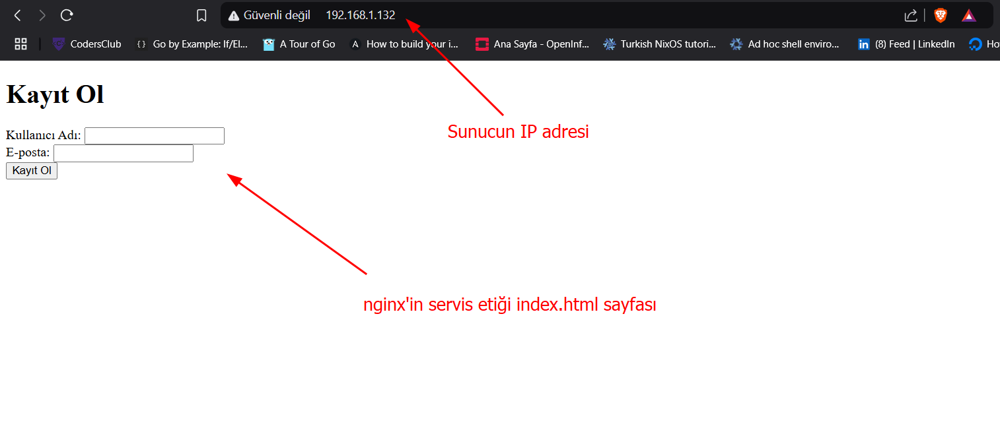
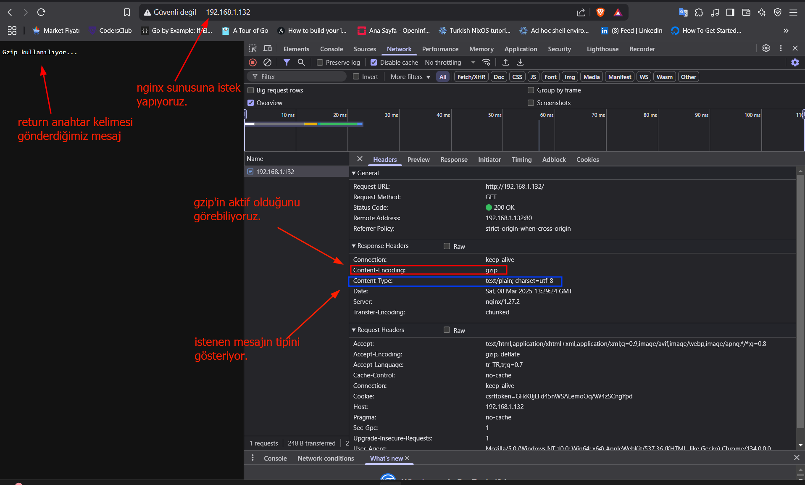

#nginx #web 
## Nginx Giriş
#### A. Tanım:
+ Nginx, çok yönlü bir web sunucusu olarak kullanılır ve birçok farklı amaç için konfigüre edilebilir. İşte Nginx'in başlıca kullanım alanları:
	1. **Web Sunucusu**: Nginx, statik içerik (HTML, CSS, JS dosyaları) sunmak için kullanılır. HTTP ve HTTPS isteklerini işleyerek web sitelerinin temel sunucu rolünü üstlenir.
	2. **Ters Proxy (Reverse Proxy)**: Nginx, istemci isteklerini arka plandaki başka sunuculara yönlendirmek için ters proxy olarak yapılandırılabilir. Bu, yük dengelemesi (load balancing) ve güvenlik (örneğin, gizleme ve IP adreslerini maskeleme) için yaygındır.
	3. **Yük Dengeleyici (Load Balancer)**: Nginx, gelen istekleri birden fazla sunucuya dağıtarak yük dengeleme işlevi görür. Bu, sunucu kaynaklarını daha verimli kullanmaya ve yüksek trafikli uygulamalarda daha yüksek performans sağlamaya yardımcı olur.
	4. **HTTP Önbellekleme (Caching)**: Nginx, dinamik içerikleri cache'leyerek istemcilere daha hızlı sunabilir. Bu, özellikle trafiği yoğun olan web sitelerinde performansı artırmak için kullanılır.
	5. **API Gateway**: Mikroservis mimarilerinde, Nginx genellikle API isteklerini yönetmek, yönlendirmek ve güvenlik politikalarını uygulamak için bir API gateway olarak kullanılır.
	6. **Medya Streaming**: Nginx, video ve ses gibi medya içeriklerini HTTP üzerinden akış (streaming) hizmeti sunmak için de kullanılabilir.
+ Nginx, Rus geliştirici **Igor Sysoev** tarafından geliştirildi.
+ Nginx açık kaynak olarak 2004 de bırakıldı yani duyruldu.

#### B. 10K Problemi:
+ Web sunucularında "10K problemi" (10,000 connections problem), bir web sunucusunun aynı anda çok sayıda (örneğin, 10.000) istemci bağlantısını idare etmesi sırasında karşılaşılan performans ve verimlilik sorunlarına verilen isimdir.
+ Geleneksel web sunucuları, her bir istemci bağlantısı için ayrı bir işlem veya iş parçacığı (thread) oluşturur.
+ Bu yöntem düşük sayıda bağlantı için etkili olsa da, bağlantı sayısı arttıkça aşağıdaki sorunlara yol açar:
###### 1. Yüksek Bellek Tüketimi:
- Her yeni bağlantı, web sunucusunda bir işlem veya iş parçacığı oluşturur. Bu süreç, bellekte önemli bir yer kaplar.
- 10.000 bağlantı olduğunda, bu işlemler ve iş parçacıkları sistemin RAM'ini hızla tüketebilir ve bellek tükenmesi veya yavaşlamalar meydana gelebilir.
###### 2. CPU Yükü:
- Her işlem veya iş parçacığı için işlemci zamanı ayrılması gerekir.
- 10.000 veya daha fazla bağlantı olduğunda, işlemci bu iş parçacıklarının yönetimiyle meşgul olur, bu da sunucunun performansını düşürür ve yanıt sürelerini uzatır.
#### C. Nginx ve 10K Problemi:
- Nginx gibi modern web sunucuları bu problemi çözmek için **asenkron, olay tabanlı bir mimari** kullanır.
- Bu mimaride, her bir bağlantı için yeni bir iş parçacığı ya da işlem oluşturulmaz. Bunun yerine, bir olay döngüsü içerisinde I/O (girdi/çıktı) işlemleri yönetilir.
- Bu sayede aynı anda on binlerce bağlantı etkin bir şekilde işlenebilir. Böylece, kaynak kullanımı optimize edilir ve **10K problemi** ortadan kaldırılır.
- Asenkron mimarinin avantajları şunlardır:
	- **Daha Az Bellek Tüketimi**: Tüm bağlantılar tek bir işlem ya da sınırlı sayıda iş parçacığı üzerinden yönetilir.
	- **Daha İyi Performans**: İşlemci kaynakları verimli kullanılır, çünkü I/O işlemleri non-blocking şekilde (engellenmeyen) gerçekleşir.
	- **Daha Yüksek Bağlantı Kapasitesi**: On binlerce hatta yüz binlerce eşzamanlı bağlantı yönetilebilir.

#### D. HTTP Sunucu Yeteneği Olarak:
Nginx ayrıca şunları da yapabilir;
+ Proxy sunucu email için(IMAP, POP3, ve SMTP)
+ Reverse proxy
+ Load Balancer HTTP, TCP ve UDP sunucuları için

#### E. Nginx vs Apache:

> [!CAUTION]
> + Nginx, HTTP sunucusu olmasının yanı sıra **mail proxy** yeteneği de sunar. SMTP, IMAP ve POP3 protokollerini destekler ve bu sayede e-posta sunucuları için bir ters proxy (reverse proxy) olarak kullanılabilir.
> + **Ancak;** Apache'nin kendisi doğrudan bir e-posta proxy sunucusu olarak kullanılmaz, çünkü Apache esasen bir HTTP sunucusudur ve web tabanlı içerikleri sunmak için tasarlanmıştır. Ancak, Apache'nin modül tabanlı yapısı sayesinde e-posta trafiği ile ilgili bazı işlemleri desteklemek mümkündür, fakat bu genellikle bir proxy sunucusu görevini üstlenmek anlamına gelmez.

###### 1. Mimari Yapı:
+ **Nginx**: Nginx, **asenkron ve olay tabanlı(event-driven)** bir mimari kullanır. Bu mimari, bağlantıları yönetmek için her bağlantı için bir iş parçacığı (thread) oluşturmaz.
+ Bunun yerine, I/O işlemleri bir olay döngüsü içerisinde yönetilir. Bu yaklaşım, düşük bellek ve işlemci kullanımı ile yüksek sayıda eşzamanlı bağlantıyı (concurrent connections) desteklemeyi sağlar.
+ *Nginx tüm istekleri, bu istekler 10.000 veya 100.000 olabilir tek bir işlem(process) tarafından işlenir(ele alınır.)* **İsteklerde(requests) herhangi bir düşme olmaz.**
---
+ **Apache**: Apache, varsayılan olarak **işlem ve iş parçacığı tabanlı(process-driven)** bir mimari kullanır. **Apache, her bir istemci isteği için yeni bir iş parçacığı veya işlem oluşturur.**
+ Bu, düşük sayıda eşzamanlı bağlantı için yeterli olabilir, ancak çok fazla bağlantı olduğunda performans sorunlarına yol açabilir.
+ *Apache her bir istek için ayrı bir işlem(process) oluşturur ve bu process bu belirli istekleri işler(ele alır).* **Eğer aşırı miktarda istek gelirse ve bu istekler işlem(process) sayısını aşarsa istek düşmeleri olur.**
###### 2. Modül Yapısı:
+ **Nginx**, modüler bir yapıya sahiptir ancak modüller, **statik** (derlenmiş) olarak yüklenir.
+ Bu, Nginx’in çalışırken modül yükleme veya kaldırma yeteneğine sahip olmadığı anlamına gelir.
+ Modüller, Nginx’in kaynak kodunu derlerken eklenir ve çıkarılır.
+ **Dinamik modüller** desteği Nginx'e daha sonra eklenmiştir, ancak bu yaklaşım Apache kadar esnek değildir.
---
+ **Apache**, **daha esnek ve dinamik** bir modül yapısına sahiptir.
+ Apache, modülleri çalışırken (runtime) yükleyip çıkarabilen **dynamically loadable modules** desteğine sahiptir.
+ Apache, varsayılan olarak birçok modülle birlikte gelir ve bu modüller `httpd.conf` veya benzeri konfigürasyon dosyalarında tanımlanarak etkinleştirilir ya da devre dışı bırakılır.
###### 3. Performans:
+ **NGINX**: Yüksek sayıda eşzamanlı bağlantıda Nginx daha iyi performans gösterir.
+ Özellikle statik içeriklerin (HTML, CSS, JavaScript gibi) sunulmasında Nginx çok hızlıdır.

---
+ **Apache**, saatte 1000 veya daha az istek gibi nispeten düşük trafik seviyelerine sahip siteleri barındırırken daha iyi performans gösterir.
+ Apache de düşük performansını nedeni `.htaccess` dosyasını giriş/çıkış(I/O) operasyonlarıdır. Ayrıca, apache tarafından oluşturulan tüm process'ler bu dosyayı(`.htaccess`) okur.
+ `.htaccess` dosyası URL'nin içerikle tam eşleşmesini sağlayacak olan Apache sunucusunun çekirdek dosyasıdır.
###### 4. Statik ve Dinamik İçerik Sunma:
+ **NGINX**: Statik içerik sunma konusunda oldukça hızlıdır, çünkü I/O işlemleri sırasında engellenmez (non-blocking).
+ Ancak, dinamik içerikleri doğrudan işleyemez; bu tür içerikleri PHP-FPM gibi bir dış modülle işleyerek sunar.
+ **Statik İçerik:** Aynı anda 1.000'e yakın bağlantı çalıştırılarak yapılan bir kıyaslama testine göre Nginx, Apache'den 2,5 kat daha hızlı performans gösteriyor.
---
- **Apache:** 
- Dinamik içerikler Apache tarafından doğal olarak ve doğrudan sunulur.

> [!TIP]
> Nginx ve Apache dinamik içeriği aynı hızda sunar

###### 5. OS Desteği:
+ **Nginx** en iyi desteğini Unix benzeri sistemlerde çalışır ve Microsoft Windows desteği de vardır. 
+ **Apache** tüm işletim sistemlerinde çalışır; Unix, Linux veya BSD hata Microsoft Windows için tam bir desteği var.
###### 6. Özellik Modelleri:
+ **Nginx**'in 3. parti çekirdek modülleri vardır (dinamik olarak yüklenemez). Nginx, dinamik olarak yükleyemeyeceğiniz binlerce 3.taraf çekirdek(core module) modülüne sahiptir.
+ Eğer nginx içerisine herhangi bir 3.parti modülü eklemeniz gerekiyorsa, o modülü nginx'in binary koduna eklemeniz gerekir.
---
+ **Apache**'nin 60 adet resmi, Açık/Kapalı olarak ayarlanabilen dinamik olarak yüklenebilir modülü vardır.

> [!IMPORTANT]
> + Aynı tür yapılandırmaya sahip makinede Apache ve Nginx'i çalıştırdığınızı ve Apache üzerinde 5000 istek ve Nginx üzerinde de aynı anda 5000 istek olduğunu varsayalım; o zaman Nginx'in Apache ile karşılaştırıldığında sadece %15 Kaynak kullandığını göreceksiniz.

#### F. Statik ve Dinamik İçerik:
###### 1.Statik İçerik:
###### 2.Dinamik İçerik:

#### G. HTTP Requests:


> [!NOTE]
> + **Genel Şablonu:** `http://<host URL><resource URL>`
> + **Örnek:** `https://jsonplaceholder.typicode.com/posts/1/comments` 
> + **Açıklama:** `https://jsonplaceholder.typicode.com` host URL karşılık gelir ve `/posts/1/comments` resouce URL karşılık gelir. 

##### G.1. Request Formatı:
###### G.1.1 Request-line:
+ HTTP protokolünde `Request-Line`, bir HTTP isteğinin ilk satırında yer alır ve istemcinin sunucuya ilettiği isteğin türünü, hedef URL'yi ve HTTP protokol sürümünü içerir.
+ Bu satır, sunucunun ne tür bir işlem yapması gerektiğini anlamasını sağlar ve istemci tarafından gönderilen isteğin amacını özetler.

```http
<HTTP Yöntemi> <URI> <HTTP Sürümü>
```

```http
GET /products HTTP/1.1
```
> **Explanation:**
> 1. **HTTP metodu:** İsteğin türünü belirtir (GET, POST, PUT, DELETE gibi).
> 2. **Request URI:** Kaynağın konumunu belirten URL’yi içerir ve sunucunun hangi kaynağa ulaşması gerektiğini belirtir. (/products veya /api/v1/users)
> 3. **HTTP Sürümü:** Hangi HTTP protokol sürümünün kullanıldığını belirtir (genellikle `HTTP/1.1` veya `HTTP/2`)

###### G.1.2 Zero or More Header:
+ HTTP’de `header` (başlık), istemci ve sunucu arasında veri alışverişi yaparken ek bilgi sağlayan anahtar-değer çiftlerinden oluşan bir bölümüdür.
+ Header, hem HTTP isteklerinde (request) hem de yanıtlarında (response) bulunur ve veri alışverişinin nasıl yapılacağına dair önemli bilgiler içerir.
+ Bu bilgiler, içeriğin türü, yetkilendirme bilgileri, içerik uzunluğu gibi çeşitli detayları kapsar ve HTTP iletişiminin temelini oluşturur.
1. **Genel Header’lar (General Headers)**:  Hem isteklerde hem de yanıtlarda kullanılabilen, genel bağlantı ve aktarım özelliklerini tanımlar. Örnek: `Cache-Control` (önbellekleme ayarlarını belirler), `Connection` (bağlantının açık kalıp kalmaması gerektiğini belirtir).
2. **Request Header:** İstemci tarafından sunucuya gönderilen istekle ilgili bilgileri içerir. Örnek: `Host`: Sunucunun hangi domain için çalıştığını belirtir, `Accept`: İstemcinin kabul ettiği içerik türlerini belirtir (örneğin `application/json`, `text/html`).
3. **Response Header**:  Sunucu tarafından istemciye döndürülen yanıtla ilgili bilgileri içerir. Örnek: `Content-Type`: Yanıtın içeriğinin türünü belirtir (örneğin `text/html`, `application/json`), `Content-Length`: Yanıtın boyutunu belirtir.
4. **Entity Header:** İletinin kendisine, yani içeriğe (örneğin dosya veya belge) dair bilgileri tanımlar. Örnek: `Content-Encoding`: İçeriğin hangi formatta sıkıştırıldığını belirtir (örneğin `gzip`), `Content-Language`: İçeriğin dilini belirtir (örneğin `en` veya `tr`).

**Request Header:**
```http
GET /index.html HTTP/1.1
Host: www.example.com
User-Agent: Mozilla/5.0 (Windows NT 10.0; Win64; x64)
Accept: text/html
```

**Response Header:**
```http
HTTP/1.1 200 OK
Content-Type: text/html; charset=UTF-8
Content-Length: 1024
Set-Cookie: sessionId=abc123; HttpOnly
```

###### G.1.3. Empty-line:
+ HTTP protokolünde önemli bir yapısal rol oynar. İstemci veya sunucu, başlıklar ve gövde arasında bir ayrım yapabilmek için bu satırı kullanır.
+ Bu satır olmazsa, protokol başlıkların sonunu ve gövdenin başlangıcını doğru bir şekilde ayıramaz, bu da iletişimin bozulmasına veya yanlış yorumlanmasına yol açabilir.
###### G.1.4. body:
+ Bir HTTP isteği veya yanıtının asıl içeriğini, yani başlıklarda (header) belirtilen veri türüne göre istemciye veya sunucuya gönderilmesi amaçlanan veriyi barındıran bölümdür.

> [!TIP]
> + Her HTTP isteğinin bir gövdesi olmak zorunda değildir.
> + Örneğin, `GET` isteğinde genellikle gövde bulunmaz, çünkü `GET` yalnızca sunucudan veri almak için kullanılır.
> + Gövde içeren istekler genellikle `POST`, `PUT`, veya `PATCH` gibi sunucuya veri göndermeyi veya güncellemeyi amaçlayan isteklerde bulunur.

##### G.2. GET Request: 
 + **GET** metodu, HTTP protokolünde bir kaynağı (genellikle bir web sayfası veya API verisi) sunucudan istemek için kullanılan en yaygın HTTP yöntemidir.
 + GET isteği, sunucudan veri almak amacıyla kullanılır ve veriyi yalnızca okunur olarak elde etmeyi amaçlar; yani, sunucuya veri göndermek veya sunucu üzerinde bir değişiklik yapmak amacıyla kullanılmaz.


> [!TIP]
> + **İstek Gövdesi (Request Body) Yoktur**
> + GET istekleri genellikle bir gövde içermez. Tüm gerekli veriler, URL yoluna veya sorgu parametrelerine (query string) eklenir.

###### GET Request Atma:
```shell
$ curl -i -X GET www.example.com
```
> **Explanation:**
> + `curl` komut ile `www.example.com` sitesine bir `GET` isteği atmış bulunuyoruz.
> + `-X` parametresi ile istek türünü belirleyebiliriz. 
> + Ayrıca `-X` parametresin uzun yazılışı: `--request`

##### G.3. POST Request:
+ **POST** isteği, HTTP protokolünde sunucuya veri göndermek veya sunucu üzerinde bir işlem yapmak için kullanılan bir HTTP metodudur.
+ POST istekleri, genellikle yeni bir kaynak oluşturmak veya sunucu üzerinde bir değişiklik yapmak amacıyla kullanılır.
+ Örneğin, bir kullanıcı kayıt formunu göndermek veya yeni bir ürün eklemek için POST isteği yapılır.


> [!TIP]
> + **Gövde (Request Body) vardır**
> + POST isteğinde veri, HTTP başlıklarının ardından gelen gövde (body) kısmında yer alır. Gövdeye eklenen veri, form verisi, JSON, XML veya diğer formatlarda olabilir.

```shell
$ curl -X POST https://jsonplaceholder.typicode.com/todos \
-H "Content-Type: application/json" \
-d '{"userId": 1, "title": "linux is awesome", "id": 2}'
```
> **Explanation:**
> + `https://jsonplaceholder.typicode.com` test amaçlı **POST** isteği atabileceğiniz ücretsiz sitedir.
> + `-H` parametresi ile `Content-Type: application/json` header'ı ekliyoruz
> + `-d` parametresi ile de siteye veri yani data gönderiyoruz.

##### G.4. PUT Request:
+ **PUT** isteği, belirli bir kaynağı **oluşturmak** veya **güncellemek** için kullanılır.
+ PUT, gönderilen veriyi sunucuda tanımlı bir kaynağın **üzerine yazmak** için kullanılır.
+ Örneğin, bir kullanıcının bilgilerini güncellemek için PUT isteği gönderildiğinde, o kullanıcının tüm mevcut bilgileri gelen verilerle değiştirilir.

```shell
$ curl -X PUT https://jsonplaceholder.typicode.com/posts/1 \
-H "Content-Type: application/json" \
-d '{"userId": 1, "id": 3, "title": "linux is awesome", "body": "ubuntu"}'
```
> **Explanation:**
> + `https://jsonplaceholder.typicode.com` test amaçlı **PUT** isteği atabileceğiniz ücretsiz sitedir.
> + `-H` ve `-d` parametreleri yukarıda açıklanmıştır.

| Özellik             | PUT                                             | POST                                               |
| ------------------- | ----------------------------------------------- | -------------------------------------------------- |
| **Amaç**            | Kaynak oluşturma veya güncelleme                | Yeni kaynak oluşturma veya veri gönderme           |
| **Idempotent**      | Evet (aynı veri tekrar gönderilirse sonuç aynı) | Hayır (aynı veri tekrar gönderilirse farklı sonuç) |
| **Kaynak**          | Var olan kaynağı tamamen günceller              | Yeni kaynak yaratır veya mevcut kaynağa veri ekler |
| **Kullanım Örneği** | Mevcut kullanıcı bilgilerini güncelleme         | Yeni kullanıcı kaydı oluşturma                     |

> [!TIP]
> + **PUT**, genellikle belirli bir kaynağın güncellenmesi için tercih edilirken, **POST** yeni bir kaynak oluşturma durumunda daha uygun bir seçimdir.

##### G.5. DELETE Request:
+ **DELETE** isteği, sunucudaki belirli bir kaynağı **silmek** için kullanılan bir HTTP metodudur.
+ Bu istekle sunucuya gönderilen kaynağın kimliği veya konumu belirtilir ve sunucu, bu kaynağı sistemden kaldırır. Örneğin, bir kullanıcıyı, kaydı veya dosyayı silmek için kullanılabilir.


> [!NOTE]
> + **DELETE Request’in Özellikleri**
> + **Silme İşlemi:** DELETE isteği genellikle bir veri kaynağını, örneğin bir kullanıcı veya ürün kaydını, veritabanından veya sunucudan kaldırır.
> + **Yanıt Kodu:** Başarılı bir silme işlemi sonrası sunucu genellikle 200 (OK) veya 204 (No Content) yanıt kodu döner. Eğer kaynak bulunamazsa 404 (Not Found) yanıtı dönebilir.

```shell
$  curl -X DELETE https://jsonplaceholder.typicode.com/posts/1
```

#### H. HTTP Response Kodları:
+ HTTP'de **Response Code** (Yanıt Kodu), bir istemcinin (örneğin, tarayıcı veya başka bir istemci uygulaması) sunucuya yaptığı isteğe sunucunun verdiği yanıtın durumunu bildiren üç haneli sayısal bir koddur.
+ Bu kodlar, istemcinin isteğinin başarılı olup olmadığını, bir hata meydana gelip gelmediğini veya başka bir işlem yapılması gerekip gerekmediğini belirtir.
+ Üç haneli tam sayıdan oluşmaktadır ve ilk hanesi kodun sınıfını tanımlar.
##### 1xx(info) - Bilgilendirme Yanıtı:
+ *İstek alındı ve işlem sürüyor*. Genellikle çok yaygın kullanılmaz.
+ **100 Continue:** İstemci, isteğe devam edebilir.
##### 2xx(success) - Başarılı Yanıtlar:
+ İstek başarıyla tamamlanmıştır.
+ **200 OK:** İstek başarıyla işleme alındı ve yanıt verildi.
+ **201 Created:** İstek başarılı ve yeni bir kaynak oluşturuldu (genellikle POST isteğinde).
##### 3xx(redirection) - Yönlendirme Yanıtları:
+ İstemcinin isteği başka bir kaynağa yönlendirilmelidir.
+ **301 Moved Permanently:** İstenen kaynak kalıcı olarak başka bir konuma taşındı.
+ **302 Found:** İstenen kaynak geçici olarak başka bir konuma taşındı.
+ **304 Not Modified:** Kaynakta herhangi bir değişiklik yok, bu nedenle yeniden indirilmesine gerek yok (genellikle önbellekleme için kullanılır).
##### 4xx(Client Error) - İstemci Hataları:
+ İstemcinin yaptığı istekte hata vardır.
+ **400 Bad Request:** Geçersiz istek, sunucu isteği işleyemiyor.
+ **401 Unauthorized:** Yetkilendirme gerekiyor, ancak sağlanmamış.
+ **403 Forbidden:** İstemcinin kaynağa erişim izni yok.
+ **404 Not Found:** İstenen kaynak sunucuda bulunamadı.
+ **408 Request Timeout:** istemcinin (**client**) **sunucu tarafından belirlenen süre içinde isteğini tamamlayamaması** durumunda dönen bir hata kodudur.
+ **413 :** HTTP durum kodu `413`, "`Payload Too Large`" (Yük Çok Büyük) anlamına gelir. Bu hata, sunucunun istemciden gelen isteği işleyemeyeceğini belirtir çünkü isteğin içerdiği veri (payload) sunucunun kabul edebileceği boyut sınırını aşmıştır.
##### 5xx(Server Error) - Sunucu Hataları:
+ *Sunucu isteği işleyemediği durumlarda oluşur.*
+ **500 Internal Server Error:** Sunucuda beklenmeyen bir hata oluştu.
+ **502 Bad Gateway:** Sunucu, başka bir sunucudan geçersiz bir yanıt aldı.
## Reverse Proxy

> [!NOTE]
> + Nginx de tek işlem(process) çalışır.
> + istek(request) ---> nginx ---> 3. part process 


## Nginx Kurulumu:

#### A. Debian Temeli İşletim Sistemleri:
```shell
$ sudo apt install nginx
```
> **Explanation:**
> + Ubuntu ve Debian işletim sistemlerinde *nginx* kurulumunu `apt` paket yöneticisi tarafından yapar.

+ Eğer apt paket yöneticisi ile kurulum yaparsanız, *nginx* ile birlikte kurulacak paketler;
```shell
fontconfig-config fonts-dejavu-core libdeflate0 libfontconfig1 libgd3 libjbig0 libjpeg-turbo8 libjpeg8 libnginx-mod-http-geoip2 libnginx-mod-http-image-filter libnginx-mod-http-xslt-filter libnginx-mod-mail libnginx-mod-stream libnginx-mod-stream-geoip2 libtiff5 libwebp7 libxpm4 nginx-common nginx-core
```

---
#### B. REHL Temeli İşletim Sistemleri:

```shell
$ sudo yum install nginx
```

+  Yüklediğimiz *nginx*'in çalıştığını veya çalışmadığını kontrol edelim;

> [!WARNING]
> + `yum` paket yöneticisi yüklediği paket veya uygulamaları varsayılan olarak çalıştırmaz. Çalıştırma işlemini kullanıcıya bırakır. 

```shell
$ ps aux | grep nginx
```
> **Explanation:**
> + 

```sh
$ sudo systemctl enable --now nginx.service
```
> **Explanation:**
> + `systemctl` aracı ile `nginx` sevisini hem aktif(`--now`) hem de sistem yeniden başladığında aktif(`enable`) olmasını sağlıyoruz. 

```sh
$ sudo systemctl status nginx
```
> **Explanation:**
> + Tekrardan `systemctl` ile nginx servisini kontrol etiğimiz de  servisin  çalıştığını görebiliriz.

```sh
$ firewall-cmd --add-service=http --permanent
```

```sh
$ firewall-cmd --add-service=https --permanent
```

> **Explanation:**
> +  REHL temeli işletim sistemlerinde  `firewalld deamon` çalışır. nginx de `80 port` kullanır Bu yüzden `80 port`'una izin vermemiz gerekmektedir.
> + Nginx https bağlantıları için 443 portu kullanır. Güvenlik duvarı tarafında bu porta izin vermemiz gerekmektedir.

```sh
$ firewall-cmd --reload
```
> **Explanation:**
> + Firewalld deamond da yapılan değişikliklerin geçerli olabilmesi için bu komutu çalıştırıyoruz.

---
#### C. Kaynak Koddan Derleme:

+ nginx derleme işlemini yapabilmemiz için nginx source code indirmemiz gerekmektedir.
+ Kaynak kodu indirme  [link](https://nginx.org/en/download.html) gitmek için tıkayınız.
+ Derleme işlemini `Mainline version` ile sürdüreceğiz. `nginx-1.27.2` bağlantının adresini kopyalıyoruz.

```sh
$ wget https://nginx.org/download/nginx-1.27.2.tar.gz
```


> [!CAUTION]
> + Eğer paket yöneticileri(`apt, yum...`) ile yüklediğimizde nginx'e modül(*3.part modül veya özel modül*) dahil edemiyoruz. Bu yüzden nginx kaynak koddan yüklemede modül yükleme imkanı vermektedir. 
> + Kaynak kod üzerinde derleme işlemi işletim sisteminden bağımsız yapar. Yani ubuntu üzerinde yapılan işlemler almalinux üzerinde de aynı şekilde olur.

```sh
$ tar -zxvf nginx-1.27.2.tar.gz            # Çıktı: nginx-1.27.2
```
> **Explanation:**
> + Hem arşivlenmiş(tar) hem de sıkıştırılmış(gz) dosya `tar`  ve parametreleri ile çıkarma işlemini yapıyoruz.

```shell
$ cd nginx-1.27.2; ls -l
```

**Çıktı:**
```shell
total 860
-rw-r--r--. 1 ottoman ottoman 328790 Oct  2 18:30 CHANGES
-rw-r--r--. 1 ottoman ottoman 503040 Oct  2 18:30 CHANGES.ru
-rw-r--r--. 1 ottoman ottoman   5215 Oct  2 18:13 CODE_OF_CONDUCT.md
-rw-r--r--. 1 ottoman ottoman   4049 Oct  2 18:13 CONTRIBUTING.md
-rw-r--r--. 1 ottoman ottoman   1319 Oct  2 18:13 LICENSE
-rw-r--r--. 1 ottoman ottoman  14220 Oct  2 18:13 README.md
-rw-r--r--. 1 ottoman ottoman    787 Oct  2 18:13 SECURITY.md
drwxr-xr-x. 6 ottoman ottoman   4096 Oct 11 02:28 auto
drwxr-xr-x. 2 ottoman ottoman    168 Oct 11 02:28 conf
-rwxr-xr-x. 1 ottoman ottoman   2611 Oct  2 18:13 configure
drwxr-xr-x. 4 ottoman ottoman     72 Oct 11 02:28 contrib
drwxr-xr-x. 2 ottoman ottoman     40 Oct 11 02:28 html
drwxr-xr-x. 2 ottoman ottoman     21 Oct 11 02:28 man
drwxr-xr-x. 9 ottoman ottoman     91 Oct  2 18:13 src
```
> **Explanation:**
> + İndirdiğimiz nginx kaynak kodlarını ekran yazdırıyoruz.

##### C.1. Debian Temeli OS:
```sh
$ sudo apt install build-essential
```

```sh
$ sudo apt install libpcre3 libpcre3-dev zlib1g zlib1g-dev libssl-dev make
```
> **Explanation:**
> + `PCRE library`, `build-essential` ile birlikte gelmemektedir.

---
##### C.2. REHL Temeli OS:
```sh
$ sudo yum install groupinstall "Development Tools"
```
> **Explanation:**
> + Nginx'i kaynak koddan(`source code`) derleme(`compile`)  yapılabilmesi için işletim sistemlerine bağlı olarak bazı araçların yüklenmesi gerekmektedir.
> + `PCRE library`, `Development Tools` içerisinde gelmektedir. 

```sh
$ sudo yum list installed pcre pcre-devel zlib zlib-devel openssl openssl-devel make
```
> **Explanation:**
> + `list installed` komutu ile hangi kütüphanelerin yüklü olduğunu teyit edebilirsiniz.

```sh
$ sudo yum install pcre pcre-devel zlib zlib-devel openssl openssl-devel make
```
> **Explanation:**
> + Bir çok kütüpahane `Development Tools` ile gelmektedir fakat Eğer eksik komut ile karşılaşırsanız bu kütüphaneleri yükleyebilirsiniz.

---
##### C.3. OS'dan Bağımsız İşlemler:

###### C.3.1 Configure İşlemi:
> [!CAUTION]
> + Aşağıdaki komutu indirmiş olduğunuz `nginx source code` içerisinde çalıştırınız.

```sh
$ sudo ./configure --sbin-path=/usr/bin/nginx --conf-path=/etc/nginx/nginx.conf --error-log-path=/var/log/nginx/error.log --http-log-path=/var/log/nginx/access.log --with-pcre --pid-path=/var/run/nginx.pid --with-http_ssl_module
```

> **Explanation:**
> + Nginx configure etme işlemini başlatabiliriz: `configure` komutun alacağı parametreler [link](https://nginx.org/en/docs/configure.html) de mevcuttur.
> + `sudo ./configure --help` komut ile `configure` komutun alacağı parametreleri terminal üzerinde ekranda listeleyebiliriz.
> + İşlem tamamlandığında `Makefile` dosyası oluşacaktır.

###### C.3.2. Make işlemi:
```shell
$ sudo make
```

> **Explanation:**
> + Kodu derlemek için `make` komutunu çalıştırıyoruz.
> + Eğer böyle bir çıktı görüyorsanız; `make[1]: Leaving directory '/home/ottoman/nginx-1.27.2'` işlem tamamlanmıştır.

```shell
$ sudo make install
```

> **Explanation:**
> + Nginx yüklemesi yapmak için bu komutu çalıştırıyoruz.

```shell
$ nginx -v                 # Çıktı: nginx version: nginx/1.27.2
```

> **Explanation:**
> + nginx versiyonunu veriyorsa nginx'niz hayırlı olsun kurulum başarılı.

###### C.3.3 Nginx Çalıştırma:
```shell
$ sudo nginx 
```

> **Explanation:**
> + Yüklemiş olduğumuz nginx uygulamasını başlatacaktır.

```sh
$ sudo ps aux | grep nginx
```
> **Explanation:**
> + Nginx'in çalıştığını teyit etmek için ve çıktı bize bir master ve bir de worker process'leri ekrana verecektir.

**Nginx yeniden başlatma:**
```shell
$ sudo nginx -s reload                                # 1
```

```shell
$ sudo /usr/bin/kill -s HUB <nginxProcessID>          # 2
```
> **Explanation:**
> 1. `nginx` programı `-s` parametresi ile kendi process'ini yeniden başlatma sinyali gönderiyoruz.
> 2. Linux'ta "HUP" sinyali, "Hang Up" anlamına gelir. "Hang Up" türkçe anlamı telefonu kapatmak anlamına gelir. Sinyal numarası olarak 1 (SIGHUP) ile temsil edilir.
> 	+ **Bir terminal kapandığında**: Bir kullanıcı SSH üzerinden bağlanıp terminalden çıkış yaparsa, bağlı işlemlere SIGHUP sinyali gönderilir. Bu sinyal, işlemin terminalle bağlantısının kesildiğini belirtir.
> 	+ **Yeniden başlatma (reload)**: Bazı daemon veya servisler için SIGHUP sinyali, yapılandırma dosyalarının yeniden yüklenmesi (reload) anlamına gelir. Örneğin, Nginx veya Apache gibi web sunucuları yapılandırma değişikliklerinden sonra bu sinyalle yeniden başlatılabilir, böylece tam anlamıyla durdurulup yeniden başlatılmadan değişiklikler uygulanır.


```sh
$ curl -i http://192.168.1.132
```
> **Explanation:**
> + `curl` komut ile `GET` isteği yaptığımızda bize nginx'in varsayılan web sitesi geri dönmesi gerekir.
> + Bu `GET` isteğini her hangi bir tarayıcı ile de yapılabilir.

##### C.4. Nginx Servis Oluşturma:

> [!IMPORTANT]
> + Servis oluşturma işletim sistemlerinde bağımsızdır fakat hangi servis yöneticisini kullanmasına bağlıdır.
> + Burada kullanılan servis yöneticisi **systemd** olacaktır. Bundan dolayı hem debian hem de REHL temeli OS de aynıdır.

###### nginx.service dosyası:
```shell
$ vim /lib/systemd/system/nginx.service
```

```systemd
[Unit]
Description=The NGINX HTTP and reverse proxy server
After=syslog.target network.target remote-fs.target nss-lookup.target

[Service]
Type=forking
PIDFile=/var/run/nginx.pid
ExecStartPre=/usr/bin/nginx -t
ExecStart=/usr/bin/nginx
# ExecReload=/usr/bin/nginx -s reload
ExecReload=/usr/bin/kill -s HUP $MAINPID
ExecStop=/usr/bin/kill -s QUIT $MAINPID
PrivateTmp=true

[Install]
WantedBy=multi-user.target
```
> **Explanation:**
> 1. **Description:** servis bağlatıldığında log dosyalarına() söyle bir çıktı veriyor;
> 	+ Starting The NGINX HTTP and reverse proxy server...
> 	+ Started The NGINX HTTP and reverse proxy server...
> 2. 

```shell
$ sudo systemctl daemon-reload
```
> **Explanation:**
> + systemd manager configuration yeniden yükleyecektir.
> + Yeni bir systemd servis dosyası eklediğinizde ya da mevcut bir servis dosyasında değişiklik yaptığınızda, `systemctl daemon-reload` çalıştırarak systemd'nin bu değişiklikleri okumasını sağlamanız gerekir.

```shell
$ sudo systemctl enable --now nginx.service
```
> **Explanation:**
> + /etc/systemd/system/multi-user.target.wants/nginx.service.

## Nginx Modülleri:


> [!NOTE]
> + Modülleri nginx'i kaynak koddan derlerken kullanılır;
> + Genel şeması: `configure --module1 --module2 --module3 ...`

###### 1. --sbin-path modülü:
+ nginx yürütülebilir dosyasının adını ayarlar. Bu ad yalnızca kurulum sırasında kullanılır. Varsayılan olarak dosya `prefix /sbin/nginx` olarak adlandırılır.([nginx.com](https://nginx.org/en/docs/configure.html))
+ derleme ve kurulum sürecinde Nginx’in ikili (binary) dosyasının sistemde nereye yükleneceğini belirlemek için kullanılır.(chatgpt)
+ Bu seçenek, Nginx’in çalıştırılabilir dosyasının (genellikle `/usr/sbin/nginx`) tam yolunu tanımlamanıza olanak tanır.
**Örnek Kullanım:**
```shell
$ ./configure --sbin-path=/usr/bin/nginx
```
###### 2. --conf-path modülü:
+ nginx.conf yapılandırma dosyasının adını ayarlar. Eğer gerek duyulur ise nginx farklı bir yapılanadırma dosyası ile başlatılabilir; `nginx -c configFile` ile bul işlem yapılabilir.([nginx.com](https://nginx.org/en/docs/configure.html))
+ Nginx'in ana yapılandırma dosyasının (configuration file) sistemde nerede bulunacağını belirtmek için kullanılır.
**Örnek Kullanım:**
```shell
$ ./configure --conf-path=/etc/nginx/nginx.conf
```

###### 3. --error-log-path modülü:
+ Birincil derece hatanın, uyarıların ve tanılama dosyasının adını ve dizin yolunu ayarlar. Yükleme sonrasında `error_log` yönergesi(directive) ile `nginx.conf` dosyasında dosyanın adı ve dizin yolu değiştirilebilir.([nginx.com](https://nginx.org/en/docs/configure.html))
+ Nginx'in hata günlüklerinin (error log) nereye yazılacağını belirlemek için kullanılır.
+ **Amaç:** Sunucudaki hataların kolayca izlenebilmesi ve teşhis edilmesi için kullanılır.

**Örnek Kullanım:**
```shell
$ ./configure --error-log-path=/var/log/nginx/error.log
```

###### 4. --http-log-path modülü:
+ HTTP sunucusunun birincil istek günlük dosyasının adını ve dizin yolunu ayarlar. Yükleme sonrasında `access_log` yönergesi(directive) ile `nginx.conf` dosyasında dosyanın adı ve dizin yolu değiştirilebilir. Varsayılan olarak dosya `prefix/logs/access.log` olarak adlandırılır. ([nginx.com](https://nginx.org/en/docs/configure.html))
+ HTTP isteklerinin günlüklerinin (access log) hangi dosyada tutulacağını belirlemek için kullanılır.
+ **Amaç:** Web sunucusuna yapılan HTTP isteklerinin kaydını tutmak, trafik analizleri ve hata ayıklama için önemlidir.

**Örnek Kullanım:**
```shell
$ ./configure --http-log-path=/var/log/nginx/access.log
```

###### 5. --with-pcre module:
+ PCRE kütüphanesinin kullanımını zorlar.([nginx.com](https://nginx.org/en/docs/configure.html))
+ Perl Compatible Regular Expressions (PCRE) kütüphanesinin Nginx'e dahil edilmesini sağlar. 
+ PCRE, düzenli ifadeleri (regex) kullanarak metin eşleme ve işleme işlemleri yapar ve Nginx’in gelişmiş özelliklerinden bazıları için gereklidir.


> [!CAUTION]
> + Nginx'te kullanılan regex ifadeleri Perl regex ile yüksek oranda uyumludur. 
> + Bu, Nginx kullanıcılarının Perl'deki regex özelliklerini büyük ölçüde kullanabilmelerini sağlar.
> + PCRE, birçok programlama dili ve araç tarafından desteklenir çünkü Perl regex sözdizimi oldukça güçlü ve esnektir.
> + Bu modülü kullanabilmek için; *REHL* işletim sistemlerinde `pcre pcre-devel` ve *debian* temeli işletim sistemlerinde `libpcre3 libpcre3-dev` kütüphanelerin kurulu olması gerekmektedir.


**Örnek Kullanım:**
```shell
$ ./configure --with-pcre
```

**Kullanım Alanı:**
```nginx
location ~ ^/images/(.*)\.(jpg|jpeg|png)$ {
    # İstek "/images/" ile başlayan ve ".jpg", ".jpeg", ".png" ile biten URL'ler için
    # Yapılacak işlemler
}

```
> **Explanation:**
> + nginx `pcre` kütüphanesini eklenmesi ile yukarıda görülen nginx de  `regex` yapısını kullanabiliyoruz.
###### 6. --pid-path modülü:
+ Ana process'in process ID depolayacak olan nginx.pid dosyasının adını ve dizin yolunu ayarlar. Nginx derleme sonrasında `pid` yönergesini(directive) kullanarak `nginx.conf` dosyasında dosya adı ve dizin yolu değiştirilebilir. ([nginx.com](https://nginx.org/en/docs/configure.html))
+ Nginx'in **Process ID (PID)** dosyasının nerede saklanacağını belirtmek için kullanılır.
+ PID dosyası, çalışan Nginx sürecinin kimliğini (process ID) içerir. Bu dosya, Nginx sürecini izlemek, yönetmek ve gerektiğinde yeniden başlatmak veya durdurmak için kullanılır.
+ **Amaç:** Nginx’i başlatmak, durdurmak veya yeniden başlatmak için PID dosyası kullanılır. Özellikle sistem yöneticileri, bu dosyayı kullanarak süreçlerin ID'sini bilip doğru işlemler yapabilir.(chatgpt)

**Örnek Kullanım:**
```sh
$ ./configure --pid-path=/var/run/nginx.pid
```
###### 7. --with-http_ssl_module modülü:
+ HTTP sunucusuna [HTTPS protokol desteği](https://nginx.org/en/docs/http/ngx_http_ssl_module.html) ekleyen bir modülün oluşturulmasını sağlar.Bu modül varsayılan olarak derlenmez. Bu modülü derlemek ve çalıştırmak için OpenSSL kütüphanesi gereklidir.([nginx.com](https://nginx.org/en/docs/configure.html))
+ Nginx'in **SSL/TLS** (Secure Sockets Layer / Transport Layer Security) desteğiyle derlenmesini sağlar. SSL/TLS, web trafiğini şifreleyerek güvenli iletişim kurmanıza olanak tanır ve HTTPS protokolünün temelini oluşturur.


> [!CAUTION]
> + `with-http_ssl_module` kullanabilmek için;
> + REHL işletim sistemleri de `openssl openssl-devel` kütüphaneleri
> + Debian temeli işletim sistemlerin de `libssl-dev` kütüphanesi kurulu olması gerekmektedir. 

**Örnek Kullanım:**
```sh
$ ./configure --with-http_ssl_module
```
## Nginx Config Dosyası:

+ **nginx configuration file is the heart of nginx web server**

> [!NOTE]
> + Eğer debian temelli işletim sistemlerinde `apt` paket yöneticisini kullanarak nginx kurduysanız `nginx config` dosyası `/etc/nginx` dizinde mevcut olacaktır.

+ `nginx.conf`, NGINX'in çalışma şeklini belirleyen direktiflerin bulunduğu ana konfigürasyon dosyasıdır.

#### A.Simple ve Block Directive:
##### A.1.Simple Directive:
+  Bir modülün isimi boşlukla ayrılmış parametre sonu noktalı virgüle(`;`) bitiyorsa buna **simple directive** denir.
+ Simple directive anahtar-değer çifti formunda tanımlanan her hangi birşey.
###### Örnek:
```nginx
worker_processes auto;
```
> **Explanation:**
> + `worker_processes` modülün isimi ardından bir boşluk daha sonrasında `auto` parametresi en son olarak da noktalı virgül(`;`) gelmektir. Fakat parametre kullanılmıştır.
> + İşte bu yapıdaki directive'ler *simple directive* diyoruz.
##### A.2.Block Directive:
+ Simple directive ile aynı ama nginx'in alacağı komutları süslü parantez(`{...}`) ile çevreler.
+ Eğer Block Directive içerisine her hangi bir directive alırsa artık bu yapıya **context** denir.
###### Örnek:
```nginx
http {                          # 1
    server {                    # 2 
        listen 80;
        server_name example.com;

        location / {           # 3
            root /var/www/html;
            index index.html;
        }
    }
}
```
> **Explanation:**
> 1. `http` bir block directive ama içerisinde hem simple directive hem de block directive içerdiği için block directive yerine **context** deyiceğiz.
> 2. `server` bir context diyoruz çünkü içerisinde directive'ler bulunmaktadır.
> 3. `location` da yukarıdaki tanım uygun olarak bir context'dir.
> 4. Kaynak: [Configuration File’s Structure](https://nginx.org/en/docs/beginners_guide.html)

#### B.`nginx.conf` Dosyasın Genel Yapısı:
+ NGINX yapılandırma dosyası, hiyerarşik bir yapıya sahiptir ve genellikle dört ana bloktan oluşur:
1. **Main Context**
2. **Event Context**
3. **HTTP Context**
4. **Server Context**
5. **Location Context**
###### `nginx.conf` Genel Şablonu:
```nginx
# Main Context
...
events {
	# Event Context
	...
}
http {
	# Http Context
	upstream backend_server {
		# Upstream Context
	}
	...
    server {
	    # Server Context
	    ...
        location / {
	        # Location Context
            ...
        }
    }
}
```


> [!NOTE]
> + `include` directive'i bir dosyayı bulunduğu dosyaya dahil eder. Kısacası bir dosya dahil etmek isteniyorsa `include` directive kullanılır.

###### 1. Main Context:
+ **Konum:** `nginx.conf` dosyasının en üst düzeyinde bulunur.
+ **Amaç:** NGINX'in genel çalışma ayarlarını belirler. Bu ayarlar tüm `server` ve `location` blokları için geçerlidir.
+ main context'in bir diğer adı da *global context* denir. Ayırca küme parantezi`{...}` içermeyen tek context'dir.
+ *Temel düzeyde tüm uygulamayı etkileyen detayları yapılandırmak(config etmek) için kullanılır.*

```nginx
user www-data;                                   # 1
worker_processes auto;                           # 2
pid /run/nginx.pid;                              # 3
include /etc/nginx/modules-enabled/*.conf;       # 4
```
> **Explanation:**
> 1. NGINX süreçlerini çalıştıracak kullanıcı ve grup.
> 2. NGINX'in çalıştıracağı worker process'lerin sayısını belirler.
> 	+ **auto:** kaç işlemci var ise o kadar worker process oluşturur.
> 3. nginx'in çalışmış olduğu process ID'yi verir.


> [!CAUTION]
> + Bazı directive'ler main context'inde ayarlanması gerekmektedir Örneğin;
> + `user www-data`: worker process'leri çalıştıracak kullanıcı(user) ve grup(group)
> + `worker_processes 4`: çalıtırılacak olan worker sayısı
> + `pid /run/nginx.pid`: ana process'in PID'yi kayıt edecek dosya ve konumu

###### 2. Events Context:
+ **Konum**: Main context içinde yer alır.
+ **Amaç**: NGINX'in olay (event) modelini ve bağlantı yönetimini ayarlar.
```nginx
events {
    worker_connections 768;                 # 1
    # multi_accept on;
}
```
> **Explanation:**
> 1. `worker_connections`: Her `worker process` aynı anda açabileceği maksimum bağlantı sayısı.

###### 3. Http Context:
+ **Konum**: Main context içinde yer alır.
+ **Amaç:** NGINX'in **HTTP protokolü** ile nasıl çalışacağını belirleyen ayarların yapıldığı bölümdür. Örneğin, **gzip sıkıştırma**, **keep-alive bağlantı süresi**, ve **log formatları** gibi genel HTTP özelliklerini yapılandırır.
+ Http context, programın HTTP veya HTTPS bağlantılarını nasıl işleyeceğini tanımlamak için gerekli tüm yönergeleri ve diğer bağlamları içerecektir.
+ nginx config dosyasında en uzun context `http context`'dir.

```nginx
http {
    # Basic Settings
    sendfile on;                                 # 1

    include /etc/nginx/mime.types;               # 2
    default_type application/octet-stream;

    # SSL Settings
    ssl_protocols TLSv1 TLSv1.1 TLSv1.2 TLSv1.3; # Dropping SSLv3, ref: POODLE
    ssl_prefer_server_ciphers on;

    # Logging Settings
    access_log /var/log/nginx/access.log;         # 3
    error_log /var/log/nginx/error.log;           # 3

    # Gzip Settings
    gzip on;                                      # 4

    # Virtual Host Configs
    include /etc/nginx/conf.d/*.conf;             # 5
    include /etc/nginx/sites-enabled/*;           # 5
}
```
> **Explanation:**
> 1. `sendfile`: Dosya gönderme optimizasyonunu etkinleştirir.
> 2. `mime type` ile dosya tiplerini `nginx.conf` dahil edilir.
> 3. `Log` dosyaların  nereye yazılacağını belirliyor.
> 4. `gzip` ile dosya sıkıştırılıp gönderiliyor.
> 5. `server context` tanımlanmış  dizinler `nginx.conf` dahil ediliyor.

###### 4. Server Context:
+ **Konum**: HTTP context içinde yer alır.
+ **Amaç**: Belirli bir sunucu (domain) için ayarları tanımlar. Her `server` bloğu, farklı bir domain veya IP için yapılandırılabilir.

```nginx
server {
    listen 80;                          # 1
    listen [::]:80;                     # 2

    server_name example.com;            # 3

    root /var/www/example.com;          # 4
    index index.html;                   # 5

    location / {                        # 6
        try_files $uri $uri/ =404;
    }
}
```
> **Explanation:**
> 1. `listen directive`: Sunucunun dinleyeceği IP adresi ve port. Burada dinlenen port 80 dinleniyor. *IP versiyonu versiyon IP4 olmaktadır.*
> 2. Yine `listen` directive kullanılmaktadır ama *IP versiyonu IP6 versiyonudur*.
> 3. `server_name directive`: Sunucunun adını (domain) belirtir. 
> 4. `root directive`: Web dosyalarının bulunduğu dizin.
> 5. `index directive`: Varsayılan olarak sunulacak dosya.
> 6. `location context`: URL yollarına göre istekleri yönlendirir.


> [!IMPORTANT]
> + Nginx’te **virtual host (sanal ana bilgisayar)**,
> + aynı sunucuda birden çok web sitesinin veya alan adının barındırılmasını sağlayan bir yapılandırma tekniğidir.
> + Her bir virtual host, `server` blokları kullanılarak yapılandırılır ve her blok, belirli bir alan adına veya bağlantı noktasına göre ayrılır.
> + Böylece, Nginx gelen istekleri doğru siteye yönlendirir ve her bir alan adı için farklı ayarlar yapılabilir.
> + Bu özellik, paylaşımlı sunucularda veya farklı siteler için gereklidir.

**Virtual Host Örnek:**
```nginx
http {
    server {
        listen 80;
        server_name example.com;
        root /var/www/example;
        index index.html;
    }

    server {
        listen 80;
        server_name example.org;
        root /var/www/example_org;
        index index.html;
    }
}
```
> **Explanation:**
> + `example.com` ve `example.org` alan adları aynı Nginx sunucusunda barındırılır.
> + Her `server` bloğu, kendi kök dizinini (`root`) ve ayarlarını içerir. Böylece, gelen istekler belirtilen alan adına göre ilgili dizine yönlendirilir.
> + Sonuç olarak 2 tane `virtual host` mevcuttur.

###### 5. Location Context:
+ **Konum**: Server context içinde yer alır.
+ **Amaç**: Belirli bir URL yoluna gelen isteklerin nasıl işleneceğini tanımlar. Örneğin, belirli dosya türleri için özel işlemler yapılabilir veya belirli dizinlere istekler yönlendirilebilir.
+ `location context` içerinde bir veya birden fazla `location context` tanımlayabiliriz.

```nginx
server {
    listen 80;                          # 1
    listen [::]:80;                     # 2

    server_name example.com;            # 3

    root /var/www/example.com;          # 4
    index index.html;                   # 5

    location /linux {                   # 6
		index linux.html;  
        root /var/www/html;             # 7
    }
}
```
> **Explanation:**
> 7. En basit `location` tanımı yapıyoruz. Konun anlaşılabilmesi için;
- `vim /var/www/linux.html` komut ile basit bir html dosyası oluşturduk. 	
- `curl -i http://192.168.1.129/linux/` komut veya tarayıcı ile `GET` isteği yaptığımızda nginx bize `/var/www/linux/linux.html` içreğini bize gönderecektir.
- `index directive` :  nginx programının `/var/www/linux/` dizininde `linux.html` dosyasına bakmasını söylemektedir. 
-  Yukarıdaki config dosyasında kullanılan `try_files` directive buradaki `location` context içeriği ile aynı işi yapar ama daha gelişmiş özelikleri mevcuttur.

###### 6. Upstream Context:
+ Nginx'te **upstream context**, birden fazla sunucunun yük dengelemesi (load balancing) için ayarlandığı bir context'dır.
+ upstream context bir veya birden fazla server IP'ler veya domain'ler bulunur.(Upstream Sunucular)
+ Genellikle, `proxy_pass` direktifiyle birlikte kullanılarak gelen isteklerin belirli bir sunucu grubuna yönlendirilmesi sağlanır.
+ Yük dengeleme yapılırken, istekler sunucular arasında dağıtılır.

**Örnek:**
```nginx
upstream backend_servers {
    server server1.example.com;
    server server2.example.com;
}

server {
    location / {
        proxy_pass http://backend_servers;
    }
}
```
> **Explanation:**
> + `proxy_pass` komutu ile gelen istekleri `backend_servers` upstream'ında bulunan sunucular gönderiyoruz.
> + Temel olarak `load balancing` yani yük dengeleme işlemi yapıyoruz. Yük dengeleme olarak denmek isten mevcut sunucuya gelen isteklerin belirli bir algoritma ile `upstream`'daki sunuculara dağıtmaktır.
> + nginx varsayılan olarak `load balancing` de `round-robin` kullanmaktadır.
> + `Load Balancing` konusunda daha detaylı anlatılacaktır.

> [!WARNING]
> + Upstream context, http context içerisine yerleştirilmelidir. Server context'in de dış kısmında bulunmalıdır.

###### 7.Mail Context:
+ Mail context main context yani global context içerisinde tanımlanır.

###### Final nginx.conf:
+ `/etc/nginx/nginx.conf` dosyasını en basit hali;

```nginx
# Main Context
user www-data;                                   # 1
worker_processes auto;                           # 2
pid /run/nginx.pid;                              # 3
include /etc/nginx/modules-enabled/*.conf;       # 4

events {
	# Event Context
    worker_connections 768;                 # 1
    # multi_accept on;
}
http {
	# Http Context
    # Basic Settings
    sendfile on;                                 # 1

    include /etc/nginx/mime.types;               # 2
    default_type application/octet-stream;

    # SSL Settings
    ssl_protocols TLSv1 TLSv1.1 TLSv1.2 TLSv1.3; # Dropping SSLv3, ref: POODLE
    ssl_prefer_server_ciphers on;

    # Logging Settings
    access_log /var/log/nginx/access.log;         # 3
    error_log /var/log/nginx/error.log;           # 3

    # Gzip Settings
    gzip on;                                      # 4

    # Virtual Host Configs
    include /etc/nginx/conf.d/*.conf;             # 5
    include /etc/nginx/sites-enabled/*;           # 5
}
```

+ `/etc/nginx/sites-enabled/default` dosyası;
+ `include /etc/nginx/sites-enabled/*` directive ile aşağıdaki config dosyası da dahil olacaktır.

```nginx
server {
    listen 80;                          # 1
    listen [::]:80;                     # 2

    server_name example.com;            # 3

    root /var/www/example.com;          # 4
    index index.html;                   # 5

    location /linux {                   # 6
		index linux.html;  
        root /var/www/html;             # 7
    }
}
```

## Nginx Variables:

+ Değişken, bir programlama veya yapılandırma ortamında *bir değer saklamak için kullanılan bir isim veya sembol*'dür.
+ Nginx'de değişkenler, sunucunun yapılandırması sırasında *isteğe bağlı bilgileri depolamak veya yönlendirme ve yanıtları dinamik hale getirmek için kullanılan yerleşik (built-in) veya kullanıcı tanımlı* isimlerdir.


> [!NOTE]
> + Nginx, varsayılan olarak değişkenleri `string` değerde saklamaktadır.
> + Nginx değişkenleri basit değişkenlerdir.

+ *Nginx de `set directive` değişkene değer atamada kullanılır. Örneğin;*

```nginx
set $a "Hello World";
```

#### Built-in Değişkenler:
+ Nginx'in kendi içerisinde tanımladığı ve otomatik olarak değer atadığı değişkenlerdir. Yerleşik değişkenler genellikle istek, istemci, sunucu ve bağlantı hakkında bilgi sağlar.

| **Değişken**       | **Açıklama**                                                                      |
| ------------------ | --------------------------------------------------------------------------------- |
| `$host`            | HTTP isteğindeki **Host** başlığının değerini içerir.                             |
| `$uri`             | İstenen kaynak URI'sini temsil eder (örneğin, `/index.html`).                     |
| `$args`            | Sorgu dizesi parametrelerini içerir (örneğin, `?key=value`).                      |
| `$request_uri`     | Tüm URI'yi sorgu dizesiyle birlikte içerir (örneğin, `/index.html?key=value`).    |
| `$remote_addr`     | İstek gönderen istemcinin IP adresini içerir.                                     |
| `$remote_port`     | İstemcinin kullandığı bağlantı portunu içerir.                                    |
| `$server_addr`     | Sunucunun IP adresini içerir.                                                     |
| `$server_name`     | Sunucunun adını içerir.                                                           |
| `$request_method`  | HTTP yöntemi (örneğin, `GET`, `POST`).                                            |
| `$status`          | HTTP yanıt durum kodunu içerir (örneğin, `200`, `404`).                           |
| `$http_user_agent` | İstemcinin gönderdiği `User-Agent` başlığının değerini içerir.                    |
| `$scheme`          | Kullanılan protokolü belirtir (`http` veya `https`).                              |
| `$document_root`   | İstenen URI'ye karşılık gelen sunucu kök dizinini içerir.                         |
| `$time_iso8601`    | Geçerli zamanı ISO 8601 formatında içerir (örneğin, `2024-11-30T10:00:00+00:00`). |
| `$query_string`    | Sorgu parametrelerini içerir (aynı `$args` ile).                                  |
##### 1.args değişkeni:
**nginx.conf:**
```nginx
events {
}

http {

    include mime.types;

    server {
        # Virtual Host
        listen 80;
        server_name 192.168.1.132;

        root /var/www/html/bloggingtemplate/;

        location /argument {
            return 200 "New variable2 is $args";
        }

    }
}
```

**GET isteği:**
```shell
$ curl -X GET -i http://192.168.1.132/argument?key=value
```

**curl çıktısı:**
```http
HTTP/1.1 200 OK
Server: nginx/1.27.2
Date: Mon, 02 Dec 2024 14:17:50 GMT
Content-Type: text/plain
Content-Length: 28
Connection: keep-alive

Args variable value is deger=value
```

> **Explanation:**
> + `location context` içerisinde verilen `$args` değişkeni URI de soru işaretinden(?) sonra gelen argümanları almaktadır.

##### 2.body_bytes_sent değişkeni:

+ *Yanıt Gövdesi Boyutunu Hesaplar:* Yalnızca gövde kısmının boyutunu içerir; HTTP başlıkları veya diğer meta bilgiler bu hesaba dahil edilmez.
+ *Dinamik Değişken:* Her HTTP isteği için yeniden hesaplanır.
+ *Loglarda Kullanılır:* Genellikle Nginx erişim loglarında yanıt boyutunu göstermek için kullanılır.

**nginx.conf:**
```nginx
events {
}

http {

    include mime.types;


    log_format specialLog 'body_bytes_sent değeri: $body_bytes_sent';

    server {
        # Virtual Host
        listen 80;
        server_name 192.168.1.132;

        root /var/www/html/bloggingtemplate/;


        access_log /var/log/nginx/access-special.log specialLog;

        set $var $body_bytes_sent;

        location /variable {
            return 200 "Body value is written to log file";
        }
    }
}
```

> **Explanation:**
> + `$body_bytes_sent` değişkeni nasıl çalıştığını daha iyi anlamak için `log_format directive` ile  kullanıyoruz çünkü bu değişkenin içerisine istemciye istek gönderildikten sonra yazılır.
> + `return directive`'in istemciye `Body value is written to log file` 33 karakterden veya 33 byte'dan oluşmaktadır. Bu 33 byte değeri nginx tarafından bu(`$body_bytes_sent`) değişkene yazılacaktır.


**GET isteği:**
```shell
$ curl -X GET -i http://192.168.1.132/variable
```

**curl çıktısı:**
```http
HTTP/1.1 200 OK
Server: nginx/1.27.2
Date: Mon, 02 Dec 2024 18:06:02 GMT
Content-Type: text/plain
Content-Length: 33
Connection: keep-alive

Body value is written to log file
```
> **Explanation:**
> + Eğer dikkat ederseniz `Content-Length` başlığının da yine isteğin body boyutunu vermektedir.


**Log Dosyası:**
```log
==> /var/log/nginx/access-special.log <==
body_bytes_sent değeri: 33
```

> **Explanation:**
> + `$body_bytes_sent` değişkenini genel de log dosyaların formatı belirlendiğin de kullanılır. Bundan dolayı basit veya sadece bu değişkeni kullanarak nasıl çalıştığını göstermiş bulunuyoruz.
> + Burada 33, `$body_bytes_sent` değişkenine karşılık gelir ve istemciye 33 baytlık bir yanıt gönderildiğini gösterir.

##### 3.bytes_received değişkeni:

1. Hangi verileri ölçer?
	+ HTTP isteği ile gelen *Başlıklar(Headers)* ve *İstek Gövdersi(Body)*
	+ Toplam Byte miktarını hesaplar.
2. Değişkenin Özelikleri:
	+ Sayısal  bir değeri temsil eder ancak aslında bir *string* olarak saklanır.
3. Kapsadığı veriler:
	+ GET, POST, PUT, DELETE gib tüm HTTP istek türlerinde istemciden alınan toplam veri miktarını içerir.
	+ Büyük yüklemelerde (Örneğin dosya upload işlemleri), bu değişken özellikle faydalıdır.

##### 4.connection_requests değişkeni:

1. Ne Yapar?
	+ Bir TCP bağlantısı boyunca yapılan toplam HTTP isteği sayısını tutar.
	+ Eğer istemci aynı bağlantıyı yeniden kullanıyorsa (örneğin, HTTP Keep-Alive), bu sayı artar.
2.  Bağlantıya Özeldir:
	+ Her yeni TCP bağlantısı için sıfırdan başlar.
	+ Yeni bir bağlantı açıldığında yeniden saymaya başlar.
3. Yalnızca HTTP/1.1 veya Üzeri için kullanışlıdır:
	+ HTTP/1.1 ile gelen Keep-Alive özelliği sayesinde bağlantı yeniden kullanılabilir.
	+ HTTP/2 veya HTTP/3'te de bağlantı tekrar kullanımına uygundur.

**nginx.conf:**
```nginx
events {
}

http {

    include mime.types;


    log_format specialLog '$remote_addr - [$time_local] '
                          'body_bytes_sent değeri: $body_bytes_sent'
                          ' -> $connection_requests';

    keepalive_timeout 30;
    keepalive_requests 20;

    server {
        # Virtual Host
        listen 80;
        server_name 192.168.1.132;

        root /var/www/html/bloggingtemplate/;

        access_log /var/log/nginx/access-special.log specialLog;
        access_log /var/log/nginx/access.log;

        location /variable {
            return 200 "You have made $connection_requests requests in this connection.\n";
        }
    }
}
```

> **Explanation:**
> +  Belirli directive'ler(`keepalive_timeout` ve `keepalive_requests`) koşulu ile `connection_requests` değişkeni bir tarayıcının kaç kez istek yaptığını tutar.
> + `$connection_requests` genellikle log dosyaları için kullanılır. Bu nedenle `log_format directive` içerisine yazmış bulunuyoruz ve daha açıklayıcı olsun diye de `return directive` ile de client tarafına da gönderiyoruz.
> + `keepalive_timeout 30` : 30 saniye boyunca sunucu ile tarayıcı arasında bağlı kalacak.
> + `keepalive_requests 20` : 20 istek üzerine çıkıldığında tarayıcı ile sunucu arasındaki bağlantı kopacaktır. Fakat tekrar GET isteğinde yeniden bağlanacaktır. 


**GET isteği:**
```shell
curl -X GET -i -H "Connection: keep-alive" http://192.168.1.132/variable
```
> **Explanation:**
> + `curl` ile belirli bir zaman aralığında bağlantı devamlılığını sağlayamıyoruz bundan dolayı log dosyasında her curl ile istek yaptığımızda bir değerini vermektedir.
> + Ama Taraycılar(browser) ile herGET isteği atığımızda `$conncetion_requests` değişken değeri artmaktadır. 

**Curl Çıktısı:**
```http
HTTP/1.1 200 OK
Server: nginx/1.27.2
Date: Tue, 03 Dec 2024 17:40:11 GMT
Content-Type: text/plain
Content-Length: 39
Connection: keep-alive
```

**Log Dosyası:**
```log
==> /var/log/nginx/access-special.log <==
192.168.1.106 - [03/Dec/2024:19:55:14 +0300] body_bytes_sent değeri: 45 -> 4

==> /var/log/nginx/access.log <==
192.168.1.106 - - [03/Dec/2024:19:55:14 +0300] "GET /variable HTTP/1.1" 200 45 "-" "Mozilla/5.0 (Windows NT 10.0; Win64; x64) AppleWebKit/537.36 (KHTML, like Gecko) Chrome/131.0.0.0 Safari/537.36"
```
> **Explanation:**
> + `access-special.log` dosyasının çıktısını incelersek, ok(`->`) işaretinin gösterdiği değerin 4 olduğun yani  30 saniye de 20 isteğin altında art arda 4 GET isteği gönderilmiştir.
> + `access.log` dosyası nginx varsayılan olarak gelen log dosyasıdır ama `access-special.log` dosyası bizim öğrenme amacı ile oluşturulmuştur.

##### 5.date_local değişkeni:
+ Sunucunun yerel saat dilimine göre geçerli tarihi ve saati gösterir.
+ Bu değişken, tarih ve saat bilgisi gerektiğinde çeşitli yerlerde kullanılabilir, örneğin log formatlarında veya HTTP yanıtlarında.

**Syntax:**
```
Day/MONTH/Year:Hour:Minute:Second TimeZone
```

```
03/Dec/2024:20:40:13 +0300
```

**nginx.conf:**
```nginx
events {
}

http {
    include mime.types;

    log_format specialLog '$remote_addr -> [$date_local] '
                          'body_bytes_sent değeri: $body_bytes_sent'
                          ' - $connection_requests';

    server {
        # Virtual Host
        listen 80;
        server_name 192.168.1.132;

        root /var/www/html/bloggingtemplate/;

        access_log /var/log/nginx/access-special.log specialLog;
        access_log /var/log/nginx/access.log;

        location /variable {
            add_header X-Current-Time $date_local;
            return 200 "The current time is: $date_local\n";
        }
    }
}
```
> **Explanation:**
> + `$date_local` değişkenini `log_format` içerisinde kullandık. Böylelikle Her istek alındığında o zaman dilimi log dosyasına(`access-special.log`) yazılacaktır.
> + Ayrıca `location Context` içerisinde yazarak hem başlık(header) hem de body ile istemciye o anki tarihi gönderiyoruz.
> + `X-Current-Time` başlığı hakkında daha fazla bilgi için [[Nginx Directives#1.2. X-Current-Time|bakınız]].

**GET isteği:**
```shell
curl -X GET -i http://192.168.1.132/variable
```

**Curl Çıktısı:**
```http
HTTP/1.1 200 OK
Server: nginx/1.27.2
Date: Wed, 04 Dec 2024 12:30:47 GMT
Content-Type: text/plain
Content-Length: 57
Connection: keep-alive
X-Current-Time: Wednesday, 04-Dec-2024 15:30:47 +03

The current time is: Wednesday, 04-Dec-2024 15:30:47 +03
```
> **Explanation:**
> + `date_local` değişkenini hem `log_format` de hem de `request body`de kullandık ve `X-Current-Time` başlığında da bu değişkenden yararlandık. 
> + `X-Current-Time` ve `request body` çıktılarını `GET` isteği ile görebiliyoruz.

**Log Çıktısı:**
```log
==> /var/log/nginx/access-special.log <==
192.168.1.106 -> [04/Dec/2024:15:30:47 +0300] body_bytes_sent değeri: 57 - 1
```
> **Explanation:**
> + `[04/Dec/2024:15:30:47 +0300]` değeri `$date_local` değişkeninden gelmektedir.

##### 6.time_local değişkeni:
+ `$time_local` değişkeni `$date_local` değişkeni ile kullanım amaçları aynı ama ekrana verdiği format yapısı biraz farklı

```nginx
}

http {

    include mime.types;

    log_format specialLog '$remote_addr -> [$time_local] '
                          'body_bytes_sent değeri: $body_bytes_sent'
                          ' - $connection_requests';

    server {
        # Virtual Host
        listen 80;
        server_name 192.168.1.132;

        root /var/www/html/bloggingtemplate/;

        access_log /var/log/nginx/access-special.log specialLog;
        access_log /var/log/nginx/access.log;

        location /time {
            return 200 "The current time is: $time_local\n";
        }

        location /date {
            return 200 "The current date is: $date_local\n";
        }
    }
}
```
> **Explanation:**
> + Biz burada `$time` değişkeni ile `$date` değişkeni arasındaki farkı `location context` içerisinde ve ona uygun kaynak URI ile `GET` isteği çıktısında görebiliriz. 

**Curl isteği:** date
```shell
curl -X GET -i http://192.168.1.132/date
```

```http
HTTP/1.1 200 OK
Server: nginx/1.27.2
Date: Wed, 04 Dec 2024 14:20:31 GMT
Content-Type: text/plain
Content-Length: 57
Connection: keep-alive

The current date is: Wednesday, 04-Dec-2024 17:20:31 +03
```

**Curl isteği:** time
```shell
curl -X GET -i http://192.168.1.132/time
```

```http
HTTP/1.1 200 OK
Server: nginx/1.27.2
Date: Wed, 04 Dec 2024 14:20:39 GMT
Content-Type: text/plain
Content-Length: 48
Connection: keep-alive

The current time is: 04/Dec/2024:17:20:39 +0300
```

> **Explanation:**
> + Lütfen `curl` çıktılarını inceleyiz.


> [!IMPORTANT]
> + `$time_local` değişkeni;
> + Daha yaygın olarak kullanılır.
> + Loglama ve zaman bilgisi gereken işlemler için standarttır.
> + `$date_local` değişkeni;
> + Daha az kullanılan veya bazı sürümlerde desteklenmeyen bir değişkendir.
> + Ekstra bir avantaj sağlamaz.

##### 7.hostname değişkeni:
+ Nginx'teki **`$hostname`** değişkeni, Nginx sunucusunun çalıştığı makinenin ana bilgisayar adını (**hostname**) döndüren yerleşik bir değişkendir.
+ Bu değişken, sunucunun ağda tanımlandığı adı veya DNS'de kayıtlı olan adını ifade eder.
+ Linux sistemlerinde `hostname` veya `cat /etc/hostname` komutları ile de teyit edebiliriz.

**nginx.conf:**
```nginx
events {
}

http {


    include mime.types;

    log_format specialLog '$remote_addr - [$time_local] '
                          '$body_bytes_sent' ' - $connection_requests'
                          ' -> $hostname';

    server {
        # Virtual Host
        listen 80;
        server_name 192.168.1.132;

        root /var/www/html/bloggingtemplate/;

        access_log /var/log/nginx/access-special.log specialLog;
        access_log /var/log/nginx/access.log;

        location /hostname {
            return 200 "The current time is: $hostname\n";
        }

    }
}
```
> **Explanation:**
> + `$hostname` değişkenini, `log_format`'ında ve `body request` içerisinde kullanılmıştır.
> + Nginx'in çalıştığı makinenin `hostname`'ini verecektir.


**GET isteği:**
```shell
curl -X GET -i http://192.168.1.132/hostname
```

**Log Dosyası:**
```log
==> /var/log/nginx/access-special.log <==
192.168.1.106 - [04/Dec/2024:18:39:48 +0300] 37 - 1 -> nginx-tutorial3
```

> [!TIP]
> + `$hostname` genellikle **erişim loglarında** kullanılır. Eğer birden fazla Nginx sunucusu aynı log dosyasını kullanıyorsa, hangi log kaydının hangi sunucudan geldiğini anlamak için faydalıdır.

> [!TIP]
> + **Reverse Proxy**
> + Birden fazla `backend` sunucusu olan yapılandırmalarda, hangi `backend`'in hangi Nginx sunucusu tarafından çağrıldığını anlamak için `$hostname` kullanılabilir.

##### 8.nginx_version değişkeni:

+ Nginx'teki **`$nginx_version`** değişkeni, kullanılan Nginx'in sürüm numarasını temsil eder.

**nginx.conf:**
```nginx
events {
}

http {

    include mime.types;

    log_format specialLog '$remote_addr - [$time_local] '
                          '$body_bytes_sent' ' - $connection_requests'
                          ' - $hostname' ' -> $nginx_version';

    server {
        # Virtual Host
        listen 80;
        server_name 192.168.1.132;

        root /var/www/html/bloggingtemplate/;

        access_log /var/log/nginx/access-special.log specialLog;
        access_log /var/log/nginx/access.log;


        location /version {
            return 200 "Nginx version is $nginx_version\n";
        }
    }
}
```

**GET isteği:**
```shell
curl -X GET -i http://192.168.1.132/version
```

**Curl Çıktısı:**
```http
HTTP/1.1 200 OK
Server: nginx/1.27.2
Date: Thu, 05 Dec 2024 12:40:49 GMT
Content-Type: text/plain
Content-Length: 22
Connection: keep-alive

Nginx version is 1.27.2
```


> [!CAUTION]
> + **Güvenlik Açısından Dikkat Edilmesi Gerekenler:**
> + **Sürüm Bilgisi Açıklanabilir:** `$nginx_version` değişkenini bir istemciye açık şekilde göndermek, potansiyel güvenlik açıklarını artırabilir. İstemciler, Nginx sürümünü öğrenerek bilinen güvenlik açıklarından yararlanabilir.
> + **Güvenlik Önlemi:** Eğer istemcilere sürüm bilgisini göndermek istemiyorsanız, bu tür bir yapılandırmadan kaçının veya `$nginx_version` değişkenini başlıklarda kullanmayın.

##### 9.arg_name değişkeni:
+ Nginx'te **`arg_name`** değişkeni, **sorgu parametrelerini** (query string) almak için kullanılan bir yerleşik değişkendir.
+ Bir HTTP isteğinin URL'sinde yer alan belirli bir sorgu parametresinin değerini döndürür.

###### `arg_name` değişken yapısı:
+ `arg_` **ön eki**, sorgu parametrelerini ifade eder.
+ `name` **kısmı**, sorgu parametresinin adını temsil eder.

> [!IMPORTANT]
> + Eğer bir URL şu şekildeyse: `http://example.com/page?user=John&age=30`
> + **`$arg_user`**: `user` parametresinin değerini döndürür (`John`).
> + **`$arg_age`**: `age` parametresinin değerini döndürür (`30`).


> [!TIP]
> + `arg_name` ile birlikte `if statement` yapısı da kullanılmıştır.


**nginx.conf:**
```nginx
events {
}

http {

    include mime.types;

    log_format specialLog '$remote_addr - [$time_local] '
                          '$body_bytes_sent' ' - $connection_requests'
                          ' - $hostname' ' -> user=$arg_user';

    server {
        # Virtual Host
        listen 80;
        server_name 192.168.1.132;

        root /var/www/html/bloggingtemplate/;

        access_log /var/log/nginx/access-special.log specialLog;
        access_log /var/log/nginx/access.log;


        # if ( $arg_names = 'linux' ) {
        #   return 200 "Linux is awesome";
        # }

        location /sorgu {
            if ( $arg_user = "tanju" ) {
                return 200 "Welcome, Admin $arg_user\n";
            }
            return 200 "Welcome, Guest $arg_user!\n";
        }
    }
}
```
> **Explanation:**
> + `http://192.168.1.132/sorgu?user=tanju` => Welcome, Admin tanju
> + `http://192.168.1.132/sorgu?user=linus` =>  Welcome, Guest linus
> + `log_format directive` de kullanarak hangi  kullanıcıların `GET` isteği yaptığını log dosyasında izleyebiliriz.  

**GET isteği:** tanju
```shell
curl -X GET -i http://192.168.1.132/sorgu?user=tanju
```

**Curl çıktısı:**
```http
HTTP/1.1 200 OK
Server: nginx/1.27.2
Date: Thu, 05 Dec 2024 15:48:22 GMT
Content-Type: text/plain
Content-Length: 21
Connection: keep-alive

Welcome, Admin tanju
```

**Log dosyası:** tanju
```log
==> /var/log/nginx/access-special.log <==
192.168.1.106 - [05/Dec/2024:18:48:22 +0300] 21 - 1 - nginx-tutorial3 -> user=tanju
```

**GET isteği:** linus
```shell
curl -X GET -i http://192.168.1.132/sorgu?user=linus
```


**Curl Çıktısı:**
```http
HTTP/1.1 200 OK
Server: nginx/1.27.2
Date: Thu, 05 Dec 2024 15:53:43 GMT
Content-Type: text/plain
Content-Length: 22
Connection: keep-alive

Welcome, Guest linus!
```

**Log dosyası:** linus
```log
==> /var/log/nginx/access-special.log <==
192.168.1.106 - [05/Dec/2024:18:53:43 +0300] 22 - 1 - nginx-tutorial3 -> user=linus
```


> [!TIP]
> 1. **Sorgu Parametresinin Olmaması Durumu:** Eğer belirtilen sorgu parametresi mevcut değilse, ilgili değişkenin değeri **boş (empty)** olur. Örneğin; `$arg_missing_param = ""`


##### 10.uri değişkeni:
**nginx.conf:**
```nginx

```

```shell
curl -X GET 
```
#### User Değişkenler:

**nginx.conf dosyası:**
```nginx
events {
}

http {

    include mime.types;

    server {
        # Virtual Host
        listen 80;
        server_name 192.168.1.132;

        root /var/www/html/bloggingtemplate/;

        set $var "Linux";

        location /variable {
            return 200 "New variable is $var";
        }

    }
}
```

**GET İsteği:**
```shell
$ http://192.168.1.132/variable
```

**curl Çıktısı:**
```http
HTTP/1.1 200 OK
Server: nginx/1.27.2
Date: Mon, 02 Dec 2024 12:52:52 GMT
Content-Type: text/plain
Content-Length: 21
Connection: keep-alive

New variable is Linux%
```

> **Explanation:**
> +  `nginx.conf` dosyasında `$var` değişkenine `Linux` değerini atadık ve curl komut ile `GET` isteği yaptığımızda `200` başarılı kodu döndüğünü görüyoruz ve `Linux` değerinin verildiğini ve ekrana yazmaktadır.
> + Eğer `location Context` ile bilginiz yok ise [[Nginx location]] bölümünü kontrol ediniz.


## Nginx Directives:
### Listen directive:
+ **Amaçı:** IP için `adres` ve `port` veya UNIX-domain soket için `path` istekleri hangi sunucuların kabul edeceğini ayarlar.
###### 1.İsim tabanlı sanal sunucular:
+ nginx ilk olarak isteğin hangi sunucuda işleneceğine karar verir. Bütün üç sanal sunucunun `*:80` portunu dinlediği basit bir yapılandırmayla başlayalım:

```nginx
server {
    listen      80;
    server_name example.org www.example.org;
    ...
}

server {
    listen      80;
    server_name example.net www.example.net;
    ...
}

server {
    listen      80;
    server_name example.com www.example.com;
    ...
}
```

+ bu nginx yapılandırma(config) da nginx, isteğin hangi sunucuya yönlendirileceğini belirlemek için yalnızca isteğin başlık alanı olan “Host”u test eder.
+ Eğer değeri herhangi bir sunucu adıyla uyuşmuyorsa veya istek bu başlık alanını hiç içermiyorsa, nginx isteği bu port için varsayılan sunucuya yönlendirecektir.
+ Varsayılan sunucu ilk sunucudur — bu nginx'in standart varsayılan davranışıdır.
+ Hangi sunucunun varsayılan olacağını, listen yönergesindeki default_server parametresiyle açıkça belirleyebilirsiniz:

```nginx
server {
    listen      80 default_server;
    server_name example.net www.example.net;
    ...
}
```


> [!WARNING]
> + `default_server` parametresi 0.8.21 sürümünden beri mevcuttur. Daha önceki sürümlerde `default` parametrenin kullanılması gerekirdi.
> + Varsayılan sunucunun, sunucu adının değil, *dinleme portunun* bir özelliği olduğunu unutmayın. 

**Kaynak:**
1. [nginx.org](https://nginx.org/en/docs/http/ngx_http_core_module.html#listen)
2. [How nginx processes a request](https://nginx.org/en/docs/http/request_processing.html)

### Root Directive:

### Server_name Directive:


> [!IMPORTANT]
> 1. nginx, client'dan aldığı istekleri önce dinlenen port(`listen`) numarasına ve daha sonra `server_name` ile tanımlanmış `virtual server` alana iletir. 
> 2. nginx, tarayıcıdan gelen `Host header` bakar  ve daha sonra `server_name` ile aynı olan `virtual server` bölgesine yönlendirir.


##### 1.Server_name:
##### 2.Server_name ve Host header:
+ NGINX'te `server_name` direktifi ile **HTTP Host header** arasında doğrudan bir ilişki vardır.
+ Bu ilişki, NGINX'in birden fazla sanal sunucuyu (virtual server) nasıl yönettiğini ve doğru sunucu bloklarını (server blocks) nasıl eşlediğini belirler.
###### Temel İlişki:
+ `server_name` directive, gelen istekteki *Host header*'a dayanarak belirli bir *server block* seçmek için kullanılır.
+ HTTP protokolünde, istemciler (örn. tarayıcılar), isteğin hedef domain adını *Host header* içinde sunucuya gönderir.
+ NGINX, gelen isteği işlerken Host header'daki değerle `server_name` direktifini karşılaştırır ve eşleşen bir *server block* bulmaya çalışır.
---
###### Nasıl Çalışır?
 **1.İstemciden Gelen İstek:**
```http
GET / HTTP/1.1
Host: www.example.com
```
> **Explanation:**
> + İstemci(Client) bir domain'e HTTP isteği gönderir.

**2.Nginx Yapılandırması:**
```nginx
server {
    server_name www.example.com;
    root /var/www/example;
}

server {
    server_name www.another.com;
    root /var/www/another;
}
```
> **Explanation:**
> + NGINX, konfigürasyondaki `server_name` direktifleriyle *Host header*'daki değeri eşleştirir.

**Eşleşme:**
+ Host header `www.example.com` ise, NGINX bu istek için ilk `server` bloğunu seçer.
---
###### Detaylı Eşleşme Kuralları:
+ NGINX, gelen istek için doğru `server block`u seçerken belirli bir sırayla kontrol yapar:

**1.Direk Eşleşme:**
```nginx
server {
	listen 80;
    server_name www.example.com;
}
```
> **Explanation:**
> + Host header'daki değer, `server_name` direktifindeki herhangi bir değerle tam eşleşirse, o `server block` seçilir.
> + Host header: `www.example.com` → Bu blok seçilir.

---
**2.Joker Karakter Eşleşmesi(Wildcard Matching):**
```nginx
server {
	listen 80;
    server_name *.example.com;
}
```
> **Explanation:**
> + `server_name`'de joker karakterler (`*`) kullanılabilir:
> + `*.example.com`: `foo.example.com`, `bar.example.com` gibi alt alan adlarını eşleştirir.
> + `example.*`: `example.com`, `example.org` gibi son ekleri eşleştirir.
> + Host header: `sub.example.com` → Bu blok seçilir.

---
**3.Düzenli İfade Eşleşmesi(Regex Matching):**
```nginx
server {
	listen 80;
    server_name ~^www\.(.+)\.com$;
}
```
> **Explanation:**
> + `server_name`'de düzenli ifadeler kullanılabilir.
> + Host header: `www.example.com` → Bu blok seçilir.
> + *Uyarı:* Eğer dikkat  regex kullanabilmemiz için domain başına `~^` işareti koymamız gerekmektedir.

---
**4.Varsayılan Server Block(Default Server):**
```nginx
server {
    listen 80 default_server;
    server_name _;
}
```
> **Explanation:**
> + Hiçbir `server_name` eşleşmiyorsa, **varsayılan server block** kullanılır.
> + Bir server block, `default_server` olarak işaretlenebilir.
> + Bu blok, Host header eşleşmese bile çalışır.

---
###### Host Header ile server_name Örneği:
```nginx
server {
	listen 80;
    server_name www.example.com;
    root /var/www/example;
}

server {
	listen 80;
    server_name www.test.com *.test.com;
    root /var/www/test;
}

server {
    listen 80 default_server;
    server_name _;
    root /var/www/default;
}
```
> **Explanation:**
> + `Host: www.example.com` => ilk blok seçilir(exact name)
> + `Host: api.test.com` => İkinci blok seçilir(Wildcard name)
> + `Host: unknown.com`  => Üçüncü blok seçilir. (Varsayılan server block)

> [!IMPORTANT]
> + `server_name` ile Host header, doğru `server block`u seçmek için birbiriyle ilişkilidir.
> + Eşleşme sırası:
> 	1. Tam Eşleşme(exact name)
> 	2. Wildcard Eşleşme (Wildcard name)
> 	3. Regex Eşleşme
> 	4. Varsaylan Server Block(`default_server`)

**Ek Kaynak:** [Resmi Sitesi](https://nginx.org/en/docs/http/server_names.html)

### Return & Rewrite Directive:
+ *Her ikisi iki amaç için kullanılır;*
+ İlk olarak, eğer URL değiştirilmek istendiğinde
+ İkinci olarak, nginx içerisinde istekleri kontrol etmek için
+ `return` ve `rewrite` arasında temel bir fark var, her iki yönergenin(`directive`) de temel amacı aynı olsa da işlevlerinde(function) bir fark var.
#### Return directive:
+ `Return directive`, NGINX `Rewrite directive`'e kıyasla kullanımı daha basit bir direktiftir.
+ `Return directive`'in kaynak tüketimi `Rewrite directive` ile karşılaştırıldığında düşüktür.

> [!TIP]
> + `Return directive`, `server context` veya `location context` içersine yazılmalıdır.

##### Syntax:
```nginx
return <status> [text | URL];
```
+ **`<status>`:** HTTP durum kodu (örneğin: 200, 301, 302, 404, 500).
+ **`text | URL`** (isteğe bağlı): Geri döndürülecek metin veya yönlendirme yapılacak URL.

##### Temel Kullanımı:
**nginx.conf**
```nginx
events {
}

http {

    include mime.types;

    log_format specialLog '$remote_addr - [$time_local] '
                          '$body_bytes_sent' ' - $connection_requests'
                          ' - $hostname' ' -> $scheme';

    server {
        # Virtual Host
        listen 80;
        server_name 192.168.1.132;

        root /var/www/html/bloggingtemplate/;

        access_log /var/log/nginx/access-special.log specialLog;
        access_log /var/log/nginx/access.log;

        location /text {
            add_header Content-Type text/plain;
            return 200 "Linux is Awesome :)";
        }

    }
}
```
> **Explanation:**

**GET isteği:**
```shell
curl -X GET -i http://192.168.1.132/text
```

**Curl çıktısı:**
```http
HTTP/1.1 200 OK
Server: nginx/1.27.2
Date: Fri, 06 Dec 2024 16:56:51 GMT
Content-Type: text/plain
Content-Length: 19
Connection: keep-alive
Content-Type: text/plain

Linux is Awesome :)
```

##### Yönlendirme(dışarıda):
**nginx.conf:**
```nginx
events {
}

http {

    include mime.types;

    log_format specialLog '$remote_addr - [$time_local] '
                          '$body_bytes_sent' ' - $connection_requests'
                          ' - $hostname' ' -> $scheme';

    server {
        # Virtual Host
        listen 80;
        server_name 192.168.1.132;

        root /var/www/html/bloggingtemplate/;

        access_log /var/log/nginx/access-special.log specialLog;
        access_log /var/log/nginx/access.log;

        return 301 "$scheme://httpforever.com";
    }
}
```
> **Explanation:**
> + `http://192.168.1.132` adresine `GET` isteği atığımızda `return directive`'i `301` kodu ile `$scheme://httpforever.com` yönlendirecektir.
> + Burada `http://httpforver.com` seçmemizin nedeni `https` yerine `http` kullanması ve böylelikle `$scheme` değişkenini daha iyi anlamak.


> [!NOTE]
> + Eğer `server context` de `ssl` yok ise yani `listen directive` 80 port'u ile açılmış ise `$scheme` değişkeni http değerini alır.
> + Eğer `server context` de `ssl` var ise yani `listen directive` 443 port'u ile açlımış ise
> + `$scheme` değişkeni https değerini alır.


**GET isteği:**
```shell
curl -X GET -i http://192.168.1.132
```

**Curl çıktısı:**
```http
HTTP/1.1 301 Moved Permanently
Server: nginx/1.27.2
Date: Sat, 07 Dec 2024 14:19:38 GMT
Content-Type: text/html
Content-Length: 169
Connection: keep-alive
Location: http://httpforever.com/

<html>
<head><title>301 Moved Permanently</title></head>
<body>
<center><h1>301 Moved Permanently</h1></center>
<hr><center>nginx/1.27.2</center>
</body>
</html>
```
> **Explanation:**
> + `Curl` komut ile GET istek atığımızda yönlendirmeyi takip etmeyecektir ama `-L` parametresi ile yönlendirmeyi takip edebiliriz yani yeni komut; 
> + `curl -X GET -i -L http://192.168.1.132` 
> + Bu komut sadece HTTP başlıklarını döndürür ve `Location` başlığı altında yönlendirme adresini görebilirsiniz.

##### Yönlendirme(içeride):
**nginx.conf:**
```nginx
events {
}

http {

    include mime.types;

    log_format specialLog '$remote_addr - [$time_local] '
                          '$body_bytes_sent' ' - $connection_requests'
                          ' - $hostname' ' -> $scheme';

    server {
        # Virtual Host
        listen 80;
        server_name 192.168.1.132;

        root /var/www/html/bloggingtemplate/;

        access_log /var/log/nginx/access-special.log specialLog;
        access_log /var/log/nginx/access.log;

        location /welcome {
            return 301 /assets/images/about/welcome-banner.jpg;
        }
    }
}
```
> **Explanation:**
> +  Statik Web sistemiz `root directive`'in de göstermiş olduğu dizin `/var/www/html/bloggingtemplate/` konumunda bulunmaktadır.
> + `/welcome` kaynak URI istek yapıldığında `root` ile gösterilen sitesi içerisindeki belirli yola yönlendiriyoruz.
> + Statik Web sitesi adresi: [link](https://www.100utils.com/download/course-files-for-youtube-course-complete-nginx-training/)

**GET isteği:**
```shell
curl -X GET -i http://192.168.1.132/welcome
```

```http
HTTP/1.1 301 Moved Permanently
Server: nginx/1.27.2
Date: Sun, 08 Dec 2024 13:01:53 GMT
Content-Type: text/html
Content-Length: 169
Location: http://192.168.1.132/assets/images/about/welcome-banner.jpg
Connection: keep-alive

<html>
<head><title>301 Moved Permanently</title></head>
<body>
<center><h1>301 Moved Permanently</h1></center>
<hr><center>nginx/1.27.2</center>
</body>
</html>
```

**GET isteği:** `-L` parametresi
```shell
curl -X GET -i -L http://192.168.1.132/welcome
```

```http
HTTP/1.1 301 Moved Permanently
Server: nginx/1.27.2
Date: Sun, 08 Dec 2024 13:01:58 GMT
Content-Type: text/html
Content-Length: 169
Location: http://192.168.1.132/assets/images/about/welcome-banner.jpg
Connection: keep-alive

HTTP/1.1 200 OK
Server: nginx/1.27.2
Date: Sun, 08 Dec 2024 13:01:58 GMT
Content-Type: image/jpeg
Content-Length: 84907
Last-Modified: Wed, 06 Nov 2024 14:05:18 GMT
Connection: keep-alive
ETag: "672b779e-14bab"
Accept-Ranges: bytes

Warning: Binary output can mess up your terminal. Use "--output -" to tell curl to output it to your terminal anyway, or consider "--output <FILE>" to
Warning: save to a file.
```
> **Explanation:**
> + `-L` parametresi yönlendirilmiş URL kaynağını takip ediyoruz ve ekran çıktı veriyoruz.

**Log dosyası:**
```log
==> /var/log/nginx/access.log <==
192.168.1.106 - - [08/Dec/2024:16:01:58 +0300] "GET /welcome HTTP/1.1" 301 169 "-" "curl/8.10.1"
```
> **Explanation:**
> + Eğer client(istemci) tarafına `301` kodu gönderiliyor. yani tarayıcı `301` kodunu gördüğünde tarayıcıya gönderilen(`/assets/images/about/welcome-banner.jpg`) yolu okuması gerektiğini anlıyor.


#### Rewrite directive:
+ URL'yi yeniden yazabilmek için bu `directive`'in bir `location` veya `server` bloğunda olması gerekiyor.
+ Nginx'in `rewrite` direktifi, URL'yi istemciye bildirmeden sunucu tarafında değiştirebilir. Bu durumda, istemci yönlendirmeyi fark etmez ve değişiklik yalnızca sunucu içinde yapılır.
+ Ancak, `rewrite` direktifine `redirect` gibi belirli bir durum kodu eklenirse (örneğin, `301` veya `302`), istemci yönlendirmeden haberdar edilir.

##### Syntax:

```nginx
rewrite regex URL [flag];
```

##### 1.Internal Rewrite:
**nginx.conf:**
```nginx
events {
}

http {

    include mime.types;

    log_format specialLog '$remote_addr - [$time_local] '
                          '$body_bytes_sent' ' - $connection_requests'
                          ' - $hostname' ' -> $scheme';

    server {
        # Virtual Host
        listen 80;
        server_name 192.168.1.132;

        root /var/www/html/bloggingtemplate/;

        access_log /var/log/nginx/access-special.log specialLog;
        access_log /var/log/nginx/access.log;

        rewrite /old_site /new_site;

        location /new_site {
            return 200 "Hello, Linux";
        }
    }
}
```
> **Explanation:**
> + URL, istemciye herhangi bir bilgi verilmeden sunucu tarafında değiştirilir.
> + Bu durumda istemci hâlâ `/old_site` URL'sini kullanır, ancak Nginx içeride `/new_site` üzerinden işlemleri yürütür.

**GET isteği:**
```shell
curl -X GET -i http://192.168.1.132/old_site
```

**Curl Çıktısı:**
```http
HTTP/1.1 200 OK
Server: nginx/1.27.2
Date: Sun, 08 Dec 2024 08:44:47 GMT
Content-Type: text/plain
Content-Length: 12
Connection: keep-alive

Hello, Linux
```
> **Explanation:**
> + `curl` ile `/old_site` kaynak URI'e istek yapmamıza rağmen `/new_site` URI kaynak içeriği gelmiştir. Çünkü `rewrite directive` ile URI kaynağı yönlendirme yapılmıştır.

##### 2.permanent parametresi:
**nginx.conf:**
```nginx
events {
}

http {

    include mime.types;

    log_format specialLog '$remote_addr - [$time_local] '
                          '$body_bytes_sent' ' - $connection_requests'
                          ' - $hostname' ' -> $scheme';

    server {
        # Virtual Host
        listen 80;
        server_name 192.168.1.132;

        root /var/www/html/bloggingtemplate/;

        access_log /var/log/nginx/access-special.log specialLog;
        access_log /var/log/nginx/access.log;

        rewrite /old_site /new_site permanent;

        location /new_site {
            return 200 "Hello, Linux";
        }
    }
}
```
> **Explanation:**
> + URL değişikliği istemciye bildirilir ve istemcinin yeni URL'ye yönlendirilmesi sağlanır.
> + Bu, istemciye `301 Moved Permanently` yanıtı gönderir ve tarayıcıyı `/new_site` URL'sine yönlendirir.


**GET isteği:**
```shell
curl -X GET -i http://192.168.1.132/old_site
```

```http
HTTP/1.1 301 Moved Permanently
Server: nginx/1.27.2
Date: Sun, 08 Dec 2024 10:37:23 GMT
Content-Type: text/html
Content-Length: 169
Location: http://192.168.1.132/new_site
Connection: keep-alive

<html>
<head><title>301 Moved Permanently</title></head>
<body>
<center><h1>301 Moved Permanently</h1></center>
<hr><center>nginx/1.27.2</center>
</body>
</html>
```

**GET isteği:** `-L` parametresi
```shell
curl -X GET -i -L http://192.168.1.132/old_site
```

```http
HTTP/1.1 301 Moved Permanently
Server: nginx/1.27.2
Date: Sun, 08 Dec 2024 12:20:08 GMT
Content-Type: text/html
Content-Length: 169
Location: http://192.168.1.132/new_site
Connection: keep-alive

HTTP/1.1 200 OK
Server: nginx/1.27.2
Date: Sun, 08 Dec 2024 12:20:08 GMT
Content-Type: text/plain
Content-Length: 12
Connection: keep-alive

Hello, Linux
```
> **Explanation:**
> + `-L` parametresi ile yönlendirmeyi takip ediyoruz. 
> + Ayrıca `-L` parametresinin uzun yazılışı `--location` olmaktadır.

##### 3.regex ile:
**nginx.conf:**
```nginx
events {
}

http {

    include mime.types;

    server {
        # Virtual Host
        listen 80;
        server_name 192.168.1.132;

        root /var/www/html/bloggingtemplate/;

        access_log /var/log/nginx/access.log;

        rewrite ^/guest/\w+ /welcome;

        location /welcome {
            return 301 /assets/images/about/welcome-banner.jpg;
        }
    }
}
```
> **Explanation:**
> + `rewrite directive` ilk parametresi regex yapısı ile URL kontrol etmektedir ve eşleştiği durumda `/welcome` kaynak URI yönlendirmektedir.
> + `^/guest/\w+` regex yorumu: `/guest/` ile başlayan(`^`), her hangi bir harf ile devam eden(`\w`)  ve en az bir harf olma şartı(`+`) ile her hangi kelime gelebilir.


**GET isteği:**
```shell
curl.exe -X GET -i http://192.168.1.132/guest/tanju
```

```shell
curl.exe -X GET -i http://192.168.1.132/guest/linus
```

```http
HTTP/1.1 301 Moved Permanently
Server: nginx/1.27.2
Date: Sun, 08 Dec 2024 17:36:44 GMT
Content-Type: text/html
Content-Length: 169
Location: http://192.168.1.132/assets/images/about/welcome-banner.jpg
Connection: keep-alive

<html>
<head><title>301 Moved Permanently</title></head>
<body>
<center><h1>301 Moved Permanently</h1></center>
<hr><center>nginx/1.27.2</center>
</body>
</html>
```
> **Explanation:**
> + `/guest/` kelimesinden sonra `regex` yapısına eşleşme olduğu taktirde `/welcome` location context  çalışacaktır.

**GET isteği:** `-L` parametresi
```shell
curl.exe -X GET -i -L http://192.168.1.132/guest/tanju
```

```shell
curl.exe -X GET -i -L http://192.168.1.132/guest/linus
```

```http
HTTP/1.1 301 Moved Permanently
Server: nginx/1.27.2
Date: Sun, 08 Dec 2024 17:53:44 GMT
Content-Type: text/html
Content-Length: 169
Location: http://192.168.1.132/assets/images/about/welcome-banner.jpg
Connection: keep-alive

HTTP/1.1 200 OK
Server: nginx/1.27.2
Date: Sun, 08 Dec 2024 17:53:44 GMT
Content-Type: image/jpeg
Content-Length: 84907
Last-Modified: Wed, 06 Nov 2024 14:05:18 GMT
Connection: keep-alive
ETag: "672b779e-14bab"
Accept-Ranges: bytes

Warning: Binary output can mess up your terminal. Use "--output -" to tell curl to output it to your terminal anyway, or consider "--output <FILE>" to
Warning: save to a file.
```

##### 4.`$1` parametresi ile:
**nginx.conf:**
```nginx
events {
}

http {

    include mime.types;

    server {
        # Virtual Host
        listen 80;
        server_name 192.168.1.132;

        root /var/www/html/bloggingtemplate/;

        access_log /var/log/nginx/access.log;

        rewrite ^/guest/(\w+) /welcome/$1;

        location /welcome/linus {
            return 200 "Best OS is ubuntu";
        }

        location /welcome/tanju {
            return 200 "Best system administrator is tanju";
        }
    }
}
```
> **Explanation:**
> + **`^`**: ifadesi `/guest/` ile başlaması gerektiğini söylemektedir.
> + **`(\w+)`**: Parantezler bir grubu temsil eder. `\w+`, bir veya daha fazla harf, rakam veya alt çizgi karakterinden oluşan bir diziyi ifade eder. (Regex'te `\w` harf, rakam veya `_` anlamına gelir.)
> + Bu grup, `/guest/`'den sonra gelen metni yakalamak için kullanılır.
> + `/welcome/$1` : Bu, eşleşme başarılı olduğunda URL'nin yeniden yazılacağı hedefi belirtir. **`$1`**: Regex ifadesindeki ilk grubu (`(\w+)`) temsil eder. Yani, `/guest/`'den sonra yakalanan metni buraya yerleştirir.
> + `/guest/linus` kaynak URI'ın da `$1` değeri `linus` olacaktır. `/guest/tanju` kaynak URI'ın da `$1` değeri tanju olacaktır.


> [!TIP]
> + `rewrite directive` ile admin, users ve guest sayfalarını farklı bağlantılara yönlendirebiliriz.
> + `rewrite ^/intro/(\w+) /welcome/$1` bu yapıya uygun olarak location context'leri hazırlayabiliriz;
> + `location /welcome/admin`, `location /welcome/users` ve `/welcome` olmak üzeri üç farklı giriş sayfasını yönetebiliriz.


**GET isteği:**
```shell
curl -X GET -i http://192.168.1.132/guest/linus
```

```http
HTTP/1.1 200 OK
Server: nginx/1.27.2
Date: Mon, 09 Dec 2024 15:45:01 GMT
Content-Type: text/plain
Content-Length: 17
Connection: keep-alive

Best OS is ubuntu
```

**Log Dosyası:**
```log
==> /var/log/nginx/access.log <==
192.168.1.106 - - [09/Dec/2024:18:54:06 +0300] "GET /welcome/linus HTTP/1.1" 200 17 "-" "Mozilla/5.0 (Windows NT 10.0; Win64; x64) AppleWebKit/537.36 (KHTML, like Gecko) Chrome/131.0.0.0 Safari/537.36"
```
> **Explanation:**
> + `"GET /welcome/linus HTTP/1.1"` istek yapıldığına dikkat ediniz.

**GET request:**
```shell
curl -X GET -i http://192.168.1.132/guest/tanju
```

```http
HTTP/1.1 200 OK
Server: nginx/1.27.2
Date: Mon, 09 Dec 2024 15:47:13 GMT
Content-Type: text/plain
Content-Length: 34
Connection: keep-alive

Best system administrator is tanju
```

**Log Dosyası:**
```log
==> /var/log/nginx/access.log <==
192.168.1.106 - - [09/Dec/2024:18:54:13 +0300] "GET /welcome/tanju HTTP/1.1" 200 34 "-" "Mozilla/5.0 (Windows NT 10.0; Win64; x64) AppleWebKit/537.36 (KHTML, like Gecko) Chrome/131.0.0.0 Safari/537.36"
```
> **Explanation:**
> + `"GET /welcome/tanju HTTP/1.1"` istek yapıldığına dikkat ediniz.

### try_files:

+ `try_files` direktifi, belirtilen dosya veya dizin yollarını sırasıyla kontrol eder ve uygun bir dosya veya dizin bulunduğunda onu sunar.
+ Eğer hiçbir dosya bulunmazsa, belirtilen `fallback` (genellikle bir hata sayfası veya proxy geçişi) kullanılır.


> [!TIP]
> + `try_files directive` genelde `server context` veya `location context` içerisinde tanımlanır.

#### try_files yönlendirme:
**nginx.conf**
```nginx
events {
}

http {

    include mime.types;

    server {
        # Virtual Host
        listen 80;
        server_name 192.168.1.132;

        root /var/www/html/bloggingtemplate/;

        try_files /testObject /video;
        # try_files $uri /video;

        location /video {
            return 200 "Enjoy the movie!!!!";
        }
    }
}
```

**GET isteği:**
```shell
curl -X GET -i http://192.168.1.132/testObject
```

```shell
curl -X GET -i http://192.168.1.132/video
```

```shell
curl -X GET -i http://192.168.1.132/anything
```

**Curl çıktısı:**
```http
HTTP/1.1 200 OK
Server: nginx/1.27.2
Date: Tue, 24 Dec 2024 11:50:33 GMT
Content-Type: text/plain
Content-Length: 19
Connection: keep-alive

Enjoy the movie!!!!
```

> **Explanation:**
> + `nginx.conf` dosyasında `try_files directive`'den dolayı yapılan tüm url istekleri `location video context`'e yönlendirecektir.
> + Çünkü `try_files`'ın parametreleri sıra ile kontrol edilir eğer hiç biri uymaz ise en sondaki parametre çalıştırılır ve burada son parametre `video` olmaktadır.
> + `try_files $url /video` kullanımı da aynı sonucu verecektir. 

#### try_file ve statik dosya:

**nginx.conf:**
```nginx
events {
}

http {

    include mime.types;

    server {
        # Virtual Host
        listen 80;
        server_name 192.168.1.132;

        root /var/www/html/bloggingtemplate/;
        access_log /var/log/nginx/access.log;

        try_files /assets/images/about/welcome-banner.jpg /video;

        location /video {
            return 200 "Enjoy the movie!!!!";
        }
    }
}
```

**GET isteği:**
```shell
curl -X GET -i http://192.168.1.132/testObject
```

```shell
curl -X GET -i http://192.168.1.132/anything
```

**Curl çıktısı:**
```http
HTTP/1.1 200 OK
Server: nginx/1.27.2
Date: Tue, 24 Dec 2024 15:52:40 GMT
Content-Type: image/jpeg
Content-Length: 84907
Last-Modified: Wed, 06 Nov 2024 14:05:18 GMT
Connection: keep-alive
ETag: "672b779e-14bab"
Accept-Ranges: bytes

Warning: Binary output can mess up your terminal. Use "--output -" to tell curl to output it to your terminal anyway, or consider "--output <FILE>" to
Warning: save to a file.
```

> **Explanation:**
> + Hem `/testObject` hem de `/anything` `try_files` da eşleşme olmayacağı için `/assets/images/about/welcome-banner.jpg` dizinindeki resim dosyası gönderilecektir.


```shell
curl -X GET -i http://192.168.1.132/video
```

**Curl Çıktısı:**
```http
HTTP/1.1 200 OK
Server: nginx/1.27.2
Date: Tue, 24 Dec 2024 15:58:42 GMT
Content-Type: text/plain
Content-Length: 19
Connection: keep-alive

Enjoy the movie!!!!
```

> **Explanation:**
> + Fakat `try_files` da mevcut olan `location` istenildiğinde `video location context` blok çalıştırılacak.

#### try_files ve `$url`:
**nginx.conf:**
```nginx
events {
}

http {

    include mime.types;

    server {
        # Virtual Host
        listen 80;
        server_name 192.168.1.132;

        root /var/www/html/bloggingtemplate/;

        access_log /var/log/nginx/access.log;
        try_files $uri /assets/images/about/welcome-banner.jpg /video;

        location /video {
            return 200 "Enjoy the movie!!!!";
        }
    }
}
```

> **Explanation:**
> + `root directive`'den de anlaşılacağı üzeri [web sitemizi](https://www.100utils.com/download/course-files-for-youtube-course-complete-nginx-training/) `/var/www/html` dizinine indiriyoruz.
> + `$uri` değişkeni, kaynak URI tutmaktadır. Örneğin;  `http://192.168.1.132/linux.txt` ise `$uri` değişken değeri `/linux.txt` olur. Veya `http://192.168.1.132/linux/ubuntu.txt` ise `$uri` değişken değeri `/linux/ubuntu.txt` olur. 

**GET isteği:**
```shell
curl -X GET -i http://192.168.1.132/index.html
```

> **Explanation:**
> + `$uri` değişkeni değeri `/index.html` olur. Bundan dolayı `try_files /index.html  /assets/images/about/welcome-banner.jpg /video;` şeklinde olacaktır. Eğer `root directive`'in içerisinde `index.html` dosyası varsa bu dosya istemciye gönderilir.
> + Aksi taktirde `try_files` bir sonraki parametresi olan `/assets/images/about/welcome-banner.jpg` istemciye(client) gönderilecektir.

#### try_files ve 404 sayfası:

#####  try_files  ve `/404`:

+ `=404`, bir dosya veya dizin bulunamazsa **Nginx'in doğrudan bir 404 HTTP hata kodu** döndürmesini sağlar.
+ Bu yaklaşımda, hiçbir ek işlem yapılmaz, sadece istemciye bir **404 Not Found** hatası gönderilir.

```nginx
events {
}

http {

    include mime.types;

    server {
        # Virtual Host
        listen 80;
        server_name 192.168.1.132;

        root /var/www/html/bloggingtemplate/;

        access_log /var/log/nginx/access.log;

        try_files $uri /assets/images/about/profile_image.jpg /video /404;

        location /video {
            return 200 "Enjoy the movie!!!!";
        }

        location /404 {
            return 404 "Sorry, this resource doesn't exit";
        }
    }
}
```

**GET isteği:**
```shell
curl -X GET -i http://192.168.1.132/index.html
```
> **Explanation:**
> + Kaynak URI `/index.html` olursa 
> + `try_files /index.html /assets/images/about/profile_image.jpg /video /404;` şeklinde olur. Eğer `/index.html` dosyası `root /var/www/html/bloggingtemplate/;` içerisinde mevcut ise `index.html` içeriği istemciye(client) gönderilir. Aksi taktirde `try_files`'ın diğer parametrelerinde kontrol edilecektir.
> + **Dikkat:** `$uri` değişkeni değeri: `/index.html` olur.

```shell
curl -X GET -i http://192.168.1.132/assets/images/about/profile_image.jpg
```
> **Explanation:**
> + `try_files`, `/assets/images/about/profile_image.jpg` kaynak URI'ını `root /var/www/html/bloggingtemplate/;` içerisinde bulursa istemciye gönderecek aksi takdirde bir sonraki parametrelere bakacaktır.

```shell
curl -X GET -i http://192.168.1.132/video
```
> **Explanation:**
> + `try_files`, video kaynak URI için `video location`'ına bakacaktır. `video location` istemciye(client) 200 koduyla `Enjoy the movie!!!!` mesajını gönderecektir.

```shell
curl -X GET -i http://192.168.1.132/tanju
```
> **Explanation:**
> + `/assets/images/about/profile_image.jpg` dosyasını `/assets/images/about/resim.jpg` olarak değiştirip daha sonrasında yukarıdaki isteği gönderiniz. Çünkü bu kaynak URI `root` içerisinde bulunduğu için hem kendisi hem de yanlış isteklerde de çalışacaktır.
> + `try_files`,  `/tanju` olan kaynak URI'yı hiç bir yere de bulamadığı taktirde `try_files`'ın son parametresi olan `/404` çalıştırılacaktır.
> + `/404` parametresi için `/404 location` çalıştırılacaktır.

##### try_files ve `=404`:

| Özellik              | `=404`                               | `/404`                                    |
| -------------------- | ------------------------------------ | ----------------------------------------- |
| **Dönen Durum Kodu** | 404 (sabit hata kodu)                | 200 veya 404 (hata sayfasına bağlı)       |
| **İşlem**            | Hemen hata kodu döner.               | URI yeniden yazılır/yönlendirilir.        |
| **Performans**       | Daha hızlıdır, çünkü işlem basittir. | Ek bir yönlendirme gerektirir.            |
| **Hata Sayfası**     | Özel bir hata sayfası yoktur.        | Genellikle özel bir hata sayfası sunulur. |

```nginx
events {
}

http {

    include mime.types;

    server {
        # Virtual Host
        listen 80;
        server_name 192.168.1.132;

        root /var/www/html/bloggingtemplate/;

        access_log /var/log/nginx/access.log;

        try_files $uri  /video =404;

        location /video {
            return 200 "Enjoy the movie!!!!";
        }

        location /404 {
            return 404 "Sorry, this resource doesn't exit";
        }
    }
}
```

**GET isteği:**
```shell
curl -X GET -i http://192.168.1.132/tanju
```

**Curl çıktısı:**
```http
HTTP/1.1 404 Not Found
Server: nginx/1.27.2
Date: Fri, 27 Dec 2024 14:04:43 GMT
Content-Type: text/html
Content-Length: 153
Connection: keep-alive

<html>
<head><title>404 Not Found</title></head>
<body>
<center><h1>404 Not Found</h1></center>
<hr><center>nginx/1.27.2</center>
</body>
</html>
```

> **Explanation:**
> + `/tanju` kaynağı `try_files` parametresine eşleşmeyecektir. Bu yüzden `try_files`'ın `=404` parametresi çalıştırılacaktır.
> + Eğer dikkat ederseniz her hangi bir `=404` adına location context mevcut değildir. `=` değeri nginx'in varsayılan hata kodunu kullnacaktır. 

##### Best Practice:

**nginx.conf:**
```nginx
events {
}

http {
    include mime.types;

    server {
        # Virtual Host
        listen 80;
        server_name 192.168.1.132;

        root /var/www/html/bloggingtemplate/;

        try_files $uri $uri/ /404.html;

        # error_page 404 /404.html;

        location = /404.html {
            internal;
        }
    }
}
```
> **Explanation:**
> + `error_page 404 /404.html;` 
> + Bu direktif, 404 HTTP durum kodu döndüğünde istemciye hangi sayfanın gösterileceğini tanımlar. Burada, `/404.html` dosyasının hata sayfası olarak gösterilmesi belirtilmiştir. Bir istemci geçersiz bir dosya veya dizin isterse, `try_files` veya başka bir hata durumu sonucunda `404.html` döndürülür.
> + `location = /404.html { internal; }`
> + **`location = /404.html`**: Bu blok, tam olarak `/404.html` URI'si ile eşleşen isteklere özeldir (eşleme işlemi tam URI ile yapılır). `internal` direktifi, bu URI'nin doğrudan istemciler tarafından erişilemeyeceğini belirtir.

**404.html**
```html
<!DOCTYPE html>
<html lang="tr">
    <head>
        <title>Error Page</title>
        <meta charset="UTF-8">
    </head>
    <body>
        Bu bir hata dosyasıdır!
    </body>
</html>
```
> **Explanation:**
> + `404.html` dosyasını `/var/www/html/bloggingtemplate/` dizin içerisinde oluşturduk.

**GET isteği:**
```shell
curl -X GET -i http://192.168.1.132/hata
```

**Curl Çıktısı:**
```http
HTTP/1.1 200 OK
Server: nginx/1.27.2
Date: Fri, 17 Jan 2025 12:22:09 GMT
Content-Type: text/html
Content-Length: 156
Last-Modified: Fri, 17 Jan 2025 12:11:48 GMT
Connection: keep-alive
ETag: "678a4904-9c"
Accept-Ranges: bytes

<!DOCTYPE html>
<html lang="tr">
        <head>
                <title>Error Page</title>
                <meta charset="UTF-8">
        </head>
        <body>
                Bu bir hata dosyasıdır!
        </body>
</html>
```
> **Explanation:**
> + Eğer `/hata` kaynak URI istek atığımızda ve sistemde mevcut olmadığı için `try_files directive` en son olarak `/404.html` sayfasını dönecektir.


**GET isteği:**
```shell
curl -X GET -i http://192.168.1.132/404.html
```

**Curl Çıkısı:**
```http
HTTP/1.1 404 Not Found
Server: nginx/1.27.2
Date: Fri, 17 Jan 2025 12:01:18 GMT
Content-Type: text/html
Content-Length: 153
Connection: keep-alive

<html>
<head><title>404 Not Found</title></head>
<body>
<center><h1>404 Not Found</h1></center>
<hr><center>nginx/1.27.2</center>
</body>
</html>
```
> **Explanation:**
> + `404.html` içeriğini servis etmek isteğimizde ise `location context` içerisindeki `internal`'den dolayı direk olarak servis edemeyeceğiz. Çıktıda da göründüğü üzeri nginx'in varsayılan hata sayfası dönecektir.
> + `error_page directive` ile nginx'in varsayılan hata sayfasını değiştirebiliriz. `error_page 404 /404.html;` komut ile varsayılan hata sayfasını `404.html` yapıyoruz.
> + `error_page 404 /404.html` yorum kaldırarak test ediniz!


### Allow and  Deny IP

```nginx
location /secure {
	try_files $uri /secure.html;
	allow 192.168.1.4;
	deny all;
}
```
> **Explanation:**
> + Bu sayfaya sadece 192.168.1.4’den gelen isteklere izin ver (allow 192.168.1.4) tüm diğer ip’den gelen istekleri reddet (deny all ). 


### sendfile direktifi:

+ `sendfile` direktifi, Nginx'in dosyaları istemciye (tarayıcıya) gönderirken işletim sisteminin `sendfile()` sistem çağrısını kullanıp kullanmayacağını belirler.
+  Bu direktif, özellikle statik dosyaların (örneğin, resimler, CSS, JS) sunulması sırasında performansı önemli ölçüde artırabilir.


> [!NOTE]
> **`sendfile` Direktifinin Amacı:**
> - **Performans Artışı**: `sendfile()`, dosyaların kullanıcı alanı (`user space`) ve çekirdek alanı (`kernel space`) arasında kopyalanmasını önler. Bu, CPU ve bellek kullanımını azaltır.
> - **Verimlilik**: Dosyalar doğrudan çekirdek tarafından ağ arabirimine gönderilir, bu da veri transfer hızını artırır.
> - **Ölçeklenebilirlik**: Yüksek trafikli sunucularda kaynak kullanımını optimize eder.


> [!NOTE]
> **`sendfile` Nasıl Çalışır?**
> - **Geleneksel Yöntem**: Dosyalar, kullanıcı alanından(`user namespace`) çekirdek alanına(`kernel namespace`) kopyalanır ve ardından ağ arabirimine gönderilir. Bu, ekstra bellek ve CPU kullanımına neden olur.
> - **`sendfile()` Yöntemi**: Dosyalar doğrudan çekirdek tarafından(`kernel namespace`) ağ arabirimine gönderilir. Bu, kopyalama işlemini ortadan kaldırır ve performansı artırır.

#### sendfile Syntax:

```nginx
sendfile on | off;
```
> **Explanation:**
> - **`on`**: `sendfile()` sistem çağrısını etkinleştirir (varsayılan).
> - **`off`**: `sendfile()` sistem çağrısını devre dışı bırakır.


> [!NOTE]
> **`sendfile` ile İlgili Önemli Notlar**
> 1. **Uyumluluk**:
> 	+ `sendfile()`, Linux, FreeBSD, macOS gibi modern işletim sistemlerinde desteklenir.
> 	+ Windows'ta `sendfile()` desteklenmez, bu nedenle Nginx otomatik olarak geleneksel yöntemi kullanır.
> 2. **Büyük Dosyalar**:
> 	+ `sendfile()`, özellikle büyük dosyaların gönderilmesinde performans avantajı sağlar.
> 	+ Küçük dosyalar için performans farkı daha az belirgindir.
> 3. **Direct I/O**:
> 	+ `sendfile()`, doğrudan diskten okuma yapabilir (Direct I/O). Bu, özellikle yüksek performans gerektiren senaryolarda faydalıdır.
> 	+ `directio` direktifi kullanılıyor.
> 4. **AIO (Asynchronous I/O)**:
> 	+ `sendfile()`, AIO ile birlikte kullanıldığında daha da verimli olabilir.
> 	+ `aio` direktifi kullanılıyor.

#### Örnek 1: Temel Kullanımı:
**nginx.conf:**
```nginx
worker_processes auto;

events {
    worker_connections 1024;
}

http {
    include mime.types;

    sendfile on;
    # sendfile off;

    server {
        listen 80;
        server_name 192.168.1.132;

        root /var/www/html/bloggingtemplate/;

        index index.html;

        location / {
            charset utf-8;
            try_files $uri $uri/ =404;
        }
    }
}
```

**ab ile test:**
```shell
ab -n 1000 -c 100 http://192.168.1.132
```
> **Explanation:**
> + `-n` parametresi( requests: istekler): Karşılaştırma(ing: benchmarking) oturumu için gerçekleştirilecek istek sayısı. Varsayılan olarak yalnızca tek bir istek gerçekleştirilir ve bu genellikle temsili olmayan karşılaştırma(ing: benchmarking) sonuçlarına yol açar. 
> + `-c` parametresi(concurrency: eşzamanlılık): Aynı anda gerçekleştirilecek birden fazla istek sayısı. Varsayılan olarak bir seferde bir istek yapılır.

**ab çıktısı: `sendfile on`**
```shell
This is ApacheBench, Version 2.3 <$Revision: 1879490 $>
Copyright 1996 Adam Twiss, Zeus Technology Ltd, http://www.zeustech.net/
Licensed to The Apache Software Foundation, http://www.apache.org/

Benchmarking 192.168.1.132 (be patient)
Completed 100 requests
Completed 200 requests
Completed 300 requests
Completed 400 requests
Completed 500 requests
Completed 600 requests
Completed 700 requests
Completed 800 requests
Completed 900 requests
Completed 1000 requests
Finished 1000 requests


Server Software:        nginx/1.27.2
Server Hostname:        192.168.1.132
Server Port:            80

Document Path:          /
Document Length:        35548 bytes

Concurrency Level:      100
Time taken for tests:   4.209 seconds
Complete requests:      1000
Failed requests:        0
Total transferred:      35799000 bytes
HTML transferred:       35548000 bytes
Requests per second:    237.60 [#/sec] (mean)
Time per request:       420.873 [ms] (mean)
Time per request:       4.209 [ms] (mean, across all concurrent requests)
Transfer rate:          8306.54 [Kbytes/sec] received

Connection Times (ms)
              min  mean[+/-sd] median   max
Connect:        2  133 350.0     22    3131
Processing:    59  242 113.7    221    1153
Waiting:        3   46  27.8     38     196
Total:         70  375 361.6    262    3304

Percentage of the requests served within a certain time (ms)
  50%    262
  66%    314
  75%    333
  80%    351
  90%   1002
  95%   1296
  98%   1367
  99%   1583
 100%   3304 (longest request)
```

**ab çıktısı: `sendfile off`**
```shell
This is ApacheBench, Version 2.3 <$Revision: 1879490 $>
Copyright 1996 Adam Twiss, Zeus Technology Ltd, http://www.zeustech.net/
Licensed to The Apache Software Foundation, http://www.apache.org/

Benchmarking 192.168.1.132 (be patient)
Completed 100 requests
Completed 200 requests
Completed 300 requests
Completed 400 requests
Completed 500 requests
Completed 600 requests
Completed 700 requests
Completed 800 requests
Completed 900 requests
Completed 1000 requests
Finished 1000 requests


Server Software:        nginx/1.27.2
Server Hostname:        192.168.1.132
Server Port:            80

Document Path:          /
Document Length:        35548 bytes

Concurrency Level:      100
Time taken for tests:   4.179 seconds
Complete requests:      1000
Failed requests:        0
Total transferred:      35799000 bytes
HTML transferred:       35548000 bytes
Requests per second:    239.26 [#/sec] (mean)
Time per request:       417.947 [ms] (mean)
Time per request:       4.179 [ms] (mean, across all concurrent requests)
Transfer rate:          8364.69 [Kbytes/sec] received

Connection Times (ms)
              min  mean[+/-sd] median   max
Connect:        2  108 289.8     30    2178
Processing:    56  276 125.3    252    1159
Waiting:        3   70  38.4     59     258
Total:         58  384 311.4    297    2567

Percentage of the requests served within a certain time (ms)
  50%    297
  66%    349
  75%    377
  80%    421
  90%    640
  95%   1296
  98%   1348
  99%   1436
 100%   2567 (longest request)
```

**wrk ile test:**
```shell
wrk  -t4 -c100 -d10s http://192.168.1.132/
```
> **Explanation:**
> + `-t` parametresi:     -t, --threads  `<N>`  Kullanılacak iş parçacığı(ing: thread) sayısı
> + `-c` parametresi: `--connections` `<N>`  Açık tutulması gereken bağlantılar
> + `-d` parametresi:  `--duration`  `<T>`  Testin süresi


### tcp_nopush direktifi:

+ `tcp_nopush` direktifi, Nginx'in TCP paketlerini nasıl göndereceğini kontrol eden bir ayardır.
+ Bu direktif, özellikle yüksek performanslı sunucular ve yüksek trafikli web siteleri için önemlidir.
+ `tcp_nopush`, TCP paketlerinin daha verimli bir şekilde gönderilmesini sağlayarak ağ performansını artırır.


> [!NOTE]
> **`tcp_nopush` Direktifinin Amacı:**
> + **Ağ Verimliliği**: TCP paketlerinin daha büyük ve daha az sayıda gönderilmesini sağlar. Bu, ağ üzerindeki paket sayısını azaltır ve verimliliği artırır.
> + **Performans Optimizasyonu**: Özellikle yüksek trafikli sunucularda, ağ kaynaklarını daha etkin kullanır.
> + **`sendfile` ile Uyumluluk**: `tcp_nopush`, genellikle `sendfile` direktifi ile birlikte kullanılır. Bu kombinasyon, dosya gönderimi sırasında performansı artırır.


> [!NOTE]
> **`tcp_nopush` Nasıl Çlışıt?**
> + **Normal Durum**: TCP, küçük paketleri hemen gönderme eğilimindedir. Bu, ağ üzerinde çok sayıda küçük paket oluşmasına neden olabilir.
> + **`tcp_nopush` Etkin Olduğunda**: TCP, paketleri bir araya getirir ve daha büyük paketler halinde gönderir. Bu, ağ üzerindeki paket sayısını azaltır ve verimliliği artırır.
> + **`tcp_nodelay` ile İlişki**: `tcp_nopush`, `tcp_nodelay` direktifi ile birlikte kullanıldığında daha etkilidir. `tcp_nodelay`, küçük paketlerin gecikmeden gönderilmesini sağlar, ancak `tcp_nopush` ile birlikte kullanıldığında daha büyük paketler oluşturulur.

#### tcp_nopush syntax:

```nginx
tcp_nopush on | off;
```
> **Explanatiion:**
> + **`on`**: TCP paketlerinin bir araya getirilmesini sağlar (varsayılan).
> + **`off`**: TCP paketlerinin hemen gönderilmesini sağlar.

#### Örnek 1:

**nginx.conf:**
```nginx
worker_processes auto;

events {
    worker_connections 1024;
}

http {
    include mime.types;

    sendfile on;
    tcp_nopush on;
	# tcp_nopush off;

    server {
        listen 80;
        server_name 192.168.1.132;

        root /var/www/html/bloggingtemplate/;

        index index.html;

        location / {
            charset utf-8;
            try_files $uri $uri/ =404;
        }
    }
}
```
> **Explanation:**
> + `sendfile` etkinleştirilmiştir.
> + `tcp_nopush` etkinleştirilmiştir. Bu, TCP paketlerinin daha büyük ve daha az sayıda gönderilmesini sağlar.
> + Eğer `tcp_nopush off` durumunda olursa,  `tcp_nopush` devre dışı bırakılmıştır. Bu, TCP paketlerinin hemen gönderilmesini sağlar.


> [!NOTE]
> **`tcp_nopush` ile İlgili Önemli Notlar:**
> 1. **`sendfile` ile Birlikte Kullanım:**
> 	- `tcp_nopush`, genellikle `sendfile` direktifi ile birlikte kullanılır. Bu kombinasyon, dosya gönderimi sırasında performansı artırır.
> 2. **`tcp_nodelay` ile İlişki:**
> 	- `tcp_nopush`, `tcp_nodelay` ile birlikte kullanıldığında daha etkilidir.
> 	- `tcp_nodelay`, küçük paketlerin gecikmeden gönderilmesini sağlar, ancak `tcp_nopush` ile birlikte kullanıldığında daha büyük paketler oluşturulur.
> 3. **Ağ Gecikmeleri:**
> 	- Yüksek gecikmeli ağlarda `tcp_nopush`'ın performans avantajı daha belirgindir.

#### `tcp_nopush` Direktifini Test Etme:

##### 1. Ağ Trafiğini İzleme:
+ Ağ trafiğini izleyerek, `tcp_nopush`'ın paket boyutları üzerindeki etkisini gözlemleyebilirsiniz.

```shell
wrk -t4 -c100 -d10s http://192.168.1.132/
```
> **Explanation:**
> + `-t4` parametresi: 4 iş parçacığı (thread) kullan → Yük testi sırasında 4 paralel iş parçacığı çalıştırır.
> + `-c100` parametresi: 100 eşzamanlı bağlantı (concurrent connections) → Aynı anda 100 istemci bağlantısı açarak sunucuya istek gönderir.
> + `-d10s` parametresi: 10 saniye boyunca testi çalıştır → Yük testi toplamda 10 saniye sürecek.
> + `http://192.168.1.132/`: **Test edilecek hedef URL** → Belirtilen IP adresindeki web sunucusuna istek gönderilecek.

```shell
ab -n 1000 -c 100 http://192.168.1.132/
```

### tcp_nodelay Direktifi:


### nmap direktifi:


## Nginx Log Dosyaları:


> [!CAUTION]
> + Eğer nginx de `404` durum konunda bakacaksanız, `error.log` dosyasında değil de `access.log` dosyasında aramanız gerekmektedir.

**nginx.conf:**
```nginx
worker_processes auto;

events {
    worker_connections 1024;
}

http {
    include mime.types;

    sendfile on;
    # sendfile off;

    server {
        listen 80;
        server_name 192.168.1.132;

        root /var/www/html/bloggingtemplate/;

        index index.html;

        location / {
            charset utf-8;
            try_files $uri $uri/ =404;
        }
    }
}
```


## Nginx Contexts:

#### Types Context:

#### Location Context:
+ NGINX'te **`location` context**, gelen bir HTTP isteğinin **URL yolu** (path) temelinde nasıl işleneceğini tanımlayan bir context'dir.
+ **`server` context** içinde yer alır ve gelen isteklere göre farklı davranışlar sergilemek için kullanılır.
+ Örneğin, bir URL'nin hangi dosyayı sunacağını, hangi proxy sunucusuna yönlendirileceğini veya hangi kuralın uygulanacağını belirtmek için kullanılır.
+ Location Block'lar Server Block'ların (veya diğer konum blokları) içerisinde yaşar ve istek URI'sinin nasıl işleneceğine karar vermek için kullanılır.
+ Location Context içerinde Location Context oluşturabiliyoruz ve buna `nested Location context` denir
##### Syntax:
```nginx
location [optional_modifier] [URI] {
	...
}
```
> **Explanation:**
> + 


**Kaynak:** [Best Tutorial - 2:32](https://www.youtube.com/watch?v=NwijBVfiK_o)

## Nginx Modülü:

+ NGINX modülleri, NGINX web sunucusunun işlevselliğini genişleten eklentilerdir. İki tür modül vardır:

1. **Statik Modüller**: NGINX ile birlikte derlenen ve doğrudan çekirdeğe entegre olan modüller
2. **Dinamik Modüller**: Çalışma zamanında yüklenebilen ve NGINX'i yeniden derlemeden ek özellikler sağlayan modüller

**Statik vs Dinamik Modüller**

| Özellik    | Statik Modül            | Dinamik Modül              |
| ---------- | ----------------------- | -------------------------- |
| Derleme    | Binary'e gömülü         | Ayrı .so dosyası           |
| Yükleme    | Her zaman yüklü         | Çalışma zamanında yüklenir |
| Performans | Biraz daha hızlı        | Minimal fark               |
| Güncelleme | NGINX'i yeniden derleme | Modülü yeniden derleme     |
### 1. Dinamik Modüller:

+ NGINX, 1.9.11 sürümünden itibaren dinamik modül desteği sunuyor.
### Dinamik Modül Olarak Derlemenin Nedenleri:

1. **Esneklik ve Modülerlik:**
	-  Modülleri çalışma zamanında yükleyip kaldırabilme imkanı
	-  NGINX'i yeniden derlemeden modül ekleyip çıkarabilme
2. **Bellek Tasarrufu:**
	- Sadece ihtiyaç duyulan modüller yüklendiğinde bellek kullanımı azalır.
	- - Tüm modüller tek bir binary'de derlenmez.
3. **Güncelleme Kolaylığı:**
	- - Modülleri NGINX çekirdeğini güncellemeden bağımsız olarak güncelleyebilme
4. **Dağıtım Kolaylığı:**
	- Paket yöneticileri(apt, yum vb.) için daga uygun bir yapı
	- Kullanıcılar sadece ihtiyacç duydukları modülleri yükleyebilir.

### Örnek 1:

```zsh
nginx-tutorial3 :: /etc/nginx » ll
```
> **Explanation:**
> + Mevcut dizin: `/etc/nginx` 

**`ll` çıktısı:**
```zsh
total 72K
-rw-r--r-- 1 root root 1.1K Oct 12 19:02 fastcgi.conf
-rw-r--r-- 1 root root 1.1K Oct 12 19:02 fastcgi.conf.default
-rw-r--r-- 1 root root 1007 Oct 12 19:02 fastcgi_params
-rw-r--r-- 1 root root 1007 Oct 12 19:02 fastcgi_params.default
-rw-r--r-- 1 root root 2.8K Oct 12 19:02 koi-utf
-rw-r--r-- 1 root root 2.2K Oct 12 19:02 koi-win
-rw-r--r-- 1 root root 5.3K Oct 12 19:02 mime.types
-rw-r--r-- 1 root root 5.3K Oct 12 19:02 mime.types.default
-rw-r--r-- 1 root root  548 Mar 29 18:08 nginx.conf
-rw-r--r-- 1 root root 2.6K Oct 12 19:02 nginx.conf.default
-rw-r--r-- 1 root root  636 Oct 12 19:02 scgi_params
-rw-r--r-- 1 root root  636 Oct 12 19:02 scgi_params.default
drwxr-xr-x 2 root root 4.0K Mar 30 12:22 server
-rw-r--r-- 1 root root  664 Oct 12 19:02 uwsgi_params
-rw-r--r-- 1 root root  664 Oct 12 19:02 uwsgi_params.default
-rw-r--r-- 1 root root 3.6K Oct 12 19:02 win-utf
```
> **Explanation:**
> + nginx'imin bir parçası olarak kaç modülümüz olduğunu görelim.
> + Burada modüller adında bir dizinimizin olmadığını görebilirsiniz.
> + Eğer burada el yapımı modülleriniz varsa, o zaman bu belirli konumda modüller adı verilen yeni bir dizin oluşturulacaktı.

```shell
nginx -V
```

+ Bu nginx'i başlattığımızda bu belirli nginx üzerinde kurduğumuz yapılandırmayı belirlememiz gerekiyor.

```shell
nginx version: nginx/1.27.2
built by gcc 11.4.0 (Ubuntu 11.4.0-1ubuntu1~22.04)
built with OpenSSL 3.0.2 15 Mar 2022
TLS SNI support enabled
configure arguments: --sbin-path=/usr/bin/nginx --conf-path=/etc/nginx/nginx.conf --error-log-path=/var/log/nginx/error.log --http-log-path=/var/log/nginx/access.log --with-pcre --pid-path=/var/run/nginx.pid --with-http_ssl_module
```


```zsh
nginx-tutorial3 :: ~/nginx-1.27.2 » ls -ltr
```

```zsh
total 888
drwxr-xr-x 9 ottoman ottoman   4096 Oct  2  2024 src
-rw-r--r-- 1 ottoman ottoman    787 Oct  2  2024 SECURITY.md
-rw-r--r-- 1 ottoman ottoman  14220 Oct  2  2024 README.md
-rw-r--r-- 1 ottoman ottoman   1319 Oct  2  2024 LICENSE
-rw-r--r-- 1 ottoman ottoman   4049 Oct  2  2024 CONTRIBUTING.md
-rwxr-xr-x 1 ottoman ottoman   2611 Oct  2  2024 configure
-rw-r--r-- 1 ottoman ottoman   5215 Oct  2  2024 CODE_OF_CONDUCT.md
-rw-r--r-- 1 ottoman ottoman 503040 Oct  2  2024 CHANGES.ru
-rw-r--r-- 1 ottoman ottoman 328790 Oct  2  2024 CHANGES
drwxr-xr-x 2 ottoman ottoman   4096 Oct 11 22:02 html
drwxr-xr-x 4 ottoman ottoman   4096 Oct 11 22:02 contrib
drwxr-xr-x 2 ottoman ottoman   4096 Oct 11 22:02 conf
drwxr-xr-x 6 ottoman ottoman   4096 Oct 11 22:02 auto
drwxr-xr-x 2 ottoman ottoman   4096 Oct 11 22:02 man
-rw-rw-r-- 1 ottoman ottoman    386 Oct 12 18:39 Makefile
drwxrwxr-x 3 ottoman ottoman   4096 Oct 12 18:51 objs
```
> **Explanation:**
> + Daha önce nginx kurulumu yapmış olduğumu yani kaynaktan derlemiş olduğumuz `nginx source code`'un dizinidir.
> + Tekrardan bu kaynak kodlarını kullanarak nginx'e modül ekleyeceğiz.
> + Burada konfigürasyonlarımız ve daha önceden çalıştırdıklarımız var.
> + Mevcut Dizin: `/home/ottoman/nginx-1.27.2`


```zsh
nginx-tutorial3 :: ~/nginx-1.27.2 » ./configure --help | grep dynamic 
```
> **Explanation:**
> + Bu özel konfigürasyonda kaç tane Dinamik modülün mevcut olduğunu belirlememiz gerekiyor.

**Çıktı:**
```shell
  --with-http_xslt_module=dynamic    enable dynamic ngx_http_xslt_module
  --with-http_image_filter_module=dynamic
                                     enable dynamic ngx_http_image_filter_module
  --with-http_geoip_module=dynamic   enable dynamic ngx_http_geoip_module
  --with-http_perl_module=dynamic    enable dynamic ngx_http_perl_module
  --with-mail=dynamic                enable dynamic POP3/IMAP4/SMTP proxy module
  --with-stream=dynamic              enable dynamic TCP/UDP proxy module
  --with-stream_geoip_module=dynamic enable dynamic ngx_stream_geoip_module
  --add-dynamic-module=PATH          enable dynamic external module
  --with-compat                      dynamic modules compatibility
```
> **Explanation:**
> + NGINX derleme parametrelerinde `--with-..._module=dynamic` şeklinde görünen ifadeler, bu modüllerin **dinamik olarak yüklenebilir** şekilde derleneceğini belirtir. 
> + Buradaki çıktılar, benim nginx'imin içinde bulunan dinamik modüllerdir.


```shell
./configure  --sbin-path=/usr/bin/nginx --conf-path=/etc/nginx/nginx.conf --error-log-path=/var/log/nginx/error.log --http-log-path=/var/log/nginx/access.log --with-pcre --pid-path=/var/run/nginx.pid --with-http_ssl_module --with-http_image_filter_module=dynamic --modules-path=/etc/nginx/modules
```
> **Explanation:**
> + Bu komut `nginx-1.27.2` sürümü olan dizin altında çalıştırılmıştır.
> + `./configure` komutu, çoğu açık kaynak programın derlenmeden **önceki yapılandırma** adımıdır.
> + Derlemenin nasıl yapılacağını belirleyen `Makefile` adlı dosyayı **otomatik olarak oluşturur**.
> + Genellikle bir açık kaynak programın klasörüne girdiğinde bir `configure` adlı **betik (script)** bulursun.
> + Bu betik çalıştırıldığında:
> 	- Sistemini kontrol eder (Hangi işletim sistemi? Hangi kütüphaneler yüklü? Hangi derleyici var?)
> 	- Eksik bir şey varsa seni uyarır.
> 	- Derleme işlemi için gereken **Makefile** adlı dosyayı oluşturur.


```shell
make
```
> **Explanation:**
> + `make`, bir programın *kaynak kodlarından derlenip* çalıştırılabilir hale getirilmesini sağlar.
> + Bunu `Makefile` adlı özel bir dosyada tanımlı kurallara göre yapar.
> + `make`, **derleme işlemini başlatır.**
> + C/C++ gibi dillerde `.c` dosyalarından `.o` (object) dosyaları üretir.
> + Daha sonra bu dosyaları birleştirerek çalıştırılabilir (`binary`) bir program oluşturur.

```shell
sudo make install 
```
> **Explanation:**
> + `make install`, **derlenen dosyaları sistemde uygun yerlere kopyalar.**
> + *Örneğin:*
> 	- `/usr/local/bin` içine binary dosyalar
> 	- `/usr/local/lib` içine kütüphane dosyaları
> 	- `/usr/local/include` içine başlık (header) dosyaları
> 	- `/usr/local/share/man` içine kılavuz sayfaları


> [!NOTE]
> + `make` komutu sadece derleme yapar, kurulum yapmaz.
> + `make install` çalışmadan, derlenen program sistemde "kurulmuş" sayılmaz.
> + Eğer derlemeyi silmek istersen:
> 	```shell
> 	make clean         # derlenen dosyaları siler
> 	```


> [!NOTE]
> **Özet:**
> + `./configure`  Derleme ayarlarını yapar, `Makefile` üretir.
> + `make` Derler
> + `make install`  Sisteme kurar.


```shell
ps -aux | grep nginx
```
> **Explanation:**
> + Tüm bu işlemlerden sonra nginx'in hala çalışıyor mu diye kontrol ediyoruz.
> + Aşağıdaki çıktıdan görüleceği üzeri nginx çalışmayı sürdürmektedir.
> + **Alternative:** `sudo systemctl status nginx.service`

**ps çıktısı:**
```shell
root         711  0.0  0.1   9932  2924 ?        Ss   Apr04   0:00 nginx: master process /usr/bin/nginx
ottoman     1131  0.0  0.3  10932  6128 ?        Ss   Apr04   0:20 tmux new -s nginx -c /etc/nginx
www-data    7159  0.0  0.1  10700  3328 ?        S    Apr05   0:15 nginx: worker process
www-data    7160  0.0  0.1  10700  3328 ?        S    Apr05   0:03 nginx: worker process
ottoman    42188  0.0  0.1   6612  2264 pts/7    S+   10:11   0:00 grep --color=auto --exclude-dir=.bzr --exclude-dir=CVS --exclude-dir=.git --exclude-dir=.hg --exclude-dir=.svn --exclude-dir=.idea --exclude-dir=.tox --exclude-dir=.venv --exclude-dir=venv nginx
```


> [!NOTE] Title
> + Eğer aşağıdaki gibi bir hata alıyorsanız
> 	```shell
> 	./configure: error: the HTTP image filter module requires the GD library.
> 	You can either do not enable the module or install the libraries.
> 	```
> + Şu kütüphaneleri yükleyiz:
> 	```shell
> 	sudo apt  install libgd-dev
> 	```


> [!NOTE]
> + Görsel (image) işleme ve grafik oluşturma işlemleri için kullanılan **GD (Graphics Draw)** kütüphanesinin başlık dosyalarını (`.h`) ve geliştirme araçlarını içerir.
> + **GD (Graphics Draw)**, PNG, JPEG, GIF, WebP gibi formatlarda **resim oluşturmak, düzenlemek veya işlemek** için kullanılan bir C kütüphanesidir.
> + `libgd-dev`, bu kütüphaneyle yazılım geliştirmen için gerekli olan:
> 	- Header dosyaları (örneğin `gd.h`)
> 	- Semboller, tanımlar
> 	- Paket yapılandırma dosyaları gibi geliştirme araçlarını içerir.
> + Kurulumdan sonra aşağıdakiler sisteme eklenir:
> 	- `/usr/include/gd.h` → GD fonksiyonlarını içeren başlık dosyası
> 	- `/usr/lib/x86_64-linux-gnu/libgd.a` ve `.so` → GD kütüphane dosyaları
> 	- `pkg-config --libs gd` komutu kullanılabilir hale gelir


```shell
nginx -V
```

**Çıktı:**

```shell
nginx version: nginx/1.27.2
built by gcc 11.4.0 (Ubuntu 11.4.0-1ubuntu1~22.04)
built with OpenSSL 3.0.2 15 Mar 2022
TLS SNI support enabled
configure arguments: --sbin-path=/usr/bin/nginx --conf-path=/etc/nginx/nginx.conf --error-log-path=/var/log/nginx/error.log --http-log-path=/var/log/nginx/access.log --with-pcre --pid-path=/var/run/nginx.pid --with-http_ssl_module --with-http_image_filter_module=dynamic --modules-path=/etc/nginx/modules
```

> **Explanation:**
> + Bu komut ile yukarıda yaptığımız işlemlerin gerçekleşip gerçekleşmediğini teyit ediyoruz.
> + Çıktıda da göründüğü üzeri `--with-http_image_filter_module=dynamic` ve `--modules-path=/etc/nginx/modules` modüllerinin eklendiğini görebiliyoruz.


```shell
nginx-tutorial3 :: /etc/nginx » ls -ltr
```
> *Mevcut Dizin:* `/etc/nginx`
> `pwd` komutu ile mevcut dizin ekran yazdırabiliriz. 

**Çıktı:**
```shell
total 76
-rw-r--r-- 1 root root 5349 Oct 12 19:02 mime.types
-rw-r--r-- 1 root root 1007 Oct 12 19:02 fastcgi_params
-rw-r--r-- 1 root root 1077 Oct 12 19:02 fastcgi.conf
-rw-r--r-- 1 root root  664 Oct 12 19:02 uwsgi_params
-rw-r--r-- 1 root root  636 Oct 12 19:02 scgi_params
-rw-r--r-- 1 root root  548 Mar 29 18:08 nginx.conf
drwxr-xr-x 2 root root 4096 Mar 30 12:22 server
-rw-r--r-- 1 root root 2223 Apr  6 09:44 koi-win
-rw-r--r-- 1 root root 2837 Apr  6 09:44 koi-utf
-rw-r--r-- 1 root root 3611 Apr  6 09:44 win-utf
-rw-r--r-- 1 root root 5349 Apr  6 09:44 mime.types.default
-rw-r--r-- 1 root root 1007 Apr  6 09:44 fastcgi_params.default
-rw-r--r-- 1 root root 1077 Apr  6 09:44 fastcgi.conf.default
-rw-r--r-- 1 root root  664 Apr  6 09:44 uwsgi_params.default
-rw-r--r-- 1 root root  636 Apr  6 09:44 scgi_params.default
-rw-r--r-- 1 root root 2656 Apr  6 09:44 nginx.conf.default
drwxr-xr-x 2 root root 4096 Apr  6 09:44 modules
```
> **Explanation:**
> 1. **Nginx Derlenirken:**
> 	- `./configure` aşamasında kullanılır:
> 	- Bu parametre, **dinamik Nginx modüllerinin (`.so` uzantılı dosyalar)** hangi klasörde olacağını söyler.
> 	- `make install` komutu çalıştırıldığında `.so` modüllerinin nereye kopyalanacağını belirler.
> 	```shell
> 	./configure --modules-path=/etc/nginx/modules
> 	```
> 2.  **Nginx yapılandırmasında (nginx.conf)**:
> 	- Derleme sırasında tanımlanan bu yol, Nginx’in modül yükleme satırlarında kullanılır:
> 	- Nginx, burada `modules/` dediğinde aslında `/etc/nginx/modules/` klasörünü kasteder.
> 	```nginx
> 	load_module modules/ngx_http_image_filter_module.so;
> 	```
> 3.  Dikkat ederseniz `--modules-path` parametresi ile modules adında klasör oluşturulmuştur.


> [!NOTE]
> **Neden `/etc/nginx/modules`**
> + Genelde yapılandırma dosyalarının (`nginx.conf`) bulunduğu yerle aynı kökte tutulur.
> + Sistem genelinde erişilebilir bir yerdir.
> + Paket yöneticileri (örneğin `apt install nginx-module-*`) modülleri buraya kurar.


```shell
nginx-tutorial3 :: /etc/nginx/modules » ls -ltr
```

**ls Çıktısı:**

```shell
total 108
-rwxr-xr-x 1 root root 107704 Apr  6 09:44 ngx_http_image_filter_module.so
```

> **Explanation:**
> +  `--with-http_image_filter_module=dynamic` parametresi ile `ngx_http_image_filter_module.so` kütüphanesi oluşturuluyor.
> +  `--modules-path` parametresi ile bu dinamik kütüphanelerin hangi dizine koyulacağını belirliyoruz.

#### `ngx_http_image_filter_module` kullanımı:

+ `ngx_http_image_filter_module`, Nginx’in isteğe bağlı bir **dinamik modülüdür** ve temel olarak **gelen görseller üzerinde işlem yapmanı sağlar** — yani Nginx’e basit bir **resim işleyici (image processor)** özelliği katar.
+ Bu modül, bir **HTTP isteğiyle sunulan görüntülere** (PNG, JPEG, GIF) şu işlemleri yapabilir:

| Özellik            | Açıklama                                                    |
| ------------------ | ----------------------------------------------------------- |
| `resize`           | Görseli belirli boyutlara göre yeniden boyutlandırır        |
| `crop`             | Görseli belli bir boyuta göre keser (kırpar)                |
| `rotate` (dolaylı) | Döndürme doğrudan yok ama dolaylı yapılabilir               |
| `format`           | Görseli farklı bir formata dönüştürebilir (örn. PNG → JPEG) |

**nginx.conf:**

```nginx
user www-data;

worker_processes auto;
load_module /etc/nginx/modules/ngx_http_image_filter_module.so;

events {
    worker_connections 1024;
}

http {
    include mime.types;

    server {
        listen 80;
        server_name 192.168.1.132;

        root /var/www/html/bloggingtemplate/;

        index index.html;

        location / {
            charset utf-8;
            try_files $uri $uri/ =404;
        }

        location = /assets/images/about/welcome-banner.jpg {
            image_filter rotate 180;
        }
    }

    include server/html;
}
```

> **Explanation:**
> + `load_module` direktifi ile kendi derlemiş olduğumuz veya derlenmiş `so` kütüphaneleri nginx'e entegre edebiliriz.
> + Bu örnekte `ngx_http_image_filter_module.so` kütüphanesini `load_module` direktifi ile `nginx.conf` dosyasına yüklemiş bulunmaktayız.
> + Daha fazla bilgi için [`ngx_http_image_filter_module`](https://nginx.org/en/docs/http/ngx_http_image_filter_module.html)  bağlantısını tıklayınız.

**Çıktı:**


> **Explanation:** 
> + `image_filter` direktifi ile `welcome-banner.jpg` resim dosyasını 180 derece döndürülüyor.

### 2. Statik Modüller:

## Dinamik Siteleri İşleme:

+ Nginx, bir **reverse proxy** sunucusu olarak yapılandırılır ve dinamik istekleri `backend` sunucuya veya uygulamaya iletir.
### PHP:

#### PHP-FPM:
+ **PHP-FPM (PHP FastCGI Process Manager)**, PHP için geliştirilmiş bir **FastCGI** uygulama yöneticisidir.
+ PHP betiklerinin daha hızlı, daha güvenilir ve yüksek trafik altında daha ölçeklenebilir bir şekilde çalışmasını sağlar.
+ Özellikle Nginx gibi bir web sunucusu ile birlikte kullanıldığında, dinamik PHP içeriklerini işlemek için optimize edilmiş bir çözümdür.
+ **FastCGI**: PHP'nin bir web sunucusundan bağımsız olarak çalıştırılmasını sağlayan bir *protokoldür*. Web sunucusu, PHP betiklerini işlemesi için FastCGI üzerinden bir istemci gibi PHP-FPM ile iletişim kurar.
+ **PHP-FPM**: PHP için geliştirilmiş özel bir FastCGI yönetim aracıdır. PHP-FPM, PHP işlemlerini yönetir ve optimize eder. Bu, daha iyi performans, daha düşük kaynak kullanımı ve ölçeklenebilirlik anlamına gelir.


```shell
sudo apt-get update
```

```shell
sudo apt-get install php-fpm
```

```shell
sudo systemctl status  php8.1-fpm.service
```

```shell
ps aux | grep php-fpm
```


**nginx.conf**
```nginx
user www-data;         #   <------- worker process user

events {
}

http {
    include mime.types;


    server {
        # Virtual Host
        listen 80;
        server_name 192.168.1.132;

        root /var/www/html/bloggingtemplate/;

        index index.php index.html;

        location / {
            try_files $uri $uri/ =404;
        }

        location ~ \.php$ {
            include fastcgi.conf;
            fastcgi_pass unix:/run/php/php8.1-fpm.sock;
        }
    }
}
```

> **Explanation:**
> + `user www-data` anlamı şudur; tüm `nginx worker process` www-data kullanıcısı tarafından çalıştırılacaktır.
> + Eğer `www-data` kullanıcı mevcut değil ise; `sudo groupadd www-data` ve `sudo useradd -g www-data -s /sbin/nologin www-data` komut ile oluşturabilirsiniz.

**fpm.sock**
```shell
sudo find / -name '*fpm.sock'
```

**find Çıktısı:**
```shell
/var/lib/dpkg/alternatives/php-fpm.sock
/run/php/php-fpm.sock
/run/php/php8.1-fpm.sock
/etc/alternatives/php-fpm.sock
```

**info.php**:
```php
<?php phpinfo(); ?>
```
> **Explanation:**
> + `/var/www/html/bloggingtemplate/` dizini içerisinde oluşturuyoruz.
> + Mevcut PHP kurulumunuz hakkında detaylı bilgi verir.

**GET isteği:**
```shell
curl -X GET -i http://192.168.1.132/info.php
```

**Curl Çıktısı:**
```http
HTTP/1.1 502 Bad Gateway
Server: nginx/1.27.2
Date: Sun, 19 Jan 2025 02:25:35 GMT
Content-Type: text/html
Content-Length: 157
Connection: keep-alive

<html>
<head><title>502 Bad Gateway</title></head>
<body>
<center><h1>502 Bad Gateway</h1></center>
<hr><center>nginx/1.27.2</center>
</body>
</html>
```
> **Explanation:**
> +  Eğer  yalnızca `/var/www/html/bloggingtemplate/` dizin içerisinde dosya oluşturup, herhangi bir işlem yapmazsak ve `curl` ile `GET` isteği atığımızda `502 Bad Gateway` alırız.
> + `502 Bad Gateway` : `info.php` dosyasını mevcut oluğunu ama nginx, php process ile iletişim kuramamaktadır.
> + `502 Bad Gateway` hatası almamızın nedenini görebilmemiz için `/var/log/nginx/` dizini içerisindeki `error.log` dosyasını kontrol etmemiz gerekmektedir.

**Log Dosyası:**
```log
==> error.log <==
2025/01/19 05:25:35 [crit] 4534#0: *22 connect() to unix:/run/php/php8.1-fpm.sock failed (13: Permission denied) while connecting to upstream, client: 192.168.1.106, server: 192.168.1.132, request: "GET /info.php HTTP/1.1", upstream: "fastcgi://unix:/run/php/php8.1-fpm.sock:", host: "192.168.1.132"

==> access.log <==
192.168.1.106 - - [19/Jan/2025:05:25:35 +0300] "GET /info.php HTTP/1.1" 502 157 "-" "curl/8.10.1"
```
> **Explanation:**
> + `error.log` dosyasından anlaşılacağı üzeri nginx ile `php8.1-fpm.sock` arasında iletişim olmamaktadır.
> + Bağlanırken `Permission denied` hatası vermektedir.


**nginx process:**
```shell
ps aux | grep nginx
```

**ps çıktısı:**
```shell
root     702  0.0  0.1  10064  3132 ?  Ss  Jan18   0:00 nginx: master process /usr/bin/nginx
nobody   4534  0.0  0.1  10372  3440 ? S   02:35   0:00 nginx: worker process
```
> **Explanation:**
> + nginx'in `master process`'i root kullanıcısı ile çalışırken, nginx'in `worker process`'i nobody kullanıcısı ile çalışmaktadır.
> + `nobody` kullanıcısın php'i çalıştırma izni yoktur. Bundan dolayı da log dosyasındaki `permission denied` hatası vermektedir.

**php process:**
```shell
ps aux | grep php
```

**ps çıktısı:**
```shell
root      658  0.0  0.9 202704 19340 ?    Ss   Jan18   0:10 php-fpm: master process (/etc/php/8.1/fpm/php-fpm.conf)
www-data  731  0.0  0.3 203180  6812 ?    S    Jan18   0:00 php-fpm: pool www
www-data  732  0.0  0.3 203180  6812 ?    S    Jan18   0:00 php-fpm: pool www
```
> **Explanation:**
> + php'in `php master process`'i root kullanıcısı ile çalışırken, `php worker process`'i www-data kullanıcısı tarafından çalıştırılmaktadır.

**nginx process:**
```shell
ps aux | grep nginx
```

**ps çıktısı:**
```shell
root       702  0.0  0.1  10036  3148 ?  Ss Jan18  0:00 nginx: master process /usr/bin/nginx
www-data   20505  0.0  0.1  10344  3652 ?  S  12:42  0:00 nginx: worker process
```
> **Explanation:**
> + `nginx.conf` dosyasına `user www-data;` yönergesini ekledikten sonra `ps` komutu çıktısındaki worker process kullanıcısı `nobody`'den `www-data` kullanıcısına dönüşmüş olmaktadır.
> + Hem `nginx worker process` hem de `php worker process` aynı kullanıcıyı kullandığı için nginx ve php birbirleri ile konuşabilecektir.

**GET isteği:**
```shell
curl -X GET -i http://192.168.1.132/info.php
```
> **Explanation:**
> + nginx tarafında `nginx worker process`'in kullanıcısını  `user directive` ile`www-data` yaptığımız için `php worker process` ile iletişim kurabildiği için `info.php` dosyası içindeki `phpinfo()` fonksiyon çıktısını servis edebilecektir.
> + `curl` komutu yerine `http://192.168.1.132/info.php` adresini tarayıcı ile GET isteği yapabilirsiniz. 

#### PHP-FPM: index

```nginx
user www-data;

events {
}

http {
    include mime.types;


    server {
        # Virtual Host
        listen 80;
        server_name 192.168.1.132;

        root /var/www/html/bloggingtemplate/;

        index index.php index.html;

        location / {
            try_files $uri $uri/ =404;
        }

        location ~ \.php$ {
            include fastcgi.conf;
            fastcgi_pass unix:/run/php/php8.1-fpm.sock;
        }
    }
}
```
> **Explanation:**
> + `index directive`'ini kullanımı ile URI kaynak bildirilmediğinde varsayılan olarak ilk bakılacak dosya sıralamayı vermektedir.
> + Eğer `http://192.168.1.132/` bir GET isteği atığımızda varsayılan olarak `index directive`'i `index.php` dosyasını sunar. Ama eğer mevcut değil ise `index.html` dosyasını sunar.

**index.php**
```php
<?php
echo "Hello<br>";
echo "Welcome to NGINX Training<br>";
echo "Enjoy all of the NGINX Lectures<br>";
?>
```
> **Explanation:**
> + `index.php` dosyamızı `/var/www/html/bloggingtemplate/` dizin içerisinde oluşturduk.
> + php programlama dilinde mevcut olan `echo` fonksiyonu kullanarak ekran çıktı veriyoruz.

**GET isteği:**
```shell
curl -X GET -i http://192.168.1.132
```
> **Explanation:**
> + Kaynak URI'ın `/` GET isteği atığımızda `index directive` varsayılan olarak ilk sırada bulunan `index.php` dosyasını sunacaktır.
> + Eğer `index.php` dosyası `/var/www/html/bloggingtemplate/` dizinde mevcut olmasaydı ikinci sıradaki `/var/www/html/bloggingtemplate/` dizininde mevcut olan `index.html` dosyasını servis edilecektir. 

**Curl Çıktısı:**
```shell
HTTP/1.1 200 OK
Server: nginx/1.27.2
Date: Sun, 19 Jan 2025 14:31:54 GMT
Content-Type: text/html; charset=UTF-8
Transfer-Encoding: chunked
Connection: keep-alive

Hello!<br>Welcome to NGINX Training<br>Enjoy all of the NGINX Lectures<br>
```


## Nginx Worker Process:

+ Sistem yöneticisin başlatmış olduğu nginx ikili dosyasına `nginx master process` denir. Yani `/usr/bin/nginx` dizininde olan binary dosyası çalıştırıldığında `nginx master process` olacaktır.
+ `nginx worker process` nginx'in kendisi tarafından başlatılan bir süreçtir(process). Yani `nginx worker process`'i `nginx master process` başlatmaktadır.
+ `worker process` istemci ile iletişim kuran temel süreçtir(process). Yani istemci(client) ile iletişim bağlantısı yapan `worker process` olmaktadır. 
+ `Nginx master process` her hangi bir isteği servis etmez. O sadece `worker process`'leri yönetir.
+ Nginx de varsayılan olarak `nginx worker process` bir tanedir.
+ Her `worker process`, istemciden gelen isteği `asenkron` olarak işleyecektir. Yani, **Asenkron**, işlemlerin birbirini beklemek zorunda kalmadan paralel şekilde yürütüldüğü bir yöntemdir.


### worker_processes:
+ Bu direktif, sanal sunucumuzun uygun IP ve port(lar)a bağlandıktan sonra kaç adet işçi (worker) oluşturacağını belirlemekten sorumludur.
+ `worker_process` yönergesi *Global Context*'e aittir.

> [!NOTE]
> +  Her CPU çekirdeği başına bir işçi süreci (worker process) çalıştırmak yaygın bir uygulamadır. Yani, `Best practice` olarak her bir CPU için bir `worker process` tercih edilir.
> + Eğer `2 Core CPU` kullanıyorsanız ve `nginx worker process` sayınızda 4 ise bu durumda her bir `nginx worker process` her bir CPU'dan %50 faydalanabilecektir. 
> + Çünkü 2 `nginx worker process` aynı CPU core üzerinde çalışacaktır. Yani her iki `worker process` asenkron olarak %50 yük paylaşacaktır.
> + Çalışan CPU'ya kıyasla daha fazla sayıda `worker process` tanımladığımızda hiçbir zaman tam `worker process`'i kullanamayız. Yani eğer 1 core CPU için 3 `worker process` mevcut ise, yük her bir`worker process` için %33,33 dağılacaktır.
> + Eğer `2 CPU Core` makineniz var ise ve 1 `nginx worker process` var ise bu durumda `1 CPU core` boşta olacaktır.


> [!NOTE]
> + `worker_process directive`'i `hard-code` şeklinde olması bazı sorunları doğurmaktadır.
> + Yani  `nginx.conf` dosyasını önce 2 CPU core da çalıştırıyorum. Daha sonra 16 CPU core da çalıştırıyorum. Bu durumda CPU core değiştiğinde `worker_process directive`'in değerini elle değiştirmek zorunda kalıyoruz.
> + CPU core sayısının otomatik olarak belirlenmesini istiyorsak, `worker_process`'i `auto` olarak ayarlamamız gerekmektedir. Sonuç: `worker_process auto`


> [!NOTE]
> + **Sabit kodlama(hard-code)**, verileri harici kaynaklardan elde etmek veya çalışma zamanında oluşturmak yerine, doğrudan bir [programın](https://tr.wikipedia.org/wiki/Bilgisayar_program%C4%B1 "Bilgisayar programı") veya başka bir yürütülebilir nesnenin [kaynak koduna](https://tr.wikipedia.org/wiki/Kaynak_kodu "Kaynak kodu") gömmek için kullanılan yazılım geliştirme uygulamasıdır.

**nginx.conf:**
```nginx
user www-data;

worker_processes 4;          # <--------- 

events {
}

http {
    include mime.types;

    server {
        # Virtual Host
        listen 80;
        server_name 192.168.1.132;

        root /var/www/html/bloggingtemplate/;

        index index.php index.html;

        location / {
            try_files $uri $uri/ =404;
        }

        location ~ \.php$ {
            include fastcgi.conf;
            fastcgi_pass unix:/run/php/php8.1-fpm.sock;
        }
    }
}
```
> **Explanation:**
> + `worker_processes` değerini `auto` olarak ayarlarsak CPU core başına `worker process` oluşturacaktır.
> + Yani, eğer 2 CPU core var ise otomatik olarak `worker process`'in değer 2 olacaktır.
> + Aşağıdaki işlemler `worker_processes` değerini `hard-core` olarak artırdığımızda `worker process`'lerinde artığını göstermektedir. 

**ps komut:**
```shell
ps aux --forest | grep nginx
```

**ps çıktısı: 1 worker process**
```shell
root        702  0.0  0.1  10620 3212 ?  Ss  Jan24  0:00 nginx: master process /usr/bin/nginx
www-data  28721  0.0  0.1  10928 3684 ?  S   10:17  0:00  \_ nginx: worker process
```
> **Explanation:**
> + process'i 702 olan bir tane `master process` var. `master process`'in bir tane `worker process`'i sahip. 
> + `worker_processes 4` direktifini tanımlamadan önce `master process`'in sadece bir tane `worker process`'i var.

**ps komut:**
```shell
ps aux --forest | grep nginx
```

**ps çıktısı: 4 worker process**
```shell
root        702  0.0  0.1  10620  3212 ?  Ss Jan24  0:00 nginx: master process /usr/bin/nginx
www-data  28805  0.0  0.1  10928  3684 ?  S  10:37  0:00  \_ nginx: worker process
www-data  28806  0.0  0.1  10928  3684 ?  S  10:37  0:00  \_ nginx: worker process
www-data  28807  0.0  0.1  10928  3684 ?  S  10:37  0:00  \_ nginx: worker process
www-data  28808  0.0  0.1  10928  3684 ?  S  10:37  0:00  \_ nginx: worker process
```
> **Explanation:**
> + `worker_process` direktifin değerini 4 yapıldığında çıktıda göründüğü üzeri `master process`'in 4 tane `worker process` oluşmaktadır.
> + `--forest` parametresi ile `parent` ile `child` arasındaki ilişkiyi görebiliyoruz. 

**lscpu komut:**
```shell
lscpu
```

**CPU sayısı:**
```shell
Architecture:             x86_64
  CPU op-mode(s):         32-bit, 64-bit
  Address sizes:          39 bits physical, 48 bits virtual
  Byte Order:             Little Endian
CPU(s):                   2
  On-line CPU(s) list:    0,1
Vendor ID:                GenuineIntel
  Model name:             12th Gen Intel(R) Core(TM) i5-12450H
    CPU family:           6
    Model:                154
    Thread(s) per core:   1
    Core(s) per socket:   2
    Socket(s):            1
    Stepping:             3
    BogoMIPS:             4992.01
    Flags:                fpu vme de pse tsc msr pae mce cx8 apic sep mtrr pge mca cmov pat pse36 clflush mmx fxsr sse sse2 ht syscall nx rdtscp lm constant
                          _tsc rep_good nopl xtopology nonstop_tsc cpuid tsc_known_freq pni pclmulqdq ssse3 cx16 sse4_1 sse4_2 movbe popcnt aes rdrand hyper
                          visor lahf_lm abm 3dnowprefetch ibrs_enhanced fsgsbase bmi1 bmi2 invpcid rdseed clflushopt arat md_clear flush_l1d arch_capabiliti
                          es
Virtualization features:
  Hypervisor vendor:      KVM
  Virtualization type:    full
Caches (sum of all):
  L1d:                    64 KiB (2 instances)
  L1i:                    128 KiB (2 instances)
  L2:                     4 MiB (2 instances)
  L3:                     24 MiB (2 instances)
NUMA:
  NUMA node(s):           1
  NUMA node0 CPU(s):      0,1
Vulnerabilities:
  Gather data sampling:   Not affected
  Itlb multihit:          Not affected
  L1tf:                   Not affected
  Mds:                    Not affected
  Meltdown:               Not affected
  Mmio stale data:        Not affected
  Reg file data sampling: Vulnerable: No microcode
  Retbleed:               Mitigation; Enhanced IBRS
  Spec rstack overflow:   Not affected
  Spec store bypass:      Vulnerable
  Spectre v1:             Mitigation; usercopy/swapgs barriers and __user pointer sanitization
  Spectre v2:             Mitigation; Enhanced / Automatic IBRS; RSB filling; PBRSB-eIBRS SW sequence; BHI SW loop, KVM SW loop
  Srbds:                  Not affected
  Tsx async abort:        Not affected
```
> **Explanation:**
> + `Best Pratice` olarak CPU başına `worker process` oluşturmamız gerektiğini söylemiştik.
> + Bu komut ile CPU değerin 2 tane olduğunu görebiliyoruz.
> + Böyle çıktı almak yerine `nproc` komut ile direk CPU sayısını da alabiliriz.

**ps komut:**
```shell
ps aux --forest | grep nginx
```

```shell
root        702  0.0  0.1  10620 3212 ? Ss Jan24 0:00 nginx: master process /usr/bin/nginx
www-data  29667  0.0  0.1  10928 3684 ? S  14:21 0:00  \_ nginx: worker process
www-data  29669  0.0  0.1  10928 3684 ? S  14:21 0:00  \_ nginx: worker process
```
> **Explanation:**
> + `worker_processes` direktif değerini `auto` olarak ayarladığımızda ve yukarıdaki `lscpu` komutu veya `nproc` komutu ile baktığımızda
> + `auto` parametresi otomatik olarak CPU core sayısında `worker process` oluşturacaktır.
### worker_connections:

+ Bu yönerge(`directive`), `worker process`'e Nginx tarafından aynı anda kaç kişiye hizmet verilebileceğini söyler.
+ Diyelim ki; `worker_connection` değeri 600 olarak tanımlanış,  2 CPU core  makineniz var ve `worker_process`'iniz `auto` olarak ayarlamış. Bu durumda 1200 `worker connection` bağlantısı sağlayabileceğiz.
+ Eğer CPU başına bin `worker connection` tanımlıyorsak, bu belirli bir `worker process`'in nginx de saniyede aynı anda binlerce bağlantıyı işleyebileceği anlamına gelir.
+ `worker_connection`, Events Context'in bir alt öğesidir. (This is the child of Events Context).
+ Varsayılan değer 768'dir; ancak her tarayıcının genellikle sunucu başına en az 2 bağlantı açtığını düşünürsek bu sayı yarıya indirilebilir.
+ Kullanıcı `ulimit` komutunu vererek çekirdeğimizin sınırlarını kontrol edebilir: 

```shell
ulimit -n          # 1024
```

+ Bu çıkıtı bize İşletim sisteminizde kaç adet `worker connection` tanımlayabileceğimizi göstermektedir. Bu OS'de yani işletim sisteminde `worker_connetion` verebileceğimiz değer sınırı 1024'dür.
+ Temel olarak, işletim sisteminizin tek bir saniyede gerçekleştirebileceği IO, giriş ve çıkış işlemlerinin sayısını tanımlar.
+ Örneğin; `worker_connection 1000` anlamı; nginx `1000 client/second` servis eder.

**nginx.conf:**
```nginx
user www-data;

worker_processes auto;

events {
    worker_connections 1024;    # <-----------
}

http {
    include mime.types;

    server {
        # Virtual Host
        listen 80;
        server_name 192.168.1.132;

        root /var/www/html/bloggingtemplate/;

        index index.php index.html;

        location / {
            try_files $uri $uri/ =404;
        }

        location ~ \.php$ {
            include fastcgi.conf;
            fastcgi_pass unix:/run/php/php8.1-fpm.sock;
        }
    }
}
```
> **Explanation:**
> + `worker_connection` değerin 1024 olmasın anlamı; her `worker process` saniyede 1024 isteği işleyebileceğidir.
> + `worker_processes` değeri `auto` olarak ayarlamış bundan dolayı CPU core sayısı kadar `worker process` olacak. O zaman 2 CPU core olduğu için 2 tane `worker process` olacak
> + 2 `worker process` ile toplamda 2048 isteği karşılayabilecek anlamına gelir.

## Virtual Host:
+ Nginx'de **sanal hostlar (virtual hosts)**, aynı sunucu üzerinde birden fazla web sitesi veya hizmet barındırmayı mümkün kılan bir özelliktir.
+ Bu özellik, her web sitesinin veya hizmetin kendi yapılandırmasına sahip olmasını sağlar ve genellikle **server blocks** olarak adlandırılır.

### Virtual Host Türleri:
#### 1.Name-Based Virtual Hosting (İsim Bazlı):
+ Aynı IP adresi ve port üzerinde birden fazla web sitesi barındırılır.
+ Gelen HTTP isteği, "Host" başlığına göre doğru siteye yönlendirilir.
+ Örneğin: `example.com` ve `example.org` aynı IP adresini paylaşabilir, ama farklı içerikler sunar.

#### 2.IP-Based Virtual Hosting (IP Bazlı):
+ Her web sitesi için farklı bir IP adresi atanır.
+ Gelen trafik IP adresine göre ayrıştırılır.
+ Günümüzde daha az kullanılır çünkü modern tarayıcılar "name-based" yöntemini destekler.

**nginx.conf**
```nginx
user www-data;

events {
}

http {
    include mime.types;


    server {
        # Virtual Host 1
        listen 80;
        server_name 192.168.1.132;

        root /var/www/html/bloggingtemplate/;

        index index.php;

        location ~ \.php$ {
            include fastcgi.conf;
            fastcgi_pass unix:/run/php/php8.1-fpm.sock;
        }
    }

    server {
        # Virtual Host 2
        listen 80;
        server_name 192.168.1.140;

        root /var/www/html/bloggingtemplate/;

        index index.html;

        location / {
            try_files $uri $uri/ =404;
        }
    }
}
```
> **Explanation:**
> + `Virtual Host 1` de php sayfasını servis edilmektedir.(*Dinamik İçerik*)
> + `/var/www/html/bloggingtemplate/` dizin içerisinde `index.php` dosyası mevcuttur.
> + `php-fpm` programı `index.php` dosya içeriğini okumakta ve `fastcgi_pass` ile nginx aktarmakta ve oradan da nginx servis yapmaktadır.
> + `Virtual Host 2` de statik web sitesi servis edilmektedir.(*Statik içerik*)
> + `/var/www/html/bloggingtemplate/` dizini içerisindeki `index.html` dosyası nginx ile servis edilmektedir.

**index.php:**
```php
<?php
echo "Hello!<br>";
echo "Welcome to NGINX Training<br>";
echo "Enjoy all of the NGINX Lectures<br>";
?>
```
> **Explanation:**
> + `index.php` dosyasını basit bir şekilde kendimiz oluşturuyoruz.
> + `bloggingtemplate` sitesi için [link](https://www.100utils.com/download/course-files-for-youtube-course-complete-nginx-training/) adresinden indiriyoruz. Basit sade güzel bir site şablonu.


**Web Klasörü:**
```shell
nginx-tutorial3 :: www/html/bloggingtemplate » ls
404.html  assets  index.html  index.php  info.php
nginx-tutorial3 :: www/html/bloggingtemplate » pwd
/var/www/html/bloggingtemplate
```
> **Explanation:**
> + Mevcuttaki servis edilen web sitelerin içeriğini barındırmaktadır.
> + Eğer dikkat ederseniz `ls` komutu ile hem `index.html` hem de `index.php` dosyalarını görebiliriz. Ayrıca `pwd` komutu ile de tam dizin yolunu görebiliriz.

**00-installer-config.yaml**
```yaml
# This is the network config written by 'subiquity'
network:
  ethernets:
    enp0s3:
      addresses:
      - 192.168.1.132/24
      - 192.168.1.140/24
      nameservers:
        addresses:
        - 1.1.1.1
        - 8.8.8.8
        search:
        - google.com
      routes:
      - to: default
        via: 192.168.1.1
  version: 2
```
> **Explanation:**
> + Bu işlemler Ubuntu 22.04 makine üzerinde yapılmıştır. Diğer Linux dağıtımlarında farklı bir yol ile bu işlem yapılabilir.
> + Aynı makine üzerinde 2 tane IP tanımlıyoruz. Birincisi `192.168.1.132` olan kendi varsayılan IP adresi ek olarak tanımladığımız IP ise `192.168.1.140` olmaktadır.
> + `192.168.1.140` ekledikten sonra dosyadaki değişikliklerin geçerli olabilmesi için `sudo netplan apply` komutunu çalıştırmamız gerekmektedir.
> + `ip -c addr` komutu ile ek IP adresinin eklenmiş mi diye kontrol edebiliriz.

**GET isteği:**
```shell
curl -X GET -i http://192.168.1.132
```

```shell
curl -X GET -i http://192.168.1.140
```
> **Explanation:**
> + Düzenlemiş olduğumuz IP adreslerine `GET` isteği yaparak durum kontrol yapabiliriz.
> + Burada `curl` komutu kullanılmıştır. Dilerseniz her hangi bir tarayıcı ile de `GET` isteği atabilirsiniz.

#### 3.Port-Based Virtual Hosting (Port Bazlı):
+ Her site veya hizmet farklı bir port üzerinden sunulur.
+ Örneğin: `example.com:80` ve `example.com:8080`.


## Buffer:

+ Tampon(`Buffer`), nginx'in verileri bellek ile sabit disk arasında yazmak için kullanacağı bir şeydir.


> [!NOTE]
> + İstemciden gelen bağlantıyı kabul eden ve post isteğini(`post request`) kabul eden bir `NGINX Process`'in olduğunu varsayalım.
> + Post isteği(`post request`) bir body'si var. nginx bu body'yi kaydetmek zorunda.
> + ilk olarak nginx o belirli body'yi RAM belleğinin içine kaydeder.
> + Yeterli alanımız yoksa ve nginx yapılandırmasına göre arabellek boyutu(`buffer size`) temel olarak düşük olarak tanımlanmışsa nginx o belirli şeyi sistem belleğine(`system memory`) kaydedecektir. Sistem belleği, hard disk olarak geçmektedir.
> + nginx'in temel olarak post gövdesini RAM belleğine kaydettiği bu işleme tampon(`buffer`) adı verilir.


> [!NOTE]
> + Eğer tampon boyutları çok düşükse, Nginx geçici bir dosyaya yazmak zorunda kalacak ve bu da diskin sürekli olarak okuma ve yazmasına neden olacaktır. Yani, Eğer tampon boyutu(`buffer size`) düşükse nginx dosyayı diskin okunmasını ve yazılmasını sağlayacak sistem belleğine(`system buffer` - `disk`) yazmak zorunda kalacak ve bu da sürekli yavaş olduğundan tüm nginx sunucusunu yavaşlatacaktır.
> + Öncelikle, çoğu post isteği için doğru tampon boyutunu(`buffer size`) tanımladığımızdan emin olmalıyız. Uygulamamın kabul edebileceği en fazla post isteğinin boyutunu(`most post request size`) belirlemeli ve buna göre nginx'te tampon boyutunu ayarlayabiliriz.

+ Bunlar tampon boyutunu(`buffer size`) yönetmenize yardımcı olacak birkaç yönergedir(`directive`).

### 1. client_body_buffer_size:

- **İşlevi**: İstemciden gelen istek gövdesini (`request body`) geçici olarak depolamak için kullanılan bellek buffer'ının boyutunu belirler.
- **Varsayılan Değer**: Genellikle 8KB veya 16KB'dır (sistem ve Nginx sürümüne göre değişebilir).
- Eğer istemciden gelen veri boyutu, `client_body_buffer_size` değerini aşarsa, Nginx bu veriyi **diske yazar** (genellikle `/var/lib/nginx/body` veya `/usr/local/nginx/client_body_temp` gibi bir dizine).
- Eğer `buffer` boyutu yeterliyse, veri doğrudan bellekte işlenir, bu da performansı artırır.
-  **Alacağı Değerler:** 
	+ `10M`: 10 megabayt, `100K`: 100 kilobayt, `1G`: 1 gigabayt ve  5 : 5 bayt
	+ `case-sensitive` değil örneğin; 10M ile 10m aynı.


> [!WARNING]
> + Backend(php, nodejs, django...) bir yazılım ile **daha sonra** uygulaması buraya aktarılacak yani hem kod hemde config dosyası.

#### Ne Zaman Kullanılır?

- **Büyük Dosya Yüklemeleri**: İstemcilerden büyük dosyalar (örneğin, resimler, videolar) yüklendiğinde, buffer boyutunu artırmak performansı iyileştirebilir.
- **Form Verileri**: Büyük form verileri gönderildiğinde, buffer boyutunu artırmak veri işleme hızını artırabilir.
- **API İstekleri**: JSON veya XML gibi büyük veri gövdeli API isteklerinde buffer boyutunu optimize etmek gerekebilir.

**nginx.conf**
```nginx
http {
    server {
        listen 80;
        server_name example.com;

        # İstemci gövdesi için 1MB'lık buffer
        client_body_buffer_size 1M;

        location /form {
            proxy_pass http://backend_server;
        }
    }
}
```
> **Explanation:**
> - Bu örnekte, istemciden gelen istek gövdesi 16KB'tan küçükse, veri bellekte işlenir. 16KB'tan büyükse, veri diske yazılır.
> - `backend_server`'e 1 megabyte'tan fazla form, json gönder veya dosya yükleme işleminde diske yazılır aksi taktirde RAM kullanılacaktır.
> - `backend_server` olarak django, nodejs ve php gibi 


### 2. client_body_temp_path:
+ 


### 3. client_header_buffer_size:
+ Bazen başlık uzun olabilir çünkü başlık içerisinde kimlik bilgileri(`credentials`), gizli(`Secret`), çerezler(`cookies`) gibi çok fazla veri gönderiyorsunuz.
+ `client_body_buffer_size` yönergesine benzer şekilde `client_header_buffer_size` yalnızca istemci başlığı için tampon boyutunu kabul edecektir.
+ `client_header_buffer_size` direktifi, Nginx'in istemciden gelen HTTP başlıklarını saklamak için ayırdığı tampon (`buffer`) boyutunu belirler.
+ Yani, istemciden gelen istek başlıklarının boyutu bu tamponun boyutunu aşmazsa, Nginx başlıkları tek seferde belleğe okur.
+ Ancak, başlıklar belirtilen tampon boyutundan büyükse, ek tamponlar kullanılır.

### 4. client_max_body_size:
+  İstemcilerin (kullanıcıların) sunucuya gönderebileceği HTTP isteği gövdesinin `(request body`) maksimum boyutunu belirler.
+ Bu direktif, özellikle dosya yükleme (upload) işlemlerinde veya büyük veri gönderimlerinde önemlidir.
+ **Değer:** `client_max_body_size` direktifi, boyutu bayt (B), kilobayt (K), megabayt (M) veya gigabayt (G) cinsinden belirtebilirsiniz. Örneğin:
    - `10M`: 10 megabayt
    - `100K`: 100 kilobayt
    - `1G`: 1 gigabayt
    - 5 : 5 bayt
- **Varsayılan Değer:** Eğer bu direktif belirtilmezse, varsayılan değer `1M` (1 megabayt) olarak kabul edilir.
- **Etki Alanı:** `http`, `server`, `location` bloklarında kullanılabilir.


> [!CAUTION]
> + Eğer bir istemci, belirtilen `client_max_body_size` değerinden daha büyük bir istek gönderirse, NGINX `413 Request Entity Too Large` hatası döner ve isteği reddeder.


**nginx.conf:**
```nginx
user www-data;

worker_processes auto;

events {
    worker_connections 1024;
}

http {
    include mime.types;

    server {
        # Virtual Host
        listen 80;
        server_name 192.168.1.132;

        root /var/www/html/formphp;

        index index.html;

        client_max_body_size 100;      # <-- 1.Durum
	    # client_max_body_size 25;     # <-- 2.Durum

        location / {
            try_files $uri $uri/ =404;
        }

        location ~ \.php$ {
            include fastcgi.conf;
            fastcgi_pass unix:/run/php/php8.1-fpm.sock;
            fastcgi_param SCRIPT_FILENAME $document_root$fastcgi_script_name;
            include fastcgi_params;  # Daha güvenli yapılandırma

			add_header Content-Length $content_length;
        }
    }
}
```
> **Explanation:**
- `client_max_body_size`  değeri 100 olarak verdiğimizde ve form verisi 100 byte veriye izin vermeyecektir.
- `add_header Content-Length $content_length` direktifi ile kullanıcın ne kadar form verisi gönderdiğini görebiliyoruz.(Normal şartlarda nginx varsayılan olarak `Content-Length` başlığını kullanıcıya gönderir.)
- `index.html` ve `kayit.php` dosyaları `/var/www/html/formphp` dizin içerisinde bulunmaktadır.

**index.html:**
```html
<!DOCTYPE html>
<html lang="tr">
<head>
    <meta charset="UTF-8">
    <title>Kayıt Formu</title>
</head>
<body>
    <h1>Kayıt Ol</h1>
    <form method="post" action="kayit.php">
        <label for="username">Kullanıcı Adı:</label>
        <input type="text" id="username" name="username" required>
        <br>
        <label for="email">E-posta:</label>
        <input type="email" id="email" name="email" required>
        <br>
        <button type="submit">Kayıt Ol</button>
    </form>
</body>
</html>
```
> **Explanation:**
- **`<label>` öğesi;**
	- `<label>` öğesi birkaç form öğeleri için bir etiket tanımlar.
	- `<label>` öğesi ayrıca çok küçük bölgelere (örneğin radyo düğmeleri veya onay kutuları) tıklamada zorluk çeken kullanıcılara da yardımcı olur; çünkü kullanıcı `<label>` öğesinin içindeki metne tıkladığında radyo düğmesini/onay kutusunu değiştirir.
	+ `<label>` etiketinin `for` niteliği, `<input>` öğesinin `id` niteliğine eşit olmalı ki, bunlar birbirine bağlansın.
+ **`<input>` öğesi;**
	+  Form gönderildiğinde, sunucuya `username` ve `email` adları altında kullanıcının girdiği değerler gönderilir.
	+ Örneğin, kullanıcı "John" ve "`Doe@gmail.com`" girdiyse, sunucuya `username=John&lname=Doe@gmail.com` şeklinde bir veri gönderilir.


**kayit.php:**
```php
<?php
// Form verilerini al
$username = $_POST['username'];
$email = $_POST['email'];

// Veritabanına kaydetme işlemi (örnek amaçlı basit bir işlem)
// Gerçek bir uygulamada burada veritabanı bağlantısı ve SQL sorguları kullanılır.
echo "Kullanıcı Adı: " . htmlspecialchars($username) . "<br>";
echo "E-posta: " . htmlspecialchars($email) . "<br>";
echo "Kayıt işlemi başarılı!";
?>
```

**POST İsteği:**
```shell
curl -i -X POST \
	-F "username=tanjuyucal" \
	-F "email=tanjuyucal@gmail.com" \
	http://192.168.1.132/kayit.php
```
> **Explanation:**
>+ (HTTP SMTP IMAP) HTTP protokol ailesi için, bu `curl`'ün kullanıcının gönder düğmesine bastığında doldurulmuş bir formu taklit etmesini sağlar.


**Curl çıktısı:**
```shell
http://192.168.1.132/kayit.php
HTTP/1.1 200 OK
Server: nginx/1.27.2
Date: Mon, 03 Feb 2025 15:32:47 GMT
Content-Type: text/html; charset=UTF-8
Transfer-Encoding: chunked
Connection: keep-alive
Content-Length: 46

Kullanıcı Adı: tanjuyucal<br>E-posta: tanjuyucal@gmail.com<br>Kayıt işlemi başarılı!%
```
> **Explanation:**
> - `Content_Length: 46` anlamı kullanıcı tarafından 46 byte boyutunda veri gönderildiğidir.
> - Eğer `client_max_body_size` değerini 46'dan küçük verirsek nignx 413 `Request Entity Too Large` hatası verir.

**POST isteği: Alternatif**
```shell
curl -i -X POST \                                                                  
	-d "username=tanjuyucal&email=tanjuyucal@gmail.com" \
	http://192.168.1.132:8080/kayit.php
```
> **Explanation:**
+ Alternatif olarak, `-F` parametresin yerine `-d` parametresi ile veri sunucuya gönderiliyor. 

**Curl Çıktısı:**
```shell
http://192.168.1.132/kayit.php
HTTP/1.1 200 OK
Server: nginx/1.27.2
Date: Mon, 03 Feb 2025 15:32:47 GMT
Content-Type: text/html; charset=UTF-8
Transfer-Encoding: chunked
Connection: keep-alive
Content-Length: 46

Kullanıcı Adı: tanjuyucal<br>E-posta: tanjuyucal@gmail.com<br>Kayıt işlemi başarılı!%
```

**POST isteği: Tarayıcıda**



> **Explanation:**
> - Yukarıda `curl` komut ile  `POST` isteği gönderme görevi ile aynı işlevi yapmaktadır. 

#### 4.1. `client_body_buffer_size` vs `client_max_body_size`:
 1. **`client_max_body_size`**
	 - **Tanım:** Bir HTTP isteğinde (`POST`, `PUT` vb.) gönderilebilecek **maksimum** gövde (body) boyutunu belirler.
	 - **Kullanım:** Büyük dosya yüklemelerini sınırlamak veya kontrol etmek için kullanılır.
 2. **`client_body_buffer_size`**
	- **Tanım:** Gelen istek gövdesinin bellekte tamponlanacağı (buffer) maksimum boyutu belirler.
	- **Kullanım:** Küçük boyutlu veri yüklemelerinin bellekte saklanmasını sağlar, böylece disk yazma işlemlerinden kaçınılabilir. Eğer gelen veri bu değeri aşarsa, veri geçici olarak diske yazılır.

| Direktif                  | Amacı                                                         | Varsayılan Değer | Aşılırsa Ne Olur?                    |
| ------------------------- | ------------------------------------------------------------- | ---------------- | ------------------------------------ |
| `client_max_body_size`    | Maksimum istek gövde boyutunu belirler                        | 1 MB             | 413 (Payload Too Large) hatası döner |
| `client_body_buffer_size` | Bellekte tamponlanacak maksimum istek gövde boyutunu belirler | 8 KB veya 16 KB  | Fazlası diske yazılır                |

### 5. large_header_buffer_size:
+ `large_client_header_buffers`, Nginx yapılandırma dosyasında (`nginx.conf`) kullanılan bir direktiftir.
+ Bu direktif, istemci tarafından gönderilen büyük HTTP başlıklarını (headers) işlemek için ayrılan bellek tamponlarının (buffers) sayısını ve boyutunu belirler.
+ Eğer istemci tarafından gönderilen başlıklar bu tamponların boyutunu aşarsa, Nginx `414 Request-URI Too Large` veya `400 Bad Request` gibi hatalar döndürebilir.


> [!NOTE]
> + `nginx.conf` dosyasında `large_client_header_buffers` direktifi genellikle `http`, `server` veya `location` bloklarında kullanılır.
> + Varsayılan değer genellikle `4 8k` şeklindedir, yani 4 adet 8 KB'lık tampon.

```nginx
http {
    large_client_header_buffers 4 16k;
    ...
}
```
> **Explanation:**
> + Bu örnekte, Nginx'e istemci başlıklarını işlemek için 4 adet 16 KB'lık tampon kullanması söylenir.

**nginx.conf:**
```nginx
user www-data;

worker_processes auto;

events {
    worker_connections 1024;
}

http {
    include mime.types;

    server {
        # Virtual Host
        listen 80;
        server_name 192.168.1.132;

        root /var/www/html/formphp;

        index index.html;

        large_client_header_buffers 1 17k;
	    
        location / {
            try_files $uri $uri/ =404;
        }

        location ~ \.php$ {
            add_header Content-Length $content_length;
            include fastcgi.conf;
            fastcgi_pass unix:/run/php/php8.1-fpm.sock;
            fastcgi_param SCRIPT_FILENAME $document_root$fastcgi_script_name;
            include fastcgi_params;  # Daha güvenli yapılandırma
        }
    }
}
```

**GET istek: 16KB**
```shell
curl -X GET -i -H "Large-Header: $(printf '%*s' 16384 '3')" http://192.168.1.132
```
> **Explanation:**
 > - Bu komut, 16 KB'lık bir başlık gönderir. 
 > - Eğer `large_client_header_buffers` yeterli boyutta ayarlandıysa, Nginx bu isteği başarıyla işleyecektir. 
 > - Aksi takdirde `400 Bad Request` veya `414 Request-URI Too Large` hatası alabilirsiniz.

**Curl Çıktısı:**
```shell
HTTP/1.1 200 OK
Server: nginx/1.27.2
Date: Fri, 07 Feb 2025 11:44:18 GMT
Content-Type: text/html
Content-Length: 513
Last-Modified: Sat, 01 Feb 2025 08:42:44 GMT
Connection: keep-alive
ETag: "679dde84-201"
Accept-Ranges: bytes

<!DOCTYPE html>
<html lang="tr">
<head>
    <meta charset="UTF-8">
    <title>Kayıt Formu</title>
</head>
<body>
    <h1>Kayıt Ol</h1>
    <form method="post" action="kayit.php">
        <label for="username">Kullanıcı Adı:</label>
        <input type="text" id="username" name="username" required>
        <br>
        <label for="email">E-posta:</label>
        <input type="email" id="email" name="email" required>
        <br>
        <button type="submit">Kayıt Ol</button>
    </form>
</body>
</html>
```
> **Explanation:**
> +  `large_client_header_buffers 1 17k` ifadesi 17 kilobayt kadar html başlıklarına(`Header`) izin vermektedir.
> + `curl` komut ile 16 kilobayt html başlığı ile GET isteği yapılmaktadır ve bundan dolayı nginx, hata vermeden html kodları istemciye göndermektedir.


**GET istek: 18KB**
```shell
curl -X GET -i -H "Large-Header: $(printf '%*s' 18384 '3')" http://192.168.1.132
```

**Curl Çıktısı:**
```shell
HTTP/1.1 400 Bad Request
Server: nginx/1.27.2
Date: Fri, 07 Feb 2025 11:44:24 GMT
Content-Type: text/html
Content-Length: 233
Connection: close

<html>
<head><title>400 Request Header Or Cookie Too Large</title></head>
<body>
<center><h1>400 Bad Request</h1></center>
<center>Request Header Or Cookie Too Large</center>
<hr><center>nginx/1.27.2</center>
</body>
</html>
```
> **Explanation:**
> + `nginx.conf` da  `large_client_header_buffers 1 17k` ile 17 kilobayt kadar izin verildiğini görebiliyoruz.
> + Ama `curl` komut ile 18 kilobayt veri gönderildiği için yani 17 kilobaytın üstünde olduğun için nginx, html 400 kodu ile birlikte `Request Header Or Cookie Too Large` mesajını göndermektedir.

## Timeout Direktifleri:

### a. client_body_timeout:
+ İstemcinin HTTP isteğinin gövdesini (body) ne kadar sürede göndermesi gerektiğini belirler.
+ **Dosya yükleme gibi işlemlerde önemlidir**. 
+ İstemci belirtilen sürede veri göndermeyi tamamlamazsa bağlantı **zaman aşımına uğrar**.
+ Eğer birim bildirmeden değer verirsek `millisecond` olur. Örneğin; `client_body_timeout 13`
	- `client_body_timeout 30s` ise değer 30 saniye olur. 
	- `clietn_body_timeout 45m` ise değer 45 saniye olur.
	- `clietn_body_timeout 1h` ise değer 1 saat olur.
	- `client_body_timeout 1d` ise değer 1 gün olur.
	- `client_body_timeout 1y` ise değer 1 yıl olur.
	- **Not:** `case-sensitive` değildir, yani 45s ile 45S aynı anlama gelir. 

**nginx.conf:**
```nginx
user www-data;

worker_processes auto;

events {
    worker_connections 1024;
}

http {
    include mime.types;

    server {
        # Virtual Host
        listen 80;
        server_name 192.168.1.132;

        # root /var/www/html/bloggingtemplate/;

        client_max_body_size 4m;
        client_body_timeout 3s;

        location / {
            proxy_pass http://127.0.0.1:5000/;
            proxy_set_header X-Forwarded-For $proxy_add_x_forwarded_for;
            proxy_set_header X-Forwarded-Proto $scheme;
            proxy_set_header X-Forwarded-Host $host;
            proxy_set_header X-Forwarded-Prefix /;
        }
    }
```
> **Explanation:**
> + `client_max_body_size 4m` :  nginx, istemci(client) tarafından gönderilen(yüklenen dosya) body boyutunu 4 megabayta kadar izin vermektedir. Eğer 4 megabaytın üzerinde veri gönderildiğinde `413 Request Entity Too Large` hata mesajını verir.
> + `client_body_timeout 3s` : istemcin `body` yani dosyayı tamamen yüklemesi için verilen süre 3 saniyedir. Eğer 3 saniye içerisinde veri gönderilmez ise nginx tarafında bağlantı zaman aşımına uğrayacaktır. 

**Flask Dosyası: upload.py** 
```python
from flask import Flask, request, render_template
import os

app = Flask(__name__)
UPLOAD_FOLDER = "uploads"
os.makedirs(UPLOAD_FOLDER, exist_ok=True)  # Klasörü oluştur

app.config["UPLOAD_FOLDER"] = UPLOAD_FOLDER

@app.route("/", methods=["GET", "POST"])
def upload_file():
    if request.method == "POST":           # --> 1.Return
        file = request.files["file"]
        if file:
            file.save(os.path.join(app.config["UPLOAD_FOLDER"], file.filename))
            return "Dosya başarıyla yüklendi!"
    return '''
        <form method="post" enctype="multipart/form-data">
            <input type="file" name="file">
            <input type="submit" value="Yükle">
        </form>
    '''                                    # --> 2.Return

if __name__ == "__main__":
    app.run(host="127.0.0.1", port=5000)
```
> **Explanation:**
> + `app = Flask(__name__)` : Flask sınıfından `app` adında nesne oluşturuyoruz.
> + `os.makedirs(UPLOAD_FOLDER, exist_ok=True)`: klasörü oluşturur(uploads) ve **eğer zaten varsa hata vermez.** `UPLOAD_FOLDER` bir değişken.
> + `1.Return:` Eğer POST isteği geldiğinde çalışıp döndürülecek `if` bloğu
> + `2.Return:` Eğer POST değil de GET isteği geldiğinde çalıştırılıp döndürülecek `return` değeri. 

```shell
gunicorn -w 2 -b 127.0.0.1:5000 upload:app
```
> **Explanation:**
> + `gunicorn`: **Gunicorn**, Python web uygulamalarını çalıştırmak için kullanılan bir WSGI HTTP sunucusudur.
> + `-w 2` : Bu, Gunicorn'un 2 çalışan işlem (`worker`) kullanacağını belirtir. Yani, uygulama 2 paralel işlemle çalışacaktır. `worker process`'leri `ps aux | grep gunicorn` komut ile görebilirsiniz.
> + `127.0.0.1:5000`: Bu, uygulamanın çalışacağı IP adresi ve portu belirtir. Bu durumda, uygulama yerel makinede (localhost) 5000 portunda çalışacaktır.
> + `upload:app`: Bu, Gunicorn'un hangi uygulamayı çalıştıracağını belirtir. `upload` modülünün içindeki `app` nesnesini kullanır. Örneğin, `upload.py` dosyasında `app = Flask(__name__)` gibi bir Flask uygulaması tanımlanmış olabilir.

**GET isteği:**
```shell
curl --limit-rate 1k -X POST -F "file=@nature.jpg" http://192.168.1.132
```
> **Explanation:**
> + `--limit-rate 1k`: Bu, veri transfer hızını sınırlar. `1k`, saniyede 1 kilobayt (KB) hızında veri gönderileceği anlamına gelir. Bu, özellikle yavaş ağ bağlantılarını simüle etmek veya sunucuya aşırı yük bindirmemek için kullanılır.
> + `-X POST`: Bu, HTTP isteğinin türünü belirtir. `POST`, sunucuya veri göndermek için kullanılan bir HTTP metodudur. Bu durumda, dosya sunucuya POST edilecek.
> + `-F "file=@nature.jpg"`: Bu, `multipart/form-data` formatında bir dosya göndermek için kullanılır. - `file=@nature.jpg` ifadesi, `nature.jpg` dosyasını `file` adıyla sunucuya gönderir. `@` işareti, dosyanın yerel sistemden okunacağını belirtir.
> + **Özetle:** Bu komut, `nature.jpg` adlı dosyayı, saniyede 1 kilobayt hızında (`--limit-rate 1k`), `192.168.1.132` adresindeki sunucuya POST isteğiyle gönderir. Dosya, `multipart/form-data` formatında `file` adıyla sunucuya iletilir.

**Curl Çıktı:**
```shell
HTTP/1.1 100 Continue

```
> **Explanation:**
> +  `nginx.conf` dosyasında `client_body_timeout` değeri 3 saniye ayarlandığından ve curl komutu ile 2.34 boyutundaki `nature.jpg` dosyasını `--limit-rate` komut ile saniyede 1 kilobayt veri gönderildiğinde nginx, zaman aşımına uğramaktadır.
> + Dikkat ederseniz  çıktı  **http 100 durum kodu** verdiğini görebiliriz bunun anlamı isteğin alındığını işlemin hala devam ettiğini göstermektedir. 

### b. client_header_timeout:
+  Bu direktif, istemcinin (`client`) **HTTP başlıklarını** (`headers`) göndermesi için beklenen maksimum süreyi belirler.
+  Eğer istemci bu süre içinde başlıkları göndermezse, Nginx bağlantıyı sonlandırır ve `408 Request Timeout` hatası döndürür.
- İstemci tarafından gönderilen HTTP başlıkları (örneğin, `Host`, `User-Agent`, `Cookie` gibi) yavaş bir ağ bağlantısı üzerinden geliyorsa, bu direktif sayesinde sunucunun sonsuza kadar beklemesi engellenir.
- Özellikle yavaş bağlantılarda veya kötü niyetli istemcilerden gelen yavaşlatma (slowloris) saldırılarına karşı koruma sağlar.
- `client_header_timeout` direktifinin varsayılan değeri genellikle **60 saniye**'dir.


> [!NOTE]
> + **Slowloris Saldırılarına Karşı Koruma**
> + Slowloris saldırıları, istemcilerin yavaş yavaş başlık göndererek sunucu kaynaklarını tüketmeye çalıştığı bir saldırı türüdür.
> + `client_header_timeout` değerini düşük tutarak bu tür saldırılara karşı koruma sağlayabilirsiniz.


```nginx
user www-data;

worker_processes auto;

events {
    worker_connections 1024;
}

http {
    include mime.types;

    server {
        listen 80;
        server_name 192.168.1.132;

        root /var/www/html/bloggingtemplate/;

        client_header_timeout 5m;

        index index.html;

        location / {
            try_files $uri $uri/ =404;
        }
    }

}
```
> **Explanation:**
> - `bloggingtemplate` web sitesi için:  [www.100utils.com](https://www.100utils.com/download/course-files-for-youtube-course-complete-nginx-training/)


> [!NOTE]
> + **slowhttptest Kurulum:**
> + Debain temeli: `sudo apt install slowhttptest`, REHL temeli: `sudo yum install slowhttptest`

```shell
slowhttptest -c 1000 -H -g -o slowloris -i 10 -r 200 -t GET -u http://192.168.1.132/ -x 24 -p 3
```
> **Explanation:**
> - `-c 1000`: 1000 bağlantı oluşturur.
> - `-H`: Slowloris modunu etkinleştirir.
> - `-i 10`: Her 10 saniyede bir yeni bağlantı açar.
> - `-r 200`: Saniyede 200 bağlantı oluşturur.
> - `-t GET`: GET isteği kullanır.
> - `-u http://192.168.1.132/`: Hedef sunucunun URL'si.
> - `-x 24`: Bağlantıları 24 saniye boyunca açık tutar.
> - `-p 3`: 3 saniyede bir yavaş yavaş veri gönderir.

### c. keepalive_timeout:
+ `keepalive-timeout`, istemciyle yapılan keep-alive bağlantıları için zaman aşımını(`timeout`) atar. Nginx, bu sürenin sonunda istemciyle(`client`) olan bağlantıları kapatacaktır.
+ İstemci nginx ile bağlantı oluşturduğunda, yapılandırma içerisinde `keepalive_timeout` değerini tanımladıysanız, istemci ve sunucu bağlantıları o belirli süre boyunca canlı kalacaktır.

#### Syntax:
```nginx
keepalive_timeout timeout [header_timeout];
```
> **Explanation:**
> - **timeout**: Bağlantının açık kalacağı süreyi belirtir (saniye cinsinden). Varsayılan değer genellikle `75s`'dir.
> - **header_timeout** (isteğe bağlı): İstemciye gönderilen `Keep-Alive` başlığındaki süreyi belirtir. Bu değer, `timeout` değerinden farklı olabilir.

#### Örnek 1: 
**nginx.conf:**
```nginx
user www-data;

worker_processes auto;

events {
    worker_connections 1024;
}

http {
    include mime.types;
	# keepalive_timeout 25;        # 1
    keepalive_timeout 10 15;       # 2

    server {
        listen 80;
        server_name 192.168.1.132;

        # root /var/www/html/bloggingtemplate/;

        index index.html;

        location / {
            return 200 "Merhaba Dünya";
        }
    }

}
```
> **Explanation:**
> +  Bu örnekte, bağlantılar 65 saniye boyunca açık tutulacaktır.(1)
> + Bu örnekte, bağlantılar 10 saniye boyunca açık tutulacak, ancak istemciye gönderilen `Keep-Alive` başlığında 15 saniye belirtilecektir.


**Paket analizi:**
```shell
sudo tcpdump -i enp0s3 port 80
```
> **Explanation:**
> 1. `tcpdump:`  Ağ trafiğini dinlemek ve analiz etmek için kullanılan bir komut satırı aracıdır. Paketleri yakalar ve ekranda gösterir.
> 2. **`-i enp0s3`**: 
> 	+ `-i` seçeneği, dinlenecek ağ arayüzünü belirtir.
> 	+ `enp0s3`, dinlenecek ağ arayüzünün adıdır. Bu, sisteminizdeki Ethernet arayüzünün adı olabilir. Arayüz adı, sistemden sisteme değişebilir (örneğin, `eth0`, `ens33`, `wlan0` gibi).
> 3. **`port 80`**:  `port 80`, yalnızca 80 numaralı port üzerinden gelen ve giden trafiği dinlemek için kullanılır. Port 80, HTTP (web) trafiği için standart porttur. Bu nedenle, bu komut HTTP trafiğini yakalamak için kullanılır.

**tcpdump çıktısı:**
```shell
16:01:57.206820 IP 192.168.1.102.15517 > nginx-tutorial3.http: Flags [S], seq 2165208526, win 65535, options [mss 1460,nop,wscale 8,nop,nop,sackOK], length 0
16:01:57.207013 IP nginx-tutorial3.http > 192.168.1.102.15517: Flags [S.], seq 1252249833, ack 2165208527, win 64240, options [mss 1460,nop,nop,sackOK,nop,wscale 7], length 0
16:01:57.208139 IP 192.168.1.102.15517 > nginx-tutorial3.http: Flags [.], ack 1, win 255, length 0
16:01:57.208140 IP 192.168.1.102.15517 > nginx-tutorial3.http: Flags [P.], seq 1:402, ack 1, win 255, length 401: HTTP: GET / HTTP/1.1
16:01:57.210677 IP nginx-tutorial3.http > 192.168.1.102.15517: Flags [.], ack 402, win 501, length 0
16:01:57.213723 IP nginx-tutorial3.http > 192.168.1.102.15517: Flags [P.], seq 1:187, ack 402, win 501, length 186: HTTP: HTTP/1.1 200 OK
16:01:57.255177 IP 192.168.1.102.15517 > nginx-tutorial3.http: Flags [.], ack 187, win 255, length 0
16:01:57.287404 IP 192.168.1.102.15517 > nginx-tutorial3.http: Flags [P.], seq 402:784, ack 187, win 255, length 382: HTTP: GET /favicon.ico HTTP/1.1
16:01:57.288071 IP nginx-tutorial3.http > 192.168.1.102.15517: Flags [P.], seq 187:375, ack 784, win 501, length 188: HTTP: HTTP/1.1 200 OK
16:01:57.330172 IP 192.168.1.102.15517 > nginx-tutorial3.http: Flags [.], ack 375, win 254, length 0
16:02:07.299210 IP nginx-tutorial3.http > 192.168.1.102.15517: Flags [F.], seq 375, ack 784, win 501, length 0
16:02:07.300370 IP 192.168.1.102.15517 > nginx-tutorial3.http: Flags [.], ack 376, win 254, length 0
16:02:52.301916 IP 192.168.1.102.15517 > nginx-tutorial3.http: Flags [.], seq 783:784, ack 376, win 254, length 1: HTTP
16:02:52.301973 IP nginx-tutorial3.http > 192.168.1.102.15517: Flags [.], ack 784, win 501, length 0
16:03:37.302974 IP 192.168.1.102.15517 > nginx-tutorial3.http: Flags [.], seq 783:784, ack 376, win 254, length 1: HTTP
16:03:37.303047 IP nginx-tutorial3.http > 192.168.1.102.15517: Flags [R], seq 1252250209, win 0, length 0
```

#### Örnek 1 Analizi:
##### 1. TCP Bağlantı Kurulumu (3-Way Handshake):
+ Başlangıçta istemci (**192.168.1.102**) ve sunucu (**nginx-tutorial3**) arasında **TCP 3'lü el sıkışması (3-way handshake)** gerçekleşiyor:

```shell
16:01:57.206820 IP 192.168.1.102.15517 > nginx-tutorial3.http: Flags [S], seq 2165208526, win 65535, options [mss 1460,nop,wscale 8,nop,nop,sackOK], length 0
```
> **Explanation:**
> + İstemci SYN gönderiyor (Bağlantı isteği)
> + **16:01:57.206820**: İstemci (`192.168.1.102.15517`), sunucuya (`nginx-tutorial3.http`) bir SYN paketi göndererek bağlantı kurmak istiyor.
> 	- `Flags [S]`: SYN bayrağı, bağlantı kurma isteği.
> 	- `seq 2165208526`: İstemcinin başlangıç sekans numarası.


> [!TIP]
> + `win 255`, TCP (Transmission Control Protocol) bağlantısında kullanılan **pencere boyutunu (window size)** ifade eder.
> + Bu değer, alıcı tarafın (bu durumda istemci) ne kadar veriyi kabul edebileceğini gösterir. Daha spesifik olarak, bu değer, alıcının **TCP receive buffer**'ında ne kadar boş alan olduğunu belirtir.
> + **Pencere Boyutu (Window Size) Nedir?**
> 	- TCP, veri iletişiminde **akış kontrolü (flow control)** mekanizması kullanır. Bu mekanizma, gönderen tarafın, alıcı tarafın kapasitesini aşacak şekilde veri göndermesini engeller.
> 	- **Pencere boyutu (window size)**, alıcının "daha ne kadar veri kabul edebileceğini" gönderen tarafa bildirir. Bu değer, bayt (byte) cinsinden ifade edilir.
> 	- Örneğin, `win 255` değeri, alıcının 255 baytlık daha veri kabul edebileceğini belirtir.
> + **`win 255` Ne Anlama Geliyor?**
> 	- `win 255`, alıcı tarafın (bu durumda istemci) TCP `receive buffer`'ında 255 baytlık boş alan olduğunu gösterir.
> 	- Bu değer dinamiktir ve bağlantı süresince değişebilir. Alıcı, veriyi işledikçe ve buffer'ı boşalttıkça, pencere boyutunu güncelleyerek gönderen tarafa bildirir.
> 	- Eğer pencere boyutu sıfıra (`win 0`) düşerse, gönderen taraf veri göndermeyi durdurur (bu duruma **zero window** denir).


```shell
16:01:57.207013 IP nginx-tutorial3.http > 192.168.1.102.15517: Flags [S.], seq 1252249833, ack 2165208527, win 64240, options [mss 1460,nop,nop,sackOK,nop,wscale 7], length 0
```
> **Explanation:**
> + Sunucu SYN-ACK ile yanıtlıyor (Bağlantı kabul edildiğini belirtiyor)
> + **16:01:57.207013**: Sunucu, SYN-ACK paketi göndererek bağlantıyı kabul ediyor.
> 	- `Flags [S.]`: SYN-ACK bayrağı, bağlantı kabulü.
> 	- `seq 1252249833`: Sunucunun başlangıç sekans numarası.
> 	- `ack 2165208527`: İstemcinin sekans numarasını onaylıyor.

```shell
16:01:57.208139 IP 192.168.1.102.15517 > nginx-tutorial3.http: Flags [.], ack 1, win 255, length 0
```
> **Explanation:**
> +  İstemci ACK göndererek bağlantıyı tamamlıyor.
> + **16:01:57.208139**: İstemci, sunucunun SYN-ACK paketini onaylıyor.
> 	- `Flags [.]`: ACK bayrağı, bağlantı tamamlandı.

##### 2. İlk HTTP İsteği ve Yanıtı:

```shell
16:01:57.208140 IP 192.168.1.102.15517 > nginx-tutorial3.http: Flags [P.], seq 1:402, ack 1, win 255, length 401: HTTP: GET / HTTP/1.1
```
> **Explanation:**
> + Bağlantı kurulduktan sonra istemci **GET / HTTP/1.1** isteğini gönderiyor:
> + `Flags [P.]` : Push (P) + ACK (.)


```shell
16:01:57.210677 IP nginx-tutorial3.http > 192.168.1.102.15517: Flags [.], ack 402, win 501, length 0
```
> **Explanation:**
> + **16:01:57.210677**: Sunucu, isteği aldığını onaylıyor.
> 	- `Flags [.]`: ACK bayrağı.

```shell
16:01:57.213723 IP nginx-tutorial3.http > 192.168.1.102.15517: Flags [P.], seq 1:187, ack 402, win 501, length 186: HTTP: HTTP/1.1 200 OK
```
> **Explanation:**
> + Sunucu, HTTP **200 OK** yanıtını veriyor.
> + **16:01:57.213723**: Sunucu, HTTP yanıtını gönderiyor.
> 	- `Flags [P.]`: PUSH ve ACK bayrakları, veri gönderimi.
> 	- `seq 1:187`: Gönderilen verinin sekans aralığı.
> 	- `length 186`: Gönderilen verinin boyutu.
> 	- `HTTP: HTTP/1.1 200 OK`: Başarılı yanıt.

> [!TIP]
> + **Push (P) Bayrağı nedir?**
> + Normalde TCP, **verileri tamponlar (buffer)** ve uygun bir büyüklüğe ulaştığında paketleri gönderir. Ancak `P` bayrağı ayarlandığında, verinin **tamponda bekletilmeden** hemen alıcıya iletilmesini söyler.
> + Örneğin, HTTP istekleri genellikle **tam ve eksiksiz olarak** gönderilmelidir. Bu yüzden **GET / HTTP/1.1** gibi isteklerde `P` bayrağını görürsün
> + **P**: HTTP isteği eksiksiz olduğu için anında gönderiliyor.
> + **. (ACK)**: Önceki verinin alındığını onaylıyor.

```shell
16:01:57.255177 IP 192.168.1.102.15517 > nginx-tutorial3.http: Flags [.], ack 187, win 255, length 0
```
> **Explanation:**
> + **16:01:57.255177**: İstemci, yanıtı aldığını onaylıyor.
> 	- `Flags [.]`: ACK bayrağı.

##### 3. İstemci favicon.ico İçin Yeni İstek Yapıyor:
```shell
16:01:57.287404 IP 192.168.1.102.15517 > nginx-tutorial3.http: Flags [P.], seq 402:784, ack 187, win 255, length 382: HTTP: GET /favicon.ico HTTP/1.1
```
> **Explanation:**
> + Tarayıcı, favicon.ico dosyasını istiyor.
> + **16:01:57.287404**: İstemci, `/favicon.ico` dosyası için bir GET isteği gönderiyor.
> 	- `Flags [P.]`: PUSH ve ACK bayrakları, veri gönderimi.
> 	- `seq 402:784`: Gönderilen verinin sekans aralığı.
> 	- `length 382`: Gönderilen verinin boyutu.

```shell
16:01:57.288071 IP nginx-tutorial3.http > 192.168.1.102.15517: Flags [P.], seq 187:375, ack 784, win 501, length 188: HTTP: HTTP/1.1 200 OK
```
> **Explanation:**
> + Sunucu, tekrar **200 OK** yanıtı döndürüyor.
>  + **16:01:57.288071**: Sunucu, favicon.ico için yanıt gönderiyor.
> 	 - `Flags [P.]`: PUSH ve ACK bayrakları, veri gönderimi.
> 	 - `seq 187:375`: Gönderilen verinin sekans aralığı.
> 	 - `length 188`: Gönderilen verinin boyutu.
> 	 - `HTTP: HTTP/1.1 200 OK`: Başarılı yanıt.

```shell
16:01:57.330172 IP 192.168.1.102.15517 > nginx-tutorial3.http: Flags [.], ack 375, win 254, length 0
```
> **Explanation:**
> + **16:01:57.330172**: İstemci, yanıtı aldığını onaylıyor.
> 	- `Flags [.]`: ACK bayrağı.

##### 4. Keepalive Süresi ve Bağlantının Kapatılması:

```shell
16:02:07.299210 IP nginx-tutorial3.http > 192.168.1.102.15517: Flags [F.], seq 375, ack 784, win 501, length 0
```
> **Explanation:**
> + 10 saniye sonra, sunucu **bağlantıyı kapatma isteği (FIN) gönderiyor**.
> + **16:02:07.299210**: Sunucu, `keepalive_timeout` süresi dolduğu için bağlantıyı kapatıyor.
> 	- `Flags [F.]`: FIN ve ACK bayrakları, bağlantıyı kapatma isteği.
> 	- `seq 375`: Sunucunun son sekans numarası.

```shell
16:02:07.300370 IP 192.168.1.102.15517 > nginx-tutorial3.http: Flags [.], ack 376, win 254, length 0
```
> **Explanation:**
> + İstemci bu **FIN** isteğini **ACK** ile onaylıyor. 
> + **16:02:07.300370**: İstemci, FIN paketini onaylıyor.
> 	- `Flags [.]`: ACK bayrağı.

##### 5. Sonraki 45 ve 90. Saniyelerde Garip Bir Paket Geliyor:

```shell
16:02:52.301916 IP 192.168.1.102.15517 > nginx-tutorial3.http: Flags [.], seq 783:784, ack 376, win 254, length 1: HTTP
```
> **Explanation:**
> + Bağlantı kapandıktan sonra, istemcinin **45 saniye sonra** tek bir baytlık (length 1) **boş HTTP paketi gönderdiği** görülüyor.
> + **16:02:52.301916**: İstemci, sunucuya bir byte'lık veri gönderiyor (muhtemelen bir test veya hata).
> 	- `Flags [.]`: ACK bayrağı.
> 	- `length 1`: Gönderilen verinin boyutu.

```shell
16:02:52.301973 IP nginx-tutorial3.http > 192.168.1.102.15517: Flags [.], ack 784, win 501, length 0
```
> **Explanation:**
> + Sunucu bu isteğe normal bir **ACK** yanıtı veriyor.
> + **16:02:52.301973**: Sunucu, bu veriyi onaylıyor.
> 	- `Flags [.]`: ACK bayrağı.

```shell
16:03:37.302974 IP 192.168.1.102.15517 > nginx-tutorial3.http: Flags [.], seq 783:784, ack 376, win 254, length 1: HTTP
```
> **Explanation:**
> + **90. saniyede istemci aynı hatalı paketi tekrar gönderiyor.**
> + **16:03:37.302974**: İstemci, tekrar bir byte'lık veri gönderiyor.
> 	- `Flags [.]`: ACK bayrağı.
> 	- `length 1`: Gönderilen verinin boyutu.

```shell
16:03:37.303047 IP nginx-tutorial3.http > 192.168.1.102.15517: Flags [R], seq 1252250209, win 0, length 0
```
> **Explanation:**
> + Bu kez sunucu **RESET (RST) paketi** ile yanıt veriyor.
> + Bu, sunucunun bağlantıyı **zorla kapattığını** gösterir. **RST paketi**, istemciye "Bu bağlantı artık geçersiz, tekrar bağlan" mesajı verir.
> + **16:03:37.303047**: Sunucu, bağlantıyı tamamen kapatıyor.
> 	- `Flags [R]`: RST bayrağı, bağlantıyı zorla sonlandırma.

##### 6. Özet:
+ `keepalive_timeout 10 15` ayarı:
	- **10 saniye**: Sunucu, bağlantıyı 10 saniye boyunca açık tutar.
	-  **15 saniye**: İstemciye gönderilen `Keep-Alive` başlığında belirtilen süre.
- **16:01:57**'de bağlantı kuruldu ve **16:02:07**'de sunucu bağlantıyı kapattı. Bu, tam olarak 10 saniye sonra gerçekleşti ve `keepalive_timeout` ayarına uygun.
- İstemci, bağlantı kapandıktan sonra bile veri göndermeye çalıştı, ancak sunucu RST bayrağı göndererek bağlantıyı tamamen kapattı.

### d. send_timeout:

+ `send_timeout`, Nginx'in istemciye veri gönderirken belirli bir süre boyunca yanıt almazsa bağlantıyı kapatmasını sağlayan bir zaman aşımı (timeout) ayarıdır.


> [!TIP]
> + send_timeout, büyük veya yoğun trafikli uygulamalar için nginx performansını ayarlamanın bir diğer önemli yönüdür.

#### d.1. Çalışma Mantığı:
1. **`send_timeout` süresi boyunca istemci, veri almayı durdurursa** (örneğin, istemci ağ bağlantısını kaybeder veya çok yavaş çalışır), Nginx bağlantıyı **kapatarak** sistem kaynaklarını korur.
2. Ancak **bu süre boyunca Nginx beklemeye devam eder**, hemen bağlantıyı sonlandırmaz.
3. **Yanlış anlaşılmaması gereken nokta:** `send_timeout`, **tüm veri aktarımı için değil**, **sadece bir paket gönderme işlemi için bekleme süresidir**.

```nginx
server {
    send_timeout 30s;
    ...
}
```


> [!NOTE]
> - `send_timeout`, yalnızca sunucunun veri gönderme işlemi sırasında geçerlidir.
> - İstemcinin yavaş bağlantısı veya ağ sorunları nedeniyle veri alımı gecikirse, bu süre aşıldığında bağlantı kapatılır.
> - Bu direktif, özellikle yavaş istemcilerle çalışırken veya büyük dosya transferlerinde önemlidir.


## HTTP Cache Control header
``` nginx
user www-data;
worker_processes auto;

events {
    worker_connections 1024;
}

http {
    include mime.types;

    server {
        server_name 192.168.1.125;

        root /var/www/html/bloggingtemplate/;

        location / {
            try_files $uri $uri/ =404;
        }

        location ~ \.(png) {           # location_1
            try_files $uri $uri/ =404;
            add_header Cache-Control no-store;
        }
    }
}
```
> **Explanation:**
>  + [[Nginx Directives#Cache-Control|Cache-Control]]  başlığında açıklanmış
>  + [[Nginx location#Örnek 1| location_1]] 


## Gzip Compression(Gzip Sıkıştırma):

+ Nginx'de `gzip` sıkıştırması, web sunucusu tarafından istemciye (örneğin, bir tarayıcı) gönderilen içeriği sıkıştırarak aktarım boyutunu azaltan bir yöntemdir.
+ Bu, özellikle büyük metin tabanlı dosyalar (HTML, CSS, JavaScript gibi) için etkilidir ve sayfa yükleme sürelerini önemli ölçüde iyileştirebilir.

> [!TIP]
> + Gzip, Nginx'in ağ üzerinden gerçekleştirdiği transfer miktarını azaltmaya yardımcı olabilir.
> + Ancak, sunucu CPU döngülerini boşa harcamaya başlayacağından `gzip_comp_level` direktifini çok fazla artırmamaya dikkat edin.

### Gzip Sıkıştırmasının Avantajları:

1. **Daha Hızlı İçerik İletimi**: Sıkıştırılmış dosyalar daha küçük boyutludur, bu da ağ üzerinden daha hızlı iletilmelerini sağlar.
2. **Bant Genişliği Tasarrufu**: Sunucu(`Server`) ve istemci(`Client`) arasında iletilen veri miktarı azalır, bu da bant genişliği kullanımını optimize eder.
3. **Kullanıcı Deneyimini İyileştirme**: Sayfalar daha hızlı yüklendiği için kullanıcı deneyimi artar.

### gzip_types ve gzip_min_length direktifi:

```nginx
user www-data;

worker_processes auto;

events {
    worker_connections 1024;
}

http {
    include mime.types;

	    log_format gzip_test '$remote_addr - $remote_user [$time_local] "$request" '
	                         '$status $body_bytes_sent "$http_referer"'
	                         '"$http_user_agent" "$http_x_forwarded_for" "$gzip_ratio"';

    server {
        listen 80;
        server_name 192.168.1.132;

        root /var/www/html/bloggingtemplate/;

        # Gzip sıkıştırmasını etkinleştir
        gzip on;
        # Hangi MIME tiplerinin sıkıştırılacağını belirtir
        gzip_types text/plain;
        # Sıkıştırılacak minimum dosya boyutu (varsayılan: 20 byte)
		gzip_min_length 10;

        location / {
            charset utf-8;
            return 200 "Gzip kullanılıyor...";
        }

    }

}
```
> **Explanation:**
> + **`gzip_types`**: Hangi MIME türlerinin sıkıştırılacağını belirtir. Bu örnekte yanlızca `text/plain` MINE türünün sıkıştırılması isteniyor. Ama `gzip_types`'ı daha genişletebiliriz. Örneğin; `gzip_types text/plain text/css application/json application/javascript text/xml application/xml application/xml+rss text/javascript;`
> + **`gzip_min_length`:** Sıkıştırılacak dosyaların minimum boyutunu belirtir. Örneğin; `gzip_min_length 10` anlamı 10 byte üzerindeki dosyalara sıkıştırma(gzip) işlemi yap.
> + **`$gzip_ratio`:** Bu log formatında `$gzip_ratio`, sıkıştırma oranını gösterir.

**Browser:** 



**Curl Komutu**

```shell
curl -H "Accept-Encoding: gzip" -i http://192.168.1.132
```

**Curl Çıktısı:**
```shell
HTTP/1.1 200 OK
Server: nginx/1.27.2
Date: Sat, 08 Mar 2025 15:16:04 GMT
Content-Type: text/plain; charset=utf-8
Transfer-Encoding: chunked
Connection: keep-alive
Content-Encoding: gzip

Warning: Binary output can mess up your terminal. Use "--output -" to tell curl to output it to your terminal anyway, or consider "--output <FILE>" to
Warning: save to a file.
```
> **Explanation:**
> + `-H "Accept-Encoding: gzip"` parametresi ile nginx gönderdiğimizde nginx, gzip ile mesajı göndermektedir(`Content-Encoding: gzip`)
> + **`Accept-Encoding: gzip`** başlığı, bir istemcinin (genellikle bir web tarayıcısı veya HTTP isteği yapan bir uygulama) sunucuya, yanıtın belirli bir sıkıştırma algoritması kullanılarak sıkıştırılmış olarak gönderilebileceğini bildirmek için kullanılır.
> 	- **Başlık (Header):** `Accept-Encoding`
> 	- **Değer (Value):** `gzip` (veya `deflate`, `br`, `compress` gibi diğer sıkıştırma türleri)
> 	- **İşlev:** Sunucuya, istemcinin sıkıştırılmış yanıtları kabul edebileceğini bildirir.

**gzip_test.log**

```shell
tail -f /var/log/nginx/gzip_test.log
```

**Çıktı: tail komutu**
```log
192.168.1.102 - - [08/Mar/2025:17:40:23 +0300] "GET /greeting HTTP/1.1" 200 53 "-""Mozilla/5.0 (Windows NT 10.0; Win64; x64) AppleWebKit/537.36 (KHTML, like Gecko) Chrome/134.0.0.0 Safari/537.36" "-" "0.52"
```
> **Explanation:**
> + `$gzip_ratio` değişkenini `gzip` direktifin(ing:`directive`) sıkıştırma oranını vermektedir. nginx, `$gzip_ratio` değerini `0.52` vermiştir.

### gzip_comp_level direktifi:
+ `gzip_comp_level`, Nginx'de gzip sıkıştırmasının ne kadar agresif bir şekilde yapılacağını belirleyen bir direktiftir.
+ Bu direktif, sıkıştırma seviyesini 1 ile 9 arasında bir değerle ayarlamanıza olanak tanır. Daha yüksek seviyeler, daha iyi sıkıştırma sağlar ancak daha fazla CPU kaynağı tüketir.

> [!NOTE]
> - **Düşük Seviyeler (1-3)**: Daha az CPU kullanır, sıkıştırma oranı düşüktür. Hızlıdır, ancak dosya boyutunda çok fazla küçülme olmaz.
> - **Orta Seviyeler (4-6)**: İyi bir denge sunar. Hem makul bir sıkıştırma oranı sağlar hem de CPU kullanımı dengelidir.
> - **Yüksek Seviyeler (7-9)**: Maksimum sıkıştırma sağlar, ancak CPU kullanımı önemli ölçüde artar. Büyük dosyalar için idealdir, ancak yüksek trafikli sunucularda performans sorunlarına neden olabilir.

**nginx.conf:**
```nginx
user www-data;

worker_processes auto;

events {
    worker_connections 1024;
}

http {
    include mime.types;

    log_format gzip_test '$remote_addr - $remote_user [$time_local] "$request" '
                         '$status $body_bytes_sent "$http_referer"'
                         '"$http_user_agent" "$http_x_forwarded_for" "$gzip_ratio"';

    server {
        listen 80;
        server_name 192.168.1.132;

        root /var/www/html/bloggingtemplate/;

        access_log /var/log/nginx/gzip_test.log gzip_test;

        # Gzip sıkıştırmasını etkinleştir
        gzip on;
        # Hangi MIME tiplerinin sıkıştırılacağını belirtir
        gzip_types text/plain text/css application/json application/javascript text/xml application/xml application/xml+rss text/javascript;
        # Sıkıştırılacak minimum dosya boyutu (varsayılan: 20 byte)
        gzip_min_length 10;
        # Gzip seviyesi (1-9 arası, 1 en hızlı, 9 en yüksek sıkıştırma)
        gzip_comp_level 3;


        index index.html;

        location / {
            charset utf-8;
            try_files $uri $uri/ =404;
        }
    }

}
```
> **Explanation:**
> + **bloggingtemplate** klasörünü indirmek için; [link](https://www.100utils.com/download/course-files-for-youtube-course-complete-nginx-training/)  Dilerseniz kendi web sitenizde kullanabiliriz.

**GET isteği:**
```shell
 curl.exe  -H "Accept-Encoding: gzip" -i http://192.168.1.132/assets/css/font-awesome.min.css
```
> **Explanation:**
> + `Accept-Encoding: gzip` başlığını sunucuya göndererek sunucuya `gzip`  dosyalarını `decoding`  yapabildiğimizi söylüyoruz.

```http
HTTP/1.1 200 OK
Server: nginx/1.27.2
Date: Sun, 09 Mar 2025 10:46:11 GMT
Content-Type: text/css
Last-Modified: Wed, 06 Nov 2024 14:05:18 GMT
Transfer-Encoding: chunked
Connection: keep-alive
ETag: W/"672b779e-7918"
Content-Encoding: gzip

Warning: Binary output can mess up your terminal. Use "--output -" to tell curl to output it to your terminal anyway, or consider "--output <FILE>" to save to a file.
```
> **Explanation:**
> + Nginx sunucusun bize dönmüş olduğu Response Header da `Content-Encoding: gzip` olduğuna dikkat ediniz!
> + Bunun anlamı nginx sunucusu gönderdiği html body içeriğin gzip ile encodin yaptığını söylüyor.

**Log Çıktısı:** 1
```log
192.168.1.102 - - [09/Mar/2025:13:16:05 +0300] "GET /assets/css/font-awesome.min.css HTTP/1.1" 200 7962 "-""curl/8.10.1" "-" "3.90"
```

> **Explanation:**
> + `nginx.conf` dosyasında `gzip_min_length 1` olarak ayarladığımızda;
> 	- Html body değeri : 7962 (Header: `Content-Length`, Variable: `$body_bytes_sent`)
> 	- `$gzip_ratio` değeri 3.90 olarak çıkmaktadır.(**Log Çıktısı**)

**Log Çıktısı:** 2
```log
192.168.1.102 - - [09/Mar/2025:13:20:16 +0300] "GET /assets/css/font-awesome.min.css HTTP/1.1" 200 7820 "-""curl/8.10.1" "-" "3.97
```

> **Explanation:**
> + `nginx.conf` dosyasında `gzip_min_length 2` olarak ayarladığımızda;
> 	- Html body değeri : 7820 (Header: `Content-Length`, Variable: `$body_bytes_sent`)
> 	- `$gzip_ratio` değeri 3.97 olarak çıkmaktadır.(**Log Çıktısı**)

**Log Çıktısı:** 3
```log
192.168.1.102 - - [09/Mar/2025:13:25:22 +0300] "GET /assets/css/font-awesome.min.css HTTP/1.1" 200 7794 "-""curl/8.10.1" "-" "3.98"
```

> **Explanation:**
> + `nginx.conf` dosyasında `gzip_min_length 3` olarak ayarladığımızda;
> 	- Html body değeri : 7794 (Header: `Content-Length`, Variable: `$body_bytes_sent`)
> 	- `$gzip_ratio` değeri 3.98 olarak çıkmaktadır.(**Log Çıktısı**)

**Log Çıktısı:** 4
```log
192.168.1.102 - - [09/Mar/2025:13:31:52 +0300] "GET /assets/css/font-awesome.min.css HTTP/1.1" 200 7267 "-""curl/8.10.1" "-" "4.27"
```

> **Explanation:**
> + `nginx.conf` dosyasında `gzip_min_length 4` olarak ayarladığımızda;
> 	- Html body değeri : 7267 (Header: `Content-Length`, Variable: `$body_bytes_sent`)
> 	- `$gzip_ratio` değeri 4.27 olarak çıkmaktadır.(**Log Çıktısı**)

**Log Çıktısı:** 5
```log
192.168.1.102 - - [09/Mar/2025:13:39:07 +0300] "GET /assets/css/font-awesome.min.css HTTP/1.1" 200 7115 "-""curl/8.10.1" "-" "4.36"
```

> **Explanation:**
> + `nginx.conf` dosyasında `gzip_min_length 5` olarak ayarladığımızda;
> 	- Html body değeri : 7115 (Header: `Content-Length`, Variable: `$body_bytes_sent`)
> 	- `$gzip_ratio` değeri 4.36 olarak çıkmaktadır.(**Log Çıktısı**)

**Log Çıktısı:** 6
```log
192.168.1.102 - - [09/Mar/2025:13:41:06 +0300] "GET /assets/css/font-awesome.min.css HTTP/1.1" 200 7063 "-""curl/8.10.1" "-" "4.40"
```

> **Explanation:**
> + `nginx.conf` dosyasında `gzip_min_length 6 olarak ayarladığımızda;
> 	- Html body değeri : 7063 (Header: `Content-Length`, Variable: `$body_bytes_sent`)
> 	- `$gzip_ratio` değeri 4.40 olarak çıkmaktadır.(**Log Çıktısı**)

**Log Çıktısı:** 7
```log
192.168.1.102 - - [09/Mar/2025:13:42:37 +0300] "GET /assets/css/font-awesome.min.css HTTP/1.1" 200 6978 "-""curl/8.10.1" "-" "4.45"
```

> **Explanation:**
> + `nginx.conf` dosyasında `gzip_min_length 7 olarak ayarladığımızda;
> 	- Html body değeri : 6978 (Header: `Content-Length`, Variable: `$body_bytes_sent`)
> 	- `$gzip_ratio` değeri 4.45 olarak çıkmaktadır.(**Log Çıktısı**)

**Log Çıktısı:** 8
```log
192.168.1.102 - - [09/Mar/2025:13:44:17 +0300] "GET /assets/css/font-awesome.min.css HTTP/1.1" 200 6943 "-""curl/8.10.1" "-" "4.47"
```

> **Explanation:**
> + `nginx.conf` dosyasında `gzip_min_length 8 olarak ayarladığımızda;
> 	- Html body değeri : 6943 (Header: `Content-Length`, Variable: `$body_bytes_sent`)
> 	- `$gzip_ratio` değeri 4.47 olarak çıkmaktadır.(**Log Çıktısı**)

**Log Çıktısı:** 9
```log
192.168.1.102 - - [09/Mar/2025:13:46:11 +0300] "GET /assets/css/font-awesome.min.css HTTP/1.1" 200 6943 "-""curl/8.10.1" "-" "4.47"
```

> **Explanation:**
> + `nginx.conf` dosyasında `gzip_min_length 9 olarak ayarladığımızda;
> 	- Html body değeri : 6943 (Header: `Content-Length`, Variable: `$body_bytes_sent`)
> 	- `$gzip_ratio` değeri 4.47 olarak çıkmaktadır.(**Log Çıktısı**)
### gzip_vary direktifi:

+ Bu direktif, Nginx'in gzip sıkıştırması kullanırken HTTP yanıtlarına `Vary: Accept-Encoding` başlığını eklemesini sağlar.
+ Bu başlık, özellikle önbelleğe alma (caching) mekanizmaları ve istemci-tarayıcı uyumluluğu açısından büyük önem taşır.
#### Örnek Senaryo:

1. **İstemci (Tarayıcı)**: Sunucuya bir istek gönderir ve `Accept-Encoding: gzip` başlığını ekler.
```http
GET /style.css HTTP/1.1
Host: example.com
Accept-Encoding: gzip
```

2. **Sunucu (Nginx)**: Eğer `gzip_vary on;` ayarlanmışsa, yanıta `Vary: Accept-Encoding` başlığını ekler.
```http
HTTP/1.1 200 OK
Content-Type: text/css
Content-Encoding: gzip
Vary: Accept-Encoding
Content-Length: 8192
```

3. **Ara Sunucu (Proxy) veya Tarayıcı**: `Vary: Accept-Encoding` başlığını görür ve sıkıştırılmış içeriği önbelleğe alır. Eğer başka bir istemci `Accept-Encoding: gzip` başlığı olmadan istek gönderirse, sıkıştırılmamış içerik gönderilir.


> [!TIP]
> + Proxy sunucular ve CDN'ler, **gzip destekleyen istemciler için önbelleğe sıkıştırılmış versiyonu kaydeder**.
> + Gzip desteklemeyen istemciler için ise **önbelleğe sıkıştırılmamış versiyonu ayrı olarak tutar**.

**nginx.conf:**
```nginx
user www-data;

worker_processes auto;

events {
    worker_connections 1024;
}

http {
    include mime.types;

    log_format gzip_test '$remote_addr - $remote_user [$time_local] "$request" '
                         '$status $body_bytes_sent "$http_referer"'
                         '"$http_user_agent" "$http_x_forwarded_for" "$gzip_ratio"';

    server {
        listen 80;
        server_name 192.168.1.132;

        root /var/www/html/bloggingtemplate/;

        access_log /var/log/nginx/gzip_test.log gzip_test;

        # Gzip sıkıştırmasını etkinleştir
        gzip on;
        # Hangi MIME tiplerinin sıkıştırılacağını belirtir
        gzip_types text/plain text/css application/json application/javascript text/xml application/xml application/xml+rss text/javascript;
        # Sıkıştırılacak minimum dosya boyutu (varsayılan: 20 byte)
        gzip_min_length 10;
        # Gzip seviyesi (1-9 arası, 1 en hızlı, 9 en yüksek sıkıştırma)
        gzip_comp_level 6;
        # Tarayıcıların gzip desteğini kontrol etmesini sağlar
        gzip_vary on;

        index index.html;

        location / {
            charset utf-8;
            try_files $uri $uri/ =404;
        }
    }
}
```
> **Explanation:**
> + **bloggingtemplate** klasörünü indirmek için; [link](https://www.100utils.com/download/course-files-for-youtube-course-complete-nginx-training/)  Dilerseniz kendi web sitenizde kullanabiliriz.

**GET isteği:**
```shell
 curl -H "Accept-Encoding: gzip" -i http://192.168.1.132/assets/css/font-awesome.min.css
```

**Curl Çıktısı:**
```shell
HTTP/1.1 200 OK
Server: nginx/1.27.2
Date: Sun, 09 Mar 2025 13:46:39 GMT
Content-Type: text/css
Last-Modified: Wed, 06 Nov 2024 14:05:18 GMT
Transfer-Encoding: chunked
Connection: keep-alive
Vary: Accept-Encoding
ETag: W/"672b779e-7918"
Content-Encoding: gzip

Warning: Binary output can mess up your terminal. Use "--output -" to tell curl to output it to your terminal anyway, or consider "--output <FILE>" to
Warning: save to a file.
```
> **Explanation:**
> +  `nginx.conf` dosyasında `gzip_vary on` olduğu için `Vary: Accept-Encoding` http başlığını görebiliyoruz. 

### gzip_buffer direktifi:
+ `gzip_buffers`, **Nginx’in gzip sıkıştırmasını kullanırken tampon (buffer) boyutlarını belirlemek için kullanılan bir direktiftir**.
+ Gzip sıkıştırması yapıldığında, sunucu **yanıt içeriğini belirli boyutlardaki bellek tamponlarına (buffer) bölerek işler ve sıkıştırır**.
+  Bu direktif, sıkıştırma işlemi sırasında ne kadar bellek kullanılacağını ve bu belleğin nasıl bölüneceğini belirler.

#### Syntax:

```nginx
gzip_buffers <buffer_number> <buffer_size>;
```

> **Explanation:**
> + **`<buffer_number>`**: Bellek tamponlarının sayısını belirtir. Yani, kaç tane buffer (tampon) oluşturulacağını belirler.
> + **`<buffer_size>`**: Her bir tamponun boyutunu belirtir (genellikle 4k veya 8k gibi değerler kullanılır).
> + **Varsayılan Değer**: `gzip_buffers 32 4k;` veya `gzip_buffers 16 8k;` (platforma bağlı olarak değişir).

**nginx.conf:**
```nginx
user www-data;

worker_processes auto;

events {
    worker_connections 1024;
}

http {
    include mime.types;

    server {
        listen 80;
        server_name 192.168.1.132;

        root /var/www/html/bloggingtemplate/;

        access_log /var/log/nginx/gzip_test.log gzip_test;

        #
        gzip on;
        gzip_types text/plain text/css application/json application/javascript text/xml application/xml application/xml+rss text/javascript;                                        
        gzip_min_length 10;
        gzip_comp_level 6;
        gzip_vary on;
        gzip_buffers 16 8k;

        index index.html;

        location / {
            charset utf-8;
            try_files $uri $uri/ =404;
        }
    }

}
```
> **Explanation:**
> + **Varsayılan Ayar:** `gzip_buffers 16 8k` 
> 	- Bu, 16 adet 8 KB'lık tampon kullanır (toplam 16 x 8KB = 128 KB bellek).
> + **Daha Büyük Tamponlar**: `gzip_buffers 32 8k`
> 	- Bu, 32 adet 8 KB'lık tampon kullanır (toplam 32 x 8KB = 256 KB bellek). Büyük dosyalar için uygundur.
> + **Daha Küçük Tamponlar**: `gziğ_buffers 8 4k`
> 	- Bu, 8 adet 4 KB'lık tampon kullanır (toplam 8 x 4KB = 32 KB bellek). Küçük dosyalar için uygundur.

## Caching(önbellek) Sistem:

### A. Client(İstemci) Tarafı:

#### Expires Direktifi:
+ Değişmeyen ve düzenli olarak sunulan dosyalar için son kullanma tarihi başlığı(`expire headers`) ayarlamak mümkündür.
+ `expires` direktifi, Nginx'de istemcilere (tarayıcılara) gönderilen statik dosyaların (örneğin, CSS, JS, resimler) ne kadar süre boyunca önbellekte (cache) tutulacağını belirlemek için kullanılır.


> [!TIP]
> + Bu direktif, `Cache-Control` ve `Expires` HTTP başlıklarını otomatik olarak ayarlar.
> + Bu sayede, tarayıcılar dosyaları belirli bir süre boyunca önbellekte tutar ve sunucuya tekrar istek göndermez, bu da performansı artırır.


> [!NOTE]
> `expires` Direktifinin Amacı:
> - **Önbelleğe Alma (Caching)**: Tarayıcıların statik dosyaları önbellekte tutmasını sağlar.
> - **Performans Artışı**: Sunucuya yapılan istek sayısını azaltır ve sayfa yükleme sürelerini iyileştirir.
> - **Bant Genişliği Tasarrufu**: Aynı dosyaların tekrar tekrar indirilmesini önler.

##### Syntax:

```nginx
expires time;
```

> **Explanation:**
> + **time:** Dosyaların önbellekte tutulacağı süreyi belirtir. Bu süre, aşağıdaki formatlarda olabilir:
> 	- **`off`**: Önbelleğe alma devre dışı bırakılır.
> 	- **`epoch`**: Dosyaların sürekli olarak geçersiz kılınmasını sağlar (önbellekte tutulmaz).
> 	- **`max`**: Dosyaların mümkün olan en uzun süre önbellekte tutulmasını sağlar.
> 	- **`time[s|m|h|d|w|M|y]`**: Belirli bir süre belirtir (örneğin, `30d` = 30 gün, `1h` = 1 saat).


##### Örnek 1: `expires time`

> [!NOTE]
> + `expires` direktifi, Nginx'in HTTP yanıtına `Cache-Control` ve `Expires` başlıklarını ekler.
> + Örneğin, `expires 1h;` ayarlandığında, Nginx şu başlıkları ekler:
> 	```http
> 	Cache-Control: max-age=3600
> 	Expires: Wed, 11 Oct 2023 13:34:56 GMT
> 	```

**nginx.conf:**
```nginx
user www-data;

worker_processes auto;

events {
    worker_connections 1024;
}

http {
    include mime.types;

    server {
        listen 80;
        server_name 192.168.1.132;

        root /var/www/html/bloggingtemplate/;

        index index.html;

        location / {
            charset utf-8;
            try_files $uri $uri/ =404;
        }

        location ~* \.(jpg|jpeg)$ {
            expires 30d;
        }

		location ~* \.(css|js)$ {
			expires 1h;
		}
    }
}
```
> **Explanation:**
> + **bloggingtemplate** klasörünü indirmek için; [link](https://www.100utils.com/download/course-files-for-youtube-course-complete-nginx-training/)  Dilerseniz kendi web sitenizde kullanabiliriz.
> + `jpg` ve `jpeg` uzantılı dosyalar için 30 gün boyunca tarayıcı önbelleğinde tutacak.
> + `css` ve `js` uzantılı dosyalar için 1 saat boyunca tarayıcı önbelleğinde tutacak.

**GET istek:**
```shell
curl -I http://192.168.1.132/assets/images/portfolio/p1.jpg
```
> **Explanation:**
> + `jpg`, `jpeg` uzantılı dosyalar 30 gün boyunca önbellekte tutulur.

```http
HTTP/1.1 200 OK
Server: nginx/1.27.2
Date: Fri, 21 Mar 2025 12:11:53 GMT
Content-Type: image/jpeg
Content-Length: 5749
Last-Modified: Wed, 06 Nov 2024 14:05:18 GMT
Connection: keep-alive
ETag: "672b779e-1675"
Expires: Fri, 21 Mar 2025 12:12:53 GMT
Cache-Control: max-age=60
Accept-Ranges: bytes
```
> **Explanation:**
> + `nginx.conf` dosyasında `expires 30d` direktifini kullandığımızda, nginx yukarıda görüldüğü üzeri `Expires` ve `Cache-Control` başlıklarını ayarlamaktadır.
> 	- `Expires` başlığı: nginx'in çalışmış olduğu  işletim sistemin `Universal time`'ının vermektedir. `timedatectl` komutu  ile `Universal time` saat ve tarihini görebiliriz.
> 	- `Cache-Control: max-age`, bir kaynağın önbelleğe alınmış bir kopyasının süresinin dolması için gereken süreyi saniye cinsinden tanımlar.

```shell
timedatectl
```

**timedatectl çıktısı:**
```shell
               Local time: Fri 2025-03-21 15:11:08 +03
           Universal time: Fri 2025-03-21 12:11:08 UTC
                 RTC time: Fri 2025-03-21 12:11:09
                Time zone: Europe/Istanbul (+03, +0300)
System clock synchronized: yes
              NTP service: active
          RTC in local TZ: no
```


> [!NOTE]
> + **Universal Time (UT)**, dünya çapında zaman ölçümü için kullanılan bir referans sistemidir.
> + Dünya’nın kendi ekseni etrafında dönüşüne dayalıdır ve Greenwich Ortalama Zamanı (GMT) ile büyük ölçüde benzerdir.


> [!NOTE]
> **Universal Time'ın Türleri:**
> 1. **UT0** – Dünya’nın dönüşüne dayalı en temel zaman ölçeğidir. Ancak atmosferik etkiler nedeniyle bazı düzensizlikler içerir.
> 2. **UT1** – UT0'ın, Dünya'nın düzensiz dönüş hareketlerine göre düzeltilmiş versiyonudur. Yıldızlara göre zaman ölçümü sağlar ve astronomik gözlemler için kullanılır.
> 3. **UTC (Coordinated Universal Time)** – UT1 ile Atomik Zaman’ın (TAI) senkronize edilmiş halidir. Modern zaman ölçümlerinde kullanılan standart zamandır ve zaman dilimlerinin temelini oluşturur.

##### Örnek 2: `expires off;`
+ Nginx’te `expires` direktifi, yanıtların tarayıcı tarafından önbellekte ne kadar süre saklanacağını belirlemek için kullanılır.
+ **`expires off;`**, ilgili yanıtlar için önbellekleme süre sınırını kaldırır, yani `Expires` ve `Cache-Control` başlıklarını göndermez.

**nginx.conf:**
```php
user www-data;

worker_processes auto;

events {
    worker_connections 1024;
}

http {
    include mime.types;

    server {
        listen 80;
        server_name 192.168.1.132;

        root /var/www/html/bloggingtemplate/;

        index index.html;

        location / {
            charset utf-8;
            try_files $uri $uri/ =404;
        }

        location ~* \.(jpg|jpeg)$ {
            expires off;
        }
    }
}
```
> **Explanation:**
> + **bloggingtemplate** klasörünü indirmek için; [link](https://www.100utils.com/download/course-files-for-youtube-course-complete-nginx-training/)  Dilerseniz kendi web sitenizde kullanabiliriz.
> + Bu yapılandırma, `/` dizinindeki dosyalar için `Expires` ve `Cache-Control` başlıklarını devre dışı bırakır.

**GET isteği:**
```shell
curl -I http://192.168.1.132/assets/images/portfolio/p1.jpg
```

**Çıktı:**
```shell
HTTP/1.1 200 OK
Server: nginx/1.27.2
Date: Sat, 22 Mar 2025 12:46:16 GMT
Content-Type: image/jpeg
Content-Length: 5749
Last-Modified: Wed, 06 Nov 2024 14:05:18 GMT
Connection: keep-alive
ETag: "672b779e-1675"
Accept-Ranges: bytes
```
> **Explanation:**
> + Eğer dikkat ederseniz `Cache-Control` başlığı ve `Expires` başlığı olmadığını görebiliriz.


> [!NOTE]
> - Nginx, **`Expires`** ve **`Cache-Control`** başlıklarını **hiç göndermediği** için, istemci ve proxy'lerin yanıtı önbelleğe alıp almaması tamamen onların kararına bağlı olur.
> - **Dinamik içeriğin önbelleğe alınmasını engellemek** için kullanılmaz. Eğer önbellekleme tamamen engellenmek isteniyorsa, `Cache-Control: no-store` veya `no-cache` gibi başlıklar ayarlanmalıdır.

##### Örnek 3: `expires -1;`
**nginx.conf:**
```nginx
user www-data;

worker_processes auto;

events {
    worker_connections 1024;
}

http {
    include mime.types;

    server {
        listen 80;
        server_name 192.168.1.132;

        root /var/www/html/bloggingtemplate/;

        index index.html;

        location / {
            charset utf-8;
            try_files $uri $uri/ =404;
        }

        location ~* \.(jpg|jpeg)$ {
            expires -1;
        }
    }
}
```

**GET isteği:**
```shell
HTTP/1.1 200 OK
Server: nginx/1.27.2
Date: Sun, 23 Mar 2025 07:47:45 GMT
Content-Type: image/jpeg
Content-Length: 5749
Last-Modified: Wed, 06 Nov 2024 14:05:18 GMT
Connection: keep-alive
ETag: "672b779e-1675"
Expires: Sun, 23 Mar 2025 07:47:44 GMT
Cache-Control: no-cache
Accept-Ranges: bytes
```
> **Explanation:**
> + nginx de `expires -1;` direktifini(ing: directive) eklediğimizde bu direktif,  html başlıklarına `Expires` ve `Cache-Control` eklediği görünmektedir.
> + `Expires header:`
> 	- **`Expires` HTTP başlığı**, bir kaynağın (HTML sayfası, CSS dosyası, JavaScript, resim vb.) **önbellekte ne kadar süre saklanacağını belirlemek** için kullanılır.
> 	- Eğer bir HTTP yanıtında `Expires` başlığı varsa, istemci (tarayıcı veya ara proxy) belirtilen tarihe kadar bu kaynağı önbellekten kullanabilir ve tekrar sunucuya istekte bulunmaz.
> 	- Tarayıcı, 23 Mart 2025 tarihine kadar bu kaynağı **önbellekten kullanabilir**.
> + `Cache-Control: no-cache` header:
> 	- tarayıcının bir yanıtı önbelleğe alabileceği ancak önce bir kaynak sunucuya bir doğrulama isteği göndermesi gerektiği anlamına gelir.
> 	- tarayıcı önbelleğe almıyor anlama gelmesin, bu yönergede ==önbellekleme yapmaktedır.==

 **Apache Konfigürasyonu (`.htaccess`)**

```apache
<IfModule mod_expires.c>
    ExpiresActive On
    ExpiresDefault "access plus 30 days"
</IfModule>
```
> **Explanation:**
> + Eğer apache sunucusunda bu işlemi yapmak istiyorsanız, yukarıdaki config'i `.htaccess` dosyasına yazmanız gerekmektedir.

**timedatectl komutu:**
```shell
timedatectl
```

**timedatectl çıktısı:**
```shell
Every 2.0s: timedatectl     nginx-tutorial3: Sun Mar 23 10:48:06 2025

               Local time: Sun 2025-03-23 10:48:06 +03
           Universal time: Sun 2025-03-23 07:48:06 UTC
                 RTC time: Sun 2025-03-23 07:48:07
                Time zone: Europe/Istanbul (+03, +0300)
System clock synchronized: yes
              NTP service: active
          RTC in local TZ: no
```

##### Örnek 4: `expires max;`

+ Nginx'de `expires max;` direktifi, bir kaynağın (örneğin, bir dosya veya içerik) tarayıcı tarafından **mümkün olan en uzun süre boyunca önbelleğe alınmasını** sağlar.
+  Bu, tarayıcıya "Bu kaynağı mümkün olduğunca uzun süre önbelleğe al" anlamına gelir.


> [!NOTE]
> **Nasıl Çalışır?**
> + `expires max;` direktifi, HTTP yanıt başlığına `Expires` ve `Cache-Control` başlıklarını ekler.
> + Bu başlıklar, kaynağın önbellekte **12 yıl** boyunca tutulmasını sağlar.
> + Bu, tarayıcının bu kaynağı uzun süre boyunca önbelleğe almasını ve sunucuya tekrar istek göndermesini engeller.


> [!NOTE]
> **Kullanım Amacı**
> + Bu direktif, özellikle **statik içerikler** (örneğin, resimler, CSS dosyaları, JavaScript dosyaları) için kullanılır.
> + Bu tür dosyalar genellikle sık değişmez ve tarayıcıda uzun süre önbelleğe alınabilir. Bu, performansı artırır ve sunucu yükünü azaltır.

**nginx.conf:**
```nginx
user www-data;

worker_processes auto;

events {
    worker_connections 1024;
}

http {
    include mime.types;

    server {
        listen 80;
        server_name 192.168.1.132;

        root /var/www/html/bloggingtemplate/;

        index index.html;

        location / {
            charset utf-8;
            try_files $uri $uri/ =404;
        }

        location ~* \.(jpg|jpeg)$ {
            expires max;
        }
    }
```

**GET isteği:**
```shell
curl -I http://192.168.1.132/assets/images/portfolio/p1.jpg
```

**Curl Çıktısı:**
```http
HTTP/1.1 200 OK
Server: nginx/1.27.2
Date: Mon, 24 Mar 2025 08:34:19 GMT
Content-Type: image/jpeg
Content-Length: 5749
Last-Modified: Wed, 06 Nov 2024 14:05:18 GMT
Connection: keep-alive
ETag: "672b779e-1675"
Expires: Thu, 31 Dec 2037 23:55:55 GMT
Cache-Control: max-age=315360000
Accept-Ranges: bytes
```
> **Explanation:**
> + `nginx.conf` da `expires max;` direktifini(ing: directive) verdiğimizde `Cache-Control` ve `Expires` başlıkları eklendi.
> 	- `Expires: Thu, 31 Dec 2037 23:55:55 GMT` olarak ayarlandı. Mevcut tarihten 12 yıl sonrasını göstermektedir. Bu başlık(ing: header) `Universal time` zaman dilimini kullanmaktadır.
> 	- `Cache-Control: max-age=315360000` olarak ayarlandı. Yani 12 yıl süre ile tarayıcıların önbelleğe alması istenmektedir.

**Universal time:**
```shell
timedatectl
```

**timedatectl çıktısı:**
```shell
Every 2.0s: timedatectl     nginx-tutorial3: Mon Mar 24 11:35:27 2025

               Local time: Mon 2025-03-24 11:35:27 +03
           Universal time: Mon 2025-03-24 08:35:27 UTC
                 RTC time: Mon 2025-03-24 08:35:26
                Time zone: Europe/Istanbul (+03, +0300)
System clock synchronized: yes
              NTP service: active
          RTC in local TZ: no
```
### B. Server(Sunucu) Tarafı:

## Reverse Proxy:

+ Nginx reverse proxy (ters vekil sunucu), Nginx web sunucusunun bir istemci ile bir veya daha fazla arka uç(`backend`) sunucusu arasında aracı olarak çalıştığı bir yapılandırmadır.
+ Reverse proxy, web sunucularının önünde bulunan ve istemci (örneğin web tarayıcısı) isteklerini bu web sunucularına ileten bir sunucudur.
+ Reverse proxy’ler genellikle güvenlik, performans ve güvenilirliği artırmak amacıyla kullanılır.
	-  **Güvenlik:** Gerçek sunucular (backend) dış dünyaya kapalı olur, saldırılara karşı daha korunaklı olur.
	- **Performans:** Cache yapabilir, yük dengelemesi ile trafiği dağıtarak sistemin daha hızlı çalışmasını sağlar.
	- **Güvenilirlik:** Bir sunucu devre dışı kalırsa diğerlerine yönlendirme yapılabilir (failover), böylece kesinti olmaz.

### Reverse Proxy Nasıl Çalışır?


#### Adım 1: Client, Nginx'e istek gönderir

+ İstemci tarayıcıya `http://example.com/login` yazar ve bu istek doğrudan **Nginx**'e gider. (DNS `example.com` adresini Nginx’in IP’sine çözmüş olur)

```arduino
Client → Nginx (reverse proxy)
```

#### Adım 2: Nginx isteği karşılar

+ Nginx bu isteği karşılar, konfigürasyon dosyasına bakar ve "bu istek `/` ile başlıyor, ben bunu application server’a göndermeliyim" der.

```http
GET /login HTTP/1.1
Host: example.com
X-Real-IP: 203.0.113.45
```

#### Adım 3: Nginx isteği Application Server'a iletir

+ Nginx isteği **backend application server**’a (örneğin `http://192.168.10.22:3000`) iletir:

```arduino
Nginx → Application Server
```

#### Adım 4: Application Server işleme yapar

+ Application server (örneğin bir Node.js uygulaması) login isteğini işler, kullanıcı adını kontrol eder, bir cevap oluşturur (örneğin "Giriş başarılı").

#### Adım 5: Application Server yanıtı Nginx'e döner

+ Cevap örneğin şu olabilir:

```http
HTTP/1.1 200 OK
Content-Type: application/json

{"message": "Login successful"}
```

+ Ve bu yanıt **Nginx**'e geri döner.

#### Adım 6: Nginx cevabı Client'a iletir

+ Nginx, aldığı cevabı olduğu gibi client’a iletir. Artık tarayıcıda kullanıcı "Giriş başarılı" mesajını görür.

```arduino
Application Server → Nginx → Client
```


> [!NOTE]
> **Temel İşlevleri:**
> + İstemciler (kullanıcılar) doğrudan arka uç(`backend`) sunucularına bağlanmak yerine Nginx'e bağlanır.
> + Nginx gelen istekleri uygun arka uç(`backend`) sunucusuna yönlendirir.
> + Arka uç(`backend`) sunucularının yanıtlarını istemcilere iletir


> [!NOTE]
> **Avantajları:**
> 1. **Yük Dengeleme**: Birden fazla sunucuya trafiği dağıtabilir.
> 2. **Güvenlik**: Arka uç sunucularını doğrudan internete açmaz, ek güvenlik katmanı sağlar.
> 3. **SSL Termination**: SSL şifreleme/şifre çözme işlemini Nginx üstlenebilir.
> 4. **Önbellekleme**: Sık erişilen içerikleri önbelleğe alarak performansı artırabilir.
> 5. **Sıkıştırma**: İçeriği sıkıştırarak bant genişliğinden tasarruf sağlayabilir.


> [!NOTE]
> + **Load Balancing (Yük Dengeleme)** - Her gün milyonlarca kullanıcıya ev sahipliği yapan popüler bir web sitesi, gelen site trafiğinin tamamını tek bir kaynak sunucuyla idare edemeyebilir.
> 	+ Bunun yerine, site, hepsi aynı site için istekleri işleyen farklı sunuculardan oluşan bir havuza dağıtılabilir.
> + **Reverse proxy**, gelen trafiği farklı sunucular arasında eşit şekilde dağıtarak herhangi bir sunucunun aşırı yüklenmesini önleyecek bir yük dengeleme çözümü sağlayabilir.
> + **Protection from attacks(Saldırılardan koruma)** - reverse proxy ile bir web sitesi veya hizmetin kendi orijinal sunucularının IP adresini ifşa etmesi gerekmez. 
> 	+ Bu, saldırganların kendilerine karşı DOS saldırısı, CDN saldırısı ve daha fazlası gibi hedefli bir saldırı düzenlemesini çok daha zor hale getirir.
> + **Caching (Önbelleğe alma)** - bir reverse proxy de içeriği önbelleğe alabilir ve bu da daha hızlı performans sağlar.
> + **SSL şifrelemesi** - Her istemci için SSL iletişimlerinin şifrelenmesi ve şifresinin çözülmesi, kaynak sunucu için hesaplama açısından maliyetli olabilir. 
> 	+ Bir reverse proxy, gelen tüm istekleri şifresini çözmek ve giden tüm yanıtları şifrelemek üzere yapılandırılabilir; böylece kaynak sunucudaki değerli kaynaklar serbest bırakılabilir.
 

### Reverse Proxy Seneryosu:

#### a. Reverse Proxy Server:
+ 205

> [!NOTE]
> + REHL temeli işletim sistemi olan Alma Linux kullanılıyor.


```shell
sudo yum update
```

**Nginx Yükleme:**
```shell
sudo yum install nginx
```

> **Explanation:**
> + `Alma Linux 8.10` sürümünde `yum` veya `dnf` paket yöneticisini ile nginx'i kuruyoruz.


```shell
systemctl status nginx.service
```

**Çıktı:**
```shell
● nginx.service - The nginx HTTP and reverse proxy server
   Loaded: loaded (/usr/lib/systemd/system/nginx.service; enabled; vendor preset: disabled)
   Active: active (running) since Fri 2025-04-18 19:16:28 +03; 1h 38min ago
  Process: 36254 ExecStart=/usr/sbin/nginx (code=exited, status=0/SUCCESS)
  Process: 36250 ExecStartPre=/usr/sbin/nginx -t (code=exited, status=0/SUCCESS)
  Process: 36249 ExecStartPre=/usr/bin/rm -f /run/nginx.pid (code=exited, status=0/SUCCESS)
 Main PID: 36255 (nginx)
    Tasks: 2 (limit: 11131)
   Memory: 1.9M
   CGroup: /system.slice/nginx.service
           ├─36255 nginx: master process /usr/sbin/nginx
           └─36256 nginx: worker process

Apr 18 19:16:28 nginx-tutorial1 systemd[1]: Starting The nginx HTTP and reverse proxy server...
Apr 18 19:16:28 nginx-tutorial1 nginx[36250]: nginx: the configuration file /etc/nginx/nginx.conf syntax is ok
Apr 18 19:16:28 nginx-tutorial1 nginx[36250]: nginx: configuration file /etc/nginx/nginx.conf test is successful
Apr 18 19:16:28 nginx-tutorial1 systemd[1]: Started The nginx HTTP and reverse proxy server.
```

veya

```shell
ps aux | grep nginx
```

**Çıktı:**
```shell
root    36255  0.0  0.0  26904   848 ?   Ss  19:16   0:00 nginx: master process /usr/sbin/nginx
nginx   36256  0.0  0.2  50296  5308 ?   S   19:16   0:00 nginx: worker process
```


```shell
sudo systemctl enable --now nginx.service
```

**Çıktı:**
```shell
Created symlink /etc/systemd/system/multi-user.target.wants/nginx.service → /usr/lib/systemd/system/nginx.service
```

```shell
sudo firewall-cmd --add-service=http --permanent
```
> **Explanation:**
> + 

```shell
sudo firewall-cmd --reload
```


```shell
ip -c addr
```

**ip çıktısı:**
```shell
1: lo: <LOOPBACK,UP,LOWER_UP> mtu 65536 qdisc noqueue state UNKNOWN group default qlen 1000
    link/loopback 00:00:00:00:00:00 brd 00:00:00:00:00:00
    inet 127.0.0.1/8 scope host lo
       valid_lft forever preferred_lft forever
    inet6 ::1/128 scope host
       valid_lft forever preferred_lft forever
2: enp0s3: <BROADCAST,MULTICAST,UP,LOWER_UP> mtu 1500 qdisc fq_codel state UP group default qlen 1000
    link/ether 08:00:27:44:86:61 brd ff:ff:ff:ff:ff:ff
    inet 192.168.1.131/24 brd 192.168.1.255 scope global noprefixroute enp0s3
       valid_lft forever preferred_lft forever
    inet6 fe80::a00:27ff:fe44:8661/64 scope link noprefixroute
       valid_lft forever preferred_lft forever
```

> **Explanation:**
> + nginx'in çalıştığını kontrol etmek için tarayıcıda `http://192.168.1.131` adresine istek yapınız.
> + Eğer linux terminal kullanıyorsanız;
> 	- `sudo apt-get install links2` komutu ile `links2` uygulamasını yükleyiniz
> 	- `links http://192.168.1.131` komutu ile terminal de tarayıcı olarak kullanabilirsiniz.


#### b. Application Server:
+ 130

> [!NOTE]
> + Debian temeli işletim sistemi olan Ubuntu kullanılıyor.
> + Nginx Kaynak koddan(source code) derleme ile yükleme yapıldı.

+ ubuntu-custom-nginx => brownie website (nginx-tutorial3)


#### c. Application Server:

> [!NOTE]
> + Debian temeli işletim sistemi olan Ubuntu kullanılıyor.

```shell
sudo apt update
```


```shell
sudo apt-get install nginx
```

> **Explanation:**
> + `Ubuntu 22.04.5` sürümünde `apt-get` paket yöneticisi ile nginx'i kuruyoruz.


### CDN(Content Delivery Network):

+ **CDN (Content Delivery Network - İçerik Dağıtım Ağı)**, bir web sitesinin içeriğini (resimler, videolar, CSS/JS dosyaları vb.) dünyanın farklı bölgelerindeki sunuculara dağıtarak, kullanıcılara daha hızlı ve güvenilir erişim sağlayan bir sistemdir.


## HTTP If-Modified-Since:

> [!INFO] Bilgi:
> + if-modified-since sadece istemci(client) tarafında mevcuttur. Server tarafında mevcut değildir.  nginx yapılandırma dosyasında yapılandırmayı desteklememektedir.
> + Her istek gönderen istemci(client) bu başlığı yani header'ı (if-modified-since) eklenmeli istek içerisine
> + if-modified-since birkez eklendiğinde istek(request) önbellekleme sunucularına(caching servers) gider. caching server backend uygulama sunucusu ile tekrar kontrol eder ve dosyalar ile beraber son değiştirilmiş tarihini gönderir belirli bir formata: *Last-Modified: Wed, 20 Aug 2020 15:26:38 GMT*
> 	1. Eğer uygulama sunucusunda bir değişiklik olmadıysa, uygulama sunucusu caching server'e 304 kodu(Not Modified) gönderir.
> 	2. Eğer bir uygulama sunucusunda bir değişiklik var ise ve istek yapılan tarih ile uygulama sunucusundaki tarih uyuşmazsa, uygulama sunucusu dosyalar ile birlikte 200 kodunu gönderir.
> 	3. Caching server güncellenmiş içeriği istemcilerine(client) gönderecektir.

> [!INFO] Bilgi: Nasıl Çalışır: Tarayıcı - Sunucu
> 1. **İlk İstek:** Bir istemci sunucudan bir kaynağı ilk kez indirdiğinde, sunucu genellikle yanıtla birlikte `Last-Modified` başlığını gönderir. Bu başlık, kaynağın en son ne zaman değiştirildiğini belirtir.
> 2. **Sonraki İstekler:** İstemci, bu kaynağı daha sonra tekrar indirmek istediğinde, isteğe `If-Modified-Since` başlığını ekler ve bu başlığa sunucunun daha önce belirttiği `Last-Modified` tarihini yazar. İstemcinin isteği şu şekilde olabilir:
> ```
>GET /resim.jpg HTTP/1.1
   Host: example.com
   If-Modified-Since: Wed, 21 Oct 2023 07:28:00 GMT
>```
>3. Sunucu Cevabı:
> 	+ Eğer kaynak belirtilen tarihten sonra değiştirilmediyse, sunucu `304 Not Modified` yanıtını döner. Bu durumda istemci, kaynağı yeniden indirmek yerine önbelleğindeki mevcut versiyonu kullanabilir.
> 	+ Eğer kaynak belirtilen tarihten sonra değiştirilmişse, sunucu `200 OK` yanıtıyla birlikte güncellenmiş kaynağı döner.

#### 1. İstemci ve Caching Sunucu Arasında İletişim
4. **İlk İstek:**
```http
GET /resim.jpg HTTP/1.1
Host: example.com
```
> **Explanation:**
> İstemci, belirli bir kaynağı (örneğin, bir web sayfası veya resim dosyası) almak için caching sunucusuna bir istek gönderir. Bu istekte `If-Modified-Since` başlığı genellikle yer almaz, çünkü istemci kaynağı henüz önbelleğe almadı.

5. **Caching Sunucunun Yanıtı:**
```http
HTTP/1.1 200 OK
Last-Modified: Wed, 21 Oct 2023 07:28:00 GMT
Content-Type: image/jpeg
Content-Length: 12345

... (image data) ...
```
> **Explanation:**
> + Caching sunucusu, isteği orijinal sunucuya iletir. Orijinal sunucu, kaynağı döndürür ve `Last-Modified` başlığını içerir.
> + Caching sunucusu, bu yanıtı alır ve hem istemciye iletir hem de yanıtı önbelleğe kaydeder.

6. **Sonraki İstekler:**
```http
GET /resim.jpg HTTP/1.1
Host: example.com
If-Modified-Since: Wed, 21 Oct 2023 07:28:00 GMT
```
> **Explanation:**
> İstemci aynı kaynağı tekrar almak istediğinde, caching sunucusuna yeni bir GET isteği gönderir. Bu istek genellikle `If-Modified-Since` başlığını içerir ve daha önce aldığı `Last-Modified` tarihini içerir.

#### 2. Caching Sunucu ve Orijinal Sunucu Arasında İletişim
7. **Caching Sunucusunun Öncelikli Yanıtı:**
```http
HTTP/1.1 200 OK
Content-Type: image/jpeg
Content-Length: 12345

... (cached image data) ...
```
> **Explanation:**
> Caching sunucusu, istemciden gelen isteği aldığında, önbelleğinde bulunan verinin `Last-Modified` tarihini kontrol eder. Eğer istemcinin `If-Modified-Since` tarihinden daha yeni bir veri varsa, caching sunucusu doğrudan istemciye `200 OK` yanıtıyla birlikte önbellekteki veriyi döner.

8. **Orijinal Sunucuya İstek Gönderme:**
```http
GET /resim.jpg HTTP/1.1
Host: example.com
If-Modified-Since: Wed, 21 Oct 2023 07:28:00 GMT
```

> **Explanation:**
> + Eğer caching sunucusu, istemciden gelen `If-Modified-Since` başlığının tarihinden daha eski bir veri bulursa veya ilgili kaynak önbellekte mevcut değilse, caching sunucusu bu başlıkla birlikte orijinal sunucuya bir istek gönderir.
> + Orijinal sunucu, istekte belirtilen tarihten itibaren kaynağın değişip değişmediğini kontrol eder.

```http
HTTP/1.1 304 Not Modified
```
> **Explanation:**
>  Eğer kaynak belirtilen tarihten sonra değişmemişse, orijinal sunucu `304 Not Modified` yanıtı döner. Bu durumda caching sunucusu, önbelleğindeki veriyi yeniden kullanarak istemciye bir yanıt gönderir.

```http
HTTP/1.1 200 OK
Last-Modified: Wed, 22 Oct 2023 10:12:00 GMT
Content-Type: image/jpeg
Content-Length: 12567

... (new image data) ...
```
> **Explanation:**
>  Eğer kaynak değişmişse, orijinal sunucu güncellenmiş içeriği `200 OK` yanıtıyla birlikte döner. Caching sunucusu bu yeni veriyi önbelleğe alır ve istemciye iletir.

>[!CAUTION] Dikkat:
>Last-Modified(sunucu tarafı) başlığı ve If-Modified-Since(client tarafı) *tarihi* nereden aldığını göstermektedir:


## WhiteList Server to NGINX
> **Konu Amaçı:** sunucuyu nginx'te nasıl beyaz listeye alabileceğimizi göreceğiz. Yani Web siteniz belirli sayfaları herkese açık olmamalı örneğin; web sitenizin admin panel gibi son kullanıcıya açık olmamalı. Web sitesinde bazı sayfaları kullanıcılar kısıtlamamız gerekiyor.

###### Örnek 1: En basit gösterimi - whitelistIP
```nginx
user www-data;
worker_processes auto;

events {
    worker_connections 1024;
}

http {
    include mime.types;

    server {
        server_name 192.168.1.125;

        root /var/www/html/bloggingtemplate/;

        location / {
            try_files $uri $uri/ =404;
        }

        location ~ \.(png) {                           # 1
            try_files $uri $uri/ =404;
            allow 192.168.1.104;                       # 2
            deny all;                                  # 2
        }
    }
}
```
> **Explanation:**
> 1. .png uzantlı dosyaları kapsamaktadır. Ayrıca  tilda(~): küçük büyük harf duyarlığı vardır. Bakınız: [[Nginx location#Regex Case Sensitive Eşleşme|Regex Case Sensitive Eşleşme]] 
> 2. location context alanına bakarsak allow directive 192.168.1.104'lu IP'ye izin verirken deny directive tüm diğer IP'lere engellemektedir.
> Eğer 192.168.1.125'li IP'den giriş yaparsak, log dosyası bunu gösterir:
 `192.168.1.103 - - [22/Aug/2024:14:56:47 +0300] "GET /assets/images/clients/c5.png HTTP/1.1" 403 153 "http://192.168.1.125/" "Mozilla/5.0 (iPhone; CPU iPhone OS 14_7_1 like Mac OS X) AppleWebKit/605.1.15 (KHTML, like Gecko) Mobile/15E148"`
> Log dosyasında göründüğü gibi png uzantlı dosyaya **403 hata** kodunu vermektedir.

###### Örnek 2: Nginx'e whiteListIP dahil etme
```nginx
user www-data;
worker_processes auto;

events {
    worker_connections 1024;
}

http {
    include mime.types;

    server {
        server_name 192.168.1.125;

        root /var/www/html/bloggingtemplate/;

        location / {
            try_files $uri $uri/ =404;
        }

        location ~ \.(png) {
            try_files $uri $uri/ =404;
            include /etc/nginx/whiteListIP;        # 1
            deny all;
        }
    }
}
```

###### Örnek 2.1: whiteListIP dosyası
```nginx
allow 127.0.0.1;                    # 2
# allow 192.168.1.0/24;

allow 192.168.1.104;
```
> **Explanation:**
> 1. [[Nginx Config File#Örnek 1 En basit gösterimi - whitelistIP|Örnek 2]] deki ile aynı ama IP'leri nginx config dosyasına yazmaya başlarsak dosyanın karmaşıklığı artar Diğer yandan Yukarıdaki whiteListIP dosyasına yazarak ve bu dosyayıda yukarıdaki nginx config(Örnek 2) dosyasına dahil ederek daha düzenli bir yapı oluşturabiliriz.
> 2. whiteListeIP dosyasına izin vermek istedğiniz IP'leri yazabilirsiniz.

>[!CAUTION]
> *Allow veya Deny directive'leri* kullanılarak giriş verilmeyen sayfalar `403 kod hatası(403 Forbidden)`  vermektedir. Bunun anlamı sayfa kaynaklarını olmadığı değil. Buraya kullanıcıları erişim yetkisin olmadığın bilgisini verir.


## Kaynaklar Erişimi Kısıtlama - Limit Access on Resources

