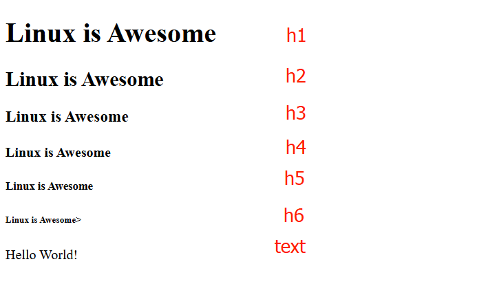

+ HTML (**HyperText Markup Language**), web sayfaları oluşturmak için kullanılan standart bir işaretleme dilidir.
+ Web tarayıcıları (Chrome, Firefox, Edge gibi) HTML kodlarını yorumlayarak görsel ve etkileşimli web sayfalarına dönüştürür.
+ Günümüzde **HTML5** sürümü kullanılmaktadır ve multimedya (video, ses), form kontrolleri ve semantik etiketler (`<header>`, `<article>`, `<footer>`) gibi modern özellikler içerir.


> [!NOTE]
> **HTML'nin Temel Özellikleri:**
> 1. **Etiket (Tag) Tabanlıdır**: `<html>`, `<head>`, `<body>`, `<p>` gibi etiketlerle yapılandırılır.
> 	- Örnek: `<p>Bu bir paragraftır.</p>`
> 2. **Hipermetin Desteği**: Bağlantılar (`<a>` etiketi) ile diğer sayfalara veya kaynaklara link verilebilir.
> 	- Örnek: `<a href="https://www.google.com">Google'a Git</a>`
> 3. **Platform Bağımsızdır**: Tüm işletim sistemleri ve tarayıcılarla uyumludur.
> 4. **Dinamik İçerik**: JavaScript ve CSS ile etkileşimli ve stilize sayfalar oluşturulabilir.


> [!NOTE]
> **HTML Ne Değildir?**
> + Bir programlama dili **değildir** (JavaScript'ten farklı olarak).
> + Tek başına tasarım (CSS) veya dinamik işlevler (JavaScript) sağlamaz, ancak onlarla entegre çalışır.

# HTML5 nedir?

+ HTML5, **HyperText Markup Language (HTML)**'in en son büyük sürümüdür ve web sayfalarının oluşturulması için kullanılan bir işaretleme dilidir.
+ HTML5, önceki HTML sürümlerine göre daha gelişmiş özellikler sunar ve modern web uygulamaları geliştirmeyi kolaylaştırır.

## HTML5'in Özellikleri:
1. **Yeni Semantik Etiketler:**
	+ `<header>`, `<footer>`, `<article>`, `<section>`, `<nav>` gibi etiketler, web sayfalarının yapısını daha anlamlı hale getirir.
2. **Multimedya Desteği:**
	+ `<audio>` ve `<video>` etiketleri sayesinde, harici eklentilere (örneğin, Flash) gerek kalmadan ses ve video oynatma imkanı sağlar.
3. **Canvas ve SVG Desteği:**
	+ `<canvas>` etiketi ile dinamik grafikler ve animasyonlar oluşturulabilir.
	+  **SVG (Scalable Vector Graphics)** desteği ile ölçeklenebilir vektör grafikleri kullanılabilir.
4. **Daha Gelişmiş Form Elemanları:**
	+ Yeni giriş türleri: `<input type="email">`, `<input type="date">`, `<input type="range">` gibi yeni form elemanları gelir.
5. **Yerel Depolama (Local Storage ve Session Storage):**
	+ **localStorage** ve **sessionStorage**, çerezlere (cookies) alternatif olarak veri saklamak için kullanılır.
6. **Daha İyi Javascript API Desteği:**
	+ **Geolocation API**: Kullanıcının konumunu belirleyebilir.
	+ **Drag and Drop API**: Sürükle-bırak işlemleri için destek sunar.
	+ **WebSockets**: Gerçek zamanlı iletişim için daha hızlı bir bağlantı sağlar.

# HTML Taslağı:

```html
<!DOCTYPE html>

<html>
    <head>
        <title>
            İlk Sayfam
        </title>
    </head>
    <body>
        Hello World!
    </body>
</html>
```

**`<!DOCTYPE html>`**
+ **Ne işe yar?** Belgenin bir **HTML5** dosyası olduğunu tarayıcıya bildirir.
+ **Detay:** Eski HTML sürümlerinde (ör. HTML4) daha karmaşıktı, HTML5 ile bu basit hale geldi.
---
**`<html>...</html>`**
+ **Ne işe yar?** Tüm HTML içeriğini sarmalayan kök (root) elementtir.
+ **`lang` eklenebilir:** Örneğin `<html lang="tr">` sayfanın Türkçe olduğunu belirtir (SEO ve erişilebilirlik için faydalıdır).
---
**`<head>...</head>`**
+ **Ne işe yar?** Sayfanın **görünmeyen** teknik bilgilerini (meta veriler, başlık, CSS/JS bağlantıları) içerir.
+ **Önemli:** Bu kısımda yazılanlar tarayıcıda **görüntülenmez** (`<title>` hariç).
---
**`<title>...</title>`**
+ **Ne işe yarar?** Tarayıcı sekmesinde veya pencerenin başlık çubuğunda görünen metni belirler.
+ **SEO için kritik:** Arama motorları bu metni sayfanın içeriği olarak değerlendirir.
---
**`<body>...</body>`**
+ **Ne işe yarar?** Tarayıcıda **görünen** tüm içerik (metin, resim, videolar vb.) buraya yazılır.


> [!NOTE]
> **Kapama Etiketleri (`</html>`, `</head>`, `</body>`)**
> + **Ne işe yarar?** Açılan her etiketin kapatılması gerekir (HTML5 bazı durumlarda esneklik sağlar, ancak kapatmak en iyi uygulamadır)


> [!TIP]
> + **Boşluklar:** HTML'de fazla boşluk/enterler tarayıcı tarafından **tek boşluk** olarak yorumlanır. Örneğin `Hello World!` arasında 100 boşluk bıraksanız bile tarayıcı 1 boşluk gösterir.
> + **Türkçe Karakterler:** Sayfada Türkçe karakter (ğ, ü, ş vb.) kullanacaksanız `<head>` içine şu meta etiketi eklemelisiniz:
> ```html
> <meta charset="UTF-8">
> ```

# Başlık(header) etiketi:

+ HTML'de başlıklar, **metin içeriğini hiyerarşik olarak düzenlemek** için kullanılan etiketlerdir.
+ Özellikle sayfa yapısını belirlemek, okunabilirliği artırmak ve SEO (Arama Motoru Optimizasyonu) için kritik öneme sahiptirler.

## HTML Başlık Etiketleri(Heading Tags):

+ 6 farklı seviyeden oluşur (`<h1>` en önemli, `<h6>` en az önemli):

|Etiket|Açıklama|Görsel Boyut (Varsayılan)|
|---|---|---|
|`<h1>`|**Ana başlık** (Sayfada genellikle **1 tane** olmalı, SEO için en önemli)|Çok büyük (24px-32px)|
|`<h2>`|Alt başlık (Bölümler)|Büyük (18px-24px)|
|`<h3>`|Alt-alt başlık|Orta (16px-18px)|
|`<h4>`|Daha küçük başlık|Küçük (14px-16px)|
|`<h5>`|Nadiren kullanılır|Daha küçük (12px-14px)|
|`<h6>`|En küçük başlık (Genellikle dipnotlar)|Çok küçük (10px-12px)|

```html
<!DOCTYPE html>

<html>
    <head>
        <meta charset="UTF-8">
        <title>
            İlk Sayfam
        </title>
    </head>
    <body>
        <h1>Linux is Awesome</h1>
        <h2>Linux is Awesome</h2>
        <h3>Linux is Awesome</h3>
        <h4>Linux is Awesome</h4>
        <h5>Linux is Awesome</h5>
        <h6>Linux is Awesome></h6>
        Hello World!
    </body>
</html>
```

**Çıktı:**

# Paragraf Etiketi:

+ HTML'de **`<p>`** (paragraph/paragraf) etiketi, metin içeriğini **paragraf** olarak düzenlemek için kullanılan temel bir blok-level elementidir.
+ Tarayıcılar, `<p>` etiketi içindeki metni otomatik olarak bir paragraf şeklinde (alt ve üst boşluk bırakarak) gösterir.

```html
<!DOCTYPE html>

<html>
    <head>
        <meta charset="UTF-8">
        <title>
            İlk Sayfam
        </title>
    </head>
    <body>
	    <!-- Paragraph Tag -->
        <p>Bu bir paragraf örneğidir. HTML'de metinleri düzenli bloklar halinde göstermek için kullanılır.</p>
    </body>
</html>
```

**Çıktı:**


> [!NOTE]
> + html de yorum satırı kullanmak için `<!-- Html yorum satırı -->` kullanılır.

## Paragraf Etiketin Özelikleri:

1. **Block-Level Element:**
	+ `<p>` bir satırın tamamını kaplar (yanına başka içerik gelmez, `<span>` gibi inline elementlerden farklıdır).
2. **Otomatik Boşluk:**
	+ Tarayıcılar `<p>` etiketinin öncesine ve sonrasına **margin** ekler (varsayılan CSS: `margin-top: 1em; margin-bottom: 1em;`).
3. **İç İçe Kullanım(nested):**
	+ `<p>` içine başka bir `<p>` **konulamaz** (geçersiz HTML). Ancak diğer etiketler (ör. `<strong>`, `<a>`) eklenebilir:
	```html
	<p> Bir bir <strong>kalın</strong> metin</p>
	```
4. **Semantik Anlam:**
	+ Metnin bir "paragraf" olduğunu tarayıcıya ve arama motorlarına bildirir (erişilebilirlik ve SEO için önemli).


> [!CAUTION]
> **Yaygın Hatalar:**
> - **`<p>` İçine Blok-Level Element Koymak:**
> 	+ Yanlış: `<p><div>Bu div geçersizdir</div></p>`
> 	+ Doğru: `<div><p>Bu paragraf div içinde olabilir</p></div>`


## `<p>` vs `<div>` Farkı:

|Özellik|`<p>`|`<div>`|
|---|---|---|
|**Anlam**|Semantik (paragraf)|Genel amaçlı blok|
|**Varsayılan Stil**|Alt/üst boşluklu|Boşluksuz|
|**Kullanım**|Metin parçaları için|Layout veya gruplama için|

# Hyperlink:

+ Hyperlink (veya **bağlantı**), kullanıcıları bir web sayfasından diğerine, bir dosyaya, e-posta adresine veya sayfa içindeki bir bölüme yönlendiren tıklanabilir öğelerdir.
+ HTML'de `<a>` (anchor) etiketi ile oluşturulur.

##  Önemli Özellikler (Attributes):

+ **Attribute** (öznitelik), HTML etiketlerine **ek özellikler** eklemek için kullanılan yapılardır.
+ Etiketlerin davranışını, görünümünü veya içeriğini kontrol etmeye yararlar.

|Özellik|Açıklama|Örnek Kullanım|
|---|---|---|
|`href`|Hedef URL'yi belirtir (zorunlu).|`href="https://example.com"`|
|`target`|Bağlantının nerede açılacağını belirtir.|`target="_blank"` (yeni sekmede)|
|`title`|Fare üzerine gelindiğinde tooltip gösterir.|`title="Açıklama metni"`|
|`rel`|Güvenlik ve SEO için (ör. `rel="nofollow"`).|`rel="noopener noreferrer"`|
|`download`|Dosyayı indirmeye zorlar.|`download="dosya_adi.pdf"`|
## Örnek 1: Başka bir Sayfaya Link

```html
<html lang=tr>
    <head>
        <meta charset="UTF-8">
        <title>
            İlk Sayfam
        </title>
    </head>
    <body>
        <a href="https://www.youtube.com"
           target="_blank" title="Youtube'a gider"
           >youtube</a>
    </body>
</html>
```

> **Explanation:**
> +  Burada `href` ve `target`, `<a>` etiketinin **attribute**'larıdır.
> + `href="https://www.youtube.com"`: Bağlantıya tıklandığında youtube adresine gider. 
> + `target="_blank"`: bağlantının yeni sekmede açmasını sağlar. 

**Çıktı:**


## Örnek 2: Bir html sayfasından başka html sayfasına

**index.html**
```html
<!DOCTYPE html>

<html lang=tr>
    <head>
        <meta charset="UTF-8">
        <title>
            İlk Sayfam
        </title>
    </head>
    <body>
        <a href="linux.html"
           target="_blank" title="Linux Distros"
           >Linux Distros</a>
    </body>
</html>
```

**linux.html**
```html
<!DOCTYPE html>

<html lang=tr>
    <head>
        <meta charset="UTF-8">
        <title>Linux Distro</title>
    </head>
    <body>
        <h1>Best Linux Distros</h1>
        <p>Debian</p>
        <p>Ubuntu</p>
        <p>Arch Linux</p>
        <p>Gentoo</p>
        <p>Slackware</p>
    </body>
</html>
```
> **Explanation:**
> + `Linux Distros` bağlantısını tıkladığımızda tarayıcı `linux.html` sayfasını yeni sekmede açacaktır. 

# Resim(image) etiketi:

+ **``** etiketi, bir HTML sayfasına **resim** eklemek için kullanılan **self-closing** (kapanış etiketi olmayan) bir etikettir.
+ Web sayfalarında görsel içerik göstermenin temel yoludur.

##  Önemli Özellikler (Attributes):

| Attribute        | Açıklama                                                                                                                          | Örnek Kullanım             |
| ---------------- | --------------------------------------------------------------------------------------------------------------------------------- | -------------------------- |
| `src`            | Resmin kaynak yolunu belirtir (yerel dosya veya internet URL'si).                                                                 | `src="images/logo.png"`    |
| `alt`            | Resmin alternatif metni (SEO ve erişilebilirlik için zorunlu).                                                                    | `alt="Company Logo"`       |
| `width`/`height` | Resmin genişlik ve yüksekliği (piksel veya % cinsinden).                                                                          | `width="200" height="100"` |
| `title`          | Fare üzerine gelindiğinde gösterilen açıklama.                                                                                    | `title="Detaylı bilgi"`    |
| `loading`        | Resmin yüklenme davranışı (`lazy` ile performans optimizasyonu). Sayfa kaydırıldıkça resim yüklenir (ilk yükleme hızını artırır). | `loading="lazy"`           |
| `srcset`         | DPI veya ekran boyutuna göre farklı resimler belirtme (responsive).                                                               | `srcset="resim-2x.jpg 2x"` |

**index.html:**
```html
<!DOCTYPE html>

<html lang=tr>
    <head>
        <meta charset="UTF-8">
        <title>
            İlk Sayfam
        </title>
    </head>
    <body>
        
    </body>
</html>
```
> **Explanation:**
> + **`src` (source):** Resmin dosya yolunu veya URL'sini belirtir (_zorunlu_).
> + **`alt` (alternate text):** Resim yüklenmezse veya ekran okuyucular için açıklama metni (_erişilebilirlik ve SEO için kritik_).
> + Genellikle resim dosyaları images adını verdiğimiz klasöre koyulur.

**HTML Dizin:**
```shell
nginx-tutorial3 :: www/html/HTML » ls -ltr
```

```shell
total 28
-rw-r--r-- 1 root     root     18328 Feb 25  2022 linux.jpg
-rw-r--r-- 1 root     root       282 Mar 31 22:18 linux.html
-rw-r--r-- 1 www-data www-data   200 Mar 31 23:55 index.html
```
> **Explanation:**
> + `ls -ltr` komut çıktısında görüldüğü üzeri `index.html` ile `linux.png` dosyaları aynı klasörde olduğuna dikkat ediniz.
> + `linux.jpg` resim dosyası yerine istediğiniz resmi kullanabilirsiniz.

# Ses(Audio):

+ **`<audio>`** etiketi, bir web sayfasına **ses dosyası** (müzik, podcast, efekt vb.) eklemek için kullanılan HTML5 elementidir. 
+ Kullanıcıların sesi oynatmasını, duraklatmasını ve ses seviyesini kontrol etmesini sağlar.

## Önemli Özellikler (Attributes):
|Attribute|Açıklama|Örnek Kullanım|
|---|---|---|
|`controls`|Oynatma kontrollerini gösterir (play, pause, volume vb.).|`<audio controls>`|
|`src`|Ses dosyasının yolunu belirtir (alternatif: `<source>` içinde).|`<audio src="muzik.mp3">`|
|`autoplay`|Sayfa yüklendiğinde otomatik oynatır (tarayıcılar genelde engeller).|`<audio autoplay>`|
|`loop`|Sesi döngüye alır (sürekli tekrar eder).|`<audio loop>`|
|`muted`|Ses varsayılan olarak sessizdir.|`<audio muted>`|
|`preload`|Sayfa yüklenirken sesin ne kadar önceden yükleneceğini belirtir.|`<audio preload="auto">`|

## Örnek 1: Temel Kullanım

```html
<!DOCTYPE html>

<html lang=tr>
    <head>
        <meta charset="UTF-8">
        <title>
            İlk Sayfam
        </title>
    </head>
    <body>
        <audio controls>
            <source src="./alex-eglair.ogg" type="audio/ogg">
            <source src="./alex-eglair.mp3" type="audio/mpeg">
            Tarayıcınız audio etiketini desteklemiyor.
        </audio>
        
        <audio src="alex-eglair.mp3" controls>

        </audio>
    </body>
</html>
```
> **Explanation:**
> + **`<source>`** ile birden fazla format ekleyerek tarayıcı uyumluluğu sağlanır (MP3, OGG, WAV). Eğer tarayıcınız  `source` etiketi ile belirtilen `ogg` formatı desteklemez ise bir sonraki `source` etiketinde bulunan `mp3` formatını çalıştır. 

**Çıktı:**


> [!NOTE]
> **Yaygın Hatalar:**
> 1. *Format Uyumsuzluğu*:  Tüm tarayıcılar MP3'ü destekler, ancak OGG/WAV için ek `<source>` eklemek gerekebilir.
> 	```html
> 	<source src="muzik.ogg" type="audio/ogg">
> 	<source src="muzik.wav" type="audio/wav">
> 	```
> 2. *`autoplay` Çalışmaması*: Modern tarayıcılar, otomatik oynatmayı **kullanıcı etkileşimi olmadan engeller**.


> [!TIP]
> 1. **Performans için `preload`:**
> 	+ `preload="none"`: Sayfa yüklenirken ses dosyasını yüklemez.
> 	+ `preload="metadata"`: Sadece süre gibi bilgileri yükler.
> 	+ `preload="auto"`: Dosyayı önceden yükler (dikkatli kullanın, bant genişliği tüketir).
> 1. **Tarayıcı Desteği:**
> 	+ MP3 (`audio/mpeg`) -> Tüm tarayıcılar.
> 	+ OGG (`audio/ogg`) -> Firefox, Chrome.
> 	+ WAV (`audio/wav`) -> Yüksek kalite, ancak büyük dosya boyutu.

## Örnek 2: Otomatik Oynatma

```html
<!DOCTYPE html>

<html lang=tr>
    <head>
        <meta charset="UTF-8">
        <title>
            İlk Sayfam
        </title>
    </head>
    <body>
        <audio controls autoplay muted loop>
            <source src="./alex-eglair.mp3" type="audio/mpeg">
            Tarayıcınız audio etiketini desteklemiyor.
        </audio>
        <br>
        <audio src="alex-eglair.mp3" controls>

        </audio>
    </body>
</html>
```

**Çıktı:**


> **Explanation:**
> + Firefox gibi tarayıcılar `autoplay`'i sadece `muted` ile çalıştırır (kullanıcı deneyimi için kısıtlamalar vardır).
> + Chrome temeli tarayıcılar `autoplay` çalışmasını engellemektedir.
> + Yukarıdaki görsel firefox tarayıcısından alınmıştır.

## Örnek 3: Video yükleme davranışı:

+ HTML'deki `<audio>` etiketinde kullanılan `preload` attribute'ü, tarayıcıya ses dosyasını nasıl önceden yüklemesi gerektiğini belirtir.
+ Bu attribute, ağ ve bellek kullanımını optimize etmek için kullanılır.


> [!NOTE]
> **`preload` Değerleri:**
> 1. `none`: Tarayıcı ses dosyasını hiç önceden yüklemez. Kullanıcı `play` butonuna basana kadar ses dosyası indirilmez.
> 2. `metadata`: Sadece dosyanın temel bilgileri (ör. uzunluk, codec bilgisi) yüklenir, ancak ses içeriği indirilmez.
> 3. `auto`: Tarayıcı ses dosyasını tamamen önceden yükleyebilir. Bu, sayfa yüklendiğinde ses dosyasının tamamının indirilmesine neden olabilir.
> 4. (Varsayılan - `preload` belirtilmezse): Tarayıcı kendi kararına göre en uygun yükleme yöntemini seçer.

#### 3.1. `preload=none`

```html
<!DOCTYPE html>

<html lang=tr>
    <head>
        <meta charset="UTF-8">
        <title>
            İlk Sayfam
        </title>
    </head>
    <body>
        <audio controls preload="none">
            <source src="./alex-eglair.mp3" type="audio/mpeg">
            Tarayıcınız audio etiketini desteklemiyor.
        </audio>
    </body>
</html>
```

**Çıktı:**

> **Explanation:**
> + Tarayıcıdan da görüldüğü üzeri tarayıcı her hangi bir ön yükleme yapmamıştır.

#### 3.2. `preload="auto"`

```html
<audio controls preload="auto">
    <source src="./alex-eglair.mp3" type="audio/mpeg">
    Tarayıcınız audio etiketini desteklemiyor.
</audio>
```

**Çıktı:**


> **Explanation:**
> Tarayıcı çıktısından görüldüğü üzeri ses dosyası ve gereken her şey öncesinde yüklenmiş olduğu görünmektedir.

#### 3.3. `preload=metadata`

```html
<audio controls preload="metadata">
    <source src="./alex-eglair.mp3" type="audio/mpeg">
    Tarayıcınız audio etiketini desteklemiyor.
</audio>
```

**Çıktı:**

> **Explanation:**
> + Eğer `auto` ile karşılaştırsak sadece dosyanın temel bilgileri (ör. uzunluk, codec bilgisi) yüklenir, ancak ses içeriği yüklenmediğini görebiliriz.


#### 3.4. preload belirtilmezse
+ Eğer `<audio>` etiketinde `preload` attribute'ü belirtilmezse, tarayıcı kendi stratejisine göre en uygun ön yükleme yöntemini seçer.
+ Ancak bu seçim, tarayıcıya ve hatta kullanıcının internet bağlantı hızına bağlı olarak değişebilir.

> [!NOTE]
> **Ne Olur?**
> + Çoğu modern tarayıcı **"preload=metadata"** gibi davranır, yani sadece ses dosyasının uzunluğu ve diğer metadata bilgileri yüklenir ama içeriğin tamamı indirilmez.
> + Bazı tarayıcılar ve durumlara bağlı olarak, tarayıcı **hiçbir şey yüklemeyebilir (preload="none" gibi davranabilir)** ya da ses dosyasının tamamını yükleyebilir (**preload="auto" gibi davranabilir**).
> + Mobil tarayıcılar genellikle bant genişliği tasarrufu yapmak için **"preload=none"** tercih eder.

## `<audio>` vs `<video>` Farkı:
| Özellik           | `<audio>`                          | `<video>`                              |
| ----------------- | ---------------------------------- | -------------------------------------- |
| **Kullanım**      | Sadece ses dosyaları.              | Ses + görüntü.                         |
| **Attribute'lar** | `controls`, `loop`, `muted` ortak. | Ek olarak `poster`, `width`, `height`. |
| **Örnek**         | Müzik çalar, podcast.              | Film, eğitim videosu.                  |

## `src` vs `<source>` Farkı:

| Özellik               | `<audio src="...">`                              | `<audio><source></audio>`         |
| --------------------- | ------------------------------------------------ | --------------------------------- |
| **Çoklu Format**      | ❌ Tek dosya                                      | ✅ Birden fazla format eklenebilir |
| **Hata Mesajı**       | ❌ Yok (boş player)                               | ✅ Özel mesaj yazılabilir          |
| **MIME Tip Belirtme** | ❌ Otomatik algılanır (hatalara açık)             | ✅ `type` ile kesin belirtilir     |
| **Kod Kısalığı**      | ✅ Daha kısa                                      | ❌ Daha uzun                       |
| **Tarayıcı Desteği**  | ⚠️ Sadece belirtilen dosya çalışmazsa hata verir | ✅ En uygun formatı seçer          |

### 1. Doğrudan `src` Kullanımı(Kısa Yol):

```html
<audio src="alex-eglair.mp3" controls></audio>
```
> **Explanation:**
> + *Avantajlar:*
> 	- *Basitlik*: Tek satırda hızlıca ses dosyası ekler.
> 	- *Kısa Kod* : Küçük projeler veya tek format kullanılan durumlar için idealdir.
> + *Dezavantajlar*:
> 	- *Tek  format desteği*: Tarayıcı dosyayı oynatamazsa yedek seçenek sunmaz.
> 	- *Erişilebilirlik eksikliği:* Desteklenmeyen tarayıcılarda sadece boş bir player gösterir(Hata mesajı yok).

### 2. `<source>` Etiketi Kullanımı(Profesyonel Yöntem):

```html
<audio controls>
  <source src="./alex-eglair.mp3" type="audio/mpeg">
  Tarayıcınız audio etiketini desteklemiyor.
</audio>
```
> **Explanation:**
> + *Avantajlar:*
> 	- *Çoklu format desteği:* Birden fazla `<source>` ekleyerek tarayıcı uyumluluğu sağlarsınız
> 	- *Hata yönetimi:* Tarayıcı desteklemiyorsa veya dosya bulunamaz ise alternatif metin gösterir.
> 	- *Net MIME tipi:* `type="audio/mpeg` ile tarayıcıya dosya türünü belirtir(performans avantajı).
> + *Dezavantajı:*
> 	- *Uzun Kod:* Basit senaryolarda gereksiz gelebilir.


# Video:

+ **`<video>`** etiketi, bir web sayfasına **video içeriği** eklemek için kullanılan HTML5 elementidir.
+ Kullanıcıların videoyu oynatmasını, duraklatmasını, sesini kontrol etmesini ve tam ekran yapmasını sağlar.

## Önemli Özellikler(Attributes):

|**Attribute**|**Açıklama**|**Örnek**|
|---|---|---|
|`src`|Video dosyasının yolu (alternatif: `<source>` içinde kullanılır).|`src="film.mp4"`|
|`controls`|Oynatma kontrollerini gösterir (play, ses, tam ekran vb.).|`<video controls>`|
|`width` / `height`|Videoyu belirtilen boyutta gösterir (CSS ile de ayarlanabilir).|`width="800" height="450"`|
|`autoplay`|Sayfa yüklendiğinde otomatik oynatır (tarayıcılar genelde sesi kapalı ister).|`<video autoplay muted>`|
|`loop`|Videoyu döngüye alır (sürekli tekrar eder).|`<video loop>`|
|`muted`|Varsayılan olarak sesi kapalı başlatır.|`<video muted>`|
|`poster`|Video yüklenmeden önce gösterilecek resim (thumbnail).|`poster="resim.jpg"`|
|`preload`|Videoyu önceden yükler (`auto`, `metadata`, `none`).|`preload="metadata"`|

## Örnek 1:  

```html
<!DOCTYPE html>

<html lang=tr>
    <head>
        <meta charset="UTF-8">
        <title>
            İlk Sayfam
        </title>
    </head>
    <body>
	    <!-- Kısa Yöntem -->
        <video src="Linux_Find.mkv" width="500px"
            controls autoplay>
        </video>
        <br>
        <!-- Profesiyonel Yöntem -->
        <video controls width="500px" autoplay muted>
	        <!-- Firefox mkv uzantısını desteklemiyor -->
            <source src="Linux_Find.mkv" type="video/webm">
            <!-- Firefox mp4 uzantısını destekliyor --> 
            <source src="Go_prog.mp4" type="video/mp4">
        </video>
    </body>
</html>
```

**Çıktı:**

> **Explanation:**
> + Kısa yol(`src`) ile Profesyonel Yöntem(`<source>`) arasında fark görülmüyor ama bazı tarayıcılar bazı uzantıları desteklememektedir.
> + `audio` etiketi de olduğu gibi Profesyonel yöntem ile ek  format uzantılı dosyalar ekleyebiliriz. Böylece tarayıcı formatı desteklemez ise bir sonraki formatı çalıştır. 
> + Yani, **`<source>`** ile birden fazla format ekleyerek tarayıcı uyumluluğu sağlanır (MP4, WebM, OGG).


> [!NOTE]
> 1. **Format Uyumsuzluğu:** Tüm tarayıcılar MP4'ü destekler, ancak WebM/OGG için ek `<source>` eklemek gerekebilir.
> 	```html
> 	<source src="Linux_Find.mkv" type="video/webm">
> 	<source src="Go_prog.mp4" type="video/mp4">
> 	```
> 2. **`autoplay` Çalışmaması:** Modern tarayıcılar, otomatik oynatmayı **kullanıcı etkileşimi olmadan engeller** (özellikle sesli videolarda).
> 3. **Erişilebilirlik Eksikliği:** Video içeriği için **altyazı** (`<track>` etiketi) eklemeyi unutmayın:
> 	```html
> 	<track src="altyazi.vtt" kind="subtitles" srclang="tr" label="Türkçe">
> 	```


**Destekleyen Video Formatları:**

|**Format**|**MIME Type**|**Tarayıcı Desteği**|
|---|---|---|
|MP4|`video/mp4`|Tüm modern tarayıcılar (H.264).|
|WebM|`video/webm`|Firefox, Chrome, Edge.|
|OGG|`video/ogg`|Firefox, Opera (eski sürümler).|

## Örnek 2: Otomatik Oynatma

```html
<!DOCTYPE html>

<html lang=tr>
    <head>
        <meta charset="UTF-8">
        <title>
            İlk Sayfam
        </title>
    </head>
    <body>
        <video controls width="500px" autoplay muted>
            <source src="Go_prog.mp4" type="video/mp4">
        </video>
    </body>
</html>
```

> **Explanation:**
> + `autoplay` ve `muted` attribute'leri ile sayfa yüklendiğinde video otomatik olarak başlıyor.
> + Chrome ve Firefox gibi tarayıcılar `autoplay`'i sadece `muted` ile çalıştırır.

## Örnek 4:  Döngü

```html
<!DOCTYPE html>

<html lang=tr>
    <head>
        <meta charset="UTF-8">
        <title>
            İlk Sayfam
        </title>
    </head>
    <body>
	    <!-- loop: Video bittiğinde tekrardan başlar -->
        <video controls width="500px" autoplay muted loop>
            <source src="Linux_Find.mkv" type="video/webm">
            <source src="Go_prog.mp4" type="video/mp4">
        </video>
    </body>
</html>
```
> **Explanation:**
> + `autoplay` ve `muted` attribute'lerini kullanmaksızın da `loop` attribute'ü kullanılır ama genellikle bu üç attribute birlikte kullanılır.

## `preload` attribute:

| Değer      | Ne yapar?                               | Ne zaman kullanılır?                                        |
| ---------- | --------------------------------------- | ----------------------------------------------------------- |
| `none`     | Hiçbir şey yüklemez                     | Veri tasarrufu isteniyorsa                                  |
| `metadata` | Sadece video bilgilerini yükler         | Süre/thumbnail göstermek ama içeriği indirmemek isteniyorsa |
| `auto`     | Gerekirse tamamını bile önceden indirir | Video büyük ihtimalle oynatılacaksa                         |
### Örnek 5: `preload="none"`

+ Video hiç önceden yüklenmez.
+ **Ne zaman kullanılır?** Kullanıcı oynat butonuna basmadan video yüklenmesin istiyorsanız.

```html
<!DOCTYPE html>

<html lang=tr>
    <head>
        <meta charset="UTF-8">
        <title>
            İlk Sayfam
        </title>
    </head>
    <body>
        <video controls width="500px" preload="none">
            <source src="Linux_Find.mkv" type="video/webm"> <!-- 1.Durum -->
            <source src="Go_prog.mp4" type="video/mp4"> <!-- 2.Durum -->
        </video>
    </body>
</html>
```
> **Explanation:**
> + Eğer tarayıcı 1.Durum'u desteklemez ise 2.Durumu çalıştırır. Çünkü tüm tarayıcılar `mp4` formatını destekler.


**Çıktı:**


> **Explanation:**
> + Çıktıda da gördüğümüz gibi video ne indirilmiş ne de yüklenmiştir. Çünkü, `preload="none"` olarak ayarlanmıştır.

### Örnek 6: `preload="metadata"`

+ **Ne zaman kullanılır?** Video hakkında bilgi göstermek istiyor ama içeriği hemen indirmek istemiyorsanız.

```html
<!DOCTYPE html>

<html lang=tr>
    <head>
        <meta charset="UTF-8">
        <title>
            İlk Sayfam
        </title>
    </head>
    <body>
        <video controls width="500px" preload="metadata">
            <source src="Linux_Find.mkv" type="video/webm">
            <source src="Go_prog.mp4" type="video/mp4">
        </video>
    </body>
</html>
```

**Çıktı:**


> **Explanation:**
> + Bu çıktı da görüldüğü üzeri video'un sadece temel bilgiler(süre, çözünürlük gibi) yüklenir. *İçerik indirilmez.*

### Örnek 7: `preload="auto"`

+ **Ne zaman kullanılır?** Kullanıcının videoyu oynatma ihtimali yüksekse ve akıcı bir deneyim isteniyorsa.

```html
<!DOCTYPE html>

<html lang=tr>
    <head>
        <meta charset="UTF-8">
        <title>
            İlk Sayfam
        </title>
    </head>
    <body>
        <video controls width="500px" preload="auto">
            <source src="Linux_Find.mkv" type="video/webm">
            <source src="Go_prog.mp4" type="video/mp4">
        </video>
    </body>
</html>
```

**Çıktı:**


> **Explanation:**
> + Tarayıcı videonun ne kadarını önceden yükleyeceğine kendi karar verir. Hatta tamamını da indirebilir.
> + Video ortalarına hızlıca gittiğimizde bekleme olmadığını gözlemleyebilirsiniz.

### Örnek 8: `preload` belirtilmezse

+ Tarayıcı **kendi varsayılanına göre davranır.**
+ Genellikle `preload="metadata"` gibi davranır ama bu, cihaz ve tarayıcıya göre değişebilir.
-  Mobil tarayıcılar genellikle veri tasarrufu için **hiçbir şey yüklememeyi** tercih eder (yani `none` gibi davranır).

## Özet:
- `<video>` etiketi, **web sayfalarına video eklemenin standart yoludur**.
- **`controls`** ile kullanıcı etkileşimi sağlanır.
- Çoklu format desteği için **`<source>`** kullanın.
- Otomatik oynatma (`autoplay`) için **`muted`** gerekebilir.
- Mobil uyumluluk için **CSS ile boyutlandırma** yapın.

## Metin Biçimlendirme:

```html
<!DOCTYPE html>

<html lang=tr>
    <head>
        <meta charset="UTF-8">
        <title>
            İlk Sayfam
        </title>
    </head>
    <body>
        <p>Bu Normal Bir Yazı</p>
        <p>Bu <b>Kalın</b> Bir Yazı</p>
        <p>Bu <strong>Kalın</strong> Bir Yazı</p>
        <p>Bu <i>İtalik</i> Bir Yazı</p>
        <p>Bu <em>İtalic</em> Bir Yazı</p>
        <p>Bu <big>Büyük</big> Bir Yazı</p>
        <p>Bu <small>Küçük</small> Bir Yazı</p>
        <p>Bu <sub>Alt Sembol</sub> Bir Yazı</p>
        <p>Bu <sup>Üst Sembol</sup> Bir Yazı</p>
        <p>Bu <ins>Altı Çizili</ins> Bir Yazı</p>
        <p>Bu <del>Üstü Çizili</del> Bir Yazı</p>
        <p>Bu <mark>Fosforlu</mark> Bir Yazı</p>
    </body>
</html>
```

**Çıktı:**


### 1. `<b>` ve `<strong>` Etiketleri Arasındaki Farklar:

+ `<b>` ve `<strong>` etiketleri her ikisi de metni kalın (bold) göstermek için kullanılsa da, temel farkları vardır.

**Semantik(Anlamsal) Fark**

|`<b>` Etiketi|`<strong>` Etiketi|
|---|---|
|**Sadece görsel kalınlaştırma** yapar|**Metne güçlü vurgu/anlam** katar|
|Semantik önemi yoktur|Semantik önemi vardır|
|Sadece biçimlendirme amaçlıdır|İçeriğin önemini belirtir|
|Ekran okuyucular için fark yaratmaz|Ekran okuyucular vurguyu farklı okuyabilir|

### 2. `<i>` ve `<em>` Etiketleri Arasındaki Farklar:

+ `<i>` ve `<em>` etiketleri her ikisi de metni italik (eğik) göstermek için kullanılsa da, temel farkları vardır.

**Semantik(Anlamsal) Fark:**

|`<i>` Etiketi|`<em>` Etiketi|
|---|---|
|**Sadece görsel italikleştirme** yapar|**Metne vurgu/anlam** katar|
|Semantik önemi yoktur|Semantik önemi vardır|
|Sadece biçimlendirme amaçlıdır|İçeriğin vurgulanmasını sağlar|
|Ekran okuyucular için fark yaratmaz|Ekran okuyucular vurguyu farklı tonlama ile okuyabilir|

# Listeler:

+ HTML'de listeler, web sayfalarında bilgileri düzenli ve okunabilir bir şekilde sunmak için kullanılan temel bir yapıdır. Üç ana liste türü bulunur:
## 1. Sırasız Liste(Unordered Lists):

+ Öğelerin belirli bir sırası önemli olmadığında kullanılır.
+ Her bir liste öğesi genellikle bir madde işareti (disk, daire, kare vb.) ile işaretlenir.
+ `<ul>` etiketi listenin başlangıcını ve `</ul>` etiketi listenin sonunu belirtir.
+ Her bir liste öğesi `<li>` (list item) etiketi içine alınır.

### Örnek 1: Temel Kullanım

```html
<!DOCTYPE html>

<html lang=tr>
    <head>
        <meta charset="UTF-8">
        <title>
            İlk Sayfam
        </title>
    </head>
    <body>
        <h1>Popüler Programlama Dilleri:</h1>
        <ul>
            <li>Python</li>
            <li>Javascript</li>
            <li>Python</li>
            <li>java</li>
            <li>C programlama</li>
        </ul>
    </body>
</html>
```

**Çıktı:**


### Örnek 2: `style Attribute`

+ CSS ile madde işaretlerinin görünümünü değiştirebilirsiniz:

```html
<ul style="list-style-type: disc;"> <!-- Varsayılan (dolu daire) -->
  <li>Disk stili</li>
</ul>

<ul style="list-style-type: circle;"> <!-- İçi boş daire -->
  <li>Çember stili</li>
</ul>

<ul style="list-style-type: square;"> <!-- Kare -->
  <li>Kare stili</li>
</ul>

<ul style="list-style-type: none;"> <!-- İşaretsiz -->
  <li>İşaretsiz</li>
</ul>
```

### Örnek 3: nested list

+ Sırasız listeleri **iç içe(nested)** kullanabilirsiniz:

```html
<!DOCTYPE html>

<html lang=tr>
    <head>
        <meta charset="UTF-8">
        <title>
            İlk Sayfam
        </title>
    </head>
    <body>
        <h1>Popüler Programlama Dilleri:</h1>
        <ul>
            <li>Linux OS
                <ul>
                    <li>Ubuntu</li>
                    <li>Arch Linux</li>
                    <li>Fedora</li>
                </ul>
            </li>
            <li>Windows</li>
            <li>Mac OS</li>
        </ul>
    </body>
</html>
```

## 2. Sıralı Liste(Ordered Lists ):

+ Sıralı listeler, numaralı veya belirli bir sıraya göre düzenlenmiş listeler oluşturmak için kullanılır.
+ Her liste öğesi `<li>` (list item) etiketi ile tanımlanır.

### Örnek 1: Temel Kullanım

```html
<!DOCTYPE html>

<html lang=tr>
    <head>
        <meta charset="UTF-8">
        <title>
            İlk Sayfam
        </title>
    </head>
    <body>
        <h1>Best Operating System:</h1>
        <ol>
            <li>Ubuntu</li>
            <li>Manjora</li>
            <li>Fedora</li>
            <li>Linux Mint</li>
            <li>Arch Linux</li>
        </ol>
    </body>
</html>
```

**Çıktı:**


### Örnek 2: `type` attribute Kullanımı:

```html
<!DOCTYPE html>

<html lang=tr>
    <head>
        <meta charset="UTF-8">
        <title>
            İlk Sayfam
        </title>
    </head>
    <body>
        <h1>Best Operating System:</h1>
        <ol type="A">
            <li>Ubuntu</li>
            <li>Manjora</li>
            <li>Fedora</li>
            <li>Linux Mint</li>
            <li>Arch Linux</li>
        </ol>
    </body>
</html>
```

**Çıktı:**


+ `<ol>` element'in `type attribute`'ün alabileceği seçenekleri: 

```html
<ol type="A">
  <li>Büyük harfler (A, B, C)</li>
</ol>

<ol type="a">
  <li>Küçük harfler (a, b, c)</li>
</ol>

<ol type="I">
  <li>Roma rakamları (I, II, III)</li>
</ol>

<ol type="i">
  <li>Küçük Roma rakamları (i, ii, iii)</li>
</ol>
```

### Örnek 3:  `start` attribute Kullanımı

```html
<!DOCTYPE html>

<html lang=tr>
    <head>
        <meta charset="UTF-8">
        <title>
            İlk Sayfam
        </title>
    </head>
    <body>
        <h1>Best Operating System:</h1>
        <ol start="3">
            <li>Ubuntu</li>
            <li>Manjora</li>
            <li>Fedora</li>
            <li>Linux Mint</li>
            <li>Arch Linux</li>
        </ol>
    </body>
</html>
```

> **Explanation:**
> + Liste `start` attribute sayesinde 1 ile değil 3 ile başlayacaktır. 

### Örnek 4: `reversed` attribute Kullanımı

```html
<!DOCTYPE html>

<html lang=tr>
    <head>
        <meta charset="UTF-8">
        <title>
            İlk Sayfam
        </title>
    </head>
    <body>
        <h1>Best Operating System:</h1>
        <ol reversed>
            <li>Ubuntu</li>
            <li>Manjora</li>
            <li>Fedora</li>
            <li>Linux Mint</li>
            <li>Arch Linux</li>
        </ol>
    </body>
</html>
```

> **Explanation:**
> + `reversed` attribute ile liste 1'den 6'a sıralanmayacaktır. Bunun yerine 6'dan 1'e doğru bir sıralama olacaktır.
> + `reversed` Türkçe karşılığı da *tersine çevrilmiş* 

### Örnek 5: İç İçe Sıralı Listeler

+ Sırasız listeleri iç içe(`nested list`) kullanabilirsiniz:

```html
<!DOCTYPE html>

<html lang=tr>
    <head>
        <meta charset="UTF-8">
        <title>
            İlk Sayfam
        </title>
    </head>
    <body>
        <h1>Best Operating System:</h1>
        <ol type="A">
            <li>
                Compiled Programming:
                <ol>
                    <li>C programming</li>
                    <li>Golang</li>
                    <li>Java</li>
                </ol>
            </li>
            <li>
                Interpreted Programming:
                <ul>
                    <li>Python</li>
                    <li>Javascript</li>
                    <li>PHP</li>
                </ul>
            </li>
        </ol>
    </body>
</html>
```

## 3. Açıklama Listesi:

+ Açıklama listeleri, terimleri ve onlara ait açıklamaları listelemek için kullanılan özel bir HTML listeleme yöntemidir.
+ Genellikle sözlük tarzı içerikler, tanımlamalar veya anahtar-değer çiftleri göstermek için idealdir.

### Örnek 1: Temel Kullanımı

```html
<!DOCTYPE html>

<html lang=tr>
    <head>
        <meta charset="UTF-8">
        <title>
            İlk Sayfam
        </title>
    </head>
    <body>
        <h1>Programming Languages</h1>
        <dl>
            <dt>Python</dt>
            <dd>Python is a programming language that lets you work quickly
            and integrate systems more effectively.</dd>

            <dt>Javascript</dt>
            <dd>JavaScript (JS) is a lightweight interpreted (or just-in-time compiled)
             programming language with first-class functions.</dd>
             
            <dt>PHP</dt>
            <dd>A popular general-purpose scripting language that is especially suited
             to web development.</dd>
             
            <dt>Java</dt>
            <dd>Java is a programming language and computing platform first released by 
            Sun Microsystems in 1995.</dd>
            
            <dt>Mojo</dt>
            <dd>Mojo is an innovative, high-performance programming language designed for
             writing systems-level code for AI workloads.</dd>
        </dl>
    </body>
</html>
```

**Çıktı:**


> [!NOTE]
> **Elementler ve Anlamları:**
> 1. **`<dl>`** (Description List): Açıklama listesinin ana kapsayıcısı
> 2. **`<dt>`** (Description Term): Tanımlanacak terim
> 3. **`<dd>`** (Description Details): Terimin açıklaması

### Örnek 2: Çoklu Açıklamalar

```html
<!DOCTYPE html>

<html lang=tr>
    <head>
        <meta charset="UTF-8">
        <title>
            İlk Sayfam
        </title>
    </head>
    <body>
        <h1>Programming Languages</h1>
        <dl>
            <dt>HTML</dt>
            <dd>Web sayfalarının yapısını oluşturur</dd>
            <dd>1991'de Tim Berners-Lee tarafından oluşturuldu</dd>

            <dt>JavaScript</dt>
            <dd>Web sayfalarına dinamik davranış ekler</dd>
        </dl>
    </body>
</html>
```

> **Explanation:**
> + `HTML` için iki tane açıklama mevcut iken, `JavaScript` için yalnızca bir açıklama vardır. 
> + Yani, `HTML` için çoklu açıklama yazılmıştır.

### Örnek 3: nested list

```html
<!DOCTYPE html>

<html lang=tr>
    <head>
        <meta charset="UTF-8">
        <title>
            İlk Sayfam
        </title>
    </head>
    <body>
        <h1>Programming Languages</h1>
        <dl>
            <dt>Frontend</dt>
            <dd>
                <dl>
                    <dt>HTML</dt>
                    <dd>Structure</dd>

                    <dt>CSS</dt>
                    <dd>Design</dd>

                    <dt>Progamming</dt>
                    <dd>JavaScript</dd>
                </dl>
            </dd>
        </dl>
    </body>
</html>
```

**Çıktı:**


# Tablolar:

+ Tablolar, verileri satırlar ve sütunlar halinde düzenli bir şekilde göstermek için kullanılan HTML elementleridir.
+ Temel tablo yapısı `<table>` etiketi ile oluşturulur.


> [!NOTE]
> **Tablo Elementleri:**
> 1. **`<table>`**: Tablonun ana kapsayıcısı
> 2. **`<tr>`** (Table Row): Tablo satırı
> 3. **`<th>`** (Table Header): Başlık hücresi (varsayılan olarak kalın ve ortalanmış)
> 4. **`<td>`** (Table Data): Normal veri hücresi


```html

```
